.. _paper-note-ref-chen2022-JWEIA:

.. role:: student-first-author

数值风洞 | 把相关性写进入流湍流
================================

精简版微信公众号文章：待发布

.. contents:: 本页目录
   :local:
   :depth: 2

论文信息
--------

**原文题名**：Consistency improved random flow generation method for large eddy simulation of atmospheric boundary layer

**中文题名**：面向大气边界层大涡模拟的一致性改进入流随机流场生成方法

**作者**：Lingwei Chen, Chao Li, Jinghan Wang, Gang Hu, Qingxing Zheng, Qingfeng Zhou, Yiqing Xiao

**期刊**：Journal of Wind Engineering & Industrial Aerodynamics, 229 (2022) 105147

**DOI**：https://doi.org/10.1016/j.jweia.2022.105147

**接收与出版信息**：Received 23 February 2022; Received in revised form 29 July 2022; Accepted 19 August 2022; Available online 13 September 2022.

摘要
----

真实的入流湍流是大气边界层（atmospheric boundary layer, ABL）大涡模拟（large eddy simulation, LES）获得准确结果的关键。现有合成湍流方法已经得到广泛应用，但仍存在空间相关性以及不同速度分量之间的互相关性不能被严格再现的问题。为此，论文提出了一种新的入流湍流生成（inflow turbulence generation, ITG）方法，即一致性改进随机流生成方法（consistency improved random flow generation, CIRFG）。该方法通过显式嵌入湍流特征来模拟空间相关性和不同速度分量之间的互相关性，因此可以在无需经验参数的情况下用于任意场景。同时，CIRFG 仍保持满足任意平均风速、湍流强度、频率谱、时间相关性等目标湍流特征的能力。进一步的大气边界层流场模拟表明，该方法具有良好的风剖面自维持能力。最后，通过与高层建筑绕流风洞试验结果对比，验证了该方法的准确性和可行性。

关键词
------

空间相关性；互相关性；入流湍流生成；高层建筑；大涡模拟；大气边界层。

符号与缩写
----------

论文给出了较完整的符号表。本文精解中涉及的主要符号如下，公式中的编号与原论文保持一致。

- :math:`u_i`：第 :math:`i` 个脉动速度分量，分别对应纵向 :math:`u`、横向 :math:`v`、竖向 :math:`w`。
- :math:`\mathbf{x}=(x_1,x_2,x_3)`：空间坐标，分别对应 :math:`X`、:math:`Y`、:math:`Z` 方向。
- :math:`\mathbf{k}_n=(k_{1,n},k_{2,n},k_{3,n})`：波数向量。
- :math:`f_n`：频率；:math:`f_{max}`：最大截断频率；:math:`\Delta f`：频率步长。
- :math:`p_{i,n}`、:math:`q_{i}^{m,n}`：湍流合成中的幅值参数。
- :math:`S_i^t(f)`：第 :math:`i` 个速度分量的一侧时间谱；:math:`S_i^j(k_j)`：第 :math:`i` 个速度分量在 :math:`j` 方向的一维一侧波数谱。
- :math:`R_i^t(\tau)`：第 :math:`i` 个速度分量的时间相关函数；:math:`R_{ij}^t(\tau)`：第 :math:`i` 与第 :math:`j` 个速度分量的时间互相关函数。
- :math:`\rho_{ij}`：第 :math:`i` 与第 :math:`j` 个速度分量之间的互相关系数；下标 :math:`T` 表示目标值，:math:`C` 表示计算值。
- :math:`\xi_{ij}`：尺度因子。
- :math:`I_i`：第 :math:`i` 个速度分量的湍流强度。
- :math:`U_{avg}`：平均风速；:math:`U_{ref}`：参考风速；:math:`U_H`：建筑高度处平均风速。
- :math:`B,D,H`：高层建筑模型的宽度、深度与高度。
- :math:`C_p`、:math:`C_D`、:math:`C_L`、:math:`C_{Mx}`、:math:`C_{My}`、:math:`C_{Mz}`：风压、基底阻力、基底升力与基底弯矩/扭矩系数。
- **ABL**：Atmospheric Boundary Layer，大气边界层。
- **CD**：Computational Domain，计算域。
- **CDRFG**：Consistent Discrete Random Flow Generation，连续离散随机流生成方法。
- **CIRFG**：Consistency Improved Random Flow Generation，一致性改进随机流生成方法。
- **CWE**：Computational Wind Engineering，计算风工程。
- **DSRFG**：Discretizing and Synthesizing Random Flow Generation，离散合成随机流生成方法。
- **ITG**：Inflow Turbulence Generation，入流湍流生成。
- **LES**：Large Eddy Simulation，大涡模拟。
- **MDSRFG**：Modified DSRFG，修正 DSRFG。
- **NSRFG**：Narrowband Synthesis Random Flow Generator，窄带合成随机流生成器。
- **PSD**：Power Spectral Density，功率谱密度。
- **RFG**：Random Flow Generation，随机流生成。
- **STD**：Standard Deviation，标准差。
- **TPU**：Tokyo Polytechnic University，东京工艺大学。
- **VBIC**：Variationally Based Inflow Correction，基于变分的入流修正。
- **WALE**：Wall-Adapting Local Eddy-Viscosity，壁面自适应局部涡黏模型。
- **WAWS**：Weighted Amplitude Wave Superposition，加权幅值波叠加。

1 引言
------

计算风工程（CWE）快速发展后，大涡模拟已广泛用于超高层建筑、大跨结构等气动效应评估。LES 对入口边界湍流非常敏感：入流湍流不仅需要满足平均风速、湍流强度、速度功率谱、时空相关性等目标统计特征，还必须与 Navier--Stokes 方程及计算域边界条件相容。论文据此指出，合理、高效的 ITG 方法是 LES 获得可靠结果的前提。

原文首先将 ITG 方法归纳为三类：前驱数据库法、循环法、合成湍流法。前两类需要预先计算或储存大量湍流场，计算和存储成本高，对粗糙元分布及计算域形式也较敏感。合成湍流法由于算法简洁、计算效率高，在工程 LES 中应用最广。

在合成随机 Fourier 方法中，WAWS 类方法难以满足无散度条件且不适用于并行算法；RFG 类方法从 Kraichnan 的均匀各向同性无散度随机场生成方法发展而来，随后出现了 DSRFG、MDSRFG、CDRFG、NSRFG、PRFG、CIRFG 前身方法等。原文认为，既有 RFG 类方法仍有两类突出不足：其一，空间相关性通常依赖经验调整参数，实际使用需要反复试算；其二，通常没有显式考虑不同速度分量之间的互相关性，而这可能影响 LES 模拟精度。

论文选择 von Karman 一侧时间谱作为目标谱，写为式 (1)：

.. math::

   \left\{
   \begin{aligned}
   S_u^t(f) &= \frac{4(I_u U_{avg})^2(L_u^x/U_{avg})}
   {\left[1+70.8(fL_u^x/U_{avg})^2\right]^{5/6}}, && f\in[0,\infty), \\
   S_v^t(f) &= \frac{4(I_v U_{avg})^2(L_v^x/U_{avg})\left[1+188.4\left(2fL_v^x/U_{avg}\right)^2\right]}
   {\left[1+70.8\left(2fL_v^x/U_{avg}\right)^2\right]^{11/6}}, && f\in[0,\infty), \\
   S_w^t(f) &= \frac{4(I_w U_{avg})^2(L_w^x/U_{avg})\left[1+188.4\left(2fL_w^x/U_{avg}\right)^2\right]}
   {\left[1+70.8\left(2fL_w^x/U_{avg}\right)^2\right]^{11/6}}, && f\in[0,\infty).
   \end{aligned}
   \right.\qquad (1)

其中，:math:`I_u,I_v,I_w` 为三个速度分量的湍流强度，:math:`L_u^x,L_v^x,L_w^x` 为 :math:`X` 方向湍流积分尺度。

2 既有 RFG 方法简要分析
------------------------

原文第 2 节对既有 RFG 类方法进行了对比分析，重点服务于后续 CIRFG 推导。文中指出，DSRFG 通过离散目标三维能谱并合成湍流来生成满足任意三维谱的湍流场；MDSRFG 在 DSRFG 基础上引入时间调整参数以改善时间相关性；CDRFG 和 NSRFG 则通过改变频率分布来满足任意时间谱，例如式 (1) 所示 von Karman 谱。

原文强调，CDRFG 的关键问题是计算量较大，因为每一步需要解非线性方程获得波数矩阵；NSRFG 通过更简洁的表达式提高了计算效率，并将空间相关性扩展到三个方向。但是，这些方法共同存在两个限制：空间相关性依赖经验参数；未显式考虑不同速度分量之间的互相关性。CIRFG 的目标即是在保留 NSRFG 高效率的同时，以显式嵌入目标湍流特征的方式改进这两点。

3 一致性改进随机流生成方法 CIRFG
----------------------------------

3.1 方法目标
~~~~~~~~~~~~

考虑可获得的湍流特征和既有方法缺陷，CIRFG 目标包括：

1. 满足基本目标湍流特征，包括任意平均风速、湍流强度、频率谱、时间相关性等。
2. 满足 Taylor 冻结假设，并自动施加对应的一维 :math:`X` 方向波数谱和空间相关性。
3. 无需经验参数即可实现任意 :math:`Y` 方向空间相关性。
4. 实现不同速度分量之间任意互相关性。
5. 对均匀湍流场满足无散度条件。
6. 保持与 NSRFG 方法相同的高计算效率，并适用于并行计算。

3.2 新入流湍流生成器的推导
~~~~~~~~~~~~~~~~~~~~~~~~~~

CIRFG 采用与 NSRFG 类似的简洁形式：

.. math::

   u_i(\mathbf{x},t)=\sum_{n=1}^{N} p_{i,n}\sin(\mathbf{k}_n\cdot\mathbf{x}+2\pi f_n t+\varphi_n).\qquad (2)

其中，:math:`N` 为谱段数；:math:`p_{i,n}` 为幅值；:math:`\mathbf{k}_n=(k_{1,n},k_{2,n},k_{3,n})` 为波数向量；:math:`\varphi_n` 为 :math:`[0,2\pi]` 上均匀分布的随机相位。

幅值写为：

.. math::

   p_{i,n}=\mathrm{sign}(r_{i,n})\sqrt{2S_i^t(f_n)\Delta f}.\qquad (3)

频率为：

.. math::

   f_n=\frac{2n-1}{2}\Delta f=\frac{(2n-1)f_{max}}{2N-1}.\qquad (4)

随机相位的概率密度函数为：

.. math::

   g_{\varphi_n}(\varphi_n)=
   \begin{cases}
   \dfrac{1}{2\pi}, & 0<\varphi_n<2\pi,\\
   0, & \text{others}.
   \end{cases}\qquad (5)

3.2.1 参数 :math:`r_{i,n}` 的推导
^^^^^^^^^^^^^^^^^^^^^^^^^^^^^^^^^

:math:`r_{i,n}` 与不同速度分量之间的互相关性相关，用于增加幅值随机性。首先在参考高度 :math:`H_{ref}` 处确定目标互相关系数 :math:`\rho_{uv,T},\rho_{uw,T},\rho_{vw,T}`，再将对应随机数矩阵用于所有点，以避免影响后续空间相关性推导。

时间互相关函数为：

.. math::

   \begin{aligned}
   R_{ij}^t(\tau)&=E\left[u_i(\mathbf{x},t)u_j(\mathbf{x},t+\tau)\right] \\
   &=\sum_{n=1}^N \left[\int_{-\infty}^{\infty}\int_{-\infty}^{\infty}
   \mathrm{sign}(r_{i,n})\mathrm{sign}(r_{j,n})g_{r_{i,n}}(r_{i,n})g_{r_{j,n}}(r_{j,n})dr_{i,n}dr_{j,n}\right] \\
   &\quad\times\left[\int_0^{2\pi}\sqrt{S_i^t(f_n)S_j^t(f_n)}\Delta f\cos(2\pi f_n\tau)g_{\varphi_n}(\varphi_n)d\varphi_n\right] \\
   &=\sum_{n=1}^N E\left[\mathrm{sign}(r_{i,n})\mathrm{sign}(r_{j,n})\right]
   \sqrt{S_i^t(f_n)S_j^t(f_n)}\Delta f\cos(2\pi f_n\tau).
   \end{aligned}\qquad (6)

计算得到的互相关系数为：

.. math::

   \rho_{ij,C}=\frac{R_{ij}^t(0)}{\sigma_i\sigma_j}
   =\frac{\sum_{n=1}^{N}E\left[\mathrm{sign}(r_{i,n})\mathrm{sign}(r_{j,n})\right]
   \sqrt{S_i^t(f_n)S_j^t(f_n)}\Delta f}{\sigma_i\sigma_j}.\qquad (7)

其中，标准差为：

.. math::

   \sigma_i=\sqrt{\sum_{n=1}^{N}S_i^t(f_n)\Delta f}.\qquad (8)

由于 :math:`\mathrm{sign}(r_{i,n})\mathrm{sign}(r_{j,n})` 只可能取 :math:`-1`、0 或 1，最大计算互相关系数为：

.. math::

   \rho_{ij,C}^{max}=\frac{\sum_{n=1}^{N}\sqrt{S_i^t(f_n)S_j^t(f_n)}\Delta f}{\sigma_i\sigma_j}.\qquad (9)

尺度因子为：

.. math::

   \xi_{ij}=\frac{\rho_{ij,T}}{\rho_{ij,C}^{max}}.\qquad (10)

令随机变量服从均匀分布：

.. math::

   r_{i,n}\sim U(d_i-1,d_i),\qquad d_i\in[0,1].\qquad (11)

则：

.. math::

   \mathrm{sign}(r_i)\sim
   \begin{bmatrix}
   -1 & 0 & 1\\
   1-d_i & 0 & d_i
   \end{bmatrix}.\qquad (12)

并且：

.. math::

   \mathrm{sign}(r_i)\mathrm{sign}(r_j)\sim
   \begin{bmatrix}
   -1 & 0 & 1\\
   d_i+d_j-2d_id_j & 0 & 1+2d_id_j-d_i-d_j
   \end{bmatrix}.\qquad (13)

因此：

.. math::

   E\left[\mathrm{sign}(r_i)\mathrm{sign}(r_j)\right]
   =-1\times(d_i+d_j-2d_id_j)+1\times(1+2d_id_j-d_i-d_j)
   =1+4d_id_j-2d_i-2d_j.\qquad (14)

当 :math:`N\to\infty` 时：

.. math::

   \rho_{ij,C}=\xi_{ij}\rho_{ij,C}^{max}=\rho_{ij,T}.\qquad (15)

由此可得关于 :math:`d_u,d_v,d_w` 的联立方程：

.. math::

   \begin{cases}
   1+4d_ud_v-2d_u-2d_v=\xi_{uv},\\
   1+4d_ud_w-2d_u-2d_w=\xi_{uw},\\
   1+4d_vd_w-2d_v-2d_w=\xi_{vw},\\
   d_u,d_v,d_w\in[0,1].
   \end{cases}\qquad (16)

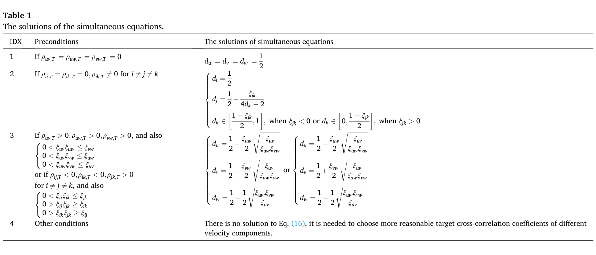

   **表 1** 联立方程的解。

3.2.2 参数 :math:`k_{1,n}` 的推导
^^^^^^^^^^^^^^^^^^^^^^^^^^^^^^^^^

为满足 Taylor 冻结假设，取：

.. math::

   k_{1,n}=-\frac{2\pi f_n}{U_{avg}}.\qquad (17)

代回式 (2)：

.. math::

   \begin{aligned}
   u_i(\mathbf{x},t-\tau)
   &=\sum_{n=1}^{N}p_{i,n}\sin\left[\mathbf{k}_n\cdot\mathbf{x}+2\pi f_n(t-\tau)+\varphi_n\right]\\
   &=\sum_{n=1}^{N}p_{i,n}\sin\left[k_{1,n}(x_1+U_{avg}\tau)+k_{2,n}x_2+k_{3,n}x_3+2\pi f_nt+\varphi_n\right]\\
   &=u_i(\mathbf{x}+U_{avg}\tau\mathbf{e}_1,t).
   \end{aligned}\qquad (18)

于是：

.. math::

   R_{\cdot i}^{x}(r)=E\left[u_i(\mathbf{x},t)u_i(\mathbf{x}+U_{avg}\tau\mathbf{e}_1,t)\right]
   =E\left[u_i(\mathbf{x},t)u_i(\mathbf{x},t-\tau)\right]=R_i^t(-\tau)=R_i^t(\tau).\qquad (19)

一维两侧 :math:`X` 方向波数谱与频率谱之间有：

.. math::

   G_i^x(k_1)=\frac{1}{2\pi}\int_{-\infty}^{\infty}R_i^x(r)\exp(-jk_1r)dr
   =\frac{U_{avg}}{2\pi}\int_{-\infty}^{\infty}R_i^t(\tau)\exp(-j2\pi f\tau)d\tau
   =\frac{U_{avg}}{2\pi}G_i^t(f).\qquad (20)

一侧谱形式为：

.. math::

   S_i^x(k_1)=\frac{U_{avg}}{2\pi}S_i^t(f).\qquad (21)

由式 (1) 转换得到对应 von Karman :math:`X` 方向波数谱：

.. math::

   \left\{
   \begin{aligned}
   S_u^x(k_1) &= \frac{2U_{avg}}{\pi}\frac{(I_uU_{avg})^2(L_u^x/U_{avg})}
   {\left[1+70.8(k_1L_u^x/2\pi)^2\right]^{5/6}}, && k_1\in[0,\infty),\\
   S_v^x(k_1) &= \frac{2U_{avg}}{\pi}\frac{(I_vU_{avg})^2(L_v^x/U_{avg})\left[1+188.4(k_1L_v^x/\pi)^2\right]}
   {\left[1+70.8(k_1L_v^x/\pi)^2\right]^{11/6}}, && k_1\in[0,\infty),\\
   S_w^x(k_1) &= \frac{2U_{avg}}{\pi}\frac{(I_wU_{avg})^2(L_w^x/U_{avg})\left[1+188.4(k_1L_w^x/\pi)^2\right]}
   {\left[1+70.8(k_1L_w^x/\pi)^2\right]^{11/6}}, && k_1\in[0,\infty).
   \end{aligned}
   \right.\qquad (22)

3.2.3 参数 :math:`k_{2,n}` 的推导
^^^^^^^^^^^^^^^^^^^^^^^^^^^^^^^^^

:math:`k_{2,n}` 主要与 :math:`Y` 方向空间相关性有关。首先由目标空间相关系数 Fourier 变换得到 :math:`u` 分量 :math:`Y` 方向目标波数谱：

.. math::

   G_{u,T}^{y}(k_2)=\frac{(I_{u,T}U_{avg,T})^2}{2\pi}\int_{-\infty}^{\infty}\rho_{u,T}^{y}(r)\exp(-jk_2r)dr.\qquad (23)

将式 (23) 离散为矩形面积求和，即 Dirac 函数序列：

.. math::

   G_{u,T}^{y}(k_2)=\sum_{n=1}^{N}G_{u,T}^{y}(k_{2,n})\Delta k_{2,n}
   \left[\delta(k_2-k_{2,n})+\delta(k_2+k_{2,n})\right].\qquad (24)

计算得到的 :math:`Y` 方向空间相关函数为：

.. math::

   \begin{aligned}
   R_{u,C}^{y}(r)&=\lim_{T\to\infty}\frac{1}{T}\int_0^T u(\mathbf{x},t)u(\mathbf{x}+r\mathbf{e}_2,t)dt\\
   &=\lim_{T\to\infty}\frac{1}{T}\int_0^T\left[\sum_{n=1}^{N}p_{1,n}\sin(\mathbf{k}_n\cdot\mathbf{x}+2\pi f_nt+\varphi_n)\right]
   \left[\sum_{n=1}^{N}p_{1,n}\sin(\mathbf{k}_n\cdot\mathbf{x}+k_{2,n}r+2\pi f_nt+\varphi_n)\right]dt\\
   &=\sum_{n=1}^{N}S_u^t(f_n)\Delta f\cos(k_{2,n}r).
   \end{aligned}\qquad (25)

其两侧波数谱为：

.. math::

   \begin{aligned}
   G_{u,C}^{y}(k_2)&=\frac{1}{2\pi}\int_{-\infty}^{\infty}R_{u,C}^{y}(r)\exp(-jk_2r)dr\\
   &=\frac{1}{2}\sum_{n=1}^{N}S_u^t(f_n)\Delta f\left[\delta(k_2-k_{2,n})+\delta(k_2+k_{2,n})\right].
   \end{aligned}\qquad (26)

比较式 (24) 与式 (26)，可得：

.. math::

   \begin{cases}
   A_1=\dfrac{1}{2}S_u^t(f_1)\Delta f=G_{u,T}^{y}(0)\Delta k_{2,1}, & n=1,\\
   A_n=\dfrac{1}{2}S_u^t(f_n)\Delta f=G_{u,T}^{y}(k_{2,n-1})\Delta k_{2,n}, & n=2,3,\ldots,N.
   \end{cases}\qquad (27)

递推序列：

.. math::

   k_{2,n}=\begin{cases}
   \Delta k_{2,1}, & n=1,\\
   k_{2,n-1}+\Delta k_{2,n}, & n=2,3,\ldots,N.
   \end{cases}\qquad (28)

波数间隔为：

.. math::

   \Delta k_{2,n}=\begin{cases}
   \dfrac{S_u^t(f_1)\Delta f}{2G_{u,T}^{y}(0)}, & n=1,\\
   \dfrac{S_u^t(f_n)\Delta f}{2G_{u,T}^{y}(k_{2,n-1})}, & n=2,3,\ldots,N.
   \end{cases}\qquad (29)

当 :math:`N\to\infty`：

.. math::

   \lim_{N\to\infty}G_{u,C}^{y}(k_2)\approx G_{u,T}^{y}(k_2).\qquad (30)

论文采用 Hemon and Santi 提出的空间相关表达：

.. math::

   Sc_{ij}=\sum_l\sqrt{S_{u,y_i}^{t}(f_l)S_{u,y_j}^{t}(f_l)}\,Coh_u^y(f_l)\Delta f.\qquad (31)

.. math::

   Coh_u^y(f_l)=\exp\left(-\frac{C_u^y|y_i-y_j|f_l}{U_{avg}}\right)\Delta f.\qquad (32)

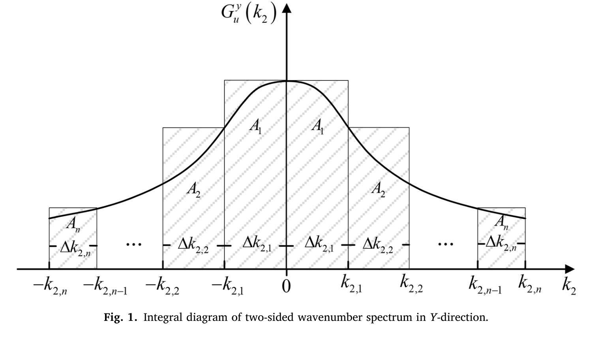

   **图 1** :math:`Y` 方向两侧波数谱的积分示意图。

3.2.4 参数 :math:`k_{3,n}` 的推导
^^^^^^^^^^^^^^^^^^^^^^^^^^^^^^^^^

CIRFG 的主要优点之一，是在均匀湍流情况下可保持无散度条件。不可压缩湍流连续方程为：

.. math::

   \sum_{i=1}^{3}\frac{\partial u_i}{\partial x_i}=0.\qquad (33)

若目标为生成均匀湍流场，式 (2) 中参数在不同空间点一致。代入式 (33)：

.. math::

   \sum_{n=1}^{N}\left[\left(\sum_{i=1}^{3}p_{i,n}k_{i,n}\right)\cos(\mathbf{k}_n\cdot\mathbf{x}+2\pi f_nt+\varphi_n)\right]=0.\qquad (34)

令 :math:`\sum_{i=1}^{3}p_{i,n}k_{i,n}=0`，并结合式 (3)，得到：

.. math::

   \sum_{i=1}^{3}\mathrm{sign}(r_{i,n})\sqrt{S_i^t(f_n)}k_{i,n}=0.\qquad (35)

若目标为得到 :math:`Z` 方向非均匀湍流场，则湍流特征仅随 :math:`Z` 方向变化。此时：

.. math::

   \begin{aligned}
   \frac{\partial u_3}{\partial x_3}
   &=\sum_{n=1}^{N}k_{3,n}p_{3,n}\cos(\mathbf{k}_n\cdot\mathbf{x}+2\pi f_nt+\varphi_n)
   +\sum_{n=1}^{N}\frac{\partial p_{3,n}}{\partial x_3}\sin(\mathbf{k}_n\cdot\mathbf{x}+2\pi f_nt+\varphi_n)\\
   &\quad+\sum_{n=1}^{N}\left(\frac{\partial k_{1,n}}{\partial x_3}x_1+\frac{\partial k_{2,n}}{\partial x_3}x_2+\frac{\partial k_{3,n}}{\partial x_3}x_3\right)
   p_{3,n}\cos(\mathbf{k}_n\cdot\mathbf{x}+2\pi f_nt+\varphi_n).
   \end{aligned}\qquad (36)

由于式 (36) 右侧第二项和第三项非线性强，难以直接求得完全满足连续方程的 :math:`k_{3,n}`。原文指出，在计算风工程常见的入口平面生成问题中，仍可用式 (35) 近似计算 :math:`k_{3,n}`，理由包括：入口平面生成过程不含 :math:`X` 方向导数；入口质量通量修正比强制无散度修正对统计特征影响更小；若非均匀性在空间中变化足够缓慢，对无散度条件的影响可以忽略。

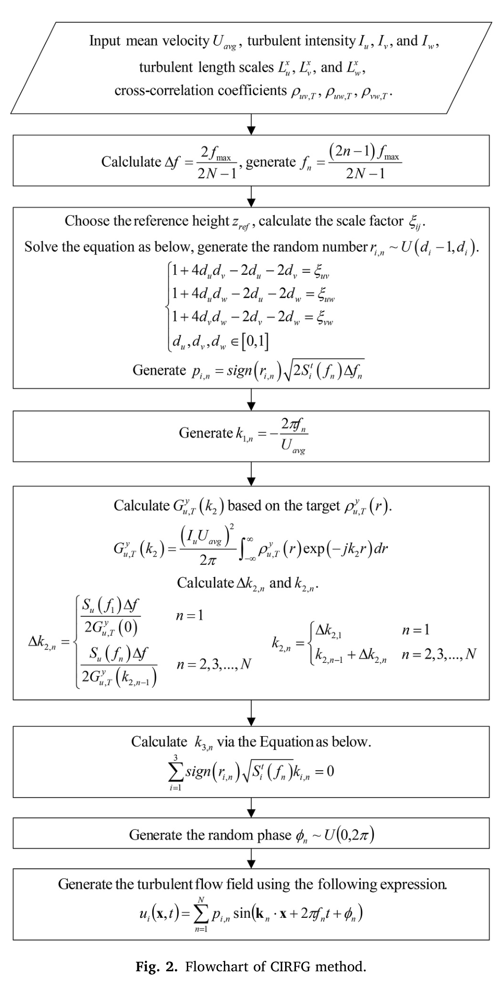

   **图 2** CIRFG 方法流程图。

4 CIRFG 方法验证
----------------

4.1 操作设置
~~~~~~~~~~~~

为验证理论推导，论文采用 TPU 数据库中的非均匀湍流特征作为目标。由于 TPU 数据库未给出横向和竖向湍流强度剖面，论文依据 ESDU 标准引入比例系数，取 :math:`I_v(z)=0.78I_u(z)`、:math:`I_w(z)=0.55I_u(z)`。纵向积分尺度剖面同样未由 TPU 数据库给出，论文取自类似试验，并令其等于参考高度 0.4 m；基于局部各向同性假设，横向和竖向积分尺度取纵向分量的一半。

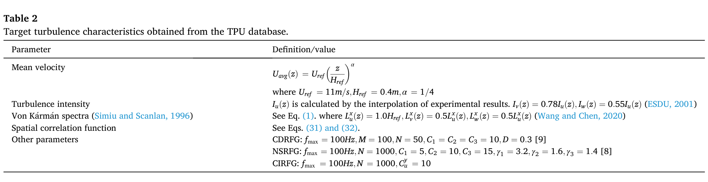

   **表 2** 由 TPU 数据库获得的目标湍流特征。

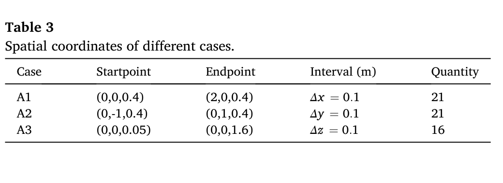

   **表 3** 不同工况的空间坐标。

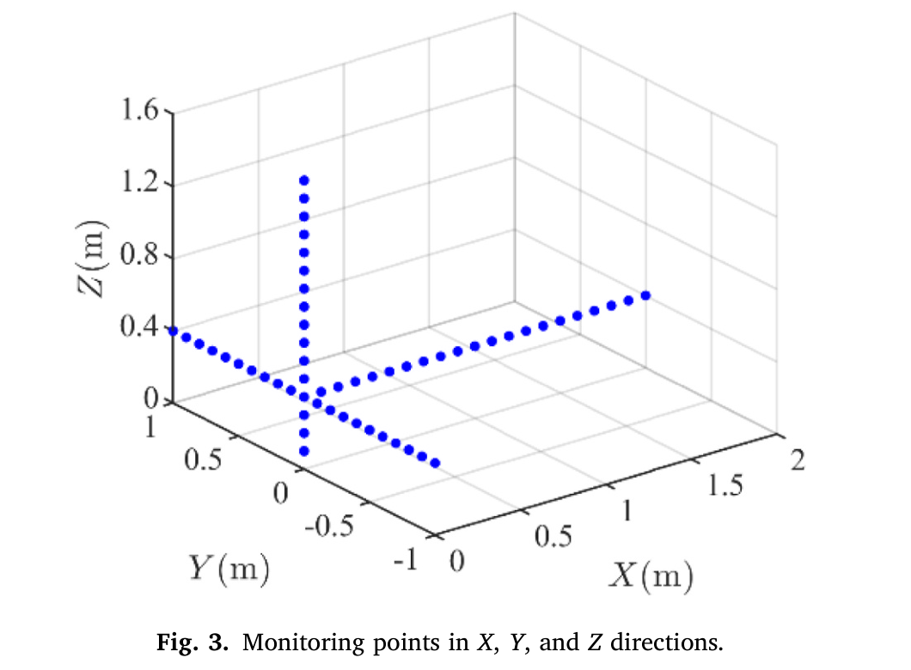

   **图 3** :math:`X`、:math:`Y`、:math:`Z` 方向监测点。

4.2 湍流特征对比
~~~~~~~~~~~~~~~~

4.2.1 基本湍流特征
^^^^^^^^^^^^^^^^^^

基于 A3 工况结果，论文比较了三种方法生成的平均速度、湍流强度、频率谱和时间相关系数。平均速度和湍流强度均与目标特征吻合。频率谱和时间相关方面，CDRFG 由于频率向量服从正态随机分布，在时间相关系数上偏差略大；NSRFG 与 CIRFG 采用等间隔频率序列，频率谱和时间相关系数更接近目标。

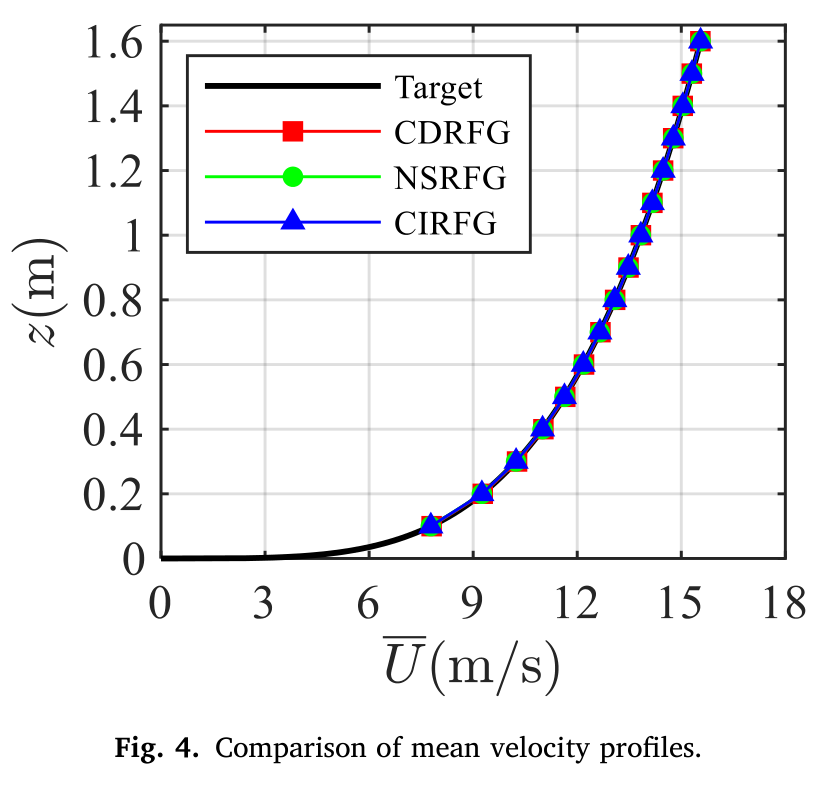

   **图 4** 平均速度剖面对比。

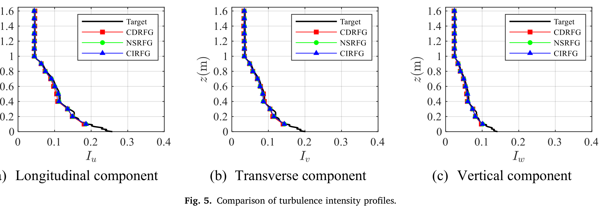

   **图 5** 湍流强度剖面对比。

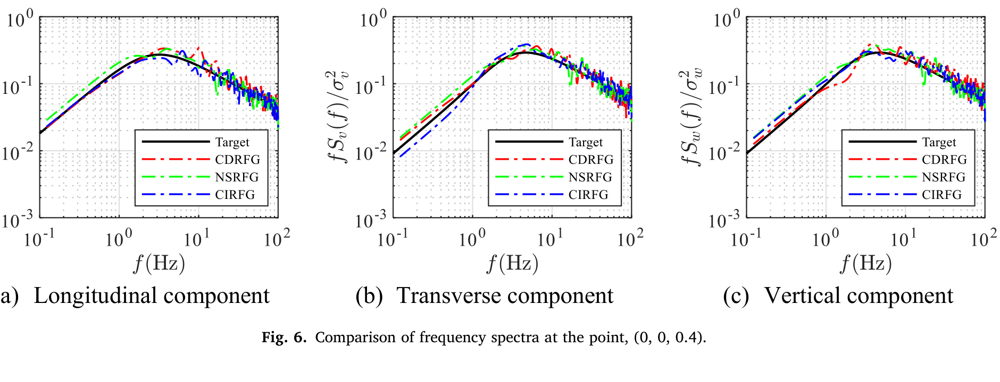

   **图 6** 点 :math:`(0,0,0.4)` 处频率谱对比。

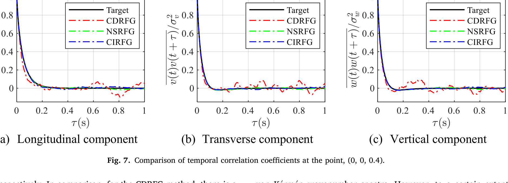

   **图 7** 点 :math:`(0,0,0.4)` 处时间相关系数对比。

4.2.2 空间相关性
^^^^^^^^^^^^^^^^

原文分别对 :math:`X`、:math:`Y`、:math:`Z` 方向空间相关系数进行了比较。CIRFG 在 :math:`X` 方向满足由 von Karman 波数谱转换得到的目标空间相关；在 :math:`Y` 方向，CIRFG 与 Hemon and Santi 目标空间相关系数吻合良好，验证了第 3.2.3 节无需经验参数实现 :math:`Y` 方向相关性的推导。虽然 CIRFG 未显式设定 :math:`Z` 方向目标空间相关，但其结果仍比 CDRFG 与 NSRFG 更接近目标。

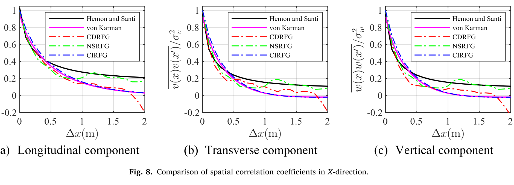

   **图 8** :math:`X` 方向空间相关系数对比。

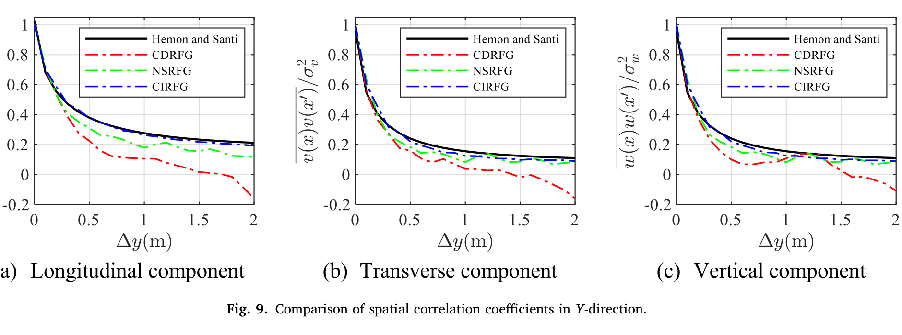

   **图 9** :math:`Y` 方向空间相关系数对比。

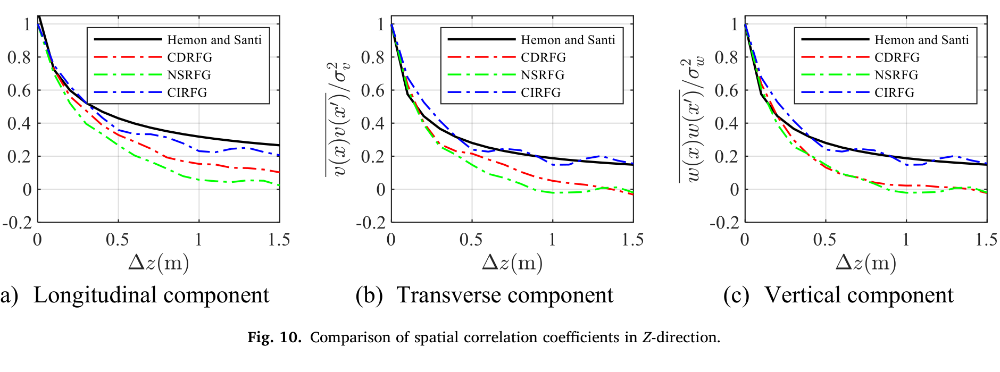

   **图 10** :math:`Z` 方向空间相关系数对比。

4.2.3 不同速度分量之间的互相关性
^^^^^^^^^^^^^^^^^^^^^^^^^^^^^^^^

CDRFG 生成的不同速度分量互相关系数接近 0；NSRFG 结果接近 1。原文认为，这是由于两者关于随机参数 :math:`r_{i,n}` 的处理不合理。CIRFG 则通过第 3.2.1 节推导的均匀分布随机参数，使模拟互相关系数与预设值相一致。速度时程对比也显示：CIRFG 可根据不同目标互相关系数生成不同相关水平的速度分量，从而更接近真实湍流场。

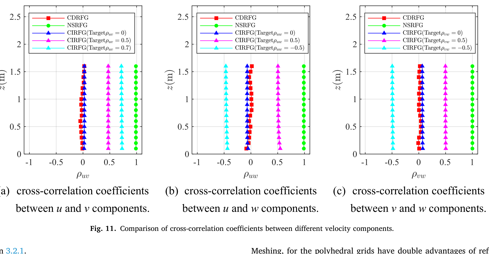

   **图 11** 不同速度分量之间互相关系数对比。

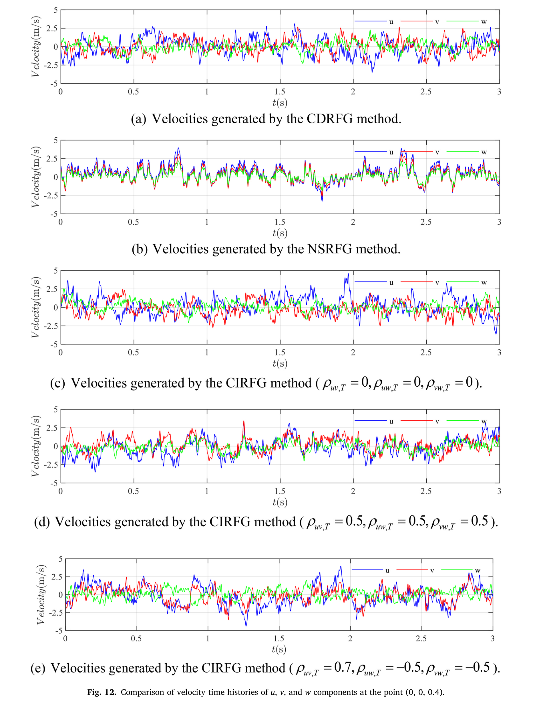

   **图 12** 点 :math:`(0,0,0.4)` 处 :math:`u`、:math:`v`、:math:`w` 分量速度时程对比。

5 CIRFG 在高层建筑绕流中的应用
-------------------------------

5.1 数值模型说明
~~~~~~~~~~~~~~~~

论文进一步将 CIRFG 应用于高层建筑 LES。建筑为方形截面高层模型，宽度 :math:`B=0.1\,\mathrm{m}`，深度 :math:`D=0.1\,\mathrm{m}`，高度 :math:`H=0.4\,\mathrm{m}`，与 TPU 风洞试验保持 1/400 缩尺。风攻角为 :math:`0^\circ`，建筑高度处参考平均速度为 11 m/s，对应 Reynolds 数约 :math:`7.53\times 10^4`。计算域尺寸为 :math:`20H\times 10H\times 4H`，阻塞率为 0.13%。

网格方面，计算域被划分为背景网格和三个局部加密区域。论文采用多面体网格以兼顾局部加密和总网格量控制，并设置两组网格方案验证无关性。G1 约 332 万单元，G2 约 496 万单元；用于空域 ABL 流验证时，去除建筑后约 242 万单元。

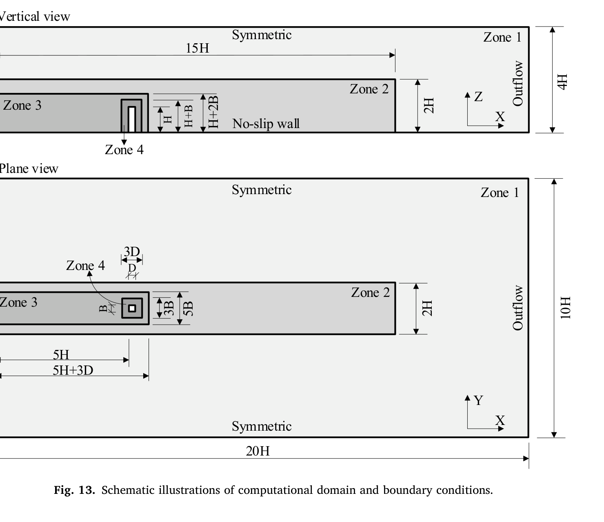

   **图 13** 计算域和边界条件示意图。

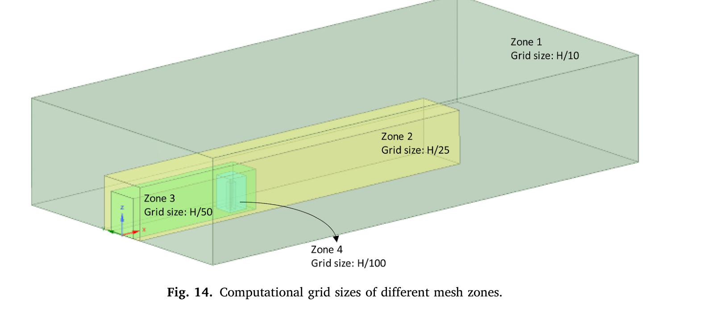

   **图 14** 不同网格区域的计算网格尺寸。

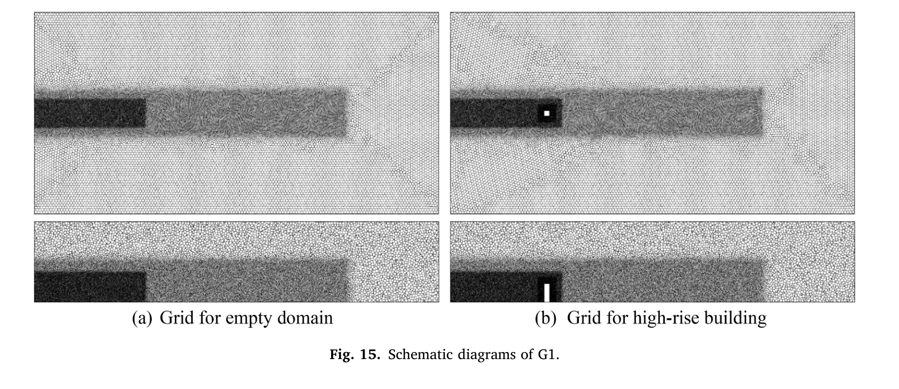

   **图 15** G1 网格示意图。

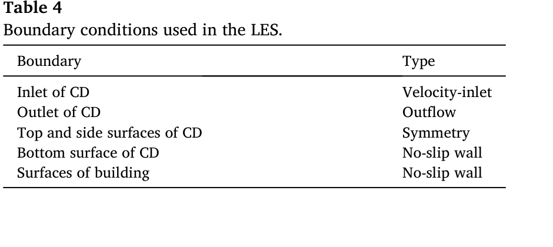

   **表 4** LES 中使用的边界条件。

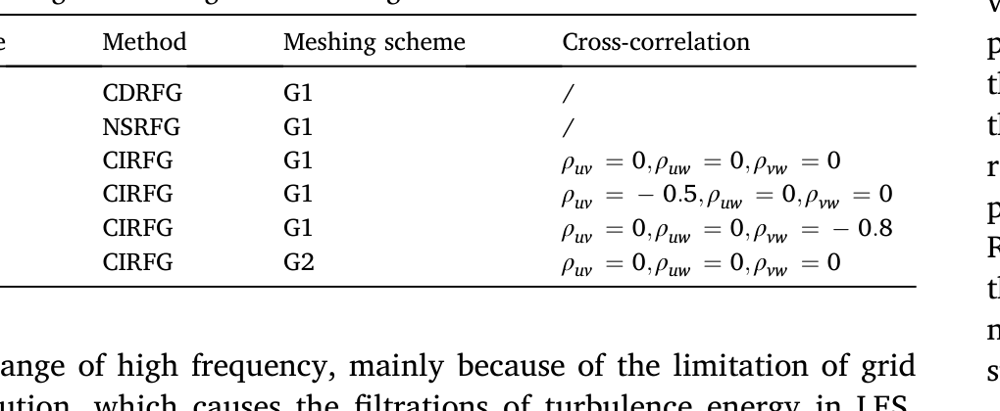

   **表 5** 高层建筑模型模拟工况。

5.2 大气边界层流场模拟
~~~~~~~~~~~~~~~~~~~~~~

5.2.1 ABL 湍流特征对比
^^^^^^^^^^^^^^^^^^^^^^

在建筑绕流计算前，论文先检验三种 RFG 类方法生成湍流场的自维持能力。结果显示，三种方法得到的平均速度剖面均与目标值吻合，近地面略有增大。湍流强度剖面在 :math:`X` 方向发展过程中略有衰减，但在建筑位置附近保持较好；频率谱在高频区存在能量快速衰减，这主要由网格分辨率限制导致的 LES 能量过滤造成，而低频区与目标 von Karman 谱符合较好。

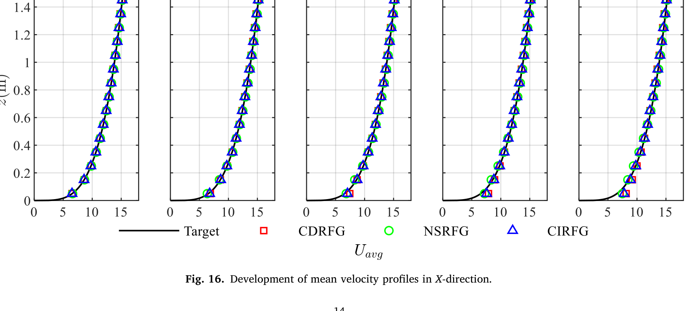

   **图 16** :math:`X` 方向平均速度剖面发展。

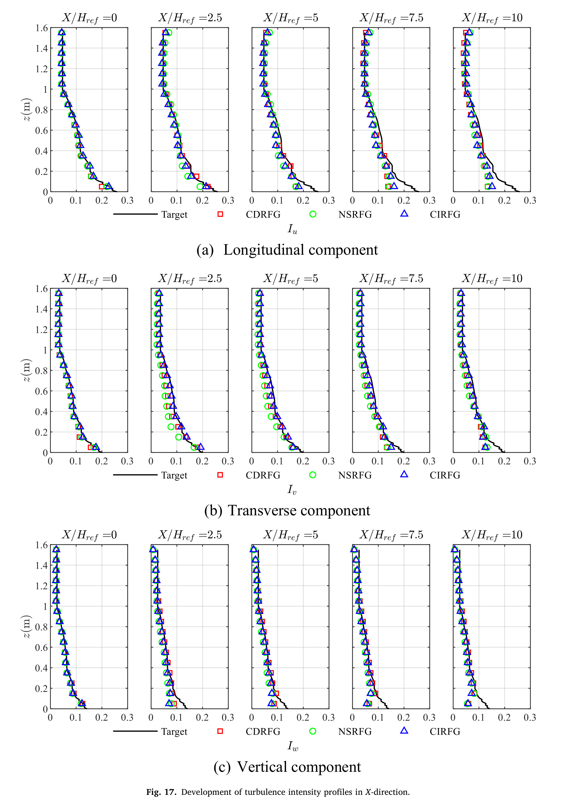

   **图 17** :math:`X` 方向湍流强度剖面发展。

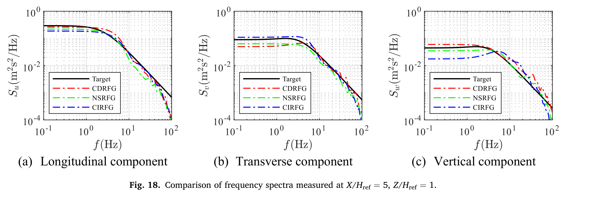

   **图 18** :math:`X/H_{ref}=5`、:math:`Z/H_{ref}=1` 处频率谱对比。

5.2.2 流场压力分析
^^^^^^^^^^^^^^^^^^

论文进一步比较了与速度监测点相同位置处的压力均值和标准差。所有模拟工况的平均压力很小，最大值不超过建筑位置处速度压力的 1%。在入口附近，各工况均出现非物理压力波动，主要原因是 RFG 类方法生成的非均匀湍流场与 Navier--Stokes 方程和计算域边界条件不完全相容。论文同时指出，采用 outflow 出口边界并设置合适的压力参考点，可使建筑位置附近的压力波动接近 0，因此当前设置对 CWE 应用是合理的；但若采用 pressure-outlet 边界，则需要类似 VBIC 的修正方法，否则非物理压力波动可能污染建筑表面压力测量。

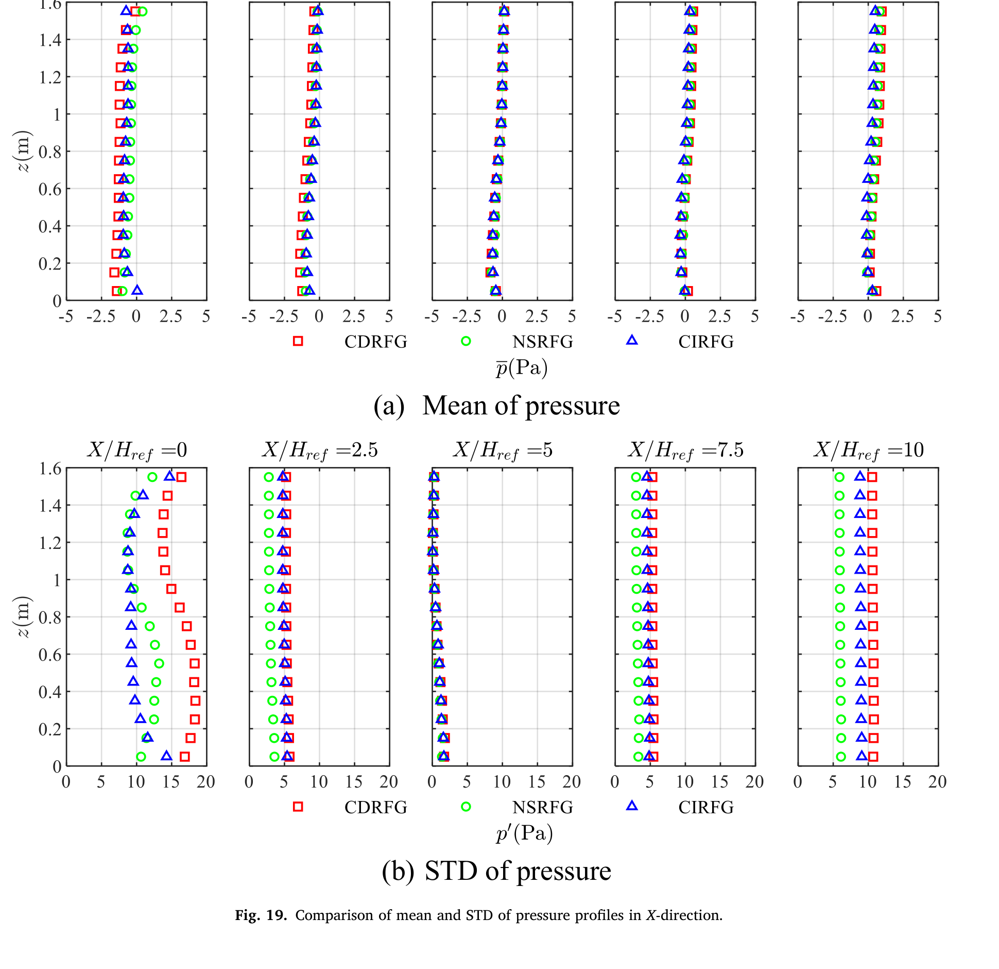

   **图 19** :math:`X` 方向压力均值和标准差剖面对比。

5.3 高层建筑绕流模拟
~~~~~~~~~~~~~~~~~~~~

5.3.1 平均与脉动风压
^^^^^^^^^^^^^^^^^^^^

为验证计算精度，论文对 LES 与 TPU 数据库的风压系数进行比较。风压系数定义为：

.. math::

   C_p=\frac{p-p_{ref}}{0.5\rho U_H^2}.\qquad (37)

其中，:math:`p_{ref}` 为参考压力，:math:`\rho=1.225\,\mathrm{kg/m^3}`，:math:`U_H=11\,\mathrm{m/s}`。

结果显示，所有工况的平均风压系数分布总体与 TPU 数据库一致，但侧墙略有低估。风压系数标准差方面，背风面预测较好，其余表面多数模拟值低于风洞试验值。原文将其归因于 LES 中不可避免的湍流能量过滤、脉动压力复杂性和数值误差。C3--C5 对比显示，不同速度分量互相关性会影响脉动风压预测精度，其中 C5 在迎风面和一侧侧墙上表现更好，可能与 :math:`v` 和 :math:`w` 分量之间的负相关有关。

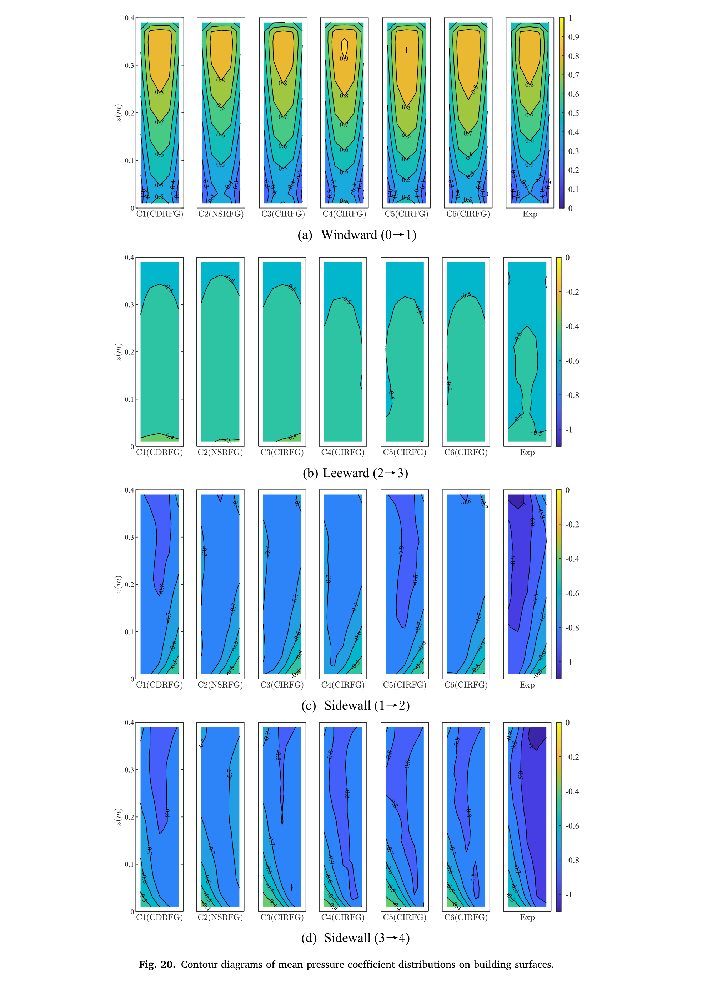

   **图 20** 建筑表面平均风压系数分布等值图。

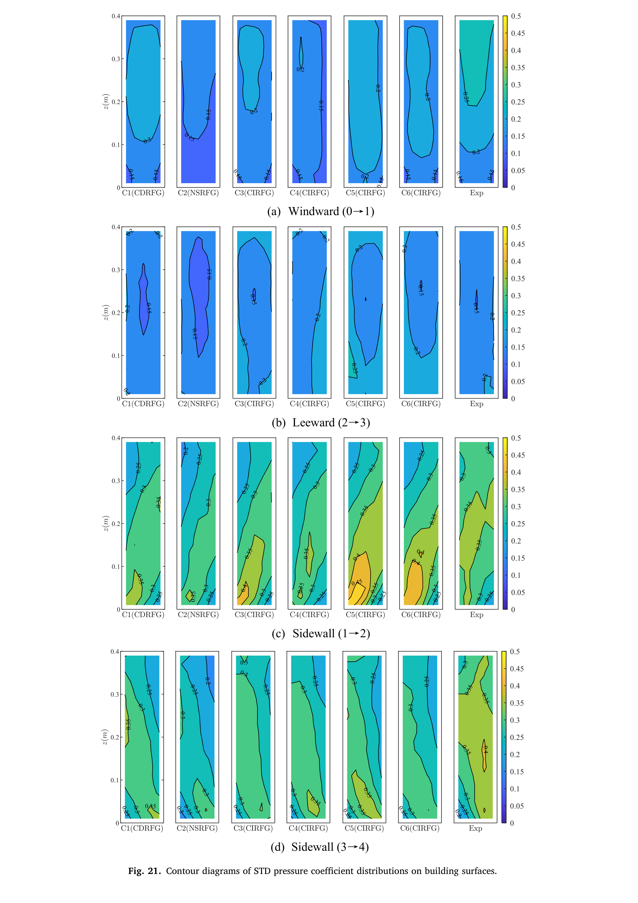

   **图 21** 建筑表面风压系数标准差分布等值图。

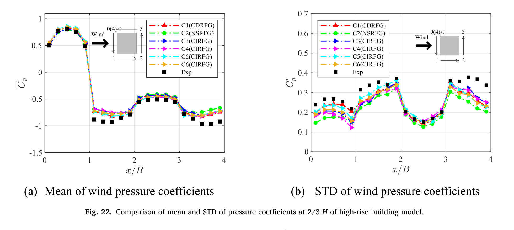

   **图 22** 高层建筑模型 :math:`2/3H` 高度处平均与标准差风压系数对比。

5.3.2 平均与脉动基底力和力矩
^^^^^^^^^^^^^^^^^^^^^^^^^^^^

基底力与力矩示意见图 23。对应的力/力矩系数为：

.. math::

   C_D(t)=\frac{F_x(t)}{0.5\rho U_H^2BH},\qquad
   C_L(t)=\frac{F_y(t)}{0.5\rho U_H^2DH}.\qquad (38)

.. math::

   C_{Mx}(t)=\frac{M_x(t)}{0.5\rho U_H^2BH^2},\qquad
   C_{My}(t)=\frac{M_y(t)}{0.5\rho U_H^2DH^2},\qquad
   C_{Mz}(t)=\frac{M_z(t)}{0.5\rho U_H^2BDH}.\qquad (39)

平均系数方面，:math:`C_D` 与 :math:`C_{Mx}` 相对于 TPU 试验的误差基本小于 5%，NSRFG 工况 C2 接近 6%。由于来流攻角为 :math:`0^\circ` 且模型对称，理论上 :math:`C_L`、:math:`C_{My}`、:math:`C_{Mz}` 均应为 0，故原文未计算其相对误差。

标准差方面，各基底力/力矩系数均小于风洞试验值，这仍主要与 LES 湍流能量过滤有关。文中以各项相对误差均值衡量整体表现，C1--C6 分别为 :math:`-13.45\%`、:math:`-24.48\%`、:math:`-12.54\%`、:math:`-14.67\%`、:math:`-8.69\%`、:math:`-11.99\%`。C5 的整体误差最小，表明合适的速度分量互相关性可能是影响 LES 准确性的重要因素。总基底力/力矩系数谱方面，各 LES 工况与 TPU 数据库总体吻合。

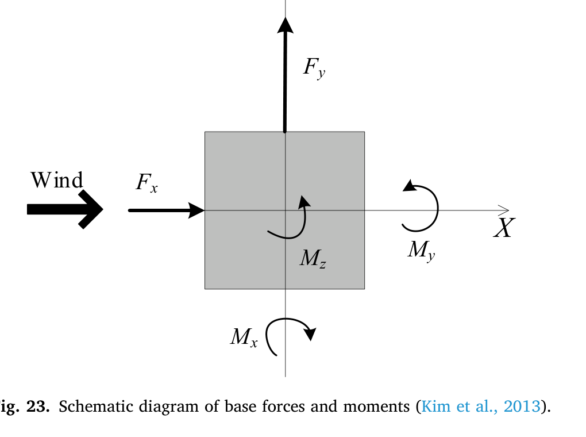

   **图 23** 基底力和力矩示意图（Kim et al., 2013）。

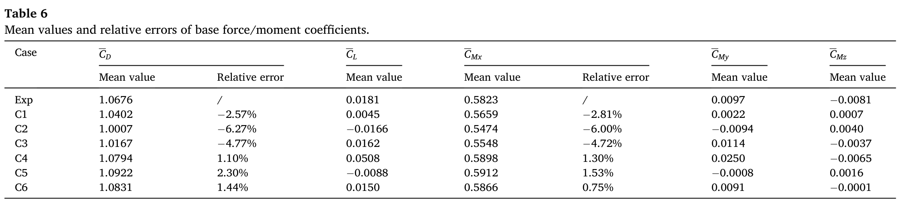

   **表 6** 基底力/力矩系数均值及相对误差。

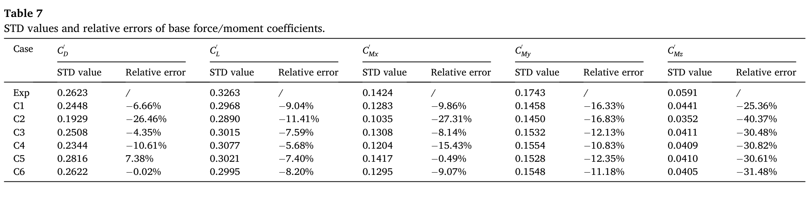

   **表 7** 基底力/力矩系数标准差及相对误差。

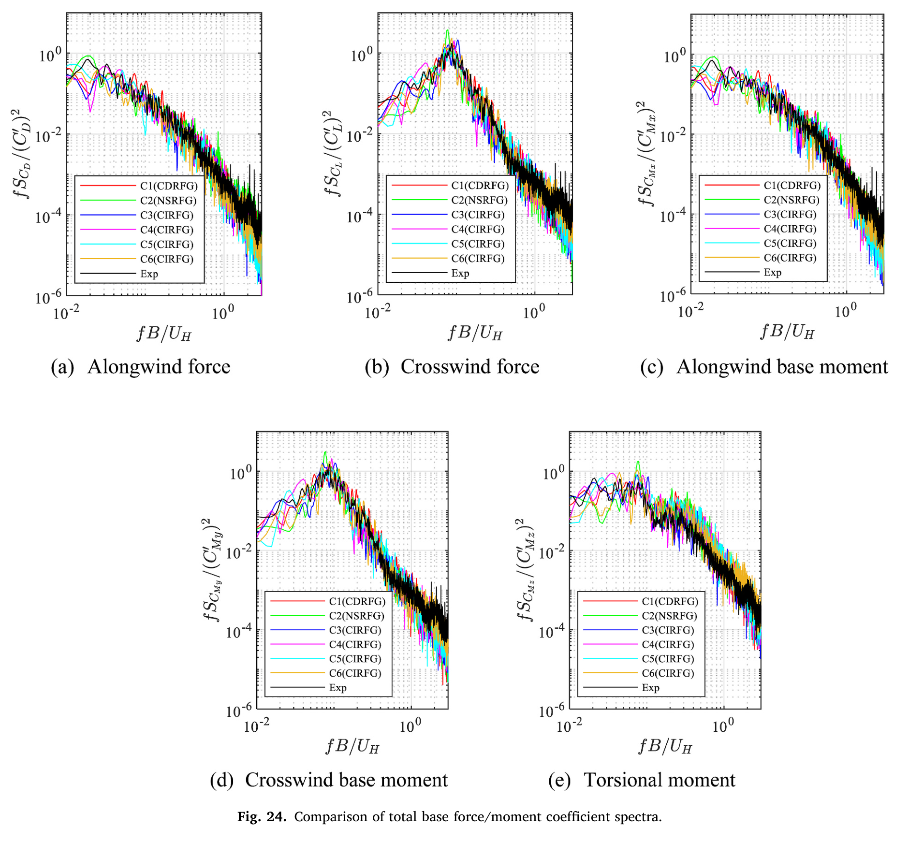

   **图 24** 总基底力/力矩系数谱对比。

6 结论
------

论文提出了面向 LES 的新 ITG 方法 CIRFG，目标是改进空间相关性以及不同速度分量之间互相关性的一致性。其核心结论如下：

1. CIRFG 通过显式嵌入目标湍流特征来处理空间相关性和速度分量互相关性。对互相关性，方法通过求解与目标值相关的方程确定随机数序列，从而增加幅值随机性；对 :math:`Y` 方向空间相关性，方法从波数谱角度推导 :math:`k_{2,n}` 递推序列。因此，CIRFG 无需经验参数即可自然施加指定湍流特征。
2. CIRFG 保留了满足任意平均风速、湍流强度、频率谱、时间相关性、:math:`X` 方向空间相关性等基本目标湍流特征的能力。
3. ABL 空域模拟表明，三种 RFG 类方法生成的湍流场均具有较好的风剖面自维持能力，在未来建筑位置处衰减较小。非均匀湍流场入口处仍会出现人工压力波动，主要源于与 Navier--Stokes 方程及边界条件不完全相容；合适的压力参考点和 outflow 出口边界可减小建筑附近压力波动。
4. 高层建筑绕流模拟表明，平均风压系数与 TPU 风洞试验较一致；风压标准差和基底力/力矩系数标准差整体低于风洞试验，主要原因包括 LES 湍流能量过滤、脉动压力复杂性和数值误差等。
5. 速度分量之间的互相关性会影响 LES 精度。CIRFG 在实现任意互相关性方面更灵活，但原文也明确指出，仍需要进一步研究真实湍流场中的合理互相关系数，以继续提高 LES 准确性。

CRediT 作者贡献声明
-------------------

Lingwei Chen：概念化、形式分析、方法、软件、验证、可视化、原稿撰写、审阅与编辑。Chao Li：概念化、经费获取、方法、项目管理、验证、原稿撰写、审阅与编辑。Jinghan Wang：概念化、方法、软件、验证、可视化、原稿撰写、审阅与编辑。Gang Hu：原稿撰写、审阅与编辑。Qingxing Zheng：原稿撰写、审阅与编辑。Qingfeng Zhou：原稿撰写、审阅与编辑。Yiqing Xiao：概念化、经费获取、项目管理、监督。

利益冲突声明
------------

作者声明不存在可能影响本文工作的已知竞争性经济利益或个人关系。

数据可用性
----------

数据可根据请求提供。

致谢
----

本研究获得深圳市基础研究计划（JCYJ20190806145216643）和国家自然科学基金（51778200）支持。

附录 A DSRFG 方法
-----------------

DSRFG 方法（Huang et al., 2010）主要包括三维谱离散和湍流场合成过程：

.. math::

   u_i(\mathbf{x},t)=\sum_{m=1}^{M}\sum_{n=1}^{N}\left[p_i^{m,n}\cos(\tilde{\mathbf{k}}^{m,n}\cdot\tilde{\mathbf{x}}+\omega_{m,n}t)+q_i^{m,n}\sin(\tilde{\mathbf{k}}^{m,n}\cdot\tilde{\mathbf{x}}+\omega_{m,n}t)\right].\qquad (A1)

.. math::

   p_i^{m,n}=\mathrm{sign}(r_i^{m,n})\sqrt{\frac{4}{N}S_i^{|k|}(k_m)\frac{(r_i^{m,n})^2}{1+(r_i^{m,n})^2}}.\qquad (A2)

.. math::

   q_i^{m,n}=\mathrm{sign}(r_i^{m,n})\sqrt{\frac{4}{N}S_i^{|k|}(k_m)\frac{1}{1+(r_i^{m,n})^2}}.\qquad (A3)

.. math::

   \tilde{\mathbf{x}}=\frac{\mathbf{x}}{L_s}.\qquad (A4)

.. math::

   \mathbf{k}^{m,n}\cdot\mathbf{p}^{m,n}=0.\qquad (A5)

.. math::

   \mathbf{k}^{m,n}\cdot\mathbf{q}^{m,n}=0.\qquad (A6)

.. math::

   \tilde{\mathbf{k}}^{m,n}=\frac{\mathbf{k}^{m,n}}{k_0},\qquad |\mathbf{k}^{m,n}|=k_m.\qquad (A7)

.. math::

   \omega_{m,n}\in N(0,2\pi f_m),\qquad f_m=k_mU_{avg}.\qquad (A8)

其中，:math:`L_s` 为调节空间相关性的经验参数，原文给出 :math:`L_s=\theta_1\sqrt{(L_u^x)^2+(L_v^x)^2+(L_w^x)^2}`。

附录 B MDSRFG 方法
------------------

MDSRFG 方法（Castro and Paz, 2013）通过引入时间调整参数来获得时空相关湍流场：

.. math::

   u_i(\mathbf{x},t)=\sum_{m=1}^{M}\sum_{n=1}^{N}\left[p_i^{m,n}\cos\left(\tilde{\mathbf{k}}^{m,n}\cdot\tilde{\mathbf{x}}+\omega_{m,n}\frac{t}{\tau_0}\right)+q_i^{m,n}\sin\left(\tilde{\mathbf{k}}^{m,n}\cdot\tilde{\mathbf{x}}+\omega_{m,n}\frac{t}{\tau_0}\right)\right].\qquad (B1)

.. math::

   p_i^{m,n}=\mathrm{sign}(r_i^{m,n})\sqrt{\frac{4c_i}{N}S_i^{|k|}(k_m)\Delta k_m\frac{(r_i^{m,n})^2}{1+(r_i^{m,n})^2}}.\qquad (B2)

.. math::

   q_i^{m,n}=\mathrm{sign}(r_i^{m,n})\sqrt{\frac{4c_i}{N}S_i^{|k|}(k_m)\Delta k_m\frac{1}{1+(r_i^{m,n})^2}}.\qquad (B3)

其中，:math:`\tau_0=\theta_2 L_s/U_{avg}`，:math:`\theta_2` 为调整系数，:math:`c_i` 为与谱形式有关的函数值。

附录 C CDRFG 方法
-----------------

CDRFG 方法（Aboshosha et al., 2015; Melaku et al., 2017）用于生成满足指定频率谱和空间相干函数的湍流场：

.. math::

   u_i(\mathbf{x},t)=\sum_{m=1}^{M}\sum_{n=1}^{N}\left[p_i^{m,n}\cos(\mathbf{k}^{m,n}\cdot\tilde{\mathbf{x}}^m+2\pi f_{m,n}t)+q_i^{m,n}\sin(\mathbf{k}^{m,n}\cdot\tilde{\mathbf{x}}^m+2\pi f_{m,n}t)\right].\qquad (C1)

.. math::

   p_i^{m,n}=\mathrm{sign}(r_i^{m,n})\sqrt{\frac{2}{N}S_i^t(f_m)\Delta f\frac{(r_i^{m,n})^2}{1+(r_i^{m,n})^2}}.\qquad (C2)

.. math::

   q_i^{m,n}=\mathrm{sign}(r_i^{m,n})\sqrt{\frac{2}{N}S_i^t(f_m)\Delta f\frac{1}{1+(r_i^{m,n})^2}}.\qquad (C3)

.. math::

   \tilde{x}_{j}^{m}=\frac{x_j}{L_{j}^{m}}.\qquad (C4)

.. math::

   \begin{bmatrix}
   p_x^{m,n} & p_y^{m,n} & p_z^{m,n}\\
   q_x^{m,n} & q_y^{m,n} & q_z^{m,n}\\
   k_x^{m,n} & k_y^{m,n} & k_z^{m,n}
   \end{bmatrix}
   \begin{bmatrix}
   k_x^{m,n}\\k_y^{m,n}\\k_z^{m,n}
   \end{bmatrix}
   =
   \begin{bmatrix}0\\0\\1\end{bmatrix}.\qquad (C5)

.. math::

   f_{m,n}\in N(f_m,\Delta f).\qquad (C6)

.. math::

   L_{j,m}=\frac{U_{avg}}{\gamma C_j f_m}.\qquad (C7)

.. math::

   \gamma=\begin{cases}
   3.7\beta-0.3, & \beta<6.0,\\
   2.1, & \beta\ge 6.0.
   \end{cases}\qquad (C8)

.. math::

   \beta=\frac{CD_c}{L_u^x(z)}.\qquad (C9)

附录 D NSRFG 方法
-----------------

NSRFG 方法（Yu et al., 2018）采用更简洁的表达式以提高计算效率：

.. math::

   u_i(\mathbf{x},t)=\sum_{n=1}^{N}\sqrt{2S_i^t(f_n)\Delta f}\sin(\mathbf{k}_n\cdot\tilde{\mathbf{x}}_n+2\pi f_nt+\varphi_n).\qquad (D1)

.. math::

   \tilde{x}_{j,n}=\frac{x_j}{L_{j,n}}.\qquad (D2)

.. math::

   \begin{cases}
   p_{1,n}\dfrac{k_{1,n}}{L_{1,n}}+p_{2,n}\dfrac{k_{2,n}}{L_{2,n}}+p_{3,n}\dfrac{k_{3,n}}{L_{3,n}}=0,\\
   |\mathbf{k}_n|=1.
   \end{cases}\qquad (D3)

.. math::

   \begin{cases}
   k_{1,n}=-\dfrac{q_{2,n}^2+q_{3,n}^2}{A_n}\sin\theta_n,\\
   k_{2,n}=-\dfrac{q_{1,n}q_{2,n}}{A_n}\sin\theta_n+\dfrac{q_{3,n}}{B_n}\cos\theta_n,\\
   k_{3,n}=\dfrac{q_{1,n}q_{3,n}}{A_n}\sin\theta_n+\dfrac{q_{2,n}}{B_n}\cos\theta_n.
   \end{cases}\qquad (D4)

.. math::

   \begin{cases}
   q_{i,n}=\dfrac{p_{i,n}}{L_{i,n}},\\
   A_n=\sqrt{\left(q_{2,n}^{2}+q_{3,n}^{2}\right)^2+q_{1,n}^{2}q_{2,n}^{2}+q_{1,n}^{2}q_{3,n}^{2}},\\
   B_n=\sqrt{q_{2,n}^{2}+q_{3,n}^{2}},\\
   \theta_n\sim U(0,2\pi).
   \end{cases}\qquad (D5)

.. math::

   L_{j,n}=\frac{U_{avg}}{\gamma_jC_jf_n}.\qquad (D6)

参考文献
--------

- Aboshosha, H., Elshaer, A., Bitsuamlak, G.T., El Damatty, A., 2015. Consistent inflow turbulence generator for LES evaluation of wind-induced responses for tall buildings. *Journal of Wind Engineering and Industrial Aerodynamics*, 142, 198--216.
- Batten, P., Goldberg, U., Chakravarthy, S., 2004. Interfacing statistical turbulence closures with large-eddy simulation. *AIAA Journal*, 42, 485--492.
- Bervida, M., Patruno, L., Stani, S., Miranda, S.D., 2020. Synthetic generation of the atmospheric boundary layer for wind loading assessment using spectral methods. *Journal of Wind Engineering and Industrial Aerodynamics*, 196, 104040.
- Castro, H.G., Paz, R., 2011. *Generation of Turbulent Inlet Velocity Conditions for Large Eddy Simulations*. CIMEC Document Repository.
- Castro, H.G., Paz, R.R., 2013. A time and space correlated turbulence synthesis method for Large Eddy Simulations. *Journal of Computational Physics*, 235, 742--763.
- Dagnew, A., Bitsuamlak, G.T., 2013. Computational evaluation of wind loads on buildings: a review. *Wind and Structures*, 16, 629--660.
- Dagnew, A.K., Bitsuamlak, G.T., 2014. Computational evaluation of wind loads on a standard tall building using LES. *Wind and Structures*, 18, 567--598.
- Davenport, A.G., 1995. How can we simplify and generalize wind loads? *Journal of Wind Engineering and Industrial Aerodynamics*, 54, 657--669.
- Deodatis, G., 1996. Simulation of ergodic multivariate stochastic processes. *Journal of Engineering Mechanics*, 122, 778--787.
- Dhamankar, N.S., Blaisdell, G.A., Lyrintzis, A.S., 2018. Overview of turbulent inflow boundary conditions for large-eddy simulations. *AIAA Journal*, 56, 1317--1334.
- Durbin, P.A., Pettersson Reif, B.A., 2011. *Statistical Theory and Modeling for Turbulent Flows*. Wiley.
- ESDU, 2001. Characteristics of Atmospheric Turbulence Near the Ground--Part II: Single Point Data for Strong Winds (Neutral Atmosphere). Engineering Sciences Data Unit, IHS Inc., London, UK, Report No. ESDU 85020.
- Franke, J., 2006. Recommendations of the COST action C14 on the use of CFD in predicting pedestrian wind environment. In: *The Fourth International Symposium on Computational Wind Engineering*. Citeseer, Yokohama, Japan, pp. 529--532.
- Hémon, P., Santi, F., 2007. Simulation of a spatially correlated turbulent velocity field using biorthogonal decomposition. *Journal of Wind Engineering and Industrial Aerodynamics*, 95, 21--29.
- Hoshiya, M., 1972. Simulation of multi-correlated random processes and application to structural vibration problems. In: *Proceedings of the Japan Society of Civil Engineers*, pp. 121--128.
- Huang, S.H., Li, Q.S., Wu, J.R., 2010. A general inflow turbulence generator for large eddy simulation. *Journal of Wind Engineering and Industrial Aerodynamics*, 98, 600--617.
- Issa, R.I., 1986. Solution of the implicitly discretised fluid flow equations by operator-splitting. *Journal of Computational Physics*, 62, 40--65.
- Iwatani, Y., 1982. Simulation of multidimensional wind fluctuations having any arbitrary power spectra and cross spectra. *Journal of Wind Engineering*, 1982, 5--18.
- Keating, A., Piomelli, U., Balaras, E., Kaltenbach, H., 2004. A priori and a posteriori tests of inflow conditions for large-eddy simulation. *Physics of Fluids*, 16, 4696--4712.
- Kempf, A.M., Wysocki, S., Pettit, M., 2012. An efficient, parallel low-storage implementation of Klein's turbulence generator for LES and DNS. *Computers & Fluids*, 60, 58--60.
- Kim, Y., Castro, I.P., Xie, Z., 2013. Divergence-free turbulence inflow conditions for large-eddy simulations with incompressible flow solvers. *Computers & Fluids*, 84, 56--68.
- Klein, M., Sadiki, A., Janicka, J., 2003. A digital filter based generation of inflow data for spatially developing direct numerical or large eddy simulations. *Journal of Computational Physics*, 186, 652--665.
- Kondo, K., Murakami, S., Mochida, A., 1997. Generation of velocity fluctuations for inflow boundary condition of LES. *Journal of Wind Engineering and Industrial Aerodynamics*, 67, 51--64.
- Kraichnan, R.H., 1970. Diffusion by a random velocity field. *Physics of Fluids*, 13, 22--31.
- Lumley, J.L., Panofsky, H.A., 1964. *The Structure of Atmospheric Turbulence*. John Wiley and Sons.
- Lund, T.S., Wu, X., Squires, K.D., 1998. Generation of turbulent inflow data for spatially-developing boundary layer simulations. *Journal of Computational Physics*, 140, 233--258.
- Maruyama, T., Morikawa, H., 1994. Numerical simulation of wind fluctuation conditioned by experimental data in turbulent boundary layer. In: *Proceedings of the 13th Symposium on Wind Engineering*, pp. 573--578.
- Melaku, A.F., Bitsuamlak, G.T., 2021. A divergence-free inflow turbulence generator using spectral representation method for large-eddy simulation of ABL flows. *Journal of Wind Engineering and Industrial Aerodynamics*, 212, 104580.
- Melaku, A., Bitsuamlak, G., Elshaer, A., Aboshosha, H., 2017. *Synthetic Inflow Turbulence Generation Methods for LES Study of Tall Building Aerodynamics*.
- Nicoud, F., Ducros, F., 1999. Subgrid-scale stress modelling based on the square of the velocity gradient tensor. *Flow, Turbulence and Combustion*, 62, 183--200.
- Nozawa, K., Tamura, T., 2002. Large eddy simulation of the flow around a low-rise building immersed in a rough-wall turbulent boundary layer. *Journal of Wind Engineering and Industrial Aerodynamics*, 90, 1151--1162.
- Patruno, L., de Miranda, S., 2020. Unsteady inflow conditions: a variationally based solution to the insurgence of pressure fluctuations. *Computer Methods in Applied Mechanics and Engineering*, 363, 112894.
- Patruno, L., Ricci, M., 2017. On the generation of synthetic divergence-free homogeneous anisotropic turbulence. *Computer Methods in Applied Mechanics and Engineering*, 315, 396--417.
- Patruno, L., Ricci, M., 2018. A systematic approach to the generation of synthetic turbulence using spectral methods. *Computer Methods in Applied Mechanics and Engineering*, 340, 881--904.
- Piomelli, U., Chasnov, J.R., 1996. Large-eddy simulations: theory and applications. In: *Turbulence and Transition Modelling*. Springer, pp. 269--336.
- Sagaut, P., 2006. *Large Eddy Simulation for Incompressible Flows: an Introduction*. Springer Science & Business Media.
- Sagaut, P., Garnier, E., Tromeur, E., Larchevêque, L., Labourasse, E., 2004. Turbulent inflow conditions for LES of subsonic and supersonic wall-bounded flows. *AIAA Journal*, 42, 469--478.
- Shinozuka, M., 1971. Simulation of multivariate and multidimensional random processes. *Journal of the Acoustical Society of America*, 49, 357--368.
- Shinozuka, M., Jan, C., 1972. Digital simulation of random processes and its applications. *Journal of Sound and Vibration*, 25, 111--128.
- Simiu, E., Scanlan, R.H., 1996. *Wind Effects on Structures: Fundamentals and Application to Design*. John Wiley & Sons, New York.
- Smirnov, A., Shi, S., Celik, I., 2001. Random flow generation technique for large eddy simulations and particle-dynamics modeling. *Journal of Fluids Engineering*, 123, 359--371.
- Tabor, G.R., Baba-Ahmadi, M.H., 2010. Inlet conditions for large eddy simulation: a review. *Computers & Fluids*, 39, 553--567.
- Tamura, T., Nozawa, K., Kondo, K., 2008. AIJ guide for numerical prediction of wind loads on buildings. *Journal of Wind Engineering and Industrial Aerodynamics*, 96, 1974--1984.
- Tennekes, H., Lumley, J.L., 1972. *A First Course in Turbulence*. MIT Press.
- Tominaga, Y., Mochida, A., Yoshie, R., Kataoka, H., Nozu, T., Yoshikawa, M., Shirasawa, T., 2008. AIJ guidelines for practical applications of CFD to pedestrian wind environment around buildings. *Journal of Wind Engineering and Industrial Aerodynamics*, 96, 1749--1761.
- TPU aerodynamic database, 2003. http://wind.arch.t-kougei.ac.jp/system/eng/contents/code/tpu.
- Tutar, M., Celik, I., 2007. Large eddy simulation of a square cylinder flow: modelling of inflow turbulence. *Wind and Structures*, 10, 511--532.
- Ueda, H., 1993. *Study on Wind Loads of Structural Beams Supporting Flat Roofs Based upon Load Effects Due to Fluctuating Wind Pressures*. Ph.D. dissertation, Nihon University, Tokyo.
- Wang, Y., Chen, X., 2020. Simulation of approaching boundary layer flow and wind loads on high-rise buildings by wall-modeled LES. *Journal of Wind Engineering and Industrial Aerodynamics*, 207, 104410.
- Wu, X., 2017. Inflow turbulence generation methods. *Annual Review of Fluid Mechanics*, 49, 23--49.
- Xie, Z., Castro, I.P., 2008. Efficient generation of inflow conditions for large eddy simulation of street-scale flows. *Flow, Turbulence and Combustion*, 81, 449--470.
- Yu, Y., Yang, Y., Xie, Z., 2018. A new inflow turbulence generator for large eddy simulation evaluation of wind effects on a standard high-rise building. *Building and Environment*, 138, 300--313.

完整引用
--------

:student-first-author:`Chen Lingwei`; **Li Chao**\*; Wang Jinghan; Hu Gang; Zheng Qingxing; Zhou Qingfeng; Xiao Yiqing, Consistency improved random flow generation method for large eddy simulation of atmospheric boundary layer[J]. **Journal of Wind Engineering and Industrial Aerodynamics**, 2022, 229: 105147. https://doi.org/10.1016/j.jweia.2022.105147.

收录信息见 :ref:`WOEAI 学术成果页对应条目 <ref-chen2022-JWEIA>`。
