.. _paper-note-ref-chen2022-JWEIA:

.. role:: student-first-author

把相关性写进入流湍流：CIRFG 论文精解
================================================

精简版微信公众号文章：待发布

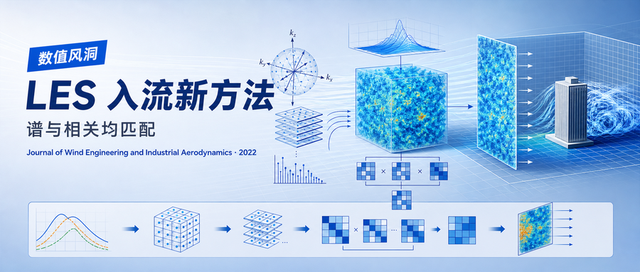

.. contents:: 本页目录
   :local:
   :depth: 2

论文信息
--------

**原文题名**：Consistency improved random flow generation method for large eddy simulation of atmospheric boundary layer

**中文题名**：用于大气边界层大涡模拟的一致性改进随机流生成方法

**作者**：:student-first-author:`Lingwei Chen` :sup:`a`，**Chao Li** :sup:`a,*`，Jinghan Wang :sup:`a`，Gang Hu :sup:`a`，Qingxing Zheng :sup:`b`，Qingfeng Zhou :sup:`c`，Yiqing Xiao :sup:`a`

**原论文署名单位**：

- :sup:`a` 哈尔滨工业大学（深圳）土木与环境工程学院，中国深圳
- :sup:`b` 深圳市建筑设计研究总院有限公司，中国深圳
- :sup:`c` 深圳市城市规划与国土资源研究中心，中国深圳

**原论文通讯作者脚注**：\* 通讯作者；电子邮箱：lichaosz@hit.edu.cn（C. Li）

**期刊**：Journal of Wind Engineering & Industrial Aerodynamics, 229 (2022) 105147

**DOI**：https://doi.org/10.1016/j.jweia.2022.105147

**收稿与出版信息**：2022 年 2 月 23 日收稿；2022 年 7 月 29 日收到修订稿；2022 年 8 月 19 日录用；2022 年 9 月 13 日在线发表。

摘要
----

真实的入流湍流是大气边界层（atmospheric boundary layer, ABL）大涡模拟（large eddy simulation, LES）获得准确结果的关键。现有合成湍流方法已经得到广泛应用，但仍存在空间相关性以及不同速度分量之间的互相关性不能被严格再现的问题。为此，论文提出了一种新的入流湍流生成（inflow turbulence generation, ITG）方法，即一致性改进随机流生成方法（consistency improved random flow generation, CIRFG）。该方法通过显式嵌入湍流特征来模拟空间相关性和不同速度分量之间的互相关性，因此可以在无需经验参数的情况下用于任意场景。同时，CIRFG 仍保持满足任意平均风速、湍流强度、频率谱、时间相关性等目标湍流特征的能力。进一步的大气边界层流场模拟表明，该方法具有良好的风剖面自维持能力。最后，通过与高层建筑绕流风洞试验结果对比，验证了该方法的准确性和可行性。

关键词
------

空间相关性；互相关性；入流湍流生成；高层建筑；大涡模拟；大气边界层。

符号与缩写
----------

符号
~~~~

- :math:`B` ：高层建筑宽度。
- :math:`c_i` ：取决于三维谱形式的函数值。
- :math:`C_j` ：第 :math:`j` 个方向的相干衰减常数。
- :math:`C_u^y` ：与 :math:`u` 分量有关的 :math:`Y` 方向相干衰减常数。
- :math:`Coh_u^y(f)` ：与 :math:`u` 分量有关的 :math:`Y` 方向相干函数。
- :math:`C_p` ：风压系数。
- :math:`C_D` ：基底阻力系数。
- :math:`C_L` ：基底升力系数。
- :math:`C_{Mx},C_{My},C_{Mz}` ：基底力矩系数。
- :math:`D` ：高层建筑深度。
- :math:`D_c` ：特征距离。
- :math:`\mathbf{e}_1` ： :math:`X` 方向单位向量。
- :math:`\mathbf{e}_2` ： :math:`Y` 方向单位向量。
- :math:`E(\cdot)` ：数学期望函数。
- :math:`f_n` ：频率。
- :math:`f_{max}` ：最大截断频率。
- :math:`F_x,F_y` ：分别为 :math:`X` 和 :math:`Y` 方向的基底力。
- :math:`g_{r_{i,n}}(r_{i,n})` ： :math:`r_{i,n}` 的概率密度函数。
- :math:`g_{\varphi_n}(\varphi_n)` ： :math:`\varphi_n` 的概率密度函数。
- :math:`G_i^t(f)` ：与第 :math:`i` 个分量有关的两侧时间谱。
- :math:`G_i^j(k_j)` ：与第 :math:`i` 个分量有关的第 :math:`j` 个方向的一维两侧波数谱。
- :math:`H` ：高层建筑高度。
- :math:`H_{ref}` ：参考高度。
- :math:`I_i` ：与第 :math:`i` 个分量有关的湍流强度。
- :math:`\mathbf{k}_n` ：波数向量。
- :math:`L_u^x,L_v^x,L_w^x` ：分别与 :math:`u` 、 :math:`v` 和 :math:`w` 分量有关的 :math:`X` 方向湍流积分尺度。
- :math:`L_s` ：空间调整参数。
- :math:`L_{j,m}` ：CDRFG 方法中调整空间相干函数的参数。
- :math:`L_{j,n}` ：NSRFG 方法中调整空间相干函数的参数。
- :math:`M` ：谱段数。
- :math:`M_x,M_y,M_z` ：基底力矩。
- :math:`N` ：DSRFG、MDSRFG 和 CDRFG 方法中各谱段内的随机频率数；NSRFG 和 CIRFG 方法中的谱段数。
- :math:`p_{i,n}` ：NSRFG 和 CIRFG 方法中的幅值。
- :math:`p_i^{m,n},q_i^{m,n}` ：DSRFG、MDSRFG 和 CDRFG 方法中的幅值。
- :math:`p_{ref}` ：参考压力。
- :math:`r_i^{m,n}` ：DSRFG、MDSRFG 和 CDRFG 方法中均值为零、标准差为一的正态分布随机数。
- :math:`r_{i,n}` ：CIRFG 方法中的均匀分布随机数。
- :math:`R_{ij}^t(\tau)` ：与第 :math:`i` 和第 :math:`j` 个分量有关的时间互相关函数。
- :math:`R_i^t(\tau)` ：与第 :math:`i` 个分量有关的时间相关函数。
- :math:`R_{\cdot i}^j(r)` ：与第 :math:`i` 个分量有关的第 :math:`j` 个方向的空间相关函数。
- :math:`Sc_{ij}` ：Hémon 和 Santi 提出的空间相关函数；原符号表此处的引文括号为空。
- :math:`S_i^t(f)` ：与第 :math:`i` 个分量有关的一侧时间谱。
- :math:`S_i^j(k_j)` ：与第 :math:`i` 个分量有关的第 :math:`j` 个方向的一维一侧波数谱。
- :math:`S_i^{|k|}(k)` ：与第 :math:`i` 个分量有关的三维谱。
- :math:`\mathrm{sign}(\cdot)` ：符号函数。
- :math:`t` ：时间。
- :math:`u_i` ： :math:`i=1,2,3` 时分别为纵向 :math:`u` 、横向 :math:`v` 和竖向 :math:`w` 分量的脉动速度。
- :math:`U_{avg}` ：平均速度。
- :math:`U_{ref}` ：参考风速。
- :math:`U_H` ：建筑高度处的速度。
- :math:`U(d_i-1,d_i)` ：下界为 :math:`d_i-1` 、上界为 :math:`d_i` 的均匀分布，其中 :math:`d_i\in[0,1]` 。
- :math:`\mathbf{x}` ：空间坐标， :math:`\mathbf{x}=(x_1,x_2,x_3)` ； :math:`j=1,2,3` 时， :math:`x_j` 分别表示 :math:`X` 、 :math:`Y` 和 :math:`Z` 方向坐标。
- :math:`y^+_{1st}` ：第一层网格的无量纲壁面距离。
- :math:`\alpha` ：平均风速剖面的幂律指数。
- :math:`\gamma_j` ：第 :math:`j` 个方向的空间调整系数。
- :math:`\delta(\cdot)` ：Dirac 函数。
- :math:`\theta_1` ：空间相关性的经验调整系数。
- :math:`\theta_2` ：时间相关性的经验调整系数。
- :math:`\theta_n` ：在 :math:`0` 至 :math:`2\pi` 范围内均匀分布的随机数。
- :math:`\Delta f` ：频率步长。
- :math:`\Delta k_{2,n}` ：波数间隔大小。
- :math:`\Delta x^+` ：流向网格间距的无量纲距离。
- :math:`\Delta z^+` ：横向网格间距的无量纲距离。
- :math:`\xi_{ij}` ：尺度因子。
- :math:`\rho` ：入流湍流的密度，等于 :math:`1.225\,\mathrm{kg/m^3}` 。
- :math:`\rho_{ij}` ：与第 :math:`i` 和第 :math:`j` 个分量有关的互相关系数。
- :math:`\rho_i^j(r)` ：与第 :math:`i` 个分量有关的第 :math:`j` 个方向的空间相关系数。
- :math:`\sigma_i` ：第 :math:`i` 个脉动速度的标准差。
- :math:`\tau_0` ：时间调整参数。
- :math:`\varphi_n` ：服从 :math:`0` 至 :math:`2\pi` 范围内均匀分布的随机相位角。

缩写
~~~~

- ABL（Atmospheric boundary layer）：大气边界层。
- CD（Computational domain）：计算域。
- CDRFG（Consistent discrete random flow generation）：一致性离散随机流生成。
- CFL（Courant-Friedrichs-Lewy）：Courant--Friedrichs--Lewy 条件。
- CIRFG（Consistency improved random flow generation）：一致性改进随机流生成。
- CWE（Computational wind engineering）：计算风工程。
- DSRFG（Discretizing and synthesizing random flow generation）：离散合成随机流生成。
- ESDU（Engineering Sciences Data Unit）：工程科学数据单元。
- ITG（Inflow turbulence generation）：入流湍流生成。
- LES（Large eddy simulation）：大涡模拟。
- MDSRFG（Modified DSRFG）：修正的 DSRFG。
- NSRFG（Narrowband synthesis random flow generator）：窄带合成随机流生成器。
- PISO（Pressure-implicit with the splitting of operators）：算子分裂压力隐式算法。
- PRFG（Prescribed-wavevector random flow generator）：预设波向量随机流生成器。
- PSD（Power spectral density）：功率谱密度。
- RFG（Random flow generation）：随机流生成。
- STD（Standard deviation）：标准差。
- TPU（Tokyo Polytechnic University）：东京工艺大学。
- VBIC（Variationally based inflow correction）：基于变分的入流修正。
- WALE（Wall-adapting local eddy-viscosity）：壁面自适应局部涡黏模型。
- WAWS（Weighted amplitude wave superposition）：加权幅值波叠加。

1 引言
------

随着计算风工程（CWE）的快速发展，大涡模拟（LES）已广泛用于评估超高层和大跨建筑的气动效应。作为 LES 的研究热点，重现真实大气边界层（ABL）需要充分准备的湍流入流边界条件，这是获得准确模拟结果的重要因素之一（Dagnew and Bitsuamlak, 2013; Xie and Castro, 2008; Tutar and Celik, 2007; Sagaut et al., 2004）。入流湍流生成（ITG）方法面临的主要挑战是，生成的湍流场不仅应满足所需的湍流特征，例如平均速度、湍流强度、速度功率谱密度（PSD）、时空相关性等，还应与 Navier--Stokes 方程和边界条件相匹配（Dagnew and Bitsuamlak, 2014; Huang et al., 2010; Yu et al., 2018; Aboshosha et al., 2015; Melaku et al., 2017; Patruno and de Miranda, 2020）。因此，十分需要一种适当而高效的 ITG 方法。

根据 Huang et al. (2010)、Keating et al. (2004)、Sagaut (2006)、Tabor and Baba-Ahmadi (2010)、Wu (2017) 和 Dhamankar et al. (2018) 的研究，ITG 方法主要分为三类：（1）前驱数据库法；（2）循环法；（3）合成湍流法。前驱数据库法的流动模拟过程分为两步。首先通过母模拟将时空湍流速度保存到数据库，然后将预先生成的入流湍流用作目标区域的入流边界条件（Wu, 2017）。对于循环法，计算域（CD）分为驱动域和计算域。在驱动域中循环湍流，直到流动满足指定的湍流特征，然后保存映射平面的速度数据，作为计算域的入流边界条件（Lund et al., 1998; Nozawa and Tamura, 2002）。然而，前驱数据库法和循环法都由于较高的计算需求以及对粗糙元形状和分布的依赖而缺乏灵活性与通用性（Tamura et al., 2008）。

第三类 ITG 方法是已得到广泛应用的合成湍流法，因为这类方法相对容易实施，计算效率高，而且生成的湍流场能够满足更多所需的湍流特征。合成湍流法分为合成随机 Fourier 法、基于本征正交分解的方法、合成数字滤波法、合成相干涡法以及合成体积力法（Tabor and Baba-Ahmadi, 2010; Wu, 2017; Dhamankar et al., 2018; Klein et al., 2003; Kempf et al., 2012）。其中，合成随机 Fourier 法主要分为两组（Huang et al., 2010）。第一组主要通过加权幅值波叠加（WAWS）方法生成入流湍流，其缺点是与无散度条件和并行算法不兼容，相关研究见 Melaku and Bitsuamlak (2021)、Kondo et al. (1997)、Deodatis (1996)、Maruyama and Morikawa (1994)、Iwatani (1982)、Hoshiya (1972)、Shinozuka and Jan (1972) 以及 Shinozuka (1971)。

第二组合成随机 Fourier 法包括 Huang et al. (2010)、Yu et al. (2018)、Aboshosha et al. (2015)、Melaku et al. (2017)、Patruno and de Miranda (2020)、Kraichnan (1970)、Smirnov et al. (2001)、Batten et al. (2004)、Castro and Paz (2011, 2013) 和 Patruno and Ricci (2017, 2018) 的研究。这一组最初由 Kraichnan (1970) 的工作发展而来，能够利用并行算法生成均匀、各向同性、无散度的流场。随后，Smirnov 等在原始过程的基础上提出随机流生成（RFG）方法，生成满足 Gaussian 模型谱密度的各向异性湍流（Smirnov et al., 2001），但该模型与低层 ABL 的真实谱模型有很大差别（Lumley and Panofsky, 1964）。因此，Huang 等提出离散合成 RFG（DSRFG）方法，使其能够满足任意各向异性谱密度模型（Huang et al., 2010）；Castro 等则提出修正的 DSRFG（MDSRFG）方法，以调整时间相关性（Castro and Paz, 2013）。此外，Aboshosha 等提出了能够考虑空间相干性的一致性离散 RFG（CDRFG）方法；Yu 等提出窄带合成 RFG（NSRFG）方法，通过采用更简洁的表达式实现了较高的计算效率（Yu et al., 2018）。

最近，Patruno 等提出了预设波向量 RFG（PRFG）方法（Patruno and Ricci, 2017），可合成具有预设谱和积分尺度的均匀、各向异性、无散度湍流场；他们还提出名为 :math:`\mathrm{PRFG}^3` 的扩展方法，以重现满足完整三维能谱的湍流场（Patruno and Ricci, 2018），而完整三维能谱目前仍未被充分认识。需要指出，相较于其他已有技术，这两种方法能够针对均匀湍流同时嵌入无散度条件和 Taylor 冻结假设（Bervida et al., 2020）。然而，上述基于 RFG 的方法在生成非均匀湍流场时不能严格施加无散度条件，而且均未考虑与计算域侧边界条件的兼容性。因此，研究者提出了基于变分的入流修正（VBIC）方法，以解决上述问题并减小不希望出现的压力脉动（Patruno and de Miranda, 2020）。

尽管基于 RFG 的方法发展迅速，除原始 RFG 方法外，既有技术几乎没有考虑不同速度分量之间的互相关性。同时，除 PRFG 和 :math:`\mathrm{PRFG}^3` 方法外，其他基于 RFG 的方法均嵌入了经验调整参数来修正时空相关性；如果经验调整参数确定不当，就可能导致方法对不同情形的适用性较弱（Melaku and Bitsuamlak, 2021）。在本研究中，为克服这两项缺点并施加 Taylor 冻结假设，我们系统地提出一种用于 LES 的新 ITG 方法。本文其余部分安排如下：第 2 节简要分析既有的 RFG 类方法；第 3 节通过从理论上嵌入目标湍流特征，详细介绍所提方法的公式；第 4 节分析生成的湍流特征结果，以验证所提方法的理论推导；第 5 节进行 ABL 流动及高层建筑绕流模拟，并与东京工艺大学（TPU）风洞试验结果比较，以验证所提方法的精度；最后，第 6 节总结本研究的主要结论。

2 既有 RFG 方法简要分析
------------------------

本节对既有的 RFG 类方法作简要分析。在分析之前，有必要正确理解一维时间谱、一维空间谱和三维谱的概念，相关内容见 Durbin and Pettersson Reif (2011) 及 Tennekes et al. (1972)。简言之，时间谱也称频率谱，定义为同一点处随时间延迟变化的相关函数的 Fourier 变换；一维空间谱也称一维波数谱，是在零时间延迟下、沿固定方向的空间间隔所得到的相关函数的 Fourier 变换。与上述谱不同，为消除方向信息，三维谱定义为将三维空间谱密度在半径等于波数向量模长的球壳上进行积分。

首先值得注意的是，Kraichnan (1970) 最初工作的目的是通过四种波数向量分布选择施加均匀的三维谱，并通过服从零均值 Gaussian 分布的角频率施加指数形式的时间相关系数。随后提出的 DSRFG 方法（见附录 A）通过离散目标三维谱并合成湍流，生成满足任意三维谱的湍流场；Castro 等提出的 MDSRFG 方法（见附录 B）则通过采用时间调整参数，加强对时间相关性的控制（Castro and Paz, 2013）。需要注意，与原始过程类似，DSRFG 和 MCDRFG 方法所采用的角频率服从零均值 Gaussian 分布，这意味着相较于 von Kármán 时间谱，生成的时间谱在低频范围内可能具有更高能量。此外，这两种方法的另一项限制是，非均匀三维谱通常未知。

最近，CDRFG 和 NSRFG 两种方法通过改变频率分布，使任意时间谱得以施加，例如式 (1) 所描述的 von Kármán 时间谱（Simiu and Scanlan, 1996）。这两种方法的更多细节分别见附录 C 和附录 D。Yu 等指出，CDRFG 方法的关键问题在于计算资源消耗较高，因为每一步都需要求解复杂的非线性方程来获得波数矩阵。因此，NSRFG 方法采用更简洁的表达式来提高计算效率，这已在 Yu et al. (2018) 中得到验证。此外，NSRFG 方法将湍流场的空间相关性扩展到三个方向。

.. math::

   \left\{
   \begin{aligned}
   S_u^t(f) &= \frac{4(I_u U_{avg})^2(L_u^x/U_{avg})}
   {\left[1+70.8(fL_u^x/U_{avg})^2\right]^{5/6}}, && f\in[0,\infty), \\
   S_v^t(f) &= \frac{4(I_v U_{avg})^2(L_v^x/U_{avg})\left[1+188.4\left(2fL_v^x/U_{avg}\right)^2\right]}
   {\left[1+70.8\left(2fL_v^x/U_{avg}\right)^2\right]^{11/6}}, && f\in[0,\infty), \\
   S_w^t(f) &= \frac{4(I_w U_{avg})^2(L_w^x/U_{avg})\left[1+188.4\left(2fL_w^x/U_{avg}\right)^2\right]}
   {\left[1+70.8\left(2fL_w^x/U_{avg}\right)^2\right]^{11/6}}, && f\in[0,\infty).
   \end{aligned}
   \right.\qquad (1)

然而，上述四种 RFG 类方法存在两项相同的限制：（1）既有方法只通过经验调整参数来调整空间相关性，例如式 (A4) 中的空间调整参数 :math:`\theta_1` （见附录 A），以及式 (C7) 和式 (D6) 中的调整系数 :math:`\gamma` （见附录 C 和附录 D）。一方面，需要针对不同情形通过多次尝试确定经验调整参数，这可能消耗更多计算资源；另一方面，生成的湍流场只能近似满足预设的空间相关性。（2）所考察的方法没有考虑不同速度分量之间的互相关性，而这可能是影响 LES 模拟精度的重要因素。本研究的目的就是提出一种更准确、更可行的 ITG 方法，以克服上述缺陷。

最后，尽管对于非均匀湍流场而言，所有 RFG 类方法都难以严格施加无散度条件，而且没有考虑与侧边界条件的兼容性，但我们可以在出口施加 outflow 边界条件，并选择合适的压力参考位置，从而减小目标位置附近压力脉动的产生。另一种选择是使用 VBIC 方法解决这一问题。

译注：本节原文将前述 MDSRFG 写作 MCDRFG；此处保留原文该处缩写，不将其视为另行定义的新方法。

3 一致性改进随机流生成方法 CIRFG
----------------------------------

3.1 方法目标
~~~~~~~~~~~~

本节提出一致性改进随机流生成（CIRFG）方法。综合考虑湍流特征的可获得性以及既有方法的缺陷，新的 CIRFG 方法旨在实现以下目标：

1. 满足基本目标湍流特征，包括任意平均风速、湍流强度、频率谱、时间相关性等。
2. 满足 Taylor 冻结假设，并自动施加对应的一维 :math:`X` 方向波数谱和空间相关性。
3. 无需经验参数即可实现任意 :math:`Y` 方向空间相关性。
4. 实现不同速度分量之间任意互相关性。
5. 对均匀湍流场满足无散度条件。
6. 保持与 NSRFG 方法相同的高计算效率，并适用于并行计算。

3.2 新入流湍流生成器的推导
~~~~~~~~~~~~~~~~~~~~~~~~~~

与 NSRFG 方法类似，CIRFG 方法采用式 (2) 所示的简洁表达式。

.. math::

   u_i(\mathbf{x},t)=\sum_{n=1}^{N} p_{i,n}\sin(\mathbf{k}_n\cdot\mathbf{x}+2\pi f_n t+\varphi_n).\qquad (2)

其中， :math:`i=1,2,3` 时， :math:`u_i` 分别表示纵向 :math:`u` 、横向 :math:`v` 和竖向 :math:`w` 分量的脉动速度； :math:`\mathbf{x}=(x_1,x_2,x_3)` 表示空间坐标， :math:`j=1,2,3` 时， :math:`x_j` 分别表示 :math:`X` 、 :math:`Y` 、 :math:`Z` 方向坐标； :math:`N` 为谱段数； :math:`p_{i,n}` 为幅值，按式 (3) 计算； :math:`\mathbf{k}_n=(k_{1,n},k_{2,n},k_{3,n})` 为波数向量； :math:`f_n` 为频率，按式 (4) 计算； :math:`t` 为时间； :math:`\varphi_n` 为服从 :math:`0` 至 :math:`2\pi` 范围内均匀分布的随机相位角，相应概率密度函数可表示为式 (5)。

.. math::

   p_{i,n}=\mathrm{sign}(r_{i,n})\sqrt{2S_i^t(f_n)\Delta f}.\qquad (3)

其中， :math:`r_{i,n}` 是与不同速度分量之间的互相关性有关的随机数； :math:`i=1,2,3` 时， :math:`S_i^t(f_n)` 分别表示纵向、横向和竖向分量的一侧时间谱。

.. math::

   f_n=\frac{2n-1}{2}\Delta f=\frac{(2n-1)f_{max}}{2N-1}.\qquad (4)

其中， :math:`f_{max}` 为最大截断频率； :math:`\Delta f` 为频率步长。

.. math::

   g_{\varphi_n}(\varphi_n)=
   \begin{cases}
   \dfrac{1}{2\pi}, & 0<\varphi_n<2\pi,\\
   0, & \text{其他情形}.
   \end{cases}\qquad (5)

其中， :math:`g_{\varphi_n}(\varphi_n)` 为 :math:`\varphi_n` 的概率密度函数。

3.2.1 参数 :math:`r_{i,n}` 的推导
^^^^^^^^^^^^^^^^^^^^^^^^^^^^^^^^^

参数 :math:`r_{i,n}` 主要与不同速度分量之间的互相关性有关，引入该参数是为了增加幅值的随机性。对于非均匀湍流场，其推导过程可分为四个步骤。

**步骤 1：确定参考高度和不同速度分量之间的目标互相关系数。** 为消除对后续空间相关性推导的影响，需要先在固定参考高度处推导参数 :math:`r_{i,n}` 的随机数矩阵，再将这个固定随机数矩阵用于所有点。一般而言，记为 :math:`H_{ref}` 的参考高度通常可选在目标位置，例如建筑高度处。此外，不同速度分量之间的目标互相关系数 :math:`\rho_{uv,T},\rho_{uw,T},\rho_{vw,T}` （下标 :math:`T` 表示目标值）通常取在 :math:`-1` 至 :math:`1` 之间。

**步骤 2：计算尺度因子，定义为目标互相关系数与最大计算互相关系数的比值。** 由于 :math:`r_{i,n}` 和 :math:`\varphi_n` 都是随机变量，应通过不同速度分量的集合平均计算时间互相关函数，可写为：

.. math::

   \begin{aligned}
   R_{ij}^t(\tau)&=E\left[u_i(\mathbf{x},t)u_j(\mathbf{x},t+\tau)\right] \\
   &=\sum_{n=1}^N \left[\int_{-\infty}^{\infty}\int_{-\infty}^{\infty}
   \mathrm{sign}(r_{i,n})\mathrm{sign}(r_{j,n})g_{r_{i,n}}(r_{i,n})g_{r_{j,n}}(r_{j,n})dr_{i,n}dr_{j,n}\right] \\
   &\quad\times\left[\int_0^{2\pi}\sqrt{S_i^t(f_n)S_i^t(f_n)}\Delta f\cos(2\pi f_n\tau)g_{\varphi_n}(\varphi_n)d\varphi_n\right] \\
   &=\sum_{n=1}^N E\left[\mathrm{sign}(r_{i,n})\mathrm{sign}(r_{j,n})\right]
   \sqrt{S_i^t(f_n)S_i^t(f_n)}\Delta f\cos(2\pi f_n\tau).
   \end{aligned}\qquad (6)

原文式 (6) 的两处谱乘积均印为 :math:`S_i^t(f_n)S_i^t(f_n)` ，而紧随其后的式 (7) 使用 :math:`S_i^t(f_n)S_j^t(f_n)` 。此处保留两式的原排式差异。

其中， :math:`E(\cdot)` 为数学期望函数； :math:`g_{r_{i,n}}(r_{i,n})` 为 :math:`r_{i,n}` 的概率密度函数。相应的计算时间互相关系数可写为：

.. math::

   \rho_{ij,C}=\frac{R_{ij}^t(0)}{\sigma_i\sigma_j}
   =\frac{\sum_{n=1}^{N}E\left[\mathrm{sign}(r_{i,n})\mathrm{sign}(r_{j,n})\right]
   \sqrt{S_i^t(f_n)S_j^t(f_n)}\Delta f}{\sigma_i\sigma_j}.\qquad (7)

其中， :math:`\rho_{ij,C}` 表示计算得到的时间互相关系数，下标 :math:`C` 表示计算值； :math:`\sigma_i` 为第 :math:`i` 个脉动速度的标准差，按式 (8) 计算。

.. math::

   \sigma_i=\sqrt{\sum_{n=1}^{N}S_i^t(f_n)\Delta f}.\qquad (8)

由于 :math:`\mathrm{sign}(r_{i,n})\mathrm{sign}(r_{j,n})` 只可能取 :math:`-1` 、0 或 1，最大计算互相关系数为：

.. math::

   \rho_{ij,C}^{max}=\frac{\sum_{n=1}^{N}\sqrt{S_i^t(f_n)S_j^t(f_n)}\Delta f}{\sigma_i\sigma_j}.\qquad (9)

于是尺度因子可写为：

.. math::

   \xi_{ij}=\frac{\rho_{ij,T}}{\rho_{ij,C}^{max}}.\qquad (10)

其中， :math:`\xi_{ij}` 表示第 :math:`i` 和第 :math:`j` 个脉动速度分量的尺度因子。

步骤 3：建立关于 :math:`r_{i,n}` 随机分布的联立方程。 假设 :math:`r_{i,n}` 服从均匀分布，即：

.. math::

   r_{i,n}\sim U(d_i-1,d_i).\qquad (11)

其中 :math:`d_i\in[0,1]` 。于是 :math:`\mathrm{sign}(r_{i,n})` 和 :math:`\mathrm{sign}(r_{i,n})\mathrm{sign}(r_{j,n})` 的分布律分别为：

.. math::

   \mathrm{sign}(r_i)\sim
   \begin{bmatrix}
   -1 & 0 & 1\\
   1-d_i & 0 & d_i
   \end{bmatrix}.\qquad (12)

.. math::

   \mathrm{sign}(r_i)\mathrm{sign}(r_j)\sim
   \begin{bmatrix}
   -1 & 0 & 1\\
   d_i+d_j-2d_id_j & 0 & 1+2d_id_j-d_i-d_j
   \end{bmatrix}.\qquad (13)

根据式 (13)， :math:`\mathrm{sign}(r_{i,n})\mathrm{sign}(r_{j,n})` 的期望可计算为：

.. math::

   E\left[\mathrm{sign}(r_i)\mathrm{sign}(r_j)\right]
   =-1\times(d_i+d_j-2d_id_j)+1\times(1+2d_id_j-d_i-d_j)
   =1+4d_id_j-2d_i-2d_j.\qquad (14)

假设期望 :math:`E[\mathrm{sign}(r_i)\mathrm{sign}(r_j)]` 等于尺度因子 :math:`\xi_{ij}` ，且 :math:`N\to\infty` ，则计算得到的时间互相关系数等于目标值，即：

.. math::

   \begin{aligned}
   \rho_{ij,C}
   &=\frac{\displaystyle\sum_{n=1}^{N}E[\mathrm{sign}(r_{i,n})\mathrm{sign}(r_{j,n})]\sqrt{S_i^t(f_n)S_j^t(f_n)}\Delta f}{\sigma_i\sigma_j}\\
   &=\frac{\displaystyle\sum_{n=1}^{N}\xi_{ij}\sqrt{S_i^t(f_n)S_j^t(f_n)}\Delta f}{\sigma_i\sigma_j}\\
   &=\xi_{ij}\frac{\displaystyle\sum_{n=1}^{N}\sqrt{S_i^t(f_n)S_j^t(f_n)}\Delta f}{\sigma_i\sigma_j}
   =\xi_{ij}\rho_{ij,C}^{max}=\rho_{ij,T}.
   \end{aligned}\qquad (15)

结合式 (14) 和式 (15)，关于随机分布的联立方程可写为：

.. math::

   \begin{cases}
   1+4d_ud_v-2d_u-2d_v=\xi_{uv},\\
   1+4d_ud_w-2d_u-2d_w=\xi_{uw},\\
   1+4d_vd_w-2d_v-2d_w=\xi_{vw},\\
   d_u,d_v,d_w\in[0,1].
   \end{cases}\qquad (16)

**步骤 4：求解联立方程。** 表 1 汇总了式 (16) 的解。根据表 1，为保证解的存在，有必要合理选择不同速度分量之间的目标互相关系数。

.. list-table:: 表 1 联立方程的解
   :header-rows: 1
   :widths: 6 45 49

   * - 编号
     - 前提条件
     - 联立方程的解
   * - 1
     - 若 :math:`\rho_{uv,T}=\rho_{uw,T}=\rho_{vw,T}=0`
     - :math:`d_u=d_v=d_w=\frac12`
   * - 2
     - 若 :math:`\rho_{ij,T}=\rho_{ik,T}=0,\ \rho_{jk,T}\ne0` ，其中 :math:`i\ne j\ne k`
     - :math:`d_i=\frac12` ； :math:`d_j=\frac12+\frac{\xi_{jk}}{4d_k-2}` ；当 :math:`\xi_{jk}<0` 时， :math:`d_k\in[\frac{1-\xi_{jk}}2,1]` ；或当 :math:`\xi_{jk}>0` 时， :math:`d_k\in[0,\frac{1-\xi_{jk}}2]`
   * - 3
     - 若 :math:`\rho_{uv,T}>0,\rho_{uw,T}>0,\rho_{vw,T}>0` ，并满足 :math:`0<\xi_{uv}\xi_{uw}\le\xi_{vw}` 、 :math:`0<\xi_{uv}\xi_{vw}\le\xi_{uw}` 、 :math:`0<\xi_{uw}\xi_{vw}\le\xi_{uv}` ；或若 :math:`\rho_{ij,T}<0,\rho_{ik,T}<0,\rho_{jk,T}>0` ，其中 :math:`i\ne j\ne k` ，并满足 :math:`0<\xi_{ij}\xi_{ik}\le\xi_{jk}` 、 :math:`0>\xi_{ij}\xi_{jk}\ge\xi_{ik}` 、 :math:`0>\xi_{ik}\xi_{jk}\ge\xi_{ij}`
     - :math:`d_u=\frac12-\frac{\xi_{uw}}2\sqrt{\frac{\xi_{uv}}{\xi_{uw}\xi_{vw}}}` ， :math:`d_v=\frac12-\frac{\xi_{vw}}2\sqrt{\frac{\xi_{uv}}{\xi_{uw}\xi_{vw}}}` ， :math:`d_w=\frac12-\frac12\sqrt{\frac{\xi_{uw}\xi_{vw}}{\xi_{uv}}}` ；或 :math:`d_u=\frac12+\frac{\xi_{uw}}2\sqrt{\frac{\xi_{uv}}{\xi_{uw}\xi_{vw}}}` ， :math:`d_v=\frac12+\frac{\xi_{vw}}2\sqrt{\frac{\xi_{uv}}{\xi_{uw}\xi_{vw}}}` ， :math:`d_w=\frac12+\frac12\sqrt{\frac{\xi_{uw}\xi_{vw}}{\xi_{uv}}}`
   * - 4
     - 其他条件
     - 式 (16) 无解，需要选择更加合理的不同速度分量目标互相关系数

3.2.2 参数 :math:`k_{1,n}` 的推导
^^^^^^^^^^^^^^^^^^^^^^^^^^^^^^^^^

根据 Patruno and Ricci (2017, 2018) 的研究，生成的湍流场有必要同时满足无散度条件和 Taylor 冻结假设，这两者对流体在计算域中的实际传输有显著影响。为生成满足 Taylor 冻结假设的湍流场，参数 :math:`k_{1,n}` 定义为：

.. math::

   k_{1,n}=-\frac{2\pi f_n}{U_{avg}}.\qquad (17)

将式 (17) 代回式 (2)，得到：

.. math::

   \begin{aligned}
   u_i(\mathbf{x},t-\tau)
   &=\sum_{n=1}^{N}p_{i,n}\sin\left[\mathbf{k}_n\cdot\mathbf{x}+2\pi f_n(t-\tau)+\varphi_n\right]\\
   &=\sum_{n=1}^{N}p_{i,n}\sin\left[k_{1,n}(x_1+U_{avg}\tau)+k_{2,n}x_2+k_{3,n}x_3+2\pi f_{n+t}+\varphi_n\right]\\
   &=u_i(\mathbf{x}+U_{avg}\tau\mathbf{e}_1,t).
   \end{aligned}\qquad (18)

原文式 (18) 第二行将频率项排为 :math:`2\pi f_{n+t}` ，与第一行的时间依赖形式不同；此处按原排式保留该差异。

其中， :math:`\mathbf{e}_1=(1,0,0)` 为 :math:`X` 方向单位向量。式 (18) 证明，当生成的湍涡以平均速度沿顺风方向平移时，它们保持冻结。因此，令 :math:`r=U_{avg}\tau` ， :math:`X` 方向空间相关与时间相关之间的关系可表示为：

.. math::

   R_{\cdot i}^{x}(r)=E\left[u_i(\mathbf{x},t)u_i(\mathbf{x}+U_{avg}\tau\mathbf{e}_1,t)\right]
   =E\left[u_i(\mathbf{x},t)u_i(\mathbf{x},t-\tau)\right]=R_i^t(-\tau)=R_i^t(\tau).\qquad (19)

其中， :math:`R_{\cdot i}^x(r)` 为第 :math:`i` 个分量在 :math:`X` 方向的空间相关函数； :math:`R_i^t(\tau)` 为第 :math:`i` 个分量的时间相关函数。相应地，一维两侧 :math:`X` 方向波数谱与频率谱之间的关系可计算为：

.. math::

   \begin{aligned}
   G_i^x(k_1)&=\frac{1}{2\pi}\int_{-\infty}^{\infty}R_i^x(r)\exp(-jk_1r)dr\\
   &=\frac{1}{2\pi}\int_{-\infty}^{\infty}R_i^t(\tau)\exp\left(-j\frac{2\pi f}{U_{avg}}U_{avg}\tau\right)d(U_{avg}\tau)\\
   &=\frac{U_{avg}}{2\pi}\int_{-\infty}^{\infty}R_i^t(\tau)\exp(-j2\pi f\tau)d\tau
   =\frac{U_{avg}}{2\pi}G_i^t(f).
   \end{aligned}\qquad (20)

其中， :math:`G_i^x(k_1)` 为与第 :math:`i` 个分量有关的 :math:`X` 方向一维两侧波数谱； :math:`G_i^t(f)` 为与第 :math:`i` 个分量有关的两侧时间谱。式 (20) 可改写为一侧谱形式，即：

.. math::

   S_i^x(k_1)=\frac{U_{avg}}{2\pi}S_i^t(f).\qquad (21)

因此，根据式 (21)，若选择 von Kármán 频率谱为目标（见式 (1)），则相应的 :math:`X` 方向 von Kármán 空间谱可写为式 (22)。这意味着生成的湍流场自动满足 :math:`X` 方向空间相关性，该相关性可通过对 :math:`X` 方向 von Kármán 空间谱作逆 Fourier 变换获得。

.. math::

   \left\{
   \begin{aligned}
   S_u^x(k_1) &= \frac{2U_{avg}}{\pi}\frac{(I_uU_{avg})^2(L_u^x/U_{avg})}
   {\left[1+70.8(k_1L_u^x/2\pi)^2\right]^{5/6}}, && k_1\in[0,\infty),\\
   S_v^x(k_1) &= \frac{2U_{avg}}{\pi}\frac{(I_vU_{avg})^2(L_v^x/U_{avg})\left[1+188.4(k_1L_v^x/\pi)^2\right]}
   {\left[1+70.8(k_1L_v^x/\pi)^2\right]^{11/6}}, && k_1\in[0,\infty),\\
   S_w^x(k_1) &= \frac{2U_{avg}}{\pi}\frac{(I_wU_{avg})^2(L_w^x/U_{avg})\left[1+188.4(k_1L_w^x/\pi)^2\right]}
   {\left[1+70.8(k_1L_w^x/\pi)^2\right]^{11/6}}, && k_1\in[0,\infty).
   \end{aligned}
   \right.\qquad (22)

3.2.3 参数 :math:`k_{2,n}` 的推导
^^^^^^^^^^^^^^^^^^^^^^^^^^^^^^^^^

参数 :math:`k_{2,n}` 主要与 :math:`Y` 方向空间相关性有关，从波数谱的角度推导。首先，对相应的空间相关系数作 Fourier 变换，可以得到 :math:`u` 分量在 :math:`Y` 方向的目标波数谱，即：

.. math::

   G_{u,T}^{y}(k_2)=\frac{(I_{u,T}U_{avg,T})^2}{2\pi}\int_{-\infty}^{\infty}\rho_{u,T}^{y}(r)\exp(-jk_2r)dr.\qquad (23)

其中， :math:`\rho_{u,T}^y(r)` 表示 :math:`u` 分量在 :math:`Y` 方向的目标空间相关系数。随后可将式 (23) 离散为一系列矩形面积之和（见图 1），并计算为一系列 Dirac 函数之和，即：

.. math::

   G_{u,T}^{y}(k_2)=\sum_{n=1}^{N}G_{u,T}^{y}(k_{2,n})\Delta k_{2,n}
   \left[\delta(k_2-k_{2,n})+\delta(k_2+k_{2,n})\right].\qquad (24)

计算得到的 :math:`Y` 方向空间相关函数为：

.. math::

   \begin{aligned}
   R_{u,C}^{y}(r)&=\lim_{T\to\infty}\frac{1}{T}\int_0^T u(\mathbf{x},t)u(\mathbf{x}+r\mathbf{e}_2,t)dt\\
   &=\lim_{T\to\infty}\frac{1}{T}\int_0^T\left[\sum_{n=1}^{N}p_{1,n}\sin(\mathbf{k}_n\cdot\mathbf{x}+2\pi f_nt+\varphi_n)\right]
   \left[\sum_{n=1}^{N}p_{1,n}\sin(\mathbf{k}_n\cdot\mathbf{x}+k_{2,n}r+2\pi f_nt+\varphi_n)\right]dt\\
   &=\sum_{n=1}^{N}S_u^t(f_n)\Delta f\cos(k_{2,n}r).
   \end{aligned}\qquad (25)

其中， :math:`\mathbf{e}_2=(0,1,0)` 为 :math:`Y` 方向单位向量。对 :math:`R_{u,C}^y(r)` 作 Fourier 变换，得到计算的两侧波数谱：

.. math::

   \begin{aligned}
   G_{u,C}^{y}(k_2)&=\frac{1}{2\pi}\int_{-\infty}^{\infty}R_{u,C}^{y}(r)\exp(-jk_2r)dr\\
   &=\frac{1}{2\pi}\int_{-\infty}^{\infty}\left[\sum_{n=1}^{N}S_u^t(f_n)\Delta f\cos(k_{2,n}r)\right]\exp(-jk_2r)dr\\
   &=\sum_{n=1}^{N}\frac{1}{2}S_u^t(f_n)\Delta f\left[\delta(k_2-k_{2,n})+\delta(k_2+k_{2,n})\right].
   \end{aligned}\qquad (26)

其中， :math:`\frac12 S_u^t(f_n)\Delta f` 表示图 1 中的矩形面积 :math:`A_n` 。比较式 (24) 与式 (26)，得到：

.. math::

   \begin{cases}
   A_1=\dfrac{1}{2}S_u^t(f_1)\Delta f=G_{u,T}^{y}(0)\Delta k_{2,1}, & n=1,\\
   A_n=\dfrac{1}{2}S_u^t(f_n)\Delta f=G_{u,T}^{y}(k_{2,n-1})\Delta k_{2,n}, & n=2,3,\ldots,N.
   \end{cases}\qquad (27)

根据式 (27)，递推序列由式 (28) 给出，波数间隔按式 (29) 计算。

.. math::

   k_{2,n}=\begin{cases}
   \Delta k_{2,1}, & n=1,\\
   k_{2,n-1}+\Delta k_{2,n}, & n=2,3,\ldots,N.
   \end{cases}\qquad (28)

.. math::

   \Delta k_{2,n}=\begin{cases}
   \dfrac{S_u^t(f_1)\Delta f}{2G_{u,T}^{y}(0)}, & n=1,\\
   \dfrac{S_u^t(f_n)\Delta f}{2G_{u,T}^{y}(k_{2,n-1})}, & n=2,3,\ldots,N.
   \end{cases}\qquad (29)

当 :math:`N\to\infty` 时，可得：

.. math::

   \lim_{N\to\infty}G_{u,C}^{y}(k_2)\approx G_{u,T}^{y}(k_2).\qquad (30)

因此，根据式 (30)，可以推断生成的湍流场能够近似满足 :math:`Y` 方向的目标空间相关性和波数谱。本研究采用 Hémon 和 Santi 提出的下列方程描述 :math:`Y` 方向的目标空间相关系数（Hémon and Santi, 2007; Davenport, 1995）：

.. math::

   Sc_{ij}=\sum_l\sqrt{S_{u,y_i}^{t}(f_l)S_{u,y_j}^{t}(f_l)}\,Coh_u^y(f_l)\Delta f.\qquad (31)

.. math::

   Coh_u^y(f_l)=\exp\left(-\frac{C_u^y|y_i-y_j|f_l}{U_{avg}}\right)\Delta f.\qquad (32)

其中， :math:`Coh_u^y(f_l)` 为空间相干函数； :math:`C_u^y` 表示衰减系数。将式 (31) 和式 (32) 代入式 (23)，可通过离散 Fourier 变换技术获得目标波数谱，再利用式 (28) 和式 (29) 计算 :math:`k_{2,n}` 的值。

译注：式 (32) 末尾的 :math:`\Delta f` 按原文保留。

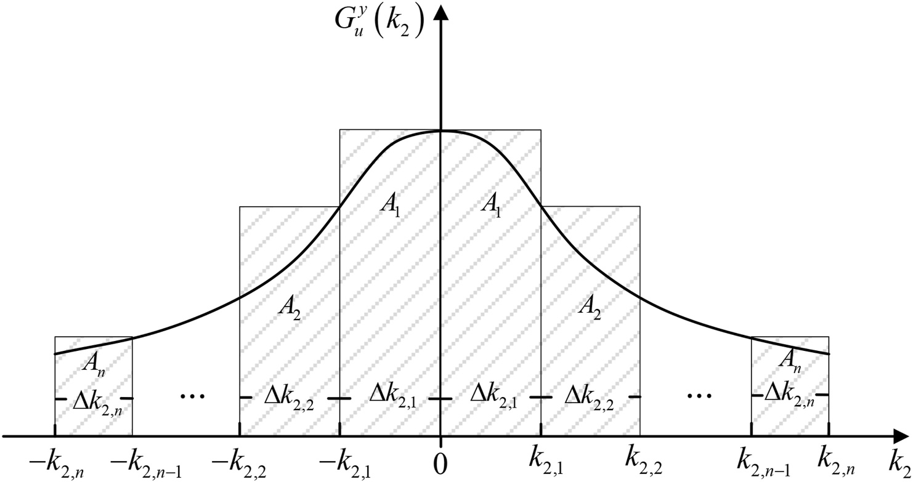

   **图 1** :math:`Y` 方向两侧波数谱的积分示意图。

   图内符号： :math:`G_u^y(k_2)` 为 :math:`Y` 方向两侧波数谱， :math:`k_2` 为波数， :math:`A_n` 为矩形面积， :math:`\Delta k_{2,n}` 为波数间隔。

3.2.4 参数 :math:`k_{3,n}` 的推导
^^^^^^^^^^^^^^^^^^^^^^^^^^^^^^^^^

CIRFG 方法的主要优点之一是为生成的湍流场保持无散度条件。对于不可压缩湍流场，连续方程可写为：

.. math::

   \sum_{i=1}^{3}\frac{\partial u_i}{\partial x_i}=0.\qquad (33)

参数 :math:`k_{3,n}` 的推导分两方面讨论。一方面，若目标是生成均匀湍流场，则式 (2) 中采用的参数在不同空间点应相同；将式 (2) 代入式 (33)，得到：

.. math::

   \sum_{n=1}^{N}\left[\left(\sum_{i=1}^{3}p_{i,n}k_{i,n}\right)\cos(\mathbf{k}_n\cdot\mathbf{x}+2\pi f_nt+\varphi_n)\right]=0.\qquad (34)

令 :math:`\sum_{i=1}^{3}p_{i,n}k_{i,n}=0` ，则式 (34) 成为恒等式。结合式 (3)，得到：

.. math::

   \sum_{i=1}^{3}\mathrm{sign}(r_{i,n})\sqrt{S_i^t(f_n)}k_{i,n}=0.\qquad (35)

根据式 (35)，确定 :math:`k_{1,n}` 和 :math:`k_{2,n}` 后，可通过求解一元线性方程计算 :math:`k_{3,n}` 。相比于 DSRFG、MDSRFG 和 CDRFG 方法通过求解三元非线性方程获得波数矩阵，CIRFG 方法显然具有更高的计算效率。NSRFG 方法通过生成随机数来计算波数矩阵，因此 CIRFG 方法的计算效率与 NSRFG 方法几乎相同。

另一方面，若目标是获得 CWE 中广泛使用的 :math:`Z` 方向非均匀湍流场，则湍流特征仅沿 :math:`Z` 方向变化。根据 CIRFG 方法的波数公式， :math:`\mathbf{k}` 的每个分量都是 :math:`Z` 坐标的函数。因此，式 (33) 的第三项可表示如下：

.. math::

   \begin{aligned}
   \frac{\partial u_3}{\partial x_3}
   &=\sum_{n=1}^{N}k_{3,n}p_{3,n}\cos(\mathbf{k}_n\cdot\mathbf{x}+2\pi f_nt+\varphi_n)
   +\sum_{n=1}^{N}\frac{\partial p_{3,n}}{\partial x_3}\sin(\mathbf{k}_n\cdot\mathbf{x}+2\pi f_nt+\varphi_n)\\
   &\quad+\sum_{n=1}^{N}\left(\frac{\partial k_{1,n}}{\partial x_3}x_1+\frac{\partial k_{2,n}}{\partial x_3}x_2+\frac{\partial k_{3,n}}{\partial x_3}x_3\right)
   p_{3,n}\cos(\mathbf{k}_n\cdot\mathbf{x}+2\pi f_nt+\varphi_n).
   \end{aligned}\qquad (36)

由于式 (36) 右侧第二项和第三项具有很强的非线性，难以直接求得满足连续方程的 :math:`k_{3,n}` 解。然而，基于以下三个原因，我们仍可通过式 (35) 计算 :math:`k_{3,n}` 的近似解：（1）入口平面上生成湍流场的过程不包含对 :math:`X` 坐标的导数，因此并不特别要求无散度条件（Wang and Chen, 2020）；（2）简单的入口质量通量修正可能优于针对无散度条件的调整（Kim et al., 2013），而入口质量通量修正对湍流统计特征的影响较小（Wang and Chen, 2020）；（3）正如 Kraichnan (1970) 和 Castro and Paz (2013) 指出的，若非均匀湍流特征在空间中变化足够缓慢，其对无散度条件的影响就足够小而可忽略，例如 Dagnew and Bitsuamlak (2014)、Huang et al. (2010)、Yu et al. (2018)、Aboshosha et al. (2015)、Kraichnan (1970)、Batten et al. (2004) 和 Castro and Paz (2011) 的研究。

至此，所有参数的推导均已完成，CIRFG 方法流程图如图 2 所示。

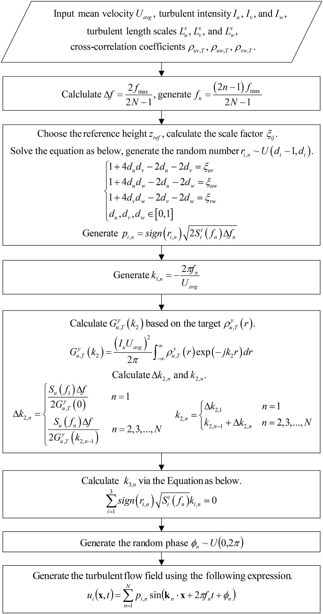

   **图 2** CIRFG 方法流程图。

   图内流程自上而下依次为：输入平均速度 :math:`U_{avg}` 、湍流强度 :math:`I_u,I_v,I_w` 、湍流积分尺度 :math:`L_u^x,L_v^x,L_w^x` 和互相关系数 :math:`\rho_{uv,T},\rho_{uw,T},\rho_{vw,T}` ；计算 :math:`\Delta f=2f_{max}/(2N-1)` 并生成 :math:`f_n=(2n-1)f_{max}/(2N-1)` ；选择参考高度 :math:`z_{ref}` ，计算尺度因子 :math:`\xi_{ij}` ，求解所示方程组以生成随机数 :math:`r_{i,n}\sim U(d_i-1,d_i)` ，再生成幅值 :math:`p_{i,n}` ；生成 :math:`k_{1,n}=-2\pi f_n/U_{avg}` ；由目标 :math:`\rho_{u,T}^y(r)` 计算 :math:`G_{u,T}^y(k_2)` ，进而计算 :math:`\Delta k_{2,n}` 与 :math:`k_{2,n}` ；通过所示无散度方程计算 :math:`k_{3,n}` ；生成随机相位 :math:`\varphi_n\sim U(0,2\pi)` ；利用所示合成表达式生成湍流场。图内 sign 表示符号函数。

4 CIRFG 方法验证
----------------

4.1 操作设置
~~~~~~~~~~~~

为验证 CIRFG 方法的理论推导，本研究选择从 TPU 数据库获得的非均匀湍流特征（见表 2）作为目标（TPU Aerodynamic Database, 2003）。需要注意，TPU 数据库未给出横向和竖向湍流强度剖面，因此根据工程科学数据单元（ESDU）标准（ESDU, 2001），引入比例系数 0.78 和 0.55，分别表示它们与纵向湍流强度剖面的关系。

此外，TPU 数据库也未给出 :math:`X` 方向的纵向积分尺度剖面，因此建议从类似试验中提取这一目标特征（Wang and Chen, 2020; Ueda, 1993），其值等于参考高度 :math:`0.4\,\mathrm{m}` 。根据局部各向同性假设， :math:`X` 方向的横向和竖向积分尺度剖面取为纵向分量的一半（Wang and Chen, 2020; ESDU, 2001）。此外，模拟采用 von Kármán 频率谱， :math:`0.4\,\mathrm{m}` 高度处的参考平均速度取为 :math:`11\,\mathrm{m/s}` 。

如表 3 和图 3 所示，设置三组空间监测点，分别验证 CIRFG 方法在 :math:`X` 、 :math:`Y` 、 :math:`Z` 方向的性能。此外，时间步长设为 :math:`0.001\,\mathrm{s}` ，所有工况均求解 20000 个时间步，对应总模拟时间 :math:`20\,\mathrm{s}` 。同时，给出数值算例，与 CDRFG 和 NSRFG 方法进行比较。

.. list-table:: 表 2 由 TPU 数据库获得的目标湍流特征
   :header-rows: 1
   :widths: 25 75

   * - 参数
     - 定义／取值
   * - 平均速度
     - :math:`U_{avg}(z)=U_{ref}(z/H_{ref})^\alpha` ，其中 :math:`U_{ref}=11\,\mathrm{m/s},H_{ref}=0.4\,\mathrm{m},\alpha=1/4`
   * - 湍流强度
     - :math:`I_u(z)` 由试验结果插值计算； :math:`I_v(z)=0.78I_u(z),I_w(z)=0.55I_u(z)` （ESDU, 2001）
   * - von Kármán 谱（Simiu and Scanlan, 1996）
     - 见式 (1)，其中 :math:`L_u^x(z)=1.0H_{ref},L_v^x(z)=0.5L_u^x(z),L_w^x(z)=0.5L_u^x(z)` （Wang and Chen, 2020）
   * - 空间相关函数
     - 见式 (31) 和式 (32)
   * - 其他参数
     - CDRFG： :math:`f_{max}=100\,\mathrm{Hz},M=100,N=50,C_1=C_2=C_3=10,D=0.3` [9]；NSRFG： :math:`f_{max}=100\,\mathrm{Hz},N=1000,C_1=5,C_2=10,C_3=15,\gamma_1=3.2,\gamma_2=1.6,\gamma_3=1.4` [8]；CIRFG： :math:`f_{max}=100\,\mathrm{Hz},N=1000,C_u^y=10`

.. list-table:: 表 3 不同工况的空间坐标
   :header-rows: 1
   :widths: 10 25 25 25 15

   * - 工况
     - 起点
     - 终点
     - 间隔（m）
     - 数量
   * - A1
     - :math:`(0,0,0.4)`
     - :math:`(2,0,0.4)`
     - :math:`\Delta x=0.1`
     - 21
   * - A2
     - :math:`(0,-1,0.4)`
     - :math:`(0,1,0.4)`
     - :math:`\Delta y=0.1`
     - 21
   * - A3
     - :math:`(0,0,0.05)`
     - :math:`(0,0,1.6)`
     - :math:`\Delta z=0.1`
     - 16

译注：表 2 原表保留编号引文 [9] 和 [8]，而文末采用作者—年份体例，原文未在此给出编号对应关系。表 3 的 A3 起点、终点、间距与点数未完全自洽，以上按原表保留。

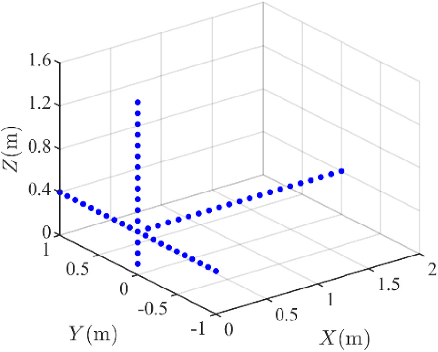

   **图 3** :math:`X` 、 :math:`Y` 、 :math:`Z` 方向监测点。

   图中 :math:`X,Y,Z` 为坐标方向，单位 m 为米。

4.2 湍流特征对比
~~~~~~~~~~~~~~~~

4.2.1 基本湍流特征
^^^^^^^^^^^^^^^^^^

基于 A3 工况的结果分析基本湍流特征。如图 4 和图 5 所示，三种方法生成的平均速度和湍流强度剖面结果均与目标特征吻合良好，与理论推导一致。图 6 和图 7 分别比较了点 :math:`(0,0,0.4)` 处的频率谱和时间相关系数。相比之下，CDRFG 方法的时间相关系数比另外两种方法存在更大的偏差。这表明 CDRFG 方法生成的相应频率谱与目标略有不一致，因为其频率向量生成为正态分布随机数。相比之下，NSRFG 和 CIRFG 方法采用等间隔序列作为频率向量，因此获得了更准确的频率谱和时间相关系数结果。

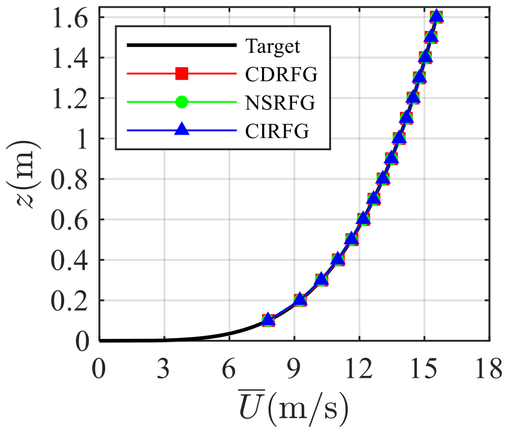

   **图 4** 平均速度剖面对比。

   图例 Target 为目标值，其余为方法缩写。横轴为平均速度 :math:`\overline U` ，单位 :math:`\mathrm{m/s}` ；纵轴为高度 :math:`z` ，单位 :math:`\mathrm{m}` 。

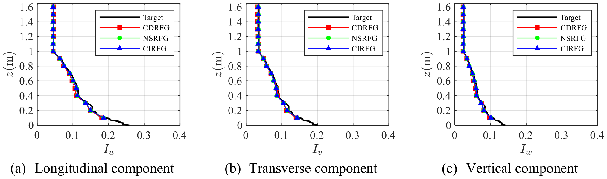

   **图 5** 湍流强度剖面对比。

   (a) 纵向分量；(b) 横向分量；(c) 竖向分量。图例 Target 为目标值，其余为方法缩写； :math:`I_u,I_v,I_w` 分别为三分量湍流强度， :math:`z` 为高度。

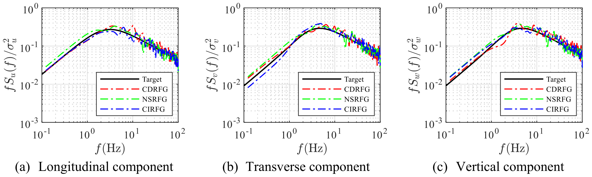

   **图 6** 点 :math:`(0,0,0.4)` 处频率谱对比。

   (a) 纵向分量；(b) 横向分量；(c) 竖向分量。图例 Target 为目标值，其余为方法缩写； :math:`f` 为频率，单位 :math:`\mathrm{Hz}` ；纵轴为各分量归一化频率谱 :math:`fS_i(f)/\sigma_i^2` 。

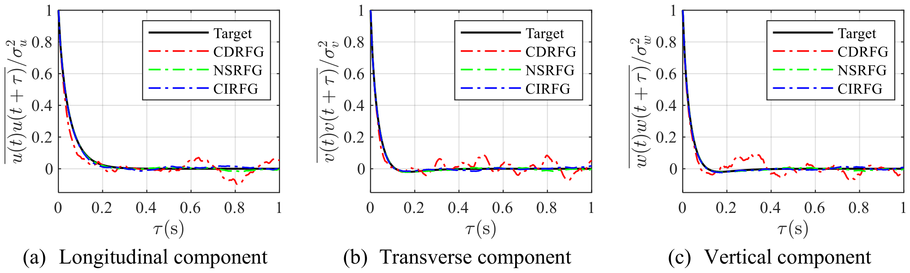

   **图 7** 点 :math:`(0,0,0.4)` 处时间相关系数对比。

   (a) 纵向分量；(b) 横向分量；(c) 竖向分量。图例 Target 为目标值，其余为方法缩写； :math:`\tau` 为时间间隔，单位 :math:`\mathrm{s}` ；纵轴为各分量时间相关系数。

4.2.2 空间相关性
^^^^^^^^^^^^^^^^

图 8 根据 A1 工况结果比较了 :math:`X` 方向的空间相关系数。可以看出，CIRFG 方法生成的脉动速度满足由 von Kármán 波数谱转换得到的 :math:`X` 方向预设空间相关系数。然而，由于经验调整系数不合适，CDRFG 和 NSRFG 方法的模拟结果与 Hémon 和 Santi 提出的目标空间相关系数在一定程度上并不吻合（Hémon and Santi, 2007）。因此，为提高 CDRFG 和 NSRFG 方法的精度，可能需要通过多次尝试确定经验调整系数，这会消耗更多计算资源。

根据 A2 工况结果，图 9 比较了 :math:`Y` 方向的空间相关系数。图 9(a) 表明，CIRFG 方法模拟的 :math:`u` 分量在 :math:`Y` 方向的空间相关系数与目标吻合良好，与第 3.2.3 节的推导一致。虽然 CIRFG 方法没有显式考虑横向和竖向分量的空间相关系数，但图 9(b) 和图 9(c) 表明，CIRFG 方法得到的模拟结果与目标吻合良好，这主要可由不同速度分量之间的相似性来解释。与 :math:`X` 方向空间相关系数的结果类似，CDRFG 和 NSRFG 方法的模拟结果与 :math:`Y` 方向目标空间相关系数相比存在明显差异。因此，验证了 CIRFG 方法具有无需任何经验参数即可直接实现任意 :math:`Y` 方向空间相关性的竞争优势。

根据 A3 工况结果，图 10 比较了 :math:`Z` 方向的空间相关系数。尽管 CIRFG 方法没有考虑实现 :math:`Z` 方向的目标空间相关系数，其结果仍比另外两种方法更接近目标空间相关系数。

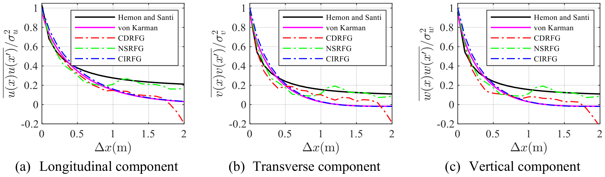

   **图 8** :math:`X` 方向空间相关系数对比。

   (a) 纵向分量；(b) 横向分量；(c) 竖向分量。图例 Hemon and Santi 为 Hémon 与 Santi 的结果，von Karman 为冯·卡门谱对应结果，其余为方法缩写； :math:`\Delta x` 为 :math:`X` 方向空间间隔，单位 :math:`\mathrm{m}` ；纵轴为各分量空间相关系数。

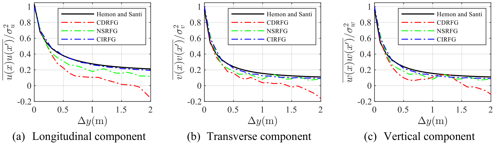

   **图 9** :math:`Y` 方向空间相关系数对比。

   (a) 纵向分量；(b) 横向分量；(c) 竖向分量。图例 Hemon and Santi 为 Hémon 与 Santi 的结果，其余为方法缩写； :math:`\Delta y` 为 :math:`Y` 方向空间间隔，单位 :math:`\mathrm{m}` ；纵轴为各分量空间相关系数。

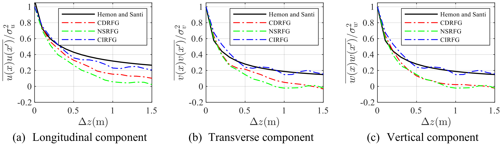

   **图 10** :math:`Z` 方向空间相关系数对比。

   (a) 纵向分量；(b) 横向分量；(c) 竖向分量。图例 Hemon and Santi 为 Hémon 与 Santi 的结果，其余为方法缩写； :math:`\Delta z` 为 :math:`Z` 方向空间间隔，单位 :math:`\mathrm{m}` ；纵轴为各分量空间相关系数。

4.2.3 不同速度分量之间的互相关性
^^^^^^^^^^^^^^^^^^^^^^^^^^^^^^^^

图 11 比较了不同速度分量之间的互相关系数。可以看出，CDRFG 方法得到的互相关系数均接近零；相反，NSRFG 方法得到的这些系数均接近一。这些现象主要可归因于参数 :math:`r_i^{m,n}` 或 :math:`r_{i,n}` 的取值不合理。在 CDRFG 方法中，参数 :math:`r_i^{m,n}` 均生成为均值为零、标准差为一的正态分布随机数；而 NSRFG 方法没有考虑参数 :math:`r_{i,n}` ，可视为 :math:`r_{i,n}=1` 。相比之下，CIRFG 方法设置了三种具有不同目标互相关系数的模拟工况。结果发现，由于参数 :math:`r_{i,n}` 采用了第 3.2.1 节推导的适当均匀分布，CIRFG 方法的模拟结果与预设互相关系数吻合良好。

图 12 比较了点 :math:`(0,0,0.4)` 处 :math:`u` 、 :math:`v` 和 :math:`w` 分量的速度时程。图 12(a) 表明，CDRFG 方法生成的速度彼此独立，主要原因是互相关系数接近零。相反，如图 12(b) 所示，NSRFG 方法生成的速度彼此高度一致，因为其互相关系数近似等于一。图 12(c)--(e) 表明，CIRFG 方法生成的速度具有与不同目标互相关系数相对应的不同相关性。因此，验证了 CIRFG 方法能够直接实现不同速度分量任意且合理的互相关系数，相应速度时程也更符合真实湍流场，这可能是影响 LES 模拟精度的关键因素之一。

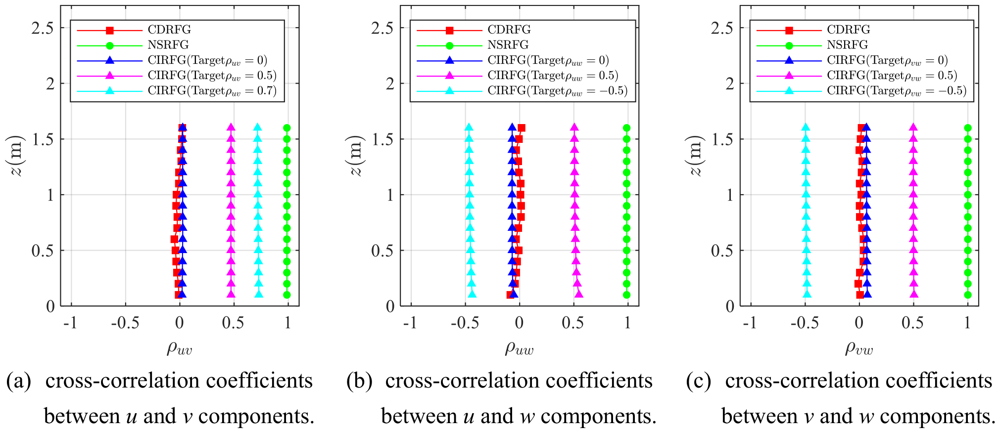

   **图 11** 不同速度分量之间互相关系数对比。

   (a) :math:`u` 与 :math:`v` 分量之间的互相关系数；(b) :math:`u` 与 :math:`w` 分量之间的互相关系数；(c) :math:`v` 与 :math:`w` 分量之间的互相关系数。Target 为目标值；三种 CIRFG 工况的 :math:`\rho_{uv}` 目标值为 :math:`0,0.5,0.7` ， :math:`\rho_{uw}` 和 :math:`\rho_{vw}` 的目标值均为 :math:`0,0.5,-0.5` 。 :math:`z` 为高度，单位 :math:`\mathrm{m}` 。

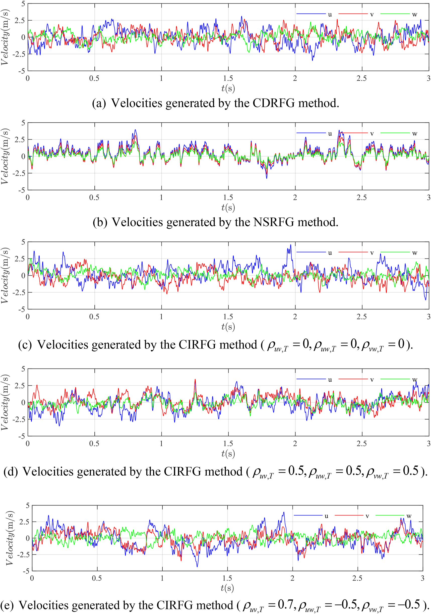

   **图 12** 点 :math:`(0,0,0.4)` 处 :math:`u` 、 :math:`v` 、 :math:`w` 分量速度时程对比。

   (a) CDRFG 方法生成的速度；(b) NSRFG 方法生成的速度；(c) CIRFG 方法生成的速度， :math:`\rho_{uv,T}=\rho_{uw,T}=\rho_{vw,T}=0` ；(d) CIRFG 方法生成的速度， :math:`\rho_{uv,T}=\rho_{uw,T}=\rho_{vw,T}=0.5` ；(e) CIRFG 方法生成的速度， :math:`\rho_{uv,T}=0.7,\rho_{uw,T}=-0.5,\rho_{vw,T}=-0.5` 。图内 Velocity 为速度，单位 :math:`\mathrm{m/s}` ； :math:`t` 为时间，单位 :math:`\mathrm{s}` ； :math:`u,v,w` 为三个速度分量。

5 CIRFG 在高层建筑绕流中的应用
-------------------------------

如前所述，真实的湍流入流边界条件对于获得高精度 LES 至关重要。首先，进行 ABL 流动模拟以验证湍流特征的自维持性。随后，模拟高层建筑模型绕流，并与 TPU 数据库结果比较，以验证 CIRFG 方法的性能。此外，在当前数值模拟中也应用 CDRFG 和 NSRFG 方法进行比较。

5.1 数值模型说明
~~~~~~~~~~~~~~~~

本研究对方形截面高层建筑模型进行了绕流 LES。建筑为方形截面高层模型，宽度 :math:`B=0.1\,\mathrm{m}` ，深度 :math:`D=0.1\,\mathrm{m}` ，高度 :math:`H=0.4\,\mathrm{m}` ，与 TPU 风洞试验保持 1/400 缩尺。风攻角为 :math:`0^\circ` ，建筑高度处参考平均速度为 11 m/s，对应 Reynolds 数约 :math:`7.53\times 10^4` 。如图 13 所示，计算域尺寸为 :math:`20H\times 10H\times 4H` ，阻塞率为 0.13%，满足 Franke (2006) 和 Tominaga et al. (2008) 提出的要求。

图 14 给出了不同网格区域的计算网格尺寸。计算域采用背景网格和三组加密网格离散。原文第 5.1 节给出的网格尺寸依次为 :math:`H/8` 、 :math:`H/20` 、 :math:`H/40` 和 :math:`H/80` ，建筑表面固定网格尺寸为 :math:`H/200` 。Fluent Meshing 用于生成计算域主体的多面体网格，以兼顾建筑周围局部加密和总网格量。采用 last-ratio 方法在地面及建筑表面附近添加 5 层棱柱网格，首层厚度分别为 :math:`B/200` 和 :math:`B/2000` ，末层纵横比设为 10%。进一步地，采用两套网格方案验证网格无关性。两种方案的表面网格增长率分别为 1.2 和 1.05，通过 size-field 方法生成约 332 万单元的 G1 和约 496 万单元的 G2。与 G1 对应的空域计算去除建筑及 Zone 4，生成约 242 万单元，用于验证 ABL 流场自维持性；G1 示意见图 15。最后，根据模拟结果，建筑壁面的平均 :math:`y^+_{1st}` 约为 0.64，最大值小于 5，约 0.4% 的建筑表面网格的 :math:`y^+_{1st}` 大于 2。流向和横向平均分辨率 :math:`\Delta x^+` 、 :math:`\Delta z^+` 均约为 50.7，近似满足 Piomelli and Chasnov (1996) 的要求。地面平均 :math:`y^+_{1st}` 约为 3.14，最大值小于 15，平均 :math:`\Delta x^+` 和 :math:`\Delta z^+` 约为 125.7。为平衡计算资源与精度，地面分辨率未严格满足壁面解析 LES 的限制；原文认为其对高层建筑绕流精度的影响可能较小。

表 4 给出了 LES 中使用的边界条件。首先，将平均速度剖面叠加满足表 2 所列预设湍流特征的脉动速度，映射到入口平面；出口则施加流出（outflow）边界条件。此外，计算域顶面和侧面采用对称边界条件，计算域底面和建筑表面采用无滑移壁面边界条件。进一步地，为减小非物理压力脉动对建筑壁面风压的影响，在建筑上方设置压力参考位置，其坐标为 :math:`(5H,0,3H)` 。

模拟使用 ANSYS FLUENT 2019 R2。LES 亚格子应力采用 WALE 模型（Nicoud and Ducros, 1999），压力—速度耦合采用 PISO（Issa, 1986）。压力离散采用二阶格式，动量离散采用有界中心差分，时间离散采用有界二阶隐式格式。为满足 CFL 条件，时间步长设为 :math:`0.0005\,\mathrm{s}` ，共求解 18000 步，即 :math:`9\,\mathrm{s}` ；取最后 :math:`8\,\mathrm{s}` 进行后处理，以减小初始湍流发展不足的影响。

表 5 给出了用于比较的六种高层建筑模型绕流模拟工况。由表 5 可知，工况 C1 至 C2 用于比较不同方法的模拟精度，工况 C6 则通过与 C3 比较来验证网格无关性。需要注意，TPU 数据库没有给出不同速度分量的目标互相关系数；采用表 5 中这些随机列出的系数，仅用于研究不同互相关系数对 LES 的影响，例如工况 C4 和 C5。此外，预先进行了三种 ABL 流动模拟，以验证三种 RFG 类方法生成湍流场的自维持性；除网格外，其数值设置分别与 C1、C2、C3 相同。

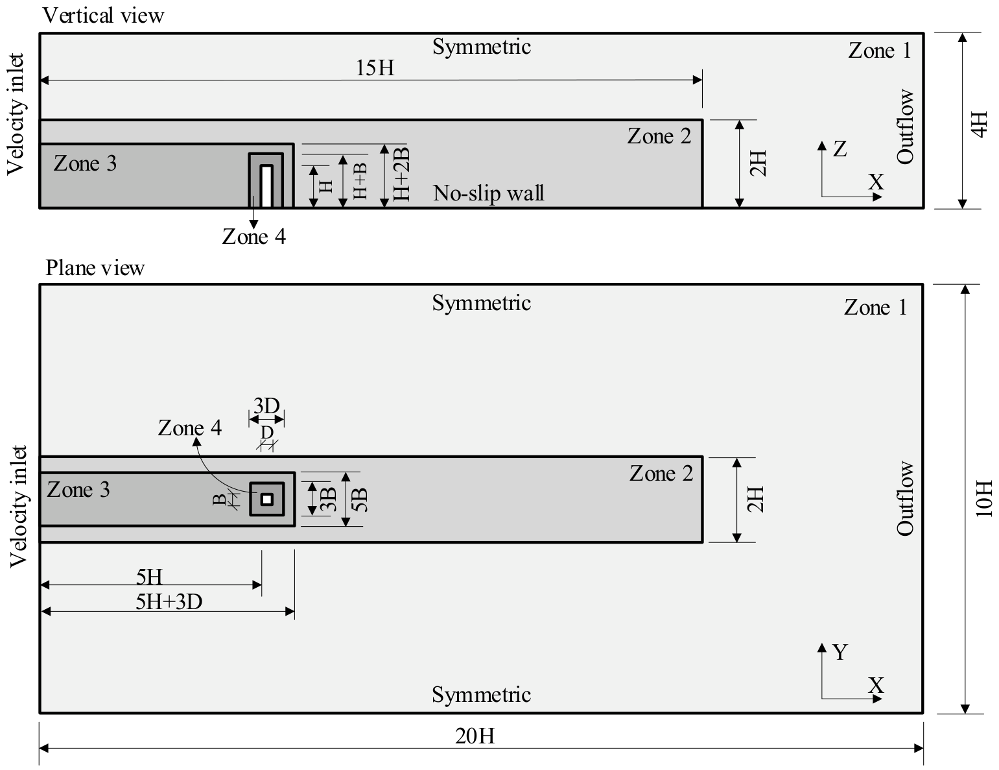

   **图 13** 计算域和边界条件示意图。

   图内 Vertical view 为立面图，Plane view 为平面图，Symmetric 为对称边界，Velocity inlet 为速度入口，Outflow 为流出边界，No-slip wall 为无滑移壁面，Zone 1--4 为区域 1--4；坐标、几何尺寸和符号保持原图。

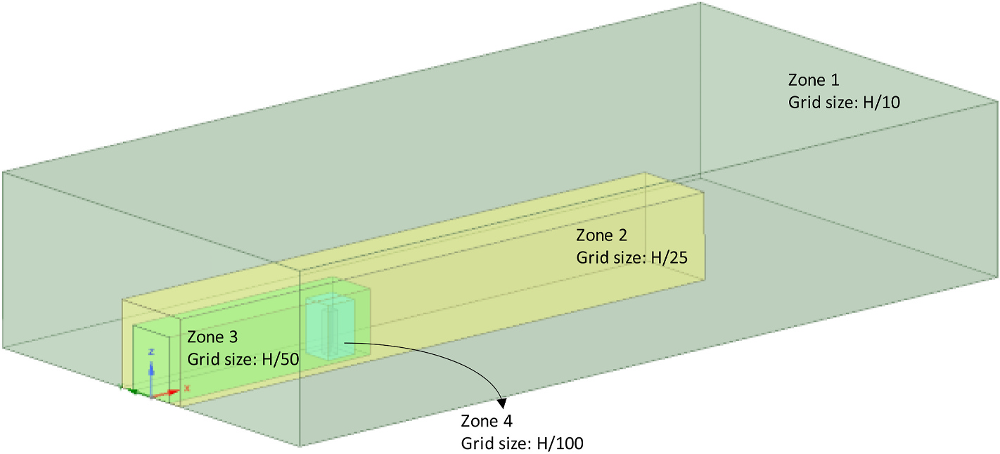

   **图 14** 不同网格区域的计算网格尺寸。

   图内 Zone 1--4 为区域 1--4，Grid size 为网格尺寸。

原文此图标注的 Zone 1--4 尺寸为 :math:`H/10` 、 :math:`H/25` 、 :math:`H/50` 、 :math:`H/100` ，与第 5.1 节正文的 :math:`H/8` 、 :math:`H/20` 、 :math:`H/40` 、 :math:`H/80` 不同。这里保留两处记录，不代替原文选定一组值。

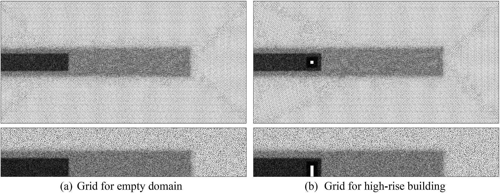

   **图 15** G1 网格示意图。

   (a) 空计算域网格；(b) 高层建筑计算域网格。

.. list-table:: 表 4 LES 中使用的边界条件
   :header-rows: 1
   :widths: 60 40

   * - 边界
     - 类型
   * - 计算域入口
     - 速度入口
   * - 计算域出口
     - 流出
   * - 计算域顶面和侧面
     - 对称
   * - 计算域底面
     - 无滑移壁面
   * - 建筑表面
     - 无滑移壁面

.. list-table:: 表 5 高层建筑模型的模拟工况
   :header-rows: 1
   :widths: 10 15 15 60

   * - 工况
     - 方法
     - 网格方案
     - 互相关
   * - C1
     - CDRFG
     - G1
     - /
   * - C2
     - NSRFG
     - G1
     - /
   * - C3
     - CIRFG
     - G1
     - :math:`\rho_{uv}=0,\rho_{uw}=0,\rho_{vw}=0`
   * - C4
     - CIRFG
     - G1
     - :math:`\rho_{uv}=-0.5,\rho_{uw}=0,\rho_{vw}=0`
   * - C5
     - CIRFG
     - G1
     - :math:`\rho_{uv}=0,\rho_{uw}=0,\rho_{vw}=-0.8`
   * - C6
     - CIRFG
     - G2
     - :math:`\rho_{uv}=0,\rho_{uw}=0,\rho_{vw}=0`

5.2 大气边界层流场模拟
~~~~~~~~~~~~~~~~~~~~~~

5.2.1 ABL 湍流特征对比
^^^^^^^^^^^^^^^^^^^^^^

在模拟建筑绕流之前，通过比较风剖面的发展与 TPU 试验测量数据，评估 RFG 类方法生成湍流场的自维持性。随后，在 :math:`X` 方向的五个位置设置竖向中心线监测点，位置分别为 :math:`X/H_{ref}=0,2.5,5,7.5,10` 。图 16 展示了平均速度剖面沿 :math:`X` 方向的发展。如图所示，三种 RFG 类方法生成的平均速度剖面均保持在目标值附近，仅在近地面出现小幅增加。此外，湍流强度剖面沿 :math:`X` 方向的发展如图 17 所示。总体而言，在 :math:`X/H_{ref}=5` 处，数值湍流强度剖面与试验数据一致，衰减相对较小，说明三种 RFG 类方法生成的湍流场适用于建筑绕流模拟。需要注意，近地面壁面处的竖向湍流强度与目标存在较大偏差，主要源于目标竖向湍流强度与壁面边界不兼容。图 18 比较了 :math:`X/H_{ref}=5,Z/H_{ref}=1` 处，即建筑高度位置测得的频率谱。由结果可明显看出，模拟频率谱在高频范围快速下降，主要是由于网格分辨率限制导致 LES 中湍流能量被过滤。然而，如图 18 所示，各工况的谱在低频范围与目标 von Kármán 谱相比均令人满意。

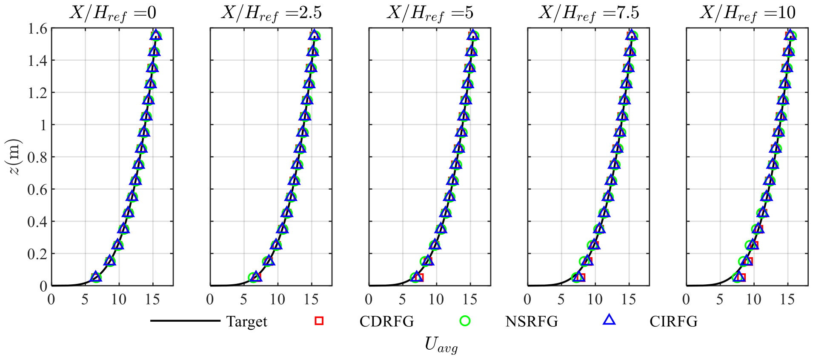

   **图 16** :math:`X` 方向平均速度剖面发展。

   Target 为目标值，其余图例为方法缩写； :math:`X/H_{ref}=0,2.5,5,7.5,10` 为测量截面位置， :math:`U_{avg}` 为平均速度， :math:`z` 为高度。

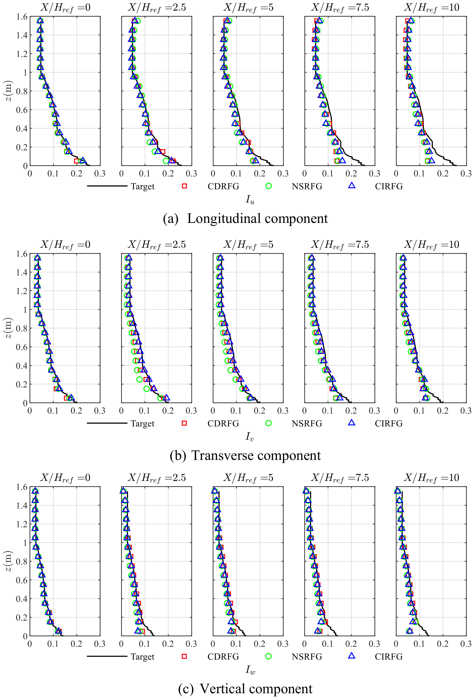

   **图 17** :math:`X` 方向湍流强度剖面发展。

   (a) 纵向分量；(b) 横向分量；(c) 竖向分量。Target 为目标值，其余图例为方法缩写； :math:`X/H_{ref}=0,2.5,5,7.5,10` 为测量截面位置， :math:`I_u,I_v,I_w` 为三分量湍流强度， :math:`z` 为高度。

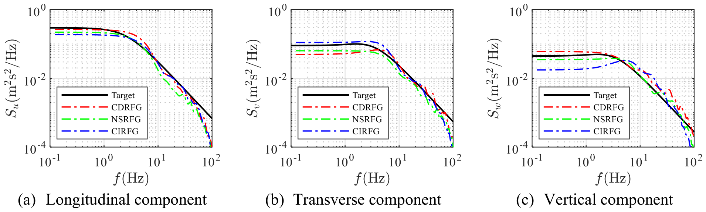

   **图 18** :math:`X/H_{ref}=5` 、 :math:`Z/H_{ref}=1` 处频率谱对比。

   (a) 纵向分量；(b) 横向分量；(c) 竖向分量。Target 为目标值，其余图例为方法缩写； :math:`f` 为频率，单位 :math:`\mathrm{Hz}` ； :math:`S_u,S_v,S_w` 为三个速度分量的频率谱。

5.2.2 流场压力分析
^^^^^^^^^^^^^^^^^^

图 19 比较了沿 :math:`X` 方向的压力均值和标准差（STD）剖面，测量位置与速度监测点相同。首先，如图 19 所示，所有模拟工况的平均压力剖面均较小，在未来建筑位置处的最大值不超过 1。与此同时，各工况入口附近均出现人工脉动，主要是因为 RFG 类方法生成的非均匀湍流场与 Navier--Stokes 方程以及计算域边界条件不兼容。尽管入口处存在非物理压力脉动，但可以看出，在未来建筑位置 :math:`X/H_{ref}=5` 处，压力脉动接近零，近壁最大值小于 2。这说明，在出口平面施加 outflow 边界条件并选择适当的压力参考位置，可以减少建筑附近压力脉动的产生。因此，当前数值模拟设置适合 CWE 应用。此外需要注意，若采用压力出口（pressure-outlet）边界条件，RFG 类方法生成的入流湍流必须采用修正方法加以调整，例如 VBIC 方法（Patruno and de Miranda, 2020）。否则，非物理压力脉动可能污染所模拟建筑和结构的壁面压力测量。

译注：上段原文数值 1 和 2 对应图 19 压力横轴的单位 :math:`\mathrm{Pa}` ，分别为 :math:`1\,\mathrm{Pa}` 和 :math:`2\,\mathrm{Pa}` ，不是动压的百分比。

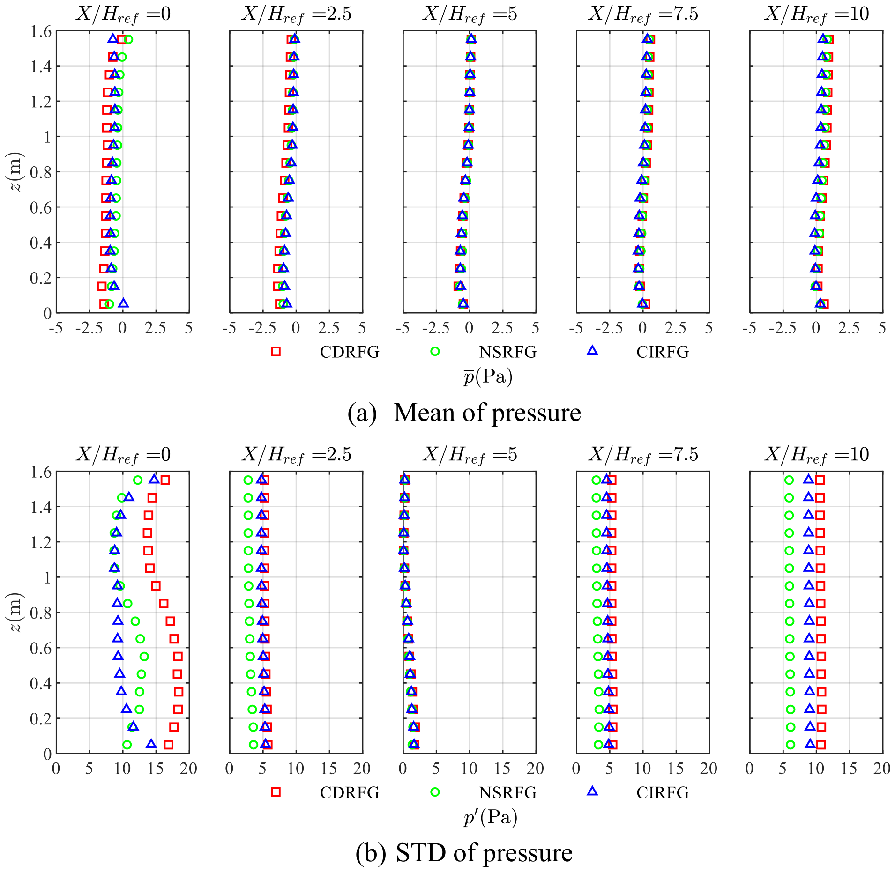

   **图 19** :math:`X` 方向压力均值和标准差剖面对比。

   (a) 压力均值；(b) 压力标准差。图例为方法缩写； :math:`X/H_{ref}=0,2.5,5,7.5,10` 为测量截面位置； :math:`\overline p` 为压力均值， :math:`p^{\prime}` 为压力标准差，单位均为 :math:`\mathrm{Pa}` ； :math:`z` 为高度。

5.3 高层建筑绕流模拟
~~~~~~~~~~~~~~~~~~~~

5.3.1 平均与脉动风压
^^^^^^^^^^^^^^^^^^^^

通过比较 LES 与 TPU 数据库的风压系数，验证模拟的计算精度。风压系数计算为：

.. math::

   C_p=\frac{p-p_{ref}}{0.5\rho U_H^2}.\qquad (37)

其中， :math:`C_p` 表示风压系数； :math:`p_{ref}` 表示参考压力； :math:`\rho` 为入流湍流密度，等于 :math:`1.225\,\mathrm{kg/m^3}` ； :math:`U_H` 为建筑高度处的平均速度，等于 :math:`11\,\mathrm{m/s}` 。此外， :math:`\overline{C_p}` 和 :math:`C'_p` 分别表示风压系数的平均值和标准差。

图 20 和图 21 分别给出了建筑表面风压系数均值和标准差分布的等值图。相应地，如图 22 所示，提取高层建筑模型 :math:`2/3H` 高度处的风压系数均值和标准差，用于对 LES 与 TPU 试验结果进行定量比较。总体而言，所有模拟工况的平均风压系数分布均与 TPU 数据库结果吻合良好，仅侧壁结果略有低估，这与 Yu et al. (2018) 的结果类似。此外，由图 21 和图 22(b) 可见，背风面风压系数标准差分布与 TPU 试验数据相比具有良好的预测精度，而在其他建筑表面，各工况的结果除少数壁面部位外大多小于风洞试验值。这些现象主要可由 LES 中不可避免的湍流能量过滤、脉动压力的复杂性、数值误差等来解释（Yu et al., 2018）。这一情形下的计算精度仍需要通过进一步研究提高。此外，对比工况 C3 至 C5 的 :math:`C'_p` 结果（见图 22(b)），可以看出 C5 的模拟结果比另外两种工况更准确，尤其是在迎风面和侧壁 :math:`1\to2` 上，这可能是由 :math:`v` 和 :math:`w` 速度分量之间的负相关引起的。因此，为提高 LES 精度，有必要进一步研究合适的互相关性。最后，C3 与 C6 的比较表明当前模拟具有良好的网格无关性。

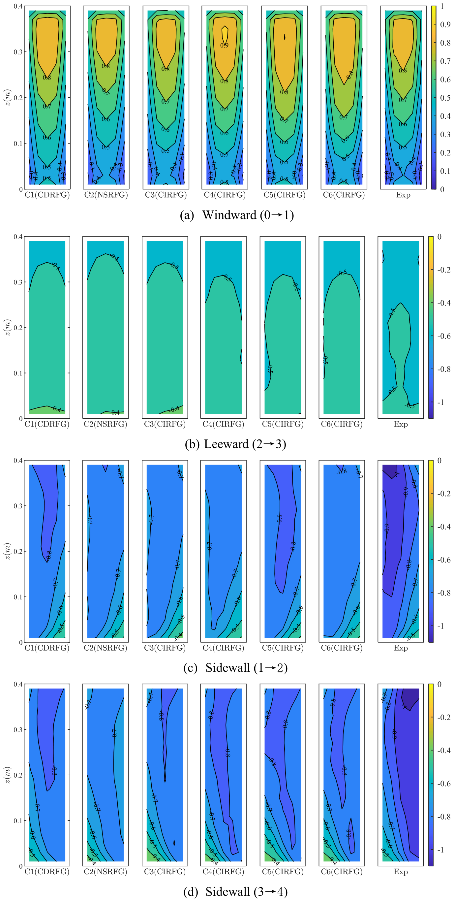

   **图 20** 建筑表面平均风压系数分布等值图。

   (a) 迎风面（ :math:`0\to1` ）；(b) 背风面（ :math:`2\to3` ）；(c) 侧壁（ :math:`1\to2` ）；(d) 侧壁（ :math:`3\to4` ）。Exp 为试验；C1（CDRFG）、C2（NSRFG）、C3--C6（CIRFG）为各工况及方法， :math:`z` 为高度。

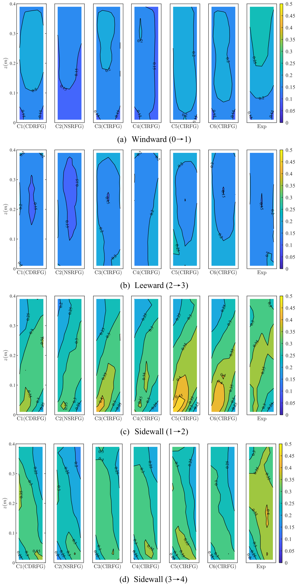

   **图 21** 建筑表面风压系数标准差分布等值图。

   (a) 迎风面（ :math:`0\to1` ）；(b) 背风面（ :math:`2\to3` ）；(c) 侧壁（ :math:`1\to2` ）；(d) 侧壁（ :math:`3\to4` ）。Exp 为试验；C1（CDRFG）、C2（NSRFG）、C3--C6（CIRFG）为各工况及方法， :math:`z` 为高度。

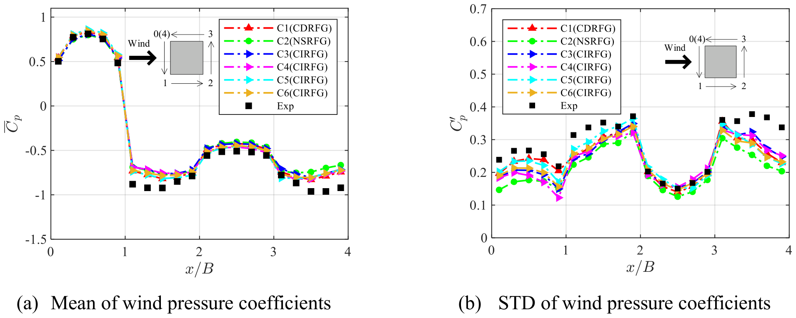

   **图 22** 高层建筑模型 :math:`2/3H` 高度处平均与标准差风压系数对比。

   (a) 风压系数均值；(b) 风压系数标准差。Wind 为来流风，Exp 为试验；C1（CDRFG）、C2（NSRFG）、C3--C6（CIRFG）为各工况及方法； :math:`\overline{C_p}` 为风压系数均值， :math:`C_p^{\prime}` 为其标准差， :math:`x/B` 为沿建筑周边的无量纲位置。

5.3.2 平均与脉动基底力和力矩
^^^^^^^^^^^^^^^^^^^^^^^^^^^^

与 Yu et al. (2018) 类似，图 23 给出了基底力和力矩示意图，相应的力／力矩系数按式 (38) 和式 (39) 计算。

.. math::

   C_D(t)=\frac{F_x(t)}{0.5\rho U_H^2BH},\qquad
   C_L(t)=\frac{F_y(t)}{0.5\rho U_H^2DH}.\qquad (38)

.. math::

   C_{Mx}(t)=\frac{M_x(t)}{0.5\rho U_H^2BH^2},\qquad
   C_{My}(t)=\frac{M_y(t)}{0.5\rho U_H^2DH^2},\qquad
   C_{Mz}(t)=\frac{M_z(t)}{0.5\rho U_H^2BDH}.\qquad (39)

表 6 给出了基底力／力矩系数的平均值和相对误差。需要注意，由于风攻角为 :math:`0^\circ` ， :math:`\overline{C_L}` 、 :math:`\overline{C_{My}}` 和 :math:`\overline{C_{Mz}}` 的理论结果应等于零，因此表 6 未计算这些统计量的相对误差。总体而言，与 TPU 试验数据相比， :math:`\overline{C_D}` 和 :math:`\overline{C_{Mx}}` 的平均值预测精度较好，相对误差小于 5%，仅工况 C2（NSRFG）的相对误差接近 6%。此外，由于模拟模型具有对称性，如果延长模拟时间， :math:`\overline{C_L}` 、 :math:`\overline{C_{My}}` 和 :math:`\overline{C_{Mz}}` 的预测平均值将更加接近零。

表 7 列出了基底力／力矩系数的标准差及相对误差。总体而言，基底力／力矩系数的标准差均小于风洞试验值，主要原因是 LES 中湍流能量受到过滤。此外，为比较不同工况的整体性能，我们计算了 C1 至 C6 各工况所有相对误差的平均值作为评价指标，分别为 :math:`-13.45\%` 、 :math:`-24.48\%` 、 :math:`-12.54\%` 、 :math:`-14.67\%` 、 :math:`-8.69\%` 和 :math:`-11.99\%` 。结果表明，与其他工况相比，C2（NSRFG）的标准差值差异最大，这可能是由于本研究使用的 NSRFG 经验调整因子不合适。进一步地，C5（CIRFG）模拟结果的平均相对误差相较于其他工况最小，而 C4（CIRFG）的结果相对较大，说明不同速度分量之间合适的互相关性可能是影响 LES 精度的关键因素之一。换言之，CIRFG 方法因能够实现不同速度分量之间的任意互相关性而比另外两种方法更灵活，但更高的 LES 精度可能与适当的互相关性密切相关。图 24 比较了总基底力／力矩系数谱。由图可见，所有 LES 工况计算的总基底力／力矩系数谱均与 TPU 数据库结果吻合良好。

译注：原文上述“均小于”的概括存在表中例外：C5 阻力系数标准差为 0.2816，高于试验的 0.2623，相对误差为 :math:`+7.38\%` 。上述六项汇总指标是带正负号的相对误差均值；C5 的均值最接近零，即绝对值最小，不能把 :math:`-8.69\%` 解释为平均绝对误差。这里同时保留原文叙述和表中数值。

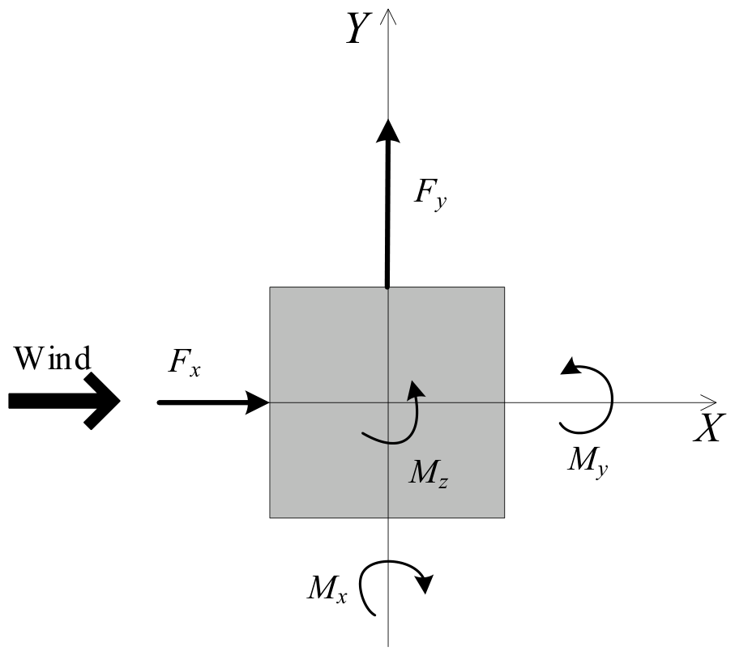

   **图 23** 基底力和力矩示意图（Kim et al., 2013）。

   图内 Wind 为来流风； :math:`X,Y` 为坐标方向； :math:`F_x,F_y` 为基底力分量； :math:`M_x,M_y,M_z` 为基底力矩分量。

.. list-table:: 表 6 基底力／力矩系数的平均值及相对误差
   :header-rows: 1
   :widths: 7 13 13 13 13 13 14 14

   * - 工况
     - :math:`\overline{C_D}` 均值
     - :math:`C_D` 相对误差
     - :math:`\overline{C_L}` 均值
     - :math:`\overline{C_{Mx}}` 均值
     - :math:`C_{Mx}` 相对误差
     - :math:`\overline{C_{My}}` 均值
     - :math:`\overline{C_{Mz}}` 均值
   * - 试验
     - 1.0676
     - /
     - 0.0181
     - 0.5823
     - /
     - 0.0097
     - −0.0081
   * - C1
     - 1.0402
     - −2.57%
     - 0.0045
     - 0.5659
     - −2.81%
     - 0.0022
     - 0.0007
   * - C2
     - 1.0007
     - −6.27%
     - −0.0166
     - 0.5474
     - −6.00%
     - −0.0094
     - 0.0040
   * - C3
     - 1.0167
     - −4.77%
     - 0.0162
     - 0.5548
     - −4.72%
     - 0.0114
     - −0.0037
   * - C4
     - 1.0794
     - 1.10%
     - 0.0508
     - 0.5898
     - 1.30%
     - 0.0250
     - −0.0065
   * - C5
     - 1.0922
     - 2.30%
     - −0.0088
     - 0.5912
     - 1.53%
     - −0.0008
     - 0.0016
   * - C6
     - 1.0831
     - 1.44%
     - 0.0150
     - 0.5866
     - 0.75%
     - 0.0091
     - −0.0001

.. list-table:: 表 7 基底力／力矩系数的标准差及相对误差
   :header-rows: 1
   :widths: 6 9 10 9 10 9 10 9 10 9 10

   * - 工况
     - :math:`C_D^{\prime}` 标准差
     - :math:`C_D^{\prime}` 相对误差
     - :math:`C_L^{\prime}` 标准差
     - :math:`C_L^{\prime}` 相对误差
     - :math:`C_{Mx}^{\prime}` 标准差
     - :math:`C_{Mx}^{\prime}` 相对误差
     - :math:`C_{My}^{\prime}` 标准差
     - :math:`C_{My}^{\prime}` 相对误差
     - :math:`C_{Mz}^{\prime}` 标准差
     - :math:`C_{Mz}^{\prime}` 相对误差
   * - 试验
     - 0.2623
     - /
     - 0.3263
     - /
     - 0.1424
     - /
     - 0.1743
     - /
     - 0.0591
     - /
   * - C1
     - 0.2448
     - −6.66%
     - 0.2968
     - −9.04%
     - 0.1283
     - −9.86%
     - 0.1458
     - −16.33%
     - 0.0441
     - −25.36%
   * - C2
     - 0.1929
     - −26.46%
     - 0.2890
     - −11.41%
     - 0.1035
     - −27.31%
     - 0.1450
     - −16.83%
     - 0.0352
     - −40.37%
   * - C3
     - 0.2508
     - −4.35%
     - 0.3015
     - −7.59%
     - 0.1308
     - −8.14%
     - 0.1532
     - −12.13%
     - 0.0411
     - −30.48%
   * - C4
     - 0.2344
     - −10.61%
     - 0.3077
     - −5.68%
     - 0.1204
     - −15.43%
     - 0.1554
     - −10.83%
     - 0.0409
     - −30.82%
   * - C5
     - 0.2816
     - 7.38%
     - 0.3021
     - −7.40%
     - 0.1417
     - −0.49%
     - 0.1528
     - −12.35%
     - 0.0410
     - −30.61%
   * - C6
     - 0.2622
     - −0.02%
     - 0.2995
     - −8.20%
     - 0.1295
     - −9.07%
     - 0.1548
     - −11.18%
     - 0.0405
     - −31.48%

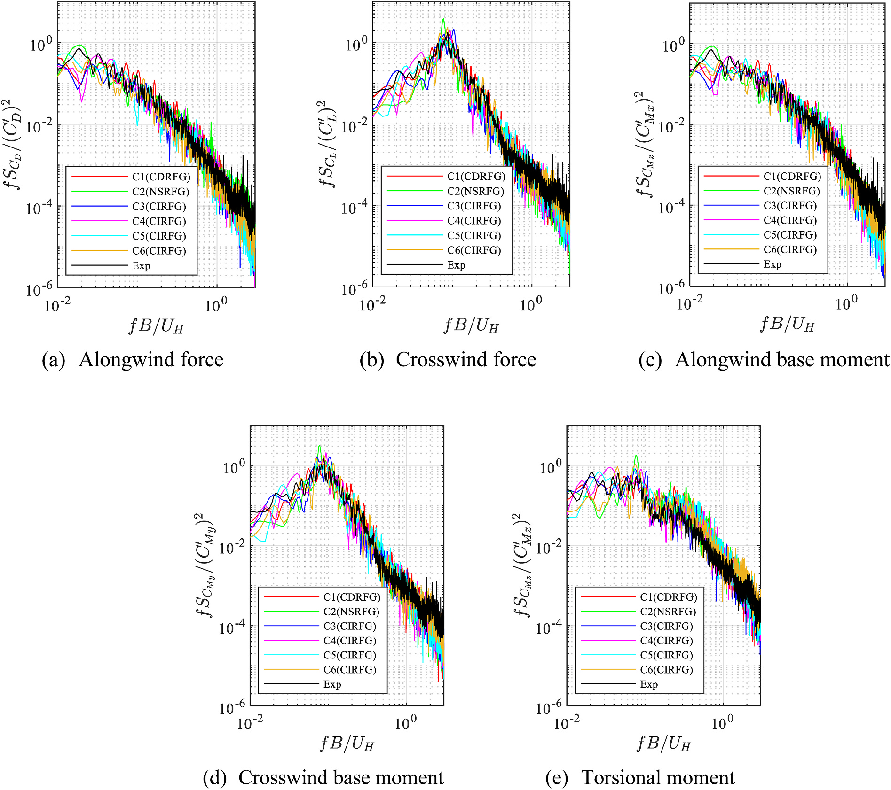

   **图 24** 总基底力/力矩系数谱对比。

   (a) 顺风向力；(b) 横风向力；(c) 顺风向基底力矩；(d) 横风向基底力矩；(e) 扭矩。Exp 为试验；C1（CDRFG）、C2（NSRFG）、C3--C6（CIRFG）为各工况及方法；横轴为无量纲频率 :math:`fB/U_H` ，纵轴为各基底力或力矩系数的归一化功率谱。

6 结论
------

本研究提出一种用于 LES 的新 ITG 方法，即 CIRFG 方法，以提高空间相关性和不同速度分量互相关性的一致性。首先，考虑湍流特征的可获得性以及既有 RFG 类方法的缺陷，确定所提方法的适当目标。

随后，通过显式嵌入目标湍流特征，推导一种模拟空间相关性和不同速度分量互相关性的新方法。对于互相关性，通过求解与目标值有关的方程确定一系列随机数，并将其引入以增加幅值的随机性。此外，为实现任意 :math:`Y` 方向空间相关性，从波数谱角度出发，通过递推序列推导波数向量的第二个分量。因此，新过程能够自然施加预设的湍流特征，即 CIRFG 方法无需任何经验参数，更便于广泛用于任意情形。此外，所提方法仍保持满足基本目标湍流特征的能力，包括任意平均速度、湍流强度、频率谱、时间相关性、 :math:`X` 方向空间相关性等。

进一步地，根据 ABL 流动的数值结果，三种 RFG 类方法生成的湍流场均具有良好的风剖面自维持性，在未来建筑位置处的衰减相对较小。然而，使用所考察的 RFG 类方法生成非均匀湍流场时，所有工况入口处均出现人工脉动，主要是由于与 Navier--Stokes 方程及计算域边界条件不兼容。尽管存在这一问题，研究发现，在出口平面采用 outflow 边界条件并选择合适的压力参考位置，可以减少未来建筑附近压力脉动的产生。不过，如果采用 pressure-outlet 边界条件，仍需要开展进一步研究以避免非物理压力脉动，类似于 VBIC 方法（Patruno and de Miranda, 2020）。

最后，模拟高层建筑模型绕流，以验证所提方法的性能。就平均风压系数而言，所考察方法的结果与 TPU 风洞试验结果吻合良好。对于风压系数标准差，各工况模拟结果均小于风洞试验值，主要原因包括 LES 中不可避免的湍流能量过滤、脉动压力的复杂性、数值误差等。类似地，基底力／力矩系数标准差也相对小于风洞试验值。然而，研究发现不同速度分量之间的互相关性会影响 LES 精度。因此，尽管 CIRFG 方法在实现任意互相关性方面更灵活，为提高 LES 精度仍需进一步研究真实的互相关性。

附录 A DSRFG 方法
-----------------

DSRFG 方法（Huang et al., 2010）主要包括三维谱离散和湍流场合成过程：

.. math::

   u_i(\mathbf{x},t)=\sum_{m=1}^{M}\sum_{n=1}^{N}\left[p_i^{m,n}\cos(\tilde{\mathbf{k}}^{m,n}\cdot\tilde{\mathbf{x}}+\omega_{m,n}t)+q_i^{m,n}\sin(\tilde{\mathbf{k}}^{m,n}\cdot\tilde{\mathbf{x}}+\omega_{m,n}t)\right].\qquad (A1)

.. math::

   p_i^{m,n}=\mathrm{sign}(r_i^{m,n})\sqrt{\frac{4}{N}S_i^{|k|}(k_m)\frac{(r_i^{m,n})^2}{1+(r_i^{m,n})^2}}.\qquad (A2)

.. math::

   q_i^{m,n}=\mathrm{sign}(r_i^{m,n})\sqrt{\frac{4}{N}S_i^{|k|}(k_m)\frac{1}{1+(r_i^{m,n})^2}}.\qquad (A3)

.. math::

   \tilde{\mathbf{x}}=\frac{\mathbf{x}}{L_s}.\qquad (A4)

.. math::

   \mathbf{k}^{m,n}\cdot\mathbf{p}^{m,n}=0.\qquad (A5)

.. math::

   \mathbf{k}^{m,n}\cdot\mathbf{q}^{m,n}=0.\qquad (A6)

.. math::

   \tilde{\mathbf{k}}^{m,n}=\frac{\mathbf{k}^{m,n}}{k_0},\qquad |\mathbf{k}^{m,n}|=k_m.\qquad (A7)

.. math::

   \omega_{m,n}\in N(0,2\pi f_m),\qquad f_m=k_mU_{avg}.\qquad (A8)

其中， :math:`i=1,2,3` 时， :math:`u_i` 分别表示纵向 :math:`u` 、横向 :math:`v` 和竖向 :math:`w` 分量的脉动速度； :math:`j=1,2,3` 分别表示 :math:`X` 、 :math:`Y` 和 :math:`Z` 方向； :math:`\mathbf{x}=(x_1,x_2,x_3)` 表示空间坐标； :math:`M` 为谱段数； :math:`N` 为各谱段内的随机频率数； :math:`r_i^{m,n}` 为均值为零、标准差为一的正态分布随机数； :math:`S_i^{|k|}(k)` 为三维谱； :math:`f_m` 为频率； :math:`k_m` 为波数； :math:`L_s` 为调整空间相关性的经验参数，计算为 :math:`L_s=\theta_1\sqrt{(L_u^x)^2+(L_v^x)^2+(L_w^x)^2}` ，其中 :math:`\theta_1` 为调整系数； :math:`U_{avg}` 为平均速度。

附录 B MDSRFG 方法
------------------

MDSRFG 方法（Castro and Paz, 2013）通过引入时间调整参数来获得时空相关湍流场：

.. math::

   u_i(\mathbf{x},t)=\sum_{m=1}^{M}\sum_{n=1}^{N}\left[p_i^{m,n}\cos\left(\tilde{\mathbf{k}}^{m,n}\cdot\tilde{\mathbf{x}}+\omega_{m,n}\frac{t}{\tau_0}\right)+q_i^{m,n}\sin\left(\tilde{\mathbf{k}}^{m,n}\cdot\tilde{\mathbf{x}}+\omega_{m,n}\frac{t}{\tau_0}\right)\right].\qquad (B1)

.. math::

   p_i^{m,n}=\mathrm{sign}(r_i^{m,n})\sqrt{\frac{4c_i}{N}S_i^{|k|}(k_m)\Delta k_m\frac{(r_i^{m,n})^2}{1+(r_i^{m,n})^2}}.\qquad (B2)

.. math::

   q_i^{m,n}=\mathrm{sign}(r_i^{m,n})\sqrt{\frac{4c_i}{N}S_i^{|k|}(k_m)\Delta k_m\frac{1}{1+(r_i^{m,n})^2}}.\qquad (B3)

其中， :math:`\tau_0` 为调整时间相关性的时间调整参数，计算为 :math:`\tau_0=\theta_2L_s/U_{avg}` ，其中 :math:`\theta_2` 为调整系数； :math:`c_i` 为取决于谱形式的函数值；其他参数与 DSRFG 方法相同。

附录 C CDRFG 方法
-----------------

CDRFG 方法（Aboshosha et al., 2015; Melaku et al., 2017）用于生成满足指定频率谱和空间相干函数的湍流场：

.. math::

   u_i(\mathbf{x},t)=\sum_{m=1}^{M}\sum_{n=1}^{N}\left[p_i^{m,n}\cos(\mathbf{k}^{m,n}\cdot\tilde{\mathbf{x}}^m+2\pi f_{m,n}t)+q_i^{m,n}\sin(\mathbf{k}^{m,n}\cdot\tilde{\mathbf{x}}^m+2\pi f_{m,n}t)\right].\qquad (C1)

.. math::

   p_i^{m,n}=\mathrm{sign}(r_i^{m,n})\sqrt{\frac{2}{N}S_i^t(f_m)\Delta f\frac{(r_i^{m,n})^2}{1+(r_i^{m,n})^2}}.\qquad (C2)

.. math::

   q_i^{m,n}=\mathrm{sign}(r_i^{m,n})\sqrt{\frac{2}{N}S_i^t(f_m)\Delta f\frac{1}{1+(r_i^{m,n})^2}}.\qquad (C3)

.. math::

   \tilde{x}_{j}^{m}=\frac{x_j}{L_{j}^{m}}.\qquad (C4)

.. math::

   \begin{bmatrix}
   p_x^{m,n} & p_y^{m,n} & p_z^{m,n}\\
   q_x^{m,n} & q_x^{m,n} & q_x^{m,n}\\
   k_x^{m,n} & k_y^{m,n} & k_z^{m,n}
   \end{bmatrix}
   \begin{bmatrix}
   k_x^{m,n}\\k_y^{m,n}\\k_z^{m,n}
   \end{bmatrix}
   =
   \begin{bmatrix}0\\0\\1\end{bmatrix}.\qquad (C5)

原文式 (C5) 第二行三项均排为 :math:`q_x^{m,n}` ；这与通常按三个方向列出的写法有差异，此处保留原式，不代替原文作勘误。

.. math::

   f_{m,n}\in N(f_m,\Delta f).\qquad (C6)

.. math::

   L_{j,m}=\frac{U_{avg}}{\gamma C_j f_m}.\qquad (C7)

.. math::

   \gamma=\begin{cases}
   3.7\beta^{-0.3}, & \beta<6.0,\\
   2.1, & \beta\ge 6.0.
   \end{cases}\qquad (C8)

.. math::

   \beta=\frac{CD_c}{L_u^x(z)}.\qquad (C9)

其中， :math:`i=1,2,3` 时， :math:`S_i^t(f_m)` 分别表示纵向、横向和竖向分量的一侧频率谱； :math:`L_{j,m}` 为调整空间相干函数的参数； :math:`j=1,2,3` 时， :math:`C_j` 分别为纵向、横向和竖向分量的相干衰减常数； :math:`\gamma` 为与无量纲积分尺度 :math:`\beta` 有关的调整系数； :math:`C` 为相干衰减常数； :math:`D_c` 为特征距离； :math:`L_u^x(z)` 为纵向积分尺度；其他参数与 DSRFG 方法相同。

附录 D NSRFG 方法
-----------------

NSRFG 方法（Yu et al., 2018）采用式 (D1) 给出的更简洁表达式来提高计算效率，其计算如下：

.. math::

   u_i(\mathbf{x},t)=\sum_{n=1}^{N}\sqrt{2S_i^t(f_n)\Delta f}\sin(\mathbf{k}_n\cdot\tilde{\mathbf{x}}_n+2\pi f_nt+\varphi_n).\qquad (D1)

.. math::

   \tilde{x}_{j,n}=\frac{x_j}{L_{j,n}}.\qquad (D2)

.. math::

   \begin{cases}
   p_{1,n}\dfrac{k_{1,n}}{L_{1,n}}+p_{2,n}\dfrac{k_{2,n}}{L_{2,n}}+p_{3,n}\dfrac{k_{3,n}}{L_{3,n}}=0,\\
   |\mathbf{k}_n|=1.
   \end{cases}\qquad (D3)

.. math::

   \begin{cases}
   k_{1,n}=-\dfrac{q_{2,n}^2+q_{3,n}^2}{A_n}\sin\theta_n,\\
   k_{2,n}=-\dfrac{q_{1,n}q_{2,n}}{A_n}\sin\theta_n+\dfrac{q_{3,n}}{B_n}\cos\theta_n,\\
   k_{3,n}=\dfrac{q_{1,n}q_{3,n}}{A_n}\sin\theta_n+\dfrac{q_{2,n}}{B_n}\cos\theta_n.
   \end{cases}\qquad (D4)

.. math::

   \begin{cases}
   q_{i,n}=\dfrac{p_{i,n}}{L_{i,n}},\\
   A_n=\sqrt{\left(q_{2,n}^{2}+q_{3,n}^{2}\right)^2+q_{1,n}^{2}q_{2,n}^{2}+q_{1,n}^{2}q_{3,n}^{2}},\\
   B_n=\sqrt{q_{2,n}^{2}+q_{3,n}^{2}},\\
   \theta_n\sim U(0,2\pi).
   \end{cases}\qquad (D5)

.. math::

   L_{j,n}=\frac{U_{avg}}{\gamma_jC_jf_n}.\qquad (D6)

其中， :math:`N` 为谱段数； :math:`f_n` 为频率，计算为 :math:`f_n=\frac{2n-1}{2}\Delta f` ， :math:`\Delta f` 为离散谱时的频率间隔； :math:`\varphi_n` 为服从 :math:`0` 至 :math:`2\pi` 范围内均匀分布的随机相位； :math:`L_{j,n}` 为调整空间相干函数的参数； :math:`\gamma_j` 为扩展至三个方向的调整系数；其他参数与 CDRFG 方法相同。

参考文献
--------

- Aboshosha, H., Elshaer, A., Bitsuamlak, G.T., El Damatty, A., 2015. Consistent inflow turbulence generator for LES evaluation of wind-induced responses for tall buildings. J. Wind Eng. Ind. Aerod. 142, 198–216.

- Batten, P., Goldberg, U., Chakravarthy, S., 2004. Interfacing statistical turbulence closures with large-eddy simulation. AIAA J. 42, 485–492.

- Bervida, M., Patruno, L., Stani, S., Miranda, S.D., 2020. Synthetic generation of the atmospheric boundary layer for wind loading assessment using spectral methods. J. Wind Eng. Ind. Aerod. 196, 104040.

- Castro, H.G., Paz, R., 2011. Generation of Turbulent Inlet Velocity Conditions for Large Eddy Simulations. CIMEC Document Repository.

- Castro, H.G., Paz, R.R., 2013. A time and space correlated turbulence synthesis method for Large Eddy Simulations. J. Comput. Phys. 235, 742–763.

- Dagnew, A., Bitsuamlak, G.T., 2013. Computational evaluation of wind loads on buildings: a review. Wind Struct. 16, 629–660.

- Dagnew, A.K., Bitsuamlak, G.T., 2014. Computational evaluation of wind loads on a standard tall building using LES. Wind Struct. 18, 567–598.

- Davenport, A.G., 1995. How can we simplify and generalize wind loads? J. Wind Eng. Ind. Aerod. 54, 657–669.

- Deodatis, G., 1996. Simulation of ergodic multivariate stochastic processes. J. Eng. Mech. 122, 778–787.

- Dhamankar, N.S., Blaisdell, G.A., Lyrintzis, A.S., 2018. Overview of turbulent inflow boundary conditions for large-eddy simulations. AIAA J. 56, 1317–1334.

- Durbin, P.A., Pettersson Reif, B.A., 2011. Statistical Theory and Modeling for Turbulent Flows. Wiley.

- Esdu, I., 2001. Characteristics of Atmospheric Turbulence Near the Ground—Part II: Single Point Data for Strong Winds (Neutral Atmosphere). Engineering Sciences Data Unit, IHS Inc., London, UK, 85020. Report No. ESDU.

- Franke, J., 2006. Recommendations of the COST action C14 on the use of CFD in predicting pedestrian wind environment. In: The Fourth International Symposium on Computational Wind Engineering. Citeseer, Yokohama, Japan, pp. 529–532.

- Hémon, P., Santi, F., 2007. Simulation of a spatially correlated turbulent velocity field using biorthogonal decomposition. J. Wind Eng. Ind. Aerod. 95, 21–29.

- Hoshiya, M., 1972. Simulation of multi-correlated random processes and application to structural vibration problems. In: Proceedings of the Japan Society of Civil Engineers: Japan Society of Civil Engineers, pp. 121–128.

- Huang, S.H., Li, Q.S., Wu, J.R., 2010. A general inflow turbulence generator for large eddy simulation. J. Wind Eng. Ind. Aerod. 98, 600–617.

- Issa, R.I., 1986. Solution of the implicitly discretised fluid flow equations by operator-splitting. J. Comput. Phys. 62, 40–65.

- Iwatani, Y., 1982. Simulation of multidimensional wind fluctuations having any arbitrary power spectra and cross spectra. J. Wind Eng. 1982, 5–18.

- Keating, A., Piomelli, U., Balaras, E., Kaltenbach, H., 2004. A priori and a posteriori tests of inflow conditions for large-eddy simulation. Phys. Fluids 16, 4696–4712.

- Kempf, A.M., Wysocki, S., Pettit, M., 2012. An efficient, parallel low-storage implementation of Klein’s turbulence generator for LES and DNS. Comput. Fluids 60, 58–60.

- Kim, Y., Castro, I.P., Xie, Z., 2013. Divergence-free turbulence inflow conditions for large-eddy simulations with incompressible flow solvers. Comput. Fluids 84, 56–68.

- Klein, M., Sadiki, A., Janicka, J., 2003. A digital filter based generation of inflow data for spatially developing direct numerical or large eddy simulations. J. Comput. Phys. 186, 652–665.

- Kondo, K., Murakami, S., Mochida, A., 1997. Generation of velocity fluctuations for inflow boundary condition of LES. J. Wind Eng. Ind. Aerod. 67, 51–64.

- Kraichnan, R.H., 1970. Diffusion by a random velocity field. Phys. Fluids 13, 22–31.

- Lumley, J.L., Panofsky, H.A., 1964. The Structure of Atmospheric Turbulence. John Wiley and Sons.（原刊出版信息含排版残留，此处移除残留字符，未补写出版地。）

- Lund, T.S., Wu, X., Squires, K.D., 1998. Generation of turbulent inflow data for spatially-developing boundary layer simulations. J. Comput. Phys. 140, 233–258.

- Maruyama, T., Morikawa, H., 1994. Numerical simulation of wind fluctuation conditioned by experimental data in turbulent boundary layer. In: Proceedings of the 13th Symposium on Wind Engineering, pp. 573–578.

- Melaku, A.F., Bitsuamlak, G.T., 2021. A divergence-free inflow turbulence generator using spectral representation method for large-eddy simulation of ABL flows. J. Wind Eng. Ind. Aerod. 212, 104580.

- Melaku, A., Bitsuamlak, G., Elshaer, A., Aboshosha, H., 2017. Synthetic Inflow Turbulence Generation Methods for LES Study of Tall Building Aerodynamics.

- Nicoud, F., Ducros, F., 1999. Subgrid-scale stress modelling based on the square of the velocity gradient tensor. Flow, Turbul. Combust. 62, 183–200.

- Nozawa, K., Tamura, T., 2002. Large eddy simulation of the flow around a low-rise building immersed in a rough-wall turbulent boundary layer. J. Wind Eng. Ind. Aerod. 90, 1151–1162.

- Patruno, L., de Miranda, S., 2020. Unsteady inflow conditions: a variationally based solution to the insurgence of pressure fluctuations. Comput Method Appl. m 363, 112894.

- Patruno, L., Ricci, M., 2017. On the generation of synthetic divergence-free homogeneous anisotropic turbulence. Comput Method Appl. m 315, 396–417.

- Patruno, L., Ricci, M., 2018. A systematic approach to the generation of synthetic turbulence using spectral methods. Comput Method Appl. m 340, 881–904.

- Piomelli, U., Chasnov, J.R., 1996. Large-eddy simulations: theory and applications. In: Turbulence and Transition Modelling. Springer, pp. 269–336.

- Sagaut, P., 2006. Large Eddy Simulation for Incompressible Flows: an Introduction. Springer Science & Business Media.

- Sagaut, P., Garnier, E., Tromeur, E., Larchevêque, L., Labourasse, E., 2004. Turbulent inflow conditions for LES of subsonic and supersonic wall-bounded flows. AIAA J. 42, 469–478.

- Shinozuka, M., 1971. Simulation of multivariate and multidimensional random processes. J. Acoust. Soc. Am. 49, 357–368.

- Shinozuka, M., Jan, C., 1972. Digital simulation of random processes and its applications. J. Sound Vib. 25, 111–128.

- Simiu, E., Scanlan, R.H., 1996. Wind Effects on Structures: Fundamentals and Application to Design. John Wiley & Sons, New York.

- Smirnov, A., Shi, S., Celik, I., 2001. Random flow generation technique for large eddy simulations and particle-dynamics modeling. J. Fluid Eng. 123, 359–371.

- Tabor, G.R., Baba-Ahmadi, M.H., 2010. Inlet conditions for large eddy simulation: a review. Comput. Fluids 39, 553–567.

- Tamura, T., Nozawa, K., Kondo, K., 2008. AIJ guide for numerical prediction of wind loads on buildings. J. Wind Eng. Ind. Aerod. 96, 1974–1984.

- Tennekes, H., Lumley, J.L., Lumley, J.L., 1972. A First Course in Turbulence. MIT press.

- Tominaga, Y., Mochida, A., Yoshie, R., Kataoka, H., Nozu, T., Yoshikawa, M., Shirasawa, T., 2008. AIJ guidelines for practical applications of CFD to pedestrian wind environment around buildings. J. Wind Eng. Ind. Aerod. 96, 1749–1761.

- TPU aerodynamic database. http://wind.arch.t-kougei.ac.jp/system/eng/contents/code/tpu, 2003.

- Tutar, M., Celik, I., 2007. Large eddy simulation of a square cylinder flow: modelling of inflow turbulence. Wind Struct. 10, 511–532.

- Ueda, H., 1993. Study on Wind Loads of Structural Beams Supporting Flat Roofs Based upon Load Effects Due to Fluctuating Wind Pressures. Ph.D diss. Nihon University, Tokyo.

- Wang, Y., Chen, X., 2020. Simulation of approaching boundary layer flow and wind loads on high-rise buildings by wall-modeled LES. J. Wind Eng. Ind. Aerod. 207, 104410.

- Wu, X., 2017. Inflow turbulence generation methods. Annu. Rev. Fluid Mech. 49, 23–49.

- Xie, Z., Castro, I.P., 2008. Efficient generation of inflow conditions for large eddy simulation of street-scale flows. Flow, Turbul. Combust. 81, 449–470.

- Yu, Y., Yang, Y., Xie, Z., 2018. A new inflow turbulence generator for large eddy simulation evaluation of wind effects on a standard high-rise building. Build. Environ. 138, 300–313.

完整引用
--------

:student-first-author:`Chen Lingwei`; **Li Chao**\*; Wang Jinghan; Hu Gang; Zheng Qingxing; Zhou Qingfeng; Xiao Yiqing, Consistency improved random flow generation method for large eddy simulation of atmospheric boundary layer[J]. **Journal of Wind Engineering and Industrial Aerodynamics**, 2022, 229: 105147. https://doi.org/10.1016/j.jweia.2022.105147.

收录信息见 :ref:`WOEAI 学术成果页对应条目 <ref-chen2022-JWEIA>` 。
