.. _paper-note-ref-chen2024-JCP:

CMRFG 相干性改进且质量平衡的 LES 入流湍流生成方法论文精解
============================================================

精简版微信公众号文章：待发布

.. image:: ../../../wechat/assets/public-safe/ref-chen2024-JCP/cover-wechat-900x383-imagegen-v1.png
   :alt: 数值风洞 CMRFG 入流湍流生成方法封面图
   :align: center
   :width: 100%

.. contents:: 本页目录
   :local:
   :depth: 2

论文信息
--------

**原文题名**：A coherence-improved and mass-balanced inflow turbulence generation method for large eddy simulation

**中文题名**：一种用于大涡模拟的相干性改进且质量平衡的入流湍流生成方法

**作者**：Lingwei Chen, Chao Li, Jinghan Wang, Gang Hu, Yiqing Xiao

**作者单位**：

1. School of Civil and Environmental Engineering, Harbin Institute of Technology, Shenzhen 518055, Guangdong, China
2. Guangdong Provincial Key Laboratory of Intelligent and Resilient Structures for Civil Engineering, Harbin Institute of Technology, Shenzhen 518055, Guangdong, China
3. Guangdong-Hong Kong-Macao Joint Laboratory for Data-Driven Fluid Mechanics and Engineering Applications, Harbin Institute of Technology, Shenzhen 518055, Guangdong, China

**通讯作者**：Chao Li，School of Civil and Environmental Engineering, Harbin Institute of Technology, Shenzhen 518055, Guangdong, China；E-mail: lichaosz@hit.edu.cn

**期刊信息**：Journal of Computational Physics, 498 (2024) 112706

**DOI**：https://doi.org/10.1016/j.jcp.2023.112706

**收稿、修回、录用与在线发表信息**：Received 10 February 2023; Received in revised form 30 November 2023; Accepted 4 December 2023; Available online 5 December 2023.

**关键词**：相干性改进；质量平衡；入流湍流生成；压力脉动；大涡模拟。

摘要
----

真实的入流湍流对于大涡模拟（large eddy simulation, LES）获得准确结果至关重要。本文提出了一种改进的入流湍流生成方法，称为相干性改进且质量平衡随机流生成（coherence-improved and mass-balanced random flow generation, CMRFG）方法。首先，文中研究了入口质量平衡条件的影响。随后，所提出的方法被显式推导为能够满足任意空间相干函数和质量平衡条件，因此，生成的湍流场能够有效保持原有湍流特征，并消除了额外入口质量通量修正的需要。同时，这一新方法保留了前一方法的优点，能够满足任意湍流强度、时间谱、时间相关性和空间相关系数。此外，所提出的方法还保证满足无散度条件和 Taylor 冻结假设，而这些条件对于流场准确发展是必要的。最后，均匀各向同性和各向异性湍流场的大涡模拟表明，由 CMRFG 生成的湍流场与实验结果高度吻合，并且在计算域内没有表现出人工压力脉动。

符号表
------

- :math:`A`：入口面面积。
- :math:`C_i^y`：与第 :math:`i` 个分量相关的 :math:`Y` 方向相干衰减常数。
- :math:`C_{ii}(x,r_2,f)`：与第 :math:`i` 个分量相关、在 :math:`Y` 方向（坐标 :math:`x` 与 :math:`x+r_2e_2` 之间）的一维双侧时间同相谱密度（co-spectrum）。
- :math:`C_p`：压力系数。
- :math:`C'_p`：脉动压力系数。
- :math:`Coh_{ii}(x,r_2,f)`：与第 :math:`i` 个分量相关、在 :math:`Y` 方向（坐标 :math:`x` 与 :math:`x+r_2e_2` 之间）的一维单侧空间相干函数。
- :math:`E(\cdot)`：数学期望函数。
- :math:`E(k)`：三维能谱。
- :math:`e_2`：:math:`Y` 方向单位向量。
- :math:`f_n`：频率。
- :math:`f_{max}`：最大截断频率。
- :math:`F_n(t)`：单个波的瞬时入口质量通量。
- :math:`G_{ii}(f)`：与第 :math:`i` 个分量相关的双侧时间功率谱密度。
- :math:`G_{ii}(k_j)`：与第 :math:`i` 个分量相关、在第 :math:`j` 方向的一维双侧空间功率谱密度。
- :math:`G_{uu}(f,r_2)`：:math:`u` 分量在坐标 :math:`x` 与 :math:`x+r_2e_2` 之间的一维双侧时间互谱密度。
- :math:`G_{uu}(k_1,k_2)`：:math:`u` 分量在 :math:`X` 和 :math:`Y` 方向的二维双侧空间互谱密度。
- :math:`G_{uu}(k_1,r_2)`：:math:`u` 分量在 :math:`X` 方向、相隔 :math:`Y` 轴距离 :math:`r_2` 的一维双侧空间互谱密度。
- :math:`G_{ii}(x,r_2,f)`：与第 :math:`i` 个分量相关、在 :math:`Y` 方向（坐标 :math:`x` 与 :math:`x+r_2e_2` 之间）的双侧时间互谱密度。
- :math:`g_{k_{2,n}}(k_{2,n},f_n)`：频率 :math:`f_n` 处 :math:`k_{2,n}` 的概率密度函数。
- :math:`g'_{k_{2,n}}(k_{2,n},f_n)`：频率 :math:`f_n` 处 :math:`k_{2,n}` 的修正概率密度函数。
- :math:`g_{\phi_n}(\phi_n)`：:math:`\phi_n` 的概率密度函数。
- :math:`I`：各向异性比。
- :math:`k`：波向量模，即 :math:`k=|\mathbf{k}|`。
- :math:`k_c`：临界波数。
- :math:`k_r`：径向坐标。
- :math:`\mathbf{k}_n`：波数向量。
- :math:`k_{i,max}`：波数向量第 :math:`i` 个分量的最大截断值。
- :math:`k'_{2,n}`：修正前的波数向量第二分量。
- :math:`L_j`：长方体计算域的尺寸；:math:`j=1,2,3` 时分别代表 :math:`X`、:math:`Y`、:math:`Z` 方向长度。
- :math:`M`：实验网格尺寸。
- :math:`N`：谱段数。
- :math:`N_{g,j}`：第 :math:`j` 方向最小波长与网格尺寸之比。
- :math:`\mathbf{p}_n`：幅值向量。
- :math:`p`：压力。
- :math:`p_{ref}`：参考压力。
- :math:`Q_{ii}(x,r_2,f)`：与第 :math:`i` 个分量相关、在 :math:`Y` 方向（坐标 :math:`x` 与 :math:`x+r_2e_2` 之间）的一维双侧时间正交谱密度（quad-spectrum）。
- :math:`R_{ii}(x,\tau)`：与第 :math:`i` 个分量相关、位于坐标 :math:`x` 的时间相关函数。
- :math:`R_{ii}(r_j)`：与第 :math:`i` 个分量相关、在第 :math:`j` 方向的空间相关函数。
- :math:`R_{ii}(x,r_2,\tau)`：与第 :math:`i` 个分量相关、在 :math:`Y` 方向（坐标 :math:`x` 与 :math:`x+r_2e_2` 之间）的时空互相关函数。
- :math:`r_{i,n}, r_n`：均匀分布随机数。
- :math:`round(\cdot)`：取整函数。
- :math:`S`：入口面。
- :math:`S_{ii}(f)`：与第 :math:`i` 个分量相关的单侧时间功率谱密度。
- :math:`S_{ii}(k_1)`：与第 :math:`i` 个分量相关、在 :math:`X` 方向的一维单侧空间功率谱密度。
- :math:`sign(\cdot)`：符号函数。
- :math:`TKE`：湍动能。
- :math:`t`：时间。
- :math:`\mathbf{u}`：脉动速度向量，:math:`\mathbf{u}=(u_1,u_2,u_3)^T`，其中 :math:`u_i` 分别表示 :math:`i=1,2,3` 时的纵向 :math:`u`、横向 :math:`v` 和竖向 :math:`w` 脉动速度。
- :math:`u_{i,n}`：与第 :math:`i` 个分量相关的单波脉动速度。
- :math:`u_i^c`：与第 :math:`i` 个分量相关的修正后脉动速度。
- :math:`\mathbf{U}`：瞬时速度向量，:math:`\mathbf{U}=(U_1,U_2,U_3)^T`，其中 :math:`U_i` 分别表示 :math:`i=1,2,3` 时的纵向、横向和竖向瞬时速度。
- :math:`\overline{\mathbf{U}}`：平均速度向量，:math:`\overline{\mathbf{U}}=(U_{avg},0,0)^T`，其中 :math:`U_{avg}` 为纵向平均速度。
- :math:`U_{B0}`：由目标平均速度确定的恒定体积平均速度。
- :math:`U_B(t)`：瞬时体积平均速度。
- :math:`U_H`：参考速度。
- :math:`\mathbf{x}`：空间坐标，:math:`\mathbf{x}=(x_1,x_2,x_3)^T`，其中 :math:`x_j` 在 :math:`j=1,2,3` 时分别代表 :math:`X`、:math:`Y`、:math:`Z` 方向坐标。
- :math:`\Delta f`：频率步长。
- :math:`\Delta k_2`：波数间隔。
- :math:`\Delta g_j`：第 :math:`j` 方向网格尺寸。
- :math:`\delta(\cdot)`：Dirac 函数。
- :math:`\delta_{ij}`：Kronecker delta。
- :math:`\lambda_{j,n}`：单波在第 :math:`j` 方向的波长。
- :math:`\lambda_{j,min}`：第 :math:`j` 方向最小波长。
- :math:`\nu`：运动黏性系数。
- :math:`\xi_{ij}`：尺度因子。
- :math:`\rho`：空气密度，等于 :math:`1.225\ \mathrm{kg/m^3}`。
- :math:`\rho_{ij}`：与第 :math:`i` 和第 :math:`j` 个速度分量相关的互相关系数。
- :math:`\rho_{ii}(r_j)`：与第 :math:`i` 个分量相关、在第 :math:`j` 方向的空间相关系数。
- :math:`\sigma_i`：第 :math:`i` 个脉动速度的标准差。
- :math:`\phi_n`：服从 :math:`0` 到 :math:`2\pi` 均匀分布的随机相位角。
- :math:`\Phi_{ij}(k)`：与第 :math:`i` 和第 :math:`j` 个速度分量相关的三维空间互谱密度。
- :math:`(\cdot)^T`：转置运算。

1 引言
------

随着计算技术快速发展，大涡模拟（LES）已经广泛应用于计算风工程（computational wind engineering, CWE）。由于非定常入流湍流生成（inflow turbulence generation, ITG）方法在保证 LES 准确性方面具有关键作用，相关研究受到越来越多关注 [1,2]。ITG 方法面临的主要挑战不仅包括再现真实湍流统计特征，还包括保证与 Navier-Stokes（NS）方程和边界条件相容 [3,4]。目前，ITG 方法已经受到大量研究关注，现有方法的综合综述可见文献 [5–9]。

ITG 方法分为三类：前驱数据库、循环法和合成湍流。首先，在使用前驱数据库或循环法时，需要通过前驱模拟生成所需随机场，然后将其储存为主模拟的入流边界条件 [8,10,11]。这两类方法的缺点是需要较高计算资源，并且需要预先储存大量数据 [12]。相比之下，合成湍流方法因简单性和高计算效率而被广泛采用。整体而言，合成湍流方法可以分为合成随机 Fourier 方法、基于本征正交分解的方法、合成数字滤波方法、合成相干涡方法和合成体积力方法 [8,9]。多种 ITG 方法已在文献 [13–18] 中进行了比较。在这些方法中，合成随机 Fourier 方法由圆函数叠加构成，因此更容易从谱角度控制湍流特征，也被称为谱方法。

一般而言，合成随机 Fourier 方法可以分为两组。第一组通过加权幅值波叠加（weighted amplitude wave superposition, WAWS）方法合成湍流场，这类方法与零散度条件和并行算法不相容，如文献 [19–28] 所示。第二组是基于随机流生成（Random-Flow-Generation-Based, RFG-based）的方法，该方法最早由 Kraichnan [29] 提出，用于通过并行算法生成均匀各向同性无散度随机场。随后，Smirnov 等提出 RFG 方法，将原始方法扩展到满足 Gaussian 谱模型的各向异性湍流场 [30]；Yu 和 Bai 将 RFG 方法扩展到满足非均匀湍流无散度性质 [31]；Saad 等开发了一组可扩展在线工具，用于生成合成各向同性湍流 [32,33]。之后，Huang 等提出离散合成 RFG（DSRFG）方法，可满足任意三维能谱 [34]；Castro 等提出修正 DSRFG（MDSRFG）方法，用以增强时间相关性的控制 [35]；但这两种方法的局限是三维能谱通常未知。因此，一致离散 RFG（CDRFG）[36,37] 和窄带合成 RFG（NSRFG）[38] 方法被发展出来，通过引入经验空间调整参数来施加任意速度时间功率谱密度（PSD）并近似空间相干函数。然而，这些经验参数在不同情况下需要通过多次试算确定。相比之下，Patruno 等提出了嵌入无散度条件和 Taylor 冻结假设的规定波向量 RFG（PRFG）方法，用于生成具有目标谱和积分长度尺度的均匀各向异性无散度随机场 [39]。此外，PRFG3 新方法被提出以满足完整三维能谱 [40]，Bervida 等将其扩展到生成非均匀大气边界层湍流场 [41]。

最近，Chen 等提出一致性改进 RFG（consistency improved RFG, CIRFG）方法，该方法能够显式施加任意空间相关函数以及不同速度分量之间的互相关 [42]。同时，CIRFG 方法被植入无散度条件和 Taylor 冻结假设，而这两者对于湍流的正确输运是必要的 [3,40]。然而，CIRFG 方法未考虑满足目标空间相干函数，导致生成的风场不够真实。此外，Wang 等 [43] 通过非均匀能谱离散提高了 DSRFG 方法的效率和准确性；文献 [44] 提出一种合成体积力方法，该方法利用 CDRFG 方法构造体积力。除此之外，除文献 [31,44] 外，上述所有 RFG 类方法在生成非均匀湍流场时几乎都难以严格满足无散度条件。它们也与计算域侧边界条件以及入口质量平衡条件不相容，从而在模拟过程中导致非物理压力脉动 [3]。对于这一问题，可以采用简单入口质量通量修正方法来减小压力脉动 [4,45]，但更根本的解决方案类似于 Kim 等 [4] 提出的无散度修正方法，或 Patruno 等 [3] 提出的基于变分的入流修正（VBIC）方法。需要注意的是，额外修正会改变初始湍流特征，因此原始湍流场应尽可能预先满足所需条件，以尽量减少这种改变。例如，如果入口质量平衡条件预先满足，则初始入口湍流特征的改变就会相对较小。

本文首先研究入口质量平衡条件对湍流输运的影响。随后，CIRFG 方法通过显式嵌入任意空间相干函数和入口质量平衡条件得到扩展，从而降低附加修正对初始湍流特征的修改程度。与原方法相比，改进方法能够模拟更真实的各向异性湍流场，并能够有效抑制计算域内非物理压力脉动的产生。

本文结构如下。首先，第 2 节通过单波传播模拟研究入口质量平衡条件的影响。第 3 节推导所提出方法的详细公式，以包含任意空间相干函数并满足入口质量平衡条件。第 4 节通过分析 :math:`X`、:math:`Y` 和 :math:`Z` 方向的脉动速度时程，验证所发展方法的理论正确性。第 5 节展示均匀各向同性和各向异性湍流场模拟，并与实验数据进行比较。最后，第 6 节对研究进行总结。

2 单波传播分析
--------------

在继续展开之前，有必要分析在使用合成随机 Fourier 方法时，单波如何被正确输运，以及压力脉动如何在计算流体动力学（CFD）模拟中产生。根据文献 [38,42]，RFG 类方法更简洁的基本公式可表示为：

.. math::

   \mathbf{U}=\overline{\mathbf{U}}+\mathbf{u}, \qquad (1)

.. math::

   \mathbf{u}(\mathbf{x},t)=\sum_{n=1}^{N}\mathbf{p}_n\sin(\mathbf{k}_n\cdot\mathbf{x}+2\pi f_n t+\phi_n). \qquad (2)

其中，:math:`\mathbf{U}=(U_1,U_2,U_3)^T` 为瞬时速度向量，:math:`U_i` 在 :math:`i=1,2,3` 时分别表示纵向、横向和竖向瞬时速度分量；:math:`\overline{\mathbf{U}}=(U_{avg},0,0)^T` 为平均速度向量；:math:`\mathbf{u}=(u_1,u_2,u_3)^T` 为脉动速度向量，:math:`u_i` 在 :math:`i=1,2,3` 时分别表示纵向 :math:`u`、横向 :math:`v` 和竖向 :math:`w` 脉动速度；:math:`\mathbf{x}=(x_1,x_2,x_3)^T` 表示空间坐标，:math:`x_j` 在 :math:`j=1,2,3` 时分别表示 :math:`X`、:math:`Y` 和 :math:`Z` 方向坐标；:math:`t` 为时间；:math:`N` 为谱段数；:math:`\mathbf{p}_n=(p_{1,n},p_{2,n},p_{3,n})^T` 为幅值向量；:math:`\mathbf{k}_n=(k_{1,n},k_{2,n},k_{3,n})^T` 为波数向量；:math:`f_n` 为频率；:math:`\phi_n` 为随机相位角；:math:`(\cdot)^T` 表示转置运算。当 :math:`N` 取 1 时，式 (2) 表示单波速度。

本节首先从两个方面描述单波传播应满足的条件，包括无散度条件和 Taylor 冻结假设 [3,40]，以及入口质量平衡条件 [3,4,45]。随后，通过单波模拟分析入口质量平衡条件对湍流输运的影响。

2.1 无散度条件和 Taylor 冻结假设
~~~~~~~~~~~~~~~~~~~~~~~~~~~~~~~~

如文献 [3] 所述，基于 Taylor 冻结假设，纵向脉动速度的 :math:`X` 方向空间导数可以近似表示为速度对时间的导数。然后结合连续性方程，可以推导出入口二维平面流场与 NS 方程近似相容所需满足的条件。对于 :math:`X` 方向均匀的湍流场，连续性方程写作：

.. math::

   \nabla\cdot\mathbf{U}=\nabla\cdot(\overline{\mathbf{U}}+\mathbf{u})=\nabla\cdot\mathbf{u}=0, \qquad (3)

而纵向脉动速度根据 Taylor 冻结假设传播，这是纵向动量方程的一种简化，其形式为：

.. math::

   \frac{\partial u_1}{\partial x_1}\approx -\frac{1}{U_{avg}}\frac{\partial u_1}{\partial t}. \qquad (4)

将式 (2) 分别代入式 (3) 和式 (4)，RFG 类方法满足无散度条件和 Taylor 冻结假设时的对应条件可表示为：

.. math::

   k_{1,n}p_{1,n}+k_{2,n}p_{2,n}+k_{3,n}p_{3,n}=0, \qquad (5)

.. math::

   k_{1,n}=-\frac{2\pi f_n}{U_{avg}}. \qquad (6)

随后，将式 (6) 代入式 (5)，可得：

.. math::

   -\frac{2\pi f_n}{U_{avg}}p_{1,n}+k_{2,n}p_{2,n}+k_{3,n}p_{3,n}=0. \qquad (7)

本质上，式 (7) 表示入流湍流与 NS 方程之间的近似相容条件。如果无散度条件或 Taylor 冻结假设中的任意一个不满足，式 (7) 都不成立，从而导致湍流输运错误。更详细说明可见文献 [40]。

2.2 入口质量通量
~~~~~~~~~~~~~~~~

2.2.1 入口质量平衡条件
^^^^^^^^^^^^^^^^^^^^^^

对于不可压缩湍流，不平衡入口质量通量会在流场中导致强非物理压力脉动 [3,4,45]。在 CFD 模拟中，入口面通常是尺寸为 :math:`L_2\times L_3` 的二维平面，其中 :math:`L_2=b-a`、:math:`L_3=d-c`，如图 1 所示。如果入口质量平衡条件要得到满足，入口处纵向脉动速度的瞬时通量应为零，即：

.. math::

   \iint_S u_1(\mathbf{x},t)\,dx_2dx_3=0. \qquad (8)

其中 :math:`S` 为入口面。鉴于 RFG 类方法由一系列单波组成，以下分析单波入口质量通量。

首先，根据式 (2)，单波速度可重写为：

.. math::

   u_{1,n}(\mathbf{x},t)=p_{1,n}\sin\left(k_{2,n}x_2+k_{3,n}x_3+\psi_n\right), \qquad (9)

其中 :math:`\psi_n=k_{1,n}x_1+2\pi f_nt+\phi_n`。然后，单波瞬时入口质量通量可计算为：

.. math::

   \begin{aligned}
   F_n(t)&=\int_c^d dx_3\int_a^b u_{1,n}(\mathbf{x},t)\,dx_2 \\
   &=\int_c^d dx_3\int_a^b p_{1,n}\sin\left(k_{2,n}x_2+k_{3,n}x_3+\psi_n\right)\,dx_2 \\
   &=\frac{4}{k_{2,n}k_{3,n}}p_{1,n}
   \sin\left[\frac{k_{2,n}(b+a)+k_{3,n}(d+c)+2\psi_n}{2}\right]
   \sin\left(\frac{k_{2,n}L_2}{2}\right)
   \sin\left(\frac{k_{3,n}L_3}{2}\right).
   \end{aligned}\qquad (10)

令 :math:`F_n(t)=0`，可以得到合理解，其满足 :math:`\sin(\tfrac{1}{2}k_{2,n}L_2)=0` 或 :math:`\sin(\tfrac{1}{2}k_{3,n}L_3)=0`。相应地，波数应满足：

.. math::

   k_{j,n}=\eta\frac{2\pi}{L_j},\quad j=2,3;\quad \eta\in \mathbb{Z}\ \text{且}\ \eta\ne0. \qquad (11)

式 (11) 表明，入口面的宽度或高度是相应方向波长的整数倍，如图示意。

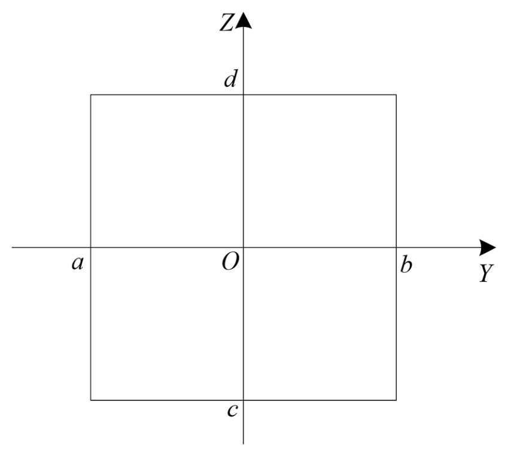

   **图 1** 入口面坐标系。

.. math::

   \lambda_{j,n}=\frac{2\pi}{|k_{j,n}|}=\frac{L_j}{|\eta|},\quad j=2,3;\quad \eta\in \mathbb{Z}\ \text{且}\ \eta\ne0. \qquad (12)

其中，:math:`\lambda_{j,n}` 是单波在第 :math:`j` 方向的波长。换句话说，只要该条件在 :math:`Y` 或 :math:`Z` 方向之一得到满足，由单波生成的流场就满足入口质量平衡条件，并自动与相应周期边界相容。因此，如果每个单波均满足式 (11)，由 RFG 类方法生成的湍流场瞬时入口质量通量也将自然保持恒定，这对于降低不期望的压力脉动至关重要。

2.2.2 入口质量通量修正
^^^^^^^^^^^^^^^^^^^^^^

在应用 RFG 类方法时，如果入口面尺寸足够大且网格足够细，瞬时入口质量通量期望收敛到零 [4,26]。然而，受计算资源限制，实践中往往难以满足这两个条件，从而因入口质量通量不平衡产生较大的人工压力脉动 [4,45,46]。为解决这一问题，根据文献 [4,26,45]，不平衡入口质量通量可通过简单修正方法修正，形式如下：

.. math::

   u_1^c(t,\mathbf{x})=\frac{U_{B0}}{U_B(t)}\left[U_{avg}+u_1(\mathbf{x},t)\right]-U_{avg}, \qquad (13)

.. math::

   u_i^c(t,\mathbf{x})=\frac{U_{B0}}{U_B(t)}u_i(\mathbf{x},t),\quad i=2,3, \qquad (14)

.. math::

   U_{B0}=\frac{1}{A}\iint_S U_{avg}\,dx_2dx_3,\quad
   U_B(t)=\frac{1}{A}\iint_S\left[U_{avg}+u_1(\mathbf{x},t)\right]dx_2dx_3,\quad
   A=\iint_S dx_2dx_3. \qquad (15)

其中，:math:`u_i^c` 为第 :math:`i` 个修正后脉动速度；:math:`U_{B0}` 为由目标平均速度确定的恒定体积平均速度；:math:`U_B(t)` 为瞬时体积平均速度；:math:`A` 为入口面面积。谱方法生成流场的入口质量通量修正在文献 [26] 中有图示。通过这种方式，可以防止人工压力脉动，并能以合理精度获得建筑风压结果。然而，需要注意的是，当入流湍流严重不平衡时，对应的速度修正系数可能较大，导致初始湍流特征发生显著变化，并导致与无散度条件和 Taylor 冻结假设不相容。

2.3 单波传播数值模拟
~~~~~~~~~~~~~~~~~~~~

2.3.1 数值设置
^^^^^^^^^^^^^^

为研究入口质量平衡条件对流场输运的作用，文中对单波速度进行了模拟。与文献 [3,39,40] 类似，棱柱计算域尺寸为 :math:`3\ \mathrm{m}\times2\ \mathrm{m}\times2\ \mathrm{m}`，如图 2 所示。为避免出口边界对结果的影响，分析时仅显示计算域前 :math:`2\ \mathrm{m}` 范围。平均纵向速度设为 :math:`10\ \mathrm{m/s}`。此外，采用均匀结构网格，总计 150 万个立方单元，每个单元边长为 :math:`0.02\ \mathrm{m}`。平均速度加单波速度被映射为 Dirichlet 型入流边界条件。四个侧面采用周期边界条件，出口处采用零速度梯度和零压力。

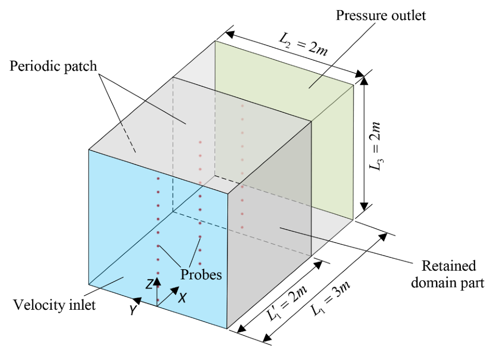

   **图 2** 计算域和边界条件示意图。

本文所有大涡模拟均使用 OpenFOAM v2206 完成。壁面自适应局部涡黏（wall-adapting local eddy-viscosity, WALE）模型 [47] 用于 LES 亚格子尺度应力建模；压力-速度耦合采用 PISO（pressure-implicit with the splitting of operators）方法 [48]。为满足 Courant-Friedrichs-Lewy（CFL）条件，时间步长设为 :math:`0.001\ \mathrm{s}`。总时间步数为 4000，对应总模拟时间 :math:`4\ \mathrm{s}`。随后取最后 :math:`3\ \mathrm{s}` 模拟结果用于数据后处理。

表 1 列出了单波传播模拟工况。工况 SW1 用于模拟入口质量通量不平衡的影响；SW2 用于模拟简单入口质量通量修正的影响；SW3 用于对比使用 :math:`Y` 方向波数周期修正时的结果；SW4 采用 :math:`Y` 和 :math:`Z` 方向波数周期修正用于比较。此外，单波速度标准差（STD）的目标值可计算为：

.. math::

   \sigma_{i,n}=\sqrt{\lim_{T\to\infty}\frac{1}{T}\int_0^T\left[u_{i,n}(\mathbf{x},t)\right]^2dt}
   =\sqrt{\lim_{T\to\infty}\frac{1}{T}\int_0^T\left[p_{i,n}\sin(\mathbf{k}_n\cdot\mathbf{x}+2\pi f_nt+\phi)\right]^2dt}
   =\sqrt{\frac{1}{2}p_{i,n}^2}. \qquad (16)

湍动能（TKE）随后可计算为：

.. math::

   TKE=\frac{1}{2}\left(\sigma_u^2+\sigma_v^2+\sigma_w^2\right). \qquad (17)

根据式 (16) 和式 (17)，SW1 和 SW3 的目标初始 TKE 均为 :math:`1.64\ \mathrm{m^2/s^2}`。相比之下，SW4 的初始 TKE 为 :math:`1.53\ \mathrm{m^2/s^2}`，相较 SW1 降低 6.7%，这是由 :math:`Y` 和 :math:`Z` 两个方向同时进行波数周期修正导致的。此外，当前研究未考虑与对称和壁面边界的不相容性，相关研究可参见文献 [3]。

.. list-table:: **表 1** 单波传播模拟工况。
   :header-rows: 1
   :widths: 10 28 28 10 8 12 14 18

   * - 工况
     - :math:`\mathbf{p}_n\ (\mathrm{m/s})`
     - :math:`\mathbf{k}_n\ (\mathrm{m^{-1}})`
     - :math:`f_n\ (\mathrm{Hz})`
     - :math:`\phi_n`
     - 无散度
     - Taylor 假设
     - 入口质量平衡
   * - SW1
     - :math:`(U_{avg}/5,\ U_{avg}/8,\ U_{avg}/10)^T`
     - :math:`(\pi,\ -4\pi/3,\ -\pi/3)^T`
     - -5
     - 0
     - √
     - √
     - ×
   * - SW2
     - :math:`(U_{avg}/5,\ U_{avg}/8,\ U_{avg}/10)^T`
     - :math:`(\pi,\ -4\pi/3,\ -\pi/3)^T`
     - -5
     - 0
     - ≈
     - ≈
     - √（修正后）
   * - SW3
     - :math:`(U_{avg}/5,\ U_{avg}/8,\ U_{avg}/10)^T`
     - :math:`(\pi,\ -\pi,\ -3\pi/4)^T`
     - -5
     - 0
     - √
     - √
     - √
   * - SW4
     - :math:`(U_{avg}/5,\ U_{avg}/8,\ 3U_{avg}/40)^T`
     - :math:`(\pi,\ -\pi,\ -\pi)^T`
     - -5
     - 0
     - √
     - √
     - √

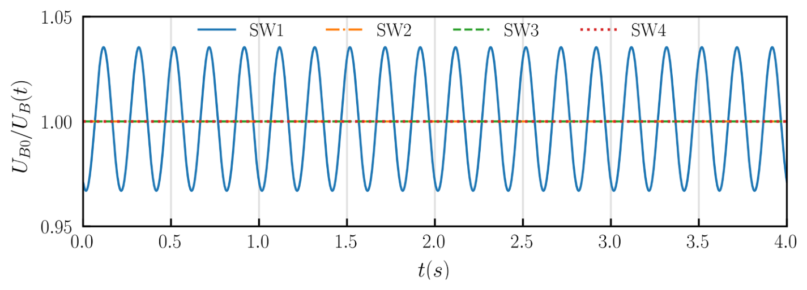

   **图 3** SW1 至 SW4 工况入口质量通量比例系数时程。

2.3.2 数值结果
^^^^^^^^^^^^^^

图 3 展示了 SW1 至 SW4 工况入口质量通量比例系数的时程。显然，SW1 的入口质量通量表现出不平衡，而其余工况均满足入口质量平衡条件。图 4 显示了 SW1 至 SW4 工况流场统计脉动结果（括号中数值分别表示最大值和最小值）。为更好描述内部流场演化，图 5 和图 6 给出了监测点处脉动压力系数和 TKE 的发展。压力系数计算为：

.. math::

   C_p=\frac{p-p_{ref}}{\tfrac{1}{2}\rho U_H^2}. \qquad (18)

其中，:math:`C_p` 表示压力系数；:math:`p_{ref}` 表示参考压力；:math:`\rho` 为空气密度，取 :math:`1.225\ \mathrm{kg/m^3}`；:math:`U_H` 为参考速度。此外，:math:`C'_p` 表示压力系数标准差。

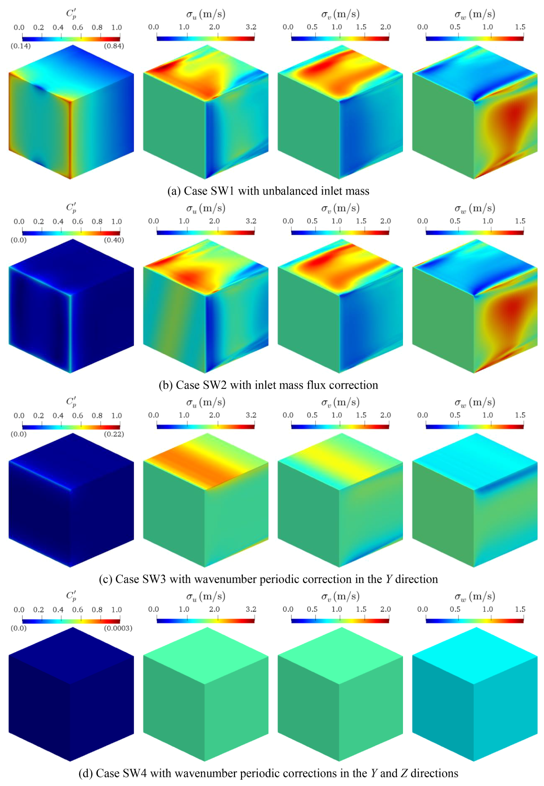

   **图 4** SW1 至 SW4 工况流场统计脉动。

对于压力脉动结果，图 4(a) 表明，由于 SW1 工况中观察到强烈不平衡入口质量通量，入口面周边最大压力值达到动压的 0.84 倍。尽管随着流场发展压力脉动逐渐减小，位置 :math:`X=2\ \mathrm{m}` 处的人工脉动压力仍达到动压的约 15%，这会严重污染后续建筑模拟中的压力测量。相比之下，图 4(b) 和图 4(c) 表明，只要维持入口质量平衡条件，压力脉动就被限制在邻近入口面的区域，并迅速降低到可忽视水平。此外，图 4(d) 表明，整个流场中没有非物理压力脉动，这归因于 :math:`Y` 和 :math:`Z` 方向的波数周期修正。

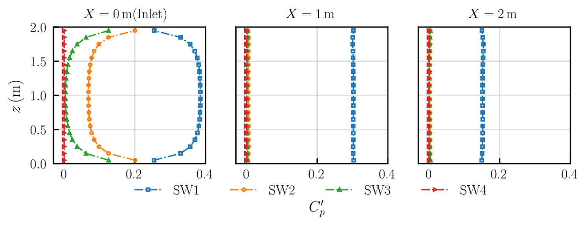

   **图 5** SW1 至 SW4 工况 :math:`X` 方向压力系数标准差剖面对比。

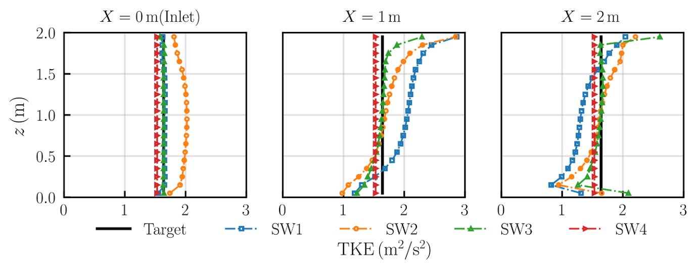

   **图 6** SW1 至 SW4 工况 :math:`X` 方向 TKE 剖面发展。

进一步地，如图 5 所示，SW2 工况入口面中心处脉动压力约为动压的 7%，而 SW3 和 SW4 在相同位置仅观察到极小压力脉动。这种差异可归因于入口质量通量修正，因为它使 SW2 无法严格满足无散度条件和 Taylor 假设。

关于速度标准差发展，图 4 表明，SW1 和 SW2 在流场发展过程中发生明显变化，而 SW3 在中心范围（高度介于 :math:`0.5` 至 :math:`1.5\ \mathrm{m}` 之间）内保持更好的自维持性。虽然 SW4 也表现出良好自维持性，但 :math:`w` 分量标准差为 :math:`0.53\ \mathrm{m/s}`，小于目标值 :math:`0.71\ \mathrm{m/s}`，这是由于 :math:`Z` 方向额外波数周期修正造成的。TKE 剖面发展见图 6。对于 SW1，尽管 TKE 剖面在入口处起初与目标值吻合良好，但在发展过程中发生显著变化，这可归因于入口质量不平衡。对于 SW2，入口处较大的质量修正系数导致初始 TKE 发生较大改变，并且发展过程中进一步变化。然而，SW3 受益于 :math:`Y` 方向波数周期修正，在中心区域表现出最佳 TKE 自维持性。相反，SW4 整体 TKE 低于目标值，这是参数 :math:`p_{3,n}` 改变造成的。

简言之，如果无散度条件、Taylor 冻结假设和入口质量平衡条件能够预先同时满足，生成的风场将没有非物理压力脉动，并且能够在中心范围内自维持发展。文中建议，仅通过一个空间方向的波数周期修正即可实现入口质量平衡条件，因为同时调整 :math:`Y` 和 :math:`Z` 两个方向的波数可能导致初始 TKE 被修改。

3 相干性改进且质量平衡随机流生成方法（CMRFG）
----------------------------------------------

3.1 CIRFG 方法回顾
~~~~~~~~~~~~~~~~~~~~~~

在介绍新方法之前，文中首先对 CIRFG 方法 [42] 作简要介绍。如第 2 节所述，CIRFG 方法采用简洁表达式，见式 (1) 和式 (2)。首先，式 (2) 中的幅值和频率参数共同决定时间 PSD 的形式，可表示为：

.. math::

   p_{i,n}=sign(r_{i,n})\sqrt{2S_{ii,T}(f_n)\Delta f}, \qquad (19)

.. math::

   f_n=\frac{2n-1}{2}\Delta f=\frac{(2n-1)f_{max}}{2N-1}. \qquad (20)

其中，:math:`r_{i,n}` 为服从均匀分布的随机数；:math:`S_{ii,T}(f_n)` 分别表示 :math:`i=1,2,3` 时纵向、横向和竖向分量目标单侧时间 PSD（下标 :math:`T` 表示目标值）；:math:`f_{max}` 为最大截断频率；:math:`\Delta f` 为频率步长。为考虑不同湍流速度分量之间的互相关，参数 :math:`r_{i,n}` 的各个分量需要服从特定概率密度函数。假设 :math:`r_{i,n}\sim U(d_i-1,d_i)`，则参数 :math:`d_i` 通过求解下列方程确定：

.. math::

   \left\{
   \begin{aligned}
   1+4d_ud_v-2d_u-2d_v &= \xi_{uv},\\
   1+4d_ud_w-2d_u-2d_w &= \xi_{uw},\\
   1+4d_vd_w-2d_v-2d_w &= \xi_{vw},\\
   d_u,d_v,d_w &\in[0,1].
   \end{aligned}\right. \qquad (21)

其中，:math:`\xi_{ij}` 表示第 :math:`i` 和第 :math:`j` 个脉动速度分量的尺度因子，计算为：

.. math::

   \xi_{ij}=\frac{\rho_{ij,T}}{\rho_{ij,C}^{max}},\quad
   \rho_{ij,C}^{max}=\frac{1}{\sigma_i\sigma_j}\sum_{n=1}^{N}\sqrt{S_{ii,T}(f_n)S_{jj,T}(f_n)}\Delta f,\quad
   \sigma_i=\sqrt{\sum_{n=1}^{N}S_{ii,T}(f_n)\Delta f}. \qquad (22)

其中，:math:`\rho_{ij,T}` 为第 :math:`i` 与第 :math:`j` 个分量的目标互相关系数；:math:`\rho_{ij,C}^{max}` 为最大计算时间互相关系数（下标 :math:`C` 表示计算值）；:math:`\sigma_i` 表示第 :math:`i` 个脉动速度标准差。为保证满足 Taylor 冻结假设，参数 :math:`k_{1,n}` 写作：

.. math::

   k_{1,n}=-\frac{2\pi f_n}{U_{avg,T}}, \qquad (23)

其中 :math:`U_{avg,T}` 为目标平均速度。进一步地，参数 :math:`k_{2,n}` 从波数谱角度推导得到，则 :math:`u` 分量在 :math:`Y` 方向的目标双侧空间 PSD 可表示为：

.. math::

   G_{uu,T}(k_2)=\frac{(I_{u,T}U_{avg,T})^2}{2\pi}\int_{-\infty}^{\infty}\rho_{uu,T}(r_2)\exp(-jk_2r_2)\,dr_2, \qquad (24)

其中 :math:`\rho_{uu,T}(r_2)` 表示 :math:`u` 分量在 :math:`Y` 方向的目标空间相关系数；:math:`I_{u,T}` 为 :math:`u` 分量目标湍流强度。类似地，可以推导计算双侧空间 PSD 的公式，其中各系数与时间 PSD :math:`S_{uu,T}(f_n)` 相关，详见文献 [42]。基于目标值和双侧空间 PSD 推导值之间的系数关系，可以得到波数递推序列：

.. math::

   k_{2,n}=\begin{cases}
   \Delta k_{2,1}, & n=1,\\
   k_{2,n-1}+\Delta k_{2,n}, & n=2,3,\ldots,N,
   \end{cases} \qquad (25)

波数间隔计算为：

.. math::

   \Delta k_{2,n}=\begin{cases}
   \dfrac{S_{uu,T}(f_1)\Delta f}{2G_{uu,T}(k_2=0)}, & n=1,\\
   \dfrac{S_{uu,T}(f_n)\Delta f}{2G_{uu,T}(k_{2,n-1})}, & n=2,3,\ldots,N.
   \end{cases} \qquad (26)

为在生成均匀湍流场时保持无散度条件，参数 :math:`k_{3,n}` 计算为：

.. math::

   k_{3,n}=-\frac{k_{1,n}p_{1,n}+k_{2,n}p_{2,n}}{p_{3,n}}. \qquad (27)

需要注意的是，在 CIRFG 方法中，:math:`Z` 方向空间相关性并未被显式施加，而是通过散度条件自然确定，这可能是一种合理做法。最后，随机相位角服从 :math:`0` 到 :math:`2\pi` 范围内的均匀分布，即 :math:`\phi_n\sim U(0,2\pi)`。

至此，CIRFG 方法的简要描述完成。CIRFG 方法有两个主要优点：其一，是显式嵌入不同速度分量之间的互相关；其二，是从波数谱角度实现任意空间相关系数。然而，CIRFG 方法未能考虑与频率相关的空间相干函数的实现，这可能导致生成流场缺乏真实性。附录 A 对空间相关函数与空间相干函数之间的关系给出了详细说明。简言之，尽管流场可以满足相同的空间相关函数，其空间相干函数仍可能具有多种形式。此外，由于 CIRFG 方法不包含入口质量平衡条件，生成的湍流场会产生非物理压力脉动，这可能导致计算域内压力测量不可靠。

根据第 2 节，尽管非物理压力脉动问题可通过简单入口质量通量修正解决，但过大的修正系数可能导致原始湍流特征发生较大改变，并且无法满足无散度条件。因此，上述两个问题仍需解决。

3.2 修正方法
~~~~~~~~~~~~

现在开始推导相干性改进且质量平衡随机流生成（CMRFG）方法。CMRFG 方法基于 CIRFG 方法提出，因此保留原方法以下优点：(1) 满足任意平均速度、湍流强度、时间谱、时间相关性、不同速度分量之间互相关和空间相关系数等湍流特征；(2) 对均匀湍流场满足无散度条件和 Taylor 冻结假设；(3) 具有较高计算效率并适用于并行算法。在此基础上，新 CMRFG 方法旨在实现以下目标：(1) 显式实现任意空间相干函数，以生成更真实湍流场；(2) 满足入口质量平衡条件，以降低非物理压力脉动并保持原始湍流特征。详细推导如下。

3.2.1 一致空间相干函数
^^^^^^^^^^^^^^^^^^^^^^

在推导之前，将幅值和频率表达式调整为：

.. math::

   p_{i,n}=sign(r_{i,n})\sqrt{2S_{ii,T}(|f_n|)\Delta f}, \qquad (28)

.. math::

   |f_n|=\frac{2n-1}{2}\Delta f=\frac{(2n-1)f_{max}}{2N-1}. \qquad (29)

这样，通过重新定义频率符号，波数向量的各分量可以处于相似数值范围，详见第 3.2.3 节。

在原 CIRFG 方法中，:math:`k_{2,n}` 由目标时间 PSD 和 :math:`Y` 方向空间 PSD 的配对确定，因此 :math:`k_{2,n}` 是一个确定性变量。这导致波数空间中的能量分布不具有随机性，并对应于不同位置之间强空间相干函数。为生成任意空间相干函数，修正方法通过使波数向量第二分量与频率相关来将目标值显式嵌入公式中，并且不需要额外经验参数。此外，与原方法保持一致，改进方法中的波数第三分量并不显式赋予空间相关性，而是由无散度条件自然确定，这可以认为是一种合乎逻辑的做法。现在，一致空间相干函数的推导可以分为四步。

第一步：推导时空互相关函数和时间相关函数的表达式。假设参数 :math:`k_{2,n}` 是与 :math:`f_n` 相关的随机变量，则与第 :math:`i` 个分量相关的 :math:`Y` 方向时空互相关函数（坐标 :math:`\mathbf{x}` 与 :math:`\mathbf{x}+r_2\mathbf{e}_2` 之间）应通过集合平均计算为：

.. math::

   \begin{aligned}
   R_{ii}(\mathbf{x},r_2,\tau)&=E\left[u_i(\mathbf{x},t)u_i(\mathbf{x}+r_2\mathbf{e}_2,t+\tau)\right]\\
   &=\sum_{n=1}^{N}\left[\int_{-\infty}^{\infty}\sqrt{S_{ii,T}(\mathbf{x},|f_n|)S_{ii,T}(\mathbf{x}+r_2\mathbf{e}_2,|f_n|)}\Delta f\right.\\
   &\qquad\left.\times \cos(2\pi f_n\tau+k_{2,n}r_2)g_{k_{2,n}}(k_{2,n},|f_n|)\,dk_{2,n}\right].
   \end{aligned}\qquad (30)

其中，:math:`g_{k_{2,n}}(k_{2,n},|f_n|)` 是与频率相关的 :math:`k_{2,n}` 概率密度函数。若令式 (30) 中 :math:`r=0`，则坐标 :math:`\mathbf{x}` 和 :math:`\mathbf{x}+r_2\mathbf{e}_2` 处的时间相关函数可分别得到为：

.. math::

   R_{ii}(\mathbf{x},\tau)=\sum_{n=1}^{N}S_{ii,T}(\mathbf{x},|f_n|)\Delta f\cos(2\pi f_n\tau), \qquad (31)

.. math::

   R_{ii}(\mathbf{x}+r_2\mathbf{e}_2,\tau)=\sum_{n=1}^{N}S_{ii,T}(\mathbf{x}+r_2\mathbf{e}_2,|f_n|)\Delta f\cos(2\pi f_n\tau). \qquad (32)

第二步：推导两点之间计算得到的空间相干函数。首先，对式 (30) 进行 Fourier 变换，:math:`Y` 方向双侧时间互谱密度（CSD）计算为：

.. math::

   \begin{aligned}
   G_{ii}(\mathbf{x},r_2,f)&=\int_{-\infty}^{\infty}R_{ii}(\mathbf{x},r_2,\tau)\exp(-j2\pi f\tau)d\tau\\
   &=\int_{-\infty}^{\infty}\sum_{n=1}^{N}\left[\int_{-\infty}^{\infty}\sqrt{S_{ii,T}(\mathbf{x},|f_n|)S_{ii,T}(\mathbf{x}+r_2\mathbf{e}_2,|f_n|)}\Delta f\right.\\
   &\qquad\left.\times\cos(2\pi f_n\tau+k_{2,n}r_2)g_{k_{2,n}}(k_{2,n},|f_n|)dk_{2,n}\right]\exp(-j2\pi f\tau)d\tau.
   \end{aligned}\qquad (33)

式 (33) 中，余弦函数的 Fourier 变换表示为：

.. math::

   \int_{-\infty}^{\infty}\cos(2\pi f_n\tau+k_{2,n}r_2)\exp(-j2\pi f\tau)d\tau
   =\frac{1}{2}\left[\delta(f-f_n)e^{jk_{2,n}r_2}+\delta(f+f_n)e^{-jk_{2,n}r_2}\right]. \qquad (34)

将式 (34) 代回式 (33)，得到：

.. math::

   \begin{aligned}
   G_{ii}(\mathbf{x},r_2,f)&=\sum_{n=1}^{N}\frac{1}{2}\sqrt{S_{ii,T}(\mathbf{x},|f_n|)S_{ii,T}(\mathbf{x}+r_2\mathbf{e}_2,|f_n|)}\Delta f\\
   &\quad\times\int_{-\infty}^{\infty}\left[\delta(f-f_n)e^{jk_{2,n}r_2}+\delta(f+f_n)e^{-jk_{2,n}r_2}\right]g_{k_{2,n}}(k_{2,n},|f_n|)dk_{2,n}.
   \end{aligned}\qquad (35)

根据 Euler 公式，有：

.. math::

   \left\{
   \begin{aligned}
   e^{jk_{2,n}r_2}&=\cos(k_{2,n}r_2)+j\sin(k_{2,n}r_2),\\
   e^{-jk_{2,n}r_2}&=\cos(k_{2,n}r_2)-j\sin(k_{2,n}r_2).
   \end{aligned}\right. \qquad (36)

将式 (36) 代入式 (35)，时间 CSD 可写为同相谱密度与正交谱密度之和，即：

.. math::

   G_{ii}(\mathbf{x},r_2,f)=C_{ii}(\mathbf{x},r_2,f)+jQ_{ii}(\mathbf{x},r_2,f), \qquad (37)

.. math::

   \begin{aligned}
   C_{ii}(\mathbf{x},r_2,f)&=\sum_{n=1}^{N}\frac{1}{2}\sqrt{S_{ii,T}(\mathbf{x},|f_n|)S_{ii,T}(\mathbf{x}+r_2\mathbf{e}_2,|f_n|)}\Delta f\\
   &\quad\times\int_{-\infty}^{\infty}\cos(k_{2,n}r_2)g_{k_{2,n}}(k_{2,n},|f_n|)dk_{2,n}\left[\delta(f-f_n)+\delta(f+f_n)\right],
   \end{aligned}\qquad (38)

.. math::

   \begin{aligned}
   Q_{ii}(\mathbf{x},r_2,f)&=\sum_{n=1}^{N}\frac{1}{2}\sqrt{S_{ii,T}(\mathbf{x},|f_n|)S_{ii,T}(\mathbf{x}+r_2\mathbf{e}_2,|f_n|)}\Delta f\\
   &\quad\times\int_{-\infty}^{\infty}\sin(k_{2,n}r_2)g_{k_{2,n}}(k_{2,n},|f_n|)dk_{2,n}\left[\delta(f-f_n)-\delta(f+f_n)\right].
   \end{aligned}\qquad (39)

类似地，对式 (31) 和式 (32) 进行 Fourier 变换，得到单点双侧时间 PSD：

.. math::

   G_{ii}(\mathbf{x},f)=\int_{-\infty}^{\infty}R_{ii}(\mathbf{x},\tau)\exp(-j2\pi f\tau)d\tau
   =\sum_{n=1}^{N}\frac{1}{2}S_{ii,T}(\mathbf{x},|f_n|)\Delta f\left[\delta(f-f_n)+\delta(f+f_n)\right], \qquad (40)

.. math::

   G_{ii}(\mathbf{x}+r_2\mathbf{e}_2,f)=\int_{-\infty}^{\infty}R_{ii}(\mathbf{x}+r_2\mathbf{e}_2,\tau)\exp(-j2\pi f\tau)d\tau
   =\sum_{n=1}^{N}\frac{1}{2}S_{ii,T}(\mathbf{x}+r_2\mathbf{e}_2,|f_n|)\Delta f\left[\delta(f-f_n)+\delta(f+f_n)\right]. \qquad (41)

对于均匀湍流场，不同位置的时间 PSD 函数相同，因此可以不再写出坐标符号，即：

.. math::

   S_{ii,T}(\mathbf{x},|f_n|)=S_{ii,T}(\mathbf{x}+r_2\mathbf{e}_2,|f_n|)=S_{ii,T}(|f_n|). \qquad (42)

因此，基于式 (37) 至式 (42)，每个离散频率处的空间相干函数计算为：

.. math::

   \begin{aligned}
   Coh_{ii,C}(r_2,|f_n|)&=\frac{G_{ii}(\mathbf{x},r_2,|f_n|)}{\sqrt{G_{ii}(\mathbf{x},|f_n|)}\sqrt{G_{ii}(\mathbf{x}+r_2\mathbf{e}_2,|f_n|)}}\\
   &=\int_{-\infty}^{\infty}\cos(k_{2,n}r_2)g_{k_{2,n}}(k_{2,n},|f_n|)dk_{2,n}
   +j\int_{-\infty}^{\infty}\sin(k_{2,n}r_2)g_{k_{2,n}}(k_{2,n},|f_n|)dk_{2,n}.
   \end{aligned}\qquad (43)

现在，计算空间相干函数可表示为一系列 Dirac 函数叠加，即：

.. math::

   Coh_{ii,C}(r_2,f)=\sum_{n=1}^{N}Coh_{ii,C}(r_2,|f_n|)\Delta f\delta(f-|f_n|),\quad f>0. \qquad (44)

第三步：确定参数 :math:`k_{2,n}` 的概率密度函数。目标空间相干函数离散为：

.. math::

   Coh_{ii,T}(r_2,f)=\sum_{n=1}^{N}Coh_{ii,T}(r_2,|f_n|)\Delta f\delta(f-|f_n|),\quad f>0. \qquad (45)

通过比较式 (44) 和式 (45)，如果每个频率分量均可满足条件 :math:`Coh_{ii,C}(r_2,|f_n|)=Coh_{ii,T}(r_2,|f_n|)`，则生成的随机场可自动满足目标空间相干函数。根据式 (43) 至式 (45)，分别对计算空间相干函数和目标空间相干函数的每个频率分量作 Fourier 变换，得到：

.. math::

   \begin{aligned}
   G_C(k_2,|f_n|)&=\frac{1}{2\pi}\int_{-\infty}^{\infty}Coh_{ii,C}(r_2,|f_n|)\exp(-jk_2r_2)dr_2\\
   &=\int_{-\infty}^{\infty}g_{k_{2,n}}(k_{2,n},|f_n|)\delta(k_2-k_{2,n})dk_{2,n}=g_{k_{2,n}}(k_2,|f_n|),
   \end{aligned}\qquad (46)

.. math::

   G_T(k_2,|f_n|)=\frac{1}{2\pi}\int_{-\infty}^{\infty}Coh_{ii,T}(r_2,|f_n|)\exp(-jk_2r_2)dr_2. \qquad (47)

令式 (46) 和式 (47) 相等，则 :math:`k_{2,n}` 的概率密度函数计算为：

.. math::

   g_{k_{2,n}}(k_2,|f_n|)=\frac{1}{2\pi}\int_{-\infty}^{\infty}Coh_{ii,T}(r_2,|f_n|)\exp(-jk_2r_2)dr_2. \qquad (48)

理论上，每个脉动速度分量的概率密度函数均可根据式 (48) 计算。然而，考虑到无散度条件的实现，第二分量波数必须在三个湍流分量之间取一致值。因此，文中选择考虑与 :math:`u` 分量相关的 :math:`Y` 方向空间相干函数，而其他脉动分量的结果由无散度条件自然决定。进一步地，式 (48) 的反 Fourier 变换表达式写作：

.. math::

   Coh_{ii,T}(r_2,|f_n|)=\int_{-\infty}^{\infty}g_{k_{2,n}}(k_2,|f_n|)\exp(jk_2r_2)dk_2. \qquad (49)

令 :math:`r_2=0`，可进一步得到：

.. math::

   Coh_{ii,T}(r_2=0,|f_n|)=\int_{-\infty}^{\infty}g_{k_{2,n}}(k_2,|f_n|)dk_2
   =\frac{G_{ii}(\mathbf{x},r_2=0,|f_n|)}{\sqrt{G_{ii}(\mathbf{x},|f_n|)}\sqrt{G_{ii}(\mathbf{x},|f_n|)}}=1. \qquad (50)

式 (50) 表明，:math:`g_{k_{2,n}}(k_2,|f_n|)` 对波数积分等于 1，这与概率密度函数积分等于 1 的原则一致。

第四步：确定最大波数 :math:`k_{2,max}` 并预生成随机波数 :math:`k'_{2,n}`。最大波数由最小波长得到，即：

.. math::

   k_{2,max}=\frac{2\pi}{\lambda_{2,min}}=\frac{2\pi}{N_{g2}\Delta g_2}, \qquad (51)

其中，:math:`k_{2,max}` 是波数向量第二分量最大截断值；:math:`\lambda_{2,min}` 是 :math:`Y` 方向最小波长；:math:`\Delta g_2` 是 :math:`Y` 方向网格尺寸；:math:`N_{g2}` 是 :math:`Y` 方向最小波长与网格尺寸之比。Mansouri 等建议，ITG 方法使用的最大波数不应超过最大网格间距能够输运的波数，因为过大的波数会导致流场中出现非物理压力脉动 [49]。同时，在可接受网格量和模拟精度水平内，建议最小波长至少为最大网格间距的 2 倍，即 :math:`N_{g2}\ge2`。需要注意的是，如果 :math:`N_{g2}=2`，生成的湍流场仍会因网格滤波产生能量衰减，如文献 [49] 所示。

确定最大波数后，需要相应调整概率密度函数 :math:`g_{k_{2,n}}(k_{2,n},|f_n|)`：

.. math::

   g'_{k_{2,n}}(k_{2,n},|f_n|)=
   \begin{cases}
   \dfrac{g_{k_{2,n}}(k_{2,n},|f_n|)}{\int_{-k_{2,max}}^{k_{2,max}}g_{k_{2,n}}(k_{2,n},|f_n|)dk_{2,n}}, & k_{2,n}\in[-k_{2,max},k_{2,max}],\\
   0, & k_{2,n}\in(-\infty,-k_{2,max})\cup(k_{2,max},\infty).
   \end{cases} \qquad (52)

根据式 (52)，调整后概率密度的积分值等于 1，即：

.. math::

   \int_{-\infty}^{\infty}g'_{k_{2,n}}(k_{2,n},|f_n|)dk_{2,n}=\int_{-k_{2,max}}^{k_{2,max}}g'_{k_{2,n}}(k_{2,n},|f_n|)dk_{2,n}=1. \qquad (53)

至此，可基于调整后的概率密度函数预生成随机波数 :math:`k'_{2,n}`。然而，尽管预生成波数能够使生成流场满足目标空间相干函数，入口质量平衡条件尚未满足，还需要在下一小节中进行进一步微小调整。

3.2.2 平衡入口质量通量
^^^^^^^^^^^^^^^^^^^^^^

如第 2.2.1 节所述，如果入口面宽度是每个单波分量 :math:`Y` 方向波长的整数倍，则 RFG 类方法获得的湍流场将满足入口质量平衡条件，并自动与 :math:`Y` 方向周期边界相容。因此，可以通过对预生成波数进行轻微调整来实现入口质量平衡条件。首先，由入口面宽度计算波数间距为：

.. math::

   \Delta k_2=\frac{2\pi}{L_2}. \qquad (54)

随后，将预生成波数轻微调整到最近的波数，该波数是波数间距的整数倍。对应公式表示为：

.. math::

   k_{2,n}=sign(k'_{2,n})\max\left[round\left(\frac{|k'_{2,n}|}{\Delta k_2}\right),1\right]\Delta k_2, \qquad (55)

其中 :math:`round(\cdot)` 为取整函数。需要注意的是，当入口宽度较大时，对应波数间距较小。因此，轻微调整后的波数 :math:`k_{2,n}` 更接近预生成值 :math:`k'_{2,n}`，并且对空间相干函数模拟影响更小。此外，在均匀网格条件下，由所提出方法生成的湍流场入口质量通量严格恒定。然而，在非均匀网格情况下，网格离散误差可能导致小的入口质量不平衡。这一问题可通过简单入口质量通量修正方法解决。同时，由于入口质量不平衡程度较小，初始湍流特征变化将很小。

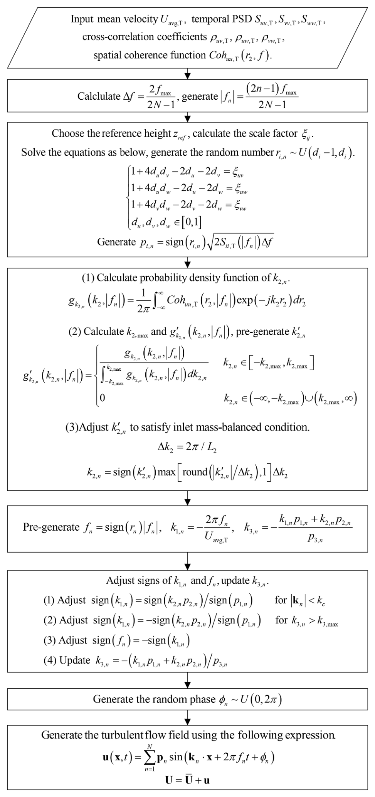

   **图 7** CMRFG 方法流程图。

3.2.3 其他参数调整
^^^^^^^^^^^^^^^^^^

现在转向其他参数的调整。首先，预先确定频率向量符号，计算为：

.. math::

   f_n=sign(r_n)|f_n|, \qquad (56)

其中，:math:`r_n` 为服从均匀分布的随机数，即 :math:`r_n\sim U(-0.5,0.5)`。随后，基于 Taylor 冻结假设，由式 (23) 计算 :math:`k_{1,n}`。进一步地，为保证无散度条件满足，由式 (27) 计算 :math:`k_{3,n}`。

到目前为止，所有系数的初始值都已获得。随后，在保持 :math:`k_{2,n}` 符号不变的情况下，进一步微调 :math:`k_{1,n}` 和 :math:`f_n` 的符号。该过程主要包括两步：

第一步：设定临界波数 :math:`k_c`，在 :math:`|\mathbf{k}_n|<k_c` 范围内调整 :math:`k_{1,n}p_{1,n}` 和 :math:`k_{2,n}p_{2,n}` 为相同符号，表示为：

.. math::

   sign(k_{1,n})=\frac{sign(k_{2,n}p_{2,n})}{sign(p_{1,n})},\quad \text{for}\ |\mathbf{k}_n|<k_c. \qquad (57)

第一步的目的是降低能谱低波数范围内的能量累积。由于 :math:`k_{3,n}` 由式 (27) 确定，当 :math:`k_{1,n}p_{1,n}` 和 :math:`k_{2,n}p_{2,n}` 符号相同时，:math:`k_{3,n}` 更大；当二者符号相反时，:math:`k_{3,n}` 更小。根据三维能谱特征，低波数范围内的能量通常较小。因此，按式 (57) 调整临界波数范围内的系数，可更准确模拟低波数范围内的能量。根据测试，建议将临界波数设置为峰值波数的一半。

第二步：设定最大波数 :math:`k_{3,max}`，并在 :math:`k_{3,n}>k_{3,max}` 范围内调整 :math:`k_{1,n}p_{1,n}` 和 :math:`k_{2,n}p_{2,n}` 为相反符号，计算为：

.. math::

   sign(k_{1,n})=-\frac{sign(k_{2,n}p_{2,n})}{sign(p_{1,n})},\quad \text{for}\ k_{3,n}>k_{3,max}. \qquad (58)

由于 :math:`k_{3,n}` 由无散度条件自然确定，无法显式控制其最大值。根据式 (27)，计算得到的最大波数可能超过网格解析范围。因此，对 :math:`k_{3,n}>k_{3,max}` 的波数向量，将 :math:`k_{1,n}p_{1,n}` 和 :math:`k_{2,n}p_{2,n}` 的符号调整为相反，会得到较小的 :math:`k_{3,n}` 计算值，从而减小高波数对结果的影响。在完成 :math:`k_{1,n}` 符号调整后，根据 :math:`sign(f_n)=-sign(k_{1,n})` 调整 :math:`f_n` 的符号。最后，由式 (27) 更新 :math:`k_{3,n}`。

此外，与式 (51) 类似，:math:`X` 和 :math:`Z` 方向最大波数表示为：

.. math::

   k_{i,max}=\frac{2\pi}{\lambda_{i,min}}=\frac{2\pi}{N_{gi}\Delta g_i},\quad i=1,3. \qquad (59)

建议最小波长大于最大网格间距的 2 倍，即 :math:`N_{gi}\ge2`。此外，基于式 (23) 和式 (59)，关于网格间距的最大频率可写为：

.. math::

   f_{max}=\frac{U_{avg,T}}{N_{g1}\Delta g_1}. \qquad (60)

至此，修正方法的推导完成，CMRFG 方法流程见图 7。

回顾推导过程，文中进一步讨论实现空间相干函数的意义。根据附录 B，:math:`Y` 方向空间相干函数由二维双侧空间 CSD :math:`G_{uu}(k_1,k_2)` 经过一系列变换得到。换句话说，如果湍流场能够满足 :math:`Y` 方向空间相干函数，则它自然确定 :math:`G_{uu}(k_1,k_2)`。在合成湍流时，如果能够实现三维 CSD :math:`\Phi_{ij}(\mathbf{k})`，则三维能谱 :math:`E(k)` 以及低维谱（如一维 :math:`G_{ii}(k_j)`、二维 :math:`G_{uu}(k_1,k_2)` 等）自然得到满足。在 CMRFG 方法中，:math:`k_{1,n}` 被设置为等间距波数，三维谱空间中的能量分布首先相对于 :math:`k_{1,n}` 被分配到固定平面。随后，将波数 :math:`k_{2,n}` 作为随机变量，并实现 :math:`Y` 方向空间相干函数，意味着能量在 :math:`k_2` 维度上进行二次重分配。由于 :math:`f_n` 和 :math:`k_{1,n}` 可以相互转换，概率密度函数 :math:`g_{k_{2,n}}(k_{2,n},|f_n|)` 本质上表示 :math:`G_{uu}(k_1,k_2)` 的能量分布密度。进一步地，:math:`k_3` 维度上的能量分布通过无散度条件自动确定。理论上，如果 :math:`k_2` 维度上的能量分布准确反映真实湍流特征，则 :math:`k_3` 维度上的能量分布也应是合理的。因此，可以近似得到目标三维 CSD 和三维能谱。换言之，CMRFG 方法生成的湍流可服从局部各向同性假设。然而，需要注意的是，为满足无散度条件，对所有三个速度分量使用相同的 :math:`k_{2,n}` 概率密度函数，可能导致 :math:`v` 和 :math:`w` 分量的三维 CSD 与实际湍流相比存在轻微差异。这是 CMRFG 方法的局限。此外，与使用径向球面积分实现三维能谱的传统方法 [33–35] 相比，CMRFG 方法通过调整垂直于 :math:`k_1` 轴平面上的能量分布来获得三维空间 CSD。这种方法的优点是，只需要单点时间谱和 :math:`Y` 方向两点空间相干函数，即可生成所需三维湍流场。这对实验测量更实际且更可行。

4 修正方法验证
--------------

4.1 均匀各向同性湍流特征的确定
~~~~~~~~~~~~~~~~~~~~~~~~~~~~~~

本节使用均匀各向同性 CBC 数据（Comte-Bellot 与 Corrsin [50]）验证改进方法的理论准确性。文中采用下游位置 :math:`U_0t/M=42` 处的湍流特征作为初始目标值，其中 :math:`U_0` 是网格附近上游风速 :math:`10\ \mathrm{m/s}`，:math:`M` 是网格尺寸 :math:`0.0508\ \mathrm{m}`。该实验表示低 Reynolds 数湍流，网格 Reynolds 数 :math:`U_0M/\nu` 为 34000。随后，根据附录 B，由 :math:`U_0t/M=42` 时刻三维能谱原始数据（图 8(a) 以 :math:`E(k)` 形式表示）计算 CMRFG 方法所需输入湍流特征，包括时间 PSD 和空间相干函数。

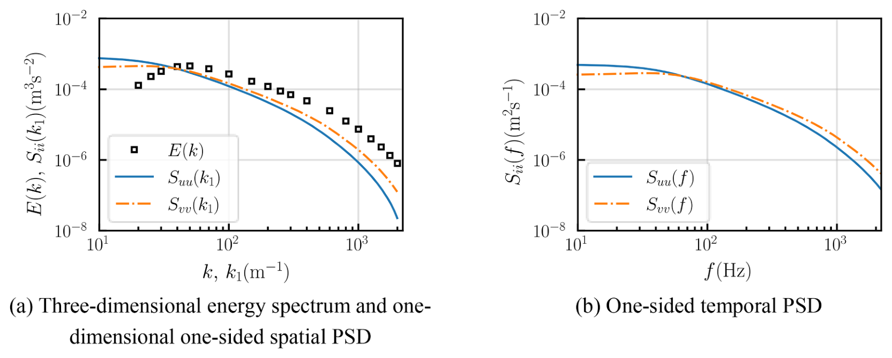

   **图 8** CBC 实验数据的不同类型谱。

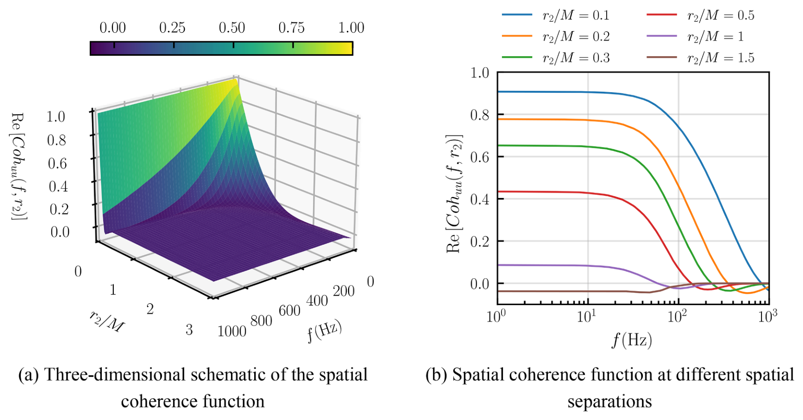

   **图 9** CBC 实验数据中与 :math:`u` 分量相关的 :math:`Y` 方向空间相干函数。

首先，一维单侧空间 PSD 和单侧时间 PSD 如图 8 所示。接着，通过对空间 PSD 进行反 Fourier 变换计算空间相关系数，如图 10 所示。可以看到，纵向空间相关系数 :math:`\rho_{uu}(r_1)` 始终为正，而横向空间相关系数 :math:`\rho_{vv}(r_1)` 在 :math:`r_1/M>1.2` 附近出现负值，这与文献 [51] 的观察结果一致。

此外，基于附录 B 中式 (B13) 至式 (B18)，与 :math:`u` 分量相关的 :math:`Y` 方向空间相干函数如图 9 所示。必须强调，图 9 描述的是空间相干函数的实部，而不是其绝对幅值。根据附录 B，由于考虑的是均匀各向同性湍流，理论上计算得到的空间相干函数应为实函数且对称。参考附录 A 可知，空间相关函数由空间相干函数的实部确定。因此，本文只绘制实部。由图 9(a) 可见，当 :math:`r_2=0` 时，空间相干函数保持为 1，这与式 (50) 的推导结论一致。图 9(b) 给出了不同空间间隔处的空间相干函数。随着频率增大，空间相干函数趋近于 0。此外，随着距离增大，相干函数值快速降低，并在约 :math:`r_2/M>1.2` 后出现负值。

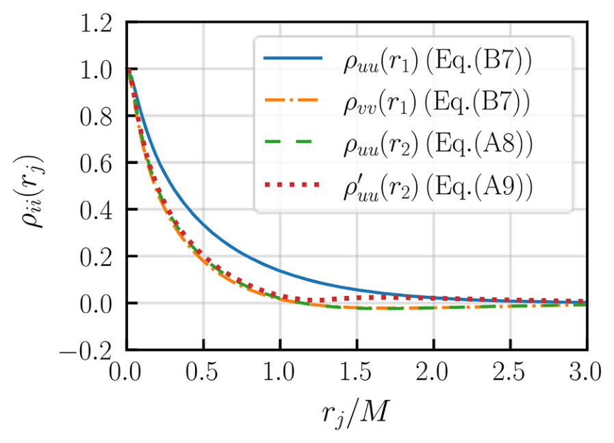

   **图 10** CBC 实验数据的纵向和横向空间相关系数。

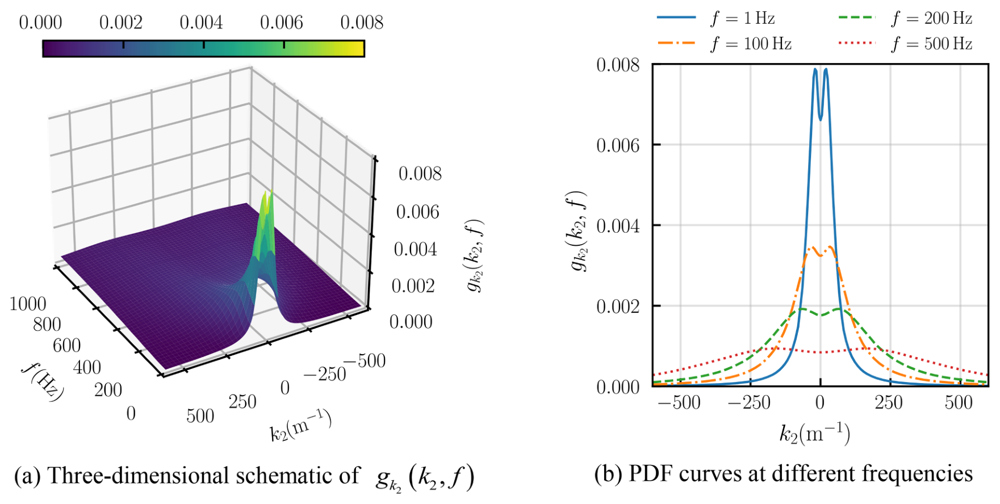

   **图 11** CBC 实验数据 :math:`k_2` 概率密度函数示意图。

在图 10 中，根据附录 A 中式 (A12) 计算的横向空间相关系数 :math:`\rho_{uu}(r_2)` 在 :math:`r_2/M>1.2` 时开始出现负值。这与空间相干函数开始变为负值的位置相对应。作为比较，文中用附录 A 中式 (A9) 对空间相干函数绝对值积分得到空间相关系数 :math:`\rho'_{uu}(r_2)`。当仅考虑空间相干函数绝对值时，空间相关系数始终保持为正，无法准确估计横向空间相关。因此，CMRFG 方法输入参数应包含空间相干函数实部，以生成与实际空间相关一致的湍流。

此外，使用式 (48) 计算不同频率处波数 :math:`k_{2,n}` 的概率密度函数，如图 11 所示。对于均匀各向同性湍流，:math:`g_{k_2}(k_2,f)` 表示二维轴对称函数。在固定频率下，低波数范围内的概率密度值高于高波数范围内的概率密度值，说明湍流能量更集中于低波数范围。

最后，CBC 数据 [50] 给出了速度标准差随时间衰减曲线：

.. math::

   \frac{U_0^2}{\sigma_u^2}=21\left(\frac{U_0t}{M}-3.5\right)^{1.25},\quad
   \frac{U_0^2}{\sigma_v^2}=\frac{U_0^2}{\sigma_w^2}=20\left(\frac{U_0t}{M}-3.5\right)^{1.25}. \qquad (61)

随后基于式 (61) 和式 (17)，可计算 TKE 时间衰减曲线，并且在 :math:`U_0t/M=42` 时 TKE 值为 :math:`0.077\ \mathrm{m^2/s^2}`。

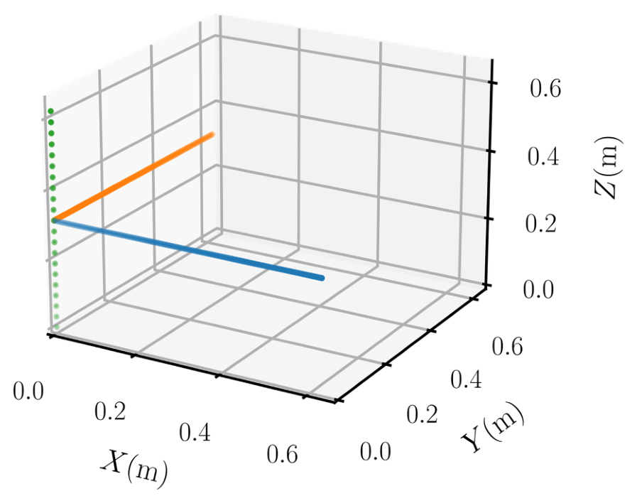

   **图 12** :math:`X`、:math:`Y` 和 :math:`Z` 方向监测点。

.. list-table:: **表 2** 监测点工况配置。
   :header-rows: 1
   :widths: 15 15 15 25

   * - 工况
     - 方向
     - 数量
     - :math:`k_{2,n}` 修正
   * - MPX
     - X
     - 128
     - 已修正
   * - MPY1
     - Y
     - 128
     - 已修正
   * - MPY2
     - Y
     - 256
     - 已修正
   * - MPY3
     - Y
     - 128
     - 未修正
   * - MPZ1
     - Z
     - 21
     - 已修正
   * - MPZ2
     - Z
     - 21
     - 已修正

.. list-table:: **表 3** CBC 实验数据的均匀各向同性湍流特征。
   :header-rows: 1
   :widths: 28 72

   * - 参数
     - 定义/取值
   * - 平均速度
     - :math:`U_{avg,T}=10\ \mathrm{m/s}`
   * - 时间 PSD
     - :math:`S_{uu,T}(f)` 和 :math:`S_{vv,T}(f)` 根据附录 B 计算，如图 8(b) 所示。此外，:math:`S_{vv,T}(f)=S_{ww,T}(f)`。
   * - 空间相干函数
     - :math:`Coh_{uu,T}(f,r_2)` 根据附录 B 计算，结果见图 9。
   * - 空间相关系数
     - :math:`\rho_{uu}(r_1)` 和 :math:`\rho_{vv}(r_1)` 由附录 B 中式 (B7) 和式 (B8) 得到；:math:`\rho_{uu}(r_2)` 由附录 A 中式 (A11) 计算，结果见图 10。此外，:math:`\rho_{uu}(r_1)=\rho_{vv}(r_2)`，:math:`\rho_{vv}(r_1)=\rho_{uu}(r_2)`。
   * - 互相关系数
     - :math:`\rho_{uv,T}=\rho_{uw,T}=\rho_{vw,T}=0`
   * - CMRFG 参数
     - :math:`N=5000, L_1=L_2=L_3=0.2\pi\ \mathrm{m}, N_{g1}=N_{g2}=N_{g3}=2, k_c=25\ \mathrm{m^{-1}}`；(1) MPX、MPY1、MPY3、MPZ1：:math:`\Delta g_1=\Delta g_2=\Delta g_3=0.2\pi/128\ \mathrm{m}, f_{max}=1000\ \mathrm{Hz}, k_{2,max}=k_{3,max}=640\ \mathrm{m^{-1}}, \Delta t=0.0005\ \mathrm{s}, N_t=10000`；(2) MPY2、MPZ2：:math:`\Delta g_1=\Delta g_2=\Delta g_3=0.2\pi/256\ \mathrm{m}, f_{max}=2000\ \mathrm{Hz}, k_{2,max}=k_{3,max}=1280\ \mathrm{m^{-1}}, \Delta t=0.00025\ \mathrm{s}, N_t=20000`。

4.2 工况设置
~~~~~~~~~~~~

为验证 CMRFG 方法，文中模拟 :math:`X`、:math:`Y` 和 :math:`Z` 方向一系列点处的脉动速度时程（见图 12）。目标湍流特征基于第 4.1 节的均匀各向同性湍流数据，并总结于表 3。每个空间方向的监测点在 :math:`1/5\pi\ \mathrm{m}` 长度范围内均匀分布，共有六个不同测试工况，如表 2 所示。对于 MPX、MPY1、MPY3 和 MPZ1，采用边长为 :math:`0.2\pi/128\ \mathrm{m}` 的立方体网格，时间步长 :math:`0.0005\ \mathrm{s}`，总时间步数 10000。MPY2 和 MPZ2 采用边长为 :math:`0.2\pi/256\ \mathrm{m}` 的立方体网格，时间步长 :math:`0.00025\ \mathrm{s}`，总时间步数 20000。MPX 工况用于验证 CMRFG 方法生成的湍流是否符合 Taylor 冻结假设，具体评估 :math:`X` 方向空间相关系数与时间相关系数的一致性。MPY1 至 MPY3 旨在分析最大波数和 :math:`k_{2,n}` 修正对 :math:`Y` 方向空间相关系数和空间相干函数的影响。最后，MPZ1 和 MPZ2 用于研究最大频率对湍动能和时间 PSD 的影响。

4.3 单点湍流特征分析
~~~~~~~~~~~~~~~~~~~~

单点湍流特征通过模拟 :math:`Z` 方向不同位置进行检验。图 13 给出了湍动能剖面对比。可以看到，对于 MPZ1，湍动能稍低于目标值，而 MPZ2 与目标值高度一致。这种差异可归因于所选最大频率值不同。图 14 展示了点 :math:`(0,0,0.5L_3)` 处时间谱对比。速度时间谱均与目标谱吻合良好，这主要归功于所提出方法采用等间隔频率步长。

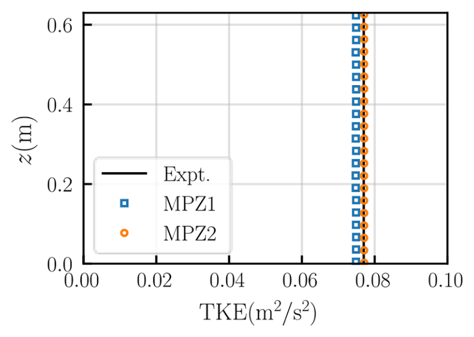

   **图 13** 湍动能剖面对比。

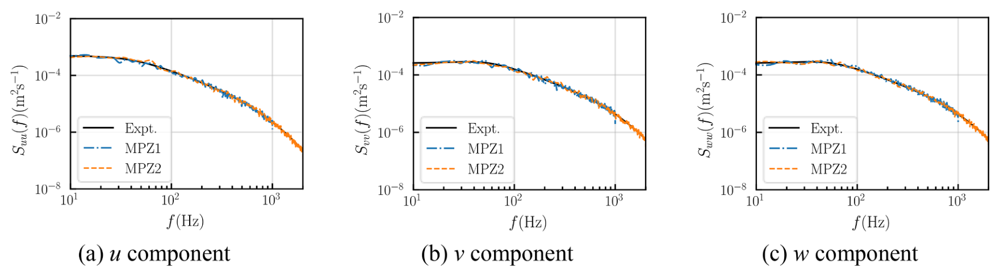

   **图 14** 点 :math:`(0,0,0.5L_3)` 处时间谱对比。

4.4 两点湍流特征分析
~~~~~~~~~~~~~~~~~~~~

空间相关函数是两点之间湍流特征的关键指标之一。对于给定时刻，沿某一空间方向速度点序列的空间相关函数可表示为：

.. math::

   R(m\Delta r)=\frac{1}{M-m}\sum_{j=0}^{M-m-1}u(j\Delta r)u[(j+m)\Delta r], \qquad (62)

其中，:math:`m` 为整数，:math:`r_m=m\Delta r`，且 :math:`0\le m<M`；:math:`\Delta r` 为空间步长；:math:`M` 为向量 :math:`r_m` 的长度。类似地，对于固定点处的速度时程记录，时间相关函数可按文献 [35,52] 表示为：

.. math::

   R(m\Delta \tau)=\frac{1}{M-m}\sum_{j=0}^{M-m-1}u(j\Delta \tau)u[(j+m)\Delta \tau], \qquad (63)

其中，:math:`\tau_m=m\Delta\tau`，且 :math:`0\le m<M`；:math:`\Delta\tau` 为时间步长；:math:`M` 为向量 :math:`\tau_m` 的长度。随后，对式 (62) 和式 (63) 归一化，分别得到空间相关系数和时间相关系数。

现在转向 MPX 工况分析。时间相关系数由空间起始点 :math:`(0,0,0.5L_3)` 处速度时程计算，空间相关系数则通过沿 :math:`X` 方向 128 个监测点处速度的空间和时间平均获得。图 15 展示了 :math:`X` 方向时间相关系数和空间相关系数对比。可以观察到，CMRFG 方法生成的脉动速度满足图 10 所示 :math:`X` 方向预设空间相关系数。此外，:math:`X` 方向时间和空间相关系数高度一致，表明 CMRFG 方法生成的湍流场遵循 Taylor 冻结假设。这可归因于 :math:`k_{1,n}` 与 :math:`f_n` 的关系满足式 (23)，文献 [42] 中也给出了额外证据。

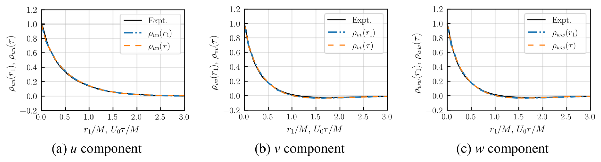

   **图 15** MPX 工况 :math:`X` 方向时间相关系数和空间相关系数对比。

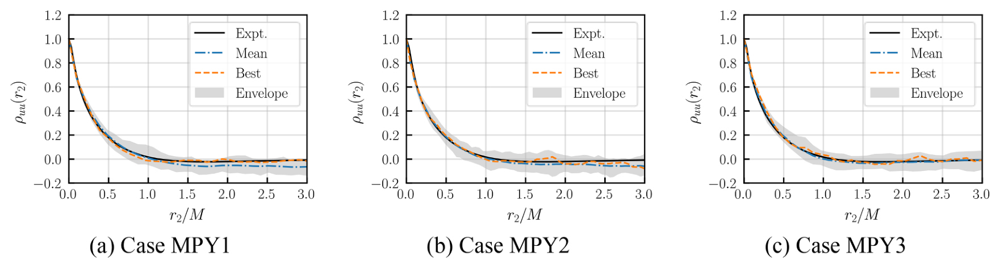

   **图 16** :math:`Y` 方向空间相关系数对比。

随后分析 MPY1 至 MPY3 工况的 :math:`Y` 方向空间相关。在分析之前，依据第 3.2.1 节所示 CMRFG 方法，由于波数向量第二分量被视为随机变量，文中采用集合平均方法确定空间相关函数。因此，CMRFG 生成的随机场是平稳随机且非遍历过程，这意味着需要重复许多次模拟并取平均才能得到空间相关系数。因此，对每个工况独立重复模拟 50 次，然后绘制空间相关系数的包络、集合平均和最佳拟合值（与目标值拟合最好的模拟工况）进行分析。

图 16 给出了 :math:`Y` 方向空间相关系数对比。总体而言，CMRFG 方法模拟的空间相关系数集合平均结果均收敛到实验值，这与第 3.2 节理论推导一致。此外，图 16(c) 表明，不进行 :math:`k_{2,n}` 修正时，平均结果与目标值更一致；MPY1 与 MPY2 的平均结果几乎相同，说明在该特定工况中，最大波数 :math:`k_{2,max}` 的选择影响很小。尽管 :math:`k_{2,n}` 修正会导致平均空间相关系数计算产生轻微偏差，最佳拟合空间相关系数仍与目标值保持较一致。因此，为平衡计算资源和模拟精度，可以保存最佳拟合模拟的随机数，并随后用于生成 LES 湍流场。

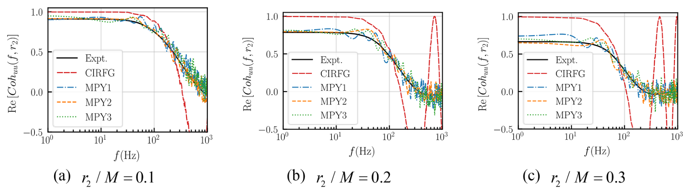

   **图 17** 不同空间间隔处 :math:`Y` 方向空间相干函数对比。

图 17 描述了不同空间间隔处 :math:`Y` 方向空间相干函数对比。同时，为比较也给出了 CIRFG 方法数值算例。由 CIRFG 方法生成的湍流场空间相干函数无法满足目标值，并且在低频范围接近 1。相比之下，CMRFG 方法生成的空间相干函数均接近目标值，这是由于参数 :math:`k_{2,n}` 被视为随机变量，并由目标值显式确定。

5 CMRFG 在均匀湍流场模拟中的应用
--------------------------------

5.1 时间衰减均匀各向同性盒湍流
~~~~~~~~~~~~~~~~~~~~~~~~~~~~~~

5.1.1 数值模型设置
^^^^^^^^^^^^^^^^^^

本节进一步模拟时间衰减均匀各向同性盒湍流，以验证所提出方法。Comte-Bellot 和 Corrsin [50] 生成的实验数据作为目标湍流特征，如第 4.1 节所述。根据文献 [53]，模拟在边长为 :math:`0.2\pi\ \mathrm{m}` 的盒状区域内进行，约为网格尺寸 :math:`M` 的 12 倍。盒体所有边界均设置为周期边界。此外，采用均匀结构网格，各方向均匀分布 128 或 256 个节点，总网格数分别为 209 万和 1678 万。模拟以 :math:`U_0t/M=42` 时刻湍流特征作为初始瞬间，并覆盖 :math:`U_0t/M\in[42,171]` 的模拟时间范围。

.. list-table:: **表 4** 时间衰减均匀各向同性盒湍流模拟工况。
   :header-rows: 1
   :widths: 12 32 22 22 14

   * - 工况
     - 湍流生成方法
     - 网格数量
     - 模型
     - 求解器
   * - HI1
     - Saad 等 [32,33]
     - :math:`128\times128\times128`
     - LES（WALE）
     - pimpleFoam
   * - HI2
     - CMSSEM [53]
     - :math:`128\times128\times128`
     - LES（WALE）
     - pimpleFoam
   * - HI3
     - CIRFG [42]
     - :math:`128\times128\times128`
     - LES（WALE）
     - pimpleFoam
   * - HI4
     - CMRFG
     - :math:`128\times128\times128`
     - LES（WALE）
     - pimpleFoam
   * - HI5
     - CMRFG
     - :math:`256\times256\times256`
     - 准 DNS（laminar）
     - icoFoam

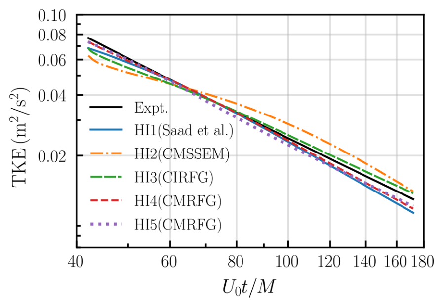

   **图 18** 均匀各向同性盒湍流的湍动能时间演化。

表 4 列出了时间衰减均匀各向同性盒湍流的模拟工况。HI1 至 HI4 采用 LES，而 HI5 采用准直接数值模拟（quasi-DNS）以获得更高精度。所有模拟均使用 OpenFOAM v2206，运动黏性系数为 :math:`\nu=1.5\times10^{-5}\ \mathrm{m^2/s}`。时间离散采用 backward 格式，空间离散采用 Gauss linear 格式。具体而言，HI1 至 HI3 用于比较。在 HI1 中，采用 Saad 等 [32,33] 提出的谱方法；HI2 采用最近提出的连续多尺度合成涡方法（CMSSEM）[53]。为更好说明改进方法在满足空间相干函数方面的作用，HI3 模拟原始 CIRFG 方法。此外，为生成 HI4 和 HI5 的初始三维湍流场，文中采用第 4.4 节中为 MPY1 和 MPY2 工况确定的最佳拟合随机参数。最后，为保证最大 CFL 数大致一致，HI1 至 HI4 的时间步长设为 :math:`0.0005\ \mathrm{s}`，HI5 的时间步长设为 :math:`0.00025\ \mathrm{s}`。

5.1.2 结果与讨论
^^^^^^^^^^^^^^^^

图 18 描述了均匀各向同性盒湍流的 TKE 时间演化。CBC 实验中测得的曲线使用式 (61) 和式 (17) 计算，并以对数尺度表示。如图 18 所示，对于 HI2，初始阶段湍流能量衰减率低于实验值，最终导致湍流能量水平高于实验数据。这表明由 CMSSEM 方法生成的湍流可能与真实湍流存在某些潜在差异 [53]。相比之下，其他方法在初始瞬间仅与目标湍流能量存在轻微偏差，并且在时间演化过程中的衰减率与实验数据高度一致。

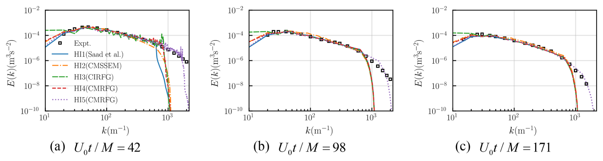

   **图 19** 均匀各向同性盒湍流三维能谱对比。

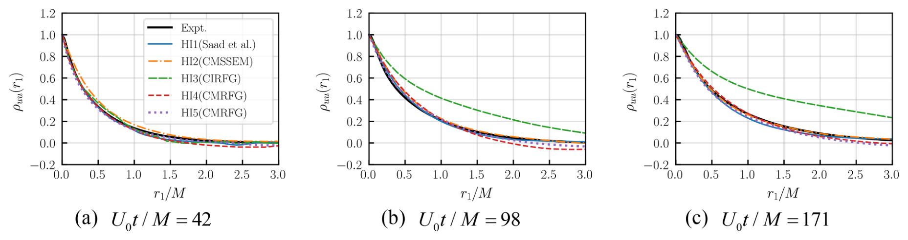

   **图 20** 均匀各向同性盒湍流纵向空间相关系数对比。

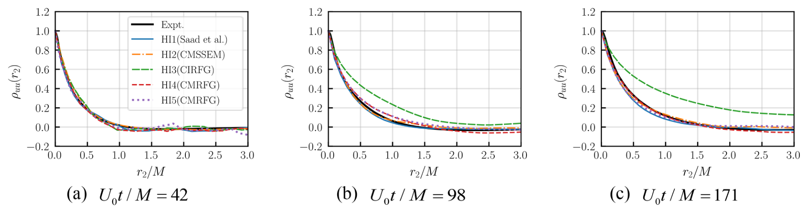

   **图 21** 均匀各向同性盒湍流横向空间相关系数对比。

周期盒湍流的三维能谱表示为 [53]：

.. math::

   E(k,t)=\frac{1}{2}\sum_{k-1/2<|\mathbf{k}|<k+1/2}|\hat{\mathbf{u}}_{\mathbf{k}}|^2, \qquad (64)

其中，:math:`k\in\mathbb{N}^{+}`，:math:`\hat{\mathbf{u}}_{\mathbf{k}}` 是该时刻单元中心速度的第 :math:`\mathbf{k}` 个 Fourier 系数。图 19 展示了 :math:`U_0t/M=42,98,171` 时刻能谱对比。总体而言，除 CIRFG 方法在低波数范围能量较高外，其他方法生成的湍流均与目标谱吻合良好，表明它们具备生成满足局部各向同性假设湍流的能力。对于 CMRFG 方法，尽管理论中并未显式包含能谱，但 :math:`Y` 方向空间相干函数的实现本质上实现了目标三维空间 CSD。此外，能谱通过三维空间 CSD 的球面积分获得。因此，CMRFG 方法也能够生成目标三维能谱。

最后，图 20 和图 21 分别展示了纵向和横向空间相关系数 :math:`\rho_{uu}(r_1)` 和 :math:`\rho_{uu}(r_2)` 的对比。对于 CIRFG 方法，尽管其在 :math:`U_0t/M=42` 时刻初始满足期望空间相关系数，但湍流场随时间推移表现出与目标值的显著偏差。这种偏差可归因于 CIRFG 方法未能满足期望空间相干函数。然而，其他方法在演化过程中空间相关系数均与目标值吻合良好，显示出较高准确性。

5.2 空间衰减均匀各向异性湍流
~~~~~~~~~~~~~~~~~~~~~~~~~~~~

5.2.1 数值模型设置
^^^^^^^^^^^^^^^^^^

为进一步验证 CMRFG 方法模拟各向异性湍流的性能，文中使用 Kang、Chester 和 Meneveau（KCM）[54] 开展的空间衰减均匀各向异性湍流实验作为目标湍流特征。KCM 实验采用网格尺寸 :math:`M=0.152\ \mathrm{m}`，并使用 :math:`x/M=20` 位置处的湍流特征作为入流湍流目标值。:math:`x/M=20` 处平均速度 :math:`U_0` 为 :math:`12.0\ \mathrm{m/s}`，由此得到较高网格 Reynolds 数 :math:`U_0M/\nu=1.21\times10^5`。图 22(a) 显示了 KCM 数据原始实验数据。然而，必须强调，该实验主要涉及各向异性湍流，图 22(a) 中三维能谱依赖局部各向同性假设。换句话说，三维谱仅由实验纵向空间谱 :math:`S_{uu}(k_1)` 拟合得到，并未考虑横向空间谱。接下来，按照附录 B 中的流程，计算时间 PSD 和 :math:`Y` 方向空间相干函数，分别如图 22(b) 和图 23 所示。

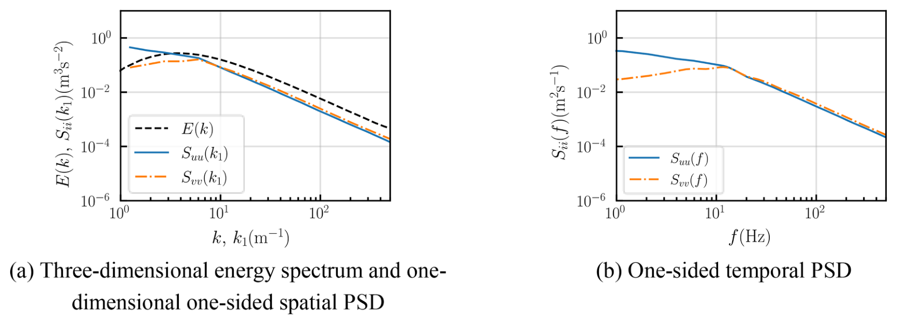

   **图 22** :math:`x/M=20` 处 KCM 实验数据的不同类型谱。

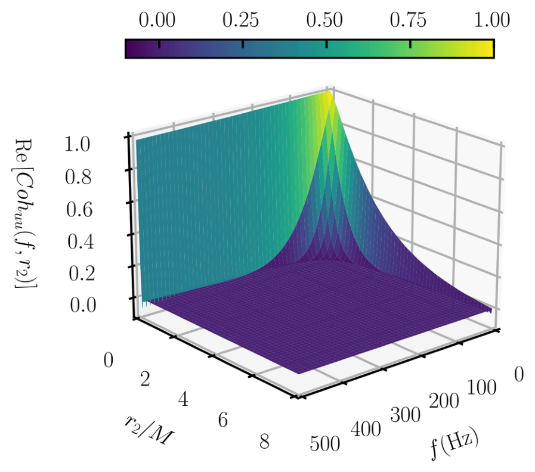

   **图 23** :math:`x/M=20` 处 KCM 实验数据空间相干函数三维示意图。

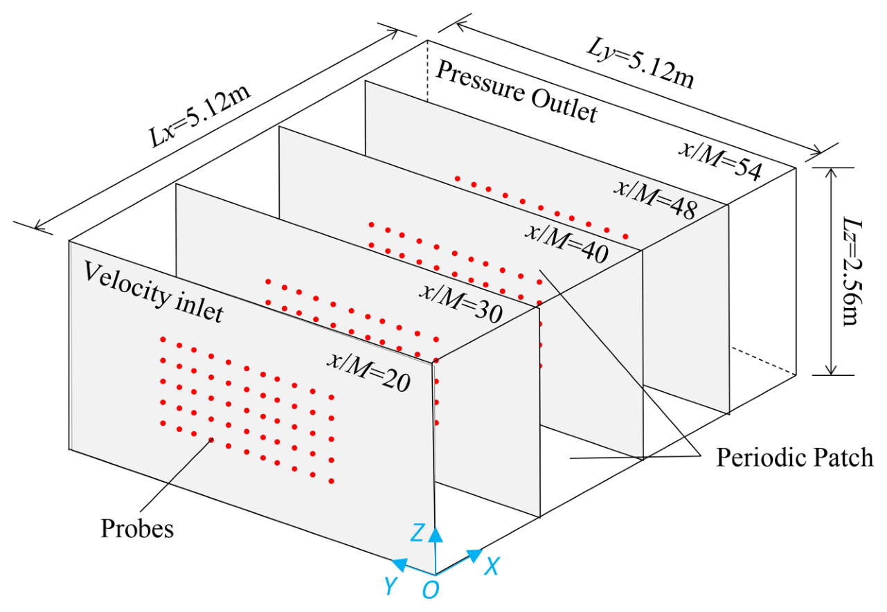

   **图 24** 计算域和监测点示意图。

.. list-table:: **表 5** 空间衰减均匀各向异性湍流模拟工况。
   :header-rows: 1
   :widths: 12 48 20 12 12

   * - 工况
     - 入流湍流生成方法
     - 网格数量
     - 模型
     - 求解器
   * - HA1
     - CMRFG（带 :math:`k_{2,n}` 质量平衡修正）
     - :math:`256\times256\times128`
     - LES（WALE）
     - pimpleFoam
   * - HA2
     - CMRFG（不带 :math:`k_{2,n}` 质量平衡修正）
     - :math:`256\times256\times128`
     - LES（WALE）
     - pimpleFoam

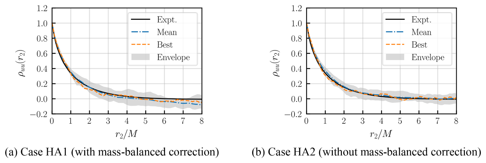

   **图 25** :math:`x/M=20` 处 :math:`Y` 方向空间相关系数对比。

为了验证所提出方法的有效性，文中对矩形湍流场开展 LES。如图 24 所示，计算域长、宽、高为 :math:`5.12\ \mathrm{m}\times5.12\ \mathrm{m}\times2.56\ \mathrm{m}`。五条中心竖向监测线布置在选定下游位置，用于分析流场压力分布。此外，在每个横截面中心区域 :math:`1/4L_y\le y\le3/4L_y`、:math:`1/4L_z\le z\le3/4L_z` 内均匀分布 :math:`11\times5` 个监测点，以跟踪 :math:`x/M=20,30,40,48` 处湍流特征的发展。此外，采用边长 :math:`0.02\ \mathrm{m}` 的均匀结构立方体网格，总网格数 834 万。CMRFG 方法生成的均匀各向异性湍流场作为 Dirichlet 型入流边界条件。四个侧面采用周期边界条件，出口采用压力 Dirichlet 条件和速度场 Neumann 条件。在当前模拟中，其他数值设置与第 5.1 节模拟相同。为满足 CFL 条件，时间步长设为 :math:`0.001\ \mathrm{s}`，总模拟时间为 :math:`8\ \mathrm{s}`。随后提取 :math:`2` 至 :math:`8\ \mathrm{s}` 的模拟数据用于分析。表 5 列出了空间衰减均匀各向异性湍流模拟工况，其中 HA2 用于分析模拟中 :math:`k_{2,n}` 质量平衡修正的影响。

5.2.2 入流湍流生成
^^^^^^^^^^^^^^^^^^

与第 4 节类似，文中首先对 :math:`Y` 方向 256 个监测点的时间数据开展 20 次独立模拟，以确定最佳拟合随机参数。图 25 给出了 :math:`x/M=20` 处 :math:`Y` 方向空间相关系数对比。比较可知，HA1 工况平均空间相关系数相较 HA2 表现出稍大偏差，但最佳拟合模型得到的空间相关系数均与目标值较接近。因此，文中保留最佳拟合模拟的随机数，并随后用其生成 LES 入流湍流。图 26 给出了 :math:`x/M=20` 处 :math:`Y` 方向空间相干函数对比。结果显示，CMRFG 方法生成的空间相干函数在不同空间间隔处均与期望值高度吻合。

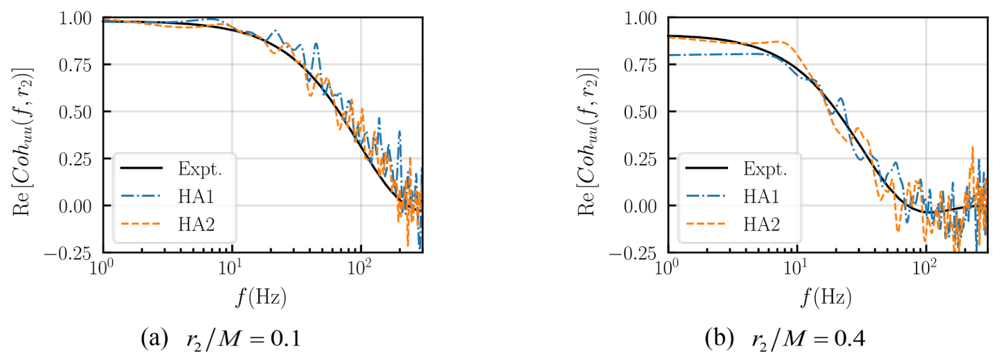

   **图 26** :math:`x/M=20` 处 :math:`Y` 方向空间相干函数对比。

5.2.3 压力脉动评估
^^^^^^^^^^^^^^^^^^

图 27 给出了入口质量通量比例系数时程。根据图 27，HA2 工况入口质量通量比例系数随时间变化，而 HA1 工况恒定为 1，这意味着带 :math:`k_{2,n}` 修正的 CMRFG 方法生成的湍流场能够满足入口质量平衡条件。图 28 给出了脉动压力系数分布云图（括号中数值分别表示最大值和最小值），相应地，图 29 给出了计算域内脉动压力系数对比。

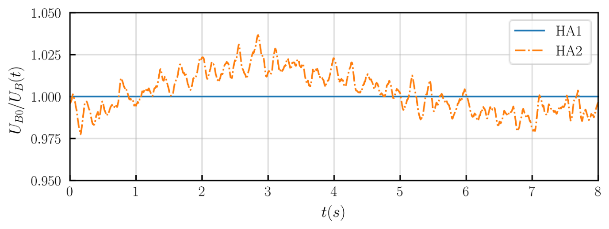

   **图 27** 入口质量通量比例系数时程。

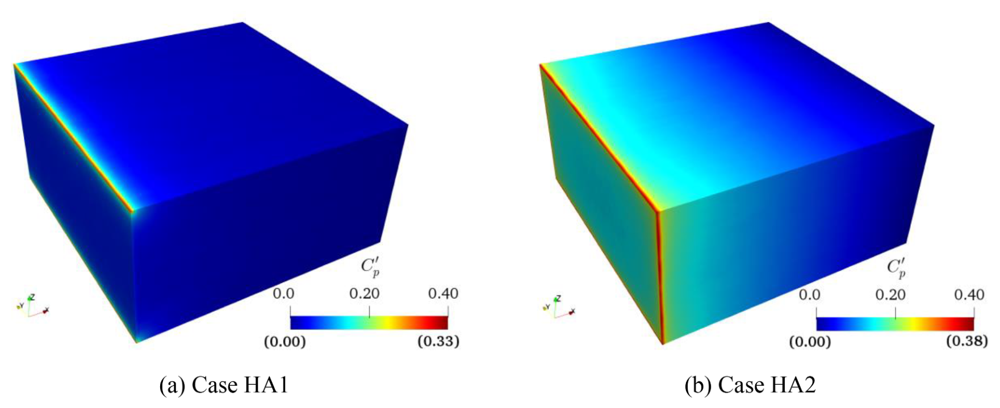

   **图 28** 脉动压力系数分布云图。

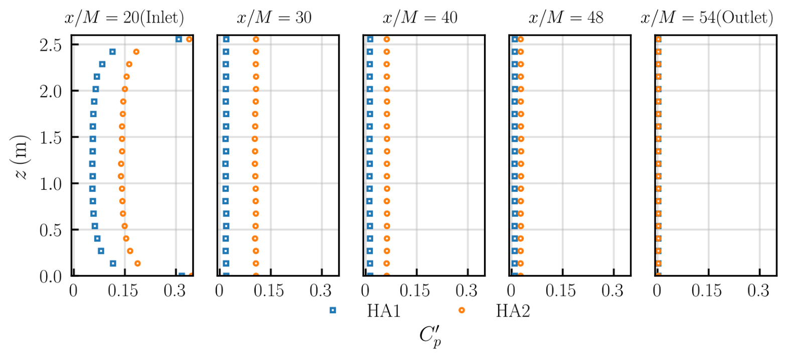

   **图 29** 计算域内脉动压力系数对比。

对于 HA2 工况，整个计算域中均存在非物理压力脉动，最大脉动压力系数出现在入口处，这主要由不满足入口质量平衡条件和侧面周期边界条件不相容造成。随后，如图 29 所示，位置 :math:`x/M=30` 处不期望脉动压力达到动压约 12%，因此后续钝体绕流模拟中的压力测量会受到严重污染。对于 HA1 工况，入口面下游计算域内不存在非物理压力脉动，脉动压力系数保持在约 1.5%，对中心关注区域影响可忽视。然而，在入口与 :math:`Z` 方向侧面交线处仍存在局部非物理压力脉动，这是由周期边界不相容造成的。此外，如果侧面采用对称或壁面边界，类似压力脉动也会在入口与所有侧面交线处产生，这是 RFG 类方法的局限。因此，需要进一步研究以降低边界不相容对流场的影响，类似于 VBIC 方法 [3]。

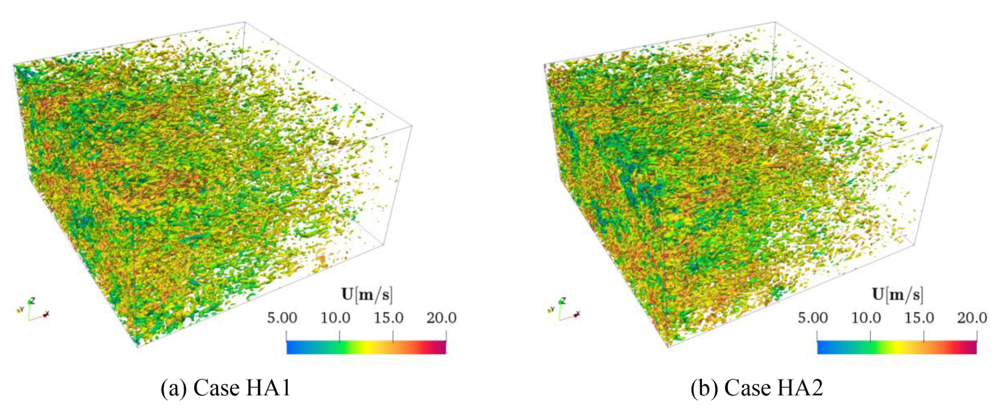

   **图 30** 8 s 时刻 :math:`Q=1000` 的 Q 准则等值面，按瞬时速度大小着色；流向为从左到右。

5.2.4 湍流特征发展
^^^^^^^^^^^^^^^^^^

图 30 描绘了 CMRFG 方法生成湍流结构的演化，这些结构通过 Q 准则可视化，并按瞬时速度大小着色。如图 30 所示，生成的涡结构具有随机性，并且随着湍流向下游方向演化而逐渐衰减。相应地，均匀各向异性湍流速度标准差和湍动能的空间演化分别见图 31 和图 32。

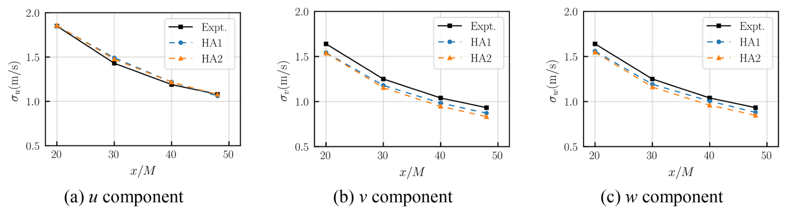

   **图 31** 均匀各向异性湍流速度标准差空间演化。

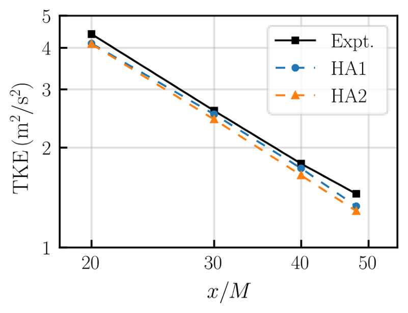

   **图 32** 均匀各向异性湍流湍动能空间演化。

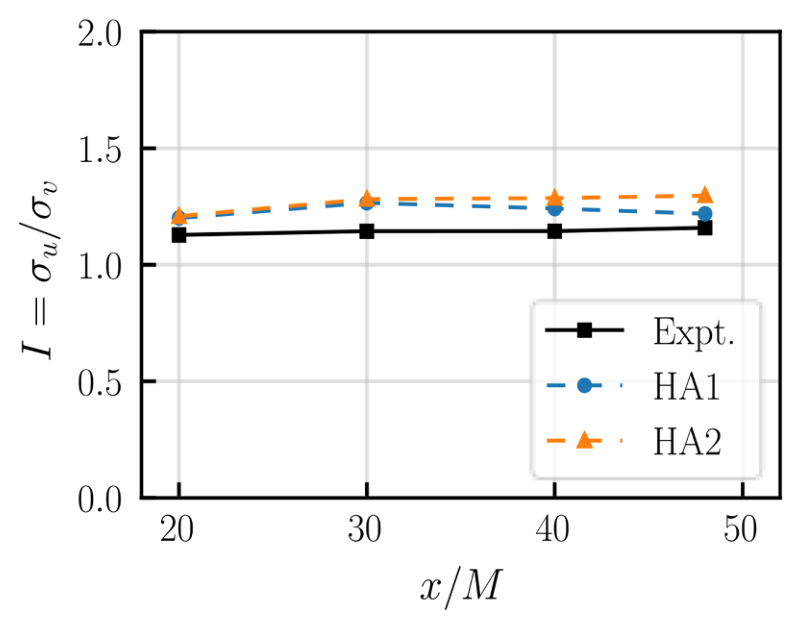

   **图 33** 空间衰减均匀湍流下游方向各向异性比。

总体而言，将 HA1 和 HA2 与实验数据比较可知，速度 STD 和 TKE 随空间发展的衰减趋势基本一致。然而，HA1 的模拟精度稍高于 HA2，可能是因为 HA1 流场中不存在非物理压力脉动。如图 31 所示，:math:`\sigma_u` 在 :math:`x/M=20` 处与目标值吻合良好，但 :math:`\sigma_v` 和 :math:`\sigma_w` 相对目标值存在轻微偏差。这种差异归因于最大波数和频率截断误差，以及 :math:`u` 分量谱能量在低频处更集中，如图 22 所示。因此，截断误差对 :math:`u` 分量 STD 的影响较小。图 32 使用对数尺度，实验结果形成衰减直线，表明湍动能呈指数衰减。可以清楚看到，CMRFG 方法生成的湍动能衰减率与实验结果高度一致。图 33 给出了下游方向各向异性比。LES 模拟得到的各向异性比稍大于实验结果，主要是由于 :math:`v` 分量 STD 小于目标值。

图 34 和图 35 展示了 :math:`x/M=20,30,40,48` 处纵向和横向空间谱。纵向和横向空间谱在高波数范围迅速衰减，这主要归因于网格分辨率限制。因此，后续需要开展类似文献 [55–58] 的工作来补偿能量。对于纵向空间谱，在低波数范围与实验结果高度一致。横向空间谱在初始位置 :math:`x/M=20` 处与目标值吻合良好。然而，随着空间发展推进，在低于 :math:`3\ \mathrm{m^{-1}}` 的波数范围内，能量超过期望值。这表明湍流空间演化过程中存在能量重构现象，这可能归因于 CMRFG 方法使用的空间相干函数与实际各向异性湍流之间存在差异。然而，总体而言，纵向和横向空间谱在惯性子区与目标值高度吻合，表明 CMRFG 方法生成的湍流遵循局部各向同性假设。

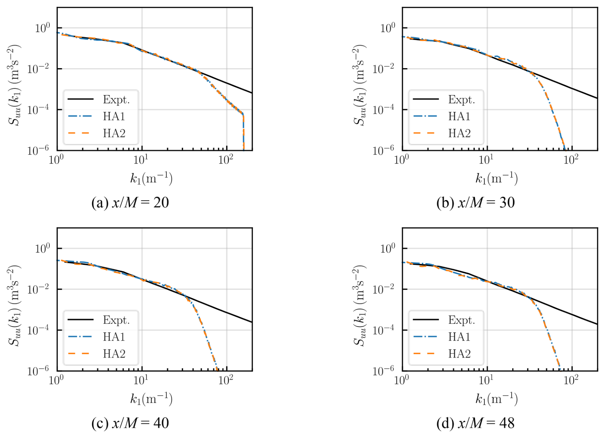

   **图 34** 选定下游位置的纵向空间谱。

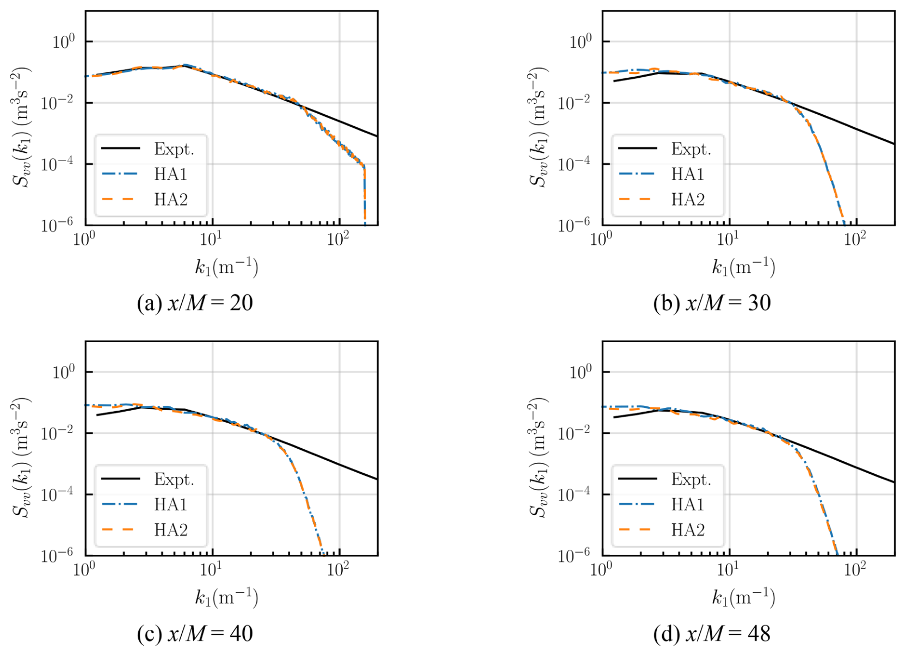

   **图 35** 选定下游位置的横向空间谱。

6 结论
------

在本研究中，提出了一种新的 LES 入流湍流生成方法，用于生成无非物理压力脉动的真实湍流场。所提出方法命名为“相干性改进且质量平衡随机流生成”（CMRFG）方法。首先，研究了入口质量通量对单波传播的影响。研究发现，如果无散度条件、Taylor 冻结假设和入口质量平衡条件能够预先同时满足，则湍流场不存在非物理压力脉动，并能在中心范围内自维持发展。

随后，新的 CMRFG 方法被显式推导为与任意空间相干函数和质量平衡条件相容。因此，由 CMRFG 方法生成的湍流场能够真实、无人工压力脉动，并且由于不需要额外入口质量通量修正，能够忠实保持原始湍流特征。同时，所提出方法仍保持满足其他基本湍流特征的能力，包括任意湍流强度、时间谱、时间相关性、空间相关系数等。此外，CMRFG 方法保留了原 CIRFG 方法优点，对均匀湍流场满足无散度条件和 Taylor 冻结假设，而这些条件对流场正确发展是必要的。

此外，文中通过 LES 模拟均匀各向同性和各向异性湍流场来验证所提出方法的性能。总体而言，CMRFG 生成的湍流场与实验结果吻合良好。对于各向同性算例，CMRFG 方法生成的湍流能够较好匹配三维能谱以及纵向和横向空间相关。对于空间衰减各向异性算例，结果表明 CMRFG 方法获得的入流湍流不存在非物理压力脉动。然而，由边界不相容引起的入口与侧面交线处仍存在局部非物理压力脉动，因此仍需类似 VBIC 方法 [3] 的进一步研究。

最后，需要注意的是，本文仅聚焦于模拟均匀湍流。CMRFG 方法可以按照文献 [3,41] 中的流程扩展到模拟非均匀湍流。然而，当前的挑战是确定更真实的非均匀湍流空间相干函数，这需要未来进一步研究。

参考文献
--------

[1] A. Dagnew, G.T. Bitsuamlak, Computational evaluation of wind loads on buildings: a review, Wind Struct. 16 (2013) 629–660.

[2] Z. Xie, I.P. Castro, Efficient generation of inflow conditions for large eddy simulation of street-scale flows, Flow Turbul. Combust. 81 (2008) 449–470.

[3] L. Patruno, S. de Miranda, Unsteady inflow conditions: a variationally based solution to the insurgence of pressure fluctuations, Comput. Method Appl. Mech. 363 (2020), 112894.

[4] Y. Kim, I.P. Castro, Z. Xie, Divergence-free turbulence inflow conditions for large-eddy simulations with incompressible flow solvers, Comput. Fluids 84 (2013) 56–68.

[5] M.H. Baba-Ahmadi, G. Tabor, Inlet conditions for LES using mapping and feedback control, Comput. Fluids 38 (2009) 1299–1311.

[6] G.R. Tabor, M.H. Baba-Ahmadi, Inlet conditions for large eddy simulation: a review, Comput. Fluids 39 (2010) 553–567.

[7] F. Bazdidi-Tehrani, M. Kiamansouri, M. Jadidi, Inflow turbulence generation techniques for large eddy simulation of flow and dispersion around a model building in a turbulent atmospheric boundary layer, J. Build. Perform. Simul. 9 (2016) 680–698.

[8] X. Wu, Inflow turbulence generation methods, Annu. Rev. Fluid Mech. 49 (2017) 23–49.

[9] N.S. Dhamankar, G.A. Blaisdell, A.S. Lyrintzis, Overview of turbulent inflow boundary conditions for large-eddy simulations, AIAA J. 56 (2018) 1317–1334.

[10] T.S. Lund, X. Wu, K.D. Squires, Generation of turbulent inflow data for spatially-developing boundary layer simulations, J. Comput. Phys. 140 (1998) 233–258.

[11] K. Nozawa, T. Tamura, Large eddy simulation of the flow around a low-rise building immersed in a rough-wall turbulent boundary layer, J. Wind Eng. Ind. Aerodyn. 90 (2002) 1151–1162.

[12] T. Tamura, K. Nozawa, K. Kondo, AIJ guide for numerical prediction of wind loads on buildings, J. Wind Eng. Ind. Aerodyn. 96 (2008) 1974–1984.

[13] A. Montorfano, F. Piscaglia, G. Ferrari, Inlet boundary conditions for incompressible LES: a comparative study, Math. Comput. Model. 57 (2013) 1640–1647.

[14] A.K. Dagnew, G.T. Bitsuamlak, Computational evaluation of wind loads on a standard tall building using LES, Wind Struct. 18 (2014) 567–598.

[15] B.W. Yan, Q.S. Li, Inflow turbulence generation methods with large eddy simulation for wind effects on tall buildings, Comput. Fluids 116 (2015) 158–175.

[16] R. Vasaturo, I. Kalkman, B. Blocken, P. Van Wesemael, Large eddy simulation of the neutral atmospheric boundary layer: performance evaluation of three inflow methods for terrains with different roughness, J. Wind Eng. Ind. Aerodyn. 173 (2018) 241–261.

[17] Z. Mansouri, R.P. Selvam, A.G. Chowdhury, Performance of different inflow turbulence methods for wind engineering applications, J. Wind Eng. Ind. Aerodyn. 229 (2022), 105141.

[18] H. Plischka, S. Michel, J. Turnow, B. Leitl, N. Kornev, Comparison of turbulent inflow conditions for neutral stratified atmospheric boundary layer flow, J. Wind Eng. Ind. Aerodyn. 230 (2022), 105145.

[19] M. Shinozuka, Simulation of multivariate and multidimensional random processes, J. Acoust. Soc. Am. 49 (1971) 357–368.

[20] M. Hoshiya, Simulation of multi-correlated random processes and application to structural vibration problems, in: Proceedings of the Japan Society of Civil Engineers, 1972, pp. 121–128. Japan Society of Civil EngineersPages.

[21] M. Shinozuka, C. Jan, Digital simulation of random processes and its applications, J. Sound Vib. 25 (1972) 111–128.

[22] Y. Iwatani, Simulation of multidimensional wind fluctuations having any arbitrary power spectra and cross spectra, J. Wind Eng. 1982 (1982) 5–18.

[23] T. Maruyama, H. Morikawa, Numerical simulation of wind fluctuation conditioned by experimental data in turbulent boundary layer, in: Proceedings of the 13th Symposium on Wind Engineering, 1994, pp. 573–578. Pages.

[24] G. Deodatis, Simulation of ergodic multivariate stochastic processes, J. Eng. Mech. 122 (1996) 778–787.

[25] K. Kondo, S. Murakami, A. Mochida, Generation of velocity fluctuations for inflow boundary condition of LES, J. Wind Eng. Ind. Aerodyn. 67 (1997) 51–64.

[26] Y. Wang, X. Chen, Simulation of approaching boundary layer flow and wind loads on high-rise buildings by wall-modeled LES, J. Wind Eng. Ind. Aerodyn. 207 (2020), 104410.

[27] A.F. Melaku, G.T. Bitsuamlak, A divergence-free inflow turbulence generator using spectral representation method for large-eddy simulation of ABL flows, J. Wind Eng. Ind. Aerodyn. 212 (2021), 104580.

[28] Y. Wang, X. Chen, Evaluation of wind loads on high-rise buildings at various angles of attack by wall-modeled large-eddy simulation, J. Wind Eng. Ind. Aerodyn. 229 (2022), 105160.

[29] R.H. Kraichnan, Diffusion by a random velocity field, Phys. Fluids 13 (1970) 22–31.

[30] A. Smirnov, S. Shi, I. Celik, Random flow generation technique for large eddy simulations and particle-dynamics modeling, J. Fluids Eng. 123 (2001) 359–371.

[31] R. Yu, X. Bai, A fully divergence-free method for generation of inhomogeneous and anisotropic turbulence with large spatial variation, J. Comput. Phys. 256 (2014) 234–253.

[32] T. Saad, J.C. Sutherland, Comment on “Diffusion by a random velocity field”[Phys. Fluids 13, 22 (1970)], Phys. Fluids 28 (2016) 22.

[33] T. Saad, D. Cline, R. Stoll, J.C. Sutherland, Scalable tools for generating synthetic isotropic turbulence with arbitrary spectra, AIAA J. 55 (2017) 327–331.

[34] S.H. Huang, Q.S. Li, J.R. Wu, A general inflow turbulence generator for large eddy simulation, J. Wind Eng. Ind. Aerodyn. 98 (2010) 600–617.

[35] H.G. Castro, R.R. Paz, A time and space correlated turbulence synthesis method for Large Eddy Simulations, J. Comput. Phys. 235 (2013) 742–763.

[36] H. Aboshosha, A. Elshaer, G.T. Bitsuamlak, A. El Damatty, Consistent inflow turbulence generator for LES evaluation of wind-induced responses for tall buildings, J. Wind Eng. Ind. Aerodyn. 142 (2015) 198–216.

[37] A. Melaku, G. Bitsuamlak, A. Elshaer, H. Aboshosha, Synthetic inflow turbulence generation methods for LES study of tall building aerodynamics. 13th Americas Conference on Wind Engineering, Gainesville, Florida, USA, 2017.

[38] Y. Yu, Y. Yang, Z. Xie, A new inflow turbulence generator for large eddy simulation evaluation of wind effects on a standard high-rise building, Build. Environ. 138 (2018) 300–313.

[39] L. Patruno, M. Ricci, On the generation of synthetic divergence-free homogeneous anisotropic turbulence, Comput. Method Appl. Mech. 315 (2017) 396–417.

[40] L. Patruno, M. Ricci, A systematic approach to the generation of synthetic turbulence using spectral methods, Comput. Method Appl. Mech. 340 (2018) 881–904.

[41] M. Bervida, L. Patruno, S. Stani, S.D. Miranda, Synthetic generation of the atmospheric boundary layer for wind loading assessment using spectral methods, J. Wind Eng. Ind. Aerodyn. 196 (2020), 104040.

[42] L. Chen, C. Li, J. Wang, G. Hu, Q. Zheng, Q. Zhou, Y. Xiao, Consistency improved random flow generation method for large eddy simulation of atmospheric boundary layer, J. Wind Eng. Ind. Aerodyn. 229 (2022), 105147.

[43] X. Wang, C.S. Cai, P. Yuan, G. Xu, C. Sun, An efficient and accurate DSRFG method via nonuniform energy spectra discretization, Eng. Struct. 298 (2024), 117014.

[44] J. Wang, C. Li, S. Huang, Q. Zheng, Y. Xiao, J. Ou, Large eddy simulation of turbulent atmospheric boundary layer flow based on a synthetic volume forcing method, J. Wind Eng. Ind. Aerodyn. 233 (2023), 105326.

[45] A.G. Gungor, J.A. Sillero, J. Jiménez, Pressure statistics from direct simulation of turbulent boundary layer, in: Proceedings of the Seventh International Conference on Computational Fluid Dynamics, Hawaii, 2012. Citeseer.

[46] R. Poletto, T. Craft, A. Revell, A new divergence free synthetic eddy method for the reproduction of inlet flow conditions for LES, Flow Turbul. Combust. 91 (2013) 519–539.

[47] F. Nicoud, F. Ducros, Subgrid-scale stress modelling based on the square of the velocity gradient tensor, Flow Turbul. Combust. 62 (1999) 183–200.

[48] R.I. Issa, Solution of the implicitly discretised fluid flow equations by operator-splitting, J. Comput. Phys. 62 (1986) 40–65.

[49] Z. Mansouri, R.P. Selvam, A.G. Chowdhury, Maximum grid spacing effect on peak pressure computation using inflow turbulence generators, Results Eng. 15 (2022), 100491.

[50] G. Comte-Bellot, S. Corrsin, Simple Eulerian time correlation of full-and narrow-band velocity signals in grid-generated,‘isotropic’turbulence, J. Fluid Mech. 48 (1971) 273–337.

[51] H. Tennekes, J. Lumley, A First Course in Turbulence, MIT Press, 1972.

[52] K. Shin, J. Hammond, Fundamentals of Signal Processing for Sound and Vibration Engineers, John Wiley & Sons, England, 2008.

[53] Y. Cai, J. Wan, A. Kareem, A new divergence-free synthetic eddy method for generating homogeneous isotropic turbulence with a prescribed energy spectrum, Comput. Fluids 253 (2023) 105788.

[54] H.S. Kang, S. Chester, C. Meneveau, Decaying turbulence in an active-grid-generated flow and comparisons with large-eddy simulation, J. Fluid Mech. 480 (2003) 129–160.

[55] G. Lamberti, C. García-Sánchez, J. Sousa, C. Gorlé, Optimizing turbulent inflow conditions for large-eddy simulations of the atmospheric boundary layer, J. Wind Eng. Ind. Aerodyn. 177 (2018) 32–44.

[56] R. Guichard, Assessment of an improved Random Flow Generation method to predict unsteady wind pressures on an isolated building using Large-Eddy Simulation, J. Wind Eng. Ind. Aerodyn. 189 (2019) 304–313.

[57] C. Feng, M. Gu, D. Zheng, Numerical simulation of wind effects on super high-rise buildings considering wind veering with height based on CFD, J. Fluid Struct. 91 (2019), 102715.

[58] J. Chen, A. Elshaer, H. Aboshosha, G. Pedro, Calibrated consistent flow generator for tall building aerodynamics using large eddy simulation, Results Eng. 16 (2022) 100634.

完整引用
--------

Chen, L., Li, C., Wang, J., Hu, G., & Xiao, Y. (2024). A coherence-improved and mass-balanced inflow turbulence generation method for large eddy simulation. *Journal of Computational Physics*, 498, 112706. https://doi.org/10.1016/j.jcp.2023.112706

收录信息见 :ref:`WOEAI 学术成果页对应条目 <ref-chen2024-JCP>`。
