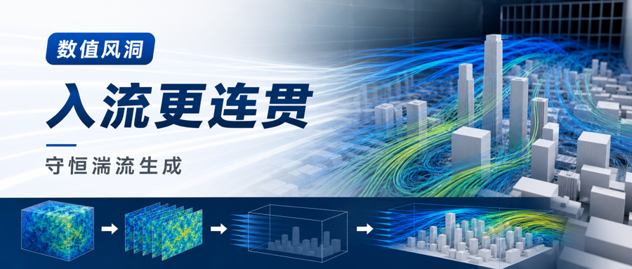
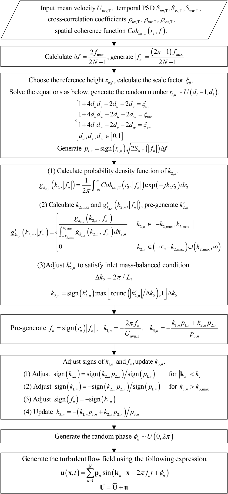
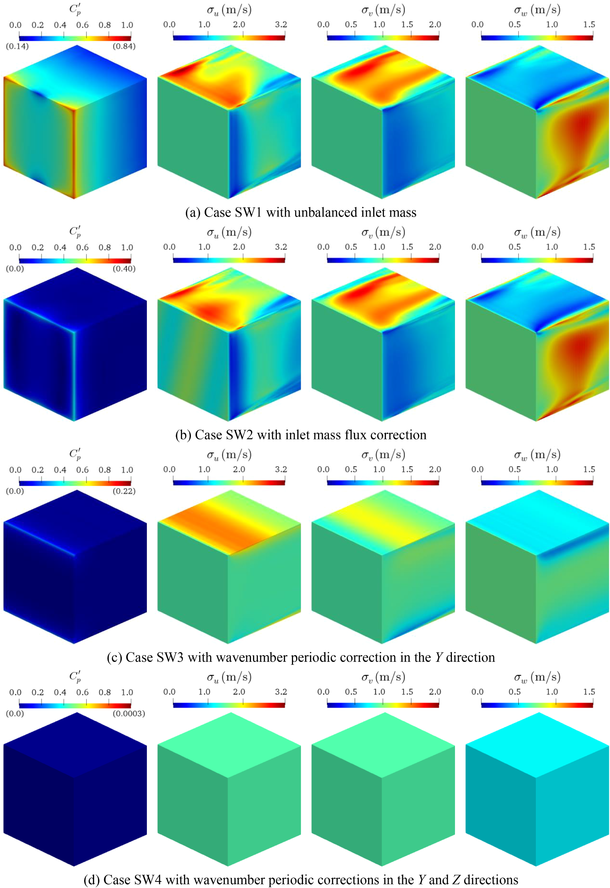
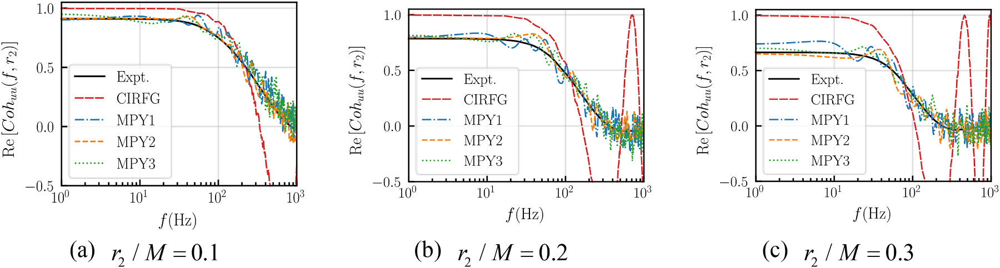
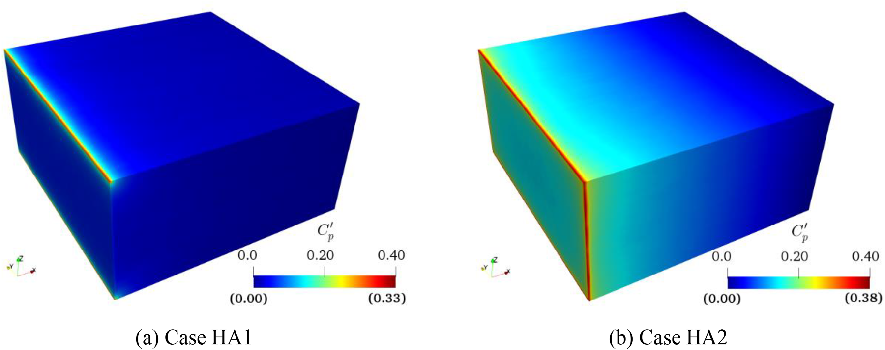
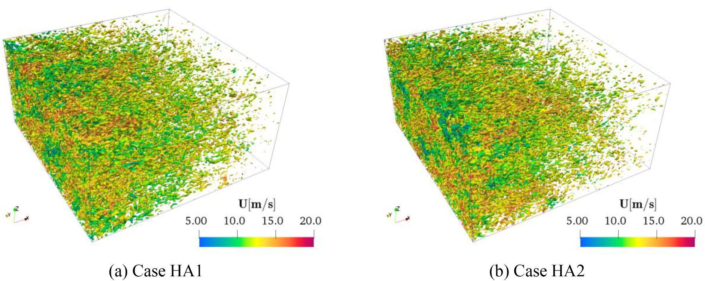

.. _paper-note-ref-chen2024-JCP:

.. role:: student-first-author

让 LES 入流湍流更连贯也更守恒
=============================

大涡模拟的结果，很大程度上取决于入口湍流是否真实。入口给得不对，后续流场会在计算域里重新调整：速度标准差、空间相关、能谱和压力场都可能偏离目标。对建筑风工程中的数值风洞来说，这不仅影响流场本身，也会影响后续风压、风荷载和局部风环境判断。

这篇发表于 Journal of Computational Physics 的论文提出 coherence-improved and mass-balanced random flow generation (CMRFG) 方法。它要解决的是一个很具体的问题：在保持目标湍流强度、时间谱、时间相关和空间相关的同时，怎样让生成的 LES 入流湍流显式满足空间相干函数，并在入口处满足质量守恒，从源头减少非物理压力波动。

   论文图 7 CMRFG 方法流程

   图中概括了 CMRFG 的生成步骤：从目标平均风速、时间功率谱、互相关系数和空间相干函数出发，确定频率、随机幅值和波数分布，再通过波数修正满足入口质量平衡，最后生成满足约束的湍流速度场。

论文信息
--------

- 论文题名: A coherence-improved and mass-balanced inflow turbulence generation method for large eddy simulation
- 作者: :student-first-author:`Chen Lingwei`; **Li Chao**\*; Wang Jinghan; Hu Gang; Xiao Yiqing
- 期刊: Journal of Computational Physics
- 年份: 2024
- DOI: https://doi.org/10.1016/j.jcp.2023.112706
- WOEAI 相关方向: 建筑结构抗风 / 数值风洞与湍动入流

三句话导读
----------

CMRFG 研究的是 LES 入口湍流生成：怎样同时满足目标空间相干、质量平衡、无散条件和 Taylor 冻结假设。 它重要，因为入口处一个看似很小的通量不平衡，就可能在下游压力场里留下非物理波动，进而影响建筑风压和风环境判断。 读者可以带走的结论是：数值风洞的入口湍流不能只看谱和强度，空间相干与质量守恒应当在生成机制中一并满足。

关键数字 / 关键结论卡
---------------------

- 入口质量通量不平衡时，入口边缘附近最大压力波动可达到动压的约 :math:`0.84` 倍，:math:`X=2\,\mathrm{m}` 处仍可出现约 :math:`15\%` 动压量级的人工压力波动。
- 各向异性算例中，不带质量平衡修正的 HA2 在 :math:`x/M=30` 位置可出现约 :math:`12\%` 动压量级的非期望压力波动；带修正的 HA1 在中心感兴趣区域维持在约 :math:`1.5\%`。
- CMRFG 的价值不是事后修补入口速度，而是在随机流生成阶段同时写入空间相干函数和入口质量平衡。

摘要
----

真实的入口湍流对于大涡模拟获得准确结果至关重要。本文提出一种改进的入口湍流生成方法，称为相干性改进且质量平衡的随机流生成方法（coherence-improved and mass-balanced random flow generation, CMRFG）。首先，论文研究入口质量平衡条件的影响。

随后，所提出方法被显式推导为能够满足任意空间相干函数和质量平衡条件，因此生成的湍流场能够有效保持原始湍流特征，并且不需要额外的入口质量通量修正。同时，新方法保留了既有方法的优点，能够满足任意湍流强度、时间谱、时间相关和空间相关系数。此外，所提出方法还保证满足无散度条件和 Taylor 冻结假设，这对于流场的准确发展至关重要。

最后，对均匀各向同性和各向异性湍流场的大涡模拟表明，CMRFG 生成的湍流场与实验结果高度一致，并且计算域内没有人工压力波动。

研究问题
--------

LES 入口湍流不能只是一段随机速度时程。对建筑风工程中的数值风洞来说，入口风场至少要回答三个问题：

1. 如何在随机流生成阶段同时满足目标湍流强度、时间谱、空间相关和空间相干函数？
2. 如何让入口脉动速度满足质量平衡，避免不可压缩流场中出现非物理压力污染？
3. 生成的湍流进入计算域后，能否在各向同性和各向异性 LES 中保持合理的空间发展？

   论文图 4 不同单波条件下的流场统计波动

   读图时重点比较入口质量不平衡、简单质量通量修正和波数周期修正三种条件下的压力与速度统计波动：质量不平衡会带来明显压力污染，而入口质量平衡与周期相容性同时满足后，压力波动显著减弱。

方法贡献
--------

CMRFG 建立在 CIRFG 方法基础上，但进一步把两个约束显式纳入生成过程。

第一是空间相干函数。论文把横向波数 :math:`k_{2,n}` 作为随机变量处理，并由目标空间相干函数推导其概率密度函数。这样，生成的湍流场不只是满足某个空间相关系数，而是能在频率维度上逼近给定的空间相干结构。

第二是入口质量平衡。论文通过修正 :math:`k_{2,n}`，使入口宽度成为对应波长的整数倍，从而让每个单波分量在入口处满足质量平衡。对均匀网格而言，生成的湍流场入口质量通量可以保持严格恒定；对非均匀网格，仍可能需要很小的质量通量修正，但对原始湍流特征的扰动会明显减小。

从工程实现角度看，CMRFG 不是只增加一个后处理步骤，而是把约束放回入口湍流的生成机制中。它仍保留对任意湍流强度、时间谱、时间相关和空间相关系数的适配能力，同时满足均匀湍流场中无散度条件和 Taylor 冻结假设。

这个思路可以用一个入口质量平衡条件来概括：

.. math::

   \int_S u_1'(t)\,\mathrm{d}S = 0

这里 :math:`S` 是入口截面，:math:`u_1'` 是纵向脉动速度。这个公式表达的不是一个附加的数值技巧，而是入口湍流本身应满足的整体通量约束：脉动流量在入口截面上的积分应为零。

关键发现
--------

1. 入口质量平衡会直接影响压力场可信度
~~~~~~~~~~~~~~~~~~~~~~~~~~~~~~~~~~~~~

**针对问题 2，单波传输算例显示，入口质量通量不平衡时，入口边缘附近最大压力波动可达到动压的 :math:`0.84` 倍；即使沿流向发展后，在 :math:`X=2\,\mathrm{m}` 位置仍可出现约 :math:`15\%` 动压量级的人工压力波动。** 论文据此说明，入口质量通量并不是一个小的数值细节，而是会影响后续压力测量可信度的基础条件。

当通过波数周期修正让入口质量平衡和边界周期相容性同时满足时，非物理压力波动基本消失，湍流动能沿流向也能更自持地发展。这为后续 CMRFG 的波数修正提供了直接动机。

2. CMRFG 能更好匹配目标空间相干函数
~~~~~~~~~~~~~~~~~~~~~~~~~~~~~~~~~~~

**针对问题 1，论文用 CBC 均匀各向同性湍流数据构造目标时间谱、空间相关和空间相干函数，并在多个监测点上检验 CMRFG。** 结果显示，原 CIRFG 方法在低频范围内难以满足目标空间相干函数，而 CMRFG 生成的空间相干函数在不同空间间距下都更接近目标值。

   论文图 17 不同空间间距下的 Y 方向空间相干函数对比

   这组曲线把实验目标、CIRFG 和 CMRFG 算例放在一起比较。CMRFG 通过随机化并显式确定 :math:`k_{2,n}`，使生成湍流场的空间相干函数更接近预设目标。

3. 各向异性湍流算例中，质量平衡能抑制计算域内压力污染
~~~~~~~~~~~~~~~~~~~~~~~~~~~~~~~~~~~~~~~~~~~~~~~~~~~~~

**针对问题 2，论文进一步用 KCM 实验数据构造空间衰减均匀各向异性湍流，并在 :math:`5.12\,\mathrm{m} \times 5.12\,\mathrm{m} \times 2.56\,\mathrm{m}` 的矩形计算域中进行 LES。** 两个对比算例分别使用带质量平衡修正的 CMRFG 和不带该修正的 CMRFG。

   论文图 28 脉动压力系数分布云图

   图中对比了带质量平衡修正和不带修正时的压力波动。未满足质量平衡的算例会在计算域内形成明显人工压力波动；带修正的算例在入口后方计算域中基本消除了这种压力污染。

论文报告，不带质量平衡修正的 HA2 算例在 :math:`x/M=30` 位置的非期望压力波动可达到约 :math:`12\%` 动压量级；带修正的 HA1 算例在入口后方计算域中没有非物理压力波动，中心感兴趣区域中的脉动压力系数维持在约 :math:`1.5\%`。

4. 生成湍流能保持合理的空间发展
~~~~~~~~~~~~~~~~~~~~~~~~~~~~~~~

**针对问题 3，CMRFG 不只是压低压力波动，还需要让湍流结构在下游发展中保持合理。** 论文中的各向异性 LES 显示，生成的涡结构具有随机性，并随湍流向下游发展而逐渐衰减；速度标准差、湍流动能和空间谱总体上与实验目标保持一致。

   论文图 30 Q 准则等值面显示的瞬时涡结构

   这张图展示了 :math:`8\,\mathrm{s}` 时刻由 Q 准则识别的涡结构。它帮助读者直观看到 CMRFG 生成的入口湍流进入计算域后形成随机涡结构，并沿流向逐步演化。

工程意义
--------

对建筑结构抗风和城市风环境模拟而言，LES 常被用来研究复杂几何下的非定常流动、局部风压和脉动风作用。入口湍流如果在空间相干、质量守恒或无散度约束上存在缺陷，计算域中的流场和压力场就可能包含方法本身引入的误差。

CMRFG 的价值在于把入口湍流生成从“统计量大体匹配”推进到“关键物理与数值约束同时匹配”。这使数值风洞更适合承担需要压力可信度的下游任务，例如钝体绕流压力测量、高层建筑风压分布、城市微尺度风环境和复杂边界条件下的 LES 验证。

对方法开发者而言，论文也给出了一条清晰路线：空间相干函数不能只在结果中事后检查，而应进入波数分布的生成；质量平衡也不应完全依赖入口后的通量修正，而应尽量在随机流生成阶段预先满足。

适用边界
--------

本文聚焦的是均匀湍流的入口生成与 LES 验证，包括均匀各向同性和空间衰减均匀各向异性湍流。论文指出，CMRFG 可按已有过程扩展到非均匀湍流，但更真实的非均匀湍流空间相干函数如何确定，仍需要进一步研究。

此外，带质量平衡修正的各向异性算例仍在入口与侧边界交界处出现局部非物理压力波动，原因与边界相容性有关。这说明 CMRFG 能显著改善入口湍流质量，但不能替代对边界条件、计算域尺寸、网格分辨率和目标相干函数来源的整体审查。

最后，本文验证场景主要面向方法学和均匀湍流算例。将其用于具体建筑群、复杂地形或工程结构风荷载评估时，仍需结合目标大气边界层参数、地貌粗糙度、入口剖面、网格分辨率和实验或现场数据进行再验证。

延伸阅读
--------

- `WOEAI | 建筑结构抗风方向介绍 <https://woeai.readthedocs.io/zh-cn/latest/StructuralWindEngineering.html>`_
- `WOEAI | 主页 <https://woeai.readthedocs.io/zh-cn/latest/>`_

完整引用
--------

[50] :student-first-author:`Chen Lingwei`; **Li Chao**\*; Wang Jinghan; Hu Gang; Xiao Yiqing, A coherence-improved and mass-balanced inflow turbulence generation method for large eddy simulation[J]. **Journal of Computational Physics**, 2024, 498: 112706. https://doi.org/10.1016/j.jcp.2023.112706.

收录信息见 :ref:`WOEAI 学术成果页对应条目 <ref-chen2024-JCP>`。

相关论文精解
------------

- :doc:`我们如何用预计算 CFD 数据库加速城市微尺度风环境预测 <ref-zhao2026-BS>`
- :doc:`如何把卫星影像转成 CFD 可用城市几何 <ref-zhao2026-BE>`
- :doc:`如何高效重建城市风能中的高时间分辨率风场 <ref-tang2026-RE>`
