.. _paper-note-ref-chen2024-POF:

数值风洞 | LES 高层建筑风荷载评估中人工压力脉动抑制方法对比
============================================================

精简版微信公众号文章：待发布

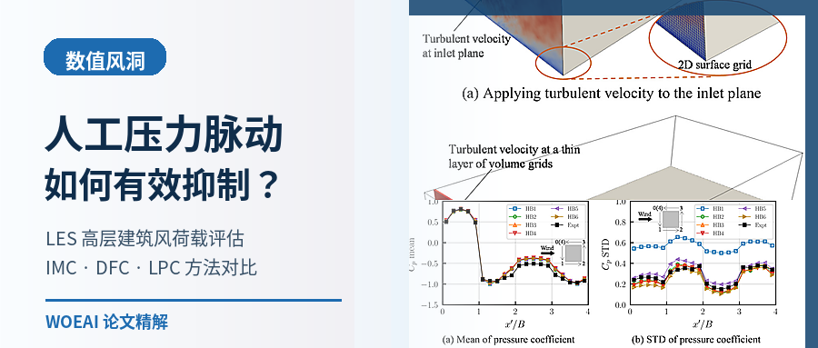

.. contents:: 本页目录
   :local:
   :depth: 2

论文信息
--------

**原文题名：** Comparing methods for reducing artificial pressure fluctuations using large eddy simulation in high-rise building wind load assessment

**中文题名：** 高层建筑风荷载评估大涡模拟中人工压力脉动抑制方法的对比

**作者：** 陈铃伟（Lingwei Chen）、李朝（Chao Li，通讯作者）、王靖含（Jinghan Wang）、何欣（Xin He）、王向杰（Xiangjie Wang）、胡钢（Gang Hu）、王晓璐（Xiaolu Wang）

**作者单位：**

1. 哈尔滨工业大学土木与环境工程学院，中国深圳 518055；
2. 哈尔滨工业大学广东省智能与韧性土木工程结构重点实验室，中国深圳 518055；
3. 路易斯安那州立大学土木与环境工程系，美国路易斯安那州巴吞鲁日 70803；
4. 哈尔滨工业大学粤港澳数据驱动流体力学与工程应用联合实验室，中国深圳 518055；
5. 东莞理工学院生态环境与建筑工程学院，中国东莞 523808。

**期刊：** *Physics of Fluids*, 36, 127120 (2024)

**DOI：** 10.1063/5.0240163

**投稿日期：** 2024 年 9 月 24 日

**录用日期：** 2024 年 11 月 13 日

**在线发表日期：** 2024 年 12 月 4 日

**专题：** Flow and Civil Structures（流动与土木结构）

摘要
----

减小人工压力脉动（reducing artificial pressure fluctuations，RAPF）是大气边界层湍流模拟中的关键挑战之一。本研究以合成湍流方法为基础，对三种 RAPF 方法的性能进行了比较：入口质量修正（inlet mass correction，IMC）、无散修正（divergence-free correction，DFC）和局部压力修正（local pressure correction，LPC）。首先，空域大涡模拟结果表明，IMC 和 DFC 方法能够在整个流场内有效抑制不真实的压力脉动。随着湍流向下游发展，压力脉动迅速衰减，并变得几乎可以忽略。相比之下，LPC 方法仅通过调整压力参考位置来减小局部非物理压力脉动；随着与参考点距离的增大，压力脉动逐渐增大。此外，IMC 和 DFC 方法会调整初始湍流场，使其满足入口质量平衡或无散条件，从而改变初始湍流特性；而 LPC 方法不修改初始湍流，因此能够更好地保持原始湍流特性。最后，高层建筑风荷载模拟表明，采用 IMC、DFC 和 LPC 方法均可得到合理的建筑表面压力均值、标准差和峰值，并可准确计算整体基底力和基底力矩。

关键词
------

原文未单列关键词。

I. 引言
-------

近几十年来，随着计算能力的快速提升，大涡模拟（large eddy simulation，LES）已广泛应用于计算风工程（computational wind engineering，CWE）[1]。该技术已用于建筑风荷载 [2–6]、桥梁风效应 [7,8]、行人高度风场 [9,10] 以及风力机空气动力学 [11,12] 等多个领域。在采用 LES 时，准确设定入流边界对于获得可靠结果至关重要 [13]。目前，入流湍流生成（inflow turbulence generation，ITG）方法主要包括先驱数据库法、循环法和合成湍流法。有关该主题的详细综述见文献 [14,15]。在各类 ITG 方法中，合成湍流法因算法简单、计算效率高而被广泛应用，因此下文将重点讨论合成湍流法。

合成湍流方法包括多种技术，例如合成随机傅里叶法（synthetic random Fourier method，SRFM）[16–18]、合成数字滤波法（synthetic digital filtering method，SDFM）[13,19,20]、合成相干涡法 [21,22] 和合成体积力法（synthetic volume forcing method，SVFM）[23,24]。其中，SRFM 以圆函数为基函数，因而具有从频谱角度实现指定湍流特性的优势。SRFM 方法体系主要分为两类。第一类为加权振幅波叠加（weighted amplitude wave superposition，WAWS）技术，该技术最早由文献 [17] 提出，并在文献 [25,26] 中进一步改进。WAWS 方法的主要局限在于不能满足无散要求，且不适用于并行算法。

SRFM 的第二类技术称为基于随机流生成的方法（random-flow-generation-based method，RFG-based method）。该方法最早由文献 [16] 提出，随后在文献 [18] 中被命名为 RFG。与 WAWS 方法不同，RFG 类方法能够生成满足无散条件的均匀湍流场，并可高效用于并行计算。此后，文献 [27–29] 将 RFG 方法扩展至任意三维能谱。然而，非均匀湍流场的三维能谱通常难以测量。随后，为实现任意时间功率谱密度（power spectral density，PSD），一致离散随机流生成（consistent discrete random flow generation，CDRFG）方法被提出，并成为应用广泛的主流方法之一 [30]。

在此之后，为提高模拟效率，文献 [31,32] 采用了更简洁的计算表达式，而文献 [33] 采用迭代重塑方法来缓解流场发展过程中的能量衰减问题。此外，Chen 等 [34] 提出了相干性改进且质量平衡的随机流生成（coherence-improved and mass-balanced RFG，CMRFG）方法，以改善空间相干性；Patruno 等则提出了预设波数矢量 RFG 技术，在纳入 Taylor 冻结假设的同时生成无散、均匀且各向异性的湍流场 [35,36]。

尽管近年来已有多项改进，SRFM 在生成非均匀湍流场时仍只能实现较低的散度 [37]。一种能够从根本上解决这一问题的方法，是先利用 SRFM 生成矢量势场，再对该场取旋度，从而获得内在满足零散度条件的湍流场 [38,39]。然而，利用 SRFM 生成合适的非均匀矢量势场仍然十分复杂。所幸在模拟大气边界层（atmospheric boundary layer，ABL）流场时，通常将随时间变化的二维平面湍流场作为 Dirichlet 型入口边界条件，然后在每一时间步利用速度—压力耦合算法得到满足无散条件的三维湍流场。

此外，减小人工压力脉动（RAPF）是 ABL 流动模拟中的另一个关键问题。Mansouri 等采用不同网格间距，评估了若干合成湍流方法产生虚假压力的程度。研究表明，几乎所有合成方法都会出现非物理压力脉动，并建议 ITG 方法中采用的最高频率不应超过由网格间距所能传递的频率 [40,41]。在 CWE 应用中，ABL 流动的发展必须具有自维持特征，即湍流应充分发展，且每一时刻的入口质量通量应保持平衡。入口质量通量一旦失衡，就可能在计算域内引发显著的非物理压力脉动 [42–44]。

RAPF 方法可分为四类。第一类是入口质量修正（IMC）方法，它在每一时间步对入口瞬时速度施加修正系数，以维持入口质量恒定 [42,43]。Wang 等将 IMC 方法用于修正 WAWS 方法生成的入口平面湍流场 [25,45]，结果表明该 LES 框架能够得到合理的风速和压力。第二类是无散修正（DFC）方法 [43]。该方法在入口平面施加恒定的平均速度场，同时在入口附近一薄层三维网格单元中插入湍流场，并将其作为速度—压力耦合计算的中间速度；随后通过压力修正过程得到经调整的零散度湍流场。DFC 方法的应用可见文献 [26,46]。

第三类是基于变分的入流修正（variationally based inflow correction，VBIC）方法 [47]。该方法基于变分思想，调整横向和竖向脉动速度，使其与侧边界近似相容；同时采用 IMC 方法修正顺风向速度，以维持入口质量平衡条件。然而，为准确计算入流湍流修正文件，VBIC 方法目前仅适用于完全由四边形面共形划分的入口面，不适用于加密八叉树网格或非结构网格。第四类方法针对不可压缩湍流：将入口和出口平面的压力设置为零梯度 Neumann 边界，并合理选择压力参考点位置，可有效抑制压力参考点附近的非物理压力脉动 [32,48]。由于其抑制范围具有局部性，本文将该方法称为局部压力修正（LPC）方法。

以往虽已有一些建筑 LES 对比研究，但主要关注不同 ITG 方法 [49,50] 或不同网格类型 [51]。现有文献中，针对 RAPF 方法的系统比较与评估仍较为有限。因此，本研究采用被广泛接受的 CDRFG 方法，评估不同 RAPF 方法对高层建筑风荷载 LES 的影响。

本文其余部分安排如下：第 II 节简要介绍 CDRFG 方法及若干 RAPF 方法；第 III 节通过空域 LES，对比不同 RAPF 方法对流场压力和湍流特性的影响；第 IV 节采用 LES 评估高层建筑风荷载；第 V 节给出研究结论。

II. 方法
--------

本节首先简要回顾 CDRFG 方法，随后介绍 RAPF 方法。文献 [47] 指出，VBIC 方法不适用于加密八叉树网格。因此，本研究仅比较其余三种方法，即 IMC、DFC 和 LPC。

A. CDRFG 方法简述
~~~~~~~~~~~~~~~~~~

近年来，RFG 类方法因算法简单、计算效率高而受到广泛关注。本研究采用应用广泛的 CDRFG 方法生成入流湍流，并考察三种 RAPF 方法对高层建筑风荷载模拟的影响。需要指出的是，采用其他 RFG 类方法也可得到类似结论。CDRFG 方法主要用于实现目标时间 PSD 和空间相干函数。湍流场的生成公式为 [30]

.. math::

   \mathbf{U}=\overline{\mathbf{U}}+\mathbf{u}, \qquad (1)

.. math::

   \mathbf{u}(\mathbf{x},t)
   =\sum_{m=1}^{M}\sum_{n=1}^{N}
   \left[
   \mathbf{p}^{m,n}\cos\!\left(\mathbf{k}^{m,n}\cdot\widetilde{\mathbf{x}}^{m}+2\pi f_{m,n}t\right)
   +\mathbf{q}^{m,n}\sin\!\left(\mathbf{k}^{m,n}\cdot\widetilde{\mathbf{x}}^{m}+2\pi f_{m,n}t\right)
   \right]. \qquad (2)

式中，:math:`\mathbf{U}=(U_1,U_2,U_3)^{\mathrm T}` 为瞬时速度矢量，其中 :math:`i=1,2,3` 时，:math:`U_i` 分别表示顺风向、横风向和竖向瞬时速度；:math:`\overline{\mathbf{U}}=(U_{\mathrm{avg}},0,0)^{\mathrm T}` 为平均速度矢量；:math:`\mathbf{u}=(u_1,u_2,u_3)^{\mathrm T}` 为脉动速度矢量，其中 :math:`i=1,2,3` 时，:math:`u_i` 分别表示顺风向脉动速度 :math:`u`、横风向脉动速度 :math:`v` 和竖向脉动速度 :math:`w`；:math:`\mathbf{x}=(x_1,x_2,x_3)^{\mathrm T}` 表示空间坐标，其中 :math:`j=1,2,3` 时，:math:`x_j` 分别表示 :math:`X`、:math:`Y` 和 :math:`Z` 方向坐标；:math:`t` 为时间；:math:`M` 为频谱分段数；:math:`N` 为每个频谱分段内的随机频率数；:math:`f_{m,n}` 为服从正态分布的随机频率，即 :math:`f_{m,n}\in N(f_m,\Delta f)`，其中 :math:`f_m` 和 :math:`\Delta f` 由式（3）计算；:math:`\mathbf{p}^{m,n}=(p_1^{m,n},p_2^{m,n},p_3^{m,n})^{\mathrm T}` 和 :math:`\mathbf{q}^{m,n}=(q_1^{m,n},q_2^{m,n},q_3^{m,n})^{\mathrm T}` 为由式（4）和式（5）计算的振幅矢量；:math:`\mathbf{k}^{m,n}=(k_1^{m,n},k_2^{m,n},k_3^{m,n})^{\mathrm T}` 为由式（6）得到的波数矢量；:math:`\widetilde{\mathbf{x}}^{m}=(\widetilde{x}_1^m,\widetilde{x}_2^m,\widetilde{x}_3^m)^{\mathrm T}` 为无量纲位置坐标，其中 :math:`\widetilde{x}_j^m` 由式（7）和式（8）定义。

.. math::

   \begin{aligned}
   f_m &= f_{\min}+(m-1)\Delta f,\\
   \Delta f &= \frac{f_{\max}-f_{\min}}{M-1},\\
   f_{\min} &= \frac{f_{\max}}{2M}.
   \end{aligned}
   \qquad (3)

式中，:math:`f_{\max}` 为最高频率，:math:`f_{\min}` 为最低频率。

.. math::

   p_i^{m,n}=\operatorname{sign}\!\left(r_i^{m,n}\right)
   \sqrt{\frac{2}{N}S_{ii}(f_m)\Delta f\,
   \frac{\left(r_i^{m,n}\right)^2}{1+\left(r_i^{m,n}\right)^2}}
   \qquad (4)

.. math::

   q_i^{m,n}=\operatorname{sign}\!\left(r_i^{m,n}\right)
   \sqrt{\frac{2}{N}S_{ii}(f_m)\Delta f\,
   \frac{1}{1+\left(r_i^{m,n}\right)^2}}
   \qquad (5)

.. math::

   \begin{pmatrix}
   p_1^{m,n} & p_2^{m,n} & p_3^{m,n}\\
   q_1^{m,n} & q_2^{m,n} & q_3^{m,n}\\
   k_1^{m,n} & k_2^{m,n} & k_3^{m,n}
   \end{pmatrix}
   \begin{pmatrix}
   k_1^{m,n}\\
   k_2^{m,n}\\
   k_3^{m,n}
   \end{pmatrix}
   =
   \begin{pmatrix}
   0\\
   0\\
   1
   \end{pmatrix}
   \qquad (6)

式中，:math:`r_i^{m,n}` 为均值为 0、标准差为 1 的正态分布随机数；:math:`S_{ii}(f_m)` 表示第 :math:`i` 个速度分量的单边时间 PSD。

.. math::

   \widetilde{x}_j^m=\frac{x_j}{L_j^m},
   \qquad
   L_j^m=\frac{U_{\mathrm{avg}}}{\gamma C_j f_m}
   \qquad (7)

.. math::

   \gamma=
   \begin{cases}
   3.7\beta^{-0.3}, & \beta<6.0,\\
   2.1, & \beta\ge 6.0,
   \end{cases}
   \qquad
   \beta=\frac{C D_c}{L_u^x(z)}
   \qquad (8)

式中，:math:`L_j^m` 为调整空间相干函数的参数；:math:`C_j` 和 :math:`C` 为相干衰减常数；:math:`\gamma` 为与无量纲长度尺度 :math:`\beta` 有关的调整系数；:math:`D_c` 为特征距离；:math:`L_u^x(z)` 为顺风向积分长度尺度。

需要指出的是，式（4）和式（5）中的系数应为 2，这是对原始论文 [30] 中排印错误的修正。修正信息见文献 [52]。至此完成对 CDRFG 方法的介绍，更多细节可参见原始文献 [30]。采用 LES 模拟入流湍流发展时，一般先利用 CDRFG 方法在二维入口平面上生成湍流速度时程，再于每一时间步将速度场映射到入口平面，如图 1(a) 所示。

.. figure:: ../../../wechat/assets/public-safe/ref-chen2024-POF/fig01.png
   :alt: 不同入流湍流施加方法示意图
   :align: center
   :width: 100%

   **图 1** 不同入流湍流施加方法示意图。（a）将湍流速度施加到入口平面；（b）在一薄层三维网格单元中插入湍流速度。

**图中标注：** Target building—目标建筑；Turbulent velocity at inlet plane—入口平面湍流速度；2D surface grid—二维表面网格；Turbulent velocity at a thin layer of volume grids—薄层体网格中的湍流速度；Mean velocity at inlet plane—入口平面平均速度；3D volume grid—三维体网格。

B. 入口质量修正
~~~~~~~~~~~~~~~~

充分发展的湍流向下游演化时，近似服从 Taylor 冻结假设，即湍流特性基本保持不变，入口质量通量也保持恒定。将 RFG 类方法生成的二维平面湍流场作为入口边界时，必须保证入口平面足够大且网格分辨率足够高。在这些条件下，瞬时入口质量通量将近似保持恒定 [25,34,43]。然而，受计算资源限制，数值模拟往往不能同时满足这两个条件，从而造成入口质量失衡，并引发非物理压力脉动 [42,43,53]。根据文献 [25,42,43]，可在每一时间步将速度场乘以一个简单修正系数，以解决入口质量失衡问题：

.. math::

   u_1^c(t,\mathbf{x})=
   \frac{U_{B0}}{U_B(t)}\left[U_{\mathrm{avg}}+u_1(\mathbf{x},t)\right]
   -U_{\mathrm{avg}}
   \qquad (9)

.. math::

   u_i^c(t,\mathbf{x})=
   \frac{U_{B0}}{U_B(t)}u_i(\mathbf{x},t),
   \qquad i=2,3
   \qquad (10)

.. math::

   \begin{aligned}
   U_{B0} &= \frac{1}{A}\iint_S U_{\mathrm{avg}}\,\mathrm{d}x_2\mathrm{d}x_3,\\
   U_B(t) &= \frac{1}{A}\iint_S\left[U_{\mathrm{avg}}+u_1(\mathbf{x},t)\right]\,\mathrm{d}x_2\mathrm{d}x_3,\\
   A &= \iint_S \mathrm{d}x_2\mathrm{d}x_3.
   \end{aligned}
   \qquad (11)

式中，:math:`u_i^c` 为修正后的第 :math:`i` 个脉动速度分量；:math:`U_{B0}` 为由目标平均速度确定的恒定体积平均速度；:math:`U_B(t)` 为瞬时体积平均速度；:math:`A` 为入口平面面积。事实上，式（9）已完成对顺风向脉动速度的入口质量修正；式（10）则以相同修正系数乘以横向和竖向脉动速度，以保持原流场的散度特性。文献 [34] 的单波传播算例表明，IMC 是一种简单而有效的 RAPF 方法。当经 IMC 修正的单波速度场施加于入口边界时，人工压力脉动可能只出现在入口平面附近；随着流场发展，压力脉动会迅速降低至合理水平。此外还应注意，严重的入口质量失衡可能导致速度修正系数显著波动，进而明显改变初始湍流特性 [34]。

C. 无散修正
~~~~~~~~~~~

由于 CDRFG 方法生成的二维入流湍流场不能满足入口质量平衡条件，若直接将其作为 LES 入口边界，就会产生人工压力脉动 [42,43,53]。不同于 IMC 方法，Kim 等提出了无散修正（DFC）方法来解决这一问题 [43]。他们在 OpenFOAM 的 pisoFoam 求解器中实现了该方法；pisoFoam 采用压力隐式算子分裂（pressure-implicit with splitting of operators，PISO）算法 [54]。下面简要说明该方法的原理，详细内容可参见原始文献 [43]。

如图 1(b) 所示，DFC 方法在入口平面施加不随时间变化的平均速度场，然后将湍流场插入入口附近一薄层三维网格单元的单元中心，作为速度—压力耦合计算的中间速度。PISO 算法的压力修正可保证每一时间步得到的三维湍流场满足离散连续性方程。由于入口质量通量保持恒定，整个计算域不会出现额外的质量变化，因此自然满足入口质量平衡条件。需要指出的是，虽然湍流场在插入位置经过调整后满足零散度条件，但尚未充分发展。因此，插入位置仍可能存在人工压力脉动，插入的湍流场还需在计算域内继续发展，才能达到压力脉动较小的合理状态。

本研究将 DFC 方法植入基于 OpenFOAM v2206 的瞬态求解器 pimpleFoam，并将改进后的求解器称为 dfcPimpleFoam。pimpleFoam 的本质是在每一时间步内执行多次 PISO 循环，因此在较高 Courant–Friedrichs–Lewy（CFL）数下具有更好的稳定性。此外，dfcPimpleFoam 求解器按以下三个主要步骤实现：（1）使用 topoSet 工具提取插入位置处的一薄层三维网格单元，并将其定义为可识别的插入单元区；（2）在压力修正步骤之前读取预先生成的入口速度文件，并采用最小距离匹配方法将速度映射到插入单元区内体网格单元的中心；（3）通过压力修正步骤计算经修正的湍流场。这种读取预生成入口速度文件的技术，使 DFC 方法能够方便地应用于其他 ITG 方法。

D. 局部压力修正
~~~~~~~~~~~~~~~

文献 [48] 指出，对于未将压力指定为 Dirichlet 边界条件的不可压缩流动，ANSYS FLUENT 会在每次迭代后修正压力场，以避免压力漂移。该修正以压力参考位置所在单元的压力为依据，将整个压力场减去该单元的压力值，从而保证压力参考位置的压力始终为零。如果压力被设置为 Dirichlet 边界条件，则无需进行此类修正，压力参考点设置也会被忽略。

类似地，在 OpenFOAM 中，可将入口和出口平面的压力设为零梯度 Neumann 边界，并在 ``fvSolution`` 文件中使用关键词 ``pRefPoint`` 指定压力参考点坐标。通常，压力参考点应选择在绝对静压已知且压力脉动很小的位置，以避免流场中出现不真实的压力结果。然而，当入口平面存在质量失衡时，整个流场都会产生非物理压力脉动，因此很难确定合理的压力参考位置。所幸流场中相邻位置的附加压力脉动几乎相同。因此，在用参考位置压力进行相减修正后，参考点附近网格单元的压力可有效抵消由入口质量失衡引起的附加压力脉动，从而在局部获得合理的压力结果。

基于这一原理，可将压力参考点设置在建筑影响范围之外的上方区域，以获得合理的压力结果 [32]。由于该方法仅在局部调整压力场，本文将其称为局部压力修正（LPC）方法。需要特别指出的是，LPC 方法不直接改变生成的流场，因此更有利于保持原始湍流的统计特性。

III. 空域对比模拟
-----------------

入流湍流对建筑绕流 LES 的准确性有显著影响。因此，在对研究对象建模之前，先在空域（empty domain，ED）中验证湍流特性的发展过程，被认为是较优的做法 [55]。本节通过空域模拟，对比不同 RAPF 方法抑制非物理压力脉动的效果，以及这些方法对湍流特性发展的影响。

A. 目标湍流特性
~~~~~~~~~~~~~~~~

本研究采用东京工艺大学（Tokyo Polytechnic University，TPU）提供的方形截面高层建筑风洞试验数据作为目标值 [56]。建筑模型的宽度和厚度为 :math:`B=D=0.1\,\mathrm{m}`，高度为 :math:`H=0.4\,\mathrm{m}`。表 I 列出了从 TPU 数据库提取的目标非均匀湍流特性，以及 CDRFG 方法的参数设置。首先，顺风向湍流强度剖面通过对 TPU 数据库中的试验值进行插值得到 [56]，如图 2 所示。由于 TPU 数据库只提供高度 :math:`2.5H` 范围内的顺风向湍流强度剖面数据，因此假定高于 :math:`2.5H` 处的湍流强度等于 :math:`2.5H` 处的数值。还应注意，TPU 数据库未提供横风向、竖向湍流强度剖面，也未提供 :math:`X` 方向积分长度尺度。因此，依据 Engineering Sciences Data Unit（ESDU）标准 [57]，引入 0.78 和 0.55 两个比例系数来描述三个湍流强度分量之间的关系。

.. list-table:: **表 I** 目标湍流特性及 CDRFG 方法所用参数
   :header-rows: 1
   :widths: 24 76

   * - 参数
     - 定义/数值
   * - 平均速度
     - :math:`U_{\mathrm{avg}}(z)=U_H\left(z/H\right)^\alpha`，其中 :math:`U_H=11\,\mathrm{m/s}`，:math:`H=0.4\,\mathrm{m}`，:math:`\alpha=1/4`。
   * - 湍流强度
     - :math:`I_u(z)` 由试验值插值得到，见图 2；:math:`I_v(z)=0.78I_u(z)`，:math:`I_w(z)=0.55I_u(z)`。
   * - von Kármán 频谱
     - :math:`S_{uu}(f)=\dfrac{4(I_uU_{\mathrm{avg}})^2(L_u^x/U_{\mathrm{avg}})}{\left[1+70.8(fL_u^x/U_{\mathrm{avg}})^2\right]^{5/6}}`，:math:`f\in[0,\infty)`；
       :math:`S_{vv}(f)=\dfrac{4(I_vU_{\mathrm{avg}})^2(L_v^x/U_{\mathrm{avg}})\left[1+188.4\left(2fL_v^x/U_{\mathrm{avg}}\right)^2\right]}{\left[1+70.8\left(2fL_v^x/U_{\mathrm{avg}}\right)^2\right]^{11/6}}`，:math:`f\in[0,\infty)`；
       :math:`S_{ww}(f)=\dfrac{4(I_wU_{\mathrm{avg}})^2(L_w^x/U_{\mathrm{avg}})\left[1+188.4\left(2fL_w^x/U_{\mathrm{avg}}\right)^2\right]}{\left[1+70.8\left(2fL_w^x/U_{\mathrm{avg}}\right)^2\right]^{11/6}}`，:math:`f\in[0,\infty)`；其中 :math:`L_u^x(z)=0.5\,\mathrm{m}`，:math:`L_v^x(z)=0.5L_u^x(z)`，:math:`L_w^x(z)=0.5L_u^x(z)`。
   * - CDRFG 参数
     - :math:`f_{\max}=100\,\mathrm{Hz}`，:math:`f_{\min}=0.5\,\mathrm{Hz}`，:math:`M=100`，:math:`N=50`，:math:`C_1=C_2=C_3=C=10`，:math:`D_c=0.3`。

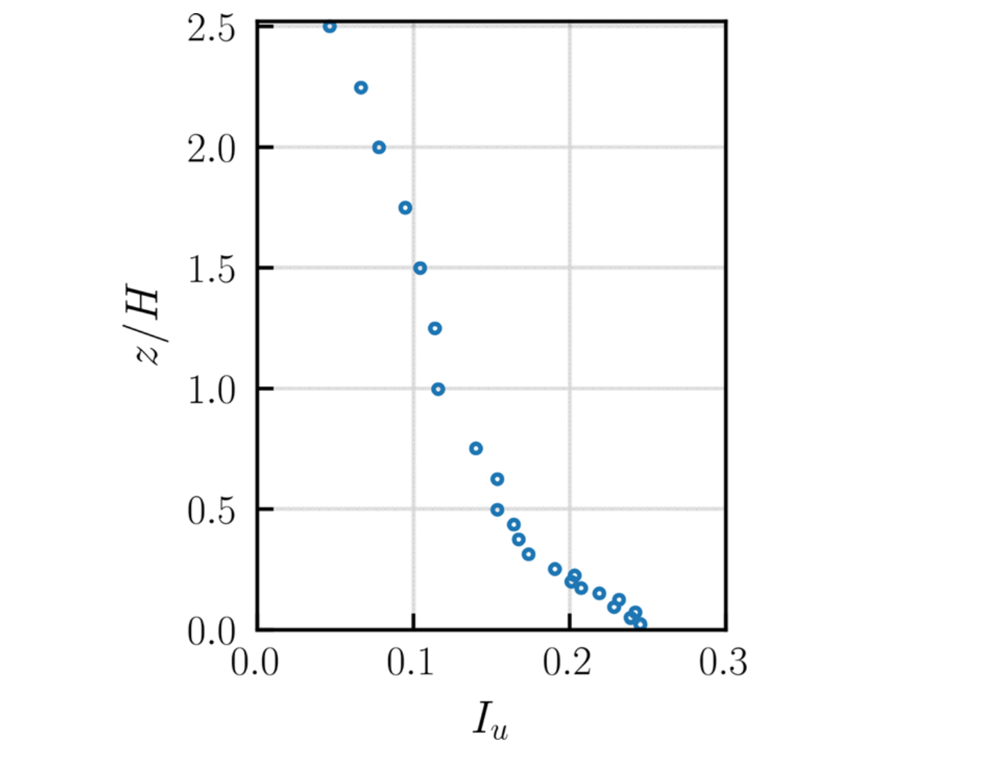

   **图 2** 来源于 TPU 数据库的顺风向湍流强度试验值 [56]。

**图中坐标：** 横轴 :math:`I_u` 为顺风向湍流强度；纵轴 :math:`z/H` 为无量纲高度。

按照文献 [25] 的建议，本研究参考类似试验获取积分长度尺度信息，并将 :math:`X` 方向顺风向积分长度尺度设为 0.5 m。依据局部各向同性假设，:math:`X` 方向横风向和竖向积分长度尺度均取顺风向分量的一半 [25,57]。此外，当前模拟采用应用广泛的 von Kármán 时间谱 [58]，以建筑高度 :math:`H=0.4\,\mathrm{m}` 为参考高度，并将该高度处的参考风速设为 11 m/s。最后，由于本研究采用的长度尺度比和目标湍流特性与文献 [30] 相近，CDRFG 方法的参数选取与原始文献一致，见表 I。CDRFG 方法的最高频率设为 100 Hz，最低频率则由式（3）计算为 0.5 Hz。加密区域网格尺寸与最高频率之间的关系满足文献 [41] 的建议值。

B. 数值设置
~~~~~~~~~~~

本研究全部模拟均采用 OpenFOAM v2206 完成。模拟长度缩尺比为 1:400，与 TPU 风洞试验相同。计算域和加密区域尺寸见图 3。计算域坐标原点 :math:`O` 位于入口平面底边中心。计算域尺寸为 :math:`20H\times10H\times4H`，阻塞率为 0.13%，满足文献 [59] 的指南。为防止湍流能量在到达建筑位置之前过度衰减，在背景区域 Zone 1 中设置三个采用八叉树算法逐级加密的区域。Zone 1 至 Zone 4 的网格尺寸依次为 :math:`H/10`、:math:`H/20`、:math:`H/40` 和 :math:`H/80`，目标建筑表面的网格尺寸设为 :math:`H/160`。空域模拟仅保留 Zone 1 至 Zone 3 的网格，并使用 OpenFOAM 提供的 snappyHexMesh 工具生成约 :math:`3.85\times10^6` 个网格单元。竖向和平面网格剖面见图 4(a)。

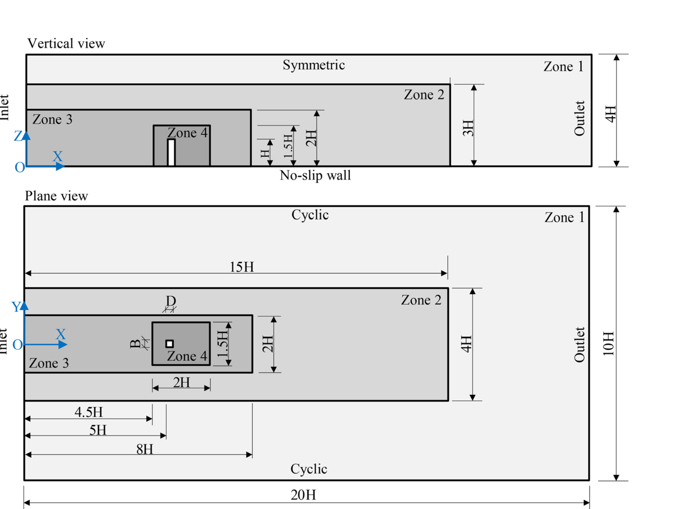

   **图 3** 计算域及网格加密区域尺寸。

**图中标注：** Vertical view—竖向视图；Plane view—平面视图；Inlet—入口；Outlet—出口；Symmetric—对称边界；Cyclic—周期边界；No-slip wall—无滑移壁面；Zone 1–4—加密区域 1–4。

边界条件如图 3 所示。计算域顶面采用对称边界条件，两侧面采用周期边界条件。对于底面，速度采用无滑移壁面边界条件，压力采用零梯度边界条件。为避免将壁面边界层解析至黏性区所需的高昂计算成本，采用 Spalding 单一公式壁面函数 [60]，在 OpenFOAM 中对应 ``nutUSpaldingWallFunction``。不同 RAPF 方法通过配置入口或出口边界实现。所有空域模拟的设置见表 II。对于全部算例，入口平面速度设置为 Dirichlet 边界条件，入口平面压力和出口平面速度设置为零梯度 Neumann 边界条件。算例 ED1、ED2 和 ED6 的出口平面压力采用固定值为零的 Dirichlet 边界条件；相反，算例 ED3–ED5 的出口平面压力采用零梯度 Neumann 边界条件。在算例 ED3 和 ED4 中，压力参考位置设为 :math:`(5H,0,3H)`，位于拟建建筑位置上方且不受结构影响；算例 ED5 的压力参考点设为 :math:`(10H,0,3H)`，距建筑位置 5H。

LES 采用壁面自适应局部涡黏（wall-adapting local eddy-viscosity，WALE）模型 [61] 作为亚格子尺度模型。时间离散采用 backward 格式，空间离散采用线性迎风稳定输运（linear-upwind stabilized transport，LUST）格式。为满足 CFL 条件，时间步长设为 0.0005 s。总时间步数为 18 000，对应 9 s；速度和压力统计采用最后 8 s 的结果。根据表 II，空域共模拟六个算例。ED1–ED5 采用瞬态求解器 pimpleFoam，ED6 采用自定义求解器 dfcPimpleFoam。此外，所有算例均采用 potentialFoam 求解器初始化速度场。

为节省计算资源，预先在入口平面生成两个湍流场。其一为采用 CDRFG 方法生成、存在入口质量失衡的原始湍流场，称为 Orig-CDRFG 流场；其二为将 IMC 方法应用于原始湍流场后得到的质量平衡流场，称为 IMC-CDRFG 流场。算例 ED1 在入口平面施加 Orig-CDRFG 流场，作为原始对照组，用于展示入口质量失衡引发人工压力脉动的程度。随后，算例 ED2 在入口平面施加 IMC-CDRFG 流场，以检验 IMC 方法的性能。算例 ED3 和 ED5 在入口平面施加 Orig-CDRFG 流场，以考察不同压力参考点下 LPC 方法的效果。算例 ED4 在入口平面采用 IMC-CDRFG 流场，以评估 IMC 与 LPC 组合使用的性能。算例 ED6 则用于评估 DFC 方法：入口平面施加不随时间变化的平均速度场，并使用 dfcPimpleFoam 求解器将 Orig-CDRFG 流场映射至插入位置 :math:`x/H=0.5` 处一薄层三维网格单元的中心。

最后，为监测空域中的压力和速度发展，在 :math:`X` 方向六个位置的横截面上布置监测点，即 :math:`x/H=0`、0.5、2.5、5、7.5 和 10。每个横截面沿 :math:`Y` 方向布置五条竖向监测线，即 :math:`y/H=-1`、-0.5、0、0.5 和 1。每条竖线上的监测点高度范围为 0.05–1.55 m，相邻点间距为 0.05 m。第 III C 节和第 III D 节所给出的沿 :math:`X` 方向压力与湍流剖面，均由五条 :math:`Y` 向竖线的数据取平均获得，以减小空间差异。

.. figure:: ../../../wechat/assets/public-safe/ref-chen2024-POF/fig04.png
   :alt: 空域与高层建筑网格示意图
   :align: center
   :width: 100%

   **图 4** 空域与高层建筑网格示意图。（a）空域网格；（b）高层建筑网格；（c）高层建筑局部网格。

**图中标注：** Vertical view—竖向视图；Plane view—平面视图；Zone 1，网格尺寸 :math:`H/10`；Zone 2，网格尺寸 :math:`H/20`；Zone 3，网格尺寸 :math:`H/40`；Zone 4，网格尺寸 :math:`H/80`；Building surface，网格尺寸 :math:`H/160`—建筑表面网格尺寸 :math:`H/160`。

.. list-table:: **表 II** 空域与高层建筑模拟算例
   :header-rows: 1
   :widths: 17 14 14 14 14 14 14

   * - 项目
     - ED1/HB1
     - ED2/HB2
     - ED3/HB3
     - ED4/HB4
     - ED5/HB5
     - ED6/HB6
   * - RAPF 方法
     - —
     - IMC
     - LPC
     - LPC + IMC
     - LPC
     - DFC
   * - 速度边界：入口平面
     - Orig-CDRFG
     - IMC-CDRFG
     - Orig-CDRFG
     - IMC-CDRFG
     - Orig-CDRFG
     - 平均速度
   * - 速度边界：插入平面
     - —
     - —
     - —
     - —
     - —
     - Orig-CDRFG
   * - 速度边界：出口平面
     - ``zeroGradient``
     - ``zeroGradient``
     - ``zeroGradient``
     - ``zeroGradient``
     - ``zeroGradient``
     - ``zeroGradient``
   * - 压力边界：入口平面
     - ``zeroGradient``
     - ``zeroGradient``
     - ``zeroGradient``
     - ``zeroGradient``
     - ``zeroGradient``
     - ``zeroGradient``
   * - 压力边界：出口平面
     - ``fixedValue(0)``
     - ``fixedValue(0)``
     - ``zeroGradient``
     - ``zeroGradient``
     - ``zeroGradient``
     - ``fixedValue(0)``
   * - 压力参考点
     - —
     - —
     - :math:`(5H,0,3H)`
     - :math:`(5H,0,3H)`
     - :math:`(10H,0,3H)`
     - —
   * - 求解器
     - pimpleFoam
     - pimpleFoam
     - pimpleFoam
     - pimpleFoam
     - pimpleFoam
     - dfcPimpleFoam

C. 空域压力对比
~~~~~~~~~~~~~~~

本节开始分析空域压力结果，并采用压力系数进行描述。压力系数定义为

.. math::

   C_p=\frac{p-p_{\mathrm{ref}}}{\tfrac{1}{2}\rho U_H^2}
   \qquad (12)

式中，:math:`C_p` 为压力系数；:math:`p_{\mathrm{ref}}` 为参考压力，本研究取 0；:math:`\rho` 为空气密度，取 :math:`1.225\,\mathrm{kg/m^3}`；:math:`U_H` 为建筑高度处的风速。此外，:math:`\overline{C}_p` 和 :math:`C'_p` 分别表示压力系数的均值和标准差（standard deviation，STD）。

首先，图 5 给出了算例 ED1–ED6 的入口质量通量比系数时程。可以看到，在入口平面施加 Orig-CDRFG 流场的 ED1、ED3 和 ED5 中，入口质量通量不平衡，使该比系数在 0.9–1.1 之间波动。相比之下，ED2 和 ED4 采用 IMC-CDRFG 流场，比系数始终保持为 1，说明入口质量达到平衡。ED6 在入口施加不随时间变化的平均速度场，同样自然保持质量平衡。

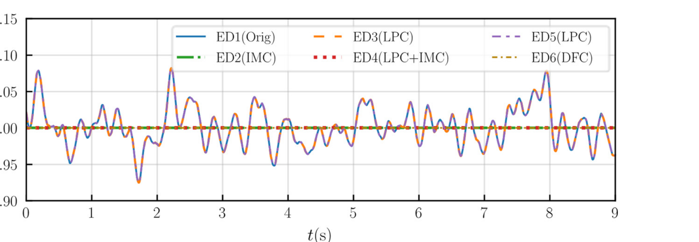

   **图 5** 入口质量通量比系数时程。

**图中坐标与图例：** 横轴为时间 :math:`t` （s），纵轴为 :math:`U_B(t)/U_{B0}`；Orig、IMC、LPC、DFC 分别表示原始流场、入口质量修正、局部压力修正和无散修正算例。

随后，图 6 给出了 :math:`X` 向监测点（:math:`y=0`，:math:`z/H=3`）的压力系数时程。为更清楚地展示流场压力结果，图 7 给出了压力系数均值和标准差剖面沿 :math:`X` 方向的发展。对于平均压力系数，图 7(a) 表明所有算例在整个流场中的平均压力系数均接近 0。因此，虽然部分算例存在非物理压力脉动，但它们对后续建筑平均压力系数结果的影响可以忽略。

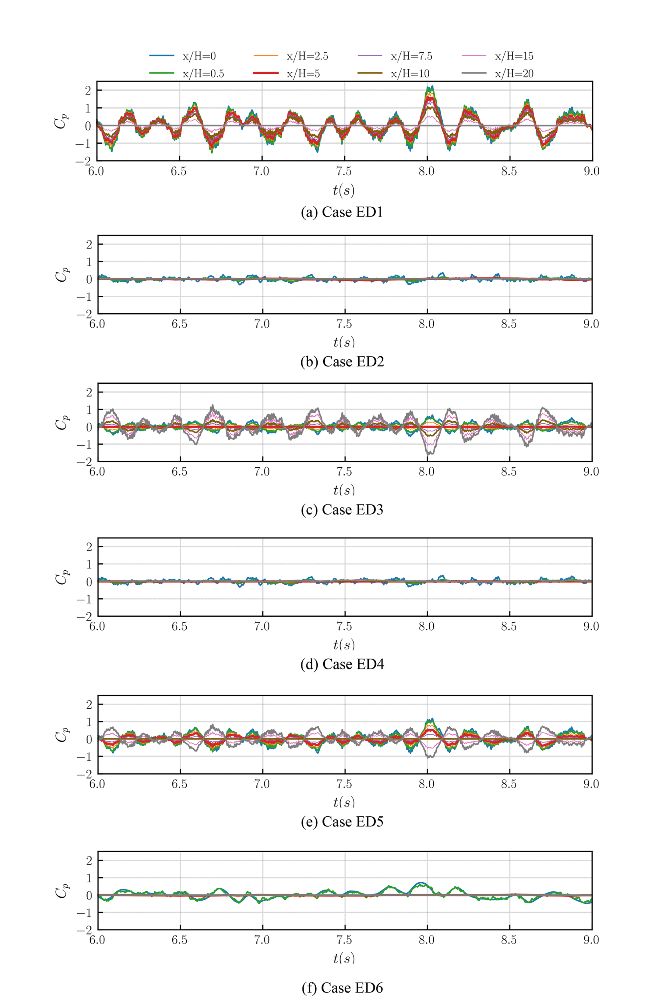

   **图 6** :math:`X` 方向监测点（:math:`y=0`，:math:`z/H=3`）压力系数时程对比。（a）ED1；（b）ED2；（c）ED3；（d）ED4；（e）ED5；（f）ED6。

**图中坐标与图例：** 横轴为时间 :math:`t` （s），纵轴为压力系数 :math:`C_p`；不同曲线对应 :math:`x/H=0`、0.5、2.5、5、7.5、10、15 和 20。

对于压力系数标准差，首先分析 ED1 中施加 Orig-CDRFG 流场所得的结果。如图 6(a) 所示，除 ED1 的出口位置（:math:`x/H=20`）外，由于入口质量失衡，其他位置的压力系数均围绕零值波动。图 7(b) 进一步表明，ED1 的整个计算域均存在非物理压力脉动，其中 :math:`x/H=5` 位置的压力脉动达到动压的 50%，将显著影响后续钝体周围的压力测量。

接下来评估 LPC 方法的压力结果。虽然 ED3 和 ED5 同样存在入口质量失衡，但如图 6(c) 和图 6(e) 所示，它们各自压力参考点 :math:`(5H,0,3H)` 和 :math:`(10H,0,3H)` 处的压力系数时程始终为零。此外，图 7(b) 表明，ED3 在 :math:`x/H=5` 处及 ED5 在 :math:`x/H=10` 处的压力脉动均接近零，说明 LPC 方法通过调整压力参考点能够有效抑制局部非物理压力脉动。然而，随着距压力参考点的距离增加，压力脉动逐渐增大。例如，在 ED5 中，目标建筑位置 :math:`x/H=5` 处的非物理压力脉动达到动压的 17%，可能降低后续建筑压力测量的准确性。

此外，对于采用 IMC 方法的 ED2 和 ED4，尽管入口附近（:math:`x/H=0`、0.5）仍存在压力脉动，但在 :math:`x/H=2.5` 之后，整个流场中的压力脉动几乎为零。这说明，无论出口平面压力设置为固定零值还是零梯度，IMC 方法均能有效抑制人工压力脉动并获得合理的流场压力结果。最后，ED6 的结果表明，DFC 方法可在插入位置将湍流场调整为满足无散条件，但入口平面附近（:math:`x/H=0` 和 0.5）仍存在压力脉动。随着流场向下游发展，压力脉动迅速减小，并在 :math:`x/H=2.5` 之后几乎可以忽略。这是因为 DFC 方法在入口平面施加不随时间变化的平均速度场，再采用压力—速度耦合求解算法，使修正后的流场自然满足质量平衡条件。

.. figure:: ../../../wechat/assets/public-safe/ref-chen2024-POF/fig07.png
   :alt: 压力系数均值和标准差剖面沿 X 方向的对比
   :align: center
   :width: 86%

   **图 7** 压力系数均值和标准差剖面沿 :math:`X` 方向的对比。（a）平均压力系数；（b）压力系数标准差。

**图中坐标与图例：** 各子图对应 :math:`x/H=0`、0.5、2.5、5、7.5 和 10；纵轴为 :math:`z/H`，横轴分别为 :math:`\overline{C}_p` 和 :math:`C'_p`；ED1–ED6 表示六个空域算例。

D. 湍流特性对比
~~~~~~~~~~~~~~~

下面对 LES 中的湍流特性进行比较分析。为量化模拟精度，采用归一化平均绝对误差（normalized mean absolute error，NMAE）进行评价 [46]，其定义为

.. math::

   \mathrm{MAE}=\frac{1}{N_{\mathrm{tap}}}
   \sum_{i=1}^{N_{\mathrm{tap}}}
   \left|Q_{\mathrm{Expt}}^{(i)}-Q_{\mathrm{LES}}^{(i)}\right|
   \qquad (13)

.. math::

   \mathrm{NMAE}=\frac{\mathrm{MAE}}
   {Q_{\mathrm{Expt}}^{\max}-Q_{\mathrm{Expt}}^{\min}}\times100
   \qquad (14)

式中，:math:`Q_{\mathrm{Expt}}` 和 :math:`Q_{\mathrm{LES}}` 分别表示试验和 LES 的统计量。本研究中的 NMAE 是平均绝对误差的归一化形式，采用试验统计量的最大值与最小值之差进行尺度化。NMAE 越小，表示模拟精度越高。采用 NMAE 的优点包括：可以比较不同方法的性能，也可评价同一方法在不同数据集上的表现；此外，对于近零量，例如近壁试验平均速度趋近于零时，NMAE 可避免以该量自身归一化可能导致的无穷大误差。因此，以 NMAE 作为评价指标能够更准确地评估结果。

图 8–10 分别给出了平均速度、湍流强度（turbulence intensity，TI）和湍动能（turbulent kinetic energy，TKE）剖面沿 :math:`X` 方向的发展，图 11 则给出了相应湍流特性的 NMAE 沿 :math:`X` 方向的变化。首先，对于平均速度，图 8 表明所有算例总体表现较好。然而，随着 :math:`X` 方向距离增加，近壁平均速度略有增大。这是由于底面采用光滑壁面函数造成的，可通过采用粗糙壁面函数予以解决 [46,62]。尽管如此，图 11(a) 表明，在后续建筑位置 :math:`x/H=5` 处，所有算例的平均速度 NMAE 均很小，最大值约为 1.25%。同时，由于研究对象为高层建筑，近壁平均速度对高层建筑的影响较小。因此，本研究采用光滑壁面函数是可接受的。

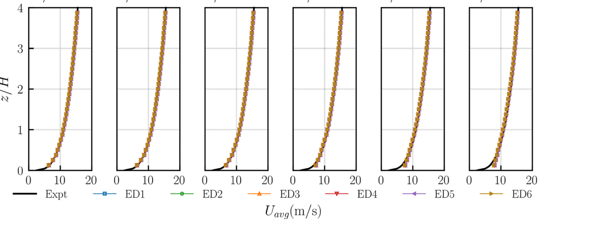

   **图 8** 平均速度剖面沿 :math:`X` 方向的发展。

**图中坐标与图例：** 各子图对应 :math:`x/H=0`、0.5、2.5、5、7.5 和 10；纵轴为 :math:`z/H`，横轴为平均速度 :math:`U_{\mathrm{avg}}` （m/s）；Expt 为试验结果。

以下分析关注入口附近 TI 和 TKE 的初始结果。根据图 9 和图 10，在入口位置 :math:`x/H=0`，ED6 的 TI 和 TKE 均为零，这是因为其入口条件只指定了平均速度。此外，图 11(b) 表明，对比 ED1 与 ED2（或 ED3–ED5）在入口位置的结果，Orig-CDRFG 流场的顺风向 TI 的 NMAE 为 1.52%，经 IMC 修正后误差增至 3.05%。这说明 IMC 方法会改变初始顺风向 TI，且改变程度受入口质量修正系数波动影响。相比之下，在插入位置 :math:`x/H=0.5`，ED6 的顺风向 TI 的 NMAE 为 5.30%，比 IMC 方法的误差高 2.25%。这表明 DFC 方法在将流场调整为满足无散条件时，也会改变初始湍流特性。

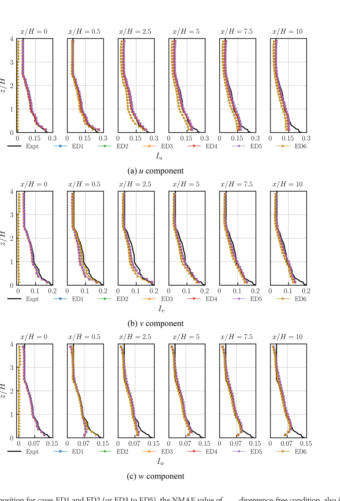

   **图 9** 湍流强度剖面沿 :math:`X` 方向的发展。（a）:math:`u` 分量；（b）:math:`v` 分量；（c）:math:`w` 分量。

**图中坐标与图例：** 各子图对应 :math:`x/H=0`、0.5、2.5、5、7.5 和 10；纵轴为 :math:`z/H`，横轴分别为 :math:`I_u`、:math:`I_v` 和 :math:`I_w`；Expt 为试验目标值。

另外，根据图 11(c) 和图 11(d)，在入口位置，ED1–ED5 的横风向和竖向 TI 的 NMAE 非常接近，分别约为 4.5% 和 3.5%。这表明 IMC 方法对横风向和竖向 TI 的影响有限，因为 Orig-CDRFG 流场的入口质量通量比系数围绕 1 周期性波动，见图 5。对于 TKE，图 11(e) 表明，在插入位置 :math:`x/H=0.5`，ED1、ED3 和 ED5 的 NMAE 为 7.4%，而 ED2、ED4 和 ED6 为 11%。这是因为 LPC 方法不修改 Orig-CDRFG 流场，而 IMC 和 DFC 方法分别为满足入口质量平衡或无散条件而调整流场，从而产生更大的初始 TKE 误差。

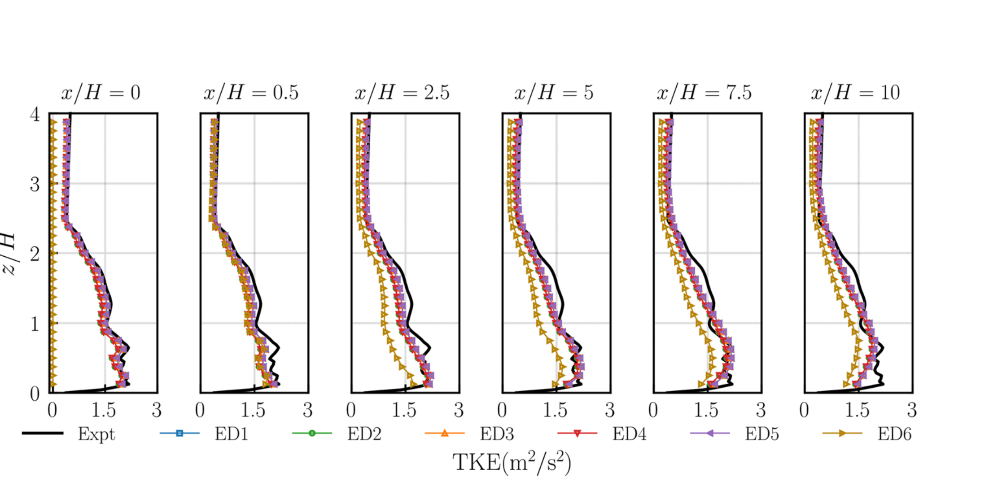

   **图 10** 湍动能剖面沿 :math:`X` 方向的发展。

**图中坐标与图例：** 各子图对应 :math:`x/H=0`、0.5、2.5、5、7.5 和 10；纵轴为 :math:`z/H`，横轴为 TKE（:math:`\mathrm{m^2/s^2}`）；Expt 为目标值。

进一步分析 TI 和 TKE 沿 :math:`X` 方向的发展。总体而言，如图 9 和图 10 所示，TI 和 TKE 沿 :math:`X` 方向均发生一定变化，主要原因是入口附近引入的湍流尚未充分发展至稳态。根据图 11(b)–(d)，所有算例的顺风向和竖向 TI 误差总体呈增大趋势，而横风向 TI 误差先增大后减小。这一现象可能源于湍流发展过程中不同脉动速度分量之间的能量传递。图 11(e) 进一步表明，在后续建筑位置 :math:`x/H=5` 处，ED1、ED3 和 ED5 的 TKE 误差为 6.8%，ED2 和 ED4 为 8.9%，ED6 则高达 23.4%。这说明，不调整初始湍流场的 LPC 方法产生最小的 TKE 误差；IMC 方法为满足质量平衡条件而对入口湍流作小幅调整，其误差虽大于初始状态，但仍在可接受范围内；DFC 方法为满足离散连续性方程而调整流场，由于插入湍流尚未充分发展，在后续发展中湍流特性变化显著，因此误差较大。

.. figure:: ../../../wechat/assets/public-safe/ref-chen2024-POF/fig11.png
   :alt: 湍流特性 NMAE 沿 X 方向的变化
   :align: center
   :width: 100%

   **图 11** 湍流特性 NMAE 沿 :math:`X` 方向的变化。（a）平均速度；（b）顺风向 TI；（c）横风向 TI；（d）竖向 TI；（e）TKE。

**图中坐标与图例：** 横轴为 :math:`x/H`，纵轴为相应统计量的 NMAE（%）；ED1–ED6 表示六个空域算例。

最后，图 12 和图 13 分别比较了高度 :math:`H` 和 :math:`0.25H` 处脉动速度沿 :math:`X` 方向发展的 :math:`Y` 向平均 PSD。由图 12(a) 和图 13(a) 可知，在入口平面，ED1–ED5 的三个脉动速度分量 PSD 均与目标值吻合良好，说明 IMC 方法对 PSD 的影响很小。图 12(b) 和图 13(b) 表明，ED6 在湍流插入位置 :math:`x/H=0.5` 的 PSD 总体也与目标值一致，说明 DFC 方法对初始 PSD 的影响同样较小。

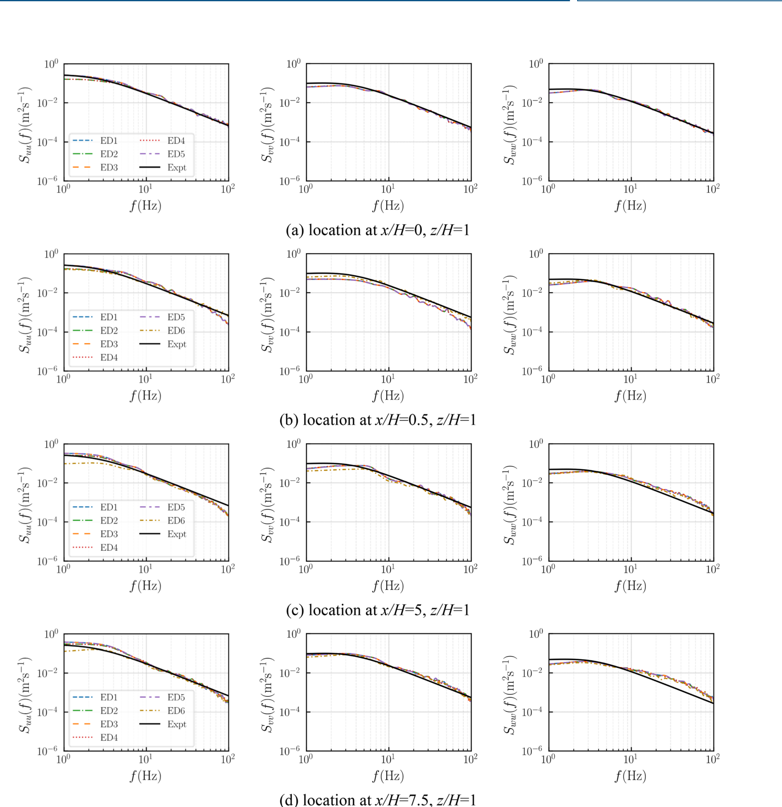

   **图 12** :math:`z/H=1` 时，脉动速度 :math:`Y` 向平均 PSD 沿 :math:`X` 方向的对比。（a）:math:`x/H=0`；（b）:math:`x/H=0.5`；（c）:math:`x/H=5`；（d）:math:`x/H=7.5`。每行从左至右分别为 :math:`S_{uu}(f)`、:math:`S_{vv}(f)` 和 :math:`S_{ww}(f)`。

**图中坐标与图例：** 横轴为频率 :math:`f` （Hz），纵轴为相应速度分量的 PSD；Expt 为目标频谱。

然而，对于所有算例，随着湍流沿 :math:`X` 方向发展，不同脉动速度分量之间以及低频与高频之间均发生能量传递。这是因为 CDRFG 方法生成的初始非均匀流场尚未充分发展。如图 12(c) 和图 13(c) 所示，在后续建筑位置 :math:`x/H=5`，ED6 的 :math:`S_{uu}(f)` 低频能量低于 ED1–ED5，这可能导致后续建筑表面压力测量产生更大误差。此外，所有算例中 :math:`S_{ww}(f)` 的低频能量均向高频范围转移；这种偏差受边界层效应影响，距地面越近越明显。这可能是因为 von Kármán 时间谱中采用的经验积分长度尺度与充分发展湍流不一致。总体而言，尽管模拟得到的 :math:`S_{ww}(f)` 发生显著变化，但 :math:`w` 分量脉动速度的能量占比较小，且 :math:`S_{uu}(f)` 和 :math:`S_{vv}(f)` 相对目标值仅有轻微偏差，因此对后续建筑表面压力测量的影响有限。

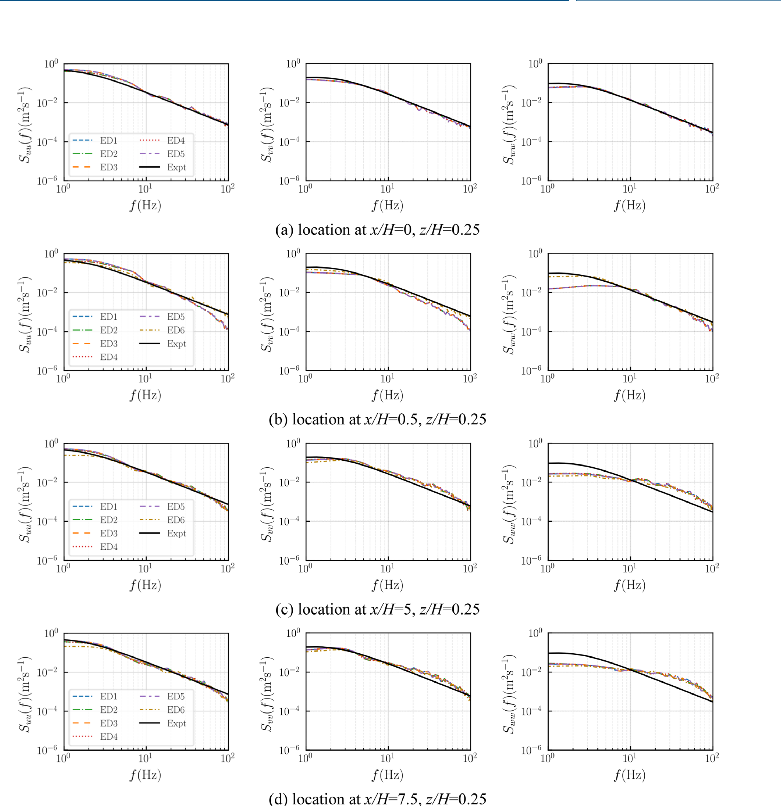

   **图 13** :math:`z/H=0.25` 时，脉动速度 :math:`Y` 向平均 PSD 沿 :math:`X` 方向的对比。（a）:math:`x/H=0`；（b）:math:`x/H=0.5`；（c）:math:`x/H=5`；（d）:math:`x/H=7.5`。每行从左至右分别为 :math:`S_{uu}(f)`、:math:`S_{vv}(f)` 和 :math:`S_{ww}(f)`。

**图中坐标与图例：** 横轴为频率 :math:`f` （Hz），纵轴为相应速度分量的 PSD；Expt 为目标频谱。

IV. 高层建筑风荷载对比评估
--------------------------

A. 数值计算过程
~~~~~~~~~~~~~~~

在第 III 节空域模拟的基础上，本节将高层建筑布置在距入口 5H 处，以评估风荷载，具体算例设置见表 II。目标湍流特性和建筑模型尺寸的详细信息见第 III A 节。建筑模拟采用 :math:`0^\circ` 风向角，建筑高度处平均风速为 11 m/s，对应 Reynolds 数约为 :math:`7.53\times10^4`。

与图 3 所示空域模拟不同，为更精细地模拟建筑绕流，建筑算例新增 Zone 4 加密区域。Zone 4 的网格尺寸为 :math:`H/80`，建筑表面网格尺寸为 :math:`H/160`。此外，在建筑表面设置 10 层边界层网格，每层厚度均为 :math:`H/160`，以更好地解析边界层流动。与空域网格相同，采用 snappyHexMesh 工具提供的八叉树加密算法，在建筑周围逐级加密网格，最终生成约 :math:`6.13\times10^6` 个网格单元，如图 4(b) 和图 4(c) 所示。建筑表面速度采用无滑移边界条件，压力采用零梯度边界条件，并使用 ``nutUSpaldingWallFunction`` 以降低壁面建模的计算成本 [60]。结果表明，建筑表面的平均 :math:`y^+_{1\mathrm{st}}` 约为 24。此外，湍流模型、离散格式及其他边界条件设置均与空域模拟一致。

最后，在建筑表面布置与 TPU 风洞试验相同的测压点，以提取压力时程。时间步长设为 0.0005 s，总模拟时长为 9 s；采用最后 8 s 的结果计算建筑表面风压统计量和整体风荷载。

B. 求解器计算时间对比
~~~~~~~~~~~~~~~~~~~~~

本研究全部模拟均在一台配备 AMD EPYC 7573X 处理器、总计 320 个核心的机架式高性能计算机上完成。ED1–ED6 使用 40 个核心，HB1–HB6 使用 56 个核心。各模拟算例的求解器计算时间见表 III。与基准算例 ED1 和 HB1 相比，IMC 方法几乎不增加额外计算成本。由于出口平面压力采用零梯度 Neumann 边界条件，LPC 方法使计算时间略有增加。DFC 方法则因在入口附近一薄层三维网格单元中心插入湍流场而使计算时间小幅增加。不过总体而言，不同 RAPF 方法引起的计算时间增幅有限，说明 IMC、DFC 和 LPC 方法对 LES 收敛性的影响较小。

.. list-table:: **表 III** 各模拟算例的求解器计算时间
   :header-rows: 1
   :widths: 20 30 20 30

   * - 算例
     - 求解器计算时间（h）
     - 算例
     - 求解器计算时间（h）
   * - ED1
     - 2.54
     - HB1
     - 3.98
   * - ED2
     - 2.60
     - HB2
     - 4.00
   * - ED3
     - 2.71
     - HB3
     - 4.36
   * - ED4
     - 2.69
     - HB4
     - 4.25
   * - ED5
     - 2.75
     - HB5
     - 4.36
   * - ED6
     - 2.88
     - HB6
     - 4.24

C. 建筑表面风压对比
~~~~~~~~~~~~~~~~~~~

为验证模拟精度，将压力系数统计量与 TPU 数据库中的试验结果进行比较。压力系数按式（12）计算，建筑高度处参考风速取 11 m/s。建筑四个立面的名称如图 14 所示。

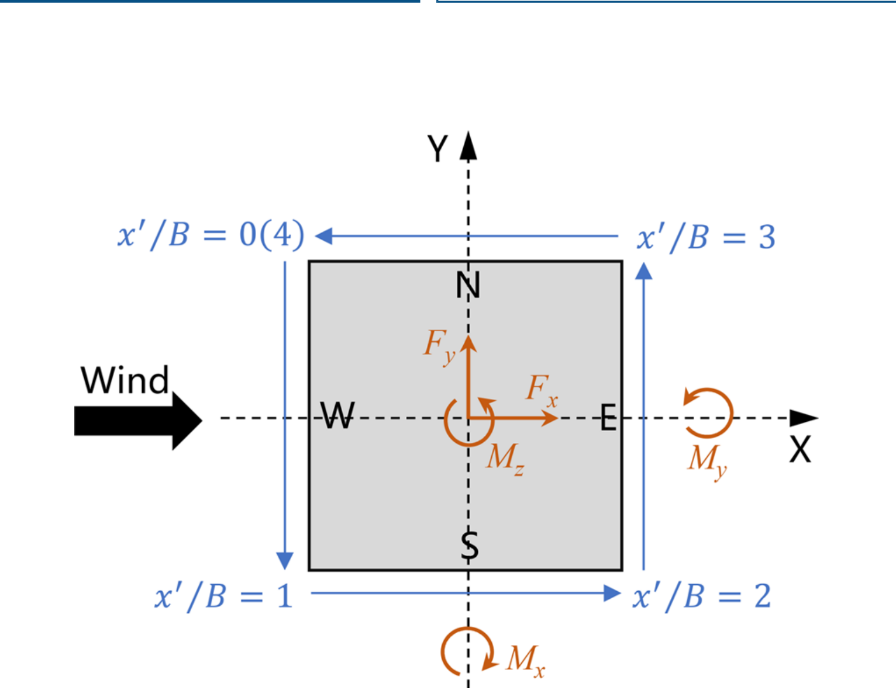

   **图 14** 建筑平面及基底力和基底力矩方向示意图。

**图中标注：** Wind—来流风；W、N、E、S 分别为迎风面、北侧面、背风面和南侧面；:math:`F_x`、:math:`F_y` 为顺风向与横风向基底力；:math:`M_x`、:math:`M_y`、:math:`M_z` 为绕 :math:`X`、:math:`Y`、:math:`Z` 轴的基底力矩；沿建筑周边的无量纲坐标为 :math:`x'/B=0(4)`、1、2、3。

首先，图 15 给出了建筑表面 :math:`2/3H` 高度处的风压系数。总体而言，如图 15(a) 所示，所有算例在 :math:`2/3H` 高度处的平均风压系数均与试验值较为一致。侧面（N 面和 S 面）及背风面（E 面）的平均风压系数绝对值略低于试验结果。对于 :math:`2/3H` 高度处的脉动风压系数，如图 15(b) 所示，HB1 因入口质量失衡而出现严重的非物理压力脉动，其幅值约为动压的 50%–70%。相比之下，其他算例由于采用了 RAPF 方法，脉动风压系数更接近试验数据，约为动压的 10%–40%。需要注意的是，尽管 HB5 采用 LPC 方法，但其压力参考点距建筑 5H，因此脉动压力略高于试验值。

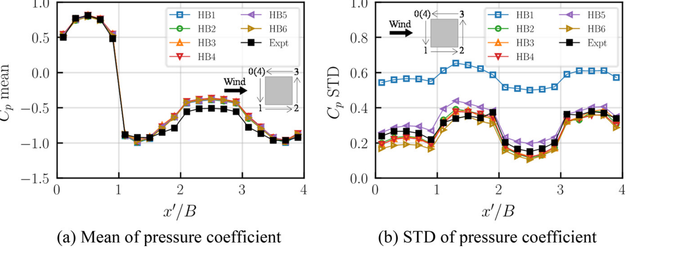

   **图 15** 建筑表面 :math:`2/3H` 高度处压力系数均值和标准差对比。（a）平均压力系数；（b）压力系数标准差。

**图中坐标与图例：** 横轴 :math:`x'/B` 表示沿四个立面周边的位置；纵轴分别为 :math:`\overline{C}_p` 和 :math:`C'_p`；Expt 为试验结果；小图给出风向及 W、N、E、S 四个立面的位置关系。

图 16 给出了建筑表面 :math:`2/3H` 高度处的峰值压力系数。为更好地估计峰值压力系数的概率分布，采用基于矩的 Hermite 模型，解决压力结果中短期样本数量有限的问题；详细计算过程见文献 [45,63,64]。显然，由于存在非物理压力脉动，HB1 在 :math:`2/3H` 高度处的峰值压力系数高于试验值。相比之下，其余算例均与试验值吻合良好，峰值压力系数处于约 -3 至 2 的合理范围内。

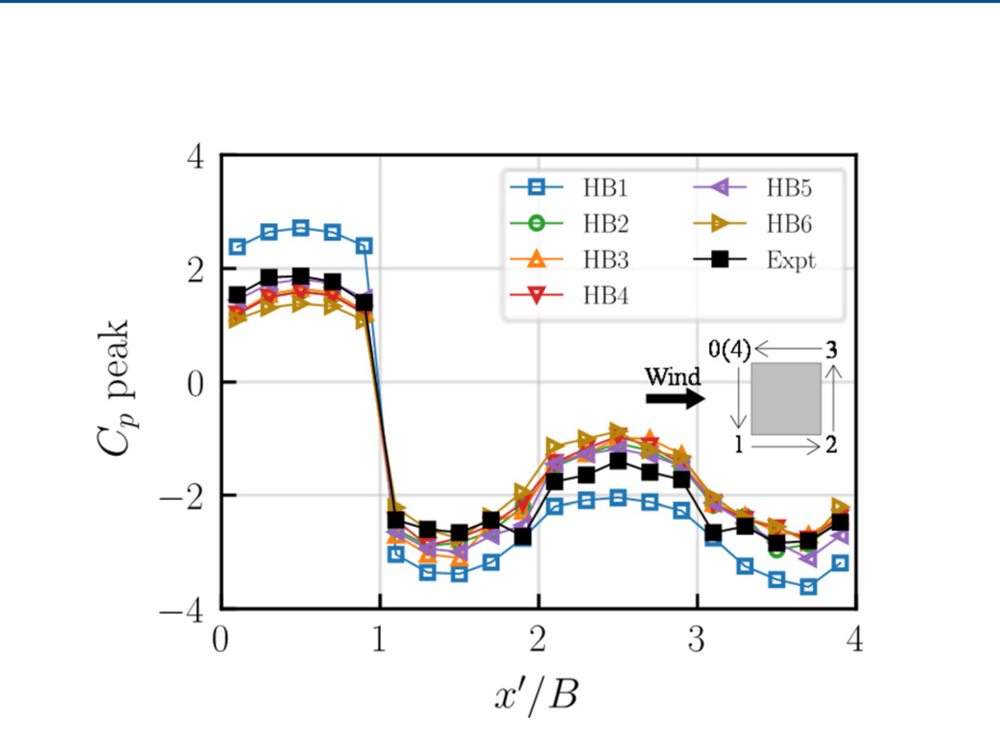

   **图 16** 建筑表面 :math:`2/3H` 高度处峰值压力系数对比。

**图中坐标与图例：** 横轴为沿建筑周边的位置 :math:`x'/B`，纵轴为峰值压力系数 :math:`C_{p,\mathrm{peak}}`；Expt 为试验结果。

图 17–19 分别给出了建筑表面压力系数均值、标准差和峰值分布的等值线图。所有测点的试验结果与 LES 结果散点对比见图 20–22。为进一步量化结果，采用式（14）计算压力系数均值、标准差和峰值的 NMAE，结果见图 23。对于平均压力系数，各算例结果总体接近。迎风面的误差最小，低于 2.5%；背风面误差较大，为 6.3%–7.5%。尽管如此，所有表面的平均误差均低于 5%，说明总体模拟精度较高。需要指出的是，虽然 HB1 和 HB5 存在显著的非物理压力脉动，但入口质量流量比的周期性振荡使正、负压力相互抵消，因此对最终平均压力系数的影响较小。这与第 III C 节的结论一致。

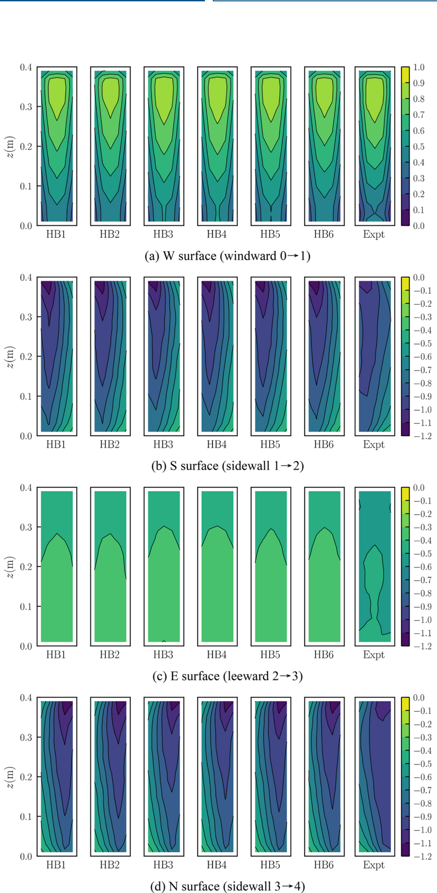

   **图 17** 建筑表面平均压力系数分布等值线图。（a）W 面，迎风面 0→1；（b）S 面，侧面 1→2；（c）E 面，背风面 2→3；（d）N 面，侧面 3→4。

**图中标注：** HB1–HB6 为六个建筑模拟算例，Expt 为试验结果；纵轴 :math:`z` 的单位为 m，颜色条表示平均压力系数。

对于压力系数标准差，HB1 在迎风面和背风面的 NMAE 高达 120%，所有表面的平均误差为 108%，这一误差对于建筑压力测量不可接受。相比之下，HB2–HB6 的平均误差分别为 11.6%、10.8%、11.8%、15.0% 和 16.3%，这些误差与建筑位置处的 TKE 水平有关，见图 11(e)。比较而言，在建筑位置 :math:`x/H=5` 处，采用 DFC 方法的 ED6 具有最大的 TKE 误差 21.6%，从而导致 HB6 的脉动压力误差较大。相反，ED2–ED4 的 TKE 误差均在 9% 以内，因此 HB2–HB4 的脉动压力误差相对较小。值得注意的是，虽然 HB3 存在入口质量失衡，但 LPC 方法通过将压力参考点设置在建筑上方，可有效抑制建筑周边局部区域的非物理压力脉动。

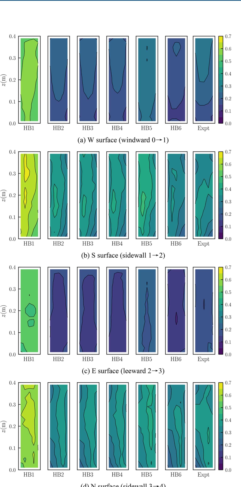

   **图 18** 建筑表面压力系数标准差分布等值线图。（a）W 面，迎风面 0→1；（b）S 面，侧面 1→2；（c）E 面，背风面 2→3；（d）N 面，侧面 3→4。

**图中标注：** HB1–HB6 为六个建筑模拟算例，Expt 为试验结果；纵轴 :math:`z` 的单位为 m，颜色条表示压力系数标准差。

然而，HB5 虽然采用 LPC 方法且 TKE 误差也在 9% 以内，但其压力参考点距建筑 5H，导致建筑位置仍存在非物理脉动。因此，其建筑表面压力系数标准差误差比 HB3 高 4.2%。最后，根据图 22 和图 23(c)，由于存在非物理压力脉动，HB1 的峰值压力系数被显著高估，迎风面 W 的误差高达 17.7%，所有建筑表面的平均误差为 12.0%。相比之下，HB2–HB5 的峰值压力系数更准确，所有表面的平均误差约为 5%。HB6 由于建筑位置处 TKE 误差较大，误差略高，为 6.7%。

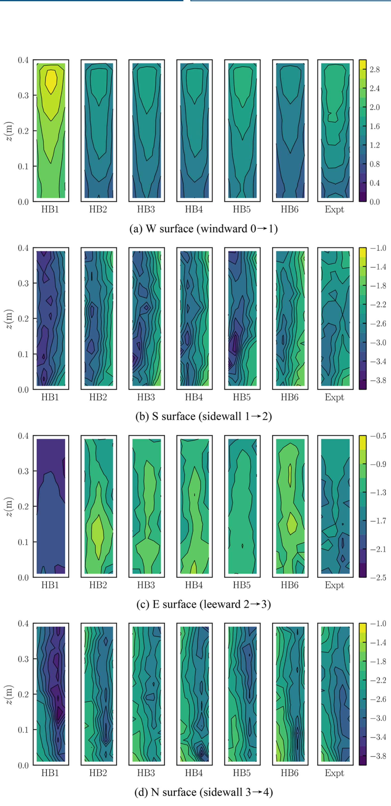

   **图 19** 建筑表面峰值压力系数分布等值线图。（a）W 面，迎风面 0→1；（b）S 面，侧面 1→2；（c）E 面，背风面 2→3；（d）N 面，侧面 3→4。

**图中标注：** HB1–HB6 为六个建筑模拟算例，Expt 为试验结果；纵轴 :math:`z` 的单位为 m，颜色条表示峰值压力系数。

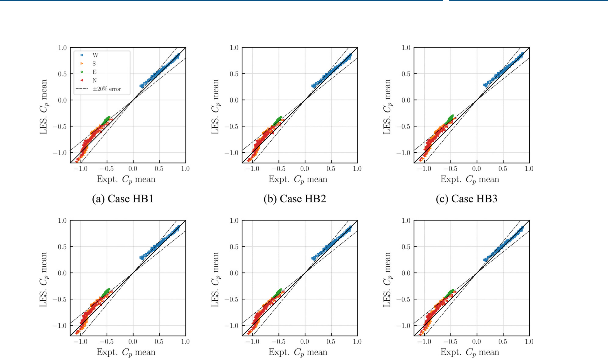

   **图 20** LES 与试验平均压力系数散点对比。（a）HB1；（b）HB2；（c）HB3；（d）HB4；（e）HB5；（f）HB6。

**图中坐标与图例：** 横轴为试验平均压力系数，纵轴为 LES 平均压力系数；W、S、E、N 表示四个建筑立面；实线为一一对应线，虚线为 ±20% 误差线。

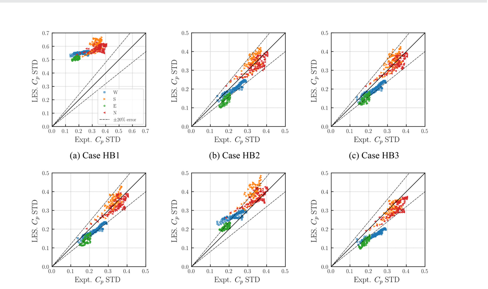

   **图 21** LES 与试验压力系数标准差散点对比。（a）HB1；（b）HB2；（c）HB3；（d）HB4；（e）HB5；（f）HB6。

**图中坐标与图例：** 横轴为试验压力系数标准差，纵轴为 LES 压力系数标准差；W、S、E、N 表示四个建筑立面；实线为一一对应线，虚线为 ±20% 误差线。

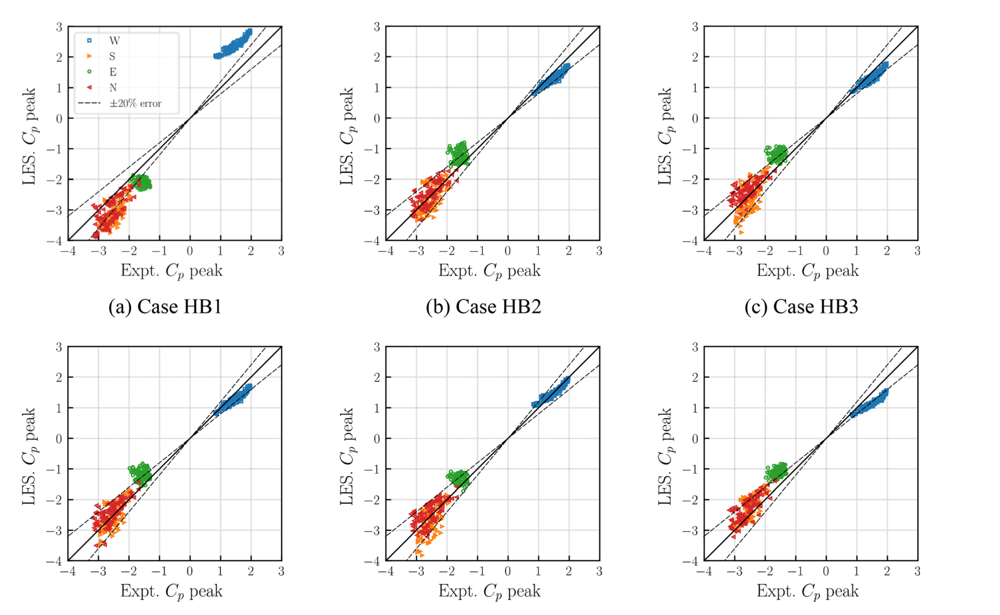

   **图 22** LES 与试验峰值压力系数散点对比。（a）HB1；（b）HB2；（c）HB3；（d）HB4；（e）HB5；（f）HB6。

**图中坐标与图例：** 横轴为试验峰值压力系数，纵轴为 LES 峰值压力系数；W、S、E、N 表示四个建筑立面；实线为一一对应线，虚线为 ±20% 误差线。

.. figure:: ../../../wechat/assets/public-safe/ref-chen2024-POF/fig23.png
   :alt: 建筑表面压力系数 NMAE 对比
   :align: center
   :width: 82%

   **图 23** 建筑表面压力系数 NMAE 对比。（a）平均压力系数；（b）压力系数标准差；（c）峰值压力系数。

**图中坐标与图例：** 横轴为建筑表面 W、S、E、N 及全部表面 All，纵轴为相应压力统计量的 NMAE（%）；HB1–HB6 为六个建筑模拟算例。

D. 整体风力与力矩对比
~~~~~~~~~~~~~~~~~~~~~

与文献 [25,45] 类似，建筑基底力和基底力矩的方向按图 14 定义，相应系数计算如下：

.. math::

   C_{F_x}(t)=\frac{F_x(t)}{0.5\rho U_H^2BH},
   \qquad
   C_{F_y}(t)=\frac{F_y(t)}{0.5\rho U_H^2DH}
   \qquad (15)

.. math::

   C_{M_x}(t)=\frac{M_x(t)}{0.5\rho U_H^2BH^2},
   \qquad
   C_{M_y}(t)=\frac{M_y(t)}{0.5\rho U_H^2DH^2},
   \qquad
   C_{M_z}(t)=\frac{M_z(t)}{0.5\rho U_H^2BDH}
   \qquad (16)

表 IV 列出了基底力/力矩系数的均值。首先，由于建筑在 :math:`0^\circ` 风向角下具有对称性，试验和 LES 结果中的横风向基底力 :math:`\overline{C}_{F_y}`、横风向基底力矩 :math:`\overline{C}_{M_y}` 及扭转基底力矩 :math:`\overline{C}_{M_z}` 均接近零。其次，HB1–HB6 的顺风向基底力 :math:`\overline{C}_{F_x}` 和顺风向基底力矩 :math:`\overline{C}_{M_x}` 均值总体彼此接近，但略低于试验值。该差异主要源于当前模拟中背风面平均压力绝对值低于试验结果。

.. list-table:: **表 IV** 基底力/力矩系数均值
   :header-rows: 1
   :widths: 16 17 17 17 17 17

   * - 算例
     - :math:`\overline{C}_{F_x}`
     - :math:`\overline{C}_{F_y}`
     - :math:`\overline{C}_{M_x}`
     - :math:`\overline{C}_{M_y}`
     - :math:`\overline{C}_{M_z}`
   * - Expt
     - 1.0676
     - 0.0181
     - 0.5823
     - 0.0097
     - -0.0081
   * - HB1
     - 0.9727
     - 0.0070
     - 0.5304
     - 0.0032
     - 0.0006
   * - HB2
     - 0.9696
     - 0.0134
     - 0.5284
     - 0.0055
     - 0.0010
   * - HB3
     - 0.9684
     - 0.0144
     - 0.5288
     - 0.0063
     - 0.0013
   * - HB4
     - 0.9703
     - -0.0002
     - 0.5289
     - -0.0017
     - 0.0013
   * - HB5
     - 0.9731
     - 0.0064
     - 0.5304
     - 0.0015
     - -0.0002
   * - HB6
     - 0.9538
     - 0.0065
     - 0.5220
     - 0.0008
     - 0.0004

表 V 给出了基底力/力矩系数的标准差。总体而言，模拟结果的标准差小于试验数据，主要原因是建筑位置处的 TKE 低于目标值。在所有算例中，HB6 的顺风向基底力和基底力矩标准差最小，这是因为对应空域算例 ED6 在建筑位置处的顺风向湍流强度误差较大。值得注意的是，尽管 HB1 和 HB5 的建筑表面存在非物理压力脉动，但由于建筑具有对称性，且邻近区域中的这些脉动较为相似，因此对称表面上的整体力和力矩可相互抵消此类影响，从而得到看似合理且较为准确的结果。

.. list-table:: **表 V** 基底力/力矩系数标准差
   :header-rows: 1
   :widths: 16 17 17 17 17 17

   * - 算例
     - :math:`C'_{F_x}`
     - :math:`C'_{F_y}`
     - :math:`C'_{M_x}`
     - :math:`C'_{M_y}`
     - :math:`C'_{M_z}`
   * - Expt
     - 0.2622
     - 0.3263
     - 0.1424
     - 0.1743
     - 0.0591
   * - HB1
     - 0.2393
     - 0.2634
     - 0.1293
     - 0.1374
     - 0.0563
   * - HB2
     - 0.2185
     - 0.2596
     - 0.1200
     - 0.1369
     - 0.0543
   * - HB3
     - 0.2350
     - 0.2596
     - 0.1261
     - 0.1341
     - 0.0546
   * - HB4
     - 0.2206
     - 0.2565
     - 0.1205
     - 0.1349
     - 0.0544
   * - HB5
     - 0.2380
     - 0.2626
     - 0.1285
     - 0.1376
     - 0.0562
   * - HB6
     - 0.1719
     - 0.2528
     - 0.0948
     - 0.1327
     - 0.0480

最后，图 24 对比了总基底力/力矩系数频谱。由图可见，所有算例的 LES 频谱均与 TPU 数据库结果吻合良好。

.. figure:: ../../../wechat/assets/public-safe/ref-chen2024-POF/fig24.png
   :alt: 总基底力和基底力矩系数频谱对比
   :align: center
   :width: 100%

   **图 24** 总基底力/力矩系数频谱对比。（a）顺风向基底力；（b）横风向基底力；（c）顺风向基底力矩；（d）横风向基底力矩；（e）扭转基底力矩。

**图中坐标与图例：** 横轴为无量纲频率 :math:`fB/U_H`，纵轴为相应归一化基底力或力矩系数谱；HB1–HB6 为六个建筑模拟算例，Expt 为 TPU 试验结果。

V. 结论
-------

采用合成湍流方法在入口平面生成湍流场时，经常出现入口质量失衡问题，从而在流场中产生显著的非物理压力脉动。目前，减小人工压力脉动（RAPF）是大气边界层湍流场模拟中的主要挑战之一。本研究以合成湍流方法为基础，旨在比较不同 RAPF 方法的性能。首先简要介绍一致离散随机流生成（CDRFG）方法，随后介绍三种 RAPF 方法：入口质量修正（IMC）、无散修正（DFC）和局部压力修正（LPC）。

随后，通过空域大涡模拟（LES），比较不同 RAPF 方法抑制非物理压力脉动的效果及其对湍流统计特性的影响。流场压力结果表明，IMC 和 DFC 方法能够在整个流场内有效减小虚假压力脉动。随着湍流向下游发展，压力脉动迅速衰减，并变得几乎可以忽略。相比之下，LPC 方法仅通过调整压力参考点来减小局部非物理压力脉动；随着距参考点的距离增大，压力脉动趋于增大。此外，IMC 和 DFC 方法会调整初始湍流场，使其满足入口质量平衡或无散条件，从而改变初始湍流特性。相反，LPC 方法不作此类调整，因此能够更好地保持原始湍流特性。

最后，开展高层建筑模拟以评估不同 RAPF 方法的性能。结果表明，采用 IMC、DFC 和 LPC 方法均可得到合理的建筑表面压力均值、标准差和峰值统计量，以及合理的整体基底力和基底力矩。需要指出的是，如果在入口直接施加质量不平衡的合成湍流场而不采用任何 RAPF 方法，建筑表面会出现严重的非物理压力脉动。然而，当建筑相对于来流风向具有对称性时，对称面上的整体力和力矩可能抵消这些虚假脉动的影响，从而得到表面上看似合理的结果。

参考文献
--------

[1] B. Blocken, “50 years of Computational Wind Engineering: Past, present and future,” *J. Wind Eng. Ind. Aerodyn.* **129**, 69–102 (2014).

[2] M. Ricci, L. Patruno, I. Kalkman, S. De Miranda, and B. Blocken, “Towards LES as a design tool: Wind loads assessment on a high-rise building,” *J. Wind Eng. Ind. Aerodyn.* **180**, 1–18 (2018).

[3] X. Wang, C. S. Cai, C. Sun, and A. Elawady, “Large-eddy simulation of wind pressures on elevated low-rise buildings,” *Phys. Fluids* **36**, 055121 (2024).

[4] L. U. Bin, L. I. Qiusheng, W. Xincong, H. Xuliang, and H. E. Junyi, “Large eddy simulation of wind pressures on a 600-m-high skyscraper and comparison with field measurements during Super Typhoon Mangkhut,” *J. Build. Eng.* **92**, 109750 (2024).

[5] X. Hu, S. Zhang, and Z. Xie, “Effects of corner recession on the aerodynamic characteristics of tall buildings with various side ratios: Experimental and numerical study,” *J. Build. Eng.* **93**, 109832 (2024).

[6] R. Al-Chalabi, A. Elshaer, and H. Aboshosha, “Enhancing LES efficacy in wind load evaluation of low-rise buildings using synthesized inflow turbulence,” *J. Build. Eng.* **95**, 110233 (2024).

[7] Y. Chen, X. Wang, C. Sun, and B. Zhu, “Exploring the failure mechanism of light poles on elevated bridges under high winds,” *Eng. Fail. Anal.* **159**, 108076 (2024).

[8] Z. Shen, F. Wang, C. Feng, J. Hao, and H. Xia, “Experimental and numerical study on buffeting force characteristics of the p-shaped bridge deck,” *Phys. Fluids* **36**, 025170 (2024).

[9] B. Blocken, T. Stathopoulos, and J. Van Beeck, “Pedestrian-level wind conditions around buildings: Review of wind-tunnel and CFD techniques and their accuracy for wind comfort assessment,” *Build. Environ.* **100**, 50–81 (2016).

[10] H. Mittal, A. Sharma, and A. Gairola, “A review on the study of urban wind at the pedestrian level around buildings,” *J. Build. Eng.* **18**, 154–163 (2018).

[11] M. Calaf, C. Meneveau, and J. Meyers, “Large eddy simulation study of fully developed wind-turbine array boundary layers,” *Phys. Fluids* **22**, 015110 (2010).

[12] H. Y. Peng, X. R. Yang, H. J. Liu, and S. Y. Sun, “Aerodynamic analysis of vertical axis wind turbines at various turbulent levels: Insights from 3D LES simulations,” *J. Build. Eng.* **94**, 109899 (2024).

[13] Z. Xie and I. P. Castro, “Efficient generation of inflow conditions for large eddy simulation of street-scale flows,” *Flow Turbul. Combust.* **81**, 449–470 (2008).

[14] X. Wu, “Inflow turbulence generation methods,” *Annu. Rev. Fluid Mech.* **49**, 23–49 (2017).

[15] N. S. Dhamankar, G. A. Blaisdell, and A. S. Lyrintzis, “Overview of turbulent inflow boundary conditions for large-eddy simulations,” *AIAA J.* **56**, 1317–1334 (2018).

[16] R. H. Kraichnan, “Diffusion by a random velocity field,” *Phys. Fluids* **13**, 22–31 (1970).

[17] M. Shinozuka, “Simulation of multivariate and multidimensional random processes,” *J. Acoust. Soc. Am.* **49**, 357–368 (1971).

[18] A. Smirnov, S. Shi, and I. Celik, “Random flow generation technique for large eddy simulations and particle-dynamics modeling,” *J. Fluids Eng.* **123**, 359–371 (2001).

[19] M. Klein, A. Sadiki, and J. Janicka, “A digital filter based generation of inflow data for spatially developing direct numerical or large eddy simulations,” *J. Comput. Phys.* **186**, 652–665 (2003).

[20] A. Kempf, M. Klein, and J. Janicka, “Efficient generation of initial-and inflow-conditions for transient turbulent flows in arbitrary geometries,” *Flow Turbul. Combust.* **74**, 67–84 (2005).

[21] N. Jarrin, S. Benhamadouche, D. Laurence, and R. Prosser, “A synthetic-eddy-method for generating inflow conditions for large-eddy simulations,” *Int. J. Heat Fluid Flow* **27**, 585–593 (2006).

[22] N. Kornev and E. Hassel, “Synthesis of homogeneous anisotropic divergence-free turbulent fields with prescribed second-order statistics by vortex dipoles,” *Phys. Fluids* **19**, 068101 (2007).

[23] A. Keating, U. Piomelli, E. Balaras, and H. Kaltenbach, “A priori and a posteriori tests of inflow conditions for large-eddy simulation,” *Phys. Fluids* **16**, 4696–4712 (2004).

[24] J. Wang, C. Li, S. Huang, Q. Zheng, Y. Xiao, and J. Ou, “Large eddy simulation of turbulent atmospheric boundary layer flow based on a synthetic volume forcing method,” *J. Wind Eng. Ind. Aerodyn.* **233**, 105326 (2023).

[25] Y. Wang and X. Chen, “Simulation of approaching boundary layer flow and wind loads on high-rise buildings by wall-modeled LES,” *J. Wind Eng. Ind. Aerodyn.* **207**, 104410 (2020).

[26] A. F. Melaku and G. T. Bitsuamlak, “A divergence-free inflow turbulence generator using spectral representation method for large-eddy simulation of ABL flows,” *J. Wind Eng. Ind. Aerodyn.* **212**, 104580 (2021).

[27] S. H. Huang, Q. S. Li, and J. R. Wu, “A general inflow turbulence generator for large eddy simulation,” *J. Wind Eng. Ind. Aerodyn.* **98**, 600–617 (2010).

[28] H. G. Castro and R. R. Paz, “A time and space correlated turbulence synthesis method for large eddy simulations,” *J. Comput. Phys.* **235**, 742–763 (2013).

[29] X. Wang, C. S. Cai, P. Yuan, G. Xu, and C. Sun, “An efficient and accurate DSRFG method via nonuniform energy spectra discretization,” *Eng. Struct.* **298**, 117014 (2024).

[30] H. Aboshosha, A. Elshaer, G. T. Bitsuamlak, and A. El Damatty, “Consistent inflow turbulence generator for LES evaluation of wind-induced responses for tall buildings,” *J. Wind Eng. Ind. Aerodyn.* **142**, 198–216 (2015).

[31] Y. Yu, Y. Yang, and Z. Xie, “A new inflow turbulence generator for large eddy simulation evaluation of wind effects on a standard high-rise building,” *Build. Environ.* **138**, 300–313 (2018).

[32] L. Chen, C. Li, J. Wang, G. Hu, Q. Zheng, Q. Zhou, and Y. Xiao, “Consistency improved random flow generation method for large eddy simulation of atmospheric boundary layer,” *J. Wind Eng. Ind. Aerodyn.* **229**, 105147 (2022).

[33] Y. Zhang, S. Cao, and J. Cao, “An improved consistent inflow turbulence generator for LES evaluation of wind effects on buildings,” *Build. Environ.* **223**, 109459 (2022).

[34] L. Chen, C. Li, J. Wang, G. Hu, and Y. Xiao, “A coherence-improved and mass-balanced inflow turbulence generation method for large eddy simulation,” *J. Comput. Phys.* **498**, 112706 (2024).

[35] L. Patruno and M. Ricci, “On the generation of synthetic divergence-free homogeneous anisotropic turbulence,” *Comput. Methods Appl. Mech. Eng.* **315**, 396–417 (2017).

[36] L. Patruno and M. Ricci, “A systematic approach to the generation of synthetic turbulence using spectral methods,” *Comput. Methods Appl. Mech. Eng.* **340**, 881–904 (2018).

[37] H. Guo, P. Jiang, L. Ye, and Y. Zhu, “An efficient and low-divergence method for generating inhomogeneous and anisotropic turbulence with arbitrary spectra,” *J. Fluid Mech.* **970**, A2 (2023).

[38] R. Yu and X. Bai, “A fully divergence-free method for generation of inhomogeneous and anisotropic turbulence with large spatial variation,” *J. Comput. Phys.* **256**, 234–253 (2014).

[39] C. Li, L. Chen, J. Wang, W. Zhang, X. Wang, Z. Wang, and G. Hu, “A novel vector potential random flow generation method for synthesizing divergence-free homogeneous isotropic turbulence with arbitrary spectra,” *Phys. Fluids* **36**, 035127 (2024).

[40] Z. Mansouri, R. P. Selvam, and A. G. Chowdhury, “Performance of different inflow turbulence methods for wind engineering applications,” *J. Wind Eng. Ind. Aerodyn.* **229**, 105141 (2022).

[41] Z. Mansouri, R. P. Selvam, and A. G. Chowdhury, “Maximum grid spacing effect on peak pressure computation using inflow turbulence generators,” *Results Eng.* **15**, 100491 (2022).

[42] A. G. Gungor, J. A. Sillero, and J. Jiménez, “Pressure statistics from direct simulation of turbulent boundary layer,” in *Seventh International Conference on Computational Fluid Dynamics*, Hawaii (Citeseer, 2012).

[43] Y. Kim, I. P. Castro, and Z. Xie, “Divergence-free turbulence inflow conditions for large-eddy simulations with incompressible flow solvers,” *Comput. Fluids* **84**, 56–68 (2013).

[44] M. Bervida, L. Patruno, S. Stani, and S. D. Miranda, “Synthetic generation of the atmospheric boundary layer for wind loading assessment using spectral methods,” *J. Wind Eng. Ind. Aerodyn.* **196**, 104040 (2020).

[45] Y. Wang and X. Chen, “Evaluation of wind loads on high-rise buildings at various angles of attack by wall-modeled large-eddy simulation,” *J. Wind Eng. Ind. Aerodyn.* **229**, 105160 (2022).

[46] A. F. Melaku and G. T. Bitsuamlak, “Prospect of LES for predicting wind loads and responses of tall buildings: A validation study,” *J. Wind Eng. Ind. Aerodyn.* **244**, 105613 (2024).

[47] L. Patruno and S. de Miranda, “Unsteady inflow conditions: A variationally based solution to the insurgence of pressure fluctuations,” *Comput. Methods Appl. Mech. Eng.* **363**, 112894 (2020).

[48] ANSYS, *ANSYS FLUENT 12.0, Theory Guide, User Manual* (ANSYS, 2009).

[49] B. W. Yan and Q. S. Li, “Inflow turbulence generation methods with large eddy simulation for wind effects on tall buildings,” *Comput. Fluids* **116**, 158–175 (2015).

[50] R. Vasaturo, I. Kalkman, B. Blocken, and P. Van Wesemael, “Large eddy simulation of the neutral atmospheric boundary layer: Performance evaluation of three inflow methods for terrains with different roughness,” *J. Wind Eng. Ind. Aerodyn.* **173**, 241–261 (2018).

[51] W. Wang, Y. Cao, and T. Okaze, “Comparison of hexahedral, tetrahedral and polyhedral cells for reproducing the wind field around an isolated building by LES,” *Build. Environ.* **195**, 107717 (2021).

[52] A. Melaku, G. Bitsuamlak, A. Elshaer, and H. Aboshosha, “Synthetic inflow turbulence generation methods for LES study of tall building aerodynamics,” in *The 13th Americas Conference on Wind Engineering* (2017).

[53] R. Poletto, T. Craft, and A. Revell, “A new divergence free synthetic eddy method for the reproduction of inlet flow conditions for LES,” *Flow Turbul. Combust.* **91**, 519–539 (2013).

[54] R. I. Issa, “Solution of the implicitly discretised fluid flow equations by operator-splitting,” *J. Comput. Phys.* **62**, 40–65 (1986).

[55] B. Blocken, T. Stathopoulos, and J. Carmeliet, “CFD simulation of the atmospheric boundary layer: Wall function problems,” *Atmos. Environ.* **41**, 238–252 (2007).

[56] See http://wind.arch.t-kougei.ac.jp/system/eng/contents/code/tpu for more information about TPU Aerodynamic Database.

[57] ESDU, “Characteristics of atmospheric turbulence near the ground—part II: Single point data for strong winds (neutral atmosphere),” ESDU Report No. 85020 (2001).

[58] E. E. Morfiadakis, G. L. Glinou, and M. J. Koulouvari, “The suitability of the von Karman spectrum for the structure of turbulence in a complex terrain wind farm,” *J. Wind Eng. Ind. Aerodyn.* **62**, 237–257 (1996).

[59] J. Franke, “Recommendations of the COST action C14 on the use of CFD in predicting pedestrian wind environment,” in *The Fourth International Symposium on Computational Wind Engineering*, Yokohama, Japan (Citeseer, 2006), pp. 529–532.

[60] D. B. Spalding, “A single formula for the law of the wall,” *J. Appl. Mech.* **28**, 455–458 (1961).

[61] F. Nicoud and F. Ducros, “Subgrid-scale stress modelling based on the square of the velocity gradient tensor,” *Flow Turbul. Combust.* **62**, 183–200 (1999).

[62] U. Schumann, “Subgrid scale model for finite difference simulations of turbulent flows in plane channels and annuli,” *J. Comput. Phys.* **18**, 376–404 (1975).

[63] S. R. Winterstein, “Nonlinear vibration models for extremes and fatigue,” *J. Eng. Mech.* **114**, 1772–1790 (1988).

[64] L. Yang, K. R. Gurley, and D. O. Prevatt, “Probabilistic modeling of wind pressure on low-rise buildings,” *J. Wind Eng. Ind. Aerodyn.* **114**, 18–26 (2013).

完整引用
--------

Chen, L.; Li, C.; Wang, J.; He, X.; Wang, X.; Hu, G.; Wang, X. Comparing methods for reducing artificial pressure fluctuations using large eddy simulation in high-rise building wind load assessment. *Physics of Fluids* **36**, 127120 (2024). https://doi.org/10.1063/5.0240163.

收录信息见 :ref:`WOEAI 学术成果页对应条目 <ref-chen2024-POF>`。
