.. _paper-note-ref-he2025-POF:

植入式立柱调谐液体阻尼器的非线性晃荡特征与减振效率：论文精解
======================================================================

精简版微信公众号文章：待发布

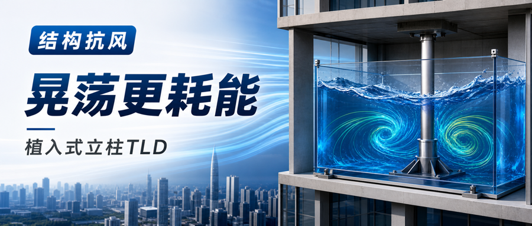

.. contents:: 本页目录
   :local:
   :depth: 3

论文信息
--------

原文题名：Numerical investigation of nonlinear sloshing features and vibration mitigation efficiency of the implanted pole tuned liquid damper。

作者及单位编号：Xin He（何欣）¹；Chao Li（李朝）¹˒²˒ᵃ；Lingwei Chen（陈铃伟）¹；Gang Hu（胡钢）¹˒²˒³；Jinping Ou（欧进萍）¹˒²。

1. 哈尔滨工业大学（深圳）智能土木与海洋工程学院，中国深圳，518055
2. 哈尔滨工业大学（深圳）广东省土木工程智能与韧性结构重点实验室，中国深圳，518055
3. 哈尔滨工业大学（深圳）粤港澳数据驱动流体力学与工程应用联合实验室，中国深圳，518055

原文通讯作者脚注 a：通信请联系 Chao Li（李朝）；原论文通讯作者邮箱为 lichaosz@hit.edu.cn。

期刊：Physics of Fluids，37，103314（2025）；DOI：`10.1063/5.0293483 <https://doi.org/10.1063/5.0293483>`_。投稿日期：2025 年 7 月 28 日；录用日期：2025 年 9 月 16 日；在线发表日期：2025 年 10 月 6 日。

摘要
----

调谐液体阻尼器（tuned liquid damper，TLD）是一种经济高效的动力吸振装置，能够有效减小高层建筑过大的风致振动，从而改善居住者的舒适度。本研究提出一种植入式立柱 TLD。植入式立柱不仅能够从多个方向扰动振荡液体，提高能量耗散效率，而且具有较高的刚度，可以支撑大型水箱并抵抗显著的液体晃荡力，最终保证 TLD 安全、稳定地运行。为进一步研究植入式立柱对 TLD 液体振荡响应和减振效率的影响，本研究采用计算流体动力学方法，将水平集方法与流体体积（volume of fluid，VOF）方法耦合为 CLS–VOF 方法，改进 OpenFOAM 两相流求解器，从而提高自由液面追踪的精度。研究考察了液深、立柱尺寸和激励幅值对内部液体非线性振荡特征的影响。此外，通过在 OpenFOAM 中进行二次开发，建立了结构–TLD 系统的双向耦合数值模型。该模型能够准确捕捉液体振荡与结构动力响应之间的相互作用。数值模拟结果与试验数据吻合良好。通过改变立柱阻塞率和调谐比，进一步分析植入式立柱 TLD 减小高层建筑风致振动响应的有效性。该双向耦合数值模型是一种准确、高效的方法，可以辅助工程师开展 TLD 的精细化设计与优化。

I 引言
------

随着城市人口不断集聚，土地资源日益紧张。高层建筑持续增多，其高宽比不断增大，轻质材料的应用也越来越普遍。然而，这会使结构刚度和固有阻尼降低。因此，强风作用下的动力响应已经成为保障高层建筑居住舒适度的关键因素。过大的振动响应会使居住者产生焦虑和恐慌，同时也会影响内部机械设备的运行。 :ref:`[1] <he2025-pof-ref-1>`  改变结构的质量或刚度可以减小动力响应，但这种方法可能显著增加建造成本和能耗。另一方面，优化建筑外形可以改善气动性能，从而减小风荷载的影响；不过，这种做法可能损害建筑美观及内部使用功能。 :ref:`[2] <he2025-pof-ref-2>`  理论研究  :ref:`[3] <he2025-pof-ref-3>`  和工程实例  :ref:`[4] <he2025-pof-ref-4>`  :ref:`[5] <he2025-pof-ref-5>`  表明，结构振动控制系统可以显著降低风致响应。调谐液体阻尼器（TLD）是一种由部分充液水箱组成的被动动力吸振装置，具有建造成本低、维护方便和安装快捷等优点。 :ref:`[6] <he2025-pof-ref-6>`  TLD 内部晃荡液体通过边界层黏性力和自由液面破碎耗散能量。然而，其固有阻尼相对较低，难以满足结构减振要求。需要在内部配置导流装置，以提高能量耗散效率、增大有效阻尼。 :ref:`[7] <he2025-pof-ref-7>`  常见的导流装置包括金属网、 :ref:`[8] <he2025-pof-ref-8>`  阻尼筛板、 :ref:`[9] <he2025-pof-ref-9>`  挡板  :ref:`[10] <he2025-pof-ref-10>`  和底部楔块， :ref:`[11] <he2025-pof-ref-11>`  还包括改变水箱底部形状的方案。 :ref:`[12] <he2025-pof-ref-12>`

学者们通过理论分析和试验研究，对 TLD 内部液体动力学进行了全面研究。Tait 等  :ref:`[13] <he2025-pof-ref-13>`  基于浅水波理论建立线性化分析模型，研究了安装筛板的 TLD 的性能。Cho 等  :ref:`[14] <he2025-pof-ref-14>`  采用势流理论，研究液深以及挡板数量和位置对内部液体晃荡行为的影响。Ruiz 等  :ref:`[15] <he2025-pof-ref-15>`  基于理想流体假设，提出适用于任意底部形状 TLD 的等效质量模型，简化了计算过程。Tsao 等  :ref:`[16] <he2025-pof-ref-16>`  在水箱内引入多孔介质，以提高 TLD 的能量耗散效率。他们利用势流理论和 Darcy–Forchheimer 流动方程，计算振荡液体在多孔介质中产生的非线性阻尼效应。该方法促成了多孔介质 TLD 的降阶物理模型的建立，显著降低计算复杂度。Khanpour 等  :ref:`[17] <he2025-pof-ref-17>`  采用线性分析方法，将自由液面波高和速度转换为模态坐标。他们推导了同时包含流体控制方程与单自由度（single degree of freedom，SDOF）系统结构动力学的四阶微分方程。该框架给出了 SDOF–TLD 耦合系统自由振动的解析解。

理论模型能够初步计算液体振荡特性，但其精度受到充液水平和外部激励的限制。因此，需要通过模型试验进一步完善 TLD 的精细化分析。Younes 等  :ref:`[18] <he2025-pof-ref-18>`  开展振动台试验，分析挡板尺寸和安装位置对液体阻尼的影响。Xue 等  :ref:`[19] <he2025-pof-ref-19>`  通过试验研究底部浸没式挡板和中心开孔挡板对晃荡波高与壁面压力的影响，并分析了各类挡板的抑晃机理与阻尼性能。Zhang  :ref:`[20] <he2025-pof-ref-20>`  通过实时混合模拟试验分析内置筛板 TLD 的振动控制性能，捕捉到高阶谐波响应和液体频率跳跃。通过振动台试验，可以准确、直观地观察 TLD 的振荡特征和振动控制性能。然而，受试验设备尺寸与承载能力的限制，物理模型制作成本过高，难以开展广泛的参数分析。

计算流体动力学（computational fluid dynamics，CFD）方法在 TLD 研究中的应用取得了许多进展。该方法能够快速、准确地分析液体动力特性，并有效捕捉非线性晃荡特征。Ali 等  :ref:`[21] <he2025-pof-ref-21>`  将水平挡板和竖向挡板结合，提出了一种新型树状挡板。他们利用数值模拟评估树状挡板的阻尼性能，重点考察激励频率对晃荡波高和壁面压力的影响。为解决深水 TLD 中底部液体不参与振荡的问题，Roy 等  :ref:`[22] <he2025-pof-ref-22>`  将水箱壁面改为倾斜构型。他们采用有限元方法，数值研究了斜壁 TLD 在简谐和地震激励下对多自由度结构的振动控制效率。Wang 等  :ref:`[23] <he2025-pof-ref-23>`  基于 OpenFOAM 平台模拟液体振荡响应，重点研究不同挡板安装位置和高度下的液体固有阻尼。Jian 等  :ref:`[24] <he2025-pof-ref-24>`  采用无网格光滑粒子流体动力学（smoothed particle hydrodynamics，SPH）模型，数值研究竖向圆柱对晃荡波高的影响。Xue 等  :ref:`[25] <he2025-pof-ref-25>`  利用 ANSYS 软件建立结构–调谐液柱阻尼器（TLCD）系统模型。他们采用流固相互作用方法评估 TLCD 减小结构位移响应的效率，并考察液柱长度变化对阻尼性能的影响。流固相互作用模型应用于复杂结构时面临计算资源需求高、计算效率低等困难。现有自由液面捕捉方法还存在一些局限。特别是，VOF 方法的计算函数不连续，无法准确计算法向和曲率，导致界面模糊、钝化。水平集方法在计算过程中需要不断重新初始化，且不能保持质量守恒。 :ref:`[26] <he2025-pof-ref-26>`  Sussman 和 Puckett  :ref:`[27] <he2025-pof-ref-27>`  提出了 VOF 与水平集方法的耦合，随后 Albadawi  :ref:`[28] <he2025-pof-ref-28>`  通过引入 S-CLSVOF 对其进行了改进。该方法利用 VOF 对流方程保证质量守恒，并采用水平集函数捕捉界面。然而，该方法在处理表面张力时稳定性较差，导致曲率计算不准确，并在界面附近产生伪流。

本研究基于 OpenFOAM 开源平台，使用水平集与流体体积方法耦合的 CLS–VOF 算法改进两相流求解器，有效消除伪流并准确捕捉自由液面。提出计算结构动力学–计算流体动力学（CSD–CFD）耦合框架，分析液体振荡特征与结构动力响应之间的相互作用。首先建立 TLD 数值模型，采用 CLS–VOF 方法分析内部液体的非线性振荡特征。此外，在水箱内部布置立柱，改变液深、激励频率、立柱尺寸和激励幅值。分析晃荡波高和晃荡力，并通过参数识别确定液体阻尼。进一步通过 OpenFOAM 二次开发，提出双向耦合数值模型。流体域采用 CLS–VOF 方法，结构分析采用 Newmark-β 数值积分法。利用通信接口函数实时交互和传递数据。耦合边界的设置与处理得到显著简化，从而降低计算资源需求、提高计算效率，并利用振动台试验数据验证数值模型。最后，评估植入式立柱 TLD 控制 CAARC 建筑模型风致振动响应的有效性。全面分析调谐比、立柱阻塞率和立柱位置对植入式立柱 TLD 减振效率的影响。

II TLD 数值模型
---------------

A CLS–VOF 耦合算法
~~~~~~~~~~~~~~~~~~

为分析和预测 TLD 的振荡特征，本研究改进 OpenFOAM 的两相流求解器，将水平集方法与 VOF 方法相结合。VOF 方法通过函数 :math:`\alpha` 区分空气相与液相，该函数满足以下对流方程：

.. math::

   \frac{\partial\alpha}{\partial t}+\nabla\cdot(U\alpha)=0.\qquad (1)

其中， :math:`U` 表示流体速度。函数 :math:`\alpha` 不连续，因此难以准确计算法向量和曲率。该函数具有如下三种不同的状态：

.. math::

   \alpha=\begin{cases}
   0 & \text{空气},\\
   0\text{–}1 & \text{界面},\\
   1 & \text{液体}.
   \end{cases}\qquad (2)

在水平集方法中，采用函数 :math:`\phi` 区分不同流体，界面由条件 :math:`\phi=0` 定义。在空气区域， :math:`\phi` 为负值；在液体区域， :math:`\phi` 为正值。CLS–VOF 耦合算法的第一步，是利用 VOF 方法中的函数 :math:`\alpha` 为水平集函数赋初值 :math:`\phi_0` ，并假设界面位于 :math:`\alpha=0.5` 处：

.. math::

   \phi_0=(2\alpha-1)\Gamma.\qquad (3)

其中，系数 :math:`\Gamma` 的取值由网格尺寸 :math:`\Delta x` 决定， :math:`\Gamma=0.75\Delta x` 。此外， :math:`\phi_0` 为有符号距离函数，为保持这一性质，必须在计算过程中持续对其进行初始化，具体如下：

.. math::

   \frac{\partial\phi}{\partial\tau'}=\operatorname{Sign}(\phi_0)(1-\nabla\phi).\qquad (4)

.. math::

   \phi(\mathbf{x},0)=\phi_0(\mathbf{x}).\qquad (5)

其中， :math:`\tau'` 表示人工时间步，通常取 :math:`\Delta\tau'=0.1\Delta x` ，以保证重新初始化过程的平滑性。 :math:`\mathbf{x}` 表示位置向量。重新初始化通常仅需少量迭代即可达到预期结果，迭代过程用 :math:`\phi_{\mathrm{corr}}` 表示： :ref:`[28] <he2025-pof-ref-28>`

.. math::

   \phi_{\mathrm{corr}}=\frac{\epsilon}{\Delta\tau'}.\qquad (6)

其中， :math:`\epsilon` 表示界面厚度，由两相流体之间的混合网格单元数定义， :math:`\epsilon=1.5\Delta x` 。 :ref:`[29] <he2025-pof-ref-29>`

由 :math:`\phi` 得到的界面法向和曲率如下：

.. math::

   \widehat{\mathbf n}=\frac{\nabla\phi}{|\nabla\phi|}.\qquad (7)

.. math::

   \kappa(\phi)=-\nabla\cdot\widehat{\mathbf n}.\qquad (8)

液体表面张力 :math:`F_\sigma` 采用连续表面力方法  :ref:`[30] <he2025-pof-ref-30>`  计算：

.. math::

   F_\sigma=\sigma\kappa(\phi)\nabla H(\phi).\qquad (9)

其中， :math:`H` 为 Heaviside 函数：

.. math::

   H(\phi)=\begin{cases}
   0 & \phi<-\epsilon,\\
   \displaystyle\frac12\left[1+\frac{\phi}{\epsilon}+\frac1\pi\sin\left(\frac{\pi\phi}{\epsilon}\right)\right] & |\phi|\leq\epsilon,\\
   1 & \phi>\epsilon.
   \end{cases}\qquad (10)

Heaviside 函数将表面张力的影响限制在界面附近的过渡区域，在该区域内稠密流体相互作用。这使表面张力产生的加速度在两种流体中分布更加均匀，提高连续力模型的计算稳定性，并消除伪流。此外，Heaviside 函数还可用于计算流体物性和表面通量，提高自由液面捕捉精度。

B 数值实现
~~~~~~~~~~

在 OpenFOAM 中，采用有限体积法求解每个计算单元内的流体控制方程。 :ref:`[31] <he2025-pof-ref-31>`  时间导数采用一阶欧拉隐式方法离散，梯度采用 Gauss 线性格式计算。根据 VOF 函数 :math:`\alpha` 重构水平集函数 :math:`\phi` 。为保证 :math:`\alpha` 函数的有界性，在对流方程中引入压缩项，压缩系数 :math:`c_\alpha` 设为 1。压力–速度耦合采用 PIMPLE 算法， :ref:`[32] <he2025-pof-ref-32>`  高效、准确地计算稳态解。湍流模型采用 SST :math:`k-\omega` 模型。 :ref:`[33] <he2025-pof-ref-33>`  水箱壁面和立柱壁面的边界条件设置如下：流体边界为 zeroGradient，压力边界为 fixedFluxPressure，速度边界为 movingWall。通过固体运动类函数并结合动网格技术，控制水箱运动轨迹。为保证复杂非线性流体环境下计算过程的精度与稳定性，需要限制 Courant 数 :math:`C_r` ，通常使其小于 0.5。 :ref:`[34] <he2025-pof-ref-34>`

C 验证与评估
~~~~~~~~~~~~

1 气泡上升算例
^^^^^^^^^^^^^^

本节通过数值模拟研究二维矩形液柱中气泡的上升过程，评价 VOF 与 CLS–VOF 方法捕捉界面的有效性。液柱尺寸为 :math:`2\times1\,\mathrm{m^2}` ，气泡直径为 :math:`0.5\,\mathrm{m}` ，初始速度为零。密度差产生浮力。气泡在上升过程中发生显著变形。CLS–VOF 方法能够更加准确地计算界面法向和曲率，有效消除伪流，提高界面捕捉精度，如图 1 所示。

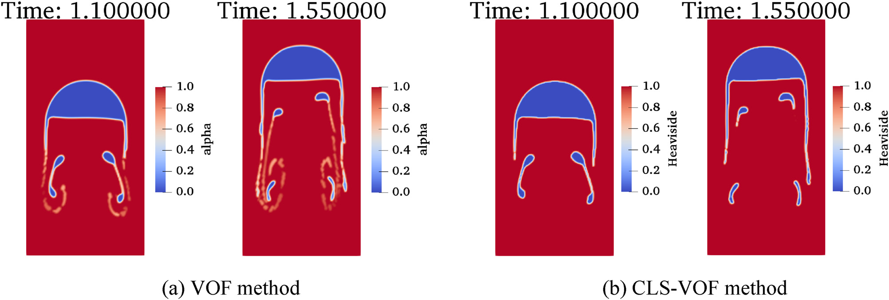

   **图 1** 气泡上升过程中的界面捕捉对比。液体区域用红色表示，空气区域用蓝色表示。

   （a）VOF 方法；（b）CLS–VOF 方法。图中 Time 为时刻，alpha 为 VOF 体积分数，Heaviside 为 Heaviside 函数值；所示时刻为 1.10 s 和 1.55 s。

2 矩形水箱的液体晃荡
^^^^^^^^^^^^^^^^^^^^

矩形水箱的几何尺寸为 :math:`1000\times100\times700\,\mathrm{mm^3}` ，液深 :math:`h=250\,\mathrm{mm}` 。在水箱底部施加外部激励 :math:`x=-A\sin(\omega_e t)` ，其中 :math:`A=10\,\mathrm{mm}` ， :math:`\omega_e=4.5572\,\mathrm{rad/s}` 。图 2 展示了内部液体的非线性振荡特征。在破碎和翻卷等强烈非线性现象发生时，CLS–VOF 方法有效缓解界面模糊和钝化，使自由液面更加清晰、锐利。

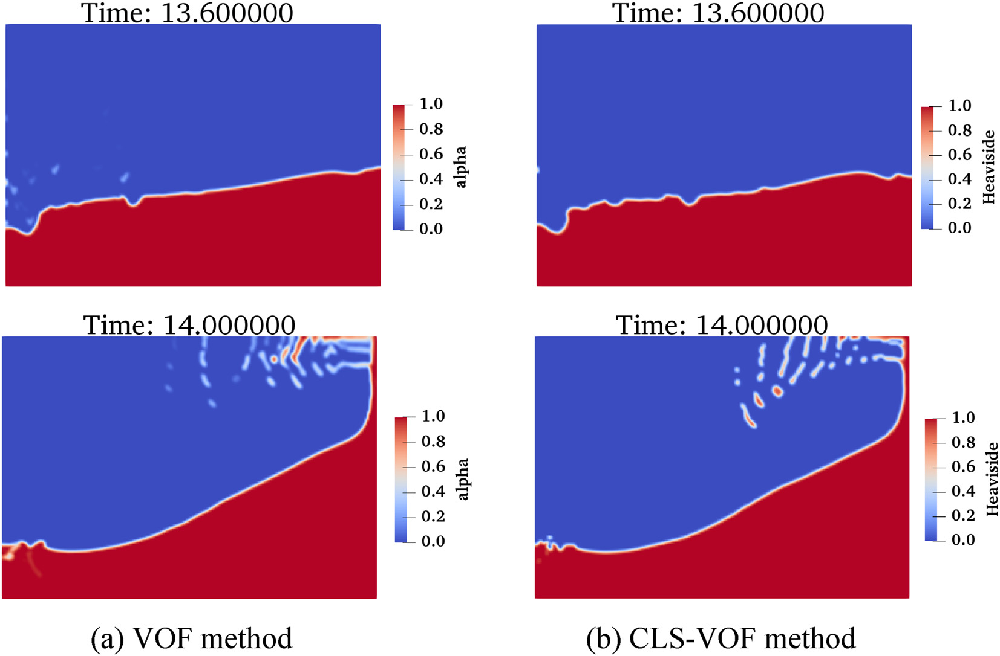

   **图 2** 内部液体非线性振荡特征对比。

   （a）VOF 方法；（b）CLS–VOF 方法。上、下两行分别为 13.60 s 和 14.00 s；色标分别为体积分数和 Heaviside 函数值。

3 内置挡板水箱算例
^^^^^^^^^^^^^^^^^^

本节采用 CLS–VOF 方法，对含竖向挡板水箱中的液体振荡进行数值模拟。矩形水箱的几何尺寸为 :math:`570\times310\times700\,\mathrm{mm}` ， :math:`h=180\,\mathrm{mm}` 。在水箱底部施加外部激励 :math:`x=-A\cos(\omega_e t)` ，其中 :math:`A=100\,\mathrm{mm}` ， :math:`\omega_e=3.5317\,\mathrm{rad/s}` 。竖向挡板高度为 :math:`150\,\mathrm{mm}` ，厚度为 :math:`6\,\mathrm{mm}` ，距水箱左侧壁 :math:`178\,\mathrm{mm}` 。Xue 和 Lin  :ref:`[35] <he2025-pof-ref-35>`  开展了振动台试验，并布置两个波高探针监测自由液面的变化，如图 3 所示。图 4 表明，当前数值模型得到的晃荡响应曲线与试验结果吻合较好，平均相对误差分别为 :math:`13.78\%` 和 :math:`10.84\%` ，验证了模型的准确性。

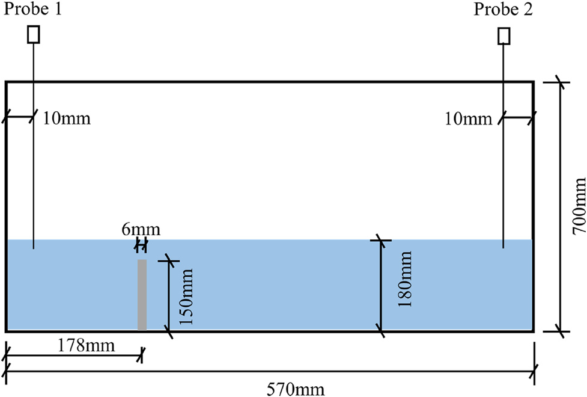

   **图 3** 探针布置示意图。

   Probe 1 和 Probe 2 分别为探针 1、探针 2，位于左右侧壁内侧 10 mm；图内保留水箱、液深、挡板厚度和位置的全部毫米尺寸。

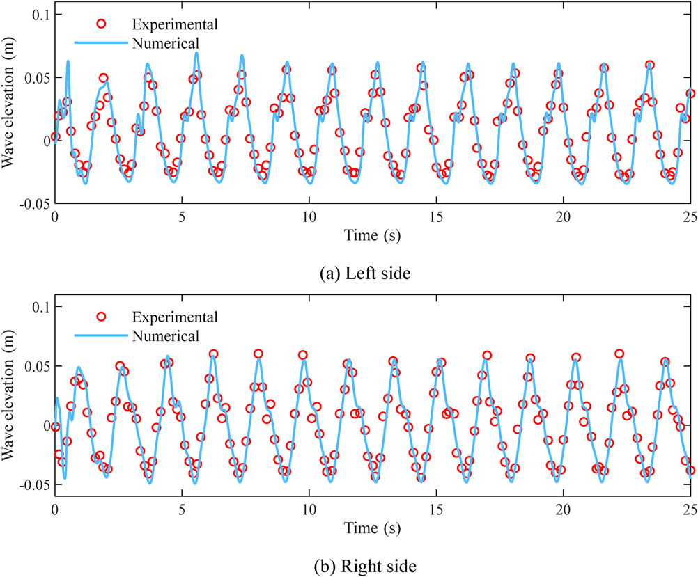

   **图 4** 晃荡波高曲线对比，试验数据来自 Xue 和 Lin。 :ref:`[35] <he2025-pof-ref-35>`

   （a）左侧；（b）右侧。横轴为时间（s），纵轴为波高（m）；Experimental 为试验结果，Numerical 为数值结果。

水箱壁面监测点的压力是认识振荡特征的重要参数。利用 CLS–VOF 数值模型预测不同监测点的壁面压力。矩形水箱和液深 :math:`h` 与前一个算例保持一致。竖向挡板的几何尺寸为 :math:`310\times6\times100\,\mathrm{mm^3}` ，其顶部与自由液面齐平，如图 5 所示。压力监测点 P1 和 P2 分别位于自由液面下方 :math:`115\,\mathrm{mm}` 和 :math:`75\,\mathrm{mm}` 。在水箱底部施加外部激励 :math:`x=-A\cos(\omega_e t)` ，其中 :math:`A=10\,\mathrm{mm}` ， :math:`\omega_e=5.1223\,\mathrm{rad/s}` 。将模拟数据与 Xue 等  :ref:`[19] <he2025-pof-ref-19>`  的振动台试验结果比较，如图 6 所示。液体动力响应曲线表明，CLS–VOF 数值模型与试验数据吻合良好，平均相对误差分别为 :math:`4.73\%` 和 :math:`3.62\%` ，具有较高的预测精度。因此，后续全部模拟均采用该模型。

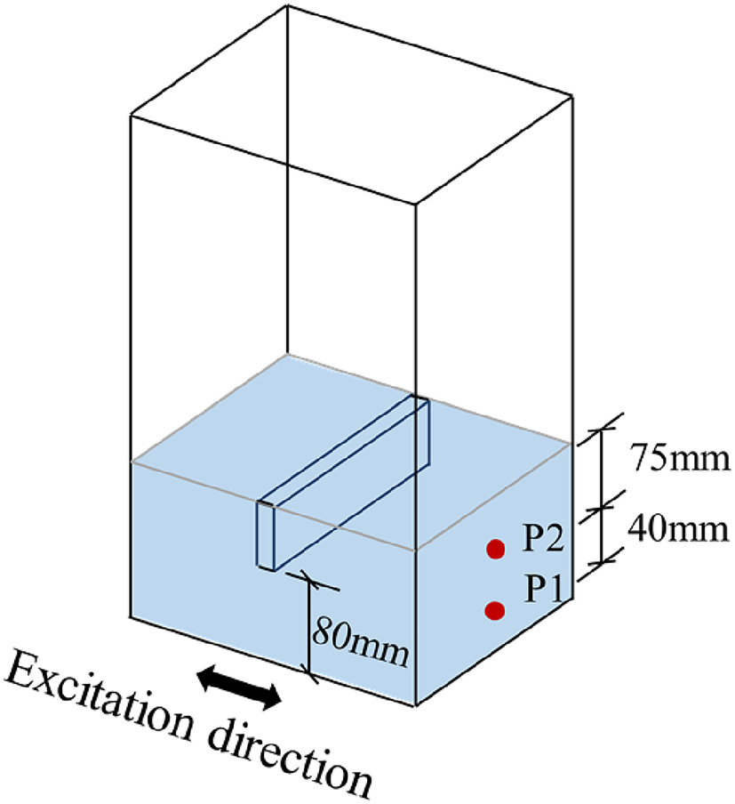

   **图 5** 水箱布置示意图。

   Excitation direction 为激励方向，P1、P2 为压力测点；图内标出挡板底部高度 80 mm、P2 距自由液面 75 mm 以及两测点高差 40 mm。

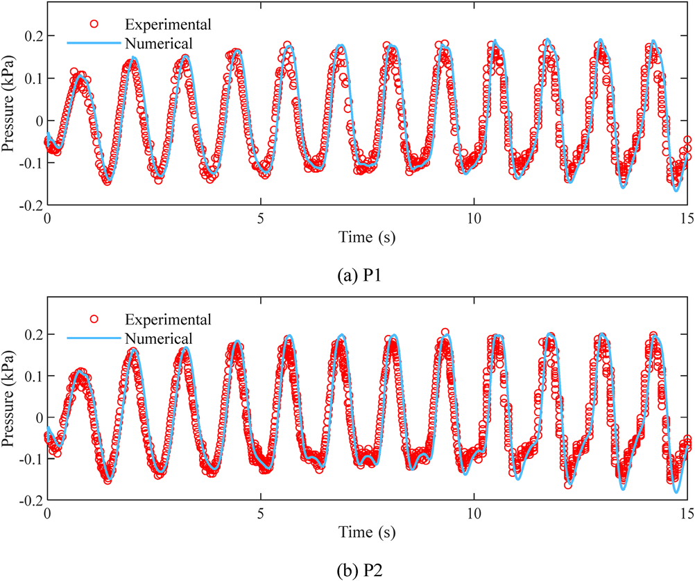

   **图 6** 壁面压力曲线对比，试验结果来自 Xue 等。 :ref:`[19] <he2025-pof-ref-19>`

   （a）P1；（b）P2。横轴为时间（s），纵轴为压力（kPa）；Experimental 为试验结果，Numerical 为数值结果。

4 网格尺寸与时间步长收敛性检验
^^^^^^^^^^^^^^^^^^^^^^^^^^^^^^

本节考察网格尺寸和时间步长的收敛特征。矩形水箱的几何尺寸为 :math:`600\times300\times400\,\mathrm{mm^3}` ， :math:`h=100\,\mathrm{mm}` 。在水箱底部施加简谐激励。水箱模型划分为六面体网格，网格尺寸从 :math:`4\,\mathrm{mm}` 变化至 :math:`8\,\mathrm{mm}` 。图 7 表明，网格尺寸较大时，模拟数据不能准确捕捉波高峰值。网格加密后， :math:`4\,\mathrm{mm}` 和 :math:`5\,\mathrm{mm}` 网格的结果几乎一致。然而， :math:`4\,\mathrm{mm}` 网格的单元数是 :math:`5\,\mathrm{mm}` 网格的两倍，导致计算时间显著增加。图 8 表明，不同时间步长下的波高曲线总体一致。但是，随着振荡幅值增大， :math:`0.007\,\mathrm{s}` 时间步长下的计算无法收敛。综合考虑计算精度与效率，最终采用网格尺寸 :math:`5\,\mathrm{mm}` 、时间步长 :math:`0.005\,\mathrm{s}` 的数值模型。

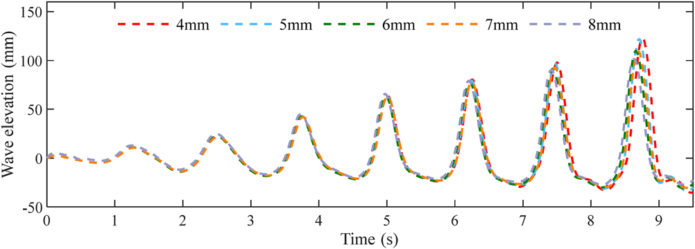

   **图 7** 不同网格尺寸下的晃荡波高对比。

   横轴为时间（s），纵轴为波高（mm）；图例分别为 4、5、6、7、8 mm 网格。

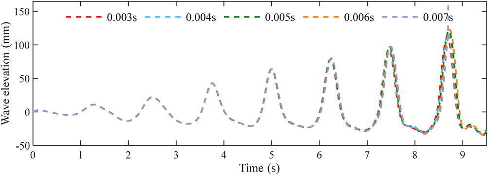

   **图 8** 不同时间步长下的晃荡波高对比。

   横轴为时间（s），纵轴为波高（mm）；图例分别为 0.003、0.004、0.005、0.006、0.007 s。

III 植入式立柱 TLD 的非线性晃荡特征
-----------------------------------

为提高 TLD 的能量耗散效率、优化其固有阻尼，同时满足水箱尺寸过大时的内部支撑需求，本节提出植入式立柱 TLD。通过大量数值模拟，研究水深比 :math:`h/L` 与弹簧效应之间的关系。此外，分析立柱尺寸和频率比对非线性晃荡特征的影响。在水箱底部施加外部激励 :math:`x=-A\sin(\omega_e t)` ，其中 :math:`A=5\,\mathrm{mm}` 。频率比是激励频率与内部液体一阶振荡频率的比值，即 :math:`\beta=\omega_e/\omega_1=0.75\text{–}1.2` 。本研究设置四种不同的水深比 :math:`h/L` 。在水箱 :math:`L/3` 和 :math:`2L/3` 处布置立柱，每列有四根立柱，如图 9 所示。立柱阻塞率定义为：

.. math::

   \Theta=\frac{a}{B}.\qquad (11)

其中， :math:`a` 为立柱截面尺寸， :math:`B` 为水箱宽度。本研究旨在分析液体振荡响应峰值的变化趋势。数值模拟持续 :math:`25\,\mathrm{s}` 。前 :math:`12\,\mathrm{s}` 施加外部激励， :math:`12\text{–}25\,\mathrm{s}` 撤除激励，使内部流体自由衰减。工况 1–4 以液深为变量，在各水深比 :math:`h/L` 下分析四种不同的立柱阻塞率 :math:`\Theta` 。工况 5 和工况 6 改变激励幅值，具体见表 I。

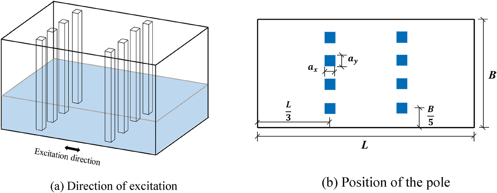

   **图 9** 植入式立柱 TLD 模型示意图。

   （a）激励方向；（b）立柱位置。图中保留水箱长度、宽度、立柱截面尺寸及立柱间距标注。

.. list-table:: 表 I 数值模拟工况设置
   :header-rows: 1
   :widths: 8 21 9 10 20 17 15

   * - 工况
     - 水箱尺寸 :math:`L\times B\times H` （mm）
     - 液深 :math:`h` （mm）
     - 水深比 :math:`h/L`
     - 立柱截面尺寸 :math:`a_x=a_y` （mm）
     - 立柱阻塞率 :math:`\Theta`
     - 激励幅值 :math:`A` （mm）
   * - 工况 1
     - :math:`600\times300\times400`
     - 50
     - 8.33%
     - 6、12、18、24
     - 2%、4%、6%、8%
     - 5
   * - 工况 2
     - :math:`600\times300\times400`
     - 100
     - 16.67%
     - 6、12、18、24
     - 2%、4%、6%、8%
     - 5
   * - 工况 3
     - :math:`600\times300\times400`
     - 150
     - 25%
     - 6、12、18、24
     - 2%、4%、6%、8%
     - 5
   * - 工况 4
     - :math:`600\times300\times400`
     - 200
     - 33.33%
     - 6、12、18、24
     - 2%、4%、6%、8%
     - 5
   * - 工况 5
     - :math:`600\times300\times400`
     - 100
     - 16.67%
     - 12
     - 4%
     - 5、8、10、15
   * - 工况 6
     - :math:`600\times300\times400`
     - 150
     - 25%
     - 24
     - 8%
     - 5、8、10、15

A 立柱截面尺寸的影响
~~~~~~~~~~~~~~~~~~~~

工况 1–4 中采用不同立柱截面尺寸时，液体晃荡响应峰值如图 10 和图 11 所示。水箱内没有立柱扰动时，随着 :math:`h/L` 增大，红色曲线由向右弯曲转为向左弯曲。液体振荡特征由硬弹簧转为软弹簧， :ref:`[36] <he2025-pof-ref-36>`  使共振响应前移，非线性特征也更加明显。水箱内部布置立柱后，液体晃荡行为显著改变。随着立柱阻塞率 :math:`\Theta` 增大，液体晃荡能量显著降低，自由液面上升受到限制。振荡响应大幅减小，呈现线性晃荡，共振响应不发生偏移。然而，当 :math:`\Theta` 达到较大值时，立柱的阻塞作用会将液体分割成多个小区域，使液体振荡频率降低，共振响应提前出现。

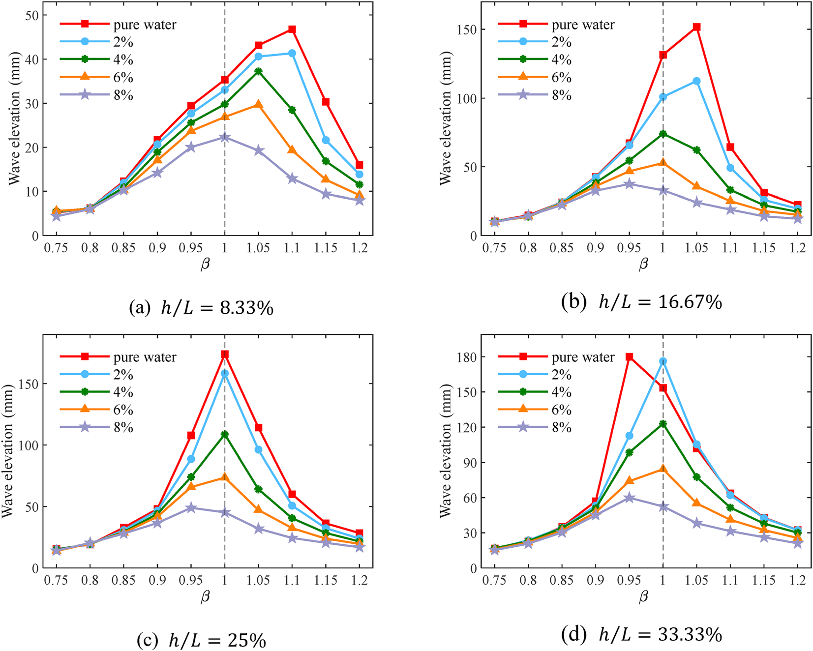

   **图 10** 不同立柱阻塞率下的波高峰值响应对比。

   （a） :math:`h/L=8.33\%` ；（b） :math:`h/L=16.67\%` ；（c） :math:`h/L=25\%` ；（d） :math:`h/L=33.33\%` 。横轴为频率比 :math:`\beta` ，纵轴为波高（mm）；pure water 为纯水，其余图例为 2%、4%、6%、8% 立柱阻塞率。

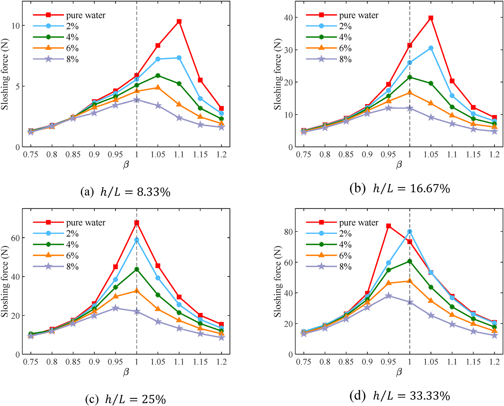

   **图 11** 不同立柱阻塞率下的晃荡力峰值响应对比。

   （a） :math:`h/L=8.33\%` ；（b） :math:`h/L=16.67\%` ；（c） :math:`h/L=25\%` ；（d） :math:`h/L=33.33\%` 。横轴为频率比 :math:`\beta` ，纵轴为晃荡力（N）；pure water 为纯水，其余图例为 2%、4%、6%、8% 立柱阻塞率。

撤除外部简谐激励后，得到晃荡波高的自由衰减曲线，如图 12 所示。采用参数识别方法提取 TLD 的固有阻尼比 :math:`\zeta` 。

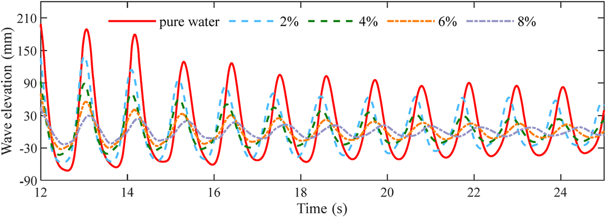

   **图 12** 不同立柱阻塞率下的晃荡波高自由衰减曲线。

   横轴为时间（s），纵轴为波高（mm）；图例为纯水以及阻塞率 2%、4%、6%、8%。

图 13 展示了 :math:`h/L` 和 :math:`\Theta` 对植入式立柱 TLD 固有阻尼比 :math:`\zeta` 的影响。在浅水水箱中，液体振荡剧烈，可能发生波浪破碎，表现出显著的非线性特征。由于液体总质量相对较小，能量耗散效率也相对较低。当 :math:`h/L` 较大时，底部液体不参与振荡，导致水箱容积利用率显著下降，固有阻尼降低。相比之下，中等液深的 TLD 具有更好的耗能性能、更强的鲁棒性和更加稳定的固有阻尼比变化。在水箱内部设置立柱后，增大立柱阻塞率 :math:`\Theta` 可提高固有阻尼比系数，从而显著提高能量耗散效率。

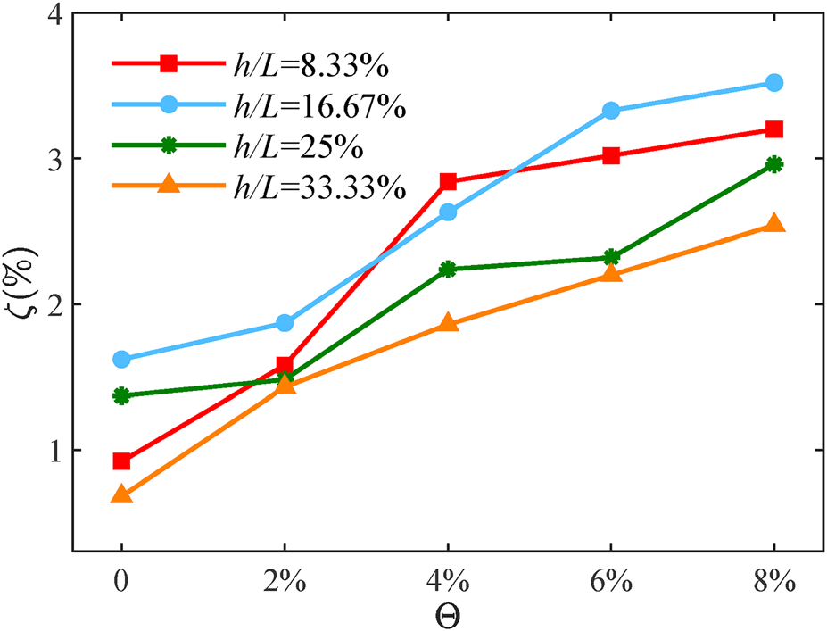

   **图 13** 不同 :math:`h/L` 和 :math:`\Theta` 下植入式立柱 TLD 的 :math:`\zeta` 。

   横轴为立柱阻塞率 :math:`\Theta` ，纵轴为固有阻尼比 :math:`\zeta` （%）；四条曲线依次对应水深比 8.33%、16.67%、25%、33.33%。

内部立柱引起的 :math:`\zeta` 增大，主要与内部液体的振荡特征有关。一方面，植入式立柱的阻塞作用将晃荡液体分割为多个较小区域，打断能量传递路径并抑制自由液面上升，最终降低波高。同时，在立柱的四个尖锐棱边处发生液体分离，形成小涡，加快流速并增加内部能量耗散，如图 14 所示。另一方面，立柱边界与液体之间的黏性相互作用进一步提高能量耗散效率。

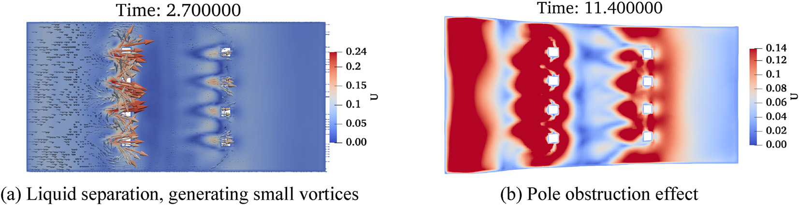

   **图 14** 自由液面速度云图展示植入式立柱对液体振荡的影响。

   （a）液体分离产生小涡，时刻 2.70 s；（b）立柱阻塞效应，时刻 11.40 s。色标 :math:`U` 表示流体速度。

B 激励幅值的影响
~~~~~~~~~~~~~~~~

激励幅值反映输入能量的大小，并显著影响振荡特征。本节分析不同激励幅值下的液体动力响应。水箱尺寸保持不变， :math:`h/L` 和 :math:`\Theta` 采用工况 5 和工况 6 的设置。激励幅值 :math:`A` 分别为 :math:`5\,\mathrm{mm}` 、 :math:`8\,\mathrm{mm}` 、 :math:`10\,\mathrm{mm}` 和 :math:`15\,\mathrm{mm}` 。液体晃荡响应峰值如图 15 和图 16 所示。随着 :math:`A` 增大，波高和晃荡力均显著增大。振荡能量逐步积累，导致晃荡波形叠加。自由液面开始破碎，如图 17 所示。同时，波速增大，晃荡周期减小，共振响应滞后，产生硬弹簧效应。

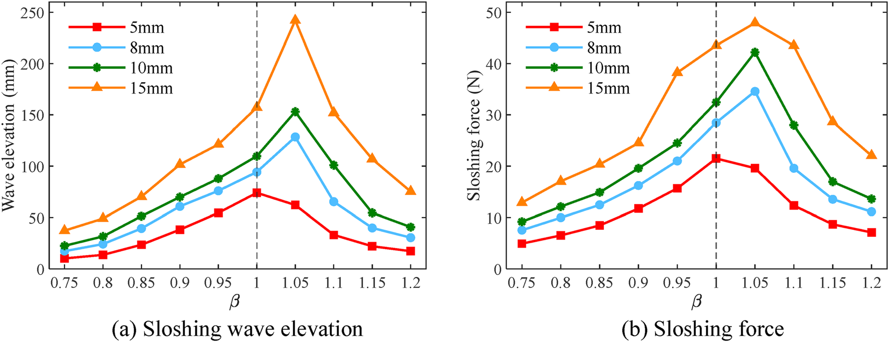

   **图 15** :math:`h/L=16.67\%` 、 :math:`\Theta=4\%` 时液体晃荡响应峰值。

   （a）晃荡波高（mm）；（b）晃荡力（N）。横轴为频率比 :math:`\beta` ，图例为 5、8、10、15 mm 激励幅值。

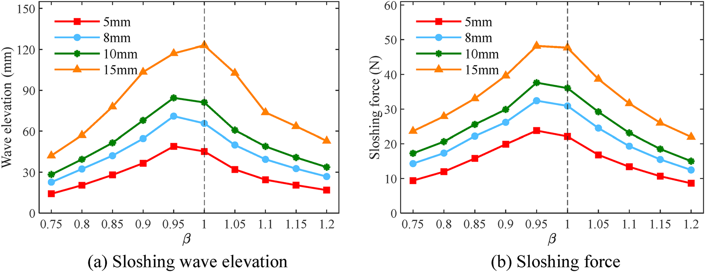

   **图 16** :math:`h/L=25\%` 、 :math:`\Theta=8\%` 时液体晃荡响应峰值。

   （a）晃荡波高（mm）；（b）晃荡力（N）。横轴为频率比 :math:`\beta` ，图例为 5、8、10、15 mm 激励幅值。

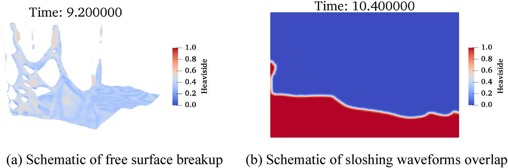

   **图 17** 大激励幅值下的非线性振荡特征。

   （a）自由液面破碎示意，时刻 9.20 s；（b）晃荡波形叠加示意，时刻 10.40 s。色标为 Heaviside 函数值。

图 18 展示了不同激励幅值下 TLD 能量耗散效率的变化。固有阻尼比 :math:`\zeta` 随着 :math:`A` 增大而提高。当 :math:`h/L` 和 :math:`\Theta` 较小时，液体振荡更加剧烈，发生波浪破碎，并表现出更加明显的非线性特征。这些变化增强了能量耗散机制，使 :math:`\zeta` 显著增大。这进一步说明 :math:`h/L` 对振荡特征具有重要影响。

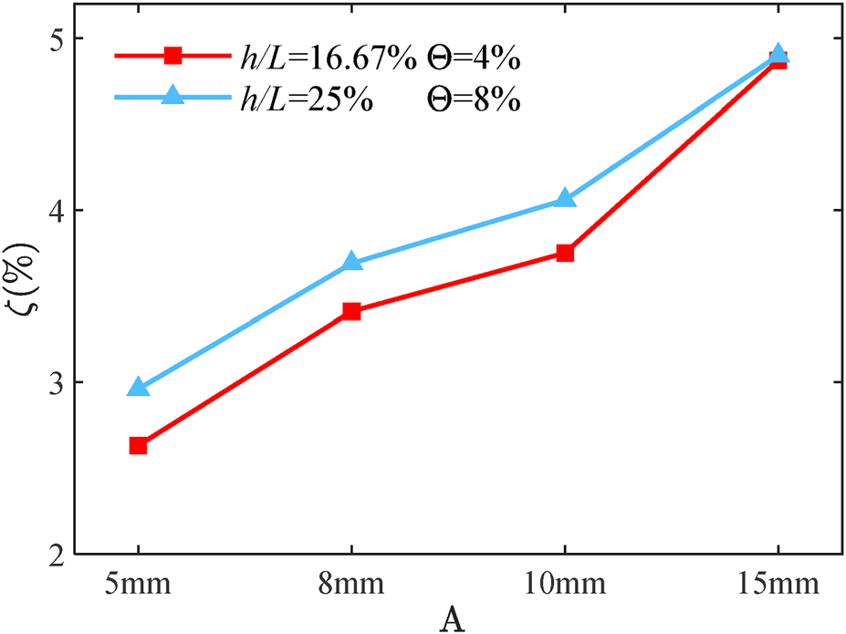

   **图 18** 不同激励幅值下植入式立柱 TLD 的能量耗散效率。

   横轴为激励幅值 :math:`A` ，纵轴为固有阻尼比 :math:`\zeta` （%）；两条曲线分别对应 :math:`h/L=16.67\%,\Theta=4\%` 和 :math:`h/L=25\%,\Theta=8\%` 。

IV 结构–TLD 系统的双向耦合算法
------------------------------

TLD 内部液体在大幅激励下呈现明显的非线性行为，使等效理论模型难以准确预测减振效率。此外，采用振动台试验研究结构–TLD 系统时，结果受到场地条件和模型参数的限制。 :ref:`[37] <he2025-pof-ref-37>`  CFD 方法能够准确捕捉液体晃荡响应，流固相互作用数值模型也已取得显著进展。然而，这类模型建立复杂、计算效率较低，限制了其在复杂结构耦合系统研究中的应用。 :ref:`[38] <he2025-pof-ref-38>`  为解决这些问题，本节通过 OpenFOAM 二次开发提出双向耦合数值模型。该耦合模型能够准确捕捉液体振荡与结构动力响应之间的相互作用。采用试验数据验证双向耦合数值模型的精度。

A 耦合原理
~~~~~~~~~~

外部激励作用下结构–TLD 系统的运动方程定义如下：

.. math::

   M_s\ddot X_s+C_s\dot X_s+K_sX_s=F_e+F_{\mathrm{TLD}}.\qquad (12)

其中， :math:`M_s` 、 :math:`C_s` 和 :math:`K_s` 分别为结构的质量、阻尼和刚度。 :math:`\ddot X_s` 为结构加速度， :math:`F_e` 为外部荷载。 :math:`F_{\mathrm{TLD}}` 为 TLD 内部液体产生的晃荡力。

.. math::

   F_{\mathrm{TLD}}=\int_S(-p\mathbf n+\boldsymbol\tau\cdot\mathbf n)\,\mathrm dS.\qquad (13)

其中， :math:`p` 为流体压力， :math:`\boldsymbol\tau` 为黏性应力张量， :math:`\boldsymbol\tau=\mu[\nabla U+(\nabla U)^{\mathrm T}]` ； :math:`\mu` 为动力黏度系数， :math:`U` 为流体速度， :math:`S` 为水箱内壁表面。结构部分采用数值积分法求解位移响应。液体部分在 OpenFOAM 中离散控制方程，使用 CLS–VOF 方法捕捉振荡响应并计算晃荡力。通过通信接口函数实现实时数据交换，如图 19 所示。该双向耦合数值模型无需生成复杂的结构网格，简化了流固相互作用边界条件的建立，可以快速计算整个系统的振动响应，降低计算资源需求和计算时间，并提高整体计算效率。

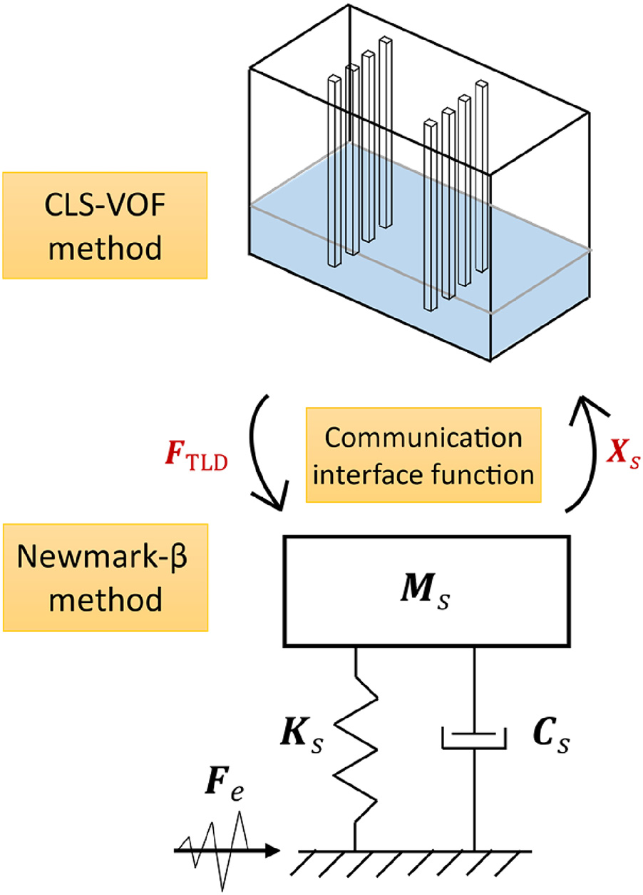

   **图 19** 双向耦合数值模型示意图。

   CLS–VOF method 为 CLS–VOF 方法；Newmark-β method 为 Newmark-β 方法；Communication interface function 为通信接口函数。传递量为液体晃荡力 :math:`F_{\mathrm{TLD}}` 和结构位移 :math:`X_s` ，结构模型含质量 :math:`M_s` 、刚度 :math:`K_s` 、阻尼 :math:`C_s` 及外部荷载 :math:`F_e` 。

B 双向耦合数值模型的验证
~~~~~~~~~~~~~~~~~~~~~~~~

本节研究纯水 TLD 减小 SDOF 框架结构位移响应的有效性，并与 Dou 等  :ref:`[39] <he2025-pof-ref-39>`  的试验数据比较。矩形水箱的几何尺寸为 :math:`510\times150\times470\,\mathrm{mm^3}` ， :math:`h=178.5\,\mathrm{mm}` 。在 SDOF 框架结构上安装空水箱后，结构频率为 :math:`1.9\,\mathrm{Hz}` 。在 SDOF 框架结构底部施加共振激励，激励幅值为 :math:`3\,\mathrm{mm}` 。TLD 控制下 SDOF 框架结构的顶部位移响应如图 20 所示。液体振荡响应对比如图 21 所示。此外，图 22 展示了所捕捉自由液面的对比。双向耦合数值模型的结果与试验数据吻合，平均相对误差分别为 :math:`5.26\%` 和 :math:`13.91\%` 。此外，该模型的计算时间为 :math:`4632\,\mathrm{s}` ，而标准流固相互作用方法需要 :math:`5218\,\mathrm{s}` ，计算时间显著减少。自由液面的卷起和破碎使液滴脱离表面，导致液体振荡曲线的局部峰值发生变化。模型有效捕捉了自由液面运动，显示出较高的准确性。

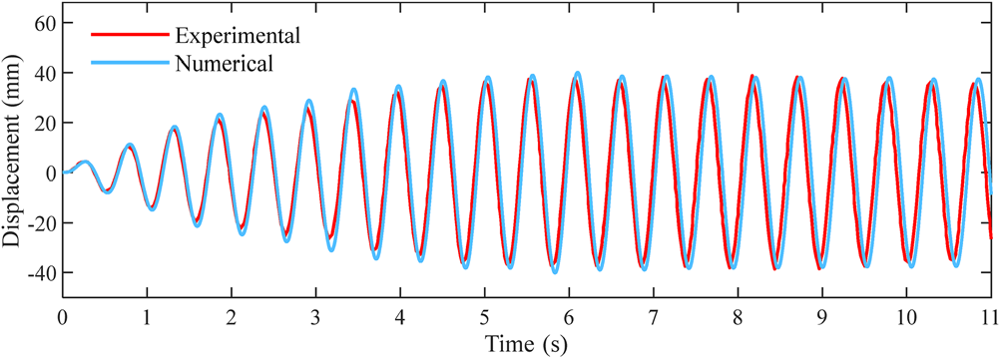

   **图 20** 结构动力响应对比，试验数据来自 Dou 等。 :ref:`[39] <he2025-pof-ref-39>`

   横轴为时间（s），纵轴为位移（mm）；Experimental 为试验结果，Numerical 为数值结果。

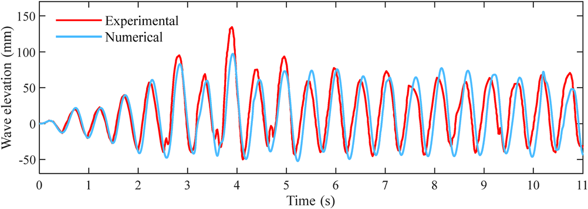

   **图 21** 晃荡波高曲线对比，试验数据来自 Dou 等。 :ref:`[39] <he2025-pof-ref-39>`

   横轴为时间（s），纵轴为波高（mm）；Experimental 为试验结果，Numerical 为数值结果。

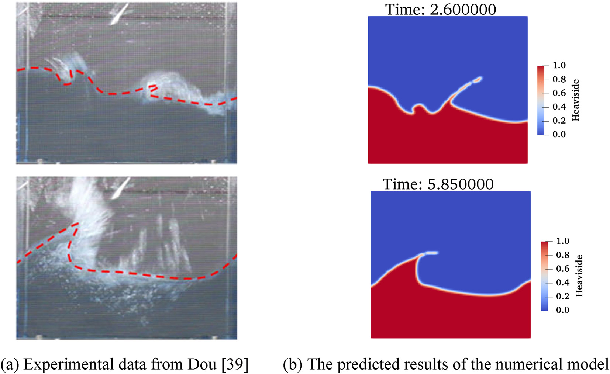

   **图 22** 自由液面捕捉结果对比。

   （a）Dou 等的试验数据  :ref:`[39] <he2025-pof-ref-39>` ；（b）数值模型预测结果。上、下两行分别对应 2.60 s 和 5.85 s；色标为 Heaviside 函数值。

C 不同 TLD 的减振性能
~~~~~~~~~~~~~~~~~~~~~

保持 SDOF 框架结构参数、水箱几何尺寸、激励频率和激励幅值不变。在水箱内部 :math:`L/3` 和 :math:`2L/3` 处增设立柱，每列四根，每根截面尺寸为 :math:`18\,\mathrm{mm}` 。图 23 比较了有、无 TLD 控制时的顶部位移响应。内置立柱提高了 TLD 的能量耗散效率。因此，框架结构的顶部最大位移相对未控结构降低 :math:`85.2\%` 。

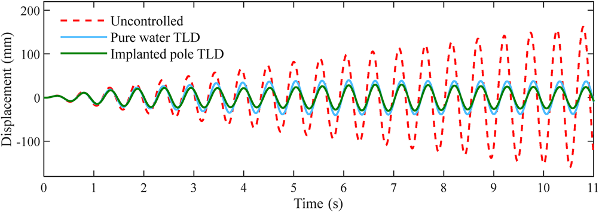

   **图 23** 有、无 TLD 控制时结构顶部动力响应对比。

   横轴为时间（s），纵轴为位移（mm）；Uncontrolled 为未控结构，Pure water TLD 为纯水 TLD，Implanted pole TLD 为植入式立柱 TLD。

V TLD 对高层建筑的减振效率
--------------------------

A 结构参数
~~~~~~~~~~

采用双向耦合数值模型，进一步研究装有足尺 TLD 的高层建筑风致振动响应控制。选取风洞试验研究中常用的 CAARC 建筑模型进行分析。

该建筑模型高度为 :math:`182.88\,\mathrm{m}` ，平面长度为 :math:`45.72\,\mathrm{m}` ，宽度为 :math:`30.48\,\mathrm{m}` 。根据 NIST 网站提供的建筑结构信息，建立并调整有限元分析模型。结构总质量为 :math:`86861.6\,\mathrm{t}` ，假定固有阻尼比为 :math:`0.02` 。前三阶模态频率及对应振型分别为： :math:`0.174\,\mathrm{Hz}` ，沿 Y 轴平动； :math:`0.187\,\mathrm{Hz}` ，沿 X 轴平动； :math:`0.232\,\mathrm{Hz}` ，绕 Z 轴扭转。开展缩尺比为 :math:`1:200` 的 CAARC 模型测压试验，采用六个不同风向角，如图 24 所示。

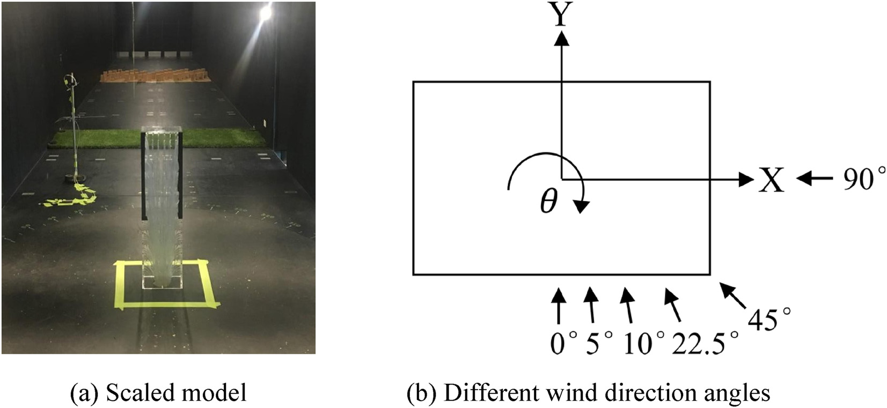

   **图 24** CAARC 模型测压试验示意图。

   （a）缩尺模型；（b）不同风向角，分别为 :math:`0^\circ` 、 :math:`5^\circ` 、 :math:`10^\circ` 、 :math:`22.5^\circ` 、 :math:`45^\circ` 、 :math:`90^\circ` 。

B 植入式立柱 TLD 减振
~~~~~~~~~~~~~~~~~~~~~

风荷载作用下，高层建筑容易发生过大振动，可能使居住者产生恐慌和焦虑，影响其舒适度。在建筑顶部安装 TLD 可以为结构提供附加阻尼，有效减小结构动力响应。本节研究植入式立柱 TLD 对结构动力响应的减振作用。结构域采用集中质量法，每个质点同时考虑平动与转动自由度。相应的计算分析模型如图 25 所示。首先根据 CAARC 建筑的顶部尺寸和固有频率，初步确定植入式立柱 TLD 的参数，见表 II。

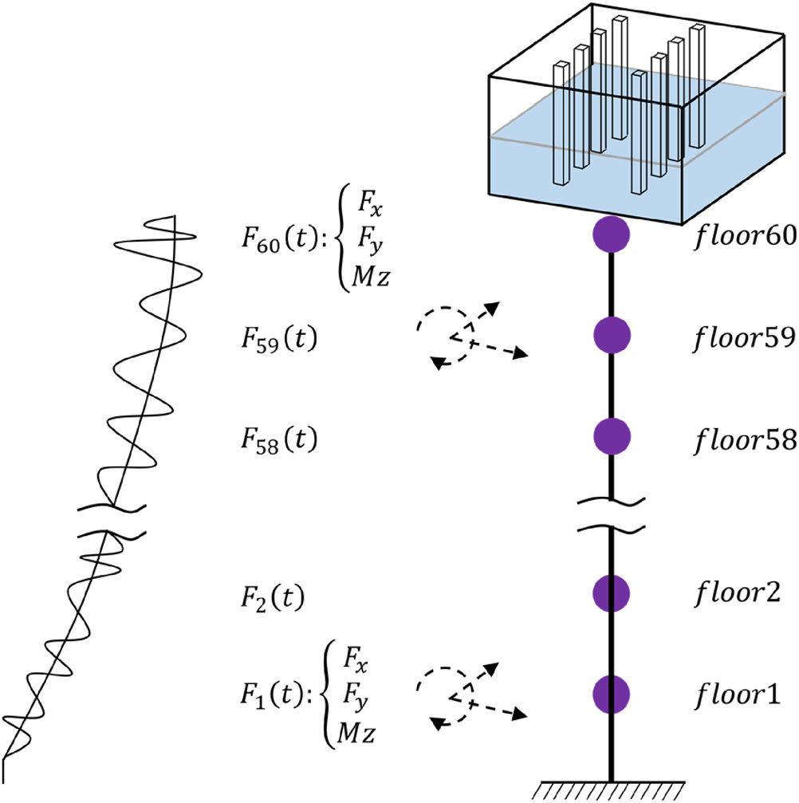

   **图 25** 建筑–TLD 分析模型示意图。

   floor1 至 floor60 为第 1 至第 60 层；各层荷载 :math:`F_i(t)` 包含两个水平力分量 :math:`F_x` 、 :math:`F_y` 及扭矩 :math:`M_z` ，TLD 位于建筑顶部。

.. list-table:: 表 II 植入式立柱 TLD 的设计参数
   :header-rows: 1
   :widths: 22 12 12 10 20 12 12

   * - 水箱尺寸 :math:`L\times B\times H` （m）
     - 液深 :math:`h` （m）
     - 液体质量（t）
     - 质量比
     - 立柱截面尺寸 :math:`a_x=a_y` （m）
     - 晃荡频率 :math:`f_x` （Hz）
     - 晃荡频率 :math:`f_y` （Hz）
   * - :math:`13.29\times14.42\times6`
     - 2.9
     - 555.76
     - 0.64%
     - 0.3
     - 0.187
     - 0.174

研究结果表明，在 10 年重现期风荷载作用下， :math:`5^\circ` 风向的加速度响应 :math:`A_x` 达到峰值， :math:`90^\circ` 风向的 :math:`A_y` 达到最大值。植入式立柱 TLD 提高了结构固有阻尼。振动响应 :math:`A_x` 从 :math:`0.3163\,\mathrm{m/s^2}` 降至 :math:`0.2398\,\mathrm{m/s^2}` ， :math:`A_y` 从 :math:`0.4683\,\mathrm{m/s^2}` 降至 :math:`0.3902\,\mathrm{m/s^2}` 。同样，峰值位移响应 :math:`D_x` 从 :math:`0.2443\,\mathrm{m}` 降至 :math:`0.203\,\mathrm{m}` ， :math:`D_y` 从 :math:`0.4184\,\mathrm{m}` 降至 :math:`0.3457\,\mathrm{m}` 。植入式立柱 TLD 能够有效控制平动动力响应，但对 Z 方向的影响很小。

C 立柱阻塞率的影响
~~~~~~~~~~~~~~~~~~

TLD 依靠内部液体振荡吸收和耗散振动能量，加入立柱可提高其能量耗散效率。本节研究不同立柱阻塞率 :math:`\Theta` ，设置见表 III。选取峰值因子 :math:`2.5` ，分析结构动力响应峰值与均方根（root mean square，RMS）值的变化。可以通过分析结构动力响应的减振率 :math:`\eta` 评估 TLD 的减振性能。

.. math::

   \eta=1-\frac{R}{R_o}.\qquad (14)

其中， :math:`R` 为 TLD 控制下的振动响应， :math:`R_o` 为无 TLD 控制时的振动响应。

.. list-table:: 表 III 立柱阻塞率设置
   :header-rows: 1
   :widths: 26 15 27 16 16

   * - 水箱尺寸 :math:`L\times B\times H` （m）
     - 液深 :math:`h` （m）
     - 立柱截面尺寸 :math:`a_x=a_y` （m）
     - 立柱阻塞率 :math:`\Theta_x`
     - 立柱阻塞率 :math:`\Theta_y`
   * - :math:`13.29\times14.42\times6`
     - 2.9
     - 0
     - 0
     - 0
   * - :math:`13.29\times14.42\times6`
     - 2.9
     - 0.3
     - 2.08%
     - 2.26%
   * - :math:`13.29\times14.42\times6`
     - 2.9
     - 0.6
     - 4.16%
     - 4.51%
   * - :math:`13.29\times14.42\times6`
     - 2.9
     - 0.8
     - 5.55%
     - 6.02%

图 26 展示了不同 :math:`\Theta` 下 TLD 减振效率的变化。与纯水 TLD 相比，内部立柱增大固有阻尼，显著提高能量耗散效率，减振率 :math:`\eta` 增至两倍。然而，随着立柱尺寸增大， :math:`\eta` 的提高速度逐渐减小。这是因为立柱尺寸过大时，内部液体的往复运动受到显著限制，振荡能量降低，导致减振效率的增长放缓。

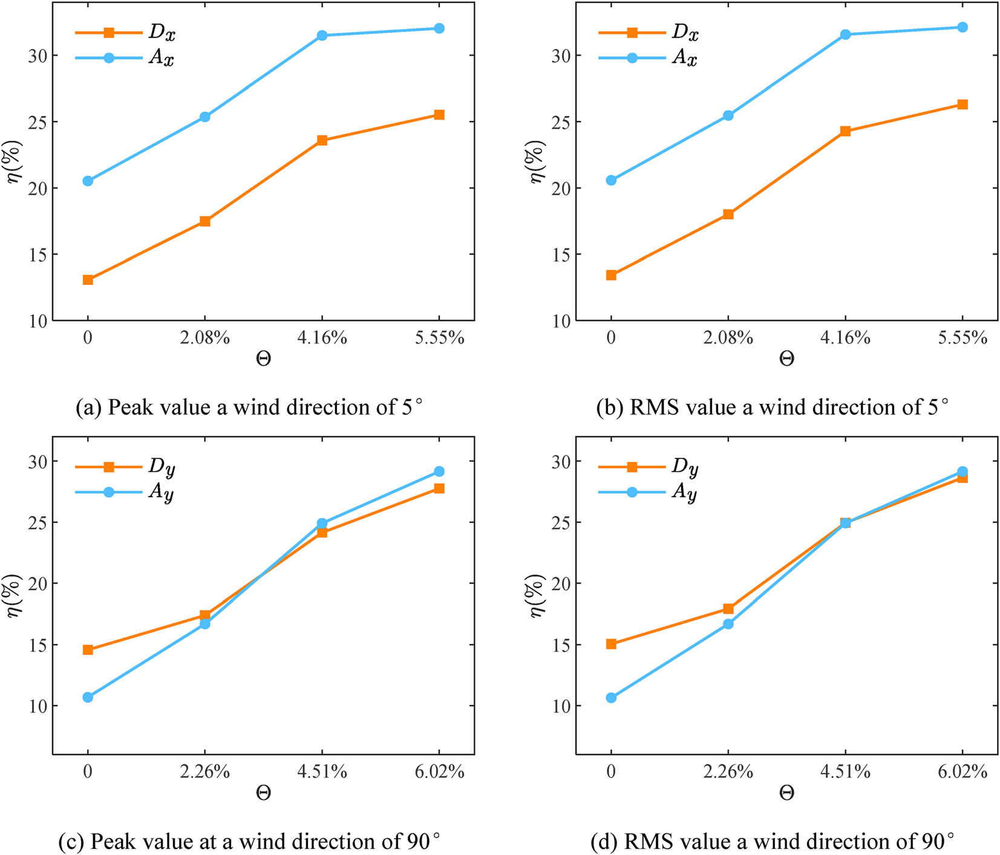

   **图 26** 不同 :math:`\Theta` 下减振率 :math:`\eta` 的对比。

   （a） :math:`5^\circ` 风向下的峰值；（b） :math:`5^\circ` 风向下的 RMS 值；（c） :math:`90^\circ` 风向下的峰值；（d） :math:`90^\circ` 风向下的 RMS 值。横轴为阻塞率，纵轴为减振率（%）； :math:`D_x,D_y` 为位移响应， :math:`A_x,A_y` 为加速度响应。

D 立柱位置的影响
~~~~~~~~~~~~~~~~

水箱内部立柱不仅提供支撑，还可以提高能量耗散效率。本节研究立柱布置对减振效率的影响。具体而言，保持水箱参数不变，分别按工况 X 和工况 Y 布置立柱，如图 27 所示。

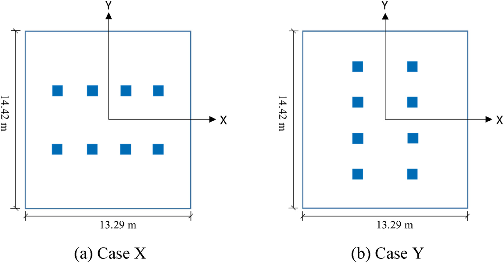

   **图 27** 不同立柱位置示意图。

   （a）工况 X；（b）工况 Y。图中水箱两个水平方向尺寸分别为 13.29 m 和 14.42 m，并保留 X、Y 坐标及全部立柱位置。

如图 28 所示，在 :math:`5^\circ` 风向角下，立柱位置对振动控制性能的影响很小。然而，在 :math:`90^\circ` 风向角下，工况 X 的减振率 :math:`\eta` 显著更高。另一方面，工况 Y 中的内部晃荡液体撞击水箱顶板，使自由界面剧烈破碎，对 TLD 的减振性能及稳定运行均产生不利影响。

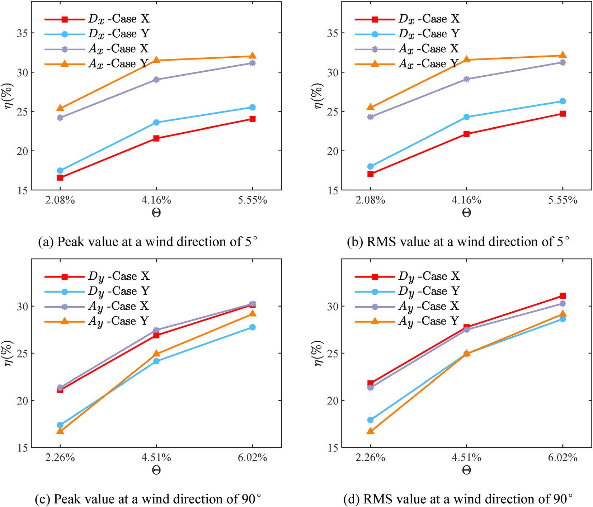

   **图 28** 不同立柱位置下减振率 :math:`\eta` 的对比。

   （a） :math:`5^\circ` 风向下的峰值；（b） :math:`5^\circ` 风向下的 RMS 值；（c） :math:`90^\circ` 风向下的峰值；（d） :math:`90^\circ` 风向下的 RMS 值。横轴为阻塞率 :math:`\Theta` ，纵轴为减振率（%）；图例区分工况 X、工况 Y 的位移和加速度响应。

E 调谐比的影响
~~~~~~~~~~~~~~

通过调整 TLD 的振荡频率，使其与结构频率相匹配，可以有效吸收振动能量，从而减小结构振动响应。调谐比 :math:`\Omega` 是影响 TLD 减振效率的关键参数。

.. math::

   \Omega=\frac{\omega_{\mathrm{TLD}}}{\omega_s}.\qquad (15)

液深和质量比保持不变。立柱截面尺寸为 :math:`0.6\,\mathrm{m}` ，沿 X 方向布置。通过改变水箱几何尺寸控制 :math:`\omega_{\mathrm{TLD}}` 。图 29 展示了高层建筑峰值响应和 RMS 响应减振率 :math:`\eta` 的变化趋势。在 :math:`\pm5\%` 的调谐范围内，植入式立柱 TLD 表现出良好的鲁棒性，提供附加阻尼，显著提高结构振动的能量耗散效率。在 :math:`5^\circ` 风向下，调谐比为 :math:`0.978` 时 :math:`\eta` 达到最大值，CAARC 建筑模型的动力响应如图 30 所示。同样，在 Y 方向调谐比为 :math:`0.946` 时， :math:`90^\circ` 风向下的结构风致响应显著降低，如图 31 所示。风致振动响应时程进一步表明，选择最优调谐比，可以使植入式立柱 TLD 显著减小高层建筑的加速度响应，从而改善居住者舒适度。

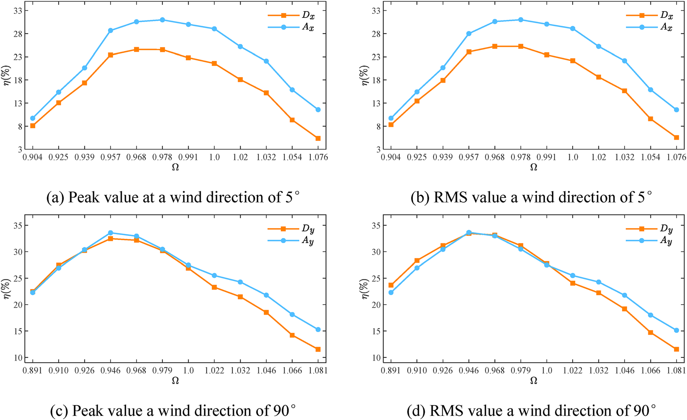

   **图 29** 不同 :math:`\Omega` 下减振率 :math:`\eta` 的对比。

   （a） :math:`5^\circ` 风向下的峰值；（b） :math:`5^\circ` 风向下的 RMS 值；（c） :math:`90^\circ` 风向下的峰值；（d） :math:`90^\circ` 风向下的 RMS 值。横轴为调谐比 :math:`\Omega` ，纵轴为减振率（%）；橙色为位移响应，蓝色为加速度响应。

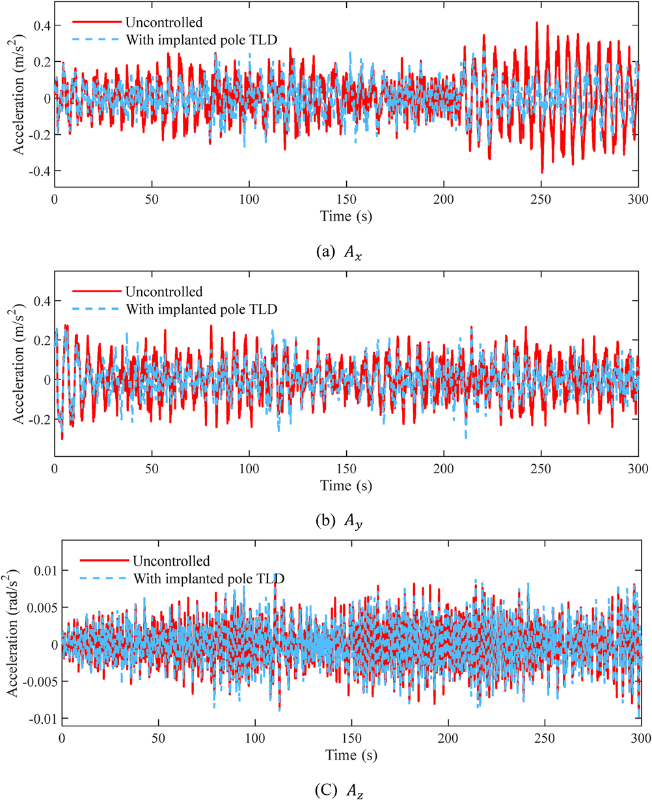

   **图 30** :math:`5^\circ` 风荷载下建筑的风致振动响应。

   （a） :math:`A_x` ；（b） :math:`A_y` ；（c） :math:`A_z` 。横轴为时间（s），前两个分图纵轴为平动加速度（m/s²），第三个为扭转角加速度（rad/s²）。Uncontrolled 为未控结构，With implanted pole TLD 为设置植入式立柱 TLD。

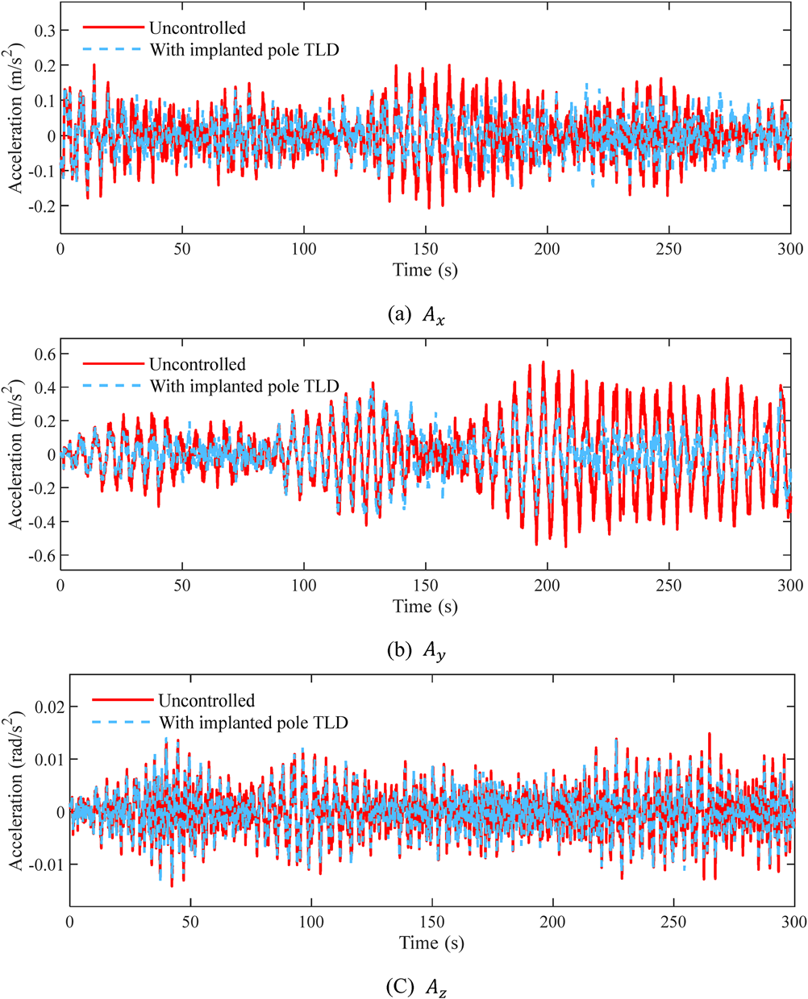

   **图 31** :math:`90^\circ` 风荷载下建筑的风致振动响应。

   （a） :math:`A_x` ；（b） :math:`A_y` ；（c） :math:`A_z` 。横轴为时间（s），前两个分图纵轴为平动加速度（m/s²），第三个为扭转角加速度（rad/s²）。Uncontrolled 为未控结构，With implanted pole TLD 为设置植入式立柱 TLD。

VI 结论
-------

本研究采用 CFD 方法，数值研究植入式立柱 TLD 的液体振荡特征及结构动力响应控制。首先，利用 OpenFOAM 建立 TLD 数值模型。通过耦合水平集方法与 VOF 方法，改进两相流求解器，有效预测非线性晃荡特征。利用试验数据验证模型精度，并全面研究立柱尺寸、液深和激励幅值的影响。此外，开发结构–TLD 系统的双向耦合算法，实现结构振动和 TLD 液体振荡响应的联合分析。双向耦合数值模型消除了结构域网格生成的复杂性，简化了流固相互作用边界条件的处理，从而减少计算资源和时间。模拟结果与试验数据吻合良好。最后，进一步研究植入式立柱 TLD 控制下高层建筑的风致振动，重点考察调谐比 :math:`\Omega` 、立柱阻塞率 :math:`\Theta` 和立柱位置对 TLD 减振效率 :math:`\eta` 的影响。主要结论如下。

1. CLS–VOF 方法结合了水平集和 VOF 两种两相流分析技术的优点。该耦合有助于准确计算界面法向和曲率，有效抑制伪流，显著提高界面捕捉精度。

2. 水深比 :math:`h/L` 显著影响 TLD 的振荡特征。随着 :math:`h` 增大，系统由硬弹簧效应转为软弹簧效应，使共振响应前移。

3. 在水箱内部布置立柱后，阻塞作用打断液体振荡能量的传递路径，有效抑制晃荡波高。此外，液体分离在立柱尖角处产生小涡，立柱表面与液体的黏性相互作用进一步增强能量耗散机制。这些共同作用使 TLD 的固有阻尼比显著提高。

4. 植入式立柱 TLD 显示出良好的结构动力响应控制能力。对于 SDOF 结构，共振激励下的峰值位移响应相对未控结构降低 :math:`85.2\%` 。在 10 年重现期风荷载作用下，植入式立柱 TLD 显著减小高层建筑的平动响应，而对绕 Z 轴的扭转动力响应影响很小。随着立柱阻塞率 :math:`\Theta` 增大，减振率 :math:`\eta` 上升，但增长速度逐渐减小。在 :math:`\pm5\%` 的调谐范围内，植入式立柱 TLD 具有良好的鲁棒性，提供附加阻尼，显著提高结构振动的能量耗散效率。

本研究主要考察矩形立柱在 TLD 中的应用。未来研究可以扩展到更多立柱形状，例如圆形、流线型和菱形立柱，以及倒角或端部开槽的矩形立柱。研究目标是考察不同立柱形状之间的减振性能差异及其对液体晃荡特征的影响，从而为工程师提供更多 TLD 设计与优化选择。

参考文献
--------

.. _he2025-pof-ref-1:

[1] L. G. Griffis, “Serviceability limit states under wind load,” Eng. J. 30, 1 (1993). https://doi.org/10.62913/engj.v30i1.606.

.. _he2025-pof-ref-2:

[2] P. Irwin, J. Kilpatrick, J. Robinson, and A. Frisque, “Wind and tall buildings: Negatives and positives,” Struct. Des. Tall Build. 17, 915–928 (2008). https://doi.org/10.1002/tal.482.

.. _he2025-pof-ref-3:

[3] J. T. P. Yao, “Concept of structural control,” J. Struct. Div. 98, 1567–1574 (1972). https://doi.org/10.1061/JSDEAG.0003280.

.. _he2025-pof-ref-4:

[4] M. Jafari and A. Alipour, “Methodologies to mitigate wind-induced vibration of tall buildings: A state-of-the-art review,” J. Build. Eng. 33, 101582 (2021). https://doi.org/10.1016/j.jobe.2020.101582.

.. _he2025-pof-ref-5:

[5] L. Yang, B. Li, Y. Dong, Z. Hu, K. Zhang, and S. Li, “Large-amplitude rotation of floating offshore wind turbines: A comprehensive review of causes, consequences, and solutions,” Renewable Sustainable Energy Rev. 211, 115295 (2025). https://doi.org/10.1016/j.rser.2024.115295.

.. _he2025-pof-ref-6:

[6] J. A. Hamelin, J. S. Love, M. J. Tait, and J. C. Wilson, “Tuned liquid dampers with a Keulegan–Carpenter number-dependent screen drag coefficient,” J. Fluids Struct. 43, 271–286 (2013). https://doi.org/10.1016/j.jfluidstructs.2013.09.006.

.. _he2025-pof-ref-7:

[7] S. M. Zahrai, S. Abbasi, B. Samali, and Z. Vrcelj, “Experimental investigation of utilizing TLD with baffles in a scaled down 5-story benchmark building,” J. Fluids Struct. 28, 194–210 (2012). https://doi.org/10.1016/j.jfluidstructs.2011.08.016.

.. _he2025-pof-ref-8:

[8] S. Kaneko and O. Yoshida, “Modeling of deepwater-type rectangular tuned liquid damper with submerged nets,” J. Pressure Vessel Technol. 121, 413–422 (1999). https://doi.org/10.1115/1.2883724.

.. _he2025-pof-ref-9:

[9] K. P. McNamara, J. S. Love, M. J. Tait, and T. C. Haskett, “Response of an annular tuned liquid damper equipped with damping screens,” J. Vib. Acoust. 143, 011011 (2021). https://doi.org/10.1115/1.4047863.

.. _he2025-pof-ref-10:

[10] M. Xue, Z. Cao, X. Yuan, J. Zheng, and P. Lin, “A two-dimensional semi-analytic solution on two-layered liquid sloshing in a rectangular tank with a horizontal elastic baffle,” Phys. Fluids 35, 062116 (2023). https://doi.org/10.1063/5.0153071.

.. _he2025-pof-ref-11:

[11] Z. Zhang, “Numerical and experimental investigations of the sloshing modal properties of sloped-bottom tuned liquid dampers for structural vibration control,” Eng. Struct. 204, 110042 (2020). https://doi.org/10.1016/j.engstruct.2019.110042.

.. _he2025-pof-ref-12:

[12] J. S. Love and M. J. Tait, “Linearized sloshing model for 2D tuned liquid dampers with modified bottom geometries,” Can. J. Civ. Eng. 41, 106–117 (2014). https://doi.org/10.1139/cjce-2013-0106.

.. _he2025-pof-ref-13:

[13] M. J. Tait, A. A. El Damatty, and N. Isyumov, “An investigation of tuned liquid dampers equipped with damping screens under 2D excitation,” Earthq. Eng. Struct. Dyn. 34, 719–735 (2005). https://doi.org/10.1002/eqe.452.

.. _he2025-pof-ref-14:

[14] J. R. Cho, H. W. Lee, and S. Y. Ha, “Finite element analysis of resonant sloshing response in 2-D baffled tank,” J. Sound Vib. 288, 829–845 (2005). https://doi.org/10.1016/j.jsv.2005.01.019.

.. _he2025-pof-ref-15:

[15] R. O. Ruiz, D. Lopez-Garcia, and A. A. Taflanidis, “An efficient computational procedure for the dynamic analysis of liquid storage tanks,” Eng. Struct. 85, 206–218 (2015). https://doi.org/10.1016/j.engstruct.2014.12.011.

.. _he2025-pof-ref-16:

[16] W. Tsao, W. Hwang, W. Huang, and Y. Huang, “Physics-based reduced-order modeling and experimental verification of a nonlinear porous-media tuned liquid damper for seismic vibration control,” Ocean Eng. 337, 121905 (2025). https://doi.org/10.1016/j.oceaneng.2025.121905.

.. _he2025-pof-ref-17:

[17] M. Khanpour, A. Mohammadian, H. Shirkhani, and R. Kianoush, “Analytical solution to a coupled system including tuned liquid damper and single degree of freedom under free vibration with modal decomposition method,” Phys. Fluids 36, 057128 (2024). https://doi.org/10.1063/5.0206390.

.. _he2025-pof-ref-18:

[18] F. Younes, K. Younes, M. M. El-Maddah, M. A. Ibrahim, and H. El-Dannanh, “An experimental investigation of hydrodynamic damping due to baffle arrangements in a rectangular tank,” Proc. Inst. Mech. Eng., Part M 221, 115 (2006). https://doi.org/10.1243/14750902JEME59.

.. _he2025-pof-ref-19:

[19] M. Xue, J. Zheng, P. Lin, and X. Yuan, “Experimental study on vertical baffles of different configurations in suppressing sloshing pressure,” Ocean Eng. 136, 178–189 (2017). https://doi.org/10.1016/j.oceaneng.2017.03.031.

.. _he2025-pof-ref-20:

[20] Z. Zhang, “Understanding and exploiting the nonlinear behavior of tuned liquid dampers (TLDs) for structural vibration control by means of a nonlinear reduced-order model (ROM),” Eng. Struct. 251, 113524 (2022). https://doi.org/10.1016/j.engstruct.2021.113524.

.. _he2025-pof-ref-21:

[21] U. Ali, C. Hu, T. N. Dief, and M. M. Kamra, “Enhanced sloshing control using novel shaped baffle,” Phys. Fluids 37, 082123 (2025). https://doi.org/10.1063/5.0276237.

.. _he2025-pof-ref-22:

[22] S. S. Roy and K. C. Biswal, “Non-linear vibration control of multi-degree-of-freedom structures using multiple sloped wall tuned liquid dampers under near and far-fault earthquakes,” Structures 77, 109010 (2025). https://doi.org/10.1016/j.istruc.2025.109010.

.. _he2025-pof-ref-23:

[23] B. Wang, T. Xu, Z. Jiang, S. Wang, G. Dong, and T. Wang, “Numerical simulation of sloshing flow in a 2D rectangular tank with porous baffles,” Ocean Eng. 256, 111384 (2022). https://doi.org/10.1016/j.oceaneng.2022.111384.

.. _he2025-pof-ref-24:

[24] W. Jian, D. Cao, E. Y. Lo, Z. Huang, X. Chen, Z. Cheng, H. Gu, and B. Li, “Wave runup on a surging vertical cylinder in regular waves,” Appl. Ocean Res. 63, 229–241 (2017). https://doi.org/10.1016/j.apor.2017.01.016.

.. _he2025-pof-ref-25:

[25] M. Xue, J. Yang, X. Yuan, Z. Lu, J. Zheng, and P. Lin, “Vibration controlling effect of tuned liquid column damper (TLCD) on support structural platform (SSP),” Ocean Eng. 306, 118117 (2024). https://doi.org/10.1016/j.oceaneng.2024.118117.

.. _he2025-pof-ref-26:

[26] E. Chatzimarkou, C. Michailides, and T. Onoufriou, “Performance of a coupled level-set and volume-of-fluid method combined with free surface turbulence damping boundary condition for simulating wave breaking in OpenFOAM,” Ocean Eng. 265, 112572 (2022). https://doi.org/10.1016/j.oceaneng.2022.112572.

.. _he2025-pof-ref-27:

[27] M. Sussman and E. G. Puckett, “A coupled level set and volume-of-fluid method for computing 3D and axisymmetric incompressible two-phase flows,” J. Comput. Phys. 162, 301–337 (2000). https://doi.org/10.1006/jcph.2000.6537.

.. _he2025-pof-ref-28:

[28] A. Albadawi, D. B. Donoghue, A. J. Robinson, D. B. Murray, and Y. M. C. Delauré, “Influence of surface tension implementation in volume of fluid and coupled volume of fluid with level set methods for bubble growth and detachment,” Int. J. Multiphase Flow 53, 11–28 (2013). https://doi.org/10.1016/j.ijmultiphaseflow.2013.01.005.

.. _he2025-pof-ref-29:

[29] T. Yamamoto, Y. Okano, and S. Dost, “Validation of the S-CLSVOF method with the density-scaled balanced continuum surface force model in multiphase systems coupled with thermocapillary flows,” Numer. Methods Fluids 83, 223–244 (2017). https://doi.org/10.1002/fld.4267.

.. _he2025-pof-ref-30:

[30] J. U. Brackbill, D. B. Kothe, and C. Zemach, “A continuum method for modeling surface tension,” J. Comput. Phys. 100, 335–354 (1992). https://doi.org/10.1016/0021-9991(92)90240-Y.

.. _he2025-pof-ref-31:

[31] Z. Li, D. Xia, S. Kang, Y. Li, and T. Li, “A comparative study of multi-tentacled underwater robot with different self-steering behaviors: Maneuvering and cruising modes,” Phys. Fluids 36, 115118 (2024). https://doi.org/10.1063/5.0237446.

.. _he2025-pof-ref-32:

[32] Z. Li, Q. Gai, H. Yan, M. Lei, Z. Zhou, and D. Xia, “The effect of the four-tentacled collaboration on the self-propelled performance of squid robot,” Phys. Fluids 36, 041909 (2024). https://doi.org/10.1063/5.0196165.

.. _he2025-pof-ref-33:

[33] Z. Li, Q. Gai, M. Lei, H. Yan, and D. Xia, “Development of a multi-tentacled collaborative underwater robot with adjustable roll angle for each tentacle,” Ocean Eng. 308, 118376 (2024). https://doi.org/10.1016/j.oceaneng.2024.118376.

.. _he2025-pof-ref-34:

[34] D. Liu and P. Lin, “A numerical study of three-dimensional liquid sloshing in tanks,” J. Comput. Phys. 227, 3921–3939 (2008). https://doi.org/10.1016/j.jcp.2007.12.006.

.. _he2025-pof-ref-35:

[35] M. Xue and P. Lin, “Numerical study of ring baffle effects on reducing violent liquid sloshing,” Comput. Fluids 52, 116–129 (2011). https://doi.org/10.1016/j.compfluid.2011.09.006.

.. _he2025-pof-ref-36:

[36] J. B. Frandsen, “Sloshing motions in excited tanks,” J. Comput. Phys. 196, 53–87 (2004). https://doi.org/10.1016/j.jcp.2003.10.031.

.. _he2025-pof-ref-37:

[37] Z. Tang, J. Sheng, and Y. Dong, “Effects of tuned liquid dampers on the nonlinear seismic responses of high-rise structures using real-time hybrid simulations,” J. Build Eng. 70, 106333 (2023). https://doi.org/10.1016/j.jobe.2023.106333.

.. _he2025-pof-ref-38:

[38] K. P. McNamara and M. J. Tait, “Modeling the response of structure-tuned liquid damper systems under large amplitude excitation using smoothed particle hydrodynamics,” J. Vib. Acoust. 144, 011008 (2022). https://doi.org/10.1115/1.4051266.

.. _he2025-pof-ref-39:

[39] P. Dou, M. Xue, J. Zheng, C. Zhang, and L. Qian, “Numerical and experimental study of tuned liquid damper effects on suppressing nonlinear vibration of elastic supporting structural platform,” Nonlinear Dyn. 99, 2675–2691 (2020). https://doi.org/10.1007/s11071-019-05447-y.

完整引用
--------

He Xin; Li Chao; Chen Lingwei; Hu Gang; Ou Jinping. Numerical investigation of nonlinear sloshing features and vibration mitigation efficiency of the implanted pole tuned liquid damper. Physics of Fluids, 2025, 37(10): 103314. https://doi.org/10.1063/5.0293483.

收录信息见 :ref:`WOEAI 学术成果页对应条目 <ref-he2025-POF>` 。
