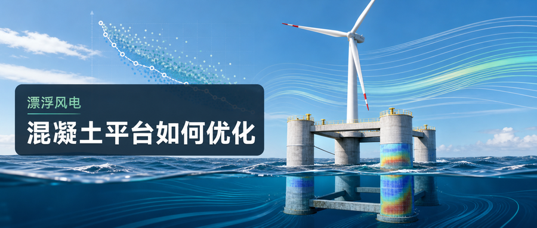
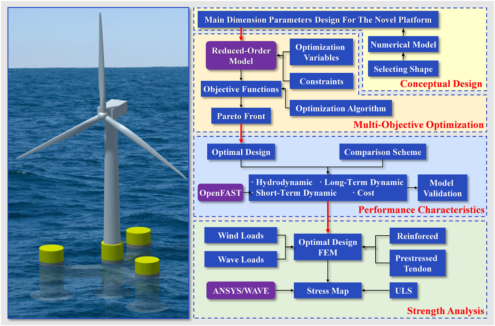
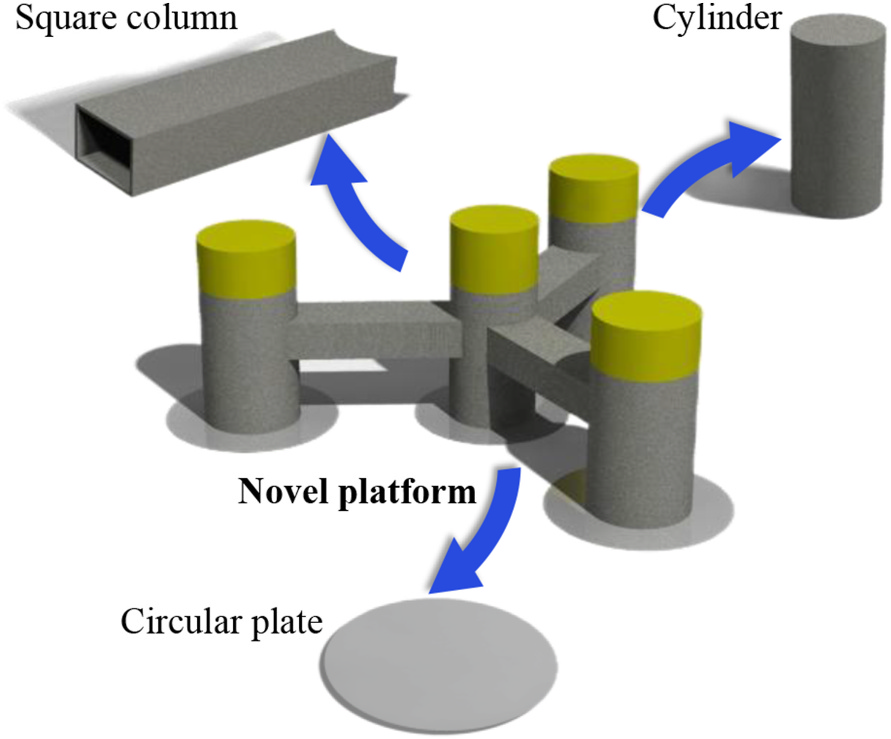
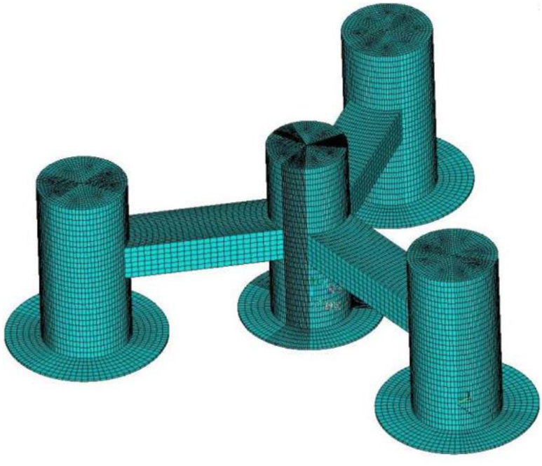
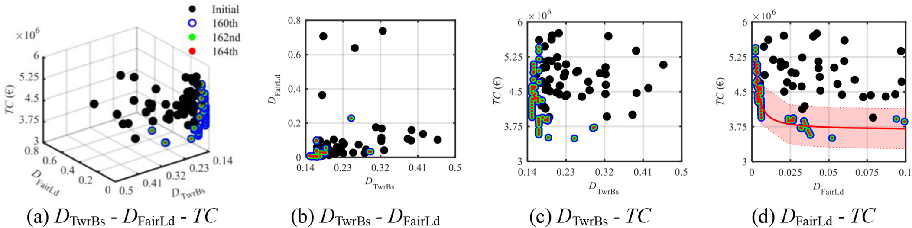
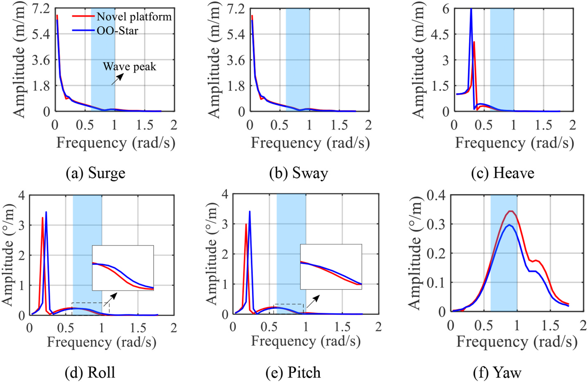
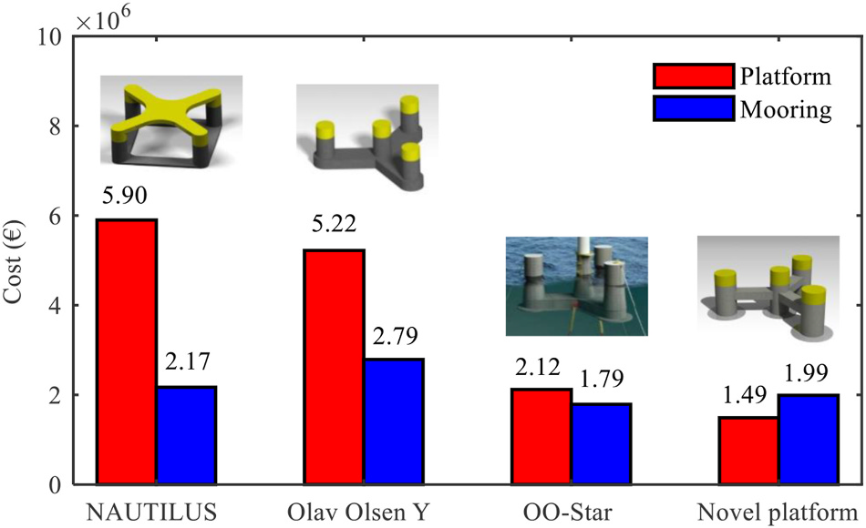
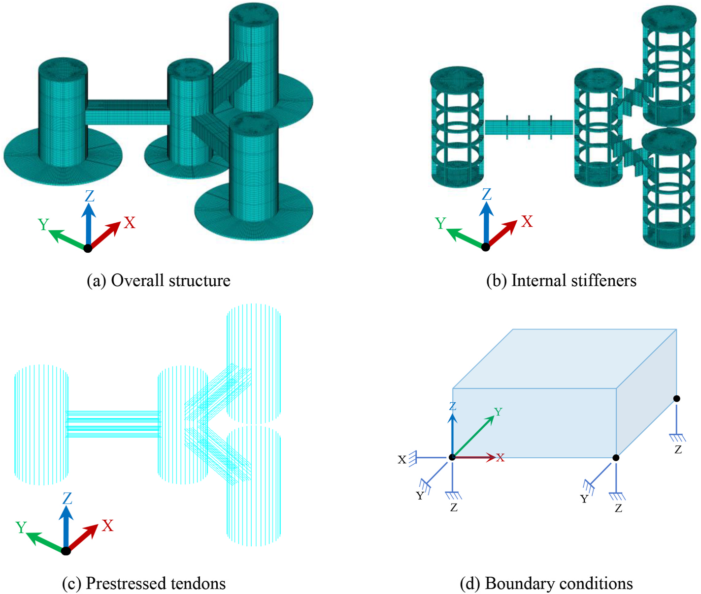

.. _paper-note-ref-he2026-OE-structural:

.. role:: student-first-author

用钢筋混凝土优化半潜式风机平台
==============================

深远海风电走向更大水深后，浮式平台不只是“把风机托起来”的支撑物，也直接影响全寿命动力响应、建造成本、制造标准化和结构强度。半潜式平台动力性能相对均衡，但既有方案多以钢结构为主，材料、制造、腐蚀和尺度化生产都会进入工程成本账本。

在这篇发表于 Ocean Engineering 的论文中，我们围绕一种新型钢筋混凝土半潜式浮式风机平台，完成概念构型、主尺度多目标优化、长周期动力响应比较、建造成本估算和极限状态下的结构强度分析。它属于 WOEAI 的海上漂浮风电 / 浮式混凝土平台结构设计方向，关注的是“平台结构怎么设计、怎么优化、怎么验证”的系统问题。

   论文图 1 研究路线

   这张图概括了论文从概念设计、多目标优化、性能比较到强度分析的完整路径，说明本文不是只提出一个外形概念，而是把动力响应、成本和结构强度放在同一设计链条中检查。

论文信息
--------

- 论文题名: Structural design and optimization of a novel semi-submersible floating offshore wind turbine platform using reinforced concrete
- 作者: :student-first-author:`He Weiwen`; **Li Chao**\*; Zheng Shunyun; Zhou Shengtao; Liu Shangpei; Ou Jinping
- 期刊: Ocean Engineering
- 年份: 2026
- DOI: https://doi.org/10.1016/j.oceaneng.2025.123951
- WOEAI 相关方向: 海上漂浮风电 / 浮式混凝土平台结构设计

三句话导读
----------

这篇论文研究一种新型钢筋混凝土半潜式浮式风机平台，从概念构型一直推进到主尺度优化、成本比较和强度验证。 它重要，因为深远海浮式风电的结构方案不能只比较材料价格，还要同时看长期动力响应、系泊疲劳、建造成本和极限状态强度。 读者可以带走的结论是：钢筋混凝土平台有模块化和成本潜力，但必须通过平台-系泊一体化优化和预应力强度验证来支撑工程判断。

关键数字 / 关键结论卡
---------------------

- 成本最优方案相较 OO-Star 的塔底最大累计疲劳损伤降低约 :math:`36\%`，导缆孔最大累计疲劳损伤降低约 :math:`21\%`。
- 新平台总建造成本估算约 :math:`3.48` 百万欧元，其中平台本体约 :math:`1.49` 百万欧元；平台本体成本相较若干比较方案有明显下降。
- 仅普通配筋时，六个荷载工况中的第一主应力均超过 C50 混凝土设计抗拉强度 :math:`1.89\,\mathrm{MPa}`；加入预应力筋后最大应力平均降低约 :math:`69\%`。

摘要
----

近年来，全球可再生能源快速发展，海上风电增长尤为明显。大量潜在海上风能资源位于水深超过 :math:`60\,\mathrm{m}` 的海域，使浮式风机，特别是半潜式平台，成为重要研究对象。

针对钢结构半潜式平台成本高、形式多样导致标准化制造困难，以及钢筋混凝土半潜式浮式风机平台在优化、性能表征和结构强度验证方面研究不足的问题，本文提出一种基于模块化思想的新型钢筋混凝土半潜式浮式风机平台概念。研究完成主尺度参数设计、优化变量选择，并建立由长期动力响应驱动的多目标优化框架。

该框架使用降阶模型计算长期动力响应和经济指标，以约束条件筛选设计方案，并采用 NSGA-II 遗传算法追踪 Pareto 前沿。结果显示，优化过程收敛良好，目标函数得到明显改善，并形成多个有潜力的设计方案。选取成本最优方案后，论文进一步与 LIFES 50+ OO-Star 方案进行性能比较；数值模拟结果表明，新平台在论文设定的长期服役性能和建造成本指标上表现更优。最后，研究建立最优方案的有限元模型，在极限状态条件下进行结构强度分析，结果显示加入预应力筋后平台满足强度要求。整体而言，这项工作为钢筋混凝土半潜式浮式风机平台的结构设计和优化提供了系统参考。

研究问题
--------

钢筋混凝土半潜式平台不是简单的材料替代问题。本文围绕三类设计问题展开：

1. 如何把模块化钢筋混凝土构型、平台主尺度和系泊系统放入同一个优化框架？
2. 与 OO-Star 等比较方案相比，新平台在长期动力响应、建造成本和平台本体成本上有什么优势与限制？
3. 当优化方案进入极限状态强度分析时，普通配筋和预应力筋会带来怎样的强度差异？

方法贡献
--------

论文先提出一种模块化钢筋混凝土半潜式平台。平台由圆柱、方柱和圆板等相对简单的构件组成，意图服务标准化制造与装配，并以 DTU :math:`10\,\mathrm{MW}` 风机作为支撑对象。

   论文图 7 新型平台概念设计

   图中展示了新型平台由圆柱、方柱和圆板等模块构件组合而成的基本构型，这也是论文讨论标准化和模块化潜力的结构基础。

在动力响应计算上，论文使用研究团队已有的降阶模型 ROM 快速估计浮式风机长期动力响应。模型把平台视为刚体、塔架视为柔性体，并用频域动力方程计算响应特征。为了进入优化流程，研究还建立了与实体模型对应的参数化水动力模型。

   论文图 10 新型平台水动力模型

   水动力模型用于支撑 ROM 中的平台水动力系数计算，使主尺度变化能够进入快速动力响应分析，而不是只停留在几何概念层面。

在成本目标上，论文把平台、垂荡板、压载和系泊系统等费用统一纳入总建造成本估算：

.. math::

   TC=\frac{m_{\mathrm{ptfm}}P_{\mathrm{con}}+m_{\mathrm{hp}}P_{\mathrm{steel}}+m_{\mathrm{ballst}}P_{\mathrm{ballst}}+m_{\mathrm{moor}}P_{\mathrm{moor}}}{0.7}

这里 :math:`m_{\mathrm{ptfm}}`、:math:`m_{\mathrm{hp}}`、:math:`m_{\mathrm{ballst}}` 和 :math:`m_{\mathrm{moor}}` 分别表示平台、垂荡板、压载和系泊系统质量，:math:`P_{\mathrm{con}}`、:math:`P_{\mathrm{steel}}`、:math:`P_{\mathrm{ballst}}` 和 :math:`P_{\mathrm{moor}}` 表示对应单位成本。这个式子提醒读者：混凝土平台的成本优势不能只看平台本体，还必须把系泊系统和其他构件一起算。

优化算法采用 NSGA-II 多目标遗传算法，目标是在约束条件下搜索 Pareto 前沿。论文报告优化在第 :math:`164` 代达到收敛判据，并得到 :math:`50` 个 Pareto 最优主尺度组合。

   论文图 16 目标函数对比

   这组图展示了塔底疲劳损伤、导缆孔疲劳损伤和总建造成本之间的关系；一个重要现象是，在钢筋混凝土平台中，导缆孔疲劳损伤与总成本之间的相关性变得突出，提示设计时不能把平台和系泊系统割裂开来。

关键发现
--------

1. 平台与系泊系统需要一体化优化
~~~~~~~~~~~~~~~~~~~~~~~~~~~~~~~

**针对问题 1，论文的 Pareto 前沿分析显示，导缆孔疲劳损伤 :math:`D_{\mathrm{FairLd}}` 与总建造成本 :math:`TC` 呈明显相关：要降低导缆孔疲劳损伤，往往需要在系泊系统上付出更高成本。** 由于钢筋混凝土平台本体相对钢结构平台成本降低，系泊系统在总成本中的权重就更值得关注。

这意味着，钢筋混凝土半潜式平台的主尺度优化不能只看平台几何尺寸，也不能只追求单个动力响应指标。平台主尺度、系泊链直径、系泊线长度和柱间距之间的组合关系，会共同决定长期性能与经济指标。

2. 新平台在若干长期动力响应指标上优于 OO-Star 比较方案
~~~~~~~~~~~~~~~~~~~~~~~~~~~~~~~~~~~~~~~~~~~~~~~~~~~~~~

**针对问题 2，论文选取成本最优方案，并与 LIFES 50+ OO-Star 方案进行比较。** 两者都以混凝土材料和 DTU :math:`10\,\mathrm{MW}` 风机为对象，但外形和浮筒布置不同。水动力响应幅值算子 RAO 对比显示，新平台在垂荡方向的峰值响应和背景波频范围内的响应低于 OO-Star；横摇和纵摇在背景波频范围内也略低。

   论文图 19 两类平台在 135 度波向下的 RAO 对比

   RAO 图用于比较单位波高规则波下的响应幅值。论文据此讨论新平台在垂荡、横摇和纵摇等自由度上抵抗波浪荷载的表现。

在长期响应指标上，论文报告新平台相较 OO-Star 的塔底最大累计疲劳损伤降低约 :math:`36\%`，导缆孔最大累计疲劳损伤降低约 :math:`21\%`；长期服役性能指标提高约 :math:`36\%`。同时，论文也指出新平台的倾角响应在部分长期趋势中并非处处优于 OO-Star，这一点有助于避免把新方案简单描述成“所有指标全面占优”。

3. 成本比较显示平台本体具有明显优势，但结论依赖估算模型
~~~~~~~~~~~~~~~~~~~~~~~~~~~~~~~~~~~~~~~~~~~~~~~~~~~~~~~

**针对问题 2，论文以平台结构和系泊系统为范围，比较新平台、NAUTILUS、Olav Olsen Y 和 OO-Star 的总建造成本。** 结果显示，新平台总建造成本估算为约 :math:`3.48` 百万欧元，其中平台本体约 :math:`1.49` 百万欧元；平台本体成本相较 NAUTILUS 和 Olav Olsen Y 分别降低约 :math:`75\%` 和 :math:`71\%`，相较 OO-Star 约低 :math:`30\%`。

   论文图 27 总建造成本对比

   这张图把平台和系泊系统成本分开显示，能看出混凝土平台本体成本下降后，系泊系统对总成本的影响更不能忽略。

需要注意的是，这里的成本结论来自论文采用的成本模型、材料单价、目标风机和比较方案，适合作为概念设计阶段的相对比较，不应直接等同于某个实际项目的最终报价。

4. 预应力筋对极限状态强度验证很关键
~~~~~~~~~~~~~~~~~~~~~~~~~~~~~~~~~~~

**针对问题 3，完成动力响应和成本比较后，论文进一步建立有限元模型，对新平台最优方案进行极限状态强度分析。** 模型包括 C50 混凝土、普通钢筋和预应力筋，并在 ULS 组合下施加设计波浪与风荷载。

   论文图 29 新型平台强度分析有限元模型

   有限元模型把整体结构、内部加劲、预应力筋和边界条件放在同一强度分析框架中，用于检查优化方案能否满足极限状态下的承载要求。

论文结果显示，仅采用普通配筋时，六个荷载工况中的第一主应力均超过 C50 混凝土设计抗拉强度 :math:`1.89\,\mathrm{MPa}`；加入预应力筋后，各荷载工况整体应力范围落在混凝土设计抗拉强度以内，最大应力平均降低约 :math:`69\%`，内部加劲应力降低约 :math:`50\%`。这说明，对这类钢筋混凝土半潜式平台而言，预应力体系不是附加装饰，而是强度满足要求的关键设计环节。

工程意义
--------

这项工作对海上漂浮风电平台设计有三点启发。

第一，它把钢筋混凝土半潜式平台从“材料替代”推进到“结构构型、主尺度优化、长期动力响应、成本和强度”的一体化设计框架。对早期概念设计来说，这比单独比较材料价格更接近真实工程决策。

第二，论文强调平台与系泊系统的耦合。混凝土降低平台本体成本后，系泊系统在总成本和疲劳损伤中的影响会更突出，因此平台主尺度和系泊参数应一起优化。

第三，强度验证显示预应力筋对满足 ULS 要求非常重要。这为后续面向钢筋混凝土浮式平台的细部结构设计、构造优化和模型试验提供了明确入口。

适用边界
--------

本文的结果来自数值模拟、降阶模型、成本估算和有限元强度分析。论文结尾也明确指出，研究仍局限于数值模拟，后续需要在条件成熟时开展缩尺水池试验，以进一步提高结果可靠性。

成本对比应理解为特定假设、特定比较对象和特定估算范围下的概念设计结论；实际工程还会受到供应链、施工组织、海域条件、规范要求、港口设施、运维策略和融资条件影响。

此外，本文关注的是 DTU :math:`10\,\mathrm{MW}` 风机和论文设定目标海域下的新型钢筋混凝土半潜式平台。若换成更大容量风机、不同水深、不同波浪气候或不同系泊系统，主尺度优化和强度设计都需要重新计算。

延伸阅读
--------

- `WOEAI | 海上漂浮风电方向介绍 <https://woeai.readthedocs.io/zh-cn/latest/FloatingOffshoreWindTurbine.html>`_
- `WOEAI | 主页 <https://woeai.readthedocs.io/zh-cn/latest/>`_

完整引用
--------

[70] :student-first-author:`He Weiwen`; **Li Chao**\*; Zheng Shunyun; Zhou Shengtao; Liu Shangpei; Ou Jinping, Structural design and optimization of a novel semi-submersible floating offshore wind turbine platform using reinforced concrete[J]. **Ocean Engineering**, 2026, 346: 123951. https://doi.org/10.1016/j.oceaneng.2025.123951.

收录信息见 :ref:`WOEAI 学术成果页对应条目 <ref-he2026-OE-structural>`。

相关论文精解
------------

- :doc:`为半潜式风机找到可信的等效静力波浪荷载 <ref-zheng2025-OE>`
- :doc:`同一座 Y 型半潜平台换材料后，动力响应会怎样改变 <ref-li2022-SOS>`
- :doc:`用长期动力优化选择浮式风机下部结构 <ref-zhou2023-AE>`
