.. _paper-note-ref-he2026-OE-structural:

.. role:: student-first-author

新型钢筋混凝土半潜式浮式风机平台的结构设计与优化：论文精解
================================================================================================================

精简版微信公众号文章：待发布

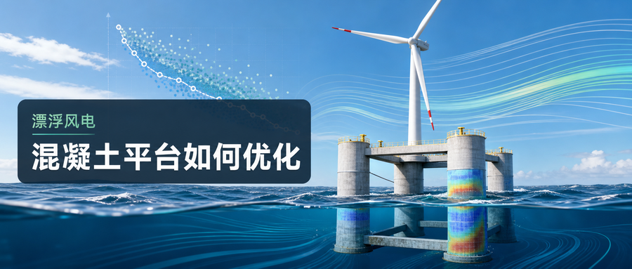

.. contents:: 本页目录
   :local:
   :depth: 3

论文信息
--------

- 原文题名：Structural design and optimization of a novel semi-submersible floating offshore wind turbine platform using reinforced concrete
- 文章类型：研究论文
- 作者：\ :student-first-author:`Weiwen He`\ :sup:`a`\ ；**Chao Li**\ :sup:`a,b,*`\ ；Shunyun Zheng\ :sup:`a,c`\ ；Shengtao Zhou\ :sup:`d`\ ；Shangpei Liu\ :sup:`a`\ ；Jinping Ou\ :sup:`a,b`
- 单位 a：哈尔滨工业大学（深圳）智能土木与海洋工程学院，中国深圳
- 单位 b：哈尔滨工业大学（深圳）广东省土木工程智能与韧性结构重点实验室，中国深圳
- 单位 c：明阳智慧能源集团股份公司海洋与漂浮工程技术中心，中国中山
- 单位 d：中国电建集团中南勘测设计研究院有限公司可再生能源工程设计院，中国长沙
- 通讯作者脚注 \*：哈尔滨工业大学（深圳）智能土木与海洋工程学院，中国深圳；电子邮箱 lichaosz@hit.edu.cn （C. Li）
- 期刊：Ocean Engineering，346（2026），123951
- 收稿：2025 年 8 月 25 日；修回：2025 年 11 月 28 日；录用：2025 年 12 月 8 日；在线发表：2025 年 12 月 15 日
- DOI：https://doi.org/10.1016/j.oceaneng.2025.123951

.. note::

   本文按作者的整体概念设计范围呈现研究结论：预应力改善平台整体应力分布，局部应力集中与节点细化仍有后续优化空间。全文核验针对原文忠实度与覆盖完整性，不代表详细设计验算或独立工程安全认证；必要的数值口径说明保留在对应位置。

摘要
----

近年来，全球可再生能源发展迅速，海上风电行业的增长尤其显著。全球约 80% 的潜在海上风能资源位于水深超过 60 m 的区域，因此浮式海上风力机（floating offshore wind turbines，FOWTs），尤其是半潜式平台，成为研究重点。然而，现有半潜式平台主要采用钢材，其多样化设计妨碍标准化制造，并推高建造成本。针对钢筋混凝土半潜式浮式风机平台在优化、性能表征与结构强度验证方面研究不足的问题，本文提出一种基于模块化理念、支持标准化的新型半潜式浮式风机平台概念设计。本研究开展主尺度参数设计，选择优化变量，并建立由长期动力响应驱动的一体化多目标优化框架。降阶模型（reduced-order model，ROM）计算作为目标函数的长期动力响应和经济指标，同时检验设计方案是否满足约束条件；采用 NSGA-II 遗传算法追踪 Pareto 前沿。结果表现出良好的收敛性，目标函数显著改善，获得多个有前景的设计方案。选取成本最优方案，开展全面性能评价，并与 LIFES 50+ OO-Star 方案比较；数值模拟表明，新平台在长期服役性能方面优于 OO-Star，同时显著降低总建造成本。最后，利用最优设计的有限元模型评价极限状态（Ultimate Limit State，ULS）条件下的结构强度，确认增加预应力筋的平台满足强度要求。总体而言，本研究具有显著的工程应用潜力，为钢筋混凝土半潜式浮式风机平台的结构设计与优化提供了全面参考。

关键词
------

浮式海上风力机；半潜式平台；多目标优化；钢筋混凝土；动力响应；强度分析

1 引言
------

国际能源署（IEA）预测，到 2030 年全球可再生能源将实现大幅增长，风电扩张速度将达到 2017—2023 年间的两倍；海上风能行业正在快速发展，然而现有固定式海上风机平台在深水区（>50 m）面临技术挑战（\ `Renewables 2023, 2024 <#he2026struct-r40>`__\ ）。全球风能理事会（GWEC）指出，浮式风机的发电效率可与固定式系统相当，甚至更高；全球约 80% 的潜在海上风能资源位于水深超过 60 m 的海域（\ `Global Offshore Wind Report 2022, 2022 <#he2026struct-r21>`__\ ）。因此，各国迫切需要开发适用于中深水区（30–200 m）、高效且经济的浮式海上风力机（FOWTs）。在浮式风机平台中，半潜式平台兼顾动力性能与经济可行性，尤其适合深远海开发。

在建造材料方面，Laura（\ `Laura and Vicente, 2014 <#he2026struct-r27>`__\ ）分解了浮式风电项目的全寿命成本，发现下部结构（包括平台和系泊）占建造成本的 40% 以上。目前，大多数设计主要采用钢材，但高成本、易腐蚀和建造周期长等问题构成明显制约，限制了钢制浮式风机的大规模应用。因此，钢筋混凝土凭借成本较低、耐久性较高及模块化潜力，被视为替代钢材的理想材料。然而，它在浮式风机中的应用仍缺乏研究。

在平台外形方面，Spar 和张力腿平台（Tension Leg Platform，TLP）的设计相对标准化（\ `Li et al., 2011 <#he2026struct-r31>`__\ ），而半潜式平台主要采用 Y 形或 Δ 形构型（\ `Zou and Bricker, 2025 <#he2026struct-r58>`__\ ）。近年来，基于上述材料限制与机遇，世界各地出现了许多创新的浮式风机平台概念设计。例如，X1 Wind 推出了 Pivot Buoy（\ `Documentation <#he2026struct-r15>`__\ ），这是一种无塔架浮式风机，采用单点系泊和被动迎风。另一个例子是 `Moray Base <#he2026struct-r35>`__\ （\ `Moray Base <#he2026struct-r35>`__\ ），其仿生鳗鱼式浮式风机平台全部由钢管组成，采用无支架结构，通过焊接组装。尽管许多设计极富创意，其独特特点也带来挑战。DNV 的报告（\ `Floating Offshore Wind Power, 2022 <#he2026struct-r19>`__\ ）和 Edwards EC 等的研究（\ `Edwards et al., 2024 <#he2026struct-r18>`__\ ）强调，制造方法与平台形式的多样性和复杂性，使供应链难以建立高效的制造设施。这种复杂性也给努力生产最优风机的制造商造成困难。因此，设计概念的不断增多反而妨碍成本降低，因为它阻碍规模经济和供应链优化。由此提出，概念设计标准化可通过建立更加稳定、精简的产业基础加速发展。

在优化方法方面，浮式结构领域较早引入多学科优化设计与分析（multidisciplinary optimization design and analysis，MDAO）方法，`Birk et al.（2004） <#he2026struct-r04>`__\ 的研究即为一例。近年来，`Ghigo et al.（2020） <#he2026struct-r20>`__\ 利用自主开发的工具估算不同平台的水动力系数，并通过遗传算法优化平准化度电成本（levelized cost of electricity，LCOE）。`Dou et al.（2020） <#he2026struct-r16>`__\ 建立了 Spar 下部结构主尺度优化框架，利用序列二次规划算法实现快速优化。`Leimeister et al.（2021） <#he2026struct-r29>`__\ 建立灵活框架，结合无梯度多目标遗传优化算法，实现浮式风机的自动仿真与优化。`Zhang et al.（2022a） <#he2026struct-r50>`__\ 提出将响应面优化与多目标遗传算法结合的框架，并对一种新型钢制浮式风机平台开展主尺度优化。`Zhou et al.（2023） <#he2026struct-r57>`__\ 将多目标遗传算法 NSGA-II 用于钢制半潜式风机下部结构的一体化主尺度优化设计。`Wang et al.（2025） <#he2026struct-r43>`__\ 为 15 MW 半潜式海上风机开发了基于进化算法的多目标优化设计框架。`Yu et al.（2024） <#he2026struct-r48>`__\ 针对安装调谐液体多柱阻尼器（TLMCDs）的浮式风机，开发控制协同设计优化框架。`Du et al.（2024） <#he2026struct-r17>`__\ 开发了用于浮式风机平台水动力与被动结构控制协同优化的计算框架。`Chen et al.（2025a） <#he2026struct-r06>`__\ 研究了单点系泊浮式风机的风向跟踪性能优化。总体而言，MDAO 方法已广泛应用于浮式风机领域，但多数优化研究集中在相对简单的 Spar 风机设计。半潜式风机优化设计研究总体较少，钢筋混凝土浮式风机平台优化领域几乎空白。值得注意的是，许多研究考虑了平台、系泊和结构控制系统的一体化优化（或协同优化），但只有少数讨论了一体化优化的必要性及其对目标函数的影响。遗憾的是，这些结论也仅限于钢制浮式风机平台。显然，概念设计阶段的半潜式浮式风机下部结构一体化优化，尤其是钢筋混凝土平台，仍需进一步研究。

在动力响应分析方面，Jonkman 等（\ `Coulling et al., 2013 <#he2026struct-r08>`__\ ）提出 OC4-DeepCwind 半潜式风机概念设计，并利用自主开发的全耦合时域软件 FAST 开展动力响应分析。`Yang et al.（2020） <#he2026struct-r44>`__\ 提出浮式风机全耦合时域计算软件 F2A，将 FAST 的气动、控制及结构动力学模块与 ANSYS/AQWA 的时域分析模块集成，以计算动力响应。`Zhao et al.（2021） <#he2026struct-r52>`__\ 提出一种适用于中等水深的三脚架式半潜式风机系统，并利用 OpenFAST 分析其动力响应。`Zhang et al.（2022b） <#he2026struct-r51>`__\ 设计了具有倾斜侧柱的浮式风机平台，利用 F2A（\ `Yang et al., 2020 <#he2026struct-r44>`__\ ）开展时域数值模拟，发现新设计显著降低波浪荷载的影响。Qiao 等（\ `Wang et al., 2023a <#he2026struct-r41>`__\ ）通过 CFD 模拟研究浮体的波浪爬升和波浪荷载。Li 等（\ `Li and Wang, 2023 <#he2026struct-r30>`__; `Wang et al., 2023b <#he2026struct-r42>`__; `Huang et al., 2023 <#he2026struct-r22>`__\ ）开发了用于水动力分析的系泊分析软件 KraKen，并提出新型准动态方法，提高 TLP 平台动力响应分析效率。`Meng et al.（2024） <#he2026struct-r34>`__\ 提出一种带异形垂荡板的新型半潜式浮式风机平台概念，并利用 F2A 开展动力响应分析。`Chen et al.（2025b） <#he2026struct-r07>`__\ 开发了新的全耦合仿真工具 FAST2Wasim（F2W），用于模拟非线性水动力荷载的影响。总体而言，浮式风机耦合动力响应研究已趋成熟，但大部分研究针对特定设计和特定运行条件计算具体算例。对于概念设计，仅依据少量短期工况评价方案，会忽视风机整个生命周期中长期海况的影响，不足以全面评价设计性能。不同设计方案的性能和长期动力响应仍需更加充分的研究。

在强度分析方面，`Lee et al.（2020） <#he2026struct-r28>`__\ 评价了 DeepCwind 在韩国济州岛极端运行条件下的结构强度，发现其满足许用应力标准。Sho Oh 等（\ `Oh, 2021 <#he2026struct-r37>`__\ ）设计了 10 MW 钢筋混凝土半潜式浮式风机平台的几何构型，并与传统钢制设计比较，得出在优化几何构型时，混凝土浮式基础所需的几何变量值比钢制基础更大。`Li et al.（2022） <#he2026struct-r32>`__\ 采用耦合多体仿真方法，研究分别安装于混凝土和钢制 Y 形半潜平台上的两种浮式风机的动力性能。`Kang et al.（2022） <#he2026struct-r24>`__\ 利用 ANSYS 软件模拟 OC4-DeepCwind 在飓风条件下的动力响应与结构强度。`Yang et al.（2023） <#he2026struct-r45>`__\ 提出一种考虑腐蚀损伤影响的钢制半潜式浮式风机平台屈服强度评价新方法。总体而言，大多数半潜式浮式风机平台强度研究集中于钢平台，对钢筋混凝土平台的分析相对较少，因而钢筋混凝土半潜平台的整体强度分析仍需进一步研究。

针对这些问题，本文提出一种新型钢筋混凝土半潜式浮式风机平台设计。新平台的模块化设计满足未来标准化需求，并在概念设计阶段纳入主尺度优化，以确保优化设计满足性能特征与强度验证要求。研究内容如下：第 2 节主要介绍分析方法与相关理论；第 3 节提出新型钢筋混凝土半潜式浮式风机平台设计，并完成初步主尺度参数设计；第 4 节建立基于长期动力响应的多目标优化框架，对新设计的下部结构进行一体化主尺度优化；第 5、6 节重点分析、讨论最优设计的性能特征和结构强度；最后给出总结。研究路线见图 1。

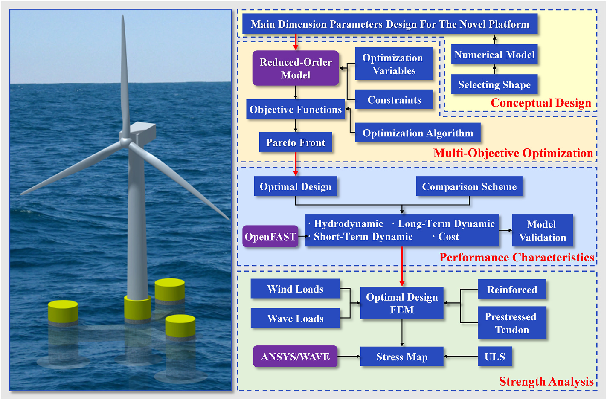

   **图 1** 研究路线

   图中流程依次为：新平台主尺度参数设计；概念设计中的数值模型与外形选择；多目标优化中的降阶模型、优化变量、约束、目标函数、优化算法和 Pareto 前沿；性能特征比较中的最优设计、比较方案、OpenFAST、水动力、长期动力、短期动力、成本及模型验证；强度分析中的风荷载、波浪荷载、最优设计有限元模型、普通配筋、预应力筋、ANSYS/WAVE、应力图及 ULS。

2 方法
------

2.1 快速动力响应分析理论
~~~~~~~~~~~~~~~~~~~~~~~~

在后续优化过程中，本研究采用研究团队开发的降阶模型 ROM（\ `Zhou et al., 2023 <#he2026struct-r57>`__\ ），高效计算浮式风机动力响应。该 ROM 最初基于 QuLAF 框架（\ `Karimi et al., 2017 <#he2026struct-r25>`__\ ），经过增强和改进，更适于长期动力主尺度优化场景。ROM 利用频域动力方程计算浮式风机响应特征，将平台视为刚体、塔架视为柔性体。这一简化将浮式风机转化为八自由度动力模型：六个自由度对应平台的纵荡、横荡、垂荡、横摇、纵摇和艏摇，另外两个对应塔架的一阶前后弯曲和侧向弯曲，如图 2 所示。浮式风机的频域动力方程见式（1）：

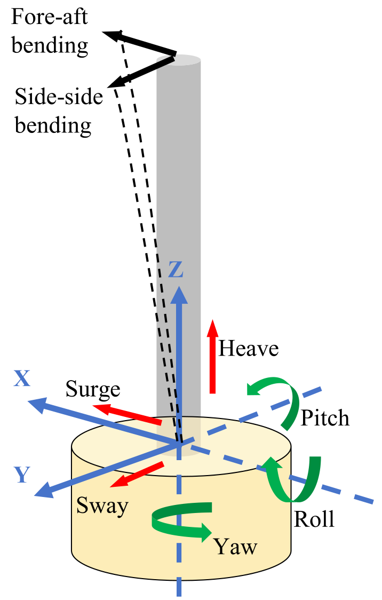

   **图 2** 动力模型定义

   Surge、Sway、Heave 分别为纵荡、横荡、垂荡；Roll、Pitch、Yaw 分别为横摇、纵摇、艏摇；Fore-aft bending 和 Side-side bending 分别为塔架前后弯曲与侧向弯曲。

.. math::

   \left\{-\omega^2[\mathbf M+\mathbf A(\omega)]+\mathrm i\omega\mathbf B(\omega)+\mathbf C\right\}\mathbf q(\omega)=\mathbf F(\omega)\qquad (1)

其中，\ :math:`\mathbf M` 为风机系统的 :math:`8\times8` 质量惯性矩阵，通常借助 CAD 软件建模计算；\ :math:`\mathbf A` 为 :math:`8\times8` 附加质量矩阵；\ :math:`\mathbf B` 为 :math:`8\times8` 阻尼矩阵，包括结构阻尼、气动阻尼、波浪辐射阻尼等；\ :math:`\mathbf C` 为 :math:`8\times8` 恢复刚度矩阵，包括结构恢复刚度和系泊恢复刚度；\ :math:`\mathbf q` 为风机系统的 :math:`8\times1` 运动响应向量，其定义见图 2；\ :math:`\mathbf F` 为 :math:`8\times1` 外激励力向量，包括气动力、一阶波浪力和黏性阻力等；\ :math:`\omega` 为频率，单位 rad/s。

对频域动力方程进行矩阵求逆，即可获得动力响应，如式（2）所示：

.. math::

   \mathbf q(\omega)=\left\{-\omega^2[\mathbf M+\mathbf A(\omega)]+\mathrm i\omega\mathbf B(\omega)+\mathbf C\right\}^{-1}\mathbf F(\omega)\qquad (2)

2.1.1 气动力学
^^^^^^^^^^^^^^

ROM 对气动荷载计算作了简化，因为直接计算非线性气动荷载相当困难，需要考虑简化方法。不过，这种简化不会使气动荷载计算发生明显失真（\ `Zhou et al., 2023 <#he2026struct-r57>`__\ ）。简化后的水平推力计算公式为式（3）：

.. math::

   \begin{aligned}
   F_{\mathrm{aero}}^{\mathrm f}&\approx\frac12\rho_{\mathrm a}\pi R^2C_{\mathrm T}v_{\mathrm{hub}}^2-\rho_{\mathrm a}\pi R^2C_{\mathrm T}v_{\mathrm{hub}}\dot q_{\mathrm{hub}}\\
   &=F_{\mathrm{aero}}^{\mathrm b}(v_{\mathrm{hub}},\theta,\Omega)-B_{\mathrm{aero}}(v_{\mathrm{hub}},\theta,\Omega)\dot q_{\mathrm{hub}}
   \end{aligned}\qquad (3)

其中，\ :math:`F_{\mathrm{aero}}^{\mathrm f}` 为浮式风机的水平推力（N）；\ :math:`F_{\mathrm{aero}}^{\mathrm b}` 为固定式配置下，即不存在平台和塔架运动时的风机水平推力（N）；\ :math:`\rho_{\mathrm a}` 为空气密度（kg/m³）；\ :math:`R` 为风轮半径（m）；\ :math:`C_{\mathrm T}` 为风机推力系数；\ :math:`v_{\mathrm{hub}}` 为来流在轮毂高度处的风速；\ :math:`\dot q_{\mathrm{hub}}` 为轮毂沿来风方向的速度；\ :math:`B_{\mathrm{aero}}` 为线性气动阻尼系数；\ :math:`\theta` 为桨距角（rad）；\ :math:`\Omega` 为风轮转速（rpm）。本文动力分析中的来风方向与波浪方向设置见图 3。

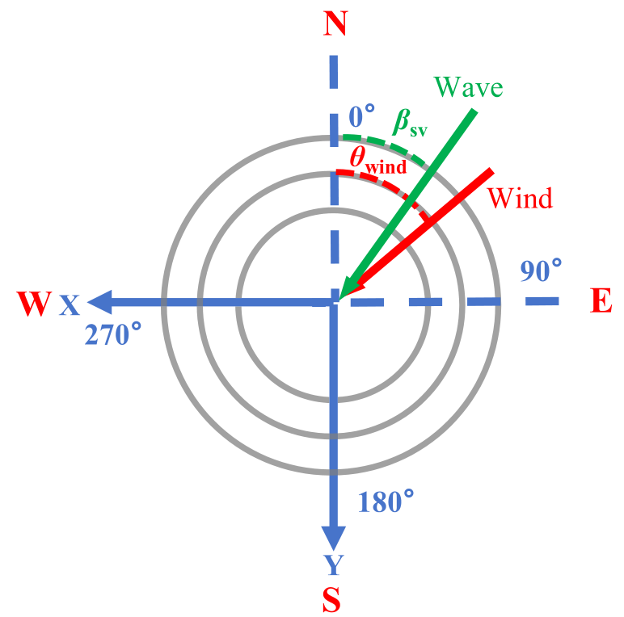

   **图 3** 风向与波向定义

   Wind 为风，Wave 为波浪；N、E、S、W 分别为北、东、南、西，方向角及 X、Y 轴按原图定义。

2.1.2 水动力学
^^^^^^^^^^^^^^

ROM 基于势流理论计算水动力系数，具体利用 ANSYS/AQWA 计算附加质量、辐射阻尼、波浪激励系数及平均漂移系数。在给定波谱下，一阶水动力荷载按式（4）计算：

.. math::

   \begin{aligned}
   F_{\mathrm{hydro}}^1&=\iint_{S_0}-p\mathbf n\,\mathrm dS\\
   &=\rho_{\mathrm s}g\iint_{S_0}z\mathbf n\,\mathrm dS
   +\omega^2\frac{\rho_{\mathrm s}}{\omega}\iint_{S_0}\operatorname{Im}(\phi_{\mathrm R})\mathbf n\,\mathrm dS\\
   &\quad+\mathrm i\omega\left[-\rho_{\mathrm s}\iint_{S_0}\operatorname{Re}(\phi_{\mathrm R})\mathbf n\,\mathrm dS\right]
   -\mathrm i\omega\rho_{\mathrm s}\iint_{S_0}(\phi_{\mathrm I}+\phi_{\mathrm D})\mathbf n\,\mathrm dS
   \end{aligned}\qquad (4)

其中，第一项 :math:`\rho_{\mathrm s}g\iint_{S_0}z\mathbf n\,\mathrm dS` 表示静水压力；第二项中的 :math:`\frac{\rho_{\mathrm s}}{\omega}\iint_{S_0}\operatorname{Im}(\phi_{\mathrm R})\mathbf n\,\mathrm dS` 和第三项中的 :math:`-\rho_{\mathrm s}\iint_{S_0}\operatorname{Re}(\phi_{\mathrm R})\mathbf n\,\mathrm dS` 分别表示附加质量和辐射阻尼项。需要强调的是，它们本质上与浮式风机平台外形的主尺度及振动频率有关，形成 :math:`6\times6` 系数矩阵；第四项 :math:`-\mathrm i\omega\rho_{\mathrm s}\iint_{S_0}(\phi_{\mathrm I}+\phi_{\mathrm D})\mathbf n\,\mathrm dS` 表示波浪辐射力，其水动力分为 Froude–Krylov（F-K）力和波浪辐射力两个分量。

.. note::

   译者注：上一段的两处“辐射力”沿用原文措辞；式（4）第四项写的是入射与绕射势之和，不能将该措辞视作辐射势与绕射势的统一定义。

2.1.3 系泊动力学
^^^^^^^^^^^^^^^^

目前，海洋工程系泊动力学主要采用三种分析方法：准静态法、集中质量法和有限元法。准静态法以导缆孔位置为参考，通过求解静力平衡下的悬链线方程确定系泊线位置和张力。ROM 利用该方法评估系泊刚度，以及每根系泊线导缆孔处的水平力 :math:`H_{\mathrm F}` 和竖向力 :math:`V_{\mathrm F}`\ ，如图 4 所示。

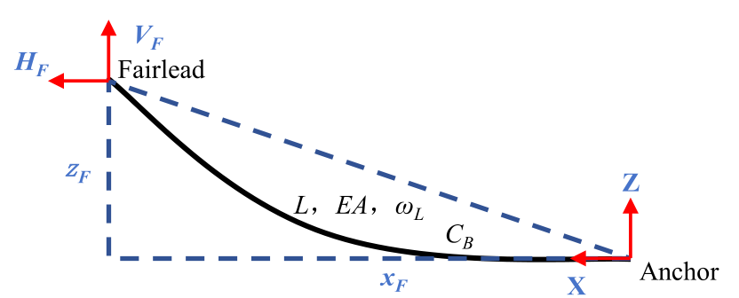

   **图 4** 系泊荷载计算示意

   Fairlead 为导缆孔，Anchor 为锚；水平力、竖向力、悬链线长度、轴向刚度及线重等符号按图示保留。

2.2 基于代理模型的长期动力响应分析
~~~~~~~~~~~~~~~~~~~~~~~~~~~~~~~~~~

基于频域动力方程和各类荷载的基本计算理论，已建立用于求解浮式风机短期动力响应的 ROM；但如引言所述，在概念设计阶段，主尺度优化以及浮式风机全寿命响应特征评价极为重要。浮式风机的典型服役寿命约为 25 年，只评价有限数量的特征短期海况下的动力性能，显然不能全面反映全寿命性能；短期海况通常指三小时内发生的特定海况变化。为此，ROM 纳入代理模型，将目标海域整个寿命期内海况的统计特征融入响应分析，从而计算长期动力响应。ROM 长期响应分析的基本思路如下：首先，利用聚类算法筛选海况，具体采用最大不相似度算法（Maximum Dissimilarity Algorithm，MDA）（\ `Kennard and Stone, 1969 <#he2026struct-r26>`__\ ），从目标海域全寿命数据（\ `Pettigrew et al., 2010 <#he2026struct-r39>`__\ ）中选择一定数量的特征短期海况，研究表明约 1000 个海况数据点较为合适（\ `Zhou et al., 2020a <#he2026struct-r54>`__\ ）；随后，利用 ROM 对所选海况进行短期动力仿真；最后，将短期响应结果输入 Kriging 代理模型，研究表明该模型更适合此类非线性问题（\ `Zhou et al., 2020a <#he2026struct-r54>`__\ ），从而预测全部海况下的长期动力响应。

按照上述步骤，代理模型得到 25 年寿命期内所有短期海况的代表响应值，并通过逐项累加计算累计疲劳损伤；取塔底截面检查点和各导缆孔处全寿命累计疲劳损伤的最大值 :math:`D_{\mathrm{TwrBs}}`\ 、\ :math:`D_{\mathrm{FairLd}}`\ ，作为设计疲劳性能的长期评价指标。塔底检查点通常沿塔架截面均匀设置八个，具体位置见图 5。与此同时，对平台最大倾角，即由横摇和纵摇响应合成的整体摇摆运动，以及机舱加速度响应进行统计分析，选取超越概率为 10% 的对应值，即平台极值倾角响应 :math:`q_{\mathrm{tilt},10p}` 和机舱极值加速度响应 :math:`a_{\mathrm{nac},10p}`\ ，作为设计极值响应的长期评价指标。

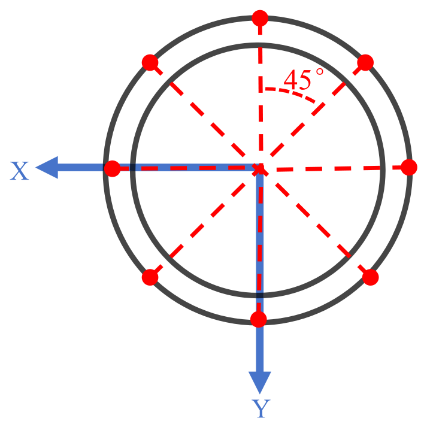

   **图 5** 塔底截面疲劳检查点

   八个检查点沿截面周向布置，相邻点间隔 45°。

需要说明的是，本研究将平台倾斜定义为横向与纵向分量合成的量，而不是任一单一方向的倾角。相关说明见图 6。假设平面 XOY 表示平台没有任何运动、与静水面完全重合的状态，平面 xyz 表示平台发生运动后的平面。平台横摇角 :math:`q_4` 和纵摇角 :math:`q_5` 分别对应图中的 :math:`\angle Oyz` 和 :math:`\angle Oxz`\ 。从 O 点向线段 xy 作垂线 Op，\ :math:`\angle Opz` 即合成倾角 :math:`q_{\mathrm{tilt}}`\ 。根据三角关系，可直接推导出上述角度之间的关系，如式（5）—（8）所示：

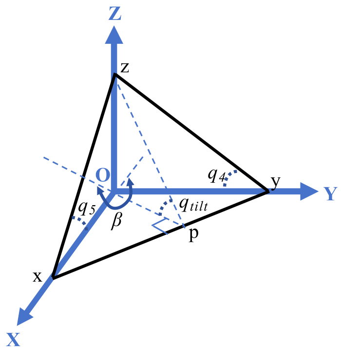

   **图 6** 合成倾角

   保留横摇、纵摇、合成倾角及坐标平面的原图几何关系。

.. math::

   \tan q_5=\tan q_{\mathrm{tilt}}\cos\beta\qquad (5)

.. math::

   \tan q_4=\tan q_{\mathrm{tilt}}\sin\beta\qquad (6)

.. math::

   q_{\mathrm{tilt}}=\arctan\left(\frac{\tan q_4}{\sin[\arctan(\tan q_4/\tan q_5)]}\right),\quad q_4\ne0\qquad (7)

.. math::

   q_{\mathrm{tilt}}=\arctan\left(\frac{\tan q_5}{\cos[\arctan(\tan q_4/\tan q_5)]}\right),\quad q_5\ne0\qquad (8)

类似地，机舱加速度也定义为合成机舱加速度，可用式（9）表示：

.. math::

   a_{\mathrm{nac}}=\sqrt{a_{\mathrm{nac},x}^2+a_{\mathrm{nac},y}^2}\qquad (9)

3 概念设计
----------

3.1 平台外形选择
~~~~~~~~~~~~~~~~

新型半潜式浮式风机（以下简称“新型浮式风机”）基于模块化理念设计；新型钢筋混凝土浮式风机平台（以下简称“新平台”）利用不同尺寸的圆柱、方柱和圆板等简单模块构件搭建整体结构，如图 7 所示。这种类似装配式建筑的设计方法，强调施工便利性以及混凝土构件整体浇筑的优势，利用成熟的预应力混凝土技术实现标准化生产与装配。概念设计综合考虑施工与装配便利性以及半潜式平台的基本形态定义，继承经典半潜式平台的设计经验。随着海上风电行业向深水、多机组和大规模风电场发展，平台设计必然走向更高程度的标准化与统一。与部分非常规设计相比，本文提出的新平台概念更适合未来海上风电项目的大规模开发，可有效降低平台建造过程中的各类成本。

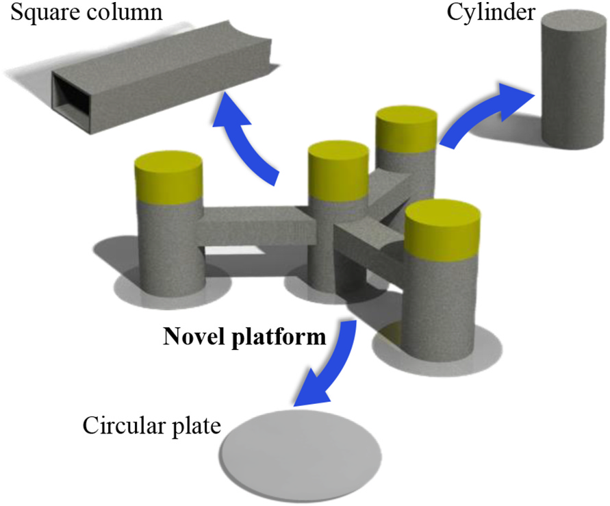

   **图 7** 新平台概念设计

   Square column 为方柱，Cylinder 为圆柱，Circular plate 为圆板，Novel platform 为新平台。

3.2 主尺度参数设计
~~~~~~~~~~~~~~~~~~

新平台设计用于支撑 DTU 10 MW 风机（\ `Bak et al., 2013 <#he2026struct-r02>`__\ ），相关参数见表 1。总体设计确定下部结构的主尺度参数，如表 2 所示，包括立柱、浮筒、主动压载、被动压载、垂荡板和系泊线六类基本构件，共 20 个主尺度参数。立柱和浮筒采用 C50 混凝土。通常，内立柱直径与塔架直径相近，小于外立柱直径。垂荡板由可焊接钢板制成，内垂荡板直径略小于外垂荡板直径。新平台同时设置主动与被动压载系统，以动态提供浮力，使浮式风机保持平衡。主动压载系统采用分布在三个外立柱中的液体水压载；被动压载由内立柱中的混凝土块组成，用来降低整体结构重心，并提供固定压载作用；混凝土块直径与内立柱直径相近。

.. list-table:: 表 1 DTU 10 MW 风机主要参数
   :header-rows: 1

   * - 参数
     - 数值
     - 单位
   * - 重心
     - −0.35, 0, 89.39
     - m
   * - 轮毂高度
     - 119
     - m
   * - 风轮、轮毂直径
     - 178.3, 5.6
     - m
   * - 风轮质量
     - 229
     - t
   * - 机舱质量
     - 446
     - t
   * - 塔架质量
     - 561
     - t
   * - 切入、额定、切出风速
     - 4, 11.4, 25
     - m/s

.. list-table:: 表 2 新平台主尺度参数初始设置
   :header-rows: 1

   * - 下部结构
     - 基本构件
     - 材料
     - 主尺度参数
     - 数值
     - 单位
   * - 平台
     - 立柱
     - 混凝土
     - 外立柱半径 :math:`r_1`
     - 10
     - m
   * - 平台
     - 立柱
     - 混凝土
     - 内立柱半径 :math:`r_2`
     - 9
     - m
   * - 平台
     - 立柱
     - 混凝土
     - 柱间距 :math:`d`
     - 50
     - m
   * - 平台
     - 立柱
     - 混凝土
     - 外立柱水线上高度 :math:`h_{\mathrm{above}}`
     - 10
     - m
   * - 平台
     - 立柱
     - 混凝土
     - 内立柱超出外立柱高度 :math:`h_{\mathrm{above2}}`
     - 3
     - m
   * - 平台
     - 立柱
     - 混凝土
     - 柱壁厚 :math:`wallthk_{\mathrm{pontn}}`
     - 600
     - mm
   * - 平台
     - 浮筒
     - 混凝土
     - 浮筒高度 :math:`h_{\mathrm{pontn}}`
     - 8
     - m
   * - 平台
     - 浮筒
     - 混凝土
     - 浮筒宽度 :math:`w_{\mathrm{pontn}}`
     - 12
     - m
   * - 平台
     - 浮筒
     - 混凝土
     - 浮筒壁厚 :math:`wallthk_{\mathrm{pontn}}`
     - 600
     - mm
   * - 平台
     - 浮筒
     - 混凝土
     - 浮筒吃水 :math:`draft_{\mathrm{pontn}}`
     - 11
     - m
   * - 平台
     - 主动压载
     - 水
     - 压载水高度 :math:`h_{\mathrm{ballst\_a}}`
     - 8
     - m
   * - 平台
     - 被动压载
     - 混凝土块
     - 压载块高度 :math:`h_{\mathrm{ballst\_p}}`
     - 6
     - m
   * - 平台
     - 垂荡板
     - 钢
     - 内垂荡板半径 :math:`r_3`
     - 16.2
     - m
   * - 平台
     - 垂荡板
     - 钢
     - 外垂荡板半径 :math:`r_4`
     - 18
     - m
   * - 平台
     - 垂荡板
     - 钢
     - 垂荡板厚度 :math:`wallthk_{\mathrm{hp}}`
     - 35
     - mm
   * - 平台
     - —
     - —
     - 吃水 :math:`draft`
     - 30
     - m
   * - 系泊系统
     - 系泊线
     - 钢
     - 系泊线长度 :math:`L_{\mathrm{moor}}`
     - 600
     - m
   * - 系泊系统
     - 系泊线
     - 钢
     - 系泊链直径 :math:`D_{\mathrm{moor}}`
     - 0.10
     - m
   * - 系泊系统
     - 系泊线
     - 钢
     - 锚半径 :math:`R_{\mathrm{moor}}`
     - 400
     - m
   * - 系泊系统
     - 系泊线
     - 钢
     - 导缆孔高度 :math:`H_{\mathrm{FairLd}}`
     - −8.0
     - m

译者注：表 2 原文将柱壁厚和浮筒壁厚均记为 :math:`wallthk_{\mathrm{pontn}}`\ ，此处保留；表 3 则将柱壁厚记为 :math:`wallthk_{\mathrm{colmn}}`\ 。

基于这些尺度参数，利用设计软件对新平台进行参数化三维实体建模，构件与主尺度参数的对应关系见图 8。系泊系统布置见图 9。需要注意，在主尺度优化之前，尚不能确定各主尺度参数的最终数值。初始参数值参考主流浮式风机下部结构设计，仅为方便建模和示意而提供。

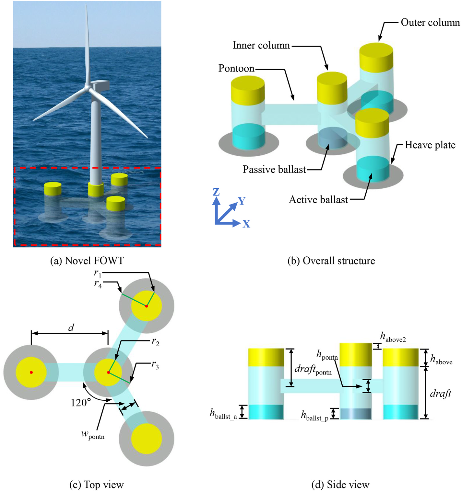

   **图 8** 新平台主尺度参数设计示意

   (a) 新型浮式风机；(b) 整体结构；(c) 俯视图；(d) 侧视图。Outer/Inner column 为外/内立柱，Pontoon 为浮筒，Heave plate 为垂荡板，Active/Passive ballast 为主动/被动压载。

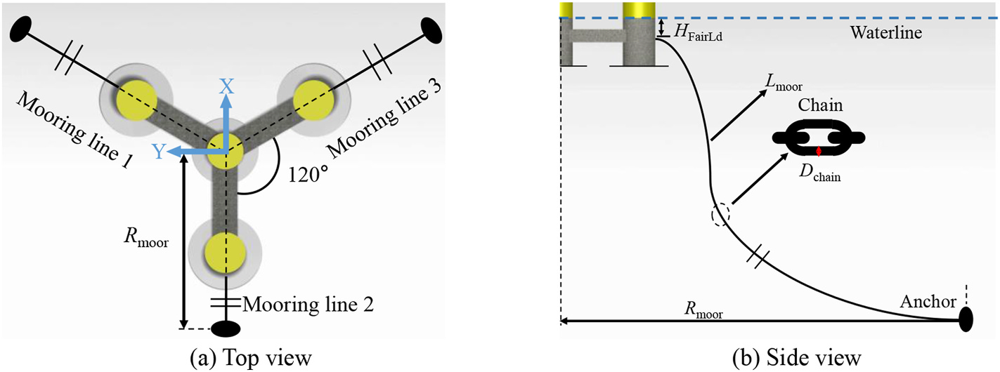

   **图 9** 系泊系统主尺度参数设计示意

   (a) 俯视图；(b) 侧视图。Mooring line 1–3 为系泊线 1–3，Chain 为锚链，Waterline 为水线，Anchor 为锚；图中锚链直径标记为 D_chain，表中采用 D_moor。

ROM 使用 ANSYS/AQWA 计算浮式风机的水动力系数。因此，除三维实体模型外，还必须建立与之完全对应的参数化水动力模型。水动力建模过程见图 10。

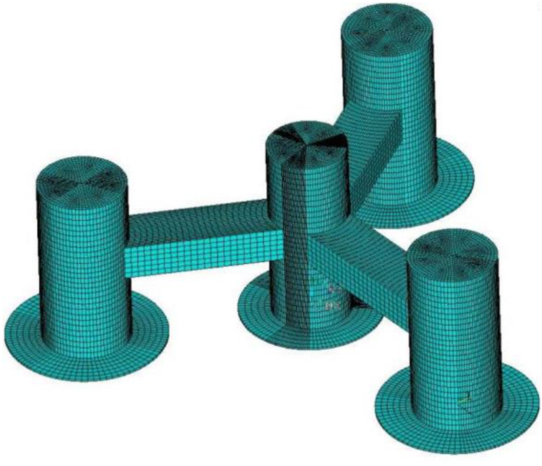

   **图 10** 新平台水动力模型

   图示为与参数化实体模型对应的水动力网格。

4 平台—系泊系统的一体化长期动力优化
-----------------------------------

4.1 优化变量
~~~~~~~~~~~~

参考此前关于主尺度参数敏感性的研究，本文选择与下部结构建造成本和动力性能密切相关的主尺度参数作为优化变量。具体选取外立柱半径、吃水、柱间距、浮筒宽度、系泊线长度和系泊链直径。优化变量的详细设置见表 3。平台和系泊系统优化变量的对应关系分别见图 8 和图 9，此处不再重复。

.. list-table:: 表 3 主尺度优化变量设置
   :header-rows: 1

   * - 主尺度参数
     - 变量类型
     - 范围或取值
     - 步长
     - 单位
   * - 外立柱半径 :math:`r_1`
     - 可优化
     - [3, 8]
     - 1
     - m
   * - 内立柱半径 :math:`r_2`
     - 常量
     - 6.5
     - —
     - m
   * - 柱间距 :math:`d`
     - 可优化
     - [30, 46]
     - 2
     - m
   * - 外立柱水线上高度 :math:`h_{\mathrm{above}}`
     - 常量
     - 6
     - —
     - m
   * - 内立柱超出外立柱高度 :math:`h_{\mathrm{above2}}`
     - 常量
     - 3
     - —
     - m
   * - 柱壁厚 :math:`wallthk_{\mathrm{colmn}}`
     - 常量
     - 500
     - —
     - mm
   * - 浮筒高度 :math:`h_{\mathrm{pontn}}`
     - 从属变量
     - :math:`0.8w_{\mathrm{pontn}}`
     - —
     - m
   * - 浮筒宽度 :math:`w_{\mathrm{pontn}}`
     - 可优化
     - [4, 6.5]
     - 0.5
     - m
   * - 浮筒壁厚 :math:`wallthk_{\mathrm{pontn}}`
     - 常量
     - 500
     - —
     - mm
   * - 浮筒吃水 :math:`draft_{\mathrm{pontn}}`
     - 从属变量
     - :math:`(draft-h_{\mathrm{above}})/2`
     - —
     - m
   * - 压载水高度 :math:`h_{\mathrm{ballst\_a}}`
     - 从属变量
     - 按平衡条件更新
     - —
     - m
   * - 压载块高度 :math:`h_{\mathrm{ballst\_p}}`
     - 从属变量
     - 按平衡条件更新
     - —
     - m
   * - 内垂荡板半径 :math:`r_3`
     - 常量
     - 13
     - —
     - m
   * - 外垂荡板半径 :math:`r_4`
     - 从属变量
     - :math:`2.4r_1`
     - —
     - m
   * - 垂荡板厚度 :math:`wallthk_{\mathrm{hp}}`
     - 常量
     - 35
     - —
     - mm
   * - 系泊线长度 :math:`L_{\mathrm{moor}}`
     - 可优化
     - [770, 970]
     - 20
     - m
   * - 系泊链直径 :math:`D_{\mathrm{moor}}`
     - 可优化
     - [0.100, 0.180]
     - 0.01
     - m
   * - 锚半径 :math:`R_{\mathrm{moor}}`
     - 从属变量
     - :math:`L_{\mathrm{moor}}`
     - —
     - m
   * - 导缆孔高度 :math:`H_{\mathrm{FairLd}}`
     - 常量
     - −6.3
     - —
     - m
   * - 吃水 :math:`draft`
     - 可优化
     - [18, 36]
     - 2
     - m

4.2 约束条件
~~~~~~~~~~~~

多个优化变量的组合显著扩大优化算法的搜索空间，因此需要施加约束以排除不可行设计方案，从而有效提高算法搜索效率。本研究定义六类约束：

- 环境约束：新型浮式风机位于缅因湾（西经 69.3°、北纬 43.6°）。该区域 25 年的风向—风速、波向—波高记录以及波浪频率概率分布见图 11。
- 几何约束：见表 4。
- 力学约束：除几何限制外，还须依据相关 DNV 设计规范（\ `DNV GL-RP-0286, 2016 <#he2026struct-r10>`__\ ）约束基本力学特征，例如倾角、固有周期及水平位移的限制，以保证浮式风机正常发电，具体见式（1）—（3）。

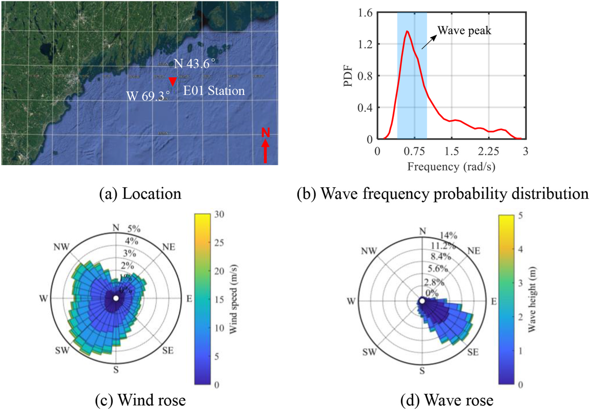

   **图 11** 目标海域

   (a) 位置；(b) 波浪频率概率分布；(c) 风玫瑰图；(d) 波浪玫瑰图。Wave peak 为波浪峰频区，PDF 为概率密度，风速单位 m/s、波高单位 m、频率单位 rad/s。

.. list-table:: 表 4 几何约束
   :header-rows: 1

   * - 约束
     - 说明
   * - :math:`\sqrt{(R_{\mathrm{moor}}-d-r)^2+(z_{\mathrm s}+H_{\mathrm{FairLd}})^2}<L_{\mathrm{moor}}`
     - 系泊长度应满足三角形边长要求
   * - :math:`L_{\mathrm{moor}}<R_{\mathrm{moor}}-d-r+z_{\mathrm s}+H_{\mathrm{FairLd}}`
     - :math:`z_{\mathrm s}` 为水深；满足长度规则

.. note::

   原文从第 4 节起重新使用公式编号（1）—（7）；本页保留这一编号体系。下列式（1）—（7）均属于第 4 节，与第 2 节的同号公式分别使用。

.. math::

   |\bar q_{Y,4}|\le5^\circ,\qquad |\bar q_{X,5}|\le5^\circ\qquad (1)

.. math::

   T_{44}\ge20\,\mathrm s,\qquad T_{55}\ge20\,\mathrm s,\qquad T_{33}\ge17\,\mathrm s\qquad (2)

.. math::

   |T_{33}-T_{44}|\ge3\,\mathrm s,\qquad |T_{33}-T_{55}|\ge3\,\mathrm s\qquad (3)

其中，\ :math:`\bar q_{Y,4}` 和 :math:`\bar q_{X,5}` 分别表示平均横摇角和平均纵摇角（°）；\ :math:`T_{33}`\ 、\ :math:`T_{44}` 和 :math:`T_{55}` 分别表示浮式风机垂荡、横摇和纵摇方向的固有周期（s）；这些量由 ROM 在优化过程中计算。

- 系泊约束：系泊系统需要限制系泊线长度，以保证足够的海床触底长度；这种配置可避免锚链过度张紧，从而减轻过大张力，防止拖曳埋入式锚的拖移失效，即失去抓持能力：

.. math::

   L_{\mathrm{moor}}-\frac{V_{\mathrm F}}{\omega_{\mathrm L}}\ge\frac{L_{\mathrm{moor}}}{10}\qquad (4)

- 位移约束：为防止平台水平运动过大而损伤系泊缆及相关结构，最大允许水平位移限制为水深的 15%（\ `Benassai et al., 2015 <#he2026struct-r03>`__\ ），以避免损坏动态电缆：

.. math::

   \frac{\Delta x_{\mathrm{offset}}}{z_{\mathrm s}}\le0.15\qquad (5)

- 长期动力响应约束：上述约束在动力响应分析的预处理阶段施加。在响应求解阶段还需施加额外约束，汇总见表 5。这些响应值的计算方法详见第 2.2 节。

.. list-table:: 表 5 长期动力响应约束（\ `Zhou et al., 2023 <#he2026struct-r57>`__\ ）
   :header-rows: 1

   * - 约束
     - 说明
   * - :math:`q_{\mathrm{tilt},10p}\le10^\circ`
     - 为保证所选平台具有良好运动特征，25 年寿命期内对应 10% 超越概率的极值倾角不得超过 10°
   * - :math:`a_{\mathrm{nac},10p}\le0.3g`
     - 为避免传动链过载，25 年寿命期内对应 10% 超越概率的机舱极值加速度不得超过 0.3g
   * - :math:`T_{\max}^{\mathrm{FairLd}}\le S_{\mathrm b}=32D_{\mathrm{moor}}^2(44-0.08D_{\mathrm{moor}})`
     - 导缆孔处最大张力须低于系泊线破断强度
   * - :math:`D_{\mathrm{FairLd}}\le0.5`
     - 导缆孔全寿命最大累计疲劳损伤不得超过 0.5
   * - :math:`D_{\mathrm{TwrBs}}\le0.5`
     - 塔底全寿命最大累计疲劳损伤不得超过 0.5

译者注：破断强度表达式按原表保留；原表未注明该经验式中直径与强度的适用单位体系，不能直接把表 3 的米制直径代入而宣称完成强度验算。

值得注意的是，虽然 DNV 标准规定累计疲劳损伤限值为 1.0（\ `DNVGL-ST-0126, 2016 <#he2026struct-r14>`__\ ），但对于塔底、导缆孔等位于飞溅区和水下区的构件，标准要求根据运维计划规定的检查频次，采用 1/3 至 1.0 的安全系数。1/3 的安全系数对应免检查等级。考虑到概念设计阶段需要充分探索设计备选方案，且部分略微超限的设计可在后续设计阶段通过调整满足要求，过早排除这些方案可能不符合概念设计目标。因此，本研究采用放宽至 0.5 的累计疲劳损伤限值。

4.3 目标函数
~~~~~~~~~~~~

本文采用的主尺度优化方法是基于 Pareto 最优性，又称 Pareto 前沿的多目标策略（\ `Audet et al., 2021 <#he2026struct-r01>`__\ ）。由于多个评价指标本质上互相冲突，Pareto 优化旨在寻找实现 Pareto 改进的设计变量组合，即在不恶化任何其他目标的情况下改善至少一个目标，直到无法进一步改进，此时解集即构成 Pareto 前沿。因此，本文定义两类目标函数：经济指标和动力性能指标。

- 经济指标：本研究关注浮式风机下部结构的总建造成本（TC），包括材料成本，即主体结构的 C50 混凝土、系泊缆和锚链、垂荡板钢板及压载，人工成本，以及运输、安装等其他费用。依据文献，人工和附加费用估算为总成本的 30%。因此有式（6）：

.. math::

   TC=\frac{m_{\mathrm{ptfm}}P_{\mathrm{con}}+m_{\mathrm{hp}}P_{\mathrm{steel}}+m_{\mathrm{ballst}}P_{\mathrm{ballst}}+m_{\mathrm{moor}}P_{\mathrm{moor}}}{0.7}\qquad (6)

其中，\ :math:`m_{\mathrm{ptfm}}`\ 、\ :math:`m_{\mathrm{hp}}`\ 、\ :math:`m_{\mathrm{ballst}}` 和 :math:`m_{\mathrm{moor}}` 分别表示平台、垂荡板、压载和系泊系统的质量，单位 kg；混凝土、钢材、压载材料和系泊构件的单位成本分别取 0.063、0.524、0.063 和 2 欧元/kg（\ `Myhr et al., 2014 <#he2026struct-r36>`__\ ）。

.. note::

   译者注：原文式（6）后的单位成本说明将四个符号均误写为 :math:`m_{\mathrm{ptfm}}`\ ；公式中对应的单价符号为 :math:`P_{\mathrm{con}}`\ 、\ :math:`P_{\mathrm{steel}}`\ 、\ :math:`P_{\mathrm{ballst}}` 和 :math:`P_{\mathrm{moor}}`\ 。这里保留原式及四项价格，并明确指出原文符号不一致。

- 动力性能指标：采用塔底和各导缆孔的全寿命最大累计疲劳损伤 :math:`D_{\mathrm{TwrBs}}`\ 、\ :math:`D_{\mathrm{FairLd}}` 作为动力性能指标，因为这些长期指标反映浮式风机在复杂海洋环境中经历的荷载累积效应。疲劳损伤直接控制浮式风机的最大服役寿命，因此是长期动力响应的重要衡量指标，对海上风电项目降本增效具有重要意义。

因此，目标函数表示为式（7）：

.. math::

   \min\quad f_1=TC,\qquad f_2=D_{\mathrm{TwrBs}},\qquad f_3=D_{\mathrm{FairLd}}\qquad (7)

4.4 优化算法
~~~~~~~~~~~~

多目标优化旨在描绘 Pareto 前沿。本框架采用带精英策略的非支配排序遗传算法 II（NSGA-II）（\ `Deb et al., 2002 <#he2026struct-r09>`__\ ），步骤如下：

- 初始化：在第 4.1 节全部优化变量所定义的设计空间内随机采样。评价每个生成样本的目标函数，保留满足预设约束的样本，形成初始种群；本研究初始种群规模为 50。
- 选择与繁殖：通过快速非支配排序赋予 Pareto 等级，并计算每个个体的拥挤距离。随后采用锦标赛选择算法选取优良个体，形成父代种群，本研究设为 20。对父代进行交叉和变异，生成子代。然后将子代与父代合并，对合并后的种群再次进行非支配排序和拥挤距离计算，选择优秀个体构成下一代种群。需要说明，各代种群规模始终保持为 50，与初始种群相同。
- 收敛检查：判断优化结果是否满足 `Martí et al.（2016） <#he2026struct-r33>`__\ 基于相互支配率（mutual dominance rate，MDR）和 Kalman 滤波提出的收敛判据 :math:`I_t`\ 。若满足，则输出 Pareto 最优解；否则重复上述操作迭代。细节见图 12。本研究将收敛阈值 :math:`I_t` 设为 0.03。

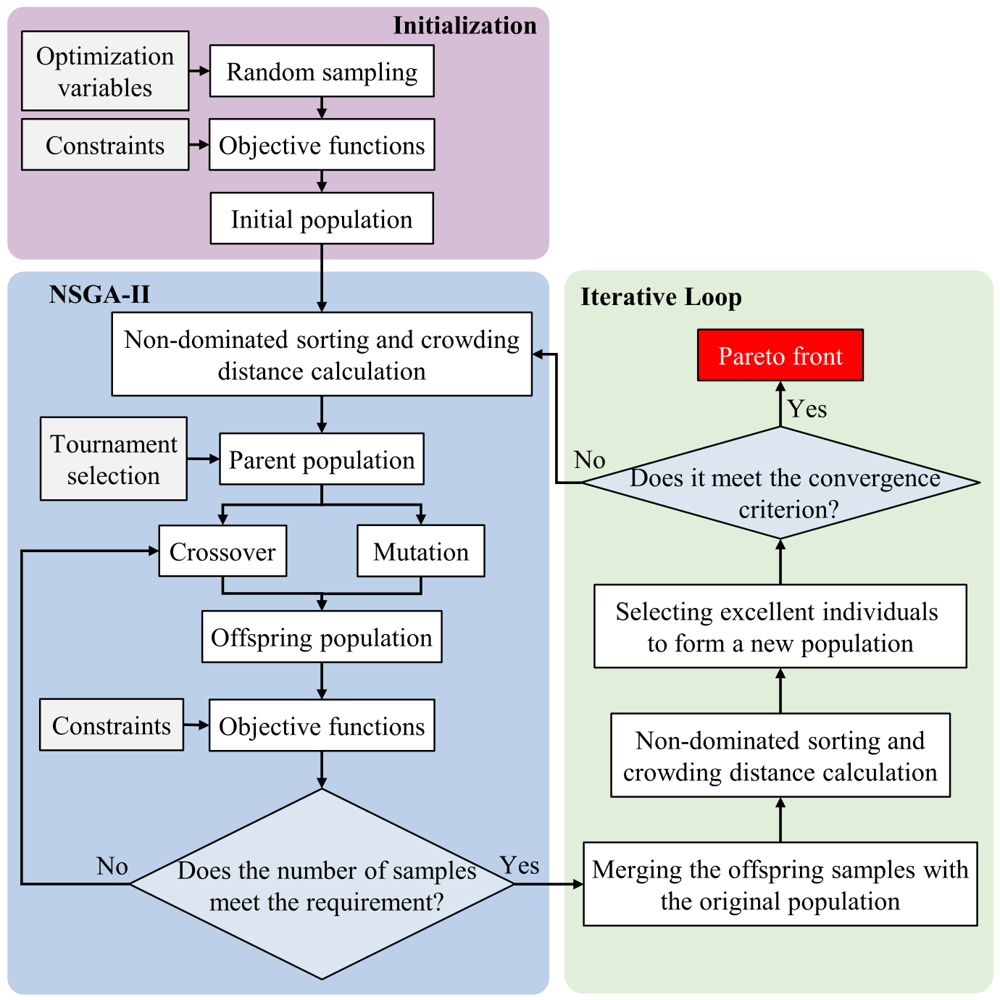

   **图 12** NSGA-II 多目标遗传优化流程

   初始化：优化变量、随机采样、约束、目标函数、初始种群。NSGA-II：非支配排序与拥挤距离计算、锦标赛选择、父代种群、交叉、变异、子代种群、约束与目标函数评价、样本数是否满足要求。迭代循环：子代与原种群合并、非支配排序与拥挤距离计算、选择优秀个体形成新种群、是否满足收敛判据；满足则输出 Pareto 前沿，未满足则继续迭代。

4.5 优化结果分析
~~~~~~~~~~~~~~~~

4.5.1 收敛曲线
^^^^^^^^^^^^^^

图 13 展示 NSGA-II 多目标优化过程的收敛曲线。优化在第 164 代收敛，此时收敛指标 :math:`I_t` 达到预设阈值 0.03，从而识别出 Pareto 前沿解。

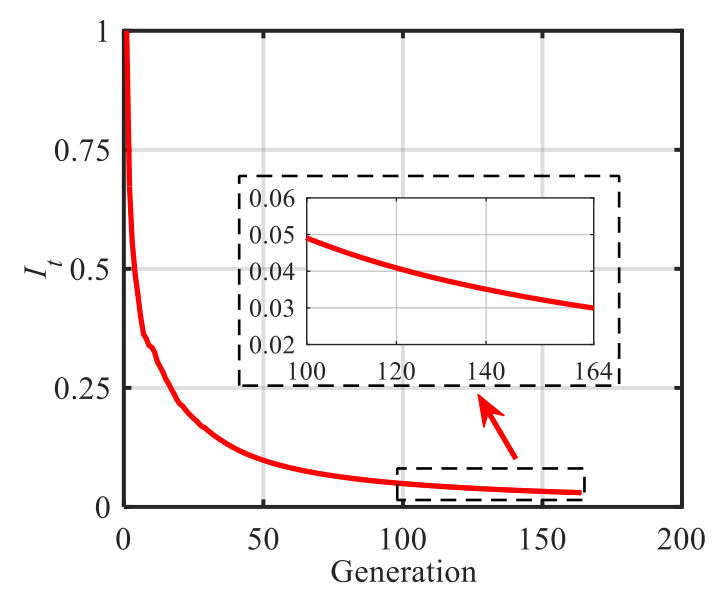

   **图 13** 迭代结果

   横轴为代数，纵轴为收敛指标 I_t；局部放大图保留第 100–164 代的变化。

4.5.2 Pareto 前沿
^^^^^^^^^^^^^^^^^

图 14 和图 15 对初始种群以及第 160、162、164 代种群，即 Pareto 前沿解进行可视化比较，展示 50 个设计样本在主尺度优化变量上的分布。图 14(a) 表示四个种群中浮筒宽度、外立柱半径和吃水这三个关键变量之间的关系；图 14(b)–(d) 分别给出它们在 XY、XZ 和 YZ 平面的投影。可以明显看出，第 160、162 代与 Pareto 前沿的参数分布与初始种群差异不大，表明 NSGA-II 算法成功引导种群收敛至最优状态。值得注意的是，Pareto 前沿样本的浮筒宽度和吃水在搜索范围内分布较均匀。具体而言，浮筒宽度主要介于 4–6.5 m，吃水介于 20–36 m，外立柱半径则集中在 6 m 和 7 m 附近。

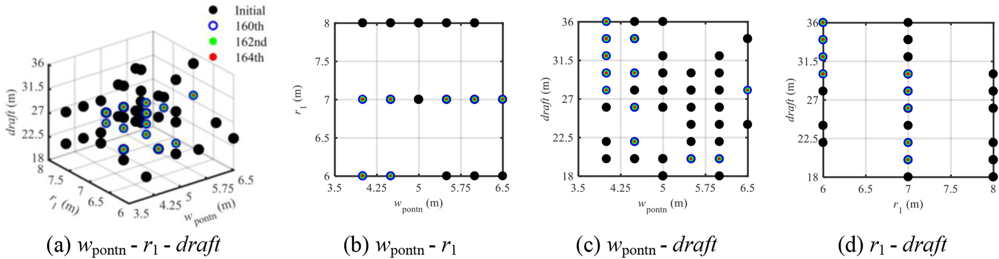

   **图 14** 主尺度优化变量比较：浮筒宽度、外立柱半径与吃水

   (a) 三变量关系；(b) 浮筒宽度—外立柱半径；(c) 浮筒宽度—吃水；(d) 外立柱半径—吃水。Initial 为初始种群，160th、162nd、164th 为第 160、162、164 代。

类似地，图 15(a) 表示四个种群中系泊线长度、锚链直径和柱间距的相互关系，图 15(b)–(d) 同样给出 XY、XZ 和 YZ 平面投影。上述三个后期种群中的主尺度变量呈稳定趋势，变化极小，确认优化已达到满意的收敛程度。此外，Pareto 前沿样本显示，系泊线长度和锚链直径在各自定义域内也选取得较为均匀。一个有趣现象是锚链直径与柱间距存在明显相关性：随着柱间距增大，算法倾向于选择更大的锚链直径。原因是柱间距增大会加长系泊线的海床触底段，因而降低系泊线恢复刚度，削弱系统恢复能力。为补偿这一影响并满足约束，遗传选择机制偏好锚链直径较大的设计，增强系泊浮体的浮力。这一发现不仅与此前钢制平台—系泊系统一体化主尺度优化研究的结果一致（\ `Zhou et al., 2020b <#he2026struct-r55>`__\ ），也进一步强调，无论浮式风机平台采用何种建造材料，平台—系泊系统一体化主尺度优化都很重要。

.. note::

   译者注：“增强系泊浮体的浮力”是本段原文的解释；本文所示锚链与平台布置并未给出该解释的独立量化验证，不能据此自行替换为其他受力机制。

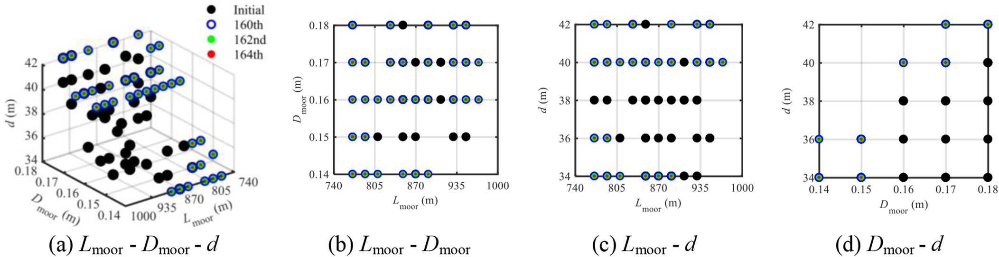

   **图 15** 主尺度优化变量比较：系泊线长度、锚链直径与柱间距

   (a) 三变量关系；(b) 系泊线长度—锚链直径；(c) 系泊线长度—柱间距；(d) 锚链直径—柱间距。种群图例与图 14 相同。

进一步考察主尺度多目标优化，图 16 展示初始种群、第 160 代、第 162 代和 Pareto 前沿解的目标函数演化。图 16(a) 绘制塔底全寿命疲劳损伤 :math:`D_{\mathrm{TwrBs}}`\ 、导缆孔疲劳损伤 :math:`D_{\mathrm{FairLd}}` 与总建造成本 :math:`TC` 三个目标之间的关系；第 160 代、第 162 代与 Pareto 前沿的数值几乎重合，确认收敛性良好。图 16(b)–(d) 的投影进一步显示 Pareto 前沿解的若干特征：\ :math:`D_{\mathrm{TwrBs}}` 与 :math:`D_{\mathrm{FairLd}}` 没有显著相互依赖；\ :math:`D_{\mathrm{TwrBs}}` 与 :math:`TC` 仅呈弱相关；而从图 16(c)、(d) 可见，\ :math:`D_{\mathrm{FairLd}}` 与 :math:`TC` 显著相关，且 :math:`D_{\mathrm{FairLd}}` 越小，\ :math:`TC` 越大，说明采用混凝土后，系泊系统成本已成为影响 :math:`TC` 的关键因素。这与钢平台研究中 :math:`D_{\mathrm{FairLd}}` 和 :math:`TC` 相关性较强、下部结构 :math:`TC` 主要由平台决定的结论不同（\ `Zhou et al., 2023 <#he2026struct-r57>`__\ ），因为新平台采用钢筋混凝土后，其平台 :math:`TC` 大幅降低。这表明，浮式风机平台采用钢筋混凝土等比钢材便宜的材料时，设计者应更重视系泊系统影响；与钢结构相比，钢筋混凝土半潜式平台设计更有必要考虑与系泊系统的一体化优化。

.. note::

   译者注：上一段按原文保留两个“相关性强”的表述。原文先述本研究 :math:`D_{\mathrm{FairLd}}` 与 :math:`TC` 显著相关，随后又把钢平台的“相关性较强”称为不同结论，其比较措辞自身不够清晰；不能据此推断或改写既有钢平台研究的相关性方向。

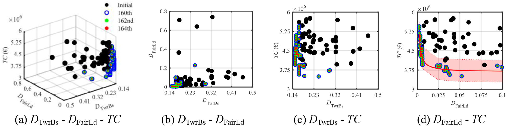

   **图 16** 目标函数比较

   (a) 塔底疲劳损伤—导缆孔疲劳损伤—总建造成本；(b) 两类疲劳损伤；(c) 塔底疲劳损伤—成本；(d) 导缆孔疲劳损伤—成本。成本单位为欧元，种群图例与图 14 相同。

为进一步探索 Pareto 前沿解的目标函数与主尺度优化变量之间的关系，图 17 显示，柱半径较小、柱间距较大、吃水较深的设计倾向于具有较小的 :math:`D_{\mathrm{TwrBs}}`\ ；类似地，对于锚链直径较大的设计，较小的柱半径对应较小的 :math:`D_{\mathrm{FairLd}}`\ 。这一结论与钢平台研究的发现一致（\ `Ghigo et al., 2020 <#he2026struct-r20>`__; `Camus et al., 2011 <#he2026struct-r05>`__\ ）：较小半径、较大间距和较深吃水可降低水动力影响，进而降低 :math:`D_{\mathrm{TwrBs}}`\ 。此外，锚链直径是 :math:`D_{\mathrm{FairLd}}` 的决定性因素，增大系泊链直径将显著降低导缆孔疲劳损伤。

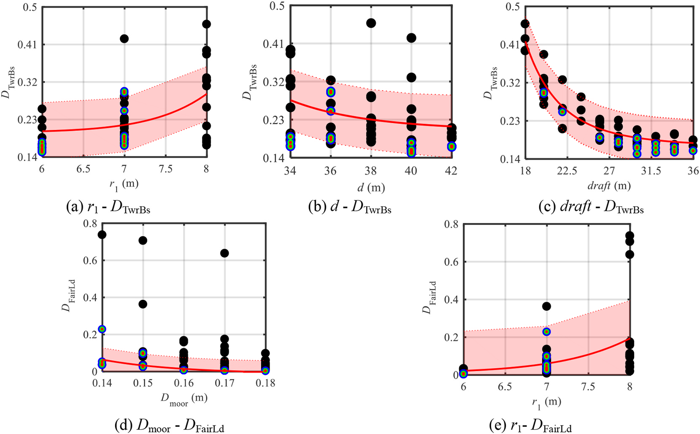

   **图 17** 优化变量与目标函数关系比较

   (a) 外立柱半径—塔底疲劳损伤；(b) 柱间距—塔底疲劳损伤；(c) 吃水—塔底疲劳损伤；(d) 锚链直径—导缆孔疲劳损伤；(e) 外立柱半径—导缆孔疲劳损伤。

5 性能特征比较
--------------

5.1 最优设计方案选择
~~~~~~~~~~~~~~~~~~~~

本研究目标之一是实现浮式风机降本增效。因此，从 50 个最优主尺度方案中选择成本效益最好的方案，作为新平台的最优设计，参数见表 6。将新平台与 LIFES 50+ 项目的 OO-Star（\ `Yu et al., 2018 <#he2026struct-r47>`__\ ）进行全面性能比较。OO-Star 的设计见图 18，两种平台的物理特性见表 7。两种平台都搭载 DTU 10 MW 风机并采用混凝土材料，但外观明显不同，主要体现在浮筒布置。与 OO-Star 相比，新平台将浮筒布置在内立柱中部，提高浮心位置。此外，被动压载块使重心低于浮心。新平台的立柱不变径，有利于标准化生产。两种平台均为柱稳式，三个外立柱沿周向均匀分布，中央立柱直接与风机塔架相连。两种平台的主尺度相近，柱间距 :math:`d` 为 36–37 m，吃水均为 22 m。值得注意的是，新平台最优方案的总质量与排水体积约为 OO-Star 的一半，显著减小了其规模。

.. list-table:: 表 6 新平台最优设计方案参数
   :header-rows: 1

   * - 参数
     - 数值
     - 单位
   * - 外立柱半径 :math:`r_1`
     - 7
     - m
   * - 内立柱半径 :math:`r_2`
     - 6.5
     - m
   * - 柱间距 :math:`d`
     - 36
     - m
   * - 浮筒高度 :math:`h_{\mathrm{pontn}}`
     - 4.8
     - m
   * - 浮筒宽度 :math:`w_{\mathrm{pontn}}`
     - 6.0
     - m
   * - 浮筒吃水 :math:`draft_{\mathrm{pontn}}`
     - 8.0
     - m
   * - 内垂荡板半径 :math:`r_3`
     - 13
     - m
   * - 外垂荡板半径 :math:`r_4`
     - 16.8
     - m
   * - 系泊线长度 :math:`L_{\mathrm{moor}}`
     - 790
     - m
   * - 系泊链直径 :math:`D_{\mathrm{moor}}`
     - 0.14
     - m

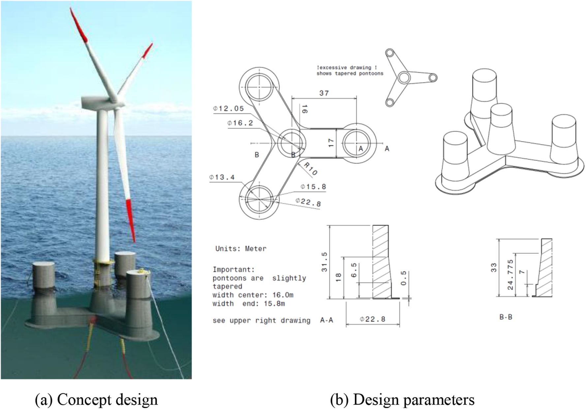

   **图 18** LIFES50+ OO-Star 项目（\ `Yu et al., 2018 <#he2026struct-r47>`__\ ）

   (a) 概念设计；(b) 设计参数，尺寸单位为 m。原图说明：浮筒略呈渐缩形，中心宽 16.0 m、端部宽 15.8 m，并给出 A-A、B-B 截面及渐缩浮筒示意。

.. list-table:: 表 7 新平台最优设计与 OO-Star 物理特性参数比较
   :header-rows: 1

   * - 参数
     - 新平台
     - OO-Star
     - 单位
   * - 重心
     - (0, 0, −11.3823)
     - (0, 0, −15.225)
     - m
   * - 浮心
     - (0, 0, −10.8410)
     - (0, 0, −14.236)
     - m
   * - :math:`I_{xx}`
     - 7.0744×10⁹
     - 9.43×10⁹
     - kg·m²
   * - :math:`I_{yy}`
     - 7.0744×10⁹
     - 9.43×10⁹
     - kg·m²
   * - :math:`I_{zz}`
     - 1.195×10¹⁰
     - 1.63×10¹⁰
     - kg·m²
   * - 吃水
     - 22
     - 22
     - m
   * - 总质量
     - 1.2678×10⁷
     - 2.1709×10⁷
     - kg
   * - 排水体积
     - 1.4510×10⁴
     - 2.3509×10⁴
     - m³

5.2 水动力性能
~~~~~~~~~~~~~~

响应幅值算子（Response Amplitude Operator，RAO）描述单位波高规则波作用下的结构响应幅值，是评价浮体一阶水动力特性的重要指标，尤其用于评价其抵抗波浪荷载的能力。目标海域的主导波向为东南方向，见图 11(d)；此处仅展示两种平台在 135° 波向下的 RAO 比较，如图 19 所示。可得以下结论：对于水平运动自由度，即纵荡和横荡，两种平台的 RAO 峰值均位于低频区，小于 0.1 rad/s，峰值响应相近。对于垂荡，两种平台均在约 0.3 rad/s 处出现峰值，对应垂荡固有频率。在峰值响应及背景波频范围内，新平台的 RAO 均显著低于 OO-Star，说明其垂荡运动性能较好，抵抗波浪荷载的能力较强。在纵摇和横摇自由度上，两种平台的 RAO 峰值均出现在约 0.2 rad/s，对应横摇和纵摇固有频率，新平台峰值略小于 OO-Star。此外，新平台在波频区出现一个小峰值，由背景波频响应的激励造成，示意见图 11(b)。可以明显看出，在背景波频范围内，新平台的 RAO 幅值略低于 OO-Star，表明新平台抵抗波浪荷载的横摇与纵摇性能略优于 OO-Star。

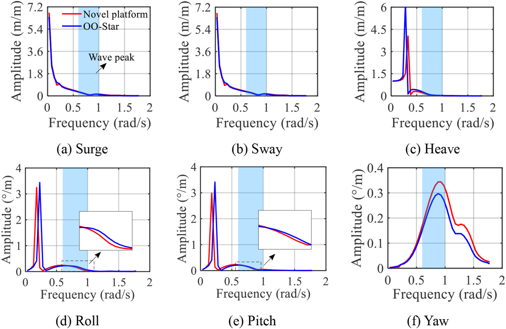

   **图 19** 两种平台在 135° 波向下的 RAO 比较

   (a) 纵荡；(b) 横荡；(c) 垂荡；(d) 横摇；(e) 纵摇；(f) 艏摇。红色为新平台，蓝色为 OO-Star；横轴为频率（rad/s），平移幅值单位 m/m，转动幅值单位 °/m，浅蓝区域为波浪峰频区。

.. note::

   译者注：图 19 的红线为新平台、蓝线为 OO-Star。(d)、(e) 的局部放大窗内，红线在左端短区间略高，随后与蓝线交叉，并在放大窗其余大部分区间低于蓝线；原图放大窗没有独立坐标刻度，无法从图面可靠给出交叉的精确频率。因此，原文“背景波频范围内略低”的概括不应扩展为整个区间处处严格更低，也不能反向概括为红线在整个放大区均高于蓝线。该图只对应 135° 波向，不等于多波向风浪联合海况下的长期倾角表现。

5.3 长期动力响应
~~~~~~~~~~~~~~~~

新平台的长期动力响应已在主尺度优化过程中通过快速动力响应分析程序计算。这里单独列出成本最优方案的长期动力响应结果。对 OO-Star 也利用 ROM 按与新平台相同的流程计算长期动力响应，因此不再详述。

两种平台的长期动力响应比较汇总于表 8。总体而言，两种平台均满足第 4.2 节的约束和规范要求，表明设计合理。具体而言，新平台的 :math:`D_{\mathrm{TwrBs}}` 和 :math:`D_{\mathrm{FairLd}}` 指标分别比 OO-Star 改善 36% 和 21%。这些指标反映延长浮式风机服役寿命的潜力，意味着新平台最优设计相较 OO-Star 的长期服役性能提升可达 36%。这说明从降本增效角度，新平台具有更大优势和潜力，可带来更显著的长期经济效益。在 :math:`a_{\mathrm{nac},10p}` 指标上，新平台比 OO-Star 改善 13%。但在 :math:`q_{\mathrm{tilt},10p}` 指标上，新平台相较 OO-Star 的性能略有下降，尽管仍低于 10° 的规范限值；鉴于长期动力响应分析更加重视浮式风机的长期服役性能，认为这一差异可以接受。

.. list-table:: 表 8 两类平台长期动力响应比较
   :header-rows: 1

   * - 类型
     - :math:`q_{\mathrm{tilt},10p}`\ （°）
     - :math:`a_{\mathrm{nac},10p}`\ （m/s²）
     - :math:`D_{\mathrm{TwrBs}}`\ （无量纲）
     - :math:`D_{\mathrm{FairLd}}`\ （无量纲）
   * - 新平台
     - 8.4970
     - 1.8929
     - 0.2503
     - 0.2271
   * - OO-Star
     - 5.2884
     - 2.1744
     - 0.3926
     - 0.2891
   * - 约束
     - ≤10°
     - ≤0.3g
     - ≤0.5
     - ≤0.5
   * - 性能（原表）
     - −60%
     - 13%
     - 36%
     - 21%

.. note::

   译者注：表 8 的倾角从 5.2884° 增至 8.4970°，按表列值计算增加约 60.67%，不能把原文“略有下降”理解为倾角只小幅恶化。表中的性能行记作 −60%，本页原样保留。塔底和导缆孔的 36%、21% 是累计疲劳损伤降幅；“长期服役性能提升 36%”属于作者的概括，并不是试验验证的寿命延长 36%。

5.3.1 运动响应对长期动力响应的影响
^^^^^^^^^^^^^^^^^^^^^^^^^^^^^^^^^^

为进一步分析两类平台长期动力响应指标差异的内在原因，本节比较 ROM 框架内 Kriging 代理模型预测的 1000 个典型风浪联合真实海况下的运动和荷载响应。

图 20(a) 展示水平运动响应，即利用三角形法则合成的纵荡与横荡运动。图中，两平台标准差比较的拟合曲线位于对角线下方，且在超过一半的海况中，新平台的水平运动响应低于 OO-Star。这表明从长期角度看，新平台的水平运动性能优于 OO-Star。

图 20(b) 比较倾斜运动响应标准差。可以看出，两种平台的倾角响应标准差主要集中在 0.2°–0.4°，拟合曲线位于对角线上方。在超过一半的海况中，新平台倾角响应大于 OO-Star，表明从长期趋势看，新平台的倾斜运动性能不及 OO-Star。这一趋势与图 19(d)、(e) 中的横摇、纵摇 RAO 相反，主要有两个原因：研究表明倾角响应显著受波向影响（\ `Zhou et al., 2020a <#he2026struct-r54>`__\ ），图 19 的 RAO 仅对应单一波向，而实际海况包含多种波向；另一方面，研究指出，在风浪联合条件下，尤其是风浪同向时，浮式平台的倾斜运动响应比单独风或浪作用更复杂、更强烈，一阶水动力特性并不是倾角响应的唯一决定因素，风荷载可能起更关键的作用（\ `Zhou et al., 2021 <#he2026struct-r56>`__\ ）。本研究采用风浪联合的实际海况，而平台 RAO 趋势仅反映一阶波浪力形成的固有特性，没有考虑风荷载影响。这些因素解释了两种平台在 1000 个实际海况下倾角响应标准差长期趋势的差异，并印证长期动力响应指标 :math:`q_{\mathrm{tilt},10p}` 的差异。

图 20(c)、(d) 分别比较两种平台的机舱加速度与垂荡运动响应标准差。机舱加速度响应标准差集中在 0.02–0.18 m/s²，垂荡运动响应主要集中在 0.1 m 以下。类似地，标准差拟合曲线位于对角线下方，且在超过一半海况中，新平台的机舱加速度和垂荡运动响应低于 OO-Star。这说明从长期角度看，新平台的机舱加速度与垂荡性能优于 OO-Star。机舱加速度和垂荡响应通常由一阶水动力特性控制（\ `Zhou et al., 2021 <#he2026struct-r56>`__\ ），与图 19 的 RAO 一致，最终反映在长期动力响应指标 :math:`a_{\mathrm{nac},10p}` 中。

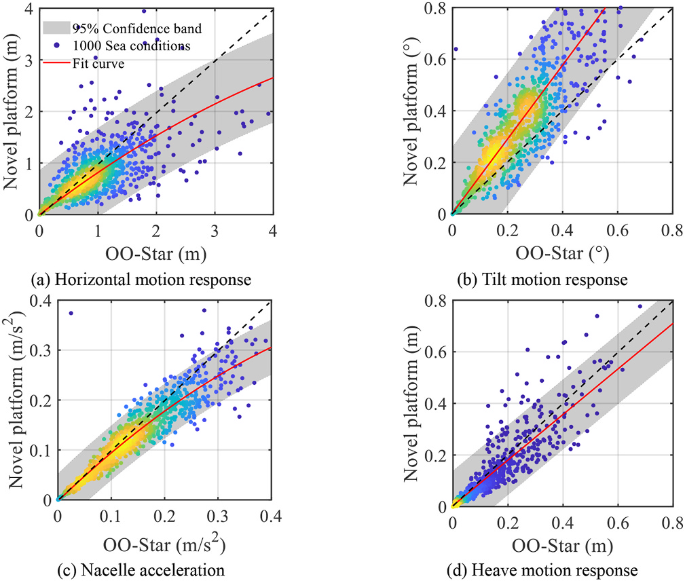

   **图 20** 新平台与 OO-Star 在 1000 个实际海况下的运动响应标准差比较

   (a) 水平运动响应；(b) 倾斜运动响应；(c) 机舱加速度；(d) 垂荡运动响应。横轴为 OO-Star，纵轴为新平台；95% Confidence band 为 95% 置信带，1000 Sea conditions 为 1000 个海况，Fit curve 为拟合曲线。

5.3.2 荷载响应对长期动力响应的影响
^^^^^^^^^^^^^^^^^^^^^^^^^^^^^^^^^^

图 21 比较新平台与 OO-Star 在 1000 个实际海况下的塔底弯矩标准差。总体而言，塔底弯矩标准差的拟合曲线位于对角线下方，说明在超过一半海况中，新平台的塔底弯矩小于 OO-Star，表明从长期角度看，新平台的塔底荷载动力性能优于 OO-Star。主要原因是浮式风机塔底弯矩由四种因素共同形成：平台摇摆、摇摆惯性矩，以及重力倾覆力矩和风致倾覆力矩的联合作用。前两个因素是机舱加速度响应的幂函数，变化显著。机舱加速度引起的惯性矩是塔底总弯矩的重要组成，使机舱加速度与塔底弯曲存在很强的相关性。此外，塔底弯矩还受一阶水动力影响，与图 19 和图 20(c) 的趋势一致。再者，平台纵摇过程中，塔架与机舱结构重力对塔底弯矩的贡献相较机舱加速度较小，这是因为倾斜时重力传递到塔底的水平力臂较短，而且浮式平台通常倾斜运动很小，因此该因素不够显著。所以，尽管图 20(b) 显示新平台倾角响应比 OO-Star 更大，对塔底弯矩的影响仍很小。上述因素共同影响两平台塔底弯曲荷载水平，产生图中现象。由于塔底弯矩是塔底疲劳损伤的主要原因，该差异最终体现在塔底长期动力响应指标 :math:`D_{\mathrm{TwrBs}}` 中。

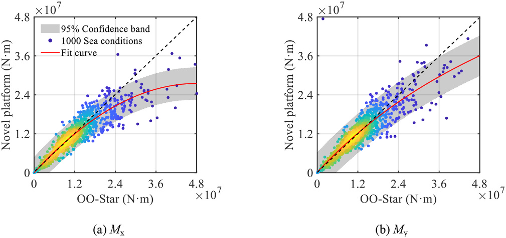

   **图 21** 新平台与 OO-Star 在 1000 个实际海况下的塔底弯矩标准差比较

   (a) 绕 X 轴弯矩 M_x；(b) 绕 Y 轴弯矩 M_y，单位 N·m。横纵轴平台、置信带、海况与拟合曲线图例同图 20。

最后，简要讨论系泊线张力对两种平台长期动力响应指标的影响。图 22 比较两种平台在 1000 个实际海况下三根系泊线张力的标准差与均值，编号见图 9。比较发现，与上述运动和塔底弯矩响应不同，1000 个海况下系泊线张力散点明显更分散。不过，系泊线张力标准差与均值的拟合曲线都明显位于对角线下方，说明在超过一半的海况中，新平台系泊线张力小于 OO-Star。这表明从长期角度看，新平台承受的系泊荷载比 OO-Star 小。此外，均值清楚显示 OO-Star 承受更大的系泊荷载。由于系泊荷载是导缆孔疲劳损伤的主要因素，该趋势最终反映在导缆孔长期动力响应指标 :math:`D_{\mathrm{FairLd}}` 中。差异主要有两个原因：一是新平台的系泊链直径略大于 OO-Star，显著降低拉应力变化，减轻疲劳损伤；二是如图 20(a) 的分析，新平台在实际海况下水平运动响应较小，从而位移响应较低，系泊荷载相应降低。

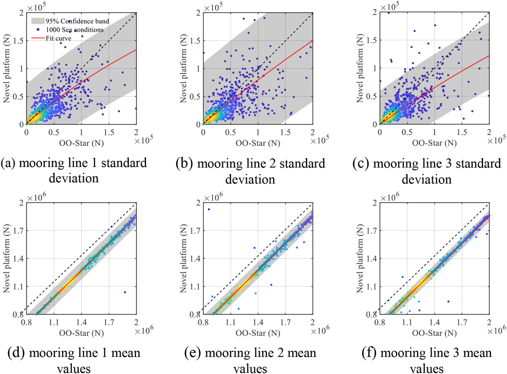

   **图 22** 新平台与 OO-Star 在 1000 个实际海况下三根系泊线张力的标准差与均值比较

   (a)–(c) 系泊线 1–3 张力标准差；(d)–(f) 系泊线 1–3 张力均值，单位 N。横纵轴平台及置信带、海况、拟合曲线图例同图 20。

5.4 短期动力响应
~~~~~~~~~~~~~~~~

完成主尺度优化和长期动力响应比较后，新平台概念设计阶段的分析已经完成。本节开始针对新平台最优设计方案开展初步设计阶段的性能分析。采用更高保真度的时域数值模拟方法 OpenFAST，在目标海域多个典型海况下，详细比较两种平台的全耦合短期动力响应。参考 LIFES 50+ 研究（\ `Pegalajar-Jurado et al., 2018 <#he2026struct-r38>`__\ ），本节从目标海域选取四类共十一个典型工况，分析两类平台。表 9 给出各仿真工况的具体设置，其中风场采用 TurbSim 软件基于 Kaimal 谱生成的湍流风，湍流等级为 C 级，风速值表示轮毂高度处均值；波浪环境采用 Pierson–Moskowitz 谱模拟不规则波，风向和波向均为 0°。

.. list-table:: 表 9 两套 FAST 模型进行的时域仿真汇总
   :header-rows: 1

   * - 类别
     - 工况
     - 时长
     - 波浪
     - 风
     - 风机状态
   * - 数值模型验证
     - 自由衰减
     - —
     - —
     - —
     - 停机
   * - 正常运行
     - DLC1
     - 5400 s
     - 不规则波 H=1.38 m，T=7.0 s
     - 湍流风 5.0 m/s
     - 运行；主动控制
   * - 正常运行
     - DLC2
     - 5400 s
     - 不规则波 H=1.67 m，T=8.0 s
     - 湍流风 7.1 m/s
     - 运行；主动控制
   * - 正常运行
     - DLC3
     - 5400 s
     - 不规则波 H=2.20 m，T=8.0 s
     - 湍流风 10.3 m/s
     - 运行；主动控制
   * - 正常运行
     - DLC4
     - 5400 s
     - 不规则波 H=3.04 m，T=9.5 s
     - 湍流风 13.9 m/s
     - 运行；主动控制
   * - 正常运行
     - DLC5
     - 5400 s
     - 不规则波 H=4.29 m，T=10.0 s
     - 湍流风 17.9 m/s
     - 运行；主动控制
   * - 正常运行
     - DLC6
     - 5400 s
     - 不规则波 H=6.20 m，T=12.5 s
     - 湍流风 22.1 m/s
     - 运行；主动控制
   * - 正常运行
     - DLC7
     - 5400 s
     - 不规则波 H=8.31 m，T=12.0 s
     - 湍流风 25.0 m/s
     - 运行；主动控制
   * - 极限运行
     - UL1
     - 5400 s
     - 不规则波 H=10.90 m，T=16.0 s
     - 湍流风 7.1 m/s
     - 运行；主动控制
   * - 极限运行
     - UL2
     - 5400 s
     - 不规则波 H=10.90 m，T=16.0 s
     - 湍流风 22.1 m/s
     - 运行；主动控制
   * - 极端停机
     - EX1
     - 5400 s
     - 不规则波 H=10.90 m，T=16.0 s
     - 湍流风 44.0 m/s
     - 停机；叶片顺桨

5.4.1 数值模型验证
^^^^^^^^^^^^^^^^^^

在计算短期动力响应之前，对两类浮式风机数值模型进行自由衰减运动验证。其主要目的有二：一是考察两模型六自由度（6-DoF）的固有周期；二是评估概念设计阶段 ROM 的保真度，因为当时优先考虑计算效率与大量方案比较，可能牺牲部分精度。

图 23 给出两个模型的六自由度时域自由衰减运动响应，由此求得固有周期，见表 10。按照第 4.2 节对固有周期的约束，表 10 表明两个模型的六自由度固有周期都在合理范围内，与目标海域的主导波浪周期充分错开，见图示，从而有效降低波频共振风险，保证良好的水动力性能。此外，表 10 显示，两模型采用 ROM 与 OpenFAST 计算的固有周期最大相对误差约为 10%，在可接受范围内。这说明为两类浮式风机建立的快速动力响应数值模型基本准确，满足概念设计阶段分析要求。

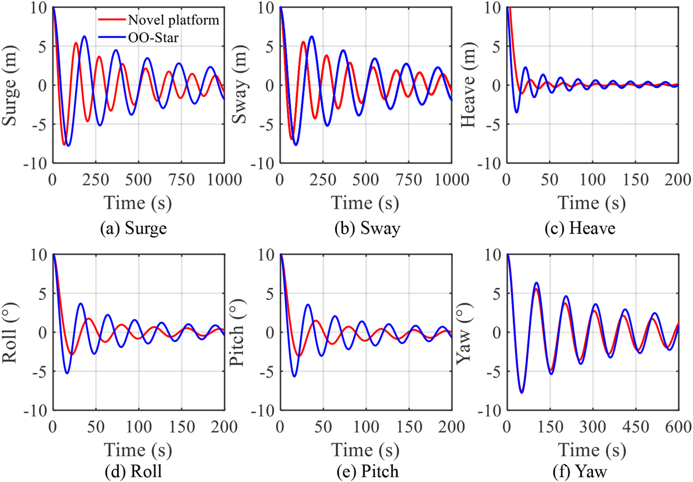

   **图 23** 两类模型的六自由度自由衰减时程

   (a) 纵荡；(b) 横荡；(c) 垂荡；(d) 横摇；(e) 纵摇；(f) 艏摇。红色为新平台，蓝色为 OO-Star；时间单位 s，平移单位 m，转角单位 °。

.. list-table:: 表 10 两类模型的固有周期比较
   :header-rows: 1

   * - 类型
     - 方法
     - 纵荡
     - 横荡
     - 垂荡
     - 横摇
     - 纵摇
     - 艏摇
   * - 新平台
     - OpenFAST（s）
     - 137.0
     - 137.4
     - 20.0
     - 34.2
     - 34.5
     - 102.3
   * - 新平台
     - ROM（s）
     - 136.9
     - 136.9
     - 19.0
     - 31.4
     - 31.3
     - 103.2
   * - 新平台
     - 误差（%）
     - −0.07
     - −0.4
     - −5.0
     - −8.2
     - −9.3
     - 0.9
   * - OO-Star
     - OpenFAST（s）
     - 181.8
     - 182.3
     - 20.4
     - 31.3
     - 31.3
     - 116.3
   * - OO-Star
     - LIFES 50+（s）
     - 181.8
     - 181.8
     - 20.4
     - 31.3
     - 31.3
     - 116.3
   * - OO-Star
     - ROM（s）
     - 162.4
     - 162.4
     - 20.4
     - 28.4
     - 28.9
     - 118.8
   * - OO-Star
     - 误差（%）
     - −10.7
     - −10.9
     - 0.0
     - −9.3
     - −7.7
     - 2.1

5.4.2 运动响应时域仿真结果的统计分析
^^^^^^^^^^^^^^^^^^^^^^^^^^^^^^^^^^^^

本节着重研究两类浮式风机在 DLC、UL 和 EX 工况下的短期运动响应时域仿真。为印证长期动力响应分析的发现，短期运动响应分析同样关注平台水平运动（纵荡）、竖向运动（垂荡）、倾斜运动（纵摇）及机舱加速度响应。

所有工况下运动响应时域仿真结果的统计分析见图 24 和图 25。就纵荡、垂荡和机舱加速度响应而言，新平台在大多数工况中优于 OO-Star，印证第 5.3.1 节关于其长期水平、竖向运动性能和机舱加速度响应更优的结论。此外，纵荡结果表明，风荷载主要影响平均纵荡响应，而波浪荷载影响极值，即幅值，以及标准差。相比之下，垂荡与机舱加速度响应主要由波浪荷载控制。

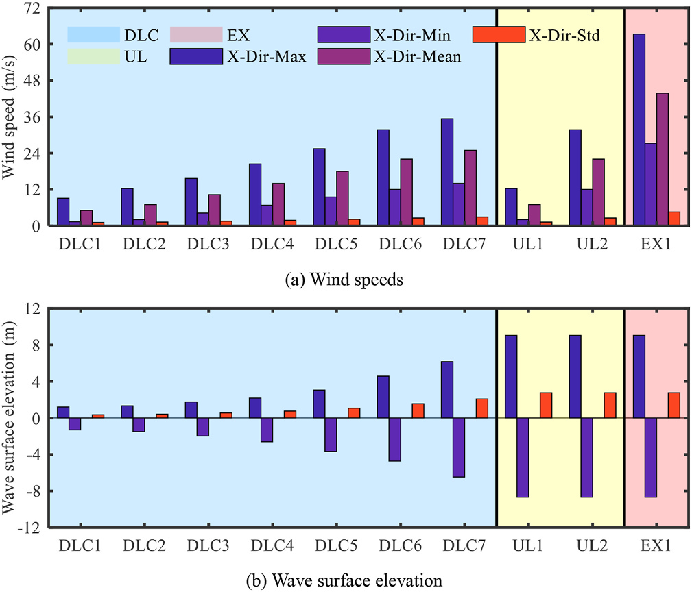

   **图 24** DLC、UL、EX 工况下环境参数的统计分析

   (a) 风速（m/s）；(b) 波面高程（m）。DLC 为正常运行，UL 为极限运行，EX 为极端停机；X-Dir 为 X 方向，Max、Min、Mean、Std 分别为最大值、最小值、均值、标准差。

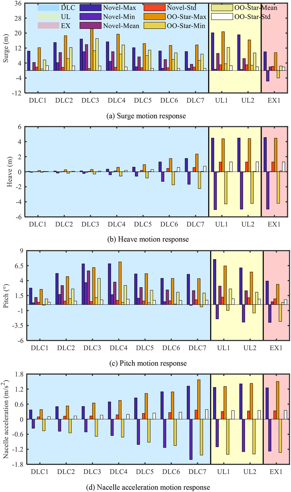

   **图 25** DLC、UL、EX 工况下运动响应时域仿真结果的统计分析

   (a) 纵荡；(b) 垂荡；(c) 纵摇；(d) 机舱加速度。Novel 为新平台；两类平台的 Max、Min、Mean、Std 分别为最大值、最小值、均值、标准差；工况分类同图 24。

值得注意的是，对纵摇响应而言，新平台在大多数工况中的纵摇运动性能不及 OO-Star。这与第 5.3.1 节的长期倾斜运动性能及极值倾角分析结果一致。不过，新平台纵摇运动响应的最大均值为 5.06°、最大幅值为 5.19°，满足 `Zambrano et al.（2006） <#he2026struct-r49>`__\ 的研究结果，即正常运行工况下平均纵摇运动响应（平均纵摇角）不应超过 ±5°，最大值（动态纵摇角）不应超过 ±15°。

.. note::

   译者注：“满足”为作者判断；原文最大均值 5.06° 与所引 ±5° 平均纵摇限值有差异，两者均按原文保留，不将其改写为严格低于限值。

5.4.3 荷载响应与发电机功率时域仿真结果的统计分析
^^^^^^^^^^^^^^^^^^^^^^^^^^^^^^^^^^^^^^^^^^^^^^^^

上一节对两类浮式风机的短期运动响应时域仿真进行了统计分析，并与长期动力响应分析相互印证。为进一步研究两类风机的荷载特征、结构承载能力和发电机功率性能，本节关注 DLC、UL 和 EX 工况下的短期荷载响应及发电机功率。重点参数包括风机推力、塔底绕 Y 轴弯矩、系泊线张力，取三根系泊线中最不利者，以及发电机功率。

所有工况下荷载和发电机功率时域仿真结果的统计分析见图 26。

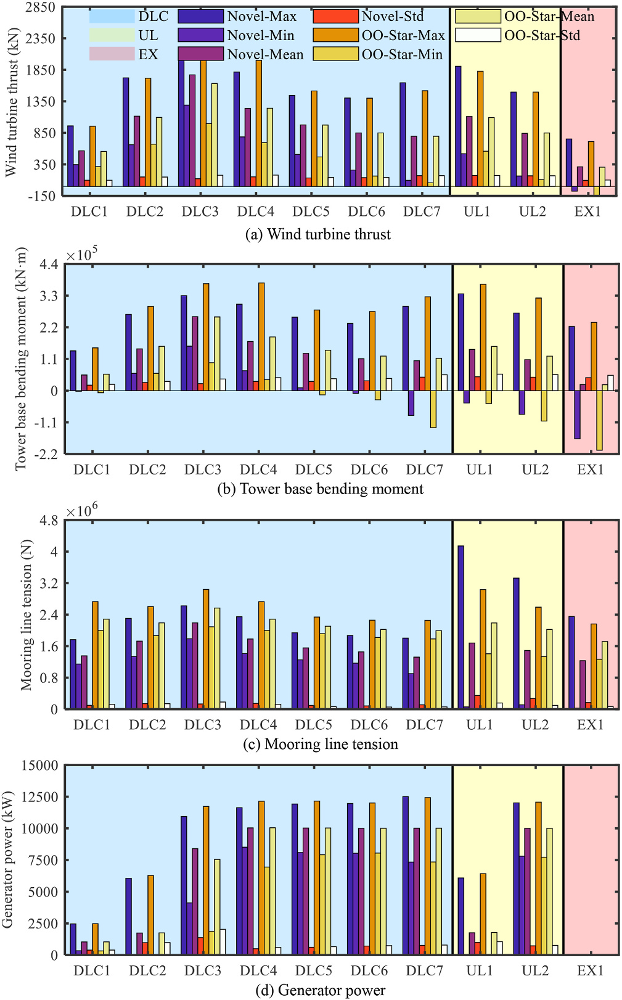

   **图 26** DLC、UL、EX 工况下荷载响应与发电机功率时域仿真结果的统计分析

   (a) 风机推力（kN）；(b) 塔底弯矩（kN·m）；(c) 系泊线张力（N）；(d) 发电机功率（kW）。平台、统计量及工况图例同图 25。

关于风机推力，两类浮式风机推力曲线几乎相同，因为二者均采用相同轮毂高度的 DTU 10 MW 风机，理论上承受相同气动荷载。这一结果表明气动荷载仿真是准确的。对于塔底弯矩，统计结果显示，在绝大多数工况中，新平台弯矩低于 OO-Star。弯矩幅值和标准差趋势与波面高度变化相符，见图 24(b)，与前文纵荡和纵摇分析一致：风荷载主要影响平均弯矩，波浪荷载主要影响幅值和标准差。这与第 5.3、5.3.2 节长期分析一致，印证新平台较好的长期塔底荷载动力性能和较低累计疲劳损伤。此外，也间接体现机舱加速度、塔底弯矩和塔底疲劳损伤之间的关系。关于系泊线张力，大多数工况中，两平台张力趋势与纵荡运动响应一致，见图 25(a)，因为系泊系统主要限制平台水平运动，尤其是纵荡位移，因此系泊张力与纵荡高度相关。还可看到，大多数工况中新平台系泊荷载低于 OO-Star。这与第 5.3、5.3.2 节关于新平台导缆孔累计疲劳损伤较低的长期分析一致。关于发电机功率，统计结果表明风机发电仅受可利用湍流风能影响。在正常运行工况下，两平台均保持风机最优运行，持续以额定容量发电，从而满足生产要求。

.. note::

   译者注：最后一句保留原文概括，但图 26(d) 中 DLC1–DLC3 的平均功率明显低于额定功率，不能据此把全部正常风速工况都解释为持续额定发电。这里呈现的是给定数值工况的功率统计，并非实际生产保证。

5.5 建造成本
~~~~~~~~~~~~

建造成本是评价设计方案综合性能特征的重要指标，因此被选为主尺度优化目标函数。本节比较新平台成本最优方案与当前主流钢制半潜式平台及 OO-Star 的总建造成本，范围包括平台结构和系泊系统。选取的钢制平台为 NAUTILUS 四柱半潜平台和 Olav Olsen Y 形半潜平台。下部结构总建造成本按第 4 节式（6）计算，结果见图 27。新平台总建造成本最低，为 348 万欧元。其中平台部分建造成本为 149 万欧元，比 NAUTILUS 和 Olav Olsen Y 平台分别降低 75% 和 71%。值得注意的是，该成本比 OO-Star 低约 30%。总体而言，新平台相较主流平台类型具有成本优势，显示出较强工程应用潜力。

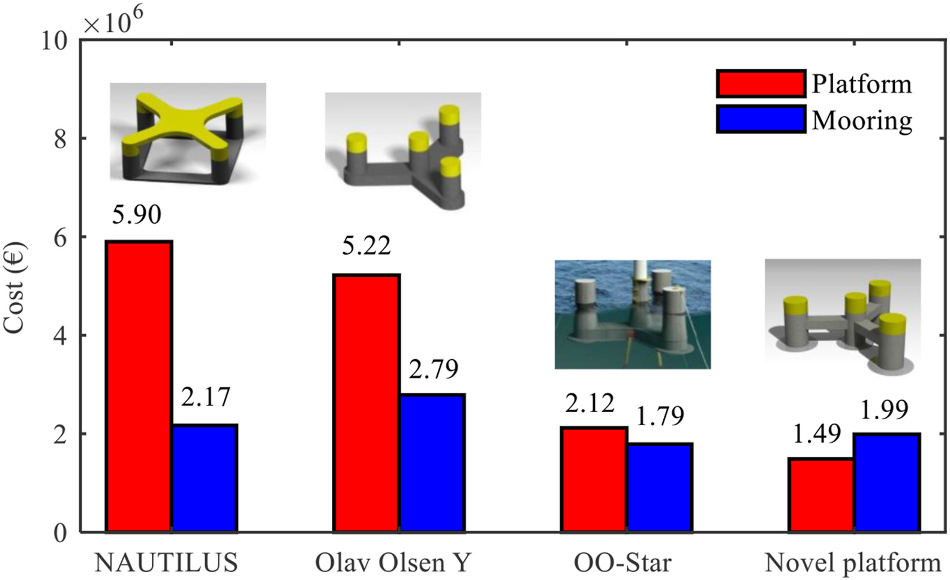

   **图 27** 总建造成本比较

   红色 Platform 为平台成本，蓝色 Mooring 为系泊成本；横轴依次为 NAUTILUS、Olav Olsen Y、OO-Star、新平台，纵轴单位欧元（×10⁶）。

.. note::

   译者注：图 27 中新平台的成本为平台 149 万欧元、系泊 199 万欧元，合计 348 万欧元。75%、71% 和约 30% 的比较针对平台部分，不是总成本的降幅；这些数值依赖第 4.3 节成本模型及单价，不能当作实际工程报价。

6 结构强度分析
--------------

在前述研究基础上，已获得通过智能算法优化的新平台最优主尺度方案，并与 OO-Star 进行了全面比较。结果表明新平台性能显著改善。然而，对浮式风机平台结构设计而言，仅进行动力性能分析不足以评价可行性。在详细设计和样机试验阶段，结构强度能否满足承载要求，是评价设计方案的关键因素。

6.1 分析模型
~~~~~~~~~~~~

6.1.1 几何模型
^^^^^^^^^^^^^^

参考国内外海洋结构设计、相关标准及经验（\ `Hussein et al., 2013 <#he2026struct-r23>`__; `Ye et al., 2019 <#he2026struct-r46>`__\ ），为提高平台整体刚度，对最优主尺度平台的内部结构进行了详细设计。立柱设置四道环向加劲肋和六道纵向加劲肋。中部两道环向加劲肋与浮筒对齐，间距等于浮筒高度，其余上下两道对称等距布置。纵向加劲肋沿圆周每隔 60° 布置。浮筒设置三道横向舱壁和一道纵向舱壁，横向舱壁等距分布，纵向舱壁直接连接立柱。布置见图 28，相应尺度参数见表 11。

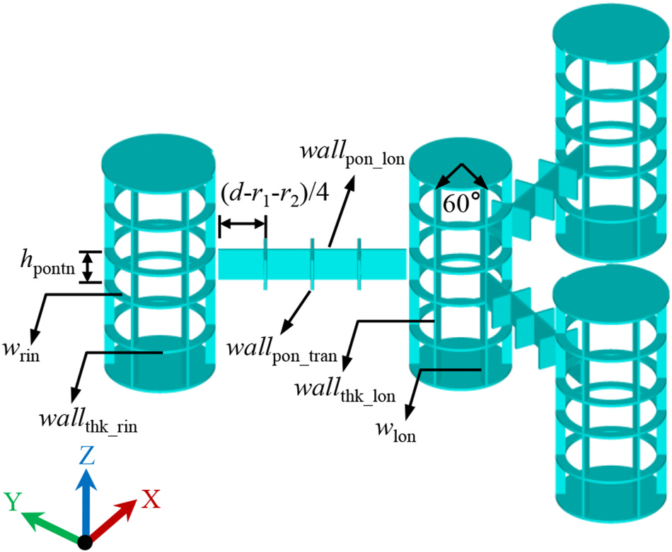

   **图 28** 新平台内部加劲肋设计

   环向、纵向加劲肋和浮筒横、纵舱壁的尺度符号按原图保留，对应含义见表 11。

.. list-table:: 表 11 新平台内部加劲肋主要尺度参数
   :header-rows: 1

   * - 基本构件
     - 材料
     - 主尺度参数
     - 数值
     - 单位
   * - 立柱加劲肋
     - C50 混凝土
     - 立柱环向加劲肋壁厚 :math:`wallthk_{\mathrm{rin}}`
     - 350
     - mm
   * - 立柱加劲肋
     - C50 混凝土
     - 立柱环向加劲肋宽度 :math:`w_{\mathrm{rin}}`
     - 1.2
     - m
   * - 立柱加劲肋
     - C50 混凝土
     - 立柱纵向加劲肋壁厚 :math:`wallthk_{\mathrm{lon}}`
     - 350
     - mm
   * - 立柱加劲肋
     - C50 混凝土
     - 立柱纵向加劲肋宽度 :math:`w_{\mathrm{lon}}`
     - 1.2
     - m
   * - 浮筒舱壁
     - C50 混凝土
     - 浮筒横向舱壁壁厚 :math:`wallpon_{\mathrm{tran}}`
     - 350
     - mm
   * - 浮筒舱壁
     - C50 混凝土
     - 浮筒纵向舱壁壁厚 :math:`wallpon_{\mathrm{lon}}`
     - 350
     - mm

6.1.2 有限元模型
^^^^^^^^^^^^^^^^

在 ANSYS 中，混凝土实体结构采用专门用于钢筋混凝土材料的 SOLID65 单元建模；垂荡阻尼板采用 SHELL63 单元建模。为便于后续强度优化及预应力筋精细建模，采用 LINK8 单元独立模拟预应力筋。混凝土采用 C50，密度为 2657 kg/m³，抗拉强度设计值与标准值分别为 1.89 MPa 和 2.64 MPa，非线性分析采用多线性各向同性强化（Multilinear Isotropic Hardening，MISO）模型。此外，普通钢筋采用直径 28 mm 的 HRB335 钢筋，并采用整体式配筋配置。预应力筋采用高强钢绞线，由多股高强钢丝绞合形成，每股直径为 15.2 mm。普通钢筋与预应力筋的钢材密度均取 7860 kg/m³，二者分析均采用双线性各向同性强化（Bilinear Isotropic Hardening，BISO）模型。

经过大量前期计算并结合实践经验，确定平台立柱的竖向预应力筋采用 8 股绞线，沿周向间隔 10° 布置；浮筒采用 6 股绞线，均匀分布于上下表面及舱壁。建立包括新平台整体结构、内部加劲肋和预应力筋的完整有限元模型，如图 29 所示。考虑非线性计算，对平台结构采用规范推荐的固定边界条件，见图 29(d)。在有限元模型中选择三个不同节点，按照 3-2-1 约束规则限制其自由度。值得注意的是，目前大多数浮式风机平台结构强度分析研究也采用固定边界条件。

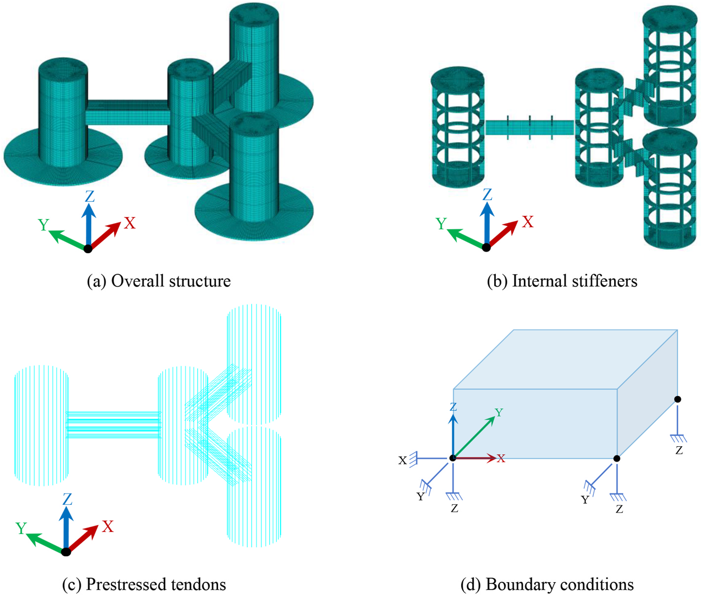

   **图 29** 新平台强度分析有限元模型

   (a) 整体结构；(b) 内部加劲肋；(c) 预应力筋；(d) 边界条件。

6.2 静力荷载计算
~~~~~~~~~~~~~~~~

6.2.1 等效设计波
^^^^^^^^^^^^^^^^

本研究采用考虑波致附加荷载效应的长期预报设计波法计算波浪荷载（\ `Zheng et al., 2025 <#he2026struct-r53>`__\ ），计算流程见图 30。首先，确定图 31 中的关键截面及其等效特征荷载，计算这些特征荷载的 RAO。与标准长期预报设计波方法不同，本文还考虑波浪引起的塔底与系泊线附加荷载：先通过 OpenFAST 得到这些附加荷载的 RAO，再将相应荷载施加到用于计算特征荷载 RAO 的 ANSYS 模型中，实现平衡求解，获得计入波致附加效应的特征荷载 RAO。根据特征荷载 RAO，为每个短期海况生成响应谱，并假定短期预报荷载响应服从 Rayleigh 分布。确定每个海况的荷载分布并结合目标海域波浪散布图，见图 32，推导特征荷载的长期概率分布。随后由重现期计算超越概率，给定超越概率对应的特征荷载响应即为该重现期的长期预报值。最大长期预报荷载 :math:`R_{\max}` 除以最大 RAO，得到等效设计波的有效波高。最后，依据 DNV 指南（\ `DNV GL-RP-C103, 2015 <#he2026struct-r11>`__\ ）和工程实践，从所有特征荷载设计波中选择用于强度分析的等效设计波工况，见表 12。

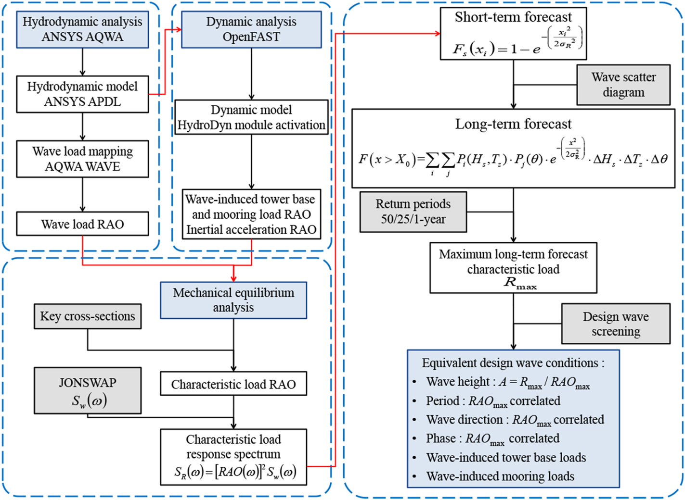

   **图 30** 考虑波致附加荷载效应的长期预报设计波方法

   图中流程：ANSYS AQWA 水动力分析、ANSYS APDL 水动力模型、AQWA WAVE 波浪荷载映射及波浪荷载 RAO；OpenFAST 动力分析、激活 HydroDyn 模块的动力模型、波致塔底与系泊荷载 RAO 及惯性加速度 RAO；关键截面、力学平衡分析、JONSWAP 谱、特征荷载 RAO 与响应谱；短期预报、波浪散布图、长期预报、50/25/1 年重现期、最大长期预报特征荷载、设计波筛选。等效设计波条件包含波高、与最大 RAO 对应的周期/波向/相位，以及波致塔底和系泊荷载。

图 30 中未编号公式的可编辑转写如下。短期预报分布：

.. math::

   F_{\mathrm s}(x_i)=1-\exp\left(-\frac{x_i^2}{2\sigma_R^2}\right)

长期预报超越分布：

.. math::

   F(x>X_0)=\sum_i\sum_j P_i(H_{\mathrm s},T_{\mathrm z})\,P_j(\theta)\,\exp\left(-\frac{x^2}{2\sigma_{R_i}^{2}}\right)\,\Delta H_{\mathrm s}\,\Delta T_{\mathrm z}\,\Delta\theta

特征荷载响应谱和设计波波高：

.. math::

   S_R(\omega)=[RAO(\omega)]^2S_{\mathrm w}(\omega),\qquad A=\frac{R_{\max}}{RAO_{\max}}

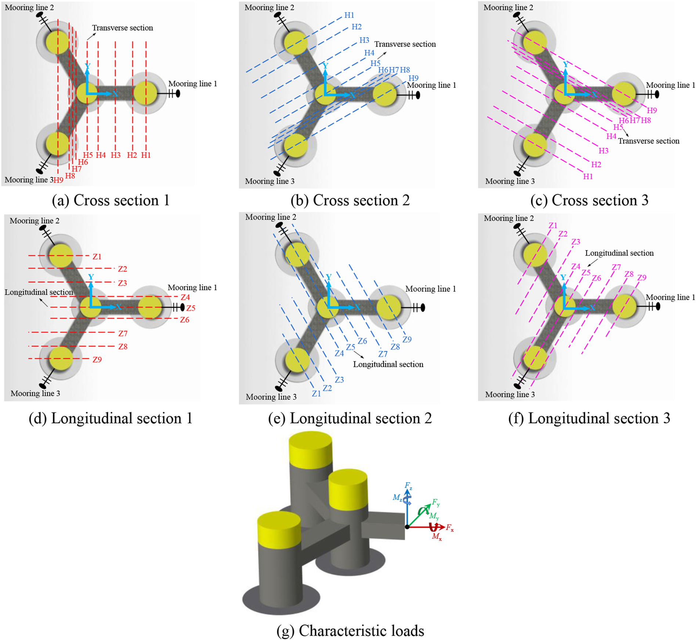

   **图 31** 关键截面及其等效特征荷载

   (a)–(c) 横截面 1–3；(d)–(f) 纵截面 1–3；(g) 特征荷载。Mooring line 为系泊线；各截面位置和三个方向的力、力矩标记按原图保留。

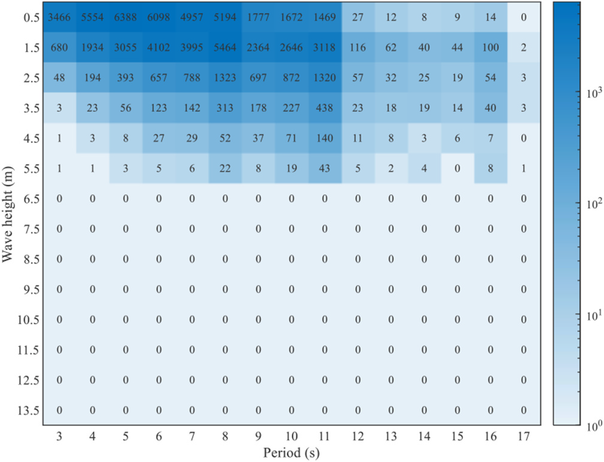

   **图 32** 目标海域波浪散布图

   横轴为周期（s），纵轴为波高（m）；保留各网格频次及对数色标。

.. list-table:: 表 12 50 年重现期的等效设计波参数
   :header-rows: 1

   * - 编号
     - 特征荷载
     - 周期（s）
     - 方向（°）
     - 波高（m）
     - 相位（°）
   * - 设计波 1
     - 分离力 :math:`F_x`\ （横截面的纵向剪力）
     - 8
     - −180
     - 9.4
     - 333.878
   * - 设计波 2
     - 纵截面的纵向剪力 :math:`F_x`
     - 7
     - 130
     - 9.7
     - 174.943
   * - 设计波 3
     - 纵截面的横向扭矩 :math:`M_y`
     - 9
     - 170
     - 9.4
     - 192.714
   * - 设计波 4
     - 纵向加速度 :math:`A_x`
     - 6
     - 0
     - 7.5
     - 168.0
   * - 设计波 5
     - 横向加速度 :math:`A_y`
     - 6
     - −120
     - 9.0
     - 168.0
   * - 设计波 6
     - 竖向加速度 :math:`A_z`
     - 11
     - −180
     - 9.6
     - 176.727

6.2.2 风荷载
^^^^^^^^^^^^

以往研究将浮式风机平台视为固定式风机，通过时域分析计算风致塔底荷载。这虽然简化了浮式风机风荷载计算，却倾向于低估荷载，因而在设计中不够保守。为此，本研究采用 OpenFAST 软件，将平台结构模拟为浮式系统，进而计算风致塔底荷载。对于极限强度分析，直接采用额定风速工况计算这些荷载。图 33 展示额定风速条件下轮毂高度处的湍流风场。受篇幅限制，图 34 仅给出不同风向塔底荷载时域计算结果的一部分。对不同风向塔底荷载结果进行统计分析，得到各等效设计波工况对应的风荷载结果，见表 13。

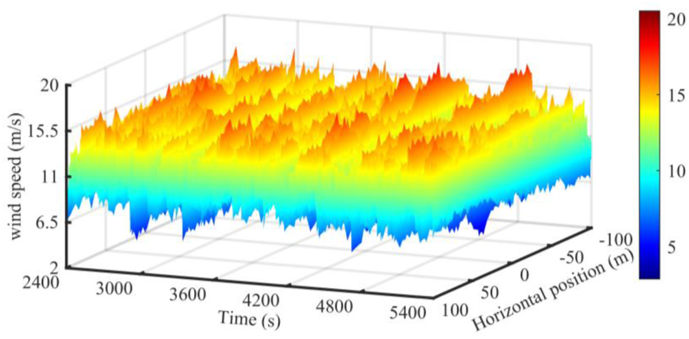

   **图 33** 额定风速下轮毂高度处湍流风场分布

   坐标为时间（s）、水平位置（m）和风速（m/s）。

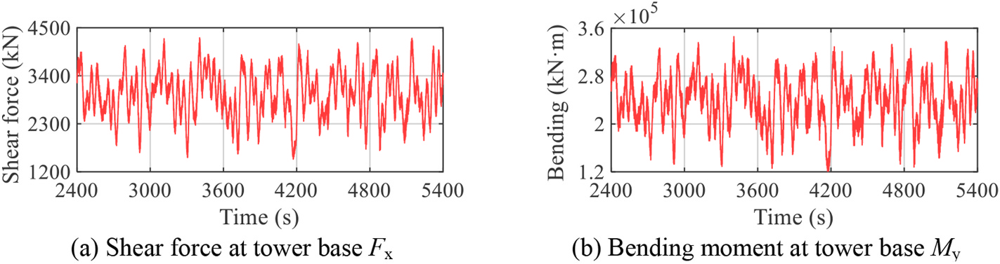

   **图 34** −180° 风向下的塔底荷载

   (a) 塔底剪力 F_x（kN）；(b) 塔底弯矩 M_y（kN·m）；横轴为时间（s）。

.. list-table:: 表 13 各设计波工况下的风致塔底荷载
   :header-rows: 1

   * - 编号
     - 方向
     - :math:`F_x`\ （kN）
     - :math:`F_y`\ （kN）
     - :math:`F_z`\ （kN）
     - :math:`M_x`\ （kN·m）
     - :math:`M_y`\ （kN·m）
     - :math:`M_z`\ （kN·m）
   * - 风荷载 1
     - −180°
     - −2979.67
     - 153.59
     - −18852.68
     - −19927.80
     - −238670.37
     - 177.20
   * - 风荷载 2
     - 130°
     - −1829.04
     - 2420.92
     - −18849.52
     - −198472.97
     - −140412.26
     - 201.27
   * - 风荷载 3
     - 170°
     - −2911.29
     - 674.42
     - −18852.38
     - −61433.32
     - −231840.12
     - 188.01
   * - 风荷载 4
     - 0°
     - 3029.66
     - −146.55
     - −18849.44
     - 19478.78
     - 242228.47
     - 196.93
   * - 风荷载 5
     - −120°
     - −1641.74
     - −2550.51
     - −18849.44
     - 200039.15
     - −137982.33
     - 196.86
   * - 风荷载 6
     - −180°
     - −2979.67
     - 153.59
     - −18852.68
     - −19927.80
     - −238670.37
     - 177.20

6.3 结构强度计算结果分析
~~~~~~~~~~~~~~~~~~~~~~~~

依据 DNV 标准对柱稳式浮式风机平台的建议，采用荷载与抗力分项系数设计（Load and Resistance Factor Design，LRFD）方法（\ `DNV-OS-C101, 2021 <#he2026struct-r12>`__\ ），对 50 年重现期设计波和风荷载进行极限状态（ULS）荷载工况组合。需要指出，浮式风机系统长期在海洋环境中运行，因此 DNV 标准（\ `DNVGL-ST-0119, 2018 <#he2026struct-r13>`__\ ）规定，对环境条件占主导的荷载工况采用荷载系数组合（b）。这意味着对自重和静水压力采用 1.0 的荷载系数，对波浪荷载和风致塔底荷载采用 1.35 的系数。具体数值见表 14、表 15。

.. list-table:: 表 14 极限状态荷载系数
   :header-rows: 1

   * - 设计荷载组合
     - 永久荷载
     - 可变功能荷载
     - 环境荷载
   * - a
     - 1.25
     - 1.25
     - 0.7
   * - b
     - 1.0
     - 1.0
     - 1.35

.. list-table:: 表 15 极限状态荷载工况（50 年重现期条件）
   :header-rows: 1

   * - 设计荷载组合
     - 永久荷载
     - 环境荷载
   * - 荷载工况 1
     - （自重 + 静水压力）×1.0
     - （设计波 1 + 风荷载 1）×1.35
   * - 荷载工况 2
     - （自重 + 静水压力）×1.0
     - （设计波 2 + 风荷载 2）×1.35
   * - 荷载工况 3
     - （自重 + 静水压力）×1.0
     - （设计波 3 + 风荷载 3）×1.35
   * - 荷载工况 4
     - （自重 + 静水压力）×1.0
     - （设计波 4 + 风荷载 4）×1.35
   * - 荷载工况 5
     - （自重 + 静水压力）×1.0
     - （设计波 5 + 风荷载 5）×1.35
   * - 荷载工况 6
     - （自重 + 静水压力）×1.0
     - （设计波 6 + 风荷载 6）×1.35

利用 AQWA/WAVE 模块将设计波映射到有限元模型，风致塔底弯矩和剪力则直接施加于塔底，进行静力分析。给出 ULS 工况下普通配筋以及加入预应力筋两种方案的应力云图。受篇幅限制，图 35 仅展示荷载工况 2 的结果；全部工况最大应力水平的统计比较见表 16。

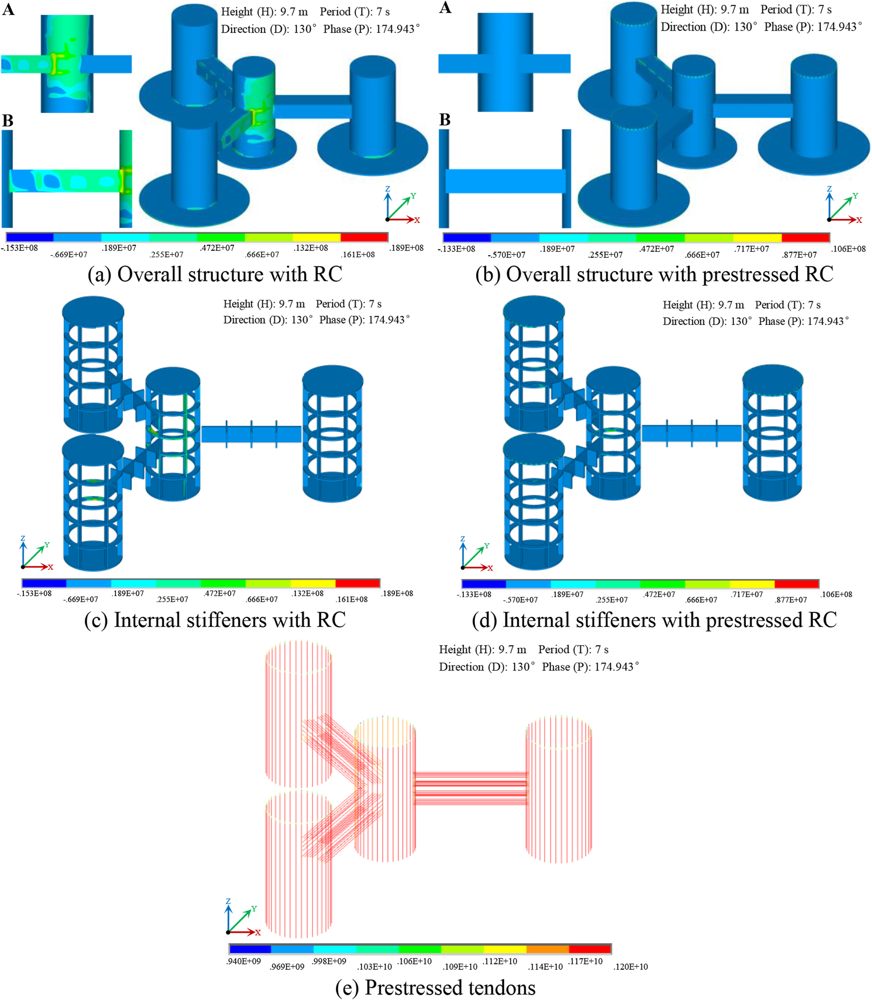

   **图 35** 新平台第一主应力结果

   (a) 普通钢筋混凝土整体结构；(b) 预应力钢筋混凝土整体结构；(c) 普通钢筋混凝土内部加劲肋；(d) 预应力钢筋混凝土内部加劲肋；(e) 预应力筋。RC 为钢筋混凝土。原图工况：波高 9.7 m、周期 7 s、波向 130°、相位 174.943°；各自色标与局部 A、B 视图完整保留。

.. list-table:: 表 16 普通配筋与预应力配筋平台结构的第一主应力比较
   :header-rows: 1

   * - 工况
     - 普通钢筋混凝土最大第一主应力（MPa）
     - 预应力钢筋混凝土最大第一主应力（MPa）
     - 预应力钢筋混凝土整体应力范围（MPa）
     - 预应力筋应力（MPa）
   * - 荷载工况 1
     - 15.7
     - 5.53
     - [−3.52, 1.30]
     - [916, 1210]
   * - 荷载工况 2
     - 18.9
     - 5.73
     - [−5.70, 1.31]
     - [940, 1200]
   * - 荷载工况 3
     - 20.5
     - 5.77
     - [−4.37, 1.34]
     - [823, 1210]
   * - 荷载工况 4
     - 21.5
     - 5.88
     - [−2.77, 1.58]
     - [948, 1200]
   * - 荷载工况 5
     - 10.2
     - 3.71
     - [−5.26, 1.18]
     - [935, 1200]
   * - 荷载工况 6
     - 20.7
     - 5.82
     - [−3.10, 1.46]
     - [937, 1200]

对应力云图和最大应力统计的分析表明，仅采用普通配筋时，六个荷载工况中的主应力均超过 C50 混凝土的抗拉强度设计值 1.89 MPa，最大值达到 21.5 MPa。明显的应力集中出现在浮筒与内立柱连接处、内立柱与塔底交界处，以及内立柱中段环向加劲肋处。

然而，加入预应力筋后，所有荷载工况的整体应力范围处于 −5.70 MPa 至 1.58 MPa 之间，低于混凝土抗拉强度设计值。该配置满足 ULS 下的结构强度要求。比较施加预应力前后的应力云图，可清楚看到结构强度显著改善，高应力区域得到有效缓解。表 16 表明，各工况最大应力平均降低 69%。预应力筋应力分布范围为 823–1210 MPa，远低于屈服强度，显示出较大的安全裕度。虽然部分区域仍存在局部应力集中，但其范围有限，表明对整体结构完整性的影响很小。

.. note::

   译者注：作者依据整体应力范围作出概念设计层面的强度判断，并说明局部应力集中范围有限。表 16 的局部最大第一主应力为 5.53、5.73、5.77、5.88、3.71、5.82 MPa，高于 1.89 MPa；“整体应力范围”上限为 1.18–1.58 MPa，低于该值。这里保留两种统计口径，按作者结论理解整体方案；局部节点与应力集中处理属于后续详细设计和优化范围。

7 结论
------

针对海上风电行业发展中降本增效的迫切需求，本研究开展了一种新型钢筋混凝土半潜式浮式风机平台的结构设计与优化。主要创新贡献如下：

1. 针对浮式风机下部结构成本过高的问题，基于模块化建造原则提出一种新型钢筋混凝土半潜式浮式风机平台概念。与现有设计相比，新平台具有更好的未来工业化标准化潜力。
2. 利用 NSGA-II 遗传算法，开展基于长期动力响应的新平台一体化多目标主尺度优化。算法在第 164 代收敛，得到 50 组 Pareto 最优主尺度。分析这些 Pareto 解发现，导缆孔疲劳损伤与总建造成本存在很强的反向相关，表明当浮式风机平台采用钢筋混凝土等比钢材便宜的材料时，设计者应更加重视系泊系统影响；相较钢结构，钢筋混凝土半潜式平台设计更有必要考虑与系泊系统的一体化优化。
3. 结合实际需求，详细比较新平台最优设计与 OO-Star 的性能特征。长期动力响应结果表明，新平台的长期服役性能比 OO-Star 提高 36%，其塔底和导缆孔最大累计疲劳损伤分别降低 36% 和 21%。短期时域仿真确认，在大多数海况下，新平台的纵荡、垂荡、机舱加速度、塔底弯矩和系泊张力响应更优。新平台的平台成本比钢制备选方案低约 75%，比 OO-Star 低约 30%，具有较强工程潜力。
4. 建立同时包含普通钢筋和预应力筋的最优设计有限元模型，并在 ULS 荷载下分析。没有预应力时，六个荷载工况中的拉应力超过 C50 混凝土抗拉强度设计值 1.89 MPa。加入预应力筋使混凝土最大应力平均降低 69%、加劲肋应力降低 50%，均低于抗拉强度设计值，确认结构满足要求。

.. note::

   译者注：第 3 项的百分比应按第 5.3、5.5 节的具体指标解释：疲劳损伤降幅不等于已验证寿命增幅，成本降幅限于平台部分。第 4 项按作者的整体概念设计结论呈现；其中“均低于”应结合第 6.3 节及表 16 的整体范围与局部峰值区别阅读，局部节点仍可在详细设计阶段优化。

尽管本研究取得上述创新成果，仍仅限于数值模拟。待条件适宜后，将开展进一步研究，包括结构缩尺水池试验，以进一步提高结果可靠性。

参考文献
--------

.. _he2026struct-r01:

Audet, C., Bigeon, J., Cartier, D., Le Digabel, S., Salomon, L., 2021. Performance indicators in multiobjective optimization. Eur. J. Oper. Res. 292, 397–422. https://doi.org/10.1016/j.ejor.2020.11.016.

.. _he2026struct-r02:

Bak, C., Zahle, F., Bitsche, R.D., Kim, T., Yde, A., Henriksen, L.C., et al., 2013. The DTU 10-MW Reference Wind Turbine.

.. _he2026struct-r03:

Benassai, G., Campanile, Antonio, Piscopo, Vincenzo, Scamardella, A., 2015. Optimization of mooring systems for floating offshore wind turbines. Coast. Eng. J. 57, 1550021. https://doi.org/10.1142/S0578563415500217, 1.

.. _he2026struct-r04:

Birk, L., Clauss, G.F., Lee, J.Y., 2004. Practical application of global optimization to the design of offshore structures. OMAE2004. 23rd Int. Conf. Offshore Mech. Arctic Eng. 3, 567–579. https://doi.org/10.1115/OMAE2004-51225.

.. _he2026struct-r05:

Camus, P., Mendez, F., Medina, R., Cofiño, A., 2011. Analysis of clustering and selection algorithms for the study of multivariate wave climate. Coast. Eng. 58, 453–462. https://doi.org/10.1016/j.coastaleng.2011.02.003.

.. _he2026struct-r06:

Chen, J., Ma, Y., Guo, Z., Zha, R., 2025a. Performance and optimization of wind tracking of a single-point moored floating offshore wind turbine. Ocean. Eng. 329, 121139. https://doi.org/10.1016/j.oceaneng.2025.121139.

.. _he2026struct-r07:

Chen, J., Zhang, F., Sun, C., 2025b. Research on fully coupled method for floating offshore wind turbines considering nonlinear time-domain hydrodynamic effects. Ocean. Eng. 340, 122245. https://doi.org/10.1016/j.oceaneng.2025.122245.

.. _he2026struct-r08:

Coulling, A., Goupee, A., Robertson, A., Jonkman, J., Dagher, H., 2013. Validation of a FAST semi-submersible floating wind turbine numerical model with DeepCwind test data. J. Renew. Sustain. Energy 5. https://doi.org/10.1063/1.4796197.

.. _he2026struct-r09:

Deb, K., Pratap, A., Agarwal, S., Meyarivan, T., 2002. A fast and elitist multiobjective genetic algorithm: NSGA-II. IEEE Trans. Evol. Comput. 6, 182–197. https://doi.org/10.1109/4235.996017.

.. _he2026struct-r10:

DNV GL-RP-0286, 2016. Coupled Analysis of Floating Wind Turbines.

.. _he2026struct-r11:

DNV GL-RP-C103, 2015. Column Stabilised Units.

.. _he2026struct-r12:

DNV-OS-C101, 2021. Design of Offshore Steel Structures. general-LRFD Method.

.. _he2026struct-r13:

DNVGL-ST-0119, 2018. Floating Wind Turbine Structures.

.. _he2026struct-r14:

DNVGL-ST-0126, 2016. Support Structures for Wind Turbines.

.. _he2026struct-r15:

Documentation - PivotBuoy n.d. http://pivotbuoy.eu/documentation/ (accessed November 28, 2025).

.. _he2026struct-r16:

Dou, S., Pegalajar-Jurado, A., Wang, S., Bredmose, H., Stolpe, M., IOP, 2020. In: Optimization of Floating Wind Turbine Support Structures Using frequency-domain Analysis and Analytical Gradients, 1618. https://doi.org/10.1088/1742-6596/1618/4/042028.

.. _he2026struct-r17:

Du, X., Liang, J., Qian, G., Yang, Y., Xie, P., Zhang, K., 2024. A computational framework for the co-optimization of platform hydrodynamic and passive structural control of floating offshore wind turbines. Ocean. Eng. 293, 116609. https://doi.org/10.1016/j.oceaneng.2023.116609.

.. _he2026struct-r18:

Edwards, E., Holcombe, A., Brown, S., Ransley, E., Hann, M., Greaves, D., 2024. Trends in floating offshore wind platforms: a review of early-stage devices. Renew. Sustain. Energy Rev. 193. https://doi.org/10.1016/j.rser.2023.114271.

.. _he2026struct-r19:

Floating Offshore Wind Power: the next Five Years, 2022. DNV GL, Oslo.

.. _he2026struct-r20:

Ghigo, A., Cottura, L., Caradonna, R., Bracco, G., Mattiazzo, G., 2020. Platform optimization and cost analysis in a floating offshore wind farm. J. Mar. Sci. Eng. 8. https://doi.org/10.3390/jmse8110835.

.. _he2026struct-r21:

Global Offshore Wind Report 2022, 2022. Global Wind Energy Council, Brussels.

.. _he2026struct-r22:

Huang, W., Li, B., Chen, X., 2023. A new quasi-dynamic method for the prediction of tendon tension of TLP platform. Ocean. Eng. 270, 113590. https://doi.org/10.1016/j.oceaneng.2022.113590.

.. _he2026struct-r23:

Hussein, K., Hussein, A., Hegazy, E., Amin, A., 2013. In: Soares, C., Romanoff, J. (Eds.), Structural Design of a Floating Foundation for Offshore Wind Turbines in Red Sea, pp. 575–583.

.. _he2026struct-r24:

Kang, T., Kim, E., Yang, H., 2022. Effects of dynamic motion and structural response of a semi-submersible floating offshore wind turbine structure under waves generated in a hurricane environment. Int. J. Precision Eng. Manuf.-Green Technol. 9, 537–556. https://doi.org/10.1007/s40684-021-00331-w.

.. _he2026struct-r25:

Karimi, M., Hall, M., Buckham, B., Crawford, C., 2017. A multi-objective design optimization approach for floating offshore wind turbine support structures. J. Ocean Eng. Mar. Energy 3, 69–87. https://doi.org/10.1007/s40722-016-0072-4.

.. _he2026struct-r26:

Kennard, R.W., Stone, L.A., 1969. Computer aided design of experiments. Technometrics 11, 137–148. https://doi.org/10.1080/00401706.1969.10490666.

.. _he2026struct-r27:

Laura, C.-S., Vicente, D.-C., 2014. Life-cycle cost analysis of floating offshore wind farms. Renew. Energy 66, 41–48. https://doi.org/10.1016/j.renene.2013.12.002.

.. _he2026struct-r28:

Lee, D., Cho, S., Yang, H., Na, S., Kim, C., 2020. Load analysis and structural strength evaluation of semi-submersible platform for wind turbines in Jeju Island sea states using hydrodynamic-structure interaction analysis. J. Mech. Sci. Technol. 34, 1227–1235. https://doi.org/10.1007/s12206-020-0221-5.

.. _he2026struct-r29:

Leimeister, M., Kolios, A., Collu, M., 2021. Development of a framework for wind turbine design and optimization. Modelling 2, 105–128. https://doi.org/10.3390/modelling2010006.

.. _he2026struct-r30:

Li, B., Wang, C., 2023. The absolute nodal coordinate formulation in the analysis of offshore floating operations Part I: theory and modeling. Ocean. Eng. 281, 114645. https://doi.org/10.1016/j.oceaneng.2023.114645.

.. _he2026struct-r31:

Li, B., Liu, K., Yan, G., Ou, J., 2011. Hydrodynamic comparison of a semi-submersible, TLP, and spar: numerical study in the South China Sea environment. J. Mar. Sci. Appl. 10, 306–314. https://doi.org/10.1007/s11804-011-1073-2.

.. _he2026struct-r32:

Li, C., Zhou, S., Shan, B., Hu, G., Song, X., Liu, Y., et al., 2022. Dynamics of a Y-shaped semi-submersible floating wind turbine: a comparison of concrete and steel support structures. Ships Offshore Struct. 17, 1663–1683. https://doi.org/10.1080/17445302.2021.1937801.

.. _he2026struct-r33:

Martí, L., García, J., Berlanga, A., Molina, J., 2016. A stopping criterion for multi-objective optimization evolutionary algorithms. Inf. Sci. 367, 700–718. https://doi.org/10.1016/j.ins.2016.07.025.

.. _he2026struct-r34:

Meng, H., Liu, Y., Tian, D., Long, K., Su, Y., Li, B., et al., 2024. A novel conceptual design of a semi-submersible foundation for a 15 MW floating wind turbine. Ocean. Eng. 294. https://doi.org/10.1016/j.oceaneng.2024.116726.

.. _he2026struct-r35:

Moray base: 15 MW floating foundation - moray base n.d. https://moraybase.com/. (Accessed 28 November 2025).

.. _he2026struct-r36:

Myhr, A., Bjerkseter, C., Ågotnes, A., Nygaard, T., 2014. Levelised cost of energy for offshore floating wind turbines in a life cycle perspective. Renew. Energy 66, 714–728. https://doi.org/10.1016/j.renene.2014.01.017.

.. _he2026struct-r37:

Oh, S., 2021. In: Tande, J., Kvamsdal, T., Muskulus, M. (Eds.), Comparison of Concrete and Steel Semi-submersible Floaters for 10MW Wind Turbines, 2018. https://doi.org/10.1088/1742-6596/2018/1/012029.

.. _he2026struct-r38:

Pegalajar-Jurado, A., Bredmose, H., Borg, M., Straume, J.G., Landbø, T., Andersen, H.S., et al., 2018. State-of-the-art model for the LIFES50+ OO-Star wind floater semi 10MW floating wind turbine. J. Phys. Conf. 1104, 012024. https://doi.org/10.1088/1742-6596/1104/1/012024.

.. _he2026struct-r39:

Pettigrew, N.R., Fikes, C.P., Beard, M.K., 2010. Advances in the ocean observing system in the Gulf of Maine: technical capabilities and scientific results. Oceans 2010 IEEE - Sydney 9. https://doi.org/10.1109/OCEANSSYD.2010.5603663.

.. _he2026struct-r40:

Renewables 2023:Analysis and Forecast to 2028, 2024. International Energy Agency, France.

.. _he2026struct-r41:

Wang, X., Qiao, D., Jin, L., Yan, J., Wang, B., Li, B., et al., 2023a. Numerical investigation of wave run-up and load on heaving cylinder subjected to regular waves. Ocean. Eng. 268, 113415. https://doi.org/10.1016/j.oceaneng.2022.113415.

.. _he2026struct-r42:

Wang, C., Liu, J., Li, B., Huang, W., 2023b. The absolute nodal coordinate formulation in the analysis of offshore floating operations, part II: code validation and case study. Ocean. Eng. 281, 114650. https://doi.org/10.1016/j.oceaneng.2023.114650.

.. _he2026struct-r43:

Wang, J., Ren, Y., Shi, W., Collu, M., Venugopal, V., Li, X., 2025. Multi-objective optimization design for a 15 MW semisubmersible floating offshore wind turbine using evolutionary algorithm. Appl. Energy 377. https://doi.org/10.1016/j.apenergy.2024.124533.

.. _he2026struct-r44:

Yang, Y., Bashir, M., Michailides, C., Li, C., Wang, J., 2020. Development and application of an aero-hydro-servo-elastic coupling framework for analysis of floating offshore wind turbines. Renew. Energy 161, 606–625. https://doi.org/10.1016/j.renene.2020.07.134.

.. _he2026struct-r45:

Yang, Y., Chen, C., Zhao, W., Fan, T., 2023. An innovative method of assessing yield strength of floater hull for semi-submersible floating wind turbine in whole life period. Ocean. Eng. 270. https://doi.org/10.1016/j.oceaneng.2023.113679.

.. _he2026struct-r46:

Ye, Q., Cheng, S., Kim, B., Collins, K., Iglesias, G., 2019. Structure design and assessment of a floating foundation for offshore wind turbines. ASME 2019 2nd International Offshore Wind Technical Conference, IOWTC 2019, November 3, 2019 - November 6, 2019, St. Julian’s, Malta: American Society of Mechanical Engineers (ASME). Ocean, Offshore and Arctic Engineering Division. https://doi.org/10.1115/IOWTC2019-7594.

.. _he2026struct-r47:

Yu, W., Müller, K., Lemmer, F., Schlipf, D., Bredmose, H., Borg, M., et al., 2018. LIFES50 + D4. 2: Public Defnition of the Two LIFES50+ 10 MW Foater Concepts. University of Stuttgart.

.. _he2026struct-r48:

Yu, W., Zhou, S.T., Lemmer, F., Cheng, P.W., 2024. Control co-design optimization of floating offshore wind turbines with tuned liquid multi-column dampers. Wind Energy Science 9, 1053–1068. https://doi.org/10.5194/wes-9-1053-2024.

.. _he2026struct-r49:

Zambrano, T., MacCready, T., Kiceniuk Jr., T., Roddier, D.G., Cermelli, C.A., 2006. Dynamic modeling of deepwater offshore wind turbine structures in Gulf of Mexico storm conditions. OMAE2006, Volume 1: Offshore Technology; Offshore Wind Energy; Ocean Research Technology; LNG Specialty Symposium:, pp. 629–634. https://doi.org/10.1115/OMAE2006-92029.

.. _he2026struct-r50:

Zhang, H., Wang, H., Cai, X., Xie, J., Wang, Y., Zhang, N., 2022a. Novel method for designing and optimising the floating platforms of offshore wind turbines. Ocean. Eng. 266. https://doi.org/10.1016/j.oceaneng.2022.112781.

.. _he2026struct-r51:

Zhang, H., Wang, H., Cai, X., Xie, J., Wang, Y., Zhang, N., 2022b. Research on the dynamic performance of a novel floating offshore wind turbine considering the fully-coupled-effect of the system. J. Mar. Sci. Eng. 10. https://doi.org/10.3390/jmse10030341.

.. _he2026struct-r52:

Zhao, Z., Shi, W., Wang, W., Qi, S., Li, X., 2021. Dynamic analysis of a novel semi-submersible platform for a 10 MW wind turbine in intermediate water depth. Ocean. Eng. 237. https://doi.org/10.1016/j.oceaneng.2021.109688.

.. _he2026struct-r53:

Zheng, S., Liu, S., Li, C., Wang, X., Ou, J., 2025. Evaluating equivalent static wave loads for a delta-shaped semi-submersible 10-MW wind turbine. Ocean. Eng. 332, 121336. https://doi.org/10.1016/j.oceaneng.2025.121336.

.. _he2026struct-r54:

Zhou, S., Li, C., Xiao, Y., Cheng, P., 2020a. Importance of platform mounting orientation of Y-shaped semi-submersible floating wind turbines: a case study by using surrogate models. Renew. Energy 156, 260–278. https://doi.org/10.1016/j.renene.2020.04.014.

.. _he2026struct-r55:

Zhou, S., Lemmer, F., Yu, W., Cheng, P., Li, C., Xiao, Y., et al., 2020b. Optimization of the dynamic response of semi-submersibles. INFLUENCE OF THE MOORING SYSTEM.

.. _he2026struct-r56:

Zhou, S., Müller, K., Li, C., Xiao, Y., Cheng, P., 2021. Global sensitivity study on the semisubmersible substructure of a floating wind turbine: manufacturing cost, structural properties and hydrodynamics. Ocean. Eng. 221. https://doi.org/10.1016/j.oceaneng.2021.108585.

.. _he2026struct-r57:

Zhou, S., Li, C., Xiao, Y., Wang, X., Xiang, W., Sun, Q., 2023. Evaluation of floating wind turbine substructure designs by using long-term dynamic optimization. Appl. Energy 352. https://doi.org/10.1016/j.apenergy.2023.121941.

.. _he2026struct-r58:

Zou, P., Bricker, J.D., 2025. Comparative analysis of three-column and three-column with central column semi-submersible platforms for floating wind turbines. Ocean. Eng. 334, 121615. https://doi.org/10.1016/j.oceaneng.2025.121615.

完整引用
--------

:student-first-author:`He Weiwen`; **Li Chao**\*; Zheng Shunyun; Zhou Shengtao; Liu Shangpei; Ou Jinping. Structural design and optimization of a novel semi-submersible floating offshore wind turbine platform using reinforced concrete[J]. **Ocean Engineering**, 2026, 346: 123951. https://doi.org/10.1016/j.oceaneng.2025.123951.

收录信息见 :ref:`WOEAI 学术成果页对应条目 <ref-he2026-OE-structural>`\ 。

相关论文精解
------------

- :doc:`\ 为半潜式风机找到可信的等效静力波浪荷载 <ref-zheng2025-OE>`
- :doc:`\ 同一座 Y 型半潜平台换材料后，动力响应会怎样改变 <ref-li2022-SOS>`
- :doc:`\ 用长期动力优化选择浮式风机下部结构 <ref-zhou2023-AE>`
