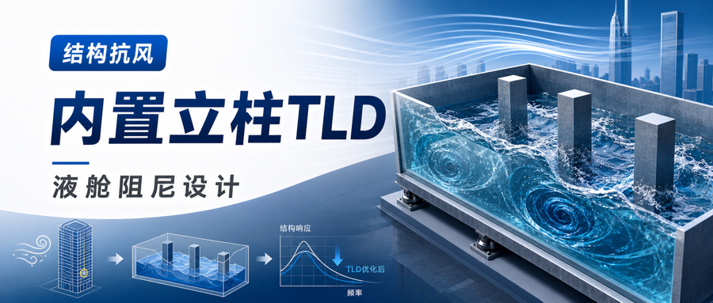
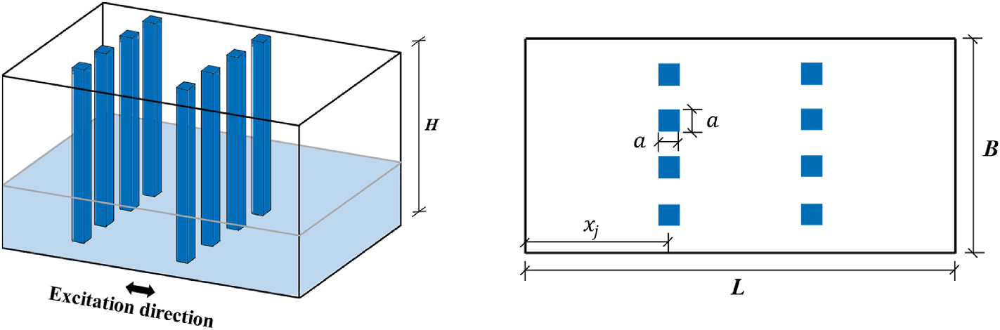
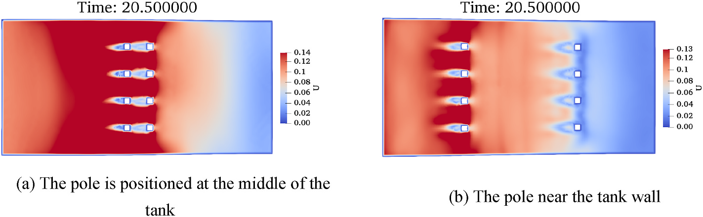
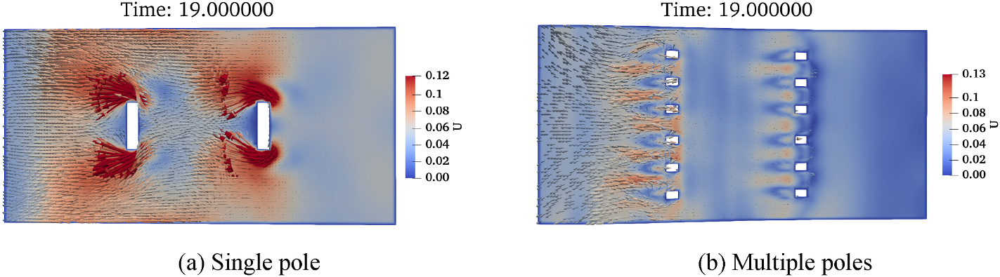
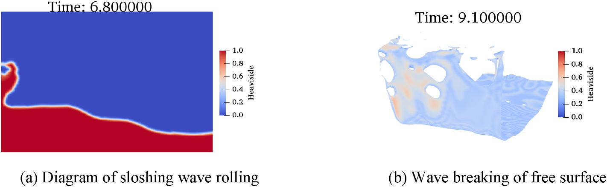
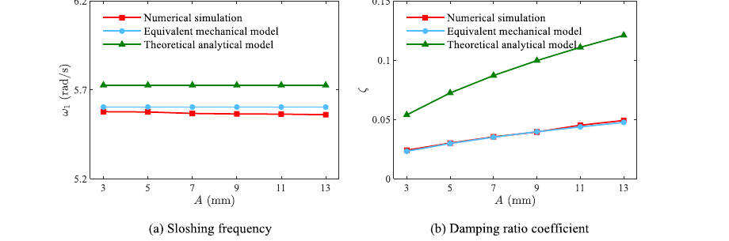

.. _paper-note-ref-he2026-OE:

.. role:: student-first-author

结构抗风 | 用内置矩形立柱提升液舱阻尼器设计效率
===============================================

调谐液体阻尼器（tuned liquid damper, TLD）把结构振动能量转移到水箱液体晃荡中，再通过黏性、自由液面破碎和内部流动损失耗散能量。问题在于，纯水 TLD 的固有阻尼通常偏低；当水箱尺度增大、晃荡力也随之增大时，内部构造既要帮助耗能，也要具备足够刚度。

我们在这篇发表于 Ocean Engineering 的论文中研究了内置矩形立柱 TLD。矩形立柱一方面改变液体晃荡路径、诱导涡脱落和黏性耗能，另一方面可作为大型液舱内部支撑构件。论文通过改进 OpenFOAM 两相流求解器、建立参数数据库，并进一步用粒子群优化（particle swarm optimization, PSO）拟合等效机械模型，为 TLD 初步设计和参数优化提供快速估算工具。

   图 7 内置矩形立柱 TLD 示意图

   图中展示了液舱中的两列矩形立柱、激励方向，以及立柱截面尺寸 :math:`a`、液舱宽度 :math:`B` 和立柱位置 :math:`x_j` 等关键参数。

论文信息
--------

- 论文题名: Numerical research on the impact of built-in rectangular poles on the dynamic characteristics of rectangular liquid tanks
- 作者: :student-first-author:`He Xin`; **Li Chao**\*; Chen Lingwei; Hu Gang; Ou Jinping
- 期刊: Ocean Engineering
- 年份: 2026
- DOI: https://doi.org/10.1016/j.oceaneng.2026.124728
- WOEAI 相关方向: 建筑结构抗风 / 高层建筑抗风与优化

摘要
----

调谐液体阻尼器（TLD）通过利用水箱内液体振荡来减小海洋平台结构过大的振动响应。然而，传统纯水 TLD 的能量耗散能力有限，往往难以满足结构振动控制需求。为提高 TLD 的阻尼性能，有必要引入内部阻挡装置。同时，当 TLD 应用于海洋平台结构时，水箱尺寸较大且液体晃荡力显著，需要强度较高的内部支撑构件来保证安全稳定运行。本文提出一种带内置矩形立柱的创新 TLD 构型。首先，基于计算流体动力学（CFD），通过耦合 level set 和 volume of fluid（VOF）算法（CLS-VOF）改进 OpenFOAM 两相流求解器。该改进能有效抑制伪流，并提高自由液面捕捉精度。数值模拟结果与实验数据吻合良好，验证了所提数值模型的可靠性与准确性。随后，系统研究了液体充填高度、立柱数量、立柱安装位置、立柱阻塞率和激励幅值等关键参数对内部液体非线性晃荡行为的影响，建立了带立柱矩形液舱动力特性的基础数据库。进一步地，论文采用粒子群优化（PSO）算法建立等效机械模型，用于估计带立柱矩形液舱的晃荡频率和阻尼性能。理论预测与数值模拟结果对比验证了模型精度。该等效机械模型能够快速、可靠地确定 TLD 动力参数，为工程应用中 TLD 的初步设计与优化提供有效支持。

**英文摘要**

Tuned liquid damper (TLD) mitigates excessive vibration responses of offshore platform structures by utilizing liquid oscillation within a tank. However, the conventional pure-water TLD exhibits limited energy dissipation capacity, which is often insufficient to meet structural vibration control requirements. To enhance the damping performance of TLD, the incorporation of internal obstruction devices is necessary. Moreover, when applied to offshore platform structures, the large dimensions of the TLD tank and the significant liquid sloshing forces require robust internal supporting components to ensure safe and stable operation. In this study, an innovative TLD configuration with built-in rectangular poles is proposed. First, based on computational fluid dynamics (CFD), the two-phase flow solver in OpenFOAM is improved by coupling the level set and volume of fluid (VOF) algorithms (CLS-VOF). This improvement effectively suppresses spurious flows and enhances the accuracy of free-surface capturing. The numerical simulation results show good agreement with experimental data, demonstrating the reliability and accuracy of the proposed numerical model. Subsequently, the effects of critical parameters, including the liquid filling level, number of poles, pole installation position, pole blockage ratio, and excitation amplitude, on the nonlinear sloshing behavior of the internal liquid are systematically investigated, establishing a fundamental database of the dynamic characteristics of the rectangular liquid tank with poles. Then, an equivalent mechanical model is developed using the particle swarm optimization (PSO) algorithm to estimate the sloshing frequency and damping performance of the rectangular liquid tank with poles. The theoretical predictions are compared with numerical simulation results to validate the accuracy of the proposed model. The equivalent mechanical model enables rapid and reliable determination of the dynamic parameters of the TLD, providing effective support for the preliminary design and optimization of TLD in engineering applications.

研究问题
--------

TLD 的设计核心不是简单地“放一箱水”。液体晃荡频率需要与结构频率协调，液体阻尼需要足够大，水箱本身还要在液体冲击和长期运行中保持稳定。传统纯水 TLD 的阻尼比很低，论文引用的典型量级约为 :math:`0.5\%`，这会限制其对结构振动能量的耗散能力。

已有研究常用阻尼网、格栅、挡板或楔块增强液体耗能，但这些内部构件可能刚度不足，受到液体冲击后易变形或位移。本文关注内置矩形立柱：它既是改变流动的阻挡装置，也是可能服务大型液舱构造稳定的支撑构件。

因此，论文要回答三个问题。第一，矩形立柱会怎样改变液体晃荡频率、阻尼和自由液面非线性。第二，液深、立柱数量、立柱位置、阻塞率和激励幅值这些参数如何影响 TLD 动力特性。第三，能否把大量 CFD 参数结果压缩为一个等效机械模型，使工程初设阶段更快估算 TLD 动力参数。

方法贡献
--------

论文首先改进 OpenFOAM 两相流求解器，将 level set 方法和 VOF 方法耦合为 CLS-VOF 路线。VOF 有利于质量守恒，level set 有利于界面法向和曲率计算；二者结合后，可以更清晰地捕捉自由液面，并抑制气液界面附近的伪流。

模型验证分两步进行。对破坝液体算例，CLS-VOF 对自由液面破碎和卷起的捕捉更清晰；对带孔板和挡板液舱的实验对比，CLS-VOF 在波高和壁面压力预测上都降低了平均相对误差。验证通过后，论文将该模型用于内置矩形立柱 TLD 的参数研究。

参数数据库围绕矩形液舱和内置立柱展开。论文用立柱阻塞率描述单个立柱相对于液舱宽度的阻挡程度：

.. math::

   \Theta=\frac{a}{B}

其中 :math:`a` 为立柱截面尺寸，:math:`B` 为液舱宽度。这个无量纲参数把“立柱有多挡水”转化为可比较、可扫描的设计变量。

   图 12 不同立柱位置下的流场速度分布

   图中比较了立柱位于液舱中部和靠近舱壁时的流场差异，说明立柱位置会改变尾流耦合、剪切层强度和耗能路径。

在等效模型部分，论文先用线性波理论给出无内置立柱时的一阶晃荡频率：

.. math::

   \omega_1=\sqrt{\frac{\pi g}{L}\tanh\left(\frac{\pi h}{L}\right)}

其中 :math:`L` 为液舱沿晃荡方向的尺寸，:math:`h` 为静水深度。考虑立柱引起的附加质量后，带内置矩形立柱 TLD 的一阶晃荡频率被写为：

.. math::

   \omega_{1T}=\left(1+\frac{m_{\mathrm{add}}}{m^*}\right)^{Q_1}\omega_1

其中 :math:`m_{\mathrm{add}}` 表示立柱扰动带来的附加质量效应，:math:`m^*` 表示液体广义质量，:math:`Q_1` 为通过数据库拟合得到的参数。这个表达式把 CFD 观察到的“立柱使周围液体一起加速，从而降低晃荡频率”转化成可计算模型。

关键发现
--------

1. 立柱阻塞率提高会降低晃荡频率并提高阻尼
~~~~~~~~~~~~~~~~~~~~~~~~~~~~~~~~~~~~~~~~~

随着立柱阻塞率 :math:`\Theta` 增大，周围液体被迫参与运动，附加质量效应增强，TLD 内部液体固有频率降低。与此同时，立柱会阻断液体能量传递路径，削弱自由液面上升和整体晃荡幅值。

阻尼提高的机制主要来自两个方面。一方面，液体绕过立柱时在边缘形成涡，流速越高，剪切和涡耗散越明显；另一方面，液体和立柱表面的黏性相互作用增加了额外耗能。对于结构振动控制而言，这意味着内置立柱不只是“障碍物”，而是可以被设计的耗能构件。

2. 立柱位置和数量会改变内部流场，不是越多越好
~~~~~~~~~~~~~~~~~~~~~~~~~~~~~~~~~~~~~~~~~~~~~

论文显示，立柱安装位置对液体频率影响较小，但对阻尼系数影响明显。当立柱从舱壁向中部移动时，液体主要流动区域与立柱尾流更充分耦合，阻尼比逐步提高。

立柱数量的作用更微妙。在总阻塞率保持不变时，把较大的立柱拆成更多小立柱，会降低单个立柱的阻塞强度并增加流动通道，涡脱落强度减弱，湍动能耗散率降低，阻尼系数可能下降。因此，立柱设计不能只追求数量，而要同时考虑单根尺寸、列数、位置和总阻塞率。

   图 14 不同立柱数量下的流场特征对比

   图中显示，单根较宽立柱会形成更强的大尺度涡脱落，而多根较窄立柱会把流动通道细分，改变尾流发展和能量耗散形态。

3. 激励幅值越大，非线性晃荡越强，耗能路径也越多
~~~~~~~~~~~~~~~~~~~~~~~~~~~~~~~~~~~~~~~~~~~~~~~

激励幅值 :math:`A` 代表外部输入能量大小。小幅激励下，自由液面较平顺，流速较低，立柱边缘涡强度有限；随着 :math:`A` 增大，液体运动加剧，自由液面会出现卷起、破碎和更强的非线性波形，流速升高也会强化立柱边缘的涡脱落。

这类非线性并不只是数值模拟的困难。对于 TLD，它也意味着更多能量可以通过自由液面破碎、湍动区域和黏性相互作用被耗散。论文结果显示，激励幅值会显著影响晃荡频率和阻尼比，因此在工程初设中不能只用小幅线性响应代表实际强激励工况。

   图 16 大幅激励下的非线性晃荡特征

   图中展示了自由液面卷起与破碎现象，说明大幅输入下矩形液舱内部响应具有明显非线性。

4. 等效机械模型能把 CFD 数据转化为快速估算工具
~~~~~~~~~~~~~~~~~~~~~~~~~~~~~~~~~~~~~~~~~~~~~~

论文使用 PSO 从参数数据库中拟合等效机械模型。晃荡频率模型的拟合结果为 :math:`Q_1=-0.265`、:math:`Q_2=2.645`，决定系数 :math:`R^2=0.984`，相关系数 :math:`r=0.998`；阻尼比模型的拟合结果为 :math:`R^2=0.872`、:math:`r=0.934`。这说明，模型能够较好描述带内置矩形立柱 TLD 的频率与阻尼变化趋势。

论文还把新模型与基于势流理论的理论解析模型、CLS-VOF 数值模型进行对比。结果表明，本文等效机械模型与数值模拟更接近；传统理论解析模型由于线性化非线性项，并且损失系数多来自小幅激励实验，容易高估液体阻尼性能。

   图 19 不同激励幅值下液体晃荡频率和阻尼比变化

   图中比较了数值模拟、本文等效机械模型和理论解析模型，显示等效机械模型在不同激励幅值下更贴近 CFD 结果。

工程意义
--------

这项工作的工程意义在于，把内置立柱 TLD 从“直觉性的内部构造”推进到“可参数化设计的液舱阻尼器”。液深、立柱位置、数量、阻塞率和激励幅值都能进入同一个参数数据库，再通过等效机械模型转化为频率和阻尼估算。

对结构抗风和振动控制读者而言，本文提供了两层启发。第一，TLD 的耗能能力不只取决于液体质量和调谐频率，也取决于内部构造如何组织流场、尾流和自由液面破碎。第二，在工程早期方案比选中，可以先用等效机械模型快速筛选参数区间，再对少量候选方案开展更精细的 CFD 或流固耦合分析。

虽然论文原文以海洋平台结构振动控制作为应用背景，矩形液舱和 TLD 的动力机制也与高层建筑风致振动控制中的液体阻尼器设计相通。按照 WOEAI 公共研究分类，这篇论文更适合作为“建筑结构抗风 / 高层建筑抗风与优化”方向下关于 TLD 和结构振动控制的基础方法支撑。

适用边界
--------

本文结论基于矩形液舱、内置矩形立柱、单向简谐激励和论文给定的参数范围。换成圆形、倒角方形、流线型或变截面立柱后，流场分离和耗能机制可能变化，频率与阻尼模型需要重新标定。

论文最后也指出，后续研究需要扩展到随机激励和多向激励下的液体晃荡特征，并建立更完整的海洋结构模型来评估 TLD 的结构减振效果。对高层建筑或其他工程结构应用而言，也应结合实际结构频率、安装空间、水箱构造、长期维护和安全校核，不宜只凭单一阻尼指标做设计结论。

延伸阅读
--------

- `WOEAI | 建筑结构抗风方向介绍 <https://woeai.readthedocs.io/zh-cn/latest/BuildingStructuralWindResistance.html>`_
- `WOEAI | 主页 <https://woeai.readthedocs.io/zh-cn/latest/>`_

相关论文解读
------------

- :doc:`结构抗风 | 用图神经网络预测高层建筑结构响应 <ref-tang2025-JBE>`
- :doc:`结构抗风 | 别只看单方向峰值：高层建筑二维矢量响应极值怎么算 <ref-yang2025-JBE>`
- :doc:`结构抗风 | 让高层建筑 TLD 在非线性晃荡中更会耗能 <ref-he2025-POF>`
