.. _paper-note-ref-he2026-OE:

.. role:: student-first-author

内置矩形立柱对矩形液舱动力特性影响的数值研究：论文精解
======================================================

精简版微信公众号文章：待发布

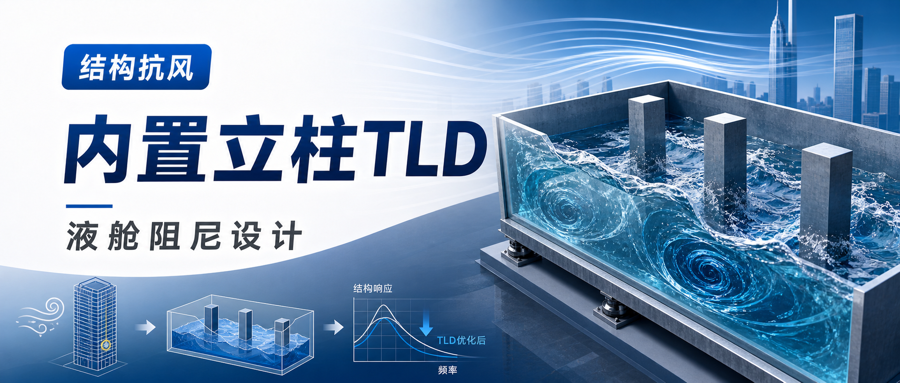

.. contents:: 本页目录
   :local:
   :depth: 3

论文信息
------------

- 原文题名：Numerical research on the impact of built-in rectangular poles on the dynamic characteristics of rectangular liquid tanks
- 中文题名：内置矩形立柱对矩形液舱动力特性影响的数值研究
- 文章类型：研究论文
- 作者：:student-first-author:`Xin He`\ :sup:`a`；**Chao Li**\ :sup:`a,b,*`；Lingwei Chen\ :sup:`a`；Gang Hu\ :sup:`a,b,c`；Jinping Ou\ :sup:`a,b`
- 期刊：Ocean Engineering，2026，353，124728
- 收稿：2025 年 10 月 10 日；修回：2026 年 2 月 13 日；录用：2026 年 2 月 15 日；在线发表：2026 年 2 月 21 日
- DOI：https://doi.org/10.1016/j.oceaneng.2026.124728

原文作者单位：

a. 哈尔滨工业大学（深圳）智能土木与海洋工程学院，中国深圳，518055
b. 哈尔滨工业大学（深圳）广东省土木工程智能与韧性结构重点实验室，中国深圳，518055
c. 哈尔滨工业大学（深圳）数据驱动流体力学与工程应用粤港澳联合实验室，中国深圳，518055

原文通讯作者注：Chao Li，哈尔滨工业大学（深圳）智能土木与海洋工程学院，中国深圳，518055；电子邮箱：lichaosz@hit.edu.cn。

摘要
------------

调谐液体阻尼器（tuned liquid damper，TLD）利用水箱内的液体振荡，减轻海洋平台结构过大的振动响应。然而，传统纯水 TLD 的能量耗散能力有限，往往不足以满足结构振动控制要求。为提高 TLD 的阻尼性能，有必要引入内部阻挡装置。此外，当 TLD 应用于海洋平台结构时，较大的水箱尺寸以及显著的液体晃荡力，要求设置强度足够的内部支撑构件，以保证安全、稳定运行。本研究提出一种带内置矩形立柱的新型 TLD 构型。首先，基于计算流体动力学（computational fluid dynamics，CFD），通过耦合水平集（level set）算法与流体体积（volume of fluid，VOF）算法，形成 CLS-VOF 方法，对 OpenFOAM 中的两相流求解器进行改进。这一改进有效抑制了伪流，提高了自由液面捕捉精度。数值模拟结果与实验数据吻合良好，表明所提出数值模型具有可靠性和准确性。随后，系统考察液体充填高度、立柱数量、立柱安装位置、立柱阻塞率和激励幅值等关键参数对内部液体非线性晃荡行为的影响，建立带立柱矩形液舱动力特性的基础数据库。然后，采用粒子群优化（particle swarm optimization，PSO）算法建立等效机械模型，用于估算带立柱矩形液舱的晃荡频率和阻尼性能。通过将理论预测与数值模拟结果比较，验证所提出模型的准确性。该等效机械模型能够快速、可靠地确定 TLD 的动力参数，为工程应用中 TLD 的初步设计与优化提供有效支持。

关键词
------------

内置矩形立柱 TLD；计算流体动力学；CLS-VOF；晃荡行为；等效机械模型

1 引言
------------

海上油气资源的开发以及海上风能的快速发展，促使大型海洋平台结构得到广泛部署。这些结构持续承受风、浪等复杂环境荷载，可能产生显著的振动响应。尽管这类动力响应通常不会威胁结构整体安全，但可能不利于平台上设备和仪器的稳定运行，从而增加维护需求及运行成本（ :ref:`Kandasamy et al., 2016 <he2026-oe-reference-12>` ）。增加结构质量或刚度，或者优化结构构型，可以减轻海洋平台结构的振动响应。然而，这些途径通常会显著增加建造成本和能源消耗，并可能对海洋平台的功能和运行效率产生不利影响。理论研究（ :ref:`Yao, 1972 <he2026-oe-reference-48>` ）和实际工程应用（ :ref:`Yang et al., 2025 <he2026-oe-reference-47>` ）均表明，动力吸振器（dynamic vibration absorber，DVA）是一种有效的控制机制，能够显著减轻海洋平台结构的动力响应。TLD 是一种被动式 DVA，由部分充液的水箱构成（ :ref:`Love and McNamara, 2024 <he2026-oe-reference-19>` ）。当晃荡频率调谐至与结构频率一致时，结构振动能量会有效传递至内部液体并被耗散，从而减轻结构振动（ :ref:`Pabarja et al., 2019 <he2026-oe-reference-29>` ）。TLD 具有设计简单、运行经济、维护要求低等优点。TLD 通过内部液体阻尼机制耗散能量，这一机制与液体黏性效应、波浪破碎及壁面粗糙度密切相关（ :ref:`Zahrai et al., 2012 <he2026-oe-reference-49>` ）。然而，纯水 TLD 的固有阻尼比通常很低，约为 0.5%（ :ref:`Fediw et al., 1995 <he2026-oe-reference-8>` ）。因此，从外部结构吸收的振动能量不能充分耗散，无法满足振动控制要求。为解决这一问题，在保持 TLD 尺寸和内部液体质量不变的同时，引入阻挡装置以提高能量耗散效率。常见阻挡装置包括阻尼网（ :ref:`Noji et al., 1988 <he2026-oe-reference-28>` ）、格栅（ :ref:`Cassolato et al., 2011 <he2026-oe-reference-2>` ）、挡板（ :ref:`Nayak and Biswal, 2015 <he2026-oe-reference-27>` ）和底部楔块（ :ref:`Modi and Akinturk, 2002 <he2026-oe-reference-23>` ）。过去几十年，这些装置受到研究者广泛关注，并通过理论分析、实验研究和数值模拟取得显著进展。

Noji（ :ref:`Noji et al., 1988 <he2026-oe-reference-28>` ）最早提出在 TLD 中使用阻挡装置，具体是在水箱内沿液体振荡方向布置竖向阻尼网，从而提高 TLD 的能量耗散效率。基于势流理论和线性波理论，Wu（ :ref:`Wu et al., 2021 <he2026-oe-reference-41>` ）建立了配有内部竖向挡板的矩形水箱阻尼比预测公式。通过一系列振动台实验，对挡板间距、水深比和挡板数量对阻尼特性的影响进行了参数研究。Kaneko（ :ref:`Kaneko and Yoshida, 1999 <he2026-oe-reference-13>` ）建立了内置阻尼网 TLD 的动力模型，采用浅水波理论研究液体深度和激励幅值对波高的影响。实验数据验证了该理论模型的准确性。然而，阻尼网的刚度相对较低，受到液体冲击时容易发生变形和位移，这限制了其实际使用和推广。Crowley（ :ref:`Crowley and Porter, 2012 <he2026-oe-reference-5>` ）采用经典线性波理论，推导了用于计算内置格栅 TLD 性能的理论模型。通过求解线性边界方程计算惯性系数和阻尼系数，并考察了格栅数量及布置位置对 TLD 减振性能的影响。基于势流理论，Warnitchai（ :ref:`Warnitchai and Pinkaew, 1998 <he2026-oe-reference-39>` ）建立了一种新的液体晃荡数学模型，将安装在水箱内的流动阻尼装置的影响纳入考虑。该研究系统考察了圆柱结构、挡板和金属网等不同阻尼构型对晃荡波高及水动力晃荡力的影响。结果表明，引入流动阻尼装置能够显著增强液体能量耗散，并有效抑制晃荡响应。Love（ :ref:`Love and Haskett, 2018 <he2026-oe-reference-18>` ）研究了桨板对液体晃荡频率和阻尼的影响。基于 Morison 方程和虚位移原理，建立了线性化理论模型。通过振动台实验，考察桨板尺寸、液体深度和激励幅值对晃荡波高及晃荡力的影响。随后，利用实验结果评估所提出解析模型的准确性。基于势流理论，Faltinsen（ :ref:`Faltinsen and Timokha, 2011 <he2026-oe-reference-7>` ）采用区域分解法，将内置格栅 TLD 的振荡模态扩展至高阶。由此得到反对称振荡模态的近似解，与实验结果吻合良好。Modi（ :ref:`Modi and Akinturk, 2001 <he2026-oe-reference-22>` ）在水箱上布置楔形块，比较不同形状块体影响下 TLD 的阻尼比。Zhao（ :ref:`Zhao et al., 2026 <he2026-oe-reference-55>` ）分析了 LNG 运输船液舱内液体的晃荡行为。研究结果表明，引入挡板和金属网结构能够有效减轻内部液体对舱壁的冲击。Goudarzi（ :ref:`Goudarzi et al., 2010 <he2026-oe-reference-10>` ）研究了储油罐内的最大振荡波高，以防止波浪引起的冲击到达罐顶。Kolaei（ :ref:`Kolaei et al., 2014 <he2026-oe-reference-14>` ）利用线性振荡理论，建立了高效解析模型，用于预测部分充液罐车在转弯条件下的振荡力和力矩，并评估车辆侧翻稳定性。Love（ :ref:`Love and Tait, 2011 <he2026-oe-reference-20>` ）采用非线性多模态机械模型改变水箱底部形状，随后比较了 TLD 晃荡力和波高的差异。Choun（ :ref:`Choun and Yun, 1996 <he2026-oe-reference-4>` ）采用线性晃荡理论，研究底部安装矩形楔块对水箱液体晃荡行为的影响。该研究系统考察了楔块尺寸和安装位置对晃荡频率及模态特征的影响。

理论模型受到液体深度、激励幅值等因素的制约，因此应通过实验研究对 TLD 进行详细分析。Fujino（ :ref:`Fujino et al., 1988 <he2026-oe-reference-9>` ）开展自由振动试验，考察水箱壁面粗糙度对 TLD 固有阻尼比的影响。Molin（ :ref:`Molin and Remy, 2013 <he2026-oe-reference-24>` ）在水箱中心安装孔板，并通过振动台试验测量液体晃荡力。随后，将这些力转换为水动力系数矩阵。该研究考察了孔板形状和激励幅值变化对惯性系数及阻力系数的影响。Xiao（ :ref:`Xiao et al., 2023 <he2026-oe-reference-42>` ）研究了不同开缝筛网间距下，液体振荡波高和 TLD 减振性能的变化规律，并利用大型水箱实验数据改进理论模型。Zhang（ :ref:`2020 <he2026-oe-reference-50>` ）提出一种斜底 TLD，并通过实验研究考察液体深度、倾斜角度及斜面尺寸对 TLD 振荡特征和阻尼性能的影响。Ruiz（ :ref:`Ruiz et al., 2016 <he2026-oe-reference-34>` ）提出一种液面带有浮块的新型 TLD。浮块阻止液面破坏，从而减小振荡液体的非线性响应。该研究通过实验考察了不同水深比下晃荡特性的变化。Sanapala（ :ref:`Sanapala et al., 2019 <he2026-oe-reference-35>` ）在水箱中心安装竖向圆柱，并通过实验研究自由液面波动、液体振荡频率和阻尼比的变化规律。Zhang（ :ref:`Zhang et al., 2024a <he2026-oe-reference-52>` ）通过大型振动台实验，研究矩形水箱内部水动力压力的变化规律。Xue（ :ref:`Xue et al., 2017 <he2026-oe-reference-44>` ）通过实验研究四种挡板构型对水箱液体晃荡的影响。结果表明，改变流场和固有频率能够有效降低晃荡液体对舱壁的冲击压力。Xue（ :ref:`Xue et al., 2023 <he2026-oe-reference-46>` ）在 TLD 内安装新型多孔挡板，通过在孔板中加入球形颗粒形成多孔材料层。孔隙有助于吸收耗散能量。该研究通过实验考察了孔隙率和平均颗粒直径对液体晃荡波高及阻尼比的影响。

当实验研究受到设备、模型缩尺比等外部因素干扰时，CFD 作为一种准确、高效的方法，已广泛应用于 TLD 研究。Mitra（ :ref:`Mitra and Sinhamahapatra, 2007 <he2026-oe-reference-21>` ）建立了基于压力的有限元方法，数值研究水箱内部液体的地震响应，重点考察箱底矩形构件的高度、宽度和位置对波高及水动力压力的影响。Nayak（ :ref:`Nayak and Biswal, 2013 <he2026-oe-reference-26>` ）建立了基于速度势的 Galerkin 有限元模型。随后，利用该模型模拟矩形水箱在六种不同地震激励下的动力响应，并研究箱底矩形块对液体晃荡运动和对流运动的影响。Wang（ :ref:`Wang et al., 2016 <he2026-oe-reference-38>` ）采用结合边界元法与有限元法的半解析比例边界元方法，研究 T 形挡板对 TLD 内部流场的影响。Zhang（ :ref:`Zhang et al., 2025 <he2026-oe-reference-54>` ）提出两种新型浮式复合挡板设计，并通过数值模拟考察它们对液体晃荡行为的影响。Dong（ :ref:`Dong et al., 2025 <he2026-oe-reference-6>` ）建立多孔介质模型，考虑多孔挡板与内部液体之间的相互作用，研究多孔挡板对晃荡流体动力学的影响。Wu（ :ref:`Wu et al., 2012 <he2026-oe-reference-40>` ）采用有限差分法，研究配有底部板和穿透自由液面板的水箱内部振荡液体，并考虑流体黏性和非线性特征。分析了液体振荡频率随不同板高的变化，并与实验结果比较。Wang 采用 CFD 方法增强并优化了最初由 Love（ :ref:`Love and Haskett, 2018 <he2026-oe-reference-18>` ）提出的理论解析模型。该研究主要关注阻力系数 :math:`C_d` 和惯性系数 :math:`C_m` 对 TLD 阻尼和频率特性的影响。通过引入 Keulegan–Carpenter 数，推导出 :math:`C_d` 和 :math:`C_m` 的经验关系，显著提高了理论模型的准确性和预测能力。Kotsarinis（ :ref:`Kotsarinis et al., 2023 <he2026-oe-reference-15>` ）采用光滑粒子流体动力学（Smoothed Particle Hydrodynamics，SPH）方法，数值模拟航天器贮箱内推进剂在动态机动条件下的波高及频谱特性。Zhang（ :ref:`Zhang et al., 2024b <he2026-oe-reference-53>` ）采用数值方法，分析腹板和底部翼缘对液体晃荡的抑制作用，结果表明晃荡波高显著降低。Jian（ :ref:`Jian et al., 2017 <he2026-oe-reference-11>` ）采用 SPH 模型，数值预测竖向圆柱对最大波浪爬高系数的影响。Liu（ :ref:`Liu and Lin, 2009 <he2026-oe-reference-17>` ）采用 VOF 方法，数值模拟带内部挡板水箱中的液体晃荡。Wang（ :ref:`Wang et al., 2011 <he2026-oe-reference-37>` ）采用有限体积法和水平集方法，对二维流体运动进行数值模拟。Roy（ :ref:`Roy and Biswal, 2023a <he2026-oe-reference-31>` ）提出，传统矩形和圆柱形 TLD 底角处的静止液体质量，对液体晃荡运动没有显著贡献。虽然这部分质量增加了总液体体积，但其对支承结构振动响应的影响可以忽视。为提高 TLD 的能量耗散性能，对矩形水箱的底角进行了倒角处理（ :ref:`Roy and Biswal, 2023b <he2026-oe-reference-32>` ）。基于速度势理论，建立二维有限元模型，研究斜底和平底水箱中的液体晃荡特征（ :ref:`Roy and Biswal, 2022 <he2026-oe-reference-30>` ）。数值模拟考察了六种不同地震激励工况下，晃荡波高、舱壁冲击压力和底部剪力的变化。结果表明，斜底会在液体角部附近产生扰动，但对中部区域的影响有限。随后，在水箱底部加入楔块，并采用非线性有限元模型，更准确地分析楔块对液体晃荡行为的影响。与线性模型相比，非线性模型在捕捉系统复杂动力学方面表现出更高的有效性（ :ref:`Roy and Biswal, 2024 <he2026-oe-reference-33>` ）。Albadawi（ :ref:`Albadawi et al., 2013 <he2026-oe-reference-1>` ）提出一种将 VOF 技术与水平集方法相结合的耦合方法。VOF 方法通过平流方程保证质量守恒，而水平集函数保持界面的锐利和清晰。然而，其表面张力处理的稳定性不足，导致曲率计算不精确，并在气液界面出现伪流。

本研究考虑到传统纯水 TLD 的固有阻尼比很低，需要增设阻挡装置。此外，应用于海洋平台结构的 TLD 通常尺寸较大，需要内部支撑构件来维持运行安全和稳定。为应对这些问题，提出一种新型内置矩形立柱 TLD。结合水平集方法和 VOF 方法的优点，开发 CLS-VOF 算法来改进 OpenFOAM 的两相流求解器，有效消除气液界面附近的伪流。通过实验结果检验数值模型的预测能力。随后开展参数研究，重点考察液体充填高度、立柱数量、立柱布置位置、立柱阻塞率和激励幅值对内部液体非线性晃荡特征的影响，从而建立带立柱矩形液舱动力特性的基础数据库。最后，采用 PSO 方法建立等效机械模型，估算带立柱矩形液舱的动力特性。通过与数值模拟结果比较，验证等效机械模型的精度。

2 TLD 的数值模型
----------------------

2.1 CLS-VOF 耦合算法
~~~~~~~~~~~~~~~~~~~~~~~~~~~~~~~~

VOF 方法通过求解 :math:`\alpha` 函数的平流方程来跟踪气相和液相。

.. math::

   \frac{\partial\alpha}{\partial t}+\nabla\cdot(\mathbf U\alpha)=0 \qquad (1)

其中， :math:`\mathbf U` 表示流速。 :math:`\alpha=0` 表示气相， :math:`\alpha=1` 表示液相， :math:`\alpha=0\sim1` 表示气液混合区。由于函数 :math:`\alpha` 不连续，不能精确确定界面的曲率和法向。此外，界面附近会出现伪流，导致界面模糊和钝化。

水平集方法是另一种界面捕捉技术，它利用带符号距离函数 :math:`\phi` 区分两种流体相。当 :math:`\phi=0` 时定义为界面； :math:`\phi>0` 表示液体单元， :math:`\phi<0` 表示气体单元。函数 :math:`\phi` 有助于保持界面的锐利和清晰。然而，随着计算步数增加，必须持续初始化函数 :math:`\phi` ，以保持其带符号距离性质。在这一重新初始化过程中，质量守恒不能得到保持，从而产生显著误差。

结合水平集方法和 VOF 方法的优点，通过求解函数 :math:`\alpha` 的平流方程保证质量守恒。随后，利用函数 :math:`\phi` 准确计算界面法向和曲率，消除伪流并提高界面跟踪精度。CLS-VOF 耦合算法的第一步是将界面位置定义为 :math:`\alpha=0.5` ，由函数 :math:`\alpha` 为函数 :math:`\phi` 提供初值，具体如下。

.. math::

   \phi_0=(2\alpha-1)\Gamma \qquad (2)

其中，系数 :math:`\Gamma` 与网格尺寸 :math:`\Delta x` 有关， :math:`\Gamma=0.75\Delta x` 。通过求解初始化方程，确保 :math:`\phi_0` 保持带符号距离函数的性质（ :ref:`Albadawi et al., 2013 <he2026-oe-reference-1>` ）。

.. math::

   \frac{\partial\phi}{\partial\tau'}=\operatorname{Sign}(\phi_0)(1-|\nabla\phi|) \qquad (3)

.. math::

   \phi(\mathbf x,0)=\phi_0(\mathbf x) \qquad (4)

其中， :math:`\tau'` 表示人工时间步，取 :math:`\Delta\tau'=0.1\Delta x` ，以确保函数 :math:`\phi` 在重新初始化过程中平滑过渡； :math:`\mathbf x` 为位置矢量。这个过程只需少量迭代即可完成，迭代次数记为 :math:`\phi_{\mathrm{corr}}` 。

.. math::

   \phi_{\mathrm{corr}}=\frac{\epsilon}{\Delta\tau'} \qquad (5)

其中， :math:`\epsilon` 表示界面厚度，与界面附近混合单元的数量有关，取 :math:`\epsilon=1.5\Delta x` （ :ref:`Chakraborty et al., 2013 <he2026-oe-reference-3>` ）。

利用函数 :math:`\phi` ，按照下式确定表面的法向量和曲率：

.. math::

   \hat{\mathbf n}=\frac{\nabla\phi}{|\nabla\phi|} \qquad (6)

.. math::

   \kappa=\nabla\cdot\hat{\mathbf n} \qquad (7)

采用连续表面力模型表示表面张力。

.. math::

   \mathbf F_\sigma=\sigma\kappa(\phi)\nabla H(\phi) \qquad (8)

其中， :math:`\sigma` 为表面张力系数， :math:`H(\phi)` 为平滑 Heaviside 函数。

.. math::

   H(\phi)=\begin{cases}
   0,&\phi\leq-\epsilon,\\
   \dfrac12\left[1+\dfrac{\phi}{\epsilon}+\dfrac1\pi\sin\left(\dfrac{\pi\phi}{\epsilon}\right)\right],&|\phi|\leq\epsilon,\\
   1,&\phi>\epsilon.
   \end{cases} \qquad (9)

采用平滑 Heaviside 函数后，表面张力的作用被限制在界面附近的混合流体单元中，使表面张力引起的加速度在两相流体中分布更加均匀，从而有效消除伪流。此外，Heaviside 函数还用于计算流体物性和表面通量，从而提高自由液面跟踪精度。

2.2 数值实现
~~~~~~~~~~~~~~~~

在开源平台 OpenFOAM 中，通过函数 :math:`\alpha` 重构水平集函数 :math:`\phi` ，以改进两相流求解器。基于全局动态网格技术和固体运动类函数，有效控制水箱的运动轨迹。利用有限体积法，在各网格单元中求解流体运动控制方程。时间导数项采用一阶隐式 Euler 方法离散。梯度项采用 Gaussian 线性格式离散，Laplacian 项则采用 Gaussian 线性修正处理。压力和速度的耦合采用 PIMPLE 方法（ :ref:`Xue et al., 2019 <he2026-oe-reference-45>` ），该方法融合了 SIMPLE 与 PISO 算法的关键特征，从而能够更加高效、精确地收敛至稳态解。采用 SST :math:`k-\omega` 湍流模型，求解过程中使用 symGaussSeidel 平滑器。在涉及强非线性流体的系统中，计算常常容易发生不稳定或发散。为确保求解过程的收敛性和稳定性，对 Courant 数 :math:`C_r` 加以限制，通常设置为小于 0.5（ :ref:`Liu and Lin, 2008 <he2026-oe-reference-16>` ）。

2.3 验证与评估
~~~~~~~~~~~~~~~~~~

2.3.1 溃坝液体算例
^^^^^^^^^^^^^^^^^^^^^^^^

本节对二维溃坝液体进行数值模拟。液体初始静止，在重力作用下自由下落，并与障碍物发生碰撞，如图 1 所示。分别采用 VOF 方法和 CLS-VOF 方法捕捉、跟踪自由液面。图 2 展示溃坝液体的强非线性振荡特征，包括破碎和卷起。VOF 方法表现出模糊和钝化效应，而 CLS-VOF 方法能够更精确地计算界面法向和曲率。由此得到更清晰、更锐利的界面，消除伪流，并显著提高自由液面捕捉精度。

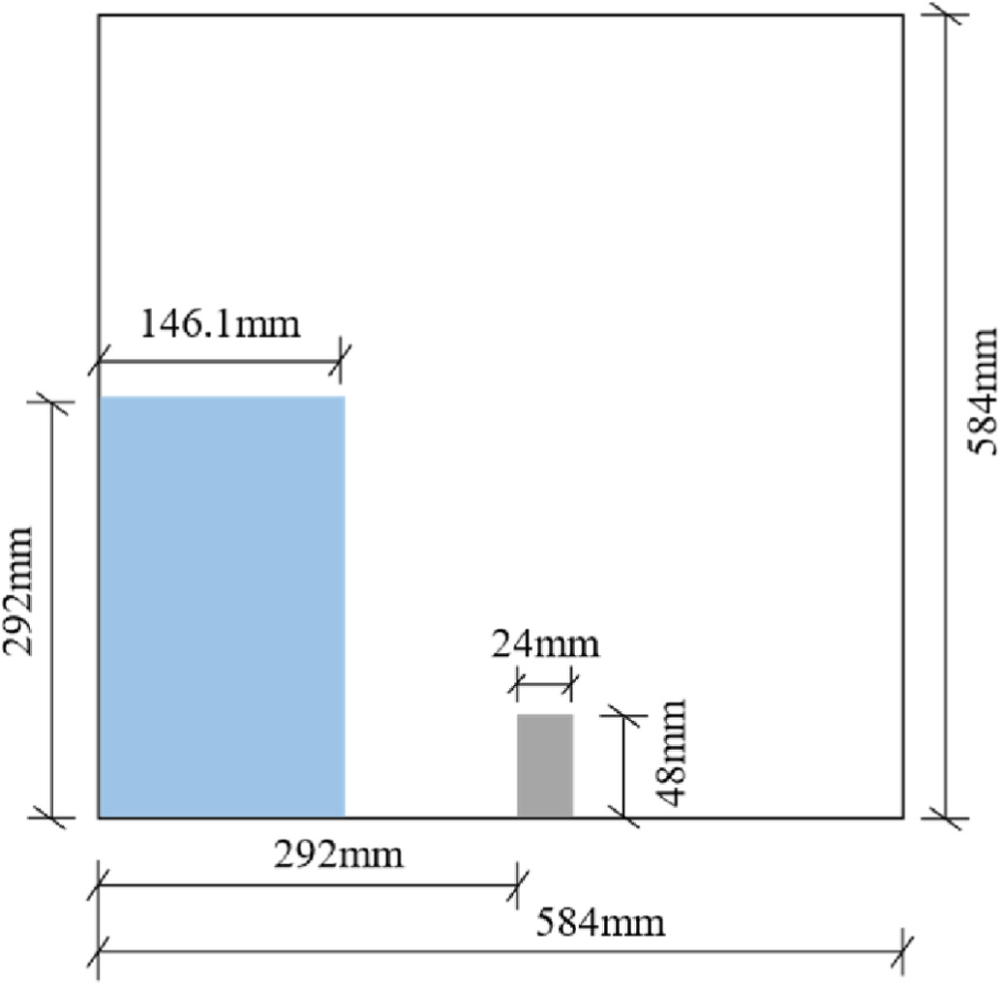

   **图 1** 溃坝液体示意图。

   图中尺寸单位为 mm；计算区域宽、高均为 584 mm，初始水柱宽 146.1 mm、高 292 mm，障碍物宽 24 mm、高 48 mm。

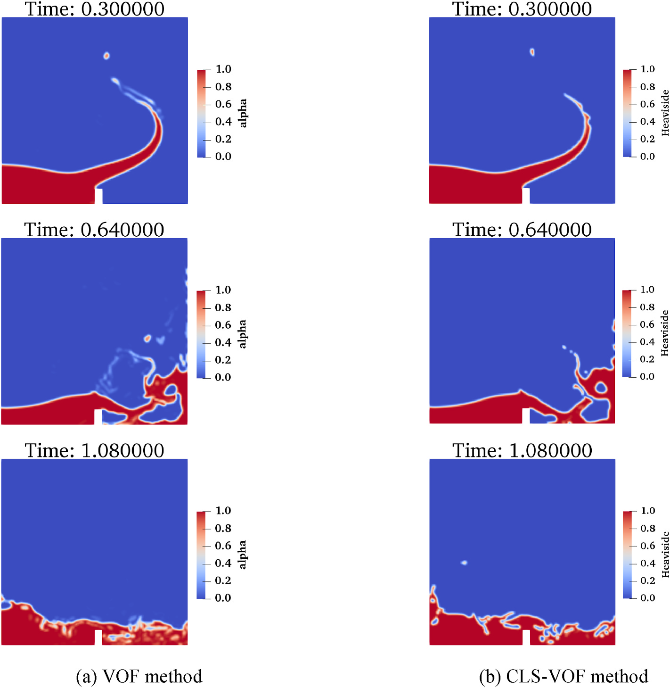

   **图 2** 自由液面捕捉对比。液相以红色表示，气相以蓝色表示。

   （a）VOF 方法；（b）CLS-VOF 方法。各行时刻依次为 0.30、0.64 和 1.08 s；左列色标为体积分数 :math:`\alpha` ，右列为 Heaviside 函数。

2.3.2 内置孔板水箱算例
^^^^^^^^^^^^^^^^^^^^^^^^^^^^

在矩形水箱内部安装竖向孔板，分别采用 VOF 方法和 CLS-VOF 耦合算法对液体振荡行为进行数值模拟。矩形水箱尺寸为 :math:`570\,\mathrm{mm}\times310\,\mathrm{mm}\times700\,\mathrm{mm}` ，液深 :math:`h=280\,\mathrm{mm}` 。在箱底施加位移激励： :math:`x=-A\cos(\omega_e t)` ，其中 :math:`A=15\,\mathrm{mm}` 、 :math:`\omega_e=3.5124\,\mathrm{rad/s}` 。孔板截面尺寸为 :math:`250\,\mathrm{mm}\times310\,\mathrm{mm}` ，厚度为 6 mm。孔洞位于板的中央区域，边长为 80 mm，如图 3 所示。波高探针布置在距水箱左、右壁各 10 mm 处，以监测自由液面高程的变化。图 4 表明，VOF 方法在波高局部峰值处存在明显偏差，平均相对误差分别约为 13.28% 和 14.62%。此外，增大计算时间步会使 VOF 预测产生越来越大的相位偏移。相比之下，CLS-VOF 模型与实验数据（ :ref:`Xue et al., 2012 <he2026-oe-reference-43>` ）吻合很好，平均相对误差显著降低至 5.57% 和 6.21%，并有效减小相位偏差。

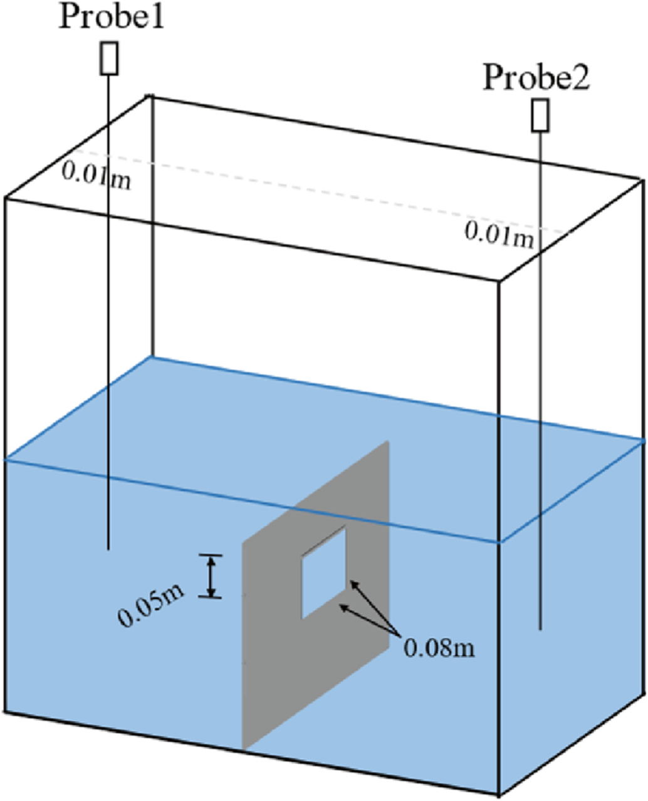

   **图 3** 孔板安装位置示意图。

   Probe1 和 Probe2 分别为左、右波高探针，距侧壁均为 0.01 m；图中另标出 0.08 m 孔洞尺寸及 0.05 m 尺寸标注。

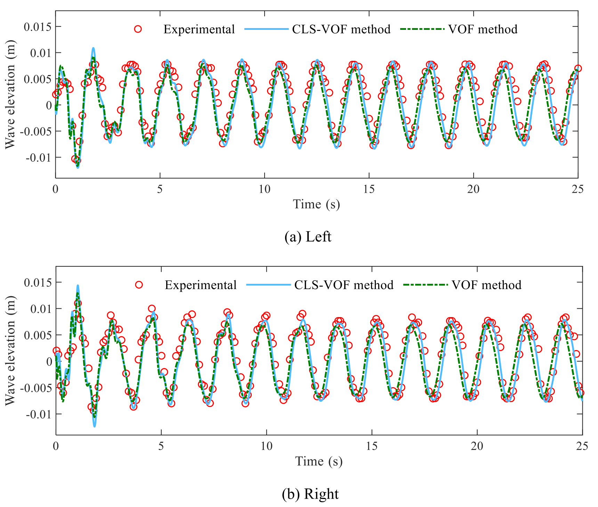

   **图 4** 晃荡波高时程曲线对比，实验数据来自 Xue（ :ref:`Xue et al., 2012 <he2026-oe-reference-43>` ）。

   （a）左侧；（b）右侧。横轴为时间（s），纵轴为波高（m）；红色空心圆表示实验，蓝色实线表示 CLS-VOF 方法，绿色虚线表示 VOF 方法。

2.3.3 内置挡板水箱中的液体振荡
^^^^^^^^^^^^^^^^^^^^^^^^^^^^^^^^^^^^

液体冲击压力是表征液体振荡的另一项关键因素。分别利用 VOF 方法和 CLS-VOF 方法预测壁面不同监测点的压力。水箱几何形状和位移激励形式与前一算例相同，液深 :math:`h=180\,\mathrm{mm}` ，激励幅值 :math:`A=10\,\mathrm{mm}` ，激励频率 :math:`\omega_e=5.6346\,\mathrm{rad/s}` 。在箱底安装一块截面尺寸为 :math:`100\,\mathrm{mm}\times310\,\mathrm{mm}` 、宽度为 6 mm 的竖向挡板。压力监测点位于水箱右侧壁上，分别处于液面以下 115 mm、液面以下 75 mm 和液面以上 5 mm，如图 5 所示。采用 Xue（ :ref:`Xue et al., 2017 <he2026-oe-reference-44>` ）开展的振动台实验评估当前数值模型的可靠性，结果见图 6。

对不同监测位置压力时程曲线的分析表明，VOF 方法低估了响应峰值，平均相对误差分别为 9.39%、9.82% 和 11.35%，并存在轻微相位偏移。相比之下，CLS-VOF 方法将平均相对误差分别降低至 4.15%、4.72% 和 6.59%，显示出预测精度的明显改善。因此，后续数值模拟均采用 CLS-VOF 模型。

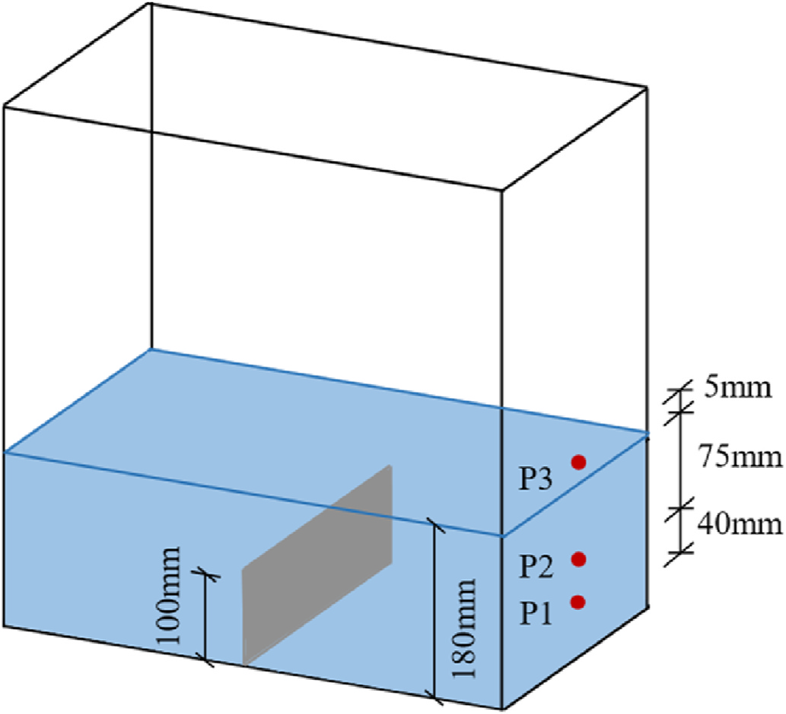

   **图 5** 壁面压力监测点布置示意图。

   图中标出液深 180 mm、挡板高度 100 mm，以及右侧壁 P1、P2、P3 三个压力监测点；相邻位置尺寸依原图保留。

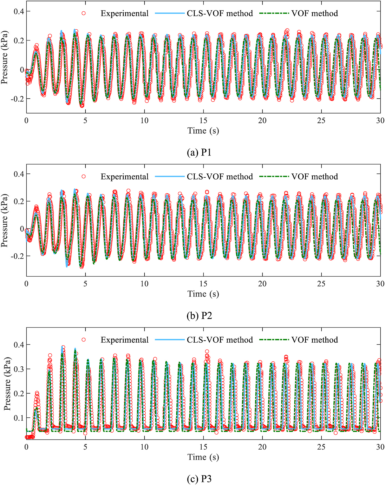

   **图 6** 壁面压力时程曲线对比，实验数据来自 Xue（ :ref:`Xue et al., 2017 <he2026-oe-reference-44>` ）。

   （a）P1；（b）P2；（c）P3。横轴为时间（s），纵轴为压力（kPa）；红色空心圆、蓝色实线和绿色虚线分别表示实验、CLS-VOF 方法和 VOF 方法。

3 动力特性基础数据库
----------------------

传统纯水 TLD 主要通过液体与水箱壁之间的黏性相互作用，以及自由液面的破碎来耗散振动能量。然而，其固有阻尼能力有限，不能满足高效结构振动控制的需要。尽管挡板和格栅等阻挡装置可以提高 TLD 的能量耗散效果，但它们的刚度通常较低，容易发生位移和变形。本节研究图 7 所示的内置矩形立柱 TLD。通过全面的参数研究，考察液体充填高度、立柱数量、立柱布置位置、立柱阻塞率和激励幅值等因素对液体晃荡行为及能量耗散效率的影响。建立内置矩形立柱 TLD 的动力特性基础数据库，为 TLD 的详细设计和优化提供有价值的数据。算例的参数设置见表 1。

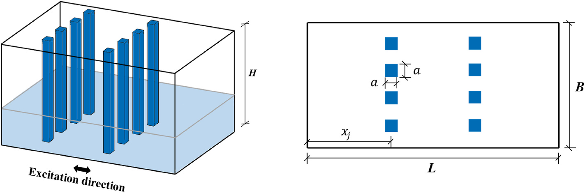

   **图 7** 内置矩形立柱 TLD 示意图。

   Excitation direction 表示激励方向；水箱长、宽、高分别为 :math:`L` 、 :math:`B` 、 :math:`H` ，立柱截面尺寸为 :math:`a` ，立柱距壁面的距离为 :math:`x_j` 。

.. list-table:: 表 1 算例参数设置
   :header-rows: 1
   :widths: 15 18 12 8 17 18 12

   * - 水箱尺寸 :math:`L\times B\times H` （mm）
     - 立柱位置 :math:`x_j` （mm）
     - 立柱总数 :math:`N_p`
     - 立柱列数 :math:`n`
     - 液体充填高度 :math:`h/L`
     - 立柱阻塞率 :math:`\Theta=a/B`
     - 激励幅值 :math:`A` （mm）
   * - 600 × 300 × 400
     - 200
     - 8
     - 2
     - 8.33%、16.67%、25%、33.33%
     - 2%、4%、6%、8%、10%
     - 3、5、7、8、9、10、12、15
   * - 600 × 300 × 400
     - 150、175、200、225、250、275
     - 8
     - 2
     - 8.33%、16.67%、25%、33.33%
     - 4%
     - 5
   * - 600 × 300 × 400
     - 200
     - 2、4、6、8、12
     - 2
     - 8.33%、16.67%、25%、33.33%
     - 8%、4%、2.67%、2%、1.33%
     - 5
   * - 600 × 300 × 400
     - 200
     - 2、4、6、8、12
     - 2
     - 8.33%、16.67%、25%、33.33%
     - 16%、8%、5.33%、4%、2.67%
     - 5
   * - 700 × 300 × 400
     - 250
     - 2、4、6、8、12
     - 2
     - 18.57%
     - 16%、8%、5.33%、4%、2.67%
     - 5
   * - 700 × 200 × 400
     - 175、200、225、250、275、300
     - 6
     - 2
     - 17.14%
     - 6%
     - 5
   * - 750 × 300 × 400
     - 300
     - 6
     - 2
     - 13.33%
     - 2%、4%、6%、8%
     - 5

3.1 液体充填高度的影响
~~~~~~~~~~~~~~~~~~~~~~~~~~

水箱中的液体充填高度会影响振荡特征。图 8 给出了不同水深比 :math:`h/L` 下的液体晃荡峰值响应。当立柱尺寸较小时，对晃荡幅值的抑制较弱，因而振荡更显著。对于较浅液深，随着激励频率增大，曲线向右偏移，共振响应出现滞后，呈现弹簧硬化效应（ :ref:`Zhang, 2022 <he2026-oe-reference-51>` ）。随着立柱阻塞率 :math:`\Theta` 增大，液体振荡幅值显著减小，振荡特征发生明显变化。分析晃荡力和波高曲线可知，水箱内增设矩形立柱会使周围液体加速运动，产生附加质量效应。这一效应降低了 TLD 内部液体的振荡频率，使共振响应提前发生。立柱阻塞率 :math:`\Theta` 越大，晃荡频率的降低越明显。

通过扫频分析确定与最佳峰值响应相对应的激励频率比 :math:`\beta` 后，对该工况进一步开展模拟。在最初的 12 s 内，向水箱底部施加位移激励；随后在 12–25 s 内撤去外部激励，从而获得液体自由衰减响应曲线，如图 9 所示。

采用参数识别方法，从衰减响应曲线中提取 TLD 内部液体的一阶振荡频率和阻尼比，如图 10 所示。当 :math:`h/L` 较小时，液体表现出剧烈振荡，外部输入的振动能量主要通过自由液面破坏来耗散。此外，在 :math:`\Theta=10\%` 时，高阶晃荡模态被激发，使自由衰减曲线不能保持平滑，表现出显著的非线性特征。在深水水箱中，底部液体不受外部扰动影响，因而耗能效率较低，并表现出近似线性行为。中等液深 TLD 能够有效吸收和耗散外部振动能量，具有较强鲁棒性，其液体阻尼比系数逐渐增大。

在水箱内安装矩形立柱后，随着立柱阻塞率增大，对液体的扰动增强，迫使周围液体运动。这使液体整体动能增加，附加质量效应更加显著，并导致内部液体固有频率降低。相比之下，TLD 的阻尼比系数明显增大，这与内部液体运动密切相关。立柱带来的阻挡破坏了液体内部的能量传递路径，从而减小振荡幅值。液体绕过立柱流动时产生涡旋，柱面与液体之间的黏性相互作用进一步增强能量耗散。这些因素共同提高了阻尼性能。

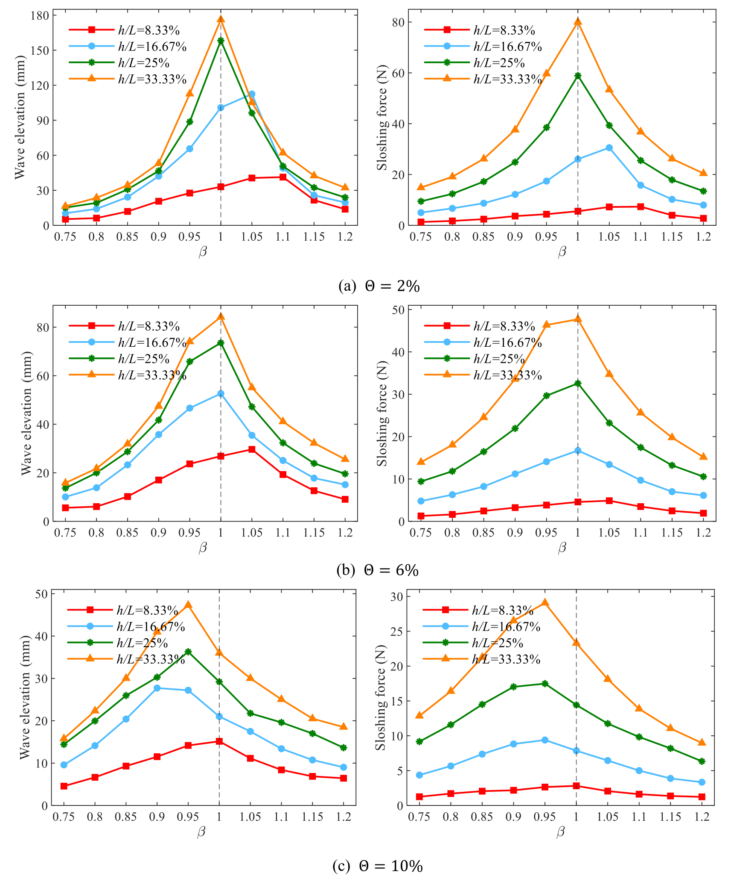

   **图 8** 不同 :math:`h/L` 和 :math:`\Theta` 下液体晃荡的峰值响应曲线。

   （a） :math:`\Theta=2\%` ；（b） :math:`\Theta=6\%` ；（c） :math:`\Theta=10\%` 。左列为波高（mm），右列为晃荡力（N），横轴为激励频率比 :math:`\beta` ；各条曲线对应 :math:`h/L=8.33\%` 、16.67%、25% 和 33.33%。

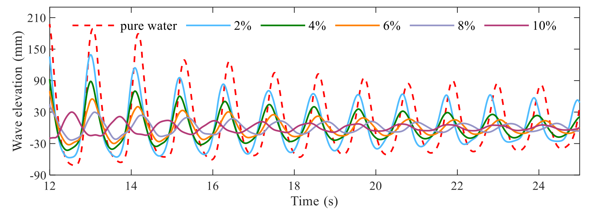

   **图 9** 不同立柱阻塞率 :math:`\Theta` 下液体波高的衰减响应曲线。

   横轴为时间（s），纵轴为波高（mm）；pure water 表示纯水工况，其余曲线依次为 2%、4%、6%、8% 和 10% 阻塞率。

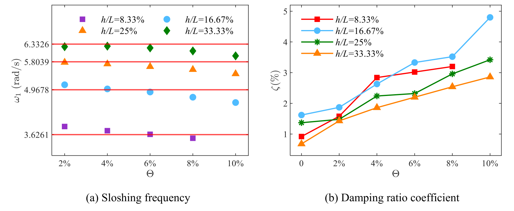

   **图 10** 不同 :math:`h/L` 和 :math:`\Theta` 下 TLD 内部液体动力特性的变化。

   （a）晃荡频率 :math:`\omega_1` （rad/s）；（b）阻尼比系数 :math:`\zeta` （%）。横轴均为阻塞率 :math:`\Theta` ；图例保留四种水深比。

3.2 立柱位置的影响
~~~~~~~~~~~~~~~~~~~~~~

本节研究立柱安装位置对 TLD 内部液体晃荡特性的影响。采用扫频分析和参数识别技术，提取 TLD 的晃荡频率及阻尼系数，如图 11 所示。随后，利用幂函数模型拟合阻尼比系数，并采用拟合优度 :math:`R^2` 衡量精度。

.. math::

   R^2=1-\frac{S_{\mathrm{res}}}{S_{\mathrm{tot}}} \qquad (10)

.. math::

   S_{\mathrm{res}}=\sum_{i=1}^{n}(y_i-\hat y_i)^2 \qquad (11)

.. math::

   S_{\mathrm{tot}}=\sum_{i=1}^{n}(y_i-\bar y_i)^2 \qquad (12)

其中， :math:`S_{\mathrm{res}}` 表示残差平方和， :math:`S_{\mathrm{tot}}` 为总平方和， :math:`y_i` 为实际值， :math:`\hat y_i` 为拟合值， :math:`\bar y_i` 为实际值的平均值。

立柱安装位置对液体频率特性的影响很小，但对 TLD 阻尼系数的影响显著。当立柱从侧壁向水箱中心移动时，TLD 阻尼比逐渐增大。幂函数模型能够很好地描述这种变化，准确捕捉观测到的趋势。能量耗散机制主要受两个因素控制。首先，液体在矩形水箱内往复运动，中部区域流速最大。振荡液体受到立柱阻挡，在柱边缘产生涡旋。随着流速增大，剪切力增强，涡旋更强，能量耗散效率显著提高。其次，由于立柱对称布置，立柱越靠近水箱中心，两列立柱之间的距离越小。立柱尾流相互耦合，产生强剪切层，进一步放大涡旋强度并提高阻尼性能，如图 12 所示。

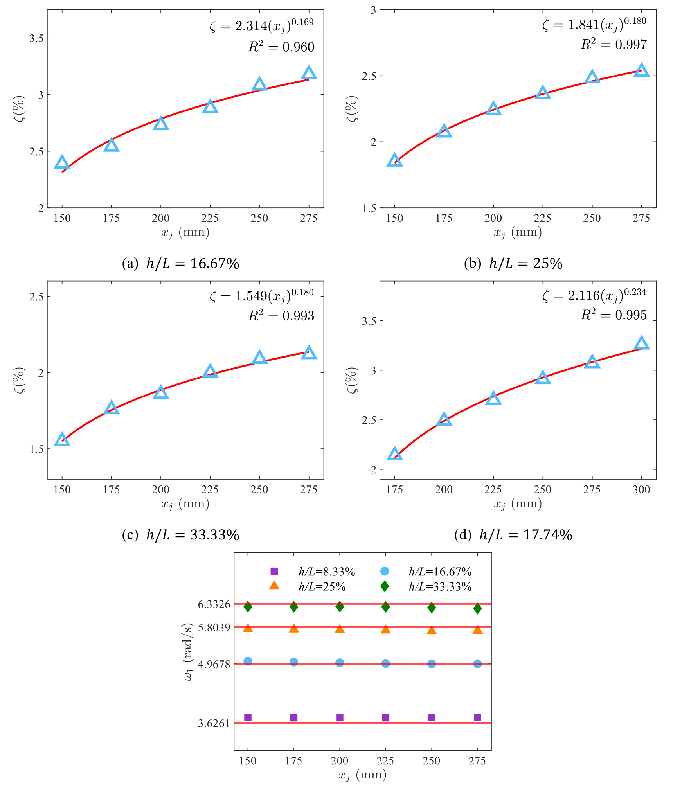

   **图 11** TLD 液体动力特性随立柱安装位置的变化。

   上部四图为阻尼比 :math:`\zeta` （%）随 :math:`x_j` （mm）的变化：（a） :math:`h/L=16.67\%` ；（b）25%；（c）33.33%；（d）17.74%（原图标值）。相应拟合式与拟合优度依次为 :math:`\zeta=2.314(x_j)^{0.169},\ R^2=0.960` ； :math:`\zeta=1.841(x_j)^{0.180},\ R^2=0.997` ； :math:`\zeta=1.549(x_j)^{0.180},\ R^2=0.993` ； :math:`\zeta=2.116(x_j)^{0.234},\ R^2=0.995` 。下图为晃荡频率 :math:`\omega_1` （rad/s）。

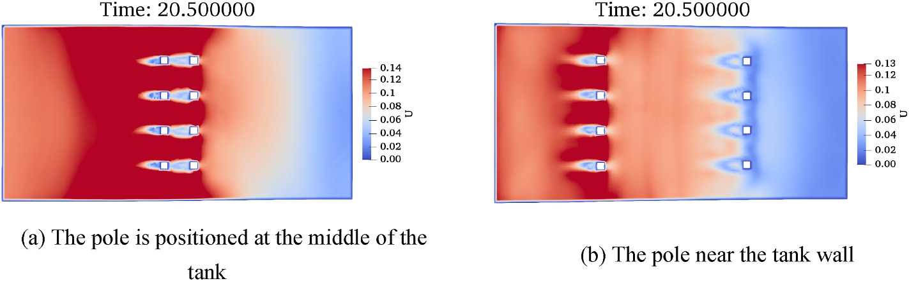

   **图 12** 不同立柱安装位置下的流场速度分布图。

   （a）立柱位于水箱中部；（b）立柱靠近舱壁。两图时刻均为 20.5 s，色标 :math:`U` 表示速度。

3.3 立柱数量的影响
~~~~~~~~~~~~~~~~~~~~~~

每列立柱的总阻塞率分别保持为 8% 和 16%，并设置五种不同的每列立柱数量工况。图 13 给出了 TLD 的液体频率特性和阻尼系数。随着立柱数量增加，每根立柱的阻塞率 :math:`\Theta` 减小，使液体频率 :math:`\omega_1` 小幅上升，而阻尼比 :math:`\zeta` 明显降低。

液体振荡频率和能量耗散效率的变化，主要由内部流场特征决定。如图 14 所示，当立柱数量为一根且柱宽较大时，系统的表现类似于在箱底安装竖向挡板。立柱的阻挡作用诱发流动分离，在两侧边缘引起大尺度涡脱落。这一现象产生强度高、范围广的涡耗散区，从而提高能量耗散效率。同时，在立柱下游形成低动量回流区，将更多液体卷吸到同步振荡运动中。附加质量效应对系统产生显著影响，使晃荡频率降低。另一方面，当大立柱被细分为多根立柱后，增大的柱间空隙形成更多液体流动通道，减弱了涡脱落强度。这一扰动抑制了剪切层的连续发展，使最初连续的涡旋破碎为强度更弱的小涡。因此，湍动能耗散率减小，导致阻尼比系数明显降低。此外，柱后低动量回流区缩小，使附加质量效应减弱，振荡频率小幅升高。

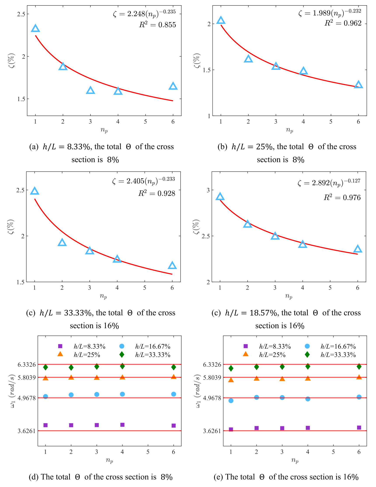

   **图 13** TLD 液体动力特性随立柱数量的变化。

   上部四图依次为：（a） :math:`h/L=8.33\%` 、截面总阻塞率 8%；（b） :math:`h/L=25\%` 、截面总阻塞率 8%；（c） :math:`h/L=33.33\%` 、截面总阻塞率 16%；（c，原图重复标号） :math:`h/L=18.57\%` 、截面总阻塞率 16%。其幂函数拟合依次为 :math:`\zeta=2.248(n_p)^{-0.235},\ R^2=0.855` ； :math:`\zeta=1.989(n_p)^{-0.232},\ R^2=0.962` ； :math:`\zeta=2.405(n_p)^{-0.233},\ R^2=0.928` ； :math:`\zeta=2.892(n_p)^{-0.127},\ R^2=0.976` 。下部（d）、（e）分别对应截面总阻塞率 8%、16% 时的晃荡频率。横轴 :math:`n_p` 为图示每列柱数，纵轴分别为阻尼比（%）和频率（rad/s）。

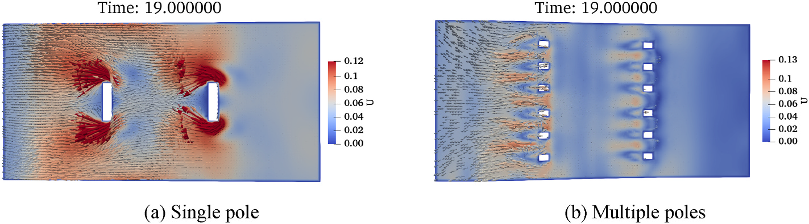

   **图 14** 不同立柱数量下的流场特征对比。

   （a）单根立柱；（b）多根立柱。时刻均为 19 s，色标 :math:`U` 表示速度，箭头显示流动方向。

3.4 激励幅值的影响
~~~~~~~~~~~~~~~~~~~~~~

激励幅值反映外部能量输入的大小，显著影响内部液体运动。本节通过改变激励幅值 :math:`A` ，研究 TLD 一阶晃荡频率和阻尼比的变化。如图 15 所示，当 :math:`h/L` 较小时，增大激励幅值会使自由液面形成非线性波形，引起弹簧硬化。因此，振荡频率向更高值偏移。TLD 的能量耗散效率与激励幅值密切相关。在小幅激励下，液体吸收的能量较少，液面振荡相对平顺，流速较低。因此，绕柱流动产生的涡旋强度较弱，湍流发展不充分，立柱对液体的扰动很小。能量耗散主要依赖液体与舱壁以及柱面之间的黏性相互作用，因而阻尼比较低。随着激励幅值增大，液体运动加剧，出现液面卷起和破碎等现象，如图 16 所示。同时，流速增大，加剧柱边缘的涡脱落。脱落涡迅速破碎，形成高强度湍流区域。这些非线性振荡行为拓宽了能量耗散途径，从而显著提高 TLD 的阻尼比。

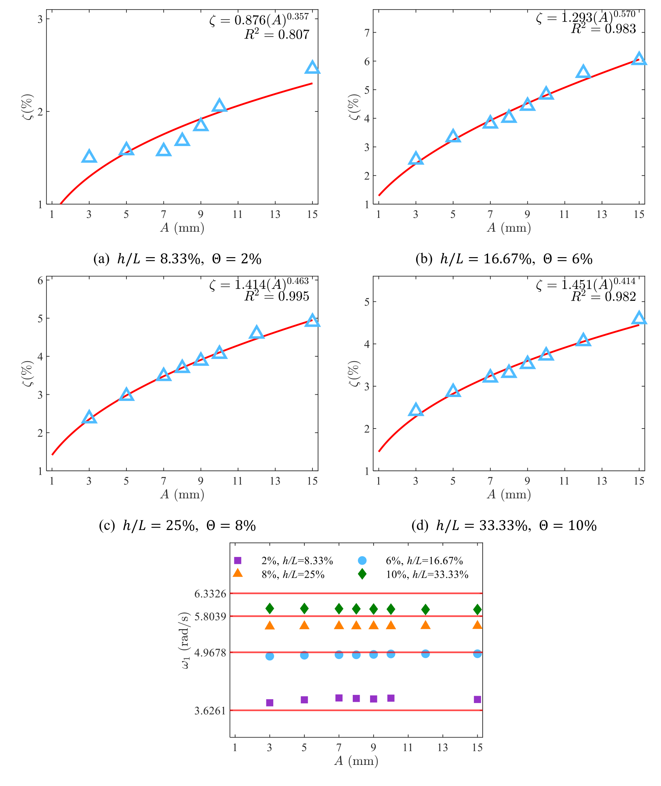

   **图 15** 不同激励幅值下液体晃荡特性的变化。

   上部四图依次为：（a） :math:`h/L=8.33\%,\ \Theta=2\%` ；（b） :math:`h/L=16.67\%,\ \Theta=6\%` ；（c） :math:`h/L=25\%,\ \Theta=8\%` ；（d） :math:`h/L=33.33\%,\ \Theta=10\%` 。相应拟合式与拟合优度为 :math:`\zeta=0.876A^{0.357},\ R^2=0.807` ； :math:`\zeta=1.293A^{0.570},\ R^2=0.983` ； :math:`\zeta=1.414A^{0.463},\ R^2=0.995` ； :math:`\zeta=1.451A^{0.414},\ R^2=0.982` 。横轴为激励幅值 :math:`A` （mm），上部纵轴为阻尼比（%），下部纵轴为晃荡频率（rad/s）。

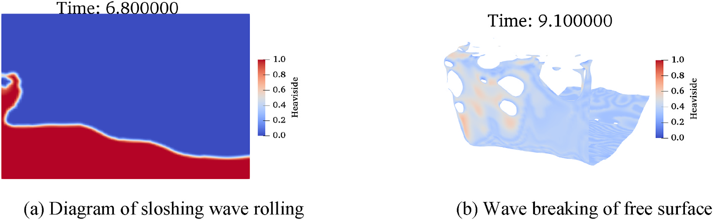

   **图 16** 大幅激励下的非线性晃荡特征。

   （a）晃荡波卷起示意图，时刻为 6.8 s；（b）自由液面波浪破碎，时刻为 9.1 s。色标为 Heaviside 函数。

4 等效机械模型
----------------

内置矩形立柱 TLD 内部液体的晃荡特征和阻尼性能呈现非线性行为。基于第 3 节建立的动力特性数据库，采用粒子群优化方法推导内置矩形立柱 TLD 的等效机械模型。

4.1 晃荡频率
~~~~~~~~~~~~~~~~

根据 Morison 方程（ :ref:`Morison et al., 1950 <he2026-oe-reference-25>` ），内部阻挡装置对振荡液体产生的扰动包括惯性效应和阻力两个分量。阻力主要促进能量耗散效率的提高，而由立柱附加质量引起的惯性效应则影响振荡频率。这里的附加质量概念并不对应实际质量的物理增加，而是指立柱引起的扰动使周围液体加速运动。这一扰动使振荡液体的整体动能增加，使液体表现得如同具有更大的质量。由于系统刚度保持不变，附加质量效应会降低晃荡频率。采用线性波理论（ :ref:`Tait, 2008 <he2026-oe-reference-36>` ），可按下式确定一阶晃荡频率。

.. math::

   \omega_1=\sqrt{\frac{\pi g}{L}\tanh\left(\frac{\pi h}{L}\right)} \qquad (13)

其中， :math:`L` 为沿液体振荡方向的水箱尺寸， :math:`h` 为静水深度。考虑附加质量影响后，内置矩形立柱 TLD 的液体振荡频率可由下式给出。

.. math::

   \omega_{1T}=\left(1+\frac{m^{\mathrm{add}}}{m^*}\right)^{Q_1}\omega_1 \qquad (14)

.. math::

   m^{\mathrm{add}}=\rho\left(\frac aB\right)^{Q_2}
   \left(\frac{N_p}{n}\right)\sin\left(\frac{\pi x_j}{L}\right)
   \frac{L\sinh\left(\frac{2\pi h}{L}\right)+2\pi h}
   {4\left(\sinh\left(\frac{\pi h}{L}\right)\right)^2} \qquad (15)

.. math::

   m^*=\frac{\rho BL^2}{2\pi\tanh\left(\frac{\pi h}{L}\right)} \qquad (16)

其中， :math:`m^{\mathrm{add}}` 表示立柱附加质量， :math:`m^*` 表示液体广义质量。 :math:`a` 为立柱截面尺寸， :math:`B` 为水箱宽度， :math:`N_p` 为立柱总数， :math:`n` 为立柱列数， :math:`x_j` 为立柱与舱壁之间的距离， :math:`\rho` 为密度， :math:`Q_1` 和 :math:`Q_2` 为待拟合参数。从第 3 节数据库中提取数据，对 :math:`Q_1` 和 :math:`Q_2` 进行拟合分析，并采用拟合优度 :math:`R^2` 和相关系数 :math:`r` 评估拟合差异。

.. math::

   r=\frac{\operatorname{Cov}(X,Y)}{\sqrt{\operatorname{Var}(X)}\sqrt{\operatorname{Var}(Y)}} \qquad (17)

其中， :math:`X` 表示实际值， :math:`Y` 表示预测值， :math:`\operatorname{Cov}(X,Y)` 为协方差， :math:`\operatorname{Var}(X)` 和 :math:`\operatorname{Var}(Y)` 为方差。拟合结果见图 17， :math:`Q_1=-0.265` 、 :math:`Q_2=2.645` 、 :math:`R^2=0.984` 、 :math:`r=0.998` ，表明拟合模型具有较高精度。

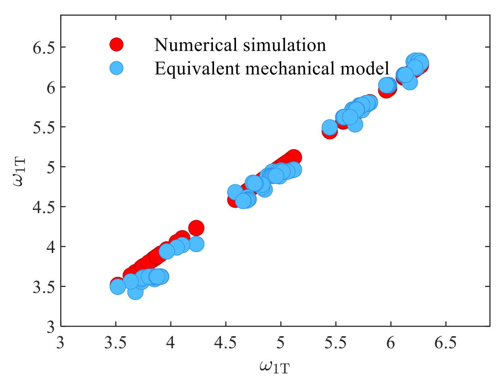

   **图 17** 晃荡频率拟合结果对比。

   红色点表示数值模拟，蓝色点表示等效机械模型；横、纵轴均按原图标为 :math:`\omega_{1T}` 。

4.2 阻尼比
~~~~~~~~~~~~~~

矩形立柱阻挡了液体的能量传递路径，从而减小振荡幅值，并引导液体绕柱流动。这使立柱边缘产生涡旋，增强能量耗散，进而提高 TLD 的阻尼性能。大量数值模拟表明，阻尼比系数受到液体充填高度、立柱尺寸、安装位置和数量，以及外部激励幅值等多种因素的影响。提出如下用于确定阻尼比的等效模型。

.. math::

   \zeta_T=K_1\left(\frac aB\right)^{K_2}
   \left(\frac{N_p}{n}\right)^{K_3}
   \left(\sin\left(\frac{\pi x_j}{L}\right)\right)^{K_4}
   \left(\tanh\left(\frac{\pi h}{L}\right)\right)^{K_5}
   \left(\frac{A}{\dfrac{\omega_e}{\omega_{1T}}L}\right)^{K_6} \qquad (18)

其中， :math:`A` 为激励幅值， :math:`\omega_e` 为激励频率， :math:`K_1` 至 :math:`K_6` 为待优化参数。图 18 表明，等效阻尼比模型与数值模拟结果之间具有显著关联， :math:`K_1=0.517` 、 :math:`K_2=0.414` 、 :math:`K_3=0.283` 、 :math:`K_4=0.123` 、 :math:`K_5=-0.351` 、 :math:`K_6=0.493` ，拟合优度 :math:`R^2=0.872` ，相关系数 :math:`r=0.934` 。

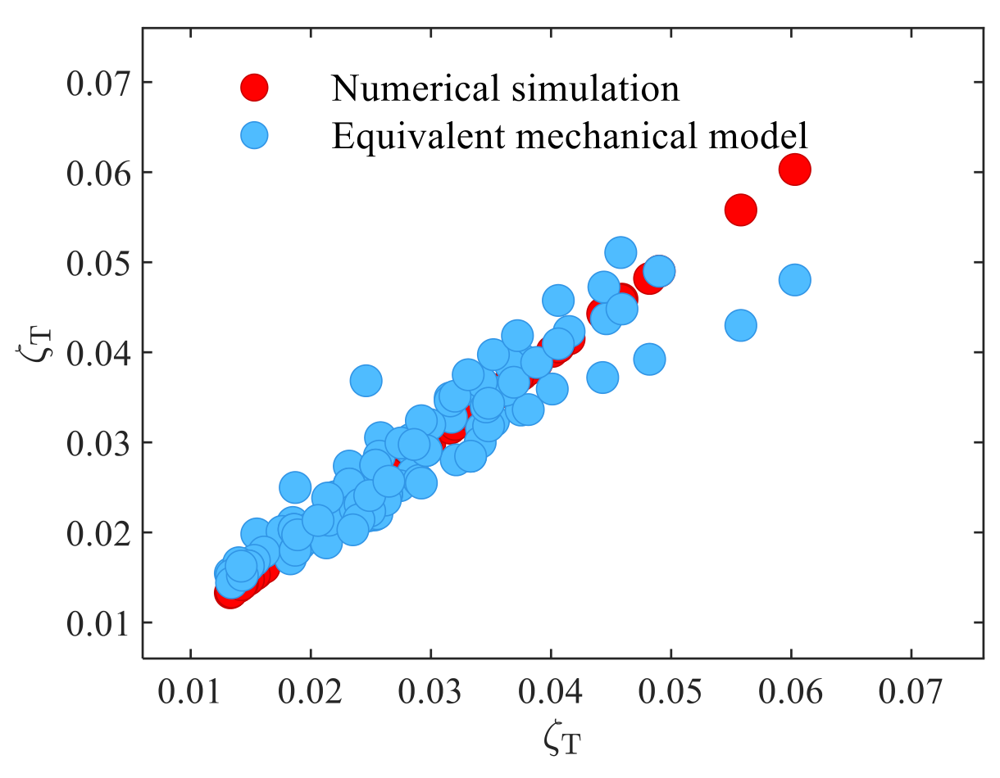

   **图 18** 阻尼比拟合结果对比。

   红色点表示数值模拟，蓝色点表示等效机械模型；横、纵轴均按原图标为 :math:`\zeta_T` 。

4.3 精度验证
~~~~~~~~~~~~~~~~

基于势流理论，Love（ :ref:`Love and Haskett, 2018 <he2026-oe-reference-18>` ）提出了用于预测内置桨板 TLD 动力响应的理论解析模型，具体如下。

.. math::

   \omega_{\mathrm{eq}}=\left(1+\frac{m_{\mathrm{eq}}^{\mathrm{add}}}{m^*}\right)^{-1/2}\omega_1 \qquad (19)

.. math::

   m_{\mathrm{eq}}^{\mathrm{add}}=\rho a_y^2\sum_{j=1}^{n_p}\sin^2\left(\frac{\pi x_j}{L}\right)
   \frac{L\sinh\left(\frac{2\pi h}{L}\right)+2\pi h}{4\sinh^2\left(\frac{\pi h}{L}\right)} \qquad (20)

.. math::

   \zeta_{\mathrm{eq}}=\zeta_p X_{\mathrm{eq}} \qquad (21)

.. math::

   \zeta_p=C_l\frac{32}{3BL\pi^2}a_y\tanh^2\left(\frac{\pi h}{L}\right)
   \left(\frac13+\frac{1}{\sinh^2\left(\frac{\pi h}{L}\right)}\right)
   \sum_{j=1}^{n_p}\left|\sin^3\left(\frac{\pi x_j}{L}\right)\right| \qquad (22)

.. math::

   X_{\mathrm{eq}}=\sqrt{\frac{2\Omega^4 A^2}
   {(1-\Omega^2)^2+\sqrt{(1-\Omega^2)^4+(4\Omega^3\zeta_p A)^2}}} \qquad (23)

.. math::

   \Omega=\frac{\omega_e}{\omega_{\mathrm{eq}}} \qquad (24)

其中， :math:`a_y` 表示桨板尺寸的一半， :math:`n_p` 表示桨板总数， :math:`C_l` 表示与桨板有关的损失系数，其大小取决于桨板尺寸。

与本研究建立的等效机械模型相比，该理论解析模型将非线性项线性化，并且在截面阻塞率保持不变时，没有考虑立柱数量对液体晃荡特性的影响。此外，立柱引起的损失系数难以准确确定，因为文献中的损失系数通常根据小激励幅值条件下的实验拟合得到。基于文献（ :ref:`Love and Haskett, 2018 <he2026-oe-reference-18>` ）给出的三个损失系数，建立三种工况。对理论解析模型、CLS-VOF 数值模型和拟合等效机械模型的预测进行系统比较与评估。

4.3.1 不同激励幅值
^^^^^^^^^^^^^^^^^^^^^^^^

矩形水箱的几何尺寸为 :math:`600\,\mathrm{mm}\times300\,\mathrm{mm}\times400\,\mathrm{mm}` ， :math:`h=150\,\mathrm{mm}` 。阻塞率 :math:`\Theta=8.3\%` ，对应损失系数 :math:`C_l=8.8` 。共八根立柱，分两列布置。不同简谐激励幅值下，液体晃荡频率和阻尼比的变化见图 19。

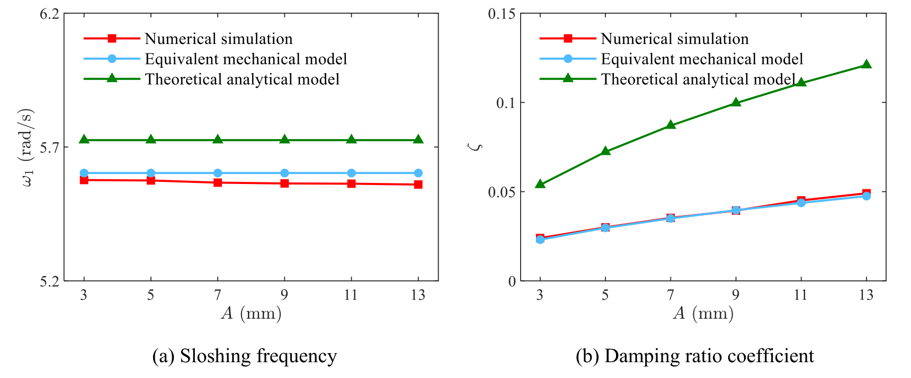

   **图 19** 不同激励幅值下液体晃荡频率和阻尼比的变化。

   （a）晃荡频率；（b）阻尼比系数。横轴为 :math:`A` （mm）；红、蓝、绿三条曲线分别表示数值模拟、等效机械模型和理论解析模型。

4.3.2 不同立柱位置
^^^^^^^^^^^^^^^^^^^^^^^^

保持水箱几何尺寸不变，液深 :math:`h=170\,\mathrm{mm}` 。阻塞率 :math:`\Theta=4.3\%` ，对应损失系数 :math:`C_l=5.4` 。在箱底施加幅值为 5 mm 的简谐激励。研究不同立柱安装位置 :math:`x_j` 对液体晃荡特性的影响。分别采用理论解析模型、CLS-VOF 数值模型和拟合等效机械模型预测响应，如图 20 所示。

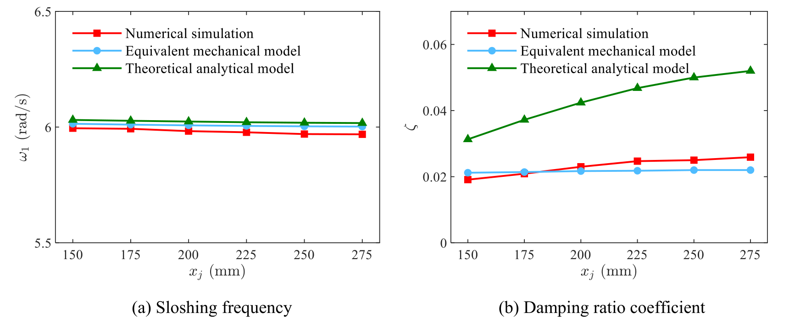

   **图 20** 不同立柱位置下液体晃荡频率和阻尼比的变化。

   （a）晃荡频率；（b）阻尼比系数。横轴为 :math:`x_j` （mm）；红、蓝、绿三条曲线分别表示数值模拟、等效机械模型和理论解析模型。

4.3.3 不同液深
^^^^^^^^^^^^^^^^^^^^

保持水箱几何尺寸和外部激励不变，阻塞率 :math:`\Theta=15\%` ，对应损失系数 :math:`C_l=20` 。共四根立柱，分两列布置。图 21 展示不同液深下液体动力特性的变化。

不同工况下的比较表明，本研究建立的等效机械模型与数值模拟十分接近，能够可靠地捕捉晃荡动力学特征。相比之下，理论解析模型存在明显偏差，这是因为它基于势流理论，将非线性项线性化，且损失系数 :math:`C_l` 根据小激励幅值实验数据拟合得到。因此，该理论模型高估了水箱内液体的阻尼性能。已有研究（ :ref:`Love and Haskett, 2018 <he2026-oe-reference-18>` ）也表明，理论解析模型预测的晃荡波高显著低于实验测量值，说明该模型高估了 TLD 的能量耗散效率。

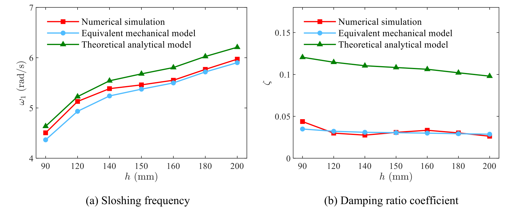

   **图 21** 不同液深下液体晃荡频率和阻尼比的变化。

   （a）晃荡频率；（b）阻尼比系数。横轴为液深 :math:`h` （mm）；红、蓝、绿三条曲线分别表示数值模拟、等效机械模型和理论解析模型。

5 结论
------------

本研究采用计算流体动力学（CFD）模拟，研究不同立柱构型对矩形液舱液体晃荡动力学和阻尼性能的影响。通过融合水平集方法与 VOF 方法，增强 OpenFOAM 两相流求解器，建立用于分析液体晃荡的完整数值模型。所提出模型能够有效捕捉液体的非线性振荡行为，并通过与实验数据比较验证了其预测精度。通过大量参数研究，重点考察液体充填高度、立柱数量、立柱安装位置、立柱阻塞率和激励幅值等因素，观察矩形液舱晃荡频率和阻尼比的变化规律，从而建立带立柱矩形液舱动力特性的基础数据库。随后，利用粒子群优化算法拟合数据，推导等效机械模型。主要结论如下。

1. CLS-VOF 方法有效解决界面模糊问题并消除伪流，从而提高自由液面捕捉精度。
2. 内置矩形立柱产生的扰动，使周围液体产生额外加速运动。随着立柱阻塞率 :math:`\Theta` 增大，立柱附加质量效应的影响更加显著，导致内部液体振荡频率降低。
3. 立柱阻挡液体的能量传递路径，使振荡幅值减小。液体绕柱流动时，柱边缘产生涡旋，使流速增大、能量耗散效率提高。同时，液体与柱面之间发生黏性相互作用。这些因素共同拓宽能量耗散途径，从而提高阻尼比系数。
4. 等效机械模型具有较高计算精度，可用于估算带立柱矩形液舱的晃荡频率和阻尼性能。

本研究主要考察矩形液舱在单向简谐激励下的动力响应，通过参数分析重点研究不同立柱构型的影响。提出了用于表征该系统的等效机械模型。未来研究将扩展至更多立柱类型，例如圆柱、倒角方柱和变截面立柱。此外，还将研究随机和多向激励下 TLD 内部液体晃荡频率及阻尼比的变化规律，以进一步提高等效机械模型的准确性。随后，将建立完整的海洋结构模型，以评估 TLD 对海洋结构振动的减振效果。

参考文献
------------

.. _he2026-oe-reference-1:

Albadawi, A., Donoghue, D.B., Robinson, A.J., Murray, D.B., Delauré, Y.M.C., 2013. Influence of surface tension implementation in volume of fluid and coupled volume of fluid with level set methods for bubble growth and detachment. Int. J. Multiphas. Flow 53, 11–28.

.. _he2026-oe-reference-2:

Cassolato, M.R., Love, J.S., Tait, M.J., 2011. Modelling of a tuned liquid damper with inclined damping screens. Struct. Control Hlth. 18, 674–681.

.. _he2026-oe-reference-3:

Chakraborty, I., Biswas, G., Ghoshdastidar, P.S., 2013. A coupled level-set and volume-of-fluid method for the buoyant rise of gas bubbles in liquids. Int. J. Heat Mass Tran. 58, 240–259.

.. _he2026-oe-reference-4:

Choun, Y., Yun, C., 1996. Sloshing characteristics in rectangular tanks with a submerged block. Comput. Struct. 61, 401–413.

.. _he2026-oe-reference-5:

Crowley, S., Porter, R., 2012. An analysis of screen arrangements for a tuned liquid damper. J. Fluid Struct. 34, 291–309.

.. _he2026-oe-reference-6:

Dong, Y., Wang, S., Dong, G., 2025. Numerical investigation of sloshing flow interaction with porous baffles in a 2D rectangular tank. Ocean Eng. 327, 120904.

.. _he2026-oe-reference-7:

Faltinsen, O.M., Timokha, A.N., 2011. Natural sloshing frequencies and modes in a rectangular tank with a slat-type screen. J. Sound Vib. 330, 1490–1503.

.. _he2026-oe-reference-8:

Fediw, A.A., Isyumov, N., Vickery, B.J., 1995. Performance of a tuned sloshing water damper - ScienceDirect. J. Wind Eng. Ind. Aerod. 57, 237–247.

.. _he2026-oe-reference-9:

Fujino, Y., Pacheco, B.M., Chaiseri, P., Fujii, K., 1988. An experimental study on tuned liquid damper using circular containers. J. Struct. Eng. 34, 603–616.

.. _he2026-oe-reference-10:

Goudarzi, M.A., Sabbagh-Yazdi, S.R., Marx, W., 2010. Seismic analysis of hydrodynamic sloshing force on storage tank roofs. Earthq. Spectra 26, 131–152.

.. _he2026-oe-reference-11:

Jian, W., Cao, D., Lo, E.Y., Huang, Z., Chen, X., Cheng, Z., Gu, H., Li, B., 2017. Wave runup on a surging vertical cylinder in regular waves. Appl. Ocean Res. 63, 229–241.

.. _he2026-oe-reference-12:

Kandasamy, R., Cui, F., Townsend, N., Foo, C.C., Guo, J., Shenoi, A., Xiong, Y., 2016. A review of vibration control methods for marine offshore structures. Ocean Eng. 127, 279–297.

.. _he2026-oe-reference-13:

Kaneko, S., Yoshida, O., 1999. Modeling of deepwater-type rectangular tuned liquid damper with submerged nets. J PRESS VESS-T ASME. 121, 413–422.

.. _he2026-oe-reference-14:

Kolaei, A., Rakheja, S., Richard, M.J., 2014. Range of applicability of the linear fluid slosh theory for predicting transient lateral slosh and roll stability of tank vehicles. J. Sound Vib. 333, 263–282.

.. _he2026-oe-reference-15:

Kotsarinis, K., Green, M.D., Simonini, A., Debarre, O., Magin, T., Tafuni, A., 2023. Modeling sloshing damping for spacecraft: a smoothed particle hydrodynamics application. Aerosp. Sci. Technol. 133, 108090.

.. _he2026-oe-reference-16:

Liu, D., Lin, P., 2008. A numerical study of three-dimensional liquid sloshing in tanks. J. Comput. Phys. 227, 3921–3939.

.. _he2026-oe-reference-17:

Liu, D., Lin, P., 2009. Three-dimensional liquid sloshing in a tank with baffles. Ocean Eng. 36, 202–212.

.. _he2026-oe-reference-18:

Love, J.S., Haskett, T.C., 2018. Nonlinear modelling of tuned sloshing dampers with large internal obstructions: damping and frequency effects. J. Fluid Struct. 79, 1–13.

.. _he2026-oe-reference-19:

Love, J.S., McNamara, K.P., 2024. Horizontal baffles for robust shallow water tuned sloshing dampers. Eng. Struct. 309, 118056.

.. _he2026-oe-reference-20:

Love, J.S., Tait, M., 2011. Non-linear multimodal model for tuned liquid dampers of arbitrary tank geometry. Int. J. Non Lin. Mech. 46, 1065–1075.

.. _he2026-oe-reference-21:

Mitra, S., Sinhamahapatra, K.P., 2007. Slosh dynamics of liquid-filled containers with submerged components using pressure-based finite element method. J. Sound Vib. 304, 361–381.

.. _he2026-oe-reference-22:

Modi, V.J., Akinturk, A., 2001. An efficient liquid sloshing damper for control of wind-induced instabilities. J. Wind Eng. Ind. Aerod. 90, 1907–1918.

.. _he2026-oe-reference-23:

Modi, V.J., Akinturk, A., 2002. An efficient liquid sloshing damper for control of wind-induced instabilities. J. Wind Eng. Ind. Aerod. 90, 1907–1918.

.. _he2026-oe-reference-24:

Molin, B., Remy, F., 2013. Experimental and numerical study of the sloshing motion in a rectangular tank with a perforated screen. J. Fluid Struct. 43, 463–480.

.. _he2026-oe-reference-25:

Morison, J.R., Johnson, J.W., Schaaf, S.A., 1950. The force exerted by surface waves on piles, petroleum trans. J. Petrol. Technol. 2, 0-0.

.. _he2026-oe-reference-26:

Nayak, S.K., Biswal, K.C., 2013. Quantification of seismic response of partially filled rectangular liquid tank with submerged block. J. Earthq. Eng. 17, 1023–1062.

.. _he2026-oe-reference-27:

Nayak, S.K., Biswal, K.C., 2015. Fluid damping in rectangular tank fitted with various internal objects – an experimental investigation. Ocean Eng. 108, 552–562.

.. _he2026-oe-reference-28:

Noji, T., Yoshida, H., Tatsumi, E., Kosaka, H., Hagiuda, H., 1988. Study on vibration control damper utilizing sloshing of water. J. Wind Eng. 37, 557–566.

.. _he2026-oe-reference-29:

Pabarja, A., Vafaei, M., Alih, S.C., Md Yatim, M.Y., Osman, S.A., 2019. Experimental study on the efficiency of tuned liquid dampers for vibration mitigation of a vertically irregular structure. Mech. Syst. Signal. Pr. 114, 84–105.

.. _he2026-oe-reference-30:

Roy, S.S., Biswal, K.C., 2022. Seismic behavior of sloped bottom tank with internal object. Int. J. Struct. Stabil. Dynam. 23, 2350071.

.. _he2026-oe-reference-31:

Roy, S.S., Biswal, K.C., 2023a. Numerical investigation of sloped wall tank with bottom-mounted internal object for structural vibration control. Int. J. Struct. Stabil. Dynam. 25, 2440006.

.. _he2026-oe-reference-32:

Roy, S.S., Biswal, K.C., 2023b. Slosh dynamics of the seismically excited chamfered bottom tank with bottom-mounted internal object. J Earthq Tsunami. 17, 2350028.

.. _he2026-oe-reference-33:

Roy, S.S., Biswal, K.C., 2024. Non-linear slosh dynamics of sloped wall tank with bottom-mounted object under seismic excitation. Int. J. Non Lin. Mech. 158, 104586.

.. _he2026-oe-reference-34:

Ruiz, R.O., Taflanidis, A.A., Lopez-Garcia, D., 2016. Characterization and design of tuned liquid dampers with floating roof considering arbitrary tank cross-sections. J. Sound Vib. 36–54.

.. _he2026-oe-reference-35:

Sanapala, V.S., Sajish, S.D., Velusamy, K., Ravisankar, A., Patnaik, B.S.V., 2019. An experimental investigation on the dynamics of liquid sloshing in a rectangular tank and its interaction with an internal vertical pole. J. Sound Vib. 449, 43–63.

.. _he2026-oe-reference-36:

Tait, M.J., 2008. Modelling and preliminary design of a structure-TLD system. Eng. Struct. 30, 2644–2655.

.. _he2026-oe-reference-37:

Wang, C.Y., Teng, J.T., Huang, G.P.G., 2011. Numerical simulation of sloshing motion inside a two dimensional rectangular tank by level set method. INT J NUMER METHOD H 21, 5–31.

.. _he2026-oe-reference-38:

Wang, W., Guo, Z., Peng, Y., Zhang, Q., 2016. A numerical study of the effects of the T-shaped baffles on liquid sloshing in horizontal elliptical tanks. Ocean Eng. 111, 543–568.

.. _he2026-oe-reference-39:

Warnitchai, P., Pinkaew, T., 1998. Modelling of liquid sloshing in rectangular tanks with flow-dampening devices. Eng. Struct. 20, 593–600.

.. _he2026-oe-reference-40:

Wu, C., Faltinsen, O.M., Chen, B., 2012. Numerical study of sloshing liquid in tanks with baffles by time-independent finite difference and fictitious cell method. Comput. Fluids 63, 9–26.

.. _he2026-oe-reference-41:

Wu, J., Zhong, W., Fu, J., Ng, C.T., Sun, L., Huang, P., 2021. Investigation on the damping of rectangular water tank with bottom-mounted vertical baffles: hydrodynamic interaction and frequency reduction effect. Eng. Struct. 245, 112815.

.. _he2026-oe-reference-42:

Xiao, C., Wu, Z., Chen, K., Tang, Y., Yan, Y., 2023. An experimental study on the equivalent nonlinear model for a large-sized tuned liquid damper. J. Build. Eng. 73, 106754.

.. _he2026-oe-reference-43:

Xue, M., Zheng, J., Lin, P., 2012. Numerical simulation of sloshing phenomena in cubic tank with multiple baffles. J. Appl. Math. 2012, 245702.

.. _he2026-oe-reference-44:

Xue, M., Zheng, J., Lin, P., Yuan, X., 2017. Experimental study on vertical baffles of different configurations in suppressing sloshing pressure. Ocean Eng. 136, 178–189.

.. _he2026-oe-reference-45:

Xue, M., Chen, Y., Zheng, J., Qian, L., Yuan, X., 2019. Fluid dynamics analysis of sloshing pressure distribution in storage vessels of different shapes. Ocean Eng. 192, 106582.

.. _he2026-oe-reference-46:

Xue, M., He, Y., Yuan, X., Cao, Z., Odoom, J.K., 2023. Numerical and experimental study on sloshing damping effects of the porous baffle. Ocean Eng. 285, 115363.

.. _he2026-oe-reference-47:

Yang, L., Li, B., Dong, Y., Hu, Z., Zhang, K., Li, S., 2025. Large-amplitude rotation of floating offshore wind turbines: a comprehensive review of causes, consequences, and solutions. RENEW SUST ENERG REV 211, 115295.

.. _he2026-oe-reference-48:

Yao, J.T.P., 1972. Concept of structural control. Asce Journal of the Structural Division 98, 1567–1574.

.. _he2026-oe-reference-49:

Zahrai, S.M., Abbasi, S., Samali, B., Vrcelj, Z., 2012. Experimental investigation of utilizing TLD with baffles in a scaled Down 5-story benchmark building. J. Fluid Struct. 28, 194–210.

.. _he2026-oe-reference-50:

Zhang, Z., 2020. Numerical and experimental investigations of the sloshing modal properties of sloped-bottom tuned liquid dampers for structural vibration control -ScienceDirect. Eng. Struct. 204.

.. _he2026-oe-reference-51:

Zhang, Z., 2022. Understanding and exploiting the nonlinear behavior of tuned liquid dampers (TLDs) for structural vibration control by means of a nonlinear reduced-order model (ROM). Eng. Struct. 251, 113524.

.. _he2026-oe-reference-52:

Zhang, C., Chen, Y., Wan, H., Jin, X., Wang, B., Li, B., Wang, Y., 2024a. Sloshing response in rectangular water tanks under seismic actions considering resonant effects. Phys. Fluids 36.

.. _he2026-oe-reference-53:

Zhang, H., Xin, Z., Xu, S., Zhou, X., Soares, C.G., 2024b. Numerical study on the physical mechanisms of non-bottom mounted baffles to suppress liquid tank sloshing. Ocean Eng. 304, 117859.

.. _he2026-oe-reference-54:

Zhang, H., Chen, J., Refaat, A., Shi, G., Elsakka, M., 2025. Comparative study on sloshing suppression effectiveness between single and double floating composite baffles under horizontal resonant conditions. Ocean Eng. 342, 123011.

.. _he2026-oe-reference-55:

Zhao, Y., Qin, Q., Li, H., Nagarajaiah, S., 2026. Numerical simulation analysis of large LNG storage tanks with novel seismic mitigation measures based on fluid-structure interaction. Soil Dynam. Earthq. Eng. 201, 109925.

完整引用
------------

:student-first-author:`He Xin`; **Li Chao**\*; Chen Lingwei; Hu Gang; Ou Jinping. Numerical research on the impact of built-in rectangular poles on the dynamic characteristics of rectangular liquid tanks. **Ocean Engineering**, 2026, 353: 124728. https://doi.org/10.1016/j.oceaneng.2026.124728.

收录信息见 :ref:`WOEAI 学术成果页对应条目 <ref-he2026-OE>` 。
