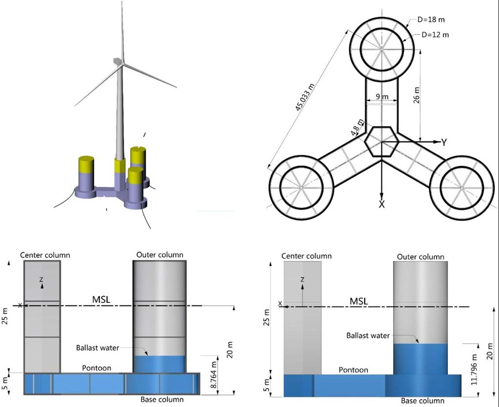
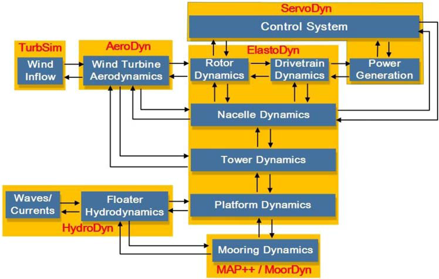
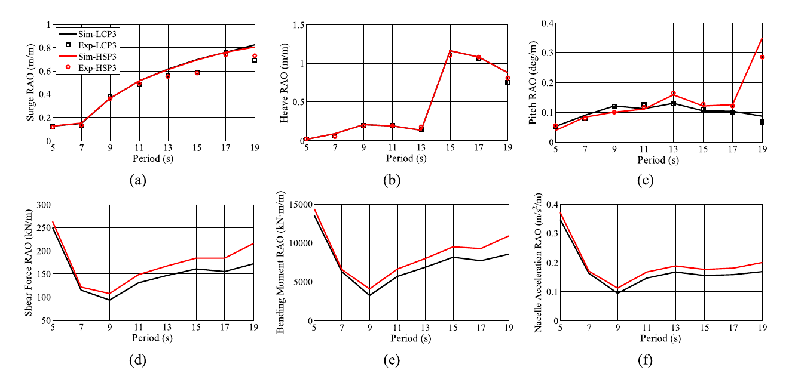
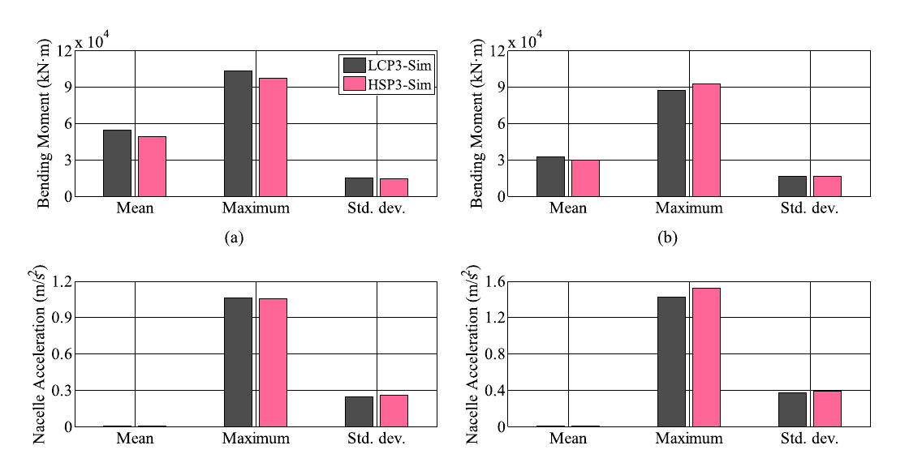

.. _paper-note-ref-li2022-SOS:

.. role:: student-first-author

漂浮风电 | 同一座 Y 型半潜平台换材料后，动力响应会怎样改变
==========================================================

深远海风能开发让浮式风机成为重要选择，而浮式支撑结构的材料选择并不只是“混凝土还是钢”的制造问题。材料会改变结构质量分布、重心位置、回复刚度和固有周期，进而影响平台运动、塔底载荷和机舱加速度。

在这篇发表于 Ships and Offshore Structures 的论文中，我们把同一座 Y 型半潜式浮式风机平台分别设计为轻质预应力混凝土平台 LCP3 和高强钢平台 HSP3，并在相同平台尺寸、吃水和系泊系统前提下比较它们的动力响应。这项工作属于 WOEAI 的海上漂浮风电 / 浮式混凝土平台结构设计方向，也连接浮式风机系统动力学、风浪联合模型试验和工程材料选型。

   图 1 半潜式浮式风机的构型

   研究对象由 :math:`5\,\mathrm{MW}` 风机、Y 型半潜式平台和三根悬链线系泊组成；混凝土与钢平台保持相同几何、吃水和系泊布置，以便把差异集中到材料和质量分布上。

论文信息
--------

- 论文题名: Dynamics of a Y-shaped semi-submersible floating wind turbine: a comparison of concrete and steel support structures
- 作者: **Li Chao**; Zhou Shengtao\*; Shan Baohua; Hu Gang; Song Xiaoping; Liu Yongqing; Hu Yimin; Yiqing Xiao
- 期刊: Ships and Offshore Structures
- 年份: 2022
- DOI: https://doi.org/10.1080/17445302.2021.1937801
- WOEAI 相关方向: 海上漂浮风电 / 浮式混凝土平台结构设计

摘要
----

混凝土半潜式浮式风机由于在建造和维护方面相对于钢结构具有优势，正受到海上风能行业越来越多的关注。然而，建造材料对浮式风机动力特性的影响此前研究较少。本文通过 :math:`1{:}60` 比尺的风浪联合模型试验和耦合多体仿真，研究分别安装在混凝土和钢制 Y 型半潜平台上的两种浮式风机动力响应。结果表明，重心较低的钢结构在减小平台纵摇运动方面具有优势；与混凝土结构相比，钢结构受到的由纵摇引起的塔底载荷和机舱加速度也更小。不过，在波频响应中出现了相反趋势，使两种结构在塔底载荷和机舱加速度方面的差异并不显著。

**英文摘要**

Concrete semi-submersible floating wind turbines (FWTs) have generated increasing interest in the offshore wind energy industry due to their superiority over steel structures in aspects of construction and maintenance. However, the influence of construction materials on the dynamics of FWTs was scarcely studied before. The dynamics of two FWTs, mounted on a concrete and a steel Y-shaped semi-submersible platform respectively, are investigated by means of 1:60 scale combined wind and wave model tests and coupled multi-body simulations. The results indicate that the steel structure with a lower centre of gravity exhibits advantages in platform pitch motion alleviation. The steel structure is also subjected to lower pitch-induced tower base loads and nacelle acceleration than its concrete counterpart. However, an opposite trend is found in the wave-frequency responses, leading to an insignificant difference of tower base loads and nacelle acceleration between the two structures.

研究问题
--------

半潜式浮式风机支撑结构常见的工程目标，是同时控制建造维护成本、运动响应、结构载荷和机组运行性能。钢结构是海洋工程中的常规方案，但在海洋环境中需要面对腐蚀、疲劳和维护成本；混凝土结构在耐久性、维护和制造成本方面具有潜在优势，却会带来不同的质量分布和重心位置。

因此，这篇论文关注的核心问题是：当同一座 Y 型半潜平台分别采用混凝土和钢材料时，平台运动、塔底前后向弯矩和机舱加速度会如何变化？这种变化能否为浮式风机支撑结构材料选择提供动力学依据？

这个问题不能只用静态结构指标回答。浮式风机同时受到风、波浪、系泊和风机控制系统影响，材料改变的是整个耦合系统的动力特性，而不只是平台本体重量。

方法贡献
--------

这项研究采用了两条互相校验的路线：一条是 :math:`1{:}60` 比尺风浪联合模型试验，另一条是基于 FAST 的耦合多体动力学仿真。

模型试验用于复现实验室中的典型风浪环境，比较 LCP3 和 HSP3 在自由衰减、规则波、风单独作用、非规则波以及风浪联合作用下的平台运动。仿真模型则在试验验证基础上进一步计算塔底前后向弯矩和机舱加速度等试验中不易直接测量的结构动力响应。

   图 10 FAST 仿真器框架

   耦合仿真把入流、气动、伺服控制、塔架、平台水动力和系泊动力连接起来，用于解释试验中观测到的平台运动差异，并推算风机结构动力响应。

论文中用于解释横摇/纵摇固有周期的关系式可以写为：

.. math::

   T = 2\pi \left(\frac{I}{D h_T}\right)^{0.5}

其中，:math:`T` 是浮体横摇或纵摇固有周期，:math:`I` 是转动惯量，:math:`D` 是浮体排水量，:math:`h_T` 是稳心高度。这个关系说明：当结构重心降低、稳心高度增大时，横摇/纵摇固有周期会缩短。对这篇论文而言，HSP3 钢平台因为需要更多压载水达到相同吃水，重心低于 LCP3 混凝土平台，从而带来不同的纵摇动力响应。

关键发现
--------

1. 钢平台重心更低，纵摇控制更有利
~~~~~~~~~~~~~~~~~~~~~~~~~~~~~~~~~

在相同尺寸、吃水和系泊布置下，混凝土平台本体质量更大，因此达到目标吃水所需压载水较少；钢平台本体质量更小，需要更多压载水，最终使 HSP3 的重心低于 LCP3。

这一重心差异直接影响横摇和纵摇固有周期。自由衰减试验显示，HSP3 的横摇/纵摇固有周期比 LCP3 约短 :math:`1.6\,\mathrm{s}`。在风单独作用下，HSP3 抵抗倾覆力矩的能力更强；论文结论中指出，在额定运行风况下，HSP3 的平均平台纵摇角比 LCP3 小约 :math:`0.5^\circ`。

2. RAO 结果显示：运动减小不等于所有载荷都同步减小
~~~~~~~~~~~~~~~~~~~~~~~~~~~~~~~~~~~~~~~~~~~~~~~~~

规则波结果中，LCP3 和 HSP3 在纵荡和垂荡 RAO 上差异很小，但纵摇 RAO 出现明显差别。低重心的 HSP3 在部分周期范围内纵摇较小，不过当波浪周期接近结构固有周期时，响应增长会提前出现。

   图 12 LCP3 与 HSP3 模型的响应幅值算子对比

   RAO 对比显示，材料与重心改变会同时影响平台运动、塔底剪力、塔底弯矩和机舱加速度，不能只用单一运动指标判断方案优劣。

一个重要结果是：虽然 HSP3 在部分工况下平台纵摇更小，但它在波频范围内可能产生更大的塔底载荷和机舱加速度。这是因为更大的静水回复刚度会在周期波浪作用下带来更强的平台纵摇加速度，进而通过柔性塔架反映到结构动力响应中。

3. 塔底载荷和机舱加速度呈现材料选择的折中关系
~~~~~~~~~~~~~~~~~~~~~~~~~~~~~~~~~~~~~~~~~~~~~

在非规则波和风浪联合作用下，LCP3 和 HSP3 的差异不再表现为简单的“某一种材料全面更优”。论文指出，HSP3 在平台纵摇运动和由纵摇引起的塔底载荷方面有优势，但在波频响应中又可能出现相反趋势。

   图 26 组合随机风浪条件下风机结构动力学统计数据

   在更接近真实运行的随机风和随机波输入下，两种平台的塔底弯矩和机舱加速度差异整体较小，但不同统计量和不同运行工况下仍会出现方向不同的差别。

4. 混凝土与钢平台各有动力学优势和弱点
~~~~~~~~~~~~~~~~~~~~~~~~~~~~~~~~~~~~~

从动力性能角度看，LCP3 混凝土平台具有较长纵摇固有周期，能让固有周期远离部分入射波周期；在一阶水动力载荷诱导的塔底载荷和机舱加速度方面也有较小响应。相应地，它的平均平台纵摇和二阶水动力载荷诱导的纵摇振荡更大。

HSP3 钢平台则具有较小平均平台纵摇、较小二阶水动力诱导的纵摇振荡，以及较小的纵摇固有频率处塔底载荷；但其纵摇固有周期更接近入射波周期，在一阶水动力载荷诱导的塔底载荷和机舱加速度上可能更大。

工程意义
--------

这篇论文的工程价值，在于把“混凝土平台是否可用于浮式风机”进一步细化为可比较的动力学问题。

对浮式混凝土平台结构设计来说，材料选择不能只看平台建造成本或耐久性，也要同时检查：

- 平台质量、压载水和重心位置的组合；
- 横摇/纵摇固有周期与目标海域波浪周期的相对关系；
- 平台运动对塔底载荷和机舱加速度的传递路径；
- 风浪联合条件下低频响应、波频响应和风机运行响应之间的耦合；
- 材料优势是否会在某些动力指标上被抵消。

对 WOEAI 的海上漂浮风电研究来说，这项工作提供了一条清晰思路：浮式混凝土平台不是简单替代钢平台，而是需要在结构材料、平台几何、压载配置、系泊、风浪环境和风机动力响应之间做系统化设计。

适用边界
--------

这项研究比较的是同一座 Y 型半潜式 :math:`5\,\mathrm{MW}` 浮式风机平台在混凝土和钢材料方案下的动力响应，不应直接外推为所有浮式风机平台或所有海况中的材料选择结论。

需要特别注意几个边界：

- 模型试验采用 :math:`1{:}60` 比尺，并使用等效拖曳盘模拟平均风推力；
- 比较前提是平台尺寸、吃水和系泊系统保持一致；
- 结论主要围绕动力性能，不等同于完整的全寿命成本、施工、运维或疲劳寿命评估；
- 论文中的典型工况不能覆盖所有目标海域的风浪联合分布；
- 后续工程设计仍需结合具体风机容量、平台尺度、材料强度、施工方案和海况统计重新校核。

因此，更准确的理解是：这项工作为混凝土与钢半潜平台的动力学选型提供了实验证据和仿真依据，而不是给出一个脱离项目条件的固定材料答案。

延伸阅读
--------

- `WOEAI | 海上漂浮风电方向介绍 <https://woeai.readthedocs.io/zh-cn/latest/FloatingOffshoreWindEnergy.html>`_
- `WOEAI | 主页 <https://woeai.readthedocs.io/zh-cn/latest/>`_

相关论文解读
------------

- :doc:`漂浮风电 | 用钢筋混凝土优化半潜式风机平台 <ref-he2026-OE-structural>`
- :doc:`漂浮风电 | 为半潜式风机找到可信的等效静力波浪荷载 <ref-zheng2025-OE>`
- :doc:`漂浮风电 | 用长期动力优化选择浮式风机下部结构 <ref-zhou2023-AE>`
