.. _paper-note-ref-li2022-SOS:

Y 形半潜式浮式风机动力学：混凝土与钢支撑结构比较论文精解
======================================================================

精简版微信公众号文章：待发布

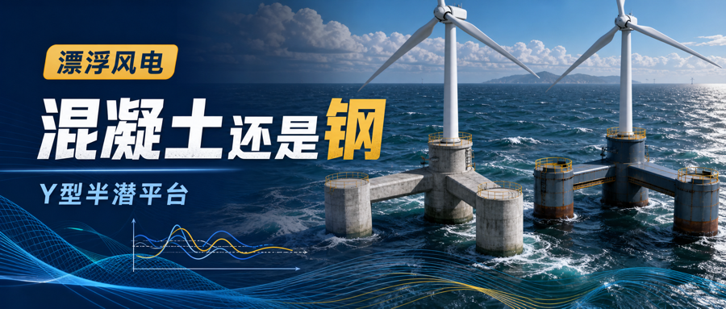

.. contents:: 本页目录
   :local:
   :depth: 3

论文信息
--------

原文题名：Dynamics of a Y-shaped semi-submersible floating wind turbine: a comparison of concrete and steel support structures。

作者及原文单位标记：Chao Li :sup:`a` 、Shengtao Zhou :sup:`a` 、Baohua Shan :sup:`b` 、Gang Hu :sup:`a` 、Xiaoping Song :sup:`c` 、Yongqing Liu :sup:`c` 、Yimin Hu :sup:`c` 、Xiao Yiqing :sup:`a` 。通讯作者：Shengtao Zhou；原文通讯邮箱：zhoushengtao1991@foxmail.com。

- a：中国深圳，哈尔滨工业大学（深圳）土木与环境工程学院
- b：中国哈尔滨，哈尔滨工业大学土木工程学院
- c：中国湘潭，湘电风能有限公司（XEMC Windpower Co., Ltd）

期刊：Ships and Offshore Structures。正式卷期信息为 2022 年，第 17 卷第 8 期，1663–1683 页；本次所据出版 PDF 的引用页标为 2021 年在线文章，在线发表日期为 2021 年 6 月 11 日。收稿日期：2020 年 5 月 27 日；录用日期：2021 年 5 月 26 日。原文未列修回日期。DOI：`10.1080/17445302.2021.1937801 <https://doi.org/10.1080/17445302.2021.1937801>`_。

摘要
----

混凝土半潜式浮式风机（FWTs）因在建造和维护方面相对于钢结构具有优势，正受到海上风能行业越来越多的关注。然而，建造材料对浮式风机动力特性的影响此前很少得到研究。本文通过 1:60 比尺的风浪联合模型试验和耦合多体仿真，研究分别安装在混凝土和钢制 Y 形半潜平台上的两种浮式风机的动力学特性。结果表明，重心较低的钢结构在减小平台纵摇运动方面具有优势。与混凝土结构相比，钢结构受到的纵摇诱导塔底载荷和机舱加速度也较小。不过，在波频响应中发现了相反趋势，导致两种结构的塔底载荷和机舱加速度差异不显著。

缩写
----

- FWTs：浮式风机（Floating wind turbines）
- CoG：重心（Centre of gravity）
- CoB：浮心（Centre of buoyancy）
- LCP3：轻质预应力混凝土平台（Lightweight prestressed concrete platform）
- HSP3：高强钢平台（High-strength steel platform）
- WTWF：风洞与波浪水槽联合实验室（Wind tunnel and wave flume joint laboratory）
- ROC：额定运行工况（Rated operational condition）
- JONSWAP：联合北海波浪观测计划（原文写作 Joint North Sea Wave Observation Projection）
- RAO：响应幅值算子（Response amplitude operator）
- BEM：叶素动量理论（Blade element momentum theory）
- DOF：自由度（Degree of freedom）
- GDW：广义动态尾流理论（Generalised dynamic wake theory）
- PSD：功率谱密度（Power spectral density）
- QTF：二次传递函数（Quadratic transfer function）

关键词
------

动力性能；建造材料；混凝土；钢；风浪联合模型试验；耦合多体仿真。

符号表
------

.. list-table:: 原文符号表
   :header-rows: 1
   :class: longtable

   * - 符号
     - 含义
   * - :math:`\gamma`
     - 海水与淡水密度比
   * - :math:`\lambda`
     - 几何比尺
   * - :math:`C_d`
     - 转子圆盘阻力系数
   * - :math:`\rho`
     - 空气密度
   * - :math:`v`
     - 来流风速
   * - :math:`A`
     - 转子圆盘面积
   * - :math:`\boldsymbol F_{\mathrm{Lines}}`
     - 系泊线恢复载荷向量
   * - :math:`\boldsymbol C_{\mathrm{Lines}}`
     - 系泊线线性恢复矩阵
   * - :math:`\boldsymbol q`
     - 平台位移向量
   * - :math:`H_s`
     - 有义波高
   * - :math:`T_p`
     - 波浪谱峰周期
   * - :math:`T`
     - 浮体横摇/纵摇固有周期
   * - :math:`D`
     - 浮体排水量
   * - :math:`h_T`
     - 稳心高度
   * - :math:`\mathrm{QTF}^{\mathrm F}`
     - 载荷二次传递函数
   * - :math:`\mathrm{QTF}^{\mathrm M}`
     - 运动二次传递函数
   * - :math:`\omega_d`
     - 差频
   * - :math:`\boldsymbol M`
     - 结构质量矩阵
   * - :math:`\boldsymbol A`
     - 浮体附加质量矩阵
   * - :math:`\boldsymbol B`
     - 浮体辐射阻尼矩阵
   * - :math:`\boldsymbol C_{\mathrm{hydrostatic}}`
     - 浮体静水恢复刚度矩阵
   * - :math:`m`
     - 结构总质量
   * - :math:`z_G`
     - 结构重心
   * - :math:`I_x,I_y,I_z`
     - 绕 x、y、z 轴的转动惯量
   * - :math:`A_{\mathrm{WP}}`
     - 水线面面积
   * - :math:`\overline{GM}_{\mathrm T},\overline{GM}_{\mathrm L}`
     - 横向与纵向稳心高度
   * - :math:`M_{\mathrm{twr}}`
     - 塔底前后向弯矩
   * - :math:`a_{\mathrm{ncl}}`
     - 机舱加速度

1 引言
------

当前的能源短缺和人为引起的全球变暖，使人们越来越关注可再生能源；可再生能源被认为是未来替代煤、石油和天然气等传统燃料的理想选择。在过去十年中，全球风能迅速发展，并且很有潜力成为本世纪的一种主要能源（Leung and Yang 2012）。尽管风能的主要增长来自陆上风电项目（Global Wind Energy Council 2016），研究人员和开发者近来对利用海上风能产生了浓厚兴趣（Perveen et al. 2014），因为与陆上风能相比，海上风能更强、更丰富，而且噪声与视觉干扰较小。此外，海上风电场可以安装在沿海城市中心附近，有利于减少输电线路投资并提高洁净能源的利用效率（Breton and Moe 2009）。截至 2016 年，全球海上风电累计装机容量已达到 14,384 MW（Global Wind Energy Council 2016）。远离海岸的深水海域通常风速更高（Hua 2011; Leung and Yang 2012）。例如，美国一半以上的海上风能位于水深为 60 m 的区域（Schwartz et al. 2010）。目前，大多数海上风电场采用单桩、三脚架和导管架等固定式基础，其适用水深限于 50 m。超过这一范围，建造成本会急剧增加。浮式风机被认为是开发深水风能的一种可能方案。

在过去十年中，基于海洋石油与天然气工业积累的经验，人们提出了众多浮式基础设计概念。一些原型已经建成，并在海上开展了全尺度试验，例如立柱式 Hywind（Stiesdal 2009）和 Fukushima Hamakaze（Fukushima 2014）、半潜式 WindFloat（Roddier et al. 2010）、Fukushima Mirai 和 Shimpuu（Fukushima 2014），以及张力腿平台（TLP）BlueH（Blue 2004）。这些项目的成功证明了浮式风机的可行性和可靠性。然而，应当指出，浮式风机产业仍处于起步阶段。降低成本是其面临的主要挑战之一。据报道，海上风能的成本是陆上风能的 1.5–2 倍（Watson et al. 2005）。根据 Marlene Orth 和 Andreas Jan-Gerrit Becker 的研究（Orth and Becker 2016），浮式下部结构约占浮式风电场资本支出的 30%，接近风机制造所占的比例。因此，基础设计是使浮式风机具有相对于其他能源竞争力的关键。

由于安装成本相对较低、场址适应性较好，半潜式基础是现有全尺度浮式风机中最常采用的基础形式。遵循海洋工程的一般做法，上述半潜式浮式风机均采用钢材建造。据估计，为一台 5 MW 风机建造半潜平台需要 2500–3200 t 钢材（Walia et al. 2017）；如果依据文献（Castro-Santos et al. 2016）假定钢价为 524 欧元/t，则钢材成本为 130 万–170 万欧元。此外，由于海洋环境中的腐蚀和疲劳载荷作用，钢结构在 20–30 年的服役期内必须定期检查和维护；需要注意的是，海上维护费用可能是陆上作业的 5–10 倍（Van Bussel and Zaayer 2001）。因此，材料和维护费用将占钢结构总支出的相当一部分。

混凝土是建造半潜式船体的另一种可能材料。事实上，过去半个世纪以来，全球已经建成 40 余座混凝土海洋结构（Sandvik et al. 2004），并在服役期内表现优异：其耐久性很高，平均维护成本和维护时间均约为钢制船体的三分之一；其对疲劳不敏感，因而服役寿命可以大幅延长；同时，其制造成本显著低于钢结构（Haug and Fjeld 1996; Pérez Fernández and Lamas Pardo 2013）。基于这些原因，近年来开发了若干混凝土半潜式浮式风机概念，例如美国缅因大学开发的四立柱平台 VolturnUS（Viselli et al. 2015, 2016）、Dr. Techn. Olav Olsen 公司开发的 OO-Star Wind Floater（Oggiano et al. 2016），以及 Ideol 公司的环形基础（Beyer et al. 2015）。

除建造和维护外，动力性能也是一项关键考虑因素。钢平台和混凝土平台的质量分布不同，可能导致不同的动力响应，包括运动、内载荷、变形等；这些响应与风机的停机时间和疲劳寿命密切相关，最终会导致不同的平准化能源成本。然而，据作者所知，现有文献中尚未发现针对钢与混凝土半潜式浮式风机动力特性差异的综合研究。

本研究旨在从结构动力学的角度，为半潜式浮式风机的建造材料选择提供参考。研究分别安装在钢制和混凝土 Y 形半潜平台上的 5 MW 风机的整体动力响应。这项比较研究以两种平台具有相同尺寸、吃水和系泊系统为前提。首先开展 1:60 比尺模型试验，考察平台运动的差异。随后建立相应的耦合多体动力学数值模型，并用试验数据验证。对于试验中未测量的塔底载荷和机舱加速度，也进行预测，并比较钢结构和混凝土结构之间的差异。最后讨论结果，并在文末给出结论。

2 研究系统说明
--------------

如图 1 所示，所研究的浮式风机系统由一台 5 MW 水平轴风机、一座 Y 形半潜式基础和三根悬链线系泊线组成。

风机的技术参数与 NREL 5 MW 水平轴参考风机相似（Jonkman et al. 2009）。轮毂高度为平均海平面（MSL）以上 90 m；切入、额定和切出风速分别为 3、11.5 和 25 m/s。

Y 形半潜式平台是作者研究团队提出的一种概念设计。平台下部布置三根矩形截面浮筒，连接外围立柱和中央立柱，为结构提供足够的强度与刚度。此外，底部立柱和大截面浮筒可提供压载空间，降低重心（CoG）。浮体尺寸和坐标系见图 1(b)，其中细线表示浮筒及底部立柱内部的加劲肋和舱壁。本研究讨论两种平台：一种拟采用密度为 1900 kg/m³ 的高强轻质预应力混凝土建造，下文称为 LCP3 模型；另一种采用高强钢建造，下文称为 HSP3 模型。经初步结构分析，混凝土和钢结构的平台壁厚分别设计为 350 mm 和 45 mm。如图 1(c)、(d) 所示，浮筒、底部立柱和外围立柱中装填压载水，以达到 20 m 的吃水。平台结构参数见表 1；混凝土平台自身质量约为钢平台的 1.8 倍，因此达到目标吃水所需的压载水较少。由此，HSP3 模型的重心比 LCP3 模型低近 1 m，而 LCP3 模型的纵摇/横摇转动惯量大于 HSP3 模型。

系泊系统由三根悬链线系泊线组成，连接在底部立柱的外缘，连接点位于平均海平面以下 15 m。原型系泊系统的参数汇总于表 2。

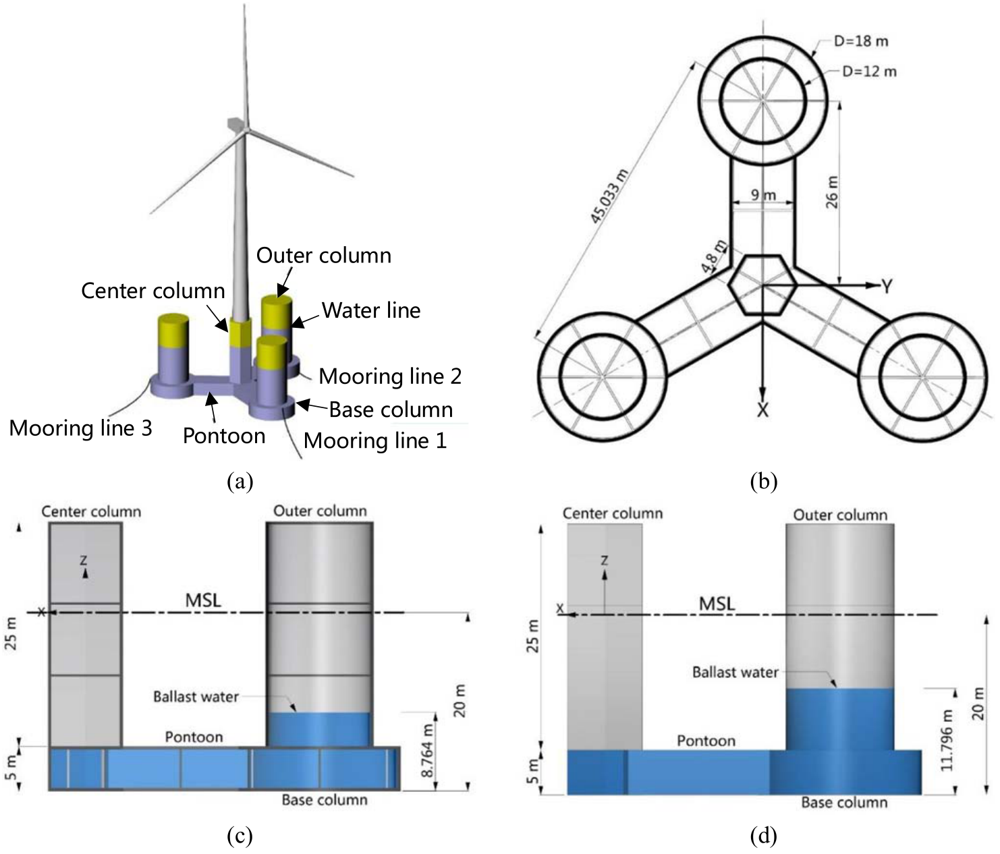

   **图 1** 半潜式浮式风机构型：(a) 系统总览；(b) 平台尺寸；(c) 混凝土平台侧视图；(d) 钢平台侧视图。原图在线版为彩色。

   图内标记：Center column 为中央立柱，Outer column 为外围立柱，Base column 为底部立柱，Pontoon 为浮筒，Water line 为水线，Mooring line 1–3 为系泊线 1–3，Ballast water 为压载水，MSL 为平均海平面。

.. list-table:: 表 1 Y 形平台的结构参数
   :header-rows: 1
   :class: longtable

   * - 结构参数
     - 混凝土平台（LCP3）
     - 钢平台（HSP3）
   * - 平台质量，不含压载（kg）
     - 5.975E+06
     - 3.355E+06
   * - 压载质量（kg）
     - 5.615E+06
     - 8.235E+06
   * - 重心位于平均海平面以下的深度（m）
     - 13.141
     - 14.137
   * - 绕重心的纵摇/横摇转动惯量（kg·m²）
     - 3.820E+09
     - 3.654E+09
   * - 绕重心的艏摇转动惯量（kg·m²）
     - 6.234E+09
     - 6.367E+09

.. list-table:: 表 2 悬链线系泊系统的参数
   :header-rows: 1
   :class: longtable

   * - 参数
     - 数值
   * - 系泊线数量
     - 3
   * - 导缆孔位于平均海平面以下的深度（m）
     - 15
   * - 锚点位于平均海平面以下的深度（m）
     - 90
   * - 锚点与 z 轴之间的水平距离（m）
     - 424.8
   * - 系泊线无张力长度（m）
     - 392
   * - 系泊线直径（m）
     - 0.08
   * - 流体中单位长度等效表观质量（kg/m）
     - 136.248
   * - 等效拉伸刚度（MN）
     - 50

3 试验设置
----------

3.1 试验设施
~~~~~~~~~~~~

模型试验在哈尔滨工业大学风洞与波浪水槽（WTWF）联合实验室开展。如图 2 所示，宽 5.0 m、深 4.5 m、长 50 m 的波浪水槽位于闭口回流风洞较大的试验段下方。风洞风机与造波机联合运行，可以生成真实的风场和波浪场。造波机可生成的最大波高为 0.4 m，波浪周期范围为 0.5–5 s。水面以上的风速可在 1–30 m/s 之间连续调节。闭口回流风洞另一侧较小的纯风试验段能够生成高质量的大气边界层，将用于标定缩尺风机模型。

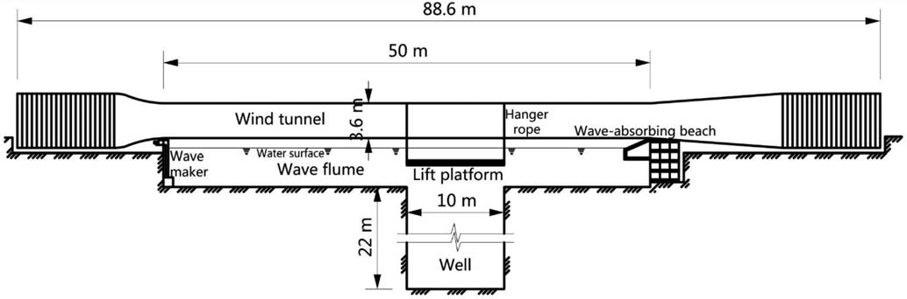

   **图 2** 哈尔滨工业大学风洞与波浪水槽实验室侧视图。原图在线版为彩色。

   图内标记：Wind tunnel 为风洞，Wave maker 为造波机，Water surface 为水面，Wave flume 为波浪水槽，Hanger rope 为吊索，Lift platform 为升降平台，Wave-absorbing beach 为消波滩，Well 为深井。

3.2 试验模型
~~~~~~~~~~~~

试验模型和外部载荷依据 Froude 相似律，按 1:60 的几何比尺缩小。为避免混淆，所有结果均以原型尺度给出。

为满足制造精度、结构强度和刚度要求，平台模型采用厚度为 0.95 mm 的不锈钢制作。试验所用实体模型见图 3。作为压载的铁块放置在底部立柱、浮筒和外围立柱内部。通过调整铁块的相对位置，可以实现 LCP3 和 HSP3 原型的重心及转动惯量。原型与试验模型的结构参数见表 3，其中 :math:`\gamma` 表示海水与淡水的密度比，取 1.025； :math:`\lambda` 为几何比尺，本研究中取 60。可见试验模型与原型吻合良好，误差均在 5% 以内。

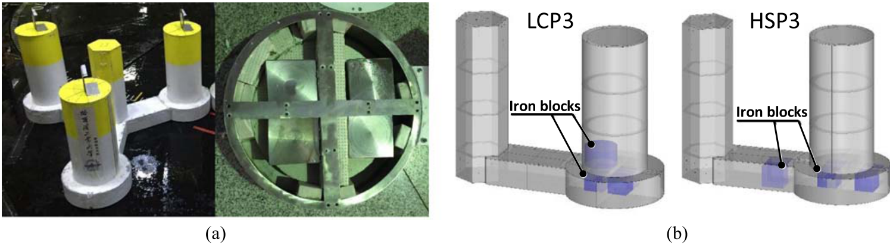

   **图 3** 平台模型：(a) 垂荡水舱内装有铁块的实体模型；(b) 铁块位置。原图在线版为彩色。

   图内 Iron blocks 为铁块；LCP3 和 HSP3 分别对应混凝土原型和钢原型的配重布置。

.. list-table:: 表 3 原型与试验模型结构参数比较（试验模型值已换算到原型尺度）
   :header-rows: 1
   :class: longtable

   * - 结构参数
     - 比例因子
     - LCP3 原型
     - LCP3 试验模型
     - LCP3 误差
     - HSP3 原型
     - HSP3 试验模型
     - HSP3 误差
   * - 平台质量，含压载（kg）
     - :math:`\gamma\lambda^3`
     - 1.159E+07
     - 1.125E+07
     - −2.934%
     - 1.159E+07
     - 1.125E+07
     - −2.934%
   * - 重心位于平均海平面以下的深度（m）
     - :math:`\lambda`
     - 13.141
     - 13.222
     - 0.616%
     - 14.137
     - 14.160
     - 0.163%
   * - 绕重心的纵摇/横摇转动惯量（kg·m²）
     - :math:`\gamma\lambda^5`
     - 3.820E+09
     - 3.819E+09
     - −0.026%
     - 3.654E+09
     - 3.666E+09
     - 0.328%
   * - 绕重心的艏摇转动惯量（kg·m²）
     - :math:`\gamma\lambda^5`
     - 6.234E+09
     - 6.478E+09
     - 3.914%
     - 6.367E+09
     - 6.088E+09
     - −4.382%

对于风机模型，为简化起见，采用阻力盘模拟原型的平均风推力（Roddier et al. 2010; Wan et al. 2015, 2016a, 2016b, 2017）。试验模拟了两种风况，即额定运行风速 11.5 m/s 和最大运行（切出）风速 25 m/s。相应地，在轮毂轴上安装两个不同直径的圆盘，使其与原型平均推力匹配。首先根据下式初步估算直径：

.. math::

   F=0.5C_d\rho v^2 A.

其中， :math:`C_d` 是圆盘的阻力系数，依据 DNV 海洋结构设计规范（DNV 2010）假定为 1.9； :math:`\rho` 是空气密度； :math:`v` 是来流风速； :math:`A` 是圆盘面积。随后，在小试验段中标定简化风机模型的风推力。塔底推力采用 ATI 测力天平测量。不断调整圆盘直径，直至实测平均推力与原型值良好匹配。试验采用的等效风机模型见图 4，图 5 表明试验模型与原型的风推力吻合尚好。

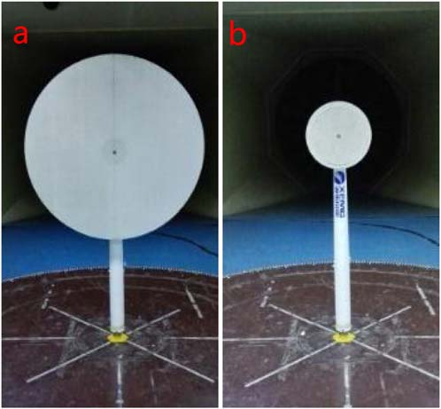

   **图 4** 风机模型：(a) 额定风况；(b) 切出风况。原图在线版为彩色。

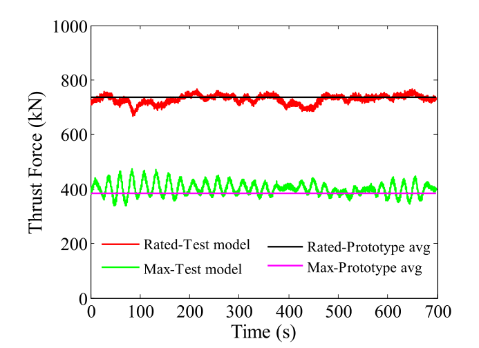

   **图 5** 两种风况下试验模型与原型的塔底风推力比较。原图在线版为彩色。

   横轴为时间（s），纵轴为推力（kN）；Rated 为额定风况，Max 为最大运行风况，Test model 为试验模型，Prototype avg 为原型平均值。

表 2 表明，原型系泊锚点与 :math:`z` 轴之间的水平距离为 424.8 m，这意味着容纳 1:60 缩尺悬链线系泊系统需要至少 12.3 m 宽的水槽。因此，按原型形状模拟系泊线不可行。事实上，浮式风机运行过程中竖向恢复力的变化相对较小（Robertson et al. 2012）。此外，在一定的位移范围内，悬链线系泊系统的水平恢复力/转动恢复力矩与平台运动之间可具有良好的线性关系。因此，采用平衡水平弹簧系泊系统来模拟原型悬链线是合理的（Ishihara et al. 2007）。如图 6 所示，本研究在平台周围按 120° 间隔安装三根弹簧系泊线。弹簧刚度通过对原型悬链线系泊系统的位移–恢复力曲线进行线性最小二乘拟合确定。图 7 表明，弹簧系泊与原型悬链线系泊系统吻合良好。

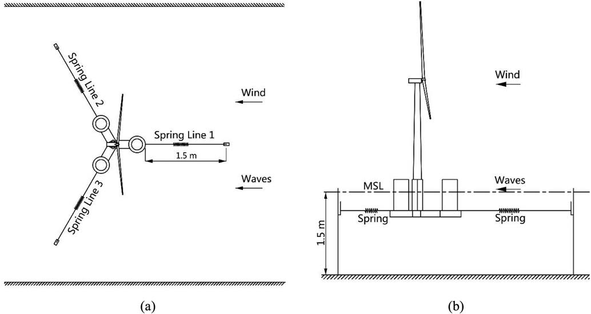

   **图 6** 水平弹簧系泊线布置：(a) 平面图；(b) 侧视图。原图在线版为彩色。

   图内 Spring line 1–3 为弹簧系泊线 1–3，Spring 为弹簧，Wind 为风，Waves 为波浪，MSL 为平均海平面。

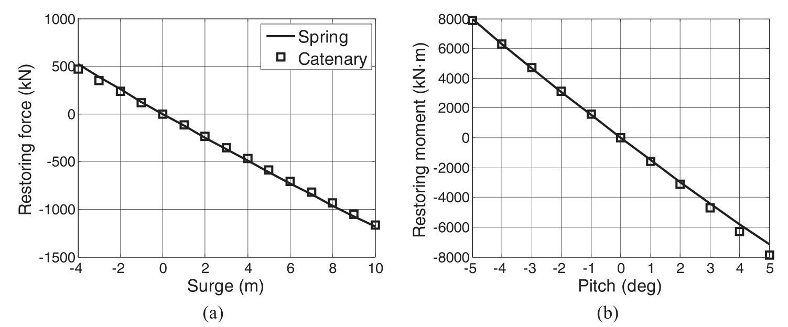

   **图 7** 水平弹簧系泊系统与原型悬链线系泊系统比较：(a) 纵荡–恢复力曲线；(b) 纵摇–恢复力矩曲线。原图在线版为彩色。

   Spring 表示弹簧系统，Catenary 表示悬链线系统；纵荡单位为 m，纵摇单位为 deg，恢复力和恢复力矩单位分别为 kN 和 kN·m。

3.3 测量仪器
~~~~~~~~~~~~

如图 8 所示，风剖面采用安装在升降架上的微压计测量；平台运动响应则采用自主开发的立体视觉测量系统测量（Shan et al. 2015, 2016），该系统由两台相机、五个跟踪靶标以及一个图像采集/处理平台组成。与激光位移传感器开展的对比标定表明，该系统具有良好的测量精度。此外，在风洞上游安装一台微压计和一支电容式波高仪，分别监测轮毂高度风速和入射波场。

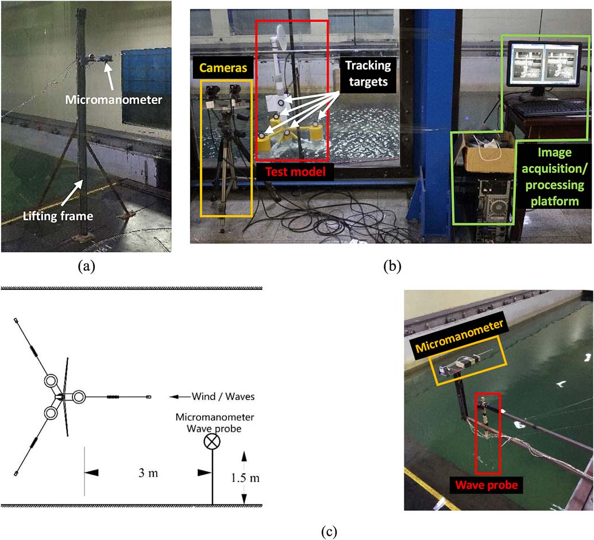

   **图 8** 测量仪器：(a) 安装在升降架上的微压计；(b) 自主开发的立体视觉测量系统；(c) 安装在风洞上游的微压计和波高仪。原图在线版为彩色。

   图内 Micromanometer 为微压计，Lifting frame 为升降架，Cameras 为相机，Tracking targets 为跟踪靶标，Test model 为试验模型，Image acquisition/processing platform 为图像采集/处理平台，Wave probe 为波高仪，Wind/Waves 为风/波浪方向。

3.4 环境条件
~~~~~~~~~~~~

本研究考察额定运行工况（ROC）和最大运行工况（MOC）下的浮式风机动力学。根据南海长期气象海洋数据的统计值，表 4 给出了轮毂高度平均风速、有义波高和谱峰周期。假定随机波遵循联合北海波浪观测计划（JONSWAP）谱。

.. list-table:: 表 4 环境条件
   :header-rows: 1
   :class: longtable

   * - 典型工况
     - 风速
     - 有义波高 Hs
     - 谱峰周期 Tp
   * - 额定运行工况（ROC）
     - 11.5 m/s
     - 2.23 m
     - 6.74 s
   * - 最大运行工况（MOC）
     - 25 m/s
     - 5.10 m
     - 10.37 s

在安装模型之前，对风洞和波浪水槽生成的风场与波场进行了标定。测得的平均风速和湍流强度剖面见图 9(a)、(b)。可以看到，平均风速剖面与风切变指数为 0.1 的经验幂律剖面一致良好，图中虚线表示该经验剖面。由于试验采用阻力盘而非旋转转子，因此没有刻意生成湍流风。相应地，湍流强度较低，略低于 5%。因此，可将其视为稳态风场。此外，图 9(c)、(d) 比较了实测波浪谱与目标 JONSWAP 谱。在额定运行工况图中，0.2 Hz 附近存在一些差异，可能由反射波引起，但总体吻合尚好。

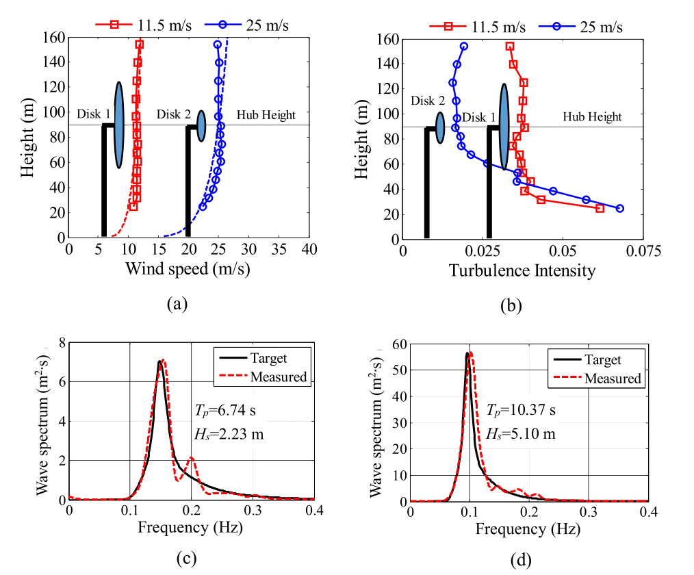

   **图 9** 实测风场与波场：(a) 平均风速剖面；(b) 湍流强度剖面；(c) ROC 下的随机波谱；(d) MOC 下的随机波谱。原图在线版为彩色。

   上排纵轴为高度（m），横轴分别为风速（m/s）和湍流强度；Disk 1、Disk 2 为圆盘 1、2，Hub Height 为轮毂高度。下排为波浪谱（m²·s）随频率（Hz）的变化，Target 为目标谱，Measured 为实测谱。

3.5 试验矩阵
~~~~~~~~~~~~

随后，开展自由衰减试验、规则波试验、仅风试验、非规则波试验以及风浪联合试验，以研究 LCP3 和 HSP3 模型的动力学。自由衰减试验旨在识别模型的固有周期和黏性阻尼系数。规则波试验用于确定响应幅值算子（RAO），这是线性水动力性能的重要指标。试验考察波高为 2 m、波浪周期从 5 s 到 19 s 且周期步长为 2 s 时的运动响应。通过仅风试验和非规则波试验，分别研究风与波浪的影响。最后，采用风浪联合试验，测试两种真实海况（ROC 和 MOC）下模型的动力性能。每种载荷工况均记录原型尺度下 2 h 的试验数据，并选择稳态数据进行分析。试验矩阵见表 5。

.. list-table:: 表 5 试验矩阵
   :header-rows: 1
   :class: longtable

   * - 试验
     - 轮毂高度风速（m/s）
     - 波浪周期（s）
     - 波高（m）
   * - 自由衰减试验
     - —
     - —
     - —
   * - 规则波试验
     - —
     - 5:2:19
     - 2
   * - 非规则波试验
     - —
     - 6.74
     - 2.23
   * - 非规则波试验
     - —
     - 10.37
     - 5.10
   * - 非规则波试验
     - —
     - 14.13
     - 10.65
   * - 仅风试验
     - 11.5
     - —
     - —
   * - 仅风试验
     - 25
     - —
     - —
   * - 风浪联合试验
     - 11.5
     - 6.74
     - 2.23
   * - 风浪联合试验
     - 25
     - 10.37
     - 5.10

4 数值方法
----------

试验仅测量了平台运动，这显然不足以全面理解 LCP3 和 HSP3 模型之间的动力性能差异。数值模拟能够提供浮式风机动力学的更多细节，是缩尺模型试验的良好补充。

浮式风机动力学仿真采用海上水平轴风机耦合动力学模拟器 FAST（Jonkman and Buhl 2005），它集成了陆上风机和海洋油气工业的计算方法与分析工具。其中，可以先利用湍流风模拟器 TurSim（Kelley and Jonkman 2005）生成随机风场，再通过基于叶素动量（BEM）理论或广义动态尾流（GDW）理论的 AeroDyn 程序（Jonkman et al. 2015）计算风机气动载荷。此外，风机控制模块 ServoDyn 用于根据风况调整叶片桨距角和机舱偏航角。HydroDyn 程序（Jonkman et al. 2014）采用势流理论或 Morison 方程计算作用在平台上的水动力载荷。它通过卷积积分和 Fourier 变换，将可由势流求解器获得的频域水动力量转化为水动力载荷时程。黏性阻尼效应通常采用二次阻力项模拟。在系泊动力学方面，分别基于准静态方法和集中质量方法的 MAP++ 与 MoorDyn（Hall 2015）可用于确定系泊线的恢复载荷。获得全部外载荷后，基于多体动力学的 ElastoDyn 程序即可预测浮式风机的运动、内力/力矩和变形等动力响应。浮式平台、机舱和轮毂模拟为刚体，塔架和叶片则模拟为柔性构件。采用 Kane 方法建立多体系统运动方程，并利用定时间步长的 Adams–Bashforth–Adams–Moulton 预测–校正积分格式求解（Jonkman 2003）。随后更新浮式风机的运动状态，FAST 进入下一时间步仿真。FAST 模拟器的框架见图 10。

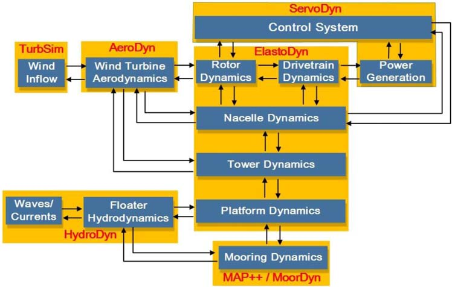

   **图 10** FAST 模拟器框架（Jonkman 2007）。原图在线版为彩色。

   图内 Wind Inflow 为风入流，Wind Turbine Aerodynamics 为风机气动力学，Control System 为控制系统，Rotor Dynamics 为转子动力学，Drive Train Dynamics 为传动链动力学，Power Generation 为发电，Nacelle Dynamics 为机舱动力学，Tower Dynamics 为塔架动力学，Platform Dynamics 为平台动力学，Floater Hydrodynamics 为浮体水动力学，Mooring Dynamics 为系泊动力学，Waves/Currents 为波浪/海流；保留原图软件模块名称。

为进行验证，根据试验条件确定仿真的输入与设置。试验测得的波高和风速时程用作数值模型的输入。

与模型试验中的阻力盘一致，转子被模拟为不旋转的钝体，其推力同样可用公式 :math:`F=0.5C_d\rho v^2A` 简单计算。在开始浮式风机动力学仿真前，首先在陆上模式下标定风机模型的气动参数。调节各叶片/塔架截面的 :math:`C_d` 值，使其与风机标定试验测得的平均塔底力/力矩匹配。

附加质量、辐射阻尼、一阶和二阶波浪激励力等水动力系数由势流求解器计算（Lee 1995）。值得注意的是，可能激发浮式风机共振响应的差频与和频漂移力均被考虑（Bayati 2014）。水动力分析采用 [0.05, 3] rad/s 的频率范围，步长为 0.05 rad/s。对于半潜式平台，黏性阻力是总水动力阻尼的重要组成部分，依据自由衰减试验确定（Coulling et al. 2013）。通过反复试算调整整体二次阻尼系数，使各自由度（DOF）的实测自由衰减曲线得到匹配。

对于模型试验采用的等效水平弹簧系泊系统，由于平台位移与恢复力/力矩之间具有图 11 所示的强线性关系，可以用线性恢复矩阵表征恢复载荷。矩阵元素通过对弹簧系泊系统的恢复曲线进行线性最小二乘拟合确定。拟合直线的斜率就是各自由度对应的对角元素。应当注意，纵荡与纵摇（横荡与横摇）的恢复力存在耦合，因此还需要估计 (1, 5)、(5, 1)、(2, 4) 和 (4, 2) 位置的非对角元素。如图 11 所示，不难发现，非对角元素等于拟合直线截距相对于耦合位移的变化率。数值模拟使用的恢复矩阵见式 (1)，其中 :math:`\boldsymbol F_{\mathrm{Lines}}(t)` 为系泊线恢复载荷向量， :math:`\boldsymbol C_{\mathrm{Lines}}` 为线性恢复矩阵， :math:`\boldsymbol q(t)` 为平台位移向量。

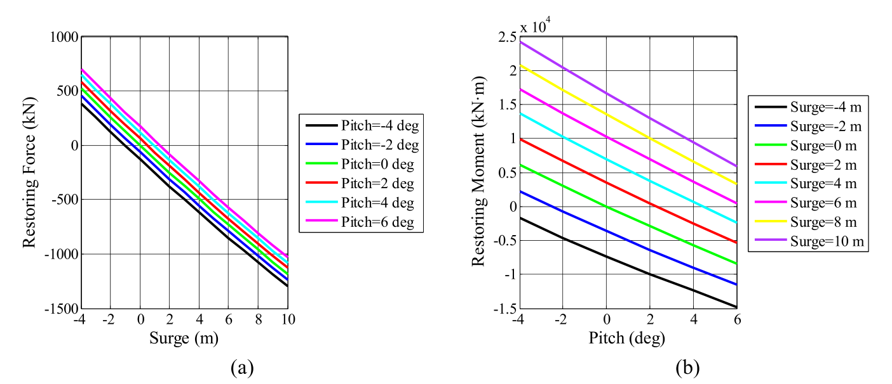

   **图 11** 等效水平弹簧系泊系统的恢复曲线：(a) 纵荡–恢复力曲线；(b) 纵摇–恢复力矩曲线。原图在线版为彩色。

   (a) 各曲线对应不同纵摇角 Pitch，(b) 各曲线对应不同纵荡位移 Surge；Restoring Force 为恢复力，Restoring Moment 为恢复力矩。

.. math::

   \begin{aligned}
   \boldsymbol F_{\mathrm{Lines}}(t)&=\boldsymbol C_{\mathrm{Lines}}\boldsymbol q(t)\\
   &=\begin{bmatrix}
   125480\,\mathrm{N/m}&0&0&0&-1906188\,\mathrm{N/rad}&0\\
   0&130058\,\mathrm{N/m}&0&1947149\,\mathrm{N/rad}&0&0\\
   0&0&0&0&0&0\\
   0&1948455\,\mathrm{N\,m/m}&0&91505613\,\mathrm{N\,m/rad}&0&0\\
   -1871005\,\mathrm{N\,m/m}&0&0&0&95108596\,\mathrm{N\,m/rad}&0\\
   0&0&0&0&0&124795422\,\mathrm{N\,m/rad}
   \end{bmatrix}\boldsymbol q(t).
   \end{aligned}
   \qquad (1)

5 结果与讨论
------------

5.1 自由衰减试验
~~~~~~~~~~~~~~~~

表 6 所列自由衰减试验结果表明，数值模拟与模型试验吻合良好，说明数值模型的质量中心、转动惯量和系泊刚度均得到恰当模拟。LCP3 和 HSP3 模型的主要差异体现在横摇与纵摇自由度上。HSP3 的固有周期比 LCP3 模型小约 1.6 s。这可以用下式解释：

.. math::

   T=2\pi\left(\frac{I}{Dh_T}\right)^{0.5}.

其中， :math:`T` 是平台的横摇/纵摇固有周期； :math:`I` 是横摇/纵摇转动惯量； :math:`D` 是平台排水量； :math:`h_T` 是稳心高度。如表 1 所示，钢平台的重心较低（稳心高度较大），横摇/纵摇转动惯量也小于混凝土平台，因此横摇/纵摇固有周期较短。

此外，通过自由衰减试验还获得了用于模拟黏性阻尼效应的整体二次阻尼系数，结果见表 7。

.. list-table:: 表 6 自由衰减试验结果（固有周期，s）
   :header-rows: 1
   :class: longtable

   * - 自由度
     - LCP3 试验
     - LCP3 仿真
     - LCP3 误差
     - HSP3 试验
     - HSP3 仿真
     - HSP3 误差
   * - 纵荡
     - 79.5
     - 81.2
     - 2.1%
     - 79.4
     - 81.2
     - 2.3%
   * - 横荡
     - 79.8
     - 79.8
     - 0.0%
     - 79.3
     - 79.7
     - 0.5%
   * - 垂荡
     - 15.1
     - 15.2
     - 0.7%
     - 15.3
     - 15.2
     - −0.7%
   * - 横摇
     - 26.7
     - 26.4
     - −1.1%
     - 25.2
     - 24.7
     - −2.0%
   * - 纵摇
     - 26.5
     - 26.8
     - 1.1%
     - 24.7
     - 24.8
     - 0.4%
   * - 艏摇
     - 78.6
     - 78.4
     - −0.3%
     - 78.1
     - 78.4
     - 0.4%

.. list-table:: 表 7 整体二次阻尼系数
   :header-rows: 1
   :class: longtable

   * - 自由度
     - 整体二次阻尼系数
   * - 纵荡
     - :math:`2.5\times10^6\ \mathrm{N\,s^2/m^2}`
   * - 横荡
     - 2.5 × 10⁶ N·2/m²（原文单位）
   * - 垂荡
     - :math:`1.5\times10^6\ \mathrm{N\,s^2/m^2}`
   * - 横摇
     - :math:`2.0\times10^9\ \mathrm{N\,m\,s^2/rad^2}`
   * - 纵摇
     - :math:`2.0\times10^9\ \mathrm{N\,m\,s^2/rad^2}`
   * - 艏摇
     - :math:`4.0\times10^9\ \mathrm{N\,m\,s^2/rad^2}`

.. note::

   原文正文及结论用“约 1.6 s”概括周期差异；表 6 的试验值分别给出横摇差 1.5 s、纵摇差 1.8 s。本页保留两处表述。原文未编号周期简式仅将 :math:`D` 定义为排水量，未明确其单位；此处按原式保留，不补入原文没有的重力或附加惯性项。表 7 横荡项的单位在原文印为 N·2/m²，与其他平动项不同，也按原样保留。

5.2 规则波试验
~~~~~~~~~~~~~~

规则波试验的试验与数值结果见图 12。RAO 等于稳态周期响应的幅值除以规则波幅值。这里比较了纵荡、垂荡和纵摇自由度的实测与计算 RAO。在全部研究周期内，数值结果与试验数据吻合良好。图 12(a) 表明，纵荡 RAO 在 5–7 s 范围内较小，随后随波浪周期迅速增加，在 17 s 时达到 0.78 m/m。模型试验表明，19 s 时有轻微下降，而数值模型预测 RAO 将增加到略高于 0.8 m/m。这一差异可能归因于长周期波浪下阻尼行为的模拟偏差。尽管如此，两类结果均表明，LCP3 和 HSP3 模型的线性纵荡响应几乎没有差异。

图 12(b) 同样表明两种模型的垂荡 RAO 一致良好，因为平台重心和转动惯量与垂荡运动无关。在垂荡固有周期附近出现陡增之前，垂荡响应相对较小。此后，RAO 逐渐降低，在 19 s 时降至约 0.8 m/m。类似地，数值模型略微高估了 19 s 时的垂荡响应。

相比之下，纵摇 RAO 存在显著差异。图 12(c) 表明，在 11 s 以下，HSP3 的纵摇 RAO 略小于 LCP3。这一现象可用浮力–重力作用解释。当平台倾斜时，浮心（CoB）移动到新的位置，不再与重心处于同一铅垂线上。重力与浮力共同产生扶正力矩，平衡波浪引起的倾覆力矩。重心越低，稳心高度和扶正力臂就越大，最终纵摇响应越小。随着波浪周期增加，HSP3 的纵摇 RAO 超过 LCP3。特别是，HSP3 的 RAO 在 17–19 s 之间急剧增加，而 LCP3 的 RAO 降至 0.08 deg/m。这些差异可能由共振效应引起。当波浪周期接近结构固有周期时，响应会显著增加。如表 6 所示，HSP3 的纵摇固有周期比 LCP3 小约 1.6 s。因此，HSP3 比 LCP3 更早出现响应增长。

由于塔底载荷和机舱加速度与浮式风机的疲劳寿命及运行性能密切相关，本文也通过数值模拟研究其 RAO。图 12(d)–(f) 表明，塔底剪力、前后向弯矩和机舱加速度的变化趋势相似。在 5–9 s 之间呈下降趋势，之后随周期逐渐增加。尽管在 5–11 s 范围内 HSP3 模型的纵摇 RAO 较低，其塔底载荷和机舱加速度始终大于 LCP3。HSP3 模型在纵摇自由度上的静水刚度更大，因此在周期性波浪载荷作用下会产生更大的平台纵摇加速度。最终，柔性塔架的惯性效应导致更大的塔底载荷和机舱加速度。

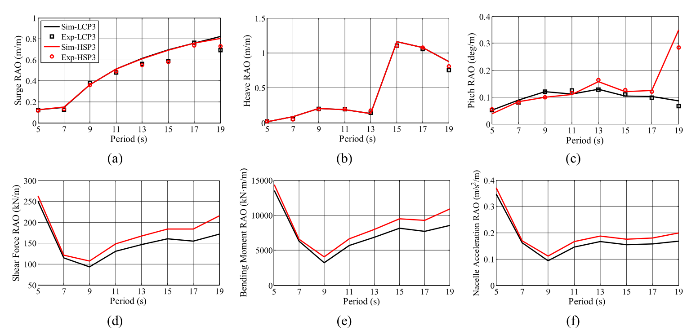

   **图 12** LCP3 与 HSP3 模型的 RAO 比较：(a) 纵荡；(b) 垂荡；(c) 纵摇；(d) 塔底前后向剪力；(e) 塔底前后向弯矩；(f) 机舱加速度。原图在线版为彩色。

   横轴 Period 为周期（s）；上排为平台运动，下排为结构载荷与加速度。Sim 为仿真，Exp 为试验；(d)–(f) 仅有数值结果。

5.3 仅风试验
~~~~~~~~~~~~

仅风试验用于比较 LCP3 和 HSP3 模型的风致响应。由于试验中仅模拟稳态风推力，因此将响应取平均后列于图 13。

图 13(a)、(b) 中的平均纵荡和纵摇数据表明，数值结果与试验一致；两者均说明，平台重心和转动惯量对纵荡运动影响很小，但会影响纵摇运动。在 ROC 下，由于前述浮力–重力作用，HSP3 的平均纵摇比 LCP3 小约 0.5°。在 MOC 下也可观察到这一趋势，但由于风推力减小，该趋势不那么明显。

此外，利用数值模型预测风致塔底载荷，结果见图 13(c)、(d)。当风机倾斜时，重力载荷会在塔底产生附加剪力和弯矩。倾角越大，塔底载荷越大，这解释了为什么 LCP3 模型的平均塔底载荷总是较大。

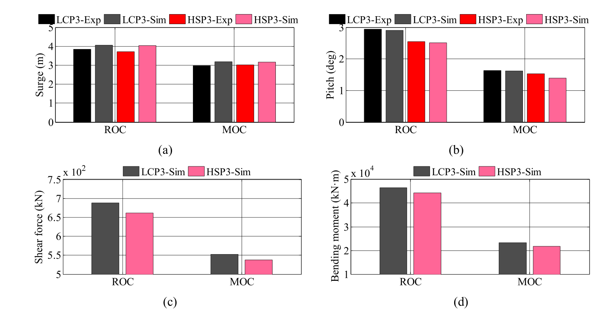

   **图 13** 两种风况下的平均响应：(a) 纵荡；(b) 纵摇；(c) 塔底前后向剪力；(d) 塔底前后向弯矩。原图在线版为彩色。

   ROC、MOC 分别为额定与最大运行工况；Exp 为试验，Sim 为仿真；剪力单位为 kN，弯矩单位为 kN·m。

5.4 非规则波试验
~~~~~~~~~~~~~~~~

5.4.1 平台运动
^^^^^^^^^^^^^^

采用 Welch 功率谱密度（PSD）估计方法，将时域纵荡和纵摇数据变换为 PSD 图，结果见图 14。数值模拟与模型试验十分一致。在 ROC 和 MOC 下，二阶水动力载荷引起的共振响应主导平台纵荡和纵摇运动，而入射波频率处的响应很小。LCP3 和 HSP3 的纵荡运动几乎没有差异，但纵摇响应差别很大。LCP3 的纵摇 PSD 及统计数据（图 15）均大于 HSP3。数值模拟的纵摇标准差与试验数据吻合良好，但数值模型倾向于高估最大值。这一差异可能源于平台阻尼行为的模拟偏差。

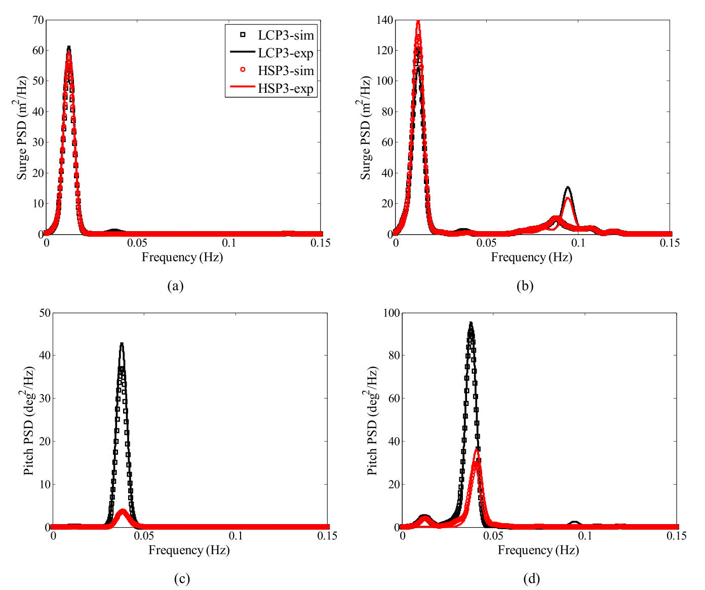

   **图 14** 两种波浪工况下的运动 PSD：纵荡运动 (a) ROC、(b) MOC；纵摇运动 (c) ROC、(d) MOC。原图在线版为彩色。

   横轴为频率（Hz），纵荡与纵摇 PSD 的单位分别为 m²/Hz 和 deg²/Hz；sim 为仿真，exp 为试验。

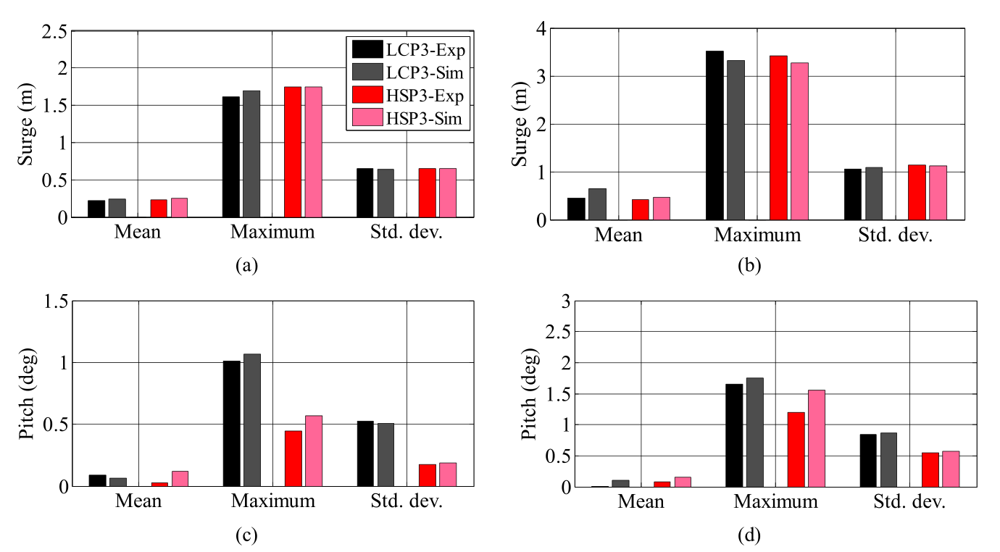

   **图 15** 两种波浪工况下实测与预测运动响应的统计结果：纵荡运动 (a) ROC、(b) MOC；纵摇运动 (d) ROC、(e) MOC。原图在线版为彩色。

   图内 Mean、Maximum、Std. dev. 分别为平均值、最大值和标准差，Exp 为试验，Sim 为仿真。原文图题将纵摇子图写为 (d)、(e)，实际图内标记为 (c)、(d)；此处保留原图题并说明差异。

显然，二阶水动力效应导致了 LCP3 和 HSP3 之间的纵摇差异。为进一步研究相关机理，图 16 比较了两种模型的二次传递函数（QTF）。如前所述，共振响应主导平台纵摇运动，因此图中仅展示与纵摇固有频率对应的 QTF 值。注意，三维图中的绿线和红线位于 :math:`\omega_1` 与 :math:`\omega_2` 之差等于纵摇固有频率的位置。为清楚起见，在下方二维图中单独绘出这些曲线。

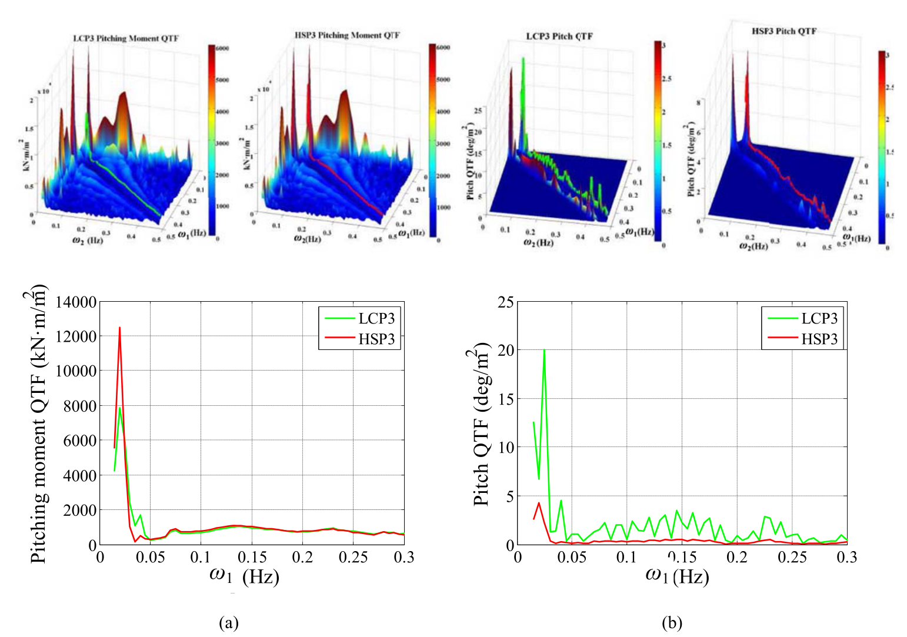

   **图 16** LCP3 与 HSP3 模型的 (a) 纵荡力和 (b) 纵摇力矩 QTF 比较。原图在线版为彩色。

   此图题按原文保留；但图内左列实际标为 Pitching Moment QTF（纵摇力矩 QTF），右列标为 Pitch QTF（纵摇运动 QTF），正文也按这两类量解释。上排为三维 QTF，下排为相应频率切线；横轴为频率，左列 QTF 单位为 kN·m/m²，右列为 deg/m²。

图 16(a) 表明，纵摇力矩 QTF 的差异主要位于低频范围。在 0.025–0.05 Hz 之间，LCP3 的 QTF 值大于 HSP3，而在 0.025 Hz 以下则相反。然而，这些差异对两种模型纵摇差异的贡献较小，因为如图 9 所示，如此低频的分量不在波能分布范围内。运动 QTF 可以写为：

.. math::

   \mathrm{QTF}^{\mathrm M}(\omega_d)=
   \left[-\omega_d^2\left(\boldsymbol M+\boldsymbol A(\omega_d)\right)
   +\mathrm i\omega_d\boldsymbol B(\omega_d)+\boldsymbol C\right]^{-1}
   \mathrm{QTF}^{\mathrm F}(\omega_d)
   \qquad (2)

其中， :math:`\mathrm{QTF}^{\mathrm F}` 和 :math:`\mathrm{QTF}^{\mathrm M}` 分别为载荷和运动 QTF 向量； :math:`\omega_d` 为差频； :math:`\boldsymbol M` 为质量矩阵； :math:`\boldsymbol A` 为附加质量矩阵； :math:`\boldsymbol B` 为辐射阻尼矩阵； :math:`\boldsymbol C` 为恢复刚度矩阵，包括静水恢复刚度 :math:`\boldsymbol C_{\mathrm{hydrostatic}}` 和系泊恢复刚度 :math:`\boldsymbol C_{\mathrm{lines}}` 。其中，与几何形状有关的附加质量和辐射阻尼对于两种模型相同；差别在于质量矩阵与静水恢复刚度，二者可分别表示为：

.. math::

   \boldsymbol M=
   \begin{bmatrix}
   m&0&0&0&mz_G&0\\
   0&m&0&-mz_G&0&0\\
   0&0&m&0&0&0\\
   0&-mz_G&0&I_x&0&-I_{xz}\\
   mz_G&0&0&0&I_y&0\\
   0&0&0&-I_{xz}&0&I_z
   \end{bmatrix}
   \qquad (3)

.. math::

   \boldsymbol C_{\mathrm{hydrostatic}}=
   \begin{bmatrix}
   0&0&0&0&0&0\\
   0&0&0&0&0&0\\
   0&0&\rho gA_{\mathrm{WP}}&0&-\rho g\iint_{A_{\mathrm{WP}}}x\,\mathrm dA&0\\
   0&0&0&\rho gV\overline{GM}_{\mathrm T}&0&0\\
   0&0&-\rho g\iint_{A_{\mathrm{WP}}}x\,\mathrm dA&0&\rho gV\overline{GM}_{\mathrm L}&0\\
   0&0&0&0&0&0
   \end{bmatrix}
   \qquad (4)

其中， :math:`m` 表示系统总质量； :math:`z_G` 表示结构重心； :math:`I_x` 、 :math:`I_y` 和 :math:`I_z` 表示绕 :math:`x` 、 :math:`y` 、 :math:`z` 轴的转动惯量； :math:`A_{\mathrm{WP}}` 表示水线面面积； :math:`V` 为排水体积； :math:`\overline{GM}_{\mathrm T}` 和 :math:`\overline{GM}_{\mathrm L}` 分别为横向和纵向稳心高度，二者均为重心的函数。

图 16(b) 表明，在全部研究频率范围内，LCP3 模型的纵摇 QTF 都大于 HSP3。这说明两种模型纵摇响应的差异源于结构固有特性，例如重心和转动惯量。

5.4.2 塔底弯矩与机舱加速度
^^^^^^^^^^^^^^^^^^^^^^^^^^

塔底前后向弯矩 :math:`M_{\mathrm{twr}}` 和机舱加速度 :math:`a_{\mathrm{ncl}}` 的 PSD 见图 17。当风机倾斜时，重力载荷可引起 :math:`M_{\mathrm{twr}}` 。因此，在纵摇固有频率处可见显著的 :math:`M_{\mathrm{twr}}` ，且 LCP3 的分量大于 HSP3。波频响应由一阶水动力载荷引起。与图 12(e) 所示的 :math:`M_{\mathrm{twr}}` RAO 一致，在大多数波浪频率处，HSP3 的 PSD 大于 LCP3。在 0.13–0.23 Hz 之间，差异较小，而在 0.1 Hz 附近（MOC）差异更明显。 :math:`a_{\mathrm{ncl}}` 图中也呈现相似趋势，但波频响应比纵摇固有频率分量更显著。在 MOC 下，塔架基阶弯曲频率处的响应较明显。

图 18 给出了 :math:`M_{\mathrm{twr}}` 和 :math:`a_{\mathrm{ncl}}` 的统计数据。在 ROC 下，LCP3 模型的最大值和标准差较大，原因是 LCP3 的 :math:`M_{\mathrm{twr}}` 在纵摇固有频率处远大于 HSP3。然而，这种幅值上的占优在 MOC 下不那么显著，而且会被波浪频率处小于 HSP3 的响应部分抵消。因此，两种模型的标准差非常接近，甚至 HSP3 模型的最大值更大。相比之下，波频响应主导 :math:`a_{\mathrm{ncl}}` 。由此，在 ROC 下两种模型的差异可以忽略，而在 MOC 下 HSP3 模型的最大值和标准差较大。

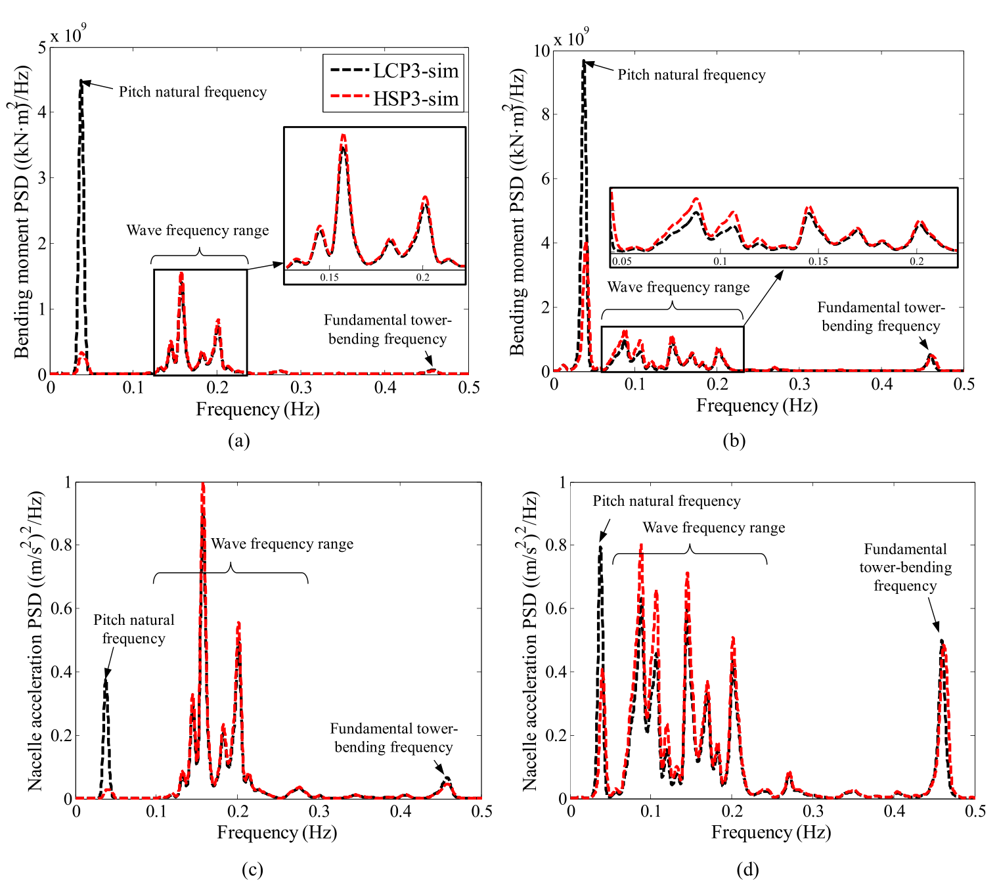

   **图 17** 两种波浪工况下风机结构动力响应的 PSD：塔底前后向弯矩 (a) ROC、(b) MOC；机舱加速度 (c) ROC、(d) MOC。原图在线版为彩色。

   图内 Pitch natural frequency 为纵摇固有频率，Wave frequency range 为波频范围，Fundamental tower-bending frequency 为塔架基阶弯曲频率；横轴为频率（Hz），弯矩 PSD 单位为 (kN·m)²/Hz，加速度 PSD 单位为 (m/s²)²/Hz。

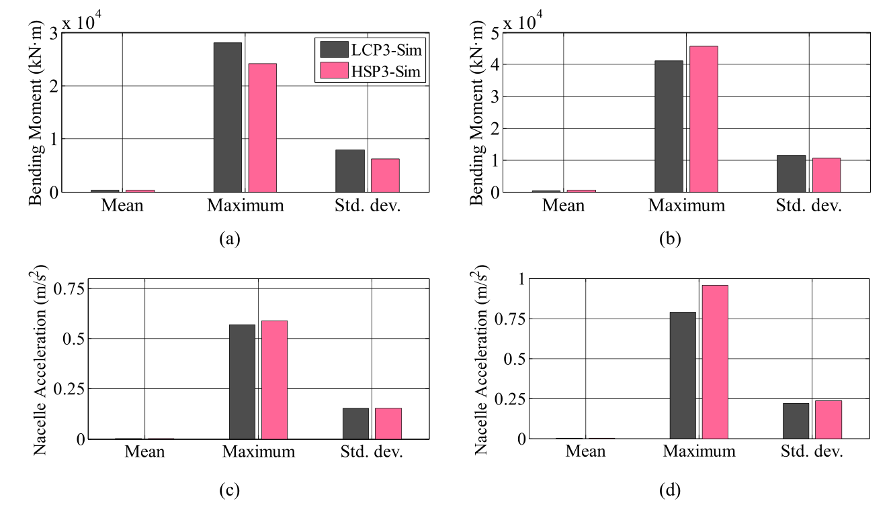

   **图 18** 预测的塔底前后向弯矩 (a) ROC、(b) MOC 和机舱加速度 (c) ROC、(d) MOC 的统计数据。原图在线版为彩色。

   Mean、Maximum、Std. dev. 分别为平均值、最大值和标准差；Sim 为仿真；弯矩单位为 kN·m，机舱加速度单位为 m/s²。

5.5 风浪联合试验
~~~~~~~~~~~~~~~~

5.5.1 平台运动
^^^^^^^^^^^^^^

图 19 比较了两种风浪联合工况下 LCP3 和 HSP3 的纵荡与纵摇 PSD。数值模拟与模型试验吻合很好，两者均表明两个模型的纵荡响应几乎没有差异，这与仅风试验和非规则波试验中呈现的趋势一致。准静态风载荷抑制了波浪引起的纵荡振荡。具体而言，如图 14(a)、(b) 和图 19(a)、(b) 所示，纵荡 PSD 仅为相应仅波工况的一半。这一效应对平台纵摇更加明显。在 ROC 下，纵摇 PSD 比非规则波试验低近两个数量级。此外，风载荷显著削弱了 LCP3 和 HSP3 之间的纵摇差异。图 19(c) 表明，纵摇固有频率处的响应幅值几乎相同。不过，对于准静态风载荷引起的低频响应，LCP3 的 PSD 较大，而数值模拟未能捕捉这部分运动。在 MOC 下，随着风推力减小，两种模型之间的波致纵摇差异重新出现。LCP3 的 PSD 峰值几乎是 HSP3 的两倍。

纵荡和纵摇运动的平均值、最大值和标准差见图 20。仿真数据与模型试验吻合尚好。在 ROC 下，由于数值模拟忽略了低频响应，因此倾向于低估平台纵摇运动。纵摇最大值的差异主要来自平均值的差异；但在 MOC 下，最大值的差异大于平均值的差异。根据图 13(b)、图 19(c)、(d) 和图 20(c)、(d) 的结果，可以得出：ROC 下的纵摇差异源于两种平台不同的静水稳性，而 MOC 下的差异主要归因于二阶水动力效应。

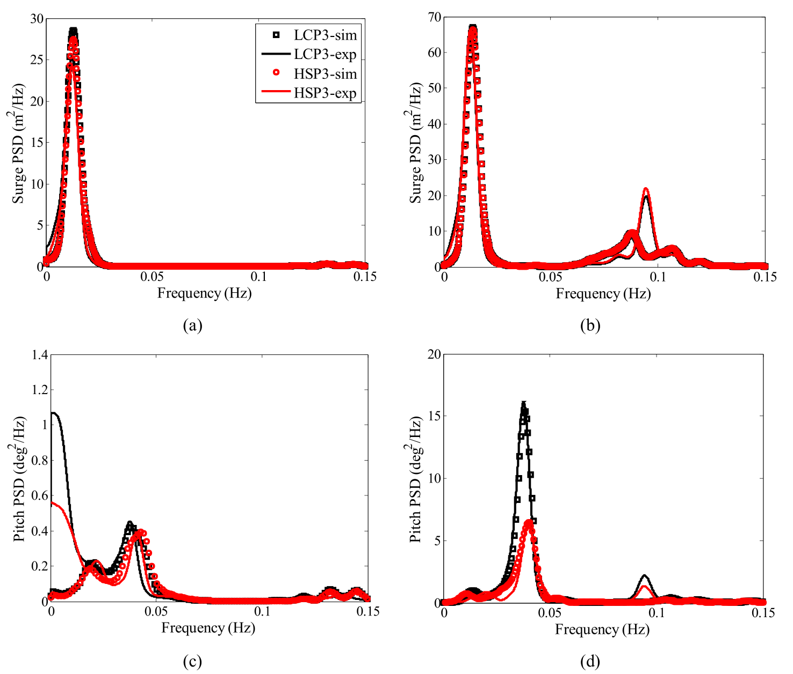

   **图 19** 两种风浪联合工况下的运动 PSD：纵荡运动 (a) ROC、(b) MOC；纵摇运动 (c) ROC、(d) MOC。原图在线版为彩色。

   横轴为频率（Hz），纵荡与纵摇 PSD 的单位分别为 m²/Hz 和 deg²/Hz；sim 为仿真，exp 为试验。

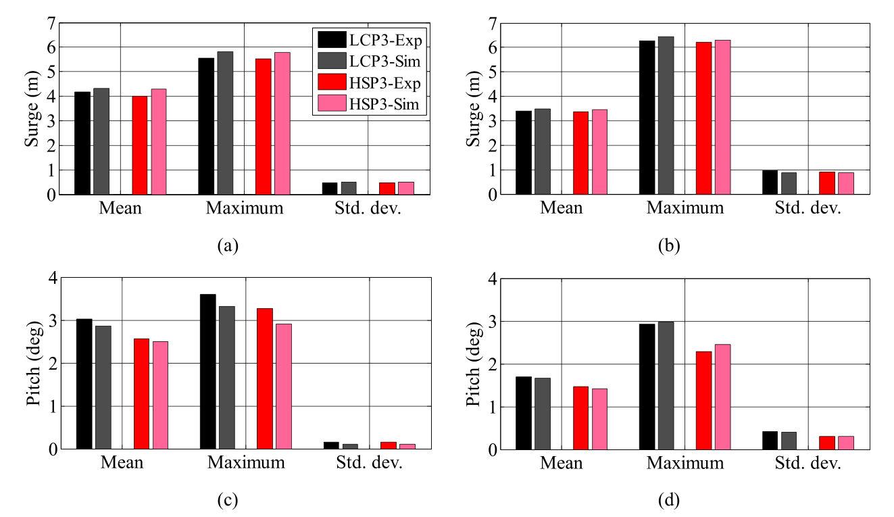

   **图 20** 两种风浪联合工况下实测与预测运动响应的统计结果：纵荡运动 (a) ROC、(b) MOC；纵摇运动 (c) ROC、(d) MOC。原图在线版为彩色。

   Mean、Maximum、Std. dev. 分别为平均值、最大值和标准差；Exp 为试验，Sim 为仿真；纵荡单位为 m，纵摇单位为 deg。

5.5.2 塔底弯矩与机舱加速度
^^^^^^^^^^^^^^^^^^^^^^^^^^

风浪联合工况下 :math:`M_{\mathrm{twr}}` 和 :math:`a_{\mathrm{ncl}}` 的 PSD 见图 21。在 ROC 下，由于稳态风载荷抑制纵摇，纵摇固有频率处的响应显著减小；但在 MOC 下，这些响应仍然在塔底载荷中发挥重要作用，而且 LCP3 模型的 PSD 较大，这与平台纵摇趋势一致。与相应非规则波工况比较发现，波频响应几乎不受风载荷影响。HSP3 模型在 0.1 Hz 附近倾向于承受更大的塔底载荷。 :math:`a_{\mathrm{ncl}}` 图中也呈现相似趋势。

:math:`M_{\mathrm{twr}}` 和 :math:`a_{\mathrm{ncl}}` 的统计数据汇总于图 22。由于重力作用，LCP3 的风致平均 :math:`M_{\mathrm{twr}}` 略大于 HSP3。在 ROC 下， :math:`M_{\mathrm{twr}}` 由波频响应主导，而两种模型的波频响应基本相同，因此最大值和标准差几乎没有差异。在 MOC 下，纵摇固有频率响应和波频响应之间的差异相互抵消，因而塔底载荷统计数据的差异很小。然而， :math:`a_{\mathrm{ncl}}` 的差异相对显著，因为机舱加速度受平台纵摇运动的影响较小。

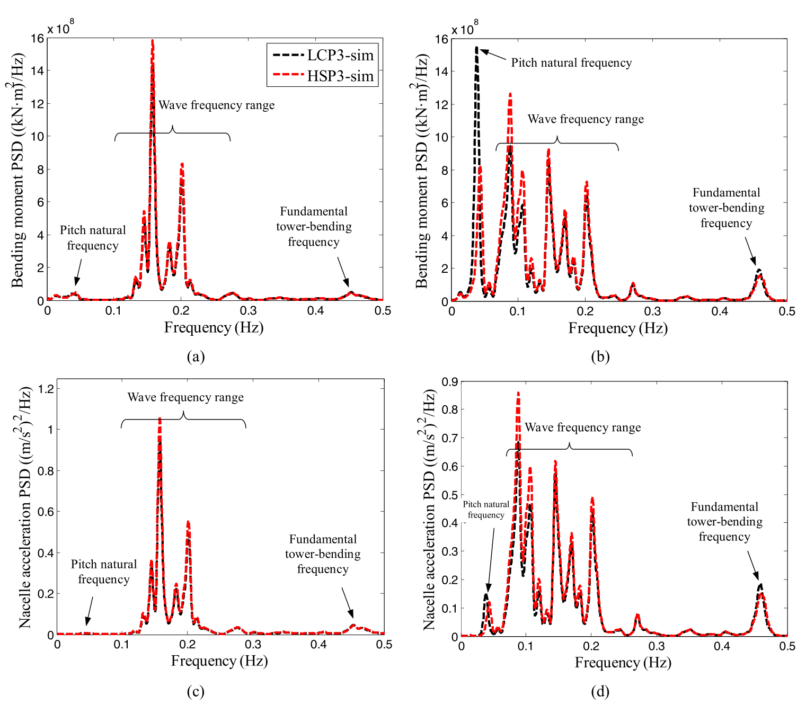

   **图 21** 两种风浪联合工况下风机结构动力响应的 PSD：塔底前后向弯矩 (a) ROC、(b) MOC；机舱加速度 (c) ROC、(d) MOC。原图在线版为彩色。

   横轴为频率（Hz）；图内分别标出纵摇固有频率、波频范围和塔架基阶弯曲频率；弯矩 PSD 单位为 (kN·m)²/Hz，加速度 PSD 单位为 (m/s²)²/Hz。

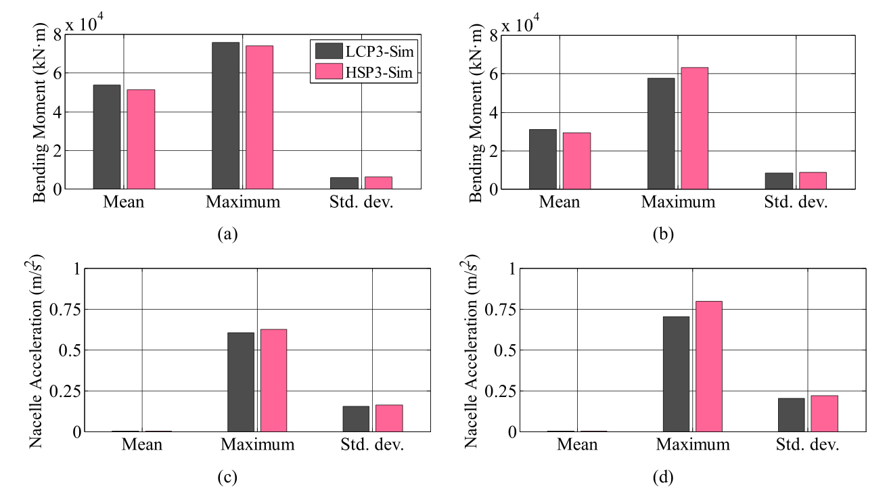

   **图 22** 预测的塔底前后向弯矩 (a) ROC、(b) MOC 和机舱加速度 (c) ROC、(d) MOC 的统计数据。原图在线版为彩色。

   Mean、Maximum、Std. dev. 分别为平均值、最大值和标准差；Sim 为仿真；弯矩单位为 kN·m，机舱加速度单位为 m/s²。

5.6 完整运行风机与真实风浪条件下的仿真
~~~~~~~~~~~~~~~~~~~~~~~~~~~~~~~~~~~~~~

值得注意的是，上述结论来自气动仿真中采用等效阻力盘和稳态风的简化模型。这与真实情况多少存在不一致。为研究更真实环境条件下 LCP3 和 HSP3 模型的动力差异，本研究开展了完整运行风机在随机风场与波浪场中的数值模拟。

仿真输入采用波浪水槽中测得的随机波，以及随机入流湍流模拟器 TurbSim 生成的湍流风场。风场遵循 Kaimal 谱，平均风剖面用指数为 0.14 的幂律描述。依据 IEC61400-1 规范，ROC 和 MOC 下轮毂高度的湍流强度分别为 14.8% 和 11.7%。

5.6.1 平台运动
^^^^^^^^^^^^^^

图 23 和图 24 给出了两种随机波与湍流风联合作用下的平台纵荡和纵摇响应。仿真结果与上述分析基本一致，即两种模型的纵荡响应几乎没有差异，而 LCP3 的纵摇响应大于 HSP3。此外，图 23 还表明，湍流风显著放大了 ROC 下的纵荡运动。纵荡 PSD 峰值为 210 m²/Hz，是非规则波工况（见图 14(a)）的三倍以上。然而，由于 MOC 的风推力和湍流强度较低，这种放大作用不那么明显。就平台纵摇而言，与风浪联合试验一致，湍流风载荷缩小了 LCP3 和 HSP3 在纵摇固有频率处的差距。此外，湍流风载荷还引起低频振荡，这在 ROC 下尤其显著。

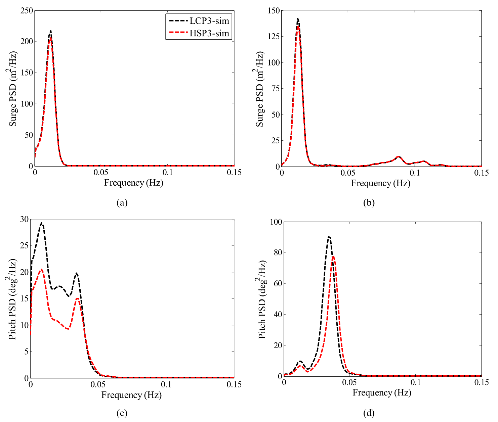

   **图 23** 两种随机波与湍流风联合作用下的运动 PSD：纵荡运动 (a) ROC、(b) MOC；纵摇运动 (c) ROC、(d) MOC。原图在线版为彩色。

   横轴为频率（Hz）；纵荡与纵摇 PSD 的单位分别为 m²/Hz 和 deg²/Hz；Sim 为仿真。

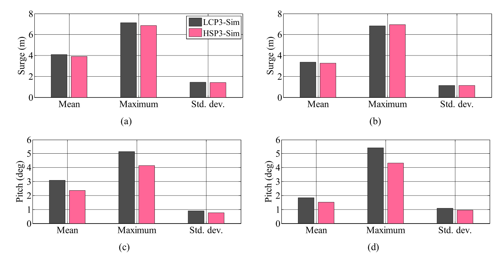

   **图 24** 两种随机波与湍流风联合作用下的平台运动统计数据：纵荡运动 (a) ROC、(b) MOC；纵摇运动 (c) ROC、(d) MOC。原图在线版为彩色。

   Mean、Maximum、Std. dev. 分别为平均值、最大值和标准差；Sim 为仿真；纵荡单位为 m，纵摇单位为 deg。

5.6.2 塔底弯矩与机舱加速度
^^^^^^^^^^^^^^^^^^^^^^^^^^

:math:`M_{\mathrm{twr}}` 和 :math:`a_{\mathrm{ncl}}` 的 PSD 及统计数据分别见图 25 和图 26。波频响应与稳态风工况（图 21）基本相同，这表明湍流风不会影响一阶水动力响应。然而，由于脉动风放大了平台纵摇运动，风机在纵摇固有频率处承受更大的塔底载荷。此外，数值模型还捕捉到了风致低频和叶片通过频率（3P）处的振荡，但总体而言，LCP3 和 HSP3 之间的差异较小。

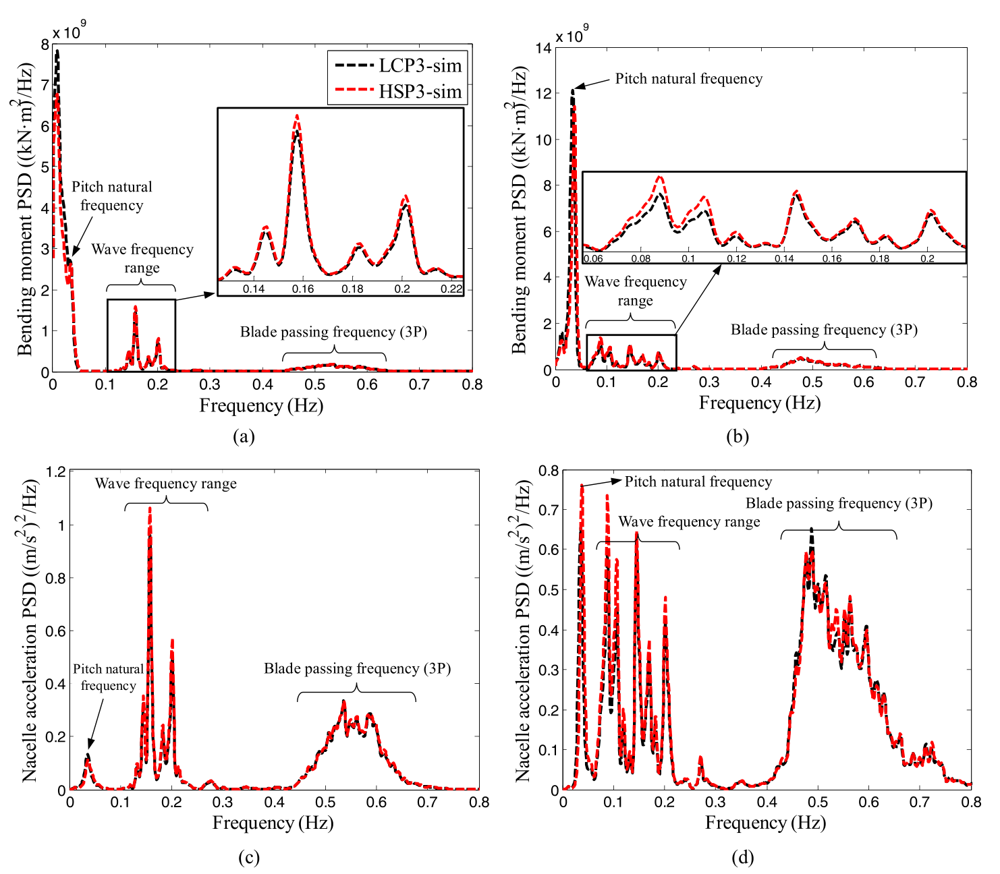

   **图 25** 两种随机波与湍流风联合作用下风机结构动力响应的 PSD：塔底前后向弯矩 (a) ROC、(b) MOC；机舱加速度 (c) ROC、(d) MOC。原图在线版为彩色。

   横轴为频率（Hz）；图内 Pitch natural frequency 为纵摇固有频率，Wave frequency range 为波频范围，Blade passing frequency (3P) 为叶片通过频率（3P）；弯矩 PSD 单位为 (kN·m)²/Hz，加速度 PSD 单位为 (m/s²)²/Hz。

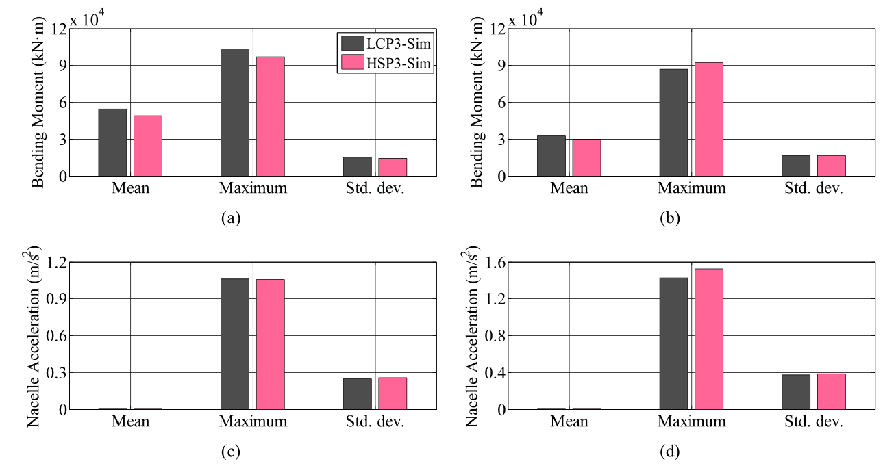

   **图 26** 两种随机波与湍流风联合作用下风机结构动力响应的统计数据：塔底前后向弯矩 (a) ROC、(b) MOC；机舱加速度 (c) ROC、(d) MOC。原图在线版为彩色。

   Mean、Maximum、Std. dev. 分别为平均值、最大值和标准差；Sim 为仿真；弯矩单位为 kN·m，机舱加速度单位为 m/s²。

.. list-table:: 表 8 LCP3 与 HSP3 的优势和弱点
   :header-rows: 1
   :class: longtable

   * - 模型
     - 优势
     - 弱点
   * - 混凝土结构（LCP3）
     - 纵摇固有周期较长，与入射波周期相距更远；一阶水动力载荷引起的塔底载荷和机舱加速度较小
     - 平台平均纵摇较大；二阶水动力载荷引起的平台纵摇振荡较大；纵摇固有频率处塔底载荷较大
   * - 钢结构（HSP3）
     - 平台平均纵摇较小；二阶水动力载荷引起的平台纵摇振荡较小；纵摇固有频率处塔底载荷较小
     - 纵摇固有周期较短，更接近入射波周期；一阶水动力载荷引起的塔底载荷和机舱加速度较大

.. note::

   摘要概括为两种结构的塔底载荷和机舱加速度差异不显著，而第 6 节对机舱加速度作出了更强的差异判断；这里分别保留原文。第 5.4–5.6 节的具体响应与统计量不能互相替代：例如图 26 的额定工况机舱加速度接近，最大运行工况 HSP3 的最大加速度较大。本文的材料比较以相同平台几何、吃水与系泊为前提；缩尺试验通过不锈钢模型和铁块匹配质量分布，仅测量平台运动，塔底载荷与机舱加速度来自数值模型。完整运行转子、Kaimal 湍流风与随机波是本节另行设置的数值工况。

6 结论
------

本研究考察了分别安装在混凝土（LCP3）和钢制（HSP3）Y 形半潜平台上的两种浮式风机的动力学。开展了 1:60 缩尺模型试验，以再现两种典型环境载荷工况下的真实运动响应。为更好地理解两种模型的动力行为，采用海上水平轴风机模拟器 FAST 开展时域耦合多体仿真。平台运动通过模型试验得到验证，并计算了包括塔底前后向弯矩和机舱加速度在内的风机动力响应。文中详细阐述并讨论了混凝土与钢平台之间的差异。

钢平台比混凝土平台轻，因此前者需要更多压载水才能达到相同吃水。由此，钢结构的重心低于混凝土结构，这是两种结构动力差异的主要原因。

重心较低的结构具有较大的稳心高度，其平方根与纵摇/横摇固有周期成反比。因此，自由衰减试验表明，HSP3 的纵摇/横摇固有周期比 LCP3 模型短约 1.6 s。此外，仅风试验表明，HSP3 抵抗倾覆力矩的能力更强；在额定运行风况下，其平台平均纵摇比 LCP3 小 0.5°。在水动力方面，尽管两种平台的二阶水动力载荷基本相同，HSP3 模型由于重心较低（静水刚度较大），纵摇运动较小。塔底弯矩与平台纵摇运动相关，因为平台倾斜时风机重力会在塔底产生弯矩。因此，HSP3 模型在纵摇固有频率处的塔底弯矩较小。

然而，较低的重心也存在不利之处。数值模拟预测，HSP3 在波浪频率处受到的塔底载荷和机舱加速度大于 LCP3，因为静水刚度较大的 HSP3 会承受更大的惯性载荷。纵摇固有频率处的塔底弯矩与波频分量呈相反趋势，这使 LCP3 和 HSP3 之间的塔底载荷差异不显著。机舱加速度对平台纵摇运动不那么敏感，因此 HSP3 的响应明显大于 LCP3。

总体而言，表 8 从动力性能角度总结了混凝土结构与钢结构的优势和弱点，可作为浮式风机支撑结构建造材料选择的依据。

参考文献
--------

- Bayati I. 2014. The effects of second-order hydrodynamics on a semisubmersible floating offshore wind turbine. J Phys Conf Ser. 524:12094.

- Beyer F, Choisnet T, Kretschmer M, Cheng PW. 2015. Coupled MBS-CFD simulation of the IDEOL floating offshore wind turbine foundation compared to wave tank model test data. Proceedings of the 25th International Ocean and Polar Engineering conference; Kona, Big Island, Hawaii, USA.

- Blue H. 2004. Blue H — Products — Phase I. Available at: http://www.bluehgroup.com/product/phase-1.php.

- Breton S, Moe G. 2009. Status, plans and technologies for offshore wind turbines in Europe and North America. Renewable Energy. 34:646–654.

- Castro-Santos L, Filgueira-Vizoso A, Carral-Couce L, Formoso JÁF. 2016. Economic feasibility of floating offshore wind farms. Energy. 112:868–882.

- Coulling AJ, Goupee AJ, Robertson AN, Jonkman JM, Dagher HJ. 2013. Validation of a FAST semi-submersible floating wind turbine numerical model with DeepCwind test data. J. Renew. Sustain. Energy. 5:23116.

- DNV. 2010. DNV-RP-C205 Environmental conditions and environmental loads. Oslo, Norway: Det Norske Veritas.

- Fukushima OWC. 2014. Fukushima floating offshore wind farm demonstration project (Fukushima FORWARD). Available at: http://www.fukushima-forward.jp/pdf/pamphlet3.pdf.

- Global Wind Energy Council. 2016. Global statistics. Brussels, Belgium: Global Wind Energy Council.

- Hall M. 2015. Moordyn user’s guide. Orono: University of Maine, Department of Mechanical Engineering.

- Haug AK, Fjeld S. 1996. A floating concrete platform hull made of lightweight aggregate concrete. Eng Struct. 18:831–836.

- Hua J. 2011. A floating platform of concrete for offshore wind turbine. J. Renew. Sustain. Energy. 6:L13808.

- Ishihara T, Phuc PV, Sukegawa H, Shimada K, Ohyama T. 2007. A study on the dynamic response of a semi-submersible floating offshore wind turbine system part 1: A water tank test. Proceedings of the 12th International Conference on wind engineering. pp. 2511–2518.

- Jonkman J, Butterfield S, Musial W, Scott G. 2009. Definition of a 5-MW reference wind turbine for offshore system development. Golden, Colorado, USA: National Renewable Energy Laboratory.

- Jonkman JM. 2003. Modeling of the UAE wind turbine for refinement of FAST_AD. Golden, CO, USA: National Renewable Energy Laboratory.

- Jonkman JM. 2007. Dynamics modeling and loads analysis of an offshore floating wind turbine [PhD Theses]. University of Colorado.

- Jonkman JM, Buhl ML. 2005. FAST user’s guide. Golden, Colorado, USA: National Renewable Energy Laboratory.

- Jonkman JM, Hayman GJ, Jonkman BJ, Damiani RR, Murray RE. 2015. Aerodyn v15 user’s guide and theory manual. Golden, Colorado, USA: National Renewable Energy Laboratory.

- Jonkman JM, Robertson A, Hayman GJ. 2014. Hydrodyn user’s guide and theory manual. Golden, Colorado, USA: National Renewable Energy Laboratory.

- Kelley ND, Jonkman BJ. 2005. Overview of the TurbSim stochastic inflow turbulence simulator. Golden, Colorado, USA: National Renewable Energy Laboratory.

- Lee C. 1995. WAMIT theory manual. Cambridge: Massachusetts Institute of Technology, Department of Ocean Engineering.

- Leung DYC, Yang Y. 2012. Wind energy development and its environmental impact: A review. Renewable Sustainable Energy Rev. 16:1031–1039.

- Oggiano L, Pierella F, Nygaard TA, De Vaal J, Arens E. 2016. Comparison of experiments and CFD simulations of a braceless concrete semi-submersible platform. Energy Procedia. 94:278–289.

- Orth M, Becker AJ. 2016. The profitability of pre-commercial floating offshore wind projects: a study of four funding mechanisms [Master thesis]. Norwegian School of Economics.

- Perveen R, Kishor N, Mohanty SR. 2014. Offshore wind farm development: present status and challenges. Renewable Sustainable Energy Rev. 29:780–792.

- Pérez Fernández R, Lamas Pardo M. 2013. Offshore concrete structures. Ocean Eng. 58:304–316.

- Robertson A, Jonkman J, Masciola M, Song H, Goupee A, Coulling A, et al. 2012. Definition of the semisubmersible floating system for phase II of OC4. Offshore Code Comparison Collaboration Continuation (OC4) for IEA Task.

- Roddier D, Cermelli C, Aubault A, Weinstein A. 2010. Windfloat: A floating foundation for offshore wind turbines. J. Renew. Sustain. Energy. 2:33104.

- Sandvik K, Eie R, Advocaat JD, Godejord A, Hæreid KO, Høyland K, et al. 2004. Offshore structures–a new challenge. Proceedings of the 14th National Conference on structure engineering; Norway.

- Schwartz M, Heimiller D, Haymes S, Musial W. 2010. Assessment of offshore wind energy resources for the United States. Golden, Colorado, USA: National Renewable Energy Laboratory.

- Shan B, Zheng S, Ou J. 2015. Free vibration monitoring experiment of a stayed-cable model based on stereovision. Measurement. 76:228–239.

- Shan B, Zheng S, Ou J. 2016. A stereovision-based crack width detection approach for concrete surface assessment. KSCE J. Civil Eng. 20:803–812.

- Stiesdal H. 2009. Hywind: The world’s first floating MW-scale wind turbine. Wind Directions. 31:52–53.

- Van Bussel G, Zaayer MB. 2001. Reliability, availability and maintenance aspects of large-scale offshore wind farms, a concepts study. Proceedings of marine Renewable energy.

- Viselli AM, Goupee AJ, Dagher HJ. 2015. Model test of a 1:8-scale floating wind turbine offshore in the gulf of maine. J Offshore Mech Arct Eng. 137(4):041901.

- Viselli AM, Goupee AJ, Dagher HJ, Allen CK. 2016. Design and model confirmation of the intermediate scale VolturnUS floating wind turbine subjected to its extreme design conditions offshore maine. Wind Energy. 19:1161–1177.

- Walia D, Schiinemann P, Kuhl M, Adam F, Hartmann H, Großmann J, Ritschel U. 2017. Prestressed ultra high performance concrete members for a TLP substructure for floating wind turbines. Proceedings of the 27th International Ocean and Polar Engineering conference; San Francisco, CA, USA.

- Wan L, Gao Z, Moan T. 2015. Experimental and numerical study of hydrodynamic responses of a combined wind and wave energy converter concept in survival modes. Coastal Eng. 104:151–169.

- Wan L, Gao Z, Moan T, Lugni C. 2016a. Comparative experimental study of the survivability of a combined wind and wave energy converter in two testing facilities. Ocean Eng. 111:82–94.

- Wan L, Gao Z, Moan T, Lugni C. 2016b. Experimental and numerical comparisons of hydrodynamic responses for a combined wind and wave energy converter concept under operational conditions. Renewable Energy. 93:87–100.

- Wan L, Greco M, Lugni C, Gao Z, Moan T. 2017. A combined wind and wave energy-converter concept in survival mode: numerical and experimental study in regular waves with a focus on water entry and exit. Appl Ocean Res. 63:200–216.

- Watson G, Hill B, Courtney F, Goldman P, Calvert S, Thresher R, et al. 2005. A framework for offshore wind energy development in the United States. Boston: Massachusetts Technology Collaborative.

完整引用
--------

收录信息见 :ref:`WOEAI 学术成果页对应条目 <ref-li2022-SOS>` 。
