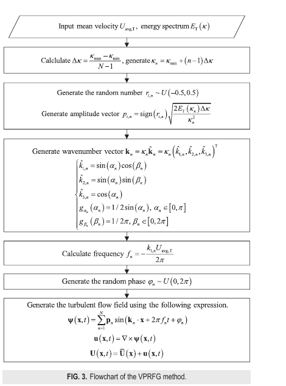
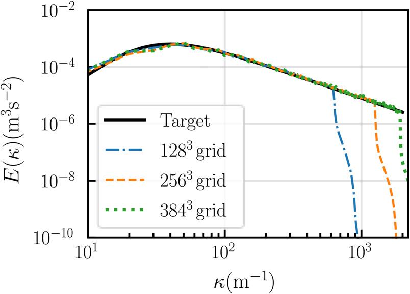
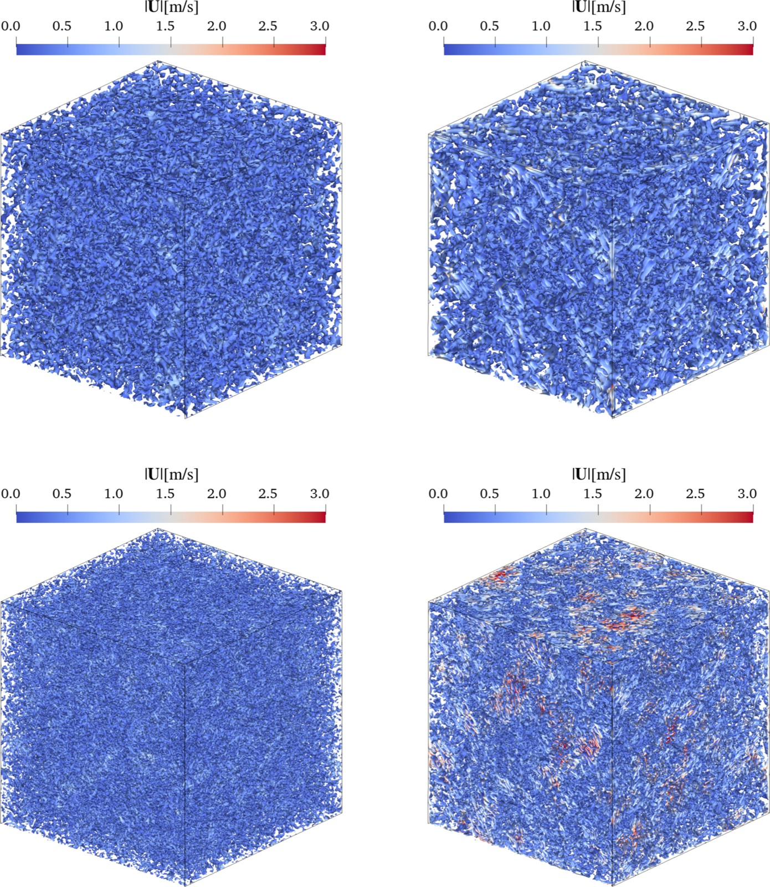
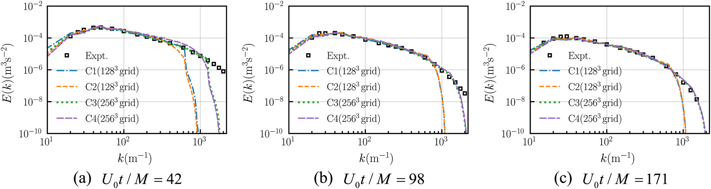

.. _paper-note-ref-li2024-POF:

.. role:: student-first-author

数值风洞 | 用矢量势随机流生成无散湍流
=====================================

数值风洞和大涡模拟需要可信的湍动入流。入流如果只在能谱上看起来相似，却不能满足不可压缩流动中的无散条件，后续计算可能会在入口附近引入额外的数值调整，影响湍流输运和统计特征。

我们在这篇发表于 **Physics of Fluids** 的论文中提出矢量势随机流生成方法，即 vector potential random flow generation (VPRFG) method。它先生成矢量势场，再通过旋度得到脉动速度场，使合成湍流天然满足 :math:`\nabla \cdot \mathbf{u}=0`，同时可以按目标能谱和 Taylor 冻结假设控制湍流统计特征。

这项工作属于 WOEAI 的 **建筑结构抗风 / 数值风洞与湍动入流** 方向，面向 LES 入流边界、均匀各向同性湍流基准算例，以及后续更复杂风场生成方法的基础算法问题。

论文信息
--------

- 论文题名: A novel vector potential random flow generation method for synthesizing divergence-free homogeneous isotropic turbulence with arbitrary spectra
- 作者: **Li Chao**; Chen Lingwei\*; Wang Jinghan; Zhang Wentong; Wang Xiangjie; Wang Zhuoran; Hu Gang
- 期刊: Physics of Fluids
- 年份: 2024
- DOI: https://doi.org/10.1063/5.0194006
- WOEAI 相关方向: 建筑结构抗风 / 数值风洞与湍动入流

摘要
----

本文提出一种新的矢量势随机流生成方法，即 VPRFG 方法，用于合成具有任意谱的无散均匀各向同性湍流。该方法首先采用基于随机流生成的方式构造矢量势场，随后对该场施加旋度运算，得到天然满足无散条件的湍流场。在所提出方法的公式中，我们显式引入任意均匀各向同性三维空间互谱密度和 Taylor 冻结假设，从而保证生成湍流符合指定统计特征，包括能谱、一维空间功率谱密度、时间功率谱密度、空间相干函数、湍动能和 Reynolds 应力。此外，本文以 von Karman 能谱为目标值，通过数值算例验证了该方法的理论精度。最后，由 VPRFG 方法生成的均匀各向同性时间衰减盒湍流的大涡模拟结果与实验结果吻合良好。

**英文摘要**

A novel method, known as the vector potential random flow generation (VPRFG) method, is introduced for synthesizing divergence-free homogeneous isotropic turbulence with arbitrary spectra. First, the proposed approach employs the random-flow-generation-based method to create a vector potential field. Subsequent application of the curl operation to this field produces a turbulent flow that inherently satisfies the divergence-free condition. In the formulas of the proposed method, we explicitly impose arbitrary homogeneous isotropic three-dimensional spatial cross-spectral density (CSD) and Taylor's frozen hypothesis. This ensures that the generated turbulence conforms to prescribed statistical characteristics, including energy spectra, one-dimensional spatial power spectral density (PSD), temporal PSD, spatial coherence function, turbulent kinetic energy, and Reynolds stress. Additionally, the theoretical accuracy of the proposed method is validated through numerical examples, employing the von Kármán energy spectrum as the target value. Finally, large eddy simulations of homogeneous isotropic temporal-decaying box turbulence generated by the VPRFG method demonstrate a close alignment with the experimental results.

研究问题
--------

LES 中的湍动入流生成并不只是“制造一段随机速度序列”。对不可压缩流动来说，一个合成入流至少需要同时面对三类约束。

第一，速度场要有目标湍流统计特征。工程数值风洞常常关心能谱 :math:`E(\kappa)`、一维空间功率谱密度、时间功率谱密度、空间相干性、湍动能和 Reynolds 应力等指标。

第二，速度场要满足无散条件。对于不可压缩流动，入口速度如果不能满足 :math:`\nabla \cdot \mathbf{u}=0`，压力-速度耦合和入口附近数值修正可能改变原本设定的湍流结构。

第三，入流要能在时间和空间之间建立一致关系。Taylor 冻结假设把湍涡视为随平均流输运的结构，使空间谱和时间谱能够互相转换，这对速度入口边界很关键。

因此，我们在这项研究中要解决的问题是：能否构造一种随机流生成方法，使它既能按任意目标能谱合成均匀各向同性湍流，又能通过数学结构自然满足无散条件，并同时嵌入 Taylor 冻结假设。

方法贡献
--------

VPRFG 的核心想法是：不直接随机生成速度场，而是先生成一个矢量势场 :math:`\boldsymbol{\psi}(\mathbf{x},t)`，再通过旋度得到脉动速度 :math:`\mathbf{u}(\mathbf{x},t)`。

.. math::

   \mathbf{u}(\mathbf{x},t)=\nabla \times \boldsymbol{\psi}(\mathbf{x},t)

这条公式的含义很直接：只要速度由矢量势的旋度得到，速度场就继承了旋度场的无散性质。论文中进一步把矢量势写成随机波数、幅值、频率和相位的叠加形式：

.. math::

   \boldsymbol{\psi}(\mathbf{x},t)=\sum_{n=1}^{N}\mathbf{p}_n
   \sin(\mathbf{k}_n\cdot\mathbf{x}+2\pi f_n t+\varphi_n)

其中，:math:`\mathbf{p}_n` 是幅值向量，:math:`\mathbf{k}_n` 是波数向量，:math:`f_n` 是频率，:math:`\varphi_n` 是随机相位，:math:`N` 是谱段数量。论文 Eq. (17) 将上述旋度关系展开成三个速度分量的计算公式，便于在网格上生成三维脉动速度场。

   图 3 VPRFG 方法流程图

   方法从目标平均速度、目标能谱、计算域和网格参数出发，依次生成波数、幅值、频率和随机相位，最后由矢量势场的旋度得到脉动速度场。

无散条件来自旋度的数学性质。论文给出的关键推导可以概括为：

.. math::

   \nabla\cdot\mathbf{U}(\mathbf{x},t)
   =\nabla\cdot\mathbf{u}(\mathbf{x},t)
   =\nabla\cdot\left(\nabla\times\boldsymbol{\psi}(\mathbf{x},t)\right)=0

这里 :math:`\mathbf{U}(\mathbf{x},t)` 是瞬时速度，:math:`\mathbf{u}(\mathbf{x},t)` 是脉动速度。这个关系说明，VPRFG 不是在生成之后再“修补”散度，而是在构造方式上让速度场满足无散条件。

为了让合成湍流在入口边界中按平均流输运，论文还把频率 :math:`f_n` 与波数第一分量 :math:`k_{1,n}` 联系起来，并得到 Taylor 冻结假设下的平移关系：

.. math::

   u_i(\mathbf{x},t-\tau)=u_i(\mathbf{x}+U_{\mathrm{avg},\mathrm{T}}\tau\mathbf{e}_1,t)

其中，:math:`U_{\mathrm{avg},\mathrm{T}}` 是目标平均速度，:math:`\tau` 是时间间隔，:math:`\mathbf{e}_1` 是 :math:`x` 方向单位向量。通俗地说，时间上向前或向后看的同一湍动结构，可以等价理解为沿平均流方向平移后的空间结构。

关键发现
--------

1. 生成流场可以满足任意目标能谱
~~~~~~~~~~~~~~~~~~~~~~~~~~~~~~~

论文从三维空间互谱密度出发证明：当谱段数 :math:`N` 足够大时，VPRFG 计算得到的能谱 :math:`E_{\mathrm{C}}(\kappa)` 可以逼近目标能谱 :math:`E_{\mathrm{T}}(\kappa)`。

.. math::

   E_{\mathrm{C}}(\kappa)\approx
   \lim_{N\to\infty}\sum_{n=1}^{N}
   E_{\mathrm{T}}(\kappa_n)\Delta\kappa\,\delta(\kappa-\kappa_n)
   =E_{\mathrm{T}}(\kappa)

其中，:math:`\kappa` 表示波数大小，:math:`\kappa_n` 是第 :math:`n` 个离散波数，:math:`\Delta\kappa` 是波数间隔，:math:`\delta(\cdot)` 是 Dirac delta 函数。这条关系说明，方法不是只追求某个经验曲线形状，而是在谱离散和极限意义下让生成能谱回到目标能谱。

湍动能也可以由能谱面积给出：

.. math::

   K_{\mathrm{C}}=\int_0^{\infty}E_{\mathrm{C}}(\kappa)\,d\kappa
   =\sum_{n=1}^{N}E_{\mathrm{T}}(\kappa_n)\Delta\kappa

这意味着，随着最大波数和谱段数量增加，计算得到的湍动能会向目标值靠近。

   图 4 以 von Karman 能谱为目标生成湍流的能谱

   不同网格分辨率下生成能谱整体贴近目标曲线，高分辨率网格覆盖了更宽的波数范围。

2. 方法同时兼顾无散性与 Taylor 冻结假设
~~~~~~~~~~~~~~~~~~~~~~~~~~~~~~~~~~~~~~~

以往一些随机流生成方法可以较方便地控制谱特征，但并不天然满足无散条件；另一些方法利用矢量势改善无散性，却没有同时处理时间谱和空间谱之间的一致关系。

VPRFG 的贡献在于把这两件事放在同一个公式体系里：用 :math:`\nabla\times\boldsymbol{\psi}` 保证无散，用频率与波数的关系嵌入 Taylor 冻结假设，再通过三维空间互谱密度控制目标统计特征。这样生成的均匀各向同性湍流可以同时联系能谱、一维空间 PSD、时间 PSD、空间相干函数、湍动能和 Reynolds 应力等指标。

3. 盒湍流验证显示了较好的实验一致性
~~~~~~~~~~~~~~~~~~~~~~~~~~~~~~~~~~~

为了检验方法在 LES 初始场中的表现，论文使用 Comte-Bellot and Corrsin 实验能谱作为初始条件，开展均匀各向同性时间衰减盒湍流模拟。计算域边长为 :math:`0.2\pi\,\mathrm{m}`，最小波数为 :math:`10\,\mathrm{m}^{-1}`，网格分辨率包括 :math:`128^3` 和 :math:`256^3`，并与实验时刻 :math:`U_0t/M=42`、:math:`98`、:math:`171` 进行对比。

   图 7 初始时刻不同网格的 Q 准则等值面

   Q 准则等值面展示了生成湍流中的涡结构；网格分辨率提高后，小尺度结构更加丰富。

论文结果显示，采用 Eq. (17) 生成的流场在湍动能衰减、三维能谱和空间相关系数上与实验数据具有较高一致性。尤其在能谱对比中，不同时刻的计算曲线能够跟随实验能谱变化，较高网格分辨率也能覆盖更宽能谱范围。

   图 9 衰减盒湍流能谱

   衰减盒湍流算例把 VPRFG 生成的初始场放入 LES 中检验，能谱随时间演化并与实验数据保持较好一致。

工程意义
--------

对数值风洞和建筑结构抗风计算来说，湍动入流质量会直接影响后续流场发展、风荷载统计和结构响应分析。VPRFG 提供了一条清晰的算法路线：从目标谱和互谱密度出发生成矢量势场，再由旋度得到速度场，使入流在统计特征和无散约束之间保持一致。

这类方法对 WOEAI 关注的数值风洞有三点启发。

第一，它为 LES 入流边界提供了更可控的基础。工程应用中常常需要根据目标风场谱、相干性和湍动能指定入口湍流，VPRFG 把这些统计指标放进可追溯的公式框架。

第二，它把“满足无散条件”从后处理问题转化为构造问题。对不可压缩流动计算而言，这有助于减少入口附近由散度误差引起的额外数值调整。

第三，它为更复杂的湍动入流生成打下了方法基础。论文当前验证对象是均匀各向同性湍流，但矢量势和旋度的思路对于后续探索非均匀、各向异性或工程边界层湍流生成仍有启发意义。

适用边界
--------

这篇论文并不意味着所有工程入流问题已经被一次性解决。当前研究范围明确限定在均匀各向同性湍流，验证对象包括 von Karman 目标能谱和均匀各向同性衰减盒湍流。

在实际 LES 入口中，还需要注意几个边界。

- 若用于速度入口边界，入口质量守恒和平衡压力波动仍需要结合相应边界处理方法。
- 有限体积离散会带来数值误差。论文指出，虽然可在初始时刻构造严格无散的速度场，但后续压力-速度耦合迭代中速度场的零散度水平可能受到数值算法影响。
- 过度追求离散层面的严格零散度，可能改变初始湍流统计特征。论文基于数值分析建议采用 Eq. (17) 的理论公式生成流场，以获得更真实的湍流结构。
- 当前工作尚未解决任意非均匀各向异性三维空间互谱密度的构造问题，这是后续研究需要继续推进的方向。

因此，这项工作最适合被理解为：在均匀各向同性湍流范围内，为数值风洞和 LES 入流生成提供一个同时兼顾目标谱、无散性和 Taylor 冻结假设的基础方法。

延伸阅读
--------

- `WOEAI | 建筑结构抗风方向介绍 <https://woeai.readthedocs.io/zh-cn/latest/BuildingStructuralWindResistance.html>`_
- `WOEAI | 主页 <https://woeai.readthedocs.io/zh-cn/latest/>`_
