.. _paper-note-ref-li2024-POF:

任意能谱无散均匀各向同性湍流的矢量势随机流生成方法：论文精解
==============================================================

精简版微信公众号文章：待发布

.. contents:: 本页目录
   :local:
   :depth: 3

论文信息
----------

- 原文题名：A novel vector potential random flow generation method for synthesizing divergence-free homogeneous isotropic turbulence with arbitrary spectra
- 中文题名：一种用于合成任意能谱无散均匀各向同性湍流的新型矢量势随机流生成方法
- 作者：李朝（Chao Li，1、2）；陈铃伟（Lingwei Chen，1，通讯作者）；王靖含（Jinghan Wang，1）；张文通（Wentong Zhang，3）；王向杰（Xiangjie Wang，4）；王卓然（Zhuoran Wang，1）；胡钢（Gang Hu，1、2、5）
- 期刊：Physics of Fluids，2024，36(3)，035127
- 投稿：2023 年 12 月 25 日；录用：2024 年 2 月 25 日；在线发表：2024 年 3 月 11 日
- DOI：https://doi.org/10.1063/5.0194006
- 原文通讯作者注（a）：陈铃伟，chenlingwei67@163.com

原文作者单位：

1. 哈尔滨工业大学（深圳）土木与环境工程学院，中国广东深圳，518055
2. 哈尔滨工业大学（深圳）广东省土木工程智能与韧性结构重点实验室，中国广东深圳，518055
3. 海南大学土木建筑工程学院，中国海南海口，570228
4. 路易斯安那州立大学土木与环境工程系，美国路易斯安那州巴吞鲁日，70803
5. 哈尔滨工业大学（深圳）数据驱动流体力学与工程应用粤港澳联合实验室，中国广东深圳，518055

摘要
------

本文提出一种新方法，即矢量势随机流生成（vector potential random flow generation，VPRFG）方法，用于合成具有任意能谱的无散均匀各向同性湍流。首先，该方法采用基于随机流生成的方法构造矢量势场。随后对该场进行旋度运算，得到内在满足无散条件的湍流。在所提方法的公式中，我们显式施加任意均匀各向同性三维空间互谱密度（cross-spectral density，CSD）和 Taylor 冻结假设。这保证了所生成的湍流符合指定的统计特征，包括能谱、一维空间功率谱密度（power spectral density，PSD）、时间 PSD、空间相干函数、湍动能和 Reynolds 应力。此外，本文以 von Kármán 能谱为目标，通过数值算例验证了所提方法的理论准确性。最后，利用 VPRFG 方法生成的均匀各向同性时间衰减盒湍流开展大涡模拟，结果与实验结果高度吻合。

I 引言
--------

在大涡模拟（large eddy simulation，LES）中，生成真实的湍流入流对保证模拟准确性至关重要 :ref:`[1] <li2024-reference-1>`。过去几十年，入流湍流生成（inflow turbulence generation，ITG）发展迅速，主要可分为前驱数据库、循环方法和合成湍流三类。关于这一主题的综合评述可参见文献 :ref:`[2–6] <li2024-reference-2>`，不同方法之间的详细比较见文献 :ref:`[7–12] <li2024-reference-7>`。目前，ITG 面临的主要挑战不仅在于再现真实的湍流统计特征，还在于保证与 Navier–Stokes（NS）方程及边界条件相容 :ref:`[13,14] <li2024-reference-13>`。在 ITG 方法中，合成湍流方法因其清晰性和较高计算效率而被广泛采用。因此，下文仅讨论合成湍流方法。

合成湍流方法可分为合成随机 Fourier 方法（synthetic random Fourier method，SRFM）:ref:`[15–18] <li2024-reference-15>`、合成数字滤波方法（synthetic digital filtering method，SDFM）:ref:`[1,13,19,20] <li2024-reference-1>`、合成相干涡方法（synthetic coherent eddy method，SCEM）:ref:`[21,22] <li2024-reference-21>` 和合成体积力方法（synthetic volume forcing method，SVFM）:ref:`[23,24] <li2024-reference-23>`。其中，SRFM 的基本公式由相互叠加的三角函数构成。这种形式有助于从频谱角度更加直接地实现指定的湍流特征。SRFM 主要可分为两类。第一类通过加权幅值波叠加（weighted amplitude wave superposition，WAWS）方法合成湍流场，该方法最早由文献 :ref:`[18] <li2024-reference-18>` 提出，并在后续研究中得到发展 :ref:`[25–28] <li2024-reference-25>`。这类方法的缺点是不满足零散度条件，而且不适用于并行算法。

第二类 SRFM 称为基于随机流生成（Random-Flow-Generation-based，RFG-based）的方法，最初由 Kraichnan :ref:`[15] <li2024-reference-15>` 提出，用于生成均匀各向同性无散流场。Kraichnan 的方法 :ref:`[15] <li2024-reference-15>` 使用服从正态分布的频率，因此所生成湍流的时间相关函数只能近似为 Gaussian 函数的形式。随后，Bechara 等 :ref:`[16] <li2024-reference-16>` 改进了原方法，使其能够生成具有任意能谱的均匀各向同性湍流（homogeneous isotropic turbulence，HIT），但该方法未指定频率分布形式，即没有考虑湍流的时间相关性。在文献 :ref:`[16] <li2024-reference-16>` 的基础上，Davidson :ref:`[29–32] <li2024-reference-29>` 改进了一种湍流生成方法，能够生成符合指定湍流长度尺度、时间尺度和能谱的各向异性湍流。该方法又被引入格子 Boltzmann 方法框架，用于混合 RANS/LES-LBM 界面 :ref:`[33] <li2024-reference-33>`。与此同时，Saad 等 :ref:`[34,35] <li2024-reference-34>` 解决了原方法在方程离散过程中质量守恒不足的问题，并开发了生成 HIT 的开源代码。最近，Guo 等 :ref:`[36] <li2024-reference-36>` 利用 Lund 矩阵变换扩展了文献 :ref:`[16] <li2024-reference-16>` 的方法，从而更加高效地生成具有任意能谱的低散度非均匀各向异性湍流。

此外，Smirnov 等 :ref:`[17] <li2024-reference-17>` 提出了 RFG 方法，用于生成符合 Gaussian 能谱模型的非均匀各向异性湍流；Yu 和 Bai :ref:`[37] <li2024-reference-37>` 则通过引入矢量势改进 RFG 技术，保证生成非均匀湍流时满足无散条件。然而，Yu 和 Bai :ref:`[37] <li2024-reference-37>` 的工作同样没有考虑所生成湍流的时间相关性；如果用于非均匀流场的正交变换随空间变化，在最后一步对矢量场的涡量施加正交变换，会使所生成的流场不能严格满足零散度条件。随后，研究者提出离散合成 RFG（discrete and synthetic RFG，DSRFG）方法 :ref:`[38] <li2024-reference-38>`，以实现任意各向异性三维能谱。在 DSRFG 方法基础上，Castro 和 Paz :ref:`[39] <li2024-reference-39>` 提出了增强版本，即修正 DSRFG（modified DSRFG，MDSRFG）方法，以实现可调节的时间相关性。同时，Wang 等 :ref:`[40] <li2024-reference-40>` 提出了一种利用非均匀能谱的高效精确 DSRFG 方法。需要指出，基于 DSRFG 的方法旨在生成任意三维能谱。而一致性离散 RFG（consistent discrete RFG，CDRFG）:ref:`[41,42] <li2024-reference-41>` 和窄带合成 RFG（narrowband synthesis RFG，NSRFG）:ref:`[43] <li2024-reference-43>` 方法，则是为实现非均匀时间功率谱密度而提出的。这两种方法的缺点是通过引入经验参数来近似空间相关性。因此，研究者提出了一致性改进 RFG（consistency improved RFG，CIRFG）方法 :ref:`[44] <li2024-reference-44>`，以保证指定的空间相关函数及不同速度分量之间的互相关；最近又提出相干性改进且质量平衡的 RFG（coherence-improved and mass-balanced RFG，CMRFG）方法 :ref:`[45] <li2024-reference-45>`，以改善所生成湍流的空间相干性。此外，Patruno 和 Ricci :ref:`[46,47] <li2024-reference-46>` 从三维空间互谱密度的角度，系统提出了指定波矢 RFG3（prescribed-wavevector RFG3，PRFG3）方法，并用它生成均匀湍流。该方法通过修正波矢或能量实现无散条件，这可能改变初始统计特征，并使算法相对复杂。随后，PRFG3 方法又被扩展，用于生成与欧洲规范相一致的非均匀大气边界层湍流 :ref:`[48] <li2024-reference-48>`。

SCEM 是另一种广泛应用的合成湍流方法，最初由 Jarrin 等 :ref:`[21] <li2024-reference-21>` 提出的合成涡方法（synthetic eddy method，SEM）发展而来。SEM 利用空间随机分布的相干结构叠加以及 Lund 矩阵变换，合成各向异性湍流场。随后，Pamiès 等 :ref:`[49] <li2024-reference-49>` 改进 SEM，使边界层湍流沿壁面法向呈现更真实的尺度分布；Luo 等 :ref:`[50] <li2024-reference-50>` 则提出多尺度 SEM（multi-scale SEM，MSSEM）方法，通过拟合算法逼近目标时间 PSD。上述基于 SEM 的方法的主要缺点是不能满足无散条件，从而产生非物理压力波动。为解决这一问题，生成无散湍流场的一种常用方法是先合成矢量势场，再对其取旋度，相关工作见文献 :ref:`[22,37,51–54] <li2024-reference-22>`。早期，Kornev 和 Hassel :ref:`[22] <li2024-reference-22>` 将标量场与随机方向矢量相乘来表示矢量势场，但仅限于生成弱各向异性湍流。随后，Poletto 等 :ref:`[51] <li2024-reference-51>` 将速度涡量作为矢量势场，并通过三个坐标轴方向的长度尺度量化涡的尺寸。此后，Kröger 和 Kornev :ref:`[55] <li2024-reference-55>` 利用特定形状函数计算矢量势场，该函数通过涡的三个长度尺度和三个强度因子描述。这种方法允许生成具有所需 Reynolds 应力和积分长度尺度的任意各向异性湍流。然而，文献 :ref:`[55] <li2024-reference-55>` 指出，受所采用形状函数的限制，只能精确满足两个长度尺度。此外，Sescu 和 Hixon :ref:`[52] <li2024-reference-52>` 提出了一种更一般的矢量势场计算方法，解决了文献 :ref:`[55] <li2024-reference-55>` 所遇到的积分长度尺度各向异性问题。Kim 和 Haeri :ref:`[54] <li2024-reference-54>` 应用文献 :ref:`[52] <li2024-reference-52>` 提出的方法，生成符合 von Kármán 能谱的 HIT。最近，Cai 等 :ref:`[53] <li2024-reference-53>` 提出了连续 MSSEM（continuous MSSEM，CMSSEM），采用满足特定概率密度函数（probability density function，PDF）的无量纲随机变量来确定涡的长度尺度，使生成的 HIT 符合指定能谱。

与 SCEM 相比，基于 RFG 的方法具有以更简单算法满足目标能谱或时间 PSD 的优势。然而，基于 RFG 的方法的主要限制来自无散条件的约束。该条件要求每个速度分量具有相同的波数矢量空间分布，这对实现完全各向异性湍流构成了重大挑战。此外，除文献 :ref:`[37] <li2024-reference-37>` 外，上述基于 RFG 的方法在生成非均匀湍流时，均不能严格满足无散条件。对于 SCEM，利用 SEM 生成矢量势场，可以构造严格零散度的湍流场。然而，在 SCEM 中实现目标频谱，需要使用拟合算法确定大量未知量，使过程相对复杂。因此，本研究的目标是在从矢量势场生成湍流场的框架下，与 Yu 和 Bai :ref:`[37] <li2024-reference-37>` 的工作不同，采用更简洁的基于 RFG 的方法生成矢量势，同时考虑时空相关性，具体而言就是嵌入 Taylor 冻结假设。作为实现这一目标的初始阶段，本研究仅关注严格 HIT 的生成。

本文结构如下：第 II 节详细推导所提方法的公式；第 III 节通过数值算例验证所提方法的理论准确性和性能；最后，第 IV 节给出本研究的结论。

II 理论与方法
---------------

II.A 均匀各向同性湍流的统计特征
~~~~~~~~~~~~~~~~~~~~~~~~~~~~~~~~~

根据文献 :ref:`[56] <li2024-reference-56>`，不可压缩 HIT 的三维空间互谱密度可表示为

.. math::

   \Phi_{ij}(\mathbf{k})=\frac{E(\kappa)}{4\pi\kappa^4}
   \left(\kappa^2\delta_{ij}-k_i k_j\right),
   \quad \forall i\in\{1,2,3\},\ \forall j\in\{1,2,3\}.
   \qquad (1)

其中，:math:`\Phi_{ij}(\mathbf{k})` 是与第 :math:`i` 和第 :math:`j` 个速度分量有关的三维空间 CSD；:math:`\mathbf{k}` 表示波数矢量，即 :math:`\mathbf{k}=(k_1,k_2,k_3)^{\mathrm T}`，:math:`(\cdot)^{\mathrm T}` 表示转置运算；:math:`\kappa` 为波数矢量的模，即 :math:`\kappa=|\mathbf{k}|`；:math:`\delta_{ij}` 为 Kronecker delta；:math:`E(\kappa)` 为能谱函数，也是一个标量函数。能谱定义为将 :math:`\Phi_{ij}(\mathbf{k})` 的迹的一半沿半径为 :math:`\kappa` 的球壳积分，即

.. math::

   E(\kappa)=\oint\frac12\left[\Phi_{11}(\mathbf{k})+\Phi_{22}(\mathbf{k})+\Phi_{33}(\mathbf{k})\right]\mathrm dS(\kappa).
   \qquad (2)

其中，:math:`S(\kappa)` 是波数空间中以原点为中心、半径为 :math:`\kappa` 的球壳。于是，湍动能 :math:`K` 等于 :math:`E(\kappa)` 的积分，写为

.. math::

   K=\int_0^\infty E(\kappa)\,\mathrm d\kappa.
   \qquad (3)

同时，不可压缩 HIT 的 Reynolds 应力可计算为

.. math::

   \langle u_i u_j\rangle=
   \begin{cases}2K/3,&i=j,\\0,&i\ne j,\end{cases}
   \qquad (4)

其中，:math:`\langle\cdot\rangle` 表示集合平均运算。

此外，对于 HIT，一维单边纵向（脉动速度平行于相对位移方向）空间 PSD 可由能谱表示为

.. math::

   S_{ii}(k_j)=\int_{k_j}^{\infty}\frac{E(\kappa)}{\kappa}
   \left(1-\frac{k_j^2}{\kappa^2}\right)\mathrm d\kappa,
   \quad i=j,\quad k_j\in(0,\infty).
   \qquad (5)

类似地，一维单边横向（脉动速度垂直于相对位移方向）空间 PSD 写为

.. math::

   S_{ii}(k_j)=\frac12\int_{k_j}^{\infty}\frac{E(\kappa)}{\kappa}
   \left(1+\frac{k_j^2}{\kappa^2}\right)\mathrm d\kappa,
   \quad i\ne j,\quad k_j\in(0,\infty).
   \qquad (6)

随后，对一维空间 PSD 进行逆 Fourier 变换，得到相应的一维空间相关函数：

.. math::

   R_{ii}(r_j)=\int_{-\infty}^{\infty}\frac12 S_{ii}(k_j)
   \exp(\mathrm j k_j r_j)\,\mathrm dk_j.
   \qquad (7)

进一步对式（7）归一化，得到空间相关系数：

.. math::

   \rho_{ii}(r_j)=\frac{R_{ii}(r_j)}{R_{ii}(r_j=0)}.
   \qquad (8)

另外，Taylor 冻结假设 :ref:`[57] <li2024-reference-57>` 认为，湍流涡随平均流速输运，并在通过固定观察者所需的时间内保持尺度和结构不变。假定沿 :math:`x` 方向输运的湍流满足 Taylor 冻结假设，则单边时间 PSD 与 :math:`x` 方向的一维单边空间 PSD 可以相互转换 :ref:`[44,45] <li2024-reference-44>`，表示为

.. math::

   S_{ii}(f)=\frac{2\pi}{U_{\mathrm{avg}}}S_{ii}(k_1).
   \qquad (9)

其中，:math:`k_1=-2\pi f/U_{\mathrm{avg}}`，:math:`U_{\mathrm{avg}}` 表示沿 :math:`x` 方向输运的平均速度。

此外，根据文献 :ref:`[45] <li2024-reference-45>` 附录 B 的在线补充材料，可推导出 :math:`u` 分量沿 :math:`Y` 方向的空间相干函数表达式：

.. math::

   \operatorname{Coh}_{uu}(f,r_2)=\frac{G_{uu}(f,r_2)}{G_{uu}(f,r_2=0)}.
   \qquad (10)

其中，:math:`r_2` 为沿 :math:`Y` 方向两点间的距离；:math:`G_{uu}(f,r_2)` 表示双边一维时间 CSD，可通过式（11）—（13）计算。

.. math::

   G_{uu}(k_1,k_2)=\int_{-\infty}^{\infty}\Phi_{uu}(\mathbf{k})\,\mathrm dk_3
   =\int_{-\infty}^{\infty}\frac{E(\kappa)}{2\pi\kappa^2}
   \left(1-\frac{k_1^2}{\kappa^2}\right)\mathrm dk_3.
   \qquad (11)

.. math::

   G_{uu}(k_1,r_2)=\int_{-\infty}^{\infty}G_{uu}(k_1,k_2)
   \exp(\mathrm j k_2 r_2)\,\mathrm dk_2.
   \qquad (12)

.. math::

   G_{uu}(f,r_2)=\frac{2\pi}{U_{\mathrm{avg}}}G_{uu}(k_1,r_2),
   \quad k_1=-\frac{2\pi f}{U_{\mathrm{avg}}}.
   \qquad (13)

通过上述推导关系可知，如果 HIT 满足预期的三维空间 CSD 和 Taylor 冻结假设，就能计算各种低维统计特征。这些特征包括能谱、一维空间 PSD（空间相关函数）、时间 PSD（时间相关函数）、空间相干函数、湍动能、Reynolds 应力及其他低维统计特征。

II.B 矢量势随机流生成（VPRFG）
~~~~~~~~~~~~~~~~~~~~~~~~~~~~~~~~

与文献 :ref:`[37] <li2024-reference-37>` 类似，我们对基于 RFG 方法合成的矢量势场计算旋度，以保证生成的 HIT 满足无散条件。因此，将所提出的方法称为矢量势随机流生成（VPRFG）方法。VPRFG 方法的基本公式为

.. math::

   \mathbf U(\mathbf x,t)=\overline{\mathbf U}(\mathbf x)+\mathbf u(\mathbf x,t).
   \qquad (14)

.. math::

   \mathbf u(\mathbf x,t)=\nabla\times\boldsymbol\psi(\mathbf x,t).
   \qquad (15)

其中，:math:`\mathbf U=(U_1,U_2,U_3)^{\mathrm T}` 表示瞬时速度矢量，:math:`i=1,2,3` 时，:math:`U_i` 分别为纵向、横向和竖向瞬时速度；:math:`\overline{\mathbf U}=(U_{\mathrm{avg,T}},0,0)^{\mathrm T}` 为平均速度矢量，下标 :math:`\mathrm T` 表示目标值；:math:`\mathbf u=(u_1,u_2,u_3)^{\mathrm T}` 为脉动速度矢量，:math:`i=1,2,3` 时，:math:`u_i` 分别表示纵向 :math:`u`、横向 :math:`v` 和竖向 :math:`w` 脉动速度分量；:math:`\mathbf x=(x_1,x_2,x_3)^{\mathrm T}` 表示空间坐标，:math:`j=1,2,3` 时，:math:`x_j` 分别表示 :math:`x,y,z` 方向坐标；:math:`t` 表示时间；:math:`\boldsymbol\psi=(\psi_1,\psi_2,\psi_3)^{\mathrm T}` 为合成矢量势场。与文献 :ref:`[37] <li2024-reference-37>` 不同，所提方法中计算矢量势场的公式采用文献 :ref:`[43,44] <li2024-reference-43>` 中更简洁的形式，表示为

.. math::

   \boldsymbol\psi(\mathbf x,t)=\sum_{n=1}^{N}\mathbf p_n
   \sin(\mathbf k_n\cdot\mathbf x+2\pi f_n t+\varphi_n).
   \qquad (16)

其中，:math:`\mathbf p_n=(p_{1,n},p_{2,n},p_{3,n})^{\mathrm T}` 为幅值矢量；:math:`\mathbf k_n=(k_{1,n},k_{2,n},k_{3,n})^{\mathrm T}` 为波数矢量；:math:`f_n` 为频率；:math:`\varphi_n` 为随机相位角。在生成均匀湍流时，将式（16）代入式（15），得到

.. math::

   \begin{aligned}
   \mathbf u(\mathbf x,t)
   &=\begin{bmatrix}
   \dfrac{\partial\psi_3(\mathbf x,t)}{\partial x_2}-\dfrac{\partial\psi_2(\mathbf x,t)}{\partial x_3}\\[5pt]
   \dfrac{\partial\psi_1(\mathbf x,t)}{\partial x_3}-\dfrac{\partial\psi_3(\mathbf x,t)}{\partial x_1}\\[5pt]
   \dfrac{\partial\psi_2(\mathbf x,t)}{\partial x_1}-\dfrac{\partial\psi_1(\mathbf x,t)}{\partial x_2}
   \end{bmatrix}\\[4pt]
   &=\begin{bmatrix}
   \displaystyle\sum_{n=1}^{N}(p_{3,n}k_{2,n}-p_{2,n}k_{3,n})\cos(\mathbf k_n\cdot\mathbf x+2\pi f_n t+\varphi_n)\\
   \displaystyle\sum_{n=1}^{N}(p_{1,n}k_{3,n}-p_{3,n}k_{1,n})\cos(\mathbf k_n\cdot\mathbf x+2\pi f_n t+\varphi_n)\\
   \displaystyle\sum_{n=1}^{N}(p_{2,n}k_{1,n}-p_{1,n}k_{2,n})\cos(\mathbf k_n\cdot\mathbf x+2\pi f_n t+\varphi_n)
   \end{bmatrix}.
   \end{aligned}\qquad (17)

在有限体积法（finite volume method，FVM）框架下，若采用二阶中心差分离散格式，并假定均匀网格尺寸为 :math:`(\Delta x_1,\Delta x_2,\Delta x_3)`，则在整数索引为 :math:`(i,j,k)` 的同位网格上，式（17）可离散为

.. math::

   \begin{aligned}
   \mathbf u_{i,j,k}
   &=\begin{bmatrix}
   \left(\dfrac{\partial\psi_3}{\partial x_2}-\dfrac{\partial\psi_2}{\partial x_3}\right)_{i,j,k}\\[4pt]
   \left(\dfrac{\partial\psi_1}{\partial x_3}-\dfrac{\partial\psi_3}{\partial x_1}\right)_{i,j,k}\\[4pt]
   \left(\dfrac{\partial\psi_2}{\partial x_1}-\dfrac{\partial\psi_1}{\partial x_2}\right)_{i,j,k}
   \end{bmatrix}\\[4pt]
   &=\begin{bmatrix}
   \dfrac{\psi_{3,i,j+1,k}-\psi_{3,i,j-1,k}}{2\Delta x_2}-\dfrac{\psi_{2,i,j,k+1}-\psi_{2,i,j,k-1}}{2\Delta x_3}+o(\Delta x_2^2)+o(\Delta x_3^2)\\[6pt]
   \dfrac{\psi_{1,i,j,k+1}-\psi_{1,i,j,k-1}}{2\Delta x_3}-\dfrac{\psi_{3,i+1,j,k}-\psi_{3,i-1,j,k}}{2\Delta x_1}+o(\Delta x_1^2)+o(\Delta x_3^2)\\[6pt]
   \dfrac{\psi_{2,i+1,j,k}-\psi_{2,i-1,j,k}}{2\Delta x_1}-\dfrac{\psi_{1,i,j+1,k}-\psi_{1,i,j-1,k}}{2\Delta x_2}+o(\Delta x_1^2)+o(\Delta x_2^2)
   \end{bmatrix}.
   \end{aligned}\qquad (18)

本小节只介绍所提方法中各系数的公式，详细证明过程见第 II.C 和 II.D 节。首先，幅值 :math:`p_{i,n}` 与波数矢量 :math:`\mathbf k_n` 共同决定三维空间 CSD 的形式。幅值矢量计算为

.. math::

   p_{i,n}=\operatorname{sign}(r_{i,n})
   \sqrt{\frac{2E_{\mathrm T}(\kappa_n)\Delta\kappa}{\kappa_n^2}}.
   \qquad (19)

其中，:math:`r_{i,n}` 服从 :math:`-0.5` 至 :math:`0.5` 范围内的均匀分布，其概率密度函数为 :math:`g_{r_{i,n}}(r_{i,n})=1,\ r_{i,n}\in[-0.5,0.5]`；:math:`E_{\mathrm T}(\kappa_n)` 为目标能谱；:math:`\kappa_n` 为第 :math:`n` 个模态波数矢量的模，即 :math:`\kappa_n=|\mathbf k_n|`。能谱采用等间距矩形法离散，如图 1 所示。相应的波数间隔大小和序列表示为

.. math::

   \Delta\kappa=\frac{\kappa_{\max}-\kappa_{\min}}{N-1}.
   \qquad (20)

.. math::

   \kappa_n=\kappa_{\min}+(n-1)\Delta\kappa.
   \qquad (21)

其中，:math:`\kappa_{\min}` 和 :math:`\kappa_{\max}` 分别为波数矢量模的最小值和最大值。

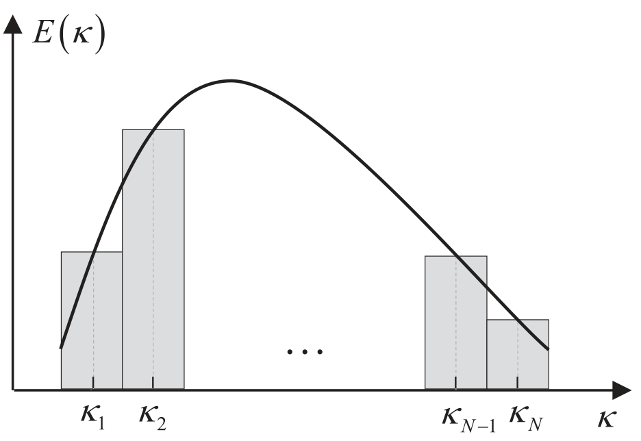

   **图 1** 能谱离散示意图。

   纵轴为能谱 :math:`E(\kappa)`，横轴为波数模 :math:`\kappa`；灰色矩形表示离散谱段，标注依次为 :math:`\kappa_1,\kappa_2,\ldots,\kappa_{N-1},\kappa_N`。

由于 HIT 的能量在波数空间中半径为 :math:`\kappa_n` 的球面上均匀分布，如图 2 所示，波数矢量可表示为

.. math::

   \begin{cases}
   \mathbf k_n=\kappa_n\widehat{\mathbf k}_n
   =\kappa_n(\widehat k_{1,n},\widehat k_{2,n},\widehat k_{3,n})^{\mathrm T},\\
   \widehat k_{1,n}=\sin(\alpha_n)\cos(\beta_n),\\
   \widehat k_{2,n}=\sin(\alpha_n)\sin(\beta_n),\\
   \widehat k_{3,n}=\cos(\alpha_n),
   \end{cases}\qquad (22)

其中，:math:`\widehat{\mathbf k}_n` 为均匀分布在单位球面上的矢量；:math:`\alpha_n` 和 :math:`\beta_n` 分别表示球坐标系中的随机极角和方位角，其概率密度函数为

.. math::

   g_{\alpha_n}(\alpha_n)=\frac12\sin(\alpha_n),
   \quad\alpha_n\in[0,\pi].\qquad (23)

.. math::

   g_{\beta_n}(\beta_n)=\frac1{2\pi},
   \quad\beta_n\in[0,2\pi].\qquad (24)

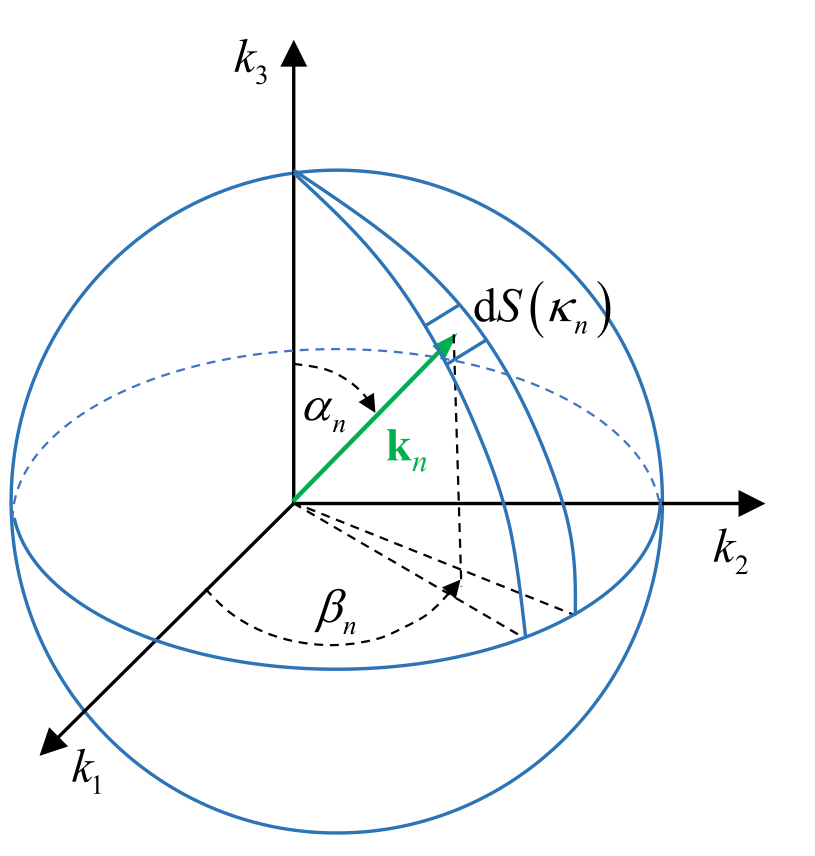

   **图 2** 波数矢量示意图。

   三坐标轴为 :math:`k_1,k_2,k_3`，绿色箭头为 :math:`\mathbf k_n`；:math:`\alpha_n` 为极角，:math:`\beta_n` 为方位角，:math:`\mathrm dS(\kappa_n)` 为球面面积微元。

此外，与文献 :ref:`[37] <li2024-reference-37>` 不同，为保证所生成湍流满足 Taylor 冻结假设，频率与波数矢量第一分量之间的关系表示为

.. math::

   f_n=-\frac{k_{1,n}U_{\mathrm{avg,T}}}{2\pi}.
   \qquad (25)

最后，随机相位角是在 :math:`0` 至 :math:`2\pi` 范围内均匀分布的随机变量，其概率密度函数表示为

.. math::

   g_{\varphi_n}(\varphi_n)=\frac1{2\pi},
   \quad\varphi_n\in[0,2\pi].\qquad (26)

至此，VPRFG 方法的全部参数均已介绍。需要注意，本研究不深入讨论入口质量平衡要求和压力波动。如果将 VPRFG 方法用于生成 LES 的速度入口边界，可参考文献 :ref:`[45] <li2024-reference-45>` 对波数进行周期性调整，以施加入口质量平衡条件。

II.C 无散条件与 Taylor 冻结假设
~~~~~~~~~~~~~~~~~~~~~~~~~~~~~~~~~

根据文献 :ref:`[47] <li2024-reference-47>`，满足无散条件和 Taylor 冻结假设，是湍流正确平流输运的必要条件。接下来，我们证明 VPRFG 方法生成的湍流满足这两个条件。

首先，对于均匀湍流，结合式（17），所生成湍流的散度可计算为

.. math::

   \begin{aligned}
   \nabla\cdot\mathbf U(\mathbf x)
   &=\nabla\cdot\left(\overline{\mathbf U}(\mathbf x)+\mathbf u(\mathbf x,t)\right)\\
   &=\nabla\cdot\mathbf u(\mathbf x,t)
   =\nabla\cdot\left(\nabla\times\boldsymbol\psi(\mathbf x,t)\right)=0.
   \end{aligned}\qquad (27)

式（27）表明，所生成湍流满足无散条件，这是因为速度来自基于 RFG 方法合成的矢量势场的旋度。此外，根据式（25），可得到如下相位关系：

.. math::

   \begin{aligned}
   &\mathbf k_n\cdot\mathbf x+2\pi f_n(t-\tau)+\varphi_n\\
   &\quad=k_{1,n}(x_1+U_{\mathrm{avg,T}}\tau)+k_{2,n}x_2+k_{3,n}x_3
   +2\pi f_n t+\varphi_n.
   \end{aligned}\qquad (28)

其中，:math:`\tau` 为时间间隔。结合式（17）和（28），可以得出所提方法生成的湍流满足 Taylor 冻结假设，表示为

.. math::

   u_i(\mathbf x,t-\tau)=u_i(\mathbf x+U_{\mathrm{avg,T}}\tau\mathbf e_1,t).
   \qquad (29)

其中，:math:`\mathbf e_1=(1,0,0)^{\mathrm T}` 是 :math:`x` 方向的单位矢量。与文献 :ref:`[37] <li2024-reference-37>` 不同，上述结果证明 VPRFG 方法能够同时满足无散条件和 Taylor 冻结假设。因此，所生成湍流近似符合 Navier–Stokes（NS）方程，这对湍流的准确输运至关重要。

II.D 所生成湍流的统计特征
~~~~~~~~~~~~~~~~~~~~~~~~~~~

II.D.1 平均脉动速度
^^^^^^^^^^^^^^^^^^^^^

现在推导 VPRFG 方法生成的湍流的统计特征。根据式（16），:math:`\boldsymbol\psi` 第 :math:`i` 个分量对 :math:`x_j` 的导数的集合平均可表示为

.. math::

   \left\langle\frac{\partial\psi_i(\mathbf x,t)}{\partial x_j}\right\rangle
   =\left\langle\sum_{n=1}^{N}p_{i,n}k_{j,n}
   \cos(\mathbf k_n\cdot\mathbf x+2\pi f_n t+\varphi_n)\right\rangle.
   \qquad (30)

其中，:math:`\langle\cdot\rangle` 表示集合平均运算。由于式（30）中随机变量的概率密度函数已知，可以通过求期望得到集合平均。

根据式（26），参数 :math:`\varphi_n` 服从均匀分布，因此有

.. math::

   \begin{aligned}
   &\int_{-\infty}^{\infty}\cos(\mathbf k_n\cdot\mathbf x+2\pi f_n t+\varphi_n)
   g_{\varphi_n}(\varphi_n)\,\mathrm d\varphi_n\\
   &\quad=\frac1{2\pi}\int_0^{2\pi}\cos(\mathbf k_n\cdot\mathbf x+2\pi f_n t+\varphi_n)
   \,\mathrm d\varphi_n=0.
   \end{aligned}\qquad (31)

将式（31）代入式（30），可得 :math:`\langle\partial\psi_i(\mathbf x,t)/\partial x_j\rangle=0`。因此，根据式（17），平均脉动速度为 :math:`\langle\mathbf u(\mathbf x,t)\rangle=(0,0,0)^{\mathrm T}`。

II.D.2 三维空间互谱密度
^^^^^^^^^^^^^^^^^^^^^^^^^

下一步推导 VPRFG 方法所生成湍流的三维空间 CSD 的计算形式。类似于式（31），对于任意给定相位角 :math:`\theta`，均有

.. math::

   \int_{-\infty}^{\infty}\sin(\theta+\varphi_n)g_{\varphi_n}(\varphi_n)\,\mathrm d\varphi_n
   =\frac1{2\pi}\int_0^{2\pi}\sin(\theta+\varphi_n)\,\mathrm d\varphi_n=0.
   \qquad (32)

因此，根据式（32），矢量势场在两点间的空间相关函数可化简为

.. math::

   \begin{aligned}
   R_{ij}^{\psi}(\mathbf r)
   &=\langle\psi_i(\mathbf x,t)\psi_j(\mathbf x+\mathbf r,t)\rangle\\
   &=\Bigg\langle\left[\sum_{n=1}^{N}p_{i,n}
   \sin(\mathbf k_n\cdot\mathbf x+2\pi f_n t+\varphi_n)\right]\\
   &\qquad\quad\times\left[\sum_{n=1}^{N}p_{j,n}
   \sin\big(\mathbf k_n\cdot(\mathbf x+\mathbf r)+2\pi f_n t+\varphi_n\big)\right]\Bigg\rangle\\
   &=\left\langle\sum_{n=1}^{N}\frac12 p_{i,n}p_{j,n}\cos(\mathbf k_n\cdot\mathbf r)\right\rangle.
   \end{aligned}\qquad (33)

其中，:math:`\mathbf r` 是两个空间点之间的相对距离矢量。

此外，由于参数 :math:`r_{i,n}` 在 :math:`-0.5` 至 :math:`0.5` 间均匀分布，:math:`\operatorname{sign}(r_{i,n})\operatorname{sign}(r_{j,n})` 的概率质量函数（probability mass function，PMF）可写为

.. math::

   g\big(\operatorname{sign}(r_{i,n})\operatorname{sign}(r_{j,n})\big)
   =\begin{cases}
   0.5,&\operatorname{sign}(r_{i,n})\operatorname{sign}(r_{j,n})=-1,\\
   0,&\operatorname{sign}(r_{i,n})\operatorname{sign}(r_{j,n})=0,\\
   0.5,&\operatorname{sign}(r_{i,n})\operatorname{sign}(r_{j,n})=1,
   \end{cases}
   \quad\forall i\ne j.\qquad (34)

进一步，:math:`\operatorname{sign}(r_{i,n})\operatorname{sign}(r_{j,n})` 的集合平均为

.. math::

   \left\langle\operatorname{sign}(r_{i,n})\operatorname{sign}(r_{j,n})\right\rangle
   =\begin{cases}1,&i=j,\\0,&i\ne j.\end{cases}
   \qquad (35)

将式（19）和（35）代入式（33），得到

.. math::

   R_{ij}^{\psi}(\mathbf r)=\begin{cases}
   \displaystyle\sum_{n=1}^{N}\frac{E_{\mathrm T}(\kappa_n)\Delta\kappa}{\kappa_n^2}
   \langle\cos(\mathbf k_n\cdot\mathbf r)\rangle,&i=j,\\[4pt]
   0,&i\ne j.
   \end{cases}\qquad (36)

根据式（22），:math:`\mathbf k_n` 均匀分布在半径为 :math:`\kappa_n` 的球面上，因此 :math:`\mathbf k_n` 的三维概率密度函数可表示为

.. math::

   g_{\mathbf k_n}(\mathbf k_n)=\frac1{4\pi\kappa_n^2}
   \delta(|\mathbf k_n|-\kappa_n),
   \quad k_{i,n}\in[-\kappa_n,\kappa_n],\quad i=1,2,3.
   \qquad (37)

其中，:math:`\delta(\cdot)` 为 Dirac 函数。此外，:math:`\cos(\mathbf k_n\cdot\mathbf r)` 的集合平均可计算为

.. math::

   \langle\cos(\mathbf k_n\cdot\mathbf r)\rangle
   =\int_{-\infty}^{\infty}\int_{-\infty}^{\infty}\int_{-\infty}^{\infty}
   \cos(\mathbf k_n\cdot\mathbf r)g_{\mathbf k_n}(\mathbf k_n)
   \,\mathrm dk_{1,n}\mathrm dk_{2,n}\mathrm dk_{3,n}.
   \qquad (38)

对式（38）进行三维 Fourier 变换，得到

.. math::

   \begin{aligned}
   &\mathcal F_{\mathbf k}\{\langle\cos(\mathbf k_n\cdot\mathbf r)\rangle\}\\
   &=\frac1{(2\pi)^3}\int_{-\infty}^{\infty}\int_{-\infty}^{\infty}\int_{-\infty}^{\infty}
   \langle\cos(\mathbf k_n\cdot\mathbf r)\rangle
   \exp(-\mathrm j\mathbf k\cdot\mathbf r)\,\mathrm dr_1\mathrm dr_2\mathrm dr_3\\
   &=\int_{-\infty}^{\infty}\int_{-\infty}^{\infty}\int_{-\infty}^{\infty}
   g_{\mathbf k_n}(\mathbf k_n)\,\mathrm dk_{1,n}\mathrm dk_{2,n}\mathrm dk_{3,n}\\
   &\quad\times\left[\frac1{8\pi^3}\int_{-\infty}^{\infty}\int_{-\infty}^{\infty}\int_{-\infty}^{\infty}
   \cos(\mathbf k_n\cdot\mathbf r)\exp(-\mathrm j\mathbf k\cdot\mathbf r)
   \,\mathrm dr_1\mathrm dr_2\mathrm dr_3\right]\\
   &=\int_{-\infty}^{\infty}\int_{-\infty}^{\infty}\int_{-\infty}^{\infty}\frac12
   \Big[\delta(k_1-k_{1,n})\delta(k_2-k_{2,n})\delta(k_3-k_{3,n})\\
   &\qquad\qquad+\delta(k_1+k_{1,n})\delta(k_2+k_{2,n})\delta(k_3+k_{3,n})\Big]
   g_{\mathbf k_n}(\mathbf k_n)\,\mathrm dk_{1,n}\mathrm dk_{2,n}\mathrm dk_{3,n}\\
   &=\frac12\left[g_{\mathbf k_n}(\mathbf k)+g_{\mathbf k_n}(-\mathbf k)\right]
   =\frac1{4\pi\kappa_n^2}\delta(|\mathbf k|-\kappa_n).
   \end{aligned}\qquad (39)

其中，:math:`\mathcal F_{\mathbf k}\{\cdot\}` 表示三维 Fourier 变换运算。利用式（39）的结果，对式（36）进行三维 Fourier 变换，可得到矢量势场的三维空间 CSD：

.. math::

   \Phi_{ij}^{\psi}(\mathbf k)=\mathcal F_{\mathbf k}\{R_{ij}^{\psi}(\mathbf r)\}
   =\begin{cases}
   \displaystyle\sum_{n=1}^{N}\frac{E_{\mathrm T}(\kappa_n)\Delta\kappa}{4\pi\kappa_n^4}
   \delta(|\mathbf k|-\kappa_n),&i=j,\\[4pt]
   0,&i\ne j.
   \end{cases}\qquad (40)

根据式（15），脉动速度场由矢量势场取旋度得到。因此，合成湍流场的三维空间 CSD 可表示为 :ref:`[53] <li2024-reference-53>`

.. math::

   \Phi_{ij}(\mathbf k)=\begin{bmatrix}
   k_2^2\Phi_{33}^{\psi}+k_3^2\Phi_{22}^{\psi}&-k_1k_2\Phi_{33}^{\psi}&-k_1k_3\Phi_{22}^{\psi}\\
   -k_1k_2\Phi_{33}^{\psi}&k_1^2\Phi_{33}^{\psi}+k_3^2\Phi_{11}^{\psi}&-k_2k_3\Phi_{11}^{\psi}\\
   -k_1k_3\Phi_{22}^{\psi}&-k_2k_3\Phi_{11}^{\psi}&k_1^2\Phi_{22}^{\psi}+k_2^2\Phi_{11}^{\psi}
   \end{bmatrix}.\qquad (41)

为便于描述，引入以下记号：

.. math::

   \Phi^{\psi}(\mathbf k)=\sum_{n=1}^{N}
   \frac{E_{\mathrm T}(\kappa_n)\Delta\kappa}{4\pi\kappa_n^4}
   \delta(|\mathbf k|-\kappa_n).
   \qquad (42)

因此，合成湍流场的三维空间 CSD 可以化简为

.. math::

   \Phi_{ij,\mathrm C}(\mathbf k)=\Phi^{\psi}(\mathbf k)(\kappa^2\delta_{ij}-k_i k_j).
   \qquad (43)

其中，下标 :math:`\mathrm C` 表示计算值。当谱段数量趋于无穷大时，有

.. math::

   \begin{aligned}
   \Phi_{ij,\mathrm C}(\mathbf k)
   &\approx\left[\lim_{N\to\infty}\sum_{n=1}^{N}
   \frac{E_{\mathrm T}(\kappa_n)\Delta\kappa}{4\pi\kappa_n^4}
   \delta(|\mathbf k|-\kappa_n)\right](\kappa^2\delta_{ij}-k_i k_j)\\
   &=\frac{E_{\mathrm T}(\kappa)}{4\pi\kappa^4}(\kappa^2\delta_{ij}-k_i k_j).
   \end{aligned}\qquad (44)

同时，根据式（1），HIT 的目标三维空间 CSD 表示为

.. math::

   \Phi_{ij,\mathrm T}(\mathbf k)=\frac{E_{\mathrm T}(\kappa)}{4\pi\kappa^4}
   (\kappa^2\delta_{ij}-k_i k_j).
   \qquad (45)

比较式（44）和（45），可得 :math:`\Phi_{ij,\mathrm C}(\mathbf k)\approx\Phi_{ij,\mathrm T}(\mathbf k)`，表明 VPRFG 方法生成的湍流能够满足指定的三维空间 CSD。如第 II.A 节所述，如果生成的 HIT 满足目标三维空间 CSD 和 Taylor 冻结假设，那么相应的能谱、一维空间 PSD、时间 PSD、Reynolds 应力、湍动能等统计量就自然得到满足。因此，VPRFG 方法自然实现了上述湍流特征。

II.D.3 其他低维统计特征
^^^^^^^^^^^^^^^^^^^^^^^^^

在验证三维空间 CSD 之后，接下来证明所提方法生成的湍流满足任意能谱。将式（43）代入式（2），得到计算能谱：

.. math::

   \begin{aligned}
   E_{\mathrm C}(\kappa)
   &=\oint\frac12\left[\Phi_{11,\mathrm C}(\mathbf k)+\Phi_{22,\mathrm C}(\mathbf k)+\Phi_{33,\mathrm C}(\mathbf k)\right]\mathrm dS(\kappa)\\
   &=\oint\frac12\Phi^{\psi}(\mathbf k)
   \left[(\kappa^2-k_1^2)+(\kappa^2-k_2^2)+(\kappa^2-k_3^2)\right]\mathrm dS(\kappa)\\
   &=\oint\Phi^{\psi}(\mathbf k)\kappa^2\,\mathrm dS(\kappa)\\
   &=\sum_{n=1}^{N}\oint\frac{E_{\mathrm T}(\kappa_n)\Delta\kappa}{4\pi\kappa_n^4}
   \delta(|\mathbf k|-\kappa_n)\kappa_n^2\,\mathrm dS(\kappa_n)\\
   &=\sum_{n=1}^{N}E_{\mathrm T}(\kappa_n)\Delta\kappa\,\delta(\kappa-\kappa_n).
   \end{aligned}\qquad (46)

当 :math:`N\to\infty` 时，有

.. math::

   E_{\mathrm C}(\kappa)\approx\lim_{N\to\infty}\sum_{n=1}^{N}
   E_{\mathrm T}(\kappa_n)\Delta\kappa\,\delta(\kappa-\kappa_n)=E_{\mathrm T}(\kappa).
   \qquad (47)

式（47）表明，VPRFG 方法生成的流场能够满足任意目标能谱。进一步，将式（46）代入式（3），得到计算湍动能：

.. math::

   \begin{aligned}
   K_{\mathrm C}&=\int_0^{\infty}E_{\mathrm C}(\kappa)\,\mathrm d\kappa\\
   &=\int_0^{\infty}\sum_{n=1}^{N}E_{\mathrm T}(\kappa_n)\Delta\kappa
   \,\delta(\kappa-\kappa_n)\,\mathrm d\kappa\\
   &=\sum_{n=1}^{N}E_{\mathrm T}(\kappa_n)\Delta\kappa.
   \end{aligned}\qquad (48)

式（48）表示，图 1 中曲线下方的面积等于湍动能。因此，随着最大波数和谱段数量增加，湍动能的计算值趋近目标值。

最后，按照式（4）—（13）的计算步骤，可推得 VPRFG 方法生成的湍流满足其他湍流特征，例如 Reynolds 应力、一维空间 PSD、时间 PSD 和空间相干函数。

简言之，与 Yu 和 Bai :ref:`[37] <li2024-reference-37>` 的工作相比，所提方法采用更简洁的形式合成矢量势场，并引入 Taylor 冻结假设。因此，所生成湍流能够实现湍流的时空相关性，包括满足预期的时间 PSD 和空间相干函数。文献 :ref:`[37] <li2024-reference-37>` 未考虑这两种湍流特征。

II.E 算法汇总
~~~~~~~~~~~~~~~

VPRFG 方法的流程见图 3，其算法可概括如下：

1. 确定输入参数，包括目标平均速度 :math:`U_{\mathrm{avg,T}}`、能谱 :math:`E_{\mathrm T}(\kappa)`、谱段数量 :math:`N`、计算域尺寸 :math:`(L_1,L_2,L_3)`、网格尺寸 :math:`(\Delta g_1,\Delta g_2,\Delta g_3)`、最小波长与网格尺寸的比值 :math:`(N_{g1},N_{g2},N_{g3})`（其中 :math:`N_{gi}\ge2`）以及时间步长 :math:`\Delta t`。

2. 计算波数矢量模的最小值：

   .. math::

      \kappa_{\min}=\max\left(\frac{2\pi}{L_1},\frac{2\pi}{L_2},\frac{2\pi}{L_3}\right).
      \qquad (49)

3. 计算波数矢量模的最大值。根据 Nyquist 采样定理，要求 :math:`f_{\max}\le1/(2\Delta t)`；结合式（25），:math:`k_{1,\max}` 可计算为

   .. math::

      k_{1,\max}=\min\left(\frac{\pi}{U_{\mathrm{avg,T}}\Delta t},
      \frac{2\pi}{N_{g1}\Delta g_1}\right).
      \qquad (50)

   因此，波数矢量模的最大值可确定为

   .. math::

      \kappa_{\max}=\min\left(k_{1,\max},\frac{2\pi}{N_{g2}\Delta g_2},
      \frac{2\pi}{N_{g3}\Delta g_3}\right).
      \qquad (51)

4. 利用式（20）和（21），计算波数间隔 :math:`\Delta\kappa` 并生成等间距的波数模序列 :math:`\kappa_n`。

5. 生成服从 :math:`-0.5` 至 :math:`0.5` 范围内均匀分布的随机数 :math:`r_{i,n}`。

6. 利用式（19）生成幅值矢量 :math:`\mathbf p_n`。

7. 利用式（22）—（24）计算分布在半径为 :math:`\kappa_n` 的球面上的随机波数矢量 :math:`\mathbf k_n`。

8. 利用式（25）计算频率 :math:`f_n`。

9. 根据式（26）生成随机相位角 :math:`\varphi_n`。

10. 利用式（17）或（18）合成均匀各向同性脉动速度。

11. 利用式（14）计算合成后的瞬时速度。

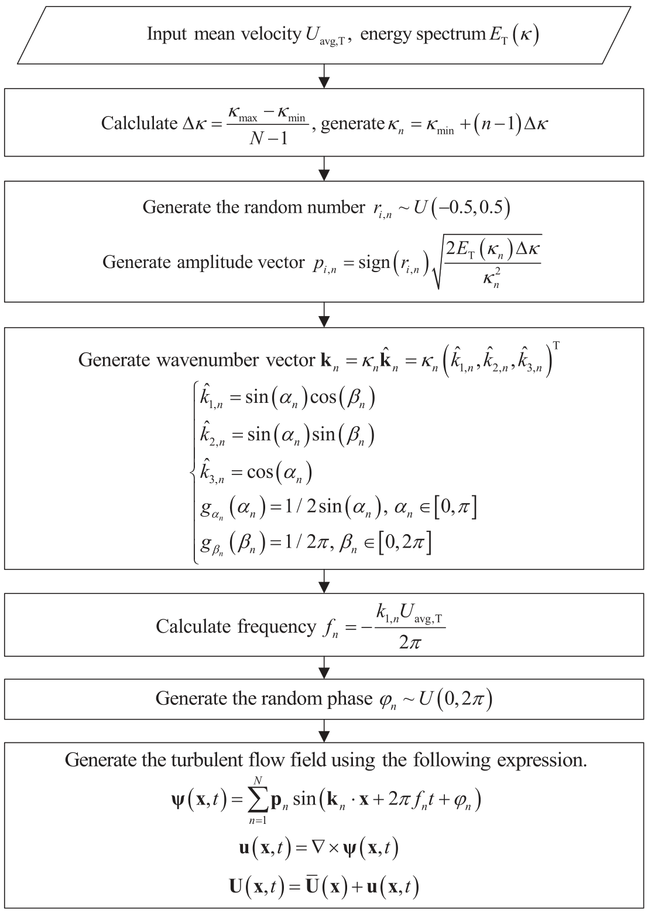

   **图 3** VPRFG 方法流程图。

   图中流程框从上至下依次为：输入平均速度与能谱；计算波数间隔并生成波数模；生成随机数和幅值矢量；生成波数矢量；计算频率；生成随机相位；利用矢量势、旋度及均值叠加公式生成湍流场。各框中的公式与本节所列公式对应。

III 所提方法的验证
--------------------

III.A von Kármán 能谱的模拟
~~~~~~~~~~~~~~~~~~~~~~~~~~~~~

为验证 VPRFG 方法的理论准确性，我们生成初始三维速度场，并考察特定点处的速度时程，以检查湍流特征。数值算例采用 von Kármán 能谱作为目标。首先，HIT 的 von Kármán 能谱表示为 :ref:`[58,59] <li2024-reference-58>`

.. math::

   E(\kappa)=\alpha\frac{\sigma_{\mathrm{iso}}^2}{\kappa_e}
   \frac{(\kappa/\kappa_e)^4}{[1+(\kappa/\kappa_e)^2]^{17/6}}.
   \qquad (52)

其中，:math:`\alpha` 为比例常数，计算为 :math:`\alpha=55\Gamma(5/6)/(9\sqrt\pi\,\Gamma(1/3))\approx1.453`；:math:`\sigma_{\mathrm{iso}}` 为 HIT 中每个速度分量的标准差（standard deviation，STD），即 :math:`\sigma_{\mathrm{iso}}=\sigma_u=\sigma_v=\sigma_w`；:math:`\kappa_e` 与能量达到最大值处的波数相关，最大值出现在 :math:`\sqrt{12/5}\,\kappa_e`。与文献 :ref:`[35] <li2024-reference-35>` 一样，模拟中采用参数 :math:`\sigma_{\mathrm{iso}}=0.25\,\mathrm{m/s}`、:math:`\kappa_e=40\sqrt{5/12}\,\mathrm{m^{-1}}`。随后，可利用式（5）和（6）计算一维空间 PSD，并根据式（9）得到目标 von Kármán 时间 PSD。

此外，采用边长为 :math:`0.2\pi\,\mathrm m` 的立方体生成初始三维速度场，对应最小波数为 :math:`\kappa_{\min}=10\,\mathrm{m^{-1}}`。初始速度场分别采用三种分辨率的均匀网格生成，网格数量为 :math:`128^3`、:math:`256^3` 和 :math:`384^3`。同时，为验证所生成湍流的时间 PSD，我们计算坐标 :math:`(0,0,0.1\pi\,\mathrm m)` 处的脉动速度时程。平均速度设为 :math:`10\,\mathrm{m/s}`，总模拟时长为 :math:`5\,\mathrm s`。此外，选取沿 :math:`Y` 方向间距分别为 :math:`0.005`、:math:`0.01` 和 :math:`0.015\,\mathrm m` 的三对点，模拟空间相干函数。计算三种网格分辨率下特定点的速度时程时，对应采用的时间步长分别为 :math:`0.0005`、:math:`0.00025` 和 :math:`0.00016\,\mathrm s`。上述模拟均采用 VPRFG 方法的式（17），并取 :math:`N=5000`。

对于周期盒湍流，能谱定义为 :ref:`[53] <li2024-reference-53>`

.. math::

   E(\kappa,t)=\frac12\sum_{\kappa-1/2<|\mathbf k|<\kappa+1/2}
   |\widehat{\mathbf u}_{\mathbf k}|^2.
   \qquad (53)

其中，:math:`\kappa\in\mathbb N^+`，:math:`\widehat{\mathbf u}_{\mathbf k}` 为脉动速度的第 :math:`\kappa` 个 Fourier 系数。图 4 给出以 von Kármán 能谱为目标时，VPRFG 方法所生成湍流场的能谱。总体而言，所提方法能够较好地模拟目标能谱，而更高的网格分辨率能够覆盖更宽的能谱范围。此外，图 5 给出以 von Kármán 能谱为目标时的时间谱。可以看到，所生成湍流的每个脉动速度分量均与目标 von Kármán 时间 PSD 良好吻合。同时，图 6 表明空间相干函数均接近预期值。这归因于所提方法能够满足 Taylor 冻结假设。类似地，随着网格分辨率和时间步分辨率提高，生成的湍流能够覆盖更宽的时间 PSD 和空间相干函数范围。

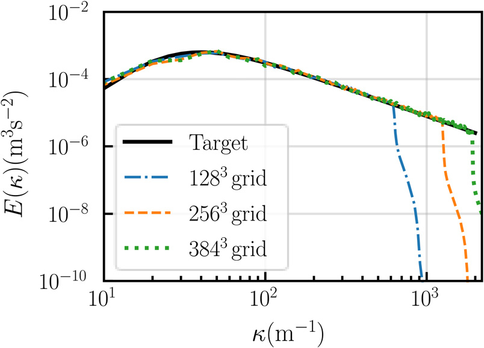

   **图 4** 以 von Kármán 能谱为目标生成的湍流能谱。

   横轴为波数 :math:`\kappa\,(\mathrm{m^{-1}})`，纵轴为 :math:`E(\kappa)\,(\mathrm{m^3s^{-2}})`。图例 Target 为目标值，另外三条曲线分别为 :math:`128^3`、:math:`256^3` 和 :math:`384^3` 网格结果。

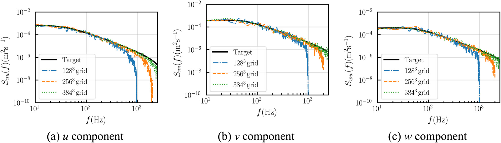

   **图 5** 以 von Kármán 能谱为目标时，点 :math:`(0,0,0.1\pi\,\mathrm m)` 处的时间谱。

   子图（a）、（b）、（c）依次为 :math:`u`、:math:`v`、:math:`w` 分量。横轴为频率 :math:`f\,(\mathrm{Hz})`，纵轴分别为 :math:`S_{uu}(f)`、:math:`S_{vv}(f)`、:math:`S_{ww}(f)`，单位为 :math:`\mathrm{m^2s^{-1}}`。Target 为目标值，grid 为网格。

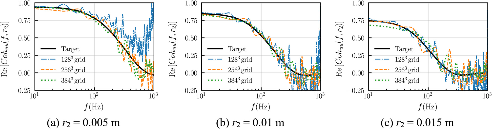

   **图 6** 以 von Kármán 能谱为目标时，:math:`Y` 方向不同空间间距的空间相干函数。

   子图（a）、（b）、（c）的间距 :math:`r_2` 依次为 :math:`0.005`、:math:`0.01`、:math:`0.015\,\mathrm m`。横轴为频率，纵轴为 :math:`\operatorname{Coh}_{uu}(f,r_2)` 的实部；Target 为目标值，另外三组曲线为不同网格分辨率的计算结果。

III.B 时间衰减均匀各向同性盒湍流的 LES
~~~~~~~~~~~~~~~~~~~~~~~~~~~~~~~~~~~~~~~~

时间衰减均匀各向同性湍流是一个理想化问题，旨在增进我们对湍流理论和模型的理解。为进一步评价 VPRFG 方法的性能，我们采用 Comte-Bellot 和 Corrsin（CBC）实验 :ref:`[60] <li2024-reference-60>` 获得的能谱作为 LES 的初始条件。如文献 :ref:`[53] <li2024-reference-53>` 所述，模拟在各边长为 :math:`0.2\pi\,\mathrm m` 的立方体计算域内进行，对应最小波数为 :math:`\kappa_{\min}=10\,\mathrm{m^{-1}}`。模拟采用两种分辨率的均匀网格，网格数量为 :math:`128^3` 和 :math:`256^3`。使用实验时刻 :math:`U_0t/M=42` 的 CBC 能谱作为初始目标值，其中 :math:`U_0` 为 :math:`10\,\mathrm{m/s}` 的平均速度，:math:`M` 为 :math:`0.0508\,\mathrm m` 的实验格栅尺寸。然后，VPRFG 方法取 :math:`N=5000`，生成初始时刻的三维脉动速度场。运动黏度设为 :math:`\nu=1.5\times10^{-5}\,\mathrm{m^2/s}`。模拟采用 OpenFOAM v2206 的瞬态求解器 pimpleFoam。湍流模型选用壁面自适应局部涡黏性（wall-adapting local eddy-viscosity，WALE）模型，计算域六个边界面均设置为周期边界。时间离散采用 backward 格式，空间离散采用 Gauss linear 格式。为使两种网格分辨率下的最大 CFL 数近似相同，时间步长分别设为 :math:`0.0005` 和 :math:`0.00025\,\mathrm s`。本小节后半部分给出 :math:`0`、:math:`0.28` 和 :math:`0.66\,\mathrm s` 时刻的结果，分别对应 CBC 实验中的 :math:`U_0t/M=42,98,171`。表 I 列出时间衰减均匀各向同性盒湍流的各工况。C1 和 C3 工况采用式（17）生成湍流场，用于对比在 FVM 框架下不能严格满足零散度对结果的影响。相反，C2 和 C4 工况采用式（18）生成严格零散度的湍流场，以研究网格离散误差对湍流特征的影响。

.. list-table:: 表 I 时间衰减均匀各向同性盒湍流工况
   :header-rows: 1
   :widths: 12 33 33 22

   * - 工况
     - 湍流生成方法
     - 网格数量
     - 时间步长（s）
   * - C1
     - VPRFG［式（17）］
     - :math:`128\times128\times128`
     - 0.0005
   * - C2
     - VPRFG［式（18）］
     - :math:`128\times128\times128`
     - 0.0005
   * - C3
     - VPRFG［式（17）］
     - :math:`256\times256\times256`
     - 0.00025
   * - C4
     - VPRFG［式（18）］
     - :math:`256\times256\times256`
     - 0.00025

接下来分析结果。首先，对散度误差相关结果进行统计评价。评价采用速度散度的绝对值 :math:`\varepsilon_{\mathrm{div}}(\mathbf u)` 和网格单元各面通量之和的绝对值 :math:`\varepsilon_{\mathrm{div}}(\phi)`，分别定义为

.. math::

   \varepsilon_{\mathrm{div}}(\mathbf u)=\left|\frac{\partial u_1}{\partial x_1}
   +\frac{\partial u_2}{\partial x_2}+\frac{\partial u_3}{\partial x_3}\right|.
   \qquad (54)

.. math::

   \varepsilon_{\mathrm{div}}(\phi)=\left|\sum(\mathbf U_f\cdot\mathbf S_f)\right|.
   \qquad (55)

其中，:math:`\mathbf U_f` 表示网格单元面上的速度；:math:`\mathbf S_f` 为网格单元的面矢量。表 II 给出基于空间平均计算的 :math:`\varepsilon_{\mathrm{div}}(\mathbf u)` 和 :math:`\varepsilon_{\mathrm{div}}(\phi)` 的均值与标准差。在初始时刻 :math:`t=0\,\mathrm s`，速度场直接由 VPRFG 方法生成。可以看到，C2 和 C4 采用式（18）离散的流场较好地满足零散度约束，其均值和标准差在 :math:`10^{-7}` 或 :math:`10^{-6}` 量级。相比之下，C1 和 C3 的均值和标准差约处于 :math:`6` 至 :math:`10` 范围。进一步分析 :math:`t=0.001\,\mathrm s` 的散度误差，因为该时刻足够接近初始时刻，湍流性质不太可能已经发生显著变化。此时，经过 pimpleFoam 求解器的压力–速度耦合迭代，输出新的体矢量场 :math:`\mathbf u` 和面标量场 :math:`\phi`，并对其进行散度误差分析。结果表明，新的 :math:`\phi` 较好地满足零散度条件，:math:`\varepsilon_{\mathrm{div}}(\phi)` 的均值和标准差约为 :math:`10^{-6}` 量级。然而，由于数值算法误差，:math:`t=0.001\,\mathrm s` 时计算的 :math:`\mathbf u` 不能严格满足零散度，:math:`\varepsilon_{\mathrm{div}}(\mathbf u)` 的均值和标准差在 :math:`0` 至 :math:`5` 范围内。这意味着，即使初始 :math:`\mathbf u` 严格满足零散度，在迭代时间步中，由于计算误差也不能严格保持 :math:`\mathbf u` 的零散度水平，而面标量场 :math:`\phi` 实际上满足该条件。因此，在 FVM 框架下，可能不必坚持初始时刻的速度严格满足零散度，因为这可能导致湍流特征发生额外变化；本小节后半部分将对此进一步说明。

.. list-table:: 表 II 散度误差的均值与标准差
   :header-rows: 1
   :widths: 8 15 15 15 15 16 16

   * - 工况
     - :math:`\varepsilon_{\mathrm{div}}(\mathbf u)`，0 s，均值
     - :math:`\varepsilon_{\mathrm{div}}(\mathbf u)`，0 s，标准差
     - :math:`\varepsilon_{\mathrm{div}}(\mathbf u)`，0.001 s，均值
     - :math:`\varepsilon_{\mathrm{div}}(\mathbf u)`，0.001 s，标准差
     - :math:`\varepsilon_{\mathrm{div}}(\phi)`，0.001 s，均值
     - :math:`\varepsilon_{\mathrm{div}}(\phi)`，0.001 s，标准差
   * - C1
     - 6.71
     - 7.26
     - 3.85
     - 3.45
     - :math:`3.52\times10^{-6}`
     - :math:`2.54\times10^{-6}`
   * - C2
     - :math:`4.77\times10^{-7}`
     - :math:`5.00\times10^{-7}`
     - 0.46
     - 1.35
     - :math:`1.27\times10^{-6}`
     - :math:`1.27\times10^{-6}`
   * - C3
     - 8.71
     - 10.5
     - 4.65
     - 4.42
     - :math:`2.74\times10^{-6}`
     - :math:`2.30\times10^{-6}`
   * - C4
     - :math:`1.00\times10^{-6}`
     - :math:`1.24\times10^{-6}`
     - 0.88
     - 3.72
     - :math:`2.63\times10^{-6}`
     - :math:`3.02\times10^{-6}`

.. note::

   原文在本段使用“严格零散度”描述离散初场，而表 II 实际报告了非零数值残差。应区分式（27）的连续无散恒等式、离散单元中心速度的散度，以及压力–速度耦合后的面通量守恒；它们不是同一种检验。

图 7 显示初始时刻 :math:`U_0t/M=42` 时，不同网格的 Q 准则等值面。可以看到，随着网格分辨率提高，VPRFG 方法所生成湍流的涡结构表现出更强的随机性和更细小的尺度特征。然而，对比 C1 与 C2（或 C3 与 C4）可清楚发现，式（18）生成的湍流虽然严格满足零散度，但其涡结构相对于式（17）生成的湍流发生了变化，甚至出现速度值增大的情况。此外，CBC 实验 :ref:`[60] <li2024-reference-60>` 给出三个脉动速度分量的标准差随时间变化的衰减曲线，表示为

.. math::

   \frac{U_0^2}{\sigma_u^2}=21\left(\frac{U_0t}{M}-3.5\right)^{1.25},
   \qquad
   \frac{U_0^2}{\sigma_v^2}=\frac{U_0^2}{\sigma_w^2}
   =20\left(\frac{U_0t}{M}-3.5\right)^{1.25}.
   \qquad (56)

因此，实验湍动能衰减曲线可由 :math:`K=\tfrac12(\sigma_u^2+\sigma_v^2+\sigma_w^2)` 计算。图 8 描绘衰减盒湍流的湍动能随时间的演化。在图 8 中，实验湍动能衰减曲线采用对数坐标表示，呈现为一条下降直线。这表明湍动能呈指数衰减。图 8 显示，在初始时刻 :math:`U_0t/M=42`，随着网格分辨率提高，由式（17）生成的湍流场的动能更有效地趋近目标值。由于式（18）生成的初始湍流特征已发生变化，需要发展到 :math:`U_0t/M=120` 才接近实验值。相比之下，由式（17）生成的湍流场经过较短的发展时间，就形成近似线性的动能衰减曲线，整体上接近实验值。此外，图 9 给出不同网格下衰减盒湍流的能谱。利用式（53）计算不同时刻盒湍流场的能谱。显然，C4 在初始时刻的能谱能量水平高于目标值，对应于图 8 中过高的初始湍动能。同时，其他工况在所选时刻能够有效满足目标能谱。此外，更高分辨率的网格能够覆盖更宽的能谱范围。这一观察结果表明，VPRFG 方法生成的湍流场符合局部各向同性假设。

.. note::

   上段“指数衰减”忠实保留原文的 exponentially 表述；式（56）实际写成关于移位无量纲时间 :math:`U_0t/M-3.5` 的幂律。原文文字与公式的这一差异不在译文中擅自统一。

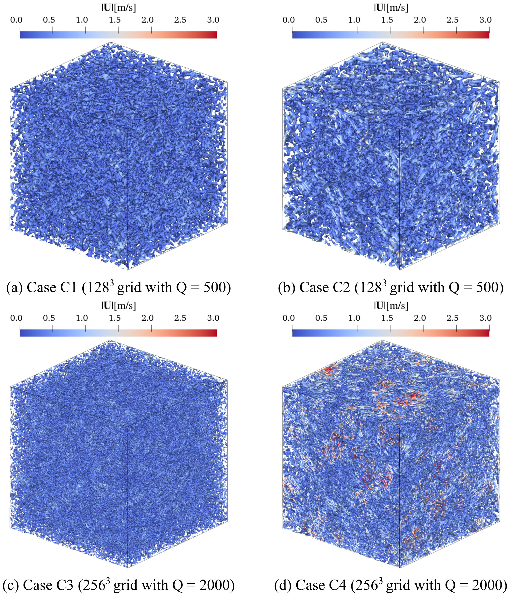

   **图 7** 初始时刻 :math:`U_0t/M=42` 不同网格的 Q 准则等值面。

   （a）C1：:math:`128^3` 网格，:math:`Q=500`；（b）C2：:math:`128^3` 网格，:math:`Q=500`；（c）C3：:math:`256^3` 网格，:math:`Q=2000`；（d）C4：:math:`256^3` 网格，:math:`Q=2000`。色标为速度模 :math:`|\mathbf U|\,(\mathrm{m/s})`。C1/C3 采用式（17），C2/C4 采用式（18），网格、生成公式和等值面阈值应分别辨认。

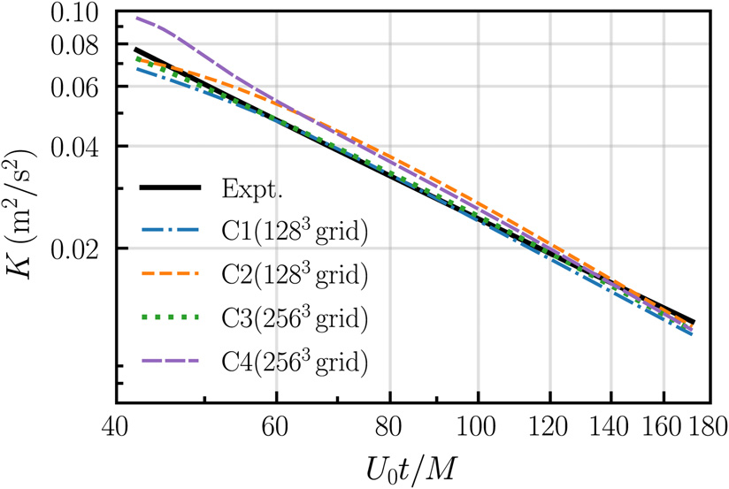

   **图 8** 衰减盒湍流的湍动能随时间演化。

   横轴为 :math:`U_0t/M`，纵轴为湍动能 :math:`K\,(\mathrm{m^2/s^2})`。Expt. 表示实验；C1/C2 为 :math:`128^3` 网格，C3/C4 为 :math:`256^3` 网格。

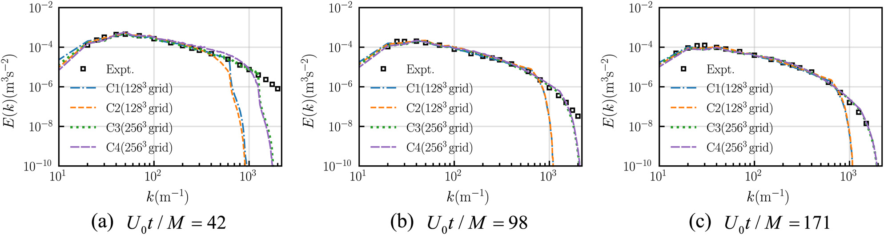

   **图 9** 衰减盒湍流的能谱。

   子图（a）、（b）、（c）分别对应 :math:`U_0t/M=42,98,171`。横轴为波数 :math:`k\,(\mathrm{m^{-1}})`，纵轴为能谱 :math:`E(k)\,(\mathrm{m^3s^{-2}})`；Expt. 为实验，其余曲线为 C1—C4 工况。

最后，图 10 和图 11 分别给出不同网格下衰减盒湍流的纵向和横向空间相关系数。图中的目标空间相关系数采用式（5）和（8）计算。计算空间相关函数定义为 :ref:`[45] <li2024-reference-45>`

.. math::

   R(m\Delta r)=\frac1{M-m}\sum_{j=0}^{M-m-1}
   u(j\Delta r)u[(j+m)\Delta r].
   \qquad (57)

其中，:math:`m` 为整数，:math:`r_m=m\Delta r` 且 :math:`0\le m<M`；:math:`\Delta r` 为空间步长，:math:`M` 为矢量 :math:`r_m` 的长度。随后对式（57）归一化，计算空间相关系数。总体而言，式（18）生成的湍流场在初始时刻的空间相关系数明显偏离目标值。然而，式（17）生成的湍流场与目标值更加接近；随着时间发展，所有工况均表现出与实验值更好的一致性。

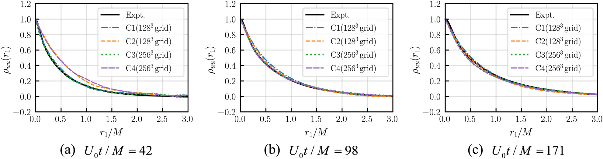

   **图 10** 衰减盒湍流的纵向空间相关系数。

   子图（a）、（b）、（c）分别对应 :math:`U_0t/M=42,98,171`。横轴为 :math:`r_1/M`，纵轴为 :math:`\rho_{uu}(r_1)`；图例 Expt. 对应由实验参考能谱推得的目标相关系数，C1—C4 为各计算工况。

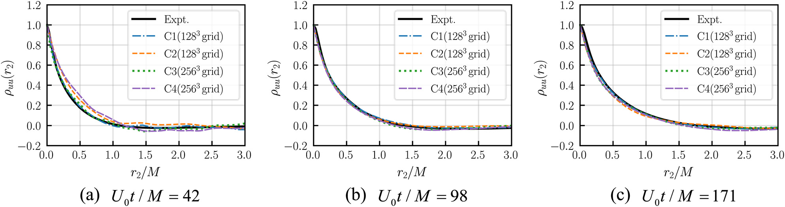

   **图 11** 衰减盒湍流的横向空间相关系数。

   子图（a）、（b）、（c）分别对应 :math:`U_0t/M=42,98,171`。横轴为 :math:`r_2/M`，纵轴为 :math:`\rho_{uu}(r_2)`；图例 Expt. 对应由实验参考能谱推得的目标相关系数，C1—C4 为各计算工况。

IV 结论
---------

本研究提出一种新方法，用于生成满足任意能谱的无散均匀各向同性湍流（HIT）。该方法对基于 RFG 方法生成的矢量势场计算旋度，从而保证所生成湍流满足无散条件。因此，将其命名为矢量势随机流生成（VPRFG）方法。

首先，HIT 的低维统计量可由三维空间互谱密度（CSD）计算。这些特征包括能谱、一维空间功率谱密度（PSD）、湍动能和 Reynolds 应力。如果湍流满足 Taylor 冻结假设，则一维空间 PSD 与时间 PSD 可以相互转换。基于这一思想，VPRFG 方法采用基于 RFG 的方式生成矢量势场。公式显式包含任意均匀各向同性三维空间 CSD，使合成的湍流场内在满足相应低维统计特征和无散条件。同时，VPRFG 方法引入 Taylor 冻结假设，保证所生成湍流满足预期时间 PSD 和空间相干函数。

此外，通过 von Kármán 能谱的数值算例验证所提方法的理论准确性。为进一步评价所提方法的有效性，将 VPRFG 方法生成的湍流场作为 LES 的初始条件，并与实验观测进行比较。结果表明，对式（17）生成的流场，湍动能衰减曲线、三维能谱和空间相关系数均与实验数据高度一致。然而，考虑有限体积法的离散误差时，尽管可以在初始时刻获得严格无散的湍流场，式（18）生成的湍流仍会改变初始湍流特征。根据数值模拟分析，建议选择式（17）所示用于推导矢量势场的理论公式，以获得更加真实的湍流。原文结论使用“推导矢量势场”的表述，但式（17）直接给出速度场；此处保留这一指代差异。

最后，需要指出，本研究目前的范围仅限于 HIT 模拟。利用矢量势场旋度在数学上的无散性质，有助于解决非均匀流场中难以保证无散条件的问题。然而，目前的挑战在于，如何利用基于 RFG 的方法构造任意非均匀各向异性三维空间 CSD，这需要在未来研究中进一步探索。

参考文献
----------

.. _li2024-reference-1:

[1] Z. Xie and I. P. Castro, “Efficient generation of inflow conditions for large eddy simulation of street-scale flows,” Flow, Turbul. Combust. 81, 449–470 (2008).

.. _li2024-reference-2:

[2] M. H. Baba-Ahmadi and G. Tabor, “Inlet conditions for LES using mapping and feedback control,” Comput. Fluids 38, 1299–1311 (2009).

.. _li2024-reference-3:

[3] G. R. Tabor and M. H. Baba-Ahmadi, “Inlet conditions for large eddy simulation: A review,” Comput. Fluids 39, 553–567 (2010).

.. _li2024-reference-4:

[4] F. Bazdidi-Tehrani, M. Kiamansouri, and M. Jadidi, “Inflow turbulence generation techniques for large eddy simulation of flow and dispersion around a model building in a turbulent atmospheric boundary layer,” J. Build. Perform. Simul. 9, 680–698 (2016).

.. _li2024-reference-5:

[5] X. Wu, “Inflow turbulence generation methods,” Annu. Rev. Fluid Mech. 49, 23–49 (2017).

.. _li2024-reference-6:

[6] N. S. Dhamankar, G. A. Blaisdell, and A. S. Lyrintzis, “Overview of turbulent inflow boundary conditions for large-eddy simulations,” AIAA J. 56, 1317–1334 (2018).

.. _li2024-reference-7:

[7] A. Montorfano, F. Piscaglia, and G. Ferrari, “Inlet boundary conditions for incompressible LES: A comparative study,” Math. Comput. Modell. 57, 1640–1647 (2013).

.. _li2024-reference-8:

[8] A. K. Dagnew and G. T. Bitsuamlak, “Computational evaluation of wind loads on a standard tall building using LES,” Wind Struct. 18, 567–598 (2014).

.. _li2024-reference-9:

[9] B. W. Yan and Q. S. Li, “Inflow turbulence generation methods with large eddy simulation for wind effects on tall buildings,” Comput. Fluids 116, 158–175 (2015).

.. _li2024-reference-10:

[10] R. Vasaturo, I. Kalkman, B. Blocken, and P. Van Wesemael, “Large eddy simulation of the neutral atmospheric boundary layer: Performance evaluation of three inflow methods for terrains with different roughness,” J. Wind Eng. Ind. Aerodyn. 173, 241–261 (2018).

.. _li2024-reference-11:

[11] Z. Mansouri, R. P. Selvam, and A. G. Chowdhury, “Performance of different inflow turbulence methods for wind engineering applications,” J. Wind Eng. Ind. Aerodyn. 229, 105141 (2022).

.. _li2024-reference-12:

[12] H. Plischka, S. Michel, J. Turnow, B. Leitl, and N. Kornev, “Comparison of turbulent inflow conditions for neutral stratified atmospheric boundary layer flow,” J. Wind Eng. Ind. Aerodyn. 230, 105145 (2022).

.. _li2024-reference-13:

[13] Y. Kim, I. P. Castro, and Z. Xie, “Divergence-free turbulence inflow conditions for large-eddy simulations with incompressible flow solvers,” Comput. Fluids 84, 56–68 (2013).

.. _li2024-reference-14:

[14] L. Patruno and S. de Miranda, “Unsteady inflow conditions: A variationally based solution to the insurgence of pressure fluctuations,” Comput. Method Appl. Mech. Eng. 363, 112894 (2020).

.. _li2024-reference-15:

[15] R. H. Kraichnan, “Diffusion by a random velocity field,” Phys. Fluids 13, 22–31 (1970).

.. _li2024-reference-16:

[16] W. Bechara, C. Bailly, P. Lafon, and S. M. Candel, “Stochastic approach to noise modeling for free turbulent flows,” AIAA J. 32, 455–463 (1994).

.. _li2024-reference-17:

[17] A. Smirnov, S. Shi, and I. Celik, “Random flow generation technique for large eddy simulations and particle-dynamics modeling,” J. Fluids Eng. 123, 359–371 (2001).

.. _li2024-reference-18:

[18] M. Shinozuka, “Simulation of multivariate and multidimensional random processes,” J. Acoust. Soc. Am. 49, 357–368 (1971).

.. _li2024-reference-19:

[19] M. Klein, A. Sadiki, and J. Janicka, “A digital filter based generation of inflow data for spatially developing direct numerical or large eddy simulations,” J. Comput. Phys. 186, 652–665 (2003).

.. _li2024-reference-20:

[20] A. Kempf, M. Klein, and J. Janicka, “Efficient generation of initial-and inflow-conditions for transient turbulent flows in arbitrary geometries,” Flow, Turbul. Combust. 74, 67–84 (2005).

.. _li2024-reference-21:

[21] N. Jarrin, S. Benhamadouche, D. Laurence, and R. Prosser, “A synthetic-eddy-method for generating inflow conditions for large-eddy simulations,” Int. J. Heat Fluid Flow 27, 585–593 (2006).

.. _li2024-reference-22:

[22] N. Kornev and E. Hassel, “Synthesis of homogeneous anisotropic divergence-free turbulent fields with prescribed second-order statistics by vortex dipoles,” Phys. Fluids 19, 068101 (2007).

.. _li2024-reference-23:

[23] A. Keating, U. Piomelli, E. Balaras, and H. Kaltenbach, “A priori and a posteriori tests of inflow conditions for large-eddy simulation,” Phys. Fluids 16, 4696–4712 (2004).

.. _li2024-reference-24:

[24] J. Wang, C. Li, S. Huang, Q. Zheng, Y. Xiao, and J. Ou, “Large eddy simulation of turbulent atmospheric boundary layer flow based on a synthetic volume forcing method,” J. Wind Eng. Ind. Aerodyn. 233, 105326 (2023).

.. _li2024-reference-25:

[25] K. Kondo, S. Murakami, and A. Mochida, “Generation of velocity fluctuations for inflow boundary condition of LES,” J. Wind Eng. Ind. Aerodyn. 67–68, 51–64 (1997).

.. _li2024-reference-26:

[26] Y. Wang and X. Chen, “Simulation of approaching boundary layer flow and wind loads on high-rise buildings by wall-modeled LES,” J. Wind Eng. Ind. Aerodyn. 207, 104410 (2020).

.. _li2024-reference-27:

[27] A. F. Melaku and G. T. Bitsuamlak, “A divergence-free inflow turbulence generator using spectral representation method for large-eddy simulation of ABL flows,” J. Wind Eng. Ind. Aerodyn. 212, 104580 (2021).

.. _li2024-reference-28:

[28] Y. Wang and X. Chen, “Evaluation of wind loads on high-rise buildings at various angles of attack by wall-modeled large-eddy simulation,” J. Wind Eng. Ind. Aerodyn. 229, 105160 (2022).

.. _li2024-reference-29:

[29] L. Davidson, “Using isotropic synthetic fluctuations as inlet boundary conditions for unsteady simulations,” Adv. Appl. Fluid Mech. 1, 1 (2007).

.. _li2024-reference-30:

[30] L. Davidson, “Hybrid LES-RANS: Inlet boundary conditions for flows including recirculation,” in Fifth International Symposium on Turbulence and Shear Flow Phenomena (Begel House Inc., 2007).

.. _li2024-reference-31:

[31] L. Davidson, “Hybrid LES-RANS: Inlet boundary conditions for flows with recirculation,” in Advances in Hybrid RANS-LES Modelling (Springer, 2008), pp. 55–66.

.. _li2024-reference-32:

[32] L. Davidson and S. Peng, “Embedded large-eddy simulation using the partially averaged Navier–Stokes model,” AIAA J. 51, 1066–1079 (2013).

.. _li2024-reference-33:

[33] X. Xue, H. Yao, and L. Davidson, “Synthetic turbulence generator for lattice Boltzmann method at the interface between RANS and LES,” Phys. Fluids 34, 055118 (2022).

.. _li2024-reference-34:

[34] T. Saad and J. C. Sutherland, “Comment on ‘Diffusion by a random velocity field,’ [Phys. Fluids 13, 22 (1970)],” Phys. Fluids 28, 119101 (2016).

.. _li2024-reference-35:

[35] T. Saad, D. Cline, R. Stoll, and J. C. Sutherland, “Scalable tools for generating synthetic isotropic turbulence with arbitrary spectra,” AIAA J. 55, 327–331 (2017).

.. _li2024-reference-36:

[36] H. Guo, P. Jiang, L. Ye, and Y. Zhu, “An efficient and low-divergence method for generating inhomogeneous and anisotropic turbulence with arbitrary spectra,” J. Fluid Mech. 970, A2 (2023).

.. _li2024-reference-37:

[37] R. Yu and X. Bai, “A fully divergence-free method for generation of inhomogeneous and anisotropic turbulence with large spatial variation,” J. Comput. Phys. 256, 234–253 (2014).

.. _li2024-reference-38:

[38] S. H. Huang, Q. S. Li, and J. R. Wu, “A general inflow turbulence generator for large eddy simulation,” J. Wind Eng. Ind. Aerodyn. 98, 600–617 (2010).

.. _li2024-reference-39:

[39] H. G. Castro and R. R. Paz, “A time and space correlated turbulence synthesis method for large eddy simulations,” J. Comput. Phys. 235, 742–763 (2013).

.. _li2024-reference-40:

[40] X. Wang, C. S. Cai, P. Yuan, G. Xu, and C. Sun, “An efficient and accurate DSRFG method via nonuniform energy spectra discretization,” Eng. Struct. 298, 117014 (2024).

.. _li2024-reference-41:

[41] H. Aboshosha, A. Elshaer, G. T. Bitsuamlak, and A. El Damatty, “Consistent inflow turbulence generator for LES evaluation of wind-induced responses for tall buildings,” J. Wind Eng. Ind. Aerodyn. 142, 198–216 (2015).

.. _li2024-reference-42:

[42] A. Melaku, G. Bitsuamlak, A. Elshaer, and H. Aboshosha, “Synthetic inflow turbulence generation methods for LES study of tall building aerodynamics,” in 13th Americas Conference on Wind Engineering, 2017.

.. _li2024-reference-43:

[43] Y. Yu, Y. Yang, and Z. Xie, “A new inflow turbulence generator for large eddy simulation evaluation of wind effects on a standard high-rise building,” Build. Environ. 138, 300–313 (2018).

.. _li2024-reference-44:

[44] L. Chen, C. Li, J. Wang, G. Hu, Q. Zheng, Q. Zhou, and Y. Xiao, “Consistency improved random flow generation method for large eddy simulation of atmospheric boundary layer,” J. Wind Eng. Ind. Aerodyn. 229, 105147 (2022).

.. _li2024-reference-45:

[45] L. Chen, C. Li, J. Wang, G. Hu, and Y. Xiao, “A coherence-improved and mass-balanced inflow turbulence generation method for large eddy simulation,” J. Comput. Phys. 498, 112706 (2023).

.. _li2024-reference-46:

[46] L. Patruno and M. Ricci, “On the generation of synthetic divergence-free homogeneous anisotropic turbulence,” Comput. Method Appl. Mech. Eng. 315, 396–417 (2017).

.. _li2024-reference-47:

[47] L. Patruno and M. Ricci, “A systematic approach to the generation of synthetic turbulence using spectral methods,” Comput. Method Appl. Mech. Eng. 340, 881–904 (2018).

.. _li2024-reference-48:

[48] M. Bervida, L. Patruno, S. Stani, and S. D. Miranda, “Synthetic generation of the atmospheric boundary layer for wind loading assessment using spectral methods,” J. Wind Eng. Ind. Aerodyn. 196, 104040 (2020).

.. _li2024-reference-49:

[49] M. Pamiès, P. Weiss, E. Garnier, S. Deck, and P. Sagaut, “Generation of synthetic turbulent inflow data for large eddy simulation of spatially evolving wall-bounded flows,” Phys. Fluids 21, 045103 (2009).

.. _li2024-reference-50:

[50] Y. Luo, H. Liu, Q. Huang, H. Xue, and K. Lin, “A multi-scale synthetic eddy method for generating inflow data for LES,” Comput. Fluids 156, 103–112 (2017).

.. _li2024-reference-51:

[51] R. Poletto, T. Craft, and A. Revell, “A new divergence free synthetic eddy method for the reproduction of inlet flow conditions for LES,” Flow, Turbul. Combust. 91, 519–539 (2013).

.. _li2024-reference-52:

[52] A. Sescu and R. Hixon, “Toward low-noise synthetic turbulent inflow conditions for aeroacoustic calculations,” Numer. Methods Fluids 73, 1001–1010 (2013).

.. _li2024-reference-53:

[53] Y. Cai, J. Wan, and A. Kareem, “A new divergence-free synthetic eddy method for generating homogeneous isotropic turbulence with a prescribed energy spectrum,” Comput. Fluids 253, 105788 (2023).

.. _li2024-reference-54:

[54] J. W. Kim and S. Haeri, “An advanced synthetic eddy method for the computation of aerofoil–turbulence interaction noise,” J. Comput. Phys. 287, 1–17 (2015).

.. _li2024-reference-55:

[55] H. Kröger and N. Kornev, “Generation of divergence free synthetic inflow turbulence with arbitrary anisotropy,” Comput. Fluids 165, 78–88 (2018).

.. _li2024-reference-56:

[56] S. B. Pope, Turbulent Flows (Cambridge University Press, 2000).

.. _li2024-reference-57:

[57] G. I. Taylor, “The spectrum of turbulence,” Proc. R. Soc. London, A 164, 476–490 (1938).

.. _li2024-reference-58:

[58] K. T. Von, “Progress in the statistical theory of turbulence,” Proc. Natl. Acad. Sci. U. S. A. 34, 530–539 (1948).

.. _li2024-reference-59:

[59] C. Bailly and D. Juve, “A stochastic approach to compute subsonic noise using linearized Euler’s equations,” AIAA Paper No. 99-1872, 1999.

.. _li2024-reference-60:

[60] G. Comte-Bellot and S. Corrsin, “Simple Eulerian time correlation of full-and narrow-band velocity signals in grid-generated, ‘isotropic’ turbulence,” J. Fluid Mech. 48, 273–337 (1971).

完整引用
----------

Li Chao; Chen Lingwei; Wang Jinghan; Zhang Wentong; Wang Xiangjie; Wang Zhuoran; Hu Gang. A novel vector potential random flow generation method for synthesizing divergence-free homogeneous isotropic turbulence with arbitrary spectra. Physics of Fluids, 2024, 36(3): 035127. https://doi.org/10.1063/5.0194006.

收录信息见 :ref:`WOEAI 学术成果页对应条目 <ref-li2024-POF>`。
