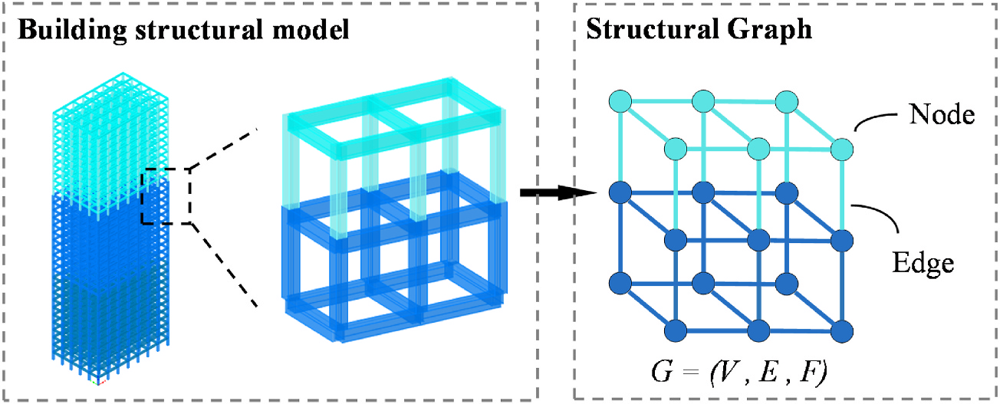
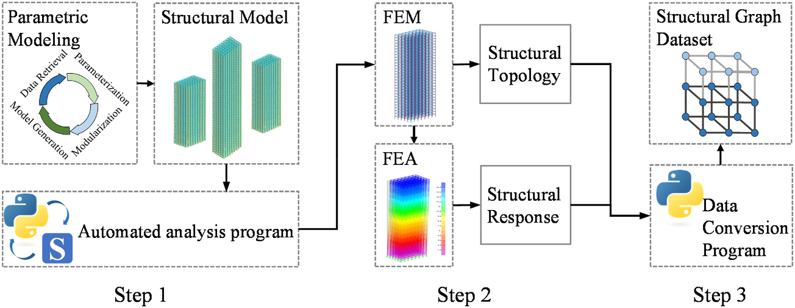
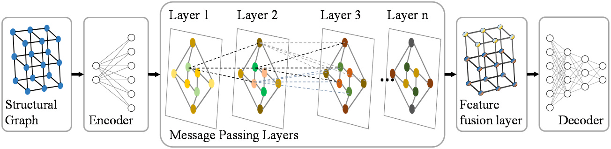
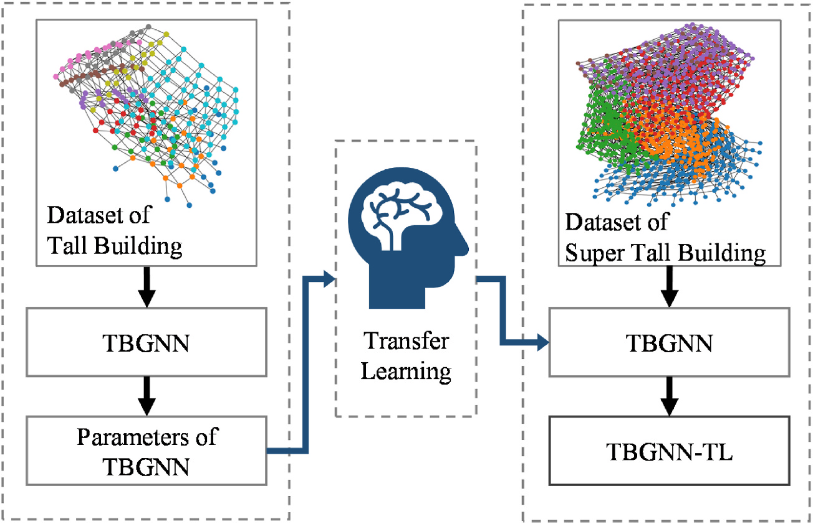
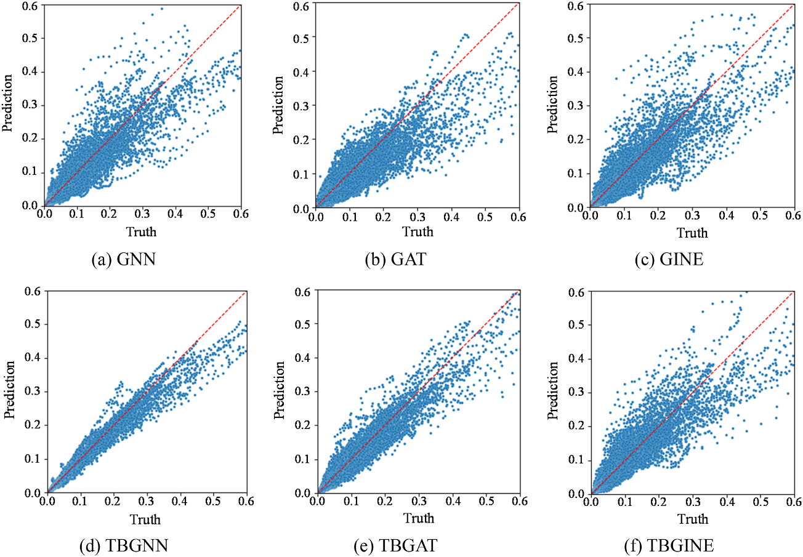
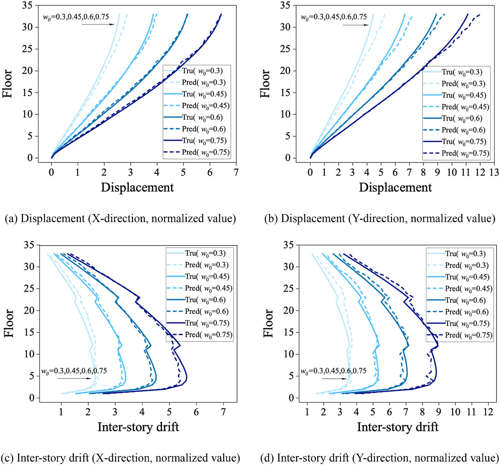
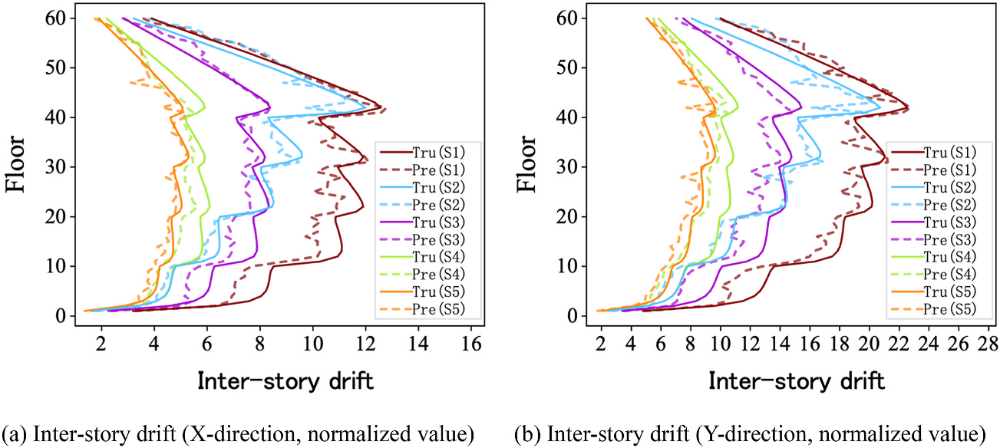

.. _paper-note-ref-tang2025-JBE:

.. role:: student-first-author

用图神经网络预测高层建筑结构响应
================================

高层建筑抗风优化常常需要反复修改构件尺寸、重建有限元模型并重新计算结构响应。有限元分析是必要的高可信工具，但在多轮优化中，重复建模和计算会迅速放大时间成本。

在这篇发表于 **Journal of Building Engineering** 的论文中，我们把高层建筑结构表示为图数据，提出面向高层建筑结构响应预测的 Tall Building Graph Neural Network（TBGNN）框架，探索在特定静力响应分析任务中用图神经网络代理模型提高重复分析效率。这项工作关注的是风荷载作用下的位移、层间位移和一阶自振周期预测，不把模型包装成已经工程部署的商业软件。

   论文图 1 建筑结构模型的结构图表示（不同颜色表示不同标准层）

   这张图展示了本文的基本建模思想：把建筑结构中的节点、梁柱构件和楼层关系组织为图，让结构拓扑、构件信息和传力关系进入同一个数据表示。

论文信息
--------

- 论文题名: Training and application of graph neural networks for predicting structural responses targeted at tall building structures
- 作者: :student-first-author:`Tang Ao`; **Li Chao**\*; Yang Junhui; Zhang Heqiang; Zheng Qingxing; Zhang Jianjun
- 期刊: Journal of Building Engineering
- 年份: 2025
- DOI: https://doi.org/10.1016/j.jobe.2025.112131
- WOEAI 相关方向: 建筑结构抗风 / 高层建筑抗风与优化

三句话导读
----------

这篇论文研究如何把高层建筑结构表示为图，并用 TBGNN 预测风荷载作用下的位移、层间位移和一阶自振周期。 它重要，因为抗风优化中的有限元分析可信但耗时，重复建模和计算会限制早期方案搜索效率。 读者可以带走的结论是：GNN 代理模型可以作为快速筛选工具，但必须保留楼层特征、工程知识损失函数和清晰的数据适用边界。

关键数字 / 关键结论卡
---------------------

- 初始数据集包括 :math:`998` 个高层建筑结构，通过改变基本风压扩展到 :math:`2994` 组，并进一步补充到 :math:`4194` 个高层与超高层建筑结构。
- 加入楼层特征融合后，TBGNN 在验证集上的整体准确率由约 :math:`84\%` 提高到约 :math:`92\%`。
- 在论文测试条件下，参数化建模结合 TBGNN 代理模型相比传统人工修改模型加 FEA 可节约约 :math:`90\%` 的时间。

摘要
----

有限元分析（FEA）方法通常计算量大且耗时，尤其是在涉及多次迭代的结构优化任务中。为提高效率，研究者已经开始使用神经网络预测结构响应。然而，工程数据集稀缺、高层建筑数据复杂，以及现有图神经网络（GNN）处理这类复杂数据时面临的挑战，限制了 GNN 代理模型的潜力。

为解决这些问题，本文提出一种专门面向高层建筑结构的 GNN 训练与应用框架，目标是用 GNN 代理模型替代 FEA 完成结构分析。首先，本文用图表示高层建筑结构的完整信息；其次，通过参数化建模快速生成高层建筑结构数据集；最后，提出楼层特征增强策略，并修改损失函数以优化位移曲线模式。

由此形成的高层建筑图神经网络 TBGNN，在较少数据、轻量化架构和较少计算资源条件下，在特定任务中表现良好。数值实验结果表明，改进模型在预测钢筋混凝土结构的结构位移、层间位移和一阶自振周期方面，相比其他 GNN 的准确率平均提高超过 :math:`5\%`。此外，TBGNN 对风荷载和结构尺寸变化都非常敏感。与传统有限元分析方法相比，所提出的 GNN 代理模型节约约 :math:`90\%` 的时间。这些发现说明，用 GNN 代理模型服务高层建筑抗风结构设计优化具有可行性，并为这一重要挑战提供了有价值的思路。

研究问题
--------

高层建筑结构响应预测要让模型真正理解工程对象，而不是只学习一组表格数字。本文回答三个问题：

1. 如何把高层建筑的节点、梁柱构件、楼层关系、质量和风荷载组织成适合 GNN 学习的图数据？
2. 如何通过参数化建模和工程知识损失函数，让代理模型在较少工程数据下学习有用的响应曲线？
3. 当楼层数、风压和构件尺寸变化时，TBGNN 的预测能力和外推边界在哪里？

方法贡献
--------

这项工作把“数据怎么来”“结构怎么表示”“模型怎么学”和“怎么用于更高楼层结构”串成一条完整流程。

第一步是图表示。论文采用结构元素作为边的表示方式，用节点表达构件连接处，用边表达梁柱构件信息，并把楼层质量和风荷载作为节点特征的一部分。风荷载按规范形式写入节点特征时，楼层风荷载采用：

.. math::

   w_k=\beta_z \mu_s \mu_z w_0

其中 :math:`\beta_z` 为风振系数，:math:`\mu_s` 为体型系数，:math:`\mu_z` 为风压高度变化系数，:math:`w_0` 为基本风压。这样，模型不是只学习几何形状，也能看到不同风压条件下的输入变化。

第二步是参数化建模与数据生成。论文通过 YJK-GAMA、自动分析程序、有限元分析和 PyTorch Geometric 数据转换，快速生成结构拓扑与结构响应数据。初始数据集包括 :math:`998` 个高层建筑结构，并通过改变基本风压 :math:`w_0` 扩展到 :math:`2994` 组；随后又生成面向超高层建筑的补充数据，使总数据集达到 :math:`4194` 个高层与超高层建筑结构。

   论文图 4 数据生成

   这张图说明了本文的数据闭环：参数化建模生成结构模型，有限元分析得到结构响应，再把结构拓扑与响应结果转换为结构图数据集。

第三步是 TBGNN。模型由编码器、消息传递层、楼层特征融合层和解码器组成。相比直接堆叠大量 GNN 层，本文把同一楼层节点的特征汇聚为楼层节点，再与原节点特征融合，试图在模型复杂度和楼层局部特征保留之间取得平衡。

   论文图 6 TBGNN 架构

   TBGNN 从结构图进入编码器和消息传递层，再经过楼层特征融合层和解码器输出结构响应，核心是让高层建筑的“楼层性”进入图神经网络。

第四步是迁移学习。论文发现楼层数对模型性能有明显影响，当测试结构楼层数超出训练数据范围时，误差会增大。因此，研究进一步把低楼层结构中学到的模型参数迁移到超高层结构数据训练中，形成 TBGNN-TL。

   论文图 8 面向超高层建筑的迁移学习

   迁移学习部分把高层建筑数据集中学到的 TBGNN 参数作为超高层建筑模型训练的初始知识，用较小补充数据扩展模型对更多楼层结构的适应性。

关键发现
--------

1. 楼层特征融合提高了结构响应预测表现
~~~~~~~~~~~~~~~~~~~~~~~~~~~~~~~~~~~~~

**针对问题 1，论文首先在 :math:`2944` 组高层建筑结构数据上训练 TBGNN，并用验证集比较不同 GNN 模型是否加入楼层特征融合层。** 验证集包含 :math:`66084` 个预测结果，输出目标包括 :math:`X`、:math:`Y` 两个方向的楼层位移 :math:`\Delta_{wx}`、:math:`\Delta_{wy}`，层间位移 :math:`\delta_{wx}`、:math:`\delta_{wy}`，以及一阶自振周期 :math:`n_1`。

结果显示，加入楼层特征融合后，TBGNN 在验证集上的整体准确率由约 :math:`84\%` 提高到约 :math:`92\%`。这说明楼层特征不是装饰性输入，而是高层建筑结构图学习中的关键组织信息。

   论文图 9 验证集回归性能

   图中上排是不加入楼层特征融合的 GNN、GAT 和 GINE，下排是加入楼层特征融合后的 TBGNN、TBGAT 和 TBGINE；TBGNN 的散点更接近理想预测线。

2. 工程知识损失函数让位移曲线更接近设计关心的形态
~~~~~~~~~~~~~~~~~~~~~~~~~~~~~~~~~~~~~~~~~~~~~~~~~

**针对问题 2，如果只使用平均绝对误差，模型可能在总体误差不大时仍然给出局部波动明显的位移曲线。** 对工程设计来说，这类不规则波动会影响构件评估和优化判断。

因此，论文把最大楼层响应和位移趋势纳入损失函数，让模型不仅追求点值接近，也学习楼层响应曲线应有的趋势。换句话说，模型训练目标从“整体误差更小”进一步靠近“曲线形态更符合工程判断”。

3. 楼层数比单纯结构高度更能影响模型外推
~~~~~~~~~~~~~~~~~~~~~~~~~~~~~~~~~~~~~~~

**针对问题 3，在楼层数敏感性分析中，论文比较了 :math:`30`、:math:`33`、:math:`36` 和 :math:`39` 层结构，并进一步比较相同高度但楼层数不同的结构。** 结果显示，当楼层数落在训练数据范围内时，各项指标准确率超过 :math:`90\%`；当楼层数超过训练数据范围时，预测误差随超出程度增加而增大。

这提示我们，面向高层建筑的 GNN 代理模型不能只按结构高度理解训练范围。楼层数本身会改变结构图的信息传递深度和楼层特征组织方式，是后续训练和应用时需要优先审查的变量。

4. 模型能够响应风压变化和构件尺寸变化
~~~~~~~~~~~~~~~~~~~~~~~~~~~~~~~~~~~~~

**针对问题 3，论文以 :math:`33` 层结构为例，比较不同基本风压下的位移和层间位移预测。** 结果表明，TBGNN 可以较好学习荷载与结构响应之间的关系，对 :math:`w_0` 改变有明显响应。

   论文图 16 不同基本风压下的位移和层间位移

   多组基本风压下，预测曲线与真实曲线整体贴合，说明模型不是只记住固定荷载工况，而是对风荷载输入变化具有敏感性。

在 CAARC 标准高层建筑验证中，论文使用 :math:`60` 层钢筋混凝土框架结构，尺寸为 :math:`182.88\,\mathrm{m} \times 45.72\,\mathrm{m} \times 30.48\,\mathrm{m}`，并设置 :math:`S1` 到 :math:`S5` 五种构件尺寸情景。TBGNN-TL 在这些情景下预测层间位移，并能跟踪构件尺寸变化带来的响应差异。

   论文图 19 CAARC 建筑不同截面工况下预测值与真实值对比

   图中实线为真实值、虚线为预测值，不同颜色对应不同构件尺寸情景；该验证用于检查 TBGNN-TL 对同一拓扑下构件尺寸变化的响应预测能力。

5. 在论文测试条件下，参数化建模结合 TBGNN 显著节约分析时间
~~~~~~~~~~~~~~~~~~~~~~~~~~~~~~~~~~~~~~~~~~~~~~~~~~~~~~~~~~

**针对问题 2，论文比较了三类流程：人工修改模型加 FEA、参数化修改模型加 FEA、参数化修改模型加 TBGNN 代理模型。** 在测试环境下，单次修改与分析总时间分别约为 :math:`3\,\mathrm{min}\,13\,\mathrm{s}`、:math:`1\,\mathrm{min}\,40\,\mathrm{s}` 和 :math:`17.33\,\mathrm{s}`。论文据此报告，相比传统分析流程，参数化建模结合 TBGNN 代理模型可节约约 :math:`90\%` 的时间。

这里需要强调，这一效率结论来自论文设定的模型、数据、硬件和静力分析任务。它说明该路线有潜力服务高层建筑抗风优化中的重复分析环节，但并不等同于所有工程结构、所有荷载类型和所有设计阶段都可以直接替代完整有限元复核。

工程意义
--------

对高层建筑抗风设计来说，这项工作提供了一个清晰的 AI 代理模型范式：先用结构图表达建筑拓扑和构件信息，再用参数化建模生成可审计数据，最后用专门的 GNN 架构学习位移、层间位移和自振周期等响应。

它对工程应用的启发主要有三点。

第一，结构响应预测模型不应只追求黑箱速度。本文把节点、边、楼层、风荷载、构件尺寸和工程知识损失函数纳入同一框架，说明代理模型仍然需要尊重结构工程中的变量组织方式。

第二，面向优化迭代的 AI 模型需要明确适用范围。楼层数、结构拓扑、构件类型、荷载形式和训练数据边界，都会影响模型是否可靠。本文对楼层数外推和迁移学习的分析，正是这种边界意识的一部分。

第三，图神经网络可以成为有限元分析的前置筛选和快速评估工具。它更适合用于参数探索、初步优化和大量候选方案排序；最终工程设计仍需要规范、有限元分析、专业判断和必要的安全复核共同支撑。

适用边界
--------

这篇论文的框架是有边界的。

首先，当前研究聚焦钢筋混凝土框架结构的静力响应分析，主要预测风荷载作用下的位移、层间位移和一阶自振周期。真实高层建筑中的剪力墙、框架-核心筒、墙单元处理和更复杂构件体系，会带来更复杂的图表示问题。

其次，本文把静态荷载等效为节点荷载，使 TBGNN 能够学习静力荷载与结构响应之间的关系。如果要考虑动态荷载或时程响应，论文也指出需要与能够处理时序数据的神经网络结合，例如 LSTM。

第三，模型预测不能被理解为替代所有工程审查。论文展示的是在特定数据集、结构类型和验证算例下，TBGNN 及 TBGNN-TL 作为代理模型的可行性。进入真实设计流程时，仍需要检查训练数据覆盖范围、结构体系差异、荷载组合、规范约束和安全裕度。

因此，更准确的理解是：这项研究为高层建筑抗风优化中的重复结构响应分析提供了一条可验证的代理模型路线，而不是把有限元分析或工程师判断从流程中移除。

延伸阅读
--------

- `WOEAI | 建筑结构抗风方向介绍 <https://woeai.readthedocs.io/zh-cn/latest/BuildingStructuralWindResistance.html>`_
- `WOEAI | 主页 <https://woeai.readthedocs.io/zh-cn/latest/>`_

完整引用
--------

[63] :student-first-author:`Tang Ao`; **Li Chao**\*; Yang Junhui; Zhang Heqiang; Zheng Qingxing; Zhang Jianjun, Training and application of graph neural networks for predicting structural responses targeted at tall building structures[J]. **Journal of Building Engineering**, 2025, 103: 112131. https://doi.org/10.1016/j.jobe.2025.112131.

收录信息见 :ref:`WOEAI 学术成果页对应条目 <ref-tang2025-JBE>`。

相关论文精解
------------

- :doc:`用内置矩形立柱提升液舱阻尼器设计效率 <ref-he2026-OE>`
- :doc:`别只看单方向峰值：高层建筑二维矢量响应极值怎么算 <ref-yang2025-JBE>`
- :doc:`让高层建筑 TLD 在非线性晃荡中更会耗能 <ref-he2025-POF>`
