.. _paper-note-ref-tang2025-JBE:

.. role:: student-first-author

面向高层建筑结构响应预测的图神经网络：论文精解
========================================================

精简版微信公众号文章：待发布

.. contents:: 本页目录
   :local:
   :depth: 2

论文信息
--------

**原文题名**：Training and application of graph neural networks for predicting structural responses targeted at tall building structures

**中文题名**：面向高层建筑结构响应预测的图神经网络训练与应用

**作者**： :student-first-author:`Ao Tang` （a），Chao Li（a、b，通讯作者），Junhui Yang（a），Heqiang Zhang（a），Qingxing Zheng（c），Jianjun Zhang（c）。

**单位**：（a）哈尔滨工业大学（深圳）土木与环境工程学院，中国深圳；（b）哈尔滨工业大学（深圳）广东省土木工程智能韧性结构重点实验室，中国深圳 518055；（c）深圳市建筑设计研究总院有限公司，中国深圳 518031。

**通讯作者**：Chao Li，哈尔滨工业大学（深圳）土木与环境工程学院，中国深圳；电子邮件：lichaosz@hit.edu.cn。

**期刊**：Journal of Building Engineering，103（2025），112131。

**DOI**：https://doi.org/10.1016/j.jobe.2025.112131

**出版过程**：2024 年 8 月 15 日收稿；2025 年 1 月 23 日收到修订稿；2025 年 2 月 13 日录用；2025 年 2 月 21 日在线发表。

关键词
------

图神经网络；高层建筑；结构分析；代理模型；抗风设计。

摘要
----

有限元分析（FEA）方法通常计算量大、耗时长，在涉及多次迭代的结构优化任务中尤其如此。为提高效率，已有研究采用神经网络预测结构响应。然而，工程数据集稀缺、高层建筑数据复杂，以及现有图神经网络（GNN）难以处理此类复杂数据等问题，限制了 GNN 代理模型的潜力。针对这些问题，本研究提出专门面向高层建筑结构的 GNN 训练与应用框架，目标是以 GNN 代理模型替代 FEA 进行结构分析。首先，采用图表示高层建筑结构的完整信息。其次，通过参数化建模快速生成高层建筑结构数据集。最后，提出楼层特征增强策略，并修改损失函数以优化位移曲线形态，由此构建高层建筑图神经网络（TBGNN）。基于较少数据与轻量架构，该网络能够以较少计算资源在特定任务中取得满意表现。数值实验表明，在预测钢筋混凝土（RC）结构的位移、层间位移和自振周期时，改进模型相较其他 GNN 的 Accuracy 平均提高超过 5%。此外，TBGNN 对风荷载和结构尺寸变化均高度敏感。相比传统有限元分析方法，所提 GNN 代理模型节省约 90% 时间。这些发现展示了采用 GNN 代理模型优化高层建筑抗风结构设计的可行性，为解决这一重要问题提供了有益思路。

1 引言
------

建筑结构优化是土木工程结构领域的重要研究方向。目前，主流抗风优化方法通常依赖有限元分析（FEA）与启发式算法相结合 [1–4]。这些方法需要频繁更新结构模型参数，并反复调用有限元方法进行结构分析；数千次迭代导致优化时间长、效率低。然而，实际工程项目中的时间约束构成重要挑战，阻碍了这些优化技术的实际应用。

人工智能（AI）技术已被证明能够有效增强土木工程中的结构健康管理 [5] 和缺陷检测 [6]。一系列 AI 技术，尤其是神经网络的快速发展，为其在传统结构工程领域中的应用提供了良好机会 [7]。其中一种应用是以神经网络作为代理模型 [8–12]，替代耗时的有限元分析。神经网络的能力来自其多层结构与相互连接的神经元，能够有效捕获数据中的复杂模式与关系，并准确建立多种非线性关系模型。此外，相较有限元分析方法，神经网络代理模型具有突出的快速响应能力。

这些优势使神经网络能够有效处理多种复杂问题，并在广泛应用中表现突出，包括结构响应分析 [13]，其中涉及动力响应预测 [14,15]、结构损伤评估 [16,17]、自动化结构设计 [18,19] 和结构优化 [20,21]。已有研究提出多种神经网络应用方法，例如以深度神经网络（DNN）[22,23] 估计桁架节点位移，以人工神经网络（ANN）[24,25] 预测剪力墙布置，或在地震与风共同激励下分析高层建筑以替代 FEA [26–28]，以及采用生成对抗网络（GAN）[19] 生成剪力墙布置。然而，这些神经网络都未能有效捕获建筑结构数据的全面特征。它们难以同时整合楼层数、外部荷载等整体信息，以及构件材料、尺寸等局部信息。本研究受到近期 GNN 在结构分析中应用进展的启发。Chang 和 Cheng [29] 率先利用 GNN 训练两个代理模型：一个预测地震作用下多层钢结构的层间位移角，另一个估计构件尺寸。Fabio Parisi 等 [30] 开发了基于 GNN 的力学信息模型，用于预测二维和三维桁架变形，展示了 GNN 在物理信息模型中的潜力。Zhang 和 Fan [31] 通过从训练后的 GNN 代理模型提取优化梯度，研究结构尺寸优化。Zhou 等 [32] 提出专门面向多层钢框架的 StructGNN，通过引入适应楼层数的 GNN 层，解决 GNN 泛化问题。Fei 和 Liao [33] 提出结合物理与数据驱动方法的混合代理模型，准确估计地震作用下剪力墙结构的层间位移角。这些研究展示了用图表示建筑结构的优越性，以及 GNN 相比其他神经网络处理建筑结构数据的优势。然而，这些方法主要用于多层结构抗震设计，其结构高度较低、楼层较少、模型参数不够复杂。对于规格不同、更复杂且更高的建筑结构，仍难以全面表征数据并训练 GNN 代理模型。此外，尚未有将 GNN 应用于高层建筑抗风设计的研究或尝试见诸报道。

虽然 StructGNN 是目前对建筑结构适应性较强的开源 GNN 模型，但随着建筑由高层发展为超高层，楼层数从 30 增加到 50 甚至更多，其优势与适用性减弱。此时，GNN 层数不足会导致训练和泛化表现欠佳，而过多层数又使模型参数呈指数增加，显著消耗训练资源。因此，本文在 StructGNN 基础上，对高层建筑结构开展系统研究，构建用于结构响应预测的 GNN 训练与应用框架。该框架包含 TBGNN 代理模型，用于评价风荷载下的结构位移、层间位移和一阶自振周期。此外，研究探索以 TBGNN 代理模型替代有限元分析，进行结构构件尺寸优化的潜力。主要贡献如下。

1. 建立参数化建模与自动分析流程。根据结构拓扑信息构建模型，调用有限元软件自动分析结构响应，最终转化为结构图数据。
2. 提出楼层特征增强策略与工程知识损失函数。楼层特征增强策略引入 GNN 楼层特征融合层，使每层全局与局部节点信息充分整合，显著降低模型复杂性并提高预测精度。同时，工程知识损失函数保证预测输出的实用性。
3. 提出专门面向高层建筑结构数据的新 GNN 架构 TBGNN。该模型能预测不同拓扑结构在多种基本风压和不同构件尺寸下的结构响应；进一步利用迁移学习，将其能力扩展至更高建筑结构。

本文安排如下：第 2 节详细介绍高层建筑结构的图表示，以及数据集创建与生成过程，随后介绍提高现有 GNN 对高层建筑结构数据适用性的改进，包括楼层特征增强和工程知识嵌入。第 3 节展示 TBGNN 模型性能，进一步验证楼层数相对于结构高度的主导作用，以及模型对风荷载的敏感性。第 4 节通过数值验证展示模型处理构件尺寸变化的能力。最后，第 5 节总结研究结果与发现，并展望未来工作。

2 方法
------

本研究主要目标是开发能够在高层建筑构件尺寸优化中替代有限元分析（FEA）的代理模型。因此，研究数据构建与模型改进均面向这一特定应用。为了获得适用于超高层建筑的 GNN 代理模型，必须以能够捕获全部相关信息的方式表示结构特征，尤其突出构件尺寸和外部荷载信息。考虑高层建筑参数复杂性与计算能力限制，首先生成覆盖 21–33 层高层建筑的数据集；随后生成覆盖 45–63 层超高层建筑的另一数据集，以解决模型不足。通过逐步开发和训练代理模型，了解其预测能力与应用范围。最后，使用经典的英联邦航空咨询研究理事会（CAARC）标准高层建筑模型，评价代理模型精度与效率。

2.1 高层建筑结构的图表示
~~~~~~~~~~~~~~~~~~~~~~~~

GNN 是处理图数据的一类神经网络。图由节点集合及连接节点的边组成。在建筑结构领域，Zhou 已验证 ElemASedge，即“结构单元作为图的边”的方法 [32] 表示结构图的合理性。每个节点可代表构件连接处的结构节点，边则代表梁、柱等构件的信息。因此，建筑结构图可表示为 :math:`G=(V,E,F)` ，见图 1，其中 :math:`V` 表示节点， :math:`E` 表示边。对于 :math:`v_i\in V` ，向量组 :math:`X_i` 表示结构节点特征；对于 :math:`e_i\in E` ，向量组 :math:`E_{ij}` 表示构件特征。图中仅抽取部分楼层展示图表示，实际所有楼层均用结构图表示。此外，邻接表 :math:`F` 表示节点之间的连接关系， :math:`F_{ij}=[v_i,v_j]` ， :math:`F_{ij}\in F` 。图的固有拓扑性质与建筑结构组成特征十分契合。邻接表还有效表示了构件组合与传力之间的关系，从而减少大量参数的相互独立性。因此，图能够全面收集结构信息，并高效捕获建筑结构的复杂性。

在有限元结构模型中，楼板通常采用面单元或薄壳单元。表征高层建筑时，楼板采用刚性楼板假定，以减少结构位移自由度；整体楼层只需考虑 :math:`x` 、 :math:`y` 两方向的两个整体位移，从而简化结构数据并提高计算效率。楼板自重及其恒载、活载被转化为质量，施加于节点作为节点特征。此外，节点质量 :math:`m` 还包括节点上方柱自重与相邻梁自重。荷载分配范围见图 2。以图中中心节点为例，其质量可用式（1）计算。

.. math::

   m=b^2Hd+\sum_{i\in\{\mathrm{beams}\}}db_ih_iL_i
   +\sum_{i\in\{\mathrm{slabs}\}}A_itd+(L_d+\varphi L_l)A_i/g.\qquad (1)

其中， :math:`b` （mm）为截面宽度， :math:`h` 为截面高度， :math:`d` （ :math:`\mathrm{ton/mm^3}` ）为钢筋混凝土密度， :math:`H` （mm）为每层高度， :math:`t` （mm）为楼板厚度， :math:`L_d` 和 :math:`L_l` 分别为楼板恒载与活载；原文此处二者单位均写为 mm。 :math:`\varphi` 为活载折减系数，通常为 0.5； :math:`g` （ :math:`\mathrm{mm/s^2}` ）为重力加速度。式（1）的求和排式及荷载单位按原文保留，不能把这里的 mm 当作荷载量纲已核实。

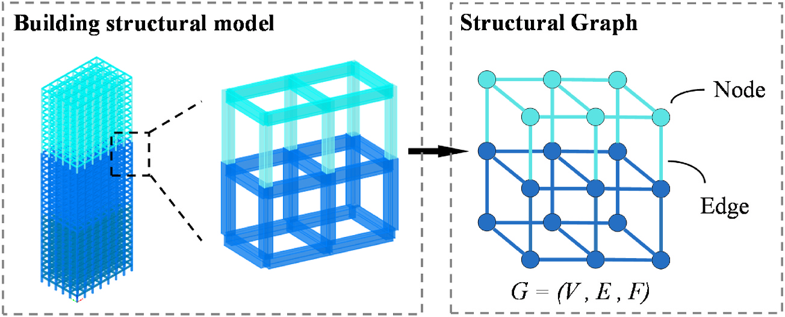

   **图 1** 建筑结构模型的结构图表示（不同颜色表示不同标准层）。

   图内文字：Building structural model＝建筑结构模型；Structural Graph＝结构图；Node＝节点；Edge＝边。

   符号：G=(V,E,F)＝由节点集合 V、边集合 E 及连接关系 F 构成的结构图。不同颜色仅表示不同标准层，图中抽取部分楼层进行示意。

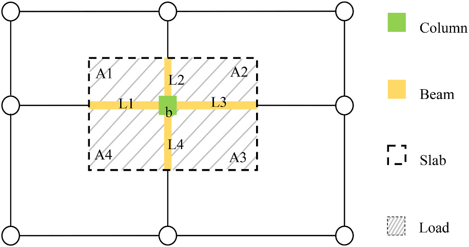

   **图 2** 节点质量分配。

   图例：Column＝柱（绿色）；Beam＝梁（黄色）；Slab＝楼板（虚线边界）；Load＝荷载（斜线阴影）。

   图内符号：A1、A2、A3、A4 为中心节点周围分配的楼板区域；L1、L2、L3、L4 为相邻梁的分配长度；b 为柱截面宽度。

高层建筑通常对风激励敏感，相比地震荷载，风荷载经常起关键控制作用 [34]。因此，除了节点坐标等特征，节点还包含风荷载信息。本研究基本风压为 :math:`0.45\,\mathrm{kN/m^2}` ，地貌类别为 B 类，依据荷载规范 GB 50009-2012 [35] 按式（2）计算楼层风荷载。为更好表示风荷载信息，将每层风荷载平均分配给该层节点。节点与边的具体特征向量见表 1 和表 2。

.. math::

   w_k=\beta_z\mu_s\mu_zw_0.\qquad (2)

其中， :math:`\beta_z` 为风振系数， :math:`\mu_s` 为体型系数， :math:`\mu_z` 为风压高度变化系数， :math:`w_0` 为基本风压。

除包含风荷载信息外，图还具有较强灵活性与可扩展性，可在节点和边两个层面进一步扩充、细化结构信息。因此，图的适用范围可扩展至不同尺度建筑结构与不同预测任务。

.. list-table:: 表 1 节点特征向量
   :header-rows: 1

   * - 特征
     - 定义
     - 单位
   * - F
     - 节点所在楼层数
     - 无
   * - X、Y、Z
     - 结构节点三维坐标
     - mm
   * - m
     - 结构节点等效质量
     - ton
   * - FWx
     - X 方向风荷载
     - N
   * - FWy
     - Y 方向风荷载
     - N

.. list-table:: 表 2 边特征向量
   :header-rows: 1

   * - 特征
     - 定义
     - 单位
   * - T
     - 梁为 0，柱为 1
     - 无
   * - b
     - 截面宽度
     - mm
   * - h
     - 截面高度
     - mm
   * - a
     - 截面面积 :math:`b\times h`
     - :math:`\mathrm{mm^2}`
   * - L
     - 构件长度
     - mm
   * - E
     - 弹性模量
     - MPa
   * - Ix
     - 关于主轴的截面二次矩
     - :math:`\mathrm{mm^4}`
   * - Iy
     - 关于次轴的截面二次矩
     - :math:`\mathrm{mm^4}`
   * - fc
     - 混凝土圆柱体抗压强度
     - :math:`\mathrm{N/mm^2}`

式（2）给出风压因子乘积，按受风面积作用后才能得到表 1 中以 N 表示的节点力；风压单位和节点力单位不能混用。

2.2 参数化建模与数据生成
~~~~~~~~~~~~~~~~~~~~~~~~

2.2.1 结构参数的建立与抽样
^^^^^^^^^^^^^^^^^^^^^^^^^^

设计真实高层或超高层建筑涉及极其复杂的参数体系，既包括整体结构类型、具体平面跨度、楼层数与高度，也包括构件材料、截面形状和尺寸。考虑全部可能结构配置非常困难。在风工程研究中，CAARC 标准高层建筑模型 [36–38] 已广泛用于研究高层建筑风效应。因此，本文专门关注钢筋混凝土框架结构，不改变结构类型，只改变跨度、柱距、层高和构件尺寸等结构特征。与多层建筑不同，高层或超高层建筑通常不具有不规则平面布置，其拓扑特征主要体现为平面跨度、层高和楼层数的变化。

为逐步开展研究，生成高层和超高层两组数据集。首先定义高层建筑的参数范围，包括跨度、层高、楼层数和混凝土材料等级等，并将标准层数量设为 3。高层建筑数据集用于研究结构高度与楼层数的影响，参数详见表 3。随后，根据在高层建筑结构数据集 1 上训练时识别的规律，建立超高层建筑参数范围，见表 4。标准层数量设为 5–7，顶部两个标准层采用 C60 混凝土，其余采用 C80。

即使尽可能考虑这些变量的随机组合，结构组合类型数量仍达数千万。较大数据集虽然增加多样性，也消耗大量计算资源。此外，某些随机组合不符合实际建造要求，例如底柱截面过小，或上部构件尺寸大于下部。因此，适当调整部分参数取值步长，并采用基于设计规范的抽样方法。本研究具体措施包括：上部柱尺寸小于下部柱尺寸，梁宽高比小于 3，楼层长宽比小于 2，以及对高度超过 100 m 的结构，保证底柱宽度大于 800 mm。对于超高层建筑参数，进一步规定结构开间长度大于进深长度。在满足这些条件的参数中，抽取 998 组高层建筑结构数据集 1，以及 300 组超高层建筑结构数据集 2。

.. list-table:: 表 3 高层建筑参数汇总
   :header-rows: 1

   * - 参数
     - 最小值
     - 最大值
     - 步长
   * - 柱距（mm）
     - 3600
     - 7200
     - 3000
   * - 跨数
     - 5
     - 10
     - 1
   * - 层高（mm）
     - 3300
     - 5100
     - 3000
   * - 楼层数
     - 21
     - 33
     - 3
   * - 梁宽（mm）
     - 200
     - 550
     - 50
   * - 梁高（mm）
     - 400
     - 1000
     - 50
   * - 柱宽（mm）
     - 400
     - 1000
     - 100
   * - 混凝土等级
     - C30
     - C60
     - 10
   * - 建筑高度（m）
     - 69.3
     - 168.3
     - 未列

.. list-table:: 表 4 超高层建筑参数汇总
   :header-rows: 1

   * - 参数
     - 最小值
     - 最大值
     - 步长
   * - 柱距（mm）
     - 5100
     - 6900
     - 3000
   * - 长边跨数
     - 6
     - 9
     - 1
   * - 短边跨数
     - 4
     - 7
     - 1
   * - 层高（mm）
     - 3000
     - 3600
     - 3000
   * - 楼层数
     - 45
     - 63
     - 未列
   * - 梁宽（mm）
     - 400
     - 600
     - 50
   * - 梁高（mm）
     - 800
     - 1000
     - 50
   * - 柱宽（mm）
     - 600
     - 1200
     - 100
   * - 混凝土等级（m，原表标签）
     - 135
     - 226.8
     - 未列

原表说明：表 3、4 中若干步长原印为 3000，表 4 最后一行原标为“Concrete grade (m)”而数值为 135–226.8；此处不按推测改动参数或标签。

2.2.2 参数化模型
^^^^^^^^^^^^^^^^

虽然许多现有商业建模软件能够通过构件模块创建结构模型，但即使经验丰富的结构工程师，也难以快速创建并分析大量建筑有限元模型。此外，重复建模效率低、耗时长。对此，一种有效方案是参数化建模：以整层框架为基础，通过程序自动创建结构模型。采用该方法，工程师只需输入或调整少量参数，即可高效、简便地创建或修改模型。

参数化建模主要通过结构设计软件 YJK 的组成部分 YJK-GAMA [39] 实现。需要强调，YJK 在中国结构设计领域占有较大市场份额，是经过市场检验的成熟商业结构分析软件。参数化建模包括数据读取、参数化、模块化和模型生成四个主要部分，见图 3。数据读取负责读取和整理第 2.2.1 节参数表；参数化将坐标系、楼层信息、材料与构件类型等数据转为可调参数，以适应不同输入修改；模块化整合全部独立构件，并划分为标准层模块和构件模块；最后组装这些模块，生成结构模型。

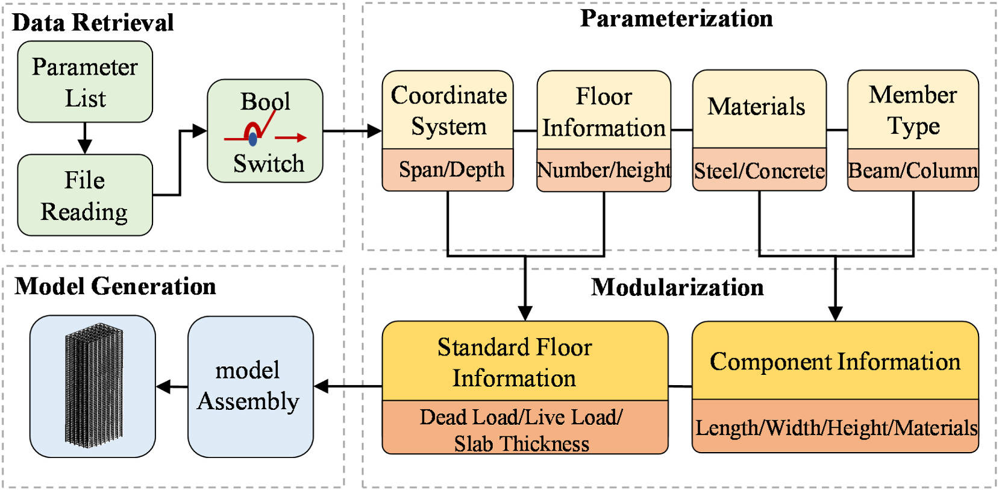

   **图 3** 参数化建模流程。

   四个模块：Data Retrieval＝数据读取；Parameterization＝参数化；Modularization＝模块化；Model Generation＝模型生成。

   完整流程标签：Parameter List＝参数列表；File Reading＝文件读取；Bool Switch＝布尔开关；Coordinate System＝坐标系；Span/Depth＝跨度/进深；Floor Information＝楼层信息；Number/height＝层数/层高；Materials＝材料；Steel/Concrete＝钢材/混凝土；Member Type＝构件类型；Beam/Column＝梁/柱；Standard Floor Information＝标准层信息；Dead Load/Live Load/Slab Thickness＝恒荷载/活荷载/楼板厚度；Component Information＝构件信息；Length/Width/Height/Materials＝长度/宽度/高度/材料；model Assembly＝模型组装。

2.2.3 数据集生成与增强
^^^^^^^^^^^^^^^^^^^^^^

数据集生成涉及数据整合与转换，需要参数化建模和有限元分析相结合，见图 4。首先，通过参数化建模生成大量结构模型，利用 YJK-GAMA 按表 3、4 参数完成结构参数化模型。随后将其转为有限元模型，并使用参考 SAP2000 Open API 接口 [40–42] 编写的自动分析程序进行分析。有限元分析得到结构响应，包括节点位移和结构自振周期。将所得响应与结构拓扑信息整合，导出为 CSV 文件。此时，可以修改 CSV 中按式（2）计算的风荷载值，以更新荷载信息。最后，通过数据转换程序将综合数据转为结构图数据集。数据转换程序基于图神经网络框架 PyTorch Geometric（PYG）[43] 编写。

最初生成包含 998 个高层建筑结构的数据集。为进一步扩充数据，将基本风压 :math:`w_0` 调整为 :math:`0.1\,\mathrm{kN/m^2}` 和 :math:`0.75\,\mathrm{kN/m^2}` ，考虑不同风荷载情景，使数据数量增加至 2994。然而，当结构楼层数超出已有数据范围时，预测往往不准确，偏差还会随超出楼层数的增加而增大；详见第 3.3 节。

为提高 GNN 对超高层建筑的理解，根据超高层建筑参数表生成附加数据集。降低层高并增加楼层数，以突出楼层特征。具体而言，标准层数量为 5–7，总楼层数为 45–63。从该参数集合选取 300 种超高层建筑拓扑与基础尺寸。为进一步增强数据，采用构件尺寸变化策略，使结构尺寸随楼层高度规律变化，包括小幅缩减（如 50 mm）和较大缩减（如 100 mm）。为每个结构额外生成三种尺寸情景，使数据集扩充至 1200 个结构。本研究因此使用含 4194 个高层与超高层建筑结构的综合数据集。图 5 展示其中节点数和边数的分布，直观反映高层建筑结构数据的复杂性。

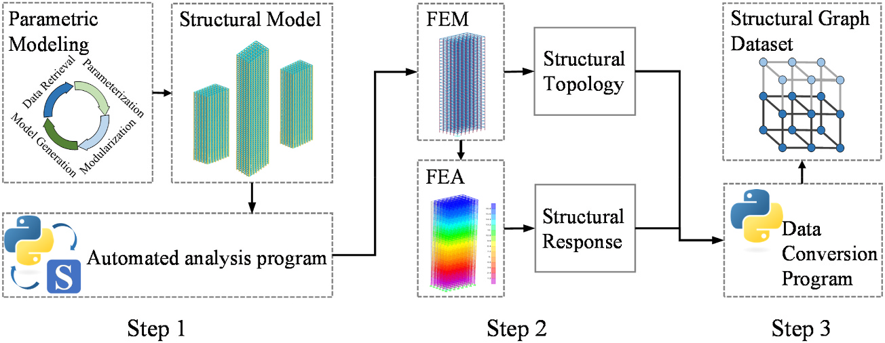

   **图 4** 数据生成。

   流程标签：Parametric Modeling＝参数化建模；Data Retrieval＝数据读取；Parameterization＝参数化；Modularization＝模块化；Model Generation＝模型生成；Structural Model＝结构模型；Automated analysis program＝自动分析程序；FEM＝有限元模型；FEA＝有限元分析；Structural Topology＝结构拓扑；Structural Response＝结构响应；Data Conversion Program＝数据转换程序；Structural Graph Dataset＝结构图数据集；Step 1、Step 2、Step 3＝步骤 1、2、3。

   有限元结果缩略图旁的细小色标数值在原图中无法可靠辨认。

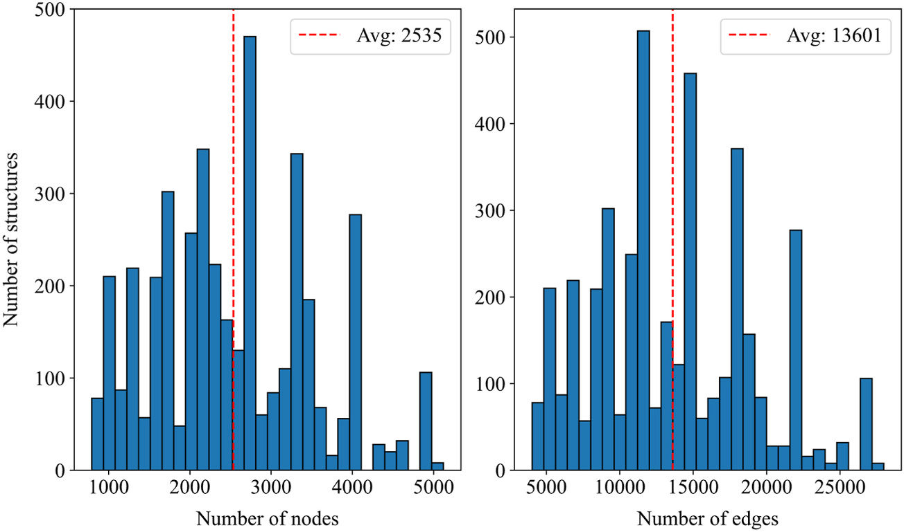

   **图 5** 整个数据集中节点数与边数的直方图。

   左横轴 Number of nodes＝节点数；右横轴 Number of edges＝边数；纵轴 Number of structures＝结构数量。

   图例 Avg: 2535＝平均节点数 2535；Avg: 13601＝平均边数 13601；红色竖虚线为均值。

   数值轴为计数，无物理单位。

这些数量包括相同基础结构在风压或尺寸改变后的增强样本，不表示存在 4194 种独立拓扑。原文第 3 节另写 2944 组高层数据，与此处 2994 不同，差异保留。

2.3 TBGNN 模型
~~~~~~~~~~~~~~~~

2.3.1 TBGNN 架构
^^^^^^^^^^^^^^^^

GNN 是作用于图数据的神经网络，通过不同方式学习节点、边及连接关系的特征，捕获局部或全局性质，预测节点信息。考虑高层建筑结构复杂性和设计任务要求，本文提出称为 TBGNN 的新 GNN 架构，其消息传递层基于 StructGNN，见式（3）、（4）。TBGNN 由编码器、消息传递层、楼层特征融合层和解码器组成，见图 6。消息传递包括消息聚合与节点更新两步。消息聚合阶段，线性层结合节点自身、邻居节点和边的信息，计算其平均值以获得新的聚合信息；随后，将该聚合信息与当前节点信息进行线性更新。

.. math::

   \mathrm{SLP}=\sum_{k=1}^{N}w_kx_k+b_k.\qquad (3)

.. math::

   x_i^k=\mathrm{SLP}_{\mathrm{update}}\left(x_i^{k-1}
   +\frac{1}{N}\sum_{j\in N_{(i)}}^{N}\mathrm{SLP}_{\mathrm{message}}
   (x_i^{k-1},x_j^{k-1},e_{ij})\right).\qquad (4)

其中， :math:`w_k` 为可训练权重矩阵， :math:`b_k` 为可训练偏置； :math:`x_i^k` 为第 :math:`k` 个消息传递层中节点 :math:`i` 的嵌入向量；原文记 :math:`x_0^k` 为初始节点特征。 :math:`\mathrm{SLP}_{\mathrm{update}}` 和 :math:`\mathrm{SLP}_{\mathrm{message}}` 为线性单层感知机，用于特征信息传播与更新； :math:`N_{(i)}` 表示节点 :math:`i` 的邻居集合， :math:`e_{i,j}` 为边特征。

节点经过 :math:`L` 层信息传递和更新后，由特征融合层处理。楼层特征融合原理在第 2.3.2 节说明。融合层收集属于同一楼层的节点特征并求平均，形成单个节点，见式（5）。该节点表示整个楼层的综合特征，称为楼层节点。随后，对节点特征与楼层节点特征加权融合，见式（6）。

.. math::

   \xi_i=\frac{1}{N_i}\sum_{i\in F_i}^{N_i}x_i^{(L)}.\qquad (5)

.. math::

   x_i^{(F)}=x_i^{(L)}+\alpha_i\xi_i.\qquad (6)

其中， :math:`F_i` 表示节点所属楼层， :math:`N_i` 为第 :math:`i` 层节点数， :math:`x_i^{(L)}` 为经过第 :math:`L` 个消息传递层后第 :math:`i` 层节点的最终嵌入向量， :math:`\xi_i` 为第 :math:`i` 层楼层节点向量， :math:`\alpha_i` 为该楼层节点的可学习加权参数， :math:`x_i^{(F)}` 为楼层内融合后的节点。原文式（5）的求和下标与楼层下标均使用 :math:`i` ，此处保持原排式。

位移、层间位移和自振周期解码器均采用多层感知机（MLP），将嵌入向量 :math:`x_i^{(F)}` 转为归一化节点位移和自振周期值。需要指出，楼层位移与层间位移取该层各节点预测值的最大值，见式（7）、（8）；结构自振周期取各层节点预测值的平均值，见式（9）。

.. math::

   \Delta_i=\max\left(\mathrm{MLP}_{\mathrm{displacement}}(x_i^{(F)})\right).\qquad (7)

.. math::

   \delta_i=\max\left(\mathrm{MLP}_{\text{inter-story drift}}(x_i^{(F)})\right).\qquad (8)

.. math::

   n_1=\operatorname{mean}\left(\mathrm{MLP}_{\mathrm{period}}(x_i^{(F)})\right).\qquad (9)

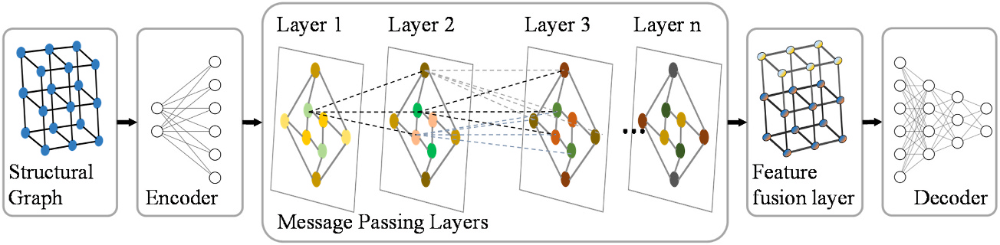

   **图 6** TBGNN 架构。

   从左至右：Structural Graph＝结构图；Encoder＝编码器；Message Passing Layers＝消息传递层；Layer 1、Layer 2、Layer 3、Layer n＝第 1、2、3、n 层；Feature fusion layer＝特征融合层；Decoder＝解码器。

2.3.2 楼层特征增强策略
^^^^^^^^^^^^^^^^^^^^^^

处理高层建筑结构图时，需要构建复杂、较深的神经网络以保证有效信息传递。例如，60 层结构至少需要 61 个神经网络层 [32]，消耗大量计算资源。另一种方法是通过池化，将同层全部节点合并为一个楼层节点，以降低输出向量维度。然而，同一标准层范围内不同楼层差异很小，可区分的局部特征有限，直接池化会严重丢失重要局部特征。采用这两种方法时，难以平衡模型复杂性和预测效果。

为优化高层建筑结构图中的信息传递，提出结合楼层特征融合的方法：先按楼层池化，再融合特征，见图 7。与蛋白质等其他结构不同，建筑属于沿高度扩展且楼层区分明显的结构。为充分利用这一性质，使神经网络理解楼层概念，首先通过多层消息传递更新结构图，然后分层池化，即每层全部节点经过平均池化合并为一个楼层节点。最后，对楼层节点加权，并分别与该层各节点融合特征。该策略最终形成特征融合层，加入 TBGNN 架构。

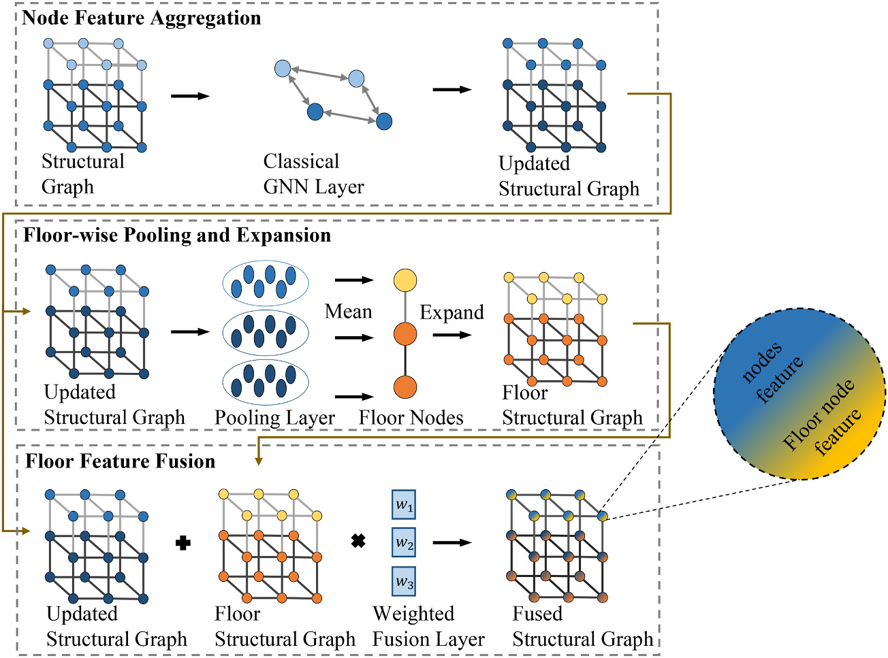

   **图 7** 楼层节点与节点的特征融合。

   三级流程：Node Feature Aggregation＝节点特征聚合；Floor-wise Pooling and Expansion＝按楼层池化与展开；Floor Feature Fusion＝楼层特征融合。

   图内标签：Structural Graph＝结构图；Classical GNN Layer＝经典 GNN 层；Updated Structural Graph＝更新后的结构图；Pooling Layer＝池化层；Mean＝取平均；Floor Nodes＝楼层节点；Expand＝展开；Floor Structural Graph＝楼层结构图；Weighted Fusion Layer＝加权融合层；Fused Structural Graph＝融合后的结构图；nodes feature＝节点特征；Floor node feature＝楼层节点特征。

   w1、w2、w3 表示对应楼层的融合权重。

2.3.3 工程知识损失函数
^^^^^^^^^^^^^^^^^^^^^^

在模型设计与训练中，仅使用式（10）的 MAE 损失不能满足工程应用要求。通过修改损失函数，将工程知识引入模型设计与训练 [44,45]。

结构初步设计或优化通常关注最不利情景，如每层最大位移。因此，建立楼层最大值损失函数，见式（11）。此外，同一结构中随着楼层增加，位移幅值也增大，使结构位移曲线呈上升趋势。针对这一工程现象，构建位移趋势损失函数，见式（12）。将 MAE 损失 :math:`\mathrm{Loss}_{\mathrm{MAE}}` 、楼层最大值损失 :math:`\mathrm{Loss}_{\mathrm{MFD}}` 和位移趋势损失 :math:`\mathrm{Loss}_{\mathrm{TFD}}` 组合，得到结构楼层工程知识损失 :math:`\mathrm{Loss}_{\mathrm{EKSF}}` ，见式（13）。

.. math::

   \mathrm{Loss}_{\mathrm{MAE}}=\sum_j^m\sum_{i\in\{\mathrm{Nodes}\}}^n
   |\mathrm{truth}_{j,i}-\mathrm{pred}_{j,i}|.\qquad (10)

.. math::

   \mathrm{Loss}_{\mathrm{MFD}}=\sum_j^{m-1}\sum_{i\in\{\mathrm{Floors}\}}^n
   |\mathrm{truth}_{j,i}^{\max}-\mathrm{pred}_{j,i}^{\max}|.\qquad (11)

.. math::

   \mathrm{Loss}_{\mathrm{TFD}}=\sum_j^{m-1}\sum_{i\in\{\mathrm{Floors}\}}^n
   |(\mathrm{truth}_{j,i+1}^{\max}-\mathrm{truth}_{j,i}^{\max})
   -(\mathrm{pred}_{j,i+1}^{\max}-\mathrm{pred}_{j,i}^{\max})|.\qquad (12)

.. math::

   \mathrm{Loss}_{\mathrm{EKSF}}=\mathrm{Loss}_N+
   \lambda_{\mathrm{MFD}}\mathrm{Loss}_{\mathrm{MFD}}+
   \lambda_{\mathrm{TFD}}\mathrm{Loss}_{\mathrm{TFD}}.\qquad (13)

其中， :math:`\lambda_{\mathrm{MFD}}` 和 :math:`\lambda_{\mathrm{TFD}}` 分别为相应损失权重， :math:`\mathrm{truth}_{j,i}` 为第 :math:`i` 个节点第 :math:`j` 个特征的真值， :math:`\mathrm{pred}_{j,i}` 为对应预测值。

原文排式说明：式（10）以“MAE”命名，但印为绝对误差求和，未给平均因子；式（13）第一项印为 :math:`\mathrm{Loss}_N` ，前文则称 :math:`\mathrm{Loss}_{\mathrm{MAE}}` 。此处保留这些排式，不补造定义。

2.3.4 从低楼层结构向高楼层结构迁移学习
^^^^^^^^^^^^^^^^^^^^^^^^^^^^^^^^^^^^^^^

迁移学习（TL）作为高效学习范式，已在混凝土裂缝检测 [46]、建筑地震易损性推导 [47] 等领域展示较强应用潜力。使用 GNN 预测结构响应时，同时考虑高层和超高层数据集需要较多计算资源，并延长训练时间。利用迁移学习，可将高层建筑提取的有用特征用于训练超高层 GNN，从而有效利用已有知识，而不是从零开始学习。

此外，当待预测结构楼层数超出数据集范围时，TBGNN 预测会偏离真值，详见第 3.3 节。因此，提出从低楼层结构向高楼层结构迁移特征的方法，见图 8。先以高层建筑数据集预训练 TBGNN，再提取各层权重与偏置等参数，作为新 TBGNN 的初始参数，然后在超高层数据集上继续训练。迁移学习后的高层建筑图神经网络 TBGNN-TL 能够准确捕获与楼层数相关的特征，形成更全面的特征空间。

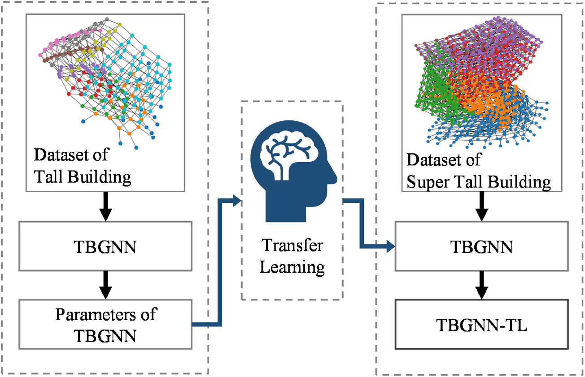

   **图 8** 面向超高层建筑的迁移学习。

   图内标签：Dataset of Tall Building＝高层建筑数据集；Parameters of TBGNN＝TBGNN 模型参数；Transfer Learning＝迁移学习；Dataset of Super Tall Building＝超高层建筑数据集；TBGNN＝高层建筑图神经网络；TBGNN-TL＝结合迁移学习的高层建筑图神经网络。

3 结果与讨论
--------------

首先在原文此处所称 2944 组高层建筑数据上训练 TBGNN。编码器为具有 256 个单元的单层感知机，消息传递层共 6 层，每层 256 个单元；解码器为 5 层 MLP，各层单元数依次为 256、128、64、32 和 1，采用 ReLU [48] 激活函数。设计的 TBGNN 用于预测各楼层 X、Y 两方向最大位移与层间位移。此外，结构舒适性通常以峰值加速度衡量；结构优化过程中，顶部加速度最大值可以转化为一阶自振频率最小值 [49–52]。因此，将一阶自振周期作为第五项预测输出。具体节点目标输出见表 5。

TBGNN 在 NVIDIA GeForce RTX4090 GPU 上训练。数据集的 80% 用于训练，其余 20% 用于验证。节点与边特征归一化至 0–1 范围。训练采用原文此处写作 :math:`\mathrm{Loss}_{\mathrm{ENSF}}` 的损失函数，Accuracy 按式（14）计算。使用 Adam 优化器 [53]，初始学习率为 :math:`1.0\times10^{-4}` ，420 轮后降低至 :math:`1.0\times10^{-5}` ，共训练 500 轮。

.. math::

   \mathrm{Accuracy}=1-\frac{1}{m n}\sum_{j=1}^{m}\sum_{i=1}^{n}
   \left|\frac{\mathrm{truth}_{j,i}-\mathrm{pred}_{j,i}}{\mathrm{truth}_{j,i}}\right|.\qquad (14)

其中，原文将 :math:`m` 描述为第 :math:`m` 层，将 :math:`n` 描述为该层第 :math:`n` 个节点。

.. list-table:: 表 5 节点目标输出
   :header-rows: 1

   * - 输出
     - 定义
     - 单位
   * - :math:`\Delta_{wx}`
     - X 方向位移
     - mm
   * - :math:`\Delta_{wy}`
     - Y 方向位移
     - mm
   * - :math:`\delta_{wx}`
     - X 方向层间位移
     - mm
   * - :math:`\delta_{wy}`
     - Y 方向层间位移
     - mm
   * - :math:`n_1`
     - 一阶自振周期（原表名称）
     - rad/s（原表单位）

原文口径说明：这里的 2944 与第 2.2.3 节的 2994 不一致，损失函数缩写 ENSF 与前文 EKSF 也不同，均保留来源。式（14）是 1 减去平均绝对相对误差，不是分类准确率。表 5 第五项名称为“周期”，单位却为 rad/s；本文不擅自把它改成频率或另换单位。原文未说明训练/验证是否按独立拓扑分组切分，不能据 80%/20% 比例排除同拓扑增强样本交叉分配的可能。

3.1 楼层特征融合层的改进效果
~~~~~~~~~~~~~~~~~~~~~~~~~~~~

本节验证楼层特征融合层的改进效果。将不含楼层特征融合层的 GNN 与包含该层的 TBGNN 比较。此外，为进一步检验楼层特征融合层对高层建筑结构数据的适用性，还评价 GAT [54] 与 GINE [55] 两种经典 GNN，分别比较有无该融合层的情形。所有模型均以高层建筑数据集训练，以验证集各层位移和层间位移作为测试数据，共计 66084 个预测值；各模型的训练参数和训练轮数保持一致。

训练完成后，验证集回归表现见图 9。图 9（a）、（b）、（c）展示未加入楼层特征融合层的 TBGNN、GAT 和 GINE 的预测效果，图 9（d）、（e）、（f）展示加入后的对应效果。改进后的验证集结果表明，加入楼层特征融合层后，模型能够更好预测结构响应，并更容易学习结构性质。尤其是 TBGNN 改进明显，原文将验证集整体平均 Accuracy 概括为从 84% 提升至 92%，详见表 6。

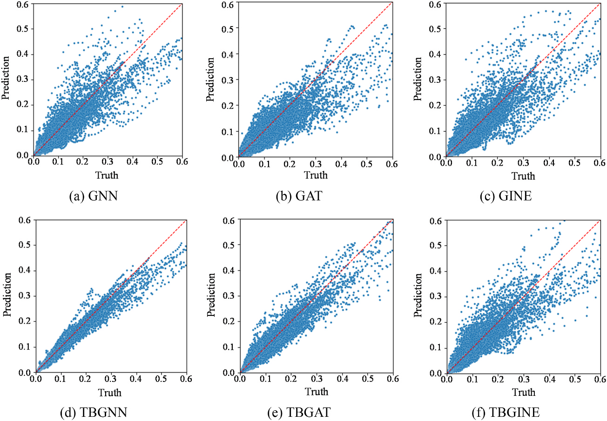

   **图 9** 验证集上的回归表现：(a)、(b)、(c) 分别为 GNN、GAT、GINE 对 X、Y 方向位移和层间位移的预测；(d)、(e)、(f) 分别为 TBGNN、TBGAT、TBGINE 的相应预测。TB 表示增加了楼层特征融合层。

   六个面板：(a) GNN；(b) GAT；(c) GINE；(d) TBGNN；(e) TBGAT；(f) TBGINE。

   全部横轴 Truth＝真实值；纵轴 Prediction＝预测值。红色斜虚线为预测值等于真实值的参照线；两轴刻度均为 0.0 至 0.6，原图未标物理单位。面板 (a) 的原图及图题均标 GNN。

.. list-table:: 表 6 GNN 与 TBGNN 在验证集上预测结构响应的 Accuracy 比较
   :header-rows: 1

   * - 模型
     - 楼层特征融合层
     - :math:`\Delta_{wx}`
     - :math:`\Delta_{wy}`
     - :math:`\delta_{wx}`
     - :math:`\delta_{wy}`
     - :math:`n_1`
   * - GNN
     - 无
     - 0.8370
     - 0.8228
     - 0.8212
     - 0.8073
     - 0.9283
   * - TBGNN
     - 有
     - 0.9196
     - 0.9213
     - 0.9172
     - 0.9157
     - 0.9810

原文图文说明：未融合的第一种模型在上述正文中仍称 TBGNN，图 9 图题和表 6 则称 GNN，分别保留。表 6 五项的算术平均数为 84.332% 与 93.096%，不完全等于正文约 84% 至 92% 的概括；各分项结果以原表为准。

3.2 工程知识损失函数的影响
~~~~~~~~~~~~~~~~~~~~~~~~~~

分别使用工程知识损失和 MAE 损失指导 TBGNN 训练。选取 30 层高层建筑，展示嵌入工程知识对预测的影响。图 10 给出真实与预测的位移、层间位移曲线；位移按 73.62 mm、层间位移按 3.48 mm 归一化。图中红线为楼层位移与层间位移真值，紫线为使用 :math:`\mathrm{Loss}_{\mathrm{MAE}}` 训练模型的预测，蓝线为使用 :math:`\mathrm{Loss}_{\mathrm{EKSF}}` 训练模型的预测。

可以看出，预测曲线在真实曲线附近波动。这是因为 MAE 损失仅保证总体绝对误差最小，却未能学习实际工程变化趋势。该问题在层间位移预测中尤为明显，因为真实波动对应结构尺寸的显著变化。即使误差较小，预测曲线的不规则波动仍妨碍其用于设计评价或优化。相比之下，嵌入工程知识的 TBGNN 能够更好学习真实位移曲线。

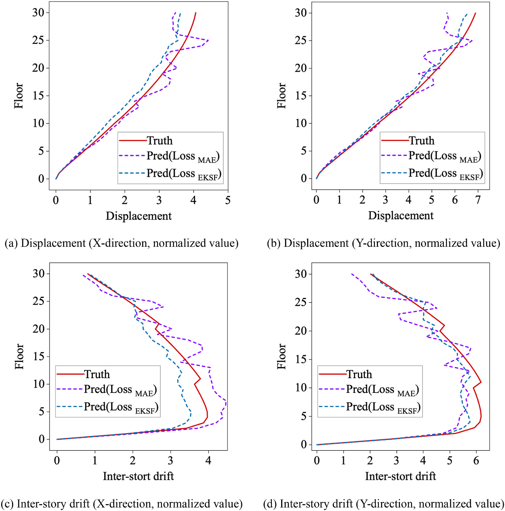

   **图 10** 嵌入与未嵌入工程知识时的位移和层间位移曲线比较。

   面板：(a) Displacement (X-direction, normalized value)＝X 方向位移（归一化值）；(b) Displacement (Y-direction, normalized value)＝Y 方向位移（归一化值）；(c) Inter-story drift (X-direction, normalized value)＝X 方向层间位移（归一化值）；(d) Inter-story drift (Y-direction, normalized value)＝Y 方向层间位移（归一化值）。

   纵轴 Floor＝楼层；横轴 Displacement＝位移，Inter-stort drift＝层间位移（源图 (c)、(d) 横轴将 story 印为 stort）。

   图例：Truth＝真实值（红色实线）；Pred(Loss_MAE)＝以平均绝对误差损失训练的预测值（紫色虚线）；Pred(Loss_EKSF)＝以工程知识损失训练的预测值（蓝色虚线）。

   归一化尺度按正文保留：位移 73.62 mm，层间位移 3.48 mm。源图归一化数值中存在大于 1 的值。

3.3 楼层数的主导作用
~~~~~~~~~~~~~~~~~~~~

本节用不同楼层数的高层建筑进行验证，评价 TBGNN 对楼层数的敏感性。结构平面见图 11（a）。标准层数量设为 3，总楼层数分别为 30、33、36 和 39；30 层和 33 层位于高层数据集范围内，36 层和 39 层超出最大楼层数。基本风压为 :math:`0.60\,\mathrm{kN/m^2}` 。结构风向及标准层构件尺寸见图 11（b）、（c）。

比较 30、36 和 39 层建筑预测，以展示模型对楼层数的敏感性；原文此句将 TBGNN 写为 TNGNN。此外，为进一步判别结构高度与层数的影响，选取层高 5400 mm 的 33 层结构和层高 3300 mm 的 39 层结构，与 33 层结构比较。原文随后称 39 层与 33 层结构具有相同高度。

TBGNN 对不同楼层数结构的位移与层间位移预测见图 12、13，位移按 73.62 mm、层间位移按 3.48 mm 归一化。当测试楼层数位于数据集范围内，即 30 层和 33 层时，模型预测优秀，各项 Accuracy 均超过 90%。然而，当楼层数超出数据集范围，Accuracy 降低，预测误差随超出楼层数进一步增加而逐渐增大。

比较同高但层数不同的两个结构可见，图 14（a）（c）（d）（f）和图 15（a）（c）（d）（f）中，尽管高度位于数据范围内，当层数超出一定阈值时，预测仍偏离真值。相反，如图 14（a）（b）（d）（e）和图 15（a）（b）（d）（e）所示，33 层结构不论层高是否在数据范围内，都与真实曲线很好吻合。这证实，相对于层高，楼层数具有重要影响，是模型表现的主要决定因素。在进一步将 GNN 用于超高层结构数据的研究中，楼层数应作为重要指标。需要注意，这与通常按高度区分结构类型的认识不同。因此，在使用高层建筑结构数据训练和应用 GNN 时，应更加重视楼层数。

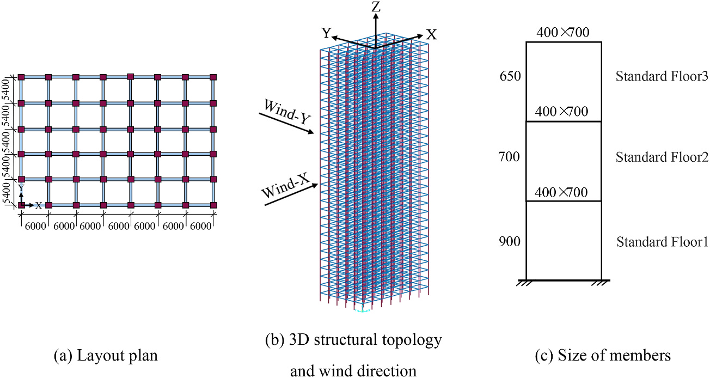

   **图 11** 结构信息。

   面板：(a) Layout plan＝平面布置；(b) 3D structural topology and wind direction＝三维结构拓扑与风向；(c) Size of members＝构件尺寸。

   图内标签：Wind-X＝X 向风；Wind-Y＝Y 向风；Standard Floor1、Standard Floor2、Standard Floor3＝标准层 1、2、3；X、Y、Z 为空间坐标方向。

   尺寸：平面 X 向各跨 6000，Y 向各跨 5400；标准层 1、2、3 的柱宽自下而上为 900、700、650；梁截面均标 400×700。原图未单列单位，结合正文尺寸单位为 mm；

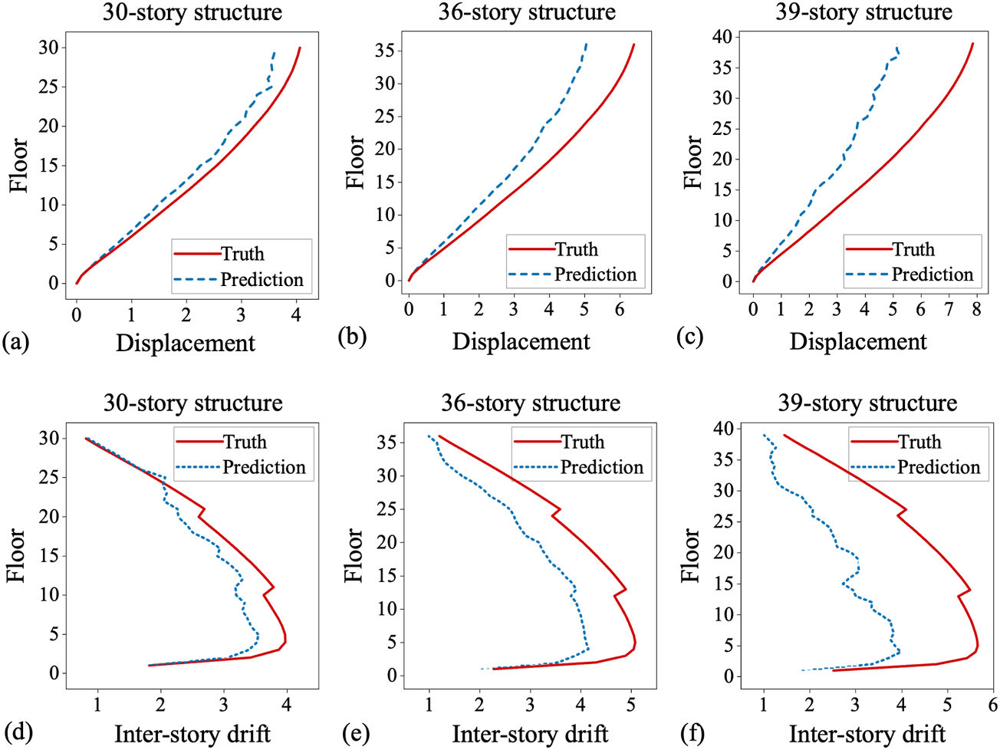

   **图 12** 不同层数下预测值与真实值的比较（X 方向，位移和层间位移均为归一化值）。

   面板对应：(a)、(d) 30-story structure＝30 层结构；(b)、(e) 36-story structure＝36 层结构；(c)、(f) 39-story structure＝39 层结构。

   上排横轴 Displacement＝位移；下排横轴 Inter-story drift＝层间位移；纵轴 Floor＝楼层。

   图例 Truth＝真实值（红色实线）；Prediction＝预测值（蓝色虚线/点线）。

   位移和层间位移尺度分别为 73.62 mm 与 3.48 mm。图中展示 30、36、39 层，正文另有 33 层情景。

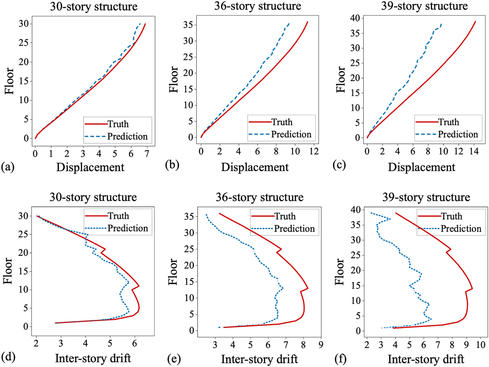

   **图 13** 不同层数下预测值与真实值的比较（Y 方向，位移和层间位移均为归一化值）。

   面板对应：(a)、(d) 30-story structure＝30 层结构；(b)、(e) 36-story structure＝36 层结构；(c)、(f) 39-story structure＝39 层结构。

   上排横轴 Displacement＝位移；下排横轴 Inter-story drift＝层间位移；纵轴 Floor＝楼层。

   图例 Truth＝真实值（红色实线）；Prediction＝预测值（蓝色虚线/点线）。

   位移和层间位移尺度分别为 73.62 mm 与 3.48 mm。

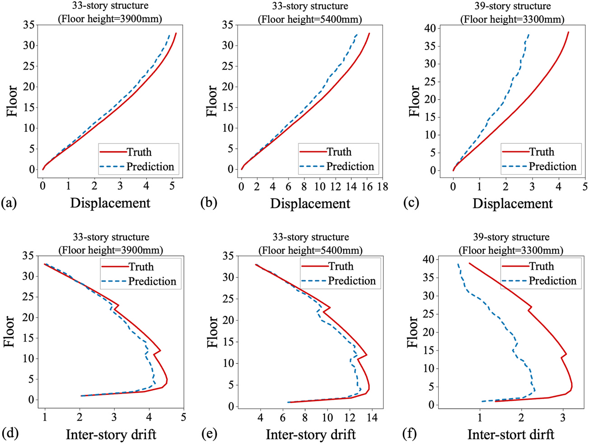

   **图 14** 相同高度下预测值与真实值的比较（X 方向，位移和层间位移均为归一化值）。

   面板标题：(a)、(d) 33-story structure (Floor height=3900mm)＝33 层结构（层高 3900 mm）；(b)、(e) 33-story structure (Floor height=5400mm)＝33 层结构（层高 5400 mm）；(c)、(f) 39-story structure (Floor height=3300mm)＝39 层结构（层高 3300 mm）。

   上排横轴 Displacement＝位移；下排横轴 Inter-story drift＝层间位移；纵轴 Floor＝楼层；图例 Truth＝真实值（红色实线），Prediction＝预测值（蓝色虚线）。

   译注：“相同高度”为原图题，实际仅 33×3900 mm 与 39×3300 mm 两组高度相同（均 128.7 m）；33×5400 mm 组高度为 178.2 m，作为层高变化对照，三组并非全部等高。

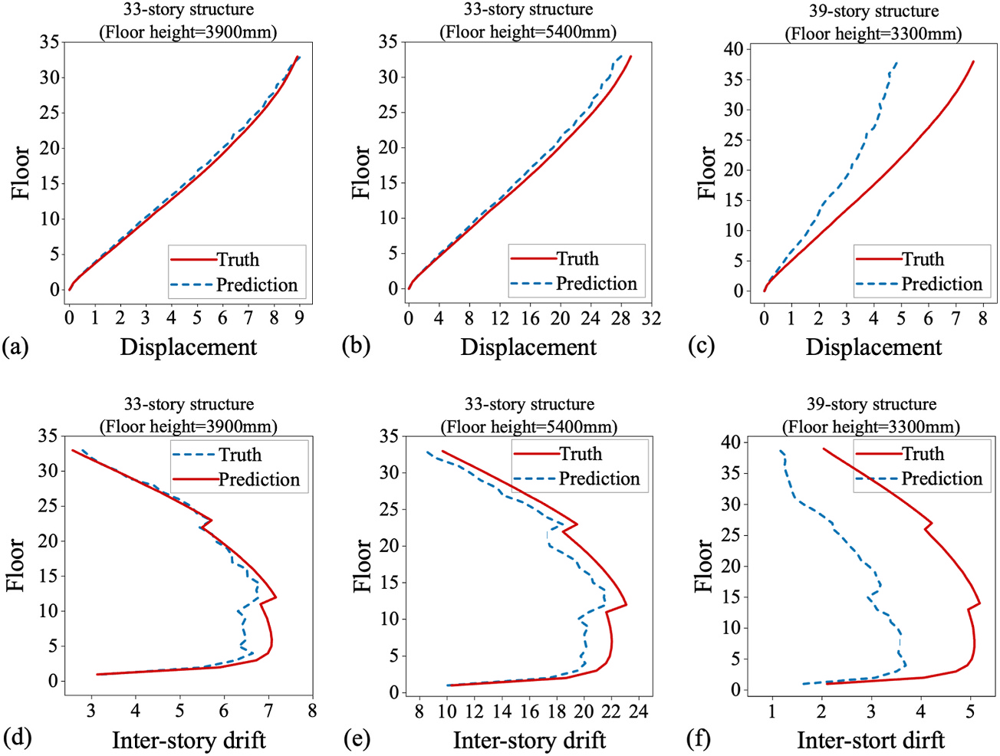

   **图 15** 相同高度下预测值与真实值的比较（Y 方向，位移和层间位移均为归一化值）。

   面板标题：(a)、(d) 33-story structure (Floor height=3900mm)＝33 层结构（层高 3900 mm）；(b)、(e) 33-story structure (Floor height=5400mm)＝33 层结构（层高 5400 mm）；(c)、(f) 39-story structure (Floor height=3300mm)＝39 层结构（层高 3300 mm）。

   上排横轴 Displacement＝位移；下排横轴 Inter-story drift＝层间位移；纵轴 Floor＝楼层。

   重要源图矛盾：除 (d) 外各面板的图例均为红色实线 Truth＝真实值、蓝色虚线 Prediction＝预测值；面板 (d) 原图图例相反，为蓝色虚线 Truth＝真实值、红色实线 Prediction＝预测值。因此该面板的图例与其余面板存在不一致。

   “相同高度”的适用范围同图 14，不是三组全部等高。

3.4 对风荷载的敏感性
~~~~~~~~~~~~~~~~~~~~

TBGNN 对风荷载的敏感性体现为预测不同基本风压下结构响应的能力。以第 3.3 节 33 层结构为例，图 16 以不同颜色展示不同基本风压下的位移和层间位移；分别按 73.62 mm 和 3.48 mm 归一化。不同基本风压下的预测值与真实值高度吻合，表明 TBGNN 能够充分学习荷载与位移的关系，并随荷载变化作出适当响应。考虑风荷载变化对结构获得更优形式具有更重要作用。除风荷载外，结构设计与优化还需考虑地震及不同荷载组合。因此，模型对荷载的敏感性对于设计与优化的有效性至关重要。

此外，尽管加入工程知识，预测值仍倾向低于实际值；原文将这一结果描述为比高于实际值更好。在实际工程中，结构设计通常需要一定裕度以保证安全。因此，参考这一做法，模型在位移预测中引入安全系数 :math:`\gamma` ，本研究选取 1.05。

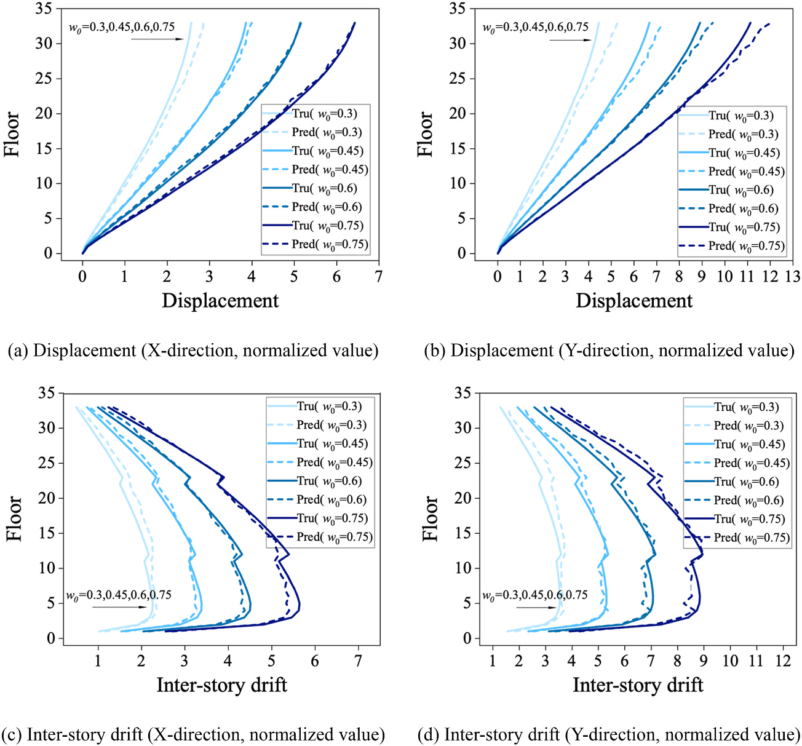

   **图 16** 不同基本风压下的位移和层间位移。

   面板：(a) Displacement (X-direction, normalized value)＝X 方向位移（归一化值）；(b) Displacement (Y-direction, normalized value)＝Y 方向位移（归一化值）；(c) Inter-story drift (X-direction, normalized value)＝X 方向层间位移（归一化值）；(d) Inter-story drift (Y-direction, normalized value)＝Y 方向层间位移（归一化值）。

   纵轴 Floor＝楼层；横轴 Displacement＝位移，Inter-story drift＝层间位移。

   图内箭头 w0=0.3,0.45,0.6,0.75＝基本风压依次为 0.30、0.45、0.60、0.75 kN/m²。图例由浅蓝至深蓝分别对应四个风压；Tru(w0=…)＝相应基本风压的真实值（实线），Pred(w0=…)＝相应基本风压的预测值（虚线）。

   位移和层间位移尺度分别为 73.62 mm 与 3.48 mm。

此处“更好”和系数 1.05 均为原文叙述及本算例选择，不构成低估结构响应是安全的结论，也不能作为适用于任意工程的安全系数。图中风压情景为 0.30、0.45、0.60 和 :math:`0.75\,\mathrm{kN/m^2}` ，其预测范围与训练条件不可省略。

4 数值验证：不同构件尺寸的 CAARC 建筑
--------------------------------------

4.1 迁移学习的应用
~~~~~~~~~~~~~~~~~~

超高层结构数据集 2 在高层结构数据基础上更新和完善。由于它比数据集 1 具有更多楼层，使用已训练的 TBGNN 参数文件训练超高层数据，使模型利用已有知识，节省计算资源并提高表现。此外，外推数据的表现也有所改善，见表 7。训练结果见图 17，训练初期训练集和验证集 Accuracy 即超过 80%，500 轮训练耗时 7.9 h。

.. list-table:: 表 7 TBGNN 与 TBGNN-TL 在测试集上预测结构响应的 Accuracy 比较
   :header-rows: 1

   * - 模型
     - 迁移学习
     - :math:`\Delta_{wx}`
     - :math:`\Delta_{wy}`
     - :math:`\delta_{wx}`
     - :math:`\delta_{wy}`
     - :math:`n_1`
   * - TBGNN
     - 无
     - 0.7918
     - 0.7930
     - 0.8398
     - 0.8426
     - 0.8951
   * - TBGNN-TL
     - 有
     - 0.8035
     - 0.8505
     - 0.9208
     - 0.9264
     - 0.9109

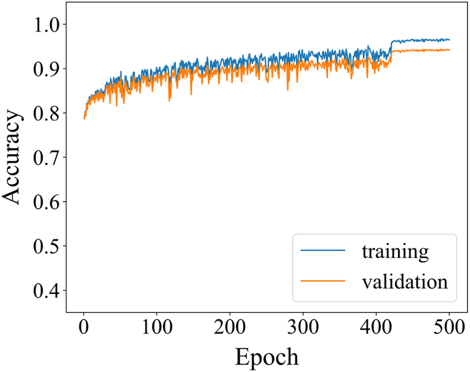

   **图 17** 应用迁移学习的 TBGNN 模型训练过程。

   横轴 Epoch＝训练轮次（0–500）；纵轴 Accuracy＝式（14）定义的预测精度指标（图中刻度约 0.4–1.0）。

   图例 training＝训练集（蓝色曲线）；validation＝验证集（橙色曲线）。图题使用 TBGNN 称谓。

4.2 TBGNN-TL 模型性能
~~~~~~~~~~~~~~~~~~~~~~

本节以 CAARC 标准高层建筑验证 TBGNN-TL 的有效性与适用性。CAARC 建筑为 60 层钢筋混凝土框架，尺寸为 :math:`182.88\times45.72\times30.48\,\mathrm{m}` ，包含 6 个标准层，每个标准层包含 10 层。每层高度为 3048 mm，楼板厚度为 100 mm，钢筋混凝土密度为 :math:`2.5\,\mathrm{t/m^3}` 。40 层以下混凝土为 C80，原文材料弹性模量写为 :math:`3.8\times10^7\,\mathrm{MPa}` ；40 层以上为 C60，弹性模量写为 :math:`3.6\times10^7\,\mathrm{MPa}` 。楼板恒载为 :math:`5\,\mathrm{kN/m^2}` ，活载为 :math:`2\,\mathrm{kN/m^2}` ，基本风压为 :math:`0.45\,\mathrm{kN/m^2}` 。除 CAARC 标准截面尺寸 S2 外，对结构尺寸作较大修改，增加 S1、S3、S4 和 S5 四种情景，见图 18。图中数字表示各标准层梁或柱尺寸，每个标准层包含 10 层。原文称 S1 为较保守且满足全部设计标准的尺寸，S5 则较危险，因为其 Y 向层间位移角超限。

图 19 展示相同结构在不同尺寸下的归一化层间位移预测值变化，并与真值比较，归一化尺度为 2.61 mm。TBGNN-TL 不仅能准确预测结构响应，还对结构尺寸变化高度敏感。值得注意的是，模型能够以极小误差拟合最大层间位移。

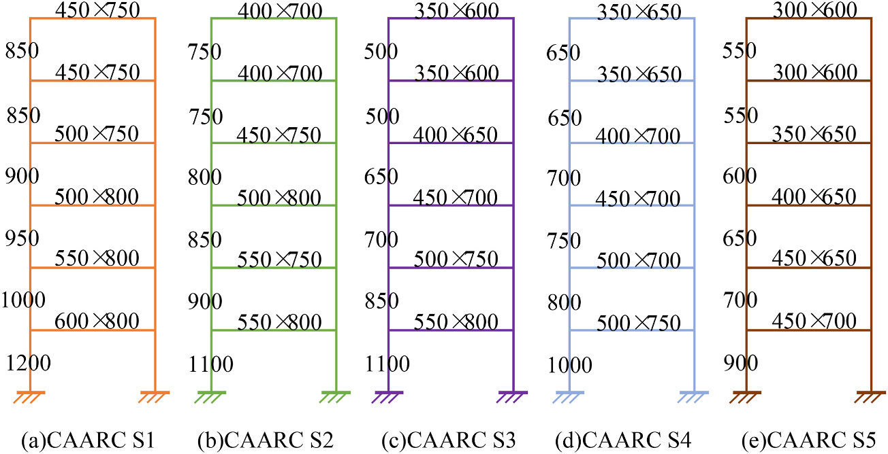

   **图 18** CAARC 模型结构构件的五种尺寸方案（数字表示各标准层所包含 10 个楼层的梁或柱尺寸）。

   子图：(a) CAARC S1＝CAARC 工况 S1；(b) CAARC S2＝CAARC 工况 S2；(c) CAARC S3＝CAARC 工况 S3；(d) CAARC S4＝CAARC 工况 S4；(e) CAARC S5＝CAARC 工况 S5。

   以下数值均按源图从顶层分段向底层分段读取，梁为宽×高，柱为截面边长，按正文尺寸体系为 mm（源图未重复打印单位）：

   S1（橙色）：梁 450×750、450×750、500×750、500×800、550×800、600×800；柱 850、850、900、950、1000、1200。

   S2（绿色）：梁 400×700、400×700、450×750、500×800、550×750、550×800；柱 750、750、800、850、900、1100。

   S3（紫色）：梁 350×600、350×600、400×650、450×700、500×750、550×800；柱 500、500、650、700、850、1100。

   S4（浅蓝色）：梁 350×650、350×650、400×700、450×700、500×700、500×750；柱 650、650、700、750、800、1000。

   S5（棕色）：梁 300×600、300×600、350×650、400×650、450×650、450×700；柱 550、550、600、650、700、900。

   S3 与 S4 的局部梁柱尺寸并非单调递减。源图每个结构均含 6 个标准层分段。

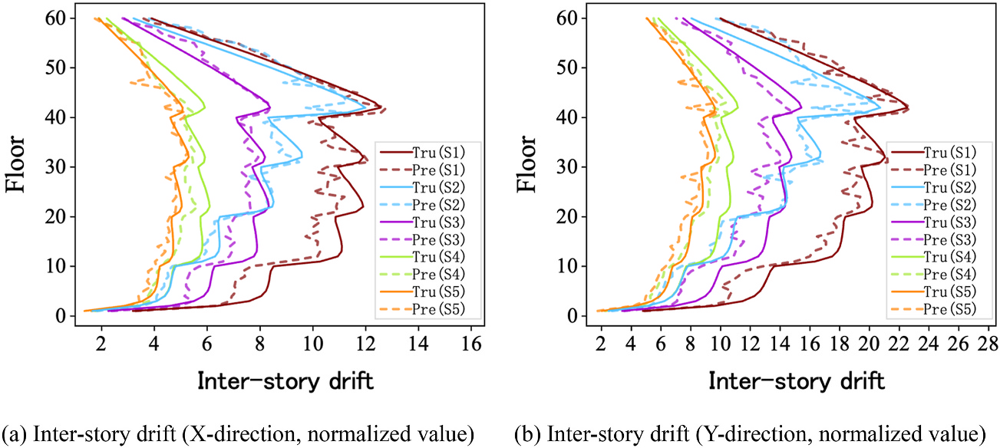

   **图 19** CAARC 建筑采用不同截面时的预测值与真实值比较。

   子图：(a) Inter-story drift (X-direction, normalized value)＝X 方向层间位移（归一化值）；(b) Inter-story drift (Y-direction, normalized value)＝Y 方向层间位移（归一化值）。

   纵轴 Floor＝楼层（0–60）；横轴 Inter-story drift＝层间位移（归一化值；正文尺度为 2.61 mm）。

   图例原样：Tru(S1)＝S1 真实值，Pre(S1)＝S1 预测值；Tru(S2)＝S2 真实值，Pre(S2)＝S2 预测值；Tru(S3)＝S3 真实值，Pre(S3)＝S3 预测值；Tru(S4)＝S4 真实值，Pre(S4)＝S4 预测值；Tru(S5)＝S5 真实值，Pre(S5)＝S5 预测值。实线为真实值，虚线为预测值。

   原图图例颜色为 S1 棕色、S2 浅蓝色、S3 紫色、S4 绿色、S5 橙色，与图 18 的 S1–S5 配色不能直接逐色对应。图 19 标为 S1 的曲线响应最大，标为 S5 的响应最小，而正文称 S1 较保守、S5 在 Y 向超限，且图 18 S1 截面较大、S5 较小。这些标签与响应顺序之间存在源内不一致，需作者进一步澄清。

原文差异说明：上述两种混凝土弹性模量的 MPa 单位与数量级按原文保留，不自行换算或改写。图 18 中 S1 的整体尺寸较大、正文对 S1/S5 的安全性描述，与图 19 的响应情景标签之间仍有需要作者澄清之处；不据此重新排序工况安全性或宣称已完成全部设计验算。

4.3 参数化建模与 TBGNN 结合的效率
~~~~~~~~~~~~~~~~~~~~~~~~~~~~~~~~~~

参数化建模结合 TBGNN 显著减少结构设计与分析所需时间。在完成 CAARC 标准高层建筑的结构拓扑后，采用不同方法多次修改、分析模型，并计算每次修改与分析的平均时间。计时计算环境为配备 NVIDIA GeForce GTX1050Ti GPU 和 Intel i5-11500 CPU 的设备。建模分为人工修改模型参数，如楼层数、高度和尺寸，以及参数化建模两部分。比较人工建模加有限元分析、参数化建模加有限元分析，以及参数化建模加 TBGNN 代理模型三种流程。表 8 结果显示，参数化修改约比人工修改快 8 倍，参数化建模结合 TBGNN 将单次设计分析时间缩短至原文报告的 17.33 s。需要注意，该时间还包含不同软件间数据转换耗时。尽管如此，相较传统分析流程仍节省约 90% 时间。这对于需要反复迭代的优化过程尤其有价值，可节省大量重复、机械化建模与分析时间。

.. list-table:: 表 8 不同模型修改与分析方法的平均耗时比较
   :header-rows: 1

   * - 方法
     - 建模时间
     - 分析时间
     - 总时间
   * - 人工修改模型 + FEA
     - 1 min 48 s
     - 1 min 25 s
     - 3 min 13 s
   * - 参数化修改模型 + FEA
     - 15 s
     - 1 min 25 s
     - 1 min 40 s
   * - 参数化修改模型 + TBGNN 代理模型
     - 15 s
     - 2.63 s
     - 17.33 s

原文计时说明：表 8 第三行两项相加为 17.63 s，与总时间栏及正文的 17.33 s 相差 0.30 s；两种数值均保留，不静默修正。约 90% 节省对应这里的单次建模与分析流程，不包括前期数据生成、网络训练或第 4.1 节报告的 7.9 h 迁移训练。

5 结论与未来工作
------------------

为研究将 GNN 作为结构分析代理模型，特别是用于高层建筑构件尺寸优化的潜力，本文提出训练与应用 GNN 预测高层建筑结构响应的框架，将 GNN 与高层建筑抗风结构分析结合。作为核心的 TBGNN 模型，展示了在不同风荷载与构件尺寸条件下有效开展高层建筑静力分析的能力。框架和主要发现总结如下。

首先，研究提出考虑风荷载信息的高层建筑图表示方法。随后，为应对数据稀缺，提出快速生成高层建筑结构的参数化建模方法，通过重复建模显著提高设计质量与工作效率。为克服现有 GNN 学习高层建筑结构数据的局限，提出突出楼层特征的楼层特征增强策略，提高 GNN 对此类数据的学习能力。此外，将工程知识引入损失函数，使预测位移曲线更贴近真实曲线。训练后的 TBGNN 在结构响应预测方面优于其他 GNN 模型。

此外，研究验证楼层数相对于层高对模型表现具有主导影响。基于这一发现，提出从低楼层结构迁移知识，使 TBGNN-TL 能够预测更高楼层结构响应的方法，利用较小数据集扩展模型能力。最后，以 CAARC 模型测试 TBGNN-TL，结果显示，对于相同拓扑、不同构件尺寸的结构，模型具有良好预测能力。与有限元建模与分析相比，参数化建模结合 TBGNN 使所需时间减少约 90%。

需要注意，当前框架经过简化，只关注钢筋混凝土框架结构响应的静力分析。真实高层建筑中的剪力墙、框架–核心筒等结构，不仅包含梁柱，还需特殊处理墙单元，例如将墙转化为梁，使结构更复杂、构件更多。对于静力荷载，无论风荷载还是地震荷载，都可等效为节点荷载施加于结构；TBGNN 能够学习静载与结构响应的关系，作出准确预测。若需考虑动力荷载，则需与能够处理时间序列的其他神经网络，例如长短期记忆网络（LSTM）结合。尽管如此，该框架结合结构图的灵活性与 TBGNN 较强的非线性拟合能力，可用于训练面向多种结构和不同荷载条件的 GNN 代理模型，为未来进一步使用 GNN 代理模型替代有限元提供参考与方向。

参考文献
--------

[1] M. Huang, C. Wang, W. Lin, et al., A multi-objective structural optimization method for serviceability design of tall buildings, Struct. Des. Tall Special Build. 32 (17) (2023) e2052.

[2] Y. Li, R.B. Duan, Q.S. Li, et al., Wind-resistant optimal design of tall buildings based on improved genetic algorithm, Structures 27 (2020) 2182–2191.

[3] H.P. Lou, J. Ye, F.L. Jin, et al., A practical shear wall layout optimization framework for the design of high-rise buildings, Structures 34 (2021) 3172–3195.

[4] V.J.L. Gan, C.L. Wong, K.T. Tse, et al., Parametric modelling and evolutionary optimization for cost-optimal and low-carbon design of high-rise reinforced concrete buildings, Adv. Eng. Inform. 42 (2019) 100962.

[5] V.M. DI Mucci, A. Cardellicchio, S. Ruggieri, et al., Artificial intelligence in structural health management of existing bridges, Autom. ConStruct. 167 (2024) 105719.

[6] A. Cardellicchio, S. Ruggieri, A. Nettis, et al., Physical interpretation of machine learning-based recognition of defects for the risk management of existing bridge heritage, Eng. Fail. Anal. 149 (2023) 107237.

[7] W. Liao, X. Lu, Y. Fei, et al., Generative AI design for building structures, Autom. ConStruct. 157 (2024) 105187.

[8] C tathon Kupwiwat, K. Hayashi, M. Ohsaki, Deep deterministic policy gradient and graph attention network for geometry optimization of latticed shells, Appl. Intell. 53 (17) (2023) 19809–19826.

[9] L.C. Nguyen, H. Nguyen-Xuan, Deep learning for computational structural optimization, ISA (Instrum. Soc. Am.) Trans. 103 (2020) 177–191.

[10] W. Shan, J. Liu, J. Zhou, Integrated method for intelligent structural design of steel frames based on optimization and machine learning algorithm, Eng. Struct. 284 (2023) 115980.

[11] S. Zheng, L. Qiu, F. Lan, TSO-GCN: a Graph Convolutional Network approach for real-time and generalizable truss structural optimization, Appl. Soft Comput. 134 (2023) 110015.

[12] H. Lou, B. Gao, F. Jin, et al., Shear wall layout optimization strategy for high-rise buildings based on conceptual design and data-driven tabu search, Comput. Struct. 250 (2021) 106546.

[13] L. Song, C. Wang, J. Fan, et al., Elastic structural analysis based on graph neural network without labeled data, Comput. Aided Civ. Infrastruct. Eng. 38 (10) (2023) 1307–1323.

[14] Q. Li, Z. Wang, L. Li, et al., Machine learning prediction of structural dynamic responses using graph neural networks, Comput. Struct. 289 (2023) 107188.

[15] Q. Li, Z. Wang, W. Chen, et al., Advancing blast fragmentation simulation of RC slabs: a graph neural network approach, Eng. Struct. 308 (2024) 118009.

[16] Y. Xu, X. Lu, B. Cetiner, et al., Real-time regional seismic damage assessment framework based on long short-term memory neural network, Comput. Aided Civ. Infrastruct. Eng. 36 (4) (2021) 504–521.

[17] Y. Xu, X. Lu, Y. Tian, et al., Real-time seismic damage prediction and comparison of various ground motion intensity measures based on machine learning, J. Earthq. Eng. 26 (8) (2022) 4259–4279.

[18] P. Zhao, W. Liao, Y. Huang, et al., Intelligent beam layout design for frame structure based on graph neural networks, J. Build. Eng. 63 (2023) 105499.

[19] W. Liao, X. Lu, Y. Huang, et al., Automated structural design of shear wall residential buildings using generative adversarial networks, Autom. ConStruct. 132 (2021) 103931.

[20] K. Hayashi, M. Ohsaki, Graph-based reinforcement learning for discrete cross-section optimization of planar steel frames, Adv. Eng. Inform. 51 (2022) 101512.

[21] N. Nourian, M. EL-Badry, M. Jamshidi, Design optimization of truss structures using a graph neural network-based surrogate model, Algorithms 16 (8) (2023) 380.

[22] H.T. Mai, S. Lee, D. Kim, et al., Optimum design of nonlinear structures via deep neural network-based parameterization framework, Eur. J. Mech. Solid. 98 (2023) 104869.

[23] H.T. Mai, J. Kang, J. Lee, A machine learning-based surrogate model for optimization of truss structures with geometrically nonlinear behavior, Finite Elem. Anal. Des. 196 (2021) 103572.

[24] M. Alanani, A. Elshaer, ANN-based optimization framework for the design of wind load resisting system of tall buildings, Eng. Struct. 285 (2023) 116032.

[25] M. Alanani, T. Brown, A. Elshaer, Multiobjective structural layout optimization of tall buildings subjected to dynamic wind loads, J. Struct. Eng. 150 (7) (2024) 04024069.

[26] X.W. Zheng, H.N. Li, P. Gardoni, Probabilistic seismic demand models and Life-cycle fragility estimates for high-rise buildings, J. Struct. Eng. 147 (12) (2021) 04021216.

[27] X.W. Zheng, H.N. Li, P. Gardoni, Hybrid Bayesian-Copula-based risk assessment for tall buildings subject to wind loads considering various uncertainties, Reliab. Eng. Syst. Saf. 233 (2023) 109100.

[28] X.W. Zheng, H.N. Li, Z.Q. Shi, Hybrid AI-Bayesian-based demand models and fragility estimates for tall buildings against multi-hazard of earthquakes and winds, Thin-Walled Struct. 187 (2023) 110749.

[29] K.H. Chang, C.Y. Cheng, Learning to simulate and design for structural engineering, arXiv (2020) [2024-03-10].

[30] F. Parisi, S. Ruggieri, R. Lovreglio, et al., On the use of mechanics-informed models to structural engineering systems: application of graph neural networks for structural analysis, Structures 59 (2024) 105712.

[31] C. Zhang, M xuan Tao, C. Wang, et al., Differentiable automatic structural optimization using graph deep learning, Adv. Eng. Inform. 60 (2024) 102363.

[32] Y.T. Chou, W.T. Chang, J.G. Jean, et al., StructGNN: an efficient graph neural network framework for static structural analysis, Comput. Struct. 299 (2024) 107385.

[33] Y. Fei, W. Liao, P. Zhao, et al., Hybrid surrogate model combining physics and data for seismic drift estimation of shear-wall structures, Earthq. Eng. Struct. Dynam. (2024) 4151, eqe.

[34] A. Xu, H. Lin, J. Fu, et al., Wind-resistant structural optimization of supertall buildings based on high-frequency force balance wind tunnel experiment, Eng. Struct. 248 (2021) 113247.

[35] GB 50009-2012, Load Code for the Design of Building Structures, China Architecture and Building Press, 2012.

[36] Y. Li, C. Li, Q.S. Li, et al., Aerodynamic performance of CAARC standard tall building model by various corner chamfers, J. Wind Eng. Ind. Aerod. 202 (2020) 104197.

[37] F.B. Chen, H.M. Liu, W. Chen, et al., Characterizing wind pressure on CAARC standard tall building with various façade appurtenances: an experimental study, J. Build. Eng. 59 (2022) 105015.

[38] Y. Li, X. Huang, Y.G. Li, et al., Machine learning based algorithms for wind pressure prediction of high-rise buildings, Adv. Struct. Eng. 25 (10) (2022) 2222–2233.

[39] YJK, YJK-GAMA secondary development guide. https://gitee.com/NonStructure/yjk-gama-secondary-development/, 2023.

[40] CSI. CSI analysis reference manual, Copyright @ Computers and Structures, Inc., 2009.

[41] H.L. Minh, T. Sang-To, S. Khatir, et al., Damage identification in high-rise concrete structures using a bio-inspired meta-heuristic optimization algorithm, Adv. Eng. Software 176 (2023) 103399.

[42] J.Y. Fu, B.G. Wu, J.R. Wu, et al., Wind resistant size optimization of geometrically nonlinear lattice structures using a modified optimality criterion method, Eng. Struct. 173 (2018) 573–588.

[43] M. Fey, J.E. Lenssen, Fast graph representation learning with PyTorch geometric, arXiv (2019) [2024-07-16].

[44] Y. Fei, W. Liao, X. Lu, et al., Knowledge-enhanced graph neural networks for construction material quantity estimation of reinforced concrete buildings, Comput. Aided Civ. Infrastruct. Eng. 39 (4) (2024) 518–538.

[45] Y. Fei, W. Liao, Y. Huang, et al., Knowledge-enhanced generative adversarial networks for schematic design of framed tube structures, Autom. ConStruct. 144 (2022) 104619.

[46] A. Mayya, N.F. Alkayem, L. Shen, et al., Efficient hybrid ensembles of CNNs and transfer learning models for bridge deck image-based crack detection, Structures 64 (2024) 106538.

[47] S. Ruggieri, A. Cardellicchio, G. Uva, Using transfer learning technique to define seismic vulnerability of existing buildings through mechanical models, Procedia Struct. Integr. 44 (2023) 1964–1971.

[48] A. Krizhevsky, I. Sutskever, G.E. Hinton, ImageNet classification with deep convolutional neural networks, Commun. ACM 60 (6) (2017) 84–90.

[49] Y. Tamura, S. Kawana, O. Nakamura, et al., Evaluation perception of wind-induced vibration in buildings, Proc Inst Civ Eng Struct Build. 159 (5) (2006) 283–293.

[50] M.F. Huang, C.M. Chan, W.J. Lou, Optimal performance-based design of wind sensitive tall buildings considering uncertainties, Comput. Struct. 98–99 (2012) 7–16.

[51] K.C.S. Kwok, P.A. Hitchcock, M.D. Burton, Perception of vibration and occupant comfort in wind-excited tall buildings, J. Wind Eng. Ind. Aerod. 97 (7–8) (2009) 368–380.

[52] C.M. Chan, J.K.L. Chui, Wind-induced response and serviceability design optimization of tall steel buildings, Eng. Struct. 28 (4) (2006) 503–513.

[53] D.P.B.A.J. Kingma, Adam: a method for stochastic optimization, arXiv (2017) [2024-07-16].

[54] P. Veličković, G. Cucurull, A. Casanova, et al., Graph Attention Networks, 2018 [2024-07-16].

[55] W. Hu, B. Liu, J. Gomes, et al., Strategies for pre-training graph neural networks, arXiv (2020) [2024-07-16].

完整引用
--------

收录信息见 :ref:`WOEAI 学术成果页对应条目 <ref-tang2025-JBE>` 。
