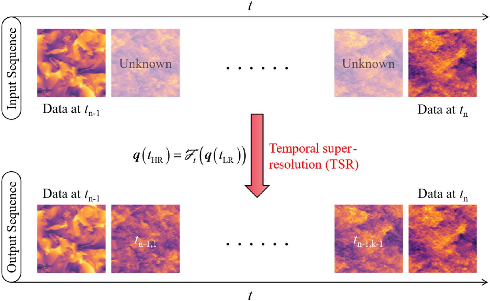
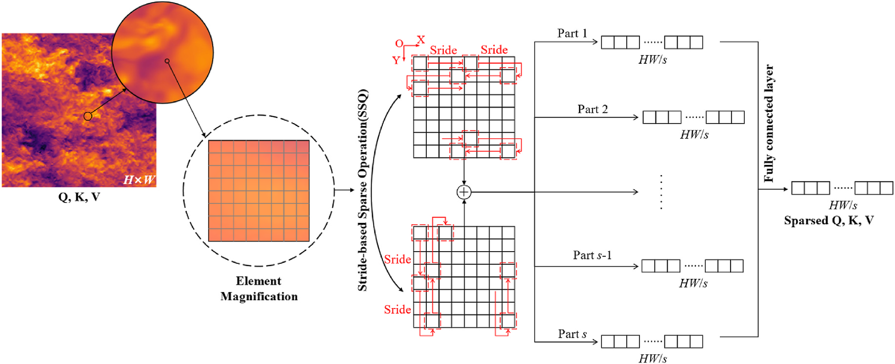
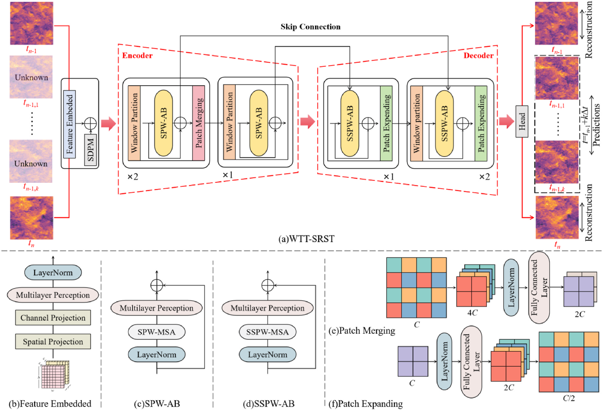
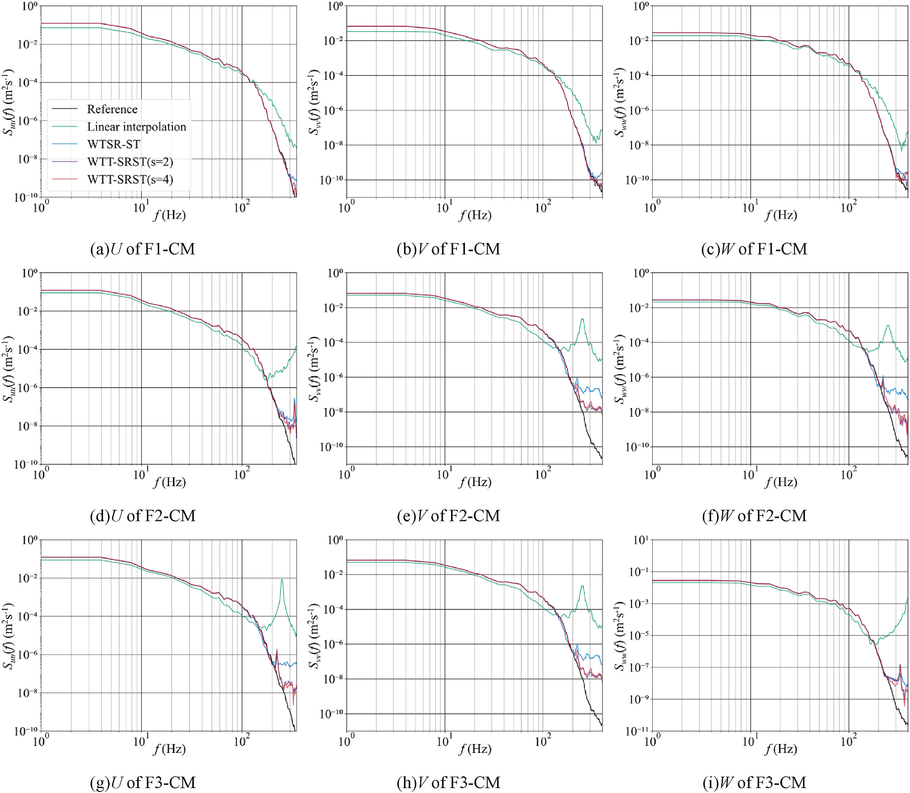
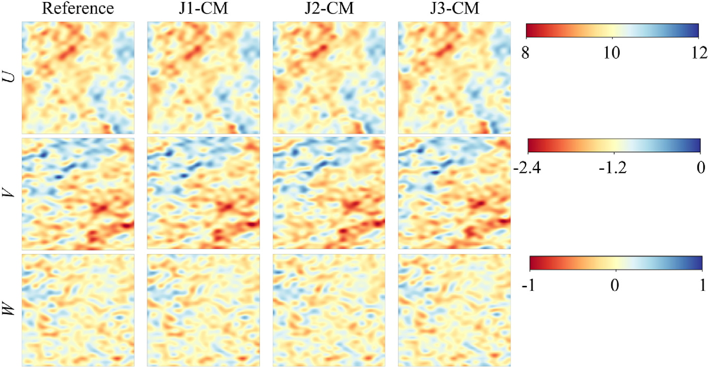

.. _paper-note-ref-tang2026-RE:

.. role:: student-first-author

数值风洞 | 如何高效重建城市风能中的高时间分辨率风场
===================================================

城市风能应用关心的不只是某一时刻的平均风速，还关心风场随时间变化的细节。对于城市建筑附近的风机、风能调度和风资源评估来说，如果只得到低时间分辨率的风场快照，就很难判断湍流结构如何演化，也难以可靠评估风机运行与能量输出。

在这篇发表于 **Renewable Energy** 的论文中，我们提出 Wind Turbulence Temporal Super-Resolution Swin-Transformer（WTT-SRST）框架，用两个低时间分辨率风场快照重建中间的高时间分辨率风场演化。文章的重点不是把深度学习当作黑箱插值器，而是在注意力计算效率、湍流物理一致性和城市风能应用之间寻找一个可解释的折中。

这项工作属于 WOEAI 的 **建筑结构抗风 / 数值风洞与湍动入流** 方向，也与城市风环境、PBL 湍流、AI 代理模型和数值风洞数据加速直接相关。

   图 6 风场快照的时间超分辨率流程

   论文把低时间分辨率输入快照之间的未知风场演化作为重建目标，让模型输出更完整的高时间分辨率风场序列。

论文信息
--------

- 论文题名: A novel framework for temporal super-resolution of wind in urban energy applications
- 作者: Tang Lingxiao; **Li Chao**\*; Zhao Zihan\*; Chen Lingwei; Zhang Mingming
- 期刊: Renewable Energy
- 年份: 2026
- DOI: https://doi.org/10.1016/j.renene.2025.124336
- WOEAI 相关方向: 建筑结构抗风 / 数值风洞与湍动入流

摘要
----

及时、精确地获取行星边界层风随时间演化的信息，对于城市风能调度与管理至关重要。然而，使用物理模型预测高时间分辨率湍流的高昂成本限制了工程应用。深度学习技术已经成为数值方法的一种有前景替代方案，但关于高时间分辨率风场重建的研究仍然较少。本文提出一种融合 Sparse Window-based Attention 的新框架，以具有成本效益的方式实现湍流场超分辨率。该框架可以通过修改 stride 值来自定义注意力稀疏度。本文进一步提出 Relative Physical-informed Loss，以保证生成风场的物理合理性。与 Window-based Attention 相比，所提出的注意力机制显著降低计算成本并提高推理效率。尽管增加插值风场快照会使性能略有降低，模型仍能重建风场结构。统计指标、湍流特征、功率谱和相干函数的评估显示，重建风场具有较强的物理一致性。同时，该方法将训练时间缩短 :math:`32.92\%`，计算能耗降低 :math:`32.89\%`。更大的 stride 会进一步降低能耗，但会以性能下降为代价，体现出准确性与效率之间的权衡。

**英文摘要**

Timely and precise access to the temporal evolution of planetary boundary layer wind is crucial for urban wind energy scheduling and management. Nevertheless, the expensive costs of predicting high temporal resolution turbulence using physical models hinder engineering applications. Deep learning techniques have become a promising alternative to numerical methods, whereas current studies on the high temporal resolution wind reconstruction remain scarce. This study proposes a novel framework incorporating Sparse Window-based Attention for cost-effective super-resolution of turbulence fields. It allows the customization of attention sparsity by modifying the stride value. Relative Physical-informed Loss is proposed to guarantee the physical plausibility of the generated wind fields. Compared to Window-based Attention, the proposed attention significantly reduces computational costs and improves the inference efficiency. Even though increasing interpolated wind snapshots slightly reduces performance, the model still reconstructs the wind field's structure. Evaluations of statistical metrics, turbulence features, power spectra, and coherence functions exhibit strong physical consistency of the reconstructed wind fields. Meanwhile, it shortens training time by 32.92 % and decreases computational energy consumption by 32.89 %. Larger strides further reduce energy consumption but at the cost of decreased performance, highlighting a trade-off between accuracy and efficiency.

研究问题
--------

城市风能场景中的风场具有明显的时间演化特征。建筑物会改变来流结构，诱发阻塞、剪切、分离和局部加速；风机运行、风资源评估和调度管理则需要更细的时间分辨率来观察这些变化。

传统 DNS 或 LES 可以提供可信的湍流演化信息，但如果每次都用高时间分辨率物理模型求解，计算成本会限制工程应用。简单的线性插值可以补出中间帧，却容易把湍流中的高频波动、能量传递和物理约束处理得过于粗糙。

因此，这篇论文关注的问题可以概括为：能否从较稀疏的低时间分辨率风场快照中，重建更细时间步长上的风场演化，同时尽量保持湍流结构、频谱特征和物理一致性？

用论文中的任务表达式来说，模型要学习从低时间分辨率风场到高时间分辨率风场的映射：

.. math::

   q(t_{\mathrm{HR}})=F_t(q(t_{\mathrm{LR}}))

其中，:math:`q(t_{\mathrm{LR}})` 表示低时间分辨率风场输入，:math:`q(t_{\mathrm{HR}})` 表示重建得到的高时间分辨率风场序列，:math:`F_t` 是模型学习到的时序超分辨率映射。

方法贡献
--------

这项工作的核心是 WTT-SRST。它借鉴 Swin-Transformer 的窗口注意力思想，但针对湍流风场的计算规模和物理特征做了两类改造。

第一类改造是 Sparse Window-based Attention。标准窗口注意力虽然已经避免了全局 attention 的高成本，但在大规模风场网格上仍然会消耗大量显存和计算量。论文提出 Stride-based Sparse Operation（SSO），用 stride 控制注意力计算中的稀疏采样，让模型在保留主要湍流结构的同时减少注意力计算。

   图 1 基于步长的稀疏操作示意图

   SSO 通过步长采样和特征融合降低注意力计算量，使模型不必在所有网格点之间逐一计算相关性。

在论文给出的复杂度表达中，Sparse Window-based Multi-head Self-Attention 的计算复杂度可以写为：

.. math::

   \Omega_{\mathrm{SPW\text{-}MSA}} = 4hwc^2 + 4\frac{L^2}{s^2}hwc

这里 :math:`h` 和 :math:`w` 表示特征图尺寸，:math:`c` 表示通道数，:math:`L` 是窗口尺寸，:math:`s` 是 stride。这个式子说明，随着 :math:`s` 增大，注意力部分的计算量会随 :math:`s^2` 下降；但论文也强调，过大的 stride 会损失部分高频特征，因此它不是越大越好。

第二类改造是 Relative Physical-informed Loss（RPL）。以往很多时序超分辨率方法更像图像插帧，只追求视觉或点值相似；而湍流风场还要满足质量守恒、动量变化和能量传递等物理特征。RPL 将不可压缩 Navier-Stokes 方程的相对残差纳入损失函数，引导模型生成更符合物理约束的风场。

   图 4 所提出 WTT-SRST 的详细结构与各模块架构

   WTT-SRST 使用编码-解码结构、skip connection、Sparse Window-based Attention Block 和 Shifted Sparse Window-based Attention Block，把低时间分辨率输入转换为完整的高时间分辨率风场演化。

关键发现
--------

1. WTT-SRST 能比线性插值更好地重建湍流结构
~~~~~~~~~~~~~~~~~~~~~~~~~~~~~~~~~~~~~~~~~~

论文在训练阶段和测试阶段都比较了线性插值、已有 WTSR-ST 方法和本文提出的 WTT-SRST。结果显示，线性插值在湍流波动较明显的位置容易产生较大误差，难以恢复非线性的风场演化。相比之下，WTT-SRST 在 RMSE、MAE 和 MAPE 等统计指标上整体更低，尤其在需要插入更多中间风场快照时优势更明显。

这说明这项工作不是简单地把两个风场快照“平滑连接”起来，而是在学习湍流演化中的局部结构、速度波动和时间相关性。

2. 频谱和相干函数支持物理一致性判断
~~~~~~~~~~~~~~~~~~~~~~~~~~~~~~~~~~~

对风能应用而言，平均误差并不能完全说明问题。低频信号控制大尺度结构，高频信号则包含瞬态细节和局部扰动。如果模型只在点值上接近参考结果，却丢失高频湍流特征，后续风机载荷、功率波动或调度分析仍可能受到影响。

论文进一步比较了重建风场的功率谱和相干函数。结果显示，WTT-SRST 能较好地保留低频分布，并在高频范围内比线性插值和对比模型更接近参考结果。随着插值快照数量增加，或 stride 取值增大，高频细节会出现一定退化，但整体仍体现出较强的物理一致性。

   图 14 脉动速度的功率谱密度结果

   功率谱用于检验重建风场是否保留了不同频率上的湍流能量分布，是判断风场重建质量的重要证据。

3. 稀疏注意力显著降低计算资源消耗
~~~~~~~~~~~~~~~~~~~~~~~~~~~~~~~~~

效率是这篇论文的重要目标。单个注意力模块测试显示，Sparse Window-based Attention Block 在 :math:`s=2` 和 :math:`s=4` 时的 GPU 显存占用分别为 :math:`359.92\,\mathrm{MB}` 和 :math:`250.35\,\mathrm{MB}`，明显低于 Swin-Transformer Block 的 :math:`1225.26\,\mathrm{MB}`。论文结论中进一步指出，在 :math:`s=2` 和 :math:`s=4` 时，该模块显存占用分别约为 Swin-Transformer Block 的 :math:`29.37\%` 和 :math:`20.43\%`。

从整体模型架构看，加入 Sparse Window-based Attention 后，参数量和平均推理时间下降，GPU 资源消耗显著降低。论文报告，相比原始架构，所提出的稀疏注意力架构将参数量减少 :math:`19.50\%`，并将 GPU 资源消耗降低约 :math:`70\%`。

4. RPL 让模型不只追求数值接近，也靠近物理约束
~~~~~~~~~~~~~~~~~~~~~~~~~~~~~~~~~~~~~~~~~~~~~

消融实验显示，单独加入相对动量残差或相对连续性残差都会改善结果；当二者共同纳入损失函数时，统计指标相对于无物理约束基准下降到原值的 :math:`74\%` 到 :math:`88\%`。这说明 RPL 对梯度方向起到了物理约束作用，使生成风场更接近控制方程所要求的演化结构。

对数值风洞和湍动入流研究来说，这一点很关键：AI 模型可以加速风场重建，但不能只追求表面相似。让模型看到并尊重物理残差，是它能否服务工程分析的前提之一。

5. 全尺度风场评估展示了应用潜力
~~~~~~~~~~~~~~~~~~~~~~~~~~~~~~~

论文还把方法放到全尺度风场场景中评估。结果显示，随着低时间分辨率间隔增大，细节会变得更模糊，误差也会增加；但 WTT-SRST 仍能较好刻画空间非均匀性和流动结构，并在统计指标上优于对比方法。

   图 24 凌晨 3:45 生成风场的可视化表示

   全尺度风场结果展示了模型在更接近实际风能场景中的重建能力，也提示读者关注插值数量和模型精度之间的关系。

工程意义
--------

这篇论文的工程意义在于，把高时间分辨率风场重建从“昂贵的全量物理计算”推进到“可由物理约束深度学习模型加速”的方向。

对城市风能和城市风环境分析来说，这种方法可能服务于几个环节：

- 用更细的时间分辨率补充低时间分辨率 CFD 或 LES 数据；
- 在风机布局、调度管理和风资源评估中更快观察风场演化；
- 为城市数值风洞、湍动入流生成和 AI 代理模型提供时序数据增强思路；
- 在能耗受限的计算流程中，用可调 stride 在精度和效率之间做有依据的折中。

对 WOEAI 的研究方向来说，这项工作把数值风洞、湍流物理、Transformer 类模型和工程能耗评价放在同一个框架中讨论。它不是单纯追求更复杂的模型，而是把“能否算得快、能否守住物理、能否支撑风能应用”作为共同目标。

适用边界
--------

这项工作也有明确边界。

首先，论文中的参考高时间分辨率风场主要来自 LES 和下采样数据构造，仍然需要在更复杂、更真实的城市下垫面和环境条件中继续验证。论文也指出，理想化算例不足以覆盖真实 PBL 风场的混沌变化。

其次，stride 是效率和精度之间的调节旋钮。更大的 stride 可以进一步降低能耗和计算量，但也会削弱高频特征提取能力，使 RMSE、MAE、MAPE、误差云图和相干函数表现出现退化。因此，实际应用中不能只看推理速度，还要根据目标场景检查频谱、相干性和误差范围。

第三，RPL 提供的是训练中的物理约束，而不是对所有复杂流动现象的完整保证。进入工程流程时，仍需要结合 CFD/LES 验证、风场观测、边界条件审查和专业判断，确认模型是否适用于目标风场、风机布置和调度问题。

因此，更准确的理解是：WTT-SRST 为城市风能中的高时间分辨率风场重建提供了一条更高效、更重视物理一致性的 AI 路线，但它仍应作为数值风洞和工程分析流程中的加速与补充工具，而不是替代所有高保真物理模拟。

延伸阅读
--------

- `WOEAI | 建筑结构抗风方向介绍 <https://woeai.readthedocs.io/zh-cn/latest/BuildingStructuralWindResistance.html>`_
- `WOEAI | 主页 <https://woeai.readthedocs.io/zh-cn/latest/>`_

相关论文解读
------------

- :doc:`数值风洞 | 我们如何用预计算 CFD 数据库加速城市微尺度风环境预测 <ref-zhao2026-BS>`
- :doc:`数值风洞 | 如何把卫星影像转成 CFD 可用城市几何 <ref-zhao2026-BE>`
- :doc:`数值风洞 | 用 3D Gaussian Splatting 重建城市建筑几何 <ref-zhao2025-SCS>`
