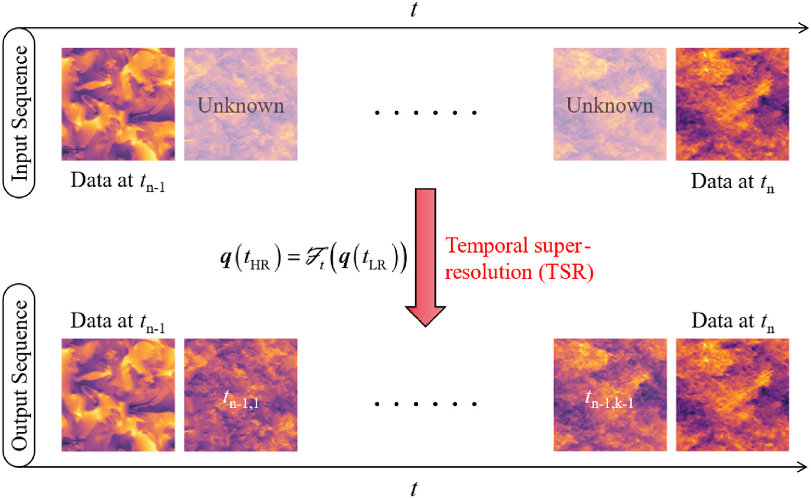
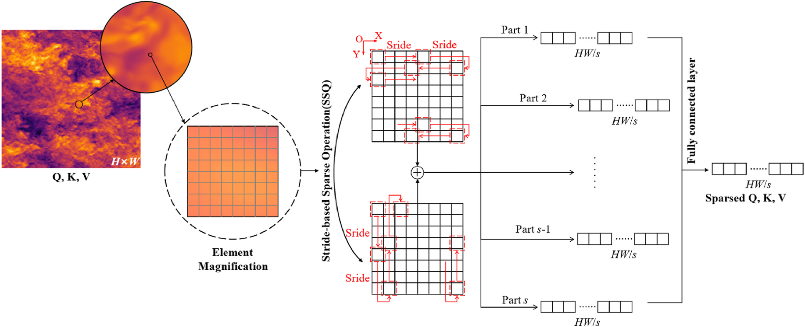
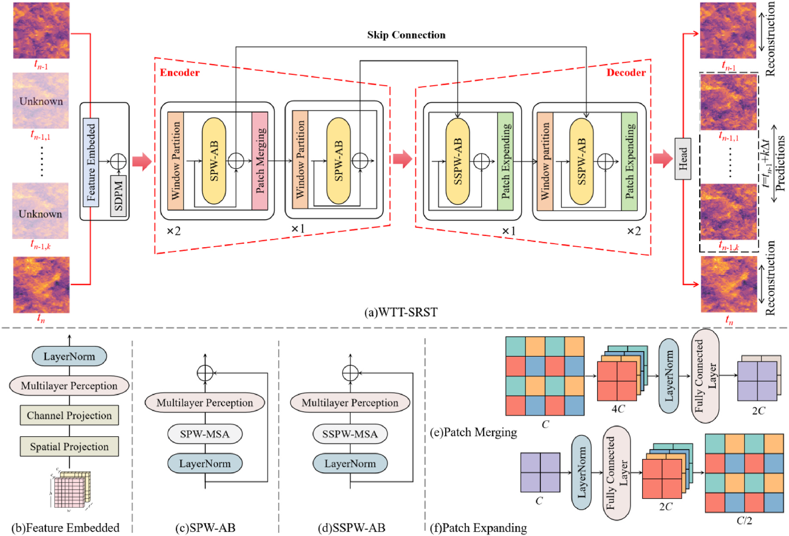
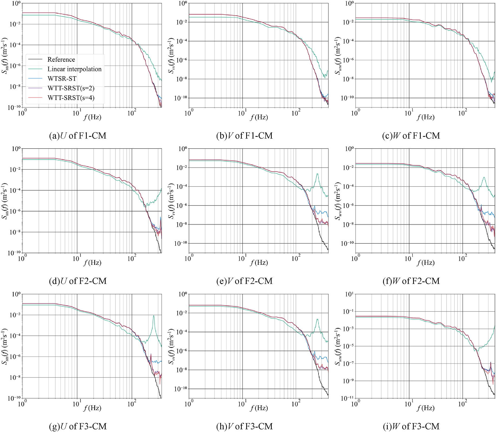
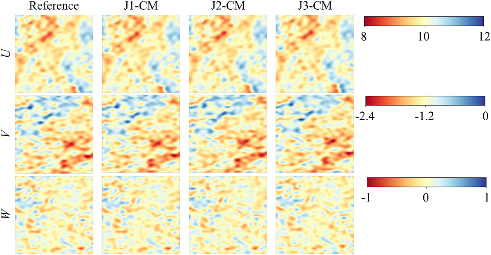

.. _paper-note-ref-tang2026-RE:

.. role:: student-first-author

如何高效重建城市风能中的高时间分辨率风场
========================================

.. image:: ../../../wechat/assets/public-safe/ref-tang2026-RE/cover-wechat-900x383-imagegen-v5-b-pub-line-no-dot.png
   :alt: 如何高效重建城市风能中的高时间分辨率风场
   :align: center
   :width: 100%
   :class: paper-note-cover

两张已知风场快照之间缺了一段湍流演化，能否不逐个细时间步重新求解，就把变化补出来？这篇论文以二维水平平面的三个速度分量为对象，用稀疏窗口注意力和相对物理残差改善重建效率。在指定基线与硬件下，:math:`s=2` 模型训练时间缩短 :math:`32.92\%`；实际验证是缩尺空场 LES 和风电场上游数据，不是复杂城区实测或发电量验证。

在这篇发表于 **Renewable Energy** 的论文中，我们提出 Wind Turbulence Temporal Super-Resolution Swin-Transformer（WTT-SRST）框架，用两个低时间分辨率风场快照重建中间的高时间分辨率风场演化。文章的重点不是把深度学习当作黑箱插值器，而是在注意力计算效率、湍流物理一致性和城市风能应用之间寻找一个可解释的折中。

这项工作属于 WOEAI 的 **建筑结构抗风 / 数值风洞与湍动入流** 方向，也与城市风环境、PBL 湍流、AI 代理模型和数值风洞数据加速直接相关。

   论文图 6 风场快照的时间超分辨率流程

   论文把低时间分辨率输入快照之间的未知风场演化作为重建目标，让模型输出更完整的高时间分辨率风场序列。

论文信息
--------

- 论文题名: A novel framework for temporal super-resolution of wind in urban energy applications
- 作者: Tang Lingxiao; **Li Chao**\*; Zhao Zihan\*; Chen Lingwei; Zhang Mingming
- 期刊: Renewable Energy
- 年份: 2026
- DOI: https://doi.org/10.1016/j.renene.2025.124336
- WOEAI 相关方向: 建筑结构抗风 / 数值风洞与湍动入流

三句话导读
----------

这篇论文研究在两个已知风场快照之间插入更密的湍流序列，属于时间插值重建，不是未知未来风场预报。
它重要，因为风能分析需要时间细节，而逐步求解和保存高分辨率风场有较高计算成本。
读者可带走的结论是：稀疏注意力降低特定开销，相对残差改善已测工况的一致性，但不能省去目标场景的误差与适用性核验。

关键数字 / 关键结论卡
---------------------

- 表 11 中 :math:`s=2` 相对原始架构的训练时间为 :math:`1282\rightarrow860\,\mathrm{min}`；原文报告节时 :math:`32.92\%`、模型执行能耗估算降低 :math:`32.89\%`，不是风电系统或完整 CFD 流程的节省。
- 单模块的 :math:`s=2`/:math:`s=4` 显存分别约为 Swin-Transformer Block 的 :math:`29.37\%`/:math:`20.43\%`。
- 表 9 中 :math:`s=2` 整体模型的参数量约减 :math:`19.50\%`、显存约减 :math:`70\%`，两者以原始整体架构为基线；显存不等于算力或总能耗。

摘要
----

及时、精确地获取行星边界层风随时间演化的信息，对于城市风能调度与管理至关重要。然而，使用物理模型预测高时间分辨率湍流的高昂成本限制了工程应用。深度学习技术已经成为数值方法的一种有前景替代方案，但关于高时间分辨率风场重建的研究仍然较少。

本文提出一种融合 Sparse Window-based Attention 的新框架，以具有成本效益的方式实现湍流场超分辨率。该框架可以通过修改 stride 值来自定义注意力稀疏度。本文进一步提出 Relative Physical-informed Loss，以保证生成风场的物理合理性。

与 Window-based Attention 相比，所提出的注意力机制显著降低计算成本并提高推理效率。尽管增加插值风场快照会使性能略有降低，模型仍能重建风场结构。统计指标、湍流特征、功率谱和相干函数的评估显示，重建风场具有较强的物理一致性。同时，该方法将训练时间缩短 :math:`32.92\%`，计算能耗降低 :math:`32.89\%`。更大的 stride 会进一步降低能耗，但会以性能下降为代价，体现出准确性与效率之间的权衡。

研究问题
--------

城市风场时间超分辨率不只是插帧问题。本文围绕三个问题展开：

1. 如何从低时间分辨率风场快照中重建更细时间步长上的湍流演化？
2. 如何用稀疏窗口注意力降低大规模风场重建中的显存、参数量和能耗？
3. 如何通过 Relative Physical-informed Loss，让生成风场在统计误差之外更接近物理约束？

方法贡献
--------

这项工作的核心是 WTT-SRST。它借鉴 Swin-Transformer 的窗口注意力思想，但针对湍流风场的计算规模和物理特征做了两类改造。

第一类改造是 Sparse Window-based Attention。标准窗口注意力虽然已经避免了全局 attention 的高成本，但在大规模风场网格上仍然会消耗大量显存和计算量。论文提出 Stride-based Sparse Operation（SSO），用 stride 控制注意力计算中的稀疏采样，让模型在保留主要湍流结构的同时减少注意力计算。

   论文图 1 基于步长的稀疏操作示意图

   SSO 通过步长采样和特征融合降低注意力计算量，使模型不必在所有网格点之间逐一计算相关性。

在论文给出的复杂度表达中，Sparse Window-based Multi-head Self-Attention 的计算复杂度可以写为：

.. math::

   \Omega_{\mathrm{SPW\text{-}MSA}} = 4hwc^2 + 4\frac{L^2}{s^2}hwc

这里 :math:`h,w` 为特征图尺寸，:math:`c` 为通道数，:math:`L` 为窗口尺寸，:math:`s` 为 stride。仅第二项按 :math:`1/s^2` 缩减，:math:`4hwc^2` 不随 stride 改变，不能把整个模型都说成平方加速；更大 stride 也会损失高频特征。

第二类改造是 Relative Physics-informed Loss（RPL）。论文在二维平面处理三分量速度，将无法完整计算的垂向项并入残差，再比较重建场与参考场的残差差异。“相对”是相对于参考场的差值，不是把完整三维 Navier-Stokes 残差严格压到零，也不是无需参考数据的独立求解器。式（8）至（10）、符号说明与实验表中的损失下标并不完全一致，不能据此擅自重构唯一实现。

   论文图 4 所提出 WTT-SRST 的详细结构与各模块架构

   WTT-SRST 使用编码-解码结构、skip connection、Sparse Window-based Attention Block 和 Shifted Sparse Window-based Attention Block，把低时间分辨率输入转换为完整的高时间分辨率风场演化。

关键发现
--------

1. WTT-SRST 能比线性插值更好地重建湍流结构
~~~~~~~~~~~~~~~~~~~~~~~~~~~~~~~~~~~~~~~~~~

**针对问题 1，训练结果与线性插值、WTSR-ST 作对比；测试图 16 主要比较 WTSR-ST 与本文方法。** 在已测试工况中，WTT-SRST 的误差整体较低，但这种相对改善不等于所有工况的绝对误差均小。

训练输入由高时间分辨率序列下采样得到，测试输入则先做时间平均滤除部分高频；缩尺序列最后 :math:`1\,\mathrm{s}` 留作独立测试。这不等于已验证任意粗时间步求解器输出；较大插值间隔下，原文测试 MAPE 可超过 :math:`100\%`。

2. 频谱和相干函数支持物理一致性判断
~~~~~~~~~~~~~~~~~~~~~~~~~~~~~~~~~~~

**针对问题 3，对风能应用而言，平均误差并不能完全说明问题。** 低频信号控制大尺度结构，高频信号则包含瞬态细节和局部扰动。如果模型只在点值上接近参考结果，却丢失高频湍流特征，后续风机载荷、功率波动或调度分析仍可能受到影响。

论文进一步比较了重建风场的功率谱和相干函数。结果显示，WTT-SRST 能较好地保留低频分布，并在高频范围内比线性插值和对比模型更接近参考结果。随着插值快照数量增加，或 stride 取值增大，高频细节会出现一定退化，但整体仍体现出较强的物理一致性。

   论文图 14 脉动速度的功率谱密度结果

   功率谱用于检验重建风场是否保留了不同频率上的湍流能量分布，是判断风场重建质量的重要证据。

3. 稀疏注意力显著降低计算资源消耗
~~~~~~~~~~~~~~~~~~~~~~~~~~~~~~~~~

**针对问题 2，效率是这篇论文的重要目标。** 单个注意力模块测试显示，Sparse Window-based Attention Block 在 :math:`s=2` 和 :math:`s=4` 时的 GPU 显存占用分别为 :math:`359.92\,\mathrm{MB}` 和 :math:`250.35\,\mathrm{MB}`，明显低于 Swin-Transformer Block 的 :math:`1225.26\,\mathrm{MB}`。论文结论中进一步指出，在 :math:`s=2` 和 :math:`s=4` 时，该模块显存占用分别约为 Swin-Transformer Block 的 :math:`29.37\%` 和 :math:`20.43\%`。

表 9 的原始架构、所提架构加普通注意力、所提架构加稀疏注意力（:math:`s=2`），参数量分别为 :math:`3.718`、:math:`3.344`、:math:`2.993` 百万，显存为 :math:`3472.55`、:math:`3076.36`、:math:`1034.24\,\mathrm{MB}`，前向时间为 :math:`7.03`、:math:`6.40`、:math:`5.19\,\mathrm{ms}`。:math:`19.50\%` 和约 :math:`70\%` 都以原始整体架构为基线。:math:`s=2` FLOPs 为 :math:`23.78` G，高于原始架构的 :math:`21.58` G，不能笼统说所有资源指标下降。

4. RPL 让模型不只追求数值接近，也靠近物理约束
~~~~~~~~~~~~~~~~~~~~~~~~~~~~~~~~~~~~~~~~~~~~~

**针对问题 3，两类残差约束共同加入后，三种插值条件的 MSE 分别降为无物理约束基线的 :math:`86\%`、:math:`88\%`、:math:`74\%`。** 这里比较的是 MSE，不是全部统计指标。物理残差提供训练方向上的软约束，不能单凭误差改善证明任意流场严格守恒。

对数值风洞和湍动入流研究来说，这一点很关键：AI 模型可以加速风场重建，但不能只追求表面相似。让模型看到并尊重物理残差，是它能否服务工程分析的前提之一。

5. 全尺度风场评估展示了应用潜力
~~~~~~~~~~~~~~~~~~~~~~~~~~~~~~~

**针对问题 1，全尺度评估取 JHTDB-Wind 风电场上游、轮毂高度的 :math:`64\times64` 水平平面。** 数据为凌晨 :math:`02{:}00`–:math:`04{:}00` 两小时 LES 序列，参考间隔 :math:`0.5\,\mathrm{s}`，输入间隔 :math:`1.5`/:math:`3.0`/:math:`4.5\,\mathrm{s}`，训练/验证/测试比例 :math:`90\%`/:math:`5\%`/:math:`5\%`。表 10 的平均误差均较基线小，但 J1-CM 的 MAPE 标准差从 :math:`8.13` 增到 :math:`10.28`；J3-CM 的平均 MAPE 仍为 :math:`111.87\%`，不能宣称所有稳定性指标都改善。

   论文图 24 凌晨 3:45 生成风场的可视化表示

   行对应三个速度分量，列为参考场和三种输入间隔，色标单位 :math:`\mathrm{m/s}`。这是风电场上游截面，不是复杂城区建筑绕流、风机功率或调度收益验证。

工程意义
--------

这篇论文的工程意义在于，把高时间分辨率风场重建从“昂贵的全量物理计算”推进到“可由物理约束深度学习模型加速”的方向。

对城市风能和城市风环境分析来说，这种方法可能服务于几个环节：

- 用更细的时间分辨率补充低时间分辨率 CFD 或 LES 数据；
- 在风机布局、调度管理和风资源评估中更快观察风场演化；
- 为城市数值风洞、湍动入流生成和 AI 代理模型提供时序数据增强思路；
- 在能耗受限的计算流程中，用可调 stride 在精度和效率之间做有依据的折中。

对 WOEAI 的研究方向来说，这项工作把数值风洞、湍流物理、Transformer 类模型和工程能耗评价放在同一个框架中讨论。它不是单纯追求更复杂的模型，而是把“能否算得快、能否守住物理、能否支撑风能应用”作为共同目标。

适用边界
--------

这项工作也有明确边界。

首先，缩尺空场采用特定入口剖面，重建高度 :math:`0.2\,\mathrm{m}`、范围 :math:`0.64\,\mathrm{m}\times0.64\,\mathrm{m}` 的水平平面；全尺度也取风电场上游平面。复杂城市下垫面和真实环境是原文列明的后续研究。两张已知快照间插帧不能直接变成未来风场或发电量预报。

其次，stride 是效率和精度之间的调节旋钮。更大的 stride 可以进一步降低能耗和计算量，但也会削弱高频特征提取能力，使 RMSE、MAE、MAPE、误差云图和相干函数表现出现退化。因此，实际应用中不能只看推理速度，还要根据目标场景检查频谱、相干性和误差范围。

第三，RPL 比较二维可计算残差，依赖未解析项具有可比性的假设，不能保证任意三维流场严格守恒。能耗仅按指定硬件额定功率和使用率估算运行期间开销，不含待机、数据生成和完整城市风能系统成本；原文碳强度与表 11 的能耗/排放换算还需澄清，不能背书为实测绝对碳足迹。

因此，更准确的理解是：WTT-SRST 为城市风能中的高时间分辨率风场重建提供了一条更高效、更重视物理一致性的 AI 路线，但它仍应作为数值风洞和工程分析流程中的加速与补充工具，而不是替代所有高保真物理模拟。

延伸阅读
--------

- `WOEAI | 建筑结构抗风方向介绍 <https://woeai.readthedocs.io/zh-cn/latest/StructuralWindEngineering.html>`_
- `WOEAI | 主页 <https://woeai.readthedocs.io/zh-cn/latest/>`_

完整引用
--------

[69] Tang Lingxiao; **Li Chao**\*; Zhao Zihan\*; Chen Lingwei; Zhang Mingming, A novel framework for temporal super-resolution of wind in urban energy applications[J]. **Renewable Energy**, 2026, 256: 124336. https://doi.org/10.1016/j.renene.2025.124336.

收录信息见 :ref:`WOEAI 学术成果页对应条目 <ref-tang2026-RE>`。

相关论文精解
------------

- :doc:`我们如何用预计算 CFD 数据库加速城市微尺度风环境预测 <ref-zhao2026-BS>`
- :doc:`如何把卫星影像转成 CFD 可用城市几何 <ref-zhao2026-BE>`
- :doc:`用 3D Gaussian Splatting 重建城市建筑几何 <ref-zhao2025-SCS>`
