.. _paper-note-ref-tang2026-RE:

城市能源应用中风场时间超分辨率新框架：论文精解
================================================================================

精简版微信公众号文章：待发布

.. contents:: 本页目录
   :local:
   :depth: 2

论文信息
--------------------------------------------------------------------------------

论文题名：城市能源应用中风场时间超分辨率的新框架（A novel framework for temporal super-resolution of wind in urban energy applications）。

作者：Lingxiao Tang :sup:`a` ；Chao Li :sup:`a,b,*` ；Zihan Zhao :sup:`c,**` ；Lingwei Chen :sup:`a` ；Mingming Zhang :sup:`d` 。

- a：哈尔滨工业大学智能土木与海洋工程学院，中国深圳，518055
- b：广东省土木工程智能与韧性结构重点实验室，中国深圳，518055
- c：深圳职业技术大学建设工程学院，中国深圳，518055
- d：哈尔滨工业大学机电工程与自动化学院，中国深圳，518055

通讯作者脚注：\* Chao Li，哈尔滨工业大学智能土木与海洋工程学院，中国深圳，518055；\*\* Zihan Zhao，深圳职业技术大学建设工程学院，中国深圳，518055。原文通讯邮箱：lichaosz@hit.edu.cn （C. Li）；zhaozihan319@qq.com （Z. Zhao）。

期刊：Renewable Energy，256（2026），124336。DOI：https://doi.org/10.1016/j.renene.2025.124336。

收稿：2025 年 5 月 9 日；修回：2025 年 9 月 3 日；录用：2025 年 9 月 3 日；在线发表：2025 年 9 月 4 日。卷年为 2026 年，在线发表年为 2025 年。

译文说明：以下保留原论文的论述及其限制；可核对的源文矛盾以“原文差异说明”就近标出，不据此补造修正式或实现。时间超分辨率在两个已知风场快照之间插值，本文的重建对象是二维平面上的三分量速度。

摘要
--------------------------------------------------------------------------------

及时、准确地获取行星边界层风的时间演化信息，对城市风能调度与管理至关重要。然而，使用物理模型预测高时间分辨率湍流的高昂成本，阻碍了工程应用。深度学习技术已成为数值方法的一种有前景的替代方案，但目前关于高时间分辨率风场重建的研究仍然较少。本研究提出一种融合稀疏窗口注意力的新框架，以较低成本实现湍流场超分辨率。通过修改步长值，可以自定义注意力的稀疏程度。本文提出相对物理信息损失，以保证生成风场的物理合理性。与窗口注意力相比，所提注意力显著降低计算成本，并提高推理效率。尽管增加插值风场快照数量会使性能略有下降，模型仍能重建风场结构。统计指标、湍流特征、功率谱和相干函数的评估表明，重建风场具有较强的物理一致性。同时，该方法使训练时间缩短 32.92%，计算能耗降低 32.89%。更大的步长可进一步降低能耗，但会以性能下降为代价，体现出精度与效率之间的权衡。

关键词
--------------------------------------------------------------------------------

深度学习；时间超分辨率；稀疏窗口注意力；城市风力机；行星边界层风。

1 引言
--------------------------------------------------------------------------------

随着经济和工业加速发展，人类能源消费持续增长。煤、石油和天然气等不可再生资源排放大量污染物和二氧化碳，因而加剧全球变暖和严重的环境问题 [1]_ 。风能作为一种典型的可再生清洁能源，已得到广泛应用。根据《全球风能报告 2024》 [2]_ ，独立装机容量（原文 stand-alone capacity）已达到 114 GW，风力机累计装机容量现已超过 1 TW。现有风力机主要安装在偏远山区或海上，而电力需求集中在人口密度较高的城市地区 [3]_ 。城市风力机的概念已被提出并在城市中得到验证，包括建筑附近独立设置、对既有建筑进行加装，以及与建筑形态完全一体化三种形式 [4]_ 。建筑周围的湍流可局部提高风速，使发电量高于开阔地区。然而，即使较小的风速波动，也可能引起发电量显著变化 [5]_ 。城市建筑对来流产生阻塞和阻力效应，引发湍流耗散并影响城市冠层气流形态。此外，空穴效应、壁面和角部效应、拔出效应及联动效应也会影响城市风资源分布 [4]_ [5]_ [6]_ 。因此，快速、准确地获取城市区域内精细尺度风场至关重要。

风力机的运行高度位于行星边界层（PBL）内，从数十米到数百米不等 [4]_ 。计算流体力学（CFD）是一种广泛用于模拟城市风环境的数值方法。直接数值模拟（DNS）与大涡模拟（LES）能够准确描述湍流演化，但求解物理方程的计算成本限制了其工程应用。近年来，面向机器学习的方法受到越来越多关注，并用于预测风力机尾流、重建高分辨率风场，以及建立面向城市的风能系统。Chang 和 Dinh [7]_ 探索了深度神经网络提高雷诺平均 Navier–Stokes（RANS）解精度的潜力。Lapeyre 等 [8]_ 使用 U-Net 估计 LES 中高分辨率亚格子尺度（SGS）变量。在能源领域，Higgins 和 Stathopoulos [9]_ 建立了用于城市风能研究的深度学习数据库，其中包含多种建筑形状和城市布局算例。Gao 等 [10]_ 提出一种融合高程信息的新型图神经网络，根据低海拔测量值预测更高海拔处的风速。这些结果可为风力机选址提供有价值的参考。Sideratos 等 [11]_ 使用径向基函数神经网络预测短期风功率。

Transformer 最初用于机器翻译 [12]_ ，现已引起湍流建模研究者的兴趣。其创新的注意力机制能够提取长期依赖关系，并进行数据并行计算。Liu 等 [13]_ 提出 WindTrans，利用粗粒度数据开展多预测时域风速预测，为铁路管理提供稳健、可持续的学习方案。Li 等 [14]_ 建立了混合 Transformer 的条件生成对抗网络，预测尾流区域内的速度与湍流强度，单次推理仅需五分之一秒。随后，该模型被用于计算单个风力机阵列的平均发电功率。融合物理准则的模型受到越来越多关注。Zhang 和 Zhao [15]_ 探索了物理信息神经网络（PINN）重建湍流风场的潜力。PINN 将物理知识直接融入损失函数，引导参数趋向物理上合理的取值。Wang 等 [16]_ 将 PINN 用于动态尾流场重建，中心轨迹及相关分析表明，重建尾流场比经验插值更接近真实值。除显式输出速度之外，研究者还首次提出以分解系数作为目标变量，通过模态叠加恢复尾流 [17]_ 。然而，所提物理信息策略的结果差于纯数据驱动方法，未能保证生成尾流的可靠性，仍需进一步研究。研究表明，较高精度的模型往往训练与推理效率较低，而传统框架的精度有限。关于扩散模型和 Transformer 等主流模型的物理信息研究仍有待深入。较高精度的模型往往训练与推理效率较低，而卷积神经网络（CNN）等框架的精度有限。近期深度学习研究日益关注以最小计算成本获得高精度结果 [18]_ [19]_ 。然而，解决湍流建模推理效率低下问题的研究仍相对较少，因此需要一种能够快速、准确地提高风场演化完整性的方法。

视频帧插值（VFI）是计算机视觉中最早应用超分辨率技术的任务 [20]_ 。早期 VFI 使用线性、双线性与三次样条插值，所得帧存在运动模糊与时间抖动问题 [21]_ 。随后，基于光流 [22]_ 、CNN [23]_ 和注意力 [24]_ 的方法被用于 VFI，使精度得到提升。Long 等 [25]_ 率先将 CNN 用于 VFI，但由于缺乏运动约束，结果仍然模糊。受可变形卷积启发，Lee 等 [26]_ 将流自适应协作技术与 U-Net 结合，提出流自适应协作（AdaCoF）框架。随后，Shi 等 [24]_ 通过引入注意力机制改进 AdaCoF，以更好地界定精确特征。Liu 等 [27]_ 提出轨迹感知 Transformer，通过关注运动不一致的区域改善插值过程，使特征可以更准确地融合以生成中间帧。Danier 等 [28]_ 将 VFI 视为条件生成问题，创新性地使用扩散模型实现 VFI。这些方法为解决上述问题提供了重要参考，但并不适合湍流时间超分辨率（TSR-TF）。一方面，大多数模型仅保证像素位移的连续性，不涉及能量或动量传递，可能产生虚构的涡结构。另一方面，考虑到湍流的复杂性，光流中的三个理想假设，即亮度恒定、小位移与空间平滑，并不适用于处理风矢量。因此，需要进行一些有针对性的改动。

TSR-TF 旨在由低时间分辨率（LTR）湍流重建其高时间分辨率（HTR）对应场 [7]_ 。它源于经典 VFI 任务，两者在由 LTR 数据推导 HTR 数据方面有很大相似性，但应用领域与技术要求存在差别。VFI 注重视觉连贯和图像细节的平滑过渡，而 TSR-TF 要求精确重建风场结构及其动态演化 [29]_ 。TSR-TF 需要遵循物理合理性，并处理复杂的流体问题。传统 TSR-TF 方法为线性插值，通常用于天气研究与预报模式（WRF）与 CFD 嵌套模拟中的边界条件数据传递 [30]_ ，但所得风场快照往往存在湍流模糊。此后，基于深度学习的方法成为主要方向。Krishna 等 [31]_ 提出一种基于快速畸变理论和 Taylor 假设的新方法，重现两个粒子图像测速快照之间的湍流演化。Fukami 等 [29]_ 基于下采样跳跃连接/多尺度混合模型，从时间与空间欠分辨数据中重建风场。虽然压缩比很高，其适应湍流变尺度特征的灵活性仍然受限。Manucharyan 等 [32]_ 研究了深度学习技术用于海表高度时间超分辨率的有效性。具有残差连接的 CNN 在海表高度重建方面优于传统插值方法，但时间间隔超过 40 天时，其性能显著下降。Li 等 [33]_ 将窗口注意力与通道注意力叠加，获得了三维湍流场中更清晰的涡结构表示。Reddy 等 [34]_ 提出使用空间可分离注意力的光流估计框架，提高了稠密流场预测精度。现有湍流 Transformer 模型面临可解释性与计算效率方面的挑战。它们依赖数据驱动方法，限制了对湍流演化的认识，而原始注意力随序列长度呈二次增长，带来高昂的内存与时间成本 [35]_ 。为此，研究者提出了局部敏感哈希注意力 [36]_ 、概率稀疏注意力 [37]_ 和窗口注意力 [38]_ 。局部敏感哈希注意力会发生哈希碰撞，从而导致相似性计算不准确。稀疏注意力选择性地计算较少区域之间的相关性，因此会损失部分湍流特征。概率稀疏注意力依据概率分布选择关注特征，这会遗漏对湍流建模至关重要的高频特征。其中，Swin-Transformer 是一种具有多项显著优势的高效稀疏模型，利用层次结构与窗口注意力有效捕捉局部和全局特征。近期，多位学者已在不同任务中证明 Swin-Transformer 的优越性能与泛化能力 [39]_ 。尽管窗口注意力已通过窗口划分得到优化，在包含大量数据点的大型风场中，其计算效率仍然受限。因此，需要进一步改进窗口注意力，以实现性能与效率之间的最佳权衡。此外，将融合物理约束的注意力机制实际应用于 TSR-TF，仍是一项尚未解决的挑战。

针对上述问题，本研究提出一种用于风场时间超分辨率的低成本深度学习框架。主要贡献概括如下：

1. 提出风湍流时间超分辨率 Swin-Transformer（WTT-SRST），重建 HTR 湍流演化。通过融合跳跃连接与 U 形布置，重新设计 Swin-Transformer 的层次结构。所提稀疏窗口注意力可以较低成本实现时间超分辨率。通过引入移位操作，促进不同窗口之间的相互作用并扩大感受野。这些工作有望为风力机叶片设计、城市风力机布局优化、经济效益评估和城市能源政策制定提供有价值的见解，帮助风力机制造商、政策制定者与投资者。
2. 引入相对物理信息损失（RPL），指导参数优化，使模型能够准确理解控制湍流流动的物理原理，并使预测结果具有可解释性。
3. 通过 PBL 风验证 WTT-SRST 的可靠性、稳健性与可持续性。模型通过减少计算需求，在保持湍流演化精度的同时提高训练与推理阶段的效率。这对于评估风力机发电能力和经济效益十分重要。

本文其余部分安排如下：第 1 节介绍 WTT-SRST 架构、数值算例设置及 TSR-TF 整体流程；第 2 节介绍数据来源与训练配置；第 3 节讨论训练集与测试集表现、稳定性分析、计算效率评估、消融研究及可持续性评估；最后，第 4 节给出结论。

.. note::

   原文差异说明：上述组织结构段的节号比论文实际节号小 1；下文按原论文章节标题保留“2 方法”“3 训练准备”“4 结果与分析”“5 结论”。首段 114 GW 的原词为 stand-alone capacity，此处保留原文措辞，不将该值解释为单台风力机容量。

2 方法
--------------------------------------------------------------------------------

2.1 所提方法
~~~~~~~~~~~~~~~~~~~~~~~~~~~~~~~~~~~~~~~~~~~~~~~~~~~~~~~~~~~~~~~~~~~~~~~~~~~~~~~~

第 1.1.1 节介绍稀疏窗口注意力的实现；第 1.1.2 节说明物理约束的推导过程与数学表达式；第 1.1.3 节描述所提方法的整体框架。

原文差异说明：这一引导段沿用了不一致的节号，且与实际顺序不符；实际三个小节依次为 2.1.1 稀疏窗口注意力、2.1.2 模型框架、2.1.3 相对物理信息损失。

2.1.1 稀疏窗口注意力
^^^^^^^^^^^^^^^^^^^^^^^^^^^^^^^^^^^^^^^^^^^^^^^^^^^^^^^^^^^^^^^^^^^^^^^^^^^^^^^^

标准 Swin-Transformer [12]_ 通过引入窗口注意力实现线性计算复杂度，但在处理由大量网格离散的湍流时仍面临挑战。注意力分数计算涉及多个实数矩阵的点积。单次前向传播的浮点运算次数（FLOPs）可达到 :math:`10^{10}` 量级，显著消耗显存。然而，许多像素处于不活跃状态，对结果的影响可以忽略 [37]_ 。同样，湍流单元之间的相互作用通常具有局部性，并非全局互相连接。某些区域流动稳定，在计算注意力时不能充分代表关键湍流特征。因此，无需计算整个湍流风场的注意力分数，需要设计适当策略，使注意力计算过程稀疏化。

图 1 展示了稀疏窗口注意力使用的基于步长的稀疏操作（SSO）。SSO 用于实现二次稀疏化，目标是在保持精度的同时减少计算资源。通过划分与融合操作，降低注意力计算量，并维持湍流特征的完整性。用户定义的步长是一种人为设计的归纳偏置，表示风矢量各方向相关点之间的间距。按步长映射的点被分组，并从原特征矩阵移除。该过程迭代进行，直到没有剩余点。步长越大，特征图越稀疏。这一操作分别沿纵向和横向进行。所得纵向与横向特征依次展平、求和、平均，实现特征融合。此外，加入全连接（FC）层，在避免额外计算开销的情况下得到最终用于注意力计算的序列，其长度等于单个分组的长度。图 2 展示了应用 SSO 后风场结构相似性的评估。结构相似性指数（SSIM）定义如下：

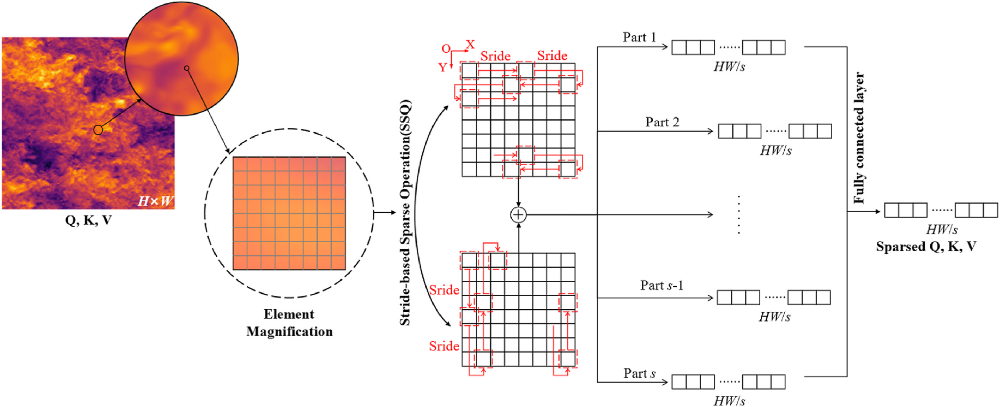

   **图 1** 基于步长的稀疏操作示意图。H 和 W 分别对应风场的高度与宽度。

   图内文字：Element Magnification：单元放大；Stride：步长；Part：分组；Fully connected layer：全连接层；Sparsed Q, K, V：稀疏化后的 Q、K、V；SSO：基于步长的稀疏操作；各分组序列长度标为 HW/s。

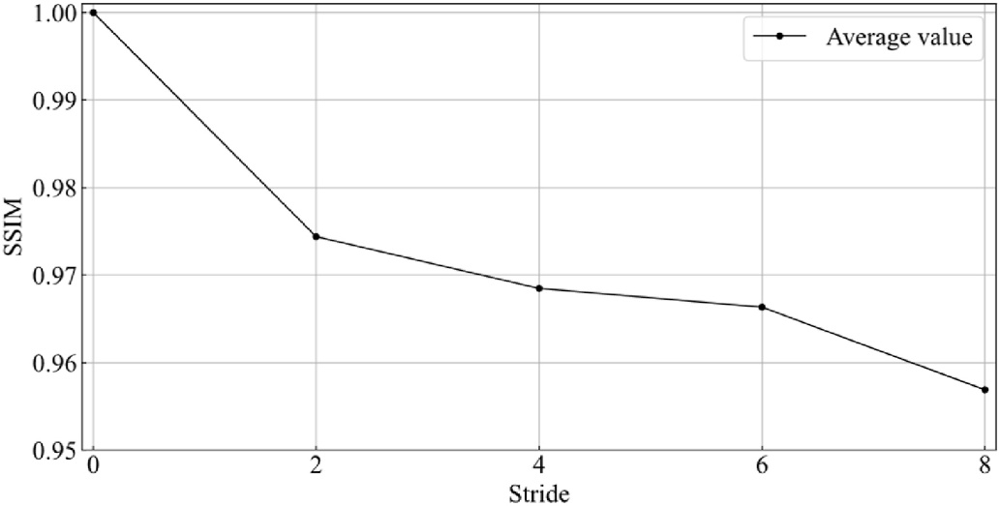

   **图 2** 不同步长对基于步长的稀疏操作结构相似性的影响。

   图内文字：横轴 Stride：步长；纵轴 SSIM：结构相似性指数；Average value：平均值。

.. math::

   \operatorname{SSIM}(x,y)=\frac{(2\mu_x\mu_y+c_1)(2\sigma_{xy}+c_2)}{(\mu_x^2+\mu_y^2+c_1)(\sigma_x^2+\sigma_y^2+c_2)}\qquad (1)

其中 :math:`c_1=(0.01S)^2` ， :math:`c_2=(0.03S)^2` ， :math:`S` 为风速范围， :math:`\mu_x` 和 :math:`\mu_y` 表示均值， :math:`\sigma_x^2` 和 :math:`\sigma_y^2` 是 :math:`x` 和 :math:`y` 的方差， :math:`\sigma_{xy}` 是二者的协方差。随着步长增大，SSIM 在统计上减小。对于大小为 128、步长为 2、4、6、8 的情况，平均 SSIM 分别为 0.9744、0.9685、0.9663、0.9569。这证实了 SSO 过程中高频特征的损失，但减少少量信息可以降低注意力计算复杂度。

所提稀疏窗口注意力见图 3，其稀疏策略通过引入 SSO 实现。它包括稀疏窗口多头自注意力（SPW-MSA）和移位稀疏窗口多头自注意力（SSPW-MSA）。首先，通过窗口划分操作对特征图进行分割。与原始 Swin-Transformer [38]_ 不同，本文使用更大的窗口以提取大尺度湍流特征。分割后的部分被转换为查询 :math:`Q\subseteq\mathbb R^{L^2\times D_k}` 、键 :math:`K\subseteq\mathbb R^{L^2\times D_k}` 和值 :math:`V\subseteq\mathbb R^{L^2\times D_k}` ，其中 :math:`L^2` 是 Q、K、V 矩阵的长度， :math:`D_k` 是每个头的维数。随后，使用 SSO 对窗口部分进一步稀疏化，再以式（2）的缩放点积注意力计算注意力分数。注意力序列经过转换并重塑为初始尺寸，以维持结构一致性和模块化。

.. math::

   \operatorname{Attention}(Q_1,K_1,V_1)=\operatorname{softmax}\left(\frac{Q_1K_1^{\mathsf T}}{\sqrt{D_k}}\right)V_1\qquad (2)

其中 :math:`Q_1\subseteq\mathbb R^{(L^2/s)\times D_k}` 、 :math:`K_1\subseteq\mathbb R^{(L^2/s)\times D_k\times D_k}` 和 :math:`V_1\subseteq\mathbb R^{(L^2/s)\times D_k}` 分别为 SSO 处理后的查询、键和值矩阵， :math:`s` 表示步长。为促进相邻窗口间的信息交换，SSPW-MSA 在窗口划分前应用移位操作。对于长度为 :math:`h` 、宽度为 :math:`w` 、总通道维数为 :math:`c` 、窗口大小为 :math:`L` 的图块，全局 MSA、W-MSA 和 SPW-MSA 的计算复杂度分别列于式（3）至（5）。

.. math::

   \Omega(\mathrm{MSA})=4hwc^2+2(hw)^2c\qquad (3)

.. math::

   \Omega(\mathrm{W-MSA})=4hwc^2+2L^2hwc^2\qquad (4)

.. math::

   \Omega(\mathrm{SPW-MSA})=4hwc^2+4\frac{L^2}{s^2}hwc\qquad (5)

当窗口大小小于图块大小，且步长不小于 2 时，SPW-MSA 的计算复杂度低于窗口多头自注意力（W-MSA）；同时，随步长值增大，其计算复杂度按二次关系减小。

.. note::

   原文差异说明：本小节将标准 Swin-Transformer 引向文献 [12]_ ，但文献 [12]_ 为 Attention Is All You Need，原始 Swin-Transformer 对应文献 [38]_ 。式（2）下方的 :math:`K_1` 维数在源文重复包含 :math:`D_k` ，式（4）第二项也确实写为 :math:`c^2` ，此处保留原式而不推定修正。式（5）只有第二项按 :math:`1/s^2` 缩减，第一项 :math:`4hwc^2` 不随步长改变；不能由此认定整个模型都获得平方加速。

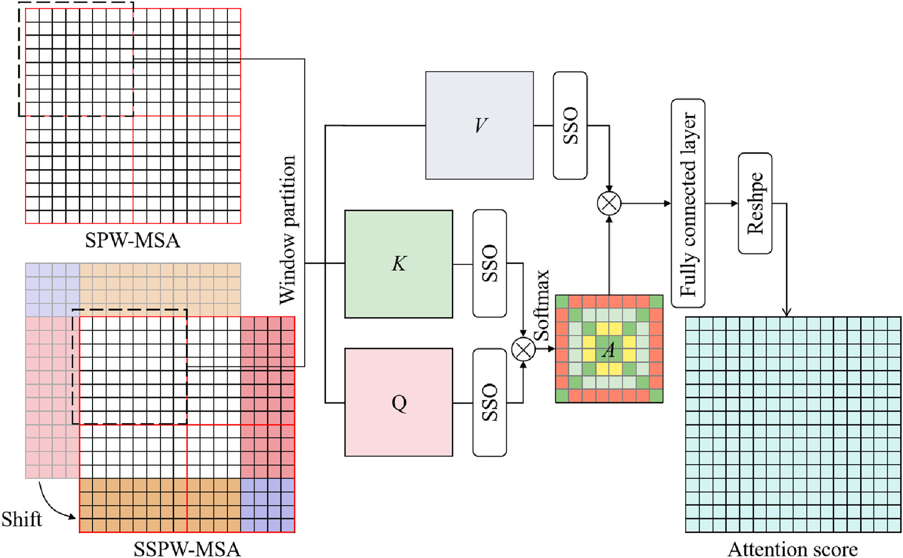

   **图 3** 稀疏窗口注意力的架构。

   图内文字：Window partition：窗口划分；Shift：移位；SSO：基于步长的稀疏操作；Softmax：归一化指数函数；Fully connected layer：全连接层；Reshape：重塑；Attention score：注意力分数；Q、K、V：查询、键、值；SPW-MSA 与 SSPW-MSA 分别对应未移位与移位窗口。

2.1.2 模型框架
^^^^^^^^^^^^^^^^^^^^^^^^^^^^^^^^^^^^^^^^^^^^^^^^^^^^^^^^^^^^^^^^^^^^^^^^^^^^^^^^

图 4 给出了 WTT-SRST 的详细结构，该模型由一系列编码与解码单元构成。编码单元从上一层输出中提取特征，将其转化为紧凑、抽象的表示空间，由窗口划分、稀疏窗口注意力块（SPW-AB）和图块合并模块构成。窗口划分将输入拆成大小固定、互不重叠的图块，每个图块称为一个窗口。SPW-AB 负责计算注意力分数。图块合并通过逐步降低特征图空间分辨率，实现模型的层次结构。解码单元不仅从不同表示空间提取特征，还恢复风场空间分辨率并重建湍流。与前一类单元不同，移位稀疏窗口注意力块（SSPW-AB）使用 SSPW-MSA，以促进信息交互，改善长程依赖提取。图块扩展替代图块合并，建立逐级提高空间分辨率的层次架构。此外，跳跃连接将编码器特征传递至对应解码层，有助于保留风场细节与特征。模型以两个连续风场快照为输入，输出包含 :math:`k+2` 个风场快照的完整演化过程，包括输入快照和 :math:`k` 个预测快照。与 Swin-Transformer 相比，所提架构更简单，层间维度变化较少，通过高效特征传递及减少资源消耗，提高计算效率。

WTT-SRST 的完整过程如下。两个连续风场快照通过特征嵌入模块（图 4(b)），在空间与通道维度上映射到更高维表示空间。该模块包含两个投影层、一个多层感知机层和一个层归一化层。空间变换通过卷积与像素重排（Pixel Shuffle） [40]_ 实现，上采样倍数设为 2。通道变换仅由卷积操作实现，隐藏维数设为 96。同时，在高维表示空间中编码位置信息。空间解耦位置模块（SDPM）基于这样一种思想：分布式表示适合提取数据分布的固有特征，其公式见文献 [38]_ 。随后，将特征图输入多个特征提取器。每个提取器至少包含一个 SPW-AB 或 SSPW-AB 以及窗口划分，部分提取器还包含图块合并。如图 4(c)、(d) 所示，注意力模块去除了 Swin-Transformer 中注意力机制的连续结构，编码使用 SPW-MSA，解码使用 SSPW-MSA。其余组成包括一个层归一化层、多层感知机层及跳跃连接。图 4(e)、(f) 展示图块合并与扩展模块的架构，其中层归一化和全连接层用于将通道数减半或加倍，并提高表达能力。最后，所得特征被转换至 HTR 数据的维度空间，经输出头层生成风场快照。

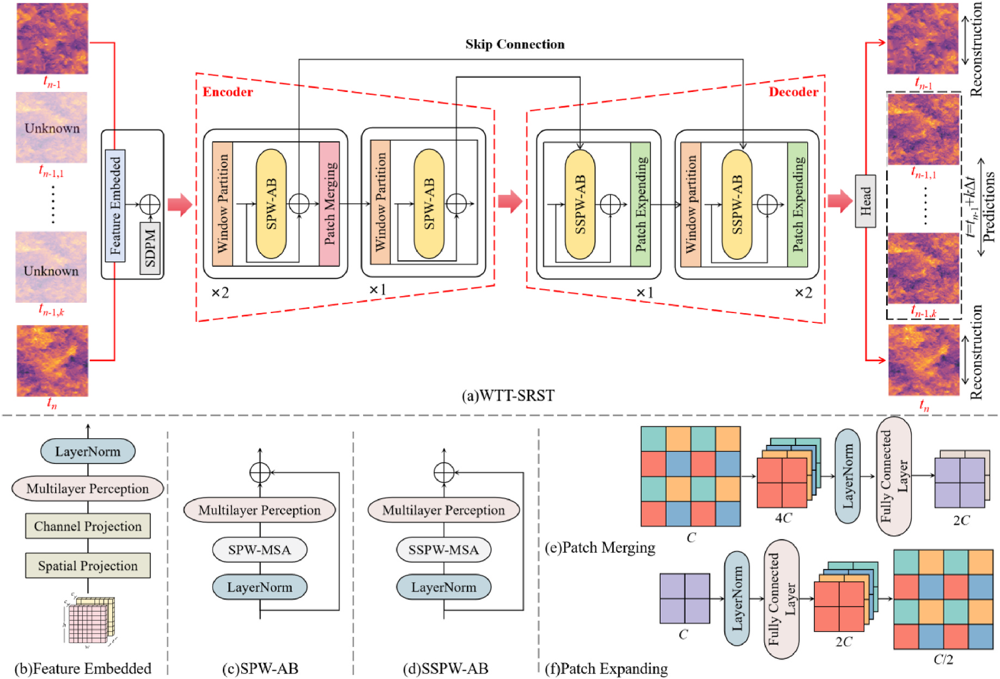

   **图 4** (a) 所提 WTT-SRST 的详细结构；(b) 特征嵌入模块架构；(c) SPW-AB 架构；(d) SSPW-AB 架构；(e) 图块合并架构；(f) 图块扩展架构。SDPM 表示空间解耦位置模块。

   图内文字：Encoder/Decoder：编码器/解码器；Skip Connection：跳跃连接；Feature Embedded：特征嵌入；Window Partition：窗口划分；Patch Merging/Expanding：图块合并/扩展；LayerNorm：层归一化；Multilayer Perception：多层感知机；Channel/Spatial Projection：通道/空间投影；Head：输出头；Unknown：未知；Reconstruction：重建；Predictions：预测；C、4C、2C、C/2 表示通道维数；Fully-Connected Layer：全连接层。

2.1.3 相对物理信息损失
^^^^^^^^^^^^^^^^^^^^^^^^^^^^^^^^^^^^^^^^^^^^^^^^^^^^^^^^^^^^^^^^^^^^^^^^^^^^^^^^

此前基于深度学习的超分辨率方法，通常按自然图像模式处理湍流 [41]_ ，较少考虑能量级联与湍流耗散等内在、具有物理信息的流动性质 [15]_ [16]_ [42]_ 。本研究提出一种新的物理约束，将三维不可压缩 Navier–Stokes（N-S）方程隐式纳入损失函数，引导梯度下降，见式（6）。RPL 方法显著增强生成风场的物理一致性。具体而言，连续性方程表达控制体内的质量守恒；动量方程描述作用在流体上的外力与体力之和如何影响动量变化率。

.. math::

   \left\{\begin{aligned}
   \frac{\partial U}{\partial t}+U\frac{\partial U}{\partial X}+V\frac{\partial U}{\partial Y}+W\frac{\partial U}{\partial Z}&=-\frac1\rho\frac{\partial P}{\partial X}+\upsilon\left(\frac{\partial^2U}{\partial X^2}+\frac{\partial^2U}{\partial Y^2}+\frac{\partial^2U}{\partial Z^2}\right),\\
   \frac{\partial V}{\partial t}+U\frac{\partial V}{\partial X}+V\frac{\partial V}{\partial Y}+W\frac{\partial V}{\partial Z}&=-\frac1\rho\frac{\partial P}{\partial Y}+\upsilon\left(\frac{\partial^2V}{\partial X^2}+\frac{\partial^2V}{\partial Y^2}+\frac{\partial^2V}{\partial Z^2}\right),\\
   \frac{\partial W}{\partial t}+U\frac{\partial W}{\partial X}+V\frac{\partial W}{\partial Y}+W\frac{\partial W}{\partial Z}&=-\frac1\rho\frac{\partial P}{\partial Z}+\upsilon\left(\frac{\partial^2W}{\partial X^2}+\frac{\partial^2W}{\partial Y^2}+\frac{\partial^2W}{\partial Z^2}\right),\\
   \frac{\partial U}{\partial X}+\frac{\partial V}{\partial Y}+\frac{\partial W}{\partial Z}&=0.
   \end{aligned}\right.\qquad (6)

其中 :math:`\rho=1.29\,\mathrm{kg/m^3}` 为空气密度， :math:`\upsilon` 为动力黏度。重建风场需要满足上述控制方程，但存在两个主要挑战：（1）模型训练过程中 N-S 方程并不满足；（2）本研究关注二维风场，使 Z 方向分量的计算变得复杂。为解决这一问题，式（7）给出 N-S 方程的残差形式以抵消其影响。左侧表示残差分量，右侧由生成风场推导得到。

.. math::

   \left\{\begin{aligned}
   e_U&:=e_{U0}-W\frac{\partial U}{\partial Z}+\upsilon\frac{\partial^2U}{\partial Z^2}\\
      &=\frac{\partial U}{\partial t}+U\frac{\partial U}{\partial X}+V\frac{\partial U}{\partial Y}+\frac1\rho\frac{\partial P}{\partial X}-\upsilon\left(\frac{\partial^2U}{\partial X^2}+\frac{\partial^2U}{\partial Y^2}\right),\\
   e_V&:=e_{V0}-W\frac{\partial V}{\partial Z}+\upsilon\frac{\partial^2V}{\partial Z^2}\\
      &=\frac{\partial V}{\partial t}+U\frac{\partial V}{\partial X}+V\frac{\partial V}{\partial Y}+\frac1\rho\frac{\partial P}{\partial Y}-\upsilon\left(\frac{\partial^2V}{\partial X^2}+\frac{\partial^2V}{\partial Y^2}\right),\\
   e_W&:=e_{W0}-W\frac{\partial W}{\partial Z}+\frac{\partial^2W}{\partial Z^2}\\
      &=\frac{\partial W}{\partial t}+U\frac{\partial W}{\partial X}+V\frac{\partial W}{\partial Y}+\frac1\rho\frac{\partial P}{\partial Z}-\upsilon\left(\frac{\partial^2W}{\partial X^2}+\frac{\partial^2W}{\partial Y^2}\right),\\
   e_{\mathrm{div}}&:=e_{\mathrm{div}0}-\frac{\partial W}{\partial Z}=\frac{\partial U}{\partial X}+\frac{\partial V}{\partial Y}.
   \end{aligned}\right.\qquad (7)

其中 :math:`e` 为残差项。所得 :math:`e` 不仅代表系统误差，也包含仍未求解的分量。理论上，期望深度学习模型生成的这些分量与参考结果中的对应分量一致，因此训练过程中无需求解这些分量。本文采用残差项的相对形式作为损失函数，见式（8）至（10）。使用均方根方法，增强对较大误差的惩罚。

.. math::

   L_{\mathrm{TOTAL}}=L_c+\alpha L_s+\beta L_m\qquad (8)

.. math::

   L_s=\sqrt{(e'_U-e_U)^2}+\sqrt{(e'_V-e_V)^2}+\sqrt{(e'_W-e_W)^2}\qquad (9)

.. math::

   L_m=\sqrt{(e'_{\mathrm{div}}-e_{\mathrm{div}})^2}\qquad (10)

其中 :math:`L_{\mathrm{TOTAL}}` 表示损失函数， :math:`L_c` 表示以均方误差（MSE）计算的内容损失， :math:`L_s` 表示相对连续性残差项， :math:`L_m` 为相对动量残差项， :math:`\alpha` 为连续性权重系数， :math:`\beta` 为动量权重系数， :math:`e'` 表示参考残差结果。

.. note::

   原文差异说明：式（7）第三行左侧的 :math:`\partial^2W/\partial Z^2` 前没有 :math:`\upsilon` ，此处按源文保留。原文将 :math:`\upsilon` 称为动力黏度，但式（6）的写法对应的黏度量纲需另行澄清。式（9）以速度动量残差构成 :math:`L_s` ，式（10）以散度残差构成 :math:`L_m` ，却与紧随其后的文字定义相反；表 2–5 又使用 :math:`L_s+\alpha L_c+\beta L_m` 而不是式（8）的顺序。以上差异均保留，不能据此认定唯一的实现方式。RPL 比较重建场与参考场的二维可计算残差，依赖未解析分量可比的假设，并非将完整三维 N-S 残差强制压至零。

2.2 任务概述
~~~~~~~~~~~~~~~~~~~~~~~~~~~~~~~~~~~~~~~~~~~~~~~~~~~~~~~~~~~~~~~~~~~~~~~~~~~~~~~~

图 5 展示城市风力机附近的建筑环境。HTR 风场为风力机布置与电网接入提供科学依据。政策制定者可制定兼顾经济效益、环境可持续性和社会影响的长期能源战略。制造商还可优化风力机叶片和转子，降低故障与损坏风险。对投资者而言，收益和前景至关重要。这有助于减轻调峰与调频负担，同时维持风力机的高效运行与维护。

完整 TSR-TF 流程概括如下，并进一步示于图 6。通过 LES 模拟构建时空风场，然后提取保存的风场用于 TSR-TF。HTR 指在给定时间内记录更多风场快照，LTR 则对应较少的记录快照。可以观察到，LTR 风场往往为了降低计算负担而舍去高频脉动。相比之下，HTR 结果对动态行为的描述更接近真实，但硬件限制了其实现。本研究旨在由相对 LTR 的模拟数据重建精细尺度流动演化。给定 HTR 湍流场 :math:`q(t_{\mathrm{HTR}})\in\mathbb R^{(k+2)\times H\times W\times3}` 及对应的 LTR 场 :math:`q(t_{\mathrm{LTR}})\in\mathbb R^{2\times H\times W\times3}` ，TSR-TF 过程表示为：

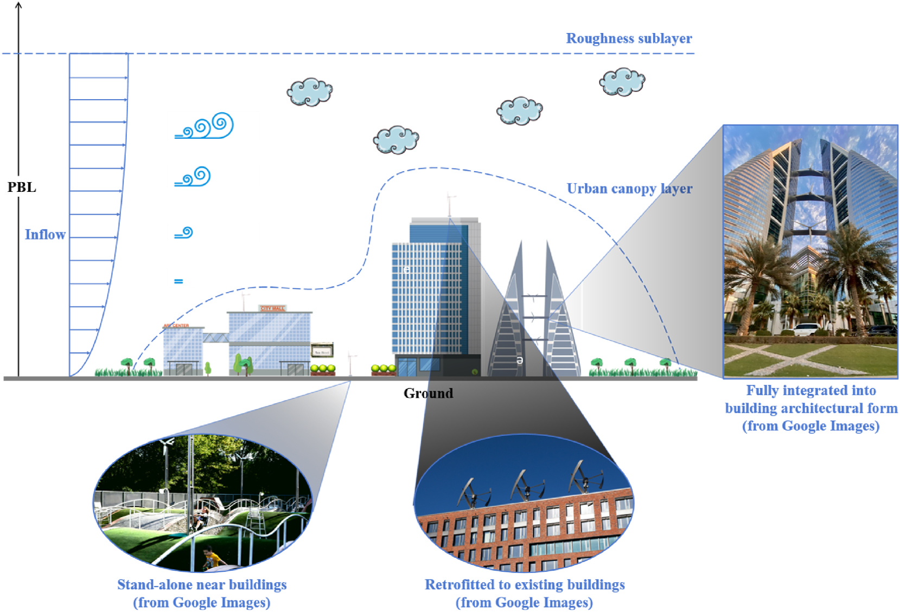

   **图 5** 城市风力机附近建筑环境示意图。

   图内文字：PBL：行星边界层；Inflow：来流；Roughness sublayer：粗糙子层；Urban canopy layer：城市冠层；Ground：地面；Stand-alone near buildings：建筑附近独立设置；Retrofitted to existing buildings：既有建筑加装；Fully integrated into building architectural form：与建筑形态完全一体化。三张示意照片旁的 from Google Images 为原图标注的图片出处。

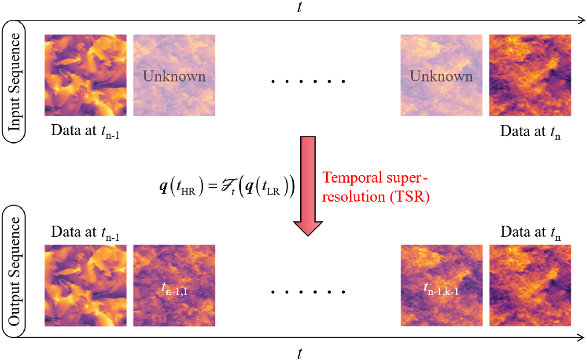

   **图 6** 风场快照的时间超分辨率流程。

   图内文字：Input/Output Sequence：输入/输出序列；Unknown：未知；Data at t：t 时刻的数据；Temporal super-resolution (TSR)：时间超分辨率；上方与下方的 t 为时间轴；已知端点为 tₙ₋₁ 和 tₙ，中间快照为模型生成。

.. math::

   q(t_{\mathrm{HR}})=F_t\bigl(q(t_{\mathrm{LR}})\bigr)\qquad (12)

模型以 :math:`t_{n-1}` 和 :math:`t_n` 时刻的风场快照作为输入，速度分量在三维笛卡尔坐标系下表示。权重 :math:`\omega` 对输入数据执行一系列数学运算，生成输出。输出对应更精细的风序列，其中包括输入快照以及 :math:`t_{n-1}` 与 :math:`t_n` 之间生成的风场快照。训练过程可以写为：

.. math::

   \omega=\operatorname*{argmin}_{\omega}\left[L_{\mathrm{TOTAL}}\bigl(y,F(x;\omega)\bigr)\right],

其中 :math:`F` 为映射函数。

原文编号说明：式（12）在 PDF 文件第 7 页先出现，式（11）在第 8 页的下一节出现；此处保留该原始编号顺序。

3 训练准备
--------------------------------------------------------------------------------

3.1 原始数据
~~~~~~~~~~~~~~~~~~~~~~~~~~~~~~~~~~~~~~~~~~~~~~~~~~~~~~~~~~~~~~~~~~~~~~~~~~~~~~~~

3.1.1 TPU 的缩尺 PBL 风
^^^^^^^^^^^^^^^^^^^^^^^^^^^^^^^^^^^^^^^^^^^^^^^^^^^^^^^^^^^^^^^^^^^^^^^^^^^^^^^^

本研究使用 LES 模拟 PBL 风，解析较大涡旋，同时对较小涡旋进行参数化。采用一致离散随机流生成（CDRFG）方法生成入流湍流。该方法保持能谱与空间相干函数的一致性和灵活性 [43]_ 。入口流动由平均项和脉动项组成，如式（11）所示。

.. math::

   \boldsymbol U=\overline{\boldsymbol U}+\boldsymbol u\qquad (11)

其中 :math:`\boldsymbol U=(U,V,W)^{\mathsf T}` 为瞬时速度矢量，依次表示纵向、横向和竖向分量； :math:`\overline{\boldsymbol U}=(U_{\mathrm{avg}},0,0)^{\mathsf T}` 为平均速度矢量； :math:`\boldsymbol u=(u,v,w)^{\mathsf T}` 为脉动速度矢量。CDRFG 方法需要满足两个条件，才能符合 Taylor 冻结假设：（1）入口平面足够大；（2）网格分辨率足够高。在每个时间步施加修正因子，校正脉动速度并保持入口质量平衡 [44]_ 。

本研究所用数据来自东京工艺大学（TPU）的风洞试验。表 1 给出 CDRFG 方法的湍流特征及配置。由于 TPU 仅提供 1 m 高度以内纵向湍流强度的试验值，本文假定 1 m 以上的湍流强度保持不变。横向与竖向湍流强度根据工程科学数据机构（ESDU）标准确定。按照 Wang 和 Chen [44]_ ，X 方向的纵向积分尺度为 0.5 m，而 Y、Z 方向取纵向尺度的一半。选用参考高度 0.4 m、参考风速 11 m/s 的 Von Kármán 谱。CDRFG 方法的最大与最小频率分别为 100 Hz 和 0.5 Hz。

.. list-table:: 表 1 CDRFG 方法的湍流特征与配置 [45]_
   :header-rows: 1
   :widths: auto

   * - 参数
     - 定义/数值
   * - 平均速度
     - :math:`U_{\mathrm{avg}}(z)=U_H(z/H_z)^\alpha` ，其中 :math:`U_{0.4}=11\,\mathrm{m/s}` ， :math:`\alpha=0.25`
   * - 湍流强度
     - :math:`I_v(z)=0.78I_u(z)` ， :math:`I_w(z)=0.55I_u(z)`
   * - Von Kármán 谱
     - 如下列三式；频率范围均为 :math:`f\in[0,\infty)`
   * - 积分尺度
     - :math:`L_u^x(z)=0.5\,\mathrm m` ， :math:`L_v^x(z)=0.5L_u^x(z)` ， :math:`L_w^x(z)=0.5L_u^x(z)`
   * - CDRFG 参数
     - :math:`\langle f_{\max},f_{\min},M_n,N_n,C,C_j,D_c\rangle=\langle100\,\mathrm{Hz},50\,\mathrm{Hz},100,50,10,10,0.3\rangle`

表 1 中的 Von Kármán 谱完整表达式为：

.. math::

   \begin{aligned}
   S_{uu}(f)&=\frac{4(I_uU_{\mathrm{avg}})^2(L_u^x/U_{\mathrm{avg}})}{[1+70.8(fL_u^x/U_{\mathrm{avg}})^2]^{5/6}},\qquad f\in[0,\infty),\\
   S_{vv}(f)&=\frac{4(I_vU_{\mathrm{avg}})^2(L_v^x/U_{\mathrm{avg}})\{1+188.4[2f(L_v^x/U_{\mathrm{avg}})]^2\}}{[1+70.8(2fL_v^x/U_{\mathrm{avg}})^2]^{11/6}},\qquad f\in[0,\infty),\\
   S_{ww}(f)&=\frac{4(I_wU_{\mathrm{avg}})^2(L_w^x/U_{\mathrm{avg}})\{1+188.4[2f(L_w^x/U_{\mathrm{avg}})]^2\}}{[1+70.8(fL_w^x/U_{\mathrm{avg}})^2]^{11/6}},\qquad f\in[0,\infty).
   \end{aligned}

表注：文献 [45]_ 讨论了所列参数的含义。

.. note::

   原文差异说明：表 1 将最小频率列为 50 Hz，而正文写为 0.5 Hz；两处数值均按原文保留。表中 :math:`S_{ww}` 分子的修正项含 :math:`2f` ，分母写为 :math:`f` ，与 :math:`S_{vv}` 分母的写法不同；此处没有擅改。

LES 使用 OpenFOAM v2206 的瞬态 PimpleFoam 求解器。图 7 展示本文空风场的尺寸。计算域尺寸为 :math:`8\,\mathrm m\times4\,\mathrm m\times1.6\,\mathrm m` ，缩尺比为 1:400。为提高 LES 精度，整个计算域划分为三个加密区。区域 1 至区域 3 的网格尺寸从 0.04 m 变化到 0.01 m，总网格数为 :math:`3.85\times10^6` 。两侧采用周期边界，顶部采用对称边界，底部设为无滑移壁面。亚格子尺度模型选用壁面自适应局部涡黏性（WALE）模型。时间离散使用后向格式，空间离散使用线性迎风稳定输运格式。由于区域 3 所需存储量过大，仅保留其中一部分区域（记为区域 4）用于保存。总模拟时间为 7 s，每 0.0005 s 保存瞬时结果，共 14000 个时间步。风速、压力与黏度以网络通用数据格式（NetCDF）存储，供后续模型训练使用。

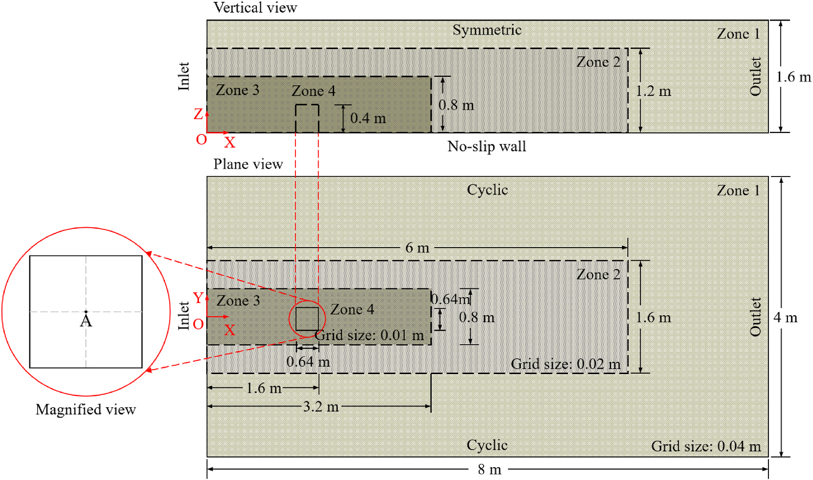

   **图 7** 缩尺数值算例的尺寸与数学设置。A 为中心点。

   图内文字：Vertical view：立面图；Plane view：平面图；Magnified view：放大图；Inlet/Outlet：入口/出口；Symmetric：对称；Cyclic：周期；No-slip wall：无滑移壁面；Zone 1–4：区域 1–4；Grid size：网格尺寸。图示保留 8 m、4 m、1.6 m 计算域尺寸，以及 6 m、3.2 m、1.6 m、1.2 m、0.8 m、0.4 m、0.64 m 等局部尺寸与 0.04/0.02/0.01 m 网格标注。

3.1.2 风电场的全尺度 PBL 风
^^^^^^^^^^^^^^^^^^^^^^^^^^^^^^^^^^^^^^^^^^^^^^^^^^^^^^^^^^^^^^^^^^^^^^^^^^^^^^^^

进一步通过全尺度 PBL 模拟验证所提模型的适用性。采用约翰斯·霍普金斯大学开放风电场数据集 Johns Hopkins Turbulence Database（JHTDB）-Wind。其纵向、横向和竖向覆盖范围为 :math:`15876\,\mathrm m\times1260\,\mathrm m\times2400\,\mathrm m` ，相应网格间距分别为 18.375 m、8.75 m、5 m。使用开源大涡模拟模型 [46]_ 获取流场。图 8 给出计算域设置及风力机空间布置。入流湍流在前驱计算域中生成，并使用边缘过渡区保证流入与流出的守恒。采用具有展向周期边界的并行前驱入流方法，并引入科里奥利力模拟风向随高度变化的影响。其他方向均采用周期边界条件。昼夜流动循环由 24 小时周期的太阳地表加热及后续夜间辐射冷却驱动。通过一维土壤热传导模型描述土壤蓄热及土壤与大气间的热交换。风电场包含 8 台 NREL 5 MW 风力机，采用两行四列布局。每台风力机直径为 126 m，轮毂高度为 90 m。总运行时间为 24 h，时间分辨率为 0.5 s。从数据集中选取连续 2 h 进行研究，共 14400 个时间步。

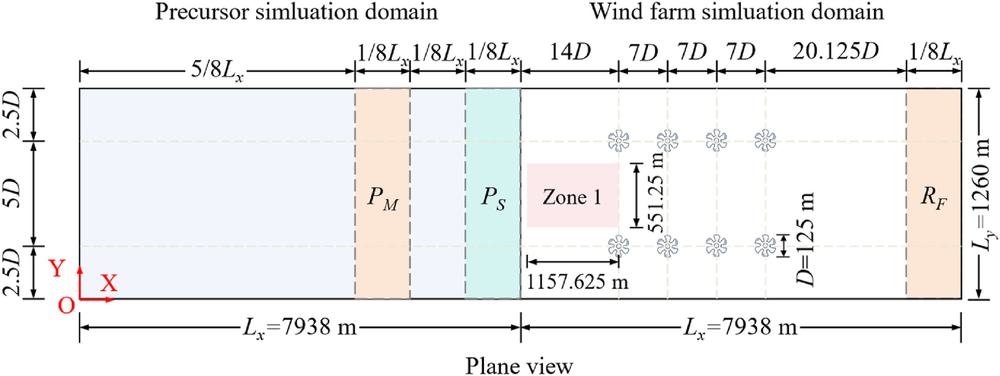

   **图 8** 风电场的空间布局与几何规格。PM 表示前驱映射区域；PS 表示前驱展向移位区域；RF 为边缘过渡区；D 为风力机直径；Lₓ 为风电场计算域长度；Lᵧ 为计算域宽度。

   图内文字：Precursor simulation domain：前驱模拟域；Wind farm simulation domain：风电场模拟域；Zone 1：区域 1；Plane view：平面图；坐标 X、Y 标明方向；前驱域与风电场域各长 7938 m，宽 1260 m；区域 1 尺寸为 1157.625 m×551.25 m；图中的风力机直径 D=125 m 与正文 126 m 不一致，均按原文保留。

3.2 数据预处理
~~~~~~~~~~~~~~~~~~~~~~~~~~~~~~~~~~~~~~~~~~~~~~~~~~~~~~~~~~~~~~~~~~~~~~~~~~~~~~~~

用于生成原始数据的试验配置列于表 2–5。采用 LES 生成 HTR 风场快照。训练时，对风序列下采样得到相应 LTR 数据集，而实际应用中，这些结果来自数值模拟。因此，在测试阶段，对风序列取平均，滤除部分高频分量，模拟理想条件下的 LTR 数值模拟结果。对于 TPU 缩尺算例，选取不同超分辨率倍数对应的 0.0015 s、0.0030 s 与 0.0045 s，以评估总体性能。考虑到图形处理单元（GPU）显存不足以处理区域 4（图 7），选取尺寸为 :math:`0.64\,\mathrm m\times0.64\,\mathrm m` 的截面进行 TSR-TF。该平面垂直于竖直方向，绝对高度为 0.2 m，空间分辨率为 0.01 m。另一个关注点是稀疏窗口注意力的稀疏程度，本文通过不同步长的性能变化进行考察，选用步长 2 和 4。可靠性试验涉及不同等级的高斯噪声、计算成本效率，以及 RPL 各组成项的贡献，配置见表 3、4。稳定性分析使用零均值高斯噪声扰动输入数据。此外，以二氧化碳当量（CO2e）量化训练与推理阶段能耗，以表示温室气体的综合影响。对 JHTDB-Wind 数据集，选取风力机上游、轮毂高度处的 :math:`64\times64` 风场（区域 1）进行讨论。验证集采用 1.5 s、3.0 s 和 4.5 s 的低时间分辨率输入。将所得数据转换为四维矢量用于训练与推理，第一维为时间步，第二维为变量数量，第三、第四维为风场空间维度。基于随机搜索策略，选取 :math:`\langle\alpha,\beta\rangle=\langle0.02,0.015\rangle` 。

比较方法包括线性插值与风湍流超分辨率 Swin-Transformer（WTSR-ST） [47]_ 。具体而言，线性插值假定两个快照之间的变化率恒定，因其简单、快速而得到采用，但精度相对较低，提取数据复杂变化与非线性特征的能力受到限制。WTSR-ST 创新性地将 Swin-Transformer 主干用于风场超分辨率。一系列试验表明，无论是 MSE、平均绝对误差（MAE）、平均绝对百分比误差（MAPE）等逐点指标，还是 SSIM、概率密度函数（PDF）等感知指标，其表现均优于基于 CNN 的方法。尽管该模型最初用于空间超分辨率，本文主要比较模型结构和注意力计算形式。仅修改输入层与输出头层，即可使 WTSR-ST 适用于 TSR-TF。WTSR-ST 使用未经二次稀疏化的窗口注意力，因此适合作为比较基准。

.. list-table:: 表 2 数值计算域用于训练与测试的试验工况
   :header-rows: 1
   :widths: auto

   * - 工况名称
     - LTR（s）
     - HTR（s）
     - 损失
     - 训练时段（s）
     - 测试时段（s）
     - 步长
   * - F1-CM
     - 0.0015
     - 0.0005
     - :math:`L_s+\alpha L_c+\beta L_m`
     - 0.5–6.0
     - 6.0–7.0
     - 2；4
   * - F2-CM
     - 0.0030
     - 0.0005
     - :math:`L_s+\alpha L_c+\beta L_m`
     - 0.5–6.0
     - 6.0–7.0
     - 2；4
   * - F3-CM
     - 0.0045
     - 0.0005
     - :math:`L_s+\alpha L_c+\beta L_m`
     - 0.5–6.0
     - 6.0–7.0
     - 2；4

表 2 注：首字母表示试验类型（F 为正式试验），随后的数字表示编号；末尾字母说明训练时使用的损失函数组成项（C 为相对连续性残差，M 为相对动量残差）。

.. list-table:: 表 3 数值计算域用于稳定性分析的试验工况
   :header-rows: 1
   :widths: auto

   * - 工况名称
     - LTR（s）
     - HTR（s）
     - 损失
     - 时段（s）
     - 噪声类型
     - 均值（m/s）
     - 方差（m²/s²）
     - 步长
   * - S1-CM
     - 0.0015
     - 0.0005
     - :math:`L_s+\alpha L_c+\beta L_m`
     - 6.0–7.0
     - 高斯
     - 0
     - 0/0.5/1.0/1.5
     - 2
   * - S2-CM
     - 0.0030
     - 0.0005
     - :math:`L_s+\alpha L_c+\beta L_m`
     - 6.0–7.0
     - 高斯
     - 0
     - 0/0.5/1.0/1.5
     - 2
   * - S3-CM
     - 0.0045
     - 0.0005
     - :math:`L_s+\alpha L_c+\beta L_m`
     - 6.0–7.0
     - 高斯
     - 0
     - 0/0.5/1.0/1.5
     - 2

表 3 注：首字母表示试验类型（S 为稳定性分析），随后的数字表示编号；末尾字母说明训练时使用的损失函数组成项（C 为相对连续性残差，M 为相对动量残差）。

.. list-table:: 表 4 数值计算域用于消融研究的试验工况
   :header-rows: 1
   :widths: auto

   * - 工况名称
     - LTR（s）
     - 损失
     - 时段（s）
     - 步长
     - HTR（s）
   * - A1
     - 0.0015
     - :math:`L_s`
     - 6.0–7.0
     - 2
     - 0.0005
   * - A1-C
     - 0.0015
     - :math:`L_s+\alpha L_c`
     - 6.0–7.0
     - 2
     - 0.0005
   * - A1-M
     - 0.0015
     - :math:`L_s+\beta L_m`
     - 6.0–7.0
     - 2
     - 0.0005
   * - A1-CM
     - 0.0015
     - :math:`L_s+\alpha L_c+\beta L_m`
     - 6.0–7.0
     - 2
     - 0.0005
   * - A2
     - 0.0030
     - :math:`L_s`
     - 6.0–7.0
     - 2
     - 0.0005
   * - A2-C
     - 0.0030
     - :math:`L_s+\alpha L_c`
     - 6.0–7.0
     - 2
     - 0.0005
   * - A2-M
     - 0.0030
     - :math:`L_s+\beta L_m`
     - 6.0–7.0
     - 2
     - 0.0005
   * - A2-CM
     - 0.0030
     - :math:`L_s+\alpha L_c+\beta L_m`
     - 6.0–7.0
     - 2
     - 0.0005
   * - A3
     - 0.0045
     - :math:`L_s`
     - 6.0–7.0
     - 2
     - 0.0005
   * - A3-C
     - 0.0045
     - :math:`L_s+\alpha L_c`
     - 6.0–7.0
     - 2
     - 0.0005
   * - A3-M
     - 0.0045
     - :math:`L_s+\beta L_m`
     - 6.0–7.0
     - 2
     - 0.0005
   * - A3-CM
     - 0.0045
     - :math:`L_s+\alpha L_c+\beta L_m`
     - 6.0–7.0
     - 2
     - 0.0005

表 4 注：首字母表示试验类型（A 为消融研究），随后的数字表示编号；末尾字母说明训练时使用的损失函数组成项（C 为相对连续性残差，M 为相对动量残差）。

.. list-table:: 表 5 JHTDB-Wind 数据集试验工况
   :header-rows: 1
   :widths: auto

   * - 工况名称
     - LTR（s）
     - HTR（s）
     - 损失
     - 时段
     - 步长
   * - J1-CM
     - 1.5
     - 0.5
     - :math:`L_s+\alpha L_c+\beta L_m`
     - 凌晨 02:00–04:00
     - 2
   * - J2-CM
     - 3.0
     - 0.5
     - :math:`L_s+\alpha L_c+\beta L_m`
     - 凌晨 02:00–04:00
     - 2
   * - J3-CM
     - 4.5
     - 0.5
     - :math:`L_s+\alpha L_c+\beta L_m`
     - 凌晨 02:00–04:00
     - 2

表 5 注：首字母表示试验类型（J 为 JHTDB-Wind 数据集），随后的数字表示编号；末尾字母说明训练时使用的损失函数组成项（C 为相对连续性残差，M 为相对动量残差）。表 2–5 中的损失下标按源表保留，与式（8）至（10）的不一致见 2.1.3 节说明。

3.3 训练配置与评估
~~~~~~~~~~~~~~~~~~~~~~~~~~~~~~~~~~~~~~~~~~~~~~~~~~~~~~~~~~~~~~~~~~~~~~~~~~~~~~~~

将保存的 TPU 风数据划分为三个时间子序列。前 6 s 中，90% 用于训练，10% 用于验证；最后 1 s 保留为独立测试集，以评估所提模型的泛化性能。JHTDB-Wind 数据集按 90% 训练、5% 验证、5% 测试划分。为有效提取全局特征，窗口大小设为相应层特征图的四分之一。注意力头总数为 8。随机梯度下降采用自适应矩估计（Adam）， :math:`\langle\beta_1,\beta_2\rangle=\langle0.9,0.999\rangle` 。按照随机搜索策略，模型以 :math:`4\times10^{-4}` 的初始学习率（LR）训练 200 轮。采用阶梯式衰减策略，每 25 轮将学习率衰减 5%。每次迭代由反向传播算法更新权重，最小化损失并提高精度。训练过程中 GPU 的单批次处理 4 条数据，其余验证试验的单批次处理 8 条数据。损失函数采用 RPL。此外，深度学习计算使用一台高性能计算机，配置双 AMD EPYC 7552 处理器、128 GB DDR4 随机存取存储器（RAM）及一张 NVIDIA RTX3090 独立显卡。系统为 Windows 10，使用 Python 3.7.0 和 PyTorch 1.12.0（CUDA 11.3 编译版本）执行基于 GPU 的张量运算。选取均方根误差（RMSE）、MAE 和 MAPE 等统计指标，评估偏差敏感性与预测稳健性，见式（13）至（15）。

原文差异说明：本段写“前 6 s”，表 2 的训练时段则为 0.5–6.0 s；本文不补造其实际样本索引。全尺度算例也仅采用风电场上游平面，不能据此扩大为复杂城市建筑绕流、尾流全场或风机发电量验证。

.. math::

   \operatorname{RMSE}(I,R)=\sqrt{\frac1{HW}\sum_{i=1}^{H}\sum_{j=1}^{W}(I_{i,j}-R_{i,j})^2}\qquad (13)

.. math::

   \operatorname{MAE}(I,R)=\frac1{HW}\sum_{i=1}^{H}\sum_{j=1}^{W}|I_{i,j}-R_{i,j}|\qquad (14)

.. math::

   \operatorname{MAPE}(I,R)=\frac1{HW}\sum_{i=1}^{H}\sum_{j=1}^{W}\left|\frac{I_{i,j}-R_{i,j}}{I_{i,j}}\right|\times100\%\qquad (15)

其中 :math:`I_{i,j}` 与 :math:`R_{i,j}` 分别表示重建结果和参考结果。为定量评估湍流特征，选用湍流强度（TI）和湍动能（TKE）。TI 表示速度脉动的相对幅值，TKE 表示湍流中的动能分布，数学表达式见式（16）、（17）。展示重建功率谱密度，以验证频率特征的恢复情况。此外，选用相干函数说明重建信号与参考信号的相关性，见式（18）。其取值为 0 至 1，输出精度与物理一致性呈正相关。

.. math::

   I=\frac{u'}{U_{\mathrm{avg}}}\times100\%\qquad (16)

.. math::

   k=\frac32(U_{\mathrm{avg}}I)^2\qquad (17)

.. math::

   \gamma_{xy}(f)=\frac{|S_{xy}(f)|^2}{S_{xx}(f)\cdot S_{yy}(f)}\qquad (18)

其中 :math:`I` 为湍流强度， :math:`k` 为湍动能， :math:`u'` 为湍流脉动速度的均方根， :math:`U_{\mathrm{avg}}` 为平均速度， :math:`S_{xx}(f)` 为重建风序列的功率谱密度， :math:`S_{yy}(f)` 为参考风序列的功率谱密度， :math:`S_{xy}(f)` 为频率 :math:`f` 处的互功率谱密度。

.. note::

   原文差异说明：式（15）分母是重建量 :math:`I_{i,j}` ，不是参考量；源文没有在该式给出近零分母处理规则。式（16）把 TI 表示为百分数，式（17）直接使用 :math:`I` ，没有说明是否先换回比例值。以上均保留原式，不擅自修正，也不与采用另一种 MAPE 定义的结果直接比较。

4 结果与分析
--------------------------------------------------------------------------------

4.1 训练表现
~~~~~~~~~~~~~~~~~~~~~~~~~~~~~~~~~~~~~~~~~~~~~~~~~~~~~~~~~~~~~~~~~~~~~~~~~~~~~~~~

4.1.1 统计评估
^^^^^^^^^^^^^^^^^^^^^^^^^^^^^^^^^^^^^^^^^^^^^^^^^^^^^^^^^^^^^^^^^^^^^^^^^^^^^^^^

图 9 展示重建风场的统计结果。红色实线表示中位数，蓝色三角形表示均值。不同情形的比较表明，随着插值风场快照数量增加，性能下降。尽管如此，均值与中位数始终保持在合理范围内。各方法的四分位距随插值风场快照数量增加而增大。线性插值表现出明显的不可靠性与不稳定性，其四分位距比深度学习方法更大。这说明探索深度学习技术的重要性，因为其能够可靠重建湍流宏观特征。WTSR-ST 的误差指标始终较高，其中 RMSE 略高于 MAE。相比之下，WTT-SRST 的误差指标更低，表现更好。随着插值风场快照数量增加，优化效果更明显。对采用不同步长的 WTT-SRST，增大步长会增强注意力稀疏性，并最终损害统计指标。

使用线性插值时，F1-CM 的 RMSE、MAE、MAPE 分别为 0.0159、0.0098、6.43。采用 WTSR-ST 时，指标降为 0.0024、0.0014、1.05，而 WTT-SRST 可进一步降低误差。步长较小时，统计指标降至 0.0020、0.0013、0.99，原文报告相对 WTSR-ST 分别降低 25.00%、7.14%、4.76%；步长较大时，指标为 0.0021、0.0013、1.01，变化幅度为 12.50%、7.14%、3.81%。对 F2-CM，线性插值结果为 0.0361、0.0244、17.12，而 WTSR-ST 的 RMSE、MAE、MAPE 为 0.0066、0.0050、4.65。同样，WTT-SRST 表现更好：步长较小时，结果为 0.0056、0.0032、2.89，原文报告相对 WTSR-ST 分别降低 15.15%、30.00%、37.85%；步长增大时，指标改善为 0.0053、0.0035、2.95，降幅为 19.70%、30.00%、36.56%。对 F3-CM，线性插值所得 RMSE、MAE、MAPE 为 0.0710、0.0579、31.92，而 WTSR-ST 为 0.0244、0.0179、11.77。此时，WTT-SRST 的优势更加明显。较小步长时，结果降至 0.0099、0.0068、4.83，降幅为 59.02%、62.01%、58.96%；步长增大时，结果降至 0.0107、0.0075、6.07，降幅为 56.15%、58.10%、48.43%。这些发现表明，嵌入物理信息并施加稀疏操作，不会妨碍特征提取，而有助于准确表示瞬时风场。

.. note::

   原文差异说明：上述百分比按正文保留，但部分不能由所列四舍五入数值直接算得。例如，F1-CM 的 RMSE 从 0.0024 降至 0.0020 对应约 16.67%，并非正文的 25.00%；F2-CM 的 MAE 从 0.0050 降至 0.0032 对应 36%，并非正文的 30.00%。不以重新计算的比例替换源文，也不将源文百分比当作已经独立复现的结果。

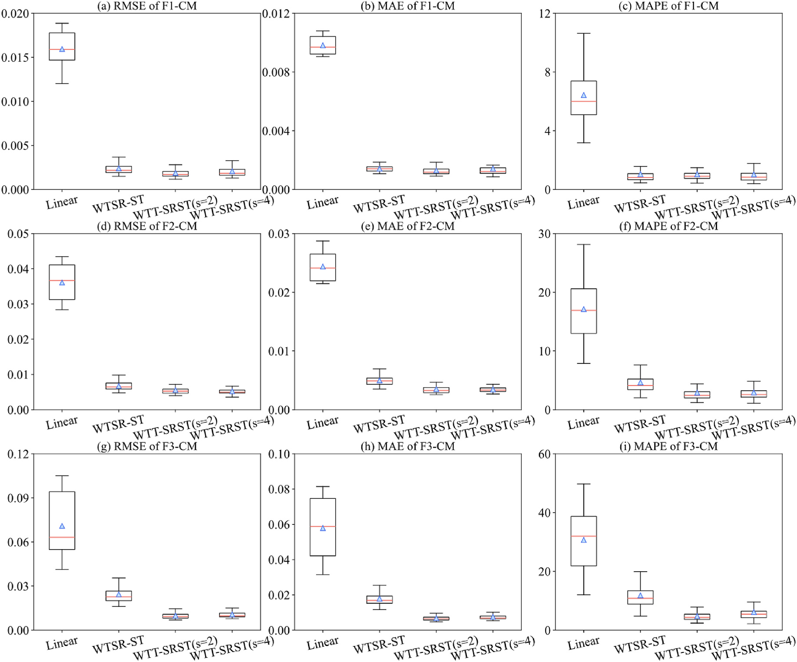

   **图 9** 重建风场与参考风场之间风速偏差的箱线图（RMSE：m/s；MAE：m/s；MAPE：%）。Linear 表示线性插值，WTSR-ST 表示文献 [47]_ 提出的风湍流超分辨率 Swin-Transformer，WTT-SRST 表示本文方法。

   图内文字：(a)–(c) 对应 F1-CM 的 RMSE、MAE、MAPE；(d)–(f) 对应 F2-CM；(g)–(i) 对应 F3-CM。横轴依次比较线性插值、WTSR-ST、WTT-SRST（s=2）、WTT-SRST（s=4）；红线为中位数，蓝色三角形为均值。

图 10、11 展示风场空间特征，表 6 则列出整个风场的 TI 与 TKE 结果。准确表示风场对风力机动力响应计算至关重要，不准确的风场可能导致错误的功率评估。如图所示，U、V、W 分量均表现出显著不均匀性，其中 U 分量的数值较大。偏差主要集中在风速变化显著的区域。综合分析表明，WTT-SRST 生成的风场与参考风场较为一致，能够准确再现湍流脉动的幅值与不规则性，并为能量传递和耗散过程提供可靠预测。较大步长在提高计算效率的同时，降低了提取有效特征的能力。增加插值快照数量，使较大误差的分布范围扩大。

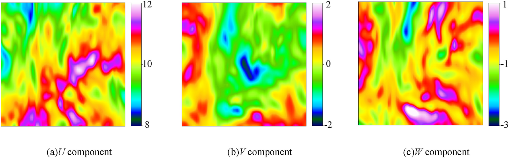

   **图 10** t=2.5 s 时参考风场的云图（单位：m/s）。

   图内文字：(a) U 分量；(b) V 分量；(c) W 分量。各面板均保留独立风速色标。

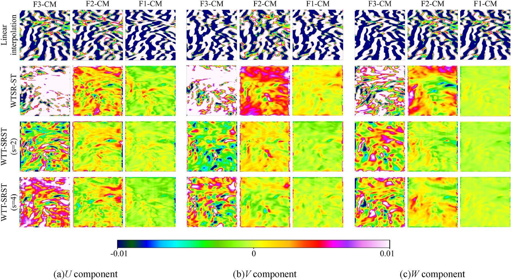

   **图 11** t=2.5 s 时重建风场与参考风场的差值（单位：m/s）。

   图内文字：(a) U 分量；(b) V 分量；(c) W 分量。每组由左到右为 F3-CM、F2-CM、F1-CM；由上到下为线性插值、WTSR-ST、WTT-SRST（s=2）、WTT-SRST（s=4）；底部为共用差值色标。

.. list-table:: 表 6 湍流分析结果汇总（训练阶段）
   :header-rows: 1
   :widths: auto

   * - 指标
     - 方法
     - F1-CM 平均误差百分比
     - F1-CM 标准误差百分比
     - F2-CM 平均误差百分比
     - F2-CM 标准误差百分比
     - F3-CM 平均误差百分比
     - F3-CM 标准误差百分比
   * - TI（%）
     - WTSR-ST
     - 0.08
     - 0.05
     - 0.13
     - 0.08
     - −0.27
     - 0.19
   * - TI（%）
     - WTT-SRST（s=2）
     - 0.03
     - 0.04
     - 0.05
     - 0.07
     - 0.14
     - 0.15
   * - TI（%）
     - WTT-SRST（s=4）
     - 0.05
     - 0.07
     - −0.07
     - 0.07
     - 0.13
     - 0.14
   * - TKE（m²/s²）
     - WTSR-ST
     - 0.015
     - −0.006
     - 0.019
     - −0.005
     - −0.033
     - −0.063
   * - TKE（m²/s²）
     - WTT-SRST（s=2）
     - 0.009
     - −0.003
     - 0.015
     - −0.002
     - 0.017
     - −0.023
   * - TKE（m²/s²）
     - WTT-SRST（s=4）
     - 0.009
     - −0.002
     - 0.016
     - −0.006
     - 0.019
     - −0.017

表 6 注：M_Err_P 表示平均误差百分比；Std_Err_P 表示标准误差百分比。表中负值与原文列名均保留，不能将这一列直接称为始终非负的原始标准差。

图 12 展示 0.5–5.4 s 内 A 点风场的评估，以顺风向误差幅值作为代表性指标。结果表明，增加插值风场快照数量会引起不同程度的性能退化。线性插值产生较大误差，大多数时段的幅值超过图示上限，表明它在重建湍流脉动方面存在明显限制。WTSR-ST 难以捕捉风速脉动，在多个时间步产生显著偏差，且随着插值快照增多而加剧。对 WTT-SRST 而言，湍流脉动特征得到良好反映，重建序列误差较小，方差也较小；插值快照数量较多时，这一效果尤为明显。

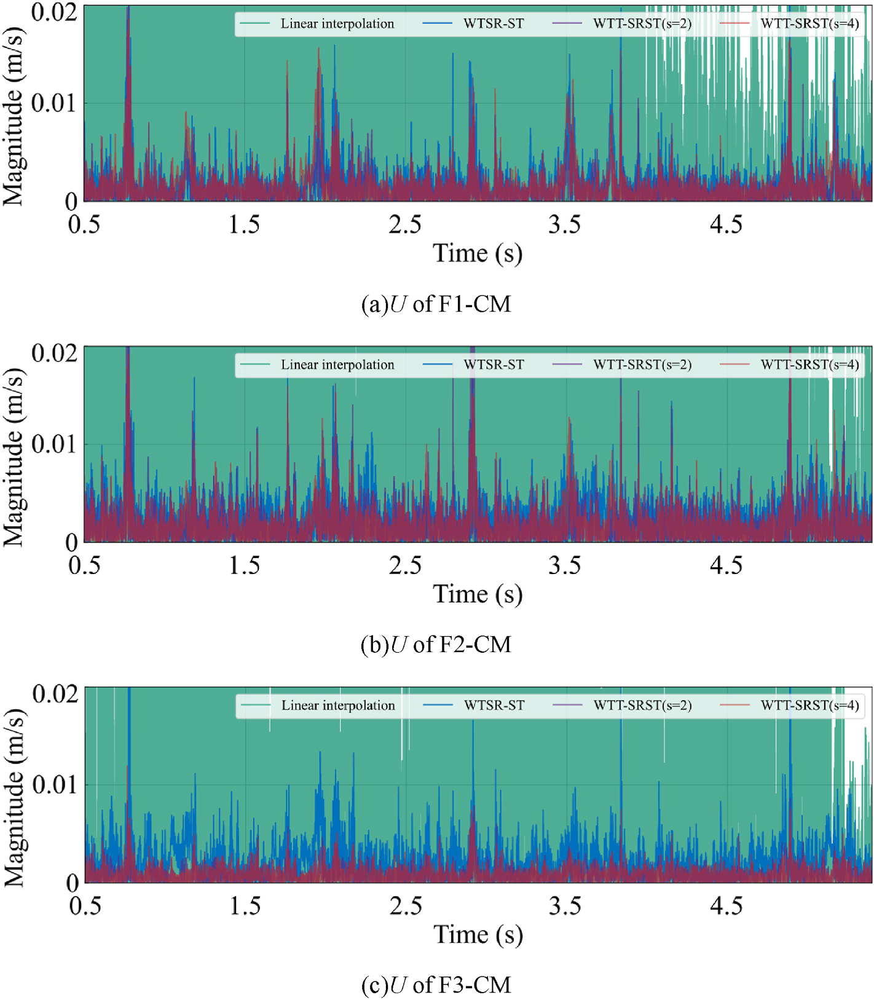

   **图 12** A 点顺风向 MSE 幅值的变化。

   图内文字：(a)、(b)、(c) 分别为 F1-CM、F2-CM、F3-CM 的 U 分量；Time (s)：时间（秒）；Magnitude (m/s)：幅值（m/s）；图例比较线性插值、WTSR-ST 和两种步长的 WTT-SRST。

原文差异说明：图 12 图题写 MSE，但纵轴单位写 m/s；两者的量纲口径不一致，此处保留。PDF 文件第 12 页正文还单独出现“(c) W 分量”，与图 12(c) 的 U 分量标签不同；该孤立文字不用于改写原图。

图 13 给出风速误差序列的概率分布。随着插值风场快照数量增加，PDF 变宽，误差分布远离原点。不同风速分量之间差异较小，表明 WTT-SRST 对三个分量均具有可靠性。线性插值的 :math:`P(-0.025\le X\le0.025)` 最低，WTSR-ST 次之，而 WTT-SRST 表现最佳。还可以观察到，较大步长会增加大误差的发生概率。时间稳定性为城市风资源的长期评估提供支持。

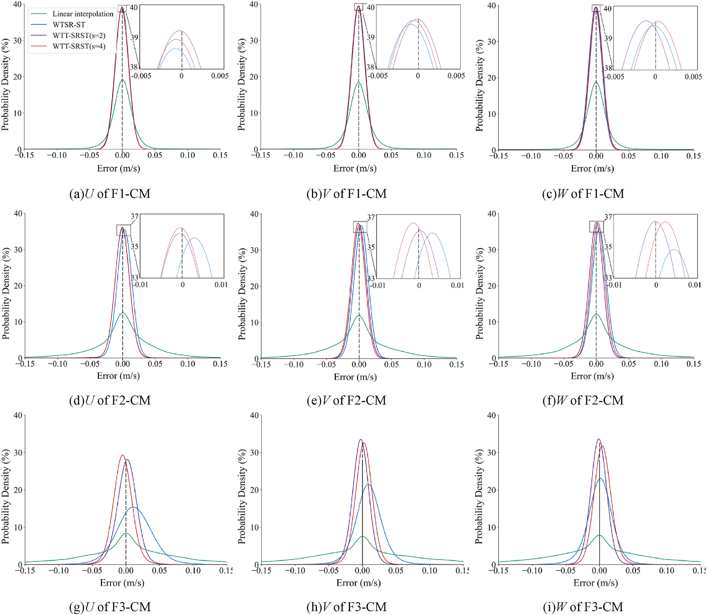

   **图 13** A 点重建风序列的误差概率分布。

   图内文字：各行分别为 F1-CM、F2-CM、F3-CM，各列分别为 U、V、W 分量；纵轴 Probability Density (%)：概率密度（%）；横轴 Error (m/s)：误差（m/s）；插图放大概率密度峰值附近；图例为线性插值、WTSR-ST、WTT-SRST（s=2、4）。

4.1.2 频谱分析
^^^^^^^^^^^^^^^^^^^^^^^^^^^^^^^^^^^^^^^^^^^^^^^^^^^^^^^^^^^^^^^^^^^^^^^^^^^^^^^^

图 14、15 分别给出能谱与相干函数。低频信号控制大尺度特征，高频信号则反映瞬时动态和局部细节。图 14(a)–(c) 中，线性插值无法再现非线性特征，其频谱与参考结果有显著差异；高频噪声比低频更明显。同时，相干值在 :math:`10^1\sim10^2` 之间的临界频率之后迅速衰减。采用深度学习算法可以缓解这一问题，所得低频分布与参考结果几乎无法区分。对高频信号重建而言，WTSR-ST 等纯数据驱动方法对高频先验的学习有限，相干值的临界点出现更早，而缺乏物理约束会加剧动态特征的失真。相比之下，WTT-SRST 能有效提取长期趋势，并准确重建瞬态动态特征。插值风场快照较少时，所恢复高频特征与参考结果更接近。可以观察到，插入更多快照时，频率大于 :math:`10^2` 后相干值显著下降。尽管高频高估程度增加，临界频率仍出现得最晚，且差异最小。步长增大时，高频部分被高估，相干值增加，但这种影响很小。

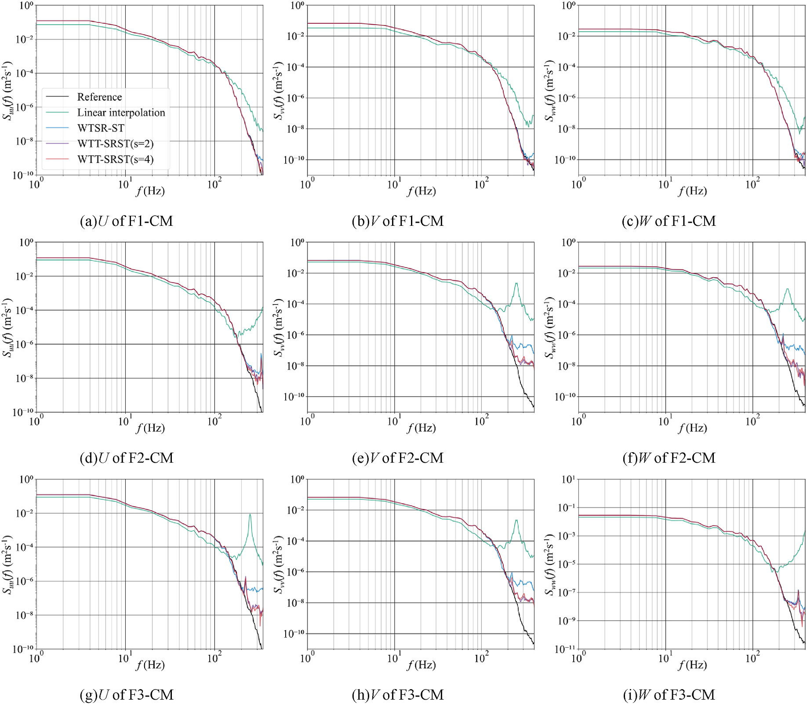

   **图 14** 脉动速度的功率谱密度结果。

   图内文字：各行分别为 F1-CM、F2-CM、F3-CM，各列分别为 U、V、W 分量；横轴 f (Hz)：频率（Hz）；纵轴 :math:`S_{uu}(f)` 、 :math:`S_{vv}(f)` 、 :math:`S_{ww}(f)` ：各分量功率谱密度（m²/s）；Reference：参考结果；其余图例为线性插值、WTSR-ST、WTT-SRST（s=2、4）。

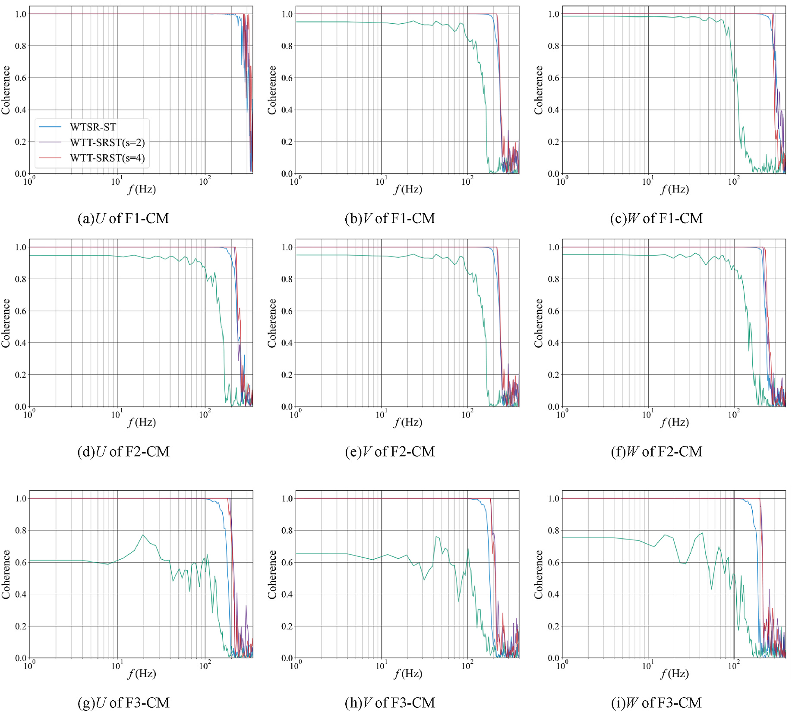

   **图 15** 重建风序列的相干函数。

   图内文字：各行分别为 F1-CM、F2-CM、F3-CM，各列分别为 U、V、W 分量；横轴 f (Hz)：频率（Hz）；纵轴 Coherence：相干函数；图例列示 WTSR-ST、WTT-SRST（s=2、4）；图中还保留未在该图例列名的绿色曲线。

4.2 测试表现
~~~~~~~~~~~~~~~~~~~~~~~~~~~~~~~~~~~~~~~~~~~~~~~~~~~~~~~~~~~~~~~~~~~~~~~~~~~~~~~~

使用训练后的参数对与训练阶段完全分离的测试数据进行推理。统计特征对风力机安全运行至关重要，结果见图 16。与训练阶段相比，测试时通过对 HTR 数据取平均获得 LTR 数据，因而滤除了高频细节。相对于第 3.1.1 节，误差有所波动。尽管如此，所提方法的有效性仍然令人满意。误差指标处于较低范围，没有不合理的极端均值或中位数。另一方面，WTT-SRST 的统计结果始终低于 WTSR-ST，且随插值风场快照增多，这一趋势更明显。对 F1-CM，WTT-SRST 的结果改善为 0.0692（0.0693）、0.0520（0.0525）、37.31（37.09）；括号内数值对应较大步长。对 F2-CM，相应指标为 0.173（0.174）、0.130（0.132）、102.45（105.78）。对 F3-CM，这些数值进一步变为 0.252（0.258）、0.181（0.187）、145.64（147.05）。没有过拟合表明模型能够有效捕捉风场特征。

原文表述边界：本段“误差较低”“没有过拟合”等为论文作者对所测工况的判断；原文同时报告 F2-CM、F3-CM 的 MAPE 超过 100%，不能把相对优势译成所有绝对误差都小。文中回指“第 3.1.1 节”的编号按源文保留。

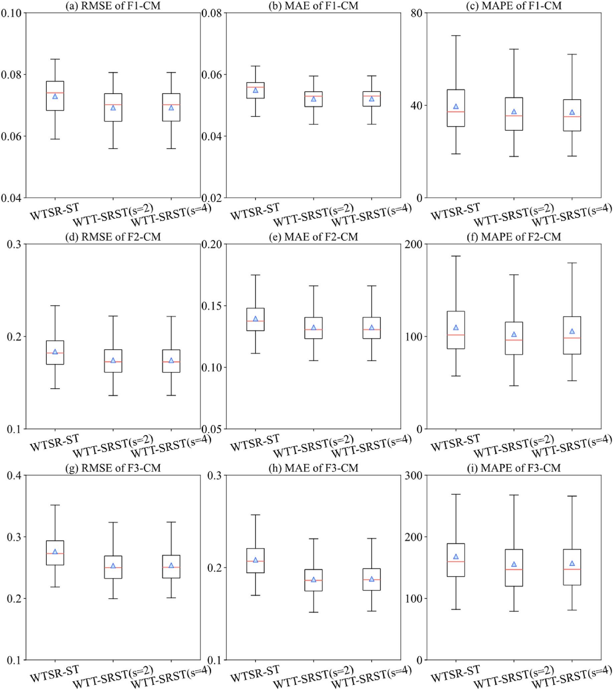

   **图 16** 重建与参考风速的箱线图（RMSE：m/s；MAE：m/s；MAPE：%）。

   图内文字：(a)–(c)、(d)–(f)、(g)–(i) 依次为 F1-CM、F2-CM、F3-CM 的 RMSE、MAE、MAPE；横轴比较 WTSR-ST 与 WTT-SRST（s=2、4）；红线为中位数，蓝色三角形为均值。

图 17、18 展示 t=6.5 s 时的重建风场，相应湍流指标汇总于表 7。三个分量的风速分布均明显不均匀，特别是 U 分量具有较大幅值。插值风场快照增多时，误差云图的颜色加深，反映误差幅值相应上升。在这些方法中，WTT-SRST 能再现风速脉动程度，其内在能量与参考结果一致性较好。

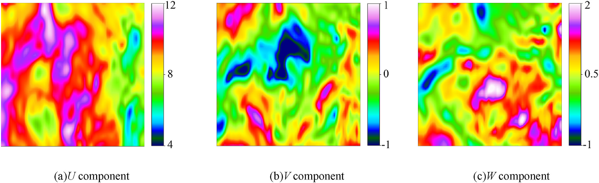

   **图 17** t=6.5 s 时参考风场云图（单位：m/s）。

   图内文字：(a) U 分量；(b) V 分量；(c) W 分量；各分量独立色标均完整保留。

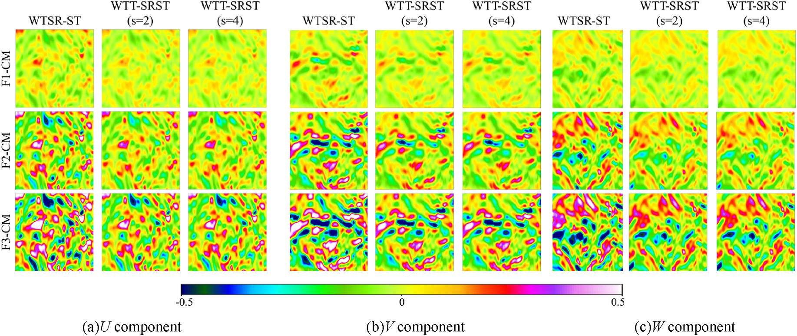

   **图 18** t=6.5 s 时重建风场与参考风场的差值（单位：m/s）。

   图内文字：(a) U 分量；(b) V 分量；(c) W 分量；每组列依次为 WTSR-ST、WTT-SRST（s=2）、WTT-SRST（s=4）；行依次为 F1-CM、F2-CM、F3-CM；底部为共用差值色标。

.. list-table:: 表 7 湍流分析结果汇总（测试阶段）
   :header-rows: 1
   :widths: auto

   * - 指标
     - 方法
     - F1-CM 平均误差百分比
     - F1-CM 标准误差百分比
     - F2-CM 平均误差百分比
     - F2-CM 标准误差百分比
     - F3-CM 平均误差百分比
     - F3-CM 标准误差百分比
   * - TI（%）
     - WTSR-ST
     - 0.07
     - −0.05
     - −0.14
     - −0.06
     - −0.41
     - 0.05
   * - TI（%）
     - WTT-SRST（s=2）
     - 0.04
     - −0.06
     - −0.07
     - −0.03
     - −0.15
     - 0.07
   * - TI（%）
     - WTT-SRST（s=4）
     - 0.06
     - −0.05
     - −0.09
     - −0.02
     - −0.16
     - 0.07
   * - TKE（m²/s²）
     - WTSR-ST
     - −0.003
     - 0.009
     - −0.10
     - −0.037
     - −0.033
     - −0.105
   * - TKE（m²/s²）
     - WTT-SRST（s=2）
     - −0.002
     - 0.005
     - −0.06
     - −0.035
     - −0.018
     - −0.074
   * - TKE（m²/s²）
     - WTT-SRST（s=4）
     - −0.003
     - 0.007
     - −0.09
     - −0.038
     - −0.024
     - −0.073

表 7 注：TI 为湍流强度，TKE 为湍动能；M_Err_P 为平均误差百分比，Std_Err_P 为标准误差百分比。

图 19、20 给出能谱与相干函数结果。所提方法有效再现低频信号，当频率低于临界阈值时，相干值接近 1。这表明深度学习模型能够有效再现风场空间分布，包括风速与大尺度特征。主要差异出现在临界频率之后，相干值随频率增加而减小。可以观察到，WTT-SRST 能有效恢复高频湍流特征，其功率谱更接近参考结果。与训练阶段不同，衰减阶段存在明显波动，表现为相干值突然变化。随着插值风场快照增多，细节缺失和噪声增长愈加明显，高频区域出现偏差。此外，较大步长使功率预测精度略有下降，临界频率提前出现。输入与输出时间分辨率差距较大时，这一影响尤为明显。这些结果突出了 WTT-SRST 提取突变风速的稳健性。

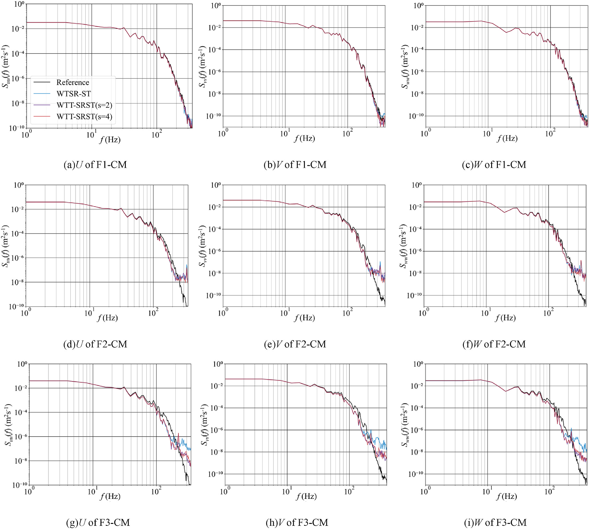

   **图 19** 脉动速度的功率谱密度结果。

   图内文字：测试阶段结果；各行依次为 F1-CM、F2-CM、F3-CM，各列依次为 U、V、W 分量；横轴 f (Hz)：频率（Hz）；纵轴 :math:`S_{uu}(f)` 、 :math:`S_{vv}(f)` 、 :math:`S_{ww}(f)` ：各分量功率谱密度（m²/s）；Reference：参考结果；其余图例为 WTSR-ST 和 WTT-SRST（s=2、4）。

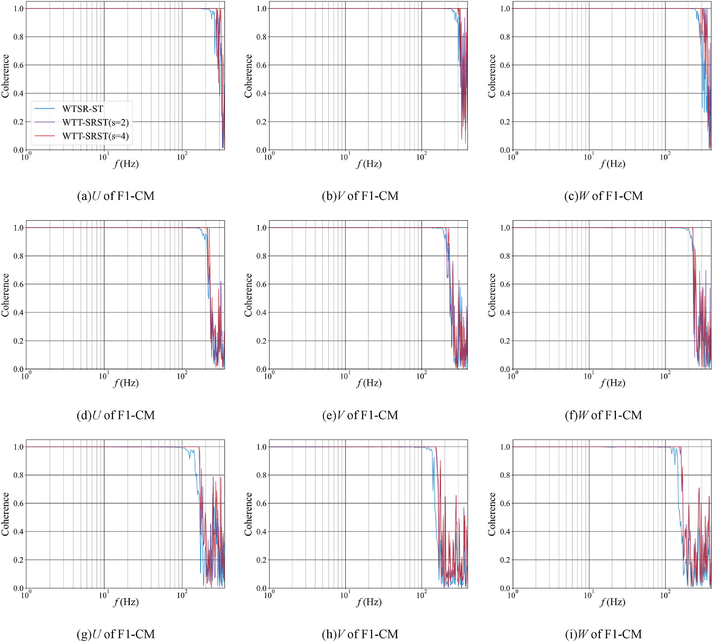

   **图 20** 重建风序列的相干函数。

   图内文字：测试阶段结果；三列依次为 U、V、W 分量。原图 (a)–(i) 九个面板的工况标签均写 F1-CM，此处保留，不将第二、第三行擅改为 F2-CM、F3-CM；横轴 f (Hz)：频率（Hz）；纵轴 Coherence：相干函数；图例为 WTSR-ST、WTT-SRST（s=2、4）。

4.3 稳定性评估
~~~~~~~~~~~~~~~~~~~~~~~~~~~~~~~~~~~~~~~~~~~~~~~~~~~~~~~~~~~~~~~~~~~~~~~~~~~~~~~~

图 21 展示参数设置的稳定性分析。误差统计量随所加高斯噪声方差增大而增大。方差为 0.5 m²/s² 时，S1-CM 的 RMSE、MAE、MAPE 为 0.301、0.186、135.12；S2-CM 的对应数值为 0.379、0.476、179.15；S3-CM 为 0.457、0.421、216.01。尽管性能下降，仍处于可接受的运行阈值内。方差为 1.0 m²/s² 时，S1-CM 的指标为 0.669、0.409、202.63；S2-CM 增至 0.625、0.477、240.16；S3-CM 升至 0.688、0.606、261.59。加入高斯噪声使可靠性降低。方差为 1.5 m²/s² 时，S1-CM 的指标升至 0.933、0.741、278.87；S2-CM 为 0.926、0.748、290.67；S3-CM 变为 1.067、0.849、310.22。随着外部扰动增大，生成风场误差更加显著，超分辨率结果变差。当 LTR 数据受到较小外部扰动时，模型表现出可靠的风场重建性能。

原文差异说明：“可接受的运行阈值”为源文判断，未在本段量化为通用工程标准。方差 0.5 m²/s² 的 S2-CM 列出 RMSE=0.379、MAE=0.476，与同样本同权重下 RMSE 不小于 MAE 的通常关系不符；按原文保留，不能据此补定正确数字。

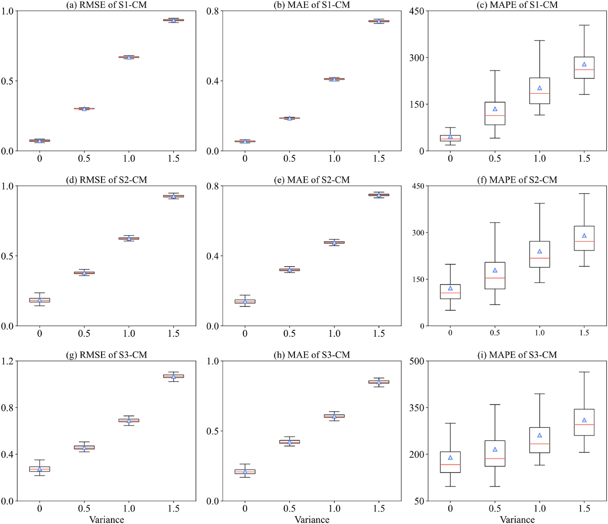

   **图 21** 不同强度高斯噪声下风场的统计结果（方差：m²/s²；RMSE：m/s；MAE：m/s；MAPE：%）。

   图内文字：(a)–(c)、(d)–(f)、(g)–(i) 依次为 S1-CM、S2-CM、S3-CM 的 RMSE、MAE、MAPE；横轴 Variance：方差，取 0、0.5、1、1.5；红线为中位数，蓝色三角形为均值。

4.4 效率评估
~~~~~~~~~~~~~~~~~~~~~~~~~~~~~~~~~~~~~~~~~~~~~~~~~~~~~~~~~~~~~~~~~~~~~~~~~~~~~~~~

效率与性能之间的权衡是一个重要考虑因素。WTT-SRST 的关键优势在于，可以在显著减少计算工作量与 GPU 显存占用的同时获得高精度结果。表 8 给出单个注意力计算模块的独立成本测试。使用大小为 :math:`128\times128\times1` 的特征图验证，记录结果为单次前向传播所需时间。Params.（M）表示以百万计的可训练权重数量。FLOPs（G）表示每次前向传播所需的浮点运算次数，单位为十亿；较高 FLOPs 意味着推理时计算资源需求更大。GPU Mem.（MB）表示 GPU 显存占用，单位为兆字节。Ave. Time（ms）表示完成一次前向传播的平均计算时间，单位为毫秒。对于不同步长，SSW-AB 需要 :math:`9.7\times10^4` 和 :math:`9.5\times10^4` 个参数，以及 4.02 和 2.77 GFLOPs，远低于 Swin-Transformer 块。这得益于注意力稀疏化及对冗余参数的结构重设计。SSPW-AB 的 GPU 显存占用为 359.92 MB 和 250.35 MB，不到 Swin-Transformer 块的一半。SPW-AB 的平均处理时间为 0.58 ms 和 0.32 ms，低于 Swin-Transformer 块。此外，将步长设为 4，参数数量、FLOPs、GPU 显存占用和平均计算时间分别减少 12.37%、31.09%、30.44%、44.83%。

.. list-table:: 表 8 单个注意力计算模块的计算成本
   :header-rows: 1
   :widths: auto

   * - 指标
     - Swin-Transformer 块
     - 稀疏窗口注意力块 s=2
     - 稀疏窗口注意力块 s=4
   * - 参数量（百万）
     - 0.223
     - 0.097
     - 0.085
   * - FLOPs（十亿次）
     - 10.10
     - 4.02
     - 2.77
   * - GPU 显存（MB）
     - 1225.26
     - 359.92
     - 250.35
   * - 平均时间（ms）
     - 0.71
     - 0.58
     - 0.42

原文差异说明：PDF 文件第 15 页本段混用 SSW-AB、SSPW-AB 和 SPW-AB 名称；s=4 参数量写 0.095 百万、平均时间写 0.32 ms，第 20 页表 8 则为 0.085 百万、0.42 ms。正文所列参数降幅 12.37% 对应表中 0.097→0.085，而时间降幅 44.83% 对应正文 0.58→0.32；两种口径不能混合后作为一致验证结果。

表 9 评估模型架构的影响。试验分为：（1）原始架构搭配窗口注意力；（2）所提架构搭配窗口注意力；（3）所提架构搭配稀疏窗口注意力。选取训练数据中两个连续、大小为 :math:`64\times64\times3` 的 LTR 风场快照作为输入，其余配置与 F3-CM 相同。比较（1）与（2）可知模型架构修改的影响：引入 U 形架构，在保持精度的同时简化模型。比较（2）与（3）可知注意力机制的影响：相对于未经二次稀疏化的情形，参数分别减少 :math:`3.51\times10^5` 与 :math:`4.29\times10^5` 。后一组每次前向传播分别执行 237.8 亿与 206.9 亿次运算。此外，GPU 显存占用不足窗口注意力的三分之一，分别为 1034.24 MB 与 740.37 MB。平均计算时间为 5.19 ms 与 4.25 ms，显著低于窗口注意力。同时，稀疏窗口注意力保持了较高精度。

这些发现表明，通过减少注意力计算次数并简化架构，稀疏操作显著提高计算效率。参数减少进一步降低 GPU 显存占用与计算成本，在不损害精度的情况下缩短推理时间。调整步长可在计算精度与效率之间进行权衡。更快响应风场变化，使管理者能够更及时地做出决策。

.. list-table:: 表 9 模型架构的计算成本比较
   :header-rows: 1
   :widths: auto

   * - 指标
     - 原始架构 [47]_
     - 所提架构：窗口注意力
     - 所提架构：稀疏窗口注意力 s=2
     - 所提架构：稀疏窗口注意力 s=4
   * - 参数量（百万）
     - 3.718
     - 3.344
     - 2.993
     - 2.735
   * - FLOPs（十亿次）
     - 21.58
     - 31.48
     - 23.78
     - 20.69
   * - GPU 显存（MB）
     - 3472.55
     - 3076.36
     - 1034.24
     - 740.37
   * - 平均时间（ms）
     - 7.03
     - 6.40
     - 5.19
     - 4.25
   * - MAE
     - 0.016
     - 0.017
     - 0.006
     - 0.008

原文差异说明：表 9 中 s=4 相对所提窗口注意力架构的参数减少量为 3.344−2.735=0.609 百万，与正文 0.429 百万不一致；s=2 的显存 1034.24 MB 略高于 3076.36 MB 的三分之一，不能严格表述为两种步长都低于三分之一。相对原始整体架构，s=2 参数量约减少 19.50%，显存约减少 70%，但 FLOPs 从 21.58 G 增至 23.78 G。这里的约 70% 是显存占用降幅，不能替换为运行时间降幅，也不能称所有计算资源指标均下降。

4.5 消融研究
~~~~~~~~~~~~~~~~~~~~~~~~~~~~~~~~~~~~~~~~~~~~~~~~~~~~~~~~~~~~~~~~~~~~~~~~~~~~~~~~

消融研究旨在评估损失函数不同组成项对总体性能的影响，结果见图 22。需要注意，未采用任何物理约束时的 MSE 作为参考，其他结果均相对于它归一化。加入质量与动量守恒提供具有指导性的物理知识，支持参数优化。具体而言，仅加入相对动量残差时，MSE 分别降低 11%、8%、10%；仅加入相对连续性残差时，分别降低 12%、9%、8%。同时加入动量项与连续性项时，性能显著改善，三个工况下的 MSE 分别降低 14%、12%、26%。

图 23 给出重建风场云图。没有约束时，WTT-SRST 存在明显偏差，尤其在风速变化显著的区域。随着物理约束引入，模型变得更加有效。同时引入相对动量项和连续性项时，所得误差显著小于仅有一个约束时的结果，也小于无物理约束时的误差。从另一角度看，RPL 是影响梯度计算的辅助求解器。它放大与风场物理特征相关的梯度，从而引导生成风场沿与控制方程一致的方向迭代更新。

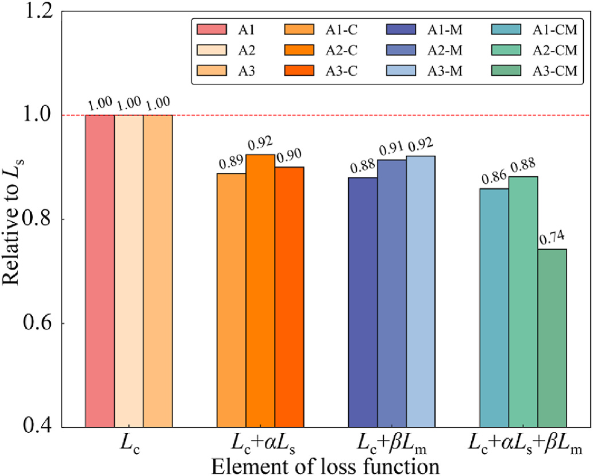

   **图 22** WTT-SRST 结合损失函数不同组成项时的相对值（原图题单位：m²/s²）。

   图内文字：横轴 Element of loss function：损失函数组成项，依次标为 :math:`L_c` 、 :math:`L_c+\alpha L_s` 、 :math:`L_c+\beta L_m` 、 :math:`L_c+\alpha L_s+\beta L_m` ；纵轴 Relative to Lₛ：相对于 Lₛ；图例为 A1、A2、A3 及其 -C、-M、-CM 工况。四组柱高依次为（1.00，1.00，1.00）、（0.89，0.92，0.90）、（0.88，0.91，0.92）、（0.86，0.88，0.74）；损失下标与表 4、式（8）至（10）存在前述冲突。

原文差异说明：图 22 正文定义为相对于无约束 MSE 的归一化比值，应无量纲；图题仍标 m²/s²，此处保留源文标注。双约束后的 0.86、0.88、0.74 是 MSE 相对基线的比例，即降低 14%、12%、26%，不是降低 74%–88%，也不是全部统计指标都降至这一范围。

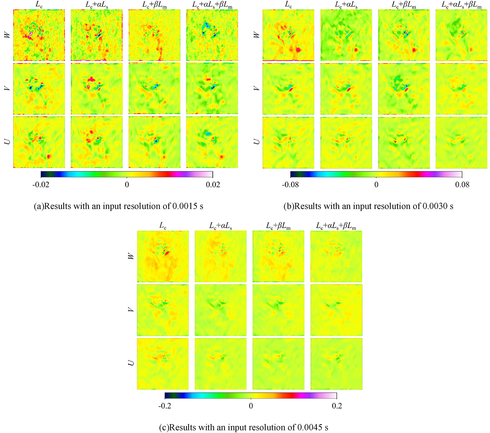

   **图 23** 6.5 s 时消融研究误差云图（单位：m/s）。

   图内文字：(a)、(b)、(c) 分别为输入时间分辨率 0.0015 s、0.0030 s、0.0045 s 的结果；每个面板由上到下为 W、V、U 分量，由左到右为 :math:`L_c` 、 :math:`L_c+\alpha L_s` 、 :math:`L_c+\beta L_m` 、 :math:`L_c+\alpha L_s+\beta L_m` ；各面板色标范围分别为 ±0.02、±0.08、±0.2 m/s。

4.6 全尺度风场评估
~~~~~~~~~~~~~~~~~~~~~~~~~~~~~~~~~~~~~~~~~~~~~~~~~~~~~~~~~~~~~~~~~~~~~~~~~~~~~~~~

图 24 展示风电场中风力机上游的重建风场。数值前的符号表示风向，正方向如图 24 所示。虽然随着插值风场快照增多，细节变得模糊，但所提模型仍能良好描述空间非均匀性与流动结构。与 WTSR-ST 相比，表 10 中平均指标的下降表明重建精度改善，标准差减小表明稳定性增强。随着 LTR 从 1.5 s 增至 4.5 s，RMSE、MAE、MAPE 的均值从 0.007、0.005、10.69 增至 0.087、0.057、111.87，其标准差也呈现类似的上升趋势。根据这些结果，所提方法表现出稳健性，能够准确表示全尺度风电场情景中的流动动力学。

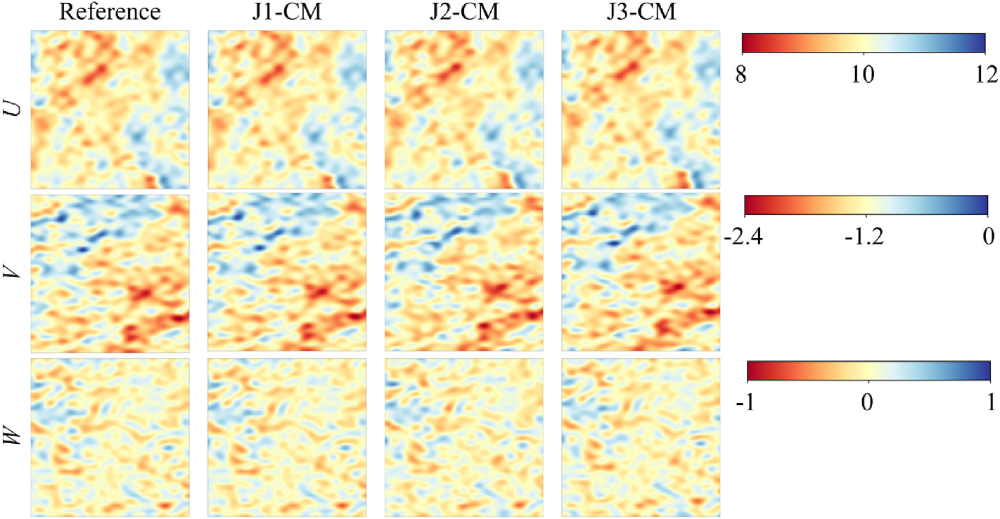

   **图 24** 凌晨 3:45 生成风场的可视化表示（单位：m/s）。

   图内文字：列依次为参考风场（Reference）、J1-CM、J2-CM、J3-CM；行依次为 U、V、W 分量；各行有独立速度色标，分别为 U：8–12、V：−2.4–0、W：−1–1 m/s。原文正文称正方向示于图 24，但本图没有独立坐标方向标识，不据此补画。

.. list-table:: 表 10 重建风场的统计评估
   :header-rows: 1
   :widths: auto

   * - 指标
     - 统计量
     - J1-CM WTSR-ST
     - J1-CM WTT-SRST s=2
     - J2-CM WTSR-ST
     - J2-CM WTT-SRST s=2
     - J3-CM WTSR-ST
     - J3-CM WTT-SRST s=2
   * - RMSE
     - 均值
     - 0.010
     - 0.007
     - 0.065
     - 0.058
     - 0.096
     - 0.087
   * - RMSE
     - 标准差
     - 0.0003
     - 0.0002
     - 0.0017
     - 0.0017
     - 0.0045
     - 0.0037
   * - MAE
     - 均值
     - 0.007
     - 0.005
     - 0.042
     - 0.038
     - 0.067
     - 0.057
   * - MAE
     - 标准差
     - 0.0002
     - 0.0001
     - 0.0014
     - 0.0012
     - 0.0034
     - 0.0020
   * - MAPE
     - 均值
     - 11.74
     - 10.69
     - 73.25
     - 65.85
     - 162.90
     - 111.87
   * - MAPE
     - 标准差
     - 8.13
     - 10.28
     - 38.06
     - 31.25
     - 156.40
     - 48.87

原文表述边界：表 10 的平均误差均有所下降，但 J1-CM 的 MAPE 标准差从 8.13 增至 10.28，J2-CM 的 RMSE 标准差保持 0.0017；因此正文“标准差减小”的概括不适用于每项统计量。J3-CM 平均 MAPE 仍为 111.87%。该验证对象为上游轮毂高度截面，不是建筑密集城区的全三维场，也不直接验证发电收益或调度收益。

4.7 可持续性评估
~~~~~~~~~~~~~~~~~~~~~~~~~~~~~~~~~~~~~~~~~~~~~~~~~~~~~~~~~~~~~~~~~~~~~~~~~~~~~~~~

本文开展定量可持续性分析，量化深度学习模型的能耗。受 Wright 等 [48]_ 启发，使用 CO2e 评估所提模型的环境影响。假定碳足迹仅在模型执行时产生，不考虑待机或非活动状态能耗。深度学习过程的能耗主要涉及中央处理器（CPU）、GPU、RAM 及存储设备。处理器额定功率由制造商提供，实际功耗为额定功率与使用率因子的乘积。经监测，本研究 CPU、GPU 的使用率因子分别为 0.70、0.95。根据 Karyakin 等 [49]_ ，内存功率为每 GB 0.3725 W；128 GB RAM 的总功率为 47.68 W。存储设备功率相对较小，因此忽略。最后，依据 Lannelongue 等 [50]_ 的方法计算能耗。CO2e 换算采用的时间尺度为 100 年。中国碳强度（CI）为每 kWh 702 gCO2e [50]_ 。其余超参数配置与 F2-CM 相同。

表 11 列出可持续性指标结果。仅优化架构时，训练时间缩短 115 min，碳足迹减少 850 gCO2e，碳吸收量减少 0.93 树·月，能耗下降 8.93%。节约的能量足以供汽车行驶约 4.84 km。对于所提 WTT-SRST（s=2），训练时间缩短 32.92%，碳足迹降至 6390 gCO2e，能耗降至 11880 Wh。所节约的能量相当于支持乘用车行驶约 9.12 km，一棵成熟树木需要 3.41 个月吸收相应温室气体排放。此外，增大步长可提高训练效率并降低能耗。这些发现表明，所提模型具有节约资源和促进环境可持续性的潜力。

.. list-table:: 表 11 深度学习模型执行过程的环境影响结果
   :header-rows: 1
   :widths: auto

   * - 指标
     - 阶段
     - 原始架构 [38]_
     - 所提架构：窗口注意力
     - 所提架构：稀疏窗口注意力 s=2
     - 所提架构：稀疏窗口注意力 s=4
   * - 训练运行时间（min）
     - 训练
     - 1282
     - 1167
     - 860
     - 645
   * - 测试运行时间（s）
     - 测试
     - 1.81
     - 1.65
     - 1.33
     - 1.09
   * - 碳足迹（gCO2e）
     - 训练
     - 9510
     - 8660
     - 6390
     - 4790
   * - 碳足迹（gCO2e）
     - 测试
     - 13.39
     - 12.21
     - 9.84
     - 8.06
   * - 碳吸收量（树·月）
     - 训练
     - 10.38
     - 9.45
     - 6.97
     - 5.22
   * - 碳吸收量（树·月）
     - 测试
     - 1.46e−2
     - 1.33e−2
     - 1.07e−2
     - 8.80e−3
   * - 能量（Wh）
     - 训练
     - 17700
     - 16120
     - 11880
     - 8910
   * - 能量（Wh）
     - 测试
     - 24.92
     - 22.71
     - 18.31
     - 15.01
   * - 乘用车行驶距离（km）
     - 训练
     - 54.35
     - 49.51
     - 36.49
     - 27.37
   * - 乘用车行驶距离（km）
     - 测试
     - 7.65e−2
     - 6.98e−2
     - 5.62e−2
     - 4.61e−2

.. note::

   原文差异说明：上述结果是依据额定功率、使用率与运行时间估算的运行期能耗，不是电表实测，也不包含待机、数据生成或完整城市风能系统成本。正文碳强度 702 gCO2e/kWh 与表 11 的训练能耗及排放不相容：例如 17.7 kWh 与该碳强度相乘为 12425.4 gCO2e，而表中列 9510 gCO2e。测试的秒级运行时间与 Wh 能量口径也需澄清。表 11 原始架构引用 [38]_ ，表 9 引用 [47]_ ，两者均照原表保留。正文称 s=2 节能相当于汽车行驶 9.12 km，而表 11 原始架构与 s=2 的训练行驶距离差为 54.35−36.49=17.86 km；9.12 km 对应表中 s=2 与 s=4 的差。不能把这些不一致换算背书为已验证的绝对碳足迹。

5 结论
--------------------------------------------------------------------------------

城市风能受到湍流强烈影响，获取高时间分辨率（HTR）风对风能调度与管理至关重要。然而，求解控制方程的传统物理模型在湍流模拟中的效率较低。本文提出一种面向城市能源应用、低计算成本的风场时间超分辨率深度学习框架。通过融合稀疏窗口注意力和相对物理信息损失（RPL），模型在提高重建风场精度与物理一致性的同时，显著降低计算成本。

为简化训练，参考值取自 LES，输入则通过 HTR 数据下采样获得。结果表明，所提模型具有更低的均方根误差（RMSE）、平均绝对误差（MAE）和平均绝对百分比误差（MAPE）。空间分布与概率密度结果支持其准确再现湍流演化及脉动特征。模型不仅能有效再现大尺度特征，还提高了瞬态特征精度。功率谱密度与相干函数证实，它能够准确重建低频信号，并以可靠精度恢复高频特征。步长增大时，预测结果略有退化。尽管插值风场快照数量增加，它在比较方法中仍保持最佳表现。

随后，对 HTR 数据进行时间平均以滤除高频信号，接近再现更大时间步下理想 CFD 条件的结果。所提模型采用此前训练过程中保存的参数，保持较小的统计误差。此外，模型在重建高频信号方面具有优势，表现为临界频率更晚出现、相干衰减更慢。增加插值风场快照数量使性能适度、可控地下降，但在三个测试工况下持续获得有利结果。步长较大时，注意力稀疏性增强，限制了所提取的高频信号，使重建与参考湍流数据之间的偏差增大，导致 RMSE、MAE、MAPE 增加、误差云图中误差幅值增大、相干值减小。此外，本研究引入四组零均值高斯噪声，模拟低分辨率 LES 中常见的系统、建模与数值不确定性。虽然输入风场中的扰动影响精度，但在一定扰动范围内，模型仍然可靠。

本文通过模型参数量、GPU 显存占用、浮点运算次数（FLOPs）和平均推理时间评估计算成本。对单独的注意力模块，稀疏窗口注意力块在单次前向传播中消耗更少 GPU 资源。具体而言，步长为 2、4 时，其显存仅分别为 Swin-Transformer 块的 29.37%、20.43%。与此同时，减少运算次数与参数有助于加快推理。进一步考察结构修改和稀疏窗口注意力对整体模型的影响，结果表明，所提架构搭配稀疏窗口注意力使参数数量减少 19.50%，并使 GPU 资源消耗显著减少 70%。增大步长可强化这一效果。

本文还开展消融研究，量化物理约束的影响。将 N-S 方程的相对形式融入损失函数，可增强梯度的方向性，使输出沿与控制方程一致的方向优化。引入 RPL 后，原文概括称统计指标下降到原来的 74%–88%。仅含动量项或连续性项的结果优于无约束情况，但不如同时含有两项的情况。这表明，引入 RPL 显著改善建模能力，使重建湍流具有更合理的结构。

最后，定量评估模型对环境可持续性的影响。相对之前的框架，所提模型使训练时间缩短 32.92%、碳排放减少 3120 gCO2e、能耗降低 32.89%，表明其具有促进能源效率的潜力。同时，增大步长可减少能耗，但不可避免地影响模型性能，突出了效率与精度之间的权衡。

本研究关注一个特定入流剖面，而 PBL 风存在显著的混沌变化。未来研究应探索更能代表真实环境条件的数据。仅在理想化算例中评估并不充分。未来将研究复杂城市下垫面的影响；深入认识这些影响，对城市风能应用十分关键。

.. note::

   结论中的定量措辞仍受正文证据约束：约 70% 对应表 9 的显存降幅，而 s=2 的 FLOPs 高于原始架构；74%–88% 对应 4.5 节 MSE 相对于无物理约束基线的剩余比例，并非全部统计指标或该幅度的降幅；节能与碳排放为表 11 的运行期估算，绝对换算差异见 4.7 节。模型完成的是两个已知时刻之间的插值重建，不是未知未来风场预报。

符号与缩写
--------------------------------------------------------------------------------

.. list-table:: 缩写表
   :header-rows: 1
   :widths: auto

   * - 缩写
     - 含义
   * - PBL
     - 行星边界层
   * - CFD
     - 计算流体力学
   * - DNS
     - 直接数值模拟
   * - LES
     - 大涡模拟
   * - RANS
     - 雷诺平均 Navier–Stokes
   * - SGS
     - 亚格子尺度
   * - PINN
     - 物理信息神经网络
   * - 3-D
     - 三维
   * - VFI
     - 视频帧插值
   * - CNN
     - 卷积神经网络
   * - AdaCoF
     - 流的自适应协作
   * - TSR-TF
     - 湍流场时间超分辨率
   * - HTR
     - 高时间分辨率
   * - LTR
     - 低时间分辨率
   * - WRF
     - 天气研究与预报模式
   * - PIV
     - 粒子图像测速
   * - WTT-SRST
     - 风湍流时间超分辨率 Swin-Transformer
   * - RPL
     - 相对物理信息损失
   * - FLOPs
     - 每秒浮点运算次数（原符号表用语；本文成本表按单次前向传播的运算次数统计）
   * - SSO
     - 基于步长的稀疏操作
   * - FC
     - 全连接
   * - SSIM
     - 结构相似性指数
   * - SPW-MSA
     - 稀疏窗口多头自注意力
   * - SSPW-MSA
     - 移位稀疏窗口多头自注意力
   * - W-MSA
     - 窗口多头自注意力
   * - MSE
     - 均方误差
   * - N-S
     - Navier–Stokes
   * - SPW-AB
     - 稀疏窗口注意力块
   * - SSPW-AB
     - 移位稀疏窗口注意力块
   * - SCDM
     - 空间解耦位置模块（原表拼写；正文与图 4 使用 SDPM）
   * - CDRFG
     - 一致离散随机流生成
   * - TPU
     - 东京工艺大学
   * - ESDU
     - 工程科学数据机构
   * - WALE
     - 壁面自适应局部涡黏性
   * - RAM
     - 随机存取存储器
   * - NetCDF
     - 网络通用数据格式
   * - MAE
     - 平均绝对误差
   * - MAPE
     - 平均绝对百分比误差
   * - RMSE
     - 均方根误差
   * - TI
     - 湍流强度
   * - TKE
     - 湍动能
   * - PDF
     - 概率密度函数
   * - Adam
     - 自适应矩估计
   * - CO2e
     - 二氧化碳当量
   * - GPU
     - 图形处理单元
   * - CI
     - 碳强度

.. list-table:: 符号表
   :header-rows: 1
   :widths: auto

   * - 符号
     - 含义
   * - :math:`\langle c_1,c_2\rangle`
     - 结构相似性常数
   * - :math:`S`
     - 风速范围
   * - :math:`\mu_x,\mu_y`
     - 均值
   * - :math:`\sigma_x,\sigma_y,\sigma_{xy}`
     - 方差与协方差值（按原符号表表述）
   * - :math:`s`
     - 步长值
   * - :math:`\langle Q,K,V\rangle`
     - 查询、键和值矩阵
   * - :math:`L`
     - 窗口大小
   * - :math:`D_k`
     - 每个头的通道维数
   * - :math:`\langle h,w\rangle`
     - 每个图块的长和宽
   * - :math:`c`
     - 总通道维数
   * - :math:`\rho`
     - 空气密度
   * - :math:`\upsilon`
     - 动力黏度（原文名称）
   * - :math:`L_{\mathrm{TOTAL}}`
     - 总损失
   * - :math:`L_c`
     - 内容损失
   * - :math:`\langle L_s,L_m\rangle`
     - 相对连续性与动量残差项
   * - :math:`\langle\alpha,\beta\rangle`
     - 连续性权重系数（原表对二者的共同表述；正文分别对应连续性和动量）
   * - :math:`\langle e',e\rangle`
     - 重建结果与参考结果的残差结果（原表顺序；正文另称带撇号为参考结果）
   * - :math:`\langle\boldsymbol U,\overline{\boldsymbol U},\boldsymbol u\rangle`
     - 瞬时、平均和脉动速度矢量
   * - :math:`S_{ii}(f)`
     - 第 i 个单边时间功率谱密度
   * - :math:`f`
     - 频率
   * - :math:`\langle f_{\max},f_{\min}\rangle`
     - 最大和最小频率
   * - :math:`M_n`
     - 频域离散点数
   * - :math:`N_n`
     - 涡结构数量
   * - :math:`\langle C_j,C\rangle`
     - 相干衰减常数
   * - :math:`D_c`
     - 特征距离
   * - :math:`\langle B_t,D_t,H_t\rangle`
     - 计算域的宽、深、高
   * - :math:`\langle q(t_{\mathrm{HR}}),q(t_{\mathrm{LR}})\rangle`
     - 高、低时间分辨率湍流场
   * - :math:`F_t`
     - 学习得到的映射函数
   * - :math:`\omega`
     - 权重参数
   * - :math:`\langle t_{n-1},t_n\rangle`
     - 时间步
   * - :math:`I_{i,j}`
     - 所提方法生成的结果
   * - :math:`R_{i,j}`
     - LES 生成的结果
   * - :math:`D`
     - 风力机直径
   * - :math:`L_x`
     - 风电场计算域长度
   * - :math:`L_y`
     - 风电场计算域宽度
   * - :math:`I`
     - 湍流强度
   * - :math:`k`
     - 湍动能
   * - :math:`u'`
     - 湍流脉动速度的均方根
   * - :math:`U_{\mathrm{avg}}`
     - 平均速度
   * - :math:`\gamma_{xy}(f)`
     - 相干函数
   * - :math:`S_{xx}(f)`
     - 重建序列功率谱密度
   * - :math:`S_{xy}(f)`
     - 频率 f 处的互功率谱密度

参考文献
--------------------------------------------------------------------------------

.. [1] S. Roga, S. Bardhan, Y. Kumar, S.K. Dubey, Recent technology and challenges of wind energy generation: a review, Sustain. Energy Technol. Assessments 52 (2022) 102239, https://doi.org/10.1016/j.seta.2022.102239.

.. [2] Global Wind Report 2024, Global Wind Energy Council, 2024. https://www.gwec.net/reports/globalwindreport.

.. [3] R.H. Schulte, F.C. Fletcher, Why the vision of interregional electric transmission development in FERC order 1000 is not happening, Electr. J. 33 (2020) 106773, https://doi.org/10.1016/j.tej.2020.106773.

.. [4] A. Rezaeiha, H. Montazeri, B. Blocken, A framework for preliminary large-scale urban wind energy potential assessment: roof-mounted wind turbines, Energy Convers. Manage. 214 (2020) 112770, https://doi.org/10.1016/j.enconman.2020.112770.

.. [5] S. Liu, L. Zhang, J. Lu, X. Zhang, K. Wang, Z. Gan, X. Liu, Z. Jing, X. Cui, H. Wang, Advances in urban wind resource development and wind energy harvesters, Renew. Sustain. Energy Rev. 207 (2025) 114943, https://doi.org/10.1016/j.rser.2024.114943.

.. [6] B. Wang, Urban Wind Energy: Wind Energy Development in the Angle of Urban Morphology, China Architecture & Building Press, Beijing, 2019.

.. [7] C.-W. Chang, J. Fang, N.T. Dinh, Reynolds-averaged turbulence modeling using deep learning with local flow features: an empirical approach, Nucl. Sci. Eng. 194 (2020) 650–664, https://doi.org/10.1080/00295639.2020.1712928.

.. [8] C.J. Lapeyre, A. Misdariis, N. Cazard, D. Veynante, T. Poinsot, Training convolutional neural networks to estimate turbulent sub-grid scale reaction rates, Combust. Flame 203 (2019) 255–264, https://doi.org/10.1016/j.combustflame.2019.02.019.

.. [9] S. Higgins, T. Stathopoulos, Application of artificial intelligence to urban wind energy, Build. Environ. 197 (2021) 107848, https://doi.org/10.1016/j.buildenv.2021.107848.

.. [10] H. Gao, G. Hu, D. Zhang, W. Jiang, H. Ren, W. Chen, Prediction of wind fields in mountains at multiple elevations using deep learning models, Appl. Energy 353 (2024) 122099, https://doi.org/10.1016/j.apenergy.2023.122099.

.. [11] G. Sideratos, N.D. Hatziargyriou, An advanced statistical method for wind power forecasting, IEEE Trans. Power Syst. 22 (2007) 258–265, https://doi.org/10.1109/TPWRS.2006.889078.

.. [12] A. Vaswani, N. Shazeer, N. Parmar, J. Uszkoreit, L. Jones, A.N. Gomez, Ł. Kaiser, I. Polosukhin, Attention is all you need. https://doi.org/10.48550/arXiv.1706.03762, 2017.

.. [13] C. Liu, S. He, H. Liu, J. Chen, H. Dong, WindTrans: transformer-based wind speed forecasting method for high-speed railway, IEEE Trans. Intell. Transp. Syst. 25 (2024) 4947–4963, https://doi.org/10.1109/TITS.2023.3337150.

.. [14] H. Li, Q. Yang, T. Li, Wind turbine wake prediction modelling based on transformer-mixed conditional generative adversarial network, Energy 291 (2024) 130403, https://doi.org/10.1016/j.energy.2024.130403.

.. [15] J. Zhang, X. Zhao, Three-dimensional spatiotemporal wind field reconstruction based on physics-informed deep learning, Appl. Energy 300 (2021) 117390, https://doi.org/10.1016/j.apenergy.2021.117390.

.. [16] L. Wang, M. Chen, Z. Luo, B. Zhang, J. Xu, Z. Wang, A.C.C. Tan, Dynamic wake field reconstruction of wind turbine through physics-informed neural network and sparse LiDAR data, Energy 291 (2024) 130401, https://doi.org/10.1016/j.energy.2024.130401.

.. [17] Z. Luo, L. Wang, Y. Fu, J. Yuan, J. Xu, A.C. Tan, Innovative sparse data reconstruction approaches for yawed wind turbine wake flow via data-driven and physics-informed machine learning, Phys. Fluids 37 (2025) 35158, https://doi.org/10.1063/5.0256953.

.. [18] A. Liu, B. Feng, B. Wang, B. Liu, C. Zhao, C. Dengr, DeepSeek-V2: a strong, economical, and efficient mixture-of-experts language model. https://doi.org/10.48550/arXiv.2405.04434, 2024.

.. [19] D. Guo, D. Yang, H. Zhang, J. Song, R. Zhang, R. Xu, DeepSeek-R1: incentivizing reasoning capability in LLMs via reinforcement learning. https://doi.org/10.48550/arXiv.2501.12948, 2025.

.. [20] X. Cheng, Z. Chen, Multiple video frame interpolation via enhanced deformable separable convolution, IEEE Trans. Pattern Anal. Mach. Intell. 44 (2022) 7029–7045, https://doi.org/10.1109/TPAMI.2021.3100714.

.. [21] W. Bao, W.-S. Lai, C. Ma, X. Zhang, Z. Gao, M.-H. Yang, Depth-aware video frame interpolation. https://doi.org/10.48550/arXiv.1904.00830, 2019.

.. [22] T. Xue, Video enhancement with task-oriented flow. https://doi.org/10.48550/arXiv.1711.09078, 2019.

.. [23] S. Niklaus, L. Mai, F. Liu, Video Frame Interpolation via Adaptive Separable Convolution, IEEE International Conference on Computer Vision (ICCV), 2017, pp. 261–270, https://doi.org/10.1109/ICCV.2017.37, 2017.

.. [24] Z. Shi, X. Xu, X. Liu, J. Chen, M.-H. Yang, Video frame interpolation transformer. https://arxiv.org/abs/2111.13817, 2022.

.. [25] G. Long, L. Kneip, J.M. Alvarez, H. Li, Learning image matching by simply watching video. https://doi.org/10.48550/arXiv.1603.06041, 2016.

.. [26] H. Lee, T. Kim, T. Chung, D. Pak, Y. Ban, S. Lee, AdaCoF: adaptive collaboration of flows for video frame interpolation, in: Proceedings of the IEEE/CVF Conference on Computer Vision and Pattern Recognition (CVPR), IEEE, Seattle, WA, USA, 2020, pp. 5315–5324, https://doi.org/10.1109/CVPR42600.2020.00536.

.. [27] C. Liu, H. Yang, J. Fu, X. Qian, TTVFI: learning trajectory-aware transformer for video frame interpolation, IEEE Trans. Image Process. 32 (2023) 4728–4741, https://doi.org/10.1109/TIP.2023.3302990.

.. [28] D. Danier, F. Zhang, D. Bull, LDMVFI: video frame interpolation with latent diffusion models, in: Proceedings of the AAAI Conference on Artificial Intelligence, 2024, pp. 1472–1480, https://doi.org/10.1609/aaai.v38i2.27912.

.. [29] K. Fukami, K. Fukagata, K. Taira, Machine-learning-based spatio-temporal super resolution reconstruction of turbulent flows, J. Fluid Mech. 909 (2021) A9, https://doi.org/10.1017/jfm.2020.948.

.. [30] Z. Zhao, Y. Xiao, C. Li, P.W. Chan, G. Hu, Q. Zhou, Multiscale simulation of the urban wind environment under typhoon weather conditions, Build. Simul. 16 (2023) 1713–1734, https://doi.org/10.1007/s12273-023-0991-7.

.. [31] C.V. Krishna, M. Wang, M.S. Hemati, M. Luhar, Reconstructing the time evolution of wall-bounded turbulent flows from non-time resolved PIV measurements, Phys. Rev. Fluids 5 (2020) 54604, https://doi.org/10.1103/PhysRevFluids.5.054604.

.. [32] G.E. Manucharyan, L. Siegelman, P. Klein, A deep learning approach to spatiotemporal sea surface height interpolation and estimation of deep currents in geostrophic ocean turbulence, JAMES, 2021 e2019MS001965, https://doi.org/10.1029/2019MS001965.

.. [33] X. Li, Z. Yang, H. Yang, Hybrid-attention-based swin-transformer super-resolution reconstruction for tomographic particle image velocimetry, Phys. Fluids 36 (2024) 65132, https://doi.org/10.1063/5.0210064.

.. [34] Y.A. Reddy, J. Wahl, M. Sjödahl, Twins-PIVNet: spatial attention-based deep learning framework for particle image velocimetry using vision transformer, Ocean. Eng. 318 (2025) 120205, https://doi.org/10.1016/j.oceaneng.2024.120205.

.. [35] T. Lin, Y. Wang, X. Liu, X. Qiu, A survey of transformers, AI Open 3 (2022) 111–132, https://doi.org/10.1016/j.aiopen.2022.10.001.

.. [36] N. Kitaev, Ł. Kaiser, A. Levskaya, Reformer: the efficient transformer. https://doi.org/10.48550/arXiv.2001.04451, 2020.

.. [37] H. Zhou, S. Zhang, J. Peng, S. Zhang, J. Li, H. Xiong, W. Zhang, Informer: beyond efficient transformer for long sequence time-series forecasting. https://doi.org/10.48550/arXiv.2012.07436, 2021.

.. [38] Z. Liu, Y. Lin, Y. Cao, H. Hu, Y. Wei, Z. Zhang, S. Lin, B. Guo, Swin transformer: hierarchical vision transformer using shifted windows. https://doi.org/10.48550/arXiv.2103.14030, 2021.

.. [39] B. Zu, T. Cao, Y. Li, J. Li, F. Ju, H. Wang, SwinT-SRNet: swin transformer with image super-resolution reconstruction network for pollen images classification, Eng. Appl. Artif. Intell. 133 (2024) 108041, https://doi.org/10.1016/j.engappai.2024.108041.

.. [40] W. Shi, J. Caballero, F. Huszár, J. Totz, A.P. Aitken, R. Bishop, D. Rueckert, Z. Wang, Real-time single image and video super-resolution using an efficient sub-pixel convolutional neural network. https://doi.org/10.48550/arXiv.1609.05158, 2016.

.. [41] Q. Cao, Y. Chen, D. Wang, Z. Xu, C. Ma, X. Yang, S. Chen, Vision-informed flow field super-resolution with quaternion spatial modeling and dynamic fluid convolution, Phys. Fluids 36 (2024) 95114, https://doi.org/10.1063/5.0221568.

.. [42] X. Jin, S. Cai, H. Li, G.E. Karniadakis, NSFnets (navier-stokes flow nets): physics-informed neural networks for the incompressible navier-stokes equations, J. Comput. Phys. 426 (2021) 109951, https://doi.org/10.1016/j.jcp.2020.109951.

.. [43] L. Chen, C. Li, J. Wang, X. He, X. Wang, G. Hu, X. Wang, Comparing methods for reducing artificial pressure fluctuations using large eddy simulation in high-rise building wind load assessment, Phys. Fluids 36 (2024) 127120, https://doi.org/10.1063/5.0240163.

.. [44] Y. Wang, X. Chen, Simulation of approaching boundary layer flow and wind loads on high-rise buildings by wall-modeled LES, J. Wind Eng. Ind. Aerod. 207 (2020) 104410, https://doi.org/10.1016/j.jweia.2020.104410.

.. [45] TPU aerodynamic database, (n.d.). http://wind.arch.t-kougei.ac.jp/system/eng/contents/code/tpu.

.. [46] M. Calaf, C. Meneveau, J. Meyers, Large eddy simulation study of fully developed wind-turbine array boundary layers, Phys. Fluids 22 (2010) 15110, https://doi.org/10.1063/1.3291077.

.. [47] L. Tang, C. Li, Z. Zhao, Y. Xiao, S. Chen, Super-resolution reconstruction of wind fields with a swin-transformer-based deep learning framework, Phys. Fluids 36 (2024) 125110, https://doi.org/10.1063/5.0237112.

.. [48] L.A. Wright, S. Kemp, I. Williams, ‘carbon footprinting’: towards a universally accepted definition, Carbon Manag. 2 (2011) 61–72, https://doi.org/10.4155/cmt.10.39.

.. [49] A. Karyakin, K. Salem, An analysis of memory power consumption in database systems, in: Proceedings of the 13th International Workshop on Data Management on New Hardware, ACM, Chicago Illinois, 2017, pp. 1–9, https://doi.org/10.1145/3076113.3076117.

.. [50] L. Lannelongue, J. Grealey, M. Inouye, Green algorithms: quantifying the carbon footprint of computation, Adv. Sci. 8 (2021) 2100707, https://doi.org/10.1002/advs.202100707.

完整引用
--------------------------------------------------------------------------------

Tang Lingxiao; Li Chao; Zhao Zihan; Chen Lingwei; Zhang Mingming. A novel framework for temporal super-resolution of wind in urban energy applications. Renewable Energy, 2026, 256: 124336. https://doi.org/10.1016/j.renene.2025.124336.

收录信息见 :ref:`WOEAI 学术成果页对应条目 <ref-tang2026-RE>` 。
