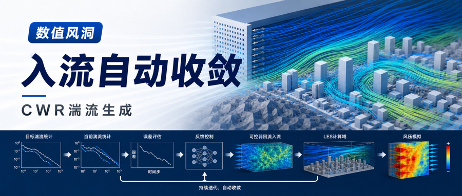
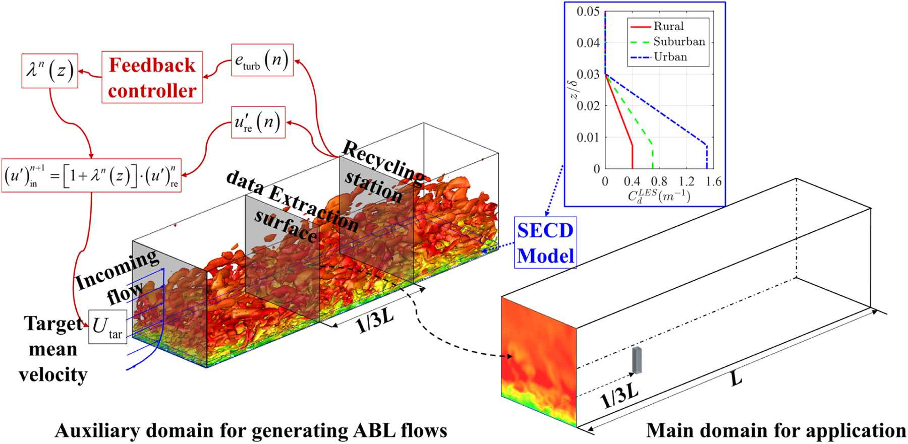
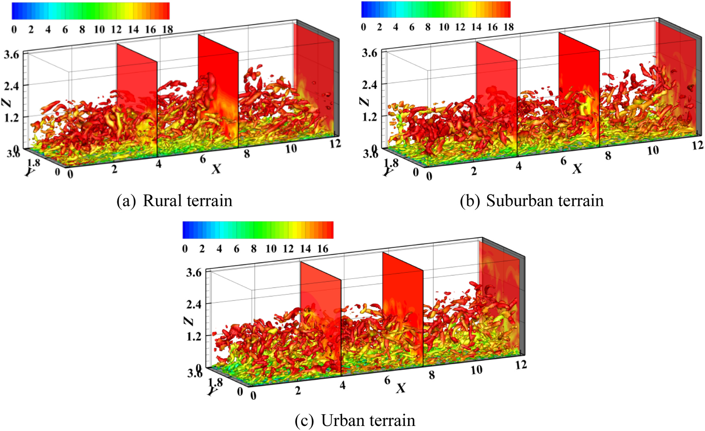
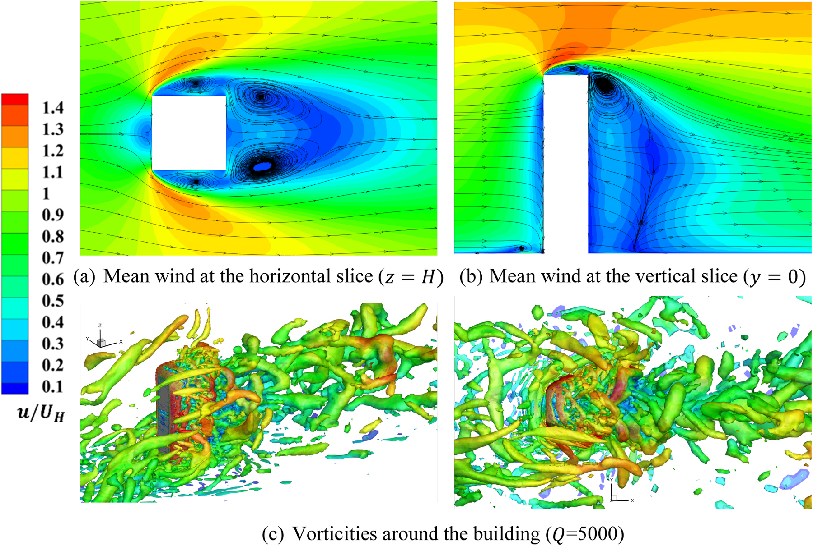
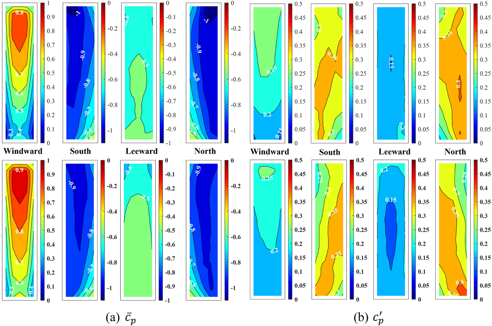

.. _paper-note-ref-wang2024-ES:

.. role:: student-first-author

让 LES 入流按目标风场自动收敛
=============================

在建筑风工程的大涡模拟（LES）中，入口湍流决定了后续流场能否可信地发展。入口风场如果不能同时贴近目标平均风速、湍流强度、风谱和粗糙地表特征，计算域里的建筑绕流和风压结果就可能带着入口条件本身的偏差。

这篇发表于 Engineering Structures 的论文提出 controllable weak recycling (CWR) 方法。它把反馈比例控制引入 weak recycling 方法的重缩放过程，并结合近地面阻力模型，使 LES 可以在一个辅助计算域中生成满足目标特征的湍流大气边界层，再把提取到的速度时程用于主计算域的建筑风效应评估。

   论文图 3 CWR 方法获得指定湍流大气边界层风场的示意图

   图中展示了 CWR 的整体流程：辅助域内通过反馈控制调整回收站处的脉动速度，SECD 模型维持近地面粗糙地形影响，再从提取面输出入口速度时程给主域使用。

论文信息
--------

- 论文题名: A new controllable weak recycling inflow turbulence generator for evaluating wind effects on building in LES
- 作者: :student-first-author:`Wang Jinghan`; **Li Chao**\*; Chen Lingwei; Zhou Shengtao; Hu Gang; Ou Jinping
- 期刊: Engineering Structures
- 年份: 2024
- DOI: https://doi.org/10.1016/j.engstruct.2024.118742
- WOEAI 相关方向: 建筑结构抗风 / 数值风洞与湍动入流

三句话导读
----------

这篇论文研究 CWR 方法：让 LES 辅助域中的弱循环入流可以按目标平均风速和湍流强度自动收敛。 它重要，因为传统 weak recycling 往往要为不同目标地貌和计算域重新设计粗糙元布置，削弱了数值风洞的工程效率。 读者可以带走的结论是：反馈控制可以让入口边界层生成更可调，但风谱、相干性和建筑风压验证仍是进入工程应用前的关键门槛。

关键数字 / 关键结论卡
---------------------

- 城市地形算例中，:math:`K_P=-80.0` 时系统稳定收敛，平均风速和纵向湍流强度的整体平均绝对相对误差均保持在 :math:`10\%` 以下。
- 乡村、郊区和城市三类粗糙地形下，回收站处平均风速 MARE 分别为 :math:`3.28\%`、:math:`4.07\%` 和 :math:`5.45\%`。
- 建筑风压验证中，迎风面和背风面的脉动风压偏差小于 :math:`20\%`，侧面最大偏差达到 :math:`30\%`，提示相干性仍需继续改进。

摘要
----

弱循环方法，又称“重缩放-循环”方法，已经通过在发展段采用错列块体来模拟微尺度湍流大气边界层（ABL），从而复现物理 ABL 风洞布置。然而，当面对不同目标结构、计算域尺寸或地表暴露条件时，该方法需要重新评估粗糙元的尺寸和布置，因而存在应用上的挑战。

为解决这些问题，本文提出一种可控弱循环（controllable weak recycling, CWR）方法，用于在大涡模拟（LES）中生成粗糙地表上的湍流 ABL 风场。该方法能够在单次模拟中直接生成具有任意目标特征的湍流边界层，显著提高生成效率并降低计算资源消耗。

本文的改进方法将反馈比例控制算法引入“重缩放”过程，以最小化模拟湍流强度与目标湍流强度之间的误差。此外，方法在近地面区域采用既有阻力模型，以维持粗糙地表上的水平匀质 ABL 风场。本文通过 LES 模拟三类不同粗糙地形上的湍流 ABL 风场，对所提出的 CWR 方法进行验证。结果表明，生成的入口湍流符合给定的平均风速和湍流强度，并沿流向表现出一致的自持性。同时，生成的风谱与各向异性 von-Kármán 谱高度一致。当把提取的风速时程施加到主计算域入口时，研究发现高层建筑上的平均和脉动风压与指定风洞试验结果吻合较好。

研究问题
--------

CWR 关注的是如何让 LES 入流生成更可控、更少试错。本文回答三个问题：

1. 给定目标平均风速和湍流强度后，能否用反馈比例控制自动调整 weak recycling 的重缩放过程？
2. 生成的湍流大气边界层能否在不同粗糙地形下保持沿流向的自持发展，并匹配目标风谱？
3. 将提取的入口速度时程用于高层建筑主域时，平均和脉动风压能否与风洞试验总体吻合？

方法贡献
--------

CWR 方法的核心，是把反馈控制放入 weak recycling 的重缩放流程。论文首先在回收站收集瞬时速度，计算模拟湍流强度与目标湍流强度之间的误差，再构造控制系数 :math:`\lambda` 调整回收的纵向脉动速度，最后把更新后的入口速度重新施加到计算域中。这个过程循环进行，直到回收站处的湍流强度与目标值对齐。

在参数研究后，论文发现 CWR 方法在本文算例中只需要比例项就能有效控制湍流强度。这个简化后的控制关系可以写为：

.. math::

   \lambda^n(z)=K_P\left[I_{\mathrm{re}}^n(z)-I_{\mathrm{tar}}(z)\right]

其中，:math:`I_{\mathrm{re}}^n(z)` 是第 :math:`n` 个时间步在回收站得到的纵向湍流强度，:math:`I_{\mathrm{tar}}(z)` 是目标湍流强度，:math:`K_P` 是比例增益。它表达的是一个直接反馈逻辑：如果模拟值偏离目标，就用比例控制修正重新引入的纵向脉动速度。

第二个贡献是把 SECD 模型用于近地面区域，以模拟不同粗糙地形对平均风场的影响。这样，CWR 不再依赖为每个目标风场反复布置粗糙块和尖劈，而是在数值模型中通过阻力项和反馈控制共同调节 ABL 风场。

关键发现
--------

1. 比例控制足以把目标湍流强度拉回可用范围
~~~~~~~~~~~~~~~~~~~~~~~~~~~~~~~~~~~~~~~~~

**针对问题 1，在城市地形算例中，论文比较了无控制、较弱调整和适当调整三种比例增益。** 结果显示，:math:`K_P=-80.0` 时系统能够稳定收敛，且平均风速和纵向湍流强度的整体平均绝对相对误差均保持在 :math:`10\%` 以下。更强的控制会带来振荡甚至求解发散，因此这不是“控制越强越好”，而是需要在稳定性和误差之间找到合适增益。

2. 三类粗糙地形下生成的 ABL 风场具有自持性
~~~~~~~~~~~~~~~~~~~~~~~~~~~~~~~~~~~~~~~~~~

**针对问题 2，论文进一步将 CWR 应用于乡村、郊区和城市三类粗糙地形。** 以 :math:`K_P=-80.0` 作为统一比例增益时，回收站处平均风速的 MARE 分别为 :math:`3.28\%`、:math:`4.07\%` 和 :math:`5.45\%`；纵向湍流强度的 MARE 分别为 :math:`6.16\%`、:math:`8.47\%` 和 :math:`7.41\%`。从提取面到回收站的统计偏差也较小，说明生成的湍流 ABL 风场沿流向保持了较好的自持发展。

   论文图 13 不同粗糙地形下湍流大气边界层风场的瞬时涡量

   图中用 :math:`Q=200` 提取三类粗糙地形下的瞬时涡结构，并按速度幅值着色。它直观展示了 CWR 生成的湍流结构在计算域内持续发展，而不是快速衰减为过度平滑的入口风场。

3. 风谱与各向异性 von-Kármán 谱保持一致
~~~~~~~~~~~~~~~~~~~~~~~~~~~~~~~~~~~~~~~

**针对问题 2，对数值风洞来说，平均风速和湍流强度只是第一层检查，频率能量分布同样重要。** 论文将 CWR 生成的风谱与各向异性 von-Kármán 谱对比，结果显示生成风场在能量含量区和惯性子区总体吻合，并能观察到 :math:`-5/3` 斜率特征。高频部分的能量损失仍然存在，主要与 LES 的数值耗散和网格分辨率有关。

4. 高层建筑风压结果与风洞数据总体吻合
~~~~~~~~~~~~~~~~~~~~~~~~~~~~~~~~~~~~~

**针对问题 3，论文将提取到的 CWR 风速时程作为主计算域入口条件，用于孤立高层建筑的风荷载评估，并与 TPU Aerodynamic Database 的风洞试验结果对比。** 结果显示，建筑迎风面、背风面和侧面的平均风压分布总体一致；迎风面和背风面的脉动风压偏差小于 :math:`20\%`，侧面最大偏差达到 :math:`30\%`。

   论文图 19 建筑周围平均风场和流动结构

   图中展示了建筑周围的平均速度场、流线和瞬时涡结构。它说明 CWR 生成的入口风场进入建筑主域后，能够形成分离、尾流和马蹄涡等典型建筑绕流特征。

   论文图 21 建筑表面风压系数云图

   上排为 TPU 风洞试验数据库结果，下排为 LES 结果。图中比较了平均风压系数和脉动风压系数，显示 CWR-LES 对主要风压分布具有较好的复现能力，同时也暴露出侧面脉动风压仍有改进空间。

工程意义
--------

这项工作的意义在于，把入流生成从“为每个目标风场重建一套粗糙元布置”推进到“用反馈控制自动逼近目标统计风场”。对建筑结构抗风、城市风环境和高层建筑风压数值模拟而言，这有助于减少前处理试错和计算资源消耗，使 LES 数值风洞更容易围绕不同地貌、不同目标建筑和不同主计算域进行快速配置。

对工程应用而言，CWR 的价值不是替代风洞试验或现场观测，而是提供一个更可控的 LES 入流生成环节。它可以把目标风场参数、辅助域入流生成和主域建筑风压评估串联起来，让入口条件的误差来源更加清楚，也更便于在后续工程流程中复核。

适用边界
--------

论文也明确给出了后续改进空间。首先，SECD 模型会在近地面区域放大湍流强度，仍需要更准确地建立阻力系数与湍流统计特征之间的关系。其次，SECD 阻力系数在本文中仍依赖试算确定，这限制了方法在更多地形条件下的直接推广。

第三，CWR 方法当前主要调整纵向湍流强度，没有同时把湍流相干性作为控制目标。因此，在高层建筑侧面脉动风压预测中，LES 结果相对风洞试验仍出现较大偏差。将 CWR 用于具体工程时，仍需要结合目标风场谱、相干性、网格分辨率、计算域尺度以及风洞或现场数据进行验证。

延伸阅读
--------

- `WOEAI | 建筑结构抗风方向介绍 <https://woeai.readthedocs.io/zh-cn/latest/BuildingStructuralWindResistance.html>`_
- `WOEAI | 主页 <https://woeai.readthedocs.io/zh-cn/latest/>`_

完整引用
--------

[55] :student-first-author:`Wang Jinghan`; **Li Chao**\*; Chen Lingwei; Zhou Shengtao; Hu Gang; Ou Jinping, A new controllable weak recycling inflow turbulence generator for evaluating wind effects on building in LES[J]. **Engineering Structures**, 2024, 318: 118742. https://doi.org/10.1016/j.engstruct.2024.118742.

收录信息见 :ref:`WOEAI 学术成果页对应条目 <ref-wang2024-ES>`。

相关论文精解
------------

- :doc:`我们如何用预计算 CFD 数据库加速城市微尺度风环境预测 <ref-zhao2026-BS>`
- :doc:`如何把卫星影像转成 CFD 可用城市几何 <ref-zhao2026-BE>`
- :doc:`如何高效重建城市风能中的高时间分辨率风场 <ref-tang2026-RE>`
