.. _paper-note-ref-wang2024-ES:

.. role:: student-first-author

用于 LES 建筑风效应评估的新型可控弱循环入流湍流生成器：论文精解
===============================================================

精简版微信公众号文章：待发布

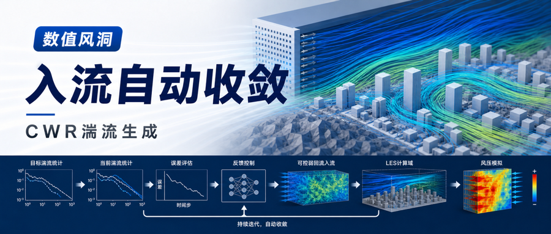

.. contents:: 本页目录
   :local:
   :depth: 3

论文信息
--------

- 原文题名：A new controllable weak recycling inflow turbulence generator for evaluating wind effects on building in LES
- 作者（保持原文顺序及单位映射）：Jinghan Wang（a）；Chao Li（a、b，双星号通讯作者）；Lingwei Chen（a）；Shengtao Zhou（c，单星号通讯作者）；Gang Hu（a、b、d）；Jinping Ou（a、b）
- 单位 a：哈尔滨工业大学（深圳），中国深圳，518055
- 单位 b：广东省土木工程智能与韧性结构重点实验室，哈尔滨工业大学（深圳），中国深圳，518055
- 单位 c：中国电建集团中南勘测设计研究院有限公司，中国长沙，410014
- 单位 d：粤港澳数据驱动流体力学与工程应用联合实验室，哈尔滨工业大学（深圳），中国深圳，518055
- 期刊：Engineering Structures，2024 年，第 318 卷，文章号 118742
- DOI：https://doi.org/10.1016/j.engstruct.2024.118742
- 收稿：2024 年 1 月 4 日；修回：2024 年 7 月 22 日；录用：2024 年 8 月 5 日
- 通讯脚注：原文单星号脚注写“通讯作者地址：哈尔滨工业大学（深圳），中国深圳，518055”；双星号脚注写“通讯作者”。通讯邮箱：lichaosz@hit.edu.cn （C. Li）；zhoushengtao1991@foxmail.com （S. Zhou）

.. note::

   作者行将 Shengtao Zhou 的单位标为 c，而单星号通讯地址脚注写为哈尔滨工业大学（深圳）；这里保留两处原文信息，不将两位通讯作者合并为一位。正文中存在的参数、符号和工况编号差异亦在相应位置标注，公式按出版版保留。

摘要
----

弱循环方法又称“重缩放—循环”方法，已通过在发展段中采用交错布置的块体，复现物理大气边界层（ABL）风洞的布置，从而扩展用于模拟微尺度湍流大气边界层。然而，该方法面临一些困难，例如在处理不同目标结构、计算域尺寸或地表暴露条件时，需要重新评估粗糙元的尺寸和布置。为解决这些问题，本文提出一种可控弱循环（controllable weak recycling，CWR）方法，用于在大涡模拟（LES）中生成粗糙表面上的湍流 ABL 风场。该方法能够在一次模拟中直接生成具有任意目标特征的湍流边界层，显著提高生成效率并减少计算资源消耗。本文的改进方法将反馈比例控制算法引入“重缩放”过程，以减小模拟湍流强度与目标湍流强度之间的误差。此外，在近地面区域使用一种已有的阻力模型，以维持粗糙表面上水平均匀的 ABL 风场。通过 LES 模拟三类不同粗糙地形上的湍流 ABL 风场，对所提出的 CWR 方法进行验证。结果证实，生成的入流湍流符合规定的平均风速和湍流强度，并沿流向表现出一致的自持性。此外，生成的风谱与各向异性 von-Kármán 谱十分接近。当将提取的风速时程施加于主计算域入口时，高层建筑的平均和脉动风压与指定风洞试验结果接近。

关键词
------

入流湍流生成；粗糙表面；大气边界层；弱循环方法；大涡模拟；PID 控制算法

1 引言
------

由于湍流 ABL 风场对建筑表面所受风荷载有重要影响，复现这种流动一直是结构风工程中的重要课题。除物理风洞试验和现场测量外，基于计算流体力学（CFD）技术的数值风洞，已发展成为模拟 ABL 风场及建筑风效应的常用平台 [1]_ [2]_ 。目前，高性能计算已使 LES 能够应用于工业领域，以获得土木结构上的实时风荷载。众所周知，采用 LES 时，下游流场的湍流风特性受到入流湍流条件的强烈影响，这一直是计算风工程（CWE）中尚未解决的问题。

1.1 入流湍流生成方法
~~~~~~~~~~~~~~~~~~~~

已有研究提出，湍流 ABL 风场的理想化湍流入口条件应满足真实风场的统计特征，包括平均风速、湍流强度、风谱和空间相关性 [3]_ [4]_ 。在此基础上，研究人员探索了各种入流湍流生成（ITG）方法，可将其归为合成法和前驱法两类基本方法 [3]_ [5]_ [6]_ 。除这些经典方法外，机器学习算法近来在 CWE 中也受到广泛关注。这些算法既可与现有 ITG 方法结合，也可直接用于生成入流湍流 [7]_ [8]_ [9]_ 。

在合成法中，人工合成随机脉动，并在 CFD 计算模型的入口边界上将其叠加到平均流上。按照所使用的不同算法，可将这些方法分为合成随机傅里叶生成方法 [10]_ [11]_ [12]_ [13]_ [14]_ [15]_ [16]_ [17]_ 、合成数字滤波方法 [18]_ [19]_ [20]_ [21]_ [22]_ 、合成涡方法 [23]_ [24]_ [25]_ 、合成体积力方法 [26]_ [27]_ [28]_ 以及本征正交分解（POD）方法 [29]_ [30]_ 。有关详细综述，可参阅 Wu 的文章 [6]_ 。合成法只需消耗少量计算资源，就能高效生成规定的湍流入流条件。然而，其主要缺点是生成的湍流入口数据与无散度条件及 Navier–Stokes（NS）方程不一致 [5]_ [14]_ [26]_ [31]_ [32]_ 。这种不一致可能导致非物理的压力脉动、湍流能量衰减及入流特性的重新发展。

与合成法相比，前驱法通常先在辅助计算域中生成湍流 ABL 风场，随后将其提取并映射为主计算域的入流边界条件（IBC）。这些方法通过求解控制方程获得湍流边界层风场，而不引入人工脉动，因此具有能够形成充分发展且自然平衡流场的内在优势。前驱法可分为风洞复现（WTR）方法 [33]_ [34]_ 、前驱数据库（PD）方法 [35]_ 和弱循环（WR）方法 [36]_ [37]_ [38]_ 。WTR 和 PD 方法通过复现物理风洞试验中的粗糙设施布置，获得湍流 ABL 风场。二者的关键区别在于：WTR 方法将建筑布置在粗糙设施下游，而 PD 方法储存所生成的风场，用作独立主计算模型的 IBC [35]_ 。与 WTR 方法相比，PD 方法的局限来自必须储存大量速度数据，并在主模拟中读取这些数据，从而限制计算效率 [34]_ 。为缓解数据存储及输入/输出操作引起的效率降低，研究人员提出了辅助域和主域并行计算的方法 [39]_ [40]_ 。此外，随着计算机存储技术的进步，数据存储和输入/输出操作对模拟效率的影响也有所减小。不过，需要注意的是，这些方法需要大量计算网格才能获得高保真湍流 ABL 风场。例如，文献 [34]_ 中用于描述粗糙元和尖劈的体积单元，占总计算网格数的 90%，导致计算资源需求很高。

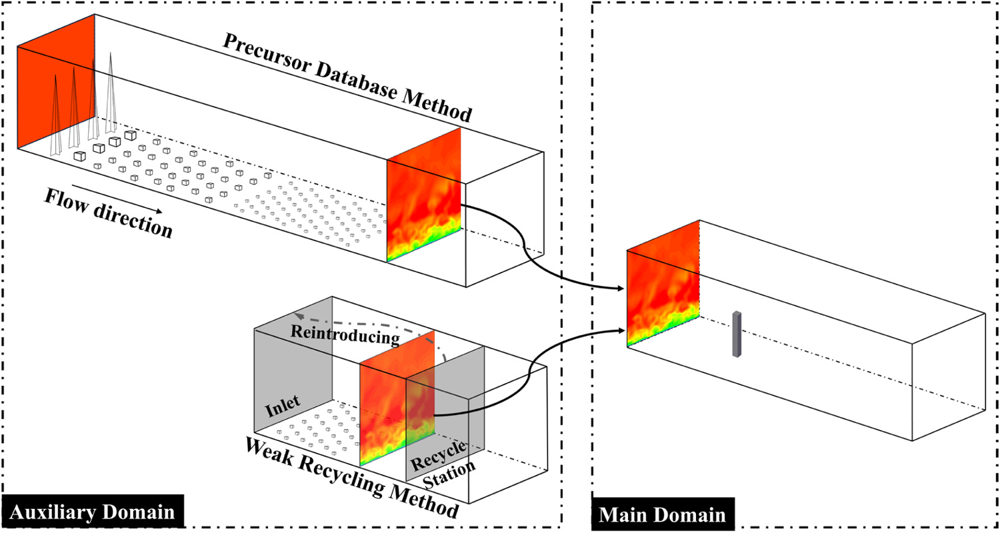

   **图 1** PD 和 WR 方法生成粗糙地形上湍流 ABL 风场的示意图。图内文字：前驱数据库方法；弱循环方法；流动方向；重新引入；入口；回收站；辅助域；主域。

如图 1 所示，WR 方法 [41]_ 按照湍流边界层的相似律缩放所收集的速度数据，简化了 Spalart 研究 [42]_ 中使用的多重缩放算法。Lund 等 [41]_ 将 LES 结果与雷诺数 :math:`Re_\theta=1410` 的湍流边界层直接数值模拟（DNS）结果 [42]_ 进行比较，证明 WR 方法能够控制所需的表面摩擦和动量厚度。基于 WR 的方法有两个主要优点。首先，与合成法相比，它能生成稳定的湍流边界层风场。其次，与其他前驱方法相比，它所需的计算域更短，因此效率更高。所以，基于 WR 的方法已成为生成不可压缩 [36]_ [40]_ [43]_ [44]_ [45]_ 和可压缩 [46]_ [47]_ [48]_ 湍流边界层入流条件的常用选择。

由于接近地表的大气边界层可近似为粗糙表面上的行星尺度平板湍流边界层，将 WR 方法扩展到 CWE 中模拟真实湍流 ABL 风场具有良好前景。不过，由于该方法最初是为生成光滑表面流动而设计的，因此需要进行调整 [49]_ [50]_ 。主要修改是在重缩放过程中使用不同参数 [51]_ [52]_ 。此外，Kataoka 等 [53]_ 在应用 WR 方法模拟湍流 ABL 风场时，假设边界层厚度沿流向保持不变，从而简化了重缩放过程。Jiang 等 [54]_ 将基于 WR 的方法扩展到三维城市街道周围的不稳定湍流 ABL 风场模拟。Chaudhari 等 [55]_ 采用映射—循环方法生成丘陵地形上的湍流边界层风场，回收的数据不经任何重缩放或修改，直接引入入口边界。

通过上述文献回顾可以看出，基于 WR 的方法在 CWE 中生成粗糙表面上湍流 ABL 风场时，存在一个主要应用限制。文献 [49]_ [51]_ [52]_ [54]_ 指出，除调整参数外，还必须建立实际或虚拟粗糙元的计算模型来调节风特性。这一要求使湍流 ABL 风场必须逐工况进行模拟，降低了基于 WR 方法本身的计算效率。为解决这一问题，Yuxin Zhang 等 [56]_ 提出循环与重塑方法调节入流平均风速，从而避免重复布置粗糙块。然而，该研究仅验证了一种粗糙表面，且未考虑上部流场的湍流特征。为使基于 WR 的方法能够在 CWE 中高效应用，本文旨在增强 WR 方法生成粗糙表面湍流 ABL 风场的可控性，同时保留其固有优点。

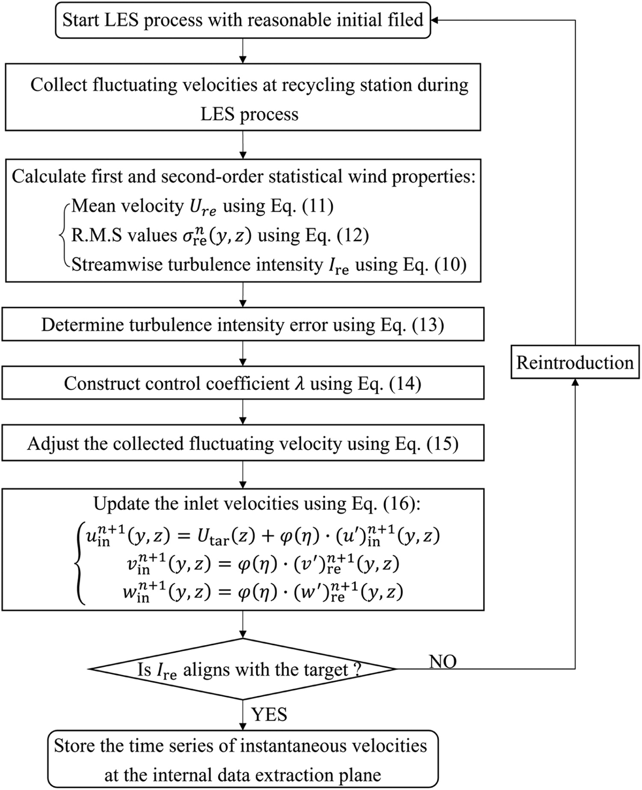

   **图 2** CWR 方法控制入流脉动速度的流程图。图内流程依次为：以合理初始场开始 LES；在 LES 过程中收集回收站的脉动速度；计算一阶和二阶风场统计量，分别用式（11）、（12）和（10）计算平均风速、均方根和纵向湍流强度；用式（13）确定湍流强度误差；用式（14）构造控制系数；用式（15）调整已收集的脉动速度；用式（16）更新入口速度；判断回收站湍流强度是否符合目标。若否，则重新引入并继续循环；若是，则储存内部数据提取面上的瞬时速度时程。

1.2 计算风工程中的 PID 控制算法
~~~~~~~~~~~~~~~~~~~~~~~~~~~~~~~

比例—积分—微分（PID）控制算法是自动控制领域的一项成熟技术，通过三个功能项，为各种复杂实际问题提供简单、稳定且高效的调节 [57]_ 。这一经典自动控制算法广泛用于结构工程和 CWE。在结构工程中，它用于调节物理风洞的风速和湍流强度 [58]_ ，也用于结构振动控制。在 CWE 中，该技术用于控制风力机桨距角及生成湍流 ABL 风场，这也为本研究提供了启发。

在将 PID 控制算法用于生成湍流 ABL 风场方面，Spille-Kohoff 等 [59]_ 基于比例—积分（PI）算法，为 NS 方程构造了一个强迫项。这一方法利用模拟雷诺剪应力与预设雷诺剪应力之间的误差来模拟湍流边界层风场。尽管该强迫项显著缩短了随机傅里叶系数方法 [60]_ 所生成入流湍流的重新发展距离，但并未讨论相关参数的影响。Laraufie 等 [61]_ 将剪应力替换为壁面法向应力，并把该方法应用于分区 RANS/LES 模型，给出了强迫项的最优参数。近来，Haywood 等 [39]_ 基于 PI 算法构造了可调节平均风速的作用力，并将其与并行前驱法结合，在 LES 中模拟湍流边界层风场。Tangermann 等 [27]_ 采用 PID 算法控制湍流场，在圆柱和翼型周围湍流边界层流动中获得了与 DNS 接近的结果。

1.3 本文内容安排
~~~~~~~~~~~~~~~~

在 CWE 中，为准确预测土木结构风荷载，获得充分发展的湍流 ABL 风场至关重要；其风特性应反映物理实际，并在流向和时间两个维度上保持一致。正如前文所述，前驱法所生成的湍流入流条件稳定，且表现出自然平衡。在这些方法中，WR 方法由于所需的计算模型更短，效率高于风洞复现方法和前驱数据库方法。因此，本文重点研究基于 WR 的方法在湍流 ABL 风场生成中的应用。

PID 算法是一种成熟、完善的自动控制技术，具有稳健且易于实现的特点。因此，在 LES 中采用 PID 控制器增强 WR 方法生成湍流 ABL 风场的可控性，是值得探索的方向。本文提出可控弱循环（CWR）方法，将这两种方法结合，以获得粗糙表面上指定的湍流 ABL 风场。在 CWR 方法中，反馈 PID 控制器用于在 LES 模拟过程中调整入流脉动速度，而已有的近地面阻力模型用于复现不同粗糙地形，并维持近地面区域的风特性。

本文安排如下：第 2 节详细介绍方法，包括对原始弱循环（WR）方法和 CWR 方法的简要回顾。第 3 节基于高粗糙度地形上湍流 ABL 风场的 LES 模拟，分析 CWR 方法的参数。最后，第 4 节展示 CWR 方法在不同粗糙表面、风洞尺度湍流 ABL 风场 LES 模拟中的应用。

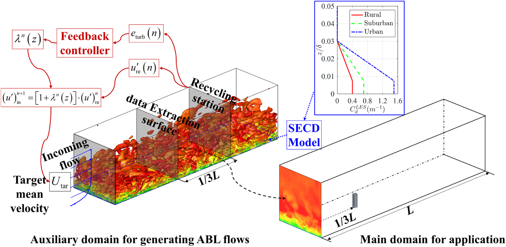

   **图 3** 采用 CWR 方法获得指定湍流 ABL 风场的示意图。图内文字：反馈控制器；入流；目标平均风速；数据提取面；回收站；SECD 模型；生成 ABL 风场的辅助域；用于应用的主域。右上角曲线分别为乡村、郊区和城市地形的 SECD 阻力系数分布，提取面与回收站的流向距离为主域长度的三分之一。

.. list-table:: 表 1 调整系数表达式中比例增益 KP 的符号
   :header-rows: 1
   :widths: 18 18 22 26 16

   * - 过程变量
     - 过程误差
     - 变量增量
     - 控制系数
     - 比例增益
   * - :math:`u'_{\rm re}>0`
     - :math:`e_{\rm turb}>0`
     - :math:`\lambda u'_{\rm re}<0`
     - :math:`\lambda=K_Pe_{\rm turb}<0`
     - :math:`K_P<0`
   * - :math:`u'_{\rm re}>0`
     - :math:`e_{\rm turb}<0`
     - :math:`\lambda u'_{\rm re}>0`
     - :math:`\lambda=K_Pe_{\rm turb}>0`
     - :math:`K_P<0`
   * - :math:`u'_{\rm re}<0`
     - :math:`e_{\rm turb}>0`
     - :math:`\lambda u'_{\rm re}>0`
     - :math:`\lambda=K_Pe_{\rm turb}<0`
     - :math:`K_P<0`
   * - :math:`u'_{\rm re}<0`
     - :math:`e_{\rm turb}<0`
     - :math:`\lambda u'_{\rm re}<0`
     - :math:`\lambda=K_Pe_{\rm turb}>0`
     - :math:`K_P<0`

.. list-table:: 表 2 三类粗糙地形的参数（原型尺度）
   :header-rows: 1

   * - 粗糙地形
     - 空气动力学粗糙度长度 :math:`z_0`
     - 摩阻速度 :math:`u_*`
     - :math:`u_{10}`
   * - 乡村
     - 0.1 m
     - 0.8686 m/s
     - 10.00 m/s
   * - 郊区
     - 0.3 m
     - 0.9436 m/s
     - 8.27 m/s
   * - 城市
     - 1.0 m
     - 1.0423 m/s
     - 6.00 m/s

2 基于弱循环的入流湍流生成器
----------------------------

2.1 原始 WR 方法的基本过程
~~~~~~~~~~~~~~~~~~~~~~~~~~

Lund 等 [41]_ 首先建立了 WR 方法框架，用于生成光滑平板上沿空间发展的湍流边界层。该方法在笛卡尔坐标系中引入准周期边界条件，使其成为一种基于内部流场信息、实现简便的入流生成工具。该方法的实施包括三个主要部分：

2.1.1 第一部分：循环与分解
^^^^^^^^^^^^^^^^^^^^^^^^^^

在靠近计算域出口边界的位置，即回收站（Recycling Station，RS），收集瞬时速度 :math:`u_i` ，并将其分解为平均分量和脉动分量，定义为：

.. math::

   u_{i,\mathrm{re}}(x_{\mathrm{re}},y,z,t)
   =U_{i,\mathrm{re}}(x_{\mathrm{re}},z)
   +u'_{i,\mathrm{re}}(x_{\mathrm{re}},y,z,t). \qquad (1)

其中， :math:`U_i` 表示展向和时间平均速度， :math:`u'_i` 表示脉动速度，下标“re”表示 RS， :math:`i=1,2,3` 分别表示流向（ :math:`x` ）、展向（ :math:`y` ）和竖向（ :math:`z` ）。

2.1.2 第二部分：重缩放与插值
^^^^^^^^^^^^^^^^^^^^^^^^^^^^

依据湍流边界层的相似律，包括壁面律（式（2））和亏损律（式（3）），对 RS 处的平均速度进行重缩放。同时，按照式（4）和式（5）对脉动速度进行重缩放。

.. math::

   U^+_{\mathrm{in}}(z^+_{\mathrm{in}})
   =\frac{U^{\mathrm{inner}}_{\mathrm{in}}(z^+_{\mathrm{in}})}{u_{*,\mathrm{in}}}
   =\frac{U^{\mathrm{inner}}_{\mathrm{re}}(z^+_{\mathrm{in}})}{u_{*,\mathrm{re}}}
   =U^+_{\mathrm{re}}(z^+_{\mathrm{in}}) \qquad (2)

.. math::

   \frac{U_\infty-U^{\mathrm{outer}}_{\mathrm{in}}(\eta_{\mathrm{in}})}{u_{*,\mathrm{in}}}
   =\frac{U_\infty-U^{\mathrm{outer}}_{\mathrm{re}}(\eta_{\mathrm{in}})}{u_{*,\mathrm{re}}} \qquad (3)

.. math::

   (u')^{\mathrm{inner}}_{i,\mathrm{in}}=\gamma u'_{i,\mathrm{re}}(y,z^+_{\mathrm{in}},t) \qquad (4)

.. math::

   (u')^{\mathrm{outer}}_{i,\mathrm{in}}=\gamma u'_{i,\mathrm{re}}(y,\eta_{\mathrm{in}},t) \qquad (5)

.. math::

   \gamma=\frac{u_{*,\mathrm{in}}}{u_{*,\mathrm{re}}} \qquad (6)

.. math::

   U^+=\frac{U}{u_*},\quad z^+=\frac{\rho zu_*}{\mu},\quad
   \eta=\frac{z}{\delta},\quad
   u_*=\sqrt{\nu\left(\frac{\partial u_1}{\partial z}\right)_{\mathrm{wall}}} \qquad (7)

其中，下标“in”表示入口边界；以下上标“inner”和“outer”分别表示湍流边界层的内区与外区。 :math:`U^+` 为归一化平均速度， :math:`z^+` 和 :math:`\eta` 分别为边界层内区与外区的壁面单位。 :math:`u_*` 为摩阻速度， :math:`u_1` 表示流向速度分量， :math:`\nu` 为运动黏度， :math:`\rho` 为空气密度， :math:`\mu` 为分子黏度， :math:`\delta` 为边界层高度。 :math:`U_\infty` 为自由流速度， :math:`\gamma` 用作缩放比。此外， :math:`U_{\rm re}(z^+_{\rm in})` 、 :math:`U_{\rm re}(\eta_{\rm in})` 、 :math:`u'_{i,\rm re}(z^+_{\rm in})` 和 :math:`u'_{i,\rm re}(y,\eta_{\rm in},t)` ，分别根据 :math:`U_{\rm re}(z^+_{\rm re})` 、 :math:`U_{\rm re}(\eta_{\rm re})` 、 :math:`u'_{i,\rm re}(y,z^+_{\rm re},t)` 和 :math:`u'_{i,\rm re}(y,\eta_{\rm re},t)` 进行线性插值。

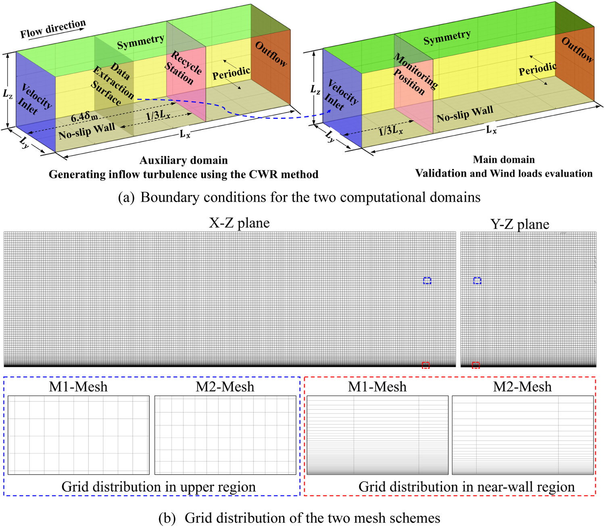

   **图 4** 城市地形上湍流 ABL 风场 LES 的计算模型。（a）两计算域的边界条件：速度入口、流出边界、顶部对称边界、侧面周期边界及底部无滑移壁面；辅助域包含数据提取面与回收站，主域包含监测位置。（b）两种网格方案的分布，展示 X–Z 和 Y–Z 平面，以及上部区域和近壁区域的 M1、M2 网格。

.. list-table:: 表 3 网格无关性分析采用的网格方案
   :header-rows: 1

   * - 网格方案
     - 流向 :math:`\Delta x`
     - :math:`N_x`
     - 展向 :math:`\Delta y`
     - :math:`N_y`
     - 竖向 :math:`\Delta z_{\rm wall}`
     - :math:`N_z`
     - 增长率
     - 网格总数
   * - M1
     - 0.05 m
     - 240
     - 0.05 m
     - 72
     - 0.0001 m
     - 105
     - 1.13
     - 181 万
   * - M2
     - 0.04 m
     - 300
     - 0.04 m
     - 90
     - 0.0001 m
     - 150
     - 1.08
     - 405 万

.. list-table:: 表 4 CWR 方法参数研究的 LES 工况参数
   :header-rows: 1

   * - 工况
     - 地形
     - 计算域
     - :math:`K_P`
     - 网格方案
     - 时间步长
     - 目的
   * - UC1
     - 城市
     - 辅助域
     - 0
     - M1
     - :math:`1\times10^{-3}\,\mathrm{s}`
     - 确定 :math:`K_P` 的值
   * - UC2
     - 城市
     - 辅助域
     - −10.0
     - M1
     - :math:`1\times10^{-3}\,\mathrm{s}`
     - 确定 :math:`K_P` 的值
   * - UC3
     - 城市
     - 辅助域
     - −80.0
     - M1
     - :math:`1\times10^{-3}\,\mathrm{s}`
     - 确定 :math:`K_P` 的值
   * - UC4
     - 城市
     - 主域
     - −80.0
     - M1
     - :math:`1\times10^{-3}\,\mathrm{s}`
     - 验证
   * - UC5
     - 城市
     - 辅助域
     - −80.0
     - M2
     - :math:`5\times10^{-4}\,\mathrm{s}`
     - 网格无关性研究

表 4 的“地形”合并单元格原印作“Urban terrain = 1.0 m = 1.5 m⁻¹”，两数值前的变量名缺失；这里保留其数值信息。城市地形粗糙度和 SECD 系数分别另见表 2 与表 5。

2.1.3 第三部分：组合与重新引入
^^^^^^^^^^^^^^^^^^^^^^^^^^^^^^

按照式（8）组合风速，并将其重新引入作为入口边界条件：

.. math::

   \begin{aligned}
   u_{i,\mathrm{in}}={}&[1+W(\eta_{\mathrm{in}})]
   [U^{\mathrm{inner}}_{i,\mathrm{in}}+(u')^{\mathrm{inner}}_{i,\mathrm{in}}]\\
   &+W(\eta_{\mathrm{in}})
   [U^{\mathrm{outer}}_{i,\mathrm{in}}+(u')^{\mathrm{outer}}_{i,\mathrm{in}}].
   \end{aligned}\qquad (8)

其中， :math:`W(\eta)` 是使湍流边界层内部从内区平滑过渡到外区的权重函数，其定义为：

.. math::

   W(\eta)=\frac12\left\{1+
   \tanh\left[\frac{4(\eta-0.2)}{0.6\eta+0.2}\right]/\tanh(4)\right\}. \qquad (9)

.. note::

   原文第 6 页式（9）分母含一个多余且不配对的右括号；此处仅规范括号配对，不改变其余数学内容。

   式（8）第一项在原文印作 :math:`1+W` ，这里忠实保留；其作为内外区混合权重的符号疑点不作静默修正。

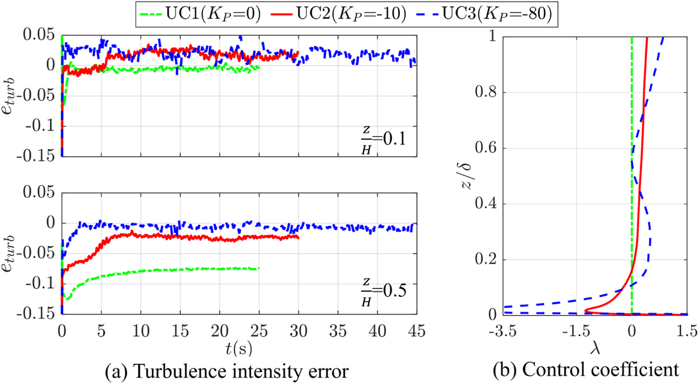

   **图 5** 三个工况回收站两个不同高度的湍流强度误差随时间的变化。（a）湍流强度误差；（b）控制系数。图例分别为 UC1（ :math:`K_P=0` ）、UC2（ :math:`K_P=-10` ）和 UC3（ :math:`K_P=-80` ）。左侧子图原标注高度为 :math:`z/H=0.1` 和 :math:`z/H=0.5` ，正文相应讨论使用 :math:`z/\delta` ，此处保留图文差异。

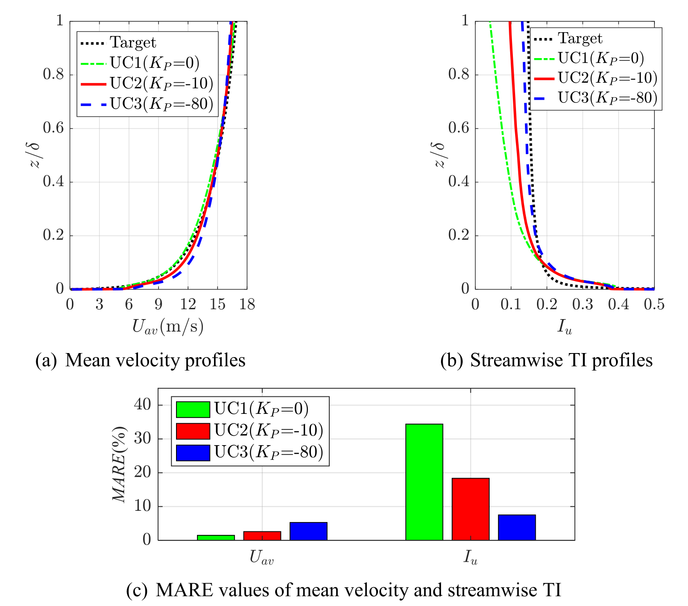

   **图 6** 城市地形上 ABL 风场在 RS 处的 LES 结果比较。（a）平均风速剖面；（b）纵向湍流强度剖面；（c）平均风速和纵向湍流强度的 MARE。Target 表示目标值。

2.2 新型可控弱循环方法
~~~~~~~~~~~~~~~~~~~~~~

由于 WR 方法需要通过试错调整才能获得特定湍流 ABL 风场，因而效率较低，本文提出可控弱循环（CWR）方法，将反馈 PID 控制器引入 WR 方法的重缩放过程。借助实时数据采集和反馈控制器，CWR 方法可以自动调节入流湍流条件，无需增加粗糙元，即可获得指定的风特性。图 2 给出了 CWR 方法的流程图，主要步骤如下：

2.2.1 步骤 1：确定模拟 ABL 风场与指定目标之间的湍流强度误差
^^^^^^^^^^^^^^^^^^^^^^^^^^^^^^^^^^^^^^^^^^^^^^^^^^^^^^^^^^^

首先，收集下游 RS 处的瞬时速度，并依据式（1）将其分解为平均分量和脉动分量。其次，按下式计算纵向湍流强度（TI）：

.. math::

   I^n_{\mathrm{re}}(z)
   =\frac{\langle\sigma^n_{\mathrm{re}}(y,z)\rangle^y}{U^n_{\mathrm{re}}(z)}. \qquad (10)

为消除粗略初始条件对模拟稳定性的影响，平均风速 :math:`U^n_{\rm re}(z)` 采用式（11）计算 [39]_ [41]_ [62]_ ：

.. math::

   U^n_{\mathrm{re}}(z)=\frac{\Delta t}{T_{\mathrm{avg}}}
   \langle U^n_{\mathrm{re}}(y,z)\rangle^y+
   \left(1-\frac{\Delta t}{T_{\mathrm{avg}}}\right)U^{n-1}_{\mathrm{re}}(z). \qquad (11)

纵向速度的均方根（RMS） :math:`\sigma^n_{\rm re}(y,z)` 按下式确定：

.. math::

   \sigma^n_{\mathrm{re}}(y,z)
   =\sqrt{\frac1n\sum_{m=1}^{m=n}[(u')^m_{\mathrm{re}}(y,z)]^2}
   =\sqrt{\frac1n\sum_{m=1}^{m=n}[u^m_{\mathrm{re}}(y,z)-U^m_{\mathrm{re}}(z)]^2}. \qquad (12)

随后，可由式（13）确定 RS 与目标之间的纵向湍流强度误差：

.. math::

   e^n_{\mathrm{turb}}(z)=I^n_{\mathrm{re}}(z)-I_{\mathrm{tar}}(z). \qquad (13)

其中， :math:`U^n_{\rm re}(z)` 为时间和空间平均速度， :math:`U^n_{\rm re}(y,z)` 为时间平均速度， :math:`\Delta t` 表示时间步长。 :math:`T_{\rm avg}` 是等于 :math:`2\delta/U_\infty` 的特征时间。 :math:`I^n_{\rm re}(z)` 为纵向湍流强度， :math:`I_{\rm tar}` 为相应目标值。 :math:`\langle\bullet\rangle^{y,t}` 表示沿展向以及时间区间 :math:`[0,n\Delta t]` 的空间和时间平均算子， :math:`n` 是 LES 模拟的时间步数。

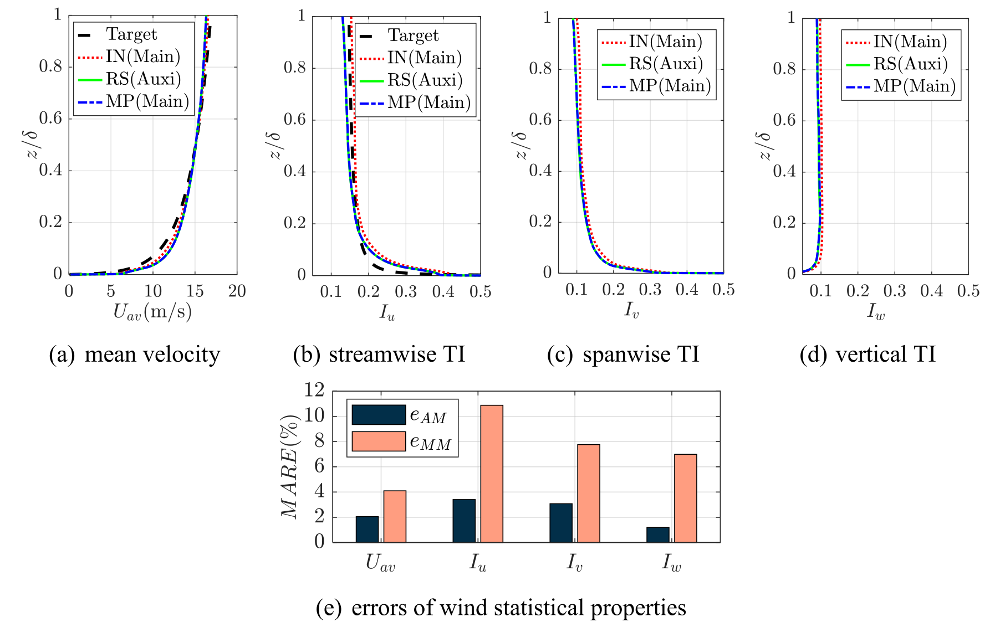

   **图 7** 辅助域和主域不同位置的风统计量比较。图例 Main 表示 UC4 工况结果，其中 IN 为入流边界，MP 为监测位置；RS(Auxi) 为 UC3 工况回收站结果。（a）平均风速；（b）纵向湍流强度；（c）展向湍流强度；（d）竖向湍流强度；（e）风统计特征的误差。

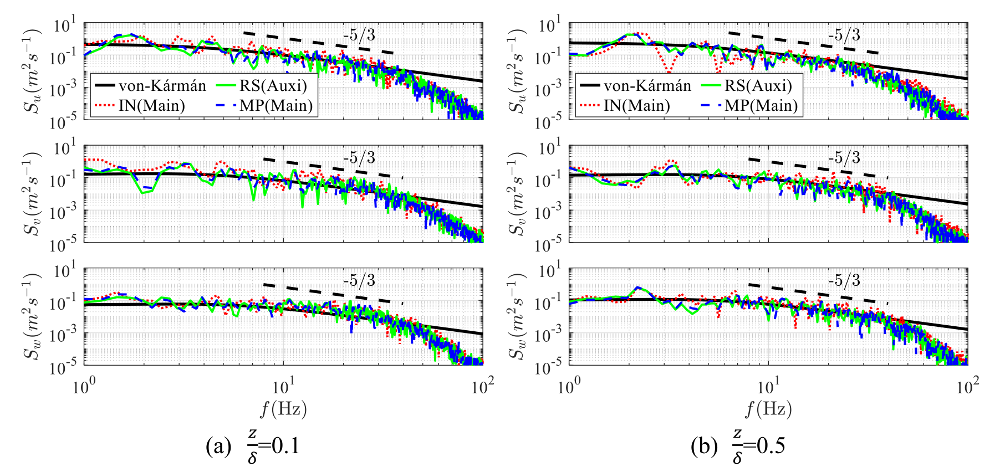

   **图 8** 辅助模拟与主模拟中湍流 ABL 风场的风谱比较。（a） :math:`z/\delta=0.1` ；（b） :math:`z/\delta=0.5` 。每列从上到下为纵向、展向和竖向风谱；图例分别为 von-Kármán 谱、主域入口、辅助域回收站和主域监测位置。

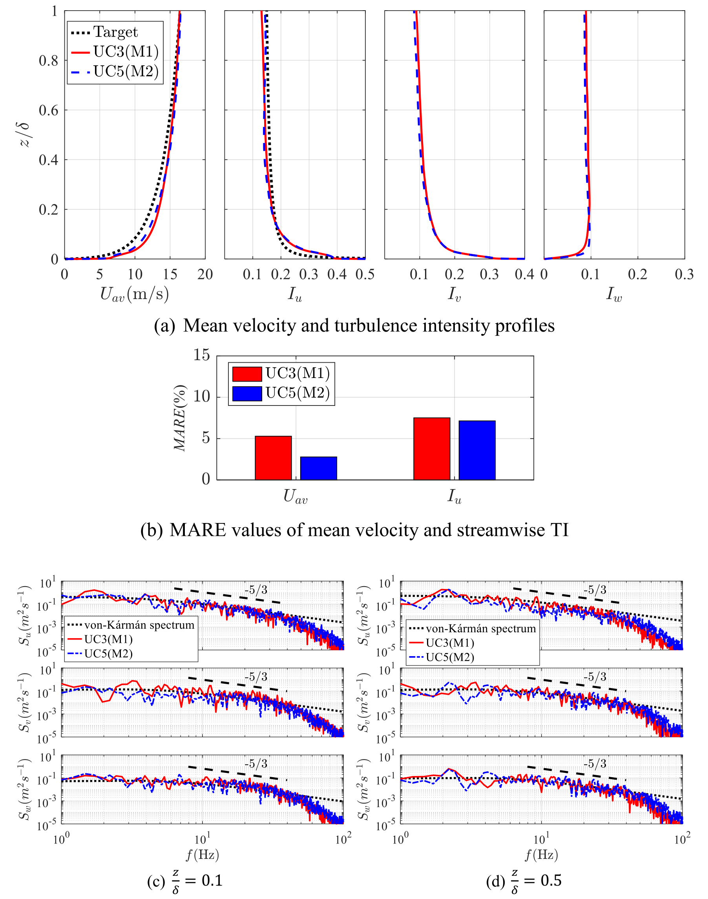

   **图 9** 不同网格模型的风特性比较。（a）平均风速及湍流强度剖面；（b）平均风速和纵向湍流强度的 MARE；（c） :math:`z/\delta=0.1` 处风谱；（d） :math:`z/\delta=0.5` 处风谱。UC3 使用 M1 网格，UC5 使用 M2 网格。

.. list-table:: 表 5 用于生成粗糙地形湍流 ABL 风场的 CWR 方法参数
   :header-rows: 1

   * - 地形类型
     - 乡村
     - 郊区
     - 城市
   * - SECD 模型的 :math:`C_d^*`
     - :math:`0.35\,\mathrm{m}^{-1}`
     - :math:`0.65\,\mathrm{m}^{-1}`
     - :math:`1.5\,\mathrm{m}^{-1}`
   * - P 控制器的 :math:`K_P`
     - −80.0
     - −80.0
     - −80.0
   * - 总模拟时间
     - 50 s
     - 50 s
     - 45 s
   * - 数据统计时间
     - 40–50 s
     - 40–50 s
     - 35–45 s

2.2.2 步骤 2：基于位置式 PID 算法构造控制系数 λ
^^^^^^^^^^^^^^^^^^^^^^^^^^^^^^^^^^^^^^^^^^^^^^^

这一过程是 CWR 方法的核心。为适应离散的瞬态 CFD 模拟，采用式（14）所示的位置式 PID 算法 [63]_ 。

.. math::

   \lambda^n(z)=\underbrace{K_Pe^n_{\mathrm{turb}}(z)}_{\mathrm{P\ term}}
   +\underbrace{K_I\sum e^m_{\mathrm{turb}}(z)}_{\mathrm{I\ term}}
   +\underbrace{K_D[e^n_{\mathrm{turb}}(z)-e^{n-1}_{\mathrm{turb}}(z)]}_{\mathrm{D\ term}} \qquad (14)

其中， :math:`K_P` 、 :math:`K_I` 和 :math:`K_D` 分别为比例、积分和微分增益。 :math:`e^n_{\rm turb}(z)` 为按式（13）计算的第 :math:`n` 步湍流强度误差。

众所周知，标准 PID 控制器通常采用比例（P）、积分（I）和微分（D）三个功能项。P 项提供与受控系统误差直接相关的整体调节；I 项提供低频补偿作用，通常用于降低稳态误差；D 项有助于使系统的瞬态响应稳定 [57]_ 。为在 LES 中采用 CWR 方法稳健地控制并生成指定湍流 ABL 风场，需要依次整定这三个增益值。详细信息见第 3.1 节和第 3.3.1 节。

2.2.3 步骤 3：根据式（15）调整已收集的纵向脉动速度
^^^^^^^^^^^^^^^^^^^^^^^^^^^^^^^^^^^^^^^^^^^^^^^^^^

由于湍流 ABL 的边界层高度通常在较大区域内保持不变，本文采用边界层厚度恒定的假设 [53]_ 。这使 CWR 方法的重缩放过程不同于 WR 方法。

.. math::

   (u')^{n+1}_{\mathrm{in}}(y,z)
   =[1+\lambda^n(z)](u')^n_{\mathrm{re}}(y,z) \qquad (15)

2.2.4 步骤 4：根据式（16），将更新后的脉动速度重新叠加到预设的入流平均风速上
^^^^^^^^^^^^^^^^^^^^^^^^^^^^^^^^^^^^^^^^^^^^^^^^^^^^^^^^^^^^^^^^^^^^^^^^^^^^

展向和竖向的脉动速度直接作为入流速度重新引入，因为相应的平均速度应为零。

.. math::

   \begin{cases}
   u^{n+1}_{\mathrm{in}}(y,z)=U_{\mathrm{tar}}(z)+\varphi(\eta)(u')^{n+1}_{\mathrm{in}}(y,z),\\
   v^{n+1}_{\mathrm{in}}(y,z)=\varphi(\eta)(v')^{n+1}_{\mathrm{re}}(y,z),\\
   w^{n+1}_{\mathrm{in}}(y,z)=\varphi(\eta)(w')^{n+1}_{\mathrm{re}}(y,z).
   \end{cases}\qquad (16)

.. math::

   \varphi(\eta)=\frac12\left\{1+
   \tanh\left[\frac{8.0(\eta-1.0)}{-0.4(\eta-0.3)+0.7}\right]/\tanh(8)\right\} \qquad (17)

其中， :math:`U_{\rm tar}` 为目标平均风速剖面， :math:`\varphi(\eta)` 是阻尼函数，用于防止脉动速度发展到所模拟湍流 ABL 的自由流区域 [64]_ 。

.. note::

   式（15）真正乘在纵向脉动速度上的倍率是 :math:`1+\lambda` ，不是 :math:`\lambda` 本身。式（17）的符号按原文保留，其表达式与“抑制自由流脉动”的文字解释之间存在需要澄清的疑点。

2.2.5 步骤 5：迭代调整重新引入的脉动速度
^^^^^^^^^^^^^^^^^^^^^^^^^^^^^^^^^^^^^^^^

重复步骤 1 至步骤 4，直到下游流场稳定，且 RS 处的湍流强度与目标相符。随后，在内部数据提取面收集并储存瞬时速度时程，用于映射到主计算模型的入口边界；该主模型用于评估建筑风荷载。

此外，根据粗糙地形确定的目标平均风速固定施加于入口边界，并希望其在整个计算域内得到维持。为实现这一目标，采用简化增强冠层阻力（Simplified Enriched Canopy Drag，SECD）模型 [26]_ ，维持近地面区域的平均风速。式（18）所示的 SECD 模型能够在 LES 中有效复现不同粗糙地形的特征。

.. math::

   S^{\mathrm{LES}}_{\mathrm{SECD}}=-\rho C_d^{\mathrm{LES}}|U|U \qquad (18)

.. math::

   C_d^{\mathrm{LES}}=\begin{cases}
   C_d^*, & 0\le z\le h_t,\\
   C_d^*\dfrac{h_s-z}{h_s-h_t}, & h_t<z\le h_s.
   \end{cases}\qquad (19)

其中， :math:`S^{\rm LES}_{\rm SECD}` 表示流向动量方程中的阻力源项， :math:`\rho` 为空气密度， :math:`C_d^{\rm LES}` 为按式（19）计算、并示于图 3 的综合阻力系数。 :math:`|U|` 表示入流平均速度的大小， :math:`U` 为流向平均速度分量。 :math:`C_d^*` 是通过试错确定、用于匹配目标平均风速的常数，乡村地形取 :math:`0.4\,\mathrm{m}^{-1}` ，郊区地形取 :math:`0.7\,\mathrm{m}^{-1}` ，城市地形取 :math:`1.5\,\mathrm{m}^{-1}` 。 :math:`h_s=0.03\delta` 为模型作用高度， :math:`h_t=0.0075\delta` 为截断高度。

.. note::

   表 5 的乡村与郊区 :math:`C_d^*` 分别为 0.35 和 0.65 m⁻¹，而式（19）后正文分别写为 0.4 和 0.7 m⁻¹。两处数值均保留，不能把其中一组当作已消除歧义的实施参数。

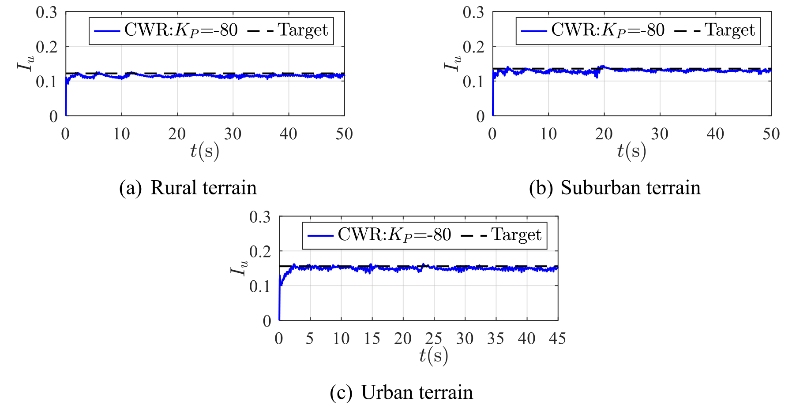

   **图 10** 三个工况 RS 中 :math:`z/\delta=0.5` 处纵向湍流强度随时间的变化。（a）乡村地形；（b）郊区地形；（c）城市地形。实线为 :math:`K_P=-80` 的 CWR 结果，虚线为目标。

图 3 展示了采用 CWR 方法获得指定湍流 ABL 风场的示意图。需要说明的是，本文只调整纵向湍流强度，原因有二。首先，土木工程中大多数物理风洞和数值风洞的湍流 ABL 风场以纵向分量为主，该分量对建筑和结构风荷载有显著影响。其次，这种做法简化了 CWR 方法，使 PID 控制器增益更容易整定，并确保 LES 过程的数值稳定性。若同时调整展向和竖向湍流强度，就需要另外两个独立的 PID 控制器，使调整过程复杂化，并可能导致发散。

因此，与先前模拟高雷诺数湍流 ABL 风场的研究相比，CWR 方法有两个主要优点。首先，文献 [37]_ [49]_ [51]_ [56]_ 通过实际粗糙块和尖劈模型调节风特性，而 CWR 方法采用 SECD 模型来模拟粗糙地形对近地面湍流 ABL 风场的影响。这样就不必为粗糙元建立计算模型，显著减少计算网格数，并提高 LES 模拟效率。其次，CWR 方法的一个主要优点是采用由 PID 控制器实现的零均值控制系数来调整入流脉动速度，从而获得指定湍流强度的湍流 ABL 风场。通过将 SECD 模型与 PID 控制器结合，CWR 方法能够生成满足各种湍流强度要求的粗糙地形湍流 ABL 风场，同时不牺牲基于 WR 方法的效率及其固有优势。

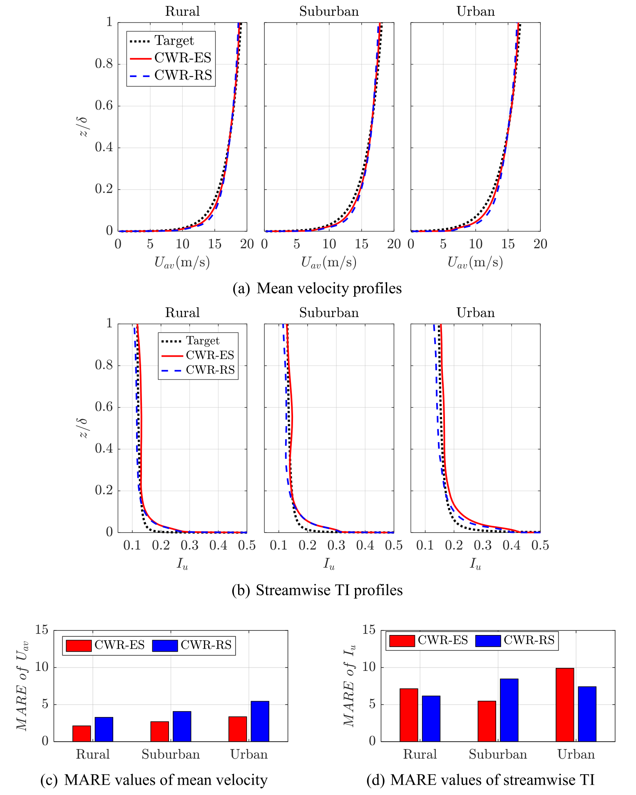

   **图 11** CWR 方法所生成湍流 ABL 风场的平均风速和纵向湍流强度比较。CWR-ES 指数据提取面处的特征，CWR-RS 指回收站处的特征。（a）平均风速剖面；（b）纵向湍流强度剖面；（c）平均风速的 MARE；（d）纵向湍流强度的 MARE。各地形从左至右为乡村、郊区、城市。

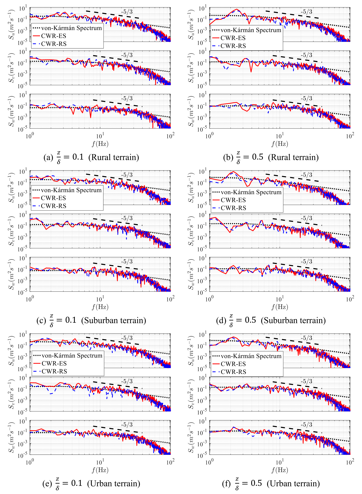

   **图 12** 三类粗糙地形上湍流 ABL 风场的风谱比较。（a）、（b）为乡村地形；（c）、（d）为郊区地形；（e）、（f）为城市地形。左列高度为 :math:`z/\delta=0.1` ，右列为 :math:`z/\delta=0.5` ；各组从上至下为纵向、展向、竖向风谱。图例包括 von-Kármán 谱、CWR 数据提取面结果和 CWR 回收站结果。

3 CWR 方法的参数研究
--------------------

3.1 PID 控制器增益的整定规则
~~~~~~~~~~~~~~~~~~~~~~~~~~~~

CWR 方法的一个主要环节是整定 PID 控制器参数，即比例增益 :math:`K_P` 、积分增益 :math:`K_I` 和微分增益 :math:`K_D` 。这些控制器增益的整定主要有两类技术：经典方法和优化技术 [65]_ 。解析法、经验试错（TE）法及 Ziegler–Nichols（Z-N）法等经典方法，由于耗时较少且易于实施，被广泛采用 [57]_ [63]_ [66]_ 。本研究的受控系统是具有时变、非线性特点的湍流 ABL 风场；考虑到系统复杂性，并不存在用于解析整定增益的确定性数学模型或传递函数。因此，采用经验 TE 方法与 Z-N 整定规则相结合，确定 CWR 方法中的增益。整定过程通过观察受控系统的响应曲线，即 RS 处纵向湍流强度随时间的变化，并遵循反馈整定原则来进行。这样可以使响应曲线稳定、响应迅速且超调较小 [63]_ 。

在 CWR 方法的整定过程中，一般先使用纯 P 控制器确定比例增益 :math:`K_P` 。本文主要通过分析 ABL 风场的湍流特性确定 :math:`K_P` 的符号，详见表 1。此外，对控制系数施加 :math:`|1+\lambda|\le2.5` 的约束 [27]_ ，避免由于过度调整入流脉动速度而导致 LES 过程不稳定或发散。

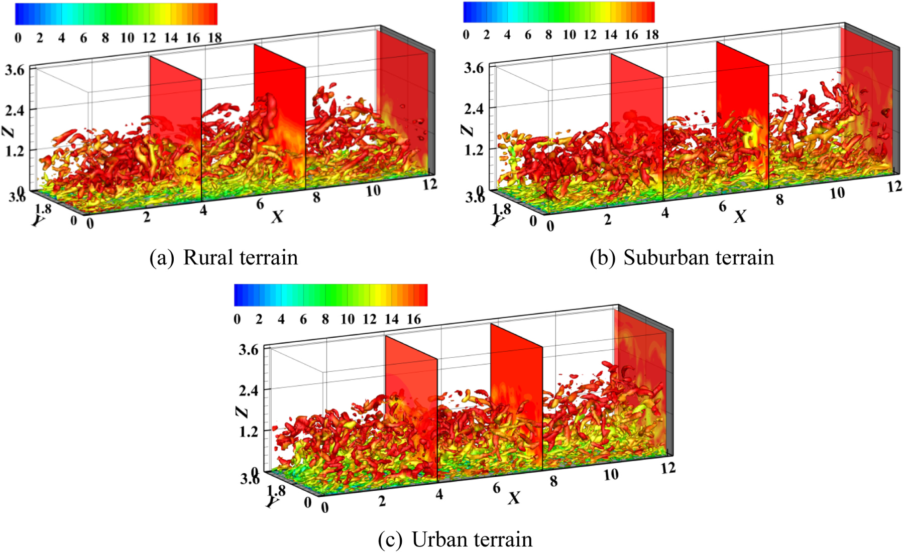

   **图 13** 不同粗糙地形上湍流 ABL 风场的瞬时涡量。采用 :math:`Q=200` 评估涡量，并按速度大小着色。（a）乡村地形；（b）郊区地形；（c）城市地形。

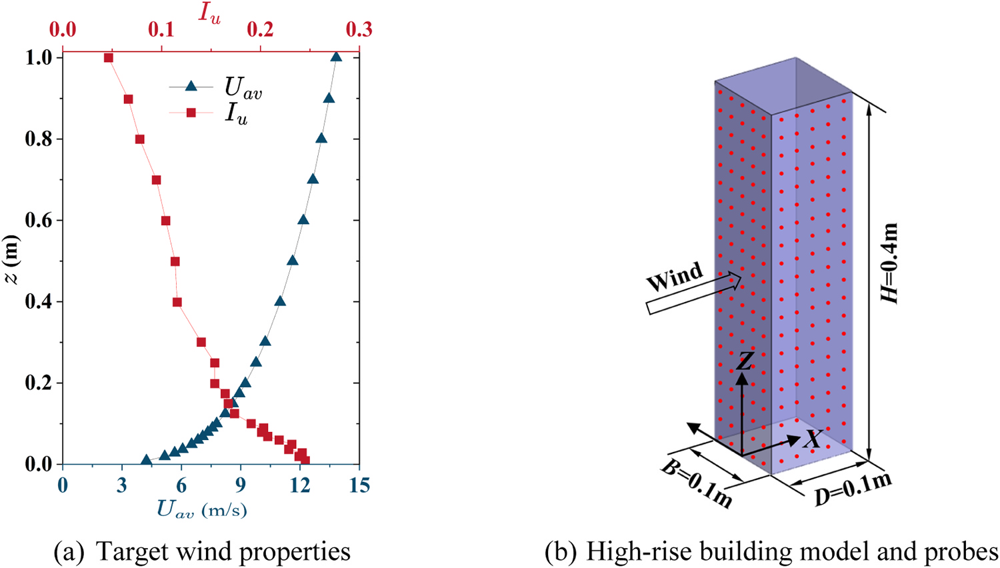

   **图 14** TPU 空气动力学数据库中的风洞试验模型信息。（a）目标风特性，包括平均风速和纵向湍流强度；（b）高层建筑模型及测点， :math:`B=D=0.1\,\mathrm{m}` ， :math:`H=0.4\,\mathrm{m}` 。Wind 表示来风方向。

通过广泛分析 LES 结果发现，采用纯 P 控制器时，稳定后的 ABL 风场湍流强度误差保持在可接受范围内。这种设置既达到预设目标，又维持稳定性。这一发现显著降低了应用复杂度，并提高了 CWR 方法的效率。因此，式（14）的控制系数仅保留比例项，表示如下：

.. math::

   \lambda^n(z)=K_P[I^n_{\mathrm{re}}(z)-I_{\mathrm{tar}}(z)] \qquad (20)

此外，初始条件、重新引入方式及 RS 的位置三个参数，对保证基于 WR 方法的精度和效率十分重要。例如，原始的平移重引入方式会在湍流边界层模拟中产生伪周期性现象 [3]_ [50]_ [67]_ [68]_ 。采用展向平移 [50]_ 和镜像方法 [67]_ 等其他重引入方式，可以缓解这一问题。CWR 方法采用镜像重引入方法 [67]_ ，并使入口边界到 RS 的距离为入口边界层高度 :math:`\delta_{\rm in}` 的 6.4 倍 [41]_ ，以打破入口与 RS 之间的相干流动结构。此外，使用三方向初始条件 [67]_ 提高模拟效率。

3.2 参数研究的数值策略
~~~~~~~~~~~~~~~~~~~~~~

3.2.1 目标湍流 ABL 风场的特征
^^^^^^^^^^^^^^^^^^^^^^^^^^^^^

为模拟不同粗糙地形上的湍流 ABL 风场，采用工程科学数据单元（Engineering Sciences Data Unit，ESDU）第 85020 项 [69]_ 提供的平均风速和湍流强度作为目标，分别表示为式（21）和式（22）。不失一般性，使用表 2 给出的原型地形参数模拟三类粗糙地形。

.. math::

   U_{\mathrm{av}}(z)=\frac{u_*}{\kappa}
   \left[\ln\left(\frac{z+z_0}{z_0}\right)+34.5\frac{f_cz}{u_*}\right]. \qquad (21)

.. math::

   I_u(z)=\frac{\sigma_u}{U_{\mathrm{av}}}
   =\frac{u_*}{U_{\mathrm{av}}}
   \frac{7.5\eta[0.538+0.09\ln(z/z_0)^p]}
   {1+0.156\ln[u_*/(f_cz_0)]}. \qquad (22)

其中， :math:`U_{\rm av}` 表示目标平均风速。 :math:`u_*=u_{10}/[2.5\ln(10/z_0)]` 为摩阻速度。 :math:`\kappa=0.4` 为 Kármán 常数。 :math:`z_0` 表示空气动力学粗糙度长度。 :math:`f_c` 为科里奥利参数，按 :math:`2\Omega\sin\varphi` 计算，其中 :math:`\Omega=72.9\times10^{-6}\,\mathrm{s}^{-1}` ， :math:`\varphi=22.52^\circ` 。 :math:`I_u` 表示纵向（ :math:`x` ）湍流强度， :math:`\sigma_u` 为相应脉动分量的均方根。经验系数为 :math:`\eta=1-6f_cz/u_*` 和 :math:`p=\eta^{16}` 。

.. note::

   原文在式（7）中用 :math:`\eta=z/\delta` 表示高度坐标，在式（22）后又用同一符号表示经验系数 :math:`1-6f_cz/u_*` ；本文按各处定义保留。

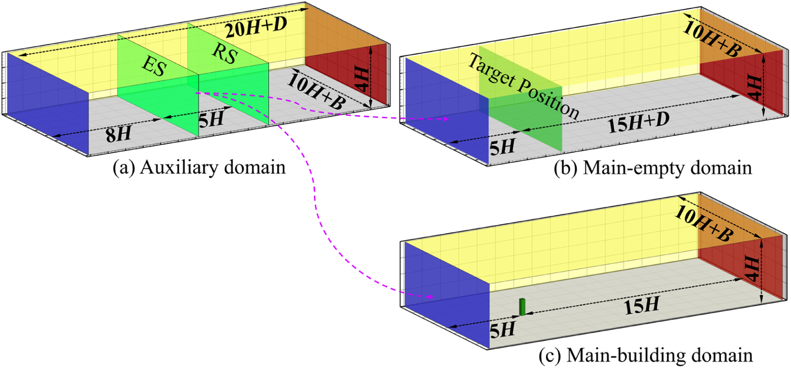

   **图 15** 三个计算域的尺寸。（a）辅助域；（b）空主域；（c）含建筑主域。ES 为提取面，RS 为回收站，Target Position 为目标位置。图中给出流向尺寸 :math:`20H+D` 、展向尺寸 :math:`10H+B` 及高度 :math:`4H` ，建筑前缘距入口 :math:`5H` 。

3.2.2 计算模型与 LES 工况
^^^^^^^^^^^^^^^^^^^^^^^^^

本文在风洞尺度上模拟湍流 ABL 风场，边界层高度 :math:`\delta_m=1.2\,\mathrm{m}` ，长度、速度和时间缩尺比分别设为 1:550、1:1 和 1:1。图 4（a）展示了两个独立计算模型：用于生成入流湍流的辅助域，以及用于后续验证和风荷载评估的主域。CWR 方法具体施加于辅助域，以生成指定的湍流 ABL 风场。在提取面（Extraction Surface，ES）收集瞬时速度，随后映射到主域入口边界。两个计算域的尺寸相同，在流向（ :math:`x` ）、展向（ :math:`y` ）和竖向（ :math:`z` ）分别为 :math:`10\delta_m` 、 :math:`3\delta_m` 和 :math:`3\delta_m` 。此外，在辅助域内，RS 位于入口边界下游 :math:`6.4\delta_m` 处。按照建筑宜布置在距入口下游三分之一流向域长 :math:`L_x` 处的指南 [70]_ ，将辅助域的 ES 布置在 RS 上游 :math:`L_x/3` 处。这一距离对应于主域入口边界与监测位置（Monitoring Position，MP）之间的距离。模拟雷诺数按原文写为 :math:`Re_\delta=\rho\delta_m/\mu\ge1.31\times10^6` 。

在 CWR 方法中，采用镜像方式 [67]_ 将更新后的脉动速度重新引入入口边界，这要求辅助域入口边界与 RS 处的计算网格相同。为此，必须采用结构化网格离散辅助域，以实现精确的逐点调整。因此，采用图 4（b）所示的 M1 和 M2 两种结构化网格方案离散辅助计算域，以分析网格无关性。两套网格均在 :math:`x` 和 :math:`y` 方向均匀分布，在 :math:`z` 方向按指数拉伸。表 3 列出了网格参数，保证所有网格方案的贴壁第一层网格高度 :math:`z_{\rm wall}` 满足 :math:`z^+_{\rm wall}=\rho u_*z_{\rm wall}/\mu<1` 。此外，主计算域采用与 M1 一致的网格划分，以维持辅助域与主域间平均和湍流风特性的一致性。需要注意的是，两个计算域网格分辨率越一致，辅助域 RS 和主域 MP 两目标位置的风特性就越一致。图 4 给出了计算域、相应边界条件及两种方案的网格划分。

采用 ANSYS-FLUENT 中瞬态、双精度、基于压力的非交错求解器。时间项采用有界二阶隐式格式离散。采用压力关联方程半隐式一致算法（SIMPLE-C） [71]_ 求解压力—速度耦合方程。压力插值采用二阶格式，动量方程采用有界中心差分格式离散。考虑到 CWR 方法的动态调整过程，总模拟时间随控制系数 :math:`\lambda` 的变化而变化。M1 网格的时间步长 :math:`\Delta t=0.001\,\mathrm{s}` ，M2 网格为 :math:`0.0005\,\mathrm{s}` ，保证满足 :math:`U\Delta t/\Delta x<1` 。在受控湍流 ABL 风场稳定之后的前 10 s 内，收集并分析下游位置的速度。

.. note::

   本段的长度、速度和时间缩尺比，以及上文雷诺数表达式，均按出版版保留。原文雷诺数表达式未含速度因子，不能将其视为已校正的量纲一致定义。

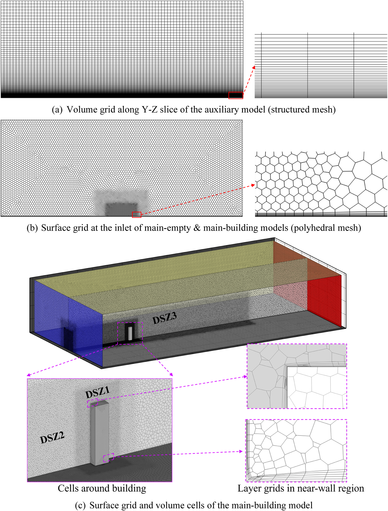

   **图 16** 三个计算模型的网格划分。（a）辅助模型 Y–Z 切面的体网格，为结构化网格；（b）空主域和含建筑主域入口处的面网格，为多面体网格；（c）含建筑主域模型的面网格和体积单元。DSZ1、DSZ2、DSZ3 为三个加密子区，局部放大图分别展示建筑周围单元与近壁区域的层状网格。

本节对城市地形上的湍流 ABL 风场开展 LES 模拟，以确定比例增益 :math:`K_P` 。如第 3.1 节所述，通过观察不同增益下湍流强度误差随时间的变化，采用经验 TE 方法结合 Z-N 整定规则确定控制器增益。分析一系列 :math:`K_P` 从 −100.0 至 0.0 的 LES 工况。为说明不同 :math:`K_P` 值对模拟过程和结果的影响，给出三个代表性 LES 工况： :math:`K_P=0` （无控制）、 :math:`K_P=-10.0` （调整不足）和 :math:`K_P=-80.0` （调整适当）。利用最优工况（ :math:`K_P=-80.0` ）评估 CWR 方法的网格无关性。通过在主计算域中进行湍流 ABL 风场 LES 模拟，验证所获得的湍流入流条件。进一步信息见表 4，其中 UC 表示“城市工况”（Urban Case）。

3.3 结果与讨论
~~~~~~~~~~~~~~

3.3.1 CWR 方法中的比例增益
^^^^^^^^^^^^^^^^^^^^^^^^^^

根据 UC1、UC2 和 UC3 三个工况的结果，图 5 比较了它们的动态特性，即 RS 两个不同高度的纵向湍流强度误差时程，以及控制系数的竖向分布。在这些图中， :math:`z/\delta=0.1` 表示近地面区域， :math:`z/\delta=0.5` 表示上部核心湍流区域。图 5（a）和（b）显示，主要受近地面区域 SECD 模型影响的 UC1（ :math:`K_P=0` ）最快达到稳定，说明 SECD 模型对模拟稳定性的影响很小。相比之下，UC3（ :math:`K_P=-80` ）的湍流强度误差在 0–30 s 内剧烈变化，而 UC2（ :math:`K_P=-10` ）的变化更平缓。此外，三个工况在 :math:`z/\delta=0.5` 处稳定后的湍流强度误差不同，UC1 最大，UC3 最小。这些现象表明 P 控制器具有以下作用：（i）稳定所需时间随 :math:`|K_P|` 增大而减小；（ii）受控变量围绕目标值振荡，且 :math:`|K_P|` 越大，振荡越强；（iii）在适当整定的 P 控制器作用下，振荡逐渐减弱，系统最终在目标值处稳定 [72]_ [73]_ 。此外，图 5（b）给出了 UC1、UC2 和 UC3 模拟结束时控制系数 :math:`\lambda` 的竖向分布。可以看出，UC3（ :math:`|K_P|=80` ）中的 :math:`\lambda` 在近地面区域达到原文所述“下限 3.5”，在上部区域则介于 0.2–1.0。通过大量模拟发现，受控 ABL 风场在这些条件下能够保持稳定，而当 :math:`|K_P|>80` 时，LES 过程发生振荡；当 :math:`|K_P|>100` 时，求解器发散。

.. note::

   原文“下限 3.5”与图 5（b）的 −3.5 刻度及第 3.1 节限幅条件不一致；这里保留文字和图示两处证据。上述整定结论针对本文工况，不是所有 LES 模型的通用增益范围。

图 6 比较了 RS 处的平均风速和纵向湍流强度。平均绝对相对误差（Mean Absolute Relative Error，MARE）由式（23）计算，并示于图 6（c）。图 6（a）的结果表明，在 SECD 模型作用下，UC1（ :math:`K_P=0` ）的平均风速与目标值吻合良好。相比之下，UC2（ :math:`K_P=-10` ）和 UC3（ :math:`K_P=-80` ）在 :math:`0.1<z/\delta<0.25` 区域内的平均风速略有增加，且 :math:`|K_P|` 越大，增加越明显。此外，图 6（b）显示，在核心湍流区域，纵向湍流强度随 :math:`|K_P|` 增大而增加，使 UC3（ :math:`K_P=-80` ）的 MARE 为 8.0%，如图 6（c）所示。

.. math::

   \mathrm{MARE}=\left\langle\left|
   \frac{\phi_{\mathrm{LES}}-\phi_{\mathrm{tar}}}{\phi_{\mathrm{tar}}}
   \right|\right\rangle^z \qquad (23)

其中， :math:`\phi` 表示湍流 ABL 风场的统计量， :math:`\langle\bullet\rangle^z` 表示对边界层高度内均匀分布的点进行空间平均的算子。

需要注意，UC1、UC2 和 UC3 近地面区域的湍流强度增大程度相近，这是 SECD 模型与入口边界脉动速度调整之间作用不平衡造成的。SECD 模型用于复现近地面区域的粗糙地形特征，会约束平均风速并放大湍流强度。相反，控制系数 :math:`\lambda` 旨在通过调节入口边界的纵向脉动速度，降低这一区域内的湍流强度，使其达到目标值。然而，与 SECD 模型相比，这种调整对下游流场的影响较弱。因此，入流瞬时速度的显著改变，使下游平均风速出现轻微发展，这在 UC2 和 UC3 中尤其明显。

综上，CWR 方法能够有效生成所需的湍流 ABL 风场，合适的比例增益 :math:`K_P` 为 −80.0。尽管近地面区域存在轻微偏差，平均风速和湍流强度的整体 MARE 均保持在 10% 以下。值得注意的是，CWR 方法通过观察湍流强度误差的时间变化趋势确定 :math:`K_P` 值，简化了整定过程，并降低了该方法的应用难度。

.. list-table:: 表 6 空主域和含建筑主域计算模型的网格参数
   :header-rows: 1

   * - 子域
     - 长度
     - 宽度
     - 高度
     - 最小/指定网格尺寸（m）
     - 最大网格尺寸（m）
     - 无滑移壁面附近第一层高度
     - 层数
   * - DSZ1
     - :math:`3D`
     - :math:`3B`
     - :math:`H+B`
     - :math:`5\times10^{-4}`
     - :math:`5\times10^{-3}`
     - :math:`5\times10^{-4}\,\mathrm{m}`
     - 5
   * - DSZ2
     - :math:`6H`
     - :math:`H+B`
     - :math:`H+B`
     - —
     - 0.01
     - —
     - —
   * - DSZ3
     - :math:`15H`
     - :math:`2H`
     - :math:`2H`
     - —
     - 0.02
     - —
     - —
   * - 建筑
     - :math:`D`
     - :math:`B`
     - :math:`H`
     - :math:`2\times10^{-3}`
     - —
     - :math:`5\times10^{-5}\,\mathrm{m}`
     - —

表内“—”对应原表空白单元格；不据空白自行补充数值。原文关于地面和建筑表面均附设五层边界层网格的说明见第 5.1 节。

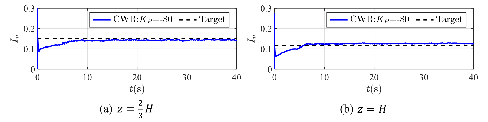

   **图 17** 辅助域中 RS 处两个高度的纵向湍流强度随时间的变化。（a） :math:`z=2H/3` ；（b） :math:`z=H` 。CWR 曲线采用 :math:`K_P=-80` ，虚线为目标。

3.3.2 湍流 ABL 风场的验证
^^^^^^^^^^^^^^^^^^^^^^^^^

为验证 CWR 方法生成的湍流 ABL 风场的稳定性和自持性，将 UC3 工况 ES 处的速度时程映射为主计算模型的入口边界条件，即表 4 中的 UC4 工况。如图 4 所示，UC4 的计算域尺寸、网格方案（M1）和边界条件均与 UC3 相同，湍流模型、离散格式及时间步长也相同。UC4 的总模拟时间为 12 s。在最初 2 s 内 LES 过程稳定之后，收集并分析 MP 处 2–12 s 的速度。为便于说明，下文将采用 CWR 方法在辅助计算域中开展的 LES（UC3）称为辅助模拟，将在主计算域中的验证 LES（UC4）称为主模拟。

图 7 将辅助模拟（UC3）RS 处的平均风速和湍流强度，与主模拟（UC4）入口边界及 MP 处的相应结果进行比较。采用式（24）计算两个 MARE 值 :math:`e_{\rm AM}` 和 :math:`e_{\rm MM}` ，量化这些工况间风统计量的偏差。 :math:`e_{\rm AM}` 表示主域 MP 与辅助域 RS 之间风特性的误差， :math:`e_{\rm MM}` 表示主域入流条件与 MP 之间的误差。UC4 的结果表明，入口边界的纵向、展向和竖向湍流强度略高于 MP，对应误差分别为 10.88%、7.76% 和 6.99%。本研究的主要目标是使用 CWR 方法生成湍流入流条件，使主域 MP 处的风特性符合预定目标。因此，尽管 UC4 的入流条件（IN）与 MP 之间存在轻微差异，误差总体在 10% 以内，MP 的平均风速和湍流强度剖面也与目标接近。更重要的是，UC4 在 MP 处的平均风速和三个湍流强度剖面，与 UC3 在 RS 处的结果相符，对应误差 :math:`e_{\rm AM}` 分别为 2.05%、3.40%、3.08% 和 1.19%，均在可接受范围内。这些结果表明，从辅助域提取的湍流风速在主域中沿流向具有良好的自持性。

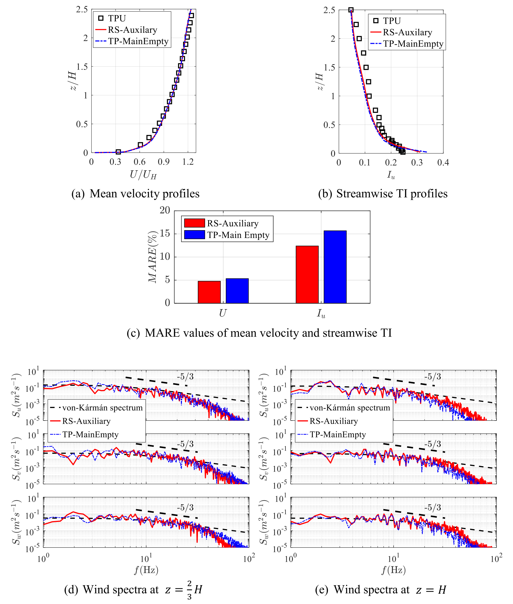

   **图 18** 辅助模拟和空主域模拟的风特性比较。（a）平均风速剖面；（b）纵向湍流强度剖面；（c）平均风速和纵向湍流强度的 MARE；（d） :math:`z=2H/3` 处的风谱；（e） :math:`z=H` 处的风谱。TPU 为风洞试验数据，RS-Auxiliary 为辅助域回收站，TP-MainEmpty 为无建筑主域目标位置。

.. math::

   \begin{cases}
   e_{\mathrm{AM}}=\left\langle\left|
   \dfrac{\phi_{\mathrm{MP(Main)}}-\phi_{\mathrm{RS(Auxi)}}}{\phi_{\mathrm{RS(Auxi)}}}
   \right|\right\rangle^z,\\
   e_{\mathrm{MM}}=\left\langle\left|
   \dfrac{\phi_{\mathrm{MP(Main)}}-\phi_{\mathrm{IN(Main)}}}{\phi_{\mathrm{IN(Main)}}}
   \right|\right\rangle^z.
   \end{cases}\qquad (24)

其中， :math:`\phi_{\rm MP(Main)}` 和 :math:`\phi_{\rm IN(Main)}` 分别表示主域（UC4 工况）监测位置和入口边界的统计量， :math:`\phi_{\rm RS(Auxi)}` 表示辅助域（UC3 工况）回收站的结果。

式（25）所示的各向异性 von-Kármán 谱模型描述了真实湍流 ABL 风场的能量分布 [5]_ [12]_ ，这对在 LES 中准确预测建筑风荷载十分重要。图 8 将采用 CWR 方法得到的风谱与该模型进行比较，涵盖含能子区和惯性子区。可以清楚看到，所有工况都表现出惯性子区的 −5/3 斜率特征。此外，除高频段的能量损失外，辅助模拟和主模拟的风谱均与各向异性 von-Kármán 谱吻合良好。这种能量损失与文献 [13]_ [74]_ 的发现一致，归因于 LES 固有的数值耗散及有限体积法相关的数值误差。上述结果表明，CWR 方法能够有效生成合理、充分发展且稳定的湍流边界层风场，体现了基于 WR 方法的一个优势。

.. math::

   \begin{cases}
   S_u(f)=\dfrac{4(I_uU_{\mathrm{av}})^2(L_u/U_{\mathrm{av}})}
   {[1+70.8(fL_u/U_{\mathrm{av}})^2]^{5/6}},\\[6pt]
   S_v(f)=\dfrac{4(I_vU_{\mathrm{av}})^2(L_u/U_{\mathrm{av}})
   [1+188.4(2fL_v/U_{\mathrm{av}})^2]}
   {[1+70.8(2fL_v/U_{\mathrm{av}})^2]^{11/6}},\\[6pt]
   S_w(f)=\dfrac{4(I_wU_{\mathrm{av}})^2(L_w/U_{\mathrm{av}})
   [1+188.4(2fL_w/U_{\mathrm{av}})^2]}
   {[1+70.8(2fL_w/U_{\mathrm{av}})^2]^{11/6}}.
   \end{cases}\qquad (25)

其中， :math:`f` 表示频率， :math:`S_i` 分别表示流向（ :math:`i=u` ）、展向（ :math:`i=v` ）和竖向（ :math:`i=w` ）的风谱。 :math:`I_i` 为 :math:`i` 方向的目标湍流强度， :math:`L_i` 为相应方向的湍流积分尺度。

.. note::

   原式（25）的展向谱 :math:`S_v` 分子前因子使用 :math:`L_u/U_{\rm av}` ，而后续频率项使用 :math:`L_v` ，这里按原式保留。

3.3.3 网格无关性研究
^^^^^^^^^^^^^^^^^^^^

图 9 比较了 UC3 与 UC5 的 LES 结果，以评估 CWR 方法的网格无关性。平均风速剖面在上部区域吻合良好，但在 :math:`0.05<z/\delta<0.1` 高度范围内有轻微差异，MARE 值相差不到 3%。此外，两工况的三个湍流强度剖面一致，MARE 的差异很小。在风谱方面，两工况均在惯性子区表现出 −5/3 斜率，且风谱开始下降处的截断频率均约为 40 Hz。这说明 M1 网格已经足够精细，可以生成目标 ABL 风场。因此，可以认为 CWR 方法表现出网格无关性。

此外，原文所称 UC4 中流场的稳定时间为 17.5 s，是采用 M1 网格方案的 UC3 所需时间的一半。由于原文给出的 UC3 和 UC4 时间步长分别为 :math:`1\times10^{-3}\,\mathrm{s}` 和 :math:`5\times10^{-4}\,\mathrm{s}` ，两者的总模拟步数相同。该现象表明，CWR 方法也不依赖于瞬态 LES 模型的时间步长。

.. note::

   本小节第二段在出版版中写 UC4，但表 4 和图 9 将精细网格 M2、 :math:`5\times10^{-4}\,\mathrm{s}` 的工况标为 UC5；UC4 在表 4 中为使用 M1 的主域验证工况。此处保留原文叙述与表图之间的编号冲突。

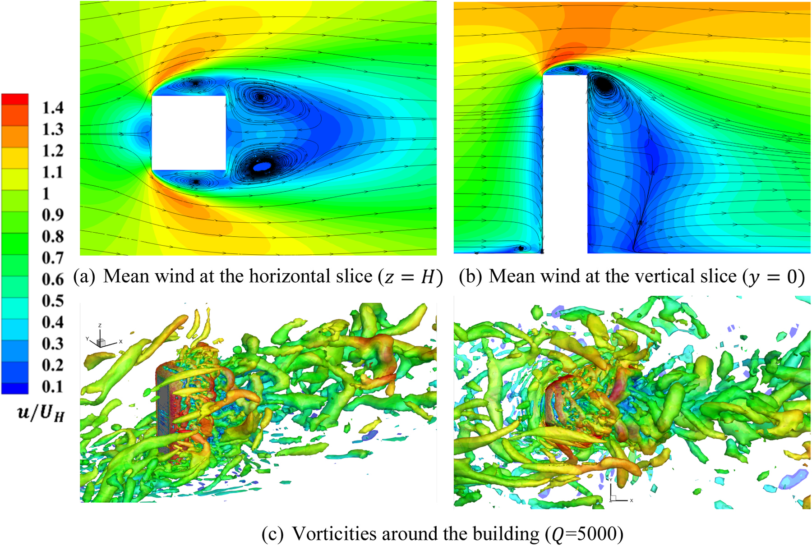

   **图 19** 建筑周围的平均风场和流动结构。（a）水平切面 :math:`z=H` 上的平均风场；（b）竖向切面 :math:`y=0` 上的平均风场；（c）建筑周围涡结构， :math:`Q=5000` 。色标为 :math:`u/U_H` 。

4 不同粗糙地形上湍流 ABL 风场的 LES
-----------------------------------

本节模拟乡村和郊区地形上的湍流 ABL 风场，以验证 CWR 方法生成不同指定湍流 ABL 风场的可行性。计算模型和数值设置与表 4 所述 UC3 工况相同。表 5 给出了补充信息，各工况的总模拟时间随目标湍流强度不同而变化。由于已在主模拟中确认 CWR 方法生成的湍流 ABL 风场是稳定的，本节仅开展辅助模拟。收集并分析 ES 和 RS 处的速度，以评估所生成湍流 ABL 风场的稳定性和自持性。

4.1 数值稳定性
~~~~~~~~~~~~~~

根据收集的数据，图 10 展示了三个工况 RS 中 :math:`z/\delta=0.5` 处纵向湍流强度随时间的变化。显然，所有数值在最后 10 s 内都接近目标，仅有小幅波动，证实湍流 ABL 风场已经稳定。这一结果表明，在应用 CWR 方法时，比例增益 :math:`K_P=-80` 具有普遍有效性，能够获得稳定且符合指定统计目标的湍流 ABL 风场。

.. note::

   本段“普遍有效性”对应原文的 universally effective；本文展示的验证范围为所列三个地形工况，不能据此推断所有参数和地形。

4.2 平均与湍流特性
~~~~~~~~~~~~~~~~~~

图 11 给出了三个工况的平均风速和纵向湍流强度剖面，以及相应的 MARE 值。所有工况 RS 处的平均风速剖面均与目标一致，乡村、郊区和城市地形的 MARE 分别为 3.28%、4.07% 和 5.45%。从 ES 到 RS，平均风速保持稳定，ES 处的 MARE 分别为 2.13%（乡村）、2.70%（郊区）和 3.36%（城市）。所有工况 ES 与 RS 之间的偏差都小于 3.82%。此外，各工况 RS 处的湍流强度剖面在上部区域与目标非常接近，但近地面区域受 SECD 模型影响，数值偏高。乡村、郊区和城市地形 RS 处的 MARE 分别为 6.16%、8.47% 和 7.41%，ES 处则分别为 7.14%、5.47% 和 9.90%。ES 到 RS 的最大偏差为 2.49%。这些结果表明，在 :math:`K_P=-80.0` 时，CWR 方法能够有效生成满足规定平均风速和纵向湍流强度目标的湍流 ABL 风场。此外，湍流 ABL 风场沿流向具有良好自持性。

如图 12 所示，将 :math:`z/\delta=0.1` 和 0.5 两个高度的风谱与各向异性 von-Kármán 谱模型进行比较。所有工况中，ES 和 RS 处的风谱均在惯性子区呈现 −5/3 斜率，并与各向异性 von-Kármán 谱一致。所观察到的高频能量减少归因于有限的网格分辨率，以及 LES 模型固有的滤波作用。ES 和 RS 处风谱的一致性说明湍流 ABL 风场沿流向具有自持性，表明湍流能量能够从入口边界有效传输到主模拟中的目标建筑位置。

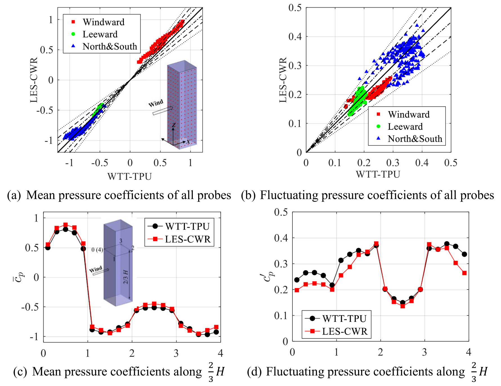

   **图 20** 建筑表面测点风压系数的比较。在（a）和（b）中，点划线表示 ±10% 误差，虚线表示 ±20% 误差，点线表示 ±30% 误差。（a）所有测点的平均风压系数；（b）所有测点的脉动风压系数；（c） :math:`2H/3` 高度处平均风压系数；（d） :math:`2H/3` 高度处脉动风压系数。Windward、Leeward、North & South 分别为迎风面、背风面及南北两侧面；WTT-TPU 为 TPU 风洞试验，LES-CWR 为 CWR 入流下的 LES。

图 13 展示了模拟结束时采用 Q 判据（ :math:`Q=200` ）提取的瞬时等值面，并按速度大小着色。正如文献 [11]_ [75]_ 所讨论的，原文将 Q 判据定义为 :math:`\tfrac12[\|\Omega\|^2+\|S\|^2]` ，其正值反映流场中复杂相干涡结构的存在。其中， :math:`\|\Omega\|^2` 对应纯旋转运动的旋转速率张量， :math:`\|S\|^2` 对应纯无旋运动的应变率张量。图 13 显示，经 CWR 方法调整后，所有工况沿流向均未出现明显衰减或伪周期流动结构。此外，采用 M1 网格离散的计算模型能够有效捕捉较宽尺度范围内的涡。

.. note::

   上段 Q 定义中的加号按出版版保留。该印刷定义与文中借助旋转特征识别涡结构的说明存在疑点，不据此改写原始图中的 Q 标签。

5 孤立建筑风荷载的 LES
----------------------

为评估 CWR 方法预测建筑风荷载的精度，开展 LES 模拟，并将结果与东京工艺大学（TPU）空气动力学数据库中一栋孤立高层建筑的风洞试验数据进行比较，原文数据地址为 https://db.wind.arch.t-kougei.ac.jp/aerodynamic/case/T114_4/ 。如图 14（a）所示，目标湍流 ABL 风场的地表暴露参数为 1/4，试验中建筑高度处的湍流强度设为 10%。原文指称图 14（c）的高层建筑模型采用 1:400 的长度缩尺比，尺寸比例为深度（D）:宽度（B）:高度（H）=1:1:4。

.. note::

   图 14 的建筑模型实际标为子图（b），原文正文写作（c）；这里明确保留这一图号差异。

5.1 计算模型
~~~~~~~~~~~~

本节开展三个 LES 工况：采用 CWR 方法生成指定湍流 ABL 的辅助模拟、验证所生成湍流入流条件的空主域模拟，以及评估风荷载的含建筑主域模拟。LES 模拟流程如下：首先，采用 :math:`K_P=-80` 的 CWR 方法生成目标湍流 ABL 风场，并记录 ES 上的二维（2D）速度时程。其次，提取的速度作为空主域模拟的湍流入流条件，将下游目标位置（Target Position，TP）的风统计特征与目标值比较。最后，将提取的速度用作含建筑主域的入口边界条件，评估高层建筑的风荷载。

图 15 展示了辅助模拟、空主域模拟和含建筑主域模拟的三个计算域。所有计算域尺寸相同，流向为 :math:`20H+D` ，展向为 :math:`10H+B` ，竖向为 :math:`4H` 。按照 COST 732 的建议 [70]_ ，建筑模型布置在域入口下游 :math:`5H` 处。

图 16 展示了三个计算模型的网格方案。如子图（a）所示，辅助模型采用结构化网格；另外两个计算域采用相同的非结构化多面体网格，如子图（b）和（c）所示。辅助域中，计算网格在流向和展向均匀分布，尺寸为 0.05 m，竖向按指数拉伸，第一层网格高度为 :math:`5\times10^{-4}\,\mathrm{m}` 。空主域和含建筑主域采用与文献 [10]_ [15]_ 所述相同的网格参数，包括三个加密子区（Dense Sub-Zones，DSZ），但空主域不考虑 DSZ1。表 6 给出了这两个计算域及建筑的详细网格参数。值得注意的是，地面和建筑表面均附设五层边界层网格。含建筑主域共有 330 万个体积单元。

由于辅助域和主域的网格类型不同，必须保证网格分辨率，特别是最大网格尺寸一致，才能维持湍流 ABL 风场的一致性。为映射所收集的瞬时速度，采用逐点映射方式，将辅助域 ES 上的二维表面网格与主域入口边界网格对齐。具体通过展向（ :math:`y` ）和竖向（ :math:`z` ）坐标，计算两个表面网格之间的最小欧氏距离，实现对应。

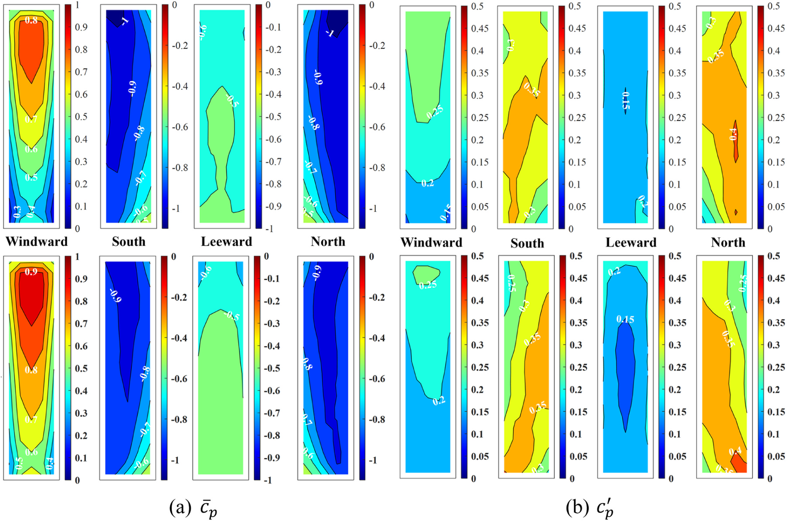

   **图 21** 建筑表面风压系数云图。上方八幅来自 TPU 风洞试验数据库，下方八幅来自 LES 模拟。（a）左侧为平均风压系数；（b）右侧为脉动风压系数。每组依次为迎风面、南侧面、背风面和北侧面，各立面的色标均予保留。

采用第 3.2 节所述的相同求解器和数值格式，时间步长为 :math:`5\times10^{-4}\,\mathrm{s}` ，以满足 Courant–Friedrichs–Lewy（CFL）条件。辅助模拟总时间为 40 s，收集 29–40 s 的速度。空主域和含建筑主域模拟的总时间均为 11 s，分别分析 1–11 s 的风速和风压数据。

5.2 所生成入流湍流 ABL 风场的验证
~~~~~~~~~~~~~~~~~~~~~~~~~~~~~~~~~

图 17 展示了 RS 两个高度，即 :math:`z=2H/3` 和 :math:`z=H` 处纵向湍流强度随时间的变化，以说明辅助模拟的调整过程。可以清楚看到，湍流强度在最初 20 s 内稳定，稳定值与目标接近，仅有小幅波动。这些结果体现了 CWR 方法控制湍流 ABL 风场的效率。

图 18 将主域 TP 处的风特性与目标值及辅助域 RS 处的结果进行比较。图 18（a）和（b）清楚表明，RS 与 TP 的平均风速和纵向湍流强度剖面一致。以称为 TPU 的风洞试验风剖面为目标，平均风速和湍流强度的 MARE 示于子图（c）。RS 与 TP 平均风速的 MARE 分别为 4.77% 和 5.34%，湍流强度对应误差分别为 12.39% 和 15.68%。考虑到风洞试验自身的不确定性，作者认为这些误差可以接受。此外，图 18（d）和（e）给出了两个高度的风谱，表明在低于 20 Hz 的频率范围内，与各向异性 von-Kármán 谱模型具有良好一致性。然而，在高频范围，TP 与 RS 存在差异，主要由辅助域和空主域的网格分辨率不匹配引起。值得注意的是，所有工况在惯性子区均可观察到 −5/3 斜率。

综上，当 :math:`K_P=-80.0` 时，CWR 方法可高效生成符合指定平均风速、纵向湍流强度，并在一定频率范围内符合各向异性 von-Kármán 谱的湍流 ABL 风场。将提取的速度时程用作含建筑主域模拟的入流条件，收集并分析模拟最后 10 s 的高层建筑周围风场及建筑表面风压。结果如下。

5.3 建筑周围风场
~~~~~~~~~~~~~~~~

图 19 给出了高层建筑周围的风场和涡结构。子图（a）和（b）展示两个切面： :math:`z=H` 处的水平面，以及穿过建筑中部的竖向面（ :math:`y=0` ），反映 1–11 s 平均后的流动形态和分布。这些结果清楚展示了建筑周围的流动分离、涡脱落及再附。基于 Q 判据，计算模拟最后一个时间步的建筑周围瞬时涡结构，如图 19（c）所示，并按照相应时刻的风速大小着色。从两个视角均可看出，来流涡结构在迎风面边缘分离，形成明显的马蹄涡。

5.4 平均与脉动风压
~~~~~~~~~~~~~~~~~~

收集建筑表面 1–10 s 的风压时程 :math:`p(t)` ，并用于计算平均和脉动风压系数，表达式如下：

.. math::

   \begin{cases}
   \overline c_p=\dfrac{\overline p-p_0}{0.5\rho U_H^2},\\[5pt]
   c'_p=\dfrac{\sigma_p}{0.5\rho U_H^2}.
   \end{cases}\qquad (26)

其中， :math:`\overline c_p` 和 :math:`c'_p` 分别为平均和脉动风压系数。 :math:`\overline p` 为时间平均压力（Pa）， :math:`\sigma_p` 表示压力标准差。 :math:`p_0` 为标准大气压（101325 Pa）， :math:`U_H` 表示建筑高度处的来流风速。

.. note::

   第 5.1 节及第 5.3 节给出的统计区间为 1–11 s，而本节原文为 1–10 s；两处均按原文保留，未将其统一为一个确定时间窗。

图 20 将建筑表面的平均和脉动风压系数与 TPU 风洞试验（WTT）结果进行比较。子图（a）和（b）比较所有测点的风压系数，子图（c）和（d）则关注 :math:`2H/3` 高度处的系数。图 21 给出了 WTT 与 LES 工况相应风压系数的云图。按照图 21（a）的云图，除迎风面最大平均风压系数 :math:`\overline c_p` 略大外，平均风压分布与 WTT 结果十分接近。图 20（a）量化了这一差异，其原因是在 :math:`0.2<z/H<0.5` 的范围内，来流平均风速略高于 TPU 目标值，如图 18（a）所示。这与 SECD 模型在近地面区域的不足有关，可以通过更精确地确定 SECD 模型阻力系数予以改善。同时，迎风面和背风面的 :math:`c'_p` 分布与 WTT 结果一致性较好，偏差低于 20%，如图 20（b）所示。然而，侧面（北侧和南侧）的 LES 结果与 WTT 结果差异较大，最大误差达到 30%。这种差异来自 LES 模型固有的湍流能量滤波和数值耗散等数值因素 [15]_ ，以及 CWR 方法调整过程中未考虑湍流 ABL 风场的相干函数。众所周知，建筑表面与风场之间的流固耦合作用会显著影响周围风场，形成复杂的气动特征，使准确预测脉动风压面临困难 [76]_ [77]_ [78]_ 。因此，尽管已验证 CWR 方法生成的湍流边界层风场特征符合目标值，加入建筑模型后，仍不能完全保证湍流风特性的精度。

6 结论
------

本研究的主要目标是改进基于弱循环的方法，使其能够模拟粗糙表面上的湍流大气边界层。本文提出可控弱循环方法，利用比例控制器调整入流纵向脉动速度。通过 LES 模拟，验证了 CWR 方法模拟三类粗糙地形上风洞尺度湍流 ABL 风场的可行性、效率和精度。通过评估高层建筑风荷载对该方法进行验证。主要结论可归纳如下：

1. 在已有 SECD 模型的作用下，可以在 LES 中有效复现湍流 ABL 风场下垫面的粗糙度，但确定综合阻力系数仍需要试错。SECD 模型会放大其作用区域内的湍流强度。
2. 在远离 SECD 模型作用区的上部区域，采用具有最优 P 控制器的 CWR 方法，能够高效调整流场湍流强度，使其满足目标。
3. CWR 方法中的最优 P 控制器只需要比例项，即可控制湍流 ABL 风场系统。
4. CWR 方法生成的湍流 ABL 风场与指定的风洞试验结果接近，从而使高层建筑的平均和脉动风压分布具有良好一致性。

此外，作者也认识到所提出 CWR 方法仍有改进空间。首先，SECD 模型会引起近地面区域湍流强度的超调。其次，SECD 模型阻力系数的试错确定方式限制了其应用。因此，未来研究需要考虑 LES 所采用的亚格子尺度模型及局部风速，建立阻力系数与湍流 ABL 风场统计特性之间的准确关系。第三，与风洞试验结果相比，高层建筑侧面的脉动风压系数相对偏大。后续研究可通过在 CWR 方法中考虑湍流相干性的调整来解决这一问题。

参考文献
--------

.. [1] Blocken B. Computational Fluid Dynamics for urban physics: importance, scales, possibilities, limitations and ten tips and tricks towards accurate and reliable simulations. Build Environ 2015;91:219–45. `原文参考链接 <http://refhub.elsevier.com/S0141-0296(24)01304-X/sbref1>`__

.. [2] Aly AM. Atmospheric boundary-layer simulation for the built environment: past, present and future. Build Environ 2014;75:206–21. `原文参考链接 <http://refhub.elsevier.com/S0141-0296(24)01304-X/sbref2>`__

.. [3] Dhamankar NS, Blaisdell GA, Lyrintzis AS. Overview of turbulent inflow boundary conditions for large-eddy simulations. AIAA J 2018;56:1317–34. `原文参考链接 <http://refhub.elsevier.com/S0141-0296(24)01304-X/sbref3>`__

.. [4] Tabor GR, Baba-Ahmadi MH. Inlet conditions for large eddy simulation: a review. Comput Fluids 2010;39:553–67. `原文参考链接 <http://refhub.elsevier.com/S0141-0296(24)01304-X/sbref4>`__

.. [5] Mansouri Z, Selvam RP, Chowdhury AG. Performance of different inflow turbulence methods for wind engineering applications. J Wind Eng Ind Aerodyn 2022:229. `原文参考链接 <http://refhub.elsevier.com/S0141-0296(24)01304-X/sbref5>`__

.. [6] Wu X. Inflow turbulentce generation method. Annu Rev Fluid Mech 2017:23–49. `原文参考链接 <http://refhub.elsevier.com/S0141-0296(24)01304-X/sbref6>`__

.. [7] Yousif MZ, Zhang M, Yu L, Vinuesa R, Lim H. A transformer-based synthetic-inflow generator for spatially developing turbulent boundary layers. J Fluid Mech 2023: 957. `原文参考链接 <http://refhub.elsevier.com/S0141-0296(24)01304-X/sbref7>`__

.. [8] Yousif MZ, Yu L, Lim H. Physics-guided deep learning for generating turbulent inflow conditions. J Fluid Mech 2022:936. `原文参考链接 <http://refhub.elsevier.com/S0141-0296(24)01304-X/sbref8>`__

.. [9] Fukami K, Nabae Y, Kawai K, Fukagata K. Synthetic turbulent inflow generator using machine learning. Phys Rev Fluids 2019:4. `原文参考链接 <http://refhub.elsevier.com/S0141-0296(24)01304-X/sbref9>`__

.. [10] Aboshosha H, Elshaer A, Bitsuamlak GT, El Damatty A. Consistent inflow turbulence generator for LES evaluation of wind-induced responses for tall buildings. J Wind Eng Ind Aerodyn 2015;142:198–216. `原文参考链接 <http://refhub.elsevier.com/S0141-0296(24)01304-X/sbref10>`__

.. [11] Castro HG, Paz RR. A time and space correlated turbulence synthesis method for Large Eddy Simulations. J Comput Phys 2013;235:742–63. `原文参考链接 <http://refhub.elsevier.com/S0141-0296(24)01304-X/sbref11>`__

.. [12] Huang SH, Li QS, Wu JR. A general inflow turbulence generator for large eddy simulation. J Wind Eng Ind Aerodyn 2010;98:600–17. `原文参考链接 <http://refhub.elsevier.com/S0141-0296(24)01304-X/sbref12>`__

.. [13] Wang X, Cai CS, Yuan P, Xu G, Sun C. An efficient and accurate DSRFG method via nonuniform energy spectra discretization. Eng Struct 2024:298. `原文参考链接 <http://refhub.elsevier.com/S0141-0296(24)01304-X/sbref13>`__

.. [14] Chen L, Li C, Wang J, Hu G, Xiao Y. A coherence-improved and mass-balanced inflow turbulence generation method for large eddy simulation. J Comput Phys 2024:498. `原文参考链接 <http://refhub.elsevier.com/S0141-0296(24)01304-X/sbref14>`__

.. [15] Chen L, Li C, Wang J, Hu G, Zheng Q, Zhou Q, et al. Consistency improved random flow generation method for large eddy simulation of atmospheric boundary layer. J Wind Eng Ind Aerodyn 2022:229. `原文参考链接 <http://refhub.elsevier.com/S0141-0296(24)01304-X/sbref15>`__

.. [16] Bervida M, Patruno L, Stanič S, de Miranda S. Synthetic generation of the atmospheric boundary layer for wind loading assessment using spectral methods. J Wind Eng Ind Aerodyn 2020:196. `原文参考链接 <http://refhub.elsevier.com/S0141-0296(24)01304-X/sbref16>`__

.. [17] Deng T, Chen Z, Fu J-Y, Li Y. An improved inflow turbulence generator for large eddy simulation evaluation of wind effects on tall buildings. Eng Appl Comput Fluid Mech 2023:17. `原文参考链接 <http://refhub.elsevier.com/S0141-0296(24)01304-X/sbref17>`__

.. [18] Lamberti G, García-Sánchez C, Sousa J, Gorlé C. Optimizing turbulent inflow conditions for large-eddy simulations of the atmospheric boundary layer. J Wind Eng Ind Aerodyn 2018;177:32–44. `原文参考链接 <http://refhub.elsevier.com/S0141-0296(24)01304-X/sbref18>`__

.. [19] Xie Z-T, Castro IP. Efficient generation of inflow conditions for large eddy simulation of street-scale flows. Flow, Turbul Combust 2008;81:449–70. `原文参考链接 <http://refhub.elsevier.com/S0141-0296(24)01304-X/sbref19>`__

.. [20] Klein M, Sadiki A, Janicka J. A digital filter based generation of inflow data for spatially developing direct numerical or large eddy simulations. J Comput Phys 2003;186:652–65. `原文参考链接 <http://refhub.elsevier.com/S0141-0296(24)01304-X/sbref20>`__

.. [21] Laguarda L, Hickel S. Analysis of improved digital filter inflow generation methods for compressible turbulent boundary layers. Comput Fluids 2024:268. `原文参考链接 <http://refhub.elsevier.com/S0141-0296(24)01304-X/sbref21>`__

.. [22] Hao M, Hope-Collins J, di Mare L. Generation of turbulent inflow data from realistic approximations of the covariance tensor. Phys Fluids 2022:34. `原文参考链接 <http://refhub.elsevier.com/S0141-0296(24)01304-X/sbref22>`__

.. [23] Oh G, Noh KM, Park H, Choi J-I. Extended synthetic eddy method to generate inflow data for turbulent thermal boundary layer. Int J Heat Mass Transf 2019;134: 1261–7. `原文参考链接 <http://refhub.elsevier.com/S0141-0296(24)01304-X/sbref23>`__

.. [24] Luo Y, Liu H, Huang Q, Xue H, Lin K. A multi-scale synthetic eddy method for generating inflow data for LES. Comput Fluids 2017;156:103–12. `原文参考链接 <http://refhub.elsevier.com/S0141-0296(24)01304-X/sbref24>`__

.. [25] Jarrin N., Benhamadouche S., Laurence D., Prosser R. A Synthetic-Eddy-Method for Generating Inflow Conditions for Large-Eddy Simulations. 2005.

.. [26] Wang J, Li C, Huang S, Zheng Q, Xiao Y, Ou J. Large eddy simulation of turbulent atmospheric boundary layer flow based on a synthetic volume forcing method. J Wind Eng Ind Aerodyn 2023:233. `原文参考链接 <http://refhub.elsevier.com/S0141-0296(24)01304-X/sbref25>`__

.. [27] Tangermann E, Klein M. Controlled synthetic freestream turbulence intensity introduced by a local. Fluids 2020;Volume Force:5. `原文参考链接 <http://refhub.elsevier.com/S0141-0296(24)01304-X/sbref26>`__

.. [28] de Laage de Meux B, Audebert B, Manceau R, Perrin R. Anisotropic linear forcing for synthetic turbulence generation in large eddy simulation and hybrid RANS/LES modeling. Phys Fluids 2015;27:035115. `原文参考链接 <http://refhub.elsevier.com/S0141-0296(24)01304-X/sbref27>`__

.. [29] Druault P, Largeau JF, Coiffet F, Delville J, Bonnet JP, Lardeau S. Numerical Investigations of Turbulent Inflow Condition Generation for LES. J Fluids Eng 2005;127:945–8. `原文参考链接 <http://refhub.elsevier.com/S0141-0296(24)01304-X/sbref28>`__

.. [30] Druault P, Lardeau S, Bonnet J-P, Coiffet F, Delville J, Lamballais E, et al. Generation of three-dimensional turbulent inlet conditions. AIAA J 2004;42: 447–56. `原文参考链接 <http://refhub.elsevier.com/S0141-0296(24)01304-X/sbref29>`__

.. [31] Kim Y, Castro IP, Xie Z-T. Divergence-free turbulence inflow conditions for large-eddy simulations with incompressible flow solvers. Comput Fluids 2013;84:56–68. `原文参考链接 <http://refhub.elsevier.com/S0141-0296(24)01304-X/sbref30>`__

.. [32] Zhang Y, Cao S, Cao J. An improved consistent inflow turbulence generator for LES evaluation of wind effects on buildings. Build Environ 2022:223. `原文参考链接 <http://refhub.elsevier.com/S0141-0296(24)01304-X/sbref31>`__

.. [33] De Paepe W, Pindado S, Bram S, Contino F. Simplified elements for wind-tunnel measurements with type-III-terrain atmospheric boundary layer. Measurement 2016;91:590–600. `原文参考链接 <http://refhub.elsevier.com/S0141-0296(24)01304-X/sbref32>`__

.. [34] Ji B, Lei W, Xiong Q. An inflow turbulence generation method for large eddy simulation and its application on a standard high-rise building. J Wind Eng Ind Aerodyn 2022:226. `原文参考链接 <http://refhub.elsevier.com/S0141-0296(24)01304-X/sbref33>`__

.. [35] Thordal MS, Bennetsen JC, Capra S, Koss HHH. Engineering approach for a CFD inflow condition using the precursor database method. J Wind Eng Ind Aerodyn 2020:203. `原文参考链接 <http://refhub.elsevier.com/S0141-0296(24)01304-X/sbref34>`__

.. [36] Cao Y, Tamura T, Kawai H. Investigation of wall pressures and surface flow patterns on a wall-mounted square cylinder using very high-resolution Cartesian mesh. J Wind Eng Ind Aerodyn 2019;188:1–18. `原文参考链接 <http://refhub.elsevier.com/S0141-0296(24)01304-X/sbref35>`__

.. [37] Nozu T, Tamura T, Takeshi K, Akira K, Mesh-adaptive LES. for wind load estimation of a high-rise building in a city. J Wind Eng Ind Aerodyn 2015;144: 62–9. `原文参考链接 <http://refhub.elsevier.com/S0141-0296(24)01304-X/sbref36>`__

.. [38] Ong RH, Patruno L, Yeo D, He Y, Kwok KCS. Numerical simulation of wind-induced mean and peak pressures around a low-rise structure. Eng Struct 2020:214. `原文参考链接 <http://refhub.elsevier.com/S0141-0296(24)01304-X/sbref37>`__

.. [39] Haywood JS, Sescu A. A control forced concurrent precursor method for LES inflow. Flow, Turbul Combust 2018;102:849–64. `原文参考链接 <http://refhub.elsevier.com/S0141-0296(24)01304-X/sbref38>`__

.. [40] Stevens RJAM Graham J, Meneveau C. A concurrent precursor inflow method for Large Eddy Simulations and applications to finite length wind farms. Renew Energy 2014;68:46–50. `原文参考链接 <http://refhub.elsevier.com/S0141-0296(24)01304-X/sbref39>`__

.. [41] Lund TS, Wu X, Squires KD. Generation of turbulent inflow data for spatially-developing boundary layer simulations. J Comput Phys 1998. `原文参考链接 <http://refhub.elsevier.com/S0141-0296(24)01304-X/sbref40>`__

.. [42] Spalart PR. Direct simulation of a turbulent boundary layer up to Rθ= 1410. J Fluid Mech 1988;187:61–98. `原文参考链接 <http://refhub.elsevier.com/S0141-0296(24)01304-X/sbref41>`__

.. [43] Heffron AP, Williams JJ, Avital EJ. Large eddy simulation of microvortex generators in a turbulent boundary layer. J Fluids Eng 2021:143. `原文参考链接 <http://refhub.elsevier.com/S0141-0296(24)01304-X/sbref42>`__

.. [44] Xiao F, Dianat M, McGuirk JJ, An LES. Turbulent inflow generator using a recycling and rescaling method. Flow Turbul Combust 2017;98:663–95. `原文参考链接 <http://refhub.elsevier.com/S0141-0296(24)01304-X/sbref43>`__

.. [45] Bohr E., Bailon-Cuba J., Jansen K., Castillo L. Inflow Generation Technique for Large Eddy Simulation using Equilibrium Similarity Analysis. 4th AIAA Theoretical Fluid Mechanics Meeting, 2005.

.. [46] Sato T, Kusaka H. Applicability of methods for inflow turbulence generation developed in a CFD field to the thermally driven convective boundary layer simulations. J Appl Meteorol Climatol 2023;62:1783–801. `原文参考链接 <http://refhub.elsevier.com/S0141-0296(24)01304-X/sbref44>`__

.. [47] Luo L, Ji H. A Turbulent Inflow Generation Method for the LES of High Re Flow by Scaling Low Re Flow Data. Aerospace 2023:10. `原文参考链接 <http://refhub.elsevier.com/S0141-0296(24)01304-X/sbref45>`__

.. [48] Boudet J, Giauque A. Adaptation and evaluation of a weak recycling strategy for inflow boundary layers in large-eddy simulation. Comput Fluids 2020:203. `原文参考链接 <http://refhub.elsevier.com/S0141-0296(24)01304-X/sbref46>`__

.. [49] Nozawa K, Tamura T. Simulation of rough-wall turbulent boundary layer for LES inflow data. TSFP Digit Libar Online 2001:443–8. `原文参考链接 <http://refhub.elsevier.com/S0141-0296(24)01304-X/sbref47>`__

.. [50] Simens MP, Jiménez J, Hoyas S, Mizuno Y. A high-resolution code for turbulent boundary layers. J Comput Phys 2009;228:4218–31. `原文参考链接 <http://refhub.elsevier.com/S0141-0296(24)01304-X/sbref48>`__

.. [51] Yang XIA, Meneveau C. Recycling inflow method for simulations of spatially evolving turbulent boundary layers over rough surfaces. J Turbul 2015;17:75–93. `原文参考链接 <http://refhub.elsevier.com/S0141-0296(24)01304-X/sbref49>`__

.. [52] Nozawa K, Tamura T. Large eddy simulation of the flow around a low-rise building immersed in a rough-wall turbulent boundary layer. J Wind Eng Ind Aerodyn 2002. `原文参考链接 <http://refhub.elsevier.com/S0141-0296(24)01304-X/sbref50>`__

.. [53] Kataoka H, Mizuno M. Numerical flow computation around aeroelastic 3D square cylinder using inflow turbulence. Wind Struct 2002;5:16. `原文参考链接 <http://refhub.elsevier.com/S0141-0296(24)01304-X/sbref51>`__

.. [54] Jiang G, Yoshie R. Large-eddy simulation of flow and pollutant dispersion in a 3D urban street model located in an unstable boundary layer. Build Environ 2018;142: 47–57. `原文参考链接 <http://refhub.elsevier.com/S0141-0296(24)01304-X/sbref52>`__

.. [55] Chaudhari A, Vuorinen V, Hämäläinen J, Hellsten A. Large-eddy simulations for hill terrains: validation with wind-tunnel and field measurements. Comput Appl Math 2017;37:2017–38. `原文参考链接 <http://refhub.elsevier.com/S0141-0296(24)01304-X/sbref53>`__

.. [56] Zhang Y, Cao S. Cao J. Iteration-based recycling and reshaping method for inflow turbulence generation and its evaluation. Atmosphere 2021:13. `原文参考链接 <http://refhub.elsevier.com/S0141-0296(24)01304-X/sbref54>`__

.. [57] Kiam Heong A, Chong G, Yun L. PID control system analysis, design, and technology. IEEE Trans Control Syst Technol 2005;13:559–76. `原文参考链接 <http://refhub.elsevier.com/S0141-0296(24)01304-X/sbref55>`__

.. [58] Cao S, Nishib A, Kikugawac H, Matsudad Y. Reproduction of wind velocity history in a multiple fan wind tunnel. J Wind Eng Ind Aerodyn 2002:1719–29. `原文参考链接 <http://refhub.elsevier.com/S0141-0296(24)01304-X/sbref56>`__

.. [59] Spille-Kohoff A., Kaltenbach H.-J. Generation of Turbulent Inflow Data with a Prescribed Shear-Stress Profile. DNS/LES Progress and Challenges Proceedings of the Third AFOSR International Conference on DNS/LES 2001.

.. [60] Le H, Moin P, Kim J. Direct numerical simulation of turbulent flow over a backward-facing step. J Fluid Mech 1997;330:349–74. `原文参考链接 <http://refhub.elsevier.com/S0141-0296(24)01304-X/sbref57>`__

.. [61] Laraufie R, Deck S, Sagaut P. A dynamic forcing method for unsteady turbulent inflow conditions. J Comput Phys 2011;230:8647–63. `原文参考链接 <http://refhub.elsevier.com/S0141-0296(24)01304-X/sbref58>`__

.. [62] Keating A, Piomelli U, Balaras E, Kaltenbach H-J. A priori and a posteriori tests of inflow conditions for large-eddy simulation. Phys Fluids 2004;16:4696–712. `原文参考链接 <http://refhub.elsevier.com/S0141-0296(24)01304-X/sbref59>`__

.. [63] Visioli A. Pract PID Control 2006. `原文参考链接 <http://refhub.elsevier.com/S0141-0296(24)01304-X/sbref60>`__

.. [64] Kataoka H. Numerical simulations of a wind-induced vibrating square cylinder within turbulent boundary layer. J Wind Eng Ind Aerodyn 2008;96:1985–97. `原文参考链接 <http://refhub.elsevier.com/S0141-0296(24)01304-X/sbref61>`__

.. [65] Bansal HO, Sharma R, Shreeraman PR. PID controller tuning techniques: a review. J Control Eng Technol 2012;2:168–76. `原文参考链接 <http://refhub.elsevier.com/S0141-0296(24)01304-X/sbref62>`__

.. [66] Borase RP, Maghade DK, Sondkar SY, Pawar SN. A review of PID control, tuning methods and applications. Int J Dyn Control 2020;9:818–27. `原文参考链接 <http://refhub.elsevier.com/S0141-0296(24)01304-X/sbref63>`__

.. [67] Jewkes JW, Chung YM, Carpenter PW. Modification to a turbulent inflow generation method for boundary-layer flows. AIAA J 2011:49. `原文参考链接 <http://refhub.elsevier.com/S0141-0296(24)01304-X/sbref64>`__

.. [68] Wang H-N, Li R-X, Huang W-X, Xu C-X. Inflow turbulence generation using an equivalent boundary layer model. Phys Fluids 2023:35. `原文参考链接 <http://refhub.elsevier.com/S0141-0296(24)01304-X/sbref65>`__

.. [69] ESDU. Part II: single point data for strong winds (neutral atmosphere). Item 1985; 85020. `原文参考链接 <http://refhub.elsevier.com/S0141-0296(24)01304-X/sbref66>`__

.. [70] Franke J., Hellsten A., Schlünzen H., Carissimo B. Best Practice Guideline for the CFD Simulation of Flows in the Urban Environment. In: COST, editor. 7322007.

.. [71] Van Doormaal JP, Raithby GD. Enhancements of the simple method for predicting incompressible fluid flows. Numer Heat Transf 1984;7:147–63. `原文参考链接 <http://refhub.elsevier.com/S0141-0296(24)01304-X/sbref67>`__

.. [72] Kaya I. I-PD controller design for integrating time delay processes based on optimum analytical formulas. IFAC Pap 2018:4. `原文参考链接 <http://refhub.elsevier.com/S0141-0296(24)01304-X/sbref68>`__

.. [73] Huba M. Comparing 2DOF PI and predictive disturbance observer based filtered PI control. J Process Control 2013;23:1379–400. `原文参考链接 <http://refhub.elsevier.com/S0141-0296(24)01304-X/sbref69>`__

.. [74] Melaku AF, Bitsuamlak GT. A divergence-free inflow turbulence generator using spectral representation method for large-eddy simulation of ABL flows. J Wind Eng Ind Aerodyn 2021:212. `原文参考链接 <http://refhub.elsevier.com/S0141-0296(24)01304-X/sbref70>`__

.. [75] Dubief Y, Delcayre F. On coherent-vortex identification in turbulence. J Turbul 2000:11. `原文参考链接 <http://refhub.elsevier.com/S0141-0296(24)01304-X/sbref71>`__

.. [76] Thordal MS, Bennetsen JC, Capra S, Kragh AK, Koss HHH. Towards a standard CFD setup for wind load assessment of high-rise buildings: Part 2 - Blind test of chamfered and rounded corner high-rise buildings. J Wind Eng Ind Aerodyn 2020: 205. `原文参考链接 <http://refhub.elsevier.com/S0141-0296(24)01304-X/sbref72>`__

.. [77] Thordal MS, Bennetsen JC, Capra S, Koss HHH. Towards a standard CFD setup for wind load assessment of high-rise buildings: Part 1 - Benchmark of the CAARC building. J Wind Eng Ind Aerodyn 2020:205. `原文参考链接 <http://refhub.elsevier.com/S0141-0296(24)01304-X/sbref73>`__

.. [78] Thordal MS, Bennetsen JC, Koss HHH. Review for practical application of CFD for the determination of wind load on high-rise buildings. J Wind Eng Ind Aerodyn 2019;186:155–68. `原文参考链接 <http://refhub.elsevier.com/S0141-0296(24)01304-X/sbref74>`__

完整引用
--------

[55] :student-first-author:`Wang Jinghan` ; **Li Chao**\*; Chen Lingwei; Zhou Shengtao\*; Hu Gang; Ou Jinping. A new controllable weak recycling inflow turbulence generator for evaluating wind effects on building in LES. Engineering Structures, 2024, 318: 118742. https://doi.org/10.1016/j.engstruct.2024.118742.

收录信息见 :ref:`WOEAI 学术成果页对应条目 <ref-wang2024-ES>` 。
