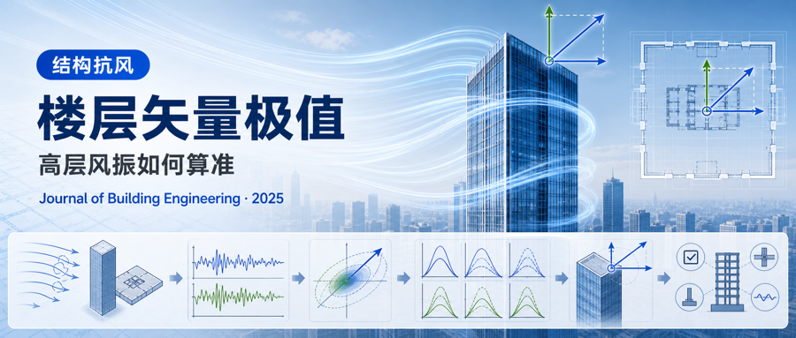
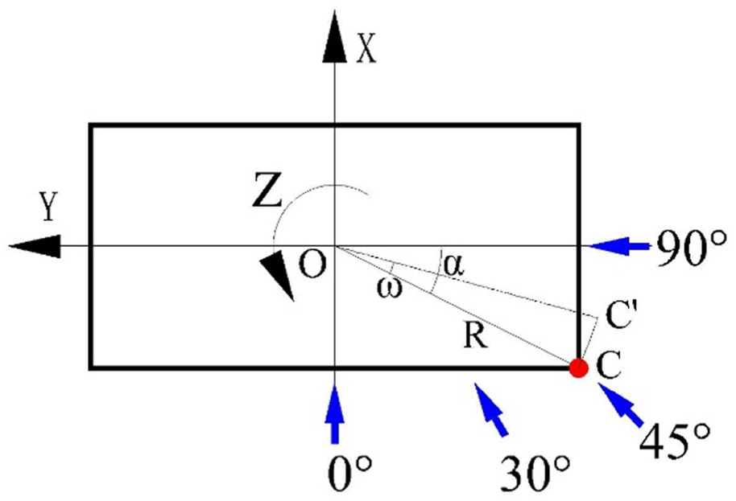
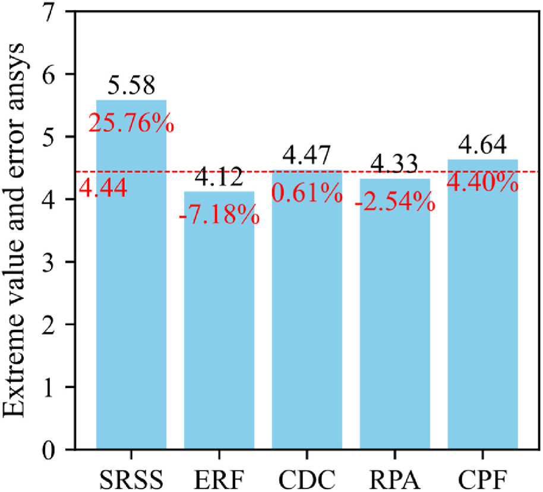
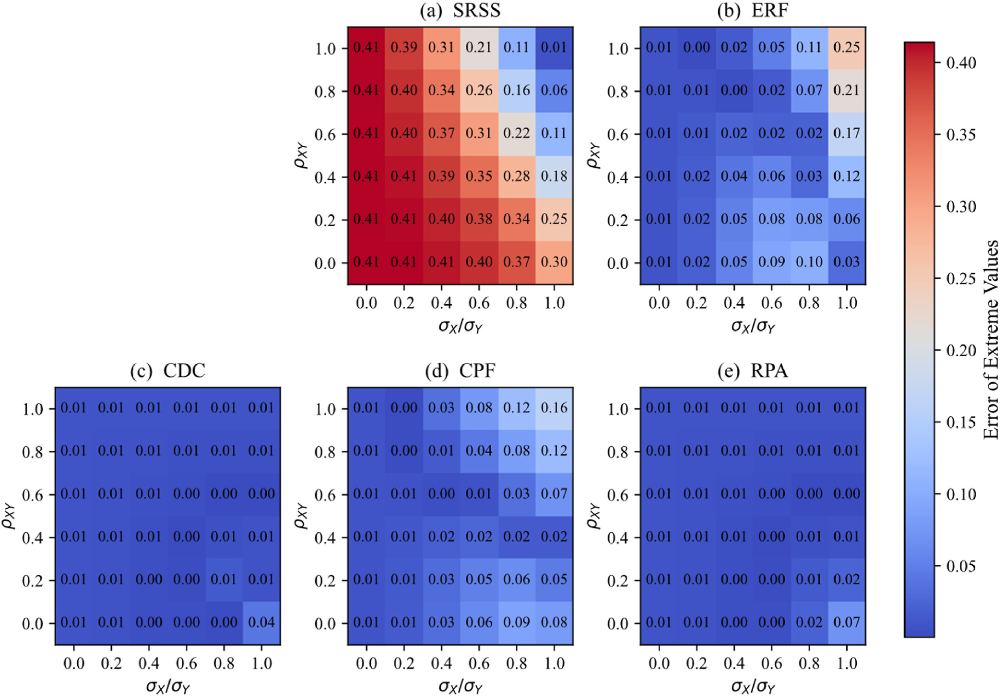
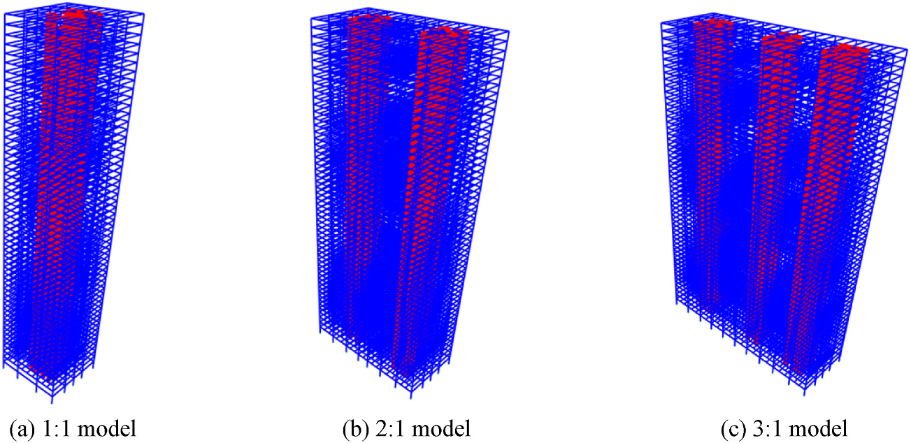
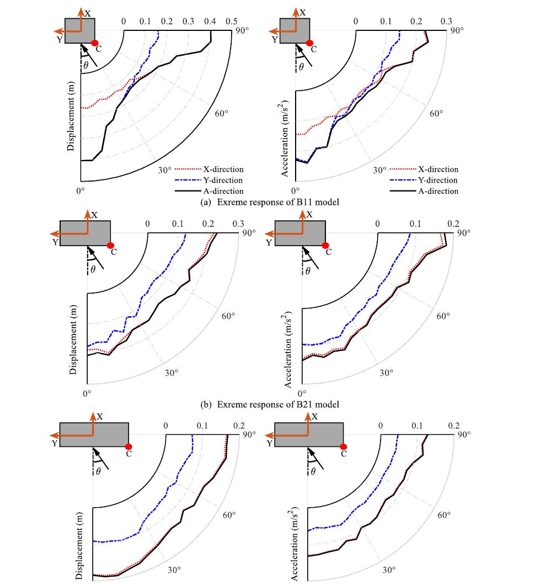
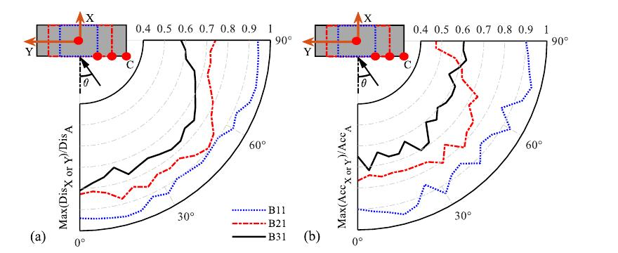

.. _paper-note-ref-yang2025-JBE:

.. role:: student-first-author

别只看单方向峰值：高层建筑二维矢量响应极值怎么算
================================================

高层建筑在强风中并不是只沿一个主轴方向运动。平面内两个方向的位移、加速度，以及角点处由平动和扭转共同形成的运动，都会影响结构安全和人体舒适度。如果设计时只检查一个主轴方向的峰值响应，就可能低估真实的二维矢量响应极值。

这个差距有多大？在我们这项研究的算例中，忽略方向相关性的常用组合方法对二维矢量响应极值的最大偏差可达约 :math:`42\%`；当楼面宽深比不小于 :math:`2:1` 时，只看楼面中心点的主轴响应，还可能使角点真实响应极值产生约 :math:`19\%` 以上的偏差。

在这篇发表于 **Journal of Building Engineering** 的论文中，我们围绕高层建筑风致二维矢量响应极值的统计计算展开研究，比较 SRSS、ERF、CDC、RPA 和 CPF 等方法，并进一步分析风向角、截面宽深比、角点位置和扭转周期比对极值评估的影响。这项工作关注的是：高层建筑抗风设计中，怎样把二维响应相关性和角点效应纳入更可信的极值判断。

   论文图 1 建筑主轴和风向

   读图时注意楼面两个主轴方向、风向角的定义和角点 :math:`C` 的位置：后文比较的各种二维合成方法，都在这一坐标约定下计算角点响应。

论文信息
--------

- 论文题名: Statistical extremes of 2D vectorial response for wind-excited tall buildings
- 作者: :student-first-author:`Yang Junhui`; **Li Chao**\*; Zhang Zhu; Chen Lingwei; He Xin; Zheng Qingxing; Zhang Jianjun
- 期刊: Journal of Building Engineering
- 年份: 2025
- DOI: https://doi.org/10.1016/j.jobe.2025.113635
- WOEAI 相关方向: 建筑结构抗风 / 高层建筑抗风与优化

三句话导读
----------

这篇论文研究高层建筑风致二维矢量响应极值，不再只把位移和加速度拆成单个主轴方向分别检查。 它重要，因为人体舒适度和角点响应本质上受到两个平动方向与扭转运动共同影响，单方向峰值可能低估真实不利响应。 读者可以带走的结论是：二维响应相关性、风向角、宽深比和角点位置都应进入高层建筑抗风极值评估。

关键数字 / 关键结论卡
---------------------

- 在随机信号算例中，SRSS 最大偏差可达约 :math:`42\%`，CDC 最大偏差约 :math:`4\%`，说明相关性处理会显著影响二维极值判断。
- 对本文建筑模型，前 :math:`3` 阶振型对屋面角点位移响应累计贡献达到 :math:`99.8\%`；加速度响应建议考虑前 :math:`11` 阶振型。
- 当宽深比不小于 :math:`2:1` 时，只考虑中心点主轴方向响应极值可能使真实角点响应极值产生约 :math:`19\%` 以上偏差。

摘要
----

在高层建筑结构设计中，现行规范通常采用一维主轴方向的极值响应来定义结构极限状态。然而，结构位移和人体对加速度的感知本质上是二维矢量过程。只关注主轴方向响应会显著低估建筑的实际极值响应。本文首先基于稳态高斯随机过程，考察风致一维峰值因子和二维矢量响应极值的计算方法。随后，以两个相互垂直的平稳高斯随机信号为例，在不同相关系数 :math:`\rho_{XY}` 和标准差比 :math:`\sigma_X/\sigma_Y` 条件下研究多种二维矢量响应极值计算方法的准确性。

结果表明，平方和开方（SRSS）、经验折减系数（ERF）和组合峰值因子（CPF）方法没有考虑各方向响应之间的相关性，结果偏差较大；相关性依赖组合（CDC）方法计算结构二维矢量响应极值最准确，旋转主轴（RPA）方法可以量化一维分量响应与二维矢量响应之间的相关性和角度关系。

研究还发现，高阶振型对高层建筑风致响应的贡献可以忽略，为提高计算效率，本文建议仅考虑前 :math:`11` 阶振型。风向角和截面宽深比对风致响应有显著影响，设计中应尽量避免建筑主轴与当地主导风向一致，以避免产生较大的横风向响应。当宽深比不小于 :math:`2:1` 时，角点处加速度响应极值相对于中心点偏差约为 :math:`19\%`，此时应采用角点而不是中心点评估建筑风致响应极值。较大的扭转周期比可能增大建筑风致二维矢量响应极值，设计中应予以避免。

研究问题
--------

高层建筑抗风设计常用一维主轴方向响应峰值作为控制指标。这个做法在工程上简洁，但它默认建筑响应可以被拆成若干独立方向分别评估。对位移和加速度而言，这个默认并不总是成立。

真实风致响应至少有两层二维性。第一，:math:`X(t)` 和 :math:`Y(t)` 两个主轴方向响应之间存在相关性，二维合成响应不是简单的两个单方向峰值相加或取大。第二，舒适度和局部响应评估常常关心楼面角点，角点响应会叠加楼面平动和扭转运动；如果只看楼面中心点，可能看不到角点处真正的不利运动。

因此，我们在这项研究中回答三个问题：

1. 常用的二维矢量响应极值计算方法（SRSS、ERF、CDC、RPA、CPF），在相关系数和分量大小差异变化时各自的偏差有多大？
2. 计算高层建筑风致位移和加速度响应时，需要考虑多少阶振型才够？
3. 风向角、截面宽深比、角点位置和扭转周期比，会如何改变二维极值的设计判断？

我们把二维矢量响应写成：

.. math::

   A(t)=\sqrt{X^2(t)+Y^2(t)}

这里 :math:`X(t)` 和 :math:`Y(t)` 表示两个相互垂直方向的响应时程，:math:`A(t)` 表示二维合成响应时程。问题的核心不是把公式写出来，而是判断 :math:`A(t)` 的极值应如何从相关随机响应中稳定、准确地估计出来。

方法贡献
--------

我们首先梳理一维峰值因子和二维矢量响应极值的统计基础，然后把常见的五类二维极值合成方法放在同一框架中比较：SRSS、ERF、CDC、RPA 和 CPF。它们的差别主要在于是否考虑两个分量响应之间的相关系数 :math:`\rho_{XY}`、标准差比 :math:`\sigma_X/\sigma_Y`，以及二维响应相对于主轴方向的角度关系。

   论文图 3 二维矢量响应极值合成结果和误差

   读图时可以对照同一组 :math:`X(t)`、:math:`Y(t)` 输入下各方法给出的极值估计和误差柱：不同方法的结果差异一目了然，其中 CDC 方法在该算例中的误差最小。

为避免只在单一相关性条件下得出结论，我们进一步设置不同的 :math:`\rho_{XY}` 和 :math:`\sigma_X/\sigma_Y`，用大量随机模拟检验各方法偏差。这个步骤把“二维矢量响应极值”从一个概念判断变成了可比较的统计问题。

   论文图 5 不同标准差比和相关系数下的二维矢量响应极值误差

   读图时关注误差随横轴 :math:`\rho_{XY}` 和不同 :math:`\sigma_X/\sigma_Y` 曲线的变化：SRSS、ERF 和 CPF 的误差曲线对相关系数变化不敏感，CDC 和 RPA 则能同时跟随两个参数的改变。

随后，我们把这些方法应用到高层建筑风致响应分析中，研究风向角、截面宽深比和扭转周期比的影响。这样，方法比较不止停留在随机信号层面，也进入了具有工程几何和动力特征的高层建筑模型。

   论文图 17 建筑框架有限元模型

   图中为 :math:`1:1`、:math:`2:1` 和 :math:`3:1` 三种宽深比的建筑框架有限元模型，后文的风向角与宽深比分析都基于这组模型展开。

关键发现
--------

1. 只看主轴方向峰值，可能看错二维极值
~~~~~~~~~~~~~~~~~~~~~~~~~~~~~~~~~~~~~

针对问题 1，我们先在随机信号算例中比较各方法。SRSS 方法由于不考虑两个主轴方向响应之间的相关性，会给出偏保守结果；ERF 和 CPF 也会因相关性处理不足而出现较大偏差。 **论文中给出的结果显示，在不同 :math:`\rho_{XY}` 和 :math:`\sigma_X/\sigma_Y` 条件下，SRSS 最大偏差可达约 :math:`42\%`，ERF 约 :math:`25\%`，CPF 约 :math:`16\%`，RPA 约 :math:`7\%`，而 CDC 最大偏差仅约 :math:`4\%`。**

这说明二维极值不是一个可以用单一方向峰值简单替代的问题。对高层建筑抗风设计来说，二维响应的相关性、分量大小差异和方向关系都会改变最终极值判断。

2. CDC 方法在本文比较中整体最稳定
~~~~~~~~~~~~~~~~~~~~~~~~~~~~~~~~~

同样针对问题 1，我们在随机信号和高层建筑案例中进一步比较各方法的综合表现。 **CDC 方法在两类算例中的综合误差都最小，是本文比较中最稳定的二维矢量响应极值计算方法。** 它的优势在于把相关系数 :math:`\rho_{XY}` 和两个方向响应标准差差异纳入组合计算，而不是默认两个分量完全独立或完全同步达到峰值。

RPA 方法也有重要价值。它通过旋转主轴，把非主轴方向的二维响应极值问题转化为一维方向上的极值搜索，可以帮助理解一维分量响应与二维矢量响应之间的角度关系。不过在本文结果中，RPA 在某些条件下可能偏小，因此用于设计判断时需要注意保守性。

3. 高阶振型对位移和加速度的影响不同
~~~~~~~~~~~~~~~~~~~~~~~~~~~~~~~~~~~

针对问题 2，我们考察参与振型数量对风致响应计算的影响。对屋面角点位移响应而言，前 :math:`3` 阶振型的累计贡献已达到 :math:`99.8\%`，因此位移计算中忽略更高阶振型通常可以显著提高效率且误差很小。

但对屋面角点加速度响应，高阶振型贡献更明显。论文中给出的结果显示，前 :math:`6` 阶振型累计贡献为 :math:`96.7\%`，前 :math:`11` 阶达到 :math:`99.0\%`。 **在本文建筑模型条件下，位移计算用前 :math:`3` 阶振型已经足够，而加速度计算建议考虑前 :math:`11` 阶振型。** 不能把位移响应的简化经验直接搬到舒适度相关的加速度评估中。

4. 风向角和宽深比会改变控制响应
~~~~~~~~~~~~~~~~~~~~~~~~~~~~~~~

针对问题 3，我们对不同宽深比建筑在不同风向角下的响应进行比较。结果显示，当建筑宽深比为 :math:`1:1` 时，风向与建筑主轴一致时二维风致响应极值较大；随着风向角增大，二维响应极值先降低后升高，在 :math:`45^\circ` 附近达到较小值。 **因此，设计中应尽量避免建筑主轴方向与当地主导风向一致，以降低显著横风向响应的风险。**

   论文图 18 不同宽深比建筑顶层角点的主轴响应和合成响应极值

   读图时按 :math:`1:1`、:math:`2:1`、:math:`3:1` 三组宽深比对照：黑线代表二维合成响应，红线和蓝线分别代表两个主轴方向响应，三组曲线随风向角的相对位置变化反映了控制响应的转移。

当宽深比增大时，二维矢量响应极值逐渐接近弱轴方向响应极值。论文中给出的结果显示，当宽深比不小于 :math:`3:1` 时，仅用主轴方向最大风致响应估计矢量响应，偏差可控制在约 :math:`3\%` 以内。但这并不意味着所有宽深比下都可以忽略二维合成，尤其在 :math:`1:1` 和 :math:`2:1` 情况下，风向和角点位置仍会带来明显差异。

5. 角点响应比中心点更接近舒适度评估中的不利位置
~~~~~~~~~~~~~~~~~~~~~~~~~~~~~~~~~~~~~~~~~~~~~~~

同样针对问题 3，工程分析中常以楼面中心点响应作为代表值，但本文结果显示，角点二维矢量响应可能明显大于中心点主轴响应。 **当宽深比不小于 :math:`2:1` 时，只考虑中心点主轴方向响应极值，可能使真实响应极值产生约 :math:`19\%` 以上偏差，此时应改用角点评估建筑风致响应极值。** 当宽深比不小于 :math:`3:1` 时，这一偏差可进一步增大。

   论文图 20 中心点主轴响应与角点合成响应之比

   图中比较了楼面中心点主轴响应与顶层角点二维合成响应之间的比例，比例偏离 :math:`1` 越远，说明只看中心点带来的误差越大。

工程意义
--------

这项研究对高层建筑抗风设计的意义在于，把“控制响应”从单方向峰值推进到二维矢量极值判断。

对结构安全和舒适度评估而言，二维矢量响应极值可以更接近人在建筑角点处实际感受到的运动，也更能反映横风向响应、扭转响应和方向相关性的共同作用。尤其是对平面形状、宽深比和主导风向关系敏感的高层建筑，只检查一个主轴方向可能不足以支撑可靠判断。

对计算流程而言，这项研究也给出了效率取舍：位移响应可在特定模型中用较少振型获得足够精度，而加速度响应需要考虑更多高阶振型。这样可以避免“一刀切”地增加计算成本，也避免为了省时而牺牲舒适度评估可靠性。

对建筑方案和总图布置而言，风向角结论具有直接启发：在条件允许时，应尽量避免建筑主轴与当地主导风向重合，以减少不利横风向响应。这个建议不是替代风洞试验或详细动力分析，而是为早期方案判断提供结构抗风视角。

适用边界
--------

本文结论基于稳态高斯随机过程假设、论文选取的高层建筑模型、风洞试验风荷载数据、PI 方法计算的风致响应时程，以及文中设定的宽深比和扭转周期比工况。换成复杂非高斯响应、显著非线性结构、不同地貌风场、不同结构体系或其他舒适度评价标准后，二维矢量极值计算仍需要重新核验。

CDC 方法在本文比较中表现最好，但这不意味着其他方法在所有工程情境中都没有价值。SRSS 的保守性、RPA 的角度解释能力，以及规范和工程实践中的既有流程，都需要结合设计阶段和安全裕度要求综合判断。

此外，论文给出的 :math:`11` 阶振型建议来自本文建筑模型的加速度响应分析。它说明高阶振型对加速度不可轻易忽略，但不应被机械推广为所有高层建筑的固定阶数。实际工程中仍应结合结构动力特性、模态质量参与、风荷载谱和响应目标进行校核。

延伸阅读
--------

- `WOEAI | 建筑结构抗风方向介绍 <https://woeai.readthedocs.io/zh-cn/latest/BuildingStructuralWindResistance.html>`_
- `WOEAI | 主页 <https://woeai.readthedocs.io/zh-cn/latest/>`_

完整引用
--------

[67] :student-first-author:`Yang Junhui`; **Li Chao**\*; Zhang Zhu; Chen Lingwei; He Xin; Zheng Qingxing; Zhang Jianjun, Statistical extremes of 2D vectorial response for wind-excited tall buildings[J]. **Journal of Building Engineering**, 2025, 111: 113635. https://doi.org/10.1016/j.jobe.2025.113635.

收录信息见 :ref:`WOEAI 学术成果页对应条目 <ref-yang2025-JBE>`。

相关论文精解
------------

- :doc:`用内置矩形立柱提升液舱阻尼器设计效率 <ref-he2026-OE>`
- :doc:`用图神经网络预测高层建筑结构响应 <ref-tang2025-JBE>`
- :doc:`让高层建筑 TLD 在非线性晃荡中更会耗能 <ref-he2025-POF>`
