.. _paper-note-ref-yang2025-JBE:

.. role:: student-first-author

风激励高层建筑二维矢量响应的统计极值：论文精解
======================================================

精简版微信公众号文章：待发布

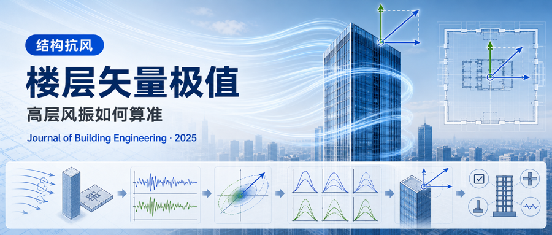

.. contents:: 本页目录
   :local:
   :depth: 2

论文信息
--------

**原文题名**：Statistical extremes of 2D vectorial response for wind-excited tall buildings

**中文题名**：风激励高层建筑二维矢量响应的统计极值

**作者**： :student-first-author:`Junhui Yang` （a）；**Chao Li**\*（a、b）；Zhu Zhang（c）；Lingwei Chen（a）；Xin He（a）；Qingxing Zheng（d）；Jianjun Zhang（d）。

**作者单位**：

- a：哈尔滨工业大学（深圳）智能土木与海洋工程学院，中国广东深圳，518055
- b：哈尔滨工业大学（深圳）广东省土木工程智能韧性结构重点实验室，中国广东深圳，518055
- c：中车株洲电力机车研究所有限公司，中国湖南，412001
- d：深圳市建筑设计研究总院有限公司，中国广东深圳，518031

**通讯作者脚注**：\* Chao Li，哈尔滨工业大学（深圳）智能土木与海洋工程学院，中国广东深圳，518055；电子邮件： `lichaosz@hit.edu.cn <mailto:lichaosz@hit.edu.cn>`_ （C. Li）。

**期刊**：Journal of Building Engineering，111（2025），113635。

**DOI**：https://doi.org/10.1016/j.jobe.2025.113635

**出版过程**：2025 年 3 月 13 日收稿；2025 年 7 月 18 日收到修订稿；2025 年 7 月 29 日录用；2025 年 7 月 30 日在线发表。

关键词
------

风致响应；二维矢量响应极值；相关性依赖组合方法；宽深比；周期比。

摘要
----

在高层建筑结构设计中，现行规范通常采用一维（1D）主轴方向的响应极值来定义结构极限状态。然而，结构位移和人体对加速度的感知属于二维（2D）矢量过程，这一点已得到充分认识。仅关注主轴方向响应，会显著低估建筑实际响应极值。本文首先基于稳态高斯随机过程，考察风致一维峰值因子与二维矢量响应极值的计算方法。随后，以具有不同相关系数 :math:`\rho_{XY}` 和标准差比 :math:`\sigma_X/\sigma_Y` 的两个相互垂直的平稳高斯随机信号为例，研究各种二维矢量响应极值计算方法的准确性。结果表明，平方和开方（SRSS）、经验折减系数（ERF）和组合峰值因子（CPF）方法未考虑各方向响应的相关性，结果偏差较大；相关性依赖组合（CDC）方法计算结构二维矢量响应极值最准确，旋转主轴（RPA）方法可以量化一维分量响应与二维矢量响应之间的相关性及角度关系。此外，研究发现，高阶振型对高层建筑风致响应的贡献可以忽视；为提高计算效率，可以不计这一较小贡献，本文建议只考虑前 11 阶振型。风向角和截面宽深比显著影响风致响应，设计时应避免建筑主轴与当地主导风向一致，以免产生较大的横风向响应。当宽深比不小于 2:1 时，角点加速度响应极值相对于中心点的偏差约为 19%，此时应采用角点而非中心点评价建筑风致响应极值。较大的扭转周期比可能导致建筑风致二维矢量响应极值增大，设计时应避免这种情况。

.. note::

   摘要中的高阶振型与 19% 为原文概括。第 3.2.3 节以本算例前 20 阶结果为参照，明确区分前 3 阶位移与前 11 阶加速度；19% 对应第 3.3.1 节所比较模型的中心点主轴加速度与角点二维加速度，不是所有建筑、所有响应指标的保证值。下文保留原文推导及其内部差异，译注与作者原述分开。

1 引言
------

对建筑功能多样性的需求日益增长，推动了具有大宽深比截面（标准层）的超高层建筑的应用。因此，这些建筑在强风作用下的安全性与舒适度变得越来越重要 :ref:`[1] <yang2025-ref-1>` :ref:`[2] <yang2025-ref-2>` :ref:`[3] <yang2025-ref-3>` :ref:`[4] <yang2025-ref-4>` :ref:`[5] <yang2025-ref-5>`。评价这些超高层结构的风致振动时，首先通过风洞试验获得精确的风荷载时空分布；随后依据随机振动理论，计算结构顺风向、横风向和扭转方向的风致响应 :ref:`[6] <yang2025-ref-6>`。建筑风致响应计算主要采用两种方法：频域法和时域法 :ref:`[7] <yang2025-ref-7>`。频域法理论基础明确、计算效率较高，因此广泛用于结构风致响应分析 :ref:`[8] <yang2025-ref-8>` :ref:`[9] <yang2025-ref-9>` :ref:`[10] <yang2025-ref-10>`。然而，该方法只能给出建筑响应的统计结果，且所关注的响应限于结构弹性范围。时域法又称逐步积分法，能够全面确定结构响应时程及非弹性行为，从而更充分地分析结构状态与性能 :ref:`[11] <yang2025-ref-11>` :ref:`[12] <yang2025-ref-12>` :ref:`[13] <yang2025-ref-13>` :ref:`[14] <yang2025-ref-14>` :ref:`[15] <yang2025-ref-15>`。因此，随着计算性能持续提高，时域法表现出更广的适用性，其优势也日益突出。

现有经典逐步积分方法包括中心差分法、Newmark-β 法和 Wilson-θ 法 :ref:`[16] <yang2025-ref-16>`，但这些方法仅具二阶精度。另一方面，还有若干精度更高的计算方法，例如 Runge–Kutta 法（RK） :ref:`[17] <yang2025-ref-17>` :ref:`[18] <yang2025-ref-18>`、精细积分法（PI） :ref:`[19] <yang2025-ref-19>` 等单步法，以及 Adams–Bashforth–Moulton 法（ABM） :ref:`[20] <yang2025-ref-20>` :ref:`[21] <yang2025-ref-21>` 等多步法。四阶 RK 法和四阶 ABM 法虽然精度较高，但稳定性较差；相比之下，PI 法由于稳定且计算精度高，日益获得研究者认可 :ref:`[12] <yang2025-ref-12>`。本文主要采用 PI 法计算建筑风致响应。众所周知，建筑表面风压和风致响应均为随机过程。20 世纪 60 年代，Davenport 教授 :ref:`[22] <yang2025-ref-22>` :ref:`[23] <yang2025-ref-23>` 基于平稳高斯分布和峰值越阈次数服从泊松分布的假定，建立峰值因子分析方法，以峰值因子与响应方差的乘积表示随机过程的平均极值，并引起广泛关注。随后，许多研究表明，建筑风压及风致响应具有明显的非高斯特征 :ref:`[24] <yang2025-ref-24>` :ref:`[25] <yang2025-ref-25>`。按高斯假定计算的峰值因子小于实际结果；风致响应峰值越阈次数服从泊松分布的假定对宽带过程可以给出准确结果，但对窄带过程则较保守 :ref:`[26] <yang2025-ref-26>`。因此，Kareem 和 Zhao :ref:`[27] <yang2025-ref-27>` 基于变换过程与矩方法 Hermite 模型，提出针对非高斯过程的峰值因子计算方法，即矩方法 Hermite 模型（HM 法）。随后，Kareem 和 Kwon :ref:`[28] <yang2025-ref-28>` 修正 HM 法，提出修正 Hermite 模型法（MHM）。Vanmarcke :ref:`[29] <yang2025-ref-29>` :ref:`[30] <yang2025-ref-30>`、Cartwright 和 Longuet-Higgins :ref:`[31] <yang2025-ref-31>` :ref:`[32] <yang2025-ref-32>` 分别提出考虑带宽参数的峰值因子计算方法。其后，Li X 等 :ref:`[33] <yang2025-ref-33>` 基于时变上穿理论，提出准确计算建筑瞬态荷载时变极值与峰值因子的方法。Zhao Z 等 :ref:`[34] <yang2025-ref-34>` :ref:`[35] <yang2025-ref-35>` 通过二元矢量平移过程近似，给出非平稳非高斯响应平均上穿率的解析解，并进一步根据动力可靠度评价方法推导非线性结构的极值分布与超越概率。

.. note::

   上段“响应方差”为原文用词；后文式（18）、（19）、（28）等采用标准差与峰值因子的乘积。这里保留原文用词差异，不把方差与标准差视为同一量。

现有研究主要关注建筑主轴，即 X、Y 和 θ 方向的响应极值 :ref:`[36] <yang2025-ref-36>` :ref:`[37] <yang2025-ref-37>`。由于高层建筑的竖向变形可以不计，其实际风致响应是平面内的二维矢量过程 :ref:`[38] <yang2025-ref-38>`。关于建筑二维矢量响应峰值及其与主轴方向峰值之差的研究相对较少；而且，现有方法的结果差异显著，给研究者带来较大不便。Wilson E L 等 :ref:`[39] <yang2025-ref-39>` 提出利用平方和开方（SRSS）方法确定高层建筑体系二维矢量风致响应极值，但该方法未考虑各方向响应之间的相关性，估计结果过于保守。为解决这一问题，美国土木工程师学会（ASCE）采用 40% 和 75% 规则计算建筑风致响应极值：将较大主轴方向极值的 40% 与另一主轴方向极值相加，或取各主轴方向响应之和的 75%，得到风致二维矢量响应极值。另一种方法是 Isyumov N 等 :ref:`[40] <yang2025-ref-40>` 提出的经验折减系数（ERF）法，通过引入经验折减系数修正 SRSS 结果，从而得到更准确的结果。Chen X 等 :ref:`[41] <yang2025-ref-41>` 随后通过理论分析，发展了考虑主轴响应相关性的相关性依赖组合（CDC）法；为防止低估响应极值，将折减因子的限制设为 80%。值得注意的是，上述方法都依赖经验参数，而不完全由理论推导得到。此外，Huang M 等 :ref:`[29] <yang2025-ref-29>` 和 Yan Y 等 :ref:`[42] <yang2025-ref-42>` 从理论分析角度提出高层建筑风致二维矢量响应极值公式，即 CPF 法和 RPA 法。CPF 法假定风致二维矢量响应的矢量长度服从 Rayleigh 分布，其极值服从 Gumbel 分布；基于统计极值渐近理论引入新的 Gamma 峰值因子，用以预测风致二维矢量响应极值。RPA 法则通过几何分析，将二维矢量响应极值旋转至主轴位置，从而把二维矢量极值问题转化为一维分析问题。由于理论基础和假定不同，这些方法得到的结果相差显著，研究者难以直接选用。

.. note::

   引言对 CDC 的 80% 限制措辞较含混；其具体操作以式（30）至式（32）的最大值组合为准，其中 :math:`A_2` 是 0.8 倍 SRSS 值。

本文安排如下：第 2.1 节介绍时域精细积分法与一维平稳高斯随机过程极值分析理论，并将 Vanmarcke、Cartwright 和 Longuet-Higgins 所提出的含带宽参数峰值因子，与 Davenport 峰值因子比较。第 2.2 节总结现有建筑风致二维矢量响应极值合成方法。第 3.1 节利用具有不同相关系数与标准差比的随机生成信号，研究不同二维矢量响应极值计算方法的准确性。第 3.2 节对长时程风荷载作用下的超高层建筑开展算例分析，统计评价不同峰值因子及二维矢量极值方法的精度。第 3.3 节探讨振型数量、风向、宽深比和周期比等因素对建筑风致二维矢量响应极值的影响。最后，第 4 节总结本研究的发现与结论。

2 二维矢量极值统计方法
----------------------

采用时域逐步积分法，可以获得建筑三个主轴方向的风致响应时程；随后根据极值穿越理论，得到各方向相应的响应极值。然而，在建筑使用过程中，人们不仅关注三个主轴方向的响应极值，也关注二维平面内响应的矢量极值。本节首先分析建筑主轴方向响应极值理论，再结合相关理论的发展，总结并改进二维矢量极值统计方法。

2.1 一维平稳高斯随机过程的极值理论
~~~~~~~~~~~~~~~~~~~~~~~~~~~~~~~~~~~~

2.1.1 精细积分法
^^^^^^^^^^^^^^^^

高层建筑在风荷载下的运动方程为：

.. _yang2025-eq-1:

.. math::

   [M][\ddot D(t)]+[C][\dot D(t)]+[K][D(t)]=[F(t)] \qquad (1)

其中， :math:`M` 为质量矩阵； :math:`C` 为阻尼矩阵； :math:`K` 为刚度矩阵； :math:`D(t)=[D_x(t),D_y(t),D_\theta(t)]^{\mathrm T}` 为位移时程矩阵，由 X、Y 轴方向平动时程向量及绕 Z 轴转动向量组成，上标 T 表示转置； :math:`\ddot D(t)` 和 :math:`\dot D(t)` 分别表示加速度与速度时程； :math:`F(t)=[F_x(t),F_y(t),F_\theta(t)]^{\mathrm T}` 为 X 轴、Y 轴和扭转方向的外荷载矩阵。对不存在结构偏心的高层建筑，质量与刚度矩阵可表示为：

.. _yang2025-eq-2:

.. math::

   [M]=\begin{bmatrix}M_x&0&0\\0&M_y&0\\0&0&J\end{bmatrix},\qquad
   [K]=\begin{bmatrix}K_x&0&0\\0&K_y&0\\0&0&K_\theta\end{bmatrix} \qquad (2)

理论上，可用 Duhamel 积分法及数值方法求解 :ref:`式（1） <yang2025-eq-1>`。然而，对于高层建筑等多自由度结构，直接联立求解耦合方程需要大量计算资源。因此，工程实践中通常先采用振型叠加法解耦，再利用逐步积分法计算各个解耦方程。引入 Rayleigh 阻尼后，可得到以下解耦方程：

.. _yang2025-eq-3:

.. math::

   \ddot q_k(t)+2\xi_k\omega_k\dot q_k(t)+\omega_k^2q_k(t)=\frac{F_k^*(t)}{M_k^*} \qquad (3)

其中， :math:`\xi_k` 和 :math:`\omega_k` 分别表示第 :math:`k` 阶模态阻尼比与圆频率； :math:`F_k^*(t)=[\phi]_k^{\mathrm T}[F(t)]` 为第 :math:`k` 阶广义力； :math:`[\phi]_k=[\phi_{xk},\phi_{yk},\phi_{\theta k}]^{\mathrm T}` 为第 :math:`k` 阶振型； :math:`M_k^*=[\phi]_k^{\mathrm T}[M][\phi]_k` 为第 :math:`k` 阶广义质量。结构位移时程 :math:`[D(t)]` 、速度时程 :math:`[\dot D(t)]` 及加速度时程 :math:`[\ddot D(t)]` 由下式确定：

.. _yang2025-eq-4:

.. math::

   [D(t)]=\sum_k q_k(t)[\phi]_k,\qquad
   [\dot D(t)]=\sum_k\dot q_k(t)[\phi]_k,\qquad
   [\ddot D(t)]=\sum_k\ddot q_k(t)[\phi]_k \qquad (4)

采用精细积分法计算 :ref:`式（3） <yang2025-eq-3>`。精细积分法是一类逐步积分方法，由钟万勰于 1994 年首次提出 :ref:`[19] <yang2025-ref-19>`。该方法利用 Hamilton 体系表示结构运动方程，使方程求解过程能够借助 Hamilton 正则方程的特性提高精度。在求解过程中，该方法提出一种高效矩阵指数计算方式，从而显著提高计算精度。

首先，将运动方程 :ref:`式（1） <yang2025-eq-1>` 写为状态空间形式：

.. _yang2025-eq-5:

.. math::

   \dot A(t)=HA(t)+Q(t) \qquad (5)

.. math::

   A(t)=\begin{bmatrix}q(t)\\\dot q(t)\end{bmatrix},\qquad
   H=\begin{bmatrix}0&I\\-\omega^2&-2\xi\omega\end{bmatrix},\qquad
   Q(t)=\begin{bmatrix}0\\F^*(t)/M^*\end{bmatrix}.

利用逐步积分法求解上述常微分方程：

.. _yang2025-eq-6:

.. math::

   A_{i+1}=e^{H\Delta t}A_i+\int_{t_i}^{t_{i+1}}e^{H(t_{i+1}-\tau)}Q(\tau)\,d\tau \qquad (6)

精细积分法计算积分项时涉及矩阵求逆；当矩阵奇异时，便无法求解。此时，采用高斯积分对积分项求和，可以避免上述问题。上述表达式的高斯积分过程如下：

.. _yang2025-eq-7:

.. math::

   \begin{aligned}
   A_{i+1}&=e^{H\Delta t}A_i+\frac{\Delta t}{2}\sum_{k=1}^n w_k
   T\!\left(\frac{\Delta t}{2}(1+x_k)\right)
   Q\!\left(t_i+\frac{\Delta t}{2}(1+x_k)\right)+0(\Delta t^{2n-1}),\\
   T(\tau)&=e^{H\Delta\tau}=I+T_N,\\
   T_N&=2T_{N-1}+T_{N-1}T_{N-1},\\
   T_0&=(I+D_s)^{-1}(N_s-D_s),\\
   N_s&=\sum_{k=1}^{p}\frac{(2p-k)!p!}{(2p)!k!(p-k)!}(H\Delta\tau)^k,\\
   D_s&=\sum_{k=1}^{p}\frac{(2p-k)!p!}{(2p)!k!(p-k)!}(-H\Delta\tau)^k.
   \end{aligned} \qquad (7)

其中， :math:`n` 为高斯积分点数； :math:`x_k` 为高斯积分点坐标，范围为 :math:`(-1,1)` ； :math:`w_k` 为高斯积分点的权重系数；参数 :math:`N` 和 :math:`p` 按文献 :ref:`[43] <yang2025-ref-43>` 自适应选取。

高斯积分点越多、计算时间步长越小，计算精度越高，但计算效率相应降低。使用高斯积分公式时，需要知道积分点处的荷载值，这通常须通过相邻时间步荷载的差分获得。由于差分得到的荷载与实际荷载之间存在误差，为避免多次插值，实际应用中一般采用三节点高斯积分公式。

.. note::

   式（7）按出版版保留：余项印为数字 :math:`0(\Delta t^{2n-1})` ，且积分指数的时间参数写法与式（6）不完全一致。这里不将其静默改为另一积分公式。作者称方法于 1994 年提出，而所引文献 :ref:`[19] <yang2025-ref-19>` 出版于 2004 年，两者也按原文保留。

2.1.2 极值穿越理论
^^^^^^^^^^^^^^^^^^

本文关注随机过程 :math:`X(t)` 超越特定界限 :math:`x=b` 的统计特征，这是动力可靠度分析的基础。该问题最初由美国学者 Rice :ref:`[44] <yang2025-ref-44>` 于 1944 年提出。设 :math:`X(t),\ t\in\mathcal T=[t_0,t_0+T]` 为均方可微随机过程。进一步定义一个新的随机过程，以开展后续分析：

.. _yang2025-eq-8:

.. math::

   Y(t)=\varepsilon[X(t)-b] \qquad (8)

其中，随机过程 :math:`Y(t)` 可表示为（0,1）过程， :math:`\varepsilon(\cdot)` 为 Heaviside 阶跃函数。具体而言， :math:`X(t)\ge b` 时 :math:`Y(t)=1` ， :math:`X(t)<b` 时 :math:`Y(t)=0` 。

在时间区间 :math:`T` 内， :math:`X(t)` 穿越阈值 :math:`b` 的总次数为随机变量，记作 :math:`n(b,T)` ，其数学期望记作 :math:`N(b,T)` ：

.. _yang2025-eq-9:

.. math::

   n(b,T)=\int_{t_0}^{t_0+T}|\dot X(t)|\delta[X(t)-b]\,dt \qquad (9)

.. _yang2025-eq-10:

.. math::

   N(b,T)=E[n(b,T)]=\int_{t_0}^{t_0+T}\int_{-\infty}^{+\infty}|\dot x|p_{X\dot X}(b,\dot x,t)\,d\dot x\,dt \qquad (10)

其中， :math:`p_{X\dot X}(x,\dot x,t)` 为 :math:`X(t)` 与 :math:`\dot X(t)` 的联合概率密度函数， :math:`\dot X(t)` 为 :math:`X(t)` 的导数； :math:`\delta(\cdot)` 为 Dirac δ 函数。

:math:`X(t)` 穿越阈值 :math:`b` 的期望速率 :math:`\upsilon_b(t)` 表达式如下：

.. _yang2025-eq-11:

.. math::

   \upsilon_b(t)=\int_{-\infty}^{+\infty}|\dot x|p_{X\dot X}(b,\dot x,t)\,d\dot x \qquad (11)

假设 :math:`X(t)` 为零均值平稳高斯随机响应。此时， :math:`E[X(t)\dot X(t)]=0` ，联合概率密度函数 :math:`p_{X\dot X}(x,\dot x,t)` 可表示为：

.. _yang2025-eq-12:

.. math::

   p_{X\dot X}(x,\dot x,t)=\frac{1}{2\pi\sigma_X\sigma_{\dot X}}
   \exp\left[-\left(\frac{x^2}{2\sigma_X^2}+\frac{\dot x^2}{2\sigma_{\dot X}^2}\right)\right] \qquad (12)

根据上述推导， :math:`X(t)` 穿越阈值 :math:`b` 的期望速率 :math:`\upsilon_b(t)` 可简化为：

.. _yang2025-eq-13:

.. math::

   \upsilon_b(t)=\upsilon_b=\frac{1}{\pi}\frac{\sigma_{\dot X}}{\sigma_X}
   \exp\left(-\frac{b^2}{2\sigma_X^2}\right) \qquad (13)

.. math::

   \upsilon_0(t)=\upsilon_0=\frac{1}{\pi}\frac{\sigma_{\dot X}}{\sigma_X}.

其中， :math:`\sigma_X` 为 :math:`X(t)` 的标准差， :math:`\sigma_{\dot X}` 为 :math:`\dot X(t)` 的标准差。另外， :math:`\upsilon_0^+` 与 :math:`\upsilon_0^-` 分别表示 :math:`X(t)` 在单位时间内以正斜率和负斜率穿越零界限的期望次数，通常称为穿越率。

2.1.3 Davenport 峰值因子
^^^^^^^^^^^^^^^^^^^^^^^^

Davenport :ref:`[22] <yang2025-ref-22>` :ref:`[45] <yang2025-ref-45>` 认为，建筑风致响应时程样本服从高斯分布，而各时程样本的最大值服从极值分布。基于极值穿越理论，可以建立结构响应极值与标准差之间的关系。需要注意，楼板中心响应由平均响应和零均值脉动响应两部分组成。平均响应源于平均风的静力作用，零均值脉动响应主要源于风的动力作用。静力效应可通过静力平衡方程直接处理，因此本文主要分析零均值脉动响应。

依据极值穿越理论，考虑均值为零的平稳高斯随机信号 :math:`X(t)` ，以 :math:`E(k)` 表示 :math:`X(t)` 在单位时间内向上（ :math:`\dot x>0` ）穿越界限 :math:`b=k\sigma_X` 的次数。由 :ref:`式（11） <yang2025-eq-11>` 可得：

.. _yang2025-eq-14:

.. math::

   E(k)=\int_0^{+\infty}\dot x(t)p_{X\dot X}(b,\dot x)\,d\dot x \qquad (14)

对平稳高斯随机信号 :math:`X(t)` ， :math:`X(t)` 与 :math:`\dot X(t)` 相互独立且均服从高斯分布。将概率密度函数 :math:`p_X(b)=\exp[-b^2/(2\sigma_X^2)]/(\sqrt{2\pi}\sigma_X)` 和 :math:`p_{\dot X}(\dot x)=\exp[-\dot x^2/(2\sigma_{\dot X}^2)]/(\sqrt{2\pi}\sigma_{\dot X})` 代入 :ref:`式（14） <yang2025-eq-14>`，可得：

.. _yang2025-eq-15:

.. math::

   E(k)=\upsilon_0^+\exp\left(-\frac{b^2}{2\sigma_X^2}\right)
   =\upsilon_0^+\exp\left(-\frac{k^2}{2}\right) \qquad (15)

其中， :math:`v_0` 表示随机过程在单位时间内穿过零位置的频率。

对 :math:`X(t)` 的峰值越阈事件而言，超过阈值 :math:`b` 属于小概率事件。在时间区间 :math:`(0,T]` 内，最大峰值响应 :math:`X_{\max}=K\sigma_X\le b` 不超越阈值 :math:`b` 的概率可表示为：

.. _yang2025-eq-16:

.. math::

   P(X_{\max}<b\mid T)=P(K<k\mid T)=\exp[-E(k)T] \qquad (16)

其中， :math:`P(K<k\mid T)` 为区间 :math:`(0,T]` 内随机变量 :math:`K` 的累积分布函数。

概率密度函数 :math:`p_k(K=k\mid T)` 表征 :math:`k<K<k+dk` 的概率，由 :ref:`式（16） <yang2025-eq-16>` 求导可得：

.. _yang2025-eq-17:

.. math::

   p_k(K=k\mid T)=kT\cdot E(k)\exp[-E(k)T] \qquad (17)

时间区间 :math:`(0,T]` 可视为 :math:`X(t)` 的一个时段。最大峰值出现的数学期望，即 :math:`X(t)` 的平均最大峰值，可以表示为：

.. _yang2025-eq-18:

.. math::

   E(k)=\overline{X_{\max}}=\overline K\sigma_X
   =\sigma_X\int_{-\infty}^{+\infty}kP_k(K=k\mid T)\,dk \qquad (18)

其中， :math:`\overline K` 为 Davenport 峰值因子，也称平均峰值因子，通常记作 :math:`g` 。

将 :ref:`式（17） <yang2025-eq-17>` 代入 :ref:`式（18） <yang2025-eq-18>`，并令 :math:`b=0` ，可将平均峰值因子近似写为：

.. _yang2025-eq-19:

.. math::

   g=\overline K=\int_{-\infty}^{+\infty}kp_k(K<k\mid T)\,dk
   =\sqrt{2\ln(\upsilon_0^+T)}+\frac{\gamma}{\sqrt{2\ln(\upsilon_0^+T)}} \qquad (19)

其中， :math:`T` 表示时间区间上限，通常取 :math:`T=600\ \mathrm{s}` ； :math:`\gamma` 为 Euler 常数，取值 0.5772。

.. note::

   式（18）左端的 :math:`E(k)` 与式（14）、（15）的穿越率记号重复，式（18）的密度写作大写 :math:`P_k` ，式（19）的积分中又写作 :math:`p_k(K<k\mid T)` 。这些记号及“令 :math:`b=0` ”的推导措辞均按原文保留，不能据此把密度、累积分布函数和穿越率混同。

2.1.4 考虑带宽的峰值因子
^^^^^^^^^^^^^^^^^^^^^^^^

为简化问题，Davenport 研究峰值因子时采用若干假定，包括平稳高斯随机过程假定，以及响应 :math:`X(t)` 在单位时间内峰值超过阈值 :math:`b` 的次数服从泊松分布的假定，因而没有考虑响应带宽的影响。尽管这些假定大幅简化计算过程，也增加了误差。Vanmarcke :ref:`[30] <yang2025-ref-30>`、Cartwright 和 Longuet-Higgins :ref:`[31] <yang2025-ref-31>` :ref:`[32] <yang2025-ref-32>` 分别提出考虑带宽参数的峰值因子计算方法。

Vanmarcke 认为，当响应 :math:`X(t)` 为窄带过程时，单位时间内响应峰值超过阈值 :math:`b` 的事件并不独立，而是相互依赖，常成簇出现 :ref:`[29] <yang2025-ref-29>`。为解释这种依赖性，Vanmarcke 提出以下峰值因子计算方法：

.. _yang2025-eq-20:

.. math::

   g_{\mathrm{Van}}=\sqrt{2\ln\left\{\frac{v_0^+T}{\ln(1/p)}
   \left[1-\exp\left(-q^{1.2}\sqrt{\pi\ln\frac{v_0^+T}{\ln(1/p)}}\right)\right]\right\}} \qquad (20)

其中， :math:`p` 为极值服从 Gumbel 分布时的保证率， :math:`p=e^{-e^{-\gamma}}=0.5704` ；带宽因子 :math:`q` 可按 :math:`q=\sqrt{1-\lambda_1^2/(\lambda_0\lambda_2)}` 计算； :math:`\lambda_m` 为 :math:`m` 阶谱矩，可表示为 :math:`\lambda_m=\int_0^\infty\omega^mG_Y(\omega)\,d\omega` ， :math:`m=0,1,2,4` ，其中 :math:`G_Y(\omega)` 为功率谱密度函数。

Cartwright 和 Longuet-Higgins 引入不同的带宽因子，并通过理论分析推导出另一峰值因子表达式：

.. _yang2025-eq-21:

.. math::

   g_{\mathrm{C\&L}}=\sqrt{2\ln\left((1-q^2)^{1/2}\upsilon_0^+T\right)}
   +\frac{\gamma}{\sqrt{2\ln\left((1-q^2)^{1/2}\upsilon_0^+T\right)}} \qquad (21)

其中， :math:`q` 为带宽因子，此时 :math:`q=\sqrt{1-\lambda_2^2/(\lambda_0\lambda_4)}` 。显然，当 :math:`q=0` 时，上式可简化为 Davenport 峰值因子。

2.2 二维矢量响应极值组合方法
~~~~~~~~~~~~~~~~~~~~~~~~~~~~

研究高层建筑风致二维矢量响应极值时，不仅要考虑楼板中心响应，还必须考虑角点响应。高层建筑楼层截面的坐标系如 :ref:`图 1 <yang2025-fig-1>` 所示。角点 C 的响应 :math:`X_C(t)` 和 :math:`Y_C(t)` 可由中心点 O 的响应 :math:`X_O(t)` 和 :math:`Y_O(t)` 得到。

.. _yang2025-fig-1:

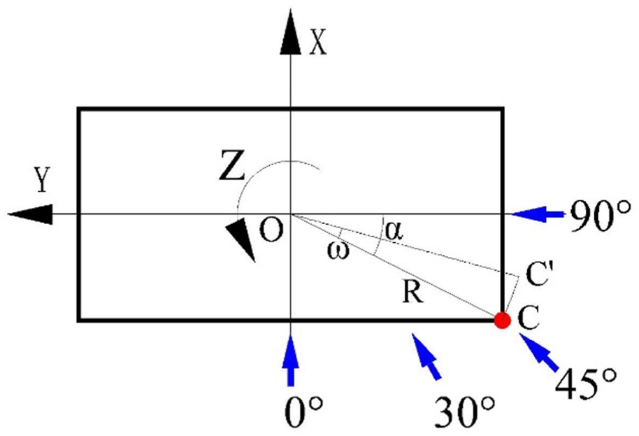

   **图 1** 建筑主轴与风向。

   图内文字：X、Y 为平面内主轴，Z 为转动轴；O 为中心点，C 与 C′ 分别表示变形前后的角点，风向标出 0°、30°、45°、90°。

其中，C 为建筑顶部所关注的角点；C′ 为风荷载作用下变形后的 C 点位置； :math:`\alpha` 为 CO 连线与 Y 轴的夹角； :math:`R` 为楼板角点 C 与中心点 O 之间的距离； :math:`\omega` 为楼板在风荷载作用下的角位移响应。

.. _yang2025-eq-22:

.. math::

   \begin{aligned}
   X_C(t)&=X_O(t)+2R\cos\left(\alpha-\frac{\omega(t)}{2}\right)\sin\left(\frac{\omega(t)}{2}\right),\\
   Y_C(t)&=Y_O(t)-2R\sin\left(\alpha-\frac{\omega(t)}{2}\right)\sin\left(\frac{\omega(t)}{2}\right).
   \end{aligned} \qquad (22)

其中， :math:`\omega(t)` 表示楼板角位移响应时程。

对 :ref:`式（22） <yang2025-eq-22>` 求二阶导数，可以得到楼板角点加速度响应时程 :math:`\ddot X_C(t)` 、 :math:`\ddot Y_C(t)` 与楼板中心加速度响应时程 :math:`\ddot X_O(t)` 、 :math:`\ddot Y_O(t)` 之间的关系：

.. _yang2025-eq-23:

.. math::

   \begin{aligned}
   \ddot X_C(t)&=\ddot X_O(t)+R\left[\ddot\omega(t)\cos(\alpha-\omega(t))+\dot\omega^2(t)\sin(\alpha-\omega(t))\right],\\
   \ddot Y_C(t)&=\ddot Y_O(t)+R\left[\ddot\omega(t)\sin(\alpha-\omega(t))+\dot\omega^2(t)\cos(\alpha-\omega(t))\right].
   \end{aligned} \qquad (23)

其中， :math:`\dot\omega(t)` 表示楼板角速度响应时程， :math:`\ddot\omega(t)` 表示角加速度响应时程。

.. note::

   式（23）第二行角加速度项的正号按原文保留；直接对式（22）第二行求导会出现符号一致性疑问。本文译文不替作者改写原式，工程复用前应核验坐标正方向与该项符号。

为分析现有二维矢量极值计算方法用于高层建筑风致响应分析时的准确性，有必要简要介绍这些方法。

为简便起见，楼板中心与角点在两个相互垂直的平动主轴方向上的响应时程均记作 :math:`X(t)` 和 :math:`Y(t)` 。这两个分量响应时程的组合构成二维矢量响应时程，也称合成响应时程，记作 :math:`A(t)` ：

.. _yang2025-eq-24:

.. math::

   A(t)=\sqrt{X^2(t)+Y^2(t)} \qquad (24)

通常认为，当建筑一维主轴方向响应 :math:`X(t)` 和 :math:`Y(t)` 服从高斯分布时， :math:`A(t)` 应服从广义 Rayleigh 分布：

.. _yang2025-eq-25:

.. math::

   f(a)=\frac{a}{\sigma_X\sigma_Y}\exp\left[-\frac{a^2}{2}
   \left(\frac{1}{\sigma_X^2}+\frac{1}{\sigma_Y^2}\right)\right]
   I_0\left(\frac{a^2}{2}\left|\frac{1}{\sigma_X^2}-\frac{1}{\sigma_Y^2}\right|\right),\qquad a\ge0 \qquad (25)

.. math::

   I_0(x)=\sum_{k=0}^{\infty}\frac{1}{k!\Gamma(k+1)}\left(\frac{x}{2}\right)^{2k}.

其中， :math:`I_0` 为第一类零阶修正 Bessel 函数； :math:`\Gamma(k+1)` 为 Gamma 函数，对非负整数 :math:`k` ，有 :math:`\Gamma(k+1)=k!` 。

广义 Rayleigh 分布的极值一般服从广义极值分布（GEVD）。同时，为便于计算，也可以假定高斯分布的极值服从广义极值分布，尽管其实际服从 Gumbel 分布：

.. _yang2025-eq-26:

.. math::

   F(a;\mu,\sigma,\xi)=\exp\left[-\left(1+\xi\frac{a-\mu}{\sigma}\right)^{-1/\xi}\right],
   \qquad 1+\xi\frac{a-\mu}{\sigma}>0 \qquad (26)

.. _yang2025-eq-27:

.. math::

   E(a)=\mu+\frac{\sigma}{\xi}\left[1-\Gamma(1-\xi)\right] \qquad (27)

其中， :math:`\mu` 为位置参数； :math:`\sigma` 为尺度参数； :math:`\xi` 为形状参数； :math:`E(a)` 为随机变量 :math:`a` 的数学期望。

通过上述分析，可以得到二维矢量响应极值的累积分布函数。此时，由这一累积分布函数对应的分布求得的均值，就是合成响应 :math:`A(t)` 的平均极值 :math:`\hat A` 。

结构设计关心合成响应 :math:`A(t)` 的平均极值 :math:`\hat A` 。已有研究采用多种方法计算结构合成响应极值。需要注意，本节关注两个主轴分量的脉动响应过程，其中分量响应过程 :math:`Y(t)` 占主导，并满足 :math:`\sigma_X\le\sigma_Y` 。

.. note::

   式（25）至式（27）逐式保留出版版。式（25）未显式包含 :math:`\rho_{XY}` ，且令两标准差相等时，其指数系数与归一化需要核验；不能仅凭“两个分量为高斯过程”就将该式推广到任意相关性。式（27）的 :math:`1-\Gamma(1-\xi)` 与式（26）所用参数化下常见的均值表达式符号不同，原文也未在此给出均值存在条件。这里不将原文公式替换为另行推导的公式，也不声称已经复算其模拟结果。

2.2.1 平方和开方法（SRSS）
^^^^^^^^^^^^^^^^^^^^^^^^^^

单一主轴方向的响应极值可由 :ref:`式（19） <yang2025-eq-19>` 确定。对两个平动主轴方向响应组成的合成响应，假定不考虑两个主轴方向响应分量之间的相关性，则可直接采用平方和开方（SRSS）法得到合成响应极值。具体表达式如下：

.. _yang2025-eq-28:

.. math::

   \hat A=\sqrt{g_X^2\sigma_X^2+g_Y^2\sigma_Y^2} \qquad (28)

其中，Davenport 峰值因子 :math:`g_X` 和 :math:`g_Y` 可由 :ref:`式（19） <yang2025-eq-19>` 确定。

2.2.2 经验折减系数法（ERF）
^^^^^^^^^^^^^^^^^^^^^^^^^^^^

不考虑建筑两个主轴方向响应分量之间的相关性，会导致结果偏大。为更好地估计合成响应极值，通常采用折减系数降低这种保守估计的影响。Isyumov N 等 :ref:`[40] <yang2025-ref-40>` 根据试验与经验提出经验折减系数（ERF）法，即将经验折减系数与 SRSS 法计算值相乘，得到随机风荷载作用下高层建筑合成响应极值。具体表达式如下：

.. _yang2025-eq-29:

.. math::

   \hat A=\varphi\sqrt{g_X^2\sigma_X^2+g_Y^2\sigma_Y^2} \qquad (29)

其中， :math:`\varphi` 为经验折减系数，取值范围为 0.7～1.0，由下式确定： :math:`\varphi=0.7+0.3\sqrt{1-(\sigma_X/\sigma_Y)^2}` ， :math:`\sigma_X<\sigma_Y` 。

2.2.3 相关性依赖组合法（CDC）
^^^^^^^^^^^^^^^^^^^^^^^^^^^^^^

Chen X 等 :ref:`[41] <yang2025-ref-41>` 认为，ERF 法同样没有考虑主轴方向响应之间的相关性，也没有考虑扭转响应的贡献。然而，这些因素对于具有复杂几何外形和三维（3D）耦合动力特性的高层建筑十分重要。为解决这一问题，并评价考虑高层建筑风致响应时程极值相关性的影响，Chen X 等 :ref:`[41] <yang2025-ref-41>` 提出 CDC 法。具体表达式如下：

.. _yang2025-eq-30:

.. math::

   \hat A=\max\{A_1,A_2\} \qquad (30)

.. _yang2025-eq-31:

.. math::

   A_1=\sqrt{\frac{g_X^2\sigma_X^2+g_Y^2\sigma_Y^2}{2}
   +\sqrt{\frac{(g_X^2\sigma_X^2-g_Y^2\sigma_Y^2)^2}{4}
   +\rho_{XY}^2(g_X^2\sigma_X^2)(g_Y^2\sigma_Y^2)}} \qquad (31)

.. _yang2025-eq-32:

.. math::

   A_2=0.8\sqrt{g_X^2\sigma_X^2+g_Y^2\sigma_Y^2} \qquad (32)

其中， :math:`\rho_{XY}` 为 :math:`X(t)` 与 :math:`Y(t)` 之间的相关系数； :ref:`式（32） <yang2025-eq-32>` 中的经验折减参数为 0.8。

2.2.4 旋转主轴法（RPA）
^^^^^^^^^^^^^^^^^^^^^^^^

获得建筑主轴方向风致响应时程 :math:`X(t)` 和 :math:`Y(t)` 后，可通过坐标变换，把二维非主轴问题简化为一维问题。在 Yan Yalin :ref:`[42] <yang2025-ref-42>` 研究基础上，本文给出 RPA 法更明确的数学推导过程。

:math:`X(t)` 和 :math:`Y(t)` 为零均值高斯随机过程。将坐标主轴旋转角度 :math:`\theta` ，则新坐标系中沿非主轴方向、记为 :math:`A'` 方向的响应时程可表示为：

.. _yang2025-eq-33:

.. math::

   A'(t)=X(t)\cos\theta+Y(t)\sin\theta \qquad (33)

:math:`A'(t)` 同样为零均值平稳高斯随机过程，其平均极值也可由 :ref:`式（27） <yang2025-eq-27>` 计算。同时，通过计算方差并利用极值理论，可以确定 :math:`A'(t)` 的极值：

.. _yang2025-eq-34:

.. math::

   \sigma_{A'}^2=\sigma_X^2\cos^2\theta+\sigma_Y^2\sin^2\theta
   +2\cos\theta\sin\theta\rho_{XY}\sigma_X\sigma_Y \qquad (34)

.. _yang2025-eq-35:

.. math::

   \hat A'=g_{A'}\sigma_{A'} \qquad (35)

其中， :math:`g_{A'}` 为 :math:`A'(t)` 的峰值因子， :math:`\sigma_{A'}` 为 :math:`A'(t)` 的标准差。

由于主轴方向响应的 :math:`\sigma_X` 、 :math:`\sigma_Y` 及其相关系数 :math:`\rho_{XY}` 已知，非主轴 :math:`A'` 方向响应极值是旋转角 :math:`\theta` 的函数。对 :math:`\theta` 求导，可得到 :math:`\hat A'` 的极值：

.. _yang2025-eq-36:

.. math::

   \begin{aligned}
   \frac{d\hat A'}{d\theta}&=g_{A'}^2\left[(\sigma_Y^2-\sigma_X^2)\sin2\theta
   +2\rho_{XY}\sigma_X\sigma_Y\cos2\theta\right]=0,\\
   \tan2\theta&=\frac{2\rho_{XY}\sigma_X\sigma_Y}{\sigma_X^2-\sigma_Y^2},\qquad
   \theta=\frac12\arctan\left(\frac{2\rho_{XY}\sigma_X\sigma_Y}{\sigma_X^2-\sigma_Y^2}\right).
   \end{aligned} \qquad (36)

由于 :math:`\hat A'(\theta)=\hat A'(\theta+\pi)` ，该函数以 :math:`\pi` 为周期，最大值与最小值相隔半个周期，即 :math:`\pi/2` 。此时，检验 :math:`\hat A(\theta)` 的二阶导数：若二阶导数小于零， :math:`\hat A(\theta)` 取得最大值，记作 :math:`\hat A(\theta_{\max})` ；若二阶导数大于零，则取得最小值，记作 :math:`\hat A(\theta_{\min})` 。

.. note::

   式（36）左端为 :math:`\hat A'` 的导数，右端却带 :math:`g_{A'}^2` ，按原文保留。由式（35）推导时，峰值因子是否随角度变化、求导对象是否为极值的平方，以及反正切分支的选择，都需要额外核验。原文段末也由 :math:`\hat A'` 改记为 :math:`\hat A` ，译文保留这一记号变化。

2.2.5 组合峰值因子法（CPF）
^^^^^^^^^^^^^^^^^^^^^^^^^^^^

当一个随机二维矢量的两个分量服从相互独立、零均值且标准差相等的高斯分布时，该二维矢量的模服从 Rayleigh 分布。基于这一概念，Huang M 等 :ref:`[29] <yang2025-ref-29>` 假定两个主轴分量 :math:`X(t)` 和 :math:`Y(t)` 也服从相互独立的零均值高斯分布，并引入简化的合成响应随机过程 :math:`\tilde A(t)` 。此时， :math:`\tilde A(t)` 服从 Rayleigh 分布，其峰值可通过 Gamma 峰值因子 :math:`g_G` 计算：

.. _yang2025-eq-37:

.. math::

   \tilde A(t)=\sqrt{\left(\frac{X(t)}{\sigma_X}\right)^2+\left(\frac{Y(t)}{\sigma_Y}\right)^2} \qquad (37)

.. _yang2025-eq-38:

.. math::

   g_G=\mu_{\tilde A_n}=\sqrt{2\ln s+2\ln\ln s+
   \frac{2\gamma\sqrt{2\ln s}}{\ln s+\ln\ln s}+1} \qquad (38)

.. _yang2025-eq-39:

.. math::

   s=2\upsilon_0^+T \qquad (39)

其中， :math:`\tilde A(t)` 服从标准差为 1 的 Rayleigh 分布； :math:`g_G` 为 :math:`\tilde A(t)` 的 Gamma 峰值因子； :math:`\upsilon_0^+` 为 :math:`\tilde A(t)` 的超越率； :math:`s` 为时间 :math:`T` 内穿越零界限的次数。

将上式代入 :ref:`式（24） <yang2025-eq-24>`，则 :math:`A(t)` 的极值 :math:`\hat A` 可表示如下：

.. _yang2025-eq-40:

.. math::

   A^2(t)=\tilde A^2(t)\sigma_X^2+Y^2(t)\left(1-\frac{\sigma_X^2}{\sigma_Y^2}\right) \qquad (40)

.. _yang2025-eq-41:

.. math::

   \hat A=\sqrt{(g_G^2-g_Y^2)\sigma_X^2+g_Y^2\sigma_Y^2} \qquad (41)

本文将这种计算合成响应极值的方法称为 CPF 法。CPF 法假定 :math:`\tilde A(t)` 与 :math:`Y(t)` 完全相关，意味着两者同时达到极值；但这一假定可能导致计算结果略偏保守。

由于上述五种二维矢量响应极值计算方法的理论基础与基本假定不同，其结果有明显差异。下一节通过随机模拟信号以及承受长时程风荷载的高层建筑算例，比较上述五种二维矢量响应极值计算方法的准确性。

.. note::

   本节“Rayleigh 分布的标准差为 1”与“穿越零界限”的表述均来自原文。对式（37）所定义的非负模长过程，其标准化尺度及穿越率定义须另行核验；不能将该表述当作一般 Rayleigh 分布的统计恒等式。

3 算例研究
----------

3.1 二维矢量响应极值合成方法比较
~~~~~~~~~~~~~~~~~~~~~~~~~~~~~~~~

上一节讨论了风致二维矢量响应极值合成方法的理论。以下采用两个相互垂直的标准平稳高斯随机信号 :math:`X(t)` 和 :math:`Y(t)` 模拟建筑平动分量响应，随后根据 :ref:`式（24） <yang2025-eq-24>` 生成二维矢量响应时程，并利用 :ref:`式（27） <yang2025-eq-27>` 计算其极值。最后，将第 2.2 节极值合成方法得到的二维矢量响应极值与 :ref:`式（27） <yang2025-eq-27>` 的结果比较，验证各种方法的准确性。

采用开源软件 Python 3.12 生成两个平稳标准高斯随机信号 :math:`X(t)` 和 :math:`Y(t)` 。采样频率设为 10 Hz，采样时长为 10 min，共得到 6000 个采样点。生成的随机信号及其极值如 :ref:`图 2 <yang2025-fig-2>` 所示。分量 :math:`X(t)` 和 :math:`Y(t)` 的极值分别为 4.409 和 3.516，相关系数为 :math:`\rho_{XY}=0.2` ，合成响应 :math:`A(t)` 的极值为 4.651。图中还用红色虚线表示 :math:`X(t)` 、 :math:`Y(t)` 的 Davenport 峰值因子和 :math:`A(t)` 的 Gamma 峰值因子。

.. _yang2025-fig-2:

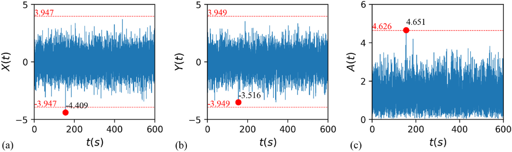

   **图 2** 随机模拟信号时程与极值（ :math:`\rho=0.2` ， :math:`\sigma_X=\sigma_Y=1`）。

   图内文字：（a）X(t)；（b）Y(t)；（c）合成响应 A(t)。横轴为时间 t（s），红色虚线为相应峰值因子，红点为图中标记的极值。

采用上述参数，对 :math:`X(t)` 和 :math:`Y(t)` 进行 1000 次模拟。 :ref:`图 3 <yang2025-fig-3>` 给出第 2.2 节各种方法计算的二维矢量响应极值均值，以及它们相对于合成响应真实极值的百分比误差。正值表示结果大于真实极值，负值表示结果较小。图中红色虚线表示 1000 次模拟所得 :math:`A(t)` 真实极值的均值。由图可见，SRSS 法与合成响应 :math:`A(t)` 真实极值的偏差最大，高估约 25.76%，这是由于 SRSS 法没有考虑各分量响应之间的相关性。ERF 法虽然对 SRSS 法作了折减，但仍未考虑分量响应相关性，而且折减程度过大，导致最终极值偏低；在这组 1000 次随机模拟中，结果低估 7.18%。CPF 法假定结构合成响应极值与较大分量响应极值同时出现，导致极值高估，结果偏大 4.40%。RPA 法低估约 2.54%。CDC 法最准确，偏差最小，仅为 0.61%。上述分析只涉及 :math:`\rho_{XY}=0.2` 且分量响应标准差比 :math:`\sigma_X/\sigma_Y=1` 时二维矢量响应极值计算方法的精度，表明 CDC 法最准确，RPA 法次之。以下进一步评价不同 :math:`\rho_{XY}` 与 :math:`\sigma_X/\sigma_Y` 条件下第 2.2 节各方法的准确性。

.. _yang2025-fig-3:

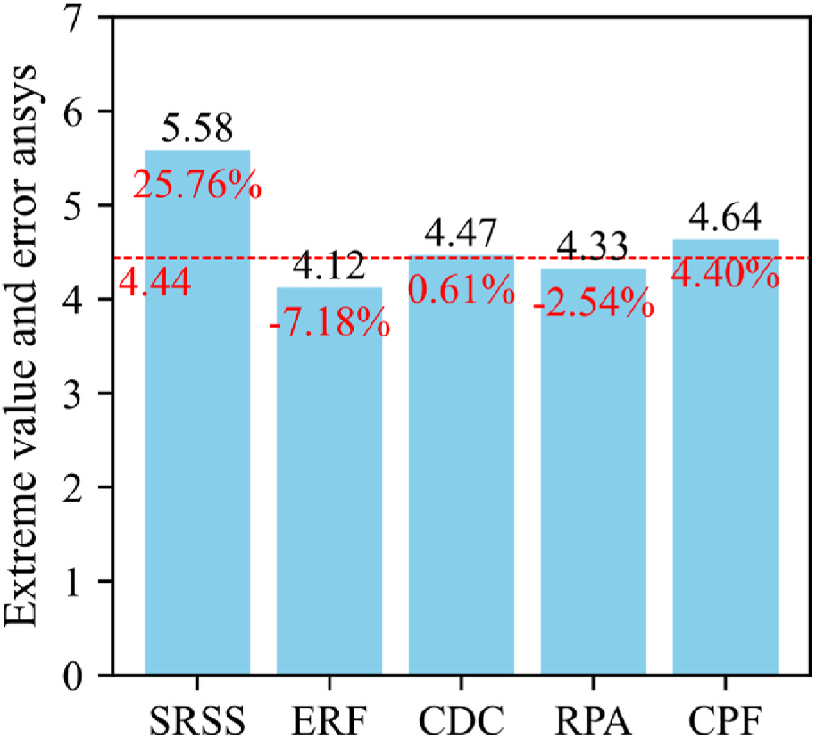

   **图 3** 二维矢量响应极值合成结果与误差。

   图内文字：横轴为 SRSS、ERF、CDC、RPA、CPF 方法；柱顶黑字为极值估计，红字为相对误差，红色虚线为真实极值均值 4.44。

将 :math:`X(t)` 与 :math:`Y(t)` 之间的相关系数 :math:`\rho` 设为 [0.01, 0.2, 0.4, 0.6, 0.8, 0.99]；令 :math:`Y(t)` 的标准差 :math:`\sigma_Y=1` ， :math:`X(t)` 的标准差 :math:`\sigma_X` 取 [0.01, 0.2, 0.4, 0.6, 0.8, 0.99]，其余参数不变。对每种工况进行 1000 次模拟，得到不同条件下合成响应 :math:`A(t)` 的平均极值，以及第 2.2 节各种二维矢量极值方法的估计值，结果见 :ref:`图 4 <yang2025-fig-4>`。由图可见，SRSS、ERF 和 CPF 法的结果与 :math:`\sigma_X/\sigma_Y` 有关，而与 :math:`\rho_{XY}` 无关，这显然不合理。CDC 和 RPA 法能同时考虑 :math:`\sigma_X/\sigma_Y` 与 :math:`\rho_{XY}` ，因而结果更合理。 :ref:`图 5 <yang2025-fig-5>` 给出各种二维矢量极值合成方法与 :math:`A(t)` 真实极值之间的误差相对于真实极值的比值。由图可见，SRSS 法最大偏差出现在 :math:`\rho_{XY}=0.0` 、 :math:`\sigma_X/\sigma_Y=0.0` 时，最大为 42%；ERF 法最大偏差出现在 :math:`\rho_{XY}=1.0` 、 :math:`\sigma_X/\sigma_Y=1.0` 时，最大为 25%；CPF 法最大偏差出现在 :math:`\rho_{XY}=1.0` 、 :math:`\sigma_X/\sigma_Y=1.0` 时，最大为 16%；RPA 法最大偏差出现在 :math:`\rho_{XY}=0.0` 、 :math:`\sigma_X/\sigma_Y=1.0` 时，最大为 7%；CDC 法最大偏差出现在 :math:`\rho_{XY}=0.0` 、 :math:`\sigma_X/\sigma_Y=1.0` 时，最大为 4%。综上，第 2.2 节各种二维矢量响应极值统计方法中，CDC 法最准确，RPA 法次之；CPF 与 ERF 法不考虑分量响应相关性，偏差较大。因此，建议实际计算高层建筑二维矢量响应极值时采用 CDC 法。

.. _yang2025-fig-4:

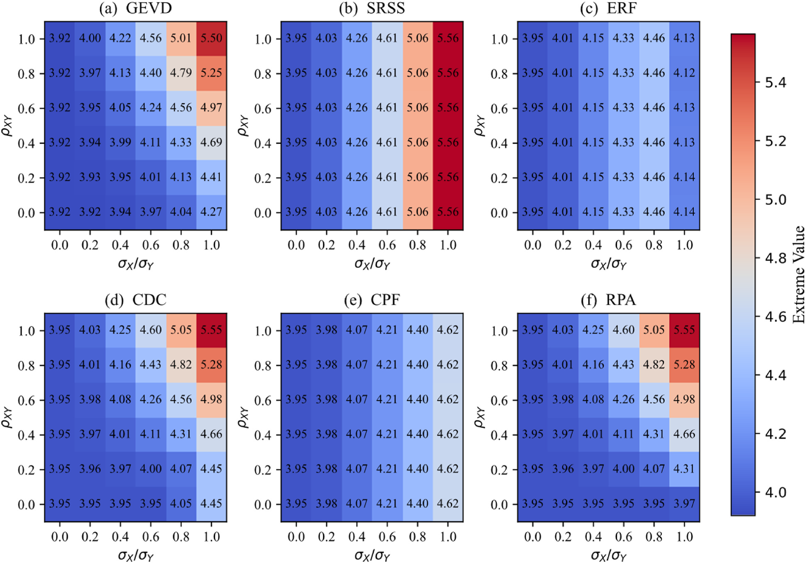

   **图 4** 不同标准差比与相关系数下的二维矢量响应极值。

   图内文字：（a）GEVD；（b）SRSS；（c）ERF；（d）CDC；（e）CPF；（f）RPA。各图横轴为 :math:`\sigma_X/\sigma_Y` ，纵轴为 :math:`\rho_{XY}` ，色标为极值。

.. _yang2025-fig-5:

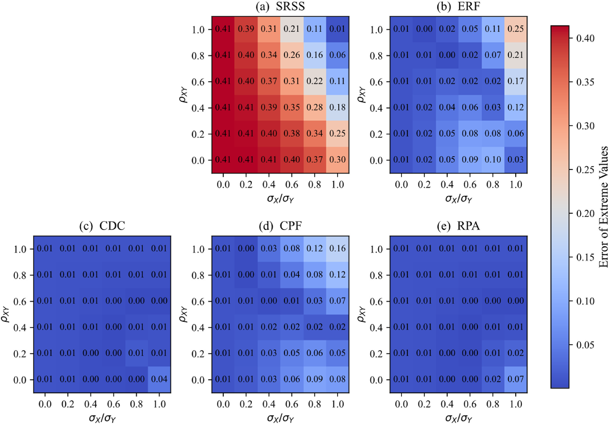

   **图 5** 不同标准差比与相关系数下的二维矢量响应极值误差。

   图内文字：（a）SRSS；（b）ERF；（c）CDC；（d）CPF；（e）RPA。横轴为 :math:`\sigma_X/\sigma_Y` ，纵轴为 :math:`\rho_{XY}` ，格内数字及右侧色标为极值相对误差。

.. note::

   上段保留作者报告的参数与最大偏差。模拟参数端点写为 0.01、0.99，图 4、图 5 的轴刻度和正文极端工况写为 0.0、1.0。图 5 的横轴为 :math:`\sigma_X/\sigma_Y` ，纵轴为 :math:`\rho_{XY}` ；SRSS 最大色块数字为 0.41，正文称约 42%。图 5 的 SRSS 误差排列与图 4 对应数值按同一坐标直接计算还存在不一致，例如图 4 左下角 GEVD 为 3.92、SRSS 为 3.95，而图 5 相应位置为 0.41。因此不能把这些误差图视为已独立复算的精确上界。SRSS、ERF、CPF 预测公式不显式包含相关系数，并不意味着它们相对于真实极值的误差不随相关系数变化。图 2 标记的分量时程极值为负值 −4.409、−3.516，正文使用其绝对值，二者口径在此一并保留。

3.2 高层建筑二维矢量响应极值统计
~~~~~~~~~~~~~~~~~~~~~~~~~~~~~~~~

上一节考察了建筑风致振动二维矢量响应极值的计算方法，以下转而分析长时程风荷载作用下的高层建筑模型，以评价各统计方法计算二维矢量响应极值的准确性。

3.2.1 模型与荷载
^^^^^^^^^^^^^^^^

建筑风向与坐标轴见 :ref:`图 1 <yang2025-fig-1>`。本文采用的风荷载数据来自哈尔滨工业大学（深圳）风环境工程技术实验室，模型具体信息见 :ref:`表 1 <yang2025-table-1>`。建筑三维视图、风荷载样本数据和计算模型见 :ref:`图 6 <yang2025-fig-6>`、 :ref:`图 7 <yang2025-fig-7>`。

.. _yang2025-eq-42:

.. math::

   U_p=1.705U_0\left(\frac{z_G}{z}\right)^{-\alpha} \qquad (42)

.. _yang2025-eq-43:

.. math::

   f_p=\frac{f_mU_p}{\lambda U_m}=\frac{\gamma f_m}{\lambda} \qquad (43)

其中， :math:`U_0` 为基本风速，可由基本风压换算得到； :math:`z` 为高度； :math:`z_G` 为参考高度； :math:`\alpha` 为风剖面幂律指数，与场地类别有关； :math:`f_p` 为结构原型采样频率； :math:`\lambda` 为几何缩尺比； :math:`f_m` 为试验采样频率； :math:`U_p` 为原型参考高度处风速； :math:`U_m` 为试验参考高度处风速； :math:`\gamma` 为原型参考高度风速与模型参考高度风速之比。

.. _yang2025-table-1:

.. list-table:: 表 1 风洞试验信息
   :header-rows: 1
   :widths: 58 42

   * - 属性
     - 数值
   * - 实际尺寸 :math:`B\times D\times H` （m）
     - :math:`52.40\times29.40\times214.40`
   * - 试验地貌类型
     - :math:`\alpha=0.15`
   * - 几何缩尺比
     - 1:200
   * - 试验采样频率（Hz）
     - 330
   * - 采样时间（s）
     - 400
   * - 模型参考高度
     - 建筑顶部
   * - 10 年重现期风速（m/s）
     - 23.6643
   * - 10 年重现期风速持续时间（min）
     - 268
   * - 50 年重现期风速（m/s）
     - 30.9839
   * - 50 年重现期风速持续时间（min）
     - 354

表下注文：原型参考高度处的风速可由 :ref:`式（42） <yang2025-eq-42>` 计算。根据相似理论，可得到模型与原型之间的采样频率比例关系，进而确定高层建筑结构原型的采样频率。

.. note::

   表 1 的 1:200、268 min、354 min 与式（43）原样保留；原文未在此进一步明确 :math:`\lambda` 代入时取模型/原型还是原型/模型之比，也未解释两种持续时间与速度比例的对应。复用采样换算时需核验，不能直接视为已验证的一致数值。

.. _yang2025-fig-6:

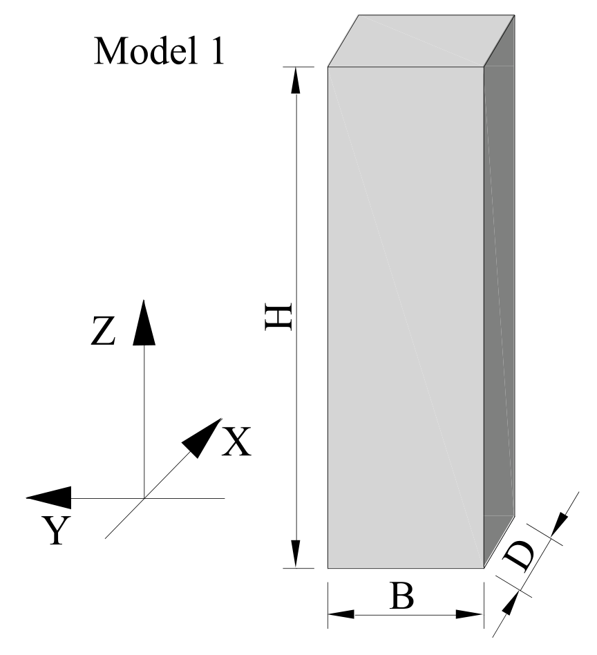

   **图 6** 建筑三维视图。

   图内文字：Model 1 为模型 1；B、D、H 分别表示宽度、深度与高度，X、Y、Z 为坐标轴。

.. _yang2025-fig-7:

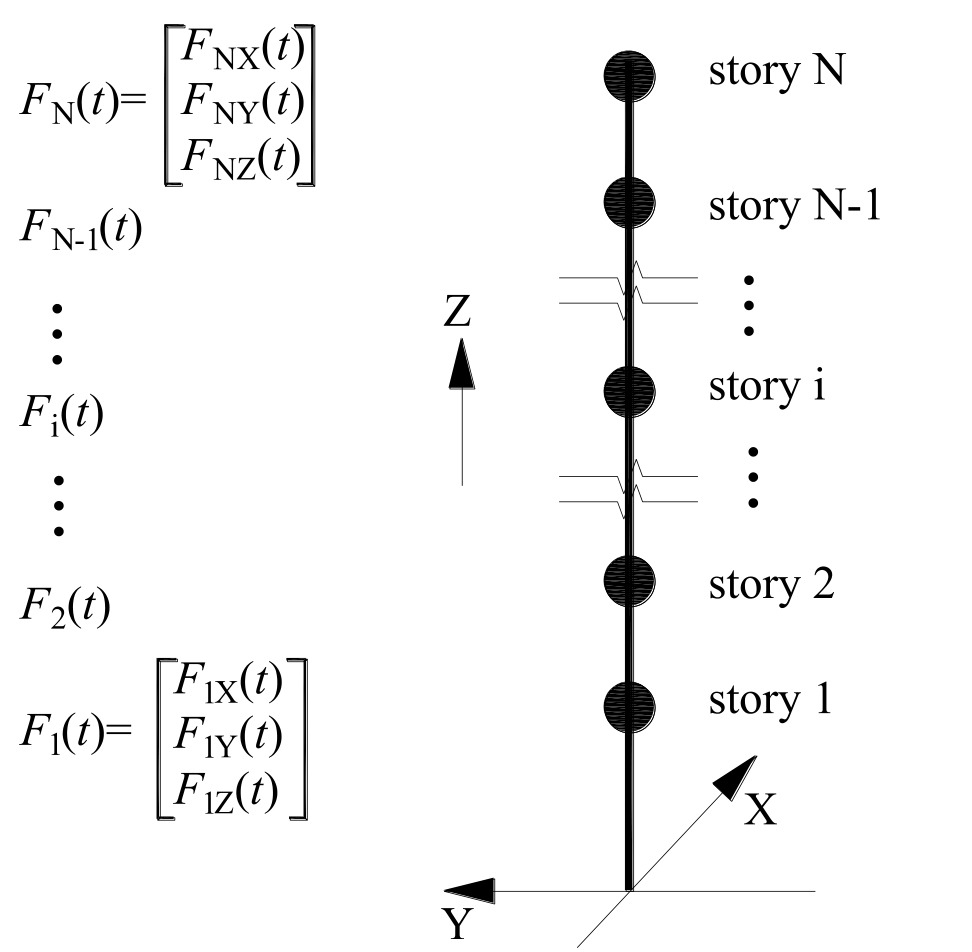

   **图 7** 计算模型与风荷载。

   图内文字：story 表示楼层，保留第 N、N−1、i、2、1 层；F 为相应楼层的荷载向量，图中列出 X、Y、Z 分量与整体坐标方向。

3.2.2 响应分析
^^^^^^^^^^^^^^

本节采用上述建筑模型与风荷载评价建筑气动响应，重点关注屋面角点的位移与加速度。位移响应计算采用 50 年重现期风速和 2% 阻尼比，加速度响应计算采用 10 年重现期风速和 1.5% 阻尼比 :ref:`[29] <yang2025-ref-29>` :ref:`[46] <yang2025-ref-46>`。考虑结构前 30 阶振型。确定结构模型和相应风荷载后，采用改进的时域精细积分（PI）法计算顶层楼板角点风致响应时程。

:ref:`图 8 <yang2025-fig-8>` 和 :ref:`图 9 <yang2025-fig-9>` 分别给出 0°、90° 风向下屋面角点位移响应云图，以及各一维主轴方向位移响应功率谱密度图。从位移云图可见，不同风向下建筑位移的主要响应均为横风向响应；此外，各方向功率谱的峰值频率均接近结构自振频率，验证了风致振动响应分析的准确性。

.. _yang2025-fig-8:

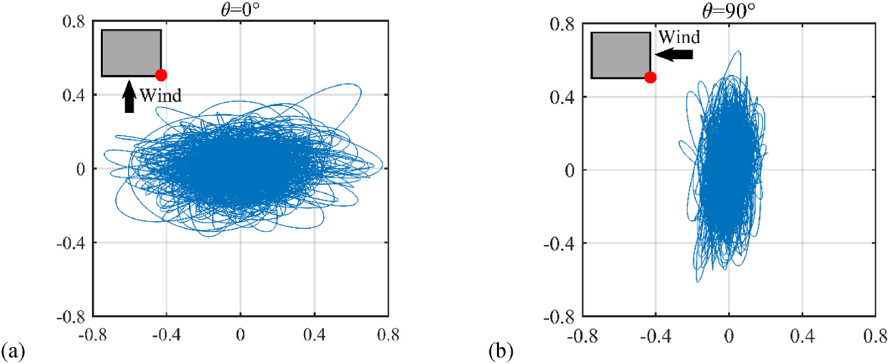

   **图 8** 0° 与 90° 风向下顶部角点位移响应。

   图内文字：（a）0°；（b）90°。Wind 为来风，红点表示所分析角点，蓝线表示平面位移响应轨迹。

.. _yang2025-fig-9:

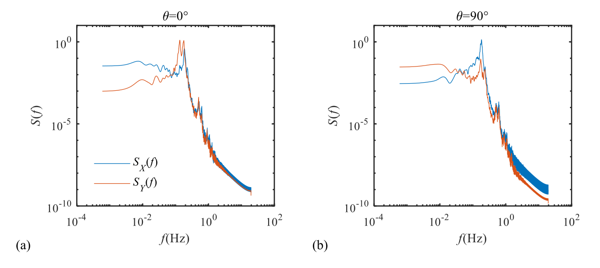

   **图 9** 0° 与 90° 风向下顶部角点位移功率谱密度。

   图内文字：（a）0°；（b）90°。横轴 f（Hz）为频率，纵轴 S(f) 为功率谱密度；蓝线、橙线分别为 X、Y 方向。

:ref:`图 10 <yang2025-fig-10>` 和 :ref:`图 11 <yang2025-fig-11>` 分别给出 0°、90° 风向下建筑顶层角点加速度响应云图，以及各一维主轴方向加速度响应功率谱。从加速度云图也可见，不同风向下建筑加速度的主要响应均为横风向响应。高阶振型对加速度响应的贡献显著大于对位移响应的贡献。因此，计算加速度响应时，应尽可能多地考虑结构振型。为研究参与振型数量对建筑风致响应的影响，下一节比较分析不同振型数量下的风致响应结果。

.. _yang2025-fig-10:

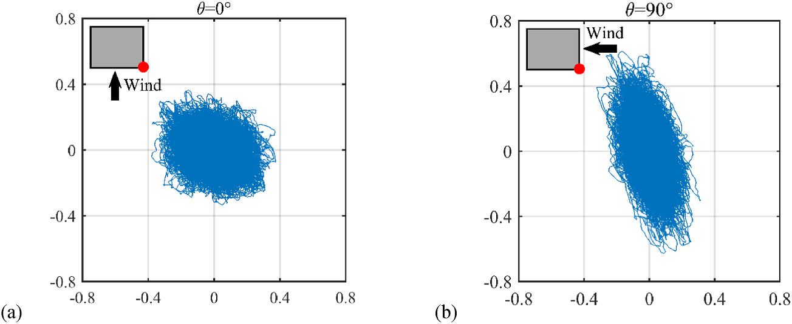

   **图 10** 0° 与 90° 风向下顶部角点加速度响应。

   图内文字：（a）0°；（b）90°。Wind 为来风，红点表示所分析角点，蓝线表示平面加速度响应轨迹。

.. _yang2025-fig-11:

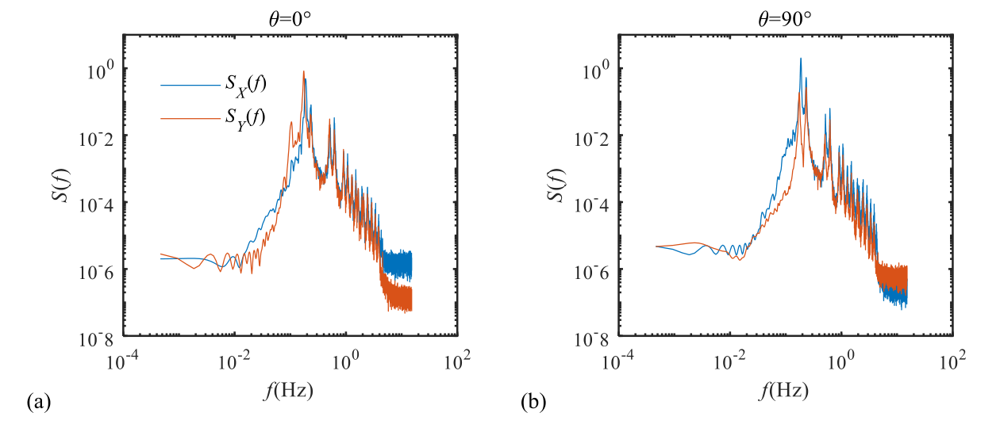

   **图 11** 0° 与 90° 风向下顶部角点加速度功率谱密度。

   图内文字：（a）0°；（b）90°。横轴 f（Hz）为频率，纵轴 S(f) 为功率谱密度；蓝线、橙线分别为 X、Y 方向。

3.2.3 高阶振型对风致响应的影响
^^^^^^^^^^^^^^^^^^^^^^^^^^^^^^

为降低高层建筑风致响应研究的计算成本，分析时通常只考虑前几阶振型 :ref:`[47] <yang2025-ref-47>`。然而，上述研究表明，高阶振型对加速度响应有显著贡献，因此在加速度计算中排除这些振型会引入误差 :ref:`[12] <yang2025-ref-12>`。为研究高阶振型对建筑顶部角点响应的影响，本节以 0° 风向工况为例开展分析。

为明确每阶振型对最终计算结果的影响，首先采用 SRSS 法获得建筑总风致振动响应极值，再定义各阶振型权重系数 :math:`\rho_i` ，表示第 :math:`i` 阶振型对计算结果的相对重要性。同时定义累积权重系数 :math:`e_k` ，表示前 :math:`k` 阶振型对计算结果的累积贡献。具体表达式如下：

.. _yang2025-eq-44:

.. math::

   \hat r_{\mathrm{total}}=\sqrt{\sum_{i=1}^{N}\hat r_i^2} \qquad (44)

.. _yang2025-eq-45:

.. math::

   \rho_i=\frac{\hat r_i^2}{\hat r_{\mathrm{total}}} \qquad (45)

.. _yang2025-eq-46:

.. math::

   e_k=\sum_{i=1}^{k}\rho_i \qquad (46)

其中， :math:`\hat r_{\mathrm{total}}` 为建筑风致响应极值； :math:`\hat r_i` 为第 :math:`i` 阶振型得到的响应极值； :math:`N` 为计算考虑的总振型阶数。

.. note::

   式（45）的分母在原文印为 :math:`\hat r_{\mathrm{total}}` ，没有平方；这与无量纲权重及百分数累积贡献的表述存在量纲疑问。译文保留源式，不自行补平方，以下百分数仍作为作者报告的结果引用。

:ref:`图 12 <yang2025-fig-12>` 和 :ref:`图 13 <yang2025-fig-13>` 表明，对于楼板顶部角点位移响应，以考虑前 20 阶振型的结果为参照，前 3 阶振型的累积权重系数达到 99.8%。因此，计算位移响应时，只考虑结构前 3 阶振型的贡献即可将误差控制在 1% 以内。对于楼板顶部角点加速度响应，相对于前 20 阶结果，前 6 阶振型的累积权重系数为 96.7%，前 11 阶为 99.0%。因此，计算加速度响应时不应忽视高阶振型的贡献；例如，在本算例中建议考虑前 11 阶振型。

.. _yang2025-fig-12:

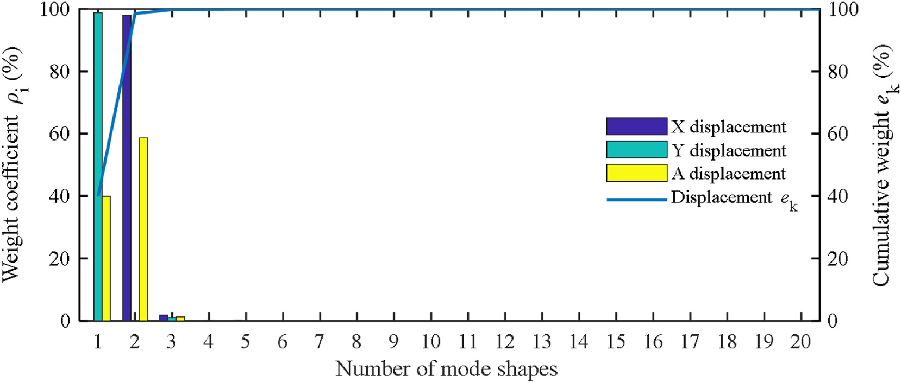

   **图 12** 各阶振型对楼板顶部角点位移贡献的权重系数。

   图内文字：横轴为振型阶数；左轴为权重系数 :math:`\rho_i` （%），右轴为累积权重 :math:`e_k` （%）。紫、青、黄柱分别表示 X、Y 与合成位移，蓝线表示位移累积权重。

.. _yang2025-fig-13:

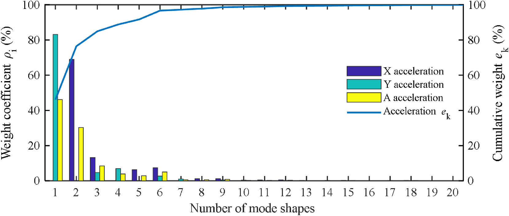

   **图 13** 各阶振型对楼板顶部角点加速度贡献的权重系数。

   图内文字：横轴为振型阶数；左轴为权重系数 :math:`\rho_i` （%），右轴为累积权重 :math:`e_k` （%）。紫、青、黄柱分别表示 X、Y 与合成加速度，蓝线表示加速度累积权重。

3.2.4 二维矢量极值统计
^^^^^^^^^^^^^^^^^^^^^^

研究高层建筑风致二维矢量响应极值时，首先需要确定时域极值的评价准则。按照中国规范，高层建筑风致响应极值定义为 10 min 响应极值。为保证这些极值的准确性，需要对多个 10 min 区间的响应极值取平均。

3.2.4.1 一维主轴响应极值
++++++++++++++++++++++++

采用 PI 法计算建筑各主轴方向的风致响应时程，再计算 10 min 响应极值的平均值，以评价峰值因子的准确性。 :ref:`图 14 <yang2025-fig-14>` 和 :ref:`图 15 <yang2025-fig-15>` 给出不同风向下建筑位移、加速度峰值因子及误差。 :ref:`表 2 <yang2025-table-2>` 列出不同一维主轴响应峰值因子的平均误差。

.. _yang2025-fig-14:

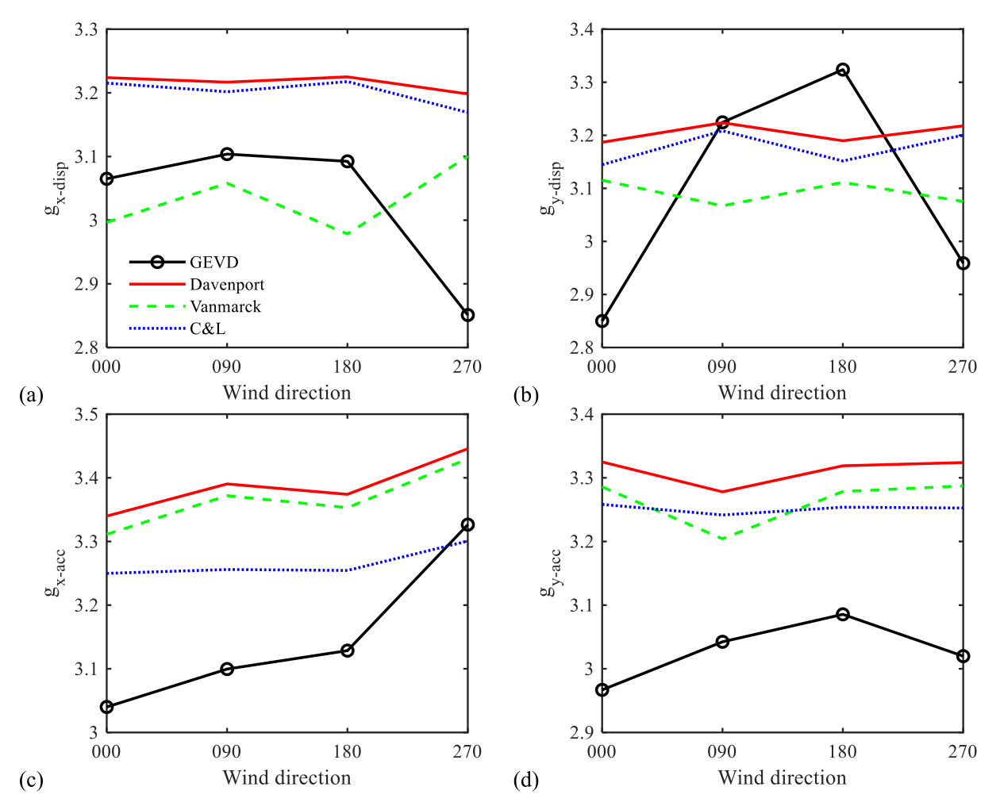

   **图 14** 一维主轴响应峰值因子 g。

   图内文字：（a）X 向位移；（b）Y 向位移；（c）X 向加速度；（d）Y 向加速度。横轴为风向；黑圈线、红实线、绿虚线、蓝点线分别为 GEVD、Davenport、Vanmarcke、C&L。

.. _yang2025-fig-15:

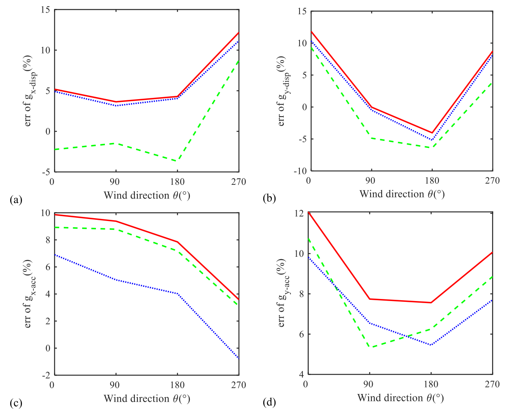

   **图 15** 一维主轴响应峰值因子误差。

   图内文字：（a）X 向位移；（b）Y 向位移；（c）X 向加速度；（d）Y 向加速度。横轴为风向角 θ（°），纵轴为对应峰值因子误差（%）；方法线型与图 14 一致。

.. _yang2025-table-2:

.. list-table:: 表 2 一维主轴响应峰值因子平均误差（%）
   :header-rows: 1
   :widths: 16 14 14 14 14 14 14

   * - 响应
     - X 方向 :math:`g_{\mathrm{Dav}}`
     - X 方向 :math:`g_{\mathrm{Van}}`
     - X 方向 :math:`g_{\mathrm{C\&L}}`
     - Y 方向 :math:`g_{\mathrm{Dav}}`
     - Y 方向 :math:`g_{\mathrm{Van}}`
     - Y 方向 :math:`g_{\mathrm{C\&L}}`
   * - 位移
     - 6.36
     - 3.99
     - 5.86
     - 6.20
     - 6.17
     - 6.09
   * - 加速度
     - 7.67
     - 7.13
     - 4.19
     - 9.35
     - 7.81
     - 7.38

由 :ref:`表 2 <yang2025-table-2>` 可见，C&L 法计算的峰值因子最接近建筑实际峰值因子，偏差最小，尤其是加速度响应。这是因为 Davenport 法能够准确计算宽带过程的峰值因子，而位移响应可视为宽带过程，加速度响应则是典型窄带过程。因此，在本算例中 Davenport 法误差较大，而 C&L 法在峰值因子计算中引入带宽参数，对窄带响应的结果更准确。

.. note::

   上段是原文总体判断，但表 2 的 X 向位移误差以 Vanmarcke 法 3.99% 最小，低于 C&L 法的 5.86%；不能把“C&L 偏差最小”理解为该表所有分量均成立。

3.2.4.2 二维矢量响应极值
++++++++++++++++++++++++

通过 PI 法确定建筑主轴方向风致响应时程。利用 :ref:`式（24） <yang2025-eq-24>` 计算结构风致二维矢量响应，再用 :ref:`式（27） <yang2025-eq-27>` 评价其统计平均极值。以此为准则，评价 SRSS、ERF、CDC、RPA 和 CPF 等方法的准确性，相应结果见 :ref:`图 16 <yang2025-fig-16>`。

.. _yang2025-fig-16:

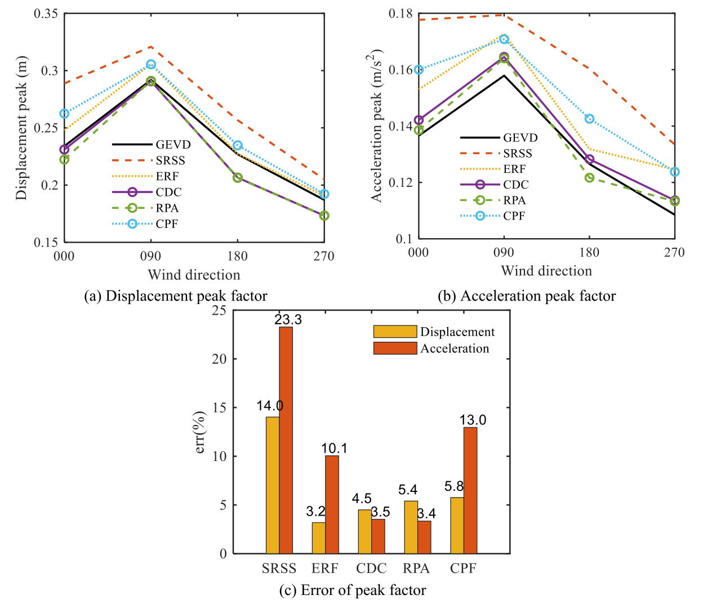

   **图 16** 建筑顶部二维风致矢量响应极值误差。

   图内文字：（a）位移峰值；（b）加速度峰值；（c）峰值误差。前两图横轴为风向，纵轴单位分别为 m、m/s²；柱图黄色为位移、橙色为加速度，纵轴为误差（%）。原图子题称“峰值因子”，但前两图纵轴为带量纲峰值，保留原图并在此区分。

由 :ref:`图 16 <yang2025-fig-16>` 可见，在上述五种风致二维矢量响应极值合成方法中，SRSS 法的结果始终偏大；这是因为 SRSS 法不考虑不同主轴方向响应之间的相关性，与前述理论分析一致。计算位移响应时，ERF 和 CDC 法误差较小，而 RPA 和 CPF 法误差较大，结构设计偏于不安全。计算加速度响应时，CDC 和 RPA 法误差较小，而 ERF 和 CPF 法误差较大。无论位移还是加速度，ERF 法和 CPF 法的结果始终大于 CDC 法和 RPA 法。综合位移与加速度响应分析，CDC 法误差最小，与第 3.1 节分析一致。

.. note::

   原文在“RPA 和 CPF”后笼统写“设计偏于不安全”，但图 16 中 CPF 位移曲线高于 GEVD，不能将这句话作为 CPF 在所有工况都低估的证据。图 16（c）位移误差依次为 SRSS 14.0%、ERF 3.2%、CDC 4.5%、RPA 5.4%、CPF 5.8%，加速度误差为 23.3%、10.1%、3.5%、3.4%、13.0%；CDC 的“最小”是作者综合评价，不代表两个指标分别均为绝对最小。

3.3 宽深比和扭转周期比对二维矢量响应极值的影响
~~~~~~~~~~~~~~~~~~~~~~~~~~~~~~~~~~~~~~~~~~~~~~~~

3.3.1 宽深比
^^^^^^^^^^^^

建筑截面形式多样，其中矩形最常见。截面宽深比是影响矩形建筑风致响应的关键因素，不同宽深比矩形截面建筑的风致响应差异显著 :ref:`[37] <yang2025-ref-37>`。为研究不同宽深比高层建筑在不同风向下的响应极值，并量化主轴方向响应极值与建筑风致二维矢量响应极值之间的差异，本节采用 TPU 风洞试验数据库的风荷载 :ref:`[48] <yang2025-ref-48>`，结合与该数据库相匹配的高层建筑结构模型进行计算分析。

建筑三维模型见 :ref:`图 17 <yang2025-fig-17>`。结构宽度 :math:`B` 分别为 40 m、80 m 和 120 m，深度 :math:`D` 保持 40 m 不变，结构高度 :math:`H` 为 200 m。结构前 3 阶自振周期详见 :ref:`表 3 <yang2025-table-3>`。风洞试验所用坐标轴与风向角定义与 :ref:`图 1 <yang2025-fig-1>` 一致，X 方向为建筑较弱主轴。风速剖面指数 :math:`\alpha=0.25` ，几何缩尺比为 1:400。试验采样频率为 1000 Hz，采样时长为 32.768 s；参考风速取模型顶部风速，数值为 11 m/s。位移与加速度计算的基本风压分别为 0.75 kPa 和 0.45 kPa。原型参考高度风速与采样频率按 :ref:`式（42） <yang2025-eq-42>`、 :ref:`式（43） <yang2025-eq-43>` 计算。在分析不同宽深比与周期比建筑时，采用 PI 法计算结构各主轴方向的风致响应时程及极值，采用 CDC 法确定二维矢量响应方向的极值，从而研究建筑宽深比和周期比对风致二维矢量响应极值的影响。

.. _yang2025-fig-17:

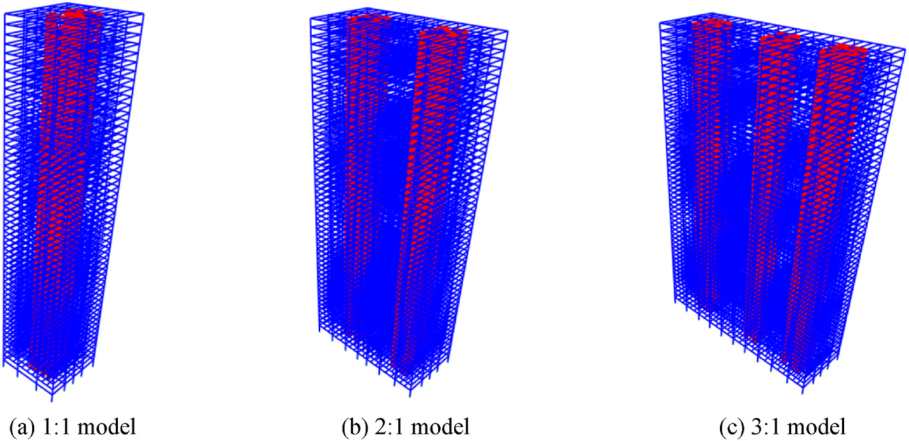

   **图 17** 建筑框架有限元模型。

   图内文字：（a）宽深比 1:1 模型；（b）2:1 模型；（c）3:1 模型。

.. _yang2025-table-3:

.. list-table:: 表 3 不同宽深比模型的自振周期
   :header-rows: 1
   :widths: 10 18 18 18 18 18

   * - 周期（s）
     - B11
     - B21
     - B31
     - B21T
     - B31T
   * - :math:`T_1`
     - :math:`T_Y=5.749`
     - :math:`T_Y=5.890`
     - :math:`T_Y=6.105`
     - :math:`T_Y=6.062`
     - :math:`T_Y=6.137`
   * - :math:`T_2`
     - :math:`T_X=5.317`
     - :math:`T_X=5.367`
     - :math:`T_X=5.445`
     - :math:`T_Z=5.316`
     - :math:`T_Z=5.566`
   * - :math:`T_3`
     - :math:`T_Z=4.552`
     - :math:`T_Z=4.852`
     - :math:`T_Z=4.934`
     - :math:`T_X=5.216`
     - :math:`T_X=5.205`

表注：B11 表示宽深比 1:1 的建筑；B21 表示宽深比 2:1 的建筑；B31 表示宽深比 3:1 的建筑；B21T 表示宽深比 2:1、且扭转周期 :math:`T_Z` 调整至第 2 阶的建筑；B31T 表示宽深比 3:1、且扭转周期 :math:`T_Z` 调整至第 2 阶的建筑。

:ref:`图 18 <yang2025-fig-18>` 展示不同宽深比建筑顶部角点在风荷载下，主轴方向响应与合成响应极值随风向角的变化。由图可见，建筑宽深比为 1:1 时，风致位移和加速度响应极值分别为 0.406 m 和 0.241 m/s²。随宽深比增大，风致二维矢量响应极值显著减小；宽深比为 3:1 时，极值分别降至 0.192 m 和 0.137 m/s²。此外，随宽深比增大，合成响应极值逐渐接近较弱主轴方向响应极值。因此，对于较大宽深比建筑，可以认为结构风致二维矢量响应极值等于主轴方向响应极值。 :ref:`图 18 <yang2025-fig-18>` 还表明，对上述建筑，随着风向角由 0° 增至 90°，各方向风致响应极值先减小后增大。对小宽深比建筑尤其明显，例如宽深比为 1:1 时，45° 风向下的二维矢量响应极值比 0° 时低 62.5%，加速度响应低 45.8%。因此，抗风设计中应尽量避免建筑主轴与当地主导风向一致，以防建筑产生较大的风致响应。

.. _yang2025-fig-18:

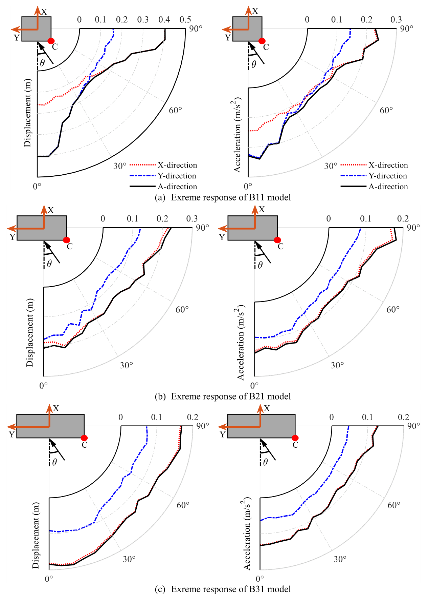

   **图 18** 不同宽深比建筑顶部角点主轴响应与合成响应极值。

   图内文字：六个面板按三行两列排列：（a）B11，（b）B21，（c）B31；各行左图为位移（m），右图为加速度（m/s²）。红点线、蓝点划线、黑实线分别为 X、Y 主轴响应与合成响应 A；角度为风向，C 为角点。

为量化宽深比对风荷载下建筑主轴方向与合成响应极值相对大小的影响， :ref:`图 19 <yang2025-fig-19>` 给出不同宽深比建筑顶部角点较大主轴方向响应与二维矢量响应之比随风向角的变化。由 :ref:`图 18 <yang2025-fig-18>`、 :ref:`图 19 <yang2025-fig-19>` 可见，无论位移响应还是加速度响应，建筑宽深比为 1:1 时，在 0° 风向下，横风向（Y 轴）响应显著大于顺风向（X 轴）响应；随着风向变化，两个主轴方向响应逐渐接近；在 45° 时，两方向响应几乎相等；到 90° 时，建筑横风向变为 X 轴，说明此时建筑风致二维矢量响应仍以横风向响应为主。此时，若只考虑建筑主轴方向风致响应极值，位移和加速度响应的最大低估分别为 5.6% 和 10.5%，分别出现在 40°（50°）和 35°（55°）风向。建筑宽深比为 2:1 时，X 轴成为建筑弱轴，更容易产生较大风致响应。在 0° 风向下，横风向（Y 轴）响应与顺风向（X 轴）响应几乎相等。随着风向改变，两个主轴方向风致响应差别逐渐增大，此时建筑二维矢量响应主要由结构弱轴（X 轴）响应组成。此时，若只考虑建筑主轴方向风致响应极值，位移和加速度响应最大低估分别为 8.9% 和 6.1%，分别出现在 0° 和 90° 风向。建筑宽深比为 3:1 时，无论风向如何，建筑弱轴（X 轴）响应均显著大于强轴（Y 轴）响应。此时，建筑二维矢量响应主要由结构弱轴（X 轴）响应组成，在所有风向角下，弱轴方向响应与二维矢量响应极值之比都超过 0.98。此时，若只考虑主轴方向风致响应极值，位移和加速度响应最大低估分别为 3.1% 和 1.9%，分别出现在 15° 和 70° 风向。

.. _yang2025-fig-19:

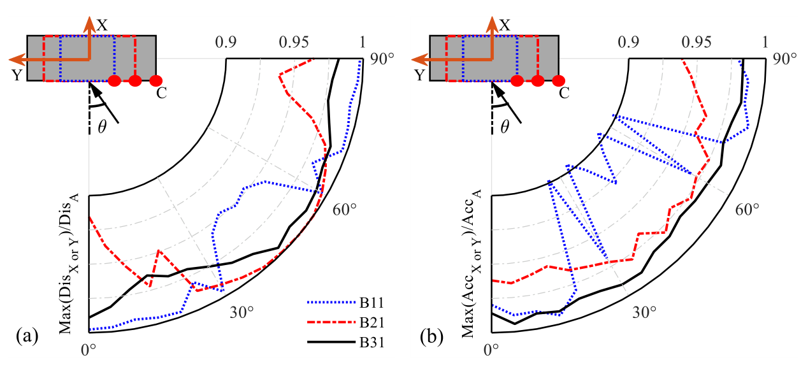

   **图 19** 不同宽深比建筑顶部角点主轴响应与合成响应之比。

   图内文字：（a）位移；（b）加速度。分子取同一角点 X、Y 方向响应中的较大值，分母为该角点合成响应；蓝点线、红虚线、黑实线分别表示 B11、B21、B31，角度为风向。

在建筑风致响应研究中，研究者通常关注建筑所有风向下的风致响应极值。当所有风向的风致响应极值均满足规定限值时，认为结构安全。 :ref:`表 4 <yang2025-table-4>` 比较不同宽深比建筑主轴方向与二维矢量位移、加速度响应极值。由表可见，不同宽深比建筑的主轴方向与二维矢量响应极值存在明显差别；特别是宽深比 2:1 建筑，二维矢量位移响应极值比主轴响应大 4.44%，加速度响应大 5.72%。

.. _yang2025-table-4:

.. list-table:: 表 4 建筑顶部主轴方向响应与二维矢量响应极值比较
   :header-rows: 1
   :widths: 10 8 8 8 8 8 9 8 11 11 11

   * - 响应
     - 建筑
     - :math:`R_O`
     - :math:`\theta_O` （°）
     - :math:`R_C`
     - :math:`\theta_C` （°）
     - :math:`R_{\mathrm{vector}}`
     - :math:`\theta_{\mathrm{vector}}` （°）
     - :math:`(R_C-R_O)/R_O` （%）
     - :math:`(R_{\mathrm{vector}}-R_O)/R_O` （%）
     - :math:`(R_{\mathrm{vector}}-R_C)/R_C` （%）
   * - 位移（m）
     - B11
     - 0.384
     - 5/85
     - 0.404
     - 5/85
     - 0.406
     - 5/85
     - 5.21
     - 5.73
     - 0.33
   * - 位移（m）
     - B21
     - 0.176
     - 10
     - 0.220
     - 90
     - 0.229
     - 90
     - 25.00
     - 30.11
     - 4.44
   * - 位移（m）
     - B31
     - 0.144
     - 10
     - 0.187
     - 10
     - 0.192
     - 10
     - 29.86
     - 33.33
     - 2.20
   * - 位移（m）
     - B21T
     - 0.172
     - 90
     - 0.204
     - 85
     - 0.216
     - 85
     - 18.60
     - 25.58
     - 6.04
   * - 位移（m）
     - B31T
     - 0.166
     - 10
     - 0.192
     - 10
     - 0.192
     - 10
     - 15.66
     - 15.66
     - 0.19
   * - 加速度（m/s²）
     - B11
     - 0.220
     - 5/85
     - 0.238
     - 5/85
     - 0.241
     - 5/85
     - 8.18
     - 9.55
     - 1.24
   * - 加速度（m/s²）
     - B21
     - 0.105
     - 0
     - 0.173
     - 85
     - 0.183
     - 85
     - 64.76
     - 74.29
     - 5.72
   * - 加速度（m/s²）
     - B31
     - 0.093
     - 5
     - 0.135
     - 0
     - 0.137
     - 0
     - 45.16
     - 47.31
     - 1.58
   * - 加速度（m/s²）
     - B21T
     - 0.106
     - 90
     - 0.195
     - 90
     - 0.210
     - 90
     - 83.96
     - 98.11
     - 7.72
   * - 加速度（m/s²）
     - B31T
     - 0.096
     - 20
     - 0.134
     - 90
     - 0.141
     - 90
     - 39.58
     - 46.88
     - 5.19

表注： :math:`R_O` 表示建筑顶部中心点的一维主轴响应极值； :math:`R_C` 表示建筑顶部角点的一维主轴响应极值； :math:`R_{\mathrm{vector}}` 表示建筑顶部角点的二维矢量响应极值。为区分表内三组同名 :math:`\theta` 列，译表给它们加上相应响应下标；原始数值、方向与百分数均保留。

随着建筑宽深比增大，某一主轴方向的侧向刚度逐步提高，建筑整体刚度随之增大。因此，建筑最大二维矢量风致响应逐渐减小；同时，最大二维矢量风致响应逐渐接近建筑较弱主轴方向风致响应极值。建筑宽深比大于或等于 3:1 时，仅用主轴方向最大风致响应估计矢量响应极值，其偏差保持在 3% 以内。

.. note::

   本节“等于主轴方向”及“3% 以内”均须放在所比较模型与统计口径下理解：表 4 中未提高扭转周期比的 B31，全风向最大值的角点二维/角点主轴差别为位移 2.20%、加速度 1.58%，而 B31T 加速度为 5.19%。上一段逐风向分析又同时报告“比值均超过 0.98”和最大位移低估 3.1%，二者存在不一致。表 4 百分数也未必能由展示到三位小数的响应值直接重算，例如 B11 位移末列 0.33%；这里保留源表精度与数值，不擅自重算替换。这些结果均不是对所有大宽深比建筑的保证。

设计者通常分析建筑中心点的风致响应，但这可能低估实际二维矢量响应。因此，本文还比较建筑中心点主轴方向风致响应极值与角点二维矢量响应极值的比值，见 :ref:`图 20 <yang2025-fig-20>`。可以看出，两者偏差显著。对位移响应，宽深比 1:1 时，中心点主轴响应极值与角点二维矢量响应极值之比为 0.90～0.96；若只考虑中心点主轴方向响应极值，与结构真实极值的偏差为 4%。宽深比 2:1 时，比值为 0.72～0.89，偏差超过 10%；宽深比 3:1 时，比值为 0.57～0.81，偏差超过 19%。对加速度响应，原文此处写宽深比 3:1 时，比值为 0.86～0.95，偏差为 5%；宽深比 2:1 时，比值为 0.47～0.81，偏差超过 19%；宽深比 3:1 时，比值为 0.48～0.72，偏差超过 28%。综上，计算建筑风致响应极值时，仅考虑建筑中心点主轴响应极值，将严重低估结构真实二维矢量响应极值。

.. _yang2025-fig-20:

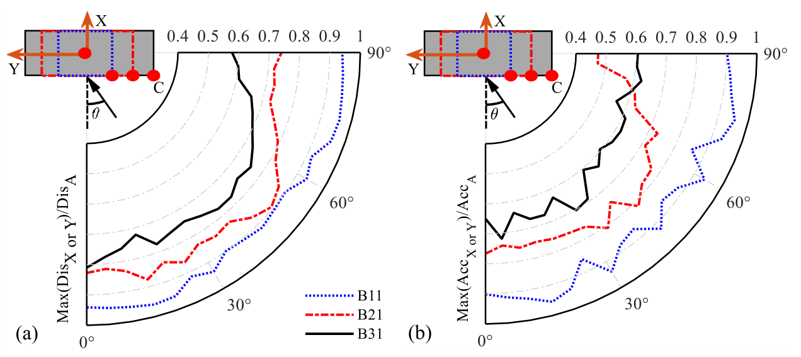

   **图 20** 不同宽深比建筑中心点主轴响应与顶部角点合成响应之比。

   图内文字：（a）位移；（b）加速度。分子取中心点 X、Y 方向响应中的较大值，分母为角点合成响应；蓝点线、红虚线、黑实线分别表示 B11、B21、B31，角度为风向。

.. note::

   原文将加速度第一组 0.86～0.95 与第三组 0.48～0.72 均标为 3:1；图 20 的曲线标记分别为 B11、B21、B31，第一组与 B11 曲线对应。译文明确保留并指出这一重复标签，而不假装源文没有差异。19% 与 28% 指这里的中心点主轴加速度相对角点二维加速度的低估口径，不能移用到所有位移指标，也不能与表 4 以中心点为分母的增幅百分数混用。

3.3.2 扭转周期比（Tz/T1）
^^^^^^^^^^^^^^^^^^^^^^^^^^

此外，随着建筑形式多样化，结构形式也越来越复杂。结构设计中常遇到建筑一阶扭转周期 :math:`T_Z` 与一阶平动周期 :math:`T_Y` 之比大于 0.9 的情况，此时建筑风致扭转效应加剧。研究表明，风致扭转效应会改变建筑主要抗力体系的风力分布，使结构某些部位风致响应增大，影响使用者舒适度 :ref:`[49] <yang2025-ref-49>`。研究还表明，已有明显可感知风致运动记录的高层建筑均具有显著扭转响应 :ref:`[50] <yang2025-ref-50>`。为研究较大扭转周期比建筑主轴方向与二维矢量方向响应极值的关系，对 B21 和 B31 建筑的结构布置作出调整，使扭转周期比大于 0.9；外部尺寸和风荷载保持不变，调整后的建筑分别记为 B21T、B31T。 :ref:`图 21 <yang2025-fig-21>` 给出 B21T、B31T 建筑主轴方向和二维矢量方向响应极值随风向角的变化。 :ref:`表 4 <yang2025-table-4>` 还给出结构布置调整前后主轴方向与二维矢量方向位移、加速度极值。由表可见，增大建筑扭转模态周期可能加剧风致扭转效应，使主轴方向与二维矢量方向响应极值增大。宽深比 2:1 时，主轴方向和二维矢量方向位移响应极值分别增加 −7.3% 和 −5.7%，加速度响应分别增加 12.7% 和 14.8%。宽深比 3:1 时，主轴方向和二维矢量方向位移响应极值分别增加 2.7% 和 0.2%，加速度响应分别增加 −0.7% 和 2.9%。宽深比 2:1 时，扭转效应使二维矢量位移响应极值与主轴方向位移响应极值的偏差从 4.44% 增至 6.04%，加速度偏差从 5.72% 增至 7.72%。宽深比 3:1 时，扭转效应使二维矢量位移响应极值与主轴方向位移响应极值的偏差从 2.2% 降至 0.19%。需要注意，此时位移响应偏差减小，主要是由于主轴方向响应增大，缩小了二者相对误差。加速度响应偏差从 1.58% 增至 5.19%。因此，建筑扭转周期比增大会使建筑顶部角点主轴方向与二维矢量方向响应极值显著增加，也可能增大二者偏差比例，对结构不利。因此，结构设计中应尽量减小扭转周期比。

.. _yang2025-fig-21:

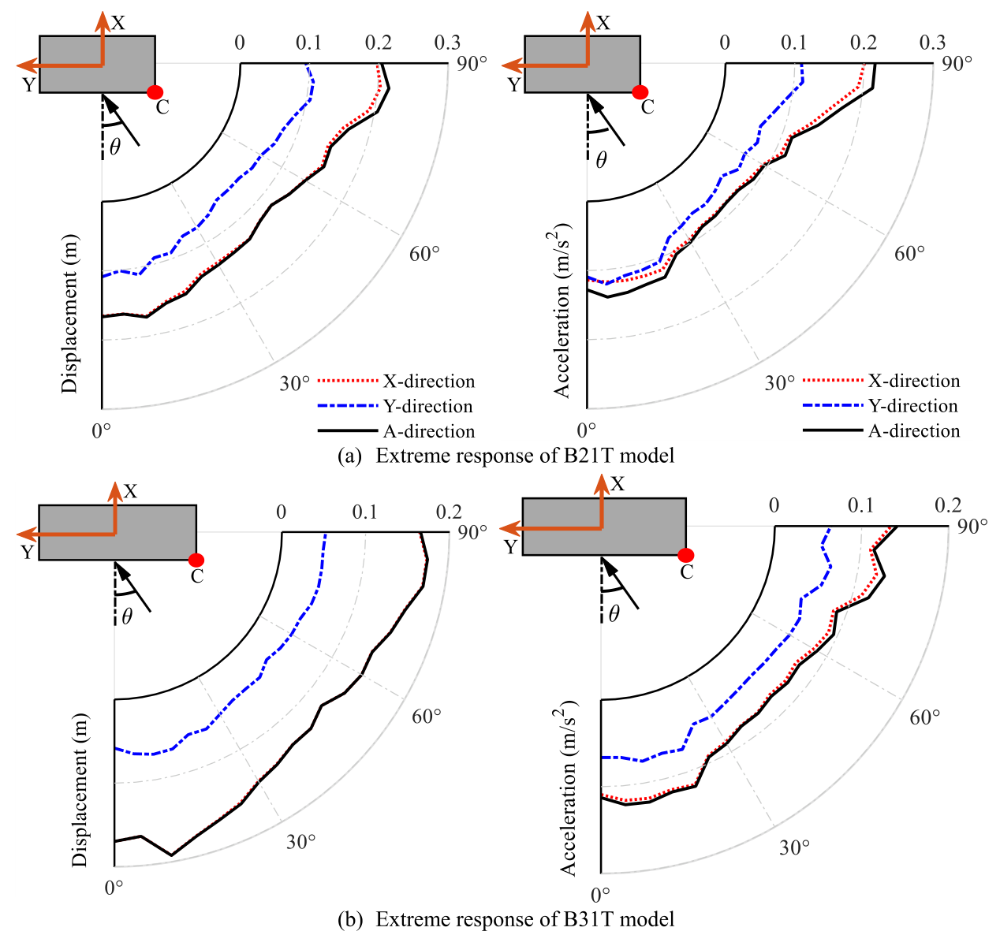

   **图 21** 扭转周期比大于 0.9 的建筑顶部角点主轴响应与合成响应极值。

   图内文字：（a）B21T；（b）B31T。每行左图为位移（m），右图为加速度（m/s²）；红点线、蓝点划线、黑实线分别为 X、Y 主轴响应与合成响应 A，角度为风向。图题“大于 0.9”保留原文，其与 B21T 表列周期的差异见正文译注。

.. note::

   本段“增加 −7.3%、−5.7%、−0.7%”按原文保留，实际表达的是相应响应下降，因此不能将段末概括理解为所有响应单调增大。另据表 3，B21T 的 :math:`T_Z/T_Y=5.316/6.062\approx0.877` ，与本节及图 21 所称“大于 0.9”不一致；B31T 的比值约为 0.907。这里只披露源表与文字的差别，不修改模型周期。表 3 所列 X、Y 周期与正文“X 为弱轴”的说法也不能在缺少刚度、质量细节时自行改判。

4 结论
------

本文采用 PI 法计算建筑风致响应时程，比较不同一维主轴响应峰值因子计算方法的差异。通过研究具有不同相关系数 :math:`\rho_{XY}` 和标准差比 :math:`\sigma_X/\sigma_Y` 的相互垂直平稳高斯随机信号，考察不同二维矢量响应极值计算方法的准确性；此外，还研究建筑宽深比与扭转周期比对风致二维矢量响应极值的影响。主要结论如下：

1. SRSS 法不考虑不同一维主轴方向响应之间的相关性，估计结果过于保守。ERF 法通过引入经验折减系数 :math:`\varphi` 修正这种保守估计，但仍未考虑分量响应之间的相关性，因此估计误差明显。CPF 和 RPA 法均通过理论推导估计二维矢量响应极值。然而，CPF 法忽视分量响应相关性，假定二维矢量响应与较大的一维分量响应完全相关，导致结果偏大。RPA 法旋转结构主轴并将响应投影至这些轴，把二维矢量响应极值估计问题转化为一维响应极值估计问题，但其结果往往小于实际值。CDC 法考虑一维分量响应之间的相关性，以及分量标准差比的差异，并引入安全系数，避免估计结果被严重低估。

2. 通过本文高层建筑风致二维矢量响应极值算例分析，发现高阶振型对建筑二维位移矢量响应的贡献较小。因此，计算中可以不计较高阶振型以提高计算效率，但所考虑振型阶数不应少于 3 阶。对于风致二维加速度矢量响应，不计高阶振型则可能造成明显误差。因此，计算加速度响应时宜考虑更多振型，对本文建筑建议采用前 11 阶。

3. 通过不同宽深比及较大扭转周期比高层建筑的分析，发现宽深比 1:1 的建筑在风向与主轴一致时，风致二维矢量响应极值较大，且以横风向响应为主。随入射角增大，二维矢量风致响应极值先减小后增大，在 45° 时达到最小。因此，建筑结构设计中宜尽量使建筑主轴避开当地主导风向，以有效降低建筑风致响应。

4. 随着建筑宽深比增大，二维矢量响应极值逐渐接近建筑较弱轴方向的极值。建筑宽深比小于 3:1 时，仅考虑角点主轴方向风致响应极值来估计合成响应极值，误差为 5.72%；宽深比不小于 3:1 时，误差降为 2.20%。仅考虑中心点主轴响应极值，会对结构真实极值产生明显偏差。当宽深比不小于 2:1 时，仅考虑中心点主轴方向风致响应极值造成的误差达到 19%；宽深比不小于 3:1 时，误差增至 28%。因此，开展建筑结构舒适度计算时，独立考虑中心点加速度与扭转加速度不足以完成舒适度评价，还需要考虑角点位置的矢量加速度极值。计算角点矢量加速度极值时，应先对角点位置的平动与扭转加速度进行矢量叠加，再采用 CDC 法完成矢量极值的准确计算。

5. 随着建筑扭转周期比增大，尤其是第二阶周期所对应振型中的扭转模态占比超过 50% 时，建筑扭转效应增强，使主轴方向与二维矢量方向响应极值之间的偏差显著增大。这对结构设计不利，设计过程中应尽可能避免。

.. note::

   上述结论为作者在本文模型与工况下的归纳。第（4）项的 5.72% 与 2.20% 来自不同模型和响应量的概括，需结合表 4 区分；19%、28% 的加速度评价范围见第 3.3.1 节。第（5）项“第二阶扭转模态占比超过 50%”为原文措辞，正文未提供该占比的独立计算定义，不能将其等同于周期比阈值。本文没有给出适用于所有建筑、非高斯或非平稳响应、非线性体系的统一误差保证。

参考文献
--------

.. _yang2025-ref-1:

[1] K.C.S. Kwok, P.A. Hitchcock, M.D. Burton, Perception of vibration and occupant comfort in wind-excited tall buildings, J. Wind Eng. Ind. Aerod. 97 (7–8) (2009) 368–380.

`原文参考文献链接 <http://refhub.elsevier.com/S2352-7102(25)01872-8/sref1>`__

.. _yang2025-ref-2:

[2] E. Bernardini, S.M.J. Spence, D.K. Kwon, et al., Performance-based design of high-rise buildings for occupant comfort, J. Struct. Eng. 141 (10) (2015) 04014244.

`原文参考文献链接 <http://refhub.elsevier.com/S2352-7102(25)01872-8/sref2>`__

.. _yang2025-ref-3:

[3] D.Y. Wang, Y.S. Zhang, Y. Zhou, Study on occupant comfort evaluation mode of tall buildings in wind excitation based on fuzzy probability method, Struct. Des. Tall Special Build. 26 (9) (2017) e1365.

`原文参考文献链接 <http://refhub.elsevier.com/S2352-7102(25)01872-8/sref3>`__

.. _yang2025-ref-4:

[4] Y.W. Wang, C. Zhang, Y.Q. Ni, et al., Bayesian probabilistic assessment of occupant comfort of high-rise structures based on structural health monitoring data, Mech. Syst. Signal Process. 163 (2022) 108147.

`原文参考文献链接 <http://refhub.elsevier.com/S2352-7102(25)01872-8/sref4>`__

.. _yang2025-ref-5:

[5] D.K. Periyasamy, V. Shimpi, M.V.R. Sivasubramanian, Comfort assessment of wind induced vibrations for slender structures by field monitoring and numerical analysis, J. Safety Sci. Resil. 5 (4) (2024) 383–399.

`原文参考文献链接 <http://refhub.elsevier.com/S2352-7102(25)01872-8/sref5>`__

.. _yang2025-ref-6:

[6] F. Hou, M. Jafari, Investigation approaches to quantify wind-induced load and response of tall buildings: a review, Sustain. Cities Soc. 62 (2020) 102376.

`原文参考文献链接 <http://refhub.elsevier.com/S2352-7102(25)01872-8/sref6>`__

.. _yang2025-ref-7:

[7] Y. Yin, W. Chen, J. Hu, et al., In-situ measurement of structural performance of large-span air-supported dome under wind loads, Thin-Walled Struct. 169 (2021) 108476.

`原文参考文献链接 <http://refhub.elsevier.com/S2352-7102(25)01872-8/sref7>`__

.. _yang2025-ref-8:

[8] L. Jiahao, A fast CQC algorithm of PSD matrices for random seismic responses, Comput. Struct. 44 (3) (1992) 683–687.

`原文参考文献链接 <http://refhub.elsevier.com/S2352-7102(25)01872-8/sref8>`__

.. _yang2025-ref-9:

[9] J. Fu, Q. Zheng, Y. Huang, et al., Design optimization on high-rise buildings considering occupant comfort reliability and joint distribution of wind speed and direction, Eng. Struct. 156 (2018) 460–471.

`原文参考文献链接 <http://refhub.elsevier.com/S2352-7102(25)01872-8/sref9>`__

.. _yang2025-ref-10:

[10] X. Zhou, Z. Gao, Y. Zhang, Stochastic force identification for uncertain structures based on matrix equilibration and improved Tikhonov regularization method, J. Sound Vib. (2024) 118630.

`原文参考文献链接 <http://refhub.elsevier.com/S2352-7102(25)01872-8/sref10>`__

.. _yang2025-ref-11:

[11] I.F. Huergo, H. Hernández-Barrios, R. Gómez-Martíne, Analytical simulation of 3D wind-induced vibrations of rectangular tall buildings in time domain, Shock Vib. 2022 (1) (2022) 7283610.

`原文参考文献链接 <http://refhub.elsevier.com/S2352-7102(25)01872-8/sref11>`__

.. _yang2025-ref-12:

[12] H. Shen, High-Precision Algorithm and Comfort Analysis for wind-induced Vibration of Tall Buildings[D], Harbin Institute of Technology, Harbin, 2021.

`原文参考文献链接 <http://refhub.elsevier.com/S2352-7102(25)01872-8/sref12>`__

.. _yang2025-ref-13:

[13] H. Huo, Z. Zhou, G. Chen, et al., Exact benchmark solutions of random vibration responses for thin-walled orthotropic cylindrical shells, Int. J. Mech. Sci. 207 (2021) 106644.

`原文参考文献链接 <http://refhub.elsevier.com/S2352-7102(25)01872-8/sref13>`__

.. _yang2025-ref-14:

[14] F. Hou, P. Sarkar, Time-domain model for prediction of generalized 3DOF buffeting response of tall buildings using 2D aerodynamic sectional properties, Eng. Struct. 232 (2021) 111847.

`原文参考文献链接 <http://refhub.elsevier.com/S2352-7102(25)01872-8/sref14>`__

.. _yang2025-ref-15:

[15] F. Hou, P.P. Sarkar, A time-domain method for predicting wind-induced buffeting response of tall buildings, J. Wind Eng. Ind. Aerod. 182 (2018) 61–71.

`原文参考文献链接 <http://refhub.elsevier.com/S2352-7102(25)01872-8/sref15>`__

.. _yang2025-ref-16:

[16] Q.Y. Li, N.C. Wang, D.Y. Yi, Numerical Analysis[M]. 5th Edition, Tsinghua University Press, Beijing, 2008, pp. 176–191.

`原文参考文献链接 <http://refhub.elsevier.com/S2352-7102(25)01872-8/sref16>`__

.. _yang2025-ref-17:

[17] C. Runge, Über die numerische Auflösung von Differentialgleichungen, Math. Ann. 46 (2) (1895) 167–178.

`原文参考文献链接 <http://refhub.elsevier.com/S2352-7102(25)01872-8/sref17>`__

.. _yang2025-ref-18:

[18] W. Kutta, Beitrag Zur Näherungsweisen Integration Totaler Differentialgleichungen, Teubner, 1901.

`原文参考文献链接 <http://refhub.elsevier.com/S2352-7102(25)01872-8/sref18>`__

.. _yang2025-ref-19:

[19] Z. Wan-Xie, On precise integration method, J. Comput. Appl. Math. 163 (1) (2004) 59–78.

`原文参考文献链接 <http://refhub.elsevier.com/S2352-7102(25)01872-8/sref19>`__

.. _yang2025-ref-20:

[20] F. Bashforth, J.C. Adams, An Attempt to Test the Theories of Capillary Action: by Comparing the Theoretical and Measured Forms of Drops of Fluid[M], University Press, 1883.

`原文参考文献链接 <http://refhub.elsevier.com/S2352-7102(25)01872-8/sref20>`__

.. _yang2025-ref-21:

[21] G. Dahlquist, Convergence and stability in the numerical integration of ordinary differential equations, Math. Scand. (1956) 33–53.

`原文参考文献链接 <http://refhub.elsevier.com/S2352-7102(25)01872-8/sref21>`__

.. _yang2025-ref-22:

[22] A.G. Davenport, Note on the distribution of the largest value of a random function with application to gust loading, Proc. Inst. Civ. Eng. 28 (2) (1964) 187–196.

`原文参考文献链接 <http://refhub.elsevier.com/S2352-7102(25)01872-8/sref22>`__

.. _yang2025-ref-23:

[23] A.G. Davenport, Gust loading factors, J. Struct. Div. 93 (3) (1967) 11–34.

`原文参考文献链接 <http://refhub.elsevier.com/S2352-7102(25)01872-8/sref23>`__

.. _yang2025-ref-24:

[24] Y. Li, J. Xu, Neural network-aided simulation of Non-Gaussian stochastic processes, Reliab. Eng. Syst. Saf. 242 (2024) 109786.

`原文参考文献链接 <http://refhub.elsevier.com/S2352-7102(25)01872-8/sref24>`__

.. _yang2025-ref-25:

[25] X. Ma, F. Xu, Investigation on the sampling distributions of Non-Gaussian wind pressure skewness and kurtosis, Mech. Syst. Signal Process. 220 (2024) 111610.

`原文参考文献链接 <http://refhub.elsevier.com/S2352-7102(25)01872-8/sref26>`__

.. _yang2025-ref-26:

[26] X. Chen, Extreme value distribution and peak factor of crosswind response of flexible structures with nonlinear aeroelastic effect, J. Struct. Eng. 140 (12) (2014) 04014091.

`原文参考文献链接 <http://refhub.elsevier.com/S2352-7102(25)01872-8/sref27>`__

.. _yang2025-ref-27:

[27] A. Kareem, J. Zhao, Analysis of Non-Gaussian surge response of tension leg platforms under wind loads, J. Offshore Mech. Arctic Eng. ASME 116 (3) (1994) 137–144.

`原文参考文献链接 <http://refhub.elsevier.com/S2352-7102(25)01872-8/sref28>`__

.. _yang2025-ref-28:

[28] D.K. Kwon, A. Kareem, Peak factors for Non-Gaussian load effects revisited, J. Struct. Eng. 137 (12) (2011) 1611–1619.

`原文参考文献链接 <http://refhub.elsevier.com/S2352-7102(25)01872-8/sref29>`__

.. _yang2025-ref-29:

[29] M. Huang, C. Chan, W. Lou, et al., Statistical extremes and peak factors in wind-induced vibration of tall buildings, J. Zhejiang Univ. - Sci. 13 (1) (2012) 18–32.

`原文参考文献链接 <http://refhub.elsevier.com/S2352-7102(25)01872-8/sref30>`__

.. _yang2025-ref-30:

[30] E.H. Vanmarcke, Properties of spectral moments with applications to random vibration, J. Eng. Mech. Div. 98 (2) (1972) 425–446.

`原文参考文献链接 <http://refhub.elsevier.com/S2352-7102(25)01872-8/sref31>`__

.. _yang2025-ref-31:

[31] G. Huang, X. Chen, M. Li, et al., Extreme value of wind-excited response considering the influence of bandwidth, J. Modern Transport. 21 (2013) 125–134.

`原文参考文献链接 <http://refhub.elsevier.com/S2352-7102(25)01872-8/sref32>`__

.. _yang2025-ref-32:

[32] D.E. Cartwright, M.S. Longuet-Higgins, The statistical distribution of the maxima of a random function, Proc. Roy. Soc. Lond. Math. Phys. Sci. 237 (1209) (1956) 212–232.

`原文参考文献链接 <http://refhub.elsevier.com/S2352-7102(25)01872-8/sref33>`__

.. _yang2025-ref-33:

[33] X. Li, S. Li, Q. Yang, et al., Time-varying up-crossing theory-based non-stationary extreme estimation of gust-loading on rectangular cylinder due to thunderstorm-like wind, Probab. Eng. Mech. 74 (2023) 103506.

`原文参考文献链接 <http://refhub.elsevier.com/S2352-7102(25)01872-8/sref34>`__

.. _yang2025-ref-34:

[34] Z. Zhao, Z.H. Lu, C.Q. Li, et al., Dynamic reliability analysis for non-stationary non-gaussian response based on the bivariate vector translation process, Probab. Eng. Mech. 66 (2021) 103143.

`原文参考文献链接 <http://refhub.elsevier.com/S2352-7102(25)01872-8/sref35>`__

.. _yang2025-ref-35:

[35] Z.H. Lu, Z. Zhao, X.Y. Zhang, et al., Simulating stationary Non-Gaussian processes based on unified hermite polynomial model, J. Eng. Mech. 146 (7) (2020) 04020067.

`原文参考文献链接 <http://refhub.elsevier.com/S2352-7102(25)01872-8/sref36>`__

.. _yang2025-ref-36:

[36] J.S. Love, Z.J. Taylor, W.N. Yakymyk, Determining the peak spatial and resultant accelerations of tall buildings tested in the wind tunnel, J. Wind Eng. Ind. Aerod. 202 (2020) 104225.

`原文参考文献链接 <http://refhub.elsevier.com/S2352-7102(25)01872-8/sref37>`__

.. _yang2025-ref-37:

[37] X. Pan, W. Qu, L. Zou, et al., A Practical Combination Method for wind-induced Responses of high-rise Buildings: Based on the Correlation of extremes[C]// Structures, 36, Elsevier, 2022, pp. 126–139.

`原文参考文献链接 <http://refhub.elsevier.com/S2352-7102(25)01872-8/sref38>`__

.. _yang2025-ref-38:

[38] Z. Zhang, Research on Extreme Value of Vector Response and Equivalent Static Wind Load of high-rise Buildings[D], Harbin Institute of Technology, Harbin, 2022.

`原文参考文献链接 <http://refhub.elsevier.com/S2352-7102(25)01872-8/sref39>`__

.. _yang2025-ref-39:

[39] E.L. Wilson, A. Habibullah, A Programme for three-dimension Static and Dynamic Analysis of Multistory Buildings[J]. Structural Mechanics Software Series, 2, University Press of Virginia, 1978.

`原文参考文献链接 <http://refhub.elsevier.com/S2352-7102(25)01872-8/sref40>`__

.. _yang2025-ref-40:

[40] N. Isyumov, A.A. Fediw, J. Colaco, et al., Performance of a tall building under wind action, J. Wind Eng. Ind. Aerod. 42 (1–3) (1992) 1053–1064.

`原文参考文献链接 <http://refhub.elsevier.com/S2352-7102(25)01872-8/sref42>`__

.. _yang2025-ref-41:

[41] X. Chen, G. Huang, Evaluation of peak resultant response for wind-excited tall buildings, Eng. Struct. 31 (4) (2009) 858–868.

`原文参考文献链接 <http://refhub.elsevier.com/S2352-7102(25)01872-8/sref41>`__

.. _yang2025-ref-42:

[42] Y. Yan, Study on dynaminc load response correlation method of high-rise buildings based on wind tunnel test[D], BeiJing: China Acad. Build. Res. (2016) 47–67.

`原文参考文献链接 <http://refhub.elsevier.com/S2352-7102(25)01872-8/sref43>`__

.. _yang2025-ref-43:

[43] S. Tan, Z. Wu, W. Zhong, Adaptive selection of parameters for precise computation of matrix exponential based on padé approximation, Theor. Appl. Mech. 41 (6) (2009) 961–966.

`原文参考文献链接 <http://refhub.elsevier.com/S2352-7102(25)01872-8/sref51>`__

.. _yang2025-ref-44:

[44] S.O. Rice, Mathematical analysis of random noise, Bell Sys. Tech. J. 23 (3) (1944) 282–332.

`原文参考文献链接 <http://refhub.elsevier.com/S2352-7102(25)01872-8/sref44>`__

.. _yang2025-ref-45:

[45] A.G. Davenport, The response of slender, line-like structures to a gusty wind, Proc. Inst. Civ. Eng. 23 (3) (1962) 389–408.

`原文参考文献链接 <http://refhub.elsevier.com/S2352-7102(25)01872-8/sref45>`__

.. _yang2025-ref-46:

[46] American Society of Civil Engineers, Minimum design loads and associated criteria for buildings and other structures, Am. Soc. Civil Eng. (2022) 881–887.

`原文参考文献链接 <http://refhub.elsevier.com/S2352-7102(25)01872-8/sref55>`__

.. _yang2025-ref-47:

[47] R. Feng, G. Yan, J. Ge, Effects of high modes on the wind-induced response of super high-rise buildings, Earthq. Eng. Eng. Vib. 11 (3) (2012) 427–434.

`原文参考文献链接 <http://refhub.elsevier.com/S2352-7102(25)01872-8/sref52>`__

.. _yang2025-ref-48:

[48] Tokyo polytechnic university. TPU wind pressure database. http://evovw.ce.nd.edu/DEDM_HRP/DEDMP_INT_v3_4evo.html, 2008.

.. _yang2025-ref-49:

[49] H. Alinejad, T.H.K. Kang, S.Y. Jeong, et al., Engineering review of wind-induced torsional moment and response of buildings, J. Struct. Eng. 149 (11) (2023) 03123001.

`原文参考文献链接 <http://refhub.elsevier.com/S2352-7102(25)01872-8/sref54>`__

.. _yang2025-ref-50:

[50] N. Isyumov, P.C. Case, Wind-Induced Torsional Loads and Responses of buildings[M]//Advanced Technology in Structural Engineering, 2000, pp. 1–8.

`原文参考文献链接 <http://refhub.elsevier.com/S2352-7102(25)01872-8/sref53>`__

完整引用
--------

Junhui Yang, Chao Li, Zhu Zhang, Lingwei Chen, Xin He, Qingxing Zheng, Jianjun Zhang. Statistical extremes of 2D vectorial response for wind-excited tall buildings. Journal of Building Engineering, 111 (2025), 113635. https://doi.org/10.1016/j.jobe.2025.113635

收录信息见 :ref:`WOEAI 学术成果页对应条目 <ref-yang2025-JBE>` 。
