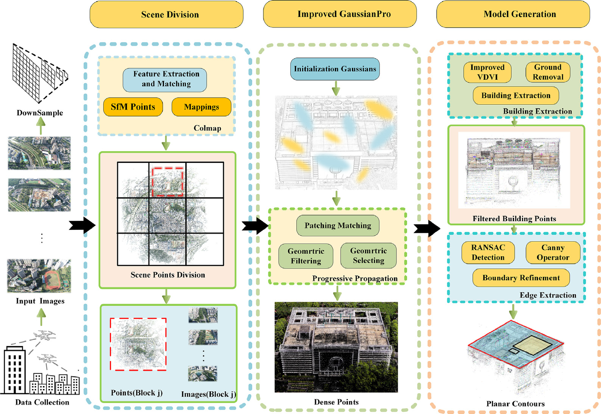
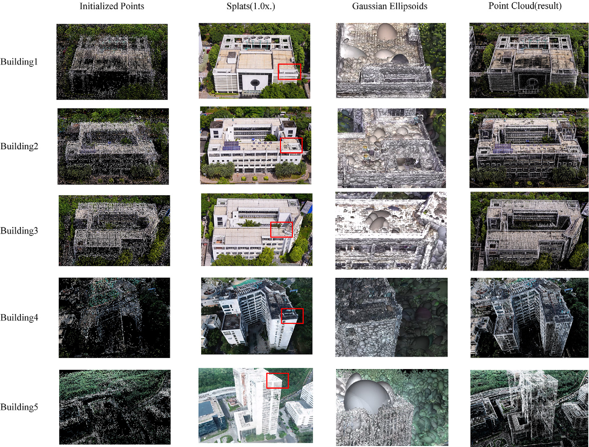
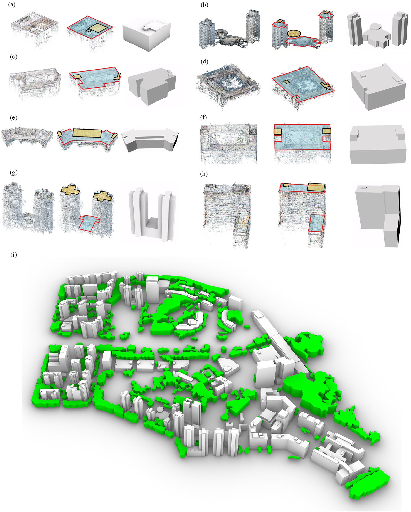
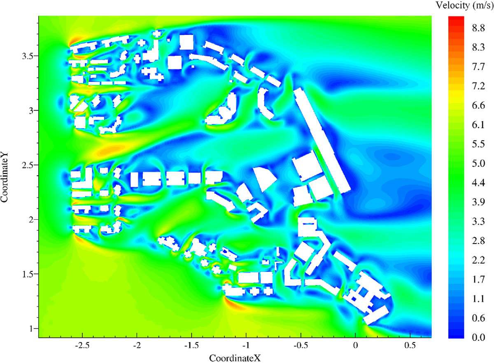
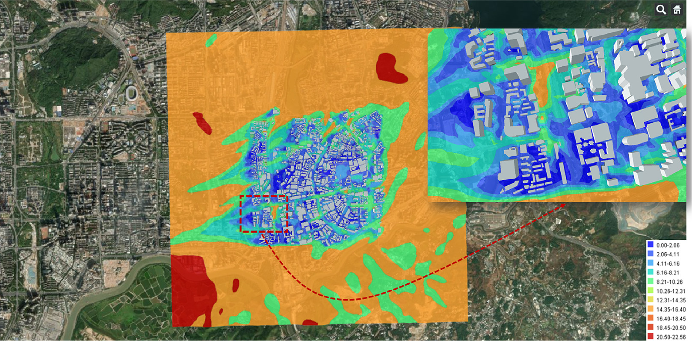

.. _paper-note-ref-zhao2025-SCS:

.. role:: student-first-author

用 3D Gaussian Splatting 重建城市建筑几何
=========================================

城市风环境 CFD 模拟的一个前置难题，是如何快速得到既接近真实建筑形态、又适合网格划分和数值计算的城市建筑几何。传统手工建模耗时较长，普通 GIS 拉伸模型细节不足，而点云到几何模型的自动转换又容易受到植被、孔洞、突起和屋面细节缺失的影响。

在这篇发表于 **Sustainable Cities and Society** 的论文中，我们把 3D Gaussian Splatting 引入城市建筑几何重建流程，尝试从无人机影像出发，快速生成可用于城市风场模拟的建筑几何模型。对 WOEAI 的数值风洞研究来说，这项工作连接了“视觉数据获取”“城市几何重建”和“CFD 风环境评估”三个环节。

   论文图 1 算法框架总体流程

   这张图展示了从无人机影像、场景分块、改进 GaussianPro 到建筑模型生成的完整路径，说明本文并不是只做视觉重建，而是面向 CFD 可用几何模型来组织算法。

论文信息
--------

- 论文题名: A novel framework utilizing 3D Gaussian Splatting to construct building geometry for urban wind simulations
- 作者: :student-first-author:`Zhao Peisheng`; **Li Chao**\*; Jiang Jianxun; Chen Lingwei; Wang Xiaolu
- 期刊: Sustainable Cities and Society
- 年份: 2025
- DOI: https://doi.org/10.1016/j.scs.2025.106237
- WOEAI 相关方向: 建筑结构抗风 / 数值风洞与湍动入流

三句话导读
----------

这篇论文研究如何用 3D Gaussian Splatting 从无人机影像快速生成城市风环境 CFD 可用的建筑几何。 它重要，因为城市风场模拟的成本常常先卡在几何建模和网格前处理，而不是求解器本身。 读者可以带走的结论是：面向 CFD 的几何重建既要快，也要规则、可网格化，并且要通过网格收敛和风环境分析验证可用性。

关键数字 / 关键结论卡
---------------------

- 相比 COLMAP，本文框架的点云精度平均提高约 :math:`12\%`；结论部分概括密集建筑点云生成速度比传统方法快 :math:`2`-:math:`3` 倍。
- 生成建筑几何达到 LoD2 和 LoD2.5，并强调规则边界和网格质量，而不只是视觉重建效果。
- CFD 网格收敛分析中，速度场与压力场最大 GCI 为 :math:`3.76\%`，湍流量最大 GCI 为 :math:`4.89\%`。

摘要
----

计算流体力学（CFD）模拟是城市风环境评估中的重要方法。快速、准确地建立细致的建筑几何模型，是开展高质量 CFD 模拟的关键前提。利用点云生成这类模型是主流方法之一，但现有方法对建筑点云生成的效率和精度关注不足，在建立几何拓扑时也难以提取足够细节，因此生成的几何模型并不适合直接用于 CFD 模拟。

针对这些问题，本文提出一种基于 3D Gaussian Splatting 的算法框架。首先，利用无人机拍摄影像并通过 COLMAP 生成稀疏点；随后，提出一种基于这些稀疏点的场景分割方法，将整体场景划分为均匀区块。本文首次引入并改进 3D Gaussian Splatting，以显著提升速度的方式生成高精度建筑点云。

此外，研究设计了一套集成算法，用于从点云中提取植被、地形和建筑，再对建筑轮廓进行简化和细化，生成适合 CFD 模拟的几何模型。与传统方法相比，该框架能够将场景扩展到城市尺度，并支持可调节的细节水平。点云精度平均提高 :math:`12\%`，生成速度提升 :math:`3`-:math:`5` 倍，几何模型细节水平达到 LoD2 和 LoD2.5，并可通过定制飞行规划进一步提升。最后，研究开展了基于 CFD 模拟的行人舒适度分析和 WebGIS 可视化，模拟结果呈单调收敛，压力场网格收敛指数达到 :math:`3.76\%`。这些结果表明，该算法框架适用于典型城市风场模拟。

研究问题
--------

城市建筑几何重建要服务风环境计算，而不仅是视觉展示。本文围绕三个问题展开：

1. 如何从无人机影像出发，快速生成城市尺度的高精度建筑点云？
2. 如何把点云进一步整理为边界清晰、屋面细节可控、适合 CFD 网格划分的建筑几何模型？
3. 如何用 CFD 网格收敛、行人舒适度分析和 WebGIS 展示验证这些几何模型的工程可用性？

方法贡献
--------

本文提出的框架由两个核心部分组成：密集点云生成和建筑几何模型生成。

第一步是场景分块。我们先使用 COLMAP 从无人机影像中得到 SfM 稀疏点云以及二维特征点与三维点之间的映射关系，再根据这些映射关系把整个场景划分为多个区块。这样做的目的，是让城市尺度场景可以被分块训练和并行处理，缓解大场景重建中的内存和时间压力。

第二步是改进 3D Gaussian Splatting。我们以 GaussianPro 为基础，将场景表示为不断优化和加密的高斯点，通过 patch matching、geometric filtering、geometric selecting 和 progressive propagation 等过程提升建筑点云质量。与直接追求视觉渲染不同，本文更关注重建结果能否支撑后续建筑轮廓提取和 CFD 几何建模。

第三步是几何模型生成。研究用改进的 VDVI、地面去除、建筑提取、RANSAC、Canny 算子和边界细化等步骤，将点云中的植被、地形与建筑分离，并将建筑屋面轮廓整理成更规则的几何模型。

   论文图 14 选定建筑的密集点云

   图中从初始化点、splat 渲染、高斯椭球到最终点云展示了 3DGS 如何逐步获得建筑细节，也提示了屋面、立面遮挡和背景颜色对点云质量的影响。

关键发现
--------

1. 点云精度和生成效率同时改善
~~~~~~~~~~~~~~~~~~~~~~~~~~~~~

**针对问题 1，论文用同一数据集比较了本文框架与 COLMAP、Context Capture、NeuS、NeuDA 等方法。** 结果显示，本文方法相对 COLMAP 的点云精度平均提高约 :math:`12\%`，并且在生成速度上明显更快。结论部分进一步概括为：密集建筑点云生成速度比传统方法快 :math:`2`-:math:`3` 倍，同时保持较高精度。

这组结果的意义在于，城市风环境模拟通常不是单体建筑问题，而是建筑群和街区尺度问题。只有点云生成效率足够高，几何重建流程才有可能进入更大范围、更频繁更新的城市风环境评估。

2. 几何模型达到 LoD2 和 LoD2.5，并更适合 CFD
~~~~~~~~~~~~~~~~~~~~~~~~~~~~~~~~~~~~~~~~~~~~

**针对问题 2，从重建结果看，本文框架生成的建筑几何模型具有较规则的平面轮廓，能够保留主要屋面细节，并避免尖角、凹凸不平等可能导致 CFD 计算发散的问题。** 论文报告几何模型的细节水平达到 LoD2 和 LoD2.5。

这也是本文和纯视觉重建工作的区别之一：视觉上更“像”的模型，不一定更适合 CFD；而 CFD 需要的是能够表达主要建筑外形、边界清晰、网格质量可控的几何。

   论文图 18 几何模型重建结果

   这张图把建筑点云、平面轮廓和几何模型并列展示，并给出整体场景结果，说明框架如何从点云走向可用于风场模拟的城市几何。

3. CFD 应用显示网格收敛和风场连续性
~~~~~~~~~~~~~~~~~~~~~~~~~~~~~~~~~~~

**针对问题 3，为了验证几何拓扑的有效性，论文进一步开展三维不可压缩牛顿流体模拟，采用 :math:`k`-:math:`\omega` SST RANS 湍流模型求解稳态速度和压力。** 计算域按照最高建筑高度 :math:`H_{\mathrm{max}}` 设置：上游方向取 :math:`5H_{\mathrm{max}}`，侧向取 :math:`5H_{\mathrm{max}}`，下游取 :math:`15H_{\mathrm{max}}`，高度取 :math:`6H_{\mathrm{max}}`；加密区覆盖研究区域内所有建筑，直径为 :math:`20H_{\mathrm{max}}`、高度为 :math:`2H_{\mathrm{max}}`。

网格收敛分析中，粗、中、细三套网格的单元数分别约为 :math:`7.9` 百万、:math:`16.8` 百万和 :math:`37.9` 百万。论文报告速度场与压力场的最大 GCI 为 :math:`3.76\%`，湍流量最大 GCI 为 :math:`4.89\%`，并据此选择基础网格用于后续工况和行人舒适度评估。

   论文图 25 研究区域 2 m 高度处的速度幅值

   速度场显示了建筑边缘、狭窄通道和开阔区域的风速差异，把几何重建结果进一步连接到行人高度风环境分析。

4. 行人舒适度和 WebGIS 展示把框架推向应用环节
~~~~~~~~~~~~~~~~~~~~~~~~~~~~~~~~~~~~~~~~~~~~~

**针对问题 3，在行人舒适度分析中，论文基于附近气象站的长期风速风向数据、Weibull 分布、POT 方法和 CFD 风速比结果，对 :math:`30` 个监测点进行分类。** 结果显示，多数监测点属于 I 类和 II 类，满足行人舒适度要求；少数点位达到 III 类或 IV 类，原因与小建筑、狭窄通道和通道加速效应有关。

论文还将建筑几何和 CFD 风场结果与 Cesium、GeoServer、WebGIS 展示流程连接起来，对风场数据进行插值和可视化。这一步不是说平台功能已经完全工程化，而是展示了从“自动几何重建”到“风场数据库与可视化表达”的应用可能性。

   论文图 34 风场插值结果

   WebGIS 视图把建筑几何、插值后的风场分布和底图放在同一空间语境中，便于后续工程沟通、规划评估和灾害研究场景继续扩展。

工程意义
--------

这项工作的工程意义，在于为城市风环境模拟提供了一条更自动化的前处理路线。

过去，城市 CFD 评估常常把大量时间花在建筑几何建模、清理和网格前处理上。本文的框架尝试从无人机影像快速生成点云，再从点云提取建筑几何，并用 CFD 和网格收敛验证这些几何是否可用。对数值风洞工作来说，这相当于把“真实城市影像”向“可计算城市模型”推进了一步。

对 WOEAI 的研究方向来说，这篇论文也和多个后续问题相连：

- 城市风环境评估中的快速几何更新；
- 数值风洞前处理自动化；
- 建筑群和街区尺度 CFD 模型生成；
- 行人风环境、局地强风和舒适度分析；
- 城市风场数据在 WebGIS 或工程平台中的表达；
- 与后续 AI 代理模型、预计算 CFD 数据库或数字孪生流程结合。

适用边界
--------

这项研究并不意味着 3DGS 可以在所有城市环境中无条件生成完美 CFD 几何。论文也明确给出了几个限制。

首先，当建筑颜色接近背景颜色、颜色变化不明显，或者存在强光、阴影、植被遮挡时，点云细节仍然可能丢失。其次，当前几何模型生成算法主要关注建筑部分，而植被和地形对城市风环境也很重要，后续仍需要进一步纳入几何建模流程。第三，对于形态复杂的建筑和高密度居住区，建筑点云可能相互连接，导致单体建筑分离和几何生成效果下降。

因此，更准确的理解是：本文框架适合为典型城市风场模拟提供更快、更可用的建筑几何生成路径，但在复杂建筑、密集街区、特殊光照和高风险工程场景下，仍需要人工复核、数据质量控制和专项 CFD 验证。

延伸阅读
--------

- `WOEAI | 建筑结构抗风方向介绍 <https://woeai.readthedocs.io/zh-cn/latest/BuildingStructuralWindResistance.html>`_
- `WOEAI | 主页 <https://woeai.readthedocs.io/zh-cn/latest/>`_

完整引用
--------

[60] :student-first-author:`Zhao Peisheng`; **Li Chao**\*; Jiang Jianxun; Chen Lingwei; Wang Xiaolu, A novel framework utilizing 3D Gaussian Splatting to construct building geometry for urban wind simulations[J]. **Sustainable Cities and Society**, 2025, 123: 106237. https://doi.org/10.1016/j.scs.2025.106237.

收录信息见 :ref:`WOEAI 学术成果页对应条目 <ref-zhao2025-SCS>`。

相关论文精解
------------

- :doc:`我们如何用预计算 CFD 数据库加速城市微尺度风环境预测 <ref-zhao2026-BS>`
- :doc:`如何把卫星影像转成 CFD 可用城市几何 <ref-zhao2026-BE>`
- :doc:`如何高效重建城市风能中的高时间分辨率风场 <ref-tang2026-RE>`
