.. _paper-note-ref-zhao2025-SCS:

.. role:: student-first-author

利用 3D Gaussian Splatting 构建城市风场模拟建筑几何的新框架：论文精解
================================================================================

精简版微信公众号文章：待发布

.. contents:: 本页目录
   :local:
   :depth: 3

论文信息
--------

- 原文题名：A novel framework utilizing 3D Gaussian Splatting to construct building geometry for urban wind simulations
- 作者：\ :student-first-author:`Peisheng Zhao` [#scs-a]_ [#scs-b]_；**Chao Li** [#scs-b]_ [#scs-c]_；Jianxun Jiang [#scs-b]_；Lingwei Chen [#scs-b]_；Xiaolu Wang\* [#scs-a]_ [#scs-corresponding]_
- 期刊：Sustainable Cities and Society，123（2025），106237
- DOI：https://doi.org/10.1016/j.scs.2025.106237
- 收稿：2024 年 10 月 18 日；修回：2025 年 2 月 18 日；录用：2025 年 2 月 19 日；在线发表：2025 年 2 月 28 日

.. [#scs-a] 原文单位 a：中国广东省东莞市，东莞理工学院环境与土木工程学院，523808（School of Environment and Civil Engineering, Dongguan University of Technology）。
.. [#scs-b] 原文单位 b：中国广东省深圳市，哈尔滨工业大学土木与环境工程学院，518055（School of Civil and Environmental Engineering, Harbin Institute of Technology）。
.. [#scs-c] 原文单位 c：中国广东省深圳市，哈尔滨工业大学广东省土木工程智能与韧性结构重点实验室，518055（Guangdong Provincial Key Laboratory of Intelligent and Resilient Structures for Civil Engineering, Harbin Institute of Technology）。
.. [#scs-corresponding] 原文星号仅标记 Xiaolu Wang 为通讯作者；电子邮箱：wangxiaolu@dgut.edu.cn （X. Wang）。

原文作者标识：`Peisheng Zhao 的 ORCID <https://orcid.org/0009-0008-5127-2491>`_；`Chao Li 的 ORCID <https://orcid.org/0000-0001-6820-864X>`_；`Lingwei Chen 的 ORCID <https://orcid.org/0000-0002-5708-0414>`_；`Xiaolu Wang 的 ORCID <https://orcid.org/0000-0001-8567-8926>`_。`期刊主页 <https://www.elsevier.com/locate/scs>`_。

摘要
----

计算流体力学（CFD）模拟是城市风环境评估中的重要方法。快速、准确地建立细致的建筑几何模型，是开展高质量 CFD 模拟的关键前提。利用点云生成这些模型是主流方法之一。然而，由于对建筑点云生成效率和精度关注不足，以及建立几何拓扑时无法提取足够的细节，现有方法生成的几何模型不适合 CFD 模拟。为解决这些问题，本研究提出一种基于三维高斯泼溅（3D Gaussian Splatting）的算法框架。首先，使用无人机拍摄的图像，通过 COLMAP 生成稀疏点。随后，提出一种基于这些点的场景分割方法，将整个场景划分为均匀区块。首次引入并改进 3D Gaussian Splatting，在显著提高速度的同时生成高精度建筑点云。此外，设计了一种集成算法，提取点云中的植被、地形和建筑，再对建筑轮廓进行简化和细化，生成适用于 CFD 模拟的几何模型。与传统方法相比，该框架成功地将场景扩展到城市尺度，并使细节可调。点云精度平均提高 12%，生成速度提高 3–5 倍，几何模型细节水平达到 LoD2 和 LoD2.5，并且可通过定制飞行规划进一步提高。最后，进行了基于 CFD 模拟的行人舒适度分析和 WebGIS 可视化，模拟结果呈单调收敛，压力场的网格收敛指数达到 3.76%。这些结果表明，该算法框架适用于典型城市风场模拟。

.. note::

   译注：摘要的“3–5 倍”与第 5 节结论的“2–3 倍”均按原文保留。第 3.1 节和表 2 提供五栋建筑、不同对比方法的结果，不能将这两个概括统一为无条件的端到端加速比；12% 也是原文对该样本的平均改善概括。

关键词
------

计算流体力学（CFD）；城市风场；三维高斯泼溅；点云；建筑几何

1 引言
------

城市风环境研究在环境科学、地理学和气候学的交叉领域占据核心地位，对城市安全、经济和健康有显著影响（\ :ref:`Yi & Zheng, 2021 <zhao2025-reference-61>`\ ）。计算流体力学（CFD）广泛应用于城市风环境研究（\ :ref:`Frahat & Arisha, 2023 <zhao2025-reference-16>`\ ；\ :ref:`Oh, Yang, & Choi, 2024 <zhao2025-reference-40>`\ ；\ :ref:`Zhao, Li, Cao, Yi, & Liu, 2024 <zhao2025-reference-66>`\ ），其中建筑几何模型的细节水平直接影响 CFD 结果的质量。CAD 等传统人工方法通常需要大量时间，难以满足城市风环境研究对大量建筑几何模型的需求。随着城市化发展，城市建筑迭代更新的节奏加快。面对突发事件，快速生成准确的城市建筑几何对城市风环境研究至关重要。

在已有研究中，利用 GIS 数据、依据高度信息拉伸建筑轮廓矢量图，可以快速生成大规模城市区域的建筑模型（\ :ref:`Kwon & Kim, 2014 <zhao2025-reference-30>`\ ；\ :ref:`Qiu, He, Li, & Zhu, 2023 <zhao2025-reference-42>`\ ）。然而，GIS 生成的几何模型存在细节缺失、建筑高度信息精度不足等问题。此外，GIS 数据难以及时更新。相比之下，通过点云建立几何模型能够获取实时数据并捕捉更多建筑细节。该方法通常分为建筑点云生成和几何拓扑生成两个步骤。传统研究利用机载激光雷达，或者用相机获取光学图像并采用多视图几何算法（MVS）生成建筑点云（\ :ref:`Furukawa & Ponce, 2009 <zhao2025-reference-19>`\ ；\ :ref:`Galliani, Lasinger, & Schindler, 2015 <zhao2025-reference-20>`\ ；\ :ref:`Zhou, Wang, Love, Ding, & Zhou, 2019 <zhao2025-reference-67>`\ ）。此外，使用卷积神经网络（CNN）（\ :ref:`Han, Leung, Jia, Sukthankar, & Berg, 2015 <zhao2025-reference-22>`\ ；\ :ref:`Menze & Geiger, 2015 <zhao2025-reference-35>`\ ）、MVSNet（\ :ref:`Yao, Luo, Li, Fang, & Quan, 2018 <zhao2025-reference-60>`\ ；\ :ref:`Yu & Gao, 2020 <zhao2025-reference-63>`\ ）等神经网络的方法，在速度和精度方面逐渐超过传统方法。对于几何拓扑生成，通常使用泊松曲面重建（\ :ref:`Kazhdan, Bolitho, & Hoppe, 2006 <zhao2025-reference-25>`\ ）、Delaunay 三角剖分算法和 alpha-shape（\ :ref:`Edelsbrunner, Kirkpatrick, & Seidel, 1983 <zhao2025-reference-12>`\ ），将建筑点云重建为几何模型。然而，这些方法在实际应用中存在一些问题。

首先，其采用的深度估计算法在处理大量数据时不能对场景进行分割和并行处理，因此在速度、精度和内存消耗方面具有明显劣势。其次，生成的建筑几何模型存在表面不平整、孔洞和突起等缺陷（\ :ref:`Edelsbrunner et al., 1983 <zhao2025-reference-12>`\ ；\ :ref:`Kazhdan et al., 2006 <zhao2025-reference-25>`\ ）。此外，这些方法对周围植被点极其敏感，常常导致建筑与植被粘连（\ :ref:`Yu & Gao, 2020 <zhao2025-reference-63>`\ ），因而不适合直接用于 CFD 研究。

近年来，深度学习的快速发展显著提高了三维重建的速度和精度。例如，神经辐射场（NeRF）（\ :ref:`Mildenhall et al., 2021 <zhao2025-reference-37>`\ ）将场景初始化为隐式辐射场，生成的结果非常接近真实情况。通过将场景划分为不同细节水平，或者划分为大小相等的区块进行训练，可以有效应对在城市级三维重建中实施 MVS 的挑战（\ :ref:`Tancik et al., 2022 <zhao2025-reference-51>`\ ；\ :ref:`Turki, Ramanan, & Satyanarayanan, 2022 <zhao2025-reference-53>`\ ）。NeuS 方法（\ :ref:`Wang et al., 2021 <zhao2025-reference-55>`\ ）通过训练有符号距离场（SDF），直接生成建筑几何模型。三维高斯泼溅（3DGS）（\ :ref:`Kerbl, Kopanas, Leimkühler, & Drettakis, 2023 <zhao2025-reference-26>`\ ）以三维高斯椭球替代点云来初始化和渲染三维场景，从而快速获得密集建筑点云。CityGaussian（\ :ref:`Liu et al., 2024 <zhao2025-reference-31>`\ ）先预训练一个粗糙场景先验，再据此划分整个场景进行并行训练，将场景扩展到城市级。

另一方面，从点云生成几何模型也得到快速发展（\ :ref:`Heidari, Navimipour, & Unal, 2022 <zhao2025-reference-23>`\ ）。开放地理空间联盟的 CityGML 2.0 标准将建筑细节分为 LoD0、LoD1、LoD2、LoD3 和 LoD4 五个等级（\ :ref:`van Rees, 2013 <zhao2025-reference-43>`\ ）。其中，LoD1 表示建筑几何模型仅包含高度信息而没有屋顶细节；LoD2 增加了主要屋顶的细节；LoD3 在 LoD2 的基础上增加屋顶较小的构件。\ :ref:`Gu, Zhang, Shuai, Xu, and Xu（2024） <zhao2025-reference-21>`\ 提出了一种基于无人机摄影测量的城市风场模拟流程，该流程利用深度学习、几何复杂度量化等技术，构建用于 CFD 模拟的城市建筑群三维模型。\ :ref:`Alemayehu and Bitsuamlak（2022） <zhao2025-reference-2>`\ 结合 GIS 建筑轮廓数据与点云数据，建立了细节水平为 LoD3 的建筑模型。\ :ref:`Fu, Pađen, and García-Sánchez（2024） <zhao2025-reference-18>`\ 利用点云建立不同细节水平的植被几何模型，并通过 CFD 模拟研究不同 LoD 的树木模型对城市风场的影响。\ :ref:`Pađen, Peters, García-Sánchez, and Ledoux（2024） <zhao2025-reference-41>`\ 提出了城市微尺度模拟工作流程，能够分别生成细节水平为 LoD1.2、LoD1.3 和 LoD2.2 的建筑几何（\ :ref:`Ricci et al., 2017 <zhao2025-reference-44>`\ ）。\ :ref:`Younis, Bitsuamlak, and Sushama（2024） <zhao2025-reference-62>`\ 简化 BIM 建筑模型，构建由高分辨率区域气候模拟驱动的 CFD 模型，研究气候变化背景下北极多年冻土区架空建筑的热性能。

建立适用于 CFD 计算的城市建筑几何有两个关键前提：快速生成大规模密集建筑点云，以及提取和构建具有细致屋顶结构的几何模型。然而，现有研究在城市级场景中遇到内存和时间消耗问题（\ :ref:`Fu et al., 2024 <zhao2025-reference-18>`\ ；\ :ref:`Liu et al., 2024 <zhao2025-reference-31>`\ ；\ :ref:`Mirzaei, 2021 <zhao2025-reference-39>`\ ）。通常需要多台设备和多种资源才能完成任务，还需要额外时间训练粗糙场景表示作为先验（\ :ref:`Alemayehu & Bitsuamlak, 2022 <zhao2025-reference-2>`\ ；\ :ref:`Fu et al., 2024 <zhao2025-reference-18>`\ ）。目前，虽然一些研究尝试利用密集点云生成适用于 CFD 的几何模型（\ :ref:`Alemayehu & Bitsuamlak, 2022 <zhao2025-reference-2>`\ ；\ :ref:`Fabbri & Costanzo, 2020 <zhao2025-reference-14>`\ ；\ :ref:`Sun et al., 2021 <zhao2025-reference-50>`\ ），但往往忽视点云生成的速度和质量。得到的几何模型细节水平较低，未能保留足够的建筑屋顶细节。此外，建筑没有与周围植被有效分离，导致生成的几何模型中建筑与植被粘连。因此，需要进一步探索如何在保证速度和质量的同时，在城市级生成满足 CFD 研究需求的高细节几何模型。

为解决生成适用于城市 CFD 研究的建筑几何模型时的内存和时间消耗问题，并提高模型细节水平，本文提出一种基于 3DGS 的自动建筑几何生成框架。该框架包括密集点云生成和建筑几何模型生成。以广东省深圳市为例，基于无人机采集的数据集，利用运动恢复结构（Structure-from-Motion，SfM）（\ :ref:`Snavely, Seitz, & Szeliski, 2006 <zhao2025-reference-48>`\ ）生成初始点云。提出一种“分而治之”策略，根据三维点与二维图像特征点之间的映射关系划分场景，并对各区块进行并行训练，以加快点云生成，将重建场景扩展到城市级。首次引入并改进 3DGS，将场景初始化为高斯点并持续加密，以获得密集点云。使用改进的 VDVI（\ :ref:`Wang, Wang, Wang, & Wu, 2015 <zhao2025-reference-56>`\ ）提取植被点云，随后设计高度扫描算法提取地形点。再结合 RANSAC 算法（\ :ref:`Fischler & Bolles, 1981 <zhao2025-reference-15>`\ ）和频数统计提取候选屋顶平面，并使用 DBSCAN 聚类（\ :ref:`Ester, Kriegel, Sander, Xu, et al., 1996 <zhao2025-reference-13>`\ ）结合点密度筛选最终平面。采用形态学腐蚀、膨胀和 Canny 算子（\ :ref:`Canny, 1986 <zhao2025-reference-6>`\ ）提取并优化平面边缘轮廓。最后，进行基于 CFD 模拟的行人舒适度评估和 WebGIS 可视化，以展示该框架未来的适用性。

2 方法
------

本研究提出的算法框架主要由密集点云生成和建筑几何模型建立两部分组成，流程见图 1。首先，对无人机采集的图像数据集进行降采样，以降低分辨率。随后，使用开源软件 COLMAP，通过运动恢复结构（SfM）（\ :ref:`Snavely et al., 2006 <zhao2025-reference-48>`\ ）生成初始稀疏点云，以及二维特征点与三维点之间的映射关系。基于稀疏点云和映射关系，将整个场景划分为多个区块。采用改进的 GaussianPro 模型对区块进行并行训练，以生成密集建筑点云。最后，提出一种获得规则建筑几何模型的集成算法，包括提取植被和建筑点云，以及细化建筑平面轮廓。

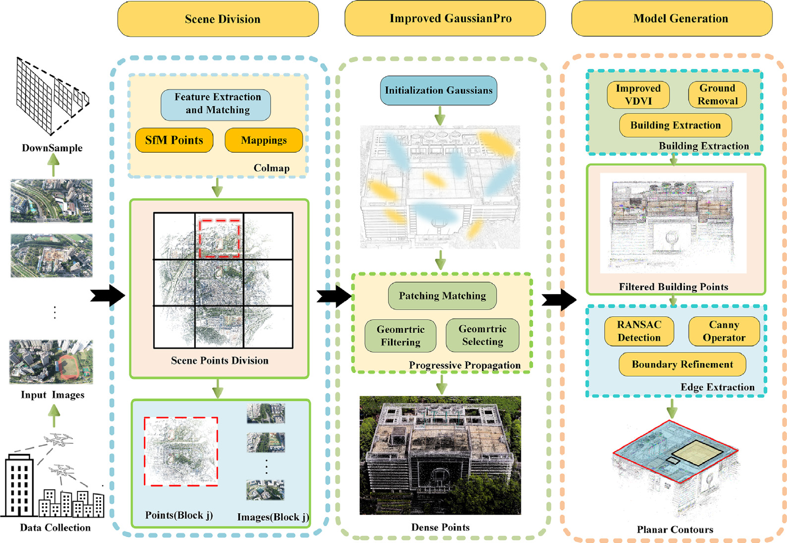

   **图 1** 算法框架的总体流程。

   图中三部分依次为场景划分、改进 GaussianPro 和模型生成。主要标注为数据采集、输入图像、降采样、特征提取与匹配、SfM 点、映射、场景点划分、区块点与图像、高斯初始化、图像块匹配、几何滤波、几何选择、渐进传播、密集点、改进 VDVI、地面去除、建筑提取、过滤后的建筑点、RANSAC 检测、Canny 算子、边界细化、边缘提取和平面轮廓。

2.1 场景划分
~~~~~~~~~~~~

2.1.1 稀疏点云生成
^^^^^^^^^^^^^^^^^^

3DGS 模型和场景分割需要将相机参数与稀疏点云作为输入。通常使用开源软件 COLMAP（\ :ref:`Schönberger, Zheng, Frahm, & Pollefeys, 2016 <zhao2025-reference-47>`\ ）预处理数据集，以获得这些数据。首先，使用 SIFT（\ :ref:`Lowe, 2004 <zhao2025-reference-33>`\ ）提取图像中的特征信息，包括特征点的数量与位置、相机到物体距离的尺度，以及梯度方向。随后，使用这些特征信息进行特征匹配和几何验证（\ :ref:`Lowe, 1999 <zhao2025-reference-32>`\ ）。接着，选择两张特征匹配结果较好的图像，估计其位姿，并通过三角测量生成三维点。按照匹配点数量最多的原则选择下一张匹配图像，重复位姿估计和三角测量操作，获得稀疏点云和相机参数。数据处理流程如图 2 所示。

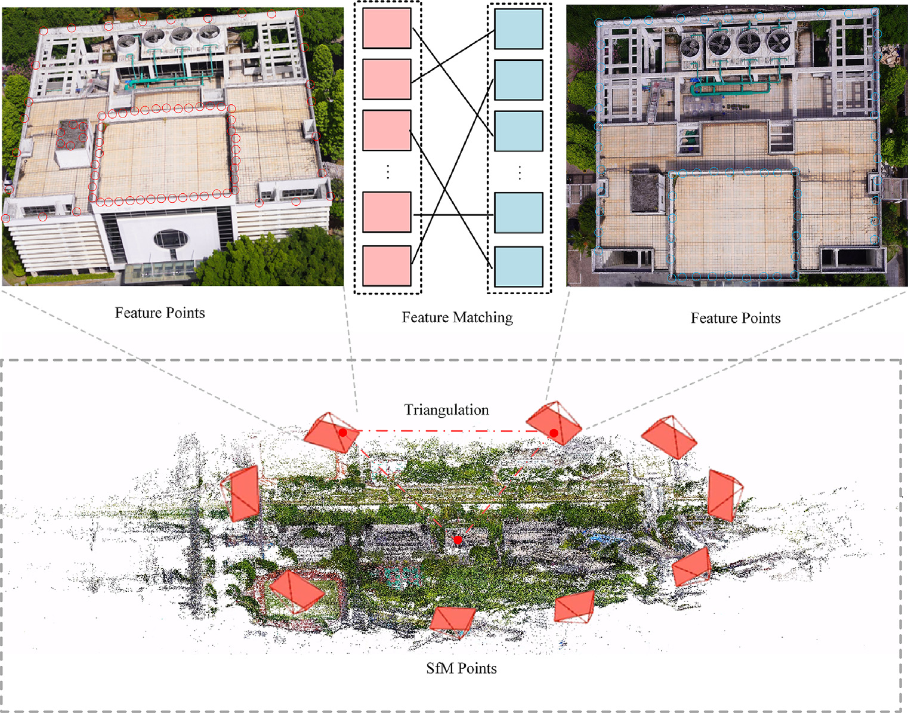

   **图 2** 运动恢复结构（SfM）的工作原理。

   图内标注依次为特征点、特征匹配、三角测量和 SfM 点。

2.1.2 基于映射关系的数据分区
^^^^^^^^^^^^^^^^^^^^^^^^^^^^

由于显存等计算资源的限制，直接重建大型城市场景显然具有挑战性。本文采用类似 Mega-NeRF（\ :ref:`Turki et al., 2022 <zhao2025-reference-53>`\ ）的分而治之策略，该策略依据相机参数划分场景。利用 COLMAP 获得的图像二维关键点与稀疏点之间的映射关系，将场景准确划分为均匀区块。随后，为每个区块分配一个 3DGS 模型进行训练。具体的场景划分和数据分割方法如下。

具体而言，从每张图像提取特征点（二维关键点）后，通过特征匹配对图像和特征点进行配对，再通过稀疏重建得到初始点（三维点）。如图 3 所示，该过程建立了点云中的三维点与图像中的二维关键点之间的映射关系。本研究首先采用统计离群点去除（SOR）滤波，去除离群噪声点。接着，沿点云边界使用三维包围盒包围整个场景，并沿 xy 平面将其划分为均匀区块。依据各子区域中的三维点与图像二维关键点之间的映射关系划分数据集。值得注意的是，稀疏点云中的三维点对应于多张图像中的关键点。同样，一张图像中的二维关键点与多个区块的三维点存在映射关系。因此，设置一个比例阈值，筛选对某个子区域有较大贡献的图像。当一张图像中对应某个子区域的二维关键点占比超过该阈值时，认为该图像对这个子区域具有显著贡献，并将其分配给该子区域。数据分区后，每个区块包含对应的稀疏点云、图像和相机参数。

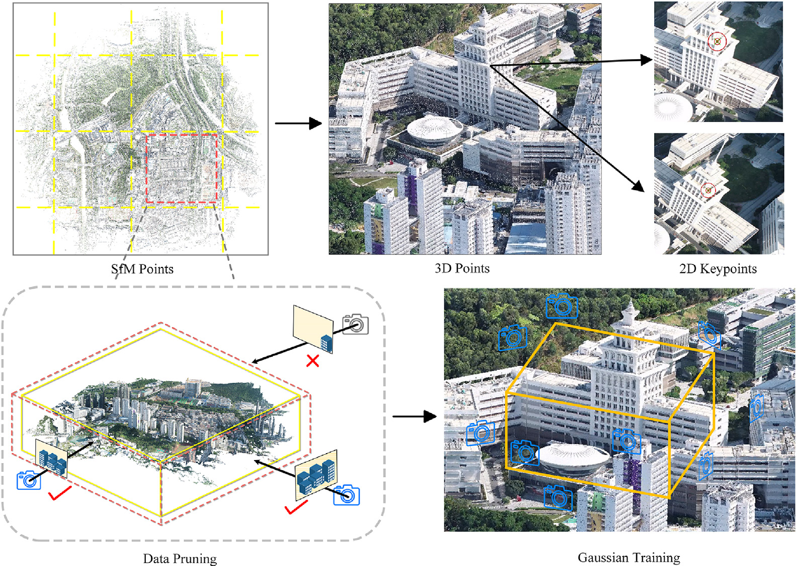

   **图 3** 基于映射关系的场景划分。

   图内标注为 SfM 点、三维点、二维关键点、数据裁剪及高斯训练；保留区块边界、相机位置与数据选择标记。

2.2 密集点云
~~~~~~~~~~~~

2.2.1 三维高斯泼溅
^^^^^^^^^^^^^^^^^^

本研究采用三维高斯泼溅（3DGS）（\ :ref:`Kerbl et al., 2023 <zhao2025-reference-26>`\ ）方法生成建筑密集点云。不同于传统 MVS 方法，该方法无需估计法向量，显著加快重建过程。3DGS 的输入包括一组图像和 SfM 稀疏点。最初，将每个 SfM 点初始化为三维高斯分布，具有位置均值 :math:`\mu`\ 、协方差矩阵 :math:`\Sigma` 和不透明度 :math:`\alpha` 等属性。这种类似椭球且可微的分布便于持续训练，从而优化和加密。高斯分布 :math:`G(x)` 由其中心点（均值）和完整的三维协方差矩阵 :math:`\Sigma` 定义（\ :ref:`Zwicker, Pfister, Van Baar, & Gross, 2001 <zhao2025-reference-68>`\ ）：

.. math::

   G(x)=e^{-\frac{1}{2}(x-\mu)^{\mathrm{T}}\Sigma^{-1}(x-\mu)}. \qquad (1)

显然，\ :math:`\Sigma` 在几何上可微，可以直接优化，以改变高斯椭球的位置、大小和方向等，获得准确的三维高斯分布。将协方差矩阵 :math:`\Sigma` 定义为描述一个椭球，可确保其半正定性和物理意义。因此，可以得到：

.. math::

   \Sigma=\mathbf{R}\mathbf{S}\mathbf{S}^{\mathrm{T}}\mathbf{R}^{\mathrm{T}}, \qquad (2)

其中，\ :math:`\mathbf{R}` 为旋转矩阵，\ :math:`\mathbf{S}` 为尺度矩阵。

初始化后，高斯分布可能存在缺乏几何特征的区域，以及高斯覆盖面积过大的区域。这两类区域分别称为欠重建区域和过重建区域。自适应高斯密度控制可以优化这些区域。在欠重建区域复制已有高斯，在过重建区域分裂高斯，能够有效解决这些问题。

该框架在 GaussianPro（\ :ref:`Cheng et al., 2024 <zhao2025-reference-8>`\ ）的基础上生成点云，并基于 3DGS 进一步优化自适应高斯密度控制。与直接克隆和剪枝高斯点的 3DGS 相比，GaussianPro 使用渐进传播策略监督高斯分布加密，从而获得更准确的高斯场景。具体而言，先将三维高斯投影到二维平面，形成法向图和深度图，如图 4 所示。随后，将深度图与法向图中的每个像素转换为一个三维平面 :math:`(d,\mathbf{n})`\ ，其中 :math:`\mathbf{n}` 是为该像素渲染的法向量，\ :math:`d` 是相机坐标原点到该平面的距离。计算公式如下：

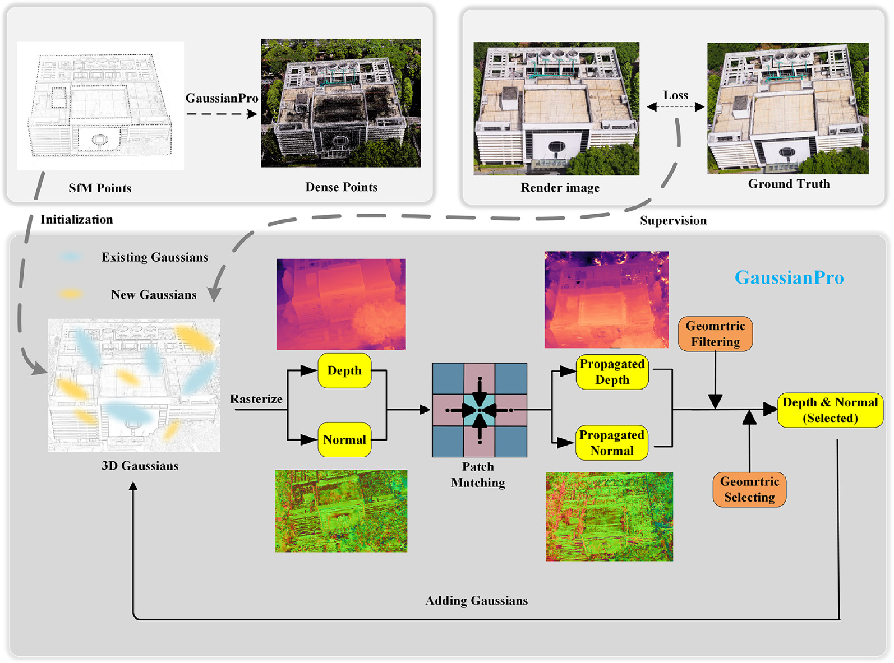

   **图 4** GaussianPro 的工作原理。

   图内标注包括 SfM 点、密集点、初始化、渲染图像、真实图像、损失与监督；下部为已有高斯、新高斯、三维高斯、光栅化、深度、法向、图像块匹配、传播深度、传播法向、几何滤波、几何选择、选定深度与法向，以及添加高斯。

.. math::

   d=z\mathbf{n}^{\mathrm{T}}\mathbf{K}^{(-1)}\widetilde p, \qquad (3)

其中，\ :math:`z` 为该像素的渲染深度值，\ :math:`\mathbf{K}` 为相机内参，\ :math:`\widetilde p` 为像素的齐次坐标。

定义平面后，使用 ACMH（\ :ref:`Xu & Tao, 2019 <zhao2025-reference-59>`\ ）中定义的棋盘格模式选择相邻像素，将其转换为三维平面作为候选平面。通过图像块匹配确定最优平面；对于像素 :math:`p`\ ，使用单应性变换 :math:`\mathbf{H}` 将其转换为 :math:`p'`\ ：

.. math::

   \widetilde p'\simeq\mathbf{H}\widetilde p, \qquad (4)

.. math::

   \mathbf{H}=\mathbf{K}\left(\mathbf{W}_{\mathrm r}-\frac{\mathbf{t}_{\mathrm r}\mathbf{n}_{\mathrm k}^{\mathrm{T}}}{d_{\mathrm k}}\right)\mathbf{K}^{-1}. \qquad (5)

其中，\ :math:`\mathbf{W}_{\mathrm r}` 和 :math:`\mathbf{t}_{\mathrm r}` 是从参考视角到相邻视角的相对变换矩阵。最后，采用归一化互相关（NCC）（\ :ref:`Mildenhall et al., 2021 <zhao2025-reference-37>`\ ）验证 :math:`p` 与 :math:`p'` 的颜色一致性，并选择颜色一致性最好的平面作为最优平面。利用多视图几何一致性检查（\ :ref:`Mildenhall et al., 2021 <zhao2025-reference-37>`\ ）进行几何滤波，去除不准确的深度和法向。计算滤波后深度与原始深度之间相对误差的绝对值，通过设置阈值判断一个区域中的高斯是否正确生成。最后执行几何选择，将错误像素重新投影回三维空间，再使用 3DGS 方法初始化新的高斯。

自适应密度控制后，需要将渲染图像与真实图像进行比较，最小化二者误差，以监督高斯泼溅点的优化。首先，将屏幕划分为 :math:`16\times16` 的区块，计算每个高斯点的相对深度。根据计算结果，使用一次快速 GPU 基数排序（\ :ref:`Merrill & Grimshaw, 2010 <zhao2025-reference-36>`\ ），将高斯点由近到远排序。最后，使用 :math:`\alpha` 混合（\ :ref:`Edelsbrunner et al., 1983 <zhao2025-reference-12>`\ ；\ :ref:`Kopanas, Philip, Leimkühler, & Drettakis, 2021 <zhao2025-reference-29>`\ ；\ :ref:`Mildenhall et al., 2021 <zhao2025-reference-37>`\ ）获得图像中像素的颜色。连接相机和图像像素形成一条射线，利用与射线相交的高斯点的颜色和不透明度，通过式（6）计算像素颜色，得到渲染图像。

.. math::

   C=\sum_{i\in N}c_i\alpha_i\prod_{j=1}^{i-1}(1-\alpha_j). \qquad (6)

其中，\ :math:`N` 为高斯点数量，\ :math:`c_i` 为高斯点的颜色，\ :math:`\alpha_i` 和 :math:`\alpha_j` 为高斯点的不透明度。

参数优化时，将渲染图像与原始图像比较，计算 :math:`L_1` 和 D-SSIM 损失。此外，引入法向与传播法向之间的一致性、角度损失 :math:`L_{\mathrm{normal}}`\ ，以及 NeuSG（\ :ref:`Chen, Li, & Lee, 2023 <zhao2025-reference-7>`\ ）的尺度正则化损失 :math:`L_{\mathrm{scale}}`\ ：

.. math::

   L_{\mathrm{normal}}=\sum_{p\in Q}\left\|\widehat N(p)-\overline N(p)\right\|_1+\left\|1-\widehat N(p)^{\mathrm{T}}\overline N(p)\right\|_1, \qquad (7)

.. math::

   L=(1-\lambda)L_1+\lambda L_{\mathrm{D-SSIM}}+L_{\mathrm{planar}}, \qquad (8)

.. math::

   L_{\mathrm{D-SSIM}}(I_1,I_2)=1-\mathrm{SSIM}(I_1,I_2), \qquad (9)

.. math::

   L_{\mathrm{planar}}=\beta L_{\mathrm{normal}}+\gamma L_{\mathrm{scale}}. \qquad (10)

其中，\ :math:`\widehat N` 为渲染法向，\ :math:`\overline N` 为传播法向；\ :math:`I_1` 和 :math:`I_2` 分别为真实图像和渲染图像。通过损失函数优化点的位置、颜色、协方差矩阵、球谐系数和不透明度。

2.2.2 实施
^^^^^^^^^^

三维高斯泼溅模型的输入由无人机采集的一组重叠图像组成。研究区域内最高的建筑高 120 m（图 5）。无人机飞行路径见图 6。采用有规律的飞行路径采集数据，提高了效率并保证了数据质量，共获得 1560 张图像。使用三次样条插值将图像分辨率降低至 1k，可在对点云精度影响很小的情况下，显著降低计算资源消耗。

我们使用 Nvidia RTX4090 24 GB 图形处理器（GPU）测试所提方法。为生成所需建筑点云，将训练总迭代次数设为 12,000，加密间隔设为每 150 次操作。其他参数参见 GaussianPro。

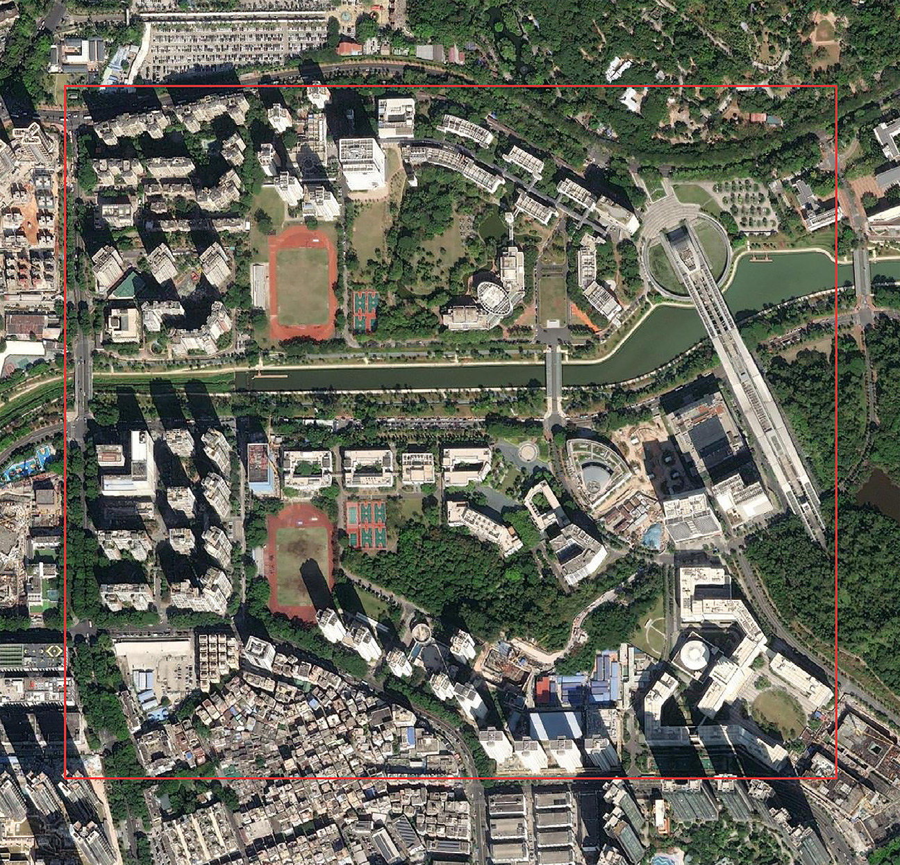

   **图 5** 研究区域。

   红框标示研究范围。

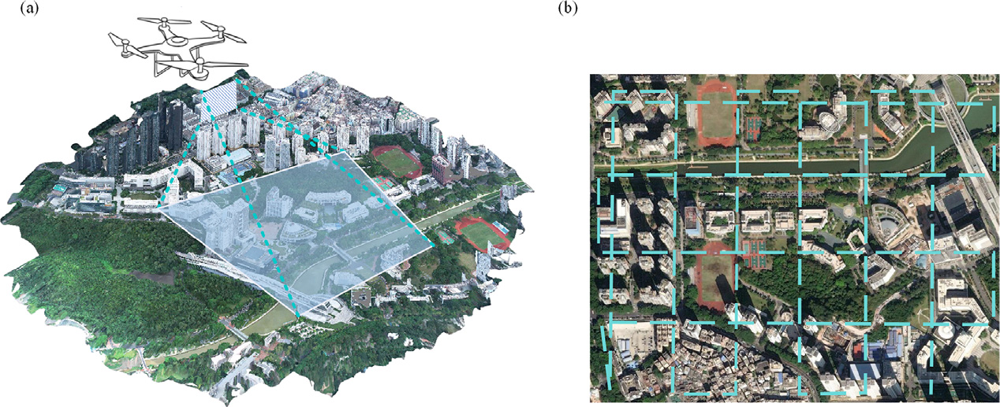

   **图 6** 无人机飞行路径。

   (a) 飞行采集示意；(b) 平面航线。

2.3 模型生成
~~~~~~~~~~~~

2.3.1 建筑点提取
^^^^^^^^^^^^^^^^

获得密集点云后，场景中通常存在噪声和非建筑点云（如植被和地形），会显著影响后续模型重建。由于 3DGS 的自适应密度控制，场景中高斯点的数量、位置等参数在训练中得到优化。因此，生成的场景点云在场景内部或建筑周围几乎没有难以去除的噪声点，噪声点仅以聚簇形式出现在场景外部。本文提出高度区间统计算法（height interval statistical algorithm，HISA），去除噪声和非建筑点云。具体而言，首先获得点云在 :math:`z` 轴上的最大值 :math:`z_{\max}` 和最小值 :math:`z_{\min}`\ ，再对该区间进行分段；去噪时分段大小设为 3 m。统计每个区间的点数（图 7），设置 15,000 的阈值以去除聚簇噪声。主体区域的点云数量较多，而极端错误点所在高度区间的点数很少，因此可以通过设置阈值轻易去除极端错误点。随后，计算每个点的改进 VDVI 指数，分离植被点云（图 8）。对剩余点云再次分段，区间设为 2 m，再次统计各区间的点数。最后，选择并提取末端区间中的点作为地面（图 7）。

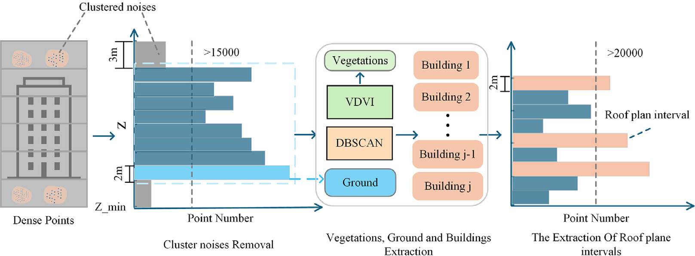

   **图 7** 高度区间统计算法的工作流程。（关于本图图例中的颜色说明，请参阅原论文的网络版本。）

   图中包括聚簇噪声、密集点、噪声簇去除、植被／地面／建筑提取和屋顶平面区间提取；坐标为高度 Z 与点数，点数阈值标为 >15,000 和 >20,000。图中去噪高度分段标为 3 m，地面分段与右侧屋顶分段均标为 2 m；正文第 2.3.2 节屋顶提取区间写为 1.5 m，图文差异保持原样。

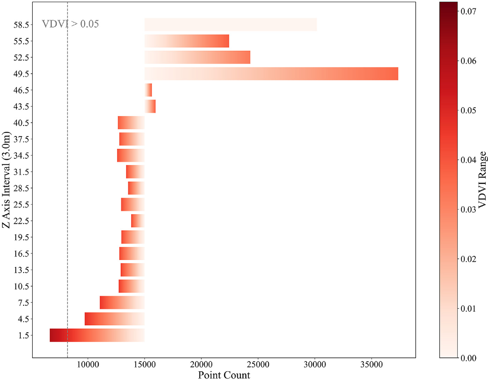

   **图 8** 沿 Z 轴（竖向）的点分布及 VDVI 指数。

   横轴为点数，纵轴为 Z 轴高度区间（3.0 m），色标为 VDVI 范围；图内保留 VDVI > 0.05 的标记。

对于植被点云提取，3DGS 在训练过程中会生成蓝色和红色异常点。因此，在提取绿色植被点云时，也应去除这些异常点。本文通过改进可见光波段差异植被指数（VDVI）（\ :ref:`Wang et al., 2015 <zhao2025-reference-56>`\ ）解决这一问题，公式如下：

.. math::

   \mathrm{VDVI}_{\mathrm{green}}=\begin{cases}0\\\dfrac{2G-(R+B)}{2G+R+B}\end{cases}, \qquad (11)

.. math::

   \mathrm{VDVI}_{\mathrm{blue}}=\begin{cases}0\\\dfrac{2B-(R+G)}{2B+R+G}\end{cases}, \qquad (12)

.. math::

   \mathrm{VDVI}_{\mathrm{red}}=\begin{cases}0\\\dfrac{2R-(G+B)}{2R+G+B}\end{cases}. \qquad (13)

其中，\ :math:`R`\ 、\ :math:`G` 和 :math:`B` 分别为颜色三个通道的值。

.. note::

   译注：原文式（11）–（13）均以两行分段式排版，但没有给出各行的适用条件，此处保持原式，不自行补出截断或判断规则。

如图 8 所示，VDVI 指数超过阈值（本文设为 0.05）的点被划分为植被。由于植被通常较低，植被点云位于 :math:`Z` 轴坐标值较小的高度范围。

同时，地形点位于 Z 坐标值最小的区间。处理植被点云后，再次应用 HISA，可得到不含植被点、分层明显的结果（图 9）。结果的最底层即为地形点。

植被和地形点云的提取结果见图 9。在 HISA 结果中，分层点云的深蓝色部分代表地形点。随后，使用 DBSCAN（\ :ref:`Ester et al., 1996 <zhao2025-reference-13>`\ ）快速聚类并提取单栋建筑点，以建立几何模型。

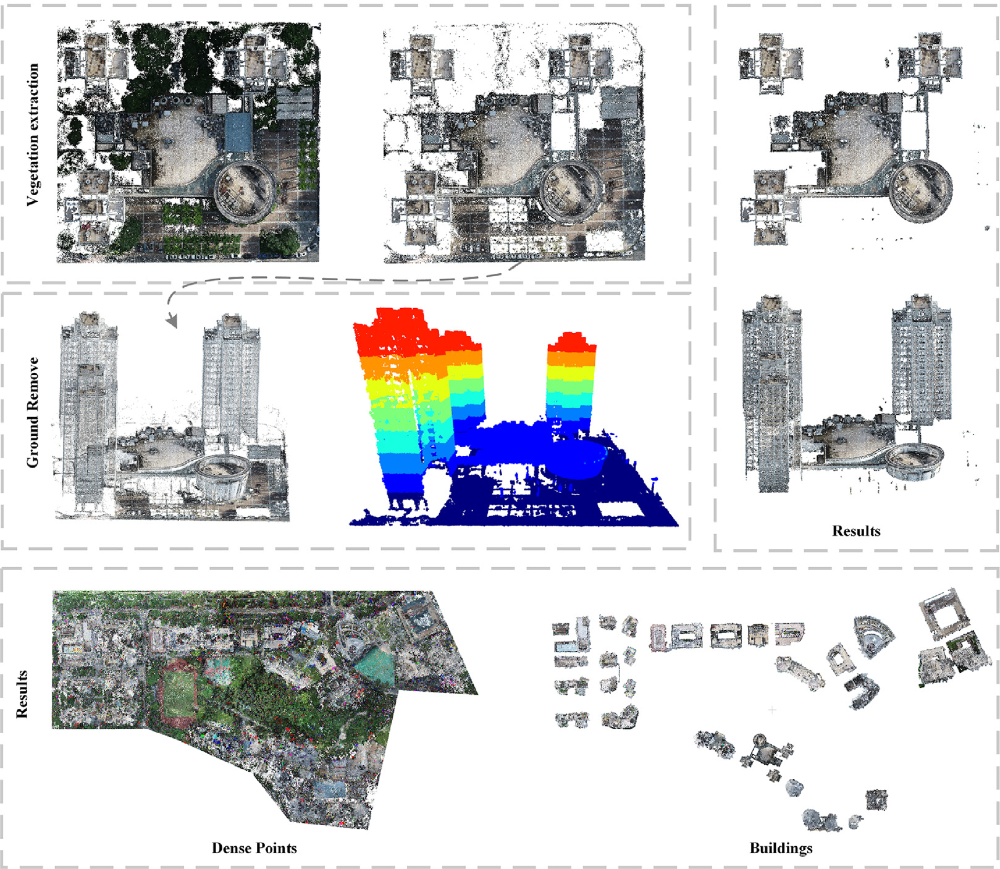

   **图 9** 植被、地形和建筑点提取。（关于本图图例中的颜色说明，请参阅原论文的网络版本。）

   图中展示植被提取、地面去除及结果，并列给出密集点与分离后的建筑。

2.3.2 屋顶轮廓提取
^^^^^^^^^^^^^^^^^^

通过点云生成规则几何模型，需要提取并细化建筑轮廓。首先，HISA 以新的点云数量阈值（20,000）筛选屋顶平面区间。分段区间大小设为 1.5 m，以提取所有包含屋顶平面的区间（图 7）。随后，使用 RANSAC（\ :ref:`Fischler & Bolles, 1981 <zhao2025-reference-15>`\ ）提取这些区间内全部候选建筑平面点云。最后，采用 DBSCAN（\ :ref:`Ester et al., 1996 <zhao2025-reference-13>`\ ）结合点密度识别真实平面。由于真实平面簇的点密度显著高于非平面簇，结合密度和 DBSCAN 可以有效识别并去除非平面簇点（图 10）。

随后，应用形态学膨胀和腐蚀提取屋顶平面，填补边缘缺陷和内部孔洞，恢复平面边缘形状。如图 11 所示，首先将平面中的每个簇投影到二值矩阵。接着，让一个结构元素在矩阵上移动。对于膨胀，当结构元素与二值矩阵相交时，保留其原点处的值；对于腐蚀，当结构元素完全包含在对象内时，保留原点处的值，否则将其去除。最后，使用 Canny 算子（\ :ref:`Canny, 1986 <zhao2025-reference-6>`\ ）提取平面边界，并取最长的边界作为建筑屋顶的平面轮廓。

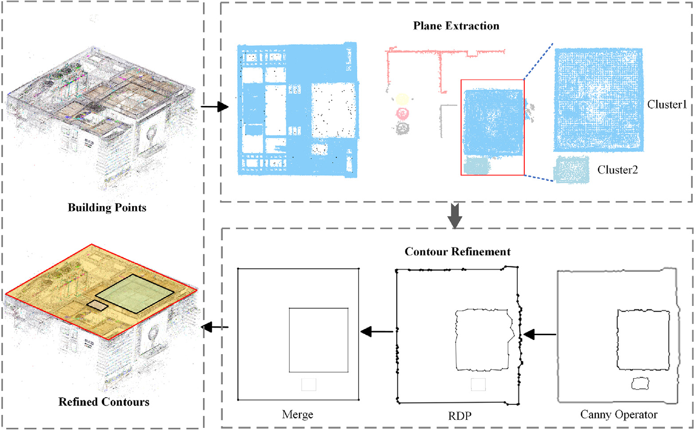

   **图 10** 建筑轮廓提取与细化。

   图中标注为建筑点、平面提取、簇 1／簇 2、轮廓细化、Canny 算子、RDP、合并，以及细化后的轮廓。

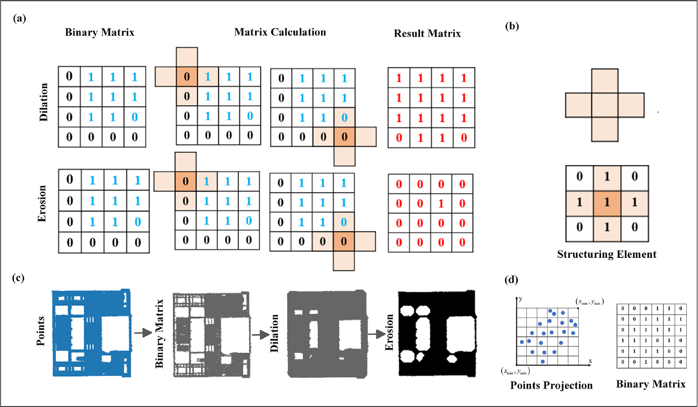

   **图 11** 膨胀与腐蚀。

   (a) 二值矩阵、矩阵计算、结果矩阵及膨胀／腐蚀对照；(b) 结构元素；(c) 点、二值矩阵、膨胀及腐蚀的处理链；(d) 点投影和二值矩阵。

2.3.3 轮廓细化
^^^^^^^^^^^^^^

Canny 算子提取的屋顶轮廓较粗糙，需要减少轮廓点并进行规则化。该算法框架首先采用 Ramer–Douglas–Peucker（RDP）算法（\ :ref:`Douglas & Peucker, 1973 <zhao2025-reference-11>`\ ），在保留原轮廓曲线基本形状的同时，尽量减少轮廓点数量。随着轮廓点减少，计算效率提高，同时避免轮廓不平整问题。对于连接多个点的折线，连接起点和终点形成一条直线，再计算其余各点到直线的距离 :math:`d`\ ，并选择最大距离 :math:`d_{\max}`\ （图 12(a)）。如果 :math:`d_{\max}` 小于阈值，则用起点与终点的连线近似该折线。反之，如果 :math:`d_{\max}` 超过阈值，则将该点分别与起点和终点连接（图 12(b)）。随后重复上述步骤进行简化，直至得到最终轮廓（图 12(d)）。

简化后，采用 :ref:`Zhang, Yan, and Chen（2006） <zhao2025-reference-65>`\ 提出的分割、合并与相交简化规则细化轮廓。当一条近水平斜线段在 :math:`x` 轴上的投影长于其在 :math:`y` 轴上的投影，并且 :math:`y` 轴投影小于阈值时，执行分割操作（图 13(a)）。图 13(b) 显示相交操作，用于恢复 RDP 简化中丢失的直角。当两条平行线段之间的距离小于阈值时，将其替换为折线段（图 13(c)）。

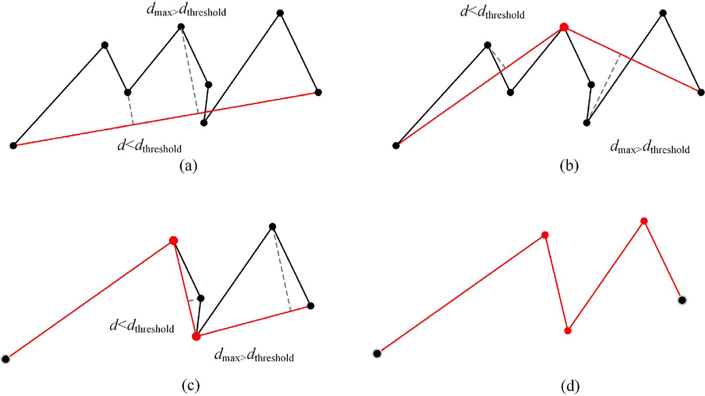

   **图 12** RDP 流程图。

   (a)–(d) 保留各阶段折线、最大距离及阈值比较标记。

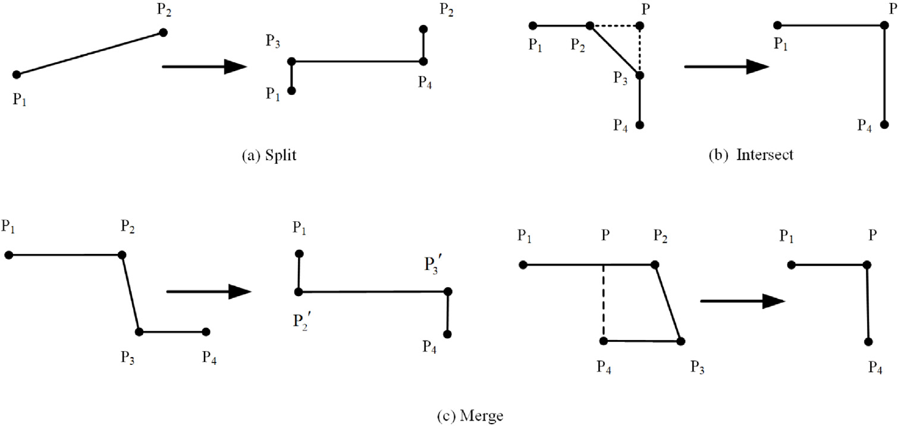

   **图 13** 分割、相交与合并。

   (a) 分割；(b) 相交；(c) 合并，保留所有端点及变换后的点标记。

轮廓细化结果如图 10 所示。优化后的平面轮廓消除了会影响后续 CFD 网格质量的尖角和短边。随后，利用得到的建筑轮廓在 Rhinoceros 中生成模型。具体而言，按平面编号对轮廓点分类，将属于同一建筑平面的轮廓点构造成闭合多边形。最后，通过多边形边界生成曲面，并拉伸至相应高度，形成棱柱实体。

3 结果与讨论
------------

3.1 密集点云
~~~~~~~~~~~~

本研究基于 GaussianPro 模型进行改进，以快速生成准确的密集点。研究区域的密集点云如图 9 所示，图 14 展示了选定建筑的训练结果和密集点。从左至右，图中分别为初始稀疏点云、高斯椭球的渲染场景、场景中的高斯椭球，以及最终密集点云。可以看出，场景由大量高斯椭球组成，其质心对应密集点云中的点位置。场景中大多数高斯椭球的位置正确，尺寸差异很小。这表明在训练过程中，3DGS 模型捕捉到了足够的建筑细节，从而生成较高质量的密集点云。

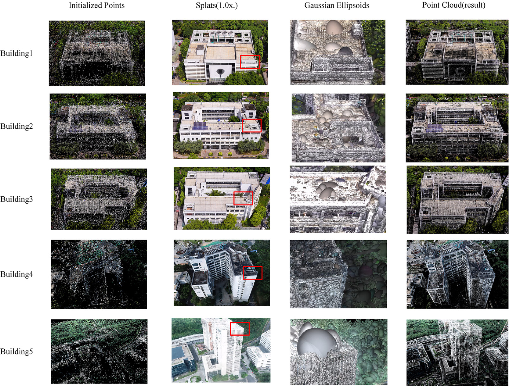

   **图 14** 选定建筑的密集点云。

   五行分别对应建筑 1–5；四列依次为初始化点、泼溅渲染（Splats, 1.0x）、高斯椭球和点云结果。

我们采用 MVSNet（\ :ref:`Yao et al., 2018 <zhao2025-reference-60>`\ ）建议的评价指标，从准确度和完整性方面评估生成的点云质量。评价指标包括距离度量（\ :ref:`Aanæs, Jensen, Vogiatzis, Tola, & Dahl, 2016 <zhao2025-reference-1>`\ ，越低越好）与百分比度量下的准确度（Accuracy，Acc）和完整性（Completeness，Comp）。此外，还考虑了精确率（Precision，Pre）、召回率（Recall，Rec）和 f-score（\ :ref:`Knapitsch, Park, Zhou, & Koltun, 2017 <zhao2025-reference-28>`\ ，越高越好）。由于计算资源有限，仅选择图 14 中五栋代表性建筑（B1、B2、B3、B4、B5）进行评估，结果见表 1。

.. list-table:: 表 1 选定建筑的质量评价结果
   :header-rows: 1
   :class: longtable

   * - 建筑
     - 准确度 Acc（m）
     - 完整性 Comp（m）
     - 精确率 Pre（<0.2 m）
     - 召回率 Rec（<0.2 m）
     - f-score（<0.2 m）
     - 精确率 Pre（<0.5 m）
     - 召回率 Rec（<0.5 m）
     - f-score（<0.5 m）
   * - B1
     - 0.2251
     - 0.3701
     - 64.25
     - 32.16
     - 42.87
     - 94.61
     - 73.12
     - 82.49
   * - B2
     - 0.2067
     - 0.8105
     - 97.08
     - 57.43
     - 70.14
     - 98.66
     - 84.31
     - 90.93
   * - B3
     - 0.2071
     - 0.2057
     - 89.82
     - 61.20
     - 72.79
     - 98.83
     - 90.20
     - 94.32
   * - B4
     - 0.2168
     - 0.3960
     - 65.24
     - 35.01
     - 45.57
     - 89.86
     - 77.98
     - 83.50
   * - B5
     - 0.2648
     - 0.3755
     - 76.56
     - 61.25
     - 68.05
     - 90.63
     - 81.70
     - 85.93

结果表明，3DGS 方法生成的密集点云具有较高的准确度（Acc），但完整性（Comp）和召回率（Rec）指标相对较低。这是由于 3DGS 方法使用较大的高斯椭球覆盖颜色变化不明显的局部区域（\ :ref:`Cheng et al., 2024 <zhao2025-reference-8>`\ ），导致点云细节丢失。由于植被遮挡，B2 的建筑侧面细节缺失，完整性表现较差（\ :ref:`Kim, Lee, & Lee, 2024 <zhao2025-reference-27>`\ ）。不过，这些问题只出现在接近底部的立面和颜色较暗的局部区域，对后续几何模型构建影响很小。B3 周围植被较少，与其他建筑相比，其完整性（Comp）和召回率（Rec）指标较高。B1 和 B4 的 f-score 低于其他建筑，这是因为其屋顶结构为黑色，与 3DGS 模型设置的背景颜色相近，导致这些区域训练效果不佳、点云质量较低。尽管这些问题造成局部建筑细节丢失，整体点云质量仍能满足建筑几何重建需求。

我们还使用相同数据集，将所提方法的精度和效率与其他方法进行比较。结果见表 2，图 15 更清楚地展示了与其他方法的差异。虽然 3DGS 方法的完整性略低于 MVS 方法，但其准确度高于 MVS 及 NeRF 等其他方法。与其他方法中质量最高的 COLMAP 相比，所提算法框架的准确度平均提高 12%，并且生成结果的速度快得多。值得注意的是，虽然 Context Capture（CC）比其他方法稍快，但仍比所提方法慢 2–3 倍，而且其使用降采样图像生成的点云质量远低于其他方法和 3DGS 的结果。

.. list-table:: 表 2 与其他方法的准确度及速度比较
   :header-rows: 1
   :class: longtable

   * - 方法
     - B1 Acc（m）
     - B1 时间（h）
     - B2 Acc（m）
     - B2 时间（h）
     - B3 Acc（m）
     - B3 时间（h）
     - B4 Acc（m）
     - B4 时间（h）
     - B5 Acc（m）
     - B5 时间（h）
   * - 本文方法
     - 0.2251
     - 0.28
     - 0.2067
     - 0.25
     - 0.2071
     - 0.28
     - 0.2168
     - 0.20
     - 0.2648
     - 0.30
   * - COLMAP（\ :ref:`Han et al., 2015 <zhao2025-reference-22>`\ ）
     - 0.4632
     - 1.50
     - 0.3137
     - 1.23
     - 0.2238
     - 1.43
     - 0.1379
     - 0.88
     - 0.3507
     - 1.23
   * - Context Capture
     - —
     - 0.72
     - —
     - 0.67
     - —
     - 0.77
     - —
     - 0.47
     - —
     - 0.70
   * - NeuS（\ :ref:`Wang et al., 2021 <zhao2025-reference-55>`\ ）
     - 0.7257
     - 6.50
     - 0.6431
     - 4.06
     - 0.5981
     - 5.58
     - 0.7942
     - 5.45
     - 0.7641
     - 5.65
   * - NeuDA（\ :ref:`Fabbri & Costanzo, 2020 <zhao2025-reference-14>`\ ）
     - 0.7043
     - 4.38
     - 0.5074
     - 3.80
     - 0.6550
     - 5.90
     - 0.7825
     - 3.18
     - 0.8543
     - 5.03

.. note::

   译注：上段“平均提高 12%”按原文陈述保留，比较仅涉及表 2 的五栋建筑，且 B4 的 Acc 为 0.2168 m，高于 COLMAP 的 0.1379 m，并非逐栋均有改善。原文表 2 将 COLMAP 引为 :ref:`Han et al.（2015） <zhao2025-reference-22>`\ ，将 NeuDA 引为 :ref:`Fabbri & Costanzo（2020） <zhao2025-reference-14>`\ ；这些引文与文末列出的文献题名存在对应疑点，本页保留原表引用而不擅自替换。

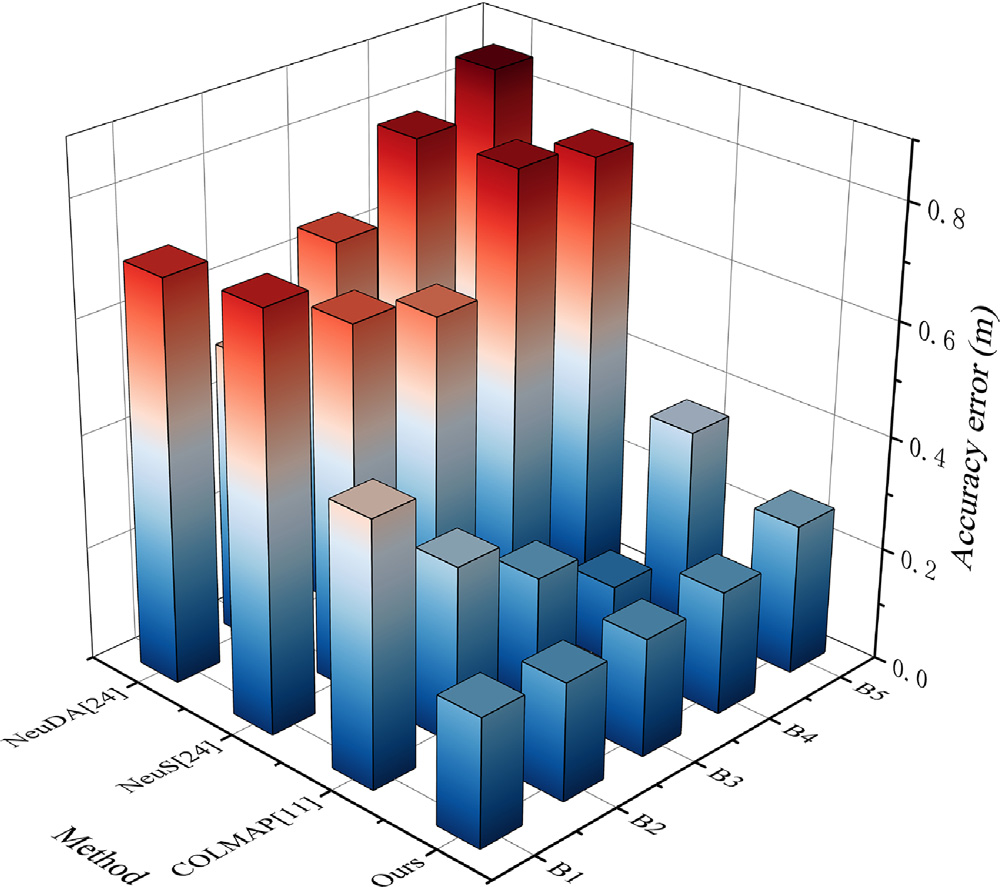

   **图 15** 所提算法与其他方法在测试数据上的准确度比较。

   纵轴为准确度误差（m），底部为方法及建筑 B1–B5。方法包括 NeuDA、NeuS、COLMAP 和本文方法；原图中的方括号引注保留于图内。

数据集质量直接影响点云和几何模型的精度。无人机数据采集过程中的天气、日照等因素，会显著影响图像数据集质量（\ :ref:`Rosnell, Honkavaara, & Nurminen, 2012 <zhao2025-reference-46>`\ ）。为考察天气影响，本研究测试了晴天和光照充足的阴天两种条件。晴天时，强光可能造成过曝（图 16(b)），无法捕捉建筑细节。亮度提高会使建筑白色部分的颜色趋于一致，加剧 3DGS 训练中的细节丢失。因此，需要降低图像曝光，通常设为 −0.3，但不能过低，以免图像过暗而不利于点云生成。拍摄通常安排在太阳正午。下午和傍晚时，太阳角度使建筑上出现大片阴影，光照强度下降导致颜色趋同，使原本较暗的物体（尤其是植被）进一步变暗（图 17(a)），造成 3DGS 训练中密集点云细节大量丢失（图 17(b)）。阴天但光照充足的条件适合无人机拍摄，可提供适中且一致的光照，没有建筑阴影，从而保证数据集质量均匀。

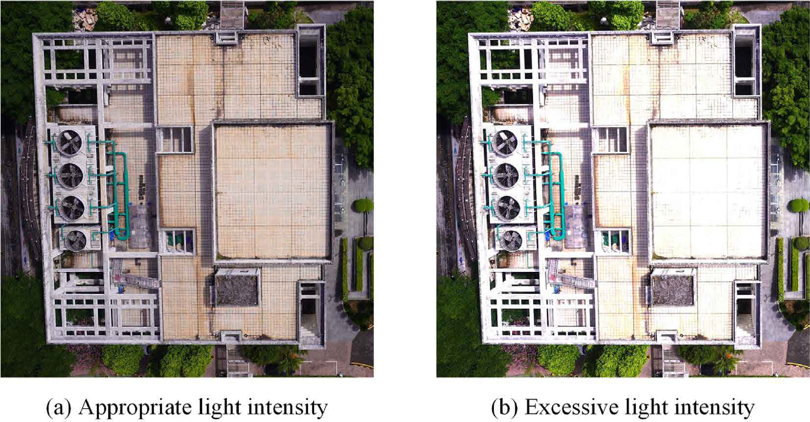

   **图 16** 适当光照强度与过高光照强度的比较。（关于本图图例中的颜色说明，请参阅原论文的网络版本。）

   (a) 适当光照强度；(b) 过高光照强度。

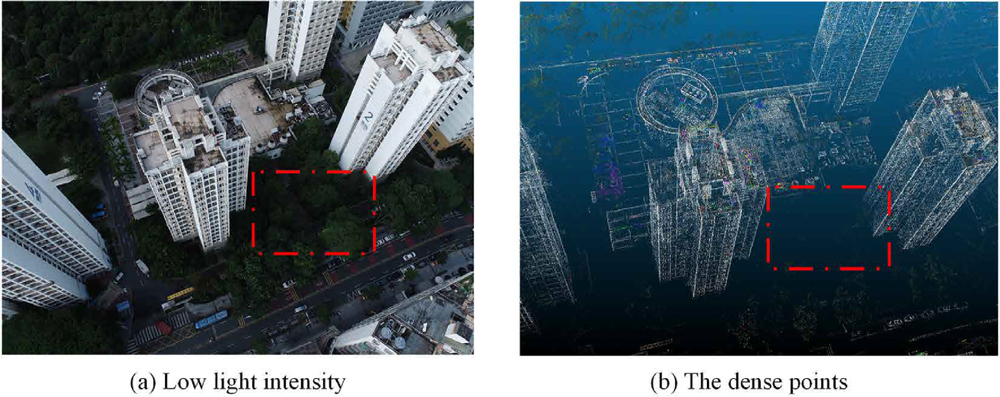

   **图 17** 不同光照强度下的重建表现。

   (a) 较低光照强度；(b) 密集点。

此外，图像数据重叠率也会影响本研究框架的效率和精度。重叠率过高，会增加点云生成时间；过低，则无法捕捉足够的场景细节。通常设为 75% 较合适。

3.2 建筑几何模型
~~~~~~~~~~~~~~~~

几何模型结果如图 18 所示。在 (a) 至 (e) 中，从左至右分别为建筑点云、平面轮廓和几何模型；(i) 展示整体场景结果，绿色部分表示植被。本文算法得到的几何模型具有规则的平面轮廓，能够较好地保留屋顶平面细节，不存在可能造成 CFD 计算发散的尖角和不平整问题，模型细节水平达到 LoD2 和 LoD2.5。由于大多数建筑立面仅包含窗户和阳台等构件，生成几何模型时会产生较短的平面和边，影响后续 CFD 网格划分质量。此外，图 18(a)、(d) 和 (e) 所示建筑由于植被遮挡和背景颜色设置，点云的立面细节存在明显问题，而屋顶细节保留较好。因此，几何模型生成不着重处理建筑立面细节，从而有效避免立面细节引起的几何质量问题，同时保证整体模型规则，并增加更多屋顶平面细节。

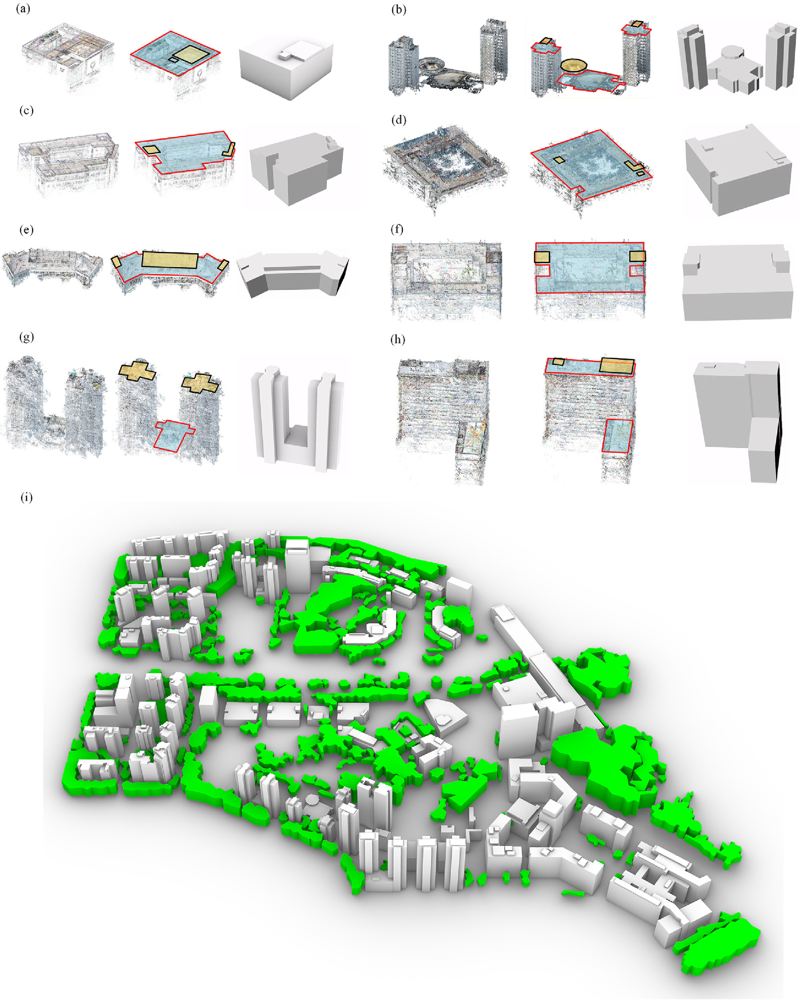

   **图 18** 几何模型重建结果。（关于本图图例中的颜色说明，请参阅原论文的网络版本。）

   (a)–(h) 给出建筑点云、轮廓和几何重建的对照；(i) 为整体场景，绿色表示植被。

3.3 计算资源分析
~~~~~~~~~~~~~~~~

该框架的计算资源需求主要集中在 CUDA 显存（VRAM）和物理内存。首先，对于密集点云生成，3DGS 在训练过程中会生成并存储数百万个高斯。因此，建议大规模重建任务使用不少于 24 GB 的显存（\ :ref:`Wang et al., 2021 <zhao2025-reference-55>`\ ）。使用显存较低的设备时，必须通过调整加密间隔、加密训练总次数等参数减少高斯点数量。

为验证这一点，在不同设备上测试了应用：RTX 4090（24 GB）、RTX 3090（24 GB）、Tesla T4（16 GB）和 RTX 3080ti（12 GB）。RTX 4090 和 RTX 3090 使用原参数（方案 A：150 和 12,000）成功重建密集点云。Tesla T4 调整参数后（方案 B：500 和 10,000）能够重建密集点云。RTX 3080ti 和 RTX 2080ti 只能重建单栋建筑的密集点云，说明其显存不足以处理较大场景。各显卡生成的点云结果表明，方案 A 与方案 B 之间存在明显差异，如图 19 所示。尽管有这些限制，方案 B 仍能在小规模场景或单栋建筑中生成相对完整的建筑密集点云。在几何模型生成方面，由于本研究没有使用机器学习或深度学习模型生成几何模型，因此对显存和物理内存的要求不高。

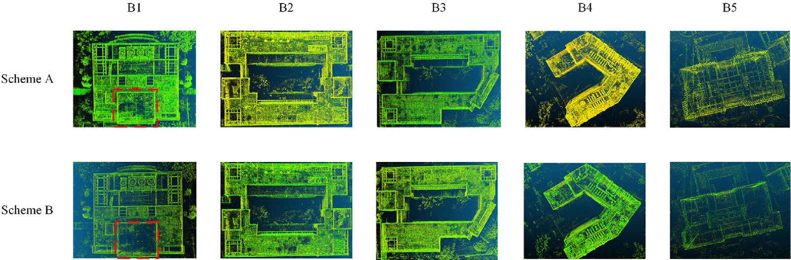

   **图 19** 方案 A 与方案 B 所获点云的比较。

   上行为方案 A，下行为方案 B；五列分别为 B1–B5。

至于后续 CFD 模拟和相关应用，本研究对象的网格总数为 1800 万，开展 CFD 模拟至少需要 128 GB 物理内存。用于网格收敛指数（GCI）计算的细网格数量达到 3790 万，需要 256 GB 物理内存才能开展 CFD 模拟和应用。

.. note::

   译注：本段的 1800 万为原文第 3.3 节报告值；第 4.1.1 节及表 3 的基础网格为 1680 万，两处数值均予以保留。原文测试设备清单未列 RTX 2080ti，但结果叙述提到了该型号，此处同样保留原述。

3.4 尚存的局限
~~~~~~~~~~~~~~

传统 MVS 方法和本研究采用的 3DGS 方法，在更大且更复杂的环境中均存在明显不足。随着重建场景增大，无人机往往需要多次飞行采集图像数据，导致数据质量不一致、生成点云的精度下降。此外，多次无人机飞行增加了时间成本。其次，两类方法都需要通过特征提取、特征匹配和空中三角测量算法生成稀疏点云，再进行密集重建。随着场景尺寸增大，无人机采集的图像数据集数量也增加，显著延长重建 SfM 稀疏点云所需时间（\ :ref:`Stathopoulou & Remondino, 2023 <zhao2025-reference-49>`\ ）。由数千张高度重叠图像生成稀疏点云，可能需要数小时甚至数天。

此外，在复杂形态和建筑密集的环境中，3DGS 和 MVS 方法生成的点云无法产生细致的建筑几何。例如，本研究提出的几何模型生成算法利用高度方向的点频数信息提取建筑平面细节。但对于形态复杂的建筑（如图 20 所示），由于存在许多难以仅凭点频数提取的小平面，无法生成足以表达这些细节的建筑几何。

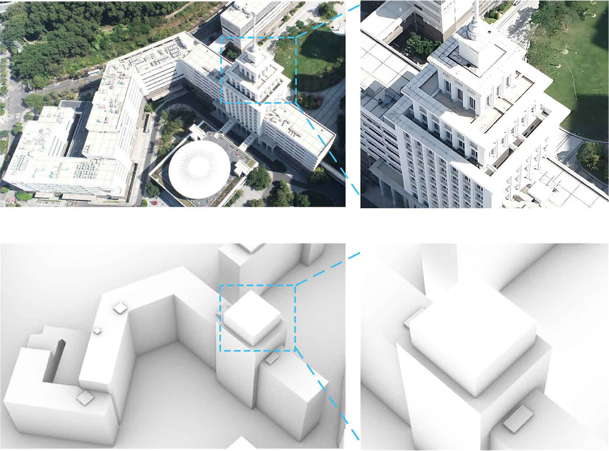

   **图 20** 复杂建筑的重建表现。

   上排为复杂屋顶的影像及局部放大，下排为重建几何及对应局部放大。

最后，在城中村等建筑更密集的场景中，生成点云中的建筑紧密相连。这使 DBSCAN（\ :ref:`Ester et al., 1996 <zhao2025-reference-13>`\ ）等依靠点密度提取不同建筑点云的方法失效，往往得到一个大型几何结构。本文以城中村为例，通过生成该区域的几何模型展示这些尚存不足，如图 21 所示。从图 21(a) 可明显看出，城中村建筑几乎相互连通，导致密集点云中的结构紧密相连。因此，在几何生成过程中难以将各建筑分离为独立实体，最终形成图 21(b) 所示的大型几何结构。

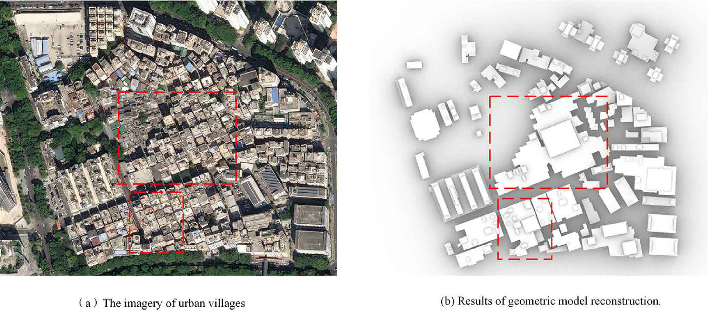

   **图 21** 建筑复杂度较高时的重建表现。

   (a) 城中村影像；(b) 几何模型重建结果。

4 应用
------

4.1 CFD 模拟
~~~~~~~~~~~~

4.1.1 计算域与网格
^^^^^^^^^^^^^^^^^^

为进一步验证建筑几何的有效性，开展 CFD 流体模拟。我们依据最佳实践指南（BPGs）（\ :ref:`Franke, Hellsten, Schlunzen, & Carissimo, 2011 <zhao2025-reference-17>`\ ；\ :ref:`Tominaga et al., 2008 <zhao2025-reference-52>`\ ）设计计算域范围。图 22 展示计算域尺寸，上风向边界距加密区设为研究区域最高建筑高度（\ :math:`H_{\max}`\ ）的 5 倍；侧向边界距加密区设为 :math:`5H_{\max}`\ ，下风向边界距加密区设为 :math:`15H_{\max}`\ ，计算域高度设为 :math:`6H_{\max}`\ （\ :ref:`Tominaga et al., 2008 <zhao2025-reference-52>`\ ）。加密区设为圆柱体，覆盖研究区域内所有建筑，直径为 :math:`20H_{\max}`\ ，高度为 :math:`2H_{\max}`\ 。计算域入口边界设为速度入口（velocity-inlet），通过用户自定义函数（UDF）将 C 类粗糙地貌对应的平均风速和湍流强度施加于入口。出口边界设为压力出口（pressure-outlet），侧面和顶部设为对称边界条件，地面和建筑设为无滑移壁面边界条件。

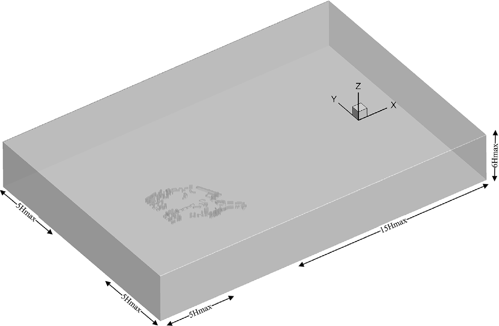

   **图 22** 计算域模型。

   保留坐标方向和边界距离标注：上游及侧向 5Hmax、下游 15Hmax、顶部高度 6Hmax。

我们生成三套网格以验证网格收敛，确保单元边长的连续加密比 :math:`r` 为 1.3。不允许采用更大的加密比，否则细网格单元数量会超过 4000 万。粗网格为 790 万个单元，基础网格为 1680 万个，细网格为 3790 万个。网格分辨率分别为：粗网格 1.44 m，基础网格 1.2 m，细网格 1 m。基础网格见图 23。

.. note::

   译注：原文同时写出连续加密比 1.3，以及 1.44／1.2／1 m 的分辨率，后者相邻之比为 1.2，二者并不一致。本页保持原文数值，不自行重新定义或改算其网格尺度。

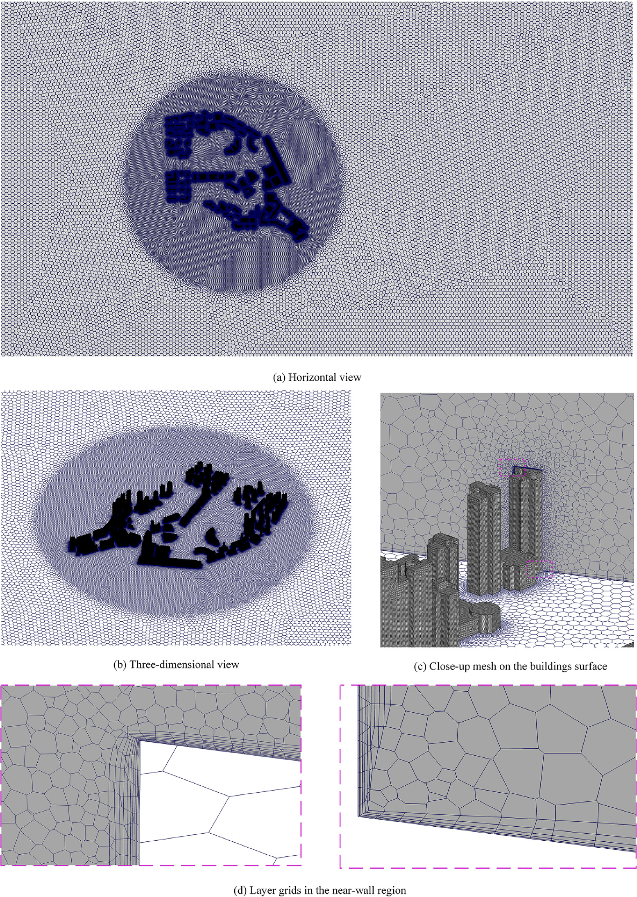

   **图 23** 研究区域内建筑的网格配置。

   (a) 水平视图；(b) 三维视图；(c) 建筑表面网格局部放大；(d) 近壁区层状网格，包含两个局部图。

4.1.2 数值模拟
^^^^^^^^^^^^^^

采用 :math:`k\text{-}\omega` SST RANS 湍流模型，进行三维不可压缩牛顿流体模拟。使用 Couple 算法求解稳态速度和压力，并采用二阶空间方法进行模拟。对平均风速 :math:`U`\ 、压力 :math:`p`\ 、湍动能 :math:`k`\ 、湍动能耗散率 :math:`\varepsilon` 和比耗散率 :math:`\omega` 等各分量，均以 :math:`1\times10^{-6}` 作为求解收敛的评价值。

数值模拟中有两种考虑植被对流场影响的方法。一种是修改壁面函数，以考虑粗糙度的阻力作用，但仅适用于光滑或低粗糙度地形（\ :ref:`Xie, Voke, Hayden, & Robins, 2004 <zhao2025-reference-58>`\ ）。该方法较简单，但在复杂地形中的精度较低。另一种是冠层流体模型，在冠层占据的空间内向 N-S 方程添加阻力源项，以模拟植被对流场的影响。具体而言，在 CFD 模拟之前，利用植被轮廓识别对应区域的单元，随后向这些单元添加动量、\ :math:`k` 和 :math:`\varepsilon` 等源项，以模拟植被作用。植被阻力源项公式如下：

.. math::

   S_u=-C_d a|u|U, \qquad (14)

.. math::

   S_k=C_d a\left(\beta_p|\mathbf{u}|^3-\beta_d|\mathbf{u}|k\right), \qquad (15)

.. math::

   S_{\varepsilon}=C_d a\left(c_{\varepsilon}\beta_p|\mathbf{u}|^3-c_{\varepsilon}\beta_d|\mathbf{u}|\varepsilon\right). \qquad (16)

其中，\ :math:`S_u` 表示由粗糙冠层引起的黏性阻力导致的风速损失，\ :math:`S_k` 和 :math:`S_{\varepsilon}` 表示粗糙冠层所引起的湍流生成与耗散的平衡；\ :math:`C_d` 是取决于地表遮挡物粗糙类型的阻力系数，\ :math:`a` 为叶面积密度，\ :math:`u` 是表示顺流、展向和竖向速度分量的流体分量向量，\ :math:`U` 为平均顺流速度；\ :math:`k` 和 :math:`\varepsilon` 分别为湍动能及其耗散率；\ :math:`\beta_p`\ 、\ :math:`\beta_d` 和 :math:`c_{\varepsilon}` 为模型常数（\ :ref:`Amorim, Rodrigues, Borrego, & Costa, 2010 <zhao2025-reference-3>`\ ）。本研究的所有 CFD 模拟均在配备 AMD EPYC 7573X 处理器、共 384 核的机架式高性能计算机上完成。

图 24 展示植被点的冠层棱柱。确定植被的空间分布和系数后，可以通过用户自定义函数（UDF）将植被对风场的影响纳入模拟过程。

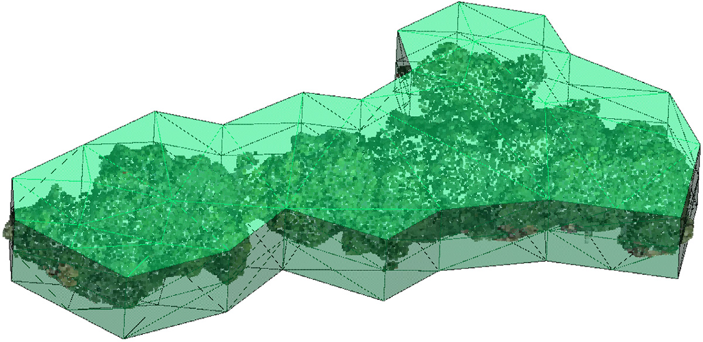

   **图 24** 植被点及棱柱。

   点云和半透明冠层棱柱共同显示植被的空间范围。

图 25 和图 26 展示研究区域 2 m 高度处的风速梯度与湍动能结果，表明所有模型均能得到稳定、连续的结果。值得注意的是，某些建筑迎风边缘附近的风速变化显著，建筑之间的狭窄街道或小巷中出现明显热点。这是因为风流经狭窄空间时加速，产生“风洞效应”，增大风速梯度，可能影响这些区域的行人舒适度。在没有较多建筑阻挡的开阔区域，风速变化更平缓，因此风速梯度和湍动能较小。

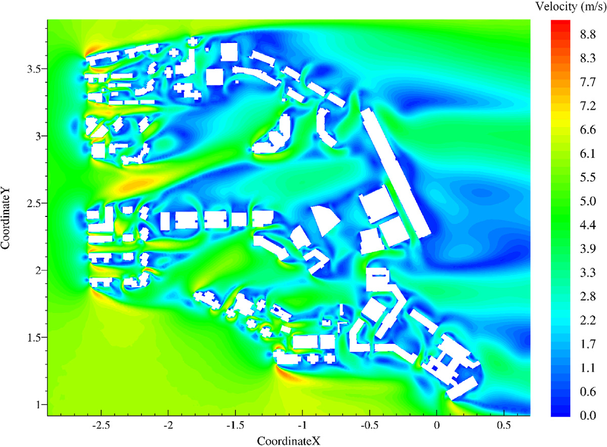

   **图 25** 研究区域 2 m 高度处的速度幅值。

   横、纵轴分别为 X、Y 坐标，色标为速度（m/s）。

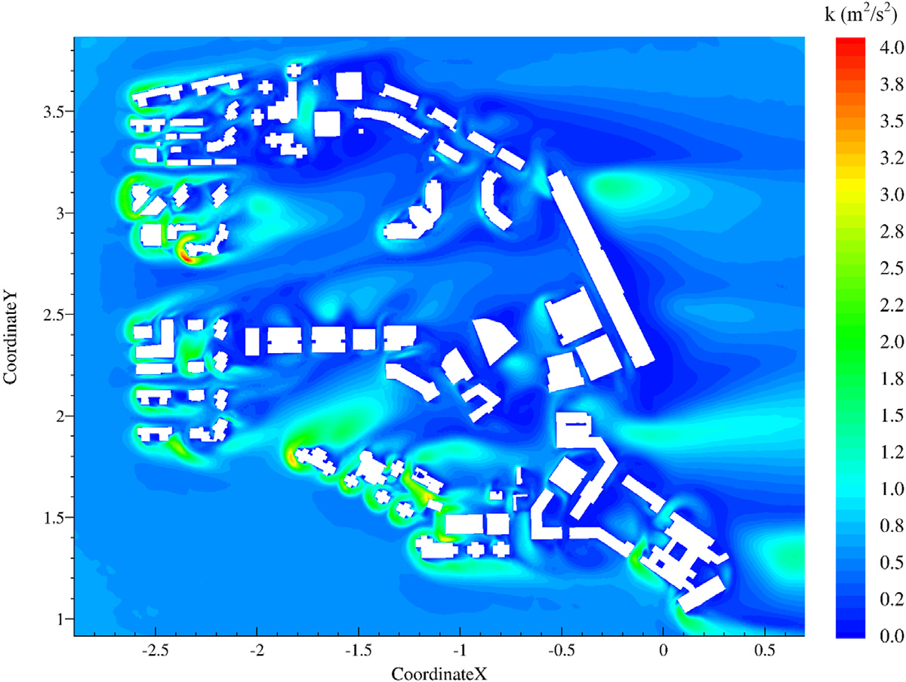

   **图 26** 研究区域 2 m 高度处的湍动能场。

   横、纵轴分别为 X、Y 坐标，色标为湍动能 k（m²/s²）。

4.1.3 网格收敛分析
^^^^^^^^^^^^^^^^^^

为说明网格无关性并验证几何拓扑，本研究采用网格收敛指数（GCI）（\ :ref:`Roache, 1997 <zhao2025-reference-45>`\ ），开展基于 Richardson 外推的收敛分析。随机布置 32 个监测点，计算各点速度、压力、湍流强度和湍流耗散率的 GCI。GCI 计算公式为：

.. math::

   G_F=\frac{100\times F_s\times\varepsilon_{FB}}{r^p-1}, \qquad (17)

.. math::

   G_B=\frac{100\times F_s\times\varepsilon_{BC}}{r^p-1}, \qquad (18)

.. math::

   G_C=r^p\times G_B. \qquad (19)

其中，\ :math:`F_s=1.25` 为安全系数，\ :math:`\varepsilon_{ij}=\left|\frac{f_j-f_i}{f_i}\right|`\ ，\ :math:`i` 和 :math:`j` 表示网格（F：细网格；B：基础网格；C：粗网格），\ :math:`f` 为所选监测点处的变量；\ :math:`p=\ln\left[\frac{f_C-f_B}{f_B-f_F}\right]/\ln r` 为算法的观测精度阶。网格设置和 GCI 结果见表 3，速度场和压力场中的最大值为 3.76%，湍流量最大值为 4.89%，表明模拟结果具有可靠性。

.. list-table:: 表 3 网格数量及 GCI 值
   :header-rows: 1
   :class: longtable

   * - 网格
     - 单元数（百万）
     - :math:`U_{\mathrm{mag}}` 的 GCI（%）
     - :math:`p` 的 GCI（%）
     - :math:`k` 的 GCI（%）
     - :math:`\varepsilon` 的 GCI（%）
   * - 粗网格
     - 7.90
     - 5.20
     - 5.57
     - 7.24
     - 6.96
   * - 基础网格
     - 16.8
     - 3.51
     - 3.76
     - 4.89
     - 4.70
   * - 细网格
     - 37.9
     - 2.46
     - 2.24
     - 4.31
     - 3.30

.. note::

   译注：上段的 3.76% 和 4.89% 对应表 3 的基础网格：速度与压力两项最大值为 3.76%，湍流量两项最大值为 4.89%。粗网格对应值更高，因此这些数字不代表所有网格或全部物理误差的上限。原文上段称“湍流强度”，表 3 实际列出的符号为湍动能 :math:`k`\ ，此处保留其文字与表头的差别。

除计算 GCI 指标外，本研究还比较三种网格方案下各监测点的风速比分布，以进一步选择最优网格。图 27 给出不同监测点的风速比散点图。可以看出，粗网格与基础网格的模拟结果存在显著误差，许多点超过 10%。相比之下，细网格与粗网格之间的误差相对较小。可以认为基础网格具有一定的网格无关性。综合考虑计算精度与成本，选用基础网格进行其他工况和后续行人舒适度评估。

.. note::

   译注：上一段“细网格与粗网格”按原文保留，但图 27(b) 的坐标轴与分图说明实际比较的是细网格和基础网格；原文叙述与图示不一致，不应据该句推断细／粗网格误差更小。

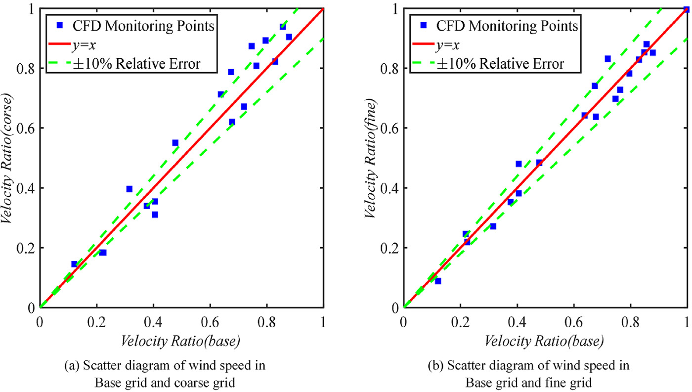

   **图 27** 不同网格方案下的风速散点图。

   (a) 基础网格与粗网格；(b) 基础网格与细网格。蓝色方点为 CFD 监测点，红线为 y=x，绿色虚线为 ±10% 相对误差；横轴均为基础网格风速比，纵轴分别为粗网格和细网格风速比。

4.2 行人舒适度等级分析
~~~~~~~~~~~~~~~~~~~~~~

上述 CFD 结果表明，该框架能够生成高细节建筑几何。为进一步验证框架的实用性，本研究利用生成的建筑几何，对所选研究对象开展行人舒适度分析。

4.2.1 评价准则
^^^^^^^^^^^^^^

评价行人风环境质量需要两类数据：场地的空气动力特性，以及研究区域附近气象观测站的长期风速、风向数据；后者用于确定长期风速的概率分布函数。为确定风的统计特征，采用广泛认可的常态风概率分布模型 Weibull 分布（\ :ref:`Holmes, Paton, & Kerwin, 2007 <zhao2025-reference-24>`\ ），分析气象观测风速数据。基于风的统计特征，本研究采用超阈值峰值（Peak Over Threshold，POT）方法评估行人舒适度类别（\ :ref:`Willemsen & Wisse, 2007 <zhao2025-reference-57>`\ ），并利用平均风速计算超越概率（\ :ref:`M, 2012 <zhao2025-reference-34>`\ ；\ :ref:`Ministry of Housing and Urban-Rural Development of the People’s Republic of China, 2014 <zhao2025-reference-38>`\ ）。

.. math::

   P_{\theta}(\overline V_{\mathrm{ped}}>V_{\mathrm{THR}})=A_{\theta}\cdot\exp\left[-\left(\frac{V_{\mathrm{THR}}-\mu_{\theta}}{c_{\theta}}\right)^{k_{\theta}}\right]. \qquad (20)

其中，\ :math:`\overline V_{\mathrm{ped}}` 表示行人高度处的平均风速，\ :math:`V_{\mathrm{THR}}` 表示不舒适或危险的阈值风速，\ :math:`\theta` 为位置参数，\ :math:`P_{\theta}` 表示风速超过 :math:`V_{\mathrm{THR}}` 的累积概率，\ :math:`A_{\theta}` 表示风向角 :math:`\theta` 的频率；\ :math:`c_{\theta}` 为概率分布函数的尺度参数，\ :math:`k_{\theta}` 为形状参数。

.. note::

   译注：原文在式（20）的说明中将 :math:`\theta` 称为“位置参数”，同时又将其用作风向角下标；式中的 :math:`\mu_{\theta}` 未在该处解释。本页保留原述，不用推测定义替换原文。表 5 的 90° 和 120° 两行还将形状参数 :math:`k_{\theta}` 列为 0，若用于复现计算，需先核实这些参数和公式的对应关系。

本研究采用表 4 对风环境舒适度分类。使用气象站日平均最大风速数据评价时，应采用年超越次数；使用小时风速时，则应采用小时超越概率（\ :ref:`Ministry of Housing and Urban-Rural Development of the People’s Republic of China, 2014 <zhao2025-reference-38>`\ ）。

.. list-table:: 表 4 表示风对人体影响的扩展陆地蒲福风级
   :header-rows: 1
   :class: longtable

   * - 舒适度类别
     - 最大风速：52 次/年
     - 最大风速：12 次/年
     - 最大风速：1 次/年
   * - I
     - 3.6
     - 5.4
     - 15.2
   * - II
     - 5.4
     - 7.6
     - 15.2
   * - III
     - 7.6
     - 9.9
     - 15.2
   * - IV
     - 9.9
     - 12.5
     - 15.2
   * - V
     - 不满足上述标准
     - 不满足上述标准
     - 不满足上述标准

4.2.2 气象数据分析
^^^^^^^^^^^^^^^^^^

本研究收集附近气象站的风向与风速数据，并计算各风向出现频率。风向频率玫瑰图如图 28 所示。选择 0°、30°、60°、90°、120°、150°、180°、210° 和 240° 九个主要风向进行评价，总频率达到主导风速的 92.7%。随后估计 Weibull 分布参数，不同风向风速的概率密度函数（PDF）曲线见图 29。频率和参数结果见表 5，其中 :math:`A_{\theta}` 表示各风向相对于主要风向总出现次数的频率。

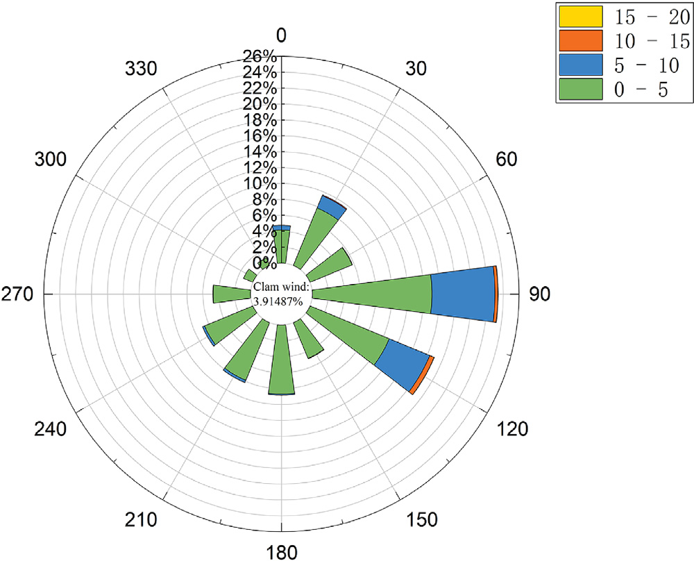

   **图 28** 气象数据的风速与风向频率玫瑰图。

   圆周标示风向角，径向为频率；颜色分档为 0–5、5–10、10–15、15–20，中心保留静风比例 3.91487%（原图英文写作 Clam wind）。

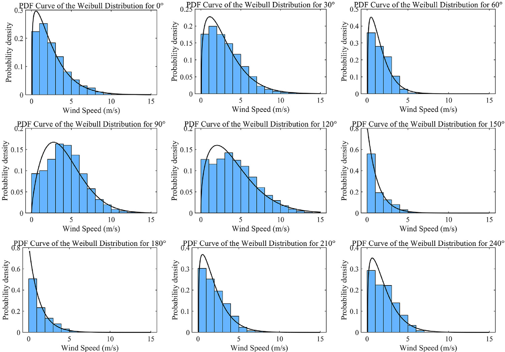

   **图 29** 各风向的 Weibull 分布概率密度曲线。

   九个分图依次为 0°、30°、60°、90°、120°、150°、180°、210°、240°；横轴为风速（m/s），纵轴为概率密度。

.. list-table:: 表 5 气象数据统计及 Weibull 分布参数
   :header-rows: 1
   :class: longtable

   * - 风向
     - 平均风速（m/s）
     - :math:`A_{\theta}`
     - :math:`c_{\theta}`
     - :math:`k_{\theta}`
     - :math:`\mu_{\theta}`
   * - 0°
     - 2.5395
     - 0.0495
     - 1.1649
     - 0.0778
     - 2.5856
   * - 30°
     - 3.0548
     - 0.0999
     - 1.3025
     - 0.0567
     - 3.236
   * - 60°
     - 1.6341
     - 0.0599
     - 1.2198
     - 0.0783
     - 1.6528
   * - 90°
     - 4.1963
     - 0.2430
     - 1.6961
     - 0
     - 4.6685
   * - 120°
     - 4.2102
     - 0.1758
     - 1.4404
     - 0
     - 4.6105
   * - 150°
     - 1.2905
     - 0.0510
     - 1.0
     - 0.0376
     - 1.2529
   * - 180°
     - 1.3938
     - 0.0917
     - 0.9999
     - 0.0936
     - 1.2995
   * - 210°
     - 2.0116
     - 0.0847
     - 1.2035
     - 0.0801
     - 2.0459
   * - 240°
     - 2.0678
     - 0.0713
     - 2.1229
     - 1.2351
     - 0.0734

4.2.3 风速比
^^^^^^^^^^^^

本研究采用已建立的网格与模型设置，对九个风向角的不同工况进行 CFD 模拟，获得研究区域的风速比。为保证数值计算准确性，使用长度缩尺比为 1:400 的缩尺模型。给定风向角 :math:`\theta` 时，特定位置 :math:`i` 的风速比 :math:`r_{i,\theta}` 按下式计算：

.. math::

   r_{i,\theta}=\frac{\overline V^{\mathrm{ped}}_{i,\theta}}{V_{\mathrm S}^{\mathrm{ref}}}. \qquad (21)

其中，\ :math:`\overline V^{\mathrm{ped}}_{i,\theta}` 表示给定风向下指定位置行人高度处的平均风速，\ :math:`V_{\mathrm S}^{\mathrm{ref}}` 为研究区域来流在参考高度处的风速。本研究将行人高度设为 2 m，参考高度设为 10 m，参考风速设为 5 m/s。

选择 30 个监测点评价舒适度，主要位于行人活动区以及大型复杂建筑周围，因为这些区域更容易受到不利风速影响。监测点位置如图 30 所示。获得风速比数据后，使用式（20）计算超越概率，再按照表 6 确定舒适度类别。当一个区域满足三个相应的舒适度条件时，认为其满足特定功能的风环境舒适度要求。

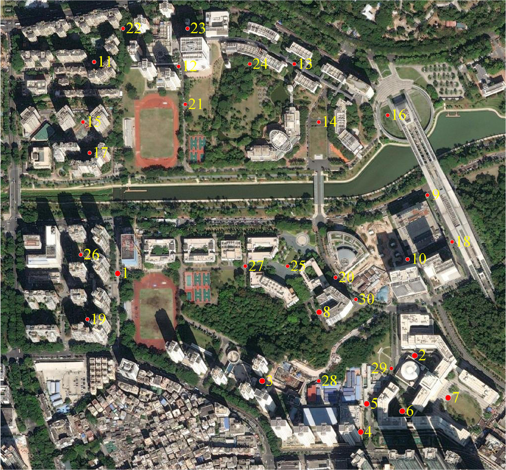

   **图 30** 监测点分布。（关于本图图例中的颜色说明，请参阅原论文的网络版本。）

   红点与黄色数字共同标示 1–30 号监测点的位置。

4.2.4 行人舒适度评价
^^^^^^^^^^^^^^^^^^^^

图 31 展示不同风向下行人高度处风速比的等值线图和矢量图，反映了行人高度处的风场特征。在 0° 和 30° 风向角下，测点 12、18、22 和 23 附近，上游平行建筑形成狭窄通道，减小气流横截面积，产生通道加速效应，因此风速高于其他区域（\ :ref:`Zhang et al., 2021 <zhao2025-reference-64>`\ ）。在测点 10 和 12 周围，建筑尖角使气流急剧收缩，速度增加。此外，气流在这些尖角处的分离和再附着进一步改变流动状态，使风速增大。

在 0° 风向角下，除部分区域的通道加速效应和建筑转角效应外，测点 16 右侧的大型建筑周围出现大片红色区域。这是因为气流在撞击建筑表面之前能够保持相对稳定的流速。而且，由于建筑阻挡，气流在前缘积聚并加速，造成风速增大。在 150°、180° 和 210° 下，大多数高风速区域是由于建筑直接迎风，没有其他结构的缓冲作用，使气流能够顺畅地冲击建筑表面，从而形成较高风速。同时，左下角一些建筑区域的风在通道效应下持续加速，形成高速风。在研究区域中部以及远离来流的区域，建筑遮挡、耗散和风速扩散的共同作用使风速相对较低且稳定。

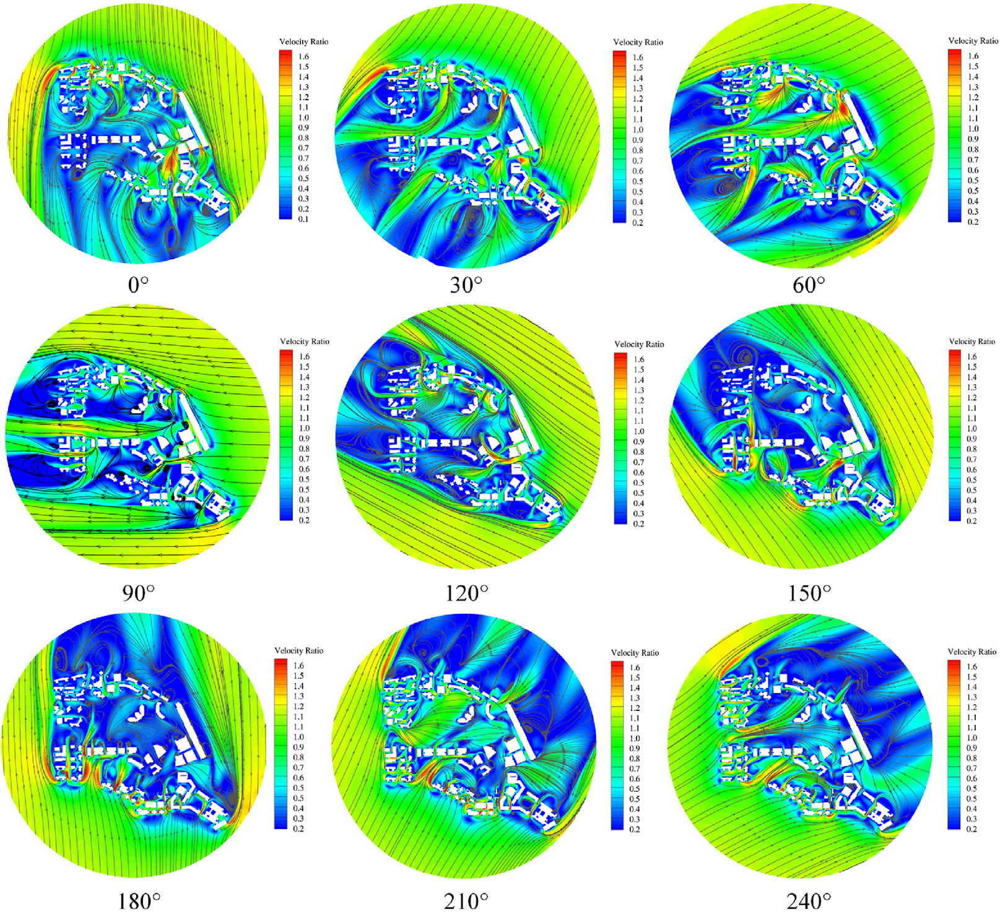

   **图 31** 不同风向下行人高度截面的风速比等值线图与矢量图。

   九个分图依次为 0°、30°、60°、90°、120°、150°、180°、210°、240°；各图色标为风速比，并保留流向矢量。

依据表 4 的舒适度分类标准，利用附近气象站数据和 CFD 模拟结果评价 30 个监测点的舒适度。结果见表 6，多数监测点属于 I 类和 II 类，满足行人舒适度要求。测点 25 和 28 等少数点属于 III 类，但由于这些区域主要用作人行道和广场，仍满足所需标准。然而，测点 23 被划为 IV 类，主要因为其靠近一栋小型独立建筑，并受到左侧平行建筑形成的狭窄通道效应影响。虽然该点位于人行道附近，满足使用要求，但日常使用中仍建议保持谨慎。

.. list-table:: 表 6 测点的舒适度等级
   :header-rows: 1
   :class: longtable

   * - 测点
     - 舒适度类别
     - 测点
     - 舒适度类别
     - 测点
     - 舒适度类别
   * - 1
     - I
     - 11
     - I
     - 21
     - I
   * - 2
     - I
     - 12
     - I
     - 22
     - II
   * - 3
     - I
     - 13
     - I
     - 23
     - IV
   * - 4
     - II
     - 14
     - I
     - 24
     - II
   * - 5
     - II
     - 15
     - II
     - 25
     - III
   * - 6
     - I
     - 16
     - I
     - 26
     - II
   * - 7
     - II
     - 17
     - II
     - 27
     - I
   * - 8
     - I
     - 18
     - I
     - 28
     - III
   * - 9
     - I
     - 19
     - I
     - 29
     - II
   * - 10
     - I
     - 20
     - I
     - 30
     - I

总之，该区域行人高度处的风环境舒适度表现良好，大多数测点为 I 类和 II 类，仅少数属于 III 类和 IV 类。这表明，所提出的建筑几何生成框架不仅能够生成细节丰富的建筑几何，还能在风环境研究中保证准确的风场特征。

.. note::

   译注：上段为原论文的结论性陈述。本研究这里提供的是 CFD 计算、网格收敛和舒适度应用结果，不能将其等同于对现场风速精度的独立实测验证。

4.3 WebGIS 可视化
~~~~~~~~~~~~~~~~~

除了分析行人舒适度，本研究还探索框架在城市规划和防灾中的应用。将建筑几何生成框架与 CFD 模拟结果结合，建立城市风场数据库；使用 Cesium 对模型和风场进行可视化，并在 WebGIS 平台展示。这些成果可以指导城市规划与灾害研究。为在 WebGIS 上可视化风场数据并尽量减少浏览器存储占用，需要进行空间插值或细分，根据空间点之间的关系生成连续曲面（\ :ref:`Dangermond & Goodchild, 2020 <zhao2025-reference-10>`\ ）。本研究采用克里金（Kriging）方法（\ :ref:`Cressie, 1990 <zhao2025-reference-9>`\ ）对点云数据插值。该方法基于变异函数理论和结构分析，提供无偏最优估计，预测已知位置之间的连续值表面（\ :ref:`Belkhiri, Tiri, & Mouni, 2020 <zhao2025-reference-5>`\ ）。所选数据集包括 CFD 模拟中 30° 风向、离地 10 m 处的风速结果，约有 711,000 条点云数据。数据库存储字段为 CELLNUMBER（单元编号）、X、Y、Z 和 VELOCITY（速度），共五列。

图 32 展示初始风场点云可视化。点云密度不同源于网格尺寸差异，建筑附近的点更密集。点云颜色越红，表示风速越高。高风速区域大多出现在远离城市建筑核心区的位置。随后，采用经验贝叶斯克里金方法（RBF-M）（\ :ref:`Antal & Guerreiro, 2021 <zhao2025-reference-4>`\ ）插值，每个子集模拟 100 个半变异函数，子集大小为 100，以平衡计算资源与可视化效果。生成的插值效果如图 33 所示。

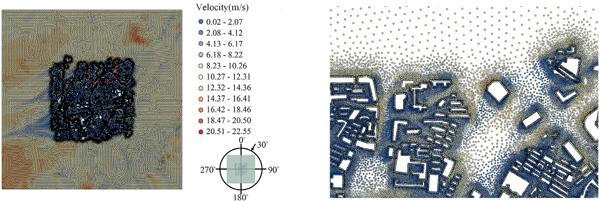

   **图 32** 初始风场点云。（关于本图图例中的颜色说明，请参阅原论文的网络版本。）

   左侧为整体点云，右侧为建筑区局部，图例为速度（m/s），并保留风向示意。

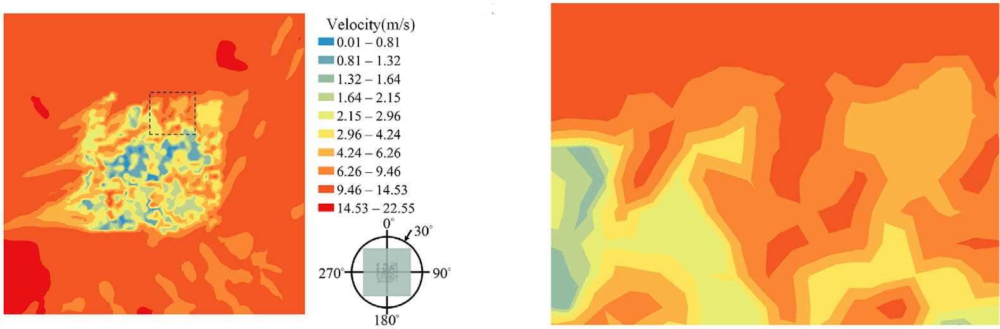

   **图 33** 风场插值结果。

   左侧为整体插值风场，右侧为局部放大，图例为速度（m/s），并保留风向示意。

.. note::

   译注：原文把“经验贝叶斯克里金”与缩写“RBF-M”并列使用，所引 :ref:`Antal & Guerreiro（2021） <zhao2025-reference-4>`\ 的文献题名则为径向基函数方法。此处保留原文名称及引文，不将它们视为已确认等价的算法。

完成插值后，使用 Tomcat 启动 GeoServer 服务；Tomcat 为 Web 应用提供稳定的平台（\ :ref:`Vukotic & Goodwill, 2011 <zhao2025-reference-54>`\ ）。随后，将数据导入 GeoServer 中预先配置的工作空间和存储，设置图层的地理数据框架，再发布为 WMS 图层。通过 Cesium 提供的 Web 接口，经 URL 链接访问所发布的 WMS 图层，并以 image/png 格式发布。该过程实现风场数据的 WebGIS 可视化，如图 34 所示。此结果是将该框架与 WebGIS 等平台集成的初步探索，今后可根据需要增加行人舒适度评价、风灾预警平台等功能。

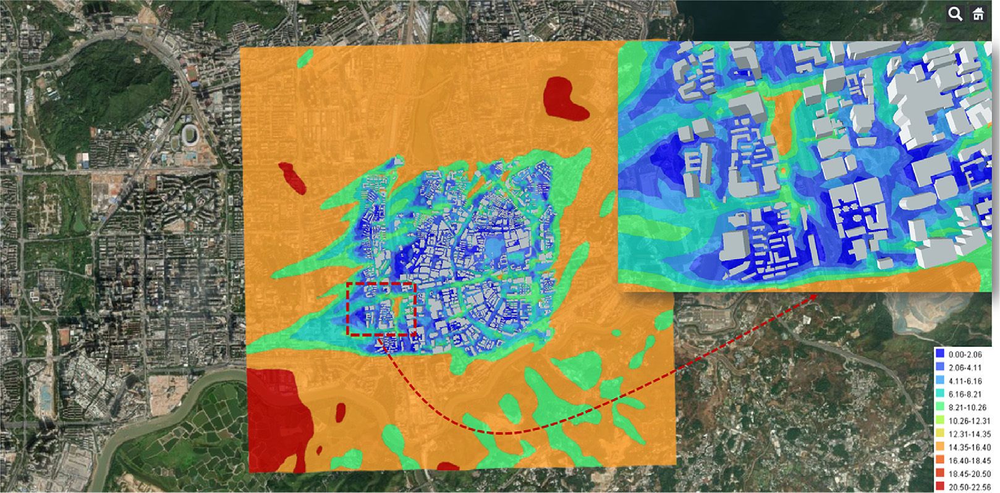

   **图 34** 风场插值结果。

   保留 WebGIS 底图、整体插值风场、右上局部三维建筑视图、对应连线及右下速度图例。

5 结论与未来工作
----------------

本文提出一种基于三维高斯泼溅的建筑几何模型生成算法框架，快速生成准确、适用于 CFD 计算的几何模型。为建立测试数据集，利用无人机采集研究区域图像并进行降采样。首次引入并改进三维高斯泼溅，依据 SfM 稀疏点云将场景划分为多个大小相同的区块，解决大场景重建的内存不足和点云精度不足问题。随后设计集成算法，提取并细化建筑屋顶轮廓，生成规则且具有丰富屋顶细节的几何模型。结果表明，密集建筑点云的生成速度比传统方法快 2–3 倍，准确度平均提高 12%。生成网格的质量令人满意，数值模拟呈现单调、稳定的收敛，速度场和压力场的网格收敛指数达到 3.76%。这些结果表明，该算法框架在保持高精度的同时显著提高处理速度，并能生成适用于 CFD 模拟的高质量建筑几何模型。

所采用的算法框架仍存在一些需要改进的局限。首先，在处理与背景颜色相近且变化不明显的颜色时，点云生成模型可能造成点云细节丢失。其次，几何模型生成算法仅着重处理建筑部分，而周围植被和地形对城市风环境研究也很重要。最后，复杂建筑和居住区的几何重建结果未达到预期。

参考文献
--------

.. _zhao2025-reference-1:

Aanæs, H., Jensen, R. R., Vogiatzis, G., Tola, E., & Dahl, A. B. (2016). Large-scale data for multiple-view stereopsis. International Journal of Computer Vision, 120 153–168. `原文参考链接 <http://refhub.elsevier.com/S2210-6707(25)00114-3/sb1>`__

.. _zhao2025-reference-2:

Alemayehu, T. F., & Bitsuamlak, G. T. (2022). Autonomous urban topology generation for urban flow modelling. Sustainable Cities and Society, 87, Article 104181. `原文参考链接 <http://refhub.elsevier.com/S2210-6707(25)00114-3/sb2>`__

.. _zhao2025-reference-3:

Amorim, J. H., Rodrigues, V., Borrego, C., & Costa, A. M. (2010). A CFD analysis of the vegetative canopy effect on urban air pollutants dispersion. In Proceedings of the CLIMAQS workshop ‘local air quality and its interactions with vegetation’ January (pp. 21–22). `原文参考链接 <http://refhub.elsevier.com/S2210-6707(25)00114-3/sb3>`__

.. _zhao2025-reference-4:

Antal, A., & Guerreiro, P. M. (2021). A radial basis function approach to estimate precipitations in Brasov county, Romania. Environmental Engineering & Management Journal (EEMJ), 20(8). `原文参考链接 <http://refhub.elsevier.com/S2210-6707(25)00114-3/sb4>`__

.. _zhao2025-reference-5:

Belkhiri, L., Tiri, A., & Mouni, L. (2020). Spatial distribution of the groundwater quality using kriging and co-kriging interpolations. Groundwater for Sustainable Development, 11, Article 100473. `原文参考链接 <http://refhub.elsevier.com/S2210-6707(25)00114-3/sb5>`__

.. _zhao2025-reference-6:

Canny, J. (1986). A computational approach to edge detection. IEEE Transactions on Pattern Analysis and Machine Intelligence, (6), 679–698. `原文参考链接 <http://refhub.elsevier.com/S2210-6707(25)00114-3/sb6>`__

.. _zhao2025-reference-7:

Chen, H., Li, C., & Lee, G. H. (2023). Neusg: Neural implicit surface reconstruction with 3d gaussian splatting guidance. arXiv preprint arXiv:2312.00846. `原文参考链接 <http://arxiv.org/abs/2312.00846>`__

.. _zhao2025-reference-8:

Cheng, K., Long, X., Yang, K., Yao, Y., Yin, W., Ma, Y., et al. (2024). Gaussianpro: 3d gaussian splatting with progressive propagation. In Forty-first international conference on machine learning. `原文参考链接 <http://refhub.elsevier.com/S2210-6707(25)00114-3/sb8>`__

.. _zhao2025-reference-9:

Cressie, N. (1990). The origins of kriging. Mathematical Geology, 22, 239–252. `原文参考链接 <http://refhub.elsevier.com/S2210-6707(25)00114-3/sb9>`__

.. _zhao2025-reference-10:

Dangermond, J., & Goodchild, M. F. (2020). Building geospatial infrastructure. Geo-Spatial Information Science, 23(1), 1–9. `原文参考链接 <http://refhub.elsevier.com/S2210-6707(25)00114-3/sb10>`__

.. _zhao2025-reference-11:

Douglas, D. H., & Peucker, T. K. (1973). Algorithms for the reduction of the number of points required to represent a digitized line or its caricature. Cartographica: The International Journal for Geographic Information and Geovisualization, 10(2), 112–122. `原文参考链接 <http://refhub.elsevier.com/S2210-6707(25)00114-3/sb11>`__

.. _zhao2025-reference-12:

Edelsbrunner, H., Kirkpatrick, D., & Seidel, R. (1983). On the shape of a set of points in the plane. Institute of Electrical and Electronics Engineers. Transactions on Information Theory, 29(4), 551–559. `原文参考链接 <http://refhub.elsevier.com/S2210-6707(25)00114-3/sb12>`__

.. _zhao2025-reference-13:

Ester, M., Kriegel, H.-P., Sander, J., Xu, X., et al. (1996). A density-based algorithm for discovering clusters in large spatial databases with noise. vol. 96, In Kdd (pp. 226–231). 34. `原文参考链接 <http://refhub.elsevier.com/S2210-6707(25)00114-3/sb13>`__

.. _zhao2025-reference-14:

Fabbri, K., & Costanzo, V. (2020). Drone-assisted infrared thermography for calibration of outdoor microclimate simulation models. Sustainable Cities and Society, 52, Article 101855. `原文参考链接 <http://refhub.elsevier.com/S2210-6707(25)00114-3/sb14>`__

.. _zhao2025-reference-15:

Fischler, M. A., & Bolles, R. C. (1981). Random sample consensus: a paradigm for model fitting with applications to image analysis and automated cartography. Communications of the ACM, 24(6), 381–395. `原文参考链接 <http://refhub.elsevier.com/S2210-6707(25)00114-3/sb15>`__

.. _zhao2025-reference-16:

Frahat, M. M., & Arisha, A. M. G. (2023). CFD simulation of wind environment in high-rise buildings for wind energy acquisition. Journal of Progress in Civil Engineering, 5(11). `原文参考链接 <http://refhub.elsevier.com/S2210-6707(25)00114-3/sb16>`__

.. _zhao2025-reference-17:

Franke, J., Hellsten, A., Schlunzen, K. H., & Carissimo, B. (2011). The COST 732 best practice guideline for CFD simulation of flows in the urban environment: a summary. International Journal of Environment and Pollution, 44(1–4), 419–427. `原文参考链接 <http://refhub.elsevier.com/S2210-6707(25)00114-3/sb17>`__

.. _zhao2025-reference-18:

Fu, R., Pađen, I., & García-Sánchez, C. (2024). Should we care about the level of detail in trees when running urban microscale simulations? Sustainable Cities and Society, 101, Article 105143. `原文参考链接 <http://refhub.elsevier.com/S2210-6707(25)00114-3/sb18>`__

.. _zhao2025-reference-19:

Furukawa, Y., & Ponce, J. (2009). Accurate, dense, and robust multiview stereopsis. IEEE Transactions on Pattern Analysis and Machine Intelligence, 32(8), 1362–1376. `原文参考链接 <http://refhub.elsevier.com/S2210-6707(25)00114-3/sb19>`__

.. _zhao2025-reference-20:

Galliani, S., Lasinger, K., & Schindler, K. (2015). Massively parallel multiview stereopsis by surface normal diffusion. In Proceedings of the IEEE international conference on computer vision (pp. 873–881). `原文参考链接 <http://refhub.elsevier.com/S2210-6707(25)00114-3/sb20>`__

.. _zhao2025-reference-21:

Gu, D., Zhang, N., Shuai, Q., Xu, Z., & Xu, Y. (2024). Drone photogrammetry-based wind field simulation for climate adaptation in urban environments. Sustainable Cities and Society, 117, Article 105989. `原文参考链接 <http://refhub.elsevier.com/S2210-6707(25)00114-3/sb21>`__

.. _zhao2025-reference-22:

Han, X., Leung, T., Jia, Y., Sukthankar, R., & Berg, A. C. (2015). Matchnet: Unifying feature and metric learning for patch-based matching. In Proceedings of the IEEE conference on computer vision and pattern recognition (pp. 3279–3286). `原文参考链接 <http://refhub.elsevier.com/S2210-6707(25)00114-3/sb22>`__

.. _zhao2025-reference-23:

Heidari, A., Navimipour, N. J., & Unal, M. (2022). Applications of ML/DL in the management of smart cities and societies based on new trends in information technologies: A systematic literature review. Sustainable Cities and Society, 85, Article 104089. `原文参考链接 <http://refhub.elsevier.com/S2210-6707(25)00114-3/sb23>`__

.. _zhao2025-reference-24:

Holmes, J. D., Paton, C., & Kerwin, R. (2007). Wind loading of structures. CRC Press. `原文参考链接 <http://refhub.elsevier.com/S2210-6707(25)00114-3/sb24>`__

.. _zhao2025-reference-25:

Kazhdan, M., Bolitho, M., & Hoppe, H. (2006). Poisson surface reconstruction. vol. 7, In Proceedings of the fourth eurographics symposium on geometry processing. 4. `原文参考链接 <http://refhub.elsevier.com/S2210-6707(25)00114-3/sb25>`__

.. _zhao2025-reference-26:

Kerbl, B., Kopanas, G., Leimkühler, T., & Drettakis, G. (2023). 3D Gaussian splatting for real-time radiance field rendering. ACM Transactions on Graphics, 42(4), 139–1. `原文参考链接 <http://refhub.elsevier.com/S2210-6707(25)00114-3/sb26>`__

.. _zhao2025-reference-27:

Kim, S., Lee, K., & Lee, Y. (2024). Color-cued efficient densification method for 3D Gaussian splatting. In Proceedings of the IEEE/CVF conference on computer vision and pattern recognition (pp. 775–783). `原文参考链接 <http://refhub.elsevier.com/S2210-6707(25)00114-3/sb27>`__

.. _zhao2025-reference-28:

Knapitsch, A., Park, J., Zhou, Q.-Y., & Koltun, V. (2017). Tanks and temples: Benchmarking large-scale scene reconstruction. ACM Transactions on Graphics (ToG), 36(4), 1–13. `原文参考链接 <http://refhub.elsevier.com/S2210-6707(25)00114-3/sb28>`__

.. _zhao2025-reference-29:

Kopanas, G., Philip, J., Leimkühler, T., & Drettakis, G. (2021). Point-based neural rendering with per-view optimization. vol. 40, In Computer graphics forum (pp. 29–43). Wiley Online Library, 4. `原文参考链接 <http://refhub.elsevier.com/S2210-6707(25)00114-3/sb29>`__

.. _zhao2025-reference-30:

Kwon, A., & Kim, J.-J. (2014). Study on detailed air flows in urban areas using GIS data in a vector format and a CFD model. Korean Journal of Remote Sensing, 30(6), 755–767. `原文参考链接 <http://refhub.elsevier.com/S2210-6707(25)00114-3/sb30>`__

.. _zhao2025-reference-31:

Liu, Y., Guan, H., Luo, C., Fan, L., Peng, J., & Zhang, Z. (2024). Citygaussian: Real-time high-quality large-scale scene rendering with gaussians. arXiv preprint arXiv:2404.01133. `原文参考链接 <http://arxiv.org/abs/2404.01133>`__

.. _zhao2025-reference-32:

Lowe, D. G. (1999). Object recognition from local scale-invariant features. vol. 2, In Proceedings of the seventh IEEE international conference on computer vision (pp. 1150–1157). IEEE. `原文参考链接 <http://refhub.elsevier.com/S2210-6707(25)00114-3/sb32>`__

.. _zhao2025-reference-33:

Lowe, D. G. (2004). Distinctive image features from scale-invariant keypoints. International Journal of Computer Vision, 60, 91–110. `原文参考链接 <http://refhub.elsevier.com/S2210-6707(25)00114-3/sb33>`__

.. _zhao2025-reference-34:

M, G. (2012). Load code for the design of building structures. Beijing, China: Ministry of Housing and Urban-Rural Construction of the People’s Republic of China, Haidian District. `原文参考链接 <http://refhub.elsevier.com/S2210-6707(25)00114-3/sb34>`__

.. _zhao2025-reference-35:

Menze, M., & Geiger, A. (2015). Object scene flow for autonomous vehicles. In Proceedings of the IEEE conference on computer vision and pattern recognition (pp. 3061–3070). `原文参考链接 <http://refhub.elsevier.com/S2210-6707(25)00114-3/sb35>`__

.. _zhao2025-reference-36:

Merrill, D. G., & Grimshaw, A. S. (2010). Revisiting sorting for GPGPU stream architectures. In Proceedings of the 19th international conference on parallel architectures and compilation techniques (pp. 545–546). `原文参考链接 <http://refhub.elsevier.com/S2210-6707(25)00114-3/sb36>`__

.. _zhao2025-reference-37:

Mildenhall, B., Srinivasan, P. P., Tancik, M., Barron, J. T., Ramamoorthi, R., & Ng, R. (2021). Nerf: Representing scenes as neural radiance fields for view synthesis. Communications of the ACM, 65(1), 99–106. `原文参考链接 <http://refhub.elsevier.com/S2210-6707(25)00114-3/sb37>`__

.. _zhao2025-reference-38:

Ministry of Housing and Urban-Rural Development of the People’s Republic of China (2014). Standard for wind tunnel test of buildings and structures. JSJ/T 338–2014. `原文参考链接 <http://refhub.elsevier.com/S2210-6707(25)00114-3/sb38>`__

.. _zhao2025-reference-39:

Mirzaei, P. A. (2021). CFD modeling of micro and urban climates: Problems to be solved in the new decade. Sustainable Cities and Society, 69, Article 102839. `原文参考链接 <http://refhub.elsevier.com/S2210-6707(25)00114-3/sb39>`__

.. _zhao2025-reference-40:

Oh, G., Yang, M., & Choi, J.-I. (2024). Large-eddy simulation-based wind and thermal comfort assessment in urban environments. Journal of Wind Engineering and Industrial Aerodynamics, 246, Article 105682. `原文参考链接 <http://refhub.elsevier.com/S2210-6707(25)00114-3/sb40>`__

.. _zhao2025-reference-41:

Pađen, I., Peters, R., García-Sánchez, C., & Ledoux, H. (2024). Automatic high-detailed building reconstruction workflow for urban microscale simulations. Building and Environment, Article 111978. `原文参考链接 <http://refhub.elsevier.com/S2210-6707(25)00114-3/sb41>`__

.. _zhao2025-reference-42:

Qiu, Y., He, Y., Li, M., & Zhu, X. (2023). A generalization of building clusters in an urban wind field simulated by CFD. Atmosphere, 15(1), 9. `原文参考链接 <http://refhub.elsevier.com/S2210-6707(25)00114-3/sb42>`__

.. _zhao2025-reference-43:

van Rees, E. (2013). Open geospatial consortium (OGC). Geoinformatics, 16(8), 28. `原文参考链接 <http://refhub.elsevier.com/S2210-6707(25)00114-3/sb43>`__

.. _zhao2025-reference-44:

Ricci, A., Kalkman, I., Blocken, B., Burlando, M., Freda, A., & Repetto, M. (2017). Local-scale forcing effects on wind flows in an urban environment: Impact of geometrical simplifications. Journal of Wind Engineering and Industrial Aerodynamics, 170, 238–255. `原文参考链接 <http://refhub.elsevier.com/S2210-6707(25)00114-3/sb44>`__

.. _zhao2025-reference-45:

Roache, P. J. (1997). Quantification of uncertainty in computational fluid dynamics. Annual Review of Fluid Mechanics, 29(1), 123–160. `原文参考链接 <http://refhub.elsevier.com/S2210-6707(25)00114-3/sb45>`__

.. _zhao2025-reference-46:

Rosnell, T., Honkavaara, E., & Nurminen, K. (2012). On geometric processing of multi-temporal image data collected by light UAV systems. The International Archives of the Photogrammetry, Remote Sensing and Spatial Information Sciences, 38, 63–68. `原文参考链接 <http://refhub.elsevier.com/S2210-6707(25)00114-3/sb46>`__

.. _zhao2025-reference-47:

Schönberger, J. L., Zheng, E., Frahm, J.-M., & Pollefeys, M. (2016). Pixelwise view selection for unstructured multi-view stereo. In Computer vision–ECCV 2016: 14th European conference, Amsterdam, the Netherlands, October 11-14, 2016, proceedings, part III 14 (pp. 501–518). Springer. `原文参考链接 <http://refhub.elsevier.com/S2210-6707(25)00114-3/sb47>`__

.. _zhao2025-reference-48:

Snavely, N., Seitz, S. M., & Szeliski, R. (2006). Photo tourism: exploring photo collections in 3D. In ACM siggraph 2006 papers (pp. 835–846). `原文参考链接 <http://refhub.elsevier.com/S2210-6707(25)00114-3/sb48>`__

.. _zhao2025-reference-49:

Stathopoulou, E. K., & Remondino, F. (2023). A survey on conventional and learning-based methods for multi-view stereo. The Photogrammetric Record, 38(183), 374–407. `原文参考链接 <http://refhub.elsevier.com/S2210-6707(25)00114-3/sb49>`__

.. _zhao2025-reference-50:

Sun, C., Zhang, F., Zhao, P., Zhao, X., Huang, Y., & Lu, X. (2021). Automated simulation framework for urban wind environments based on aerial point clouds and deep learning. Remote Sensing, 13(12), 2383. `原文参考链接 <http://refhub.elsevier.com/S2210-6707(25)00114-3/sb50>`__

.. _zhao2025-reference-51:

Tancik, M., Casser, V., Yan, X., Pradhan, S., Mildenhall, B., Srinivasan, P. P., et al. (2022). Block-nerf: Scalable large scene neural view synthesis. In Proceedings of the IEEE/CVF conference on computer vision and pattern recognition (pp. 8248–8258). `原文参考链接 <http://refhub.elsevier.com/S2210-6707(25)00114-3/sb51>`__

.. _zhao2025-reference-52:

Tominaga, Y., Mochida, A., Yoshie, R., Kataoka, H., Nozu, T., Yoshikawa, M., et al. (2008). AIJ guidelines for practical applications of CFD to pedestrian wind environment around buildings. Journal of Wind Engineering and Industrial Aerodynamics, 96(10–11), 1749–1761. `原文参考链接 <http://refhub.elsevier.com/S2210-6707(25)00114-3/sb52>`__

.. _zhao2025-reference-53:

Turki, H., Ramanan, D., & Satyanarayanan, M. (2022). Mega-nerf: Scalable construction of large-scale nerfs for virtual fly-throughs. In Proceedings of the IEEE/CVF conference on computer vision and pattern recognition (pp. 12922–12931). `原文参考链接 <http://refhub.elsevier.com/S2210-6707(25)00114-3/sb53>`__

.. _zhao2025-reference-54:

Vukotic, A., & Goodwill, J. (2011). Apache tomcat 7. Springer. `原文参考链接 <http://refhub.elsevier.com/S2210-6707(25)00114-3/sb54>`__

.. _zhao2025-reference-55:

Wang, P., Liu, L., Liu, Y., Theobalt, C., Komura, T., & Wang, W. (2021). Neus: Learning neural implicit surfaces by volume rendering for multi-view reconstruction. arXiv preprint arXiv:2106.10689. `原文参考链接 <http://arxiv.org/abs/2106.10689>`__

.. _zhao2025-reference-56:

Wang, X., Wang, M., Wang, S., & Wu, Y. (2015). Extraction of vegetation information from visible unmanned aerial vehicle images. Transactions of the Chinese Society of Agricultural Engineering (Transactions of the CSAE), 31(05), 152–157+159+158. `原文参考链接 <http://refhub.elsevier.com/S2210-6707(25)00114-3/sb56>`__

.. _zhao2025-reference-57:

Willemsen, E., & Wisse, J. A. (2007). Design for wind comfort in The Netherlands: Procedures, criteria and open research issues. Journal of Wind Engineering and Industrial Aerodynamics, 95(9–11), 1541–1550. `原文参考链接 <http://refhub.elsevier.com/S2210-6707(25)00114-3/sb57>`__

.. _zhao2025-reference-58:

Xie, Z., Voke, P. R., Hayden, P., & Robins, A. G. (2004). Large-eddy simulation of turbulent flow over a rough surface. Boundary-Layer Meteorology, 111, 417–440. `原文参考链接 <http://refhub.elsevier.com/S2210-6707(25)00114-3/sb58>`__

.. _zhao2025-reference-59:

Xu, Q., & Tao, W. (2019). Multi-scale geometric consistency guided multi-view stereo. In Proceedings of the IEEE/CVF conference on computer vision and pattern recognition (pp. 5483–5492). `原文参考链接 <http://refhub.elsevier.com/S2210-6707(25)00114-3/sb59>`__

.. _zhao2025-reference-60:

Yao, Y., Luo, Z., Li, S., Fang, T., & Quan, L. (2018). Mvsnet: Depth inference for unstructured multi-view stereo. In Proceedings of the European conference on computer vision (pp. 767–783). `原文参考链接 <http://refhub.elsevier.com/S2210-6707(25)00114-3/sb60>`__

.. _zhao2025-reference-61:

Yi, X., & Zheng, L. (2021). Impact and assessment of urban wind environment change on architectural heritage protection. vol. 237, In E3S web of conferences (p. 03035). EDP Sciences. `原文参考链接 <http://refhub.elsevier.com/S2210-6707(25)00114-3/sb61>`__

.. _zhao2025-reference-62:

Younis, M., Bitsuamlak, G. T., & Sushama, L. (2024). High-resolution regional climate–CFD integrated modelling to inform climate responsive design of northern buildings in a changing climate. Sustainable Cities and Society, 115, Article 105773. `原文参考链接 <http://refhub.elsevier.com/S2210-6707(25)00114-3/sb62>`__

.. _zhao2025-reference-63:

Yu, Z., & Gao, S. (2020). Fast-mvsnet: Sparse-to-dense multi-view stereo with learned propagation and gauss-newton refinement. In Proceedings of the IEEE/CVF conference on computer vision and pattern recognition (pp. 1949–1958). `原文参考链接 <http://refhub.elsevier.com/S2210-6707(25)00114-3/sb63>`__

.. _zhao2025-reference-64:

Zhang, L., Tian, L., Shen, Q., Liu, F., Li, H., Dong, Z., et al. (2021). Study on the influence and optimization of the venturi effect on the natural ventilation of buildings in the Xichang area. Energies, 14(16), 5053. `原文参考链接 <http://refhub.elsevier.com/S2210-6707(25)00114-3/sb64>`__

.. _zhao2025-reference-65:

Zhang, K., Yan, J., & Chen, S.-C. (2006). Automatic construction of building footprints from airborne LIDAR data. IEEE Transactions on Geoscience and Remote Sensing, 44(9), 2523–2533. `原文参考链接 <http://refhub.elsevier.com/S2210-6707(25)00114-3/sb65>`__

.. _zhao2025-reference-66:

Zhao, Q., Li, R., Cao, K., Yi, M., & Liu, H. (2024). Influence of building spatial patterns on wind environment and air pollution dispersion inside an industrial park based on CFD simulation. Environmental Monitoring and Assessment, 196(5), 427. `原文参考链接 <http://refhub.elsevier.com/S2210-6707(25)00114-3/sb66>`__

.. _zhao2025-reference-67:

Zhou, Y., Wang, L., Love, P. E., Ding, L., & Zhou, C. (2019). Three-dimensional (3D) reconstruction of structures and landscapes: a new point-and-line fusion method. Advanced Engineering Informatics, 42, Article 100961. `原文参考链接 <http://refhub.elsevier.com/S2210-6707(25)00114-3/sb67>`__

.. _zhao2025-reference-68:

Zwicker, M., Pfister, H., Van Baar, J., & Gross, M. (2001). Surface splatting. In Proceedings of the 28th annual conference on computer graphics and interactive techniques (pp. 371–378). `原文参考链接 <http://refhub.elsevier.com/S2210-6707(25)00114-3/sb68>`__

完整引用
--------

:student-first-author:`Zhao Peisheng`\ ; **Li Chao**; Jiang Jianxun; Chen Lingwei; Wang Xiaolu\*, A novel framework utilizing 3D Gaussian Splatting to construct building geometry for urban wind simulations[J]. **Sustainable Cities and Society**, 2025, 123: 106237. https://doi.org/10.1016/j.scs.2025.106237.

收录信息见 :ref:`WOEAI 学术成果页对应条目 <ref-zhao2025-SCS>`\ 。
