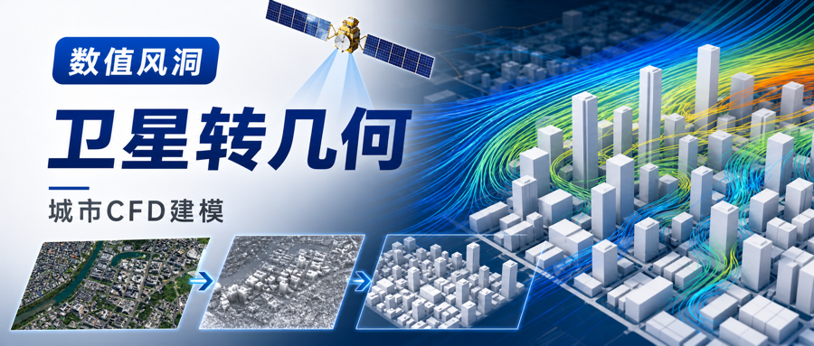
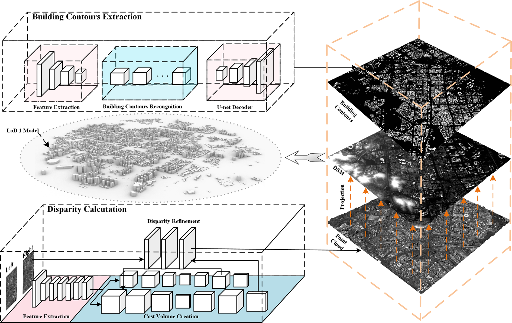
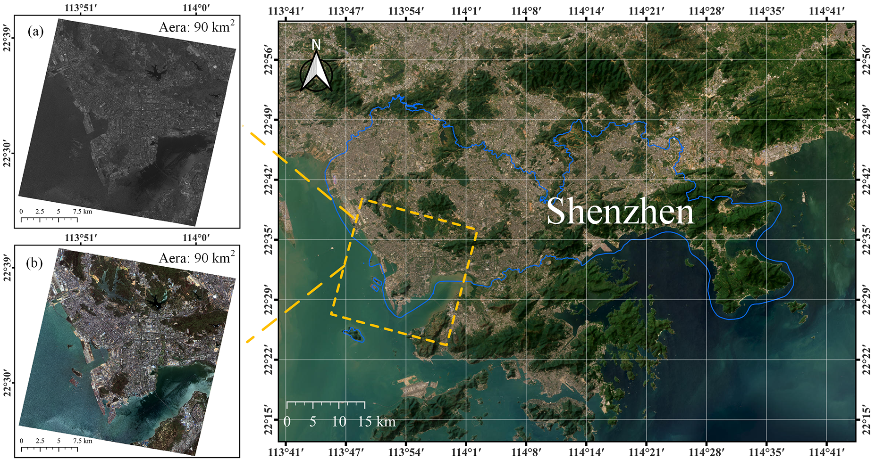
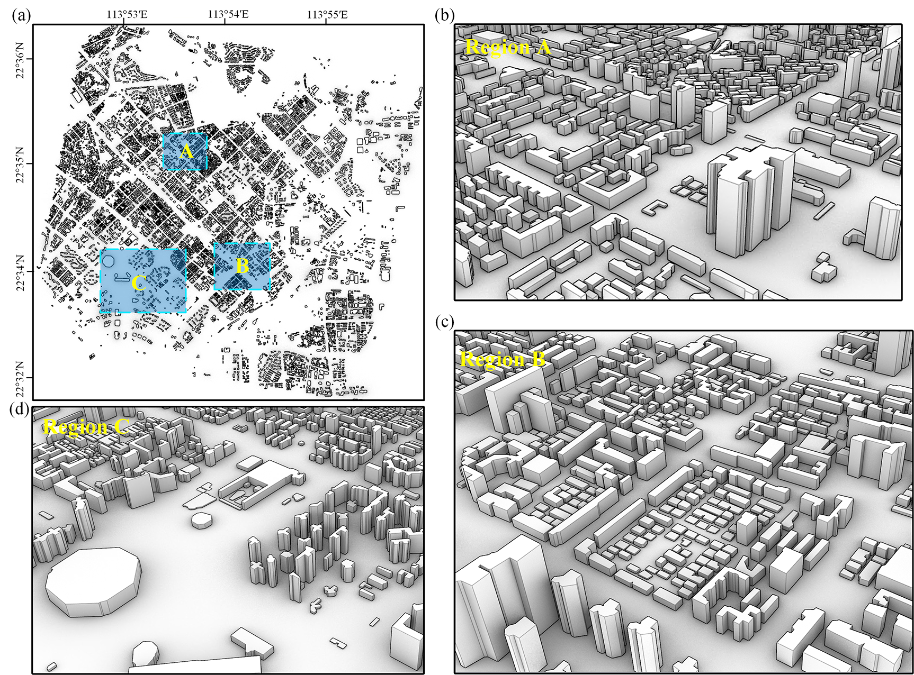
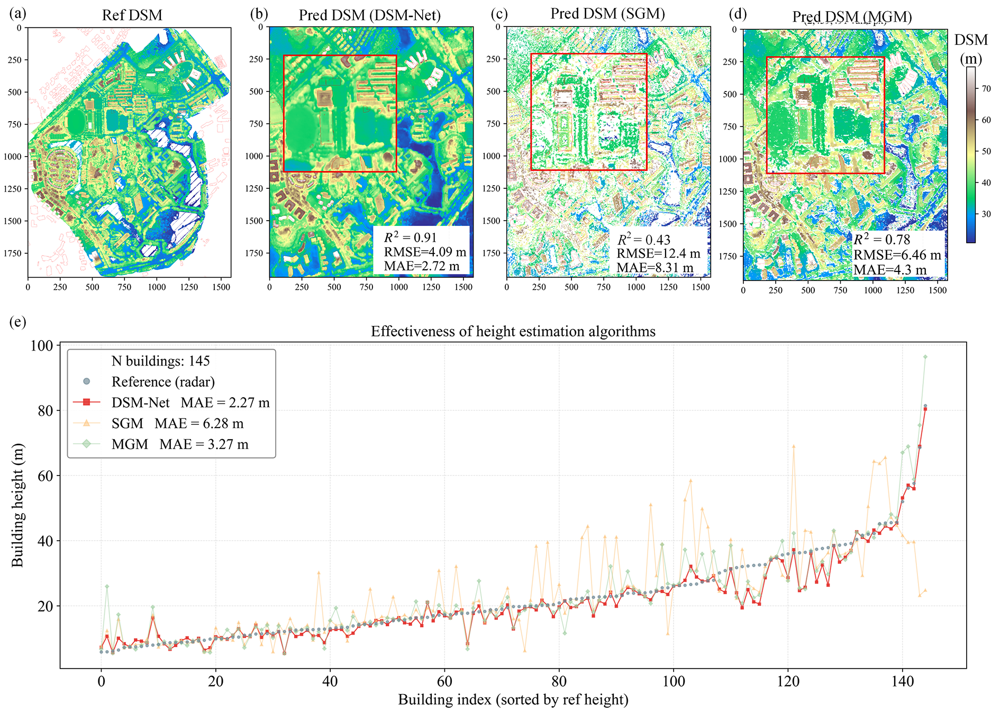

.. _paper-note-ref-zhao2026-BE:

.. role:: student-first-author

如何把卫星影像转成 CFD 可用城市几何
===================================

城市风环境评估里有一项基础工作常常被低估：在进入计算流体力学（CFD）之前，我们首先需要得到规则、干净、可网格化的城市建筑几何。

如果依靠人工建模、现场点云采集或逐片区精修，城市尺度的更新速度很难跟上规划评估、灾害响应和快速工程判断的需求。这篇发表于 **Building and Environment** 的论文尝试把高分辨率 GF-7 立体卫星影像、深度学习识别、三维高度估计和几何规则化连接成一条面向 CFD 的城市几何快速重建流程。

这项工作属于 WOEAI 的 **建筑结构抗风 / 数值风洞与湍动入流** 方向，也直接服务于城市风环境模拟、数值风洞前处理和工程软件化应用。

   论文图 1 所提出框架的整体流程

   框架把建筑轮廓提取、视差估计、点云生成、DSM 投影和 LoD1 几何建模连接起来，使卫星影像能够进一步转化为 CFD 可用的城市模型。

论文信息
--------

- 论文题名: A novel framework for urban geometry rapid reconstruction utilizing high-resolution stereo satellite imagery for wind environment assessment
- 作者: :student-first-author:`Zhao Peisheng`; **Li Chao**; Chen Lingwei; Wang Jinghan; Wang Sirou; Wang Xiaolu\*
- 期刊: Building and Environment
- 年份: 2026
- DOI: https://doi.org/10.1016/j.buildenv.2026.114811
- WOEAI 相关方向: 建筑结构抗风 / 数值风洞与湍动入流

三句话导读
----------

这篇论文研究如何把 GF-7 高分辨率立体卫星影像转化为城市风环境 CFD 可用的 LoD1 几何模型。 它重要，因为应急评估、城市级规划和快速工程判断很难长期依赖人工建模或局部现场点云采集。 读者可以带走的结论是：卫星影像可以进入数值风洞前处理链路，但建筑轮廓、高度估计和几何规则化必须一起验证。

关键数字 / 关键结论卡
---------------------

- 建筑识别独立测试中，Precision、Recall、F1-score 和 IoU 分别达到 :math:`0.9602`、:math:`0.9166`、:math:`0.9379` 和 :math:`0.9178`。
- UAV-LiDAR 验证中，建筑高度估计达到 :math:`R^2 = 0.91`、:math:`\mathrm{MAE} = 2.72\,\mathrm{m}` 和 :math:`\mathrm{RMSE} = 4.09\,\mathrm{m}`。
- DSM-Net 的建筑高度排序曲线中，:math:`\mathrm{MAE}` 为 :math:`2.27\,\mathrm{m}`，低于 SGM 的 :math:`6.28\,\mathrm{m}` 和 MGM 的 :math:`3.27\,\mathrm{m}`。

摘要
----

快速、准确地构建能够直接用于计算流体力学（CFD）的规则城市建筑模型，对城市风环境评估具有重要意义。传统建筑几何生成方法依赖人工建模或现场点云采集，数据获取耗时巨大，难以满足应急场景下城市尺度快速重建的需求。为解决这一问题，本文提出一种利用高分辨率立体卫星影像快速生成适用于 CFD 模拟的城市几何模型框架。

以深圳为例，研究首先对高分七号（GF-7）立体影像进行影像融合和正射校正，构建语义分割数据集；随后训练 remote sensing mamba（RS-Mamba）网络提取建筑轮廓。同时，研究利用 digital surface model network（DSM-Net）估计视差，并通过前方交会算法生成点云；这些点云随后被投影为数字表面模型（DSM），用于计算建筑高度。

为了满足 CFD 对几何质量的要求，研究开发了轮廓简化与规则化算法，在城市尺度快速生成高质量 Level of Detail 1（LoD1）建筑与植被模型。最后，基于深圳和东莞的 UAV-LiDAR 验证得到 :math:`R^2 = 0.91`、:math:`\mathrm{MAE} = 2.72\,\mathrm{m}` 和 :math:`\mathrm{RMSE} = 4.09\,\mathrm{m}`，优于 SGM、MGM 以及 CSF/Top-hat 方法。结果表明，该框架能够有效缓解 GF-7 影像的拖尾效应，并为高保真城市风环境评估提供数值稳定的几何基础。

研究问题
--------

卫星影像要成为 CFD 几何输入，需要跨过识别、测高和规则化三道门槛。本文回答三个问题：

1. 如何从 GF-7 高分辨率立体卫星影像中快速提取城市建筑轮廓和高度信息？
2. 如何把遥感识别结果转化为适合 CFD 网格划分与计算收敛的规则化 LoD1 几何？
3. 如何用 UAV-LiDAR 等独立数据验证该框架在城市尺度重建中的精度与适用边界？

方法贡献
--------

论文提出的流程可以理解为一条“遥感影像到数值风洞几何底座”的转换链路。

第一步是数据准备。研究使用 GF-7 多光谱和前后视全色立体影像，经过正射校正和融合，构建本地语义分割数据集，并结合公开数据集进行迁移学习。GF-7 的立体成像能力使研究能够同时处理建筑平面轮廓和高度信息。

   论文图 2 GF-7 的 MUX 与 PAN 数据集

   GF-7 多光谱与全色影像提供了城市尺度覆盖和局部建筑细节，是后续轮廓提取、视差估计和高度计算的输入基础。

第二步是建筑轮廓和高度提取。研究使用 RS-Mamba 进行建筑足迹语义分割，以 DSM-Net 估计立体影像视差，再通过前方交会生成对象空间点云，并投影得到 :math:`1\,\mathrm{m}` 分辨率 DSM。建筑高度通过建筑轮廓内部 DSM 与周边缓冲区地面高程之间的差值估计。

第三步是面向 CFD 的几何规则化。遥感识别得到的原始轮廓可能存在短边、锐角、孔洞、粘连和不规则边界，这些问题会降低网格质量并影响计算稳定性。论文结合连通域处理、RDP 简化、分割、合并与交点规则，将不规则建筑轮廓转化为更适合数值模拟的 LoD1 建筑模型；植被则通过增强植被指数（EVI）识别并构建简化棱柱模型。

   论文图 10 三维建筑几何的局部视图

   局部结果展示了规则化后的 LoD1 城市几何：建筑轮廓更清晰，高度信息被转化为空间模型，便于后续网格划分和风环境计算。

关键发现
--------

1. 卫星影像可以支撑城市尺度的快速几何重建
~~~~~~~~~~~~~~~~~~~~~~~~~~~~~~~~~~~~~~~~~

**针对问题 1，研究表明，经过迁移学习和本地数据微调后，RS-Mamba 能够较完整地提取 GF-7 影像中的建筑轮廓。** 论文报告的独立测试结果中，建筑识别的 Precision、Recall、F1-score 和 IoU 分别达到 :math:`0.9602`、:math:`0.9166`、:math:`0.9379` 和 :math:`0.9178`。

这说明高分辨率立体卫星影像不仅能提供二维底图，也可以通过深度学习和立体匹配进入城市几何建模链路，为大范围风环境模拟提供更快的数据入口。

2. DSM-Net 高度估计与 UAV-LiDAR 验证结果吻合较好
~~~~~~~~~~~~~~~~~~~~~~~~~~~~~~~~~~~~~~~~~~~~~~~~

**针对问题 3，论文使用东莞理工学院区域的 UAV-LiDAR 数据作为地面真值，对 DSM 和建筑高度估计进行验证。** 结果显示，预测 DSM 与参考 DSM 的建筑高度具有较好一致性，量化指标达到 :math:`R^2 = 0.91`、:math:`\mathrm{MAE} = 2.72\,\mathrm{m}` 和 :math:`\mathrm{RMSE} = 4.09\,\mathrm{m}`。

论文进一步将 DSM-Net 与传统 SGM、MGM 方法比较。在建筑高度排序曲线中，DSM-Net 的 :math:`\mathrm{MAE}` 为 :math:`2.27\,\mathrm{m}`，低于 SGM 的 :math:`6.28\,\mathrm{m}` 和 MGM 的 :math:`3.27\,\mathrm{m}`。这说明在该研究区域中，DSM-Net 对城市建筑高度建模具有更好的稳定性。

   论文图 14 不同 DSM 生成与建筑高度估计算法的比较

   对比结果显示，DSM-Net 的高度曲线更接近 LiDAR 参考结果；传统 SGM 和 MGM 在局部区域存在更明显的高度估计偏差。

3. 几何规则化是连接遥感识别与 CFD 模拟的关键环节
~~~~~~~~~~~~~~~~~~~~~~~~~~~~~~~~~~~~~~~~~~~~~~~~

**针对问题 2，这篇论文的重点不只是识别建筑，也不只是生成 DSM，而是把这些结果进一步处理为 CFD 可用的几何模型。**

对于数值风洞应用来说，建筑轮廓是否规则、短边和尖角是否减少、模型是否能稳定网格化，往往决定了后续计算能否顺利进行。论文中的轮廓简化、规则化和 LoD1 建模步骤，正是为了弥合“遥感视觉结果”和“风工程数值模型”之间的差距。

工程意义
--------

这项工作对城市风环境评估的意义在于，它把数据获取和几何建模的速度向前推进了一步。

在规划评估、复杂城市片区风环境筛查、灾害响应或城市级数字底座建设中，如果能更快得到可用于 CFD 的规则化建筑几何，就可以减少人工建模的重复成本，让工程团队把更多精力放在边界条件、网格策略、风场分析和风险判断上。

对 WOEAI 的研究方向来说，这篇论文也连接了几个长期问题：城市风环境模拟、数值风洞前处理、AI 赋能遥感识别、建筑几何快速重建，以及面向工程应用的自动化建模流程。

适用边界
--------

这项工作并不意味着卫星影像可以替代所有高精度现场测量，也不意味着城市风环境模拟可以完全自动化。

首先，GF-7 影像分辨率会影响密集城市区域的轮廓分离效果。论文指出，在城中村等高密度区域，建筑足迹相距很近，:math:`0.68\,\mathrm{m}` 级影像仍可能出现轮廓粘连。

其次，当前几何生成算法主要针对建筑优化，植被识别依赖 EVI，生成的是相对简化的植被几何，不能等同于完整树冠结构重建。

最后，LoD1 城市几何适合支撑城市尺度风环境模拟和快速评估，但对于对局部细部非常敏感的专项工程，仍需要结合更高精度数据、局部复核和针对性的 CFD 建模策略。

延伸阅读
--------

- `WOEAI | 建筑结构抗风方向介绍 <https://woeai.readthedocs.io/zh-cn/latest/BuildingStructuralWindResistance.html>`_
- `WOEAI | 主页 <https://woeai.readthedocs.io/zh-cn/latest/>`_

完整引用
--------

[74] :student-first-author:`Zhao Peisheng`; **Li Chao**; Chen Lingwei; Wang Jinghan; Wang Sirou; Wang Xiaolu\*, A novel framework for urban geometry rapid reconstruction utilizing high-resolution stereo satellite imagery for wind environment assessment[J]. **Building and Environment**, 2026: 114811. https://doi.org/10.1016/j.buildenv.2026.114811.

收录信息见 :ref:`WOEAI 学术成果页对应条目 <ref-zhao2026-BE>`。

相关论文精解
------------

- :doc:`我们如何用预计算 CFD 数据库加速城市微尺度风环境预测 <ref-zhao2026-BS>`
- :doc:`如何高效重建城市风能中的高时间分辨率风场 <ref-tang2026-RE>`
- :doc:`用 3D Gaussian Splatting 重建城市建筑几何 <ref-zhao2025-SCS>`
