.. _paper-note-ref-zhao2026-BE:

.. role:: student-first-author

卫星立体影像快速重建城市风环境几何：论文精解
========================================================

精简版微信公众号文章：待发布

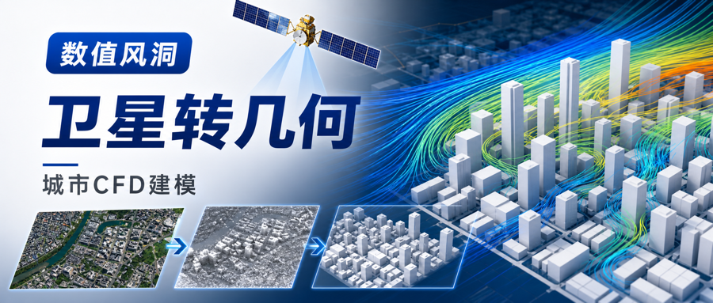

.. contents:: 本页目录
   :local:
   :depth: 2

论文信息
--------

**原文题名**：A novel framework for urban geometry rapid reconstruction utilizing high-resolution stereo satellite imagery for wind environment assessment

**中文题名**：利用高分辨率立体卫星影像快速重建城市几何以评估风环境的新框架

**作者**：:student-first-author:`Peisheng Zhao` （a，b），Chao Li（b，c），Lingwei Chen（a，b），Jinghan Wang（d），Sirou Wang（a），Xiaolu Wang（a，通讯作者）。

**单位**：（a）东莞理工学院生态环境与建筑工程学院，中国广东东莞 523808；（b）哈尔滨工业大学（深圳）土木与环境工程学院，中国广东深圳 518055；（c）哈尔滨工业大学（深圳）广东省土木工程智能韧性结构重点实验室，中国广东深圳 518055；（d）山西大学电力与建筑学院，中国山西。

**通讯作者电子邮件**：wangxiaolu@dgut.edu.cn （X. Wang）。

**期刊**：Building and Environment，302（2026），114811。

**DOI**：https://doi.org/10.1016/j.buildenv.2026.114811

**出版过程**：2026 年 3 月 11 日收稿；2026 年 5 月 27 日收到修订稿；2026 年 5 月 27 日录用；2026 年 6 月 4 日在线发表。

研究亮点
--------

- 构建自主 GF-7 数据集，用于城市尺度建筑掩膜提取。
- 自适应优化算法使建筑轮廓规则化，以满足 CFD 的几何要求。
- 基于深度学习的立体匹配能够快速、准确地估计建筑高度。
- 跨城市验证证实了框架的泛化能力，以及在缓解卫星影像拖尾效应方面的精度优势。

摘要
----

快速、准确地构建可直接用于计算流体力学（CFD）的规则城市建筑模型，对城市风环境评估具有重要意义。然而，传统建筑几何生成方法依赖人工建模或现场点云采集，数据收集耗时巨大，难以满足应急场景下城市尺度快速重建的需求。为解决这一问题，本文提出一种利用高分辨率立体卫星影像，快速生成适用于 CFD 模拟的城市几何模型的框架。以深圳为例，首先对高分七号（GF-7）立体影像进行影像融合和正射校正，构建语义分割数据集。随后训练遥感 Mamba（RS-Mamba）网络以提取建筑轮廓。同时，利用数字表面模型网络（digital surface model network，DSM-Net）估计视差，并通过前方交会算法生成点云。再将这些点云投影为数字表面模型（DSM），用于计算建筑高度。为满足 CFD 对几何质量的要求，本研究开发了轮廓简化与规则化算法，在城市尺度快速生成高质量的细节层次 1（LoD1）建筑与植被模型。最后，利用无人机激光雷达（UAV-LiDAR）对深圳和东莞进行验证，得到 :math:`R^2=0.91`、:math:`\mathrm{MAE}=2.72\,\mathrm{m}` 和 :math:`\mathrm{RMSE}=4.09\,\mathrm{m}`，优于 SGM、MGM 和 CSF/Top-hat 方法。这些结果表明，所提出框架能够有效缓解 GF-7 拖尾效应，为高保真城市风环境评估提供数值稳定的基础。

关键词
------

计算流体力学；城市风场；深度学习；卫星影像；建筑几何。

符号与缩写
----------

- CFD：计算流体力学（Computational Fluid Dynamics）。
- GF-2、3、7：高分二号、三号、七号（GaoFen-2, 3, 7）。
- RS-Mamba：官方遥感 Mamba（Official Remote Sensing Mamba）。
- DSM：数字表面模型（Digital Surface Model）。
- DSM-Net：双尺度匹配网络（Dual-Scale Matching Network）。
- LoD：细节层次（Level of Detail）。
- SSM：状态空间模型（State Space Model）。
- OSSM：全向选择性扫描模块（Omnidirectional Selective Scan Module）。
- SGM：半全局匹配（Semi-Global Matching）。
- WHU-Stereo：武汉大学立体影像数据集（Wuhan University Stereo Dataset）。
- UBCV1：城市建筑分类第一版（Urban Building Classification Version 1）。
- UBCV2：城市建筑分类第二版（Urban Building Classification Version 2）。
- EVI：增强植被指数（Enhanced Vegetation Index）。
- MVS：多视图立体视觉（Multi View Stereo）。
- MGM：更全局匹配（More-Global Matching）。
- RDP：Ramer–Douglas–Peucker 算法。
- NIR：近红外（Near-Infrared）。
- CSF：布料模拟滤波（Cloth Simulation Filter）。
- SMRF：简单形态学滤波（Simple Morphological Filter）。

原文名称差异：摘要将 DSM-Net 展开为 digital surface model network，符号表则写为 Dual-Scale Matching Network；两处原文用语均保留，正文按双尺度匹配网络解释。

1 引言
------

城市风环境研究可用于改善行人舒适性和热环境，增强城市宜居性与气候韧性，从而促进城市可持续发展 [16,34]。计算流体力学（CFD）因具有高分辨率、变量可控和可视化效果良好等优点，被广泛用于城市风环境和风工程研究 [9,33,40]。在影响 CFD 精度的众多因素中，建筑几何建模至关重要。然而，依赖 CAD 工具的传统人工方法劳动密集，难以快速生成大尺度建筑几何。随着城市建筑更新加快，快速构建城市尺度建筑几何已成为城市风环境研究的关键，尤其是在应急场景下。

根据 CityGML 标准 [42]，建筑模型通过细节层次（LoD）表达其复杂程度。其中，LoD1 模型以统一高度表达建筑足迹。既有研究经常使用政府或商业机构提供的地理信息系统（GIS）数据，直接按高度拉伸，生成大尺度 LoD1 建筑几何 [31,37]。这种方法虽然高效，但通常依赖近似楼层数和假定层高，因而精度有限，也无法支持及时的全城更新。相反，采用无人机（UAV）摄影测量或激光雷达扫描，并利用多视图立体视觉（MVS）[39] 或泊松表面重建 [27] 等算法进行高保真建模，可获得细致的 LoD2 及更高层次模型 [14,15,52]。尽管这些方法能够生成高保真建筑模型，但仅数平方千米区域的点云获取通常就需数日；当扩展至数十至数百平方千米的城市尺度时，其时间需求难以承受。

为克服尺度与效率之间的权衡，近年来的研究利用深度学习从卫星影像自动提取建筑足迹。该领域已从全卷积网络（FCN）[26] 和卷积神经网络（CNN）[45] 等端到端卷积网络，发展至 U-Net [38] 等编码器–解码器架构，随后发展至能够捕获长距离依赖的 Transformer 模型 [35,43]。尽管这些方法取得成功，Transformer 自注意力的二次复杂度仍给整景处理带来挑战。Mamba [17,18] 等状态空间模型（SSM）的引入，使得在显著降低计算成本的同时进行全局语义建模成为可能。ChangeMamba [7] 和 RS-Mamba [51] 等专门变体，通过全向选择性扫描模块（OSSM）捕获整幅影像的全局上下文，进一步展示了 SSM 在遥感中的潜力。这种策略成功避免了传统基于图块的方法中经常出现的空间信息损失。

仅提取建筑足迹不足以生成三维建筑几何，还需要准确的建筑高度信息。准确估高要求从不同角度拍摄同一区域的立体影像对或多视角影像。与建筑轮廓提取类似，深度学习通过替代 SGM [20]、MGM [13] 等传统立体匹配算法，改变了建筑高度估计方式；传统算法在城市尺度任务中的计算开销较大。近期的 Stereo-Net [29]、DSM-Net [19] 等深度学习方法，显著优化了精度与效率之间的平衡，尤其适用于纹理不足或视差不连续的困难遥感环境。具体而言，DSM-Net 将双尺度学习与高效代价聚合相结合，解决城市遥感中的固有困难。该架构在维持较高推理速度的同时，能够捕获全局结构布局和局部几何细节。此外，其细化模块用于处理建筑边界常见的尖锐视差不连续，并抑制平坦屋顶等弱纹理区域的噪声。这些技术优势保证了快速生成高质量视差图，并在复杂城市地形中保持稳健性。

尽管取得上述进展，原始卫星数据与高保真风工程应用之间仍存在重要的计算与几何衔接缺口 [1,44]。现有城市重建流程主要关注视觉保真度，往往忽略数值求解器对拓扑的要求。因此，重建模型经常具有冗余短边、非正交锐角等退化几何特征，严重损害网格质量和 CFD 收敛性。为此，迫切需要一体化框架，不仅保证城市尺度的高速重建，还要生成专门针对数值稳定性优化的规则几何模型。

针对这些挑战，本研究提出城市尺度建筑几何快速重建的一体化框架。以深圳和东莞为案例，采用 GF-7 全色立体影像训练和部署 RS-Mamba [51] 与 DSM-Net [19] 架构，并利用公开数据集 [22,23,32] 进行迁移学习初始化。不同于既有方法，本文引入专为 CFD 模拟设计的建筑足迹优化算法。通过结合 Ramer、Douglas 和 Peucker 提出的 RDP 算法 [11] 与定制规则化策略，生成高质量 LoD1 几何。最后，在两座城市的城区开展计算流体力学模拟，以验证所提框架的精度、效率和数值稳定性。

2 方法
------

本文整体流程如图 1 所示。方法由四个主要阶段组成，以保证原始卫星数据能够顺畅转化为适用于数值模拟的几何。

首先，采集覆盖深圳和东莞的 GF-7 多光谱及前后视全色立体影像。对这些影像进行必要预处理，包括正射校正和全色锐化，以建立统一的空间基础。在特征提取阶段，采用 RS-Mamba 架构进行语义分割，采用 DSM-Net 架构估计视差。两个模型均通过 UBCV1 [23]、UBCV2 [22] 和 WHU-Stereo [32] 数据集进行迁移学习初始化。随后，在定制的本地数据集上进行微调，使模型适应目标区域的特定城市形态。

接下来处理所得建筑足迹和视差图，以获得三维信息。视差图通过反投影和前方交会转化为物方空间点云，再插值生成分辨率为 1 m 的数字表面模型。计算每个建筑足迹内部的平均表面高程与周围缓冲区提取的地面高程之差，确定建筑高度。

为满足风工程的严格要求，实施专门的建筑足迹优化算法。该过程利用 Ramer–Douglas–Peucker（RDP）算法 [11] 减少冗余顶点，并采用定制合并与相交规则。该规则化步骤保证生成高质量 LoD1 几何，消除短边和非正交角点。

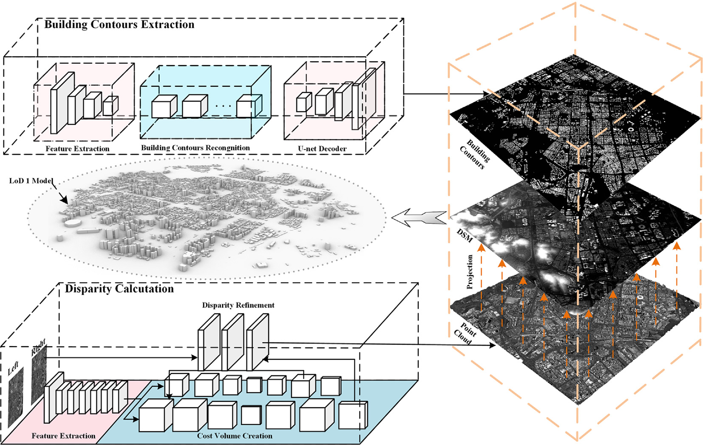

   **图 1** 所提出框架的整体工作流程。

   Building Contours Extraction：建筑轮廓提取；Feature Extraction：特征提取；Building Contours Recognition：建筑轮廓识别；U-net Decoder：U-Net 解码器；LoD 1 Model：LoD1 模型；Disparity Calculation：视差计算；Disparity Refinement：视差细化；Left / Right：左影像／右影像；Cost Volume Creation：代价体构建；Building Contours：建筑轮廓；DSM：数字表面模型；Point Cloud：点云；Projection：投影。

2.1 数据集与预处理
~~~~~~~~~~~~~~~~~~~~

数据集质量不仅影响深度学习模型的精度，也深刻影响其泛化能力。本研究结合公开数据集与自主数据集训练模型。语义分割网络先在城市建筑分类与验证第一版（UBCV1）[23] 和第二版（UBCV2）[22] 数据集上预训练。UBCV2 数据集包含来自高景一号、高分二号（GF-2）、高分三号（GF-3）等卫星的多源光学与合成孔径雷达（SAR）影像。影像及相应建筑掩膜裁为 :math:`512\times512` 像素图块，并按 6:2:2 分为训练、验证和测试集。数据集细节见附录 A 图 15。

除公开数据集外，本研究利用 GF-7 立体卫星影像构建自主数据集。GF-7 卫星配备立体相机，能够获取高分辨率全色立体影像（小于 0.8 m）和空间分辨率为 2.6 m 的多光谱影像。其辐射分辨率为 11 位，以 16 位格式存储，特别适合构建立体匹配数据集。本研究获取的影像云量低于 1%，保证了建筑细节的良好可见性。图 2（a）和（b）展示 GF-7 获取的深圳全色与多光谱影像。原始多光谱影像的空间分辨率仅为 2.6 m，不能满足后续建筑足迹提取要求。因此，本研究采用 Gram–Schmidt 全色锐化算法，将其与全色波段融合，将多光谱影像分辨率提升至 0.65 m。

为构建建筑提取语义分割数据集，人工勾画建筑足迹并转为二值标签掩膜（图 3）。随后，将高分辨率影像与对应标签均裁为 :math:`512\times512` 像素图块，以保证计算效率。再利用该数据集进行迁移学习，微调预训练模型，提高其在本研究中精确分割建筑轮廓的适应性。

建筑高度估计所用立体匹配模型在 WHU-Stereo 数据集 [32] 上训练；该数据集由 GF-7 沿轨立体影像和机载激光雷达点云构成。作为大规模、高质量的卫星立体匹配基准，它提供 GF-7 的高分辨率前视和后视全色立体影像。更重要的是，数据集包含相应的高精度 DSM 真值。这种技术上的一致性，保证预训练模型针对本研究 GF-7 数据的传感器特征与几何得到良好优化。此外，它覆盖多种城市场景，有利于后续城市尺度重建任务的稳健泛化。该数据集含 1757 对经核线校正的立体影像，覆盖中国六座城市的不同地形，并提供经过遮挡消除和进一步细化的高质量真值视差图。作为首个专为中国城市场景设计的大规模公开立体数据集，WHU-Stereo 被广泛用于深度学习立体匹配模型的训练、验证与评估。在 WHU-Stereo 上完成训练后，本研究使用同类型 GF-7 卫星影像生成目标研究区域的 DSM。

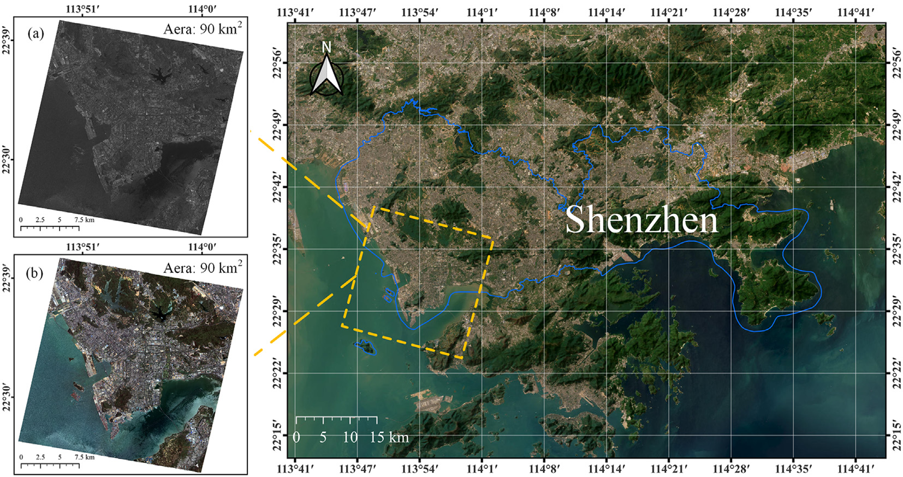

   **图 2** GF-7 的多光谱（MUX）和全色（PAN）数据集。

   Shenzhen：深圳；Aera（原图拼写）：面积；90 km²：90 平方千米；N：北向；km：千米。子图 (a) 为全色影像，(b) 为多光谱影像（对应关系见 PDF file page 3 正文）。经纬度刻度及 0、2.5、5、7.5 km 和 0、5、10、15 km 比例尺保持原值。

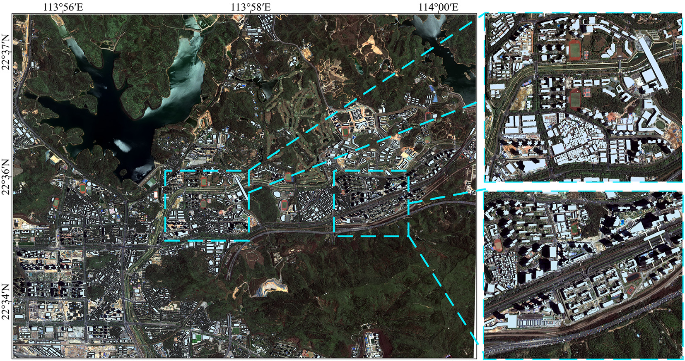

   **图 3** 自建数据集的建筑掩膜。

   图内无额外英文说明文字；经度刻度中的 E 表示东经，纬度刻度中的 N 表示北纬；青色框与连线指向局部放大区域。

2.2 建筑足迹提取
~~~~~~~~~~~~~~~~~~

2.2.1 RS-Mamba 架构
^^^^^^^^^^^^^^^^^^^^

本研究采用 RS-Mamba [51] 提取建筑足迹。作为 SSM [18] 的变体，RS-Mamba 能够有效捕获长距离依赖，在时间序列和影像等序列数据的处理中发挥重要作用。SSM 通过一组线性常微分方程（ODE）定义动态系统。以典型 SSM 实现 Mamba 为例，其状态转移方程和输出方程分别见式（1）和式（2）。

.. math::

   h'(t)=\widehat{\mathbf A}h(t)+\widehat{\mathbf B}x(t).\qquad (1)

.. math::

   y(t)=\mathbf C h(t)+\mathbf D x(t).\qquad (2)

其中，:math:`\widehat{\mathbf A}` 为状态转移矩阵，:math:`\widehat{\mathbf B}` 和 :math:`\widehat{\mathbf D}` 为输入相关矩阵，:math:`x(t)` 为输入序列特征，:math:`h(t)` 为连续时间隐状态。原文解释中的 :math:`\widehat{\mathbf D}` 与式（2）中未加帽号的 :math:`\mathbf D` 排式不同，此处保留原文。

RS-Mamba 的整体架构受到 U-Net [38] 启发。首先通过图块嵌入将输入影像划分为图块序列，再送入编码器提取特征。编码器包含五个阶段：第一阶段采用卷积层，将原始影像映射至多通道特征空间；第二至第五阶段各含一个由最大池化和两个卷积层组成的下采样块。通过连续卷积与池化，提取不同尺度、不同方向的特征，同时逐渐降低空间分辨率，形成层级多尺度表示。编码器输出随后由全向空间状态块（OSS Block）处理，以增强建筑边缘和几何结构等关键特征的提取。最后，解码器将特征恢复至原分辨率，并与真值计算损失，通过反向传播优化模型参数。完整流程见图 4。

OSS Block 的核心是 OSSM，沿八个方向进行选择性扫描，包括水平、竖直、两条对角线及其反向，从而获得方向性 token 序列。这些序列由 SSM 独立处理，实现多方向全局特征融合（附录 A 图 17）。最后，融合表示依次经过线性投影、门控激活（SiLU）和第二个线性层，再通过残差连接与输入相加，形成细化后的输出特征。

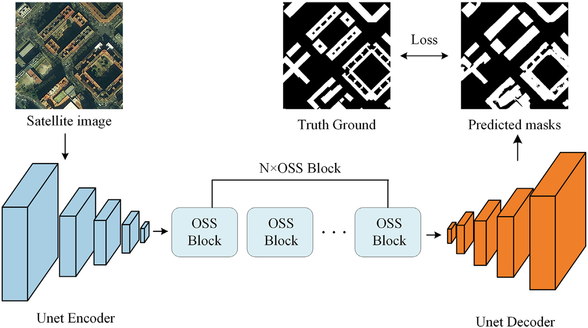

   **图 4** RS-Mamba 的框架。

   Satellite image：卫星影像；Truth Ground（原图词序）：真实标注；Predicted masks：预测掩膜；Loss：损失；Unet Encoder：U-Net 编码器；Unet Decoder：U-Net 解码器；OSS Block：全向空间状态块；N×OSS Block：N 个全向空间状态块。

2.2.2 训练
^^^^^^^^^^

本研究采用较简单的数据增强方法，包括水平翻转和转置。具体而言，以 :math:`p=0.5` 的概率随机水平翻转，并以 :math:`p=0.5` 的概率随机转置，以增强方向稳健性。模型批量大小为 8，训练 300 轮，初始学习率为 0.0001，使用 AdamW 优化器 [2]。预训练数据按 6:2:2 分成训练、验证和测试集。具体训练参数见表 1。全部实验使用单张 RTX 4090 GPU（24 GB 显存）。

.. list-table:: 表 1 RS-Mamba 主要训练参数
   :header-rows: 1
   :widths: 25 50 25

   * - 参数
     - 参数定义
     - 数值
   * - 训练轮数
     - 预训练 / 迁移学习轮数
     - 300 / 100
   * - 批量大小
     - 每次迭代样本数
     - 8
   * - 学习率
     - 预训练 / 迁移学习学习率
     - :math:`10^{-4}/10^{-5}`
   * - 预热
     - 学习率预热迭代数
     - 1000
   * - 权重衰减
     - AdamW 权重衰减率
     - 0.001
   * - 评估间隔
     - 验证频率（轮）
     - 5
   * - SSM 状态维数
     - 隐状态维数 :math:`d_{\mathrm{state}}`
     - 16

遵循 RS-Mamba 的建议，训练使用组合损失函数，包括二元交叉熵（BCE）损失与 Dice 损失的加权组合。通过该形式，从两个互补角度同时优化模型：BCE 损失约束逐像素预测精度，Dice 损失约束预测掩膜与真值掩膜的区域重叠。具体形式见式（3）至式（5）。

.. math::

   L_{\mathrm{bce}}=-\sum_{i=1}^{n}[y_i\log(p_i)+(1-y_i)\log(1-p_i)].\qquad (3)

.. math::

   L_{\mathrm{dice}}=1-\frac{2\sum_{i=1}^{n}y_ip_i}{\sum_{i=1}^{n}y_i+\sum_{i=1}^{n}p_i}.\qquad (4)

.. math::

   L=L_{\mathrm{bce}}+L_{\mathrm{dice}}.\qquad (5)

其中，:math:`n` 表示样本数，:math:`y_i` 为真实建筑足迹标签，:math:`p_i` 为预测概率，:math:`L_{\mathrm{bce}}` 和 :math:`L_{\mathrm{Dice}}` 分别表示二元交叉熵和 Dice 损失。

此外，采用精确率（Precision，Pre）、召回率（Recall，Rec）、F1 分数（F1-score，F1）和交并比（Intersection-over-Union，IoU）全面评价语义分割性能。Pre 衡量所有预测为建筑的像素中，被正确识别的建筑像素比例，见式（6）；当背景像素被误判为建筑、假阳性 FP 增加时，其值降低。Recall 量化真实建筑像素中被成功检测的比例，见式（7），反映检测完整性。Pre 与 Rec 通常存在权衡，因此二者调和平均数 F1（式（8））提供整体性能的平衡度量。此外，IoU 衡量预测区域与真值区域的空间重叠，见式（9），直接反映模型在区域匹配与空间定位方面的精度。

.. math::

   \mathrm{Pre}=\frac{\mathrm{TP}}{\mathrm{TP}+\mathrm{FP}}.\qquad (6)

.. math::

   \mathrm{Rec}=\frac{\mathrm{TP}}{\mathrm{TP}+\mathrm{FN}}.\qquad (7)

.. math::

   \mathrm{F1}=\frac{2\times\mathrm{Pre}\times\mathrm{Rec}}{\mathrm{Pre}+\mathrm{Rec}}.\qquad (8)

.. math::

   \mathrm{IoU}=\frac{\mathrm{TP}}{\mathrm{TP}+\mathrm{FP}+\mathrm{FP}}.\qquad (9)

其中，TP 为模型正确预测为正类的样本数，FP 为错误预测为正类的样本数，FN 为错误预测为负类的样本数。

原文排式说明：式（9）分母确实重复写为 FP，未出现 FN，此处忠实保留。原文未交代四项指标是否采用完全相同的聚合口径，因此不使用一般定义反推并替换论文报告值。

2.2.3 建筑轮廓提取结果
^^^^^^^^^^^^^^^^^^^^^^

附录 A 图 16 展示训练和验证损失曲线。训练早期损失迅速下降，反映评价指标快速改善。随着训练推进，各指标趋于稳定，训练集最终 IoU、F1、Rec 和 Pre 分别达到 0.98、0.96、0.96 和 0.97。训练与验证曲线间差距很小，表明没有明显过拟合。

为评价所提方法的泛化能力，使用 UBCV2 和整理后的自主数据集中的独立测试集进行验证。这些数据经过严格划分，确保训练阶段未使用。可视化结果见图 5。同时，以 Pre、Rec、F1 和 IoU 四项核心指标定量评价性能，模型分别取得 0.9602、0.9166、0.9379 和 0.9178。整座城市场景上的定性效果见图 6。这些结果与基准性能一致，表明模型能够近乎完整地识别建筑，并得到精确几何边界。这样的高保真提取为 LoD1 城市重建提供坚实基础，能够有效捕获城市主要形态。尽管极高建筑密度偶尔导致近乎连续区域中的相邻足迹粘连，整体精度仍满足后续风环境建模的严格数据要求。

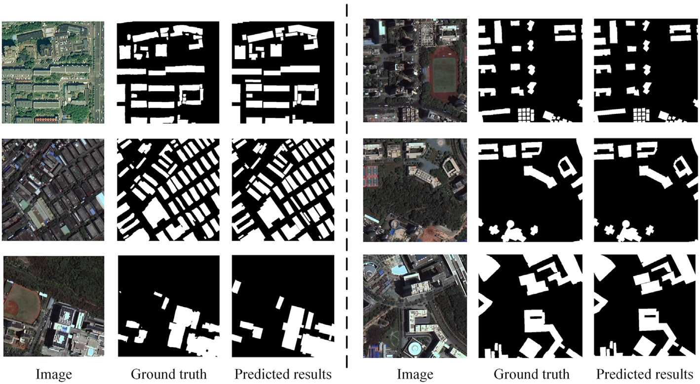

   **图 5** RS-Mamba 的训练表现。

   Image：影像；Ground truth：真实标注；Predicted results：预测结果。左右两组各有三行示例，每组按影像、真实标注、预测结果的顺序排列。

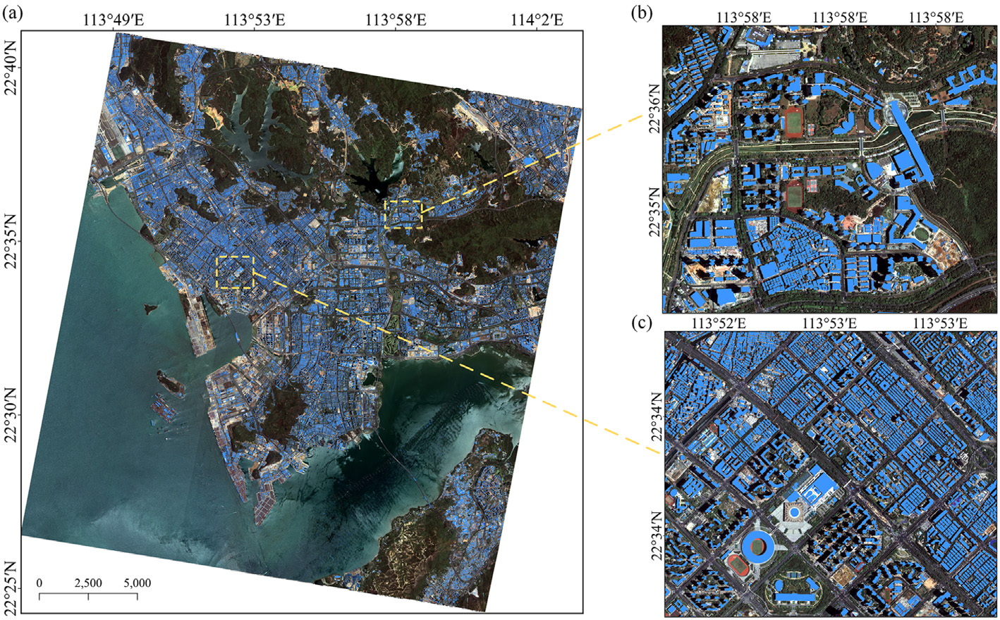

   **图 6** 整幅 GF-7 影像的建筑轮廓提取结果。

   图内无额外英文说明文字；(a) 为整体结果，(b)、(c) 为框选区域的局部结果；E／N 分别表示东经／北纬。比例尺原图标为 0、2,500、5,000，未明确印出单位。

2.3 建筑高度估计
~~~~~~~~~~~~~~~~~~

2.3.1 立体匹配与视差估计
^^^^^^^^^^^^^^^^^^^^^^^^

本研究采用 DSM-Net [19] 生成 DSM。其架构主要包含特征提取、代价体构建、代价聚合、视差计算和视差细化。与 StereoNet [29] 相比，DSM-Net 使用双尺度学习策略，能够生成更高质量的视差图。

如图 7 所示，DSM-Net 以双目卫星影像，即左、右视图为输入。本文将 GF-7 后视核线影像作为左图，将前视正射校正核线影像作为右图。随后，使用权重共享的二维 CNN，即孪生网络 [10]，将输入分辨率下采样至原尺寸的 1/4。接着，通过并行分支提取两种尺度特征：分辨率为 1/8 的低尺度特征，以及分辨率为 1/4 的高尺度特征。利用残差块增强特征表示，每个卷积层除指定例外外，均接批量归一化 [24] 和 ReLU 激活层。该架构在整合多尺度信息的同时，有效提取有辨别力的特征：较粗分支捕获全局上下文，较细分支保留局部细节。

随后，在对应尺度上计算左侧特征像素与右侧候选匹配像素的特征向量差，利用提取的特征构建双尺度四维代价体。右侧特征图在同时包含负值和正值的视差搜索范围内，相对于左图水平移动，最终形成 :math:`D\times H\times W\times C` 的四维代价体，其中 :math:`D` 为视差范围，:math:`H\times W\times C` 为特征尺寸 [6,30]。该设计显式包含较宽视差范围，因而能够有效适应遥感立体影像因较大视角差异而常见的正、负视差并存情况 [41]。

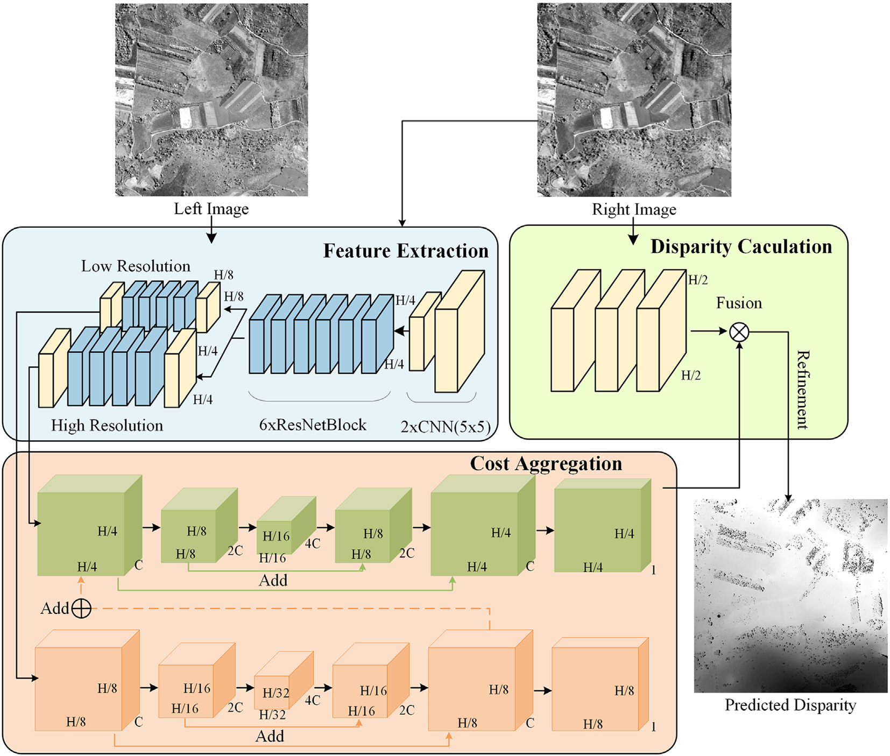

   **图 7** DSM-Net 的框架。

   Left Image / Right Image：左影像／右影像；Feature Extraction：特征提取；Low Resolution / High Resolution：低分辨率／高分辨率；6xResNetBlock：6 个残差网络块；2xCNN(5x5)：2 个 5×5 卷积层；Disparity Caculation（原图拼写）：视差计算；Fusion：融合；Refinement：细化；Cost Aggregation：代价聚合；Add：相加；Predicted Disparity：预测视差。H/2、H/4、H/8、H/16、H/32，以及 C、2C、4C、1 等尺度与通道标记均保持原符号。

对于视差回归，DSM-Net 采用可微 soft argmin 运算 [28] 回归最终视差。具体地，先通过 softmax 函数将聚合后的代价体转为沿视差维度的概率分布，再使用式（10），对全部视差等级进行概率加权求和，计算期望视差。该机制能够从离散代价体生成具有亚像素精度的连续视差图。

.. math::

   \widehat d(h,w)=\sum_{d=-D_{\max}}^{D_{\max}-1}d\,\sigma[-c(d,h,w)].\qquad (10)

其中，:math:`\widehat d` 为预测视差，:math:`d` 为候选视差，:math:`\sigma` 为 softmax 函数，:math:`c` 为匹配代价。

获得粗视差图后，从原始左图中提取对噪声与光照变化稳健的浅层特征，并将其与上采样至 1/2 分辨率的高尺度视差图拼接 [36]。随后，该拼接张量经过一组二维卷积层，预测视差残差，并将残差加到上采样后的粗视差上，得到细化视差。最后，通过双线性上采样将细化视差恢复至全分辨率，作为最终预测。由于融合了左图的精细特征，该细化模块能够有效缓解直接上采样低分辨率视差图通常产生的马赛克或棋盘格伪影，获得高质量全分辨率结果。采用 L1 损失监督视差预测，定义如下：

.. math::

   L=\frac{1}{N}\sum_{i=1}^{N}\operatorname{smoothL1}(d_i-\widehat d_i).\qquad (11)

.. math::

   L_{\mathrm{total}}=\lambda_1L_{\mathrm{low}}+\lambda_2L_{\mathrm{high}}+\lambda_3L_{\mathrm{refine}}.\qquad (12)

其中，:math:`N` 为有效像素数，:math:`d` 和 :math:`\widehat d` 分别为真值与预测视差，:math:`L_{\mathrm{low}}`、:math:`L_{\mathrm{high}}` 和 :math:`L_{\mathrm{refine}}` 分别为低分辨率视差预测损失、高分辨率视差预测损失与视差细化损失，:math:`\lambda_1,\lambda_2,\lambda_3` 为损失权重。

2.3.2 数字表面模型
^^^^^^^^^^^^^^^^^^

本研究将训练后的 DSM-Net 模型用于从深圳前、后视全色影像生成视差 [19]。随后，以左视图为基础进行像素级重投影，合成对应右视图，并使用前方交会算法 [46,47] 重建场景点云，如图 8（d）所示。结果表明，大部分建筑具有完整屋顶细节，但少量建筑立面几乎没有点。这主要源于卫星影像像素分辨率有限，以及成像几何使竖直立面的投影面积很小。因此，预测时几乎无法捕获立面细节。不过，所得精度仍足以构建 LoD1 建筑几何。

随后，将生成的点云投影，得到分辨率为 1 m 的 DSM，用于估计建筑高度，结果见图 8。其中，（b）展示提取的对应建筑足迹，（a）与（c）分别表示整体场景与局部区域的 DSM。DSM 可视化采用由暗至亮的色带表示高程增加。结合提取的建筑轮廓，再按高度拉伸生成 LoD1 建筑模型。

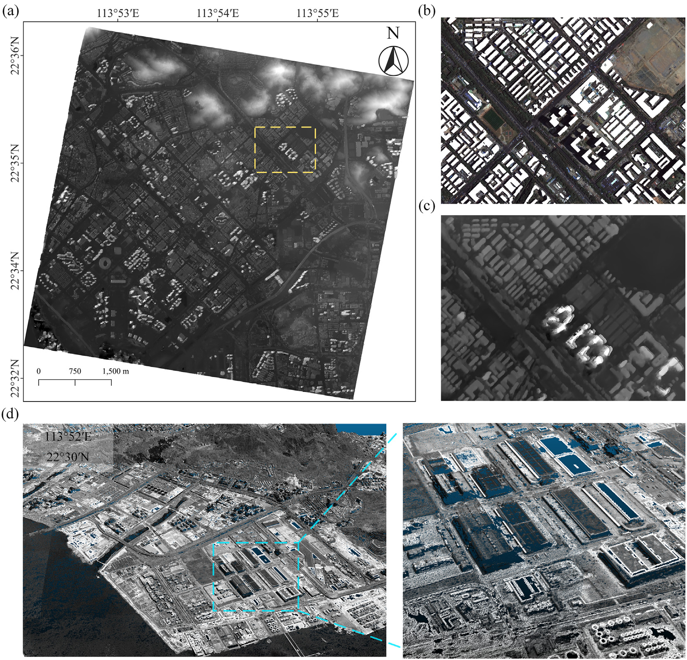

   **图 8** 研究区域的 DSM、建筑掩膜和点云。

   (a) 整体 DSM；(b) 建筑掩膜；(c) 局部 DSM；(d) 点云及其局部视图（子图对应内容见 PDF file page 7 正文）。N 指北箭头：北；经纬度中的 E／N：东经／北纬；比例尺 m：米。经纬度与 0、750、1,500 m 比例尺保持原值。

3 城市模型重建
----------------

3.1 建筑轮廓细化
~~~~~~~~~~~~~~~~~~

RS-Mamba 提取的建筑轮廓通常较粗糙且不规则，与真实建筑的规则几何形状存在偏差，可能不利于后续 CFD 模拟收敛。针对这一问题，提出自适应轮廓优化算法，主要包括噪声点过滤、建筑孔洞填充、轮廓简化与细化三个阶段。

初步轮廓不仅包含建筑主体轮廓，也包含大量与建筑无关的小伪影。为去除这些非建筑区域，本文参考 Zhao 的研究 [50] 设计简化算法。在生成 :math:`512\times512` 轮廓图块后，按地理位置拼接全部结果，形成研究区统一轮廓图。接着计算每个轮廓掩膜的面积，将小于 100 像素阈值的区域作为非建筑噪声丢弃，将剩余轮廓保存为清理后的掩膜文件。随后采用形态学腐蚀，消除无效边缘区域，并分离原先相连的建筑群。此外，利用连通域分析 [5] 过滤异常区域，去除腐蚀产生的过小和过大的非建筑斑块。最后的膨胀步骤恢复腐蚀过程中丢失的建筑边界细节，同时填充内部孔洞，以利于准确提取轮廓并进一步优化。

对于每个建筑轮廓，本文使用 Ramer–Douglas–Peucker（RDP）算法 [12] 减少顶点数。计算每个简化轮廓的主方向，再旋转对齐轮廓，以进行进一步细化。附录 A 图 18 给出 RDP 简化结果：虽然大部分足迹已规则化，仍存在短线段与尖角，可能妨碍 CFD 收敛。为此，采用 Zhang 等 [48] 提出的相交、分割和合并操作，进一步优化轮廓。

3.2 建筑几何重建
~~~~~~~~~~~~~~~~~~

三维建筑重建还需要估计建筑高度。遵循 Chen 等 [8] 的方法，在每个原始建筑轮廓周围增加面积为 1000 平方像素的缓冲区。在该扩展区域内，以 1 m 为间隔离散 DSM 值，并统计各区间的像素数，以分析 DSM 值分布。将像素数超过 10 的最低 DSM 区间识别为地面，以其平均 DSM 值作为地面高度。随后计算原建筑足迹内的平均 DSM 值，并减去估计的地面高程，得到建筑高度。最后通过竖向拉伸生成 LoD1 建筑模型。建筑几何整体与局部视图见图 9 和图 10。可以看出，近乎所有建筑轮廓均较规则，且各自高度符合实际，表明基于立体卫星影像的建筑几何生成框架具有较高精度与稳健表现。

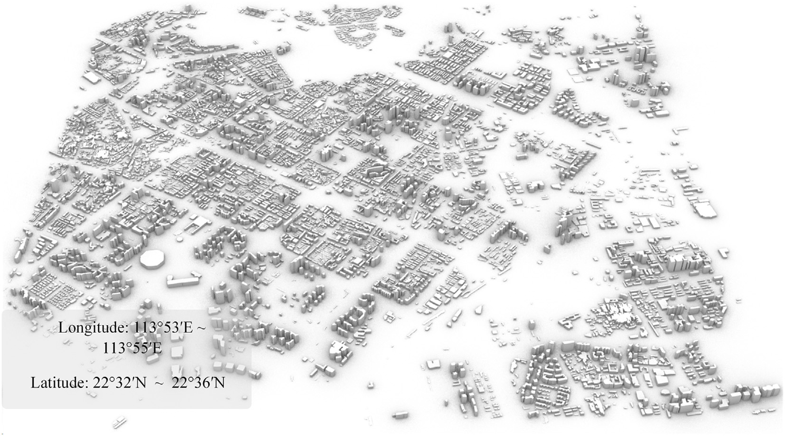

   **图 9** 整体三维建筑几何重建结果。

   Longitude：经度，113°53′E～113°55′E；Latitude：纬度，22°32′N～22°36′N。保留原图的坐标范围。

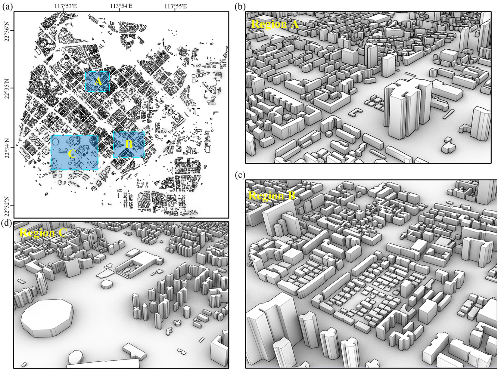

   **图 10** 三维建筑几何的局部视图。

   Region A / Region B / Region C：区域 A／区域 B／区域 C；(a) 为 A、B、C 的位置；(b)、(c)、(d) 分别为区域 A、B、C 的三维局部视图。E／N：东经／北纬。

3.3 植被重建
~~~~~~~~~~~~~~

本研究采用的 GF-7 多光谱影像包含蓝、绿、红和近红外（NIR）四个波段。健康植被的叶绿素主要吸收可见光，尤其是红光；叶片内部细胞结构，特别是栅栏组织和海绵组织，会强烈散射和反射近红外辐射。因此，植被在近红外波段的反射率显著高于红波段。将近红外波段与其他光谱通道结合，可有效区分植被与非植被表面。

本研究采用增强植被指数（EVI）[21] 提取植被区域。EVI 计算公式如下：

.. math::

   \mathrm{EVI}=G\frac{\mathrm{NIR}-R}{\mathrm{NIR}+C_1R-C_2B+L}.\qquad (13)

其中，:math:`B` 和 :math:`R` 分别为卫星影像的蓝、红通道值；:math:`\mathrm{NIR}` 为近红外通道值；:math:`G=2.5` 为缩放所得指数范围的增益因子；:math:`C_1=6.0`、:math:`C_2=7.5` 为大气校正系数；:math:`L=1.0` 为冠层背景调节因子，用于减小稀疏植被区土壤背景噪声影响。

EVI 结果见图 11。与原影像对照，原文报告植被区域的 EVI 通常低于 −0.2，而部分裸土区域的值接近 −1.0，可能影响植被检测。因此，本研究应用阈值，仅保留 EVI 处于 −0.2 至 −0.8 范围内的像素作为植被，建立准确的植被信息模型。

提取植被掩膜后，使用与建筑估高类似的方法估计植被高度：原文写为从地面高程中减去每个植被覆盖区的平均 DSM 值，以得到统一高度。再利用该高度将植被掩膜拉伸为粗略棱柱体，以便在 CFD 模拟中考虑植被影响。需要指出，精确重建植被几何不是本研究重点。鉴于立体卫星影像生成的点云与 DSM 在分辨率和细节上存在局限，达不到无人机级精度，因此采用简化棱柱表示。

原文口径说明：此处负 EVI 区间及“地面高程减 DSM”的差值方向按原文保留；后者与第 3.2 节“DSM 减地面高程”的建筑估高方向不同，不能未经原文澄清就把它当作通用植被计算参数。

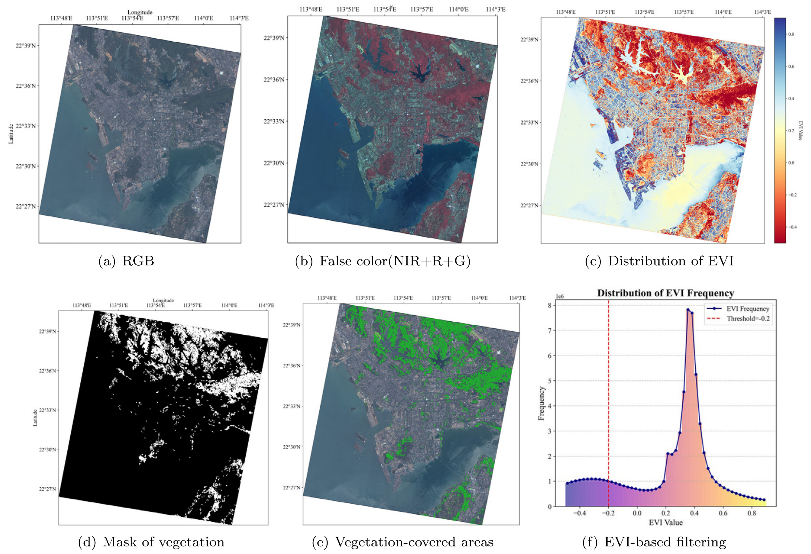

   **图 11** 植被提取。

   (a) RGB：RGB 真彩色影像；(b) False color (NIR+R+G)：假彩色影像（近红外＋红＋绿）；(c) Distribution of EVI：增强植被指数（EVI）分布；(d) Mask of vegetation：植被掩膜；(e) Vegetation-covered areas：植被覆盖区域；(f) EVI-based filtering：基于 EVI 的筛选。 Longitude / Latitude：经度／纬度；EVI Value：EVI 值；Distribution of EVI Frequency：EVI 频数分布；Frequency：频数；EVI Frequency：EVI 频数；Threshold=-0.2：阈值=-0.2。保留频数轴 1e6 倍率、负阈值、所有色标值与地理刻度。

为考虑植被效应，通过引入表示气动阻力的源项实施冠层流体模型。基于此前提取的植被区域，识别位于植被内的网格单元，并对这些单元施加 :math:`k` 和 :math:`\varepsilon` 的附加源项。对应源项如下：

.. math::

   S_u=-C_da|u|U.\qquad (14)

.. math::

   S_k=C_da(\beta_p|\mathbf u|^3-\beta_d|\mathbf u|k).\qquad (15)

.. math::

   S_\varepsilon=C_da(c_\varepsilon\beta_p|\mathbf u|^3-c_\varepsilon\beta_d|\mathbf u|\varepsilon).\qquad (16)

其中，:math:`S_u` 表示粗糙冠层引起的黏性阻力导致的风速损失；:math:`S_k` 和 :math:`S_\varepsilon` 表示粗糙冠层引起的湍流生成与耗散之间的平衡；:math:`C_d` 为取决于表面遮挡物粗糙类型的阻力系数；:math:`a` 为叶面积密度；:math:`u` 为包含顺流、横向与竖向速度分量的流体速度向量；:math:`U` 为平均顺流速度。:math:`k` 和 :math:`\varepsilon` 分别为湍动能及其耗散率。:math:`\beta_p`、:math:`\beta_d` 和 :math:`c_\varepsilon` 为模型常数 [4]。

4 验证
------

4.1 所提框架的泛化能力验证
~~~~~~~~~~~~~~~~~~~~~~~~~~

本研究前期工作只关注深圳，难以展示框架的泛化能力，因此作者增加东莞作为研究区域。图 12 展示东莞地区建筑掩膜提取结果和生成的 LoD1 几何模型。可以看出，在掩膜提取阶段，模型针对 GF-7 成像特征实现了高精度建筑足迹提取，即使对于不规则圆形建筑群也具有较强稳健性。在几何建模阶段，通过深度融合的规则化引擎，将像素级掩膜成功转化为拓扑清晰、边界正交且没有退化几何特征的 LoD1 实体。这种面向模拟的高质量几何基础，为城市风环境高保真模拟提供了可靠数据支持。

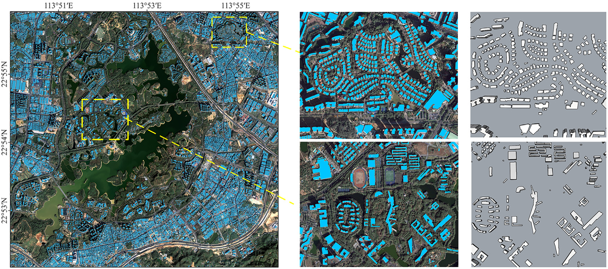

   **图 12** 东莞地区建筑掩膜提取表现。

   图内无额外英文说明文字；经纬度中的 E／N：东经／北纬；黄色框和连线标出局部放大范围，蓝色为提取的建筑掩膜。右侧展示相应三维几何。

4.2 建筑高度估计的精度验证
~~~~~~~~~~~~~~~~~~~~~~~~~~

为验证预测 DSM 与建筑高度估计的精度，本文使用无人机搭载激光雷达系统，在东莞理工学院采集点云，并将其投影为 1 m 分辨率的真值 DSM，与 DSM-Net 输出分辨率对齐。由于本文主要关注建筑高度计算，所提框架只生成 DSM，没有现成数字地形模型（DTM），因此还需通过算法提取 DTM，进一步生成归一化 DSM（nDSM）。然而，卫星影像中的建筑存在倾斜，生成的 DSM 从屋顶到地面具有明显“拖尾”效应，而不像激光雷达点云那样竖直变化。这使得部分倾斜建筑在 DTM 提取过程中被视为地面，进而在 nDSM 中被删除，最终给高精度建筑高度计算带来很大误差。例如，本文测试了当前常用 nDSM 生成算法，包括基于物理模拟的布料模拟滤波（CSF）[49]，以及简单形态学滤波（SMRF）和顶帽变换（Top-hat Transform）[25] 等形态学算法。

测试发现表现较好的算法是 CSF 和顶帽变换。CSF 将 DSM 视为倒置表面，假设一块具有一定刚度的“布料”从上方落下，通过计算外部重力，以及布料节点与地形点之间的内部约束，使布料最终贴合倒置地形表面。顶帽变换先对 DSM 腐蚀再膨胀，滤除小于结构核的地物，如建筑与树木，以获得近似地形表面 DTM。两种算法的 nDSM 计算结果见附录 A 图 19。可以看出，CSF 生成的 nDSM 删除了部分建筑，而使用激光雷达 DSM 和顶帽变换得到的结果没有发生这种删除。

因此，本文利用顶帽变换结果计算建筑高度，并与参考高度及本文算法进行比较。值得注意的是，本文参考 Chen 等 [8] 设置缓冲区，在原始建筑轮廓基础上扩展 1000 平方像素，搜索该范围内最低 DSM 区间作为地面，本质上与 DSM–DTM 方法相同。此外，本文将自身算法获得的建筑高度，与激光雷达点云投影 DSM 计算的建筑高度进行比较，并分别计算平均绝对误差（MAE）。结果见附录 A 图 20。图中建筑数量未计入 CSF 结果中被删除的建筑，因此少于正常的 145 栋。可以看出，本文建筑高度估计算法所得曲线与参考 DSM 高度曲线接近，说明从 GF-7 卫星影像生成的 DSM 计算建筑高度时，本文算法的精度高于 DSM–DTM 方法，并避免了直接提取 DTM 时部分倾斜建筑被删除的问题。

随后，对预测 DSM 值与真值数据进行逐建筑对照。如图 13 所示，（a）和（b）分别为参考与预测 DSM；（c）为用建筑掩膜提取的验证建筑区域；（d）和（e）为对应建筑结构的逐像素参考与预测高度。可以看出，建筑足迹内预测高度与参考结果高度对应。为定量评价建筑高度估计精度，计算 :math:`R^2`、平均绝对误差 MAE 与均方根误差 RMSE，见式（17）至式（19），分别得到 0.91、2.72 m 和 4.09 m。这表明 DSM-Net 在当前研究区域的表现与原始文献基准相近，具有较高建筑高度估计精度。

.. math::

   R^2=1-\frac{\sum_{i=1}^{n}(h_{r,i}-h_{e,i})^2}{\sum_{i=1}^{n}(h_{r,i}-\overline h_r)^2}.\qquad (17)

.. math::

   \mathrm{RMSE}=\sqrt{\frac{\sum_{i=1}^{n}(h_{e,i}-h_{r,i})^2}{n}}.\qquad (18)

.. math::

   \mathrm{MAE}=\frac{\sum_{i=1}^{n}|h_{e,i}-h_{r,i}|}{n}.\qquad (19)

其中，:math:`h_{e,i}` 为像素 :math:`i` 的估计高度，:math:`h_{r,i}` 为该像素参考高度，:math:`\overline h_r` 为参考高度均值，:math:`n` 为总像素数。

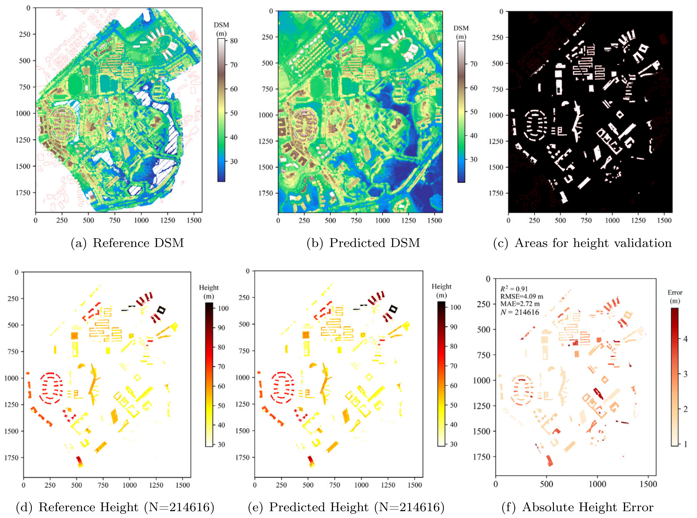

   **图 13** 建筑高度验证结果。(a) 和 (b) 用红色轮廓表示建筑基底。(c) 用白色突出显示建筑验证区域。(d)、(e) 和 (f) 给出统计结果，其中 N 表示用于精度评估的总像素数。（本图图例中的颜色说明请参见论文的网络版本。）

   (a) Reference DSM：参考 DSM；(b) Predicted DSM：预测 DSM；(c) Areas for height validation：高度验证区域；(d) Reference Height (N=214616)：参考高度（N=214616）；(e) Predicted Height (N=214616)：预测高度（N=214616）；(f) Absolute Height Error：绝对高度误差。 DSM (m)：数字表面模型高程（米）；Height (m)：高度（米）；Error (m)：误差（米）；R²：决定系数；RMSE：均方根误差；MAE：平均绝对误差。图内 R²=0.91、RMSE=4.09 m、MAE=2.72 m、N=214616 均保持原值；N 是像素数，不是建筑数量。

4.3 DSM-Net 的性能
~~~~~~~~~~~~~~~~~~~~

虽然与激光雷达 DSM 的验证已证实 DSM-Net 精度，其相对传统主流算法的性能仍需确定。为此，将 DSM-Net 结果与 s2p-hd 框架 [3] 中的半全局匹配（SGM）和更全局匹配（MGM）结果比较，见图 14。具体而言，图 14（e）展示按升序排列的建筑高度。需要注意，图 14（a）至（d）的 MAE 按像素计算，而图 14（e）的 MAE 按每栋建筑的高度计算。所得 MAE 分别为 2.27 m、6.28 m 和 3.27 m。SGM 丢失了大量 DSM 数据，导致高度估计表现最差。MGM 虽优于 SGM，但仍未达到 DSM-Net 的精度。此外，图 14（e）中 DSM-Net 的建筑高度曲线与激光雷达 DSM 的参考曲线十分接近，表明 DSM-Net 在城市高度建模中具有更高精度。

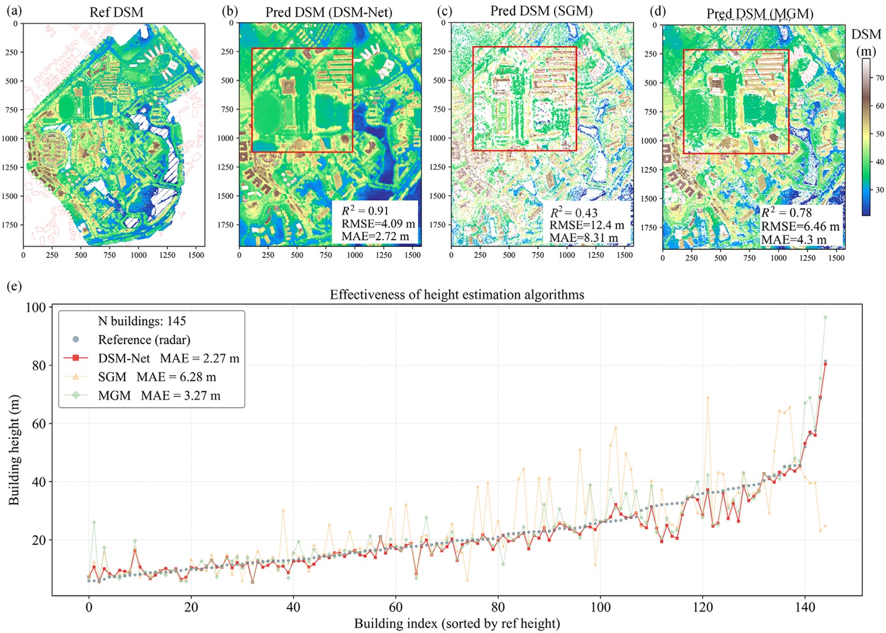

   **图 14** 用于 DSM 生成和建筑高度估计的不同算法比较。

   (a) Ref DSM：参考 DSM；(b) Pred DSM (DSM-Net)：DSM-Net 预测 DSM；(c) Pred DSM (SGM)：SGM 预测 DSM；(d) Pred DSM (MGM)：MGM 预测 DSM；DSM (m)：DSM 高程（米）。 (e) Effectiveness of height estimation algorithms：高度估计算法的效果；Building height (m)：建筑高度（米）；Building index (sorted by ref height)：建筑编号（按参考高度排序）；N buildings: 145：建筑数量：145；Reference (radar)：参考值（雷达，按原图图例保留）；DSM-Net、SGM、MGM 的 MAE 分别为 2.27 m、6.28 m、3.27 m。 (b) 的 R²=0.91、RMSE=4.09 m、MAE=2.72 m；(c) 的 R²=0.43、RMSE=12.4 m、MAE=8.31 m；(d) 的 R²=0.78、RMSE=6.46 m、MAE=4.3 m。上排逐像素统计与下排逐栋建筑统计不得混用。

5 结论与未来工作
------------------

本文提出基于高分辨率立体卫星影像生成城市尺度建筑几何模型的新框架。利用 GF-7 立体卫星数据，该方法能够快速、准确地重建适用于 CFD 模拟的几何模型。主要发现总结如下。

（i）结合深度学习模型与植被指数提取建筑和植被轮廓。先在公开数据集上预训练 RS-Mamba，再通过迁移学习在人工整理的自主 GF-7 数据集上微调，使模型能够大范围提取精确建筑轮廓。同时，由多光谱影像的蓝、红和近红外通道计算 EVI，并对其施加阈值，以提取植被覆盖范围。

（ii）采用基于深度学习的方法，替代传统立体匹配方法生成 DSM。在 WHU-Stereo 数据集上训练 DSM-Net，对研究区进行视差估计。经像素级反演确定同名点位置后，采用前方交会算法生成物方空间点云，再将其转为 1 m 分辨率 DSM，满足本研究的具体空间要求。

（iii）设计一体化算法，利用建筑轮廓、植被掩膜和 DSM 数据快速生成几何模型。过程分为建筑轮廓优化、高度估计和几何构建。具体地，将连通域分析与 RDP 算法及分割、合并、相交等拓扑规则结合，把不规则建筑轮廓转为不含短线段和锐角等不利特征的规则几何。随后，以缓冲区方法估计建筑与植被高度。最后，通过竖向拉伸构建 LoD1 建筑模型和棱柱植被几何，保证其适用于数值模拟。

（iv）以无人机激光雷达数据为真值，采用 :math:`R^2`、MAE 和 RMSE 指标，严格验证框架的泛化能力与精度。为比较性能，将框架与传统立体匹配算法 SGM、MGM 对照。此外，在建筑高度估计方面，将所提算法与基于物理的 CSF 算法、形态学顶帽变换对照。结果表明，本框架能有效缓解倾斜 GF-7 影像固有的拖尾效应，为高保真城市风环境模拟提供较高精度和数值稳定性。

然而，该框架仍存在需进一步改进的局限。第一，GF-7 影像的 0.68 m 分辨率，使得城中村等建筑足迹间距很小的高密度城区经常出现轮廓粘连。第二，几何模型生成算法主要针对建筑优化，植被提取则完全依赖 EVI，导致植被表达较粗糙，缺少所生成建筑模型具有的结构细节。

原文范围说明：第 2.1 节报告融合影像为 0.65 m，结论局限段报告 0.68 m，两处数值未擅自统一。论文提供的定量验证主要针对几何和高度；未列出完整风场实测误差或网格收敛结果，因此上述几何精度并不等同于 CFD 风速、风压精度已得到独立验证。

附录 A 补充图
--------------

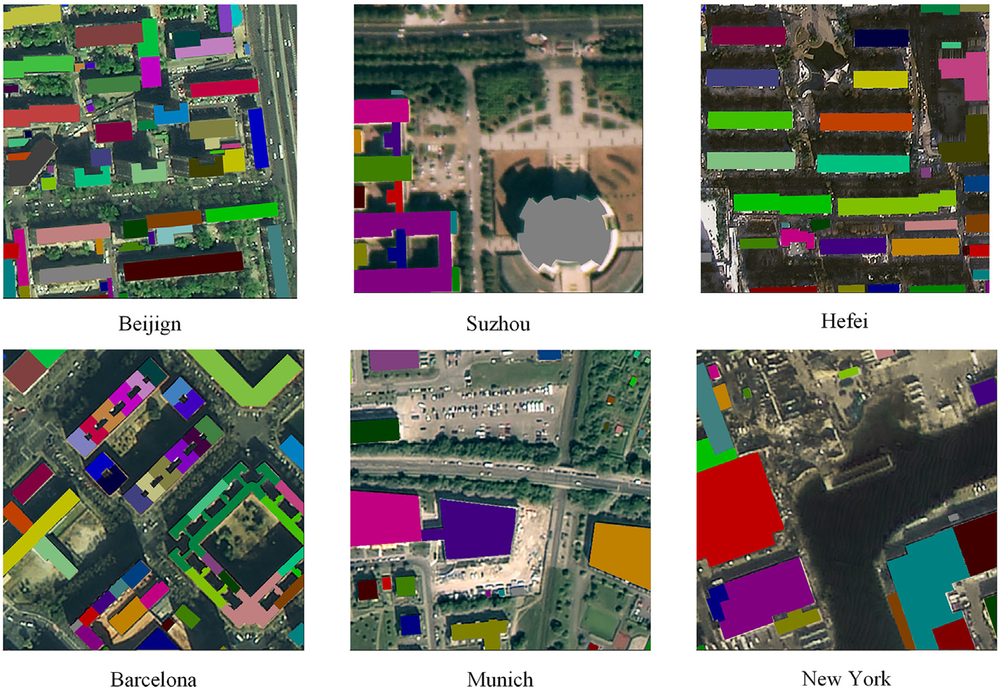

   **图 15** UBCV2 数据集。

   六个城市标签按上排从左至右、再下排从左至右分别为：北京（原图拼写为 Beijign）、苏州（Suzhou）、合肥（Hefei）、巴塞罗那（Barcelona）、慕尼黑（Munich）、纽约（New York）。

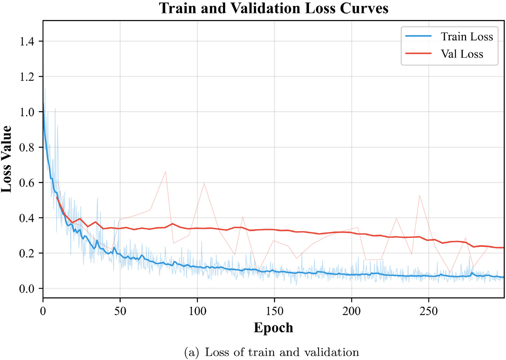

   **图 16** 训练与验证损失曲线。

   Train and Validation Loss Curves：训练与验证损失曲线；Train Loss：训练损失；Val Loss：验证损失；Loss Value：损失值；Epoch：训练轮次；(a) Loss of train and validation：(a) 训练与验证损失。

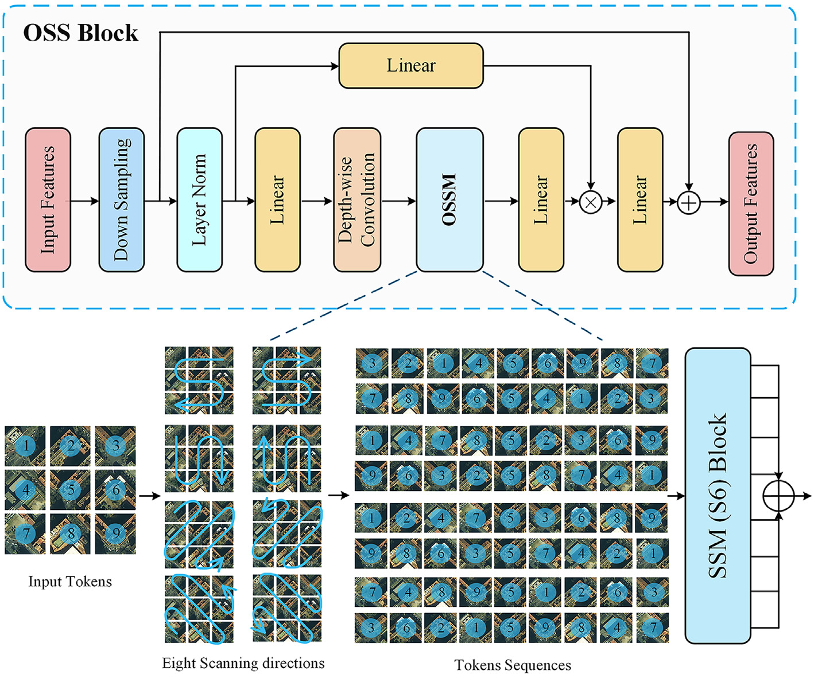

   **图 17** OSS 块和 OSSM。

   OSS Block：全向空间状态块；Input Features：输入特征；Down Sampling：下采样；Layer Norm：层归一化；Linear：线性层；Depth-wise Convolution：逐通道卷积；OSSM：OSSM 模块（执行八方向选择性扫描，保留原缩写）；Output Features：输出特征；Input Tokens：输入词元；Eight Scanning directions：八个扫描方向；Tokens Sequences：词元序列；SSM (S6) Block：SSM（S6）块。乘号表示逐元素相乘，加号表示相加；扫描顺序的 1–9 标号原样保留。

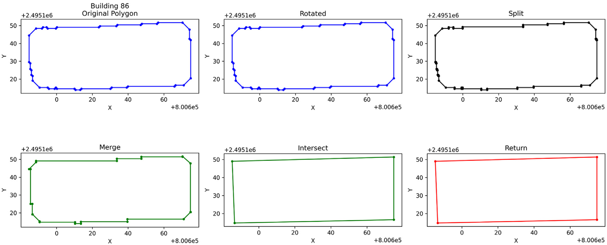

   **图 18** 轮廓简化与精修结果。

   Building 86：第 86 栋建筑；Original Polygon：原始多边形；Rotated：旋转后；Split：分割；Merge：合并；Intersect：求交；Return：旋转复原。X、Y 为坐标轴符号，保留偏移量 +8.006e5、+2.4951e6 及所有刻度，原图未标明单位。

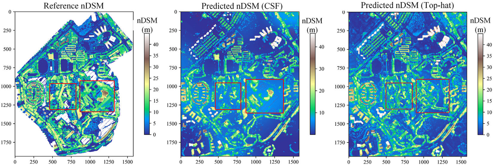

   **图 19** 布料模拟滤波与顶帽变换生成的预测 nDSM 和参考 nDSM 的比较。

   Reference nDSM：参考归一化数字表面模型；Predicted nDSM (CSF)：布料模拟滤波（CSF）预测 nDSM；Predicted nDSM (Top-hat)：顶帽变换预测 nDSM；nDSM (m)：归一化数字表面模型高度（米）。三个面板的坐标、各自色标及红色比较框保持原样。

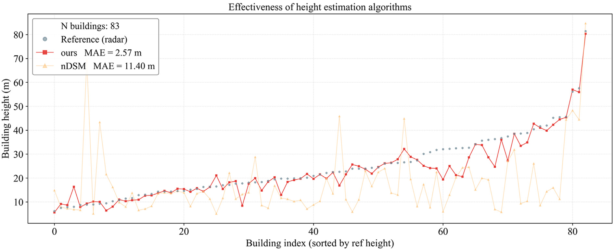

   **图 20** 所提出算法与顶帽变换的建筑高度估计精度比较。

   Effectiveness of height estimation algorithms：高度估计算法的效果；Building height (m)：建筑高度（米）；Building index (sorted by ref height)：建筑编号（按参考高度排序）；N buildings: 83：建筑数量：83；Reference (radar)：参考值（雷达，按原图图例保留）；ours MAE=2.57 m：本文方法，平均绝对误差为 2.57 m；nDSM MAE=11.40 m：nDSM 方法，平均绝对误差为 11.40 m。建筑样本数 83 与图 14 的 145 不同，统计结果不得混用。

参考文献
--------

[1] R. Acquah, E. Misiulis, A. Sandak, et al., Remote Sens. 17 (2025) 556.

[2] K.D.B.J. Adam, et al., arXiv preprint arXiv:1412.6980, 2014, 1412.

[3] T. Amadei, E. Meinhardt-Llopis, C. de Franchis, et al., in: Proceedings of the Computer Vision and Pattern Recognition Conference, 2025, pp. 2339–2348.

[4] J.H. AMORIM, V. RODRIGUES, C. BORREGO, A.M. COSTA, in: Proceedings of the CLIMAQS Workshop ‘Local Air Quality and Its Interactions with Vegetation’january, 2010, pp. 21–22.

[5] D.G. Bailey, C.T. Johnston, in: Proceedings of Image and Vision Computing New Zealand, 2007, pp. 282–287.

[6] R. Chabra, J. Straub, C. Sweeney, R. Newcombe, H. Fuchs, in: Proceedings of the IEEE/CVF Conference on Computer Vision and Pattern Recognition, 2019, pp. 11786–11795.

[7] H. Chen, J. Song, C. Han, J. Xia, N. Yokoya, IEEE Trans. Geosci. Remote Sens. 62 (2024) 1.

[8] P. Chen, H. Huang, J. Liu, et al., Remote Sens. Environ. 298 (2023) 113802.

[9] W. Chen, J. Li, J. Wu, et al., Energy 140124 (2026).

[10] S. Chopra, R. Hadsell, Y. LeCun, in: 2005 IEEE Computer Society Conference on Computer Vision and Pattern Recognition (CVPR’05), vol. 1, IEEE, 2005, pp. 539–546.

[11] D.H. Douglas, T.K. Peucker, Cartographica Int. J. Geogr. Inf. Geovisualization 10 (1973) 112.

[12] D.H. Douglas, T.K. Peucker, Cartographica Int. J. Geogr. Inf. Geovisualization 10 (1973) 112.

[13] G. Facciolo, C. de Franchis, E. Meinhardt, in: Proceedings of the British Machine Vision Conference (BMVC), 2015, pp. 90.1–90.12.

[14] Y. Furukawa, J. Ponce, IEEE Trans. Pattern Anal. Mach. Intell. 32 (2009) 1362.

[15] S. Galliani, K. Lasinger, K. Schindler, in: Proceedings of the IEEE International Conference on Computer Vision, 2015, pp. 873–881.

[16] Z. Ghasemi, M.A. Esfahani, M. Bisadi, Procedia Soc. Behav. Sci. 201 (2015) 397.

[17] A. Gu, T. Dao, in: First Conference on Language Modeling, 2024.

[18] J.D. Hamilton, Handb. Econom 4 (1994) 3039.

[19] S. He, R. Zhou, S. Li, S. Jiang, W. Jiang, Remote Sens. 13 (2021) 5050.

[20] H. Hirschmuller, IEEE Trans. Pattern Anal. Mach. Intell. 30 (2007) 328.

[21] M. Hofton, J.B. Blair, S. Story, D. Yi, Algorithm theoretical basis document (ATBD), NASA, Washington, DC, USA, 2020.

[22] X. Huang, K. Chen, Z. Wang, X. Sun, IEEE J. Sel. Top. Appl. Earth Obs. Remote Sens. 17 (2024) 12745–12759.

[23] X. Huang, L. Ren, C. Liu, et al., in: 2022 IEEE/CVF Conference on Computer Vision and Pattern Recognition Workshops (CVPRW), 2022, pp. 1412–1420, https://doi.org/10.1109/CVPRW56347.2022.00147

[24] S. Ioffe, arXiv preprint arXiv:1502.03167, 2015.

[25] P. Jackway, Electron. Lett. 36 (2000) 1194.

[26] S. Ji, S. Wei, M. Lu, IEEE Trans. Geosci. Remote Sens. 57 (2018) 574.

[27] M. Kazhdan, M. Bolitho, H. Hoppe, in: Proceedings of the Fourth Eurographics Symposium on Geometry Processing, vol. 7, 2006, pp. 61–70.

[28] A. Kendall, H. Martirosyan, S. Dasgupta, et al., in: Proceedings of the IEEE International Conference on Computer Vision, 2017, pp. 66–75.

[29] S. Khamis, S. Fanello, C. Rhemann, et al., in: Proceedings of the European Conference on Computer Vision (ECCV), 2018, pp. 573–590.

[30] S. Khamis, S. Fanello, C. Rhemann, et al., in: Proceedings of the European Conference on Computer Vision (ECCV), 2018, pp. 573–590.

[31] A. Kwon, J.-J. Kim, Korean J. Remote Sens. 30 (2014) 755.

[32] S. Li, S. He, S. Jiang, W. Jiang, L. Zhang, IEEE Trans. Geosci. Remote Sens. 61 (2023) 1.

[33] S. Liu, W. Pan, H. Zhang, et al., Build. Environ. 117 (2017) 11.

[34] A. Mochida, I.Y. Lun, J. Wind Eng. Ind. Aerodyn. 96 (2008) 1498.

[35] T.B. Ovi, N. Bashree, P. Mukherjee, S. Mosharrof, M.A. Parthima, in: International Conference on Human-Centric Smart Computing, Springer, 2023, pp. 385–399.

[36] J. Pang, W. Sun, J.S. Ren, C. Yang, Q. Yan, in: Proceedings of the IEEE International Conference on Computer Vision Workshops, 2017, pp. 887–895.

[37] Y. Qiu, Y. He, M. Li, X. Zhu, Atmosphere 15 (2023) 9.

[38] O. Ronneberger, P. Fischer, T. Brox, in: International Conference on Medical Image Computing and Computer-Assisted Intervention, Springer, 2015, pp. 234–241.

[39] S.M. Seitz, B. Curless, J. Diebel, D. Scharstein, R. Szeliski, in: 2006 IEEE Computer Society Conference on Computer Vision and Pattern Recognition (CVPR’06), vol. 1, IEEE, 2006, pp. 519–528.

[40] J. Song, W. Chen, G. Hu, L. Zou, Phys. Fluids 36 (2024).

[41] R. Tao, Y. Xiang, H. You, Remote Sens. 12 (2020) 4025.

[42] E. van Rees, Geoinformatics 16 (2013) 28.

[43] A. Vaswani, N. Shazeer, N. Parmar, et al., Adv. Neural Inf. Process. Syst. (2017) 30.

[44] A. Vuorinen, Master’s thesis, A. Vuorinen, 2024.

[45] H.L. Yang, J. Yuan, D. Lunga, et al., IEEE J. Sel. Top. Appl. Earth Obs. Remote Sens. 11 (2018) 2600.

[46] Y.A.N.G. Xingbin, LÜ Jingguo, J. S, Acta Geod. Cartogr. Sin. 47 (2018) 1372.

[47] C.J. YUAN Xiuxiao, Theory and Method of Preciseobject Positioning of High Resolution Satellite Imagery, (Science Press), Beijing, 2012.

[48] K. Zhang, J. Yan, S.-C. Chen, IEEE Trans. Geosci. Remote Sens. 44 (2006) 2523.

[49] W. Zhang, J. Qi, P. Wan, et al., Remote Sens. 8 (2016) 501.

[50] P. Zhao, C. Li, J. Jiang, L. Chen, X. Wang, Sustain. Cities Soc. 123 (2025) 106237.

[51] S. Zhao, H. Chen, X. Zhang, et al., IEEE Trans. Geosci. Remote Sens. 62 (2024) 1–14.

[52] Y. Zhou, L. Wang, P.E. Love, L. Ding, C. Zhou, Adv. Eng. Informatics 42 (2019) 100961.

完整引用
--------

收录信息见 :ref:`WOEAI 学术成果页对应条目 <ref-zhao2026-BE>`。
