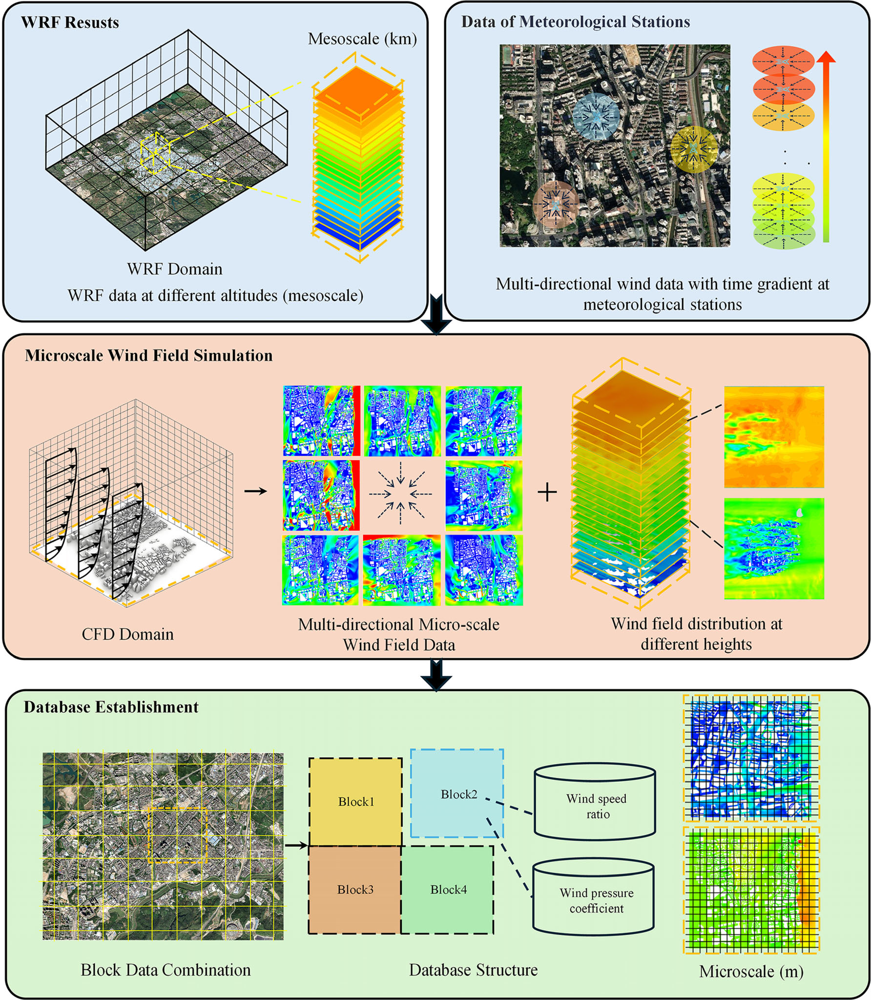
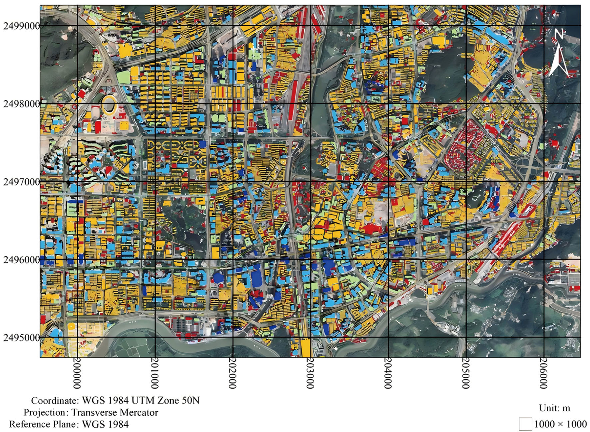
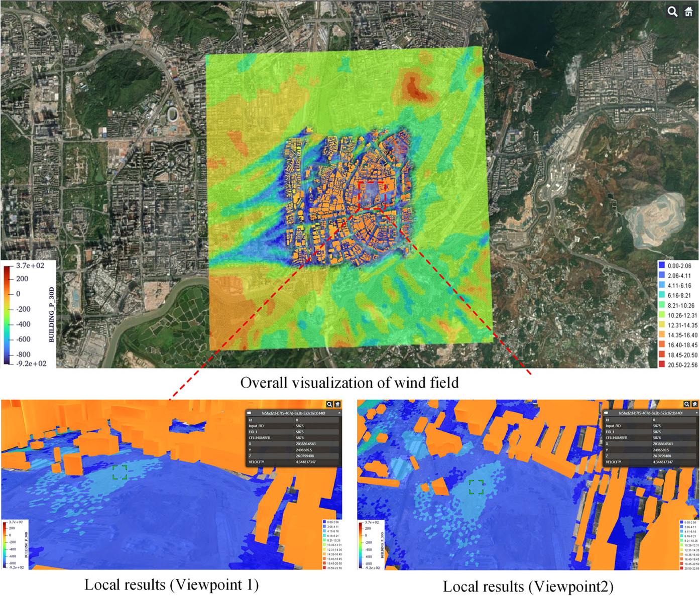

.. _paper-note-ref-zhao2026-BS:

论文解读 | 我们如何用预计算 CFD 数据库加速城市微尺度风环境预测
===============================================================

城市风环境评估经常遇到一个现实矛盾：我们希望看清建筑群、街区和局部地形对风场的影响，但如果每一个规划片区、每一次方案调整都重新开展高分辨率 CFD 计算，工程应用的时间成本会非常高。

在这篇发表于 **Building Simulation** 的论文中，我们尝试把问题换一种方式处理：不再把每次风环境评估都看作一次从零开始的计算任务，而是先把城市微尺度风场的 CFD 结果组织成可调用的数据库，再面向规划、评估和预警场景进行快速预测与展示。

这项工作属于 WOEAI 的 **建筑结构抗风 / 数值风洞与湍动入流** 方向，也与城市风环境、复杂地形风场和工程软件化应用直接相关。

   图 1 预计算 CFD 数据库框架：我们把中尺度气象输入、微尺度 CFD 计算和数据库组织连接起来，让城市风环境预测从“每次重新计算”转向“预计算结果的快速调用”。

论文信息
--------

- 论文题名: A fast prediction framework for urban microscale wind environment based on precomputed CFD database
- 作者: Zhao Peisheng; **Li Chao**; Yang Chao; Han Zhichen; Chen Lingwei; Hu Gang; Li Lixiao; Wang Xiaolu
- 期刊: Building Simulation
- 年份: 2026
- 卷期页码: 19(2): 333-357
- DOI: https://doi.org/10.1007/s12273-025-1379-7
- WOEAI 官网条目: https://winddee.cn/zh-cn/latest/Publications.html#ref-zhao2026-BS
- WOEAI 相关方向: 建筑结构抗风 / 数值风洞与湍动入流

研究问题
--------

城市微尺度风环境预测的难点不只是“能不能算”，更是“能不能在工程节奏内算得足够细”。

传统数值天气预报可以提供区域尺度的背景风场，但空间分辨率通常难以直接支撑街区、建筑群和行人高度附近的风环境判断。CFD 可以提供更细的局地风场信息，却往往需要较高建模、网格和计算成本。

因此，我们在这项研究中关注三个问题：

1. 如何把城市区域拆分成可重复计算、可管理、可组合的微尺度风场单元？
2. 如何保证分块计算不会破坏相邻区块之间的风场连续性？
3. 如何把计算结果从“论文中的数值结果”推进到“可查询、可展示、可用于工程判断的数据库”？

方法贡献
--------

我们的核心思路是建立一个 **基于区块的城市微尺度风场预计算 CFD 数据库**。

具体来说，研究以深圳部分区域为示例，先基于 GIS 建筑轮廓、地形数据和自动化建模流程生成城市建筑与地形模型，然后将研究区域划分为 ``1 km × 1 km`` 的区块。每个区块在考虑周边建筑与地形影响后开展 CFD 计算，得到风速、风压等结果，并进一步整理为风速比和风压系数数据库。

这个框架的工程含义在于：如果一个城市片区已经完成了标准化的高分辨率计算，那么后续在不同风向、不同高度或不同应用场景下，就可以更快调用已有数据库，而不是每次都重新搭建完整计算任务。

   图 2 深圳建筑区块划分示意：城市区域被组织为可计算、可拼接、可入库的微尺度风场单元，这是后续建立区块 CFD 数据库的基础。

关键发现
--------

1. 过渡区长度会影响分块 CFD 的可靠性
~~~~~~~~~~~~~~~~~~~~~~~~~~~~~~~~~~~~

分块计算的一个关键问题是：如果只计算核心区块，周边建筑对风场的影响可能被截断；但如果过渡区设置太大，计算成本又会上升。

论文中比较了不同过渡区长度 ``XL`` 对核心区域风场的影响，并使用 FB、NMSE、FAC2 和线性相关系数 ``R`` 等指标进行评价。结果显示，随着 ``XL`` 增大，系统误差和随机误差逐渐降低，相关性和拟合程度提高。

从工程折中角度看，论文建议核心建筑群可选择 ``4Hmax`` 作为过渡区长度；在考虑计算规模和成本时，``3Hmax`` 也可以作为一种可选方案。这里的 ``Hmax`` 是核心区域最高建筑高度。

2. 相邻区块之间的风场可以保持较好一致性
~~~~~~~~~~~~~~~~~~~~~~~~~~~~~~~~~~~~~~~~~~~~~~~~

我们进一步比较了两个相邻 ``1 km × 1 km`` 区块在公共界面上的风速和湍流强度分布。这个验证很重要，因为数据库最终要支持多个区块的组合与调用，如果公共界面差异过大，分块数据库的工程意义就会被削弱。

论文中的结果显示，相邻区块公共界面上的风速和湍流强度整体具有较好一致性，局部差异仍然存在，但在设置过渡区后，其影响已经较小。

3. 与气象站实测数据的对比支持框架应用
~~~~~~~~~~~~~~~~~~~~~~~~~~~~~~~~~~~~~~~~~~~~~~~~

为了验证框架的预测能力，论文选取研究区域内多个气象自动站，并将 CFD 模拟风速比与实测风速比进行比较。研究中使用 10 分钟平均风速作为分析基础，并在不同风速阈值下筛选数据。

在高风速条件下，热力影响相对减弱，CFD 与实测数据之间的平均相对误差进入可接受范围。论文中给出的结果显示，在 ``11 m/s`` 风速阈值下，三个气象站的平均风速相对误差在 ``90°`` 风向下控制在 ``17%`` 以下，在 ``120°`` 风向下控制在 ``20%`` 以下。

.. figure:: ../../../wechat/assets/public-safe/ref-zhao2026-BS/fig-21-stations.png
   :alt: 图 21 气象自动站位置与观测环境
   :align: center
   :width: 100%

   图 21 气象自动站位置与观测环境：现场监测数据用于检验区块 CFD 数据库在真实城市环境中的预测能力。

公式说明
--------

本篇公众号文章保留一个最容易解释、也最贴近验证逻辑的公式：风速比相对误差。

.. math::

   E = \frac{K_{\mathrm{CFD}} - K_{\mathrm{m}}}{K_{\mathrm{m}}} \times 100\%

其中，:math:`K_{\mathrm{CFD}}` 是 CFD 模拟得到的风速比，:math:`K_{\mathrm{m}}` 是现场实测得到的风速比，:math:`E` 是二者之间的相对误差。

这条公式的含义很直接：我们不是只看某个风速值是否相同，而是比较“局地测点相对于参考点的风速比例”是否一致。这样可以更好地评估微尺度风场结构是否被 CFD 数据库捕捉到。

工程意义
--------

这篇论文的价值不只是提出一个算法，而是把城市微尺度风环境评估向“可数据库化、可平台化、可快速调用”的方向推进了一步。

对城市风环境评估来说，预计算 CFD 数据库可以支持：

- 城市片区规划阶段的快速风环境筛查；
- 建筑群布局调整时的多方案对比；
- 行人高度风环境和局地强风区域识别；
- 风速比、风压系数等数据在 WebGIS 平台中的可视化；
- 后续与 AI 代理模型、快速几何重构、数字孪生或工程咨询平台结合。

   图 25 WebGIS 平台中的风速和风压数据展示：预计算 CFD 数据库不只停留在离线计算结果中，也可以进一步进入查询、展示和工程沟通平台。

对 WOEAI 的研究方向来说，这项工作也连接了几个长期关注的问题：数值风洞、湍动入流、城市复杂风场、工程软件平台，以及 AI 赋能的快速建模与预测。

适用边界
--------

这项工作并不意味着所有城市风环境问题都可以被“一键精确预测”。预计算 CFD 数据库的可靠性仍然依赖几个前提：

- 城市几何、地形和边界条件需要与数据库构建逻辑匹配；
- 区块划分和过渡区长度需要经过验证；
- 数据库覆盖的风向、高度、地貌和建筑条件会限制可调用范围；
- 对特殊建筑形态、极端风情景或高风险区域，仍需要有针对性的专项 CFD 复核；
- WebGIS 平台提升的是调用和沟通效率，不会自动消除模型假设带来的不确定性。

所以，更准确的理解是：预计算 CFD 数据库适合承担快速筛查、方案比较和工程沟通的前置角色，而不是替代所有高精度专项分析。

延伸阅读
--------

- WOEAI 建筑结构抗风方向: https://winddee.cn/zh-cn/latest/BuildingStructuralWindResistance.html
- WOEAI 学术成果条目: https://winddee.cn/zh-cn/latest/Publications.html#ref-zhao2026-BS

阅读原文
--------

- DOI: https://doi.org/10.1007/s12273-025-1379-7

联系入口
--------

如果你关注城市风环境快速评估、数值风洞、复杂地形风场或工程软件化应用，可以通过以下方式联系：

- Website: https://winddee.cn
- Email: lichaosz@qq.com
