.. _paper-note-ref-zhao2026-BS:

.. role:: student-first-author

基于预计算 CFD 数据库的城市微尺度风环境快速预测框架：论文精解
==========================================================================

精简版微信公众号文章：待发布

.. contents:: 本页目录
   :local:
   :depth: 3

论文信息
--------

**原文题名：** A fast prediction framework for urban microscale wind environment based on precomputed CFD database

**作者：** :student-first-author:`Peisheng Zhao` :sup:`1,2`，**Chao Li** :sup:`2,3`，Chao Yang :sup:`2`，Zhichen Han :sup:`2`，Lingwei Chen :sup:`2`，Gang Hu :sup:`2`，Lixiao Li :sup:`4,5`，Xiaolu Wang :sup:`1,*`

**作者单位：**

1. 东莞理工学院环境与土木工程学院，中国广东东莞，523808
2. 哈尔滨工业大学土木与环境工程学院，中国广东深圳，518055
3. 哈尔滨工业大学广东省土木工程智能与韧性结构重点实验室，中国广东深圳，518055
4. 极端环境绿色长寿道路工程全国重点实验室（深圳），中国广东
5. 深圳大学土木与交通工程学院，中国广东深圳，518060

**期刊与出版信息：** Building Simulation，2026，19(2)：333–357。研究论文；原刊栏目为“室内／室外空气流动与空气质量”。DOI：`10.1007/s12273-025-1379-7 <https://doi.org/10.1007/s12273-025-1379-7>`_。

**稿件历程：** 2025 年 7 月 10 日收到；2025 年 10 月 1 日修回；2025 年 10 月 22 日接受。所用出版版首页未列出在线发表日期。

**通讯作者脚注：** 原文以信封标记 Xiaolu Wang；电子邮箱：wangxiaolu@dgut.edu.cn。

.. note::

   本页按照出版版正文顺序翻译。原文中重复的引言段落、公式排印、表内数值及术语差异均予以保留；必要处以“原文差异说明”区分译文与校读提示。第 5 节的预警流程属于论文提出的应用方案，不能仅凭平台展示理解为已完成真实预警效果验证。

摘要
----

城市微尺度风场预测的精度和效率，对风环境评估和城市规划等应用至关重要。然而，依赖中尺度模拟数据的传统数值天气预报，往往受到空间和时间分辨率不足的制约。为解决这一限制，本研究利用分块计算流体力学（CFD）建立城市微尺度风场数据库，提出一种快速风场预测的新框架。该框架将基于 GIS 的建筑和地形模型划分为 :math:`1\,\mathrm{km}\times1\,\mathrm{km}` 的区块，以各区块的 CFD 模拟结果构成预计算数据库。研究进行了全面分析，确定考虑周边建筑气动影响所需的最优过渡区长度。相邻区块界面处观测到的风剖面差异很小，验证了这种独立、逐块模拟方法的可行性。此外，通过将统计得到的平均风速与多个气象站一年的现场数据进行比较，展示了该框架的预测能力。最后，包含风速比和风压系数的预计算 CFD 数据库已集成到 WebGIS 平台中，以支持实际应用。

**关键词：** 城市风场；GIS；分块模拟；大涡模拟

1 引言
------

沿海城市经常遭受风灾，这类自然现象具有影响范围广、严重程度高和发生频繁的特点。这些事件通常会引发强风、暴雨，以及洪水、泥石流和滑坡等次生灾害，对城市经济和生态系统造成重大损害。

风灾是沿海城市面临的自然灾害之一，具有影响范围广、严重程度高和发生频繁的特点。风灾通常会导致强风、暴雨以及洪水、泥石流和滑坡等次生灾害，对城市经济和生态系统造成重大损害（ :ref:`Huang 等，2022 <zhaobs-ref-Huang2022>`； :ref:`Yin 等，2022 <zhaobs-ref-Yin2022>`； :ref:`Feehan 等，2024 <zhaobs-ref-Feehan2024>`）。然而，目前大尺度城市风灾预警方法仅依靠 WRF（Weather Research and Forecasting，天气研究与预报）中尺度模型获取城市风场信息（ :ref:`Haghroosta 等，2014 <zhaobs-ref-Haghroosta2014>`； :ref:`Wu 等，2019 <zhaobs-ref-Wu2019>`； :ref:`Zhang 等，2022 <zhaobs-ref-Zhang2022>`）。其空间分辨率无法满足基础设施尺度灾害预报的要求。因此，建立高分辨率城市微尺度风场数据库至关重要。

通常有三种建立城市微尺度风场数据库的方法：现场观测或气象站数据、风洞试验以及数值模拟方法。气象站实测数据不足，导致城市社区风速分布存在显著误差（ :ref:`Liu 等，2018 <zhaobs-ref-Liu2018>`）。将风洞试验应用于城市尺度时，需要投入大量资源和时间，因此实施难度较大（ :ref:`Terry 和 Xu，2020 <zhaobs-ref-Terry2020>`）。随着计算流体力学（CFD）的发展，城市风场 CFD 模拟得到了广泛应用（ :ref:`Tominaga 和 Stathopoulos，2013 <zhaobs-ref-Tominaga2013>`； :ref:`Simões 和 Estanqueiro，2016 <zhaobs-ref-Simoes2016>`； :ref:`Toja-Silva 等，2018 <zhaobs-ref-TojaSilva2018>`； :ref:`Song 等，2024 <zhaobs-ref-Song2024>`），使准确的城市风灾预警系统成为可能。基于 CFD 的数值风洞技术是模拟大尺度城市微尺度风场的一种高效、可行方法。它能够提供全域详细风场信息，同时将计算需求与耗时控制在可承受范围内（ :ref:`Blocken，2015 <zhaobs-ref-Blocken2015>`）。

建立基础设施尺度的高分辨率风场数据库，需要高精度 CFD 模拟结果。CFD 模拟通常采用两类模型：雷诺平均 Navier–Stokes（RANS）模型和大涡模拟（LES）模型。已有研究比较了这些模型在不同情景中的表现。例如， :ref:`Zheng 和 Yang，2021 <zhaobs-ref-Zheng2021>` 采用五种不同 RANS 模型和 LES 模型，对存在行驶车辆的街谷内风流动与污染物浓度开展 CFD 验证研究。结果表明，与表现最好的 RANS 模型相比，LES 模型能更好地再现平均污染物浓度分布。 :ref:`Gousseau 等，2011 <zhaobs-ref-Gousseau2011>` 采用两种不同湍流模型，即 RANS 标准 :math:`k\text{-}\varepsilon` 模型和使用动态 Smagorinsky 亚格子尺度模型的 LES，对蒙特利尔市中心建筑群中的近场污染物扩散进行高分辨率 CFD 模拟。研究发现，采用动态 Smagorinsky 亚格子尺度模型的 LES 优于 RANS :math:`k\text{-}\varepsilon` 模型。这些研究证实，就模拟精度而言，LES 比 RANS 更适合用于建立城市微尺度风场数据库。

虽然 LES 比 RANS 能更准确地再现城市风场分布，但它需要更多计算资源和时间。直接将 LES 用于城市尺度 CFD 模拟具有挑战性，而且可能降低模拟精度。已有若干研究对城市风场开展了高精度模拟。 :ref:`Blocken 等，2012 <zhaobs-ref-Blocken2012>` 对埃因霍温理工大学进行了微尺度 CFD 模拟，并将结果与现场实测数据比较。分析表明，在较高风速条件下，模拟风速与实测风速的差异较小。 :ref:`Tabib 等，2021 <zhaobs-ref-Tabib2021>` 提出了一种获取城市风场的多尺度方法。该方法耦合了三个不同尺度的模型：用于大尺度协调的中尺度数值天气预报模型、用于捕捉风致影响的微尺度模型，以及采用 LES 和 RANS 捕捉建筑风场的亚微尺度 CFD 模型。 :ref:`Liu 等，2017 <zhaobs-ref-Liu2017>` 基于气象站数据建立了全尺度城市模型和微尺度局部模型，以模拟城市社区风场分布。比较两个模型的风场分布后发现，全尺度模型给出了更好的结果，而微尺度模型的误差较大。这些研究对局部城市区域进行了详细 CFD 模拟。然而，当计算域扩大到整座城市的尺度时，网格单元数量将增加到数十亿，使 CFD 模拟几乎无法实现（ :ref:`Mirzaei，2021 <zhaobs-ref-Mirzaei2021>`）。因此，如何获取全城市高分辨率风场数据的问题仍未解决。

除 CFD 模型外，地形和周边建筑也显著影响 CFD 模拟精度。地形和周边建筑同样对 CFD 模拟精度具有显著影响。 :ref:`Liu 等，2018 <zhaobs-ref-Liu2018>` 采用不同几何模型开展 CFD 模拟，证明周边建筑会通过遮挡和通道效应，显著影响目标建筑周围的风流动。 :ref:`Jeanjean 等，2015 <zhaobs-ref-Jeanjean2015>` 在 :math:`2\,\mathrm{km}\times2\,\mathrm{km}` 区域内建立建筑与树木模型，并进行 CFD 模拟，以研究树木对行人高度交通排放物浓度的影响。 :ref:`Shirzadi 和 Tominaga，2023 <zhaobs-ref-Shirzadi2023>` 通过风洞试验和 CFD 模拟研究周边建筑对污染物扩散的影响，证明周边建筑会使污染物沿竖向输运到更高楼层。这些研究表明，在研究目标区域风场分布时，不能忽视周边建筑和地形的影响。

随着城市化进程加快，城市建筑密度持续增大（ :ref:`Shen 等，2017 <zhaobs-ref-Shen2017>`）。考虑周边建筑和植被影响，在全城市范围内开展 LES 模拟并建立城市微尺度风场数据库，显然是一项极具挑战性的任务。为解决这些问题，本研究提出一种基于区块数据库的城市微尺度风场预测框架。以深圳为例，首先利用建筑轮廓 GIS 数据，将城市划分为 :math:`1\,\mathrm{km}\times1\,\mathrm{km}` 的区块。随后，以 :math:`1\,\mathrm{km}\times1\,\mathrm{km}` 区块内的建筑为研究对象。在考虑地形的条件下，通过网格无关性分析确定合适的网格划分方案，并使用 WALL LES 模型（原文此处拼作 WALL；第 3.3.2 节为 WALE）对研究区域进行 CFD 模拟（ :ref:`Nicoud 和 Ducros，1999 <zhaobs-ref-Nicoud1999>`）。与此同时，兼顾精度与计算资源，研究过渡区长度 :math:`X_L` 对核心区建筑风场分布的影响，并探讨 :math:`X_L` 与核心区最大建筑高度 :math:`H_{\max}` 之间的关系。为证明该框架的可行性，对相邻区块公共边界处的风场特征进行分析和比较。此外，利用深圳市气象局提供的实测数据，建立不同风速阈值下的实测数据筛选方法。通过与分块 CFD 模拟结果进行比较分析，验证分块 CFD 数值模拟的精度。最后，基于所提出框架建立城市微尺度风场数据库，并探讨可能的应用场景。其中一种场景是 WebGIS 可视化应用，可为城市风场预测研究提供参考。

本文结构如下：第 2 节介绍基于区块数据库的城市风场预测框架。第 3 节说明分块模拟方法，并通过比较相邻区块共享边界处的模拟结果，验证区块数据拼接的可行性。第 4 节将分块模拟结果与现场实测数据进行比较，以验证所提框架的精度。第 5 节展示深圳部分区域城市微尺度风场数据库的建立及其 WebGIS 可视化应用。第 6 节总结本文的创新点与研究结果。

2 微尺度风场预测框架
--------------------

基于 WRF 的模型通常提供公里量级的空间分辨率，无法满足基础设施尺度灾害预报的需求。此外，气象站在孤立位置记录多个角度的风速，无法捕捉不同高度处风场的变化。本研究提出一种基于分块 CFD 的城市微尺度风场预测框架。该框架整合这两类数据源，生成多个风向和高度下的详细风场分布。

如图 1 所示，该框架首先将研究区域划分为均匀的 :math:`1\,\mathrm{km}\times1\,\mathrm{km}` 区块，并以区块内建筑群为研究对象。图 2 展示了建筑矢量图的分割结果。随后，考虑地形和相邻建筑群的影响，选取适当的 CFD 模型参数、网格划分方案和过渡区长度 :math:`X_L`，开展高分辨率 CFD 模拟。模拟得到风速与风压数据，据此计算风速比和风压系数，形成风场数据库。

基于已建立的风场数据库，可形成两类主要应用：事件前预测和事件发生时的重建。对于事件前预测，在台风到来之前进行城市灾害评估。首先利用中尺度 WRF 模型获取公里级分辨率的网格风速数据。以该数据作为输入，通过式（1）获得高分辨率风速与风压分布。

.. math::

   U(x,y,z,\theta)=R(x,y,z,\theta)\times U_{\mathrm{pot,max}} \qquad (1)

式中， :math:`U` 表示风速（ :math:`\mathrm{m/s}`）， :math:`x`、 :math:`y` 和 :math:`z` 为空间坐标， :math:`\theta` 为风向角。 :math:`R` 为风速比， :math:`U_{\mathrm{pot}}` 为气象站监测的实际风速， :math:`U_{\mathrm{pot,max}}` 为与实测 :math:`U_{\mathrm{pot}}` 相对应的来流风剖面最大风速值。

.. _zhaobs-fig-1:

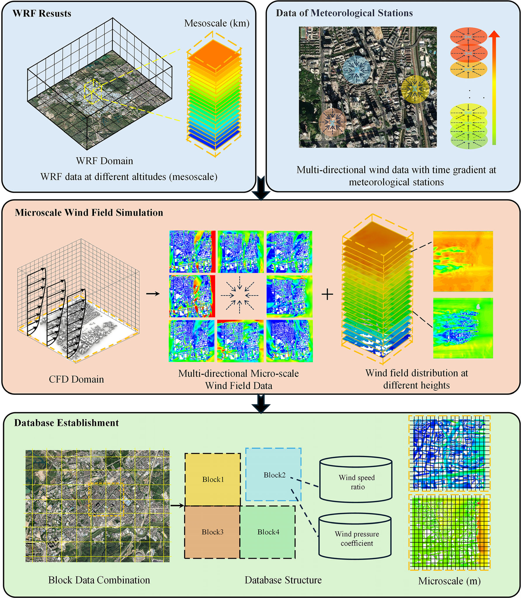

   **图 1** 所提出框架的工作流程。

   图内文字：WRF Results＝WRF 结果；Mesoscale＝中尺度（公里）；WRF Domain＝WRF 计算域；WRF data at different altitudes＝不同高度的 WRF 数据；Data of Meteorological Stations＝气象站数据；Multi-directional wind data with time gradient at meteorological stations＝气象站具有时间变化的多风向数据。Microscale Wind Field Simulation＝微尺度风场模拟；CFD Domain＝CFD 计算域；Multi-directional Micro-scale Wind Field Data＝多风向微尺度风场数据；Wind field distribution at different heights＝不同高度的风场分布。Database Establishment＝数据库建立；Block Data Combination＝区块数据组合；Block 1–4＝区块 1–4；Database Structure＝数据库结构；Wind speed ratio＝风速比；Wind pressure coefficient＝风压系数；Microscale＝微尺度（米）。

.. _zhaobs-fig-2:

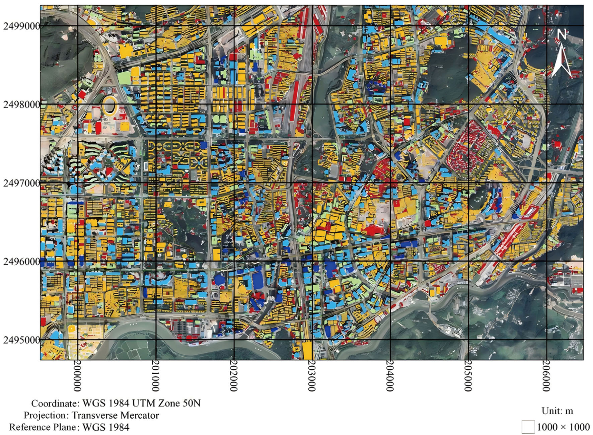

   **图 2** 深圳建筑分块划分示意图。

   图内文字：Coordinate＝坐标系 WGS 1984 UTM Zone 50N；Projection＝横轴墨卡托投影；Reference Plane＝参考基准 WGS 1984；Unit＝单位（米）；方格尺寸为 :math:`1000\times1000`；N 表示北。横纵坐标为投影坐标。

3 城市区块的 CFD 模拟
---------------------

3.1 建筑与地形
~~~~~~~~~~~~~~

本研究利用地理信息系统（GIS）建筑轮廓数据，生成研究区建筑几何模型。为快速、自动地生成建筑几何，采用 Rhino 软件中的 Grasshopper（GH）程序。该程序对输入的建筑控制点进行处理和筛选，批量生成闭合多段线（Polyline），再将其转换为面域并拉伸为三维实体建筑模型。以深圳建筑为例，GH 程序能够在 10 秒内高效地批量生成建筑三维实体模型，确保三维建模任务准确、快速地完成。生成的建筑几何模型见图 3(c)。

在城市微尺度风场 CFD 模拟中，地形的影响显著，不容忽视（ :ref:`Alavi 等，2024 <zhaobs-ref-Alavi2024>`； :ref:`Talwar 和 Yuan，2024 <zhaobs-ref-Talwar2024>`）。因此，本研究首先从 NASA 地球科学数据系统（ESDS）获取深圳地区分辨率为 :math:`12.5\,\mathrm{m}` 的数字高程模型（DEM）数据。随后，对数据采用近似曲面拟合技术，生成地形曲面模型（ :ref:`Ng 等，2011 <zhaobs-ref-Ng2011>`； :ref:`Zhao 等，2023 <zhaobs-ref-Zhao2023>`）。具体而言，DEM 数据表示为规则矩形网格，其中任意点 :math:`P_{i,j}` 的平面坐标，可由其行、列索引 :math:`i`、 :math:`j` 以及 DEM 文件中存储的基本信息确定（ :ref:`Shingare 和 Kale，2013 <zhaobs-ref-Shingare2013>`）。因此，获取 DEM 数据后，先进行坐标系转换，使其与建筑采用的投影坐标系一致，本研究采用 WGS_1984_UTM_zone_50N。然后利用 GH 程序生成 CFD 建模平台可以识别的不规则三角网（TIN）地形模型。研究区域的卫星影像见图 3(a)，根据 DEM 高程数据建立的对应区域地形曲面模型见图 3(b)。

.. _zhaobs-fig-3:

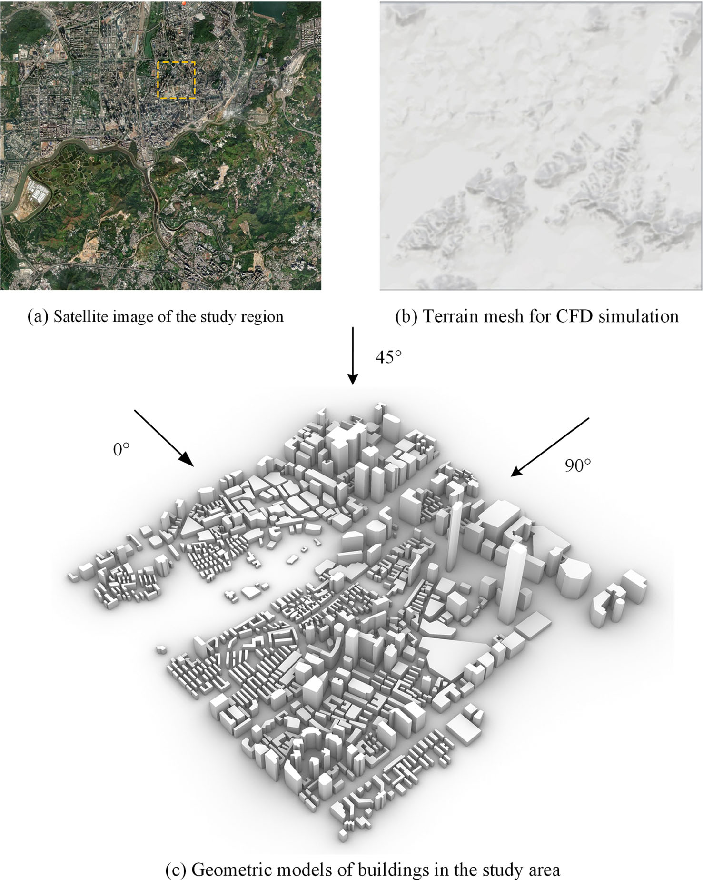

   **图 3** 研究区域建筑与地形的几何模型。

   分图：（a）研究区域卫星影像；（b）用于 CFD 模拟的地形网格；（c）研究区域建筑几何模型。箭头分别标示 :math:`0^\circ`、 :math:`45^\circ` 和 :math:`90^\circ` 来流方向。

3.2 WRF 模型
~~~~~~~~~~~~

本研究还生成天气研究与预报（WRF）数据，作为后续利用数据库重建风场的输入。采用设置了三个双向嵌套计算域 D01、D02 和 D03 的中尺度 WRF 模型。水平网格分辨率分别为 :math:`27\,\mathrm{km}`、 :math:`9\,\mathrm{km}` 和 :math:`3\,\mathrm{km}`，对应的网格规模 :math:`x\times y` 分别为 :math:`130\times130`、 :math:`145\times169` 和 :math:`214\times229`。竖向坐标采用随地形变化的静力气压坐标，共设 40 个 sigma 层。物理参数化方案包括 Mellor–Yamada–Janjic（Eta）TKE 方案（行星边界层）、Goddard 方案（微物理）、Monin–Obukhov（MYJ）方案及其修订版本 YSU（地表层）、Unified Noah 陆面模式以及 Kain–Fritsch 方案（积云对流，应用于所有计算域）。初始条件和边界条件来自 ERA5 再分析数据集。长波辐射采用 RRTM 方案。模拟时段为 UTC 2016 年 8 月 1 日 00:00 至 2016 年 10 月 30 日 24:00。

本文的 CFD 模拟适用于建立标准数据库，后续风场重建则采用气象部门提供的预测风速或现场观测风速。此外，本研究使用的 WRF 数据适用于历史风场重建，这一过程不同于建立标准数据库。首先，获取研究区域的 WRF 数据后，利用双三次插值（ :ref:`Hall，1969 <zhaobs-ref-Hall1969>`）进行数据插值，得到 CFD 计算四个边界网格节点处的风速，即空间插值。随后，使用线性插值，将 1 分钟间隔的数据插值为 1 秒间隔数据，并通过 CDRFG 方法生成脉动风（ :ref:`Aboshosha 等，2015a <zhaobs-ref-Aboshosha2015a>`； :ref:`Aboshosha 等，2015b <zhaobs-ref-Aboshosha2015b>`）。最后，将四个边界均设为速度入口，利用用户自定义函数（UDF）在每个时间步把细化后的风速输入四个入口边界，从而生成和细化风场，并将其保存为数据库。

3.3 CFD 模型
~~~~~~~~~~~~

3.3.1 计算域与网格
^^^^^^^^^^^^^^^^^^

研究区域周边的建筑和地形起伏会显著影响核心区风流动特征（ :ref:`Liu 等，2018 <zhaobs-ref-Liu2018>`； :ref:`Kim 等，2024 <zhaobs-ref-Kim2024>`）。为考虑这些影响，需要在所选研究区域外设置过渡区，将过渡区内的建筑和地形纳入计算域。基于所提出的区块划分方法，将研究区域划分为 :math:`1\,\mathrm{km}\times1\,\mathrm{km}` 的区块作为核心区。计算域见图 4。 :math:`H_{\max}` 为核心区最高建筑的高度。

本研究以核心区最高建筑高度 :math:`H_{\max}` （ :math:`150\,\mathrm{m}`）为基本尺度，评估周边建筑对目标建筑群的影响。位于过渡区外缘的建筑，如果有超过 :math:`50\%` 的面积落在过渡区边界内，就将其视为过渡区的一部分。建立多风向计算域，以获取不同风向角的风场数据。研究区域边界到计算域边界（入口和出口）的距离应不小于 :math:`5H_{\max}`，计算域高度应不小于 :math:`6H_{\max}` （ :ref:`Britter 和 Schatzmann，2007 <zhaobs-ref-Britter2007>`）。

.. _zhaobs-fig-4:

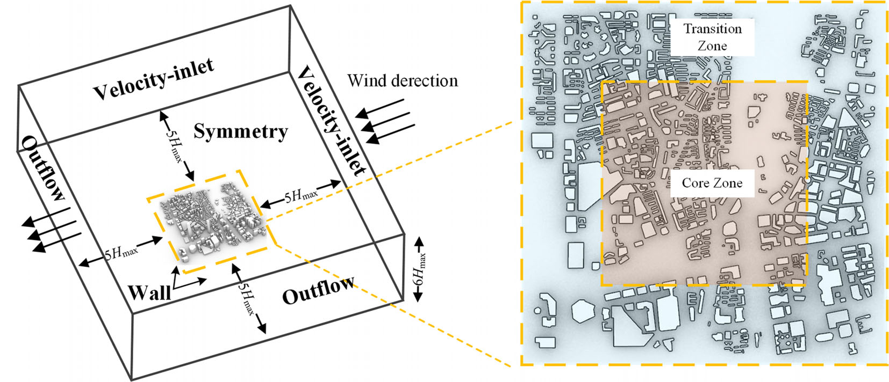

   **图 4** 复杂城市建筑模型的计算域。

   图内文字：Velocity-inlet＝速度入口；Outflow＝流出边界；Symmetry＝对称边界；Wall＝壁面；Wind direction＝风向；Transition Zone＝过渡区；Core Zone＝核心区。平面间距标记为 :math:`5H_{\max}`，计算域高度标记为 :math:`6H_{\max}`。

考虑到研究区域包含城市地形和大量不规则建筑，本研究采用多面体网格生成技术。建筑局部网格尺寸设为 :math:`1\,\mathrm{m}`。地形网格尺寸设为 :math:`30\,\mathrm{m}`，远场网格尺寸设为 :math:`60\,\mathrm{m}`，网格增长率设为 :math:`1.2`。在水平方向，将建筑模型的方形轮廓向外延伸 :math:`50\,\mathrm{m}`；在竖向，将最高建筑高度向上延伸 :math:`50\,\mathrm{m}`，在由此形成的周围立方体内进行影响体（Body of Influence，BOI）局部加密。生成三套网格 G1、G2、G3，以检验网格无关性，网格参数见表 1。

为更准确地分析近地面风场，在建筑和地形表面设置五层边界层网格（ :ref:`Franke 等，2004 <zhaobs-ref-Franke2004>`）。首层边界层高度设为 :math:`0.05\,\mathrm{m}`，边界层增长方式设为“last ratio”（末层比例），参数设为 :math:`5\%`。局部加密区域网格和建筑周围的边界层网格见图 5。

.. _zhaobs-table-1:

.. list-table:: 表 1 三种网格方案的参数设置
   :header-rows: 1
   :class: longtable

   * - 网格
     - 建筑网格尺寸（m）
     - 地形网格尺寸（m）
     - 远场网格尺寸（m）
     - 首层高度（m）
     - 边界层层数
     - BOI（m）
   * - G1
     - 1
     - 30
     - 60
     - 0.05
     - 5
     - 9
   * - G2
     - 1
     - 30
     - 60
     - 0.05
     - 5
     - 6
   * - G3
     - 1
     - 30
     - 60
     - 0.05
     - 5
     - 3

实际风向角不断变化，因此 CFD 分析中需要模拟多个风向角。根据气象站提供的日平均最大风速风玫瑰图，选取 :math:`0^\circ`、 :math:`45^\circ` 和 :math:`90^\circ` 风向角进行 CFD 模拟。风向角定义见图 3(c)，将北向来风定义为 :math:`0^\circ`，并沿顺时针方向增大。入口边界设为速度入口，出口边界设为自由流出，顶面设为对称（无滑移）边界，地面和建筑表面设为壁面边界。计算域模型的边界设置见图 4。

.. note::

   原文差异说明：上述顶面条件忠实保留原文的“symmetric (no-slip)”写法，但“对称”和“无滑移”并非同一种边界条件。图 4 标记为 Symmetry；原文没有解释括号中的 no-slip，实际复现设置需由作者澄清。

.. _zhaobs-fig-5:

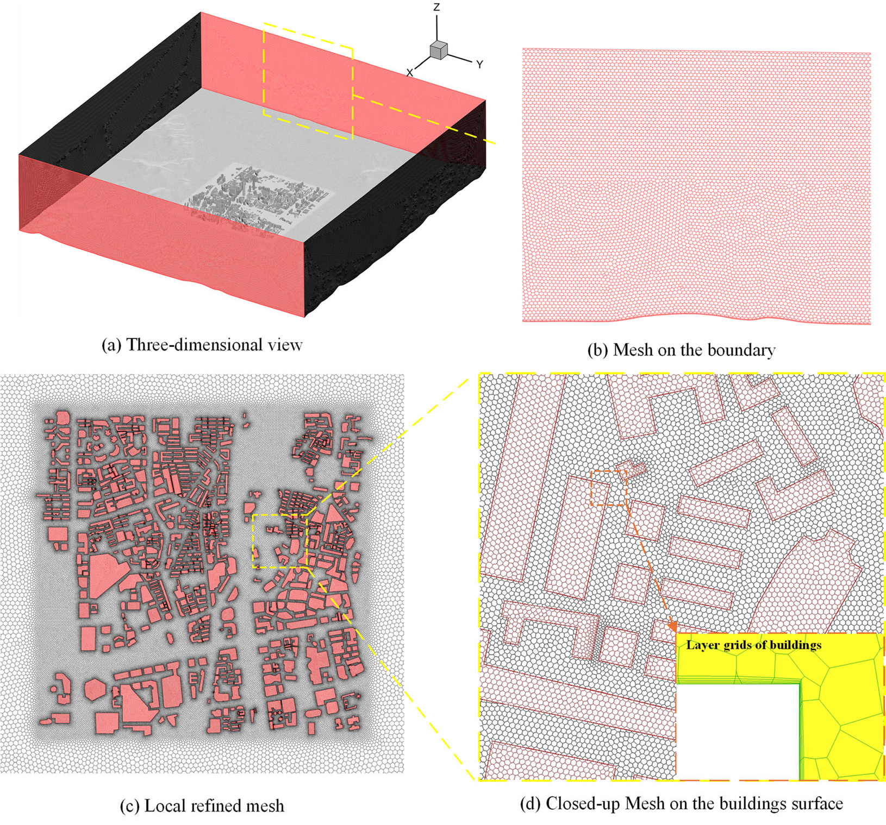

   **图 5** 研究区域建筑的网格设置。

   分图：（a）三维视图；（b）边界上的网格；（c）局部加密网格；（d）建筑表面网格局部放大。Layer grids of buildings＝建筑边界层网格。

3.3.2 湍流模型与参数设置
^^^^^^^^^^^^^^^^^^^^^^^^

近年来的城市风场模拟通常基于稳态 RANS 方程。然而，与 LES 相比，其预测精度仍有所不足，对湍流结构的分辨能力也相对较弱（ :ref:`Gousseau 等，2011 <zhaobs-ref-Gousseau2011>`； :ref:`Zheng 和 Yang，2021 <zhaobs-ref-Zheng2021>`）。本研究选择 WALE LES 模型开展 CFD 模拟（ :ref:`Nicoud 和 Ducros，1999 <zhaobs-ref-Nicoud1999>`）；该模型无需壁面函数或全局阻尼函数，其精度高于 Smagorinsky–Lilly LES。该模型在近壁层流区域中将湍流黏度 :math:`\nu_t` 设为 0，从而有效保证近壁流场的流动特征。 :math:`\nu_t` 的计算公式如下：

.. math::

   \nu_t=\rho^2L_s^2\frac{\left(S^{\mathrm d}_{i,j}S^{\mathrm d}_{i,j}\right)^{3/2}}{\left(\overline S_{i,j}\overline S_{i,j}\right)^{5/2}+\left(S^{\mathrm d}_{i,j}S^{\mathrm d}_{i,j}\right)^{5/4}} \qquad (2)

.. math::

   L_s=\min\left(\kappa d,C_\omega V^{1/3}\right) \qquad (3)

.. math::

   S^{\mathrm d}_{i,j}=\frac12\left(\overline g_{i,j}^{\,2}\overline g_{j,i}^{\,2}\right)-\frac13\delta_{i,j}\overline g_{kk}^{\,2},\qquad \overline g_{i,j}=\frac{\partial\overline u_i}{\partial x_j} \qquad (4)

式中， :math:`L_s` 为网格尺度（ :math:`\mathrm{m}`）； :math:`S^{\mathrm d}_{i,j}` 为速度梯度张量平方的无迹对称部分； :math:`\overline S_{i,j}` 为解析尺度的应变率张量； :math:`\kappa` 为 von Kármán 常数，取 :math:`0.42`； :math:`d` 为到最近壁面的距离； :math:`C_\omega` 为模型相关系数，取 :math:`0.325`； :math:`V` 为计算单元体积； :math:`\delta_{i,j}` 为 Kronecker 符号。

.. note::

   原文差异说明：式（2）按出版版保留 :math:`\rho^2L_s^2` 前因子和 :math:`\nu_t` 符号；原文紧随公式的释义没有定义 :math:`\rho`。式（4）的括号内两项之间未印出加号，译文按原版呈现相邻排列，未自行补成通常的 WALE 形式。这两处排印及量纲问题须经作者校对，不能把本页所录公式当作已纠正的实现公式。

采用 WALE 模型进行大涡模拟（LES），采用 SIMPLE 算法求解压力与速度的离散流动方程。模拟采用二阶迎风格式进行空间离散，对流项采用有界中心差分格式。时间离散采用有界二阶隐式格式。时间步长设为 :math:`0.05\,\mathrm{s}`，时间步数设为 20000。为加快解的收敛速度，首先使用稳态 SST :math:`k\text{-}\omega` 湍流模型进行稳态模拟，得到稳态初始场。然后采用 LES 进行瞬态模拟，当监测点风速出现明显周期性振荡时，可认为瞬态解已经收敛。

所有模拟均在配备 384 个 AMD EPYC 7573X 处理器核心的高性能计算（HPC）集群上，使用 Fluent 完成。

3.3.3 网格无关性分析
^^^^^^^^^^^^^^^^^^^^

生成三套网格 G1、G2、G3 进行网格无关性分析，关注城市建筑群的平均风场。在计算模型中随机选取 30 个监测点，用于比较计算结果。监测点分布平面图见图 6。

.. _zhaobs-fig-6:

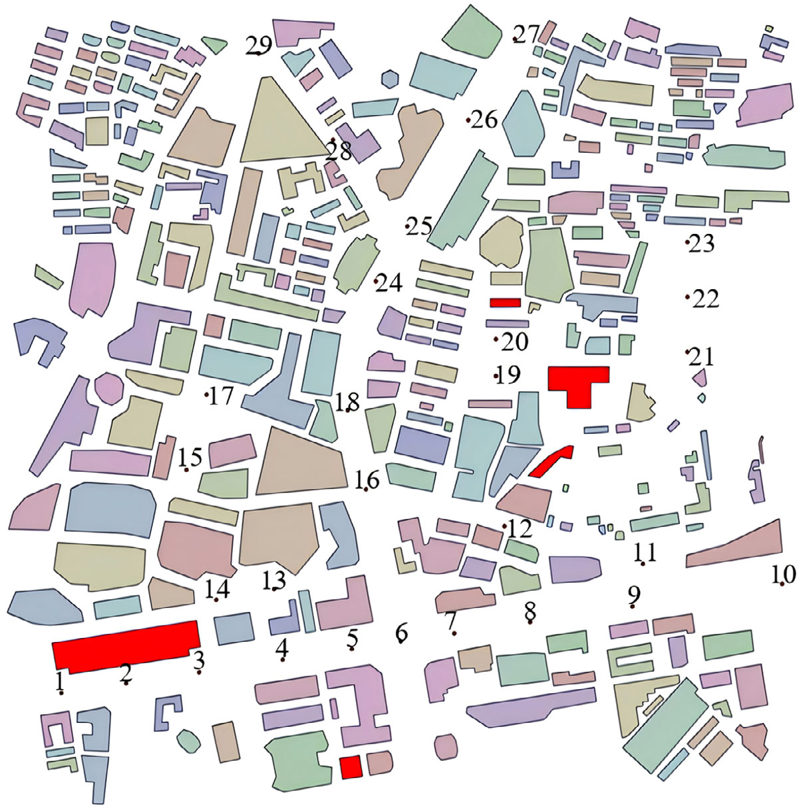

   **图 6** 监测点分布。

   图中数字为监测点编号，保留原图建筑轮廓、测点位置与标记。正文称随机选取 30 个监测点；图中可读编号显示至 29，未据图擅补未标出的测点。

使用无量纲风速比对计算结果进行比较分析。结果表明，在 CFD 模拟采用相同湍流模型和参数设置的条件下，G1 与 G2 之间的模拟误差较大，许多监测点的误差超过 :math:`20\%`。相比之下，G2 与 G3 之间所有监测点的误差均小于 :math:`20\%` （图 7）。这表明 G2 网格具有良好的网格无关性。综合考虑求解精度与计算成本，G2 网格更适合后续城市区块风场模拟。

.. _zhaobs-fig-7:

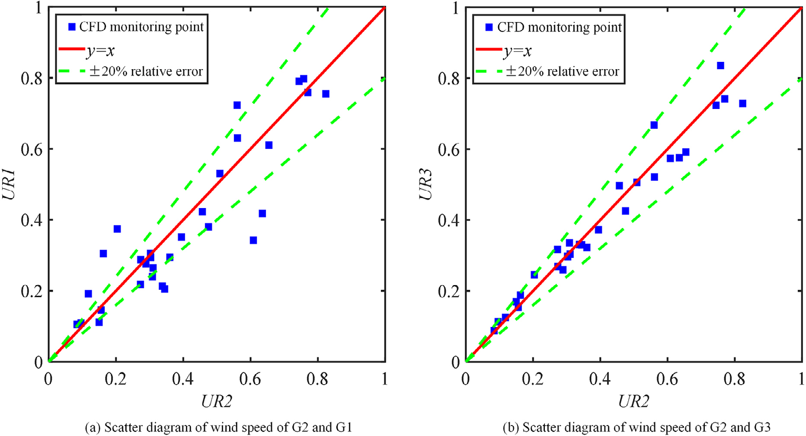

   **图 7** 网格无关性分析结果。

   分图：（a）G2 与 G1 风速散点图；（b）G2 与 G3 风速散点图。横轴 UR2 为 G2 风速比；纵轴 UR1、UR3 分别为 G1、G3 风速比。蓝色方点为 CFD 监测点，红线为 :math:`y=x`，绿色虚线为 :math:`\pm20\%` 相对误差界限。

3.4 最优过渡区长度
~~~~~~~~~~~~~~~~~~

依据城市风环境最佳实践 COST Action 732 指南的建议（ :ref:`Britter 和 Schatzmann，2007 <zhaobs-ref-Britter2007>`），本研究建立不同过渡区长度的计算域模型，研究过渡区长度对核心区 CFD 模拟结果的影响，并为每个区块选取最适合的 :math:`X_L`。其取值为 :math:`X_L=0`、 :math:`X_L=H_{\max}`、 :math:`X_L=2H_{\max}`、 :math:`X_L=3H_{\max}`、 :math:`X_L=4H_{\max}` 和 :math:`X_L=5H_{\max}`。不同过渡区长度的计算域模型见图 8。

.. _zhaobs-fig-8:

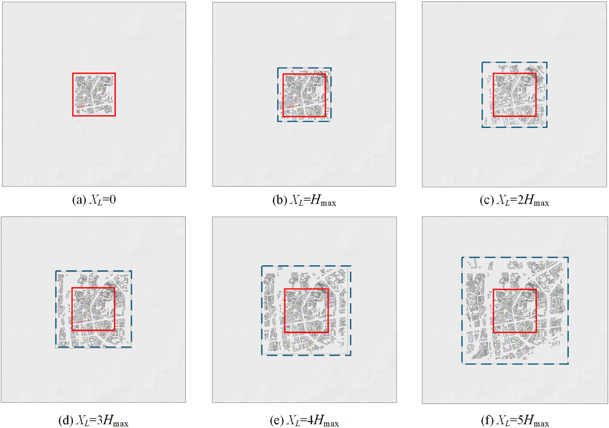

   **图 8** 不同过渡区长度下的计算域模型。

   分图（a）至（f）依次为 :math:`X_L=0`、 :math:`H_{\max}`、 :math:`2H_{\max}`、 :math:`3H_{\max}`、 :math:`4H_{\max}`、 :math:`5H_{\max}`；红色实线框为核心区范围，蓝色虚线框为过渡区外边界。

由于非标准工况和标准工况下非结构网格的节点位置不一致，选取标准工况 :math:`X_L=5H_{\max}` 中核心区 :math:`0\text{–}300\,\mathrm{m}` 高度范围内的网格节点作为分析样本点（图 9）。为更好地开展对比验证，根据 Cell-Wall-Distance（网格单元到壁面的距离），去除距壁面 :math:`1.5\,\mathrm{m}` 以内的网格节点。此外，需要将非标准工况的计算结果插值到标准工况的网格样本点。因此，采用最近邻插值方法（ :ref:`Dhiman，2024 <zhaobs-ref-Dhiman2024>`），将非标准工况下 CFD 模拟风速数据插值到标准工况的网格样本点，并利用前述四个验证指标进行定量评价。

.. _zhaobs-fig-9:

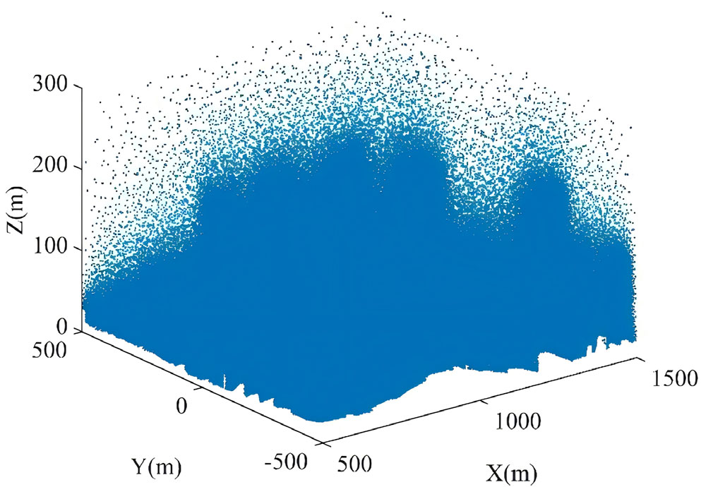

   **图 9** 插值网格样本点。

   坐标轴 X、Y、Z 的单位均为米；竖向显示 :math:`0\text{–}300\,\mathrm{m}` 的样本点范围。

图 10、图 11 和图 12 分别展示 :math:`0^\circ`、 :math:`45^\circ` 和 :math:`90^\circ` 风向角下，不同过渡区长度对应的 :math:`10\,\mathrm{m}` 高度风速云图。结果表明， :math:`X_L=0` 工况的风速显著高于其他过渡区长度工况。相比之下， :math:`X_L=3H_{\max}`、 :math:`X_L=4H_{\max}` 和标准工况的总体风场基本一致，仅局部区域存在风速差异。随着过渡区长度增加，过渡区建筑对核心区风场的影响逐渐减小。

.. _zhaobs-fig-10:

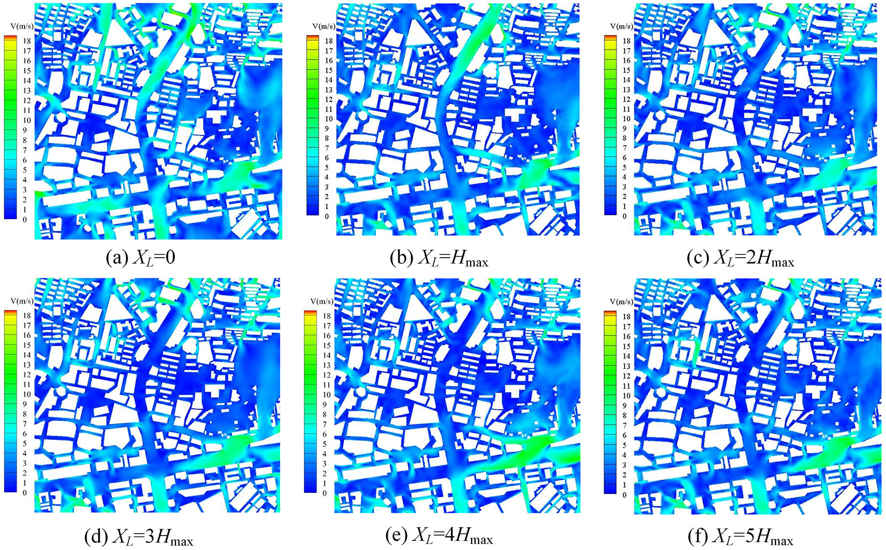

   **图 10** 0° 风向下不同过渡区长度对应的 10 m 高度风速。

   分图（a）至（f）依次为 :math:`X_L=0`、 :math:`H_{\max}`、 :math:`2H_{\max}`、 :math:`3H_{\max}`、 :math:`4H_{\max}`、 :math:`5H_{\max}`。色标 V 为风速，单位 :math:`\mathrm{m/s}`。

.. _zhaobs-fig-11:

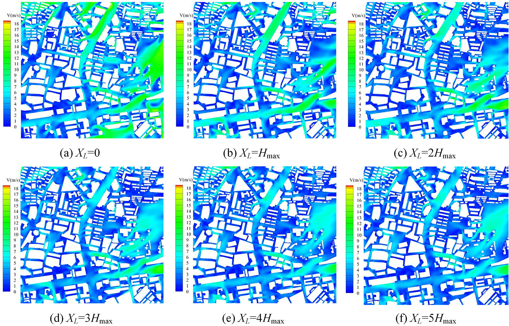

   **图 11** 45° 风向下不同过渡区长度对应的 10 m 高度风速。

   分图（a）至（f）依次为 :math:`X_L=0`、 :math:`H_{\max}`、 :math:`2H_{\max}`、 :math:`3H_{\max}`、 :math:`4H_{\max}`、 :math:`5H_{\max}`。色标 V 为风速，单位 :math:`\mathrm{m/s}`。

.. _zhaobs-fig-12:

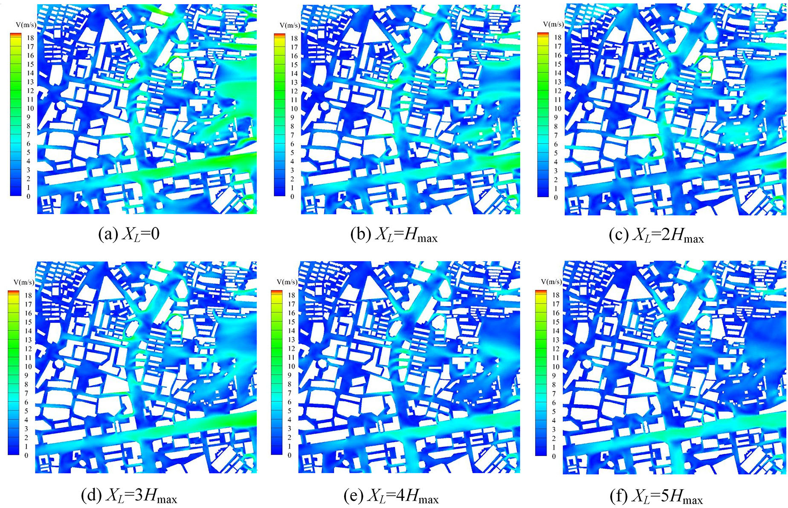

   **图 12** 90° 风向下不同过渡区长度对应的 10 m 高度风速。

   分图（a）至（f）依次为 :math:`X_L=0`、 :math:`H_{\max}`、 :math:`2H_{\max}`、 :math:`3H_{\max}`、 :math:`4H_{\max}`、 :math:`5H_{\max}`。色标 V 为风速，单位 :math:`\mathrm{m/s}`。

图 13、图 14 和图 15 表明， :math:`X_L` 的变化对核心区 :math:`10\,\mathrm{m}` 高度处的湍流强度具有显著影响。具体来说， :math:`X_L=0\,\mathrm{m}` 时，某些风向角下核心区边缘的湍流强度相对较小，原因在于上游没有建筑群让入流得到充分发展。随着 :math:`X_L` 增加，核心区湍流发展更充分，湍流强度云图的整体变化趋于减小。这是因为周边建筑数量增加，使入射平均风到达核心区之前得以充分发展。

.. note::

   原文差异说明：图 13–15、图 20 的原始图题写作“湍动能（Turbulent kinetic energy）”，而对应正文使用“湍流强度”，图中色标也标记 TI。这里分别保留原始图题、色标和正文含义，不将两种物理量擅自统一。

.. _zhaobs-fig-13:

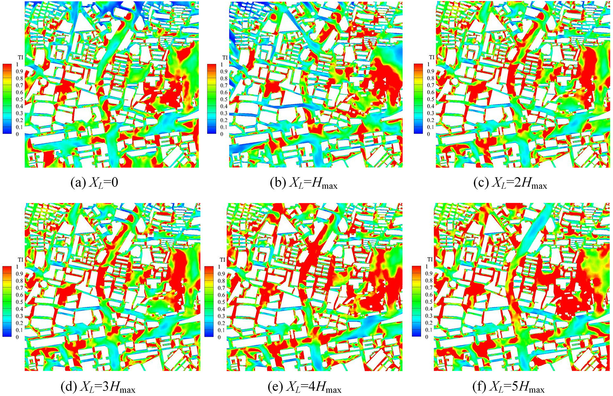

   **图 13** 0° 风向下不同过渡区长度对应的 10 m 高度湍动能。

   分图（a）至（f）依次为 :math:`X_L=0`、 :math:`H_{\max}`、 :math:`2H_{\max}`、 :math:`3H_{\max}`、 :math:`4H_{\max}`、 :math:`5H_{\max}`。原图色标为 TI（湍流强度）；图题中的“湍动能”按原版保留，其与色标和正文的差异见本节说明。

.. _zhaobs-fig-14:

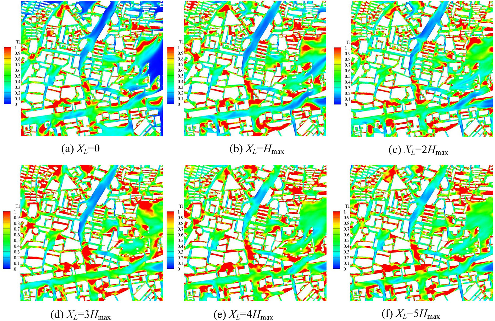

   **图 14** 45° 风向下不同过渡区长度对应的 10 m 高度湍动能。

   分图（a）至（f）依次为 :math:`X_L=0`、 :math:`H_{\max}`、 :math:`2H_{\max}`、 :math:`3H_{\max}`、 :math:`4H_{\max}`、 :math:`5H_{\max}`。原图色标为 TI（湍流强度）；图题中的“湍动能”按原版保留，其与色标和正文的差异见本节说明。

.. _zhaobs-fig-15:

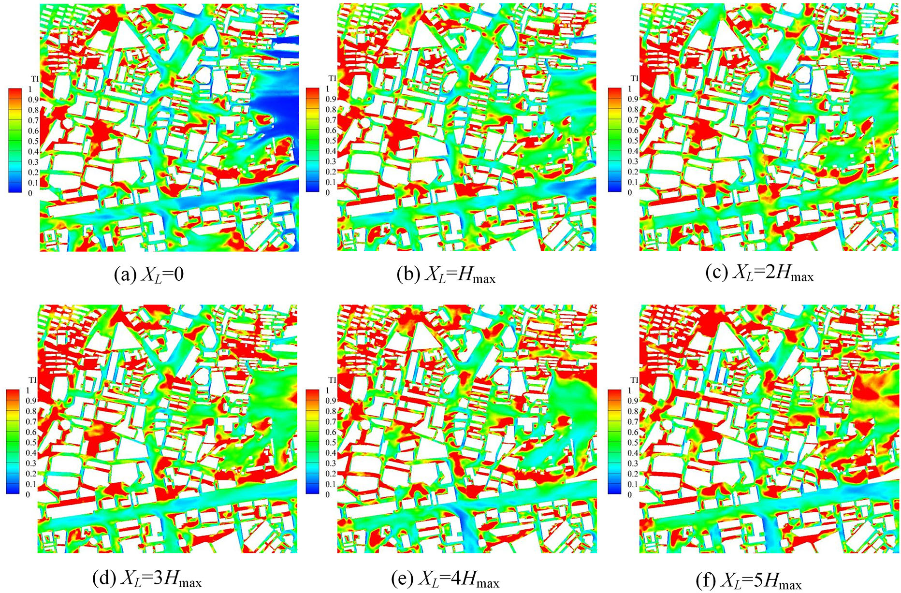

   **图 15** 90° 风向下不同过渡区长度对应的 10 m 高度湍动能。

   分图（a）至（f）依次为 :math:`X_L=0`、 :math:`H_{\max}`、 :math:`2H_{\max}`、 :math:`3H_{\max}`、 :math:`4H_{\max}`、 :math:`5H_{\max}`。原图色标为 TI（湍流强度）；图题中的“湍动能”按原版保留，其与色标和正文的差异见本节说明。

为进一步量化不同过渡区长度对核心建筑群区域空间风场分布的影响，以过渡区长度 :math:`X_L=5H_{\max}` 为标准工况，与 :math:`X_L=4H_{\max}`、 :math:`X_L=3H_{\max}`、 :math:`X_L=2H_{\max}`、 :math:`X_L=H_{\max}` 和 :math:`X_L=0\,\mathrm{m}` 等非标准工况比较。采用分数偏差（FB）、归一化均方误差（NMSE）、二倍因子（FAC2）和线性相关系数 :math:`R` 四个验证指标，定量评价不同过渡区长度对核心区风场分布的影响（ :ref:`Du 等，2020 <zhaobs-ref-Du2020>`）。验证指标的公式如下：

.. math::

   \mathrm{FB}=\frac{\sum_{i=1}^{n}(U_{1,i}-U_{2,i})}{0.5\sum_{i=1}^{n}(U_{1,i}+U_{2,i})} \qquad (5)

.. math::

   \mathrm{NMSE}=\frac1n\sum_{i=1}^{n}\frac{(U_{1,i}-U_{2,i})^2}{U_{1,i}U_{2,i}} \qquad (6)

.. math::

   \mathrm{FAC2}=\frac1n\sum_iF_i,\qquad F_i=\begin{cases}1,&0.5\leq U_{1,i}/U_{2,i}\leq2,\\0,&\text{其他情况}.\end{cases} \qquad (7)

.. math::

   R=\frac{\frac1n\sum_i(U_{1,i}-\overline U_1)(U_{2,i}-\overline U_2)}{\sigma_{U_1}\sigma_{U_2}} \qquad (8)

式中， :math:`U_{1,i}` 为非标准工况下样本点风速值（ :math:`\mathrm{m/s}`）， :math:`U_{2,i}` 为标准工况下样本点风速值（ :math:`\mathrm{m/s}`）， :math:`\overline U_1` 为非标准工况下样本点平均风速（ :math:`\mathrm{m/s}`）， :math:`\overline U_2` 为标准工况下样本点平均风速（ :math:`\mathrm{m/s}`）， :math:`n` 为插值样本点总数。

这些指标的理想值为 :math:`\mathrm{FB}=0`、 :math:`\mathrm{NMSE}=0`、 :math:`\mathrm{FAC2}=1` 和 :math:`R=1`。表 2、表 3 和表 4 分别比较 :math:`0^\circ`、 :math:`45^\circ` 和 :math:`90^\circ` 风向角下，不同过渡区长度对应的模拟风速差异。依据 :ref:`Tominaga 和 Stathopoulos，2018 <zhaobs-ref-Tominaga2018>` 的建议，当 :math:`R>0.8`、 :math:`\mathrm{FAC2}>0.5`、 :math:`|\mathrm{FB}|<0.3` 且 :math:`\mathrm{NMSE}<0.4` 时，可认为 CFD 数值预测结果足够好。

当过渡区长度 :math:`X_L=0` 时，FB 和 NMSE 指标较大，而 :math:`R` 和 FAC2 较小，表明模拟结果具有明显的系统误差和随机误差，与标准工况的线性相关性较差。然而，随着 :math:`X_L` 增加，FB 和 NMSE 持续减小， :math:`R` 和 FAC2 逐渐增大，说明核心区风场空间分布逐渐接近标准工况 :math:`X_L=5H_{\max}`，线性相关性和拟合程度提高，变化幅度减小。当 :math:`X_L=3H_{\max}` 和 :math:`X_L=4H_{\max}` 时，这些指标变化很小，表明其系统误差和随机误差相近，且具有良好的线性相关性与拟合程度。尽管不同 :math:`X_L` 取值会影响风场分布，但这种影响随着 :math:`X_L` 增加而逐渐减弱。因此，对于核心建筑群，建议选择 :math:`4H_{\max}` 的过渡区长度；不过，考虑规模与成本，也可以选择 :math:`3H_{\max}`。

.. _zhaobs-table-2:

.. list-table:: 表 2 0° 风向角下不同过渡区长度的风速比较
   :header-rows: 1
   :class: longtable

   * - 指标
     - 理想值
     - :math:`X_L=0`
     - :math:`X_L=H_{\max}`
     - :math:`X_L=2H_{\max}`
     - :math:`X_L=3H_{\max}`
     - :math:`X_L=4H_{\max}`
   * - FB
     - 0
     - 0.2653
     - 0.0964
     - 0.0685
     - 0.0581
     - 0.0491
   * - FAC2
     - 1
     - 0.7975
     - 0.8801
     - 0.9077
     - 0.9267
     - 0.9341
   * - NMSE
     - 0
     - 0.5001
     - 0.2982
     - 0.2370
     - 0.2022
     - 0.1927
   * - R
     - 1
     - 0.8234
     - 0.8849
     - 0.9271
     - 0.9315
     - 0.9408

.. _zhaobs-table-3:

.. list-table:: 表 3 45° 风向角下不同过渡区长度的风速比较
   :header-rows: 1
   :class: longtable

   * - 指标
     - 理想值
     - :math:`X_L=0`
     - :math:`X_L=H_{\max}`
     - :math:`X_L=2H_{\max}`
     - :math:`X_L=3H_{\max}`
     - :math:`X_L=4H_{\max}`
   * - FB
     - 0
     - 0.3129
     - 0.1557
     - 0.0915
     - 0.0789
     - 0.0620
   * - FAC2
     - 1
     - 0.7343
     - 0.8328
     - 0.8843
     - 0.9007
     - 0.9106
   * - NMSE
     - 0
     - 0.6518
     - 0.3860
     - 0.3466
     - 0.2344
     - 0.1963
   * - R
     - 1
     - 0.7015
     - 0.8163
     - 0.8737
     - 0.9121
     - 0.9197

.. _zhaobs-table-4:

.. list-table:: 表 4 90° 风向角下不同过渡区长度的风速比较
   :header-rows: 1
   :class: longtable

   * - 指标
     - 理想值
     - :math:`X_L=0`
     - :math:`X_L=H_{\max}`
     - :math:`X_L=2H_{\max}`
     - :math:`X_L=3H_{\max}`
     - :math:`X_L=4H_{\max}`
   * - FB
     - 0
     - 0.2932
     - 0.1712
     - 0.1305
     - 0.0949
     - 0.0764
   * - FAC2
     - 1
     - 0.7561
     - 0.8156
     - 0.8575
     - 0.8821
     - 0.9039
   * - NMSE
     - 0
     - 0.4798
     - 0.3393
     - 0.2661
     - 0.1973
     - 0.1745
   * - R
     - 1
     - 0.8256
     - 0.8636
     - 0.9012
     - 0.9159
     - 0.9195

3.5 分块风场数据合并
~~~~~~~~~~~~~~~~~~~~

为验证区块划分方法，首先分别模拟两个相邻的 :math:`1\,\mathrm{km}\times1\,\mathrm{km}` 区块，再将其合并，进行整体 CFD 模拟。随后，通过比较相邻区块公共面和整体区域的风场差异，证明所提框架的精度。研究区域和公共面见图 16。区块 1 与区块 2 的公共面就是两个区块之间的边界。

.. _zhaobs-fig-16:

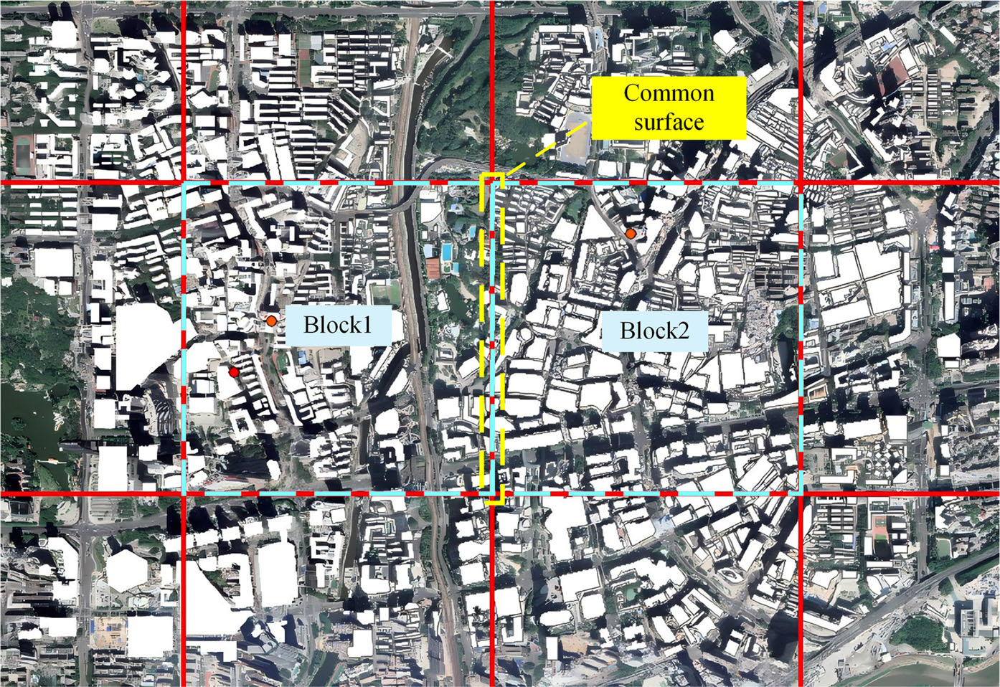

   **图 16** 相邻区块的公共面。

   图内文字：Block 1＝区块 1；Block 2＝区块 2；Common surface＝公共面。黄色虚线框定位两个区块的共享边界。

3.5.1 公共面数据一致性分析
^^^^^^^^^^^^^^^^^^^^^^^^^^

理想情况下，公共面上的风速云图应保持一致。图 17 和图 18 展示了三个风向角下，区块 1 与区块 2 公共面上的风速和湍流强度。可以看出，风速和湍流强度基本一致，仅部分局部区域存在风速差异。湍流强度分布具有很高的一致性和较强的相关性，与实际情况相符。其中，建筑周围的湍流强度较高，湍流发展也更充分。随着高度增加，湍流强度逐渐接近零。这些结果验证了城市风场微尺度分块模拟方法的可靠性。

由于计算资源受限，本研究采用不同划分区块开展模拟，导致不同区块模拟结果间的差异增大，尤其体现在相邻区块公共面上的风场与湍流强度分布。为减小这些差异，本文采用过渡区。但是，仍存在一些细微差异。当过渡区长度设为 :math:`4H_{\max}` 时，公共面上的差异及其实际影响已经很小。因此，本文对相邻区块公共面上的风速和湍流强度取平均，作为最终风场结果。

同样，采用 FB、NMSE、FAC2 和 :math:`R` 验证公共区域内 CFD 模拟风速的差异。三个风向角下四个验证指标的结果见表 5。结果显示， :math:`R` 均大于 :math:`0.94`，表明区块 1 与区块 2 公共面上的风速具有很强的线性关系。FAC2 均大于 :math:`0.93`，特别是 :math:`0^\circ` 风向角下大于 :math:`0.96`，表明公共面风速高度一致。同样，所有 FB 的绝对值接近 0，所有 NMSE 均远小于 :math:`0.4`，表明系统误差与随机误差都很低。根据上述验证指标，区块 1 与区块 2 模拟工况下的公共面风速数据，在拟合程度和相关性方面基本一致。这一初步验证证实了城市微尺度分块模拟的可行性。

.. _zhaobs-fig-17:

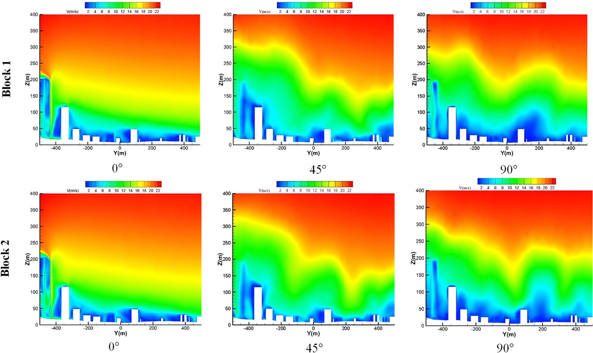

   **图 17** 公共面上的风速分布。

   上下两行分别为区块 1 与区块 2，三列分别为 :math:`0^\circ`、 :math:`45^\circ`、 :math:`90^\circ`。横轴 Y、纵轴 Z 单位为米，色标 V 为风速（ :math:`\mathrm{m/s}`）。

.. _zhaobs-fig-18:

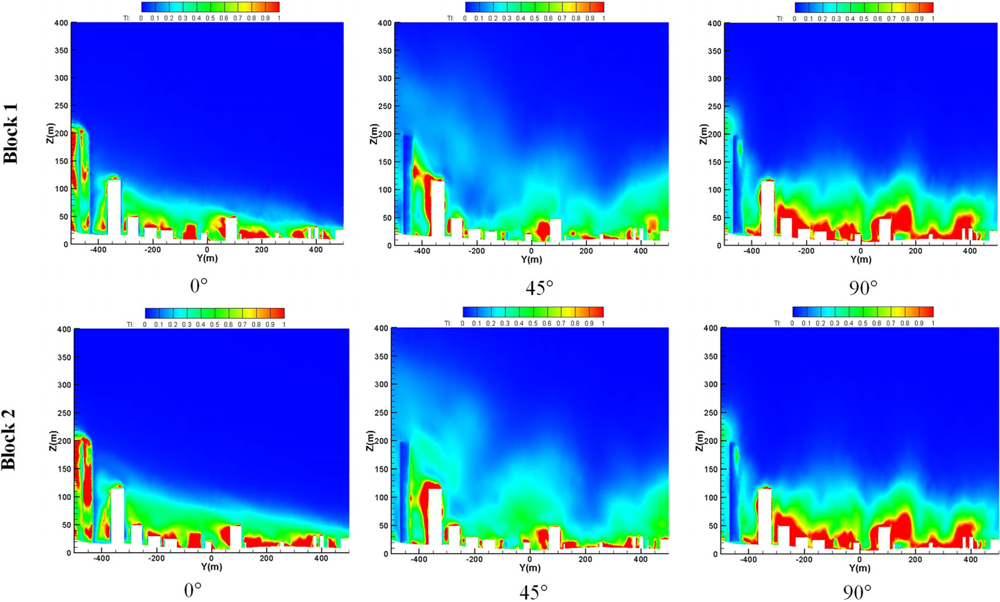

   **图 18** 公共面上的湍流强度分布。

   上下两行分别为区块 1 与区块 2，三列分别为 :math:`0^\circ`、 :math:`45^\circ`、 :math:`90^\circ`。横轴 Y、纵轴 Z 单位为米；TI 表示湍流强度。

.. _zhaobs-table-5:

.. list-table:: 表 5 不同风向下公共面风速差异
   :header-rows: 1
   :class: longtable

   * - 指标
     - 理想值
     - 0°
     - 45°
     - 90°
   * - FB
     - 0
     - 0.0459
     - 0.0844
     - 0.0594
   * - FAC2
     - 1
     - 0.9657
     - 0.9486
     - 0.9345
   * - NMSE
     - 0
     - 0.0746
     - 0.0795
     - 0.1018
   * - R
     - 1
     - 0.9861
     - 0.9573
     - 0.9471

3.5.2 分块模拟精度分析
^^^^^^^^^^^^^^^^^^^^^^

区块 1 和区块 2 公共面上的风场基本一致，证实了分块模拟方法的可靠性。然而，核心区内水平方向的风场分布更为重要。因此，本研究比较了区块 1 核心区与整个区块在 :math:`10\,\mathrm{m}` 高度处的风速和湍流强度云图。

区块 1 的风速和湍流强度云图与全域模拟结果基本一致（图 19 和图 20）。尽管 :math:`90^\circ` 风向角下开阔区域的湍流强度存在一些细微差异，但对于城市建筑群而言，这些差异可以接受。

同样，采用四个验证指标作进一步定量评价。比较 :math:`0^\circ`、 :math:`45^\circ` 和 :math:`90^\circ` 风向角下的分块 CFD 模拟和整体 CFD 模拟，发现 FB、NMSE、FAC2 和 :math:`R` 四个指标的结果均接近理想值，表明核心区空间风场分布具有高度一致性（表 6）。这些结果进一步证实了城市风场微尺度分块模拟方法的可靠性。

.. _zhaobs-table-6:

.. list-table:: 表 6 分块与整体 CFD 结果的风速预测比较
   :header-rows: 1
   :class: longtable

   * - 指标
     - 理想值
     - 0° 区块 1
     - 0° 区块 2
     - 45° 区块 1
     - 45° 区块 2
     - 90° 区块 1
     - 90° 区块 2
   * - FB
     - 0
     - 0.0364
     - 0.0292
     - 0.0380
     - 0.0340
     - 0.0411
     - 0.0668
   * - FAC2
     - 1
     - 0.9425
     - 0.9471
     - 0.9064
     - 0.9209
     - 0.9309
     - 0.9324
   * - NMSE
     - 0
     - 0.1336
     - 0.1277
     - 0.2196
     - 0.2252
     - 0.1583
     - 0.1866
   * - R
     - 1
     - 0.9420
     - 0.9412
     - 0.9156
     - 0.9065
     - 0.9246
     - 0.9150

.. _zhaobs-fig-19:

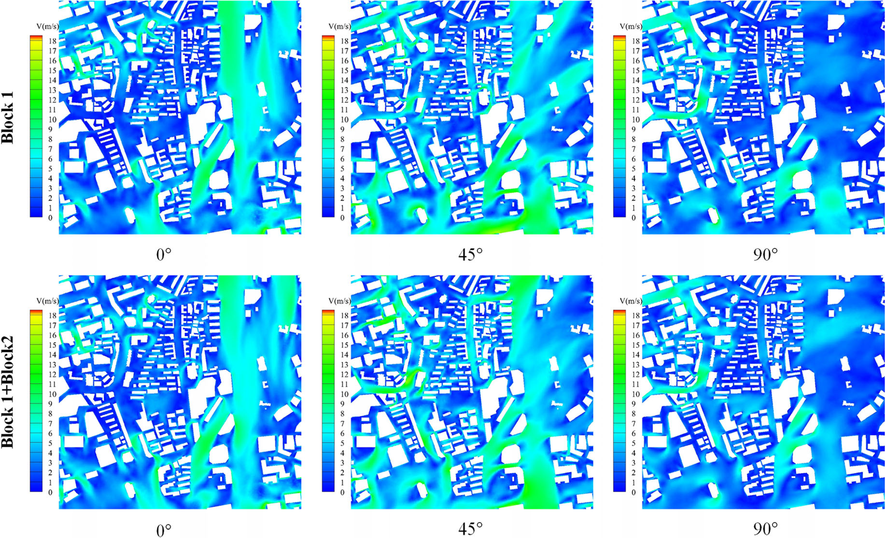

   **图 19** 区块 1 与整体区块核心区的 10 m 高度风速。

   上行为区块 1 单独模拟，下行为区块 1＋区块 2 整体模拟；三列依次为 :math:`0^\circ`、 :math:`45^\circ`、 :math:`90^\circ`。V 为风速（ :math:`\mathrm{m/s}`）。

.. _zhaobs-fig-20:

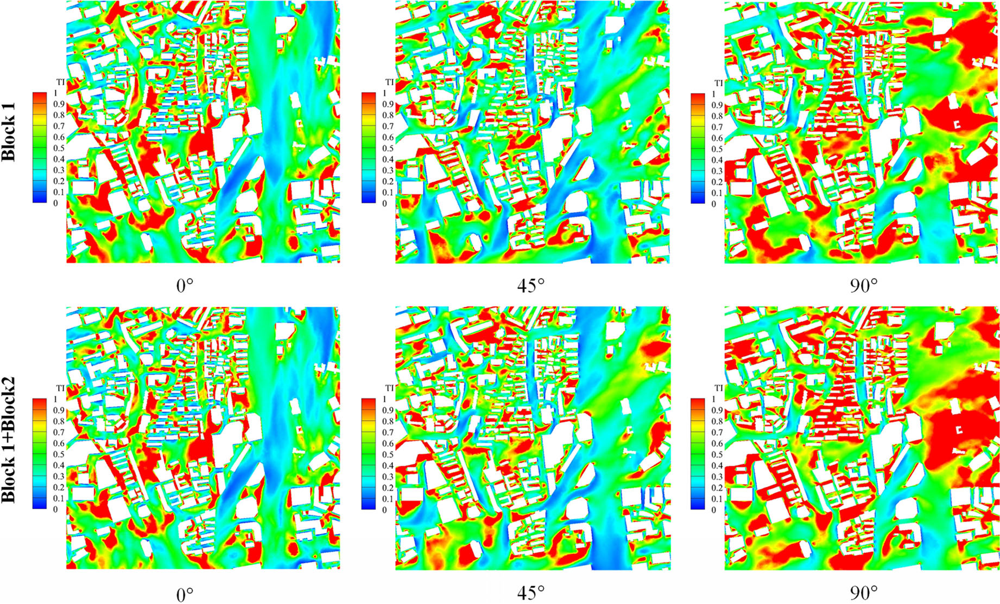

   **图 20** 区块 1 与整体区块核心区的 10 m 高度湍动能。

   上行为区块 1 单独模拟，下行为区块 1＋区块 2 整体模拟；三列依次为 :math:`0^\circ`、 :math:`45^\circ`、 :math:`90^\circ`。原图色标为 TI（湍流强度），与“湍动能”图题不一致，按原文保留。

4 利用现场数据验证风场预测
--------------------------

CFD 为计算建筑周围通风率与风场分布提供了另一种方法。然而，一些研究对 CFD 结果的准确性和可靠性提出了质疑。本研究使用实测数据验证城市微尺度区块的 CFD 模拟结果。与风洞试验验证方法类似，本研究采用气象局自动气象站的现场实测数据。通过计算实测风速比与 CFD 模拟风速比之间的相对误差进行验证。风速比相对误差的公式见式（9）。

.. math::

   E=\frac{K_{\mathrm{CFD}}-K_{\mathrm m}}{K_{\mathrm m}}\times100\% \qquad (9)

式中， :math:`K_{\mathrm{CFD}}` 为 CFD 模拟风速比， :math:`K_{\mathrm m}` 为现场实测风速比， :math:`E` 为 CFD 模拟与现场实测风速比之间的相对误差（ :math:`\%`）。

4.1 现场监测条件
~~~~~~~~~~~~~~~~

选取研究区内三个自动气象站来验证 CFD 结果：桂园气象站（GY）、蔡屋围气象站（CWW）和东门气象站（DM）。GY、CWW 和 DM 均位于区块 1 的核心区。作为参考站的 PA 站位于广东省深圳市福田区平安金融中心屋顶。气象站布置见图 21。监测数据包括测量日期、测量时间、2 分钟内平均风向和平均风速。在 2 分钟平均风向数据中， :math:`0^\circ` 风向角表示正北， :math:`90^\circ` 风向角表示正东。

.. _zhaobs-fig-21:

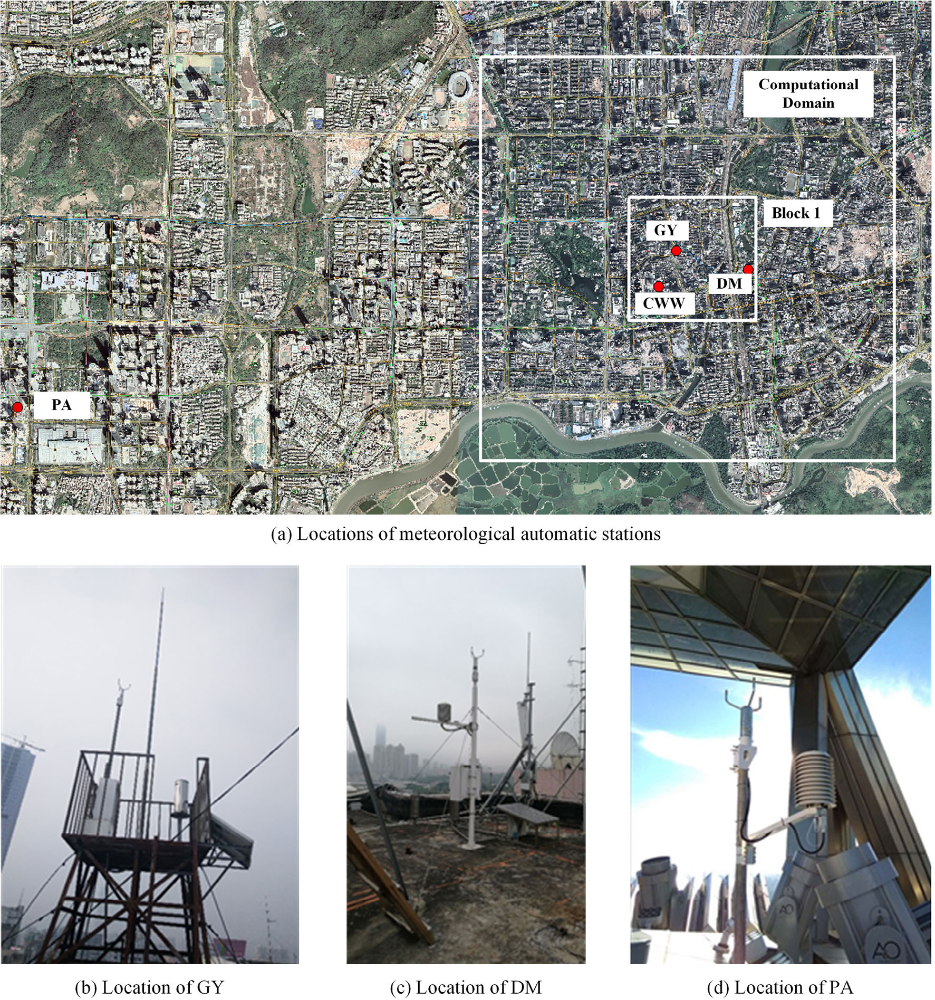

   **图 21** 自动气象站的位置与观测环境。

   分图：（a）自动气象站位置；（b）GY 站位置；（c）DM 站位置；（d）PA 站位置。Computational Domain＝计算域；Block 1＝区块 1；GY、CWW、DM 分别为桂园、蔡屋围、东门站，PA 为平安金融中心参考站。

4.2 气象数据处理
~~~~~~~~~~~~~~~~

:ref:`Schatzmann 和 Leitl，2011 <zhaobs-ref-Schatzmann2011>` 建议，实测数据的平均时间间隔不应超过 30 分钟，因为气象条件很可能在这段时间内发生变化。因此，本研究选择 10 分钟作为基本分析时间间隔，以 10 分钟平均风速代表相对稳定的来流。 :ref:`Blocken 等，2015 <zhaobs-ref-BlockenEtAl2015>` 通过选取风速大于 :math:`7\,\mathrm{m/s}` 的实测数据，滤除受热力效应影响的风速数据，并验证了其结果与 CFD 模拟结果十分接近。因此，本研究建立了不同风速阈值下的实测数据筛选方法，以探究实测数据随风速阈值变化的规律，以及不同风速阈值下实测数据与 CFD 结果之间的关系。

将实测风速数据拟合为广义极值（GEV）分布（ :ref:`Bali，2003 <zhaobs-ref-Bali2003>`），得到形状参数 :math:`K`、尺度参数 :math:`\sigma` 和位置参数 :math:`\mu` 的最大似然估计分别为 :math:`0.2864`、 :math:`1.4725` 和 :math:`1.5815`。由于 :math:`K>0`，数据服从 II 型极值分布。主要风向较为集中， :math:`90^\circ` 和 :math:`120^\circ` 占较大比例。因此，选择这两个风向的风速数据，验证基于区块的 CFD 模拟结果。

然后，根据风速阈值和风向 :math:`\theta`，筛选 PA 参考站满足条件的 10 分钟平均风速与风向数据样本。考虑 GY、CWW、DM 测站与 PA 参考站之间的时间滞后，选取与 PA 数据样本时间匹配的测站数据。为获得符合条件的 10 分钟平均风速样本，选取四个不同的 10 分钟平均风速阈值，即 :math:`5\,\mathrm{m/s}`、 :math:`7\,\mathrm{m/s}`、 :math:`9\,\mathrm{m/s}` 和 :math:`11\,\mathrm{m/s}` 下的实测数据样本，与 CFD 模拟结果比较。参考站风速为 :math:`11\,\mathrm{m/s}` 时可视为强风条件。使用四种不同风速阈值筛选后的 10 分钟平均风速样本数量见表 7。

.. _zhaobs-table-7:

.. list-table:: 表 7 不同风速阈值下的样本数
   :header-rows: 1
   :class: longtable

   * - 风速阈值
     - 样本量（90°）
     - 样本量（120°）
   * - 5 m/s
     - 2514
     - 1748
   * - 7 m/s
     - 706
     - 664
   * - 9 m/s
     - 153
     - 172
   * - 11 m/s
     - 26
     - 22

4.3 预测结果与实测结果比较
~~~~~~~~~~~~~~~~~~~~~~~~~~

本研究采用与第 3.3 节相同的计算域、边界条件和湍流模型设置，来流风向角为 :math:`90^\circ` 和 :math:`120^\circ`。各监测点的平均风速和平均风速比见表 8。

.. _zhaobs-table-8:

.. list-table:: 表 8 监测点平均风速与风速比
   :header-rows: 1
   :class: longtable

   * - 测站
     - 90° 平均风速（m/s）
     - 90° 风速比
     - 120° 平均风速（m/s）
     - 120° 风速比
   * - GY
     - 9.234
     - 0.537
     - 7.414
     - 0.431
   * - CWW
     - 1.362
     - 0.119
     - 1.201
     - 0.105
   * - DM
     - 3.712
     - 0.267
     - 4.084
     - 0.294
   * - 参考点
     - 23.170
     - /
     - 23.170
     - /

.. note::

   原文差异说明：表 8 按原表保留。若直接用表中测站平均风速除以参考点风速 :math:`23.170\,\mathrm{m/s}`，无法复算出表列风速比。例如， :math:`9.234/23.170\approx0.399`，并非表列 :math:`0.537`。原文未说明这两列是否采用不同归一化基准，因此不改写原始数值，也不据此增加新的精度结论。

得到各实测站和 CFD 模拟结果的风速比后，计算二者间的相对误差。结果表明，在 :math:`90^\circ` 和 :math:`120^\circ` 风向下，随着风速阈值提高，所有测站的风速比均呈下降趋势（图 22(a)、图 23(a)）。由于 GY 站位置较高、受到的建筑干扰较小，其风速比高于其他测站。图 22(b) 和图 23(b) 表明，GY 站的风速比相对误差总体较小，处于合理范围内。CWW 站的相对误差整体较大。在 :math:`11\,\mathrm{m/s}` 风速阈值下，其平均风速比误差分别为 :math:`15\%` 和 :math:`16\%`，这是由于该站高度较低，且周围建筑密集。随着风速阈值提高，GY、CWW 和 DM 站风速比与 CFD 模拟风速比之间的平均相对误差逐渐减小，并进入合理范围。当风速阈值设为 :math:`9\,\mathrm{m/s}` 和 :math:`11\,\mathrm{m/s}` 时，在 :math:`90^\circ` 风向角下，三个测站的平均相对误差低于 :math:`17\%`，其中 GY 站的相对误差甚至低于 :math:`10\%`。在 :math:`120^\circ` 风向角下，三个测站的平均相对误差低于 :math:`20\%`，其中 GY 站的相对误差甚至低于 :math:`5\%`。这些差异与三个测站的位置和高度有关，总体而言，相对误差可以接受。

总体来看，在中性边界层条件下验证城市微尺度 CFD 模拟时，提高风速阈值是滤除受热力影响实测数据的有效方法。从平均风速比相对误差的角度看，在强风条件 :math:`11\,\mathrm{m/s}` 下，三个气象站的平均风速相对误差被控制在 :math:`17\%` 以下。在没有考虑地表植被和围护结构等因素的情况下，这一相对误差是合理的。

.. note::

   原文差异说明：上一段保留原文概括性表述，但它将指标称为“平均风速相对误差”，而式（9）与图 22–23 实际比较的是风速比；且原文分风向段落分别给出 :math:`17\%` 与 :math:`20\%`，概括段却统一写为低于 :math:`17\%`，两处不能视为完全一致。式（9）定义的是带符号相对误差，柱状图则显示正的误差幅值，原文没有解释该符号处理。本页保留公式和图，不擅自加入绝对值。另外，图 23(b) 中 GY 在 :math:`9\,\mathrm{m/s}` 阈值下的误差图示约 :math:`10\%`，在 :math:`11\,\mathrm{m/s}` 阈值下图示约 :math:`5\%`，与正文将两个阈值共同概括为低于 :math:`5\%` 的表述存在差异。图 22(b) 中 DM 从 :math:`9\,\mathrm{m/s}` 到 :math:`11\,\mathrm{m/s}` 阈值时的图示误差略有上升，也与正文“逐渐减小”的概括不完全一致。强风阈值下 :math:`90^\circ`、 :math:`120^\circ` 分别只有 26、22 个样本，这些结果不是全城市、全工况的统一误差保证。

.. _zhaobs-fig-22:

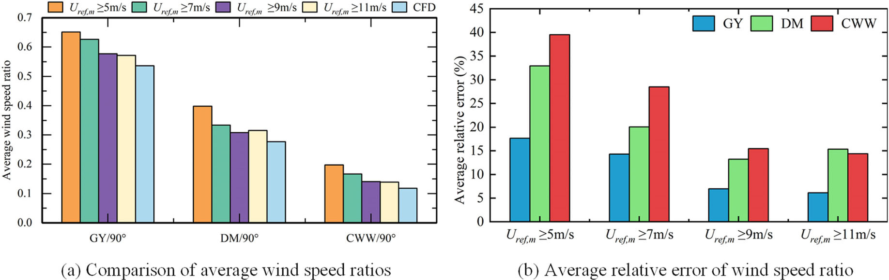

   **图 22** 90° 风向角下 CFD 模拟与实测数据的对比验证结果。

   分图：（a）平均风速比比较，纵轴为平均风速比，横轴为测站／风向，图例依次为参考站实测风速阈值不低于 :math:`5`、 :math:`7`、 :math:`9`、 :math:`11\,\mathrm{m/s}` 及 CFD 结果；（b）风速比平均相对误差，纵轴为误差（ :math:`\%`），横轴为四个风速阈值，蓝、绿、红柱分别表示 GY、DM、CWW。

.. _zhaobs-fig-23:

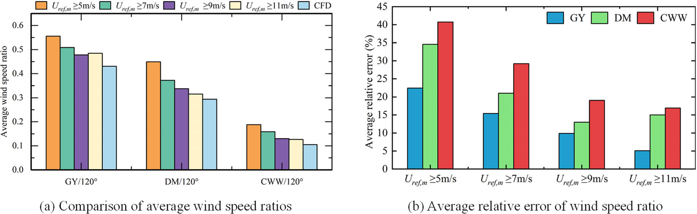

   **图 23** 120° 风向角下 CFD 模拟与实测数据的对比验证结果。

   分图：（a）平均风速比比较，纵轴为平均风速比，横轴为测站／风向，图例依次为参考站实测风速阈值不低于 :math:`5`、 :math:`7`、 :math:`9`、 :math:`11\,\mathrm{m/s}` 及 CFD 结果；（b）风速比平均相对误差，纵轴为误差（ :math:`\%`），横轴为四个风速阈值，蓝、绿、红柱分别表示 GY、DM、CWW。

5 深圳示范应用案例研究
----------------------

5.1 深圳城市风场数据库的分块
~~~~~~~~~~~~~~~~~~~~~~~~~~~~

为验证该框架的可扩展性，选取深圳的一片示范区域。将城市划分为城市区块，对每个区块进行全风向的微尺度 CFD 模拟，风向范围为 :math:`0^\circ\text{–}360^\circ`，间隔为 :math:`15^\circ`，以获得区域内高分辨率风场。本研究探讨城市高分辨率风场数据库的构建框架，以及其在 WebGIS 可视化情景中的应用，为风环境预测奠定基础。

本研究采用 :math:`1\,\mathrm{km}\times1\,\mathrm{km}` 区块尺寸，是计算资源消耗与 CFD 精度之间的折中。不过，也可以将区域划分为 :math:`2\,\mathrm{km}\times2\,\mathrm{km}` 或更大的区块。具体选择主要取决于可用计算资源，例如计算机物理内存和 CPU 性能。

5.2 风场数据库的建立
~~~~~~~~~~~~~~~~~~~~

假设来流稳定，流场空间分布主要由地形、地表粗糙度和建筑布局决定，与来流本身基本无关。因此，采用无量纲风速比和压力系数，构建各个风向角下的微尺度区块风场数据库。通常，需要为 :math:`0^\circ\text{–}360^\circ` 范围内以 :math:`15^\circ` 为间隔的 24 个入流风向，建立区块风场数据库。

风场数据库包括风速比数据库和压力系数数据库。通过求解 Navier–Stokes 方程，获得每个网格单元的风速和压力结果。从本质上说，CFD 模拟风速结果是一张包含单元中心坐标、风速、压力和其他物理参数的表。对于风速比数据库，将 ASCII 格式的 CFD 模拟结果处理为包含五列的 \*.txt 文件，五列分别为 :math:`x`、 :math:`y`、 :math:`z`、风向和平均风速比。以 :math:`90^\circ` 风向角模拟结果为例，风场数据库中风速比数据库的数据存储格式见表 9。对于压力系数数据库，将 ASCII 格式的 CFD 模拟结果处理为 \*.txt 文件，包含建筑编号、中心经度、中心纬度、 :math:`x`、 :math:`y`、 :math:`z` 和压力系数。 :math:`x`、 :math:`y`、 :math:`z` 是建筑表面网格点的坐标，即风压测点位置。压力系数数据库的数据存储格式见表 10。至此，微尺度区块的初始风场数据库建立完成，可用于后续程序开发，例如基于 Cesium 的高分辨率城市风场 WebGIS 可视化平台二次开发。单个区块的 CFD 模拟约需 27 小时，数据处理与文件写入还需要额外约 4 小时。在实际应用中，使用大规模计算服务器集群可以显著减少数据准备时间。

.. _zhaobs-table-9:

.. list-table:: 表 9 风速比的存储格式
   :header-rows: 1
   :class: longtable

   * - 节点
     - 经度
     - 纬度
     - z（m）
     - 风向角（°）
     - 风速比
   * - 1
     - 114.120893
     - 22.549721
     - 31.38
     - 90
     - 0.3231
   * - 2
     - 114.121049
     - 22.549846
     - 31.38
     - 90
     - 0.2562
   * - 3
     - 114.121081
     - 22.549658
     - 31.39
     - 90
     - 0.2502
   * - 4
     - 114.121020
     - 22.549620
     - 31.39
     - 90
     - 0.3240

.. _zhaobs-table-10:

.. list-table:: 表 10 风压系数的存储格式
   :header-rows: 1
   :class: longtable

   * - 建筑编号
     - 经度
     - 纬度
     - x（m）
     - y（m）
     - z（m）
     - 风压系数
   * - 01
     - 114.120893
     - 22.549721
     - 886.53
     - 530.14
     - 35.18
     - 0.8142
   * - 01
     - 114.120893
     - 22.549721
     - 902.89
     - 543.62
     - 35.18
     - 0.7984
   * - 01
     - 114.120893
     - 22.549721
     - 905.79
     - 522.75
     - 35.18
     - 0.8254
   * - 01
     - 114.120893
     - 22.549721
     - 899.46
     - 518.69
     - 35.18
     - 0.7568

表 10 中重复填写的建筑编号与中心经纬度，在原表中为四行共享的合并单元格。表 9 的节点编号为额外索引列；正文所说的五列不包含该索引。

关于数据库更新，本研究提出的计算框架依靠高分辨率城市建筑模型进行风场模拟。如果城市环境只发生细微改变，例如局部改造或少量新增建筑，其对整体风场结构的影响通常局限于邻近区域，而不会显著改变大尺度流动格局（ :ref:`Britter 和 Hanna，2003 <zhaobs-ref-Britter2003>`）。在这种情况下，该框架允许只对受影响建筑区块及其周围区域重新模拟，从而显著降低计算需求，并大幅提高更新效率。

此外，对于建筑更新频率较高的区域，例如快速发展片区或重点改造区域，本研究建议将区域进一步划分为更小的子域，根据各自具体变化，独立而高效地重新模拟。这种策略既能保持数据库整体一致性，又能迅速响应城市形态变化，从而显著提升城市风环境模拟系统的实用性和可扩展性。

5.3 微尺度风场的 WebGIS 可视化
~~~~~~~~~~~~~~~~~~~~~~~~~~~~~~~~~~~~~~~~~~~~

以深圳某一区域的实际建筑模型与分块 CFD 模拟结果为例，本研究基于 CesiumJS 框架，探索 WebGIS 与 CFD 数据的集成。利用 PostgreSQL 数据库以及前后端分离技术构建风速计算平台（ :ref:`Dangermond 和 Goodchild，2020 <zhaobs-ref-Dangermond2020>`）。展示了集成 CFD 数据的三维实景地图信息系统初步可视化结果。

综合风灾平台系统采用 B/S（Browser/Server，浏览器／服务器）架构，由数据层、应用层和展示层构成，计算平台技术框架如图 24 所示。数据层位于风灾平台底部，负责存储城市三维模型、不同风向对应的风场元数据、建筑表面风压元数据，以及重建的表面三维模型等资源。该层主要利用 PostgreSQL 和 PostGIS 插件管理空间地理信息。它支持以二进制格式在数据库中存储 3D Tiles，也可像 glTF 一样，以分散文件形式存储在目录中，供 CesiumJS 开放访问。

应用层包含各种可视化与交互程序代码框架。该层各模块以组件化方式实现，从而增强系统可扩展性与稳定性。该层促进浏览器展示层与数据层之间的数据交换和调度。例如，它能够捕获展示层鼠标事件，通过后端数据调用作出相应响应，还能够提供面向前端的服务，例如用于地图图层的 Web 地图服务（WMS）（ :ref:`Vukotic 和 Goodwill，2011 <zhaobs-ref-Vukotic2011>`）。它是整个技术架构的核心。

展示层根据具体业务需求呈现多源数据。在平台内部，该层实现地图图层的自由选择、添加与移除、地理导航以及视域可视化等功能。此外，它为平台未来扩展提供开放接口，便于以多种形式展示数据。

在风场数据库可视化方面，本研究采用克里金插值方法（ :ref:`Oliver 和 Webster，1990 <zhaobs-ref-Oliver1990>`）和泰森多边形方法（ :ref:`van Kreveld 等，1997 <zhaobs-ref-vanKreveld1997>`），利用 CFD 导出的风速点云生成 WMS 图层。随后，将这些图层上传至 Cesium 平台，初步显示风速图例，实现风速图层可视化。在风压数据库可视化方面，同样将建筑表面风压数据加载到 Cesium 平台。采用滚动球法和筛选泊松法两种表面重建算法，重建建筑表面风压模型。根据三个标准评价这些方法的重建精度与保真度：生成的顶点和面片数量、模型表面形状还原程度以及颜色再现精度。

最后，通过生成 glTF 模型并加载到 Cesium 平台，创建对应 12 个不同风向的建筑风压模型，并将其作为综合风灾平台演示的一部分进行可视化。风速和风压的平台可视化结果见图 25。

.. _zhaobs-fig-24:

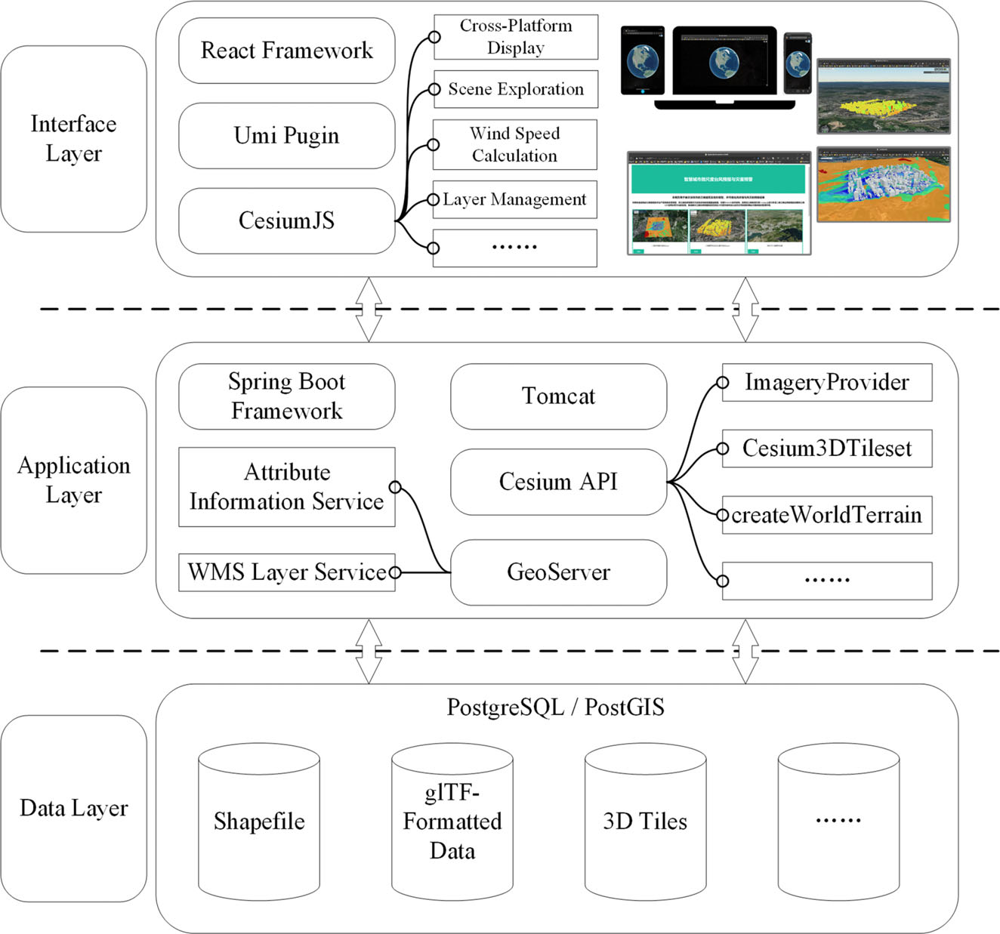

   **图 24** 风灾管理平台的技术框架。

   图内文字：Interface Layer＝界面层；React Framework＝React 框架；Umi Pugin＝Umi 插件（原图拼写如此）；Cross-Platform Display＝跨平台显示；Scene Exploration＝场景浏览；Wind Speed Calculation＝风速计算；Layer Management＝图层管理。Application Layer＝应用层；Spring Boot Framework＝Spring Boot 框架；Attribute Information Service＝属性信息服务；WMS Layer Service＝WMS 图层服务；ImageryProvider＝影像提供器；Cesium3DTileset＝Cesium 三维瓦片集；createWorldTerrain＝创建全球地形。Data Layer＝数据层；Shapefile＝Shapefile 矢量文件；glTF-Formatted Data＝glTF 格式数据；3D Tiles＝三维瓦片。CesiumJS、Tomcat、Cesium API、GeoServer 和 PostgreSQL／PostGIS 为图示软件或接口名称。

.. _zhaobs-fig-25:

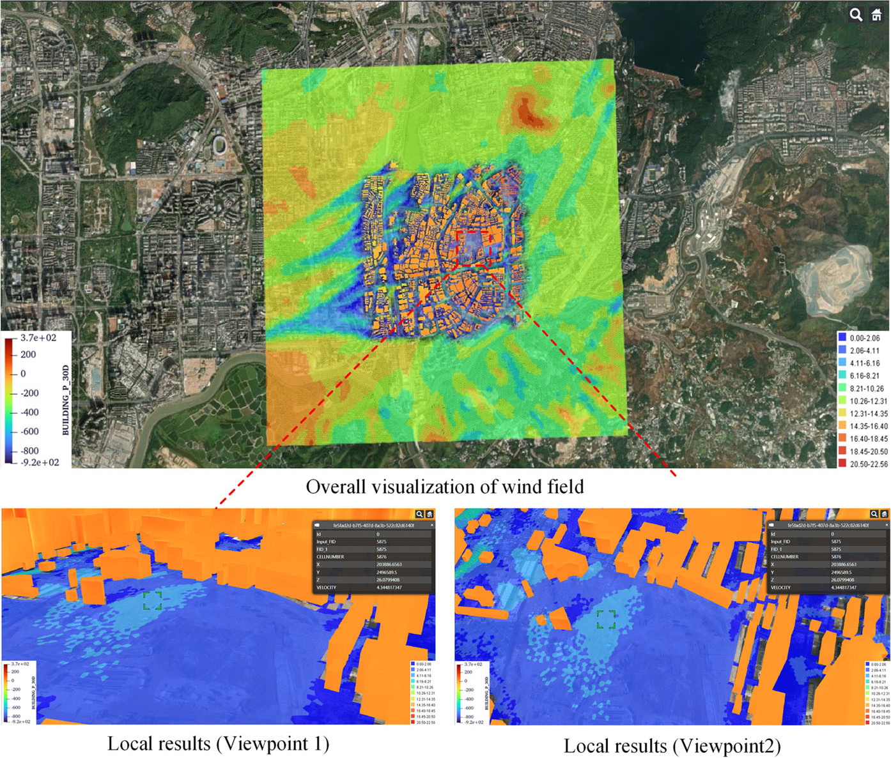

   **图 25** WebGIS 中风速与风压数据的可视化展示。

   图内文字：Overall visualization of wind field＝风场整体可视化；Local results (Viewpoint 1)＝局部结果（视点 1）；Local results (Viewpoint 2)＝局部结果（视点 2）。弹窗中的 CELLNUMBER、X、Y、Z、VELOCITY 分别表示网格单元编号、三个坐标分量和速度；左右色标及局部视图均予以保留。

5.4 行人安全与结构荷载预警
~~~~~~~~~~~~~~~~~~~~~~~~~~

在城市地区，某些结构部位或构件，例如幕墙、屋面、广告牌和路灯，对风荷载特别敏感，在强风或台风条件下极易损坏。这些设施被称为风敏感基础设施，即承灾体。可通过灾后统计调查识别承灾体，随后采用基于可靠度的设计标准，确保结构抗力 :math:`R` 大于风荷载 :math:`S`。然而，在实际中，结构承受的荷载服从具有内在随机性的概率分布；当施加荷载的概率分布曲线与设计抗力的概率分布曲线重叠时，交叠区域表示失效域。在该区域内，实际荷载超过设计抗力，可能导致结构失效。

但是，传统标准利用简化公式确定风荷载，往往忽视周边建筑的遮挡或放大效应。因此，本研究提出的框架考虑周边建筑的影响，包括邻近结构引起的涡旋和加速效应可能导致的结构荷载增加。通过分块 CFD 模拟，建立更详细、更贴近实际的建筑风荷载数据库。随后，根据式（10）计算承灾体的风险因子模型。再将承灾体划分为安全、较安全、较不安全和不安全四个风灾风险等级（图 26）。

.. math::

   F=\frac{S_{\mathrm{code}}-S_{\mathrm{database}}}{S_{\mathrm{code}}} \qquad (10)

式中， :math:`F` 为风险因子，用于量化规范规定荷载与模拟实际荷载之间的偏差。 :math:`S_{\mathrm{code}}` 为从设计规范或标准中获得的设计风荷载或参考风压。 :math:`S_{\mathrm{database}}` 为从基于 CFD 的风场数据库中得到的实际或模拟风荷载或风压。

在台风等强风事件发生前，以气象机构预测的强度等级作为输入。该框架能够快速重建建筑风荷载，并计算承灾体的脆弱性模型。通过与标准设计值比较，可迅速识别高风险区域。这使风致结构损伤实时预警成为可能（图 26）。

对于行人安全，本研究还建立了包含城市风场与建筑荷载的数据库。在台风事件中，使用预测台风强度，并结合附近历史气象观测，重建城市风场。采用 Weibull 分布分析观测风速数据，这是一种被广泛接受的风速概率模型（ :ref:`Holmes 等，2007 <zhaobs-ref-Holmes2007>`）。根据风的统计特征，本研究采用超阈值（Peak-Over-Threshold，POT）方法评估行人舒适度类别（ :ref:`Willemsen 和 Wisse，2007 <zhaobs-ref-Willemsen2007>`）。并根据式（11），利用平均风速计算超越概率（ :ref:`MOHURD，2012 <zhaobs-ref-MOHURD2012>`； :ref:`MOHURD，2014 <zhaobs-ref-MOHURD2014>`）。随后根据表 11 确定行人舒适度类别和安全等级，从而实时、快速识别对行人有危险的区域。

.. math::

   P_\theta\left(\overline V_{\mathrm{ped}}>V_{\mathrm{THR}}\right)=A_\theta\cdot\exp\left[-\left(\frac{V_{\mathrm{THR}}-\mu_\theta}{c_\theta}\right)^{k_\theta}\right] \qquad (11)

式中， :math:`\overline V_{\mathrm{ped}}` 为行人高度平均风速（ :math:`\mathrm{m/s}`）， :math:`V_{\mathrm{THR}}` 为引起不舒适或危险的风速阈值（ :math:`\mathrm{m/s}`）， :math:`P_\theta` 为风速超过 :math:`V_{\mathrm{THR}}` 的累积概率， :math:`A_\theta` 为风向角 :math:`\theta` 的出现频率， :math:`c_\theta` 为概率分布函数的尺度参数， :math:`k_\theta` 为形状参数， :math:`\mu_\theta` 为位置参数。

.. _zhaobs-table-11:

.. list-table:: 表 11 显示风对人体影响的扩展陆地蒲福风级表
   :header-rows: 1
   :class: longtable

   * - 舒适度类别
     - 最大风速：52 次／年
     - 最大风速：12 次／年
     - 最大风速：1 次／年
   * - I
     - 3.6
     - 5.4
     - 15.2
   * - II
     - 5.4
     - 7.6
     - 15.2
   * - III
     - 7.6
     - 9.9
     - 15.2
   * - IV
     - 9.9
     - 12.5
     - 15.2
   * - V
     - 不满足上述标准
     - 不满足上述标准
     - 不满足上述标准

表 11 的原始英文图题把 Beaufort 拼作 Beauport；原表“最大风速”栏没有印出单位。V 类的判据在原表中为跨列合并单元格。

.. _zhaobs-fig-26:

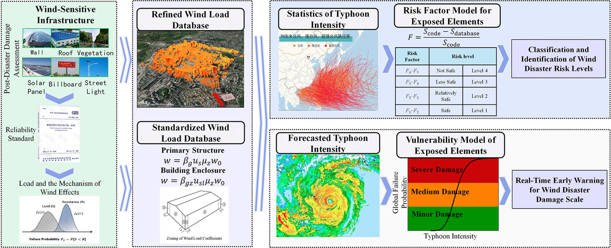

   **图 26** 建筑风灾预警流程。

   图内文字：Post-Disaster Damage Assessment＝灾后损伤评估；Wind-Sensitive Infrastructure＝风敏感基础设施；Wall、Roof、Vegetation、Solar Panel、Billboard、Street Light 分别为墙体、屋面、植被、太阳能板、广告牌、路灯；Reliability Standard＝可靠度标准；Load and the Mechanism of Wind Effects＝荷载与风作用机理；Load (S)＝荷载；Resistance (R)＝抗力。Refined Wind Load Database＝精细化风荷载数据库；Standardized Wind Load Database＝标准化风荷载数据库；Primary Structure＝主体结构；Building Enclosure＝建筑围护结构；Zoning of Wind Load Coefficients＝风荷载系数分区。Statistics of Typhoon Intensity＝台风强度统计；Risk Factor Model for Exposed Elements＝承灾体风险因子模型；Classification and Identification of Wind Disaster Risk Levels＝风灾风险等级划分与识别。Forecasted Typhoon Intensity＝预测台风强度；Vulnerability Model of Exposed Elements＝承灾体脆弱性模型；Global Failure Probability＝整体失效概率；Typhoon Intensity＝台风强度；Severe／Medium／Minor Damage 分别为严重／中等／轻微损伤；Real-Time Early Warning for Wind Disaster Damage Scale＝风灾损伤程度实时预警。

图 26 的风险分级小表译文如下；原图只给出阈值符号，未提供数值：

.. list-table:: 图 26 内嵌表：风险因子与风险等级
   :header-rows: 1
   :widths: 30 40 30

   * - 风险因子区间
     - 风险状态
     - 等级
   * - :math:`F_4\text{–}F_5`
     - 不安全
     - 4 级
   * - :math:`F_3\text{–}F_4`
     - 较不安全
     - 3 级
   * - :math:`F_2\text{–}F_3`
     - 较安全
     - 2 级
   * - :math:`F_1\text{–}F_2`
     - 安全
     - 1 级

图 26 中主体结构与建筑围护结构的无编号公式分别录为：

.. math::

   w=\beta_g u_s\mu_z w_0,\qquad
   w=\beta_{gz}u_{s1}\mu_z w_0.

图中风险因子公式与式（10）相同。左下角“失效概率”的原图公式录为：

.. math::

   P_f=P(S<R).

.. note::

   原文差异说明：图 26 中两条荷载公式的符号按图面保留，原文未在此给出这些系数的定义；失效概率小图写作 :math:`P(S<R)`，而本节正文将失效描述为荷载超过抗力，二者方向不一致。本页不擅自调换不等号。该图给出的是预警方案与示意关系，没有给出风险阈值的标定或真实预警准确率验证。

6 结论与未来工作
----------------

以深圳某一区域为案例，通过整合气象站观测和 CFD 模拟数据，建立了城市风场数据库。主要研究结果总结如下。

(i) 风场数据以风速比和风压系数形式存储为数据库，使目标区域风速和风压能够被快速检索。此外，通过分别创建风速与建筑表面风压可视图层，将风场数据在 WebGIS 平台中进行可视化，并在网站上取得了令人满意的展示效果，说明该框架可为基础尺度台风预警与城市规划提供参考。

(ii) 利用 GIS 数据快速生成研究区域内规则建筑与地形的几何拓扑。在研究区域周围设置过渡区，考虑不同过渡区长度 :math:`X_L` 对核心区内风场精度的影响，最终确定：当过渡区长度增至核心区最高建筑高度 :math:`H_{\max}` 的 3 倍或 4 倍时，风场不再出现显著变化；因此，为获取核心区风场数据，考虑延伸至 :math:`4H_{\max}` 过渡区范围内的建筑和地形影响。考虑计算资源消耗，也可以选择 :math:`3H_{\max}` 的方案。

(iii) 提出了一种分块 CFD 模拟方法，将整个场景划分为均匀的 :math:`1\,\mathrm{km}\times1\,\mathrm{km}` 区域，并对各区域开展 CFD 模拟，获取研究区风场数据。通过比较相邻区块共享边界上的风场数据，验证了不同区块间数据的连续性。同时利用气象站数据，证明采用该 CFD 模拟方法得到的风场数据具有较高精度。

不过，本研究仍存在一些局限。首先，CFD 模拟没有考虑行人风高度处的公交站、植被等小型基础设施，而这些设施会对行人高度风场产生一定影响。其次，随着研究区域扩大，网格数量和计算消耗迅速增加，进行 LES 需要更多物理内存。

参考文献
--------

.. _zhaobs-ref-Aboshosha2015a:

Aboshosha H, Bitsuamlak G, El Damatty A (2015a). LES of ABL flow in the built-environment using roughness modeled by fractal surfaces. Sustainable Cities and Society, 19: 46–60.

.. _zhaobs-ref-Aboshosha2015b:

Aboshosha H, Elshaer A, Bitsuamlak GT, et al. (2015b). Consistent inflow turbulence generator for LES evaluation of wind-induced responses for tall buildings. Journal of Wind Engineering and Industrial Aerodynamics, 142: 198–216.

.. _zhaobs-ref-Alavi2024:

Alavi F, Moosavi AA, Sameni A, et al. (2024). Numerical simulation of wind flow characteristics over a large-scale complex terrain: A computational fluid dynamics (CFD) approach. City and Environment Interactions, 22: 100142.

.. _zhaobs-ref-Bali2003:

Bali TG (2003). The generalized extreme value distribution. Economics Letters, 79: 423–427.

.. _zhaobs-ref-Blocken2012:

Blocken B, Janssen WD, van Hooff T (2012). CFD simulation for pedestrian wind comfort and wind safety in urban areas: General decision framework and case study for the Eindhoven University campus. Environmental Modelling & Software, 30: 15–34.

.. _zhaobs-ref-Blocken2015:

Blocken B (2015). Computational Fluid Dynamics for urban physics: Importance, scales, possibilities, limitations and ten tips and tricks towards accurate and reliable simulations. Building and Environment, 91: 219–245.

.. _zhaobs-ref-BlockenEtAl2015:

Blocken B, van der Hout A, Dekker J, et al. (2015). CFD simulation of wind flow over natural complex terrain: Case study with validation by field measurements for Ria de Ferrol, Galicia, Spain. Journal of Wind Engineering and Industrial Aerodynamics, 147: 43–57.

.. _zhaobs-ref-Britter2003:

Britter RE, Hanna SR (2003). Flow and dispersion in urban areas. Annual Review of Fluid Mechanics, 35: 469–496.

.. _zhaobs-ref-Britter2007:

Britter R, Schatzmann M (2007). Model evaluation guidance and protocol document: COST action 732 Quality assurance and improvement of microscale meteorological models. COST Association.

.. _zhaobs-ref-Dangermond2020:

Dangermond J, Goodchild MF (2020). Building geospatial infrastructure. Geo-spatial Information Science, 23: 1–9.

.. _zhaobs-ref-Dhiman2024:

Dhiman A (2024). Nearest neighbour search method for 3 D data mapping of CFD data: Steady state thermal analysis. Linköping University.

.. _zhaobs-ref-Du2020:

Du Y, Blocken B, Pirker S (2020). A novel approach to simulate pollutant dispersion in the built environment: Transport-based recurrence CFD. Building and Environment, 170: 106604.

.. _zhaobs-ref-Feehan2024:

Feehan CJ, Filbee-Dexter K, Thomsen MS, et al. (2024). Ecosystem damage by increasing tropical cyclones. Communications Earth & Environment, 5: 674.

.. _zhaobs-ref-Franke2004:

Franke J, Hirsch C, Jensen A, et al. (2004). Recommendations on the use of CFD in predicting pedestrian wind environment. In: COST Action C14. COST Office.

.. _zhaobs-ref-Gousseau2011:

Gousseau P, Blocken B, Stathopoulos T, et al. (2011). CFD simulation of near-field pollutant dispersion on a high-resolution grid: A case study by LES and RANS for a building group in downtown Montreal. Atmospheric Environment, 45: 428–438.

.. _zhaobs-ref-Haghroosta2014:

Haghroosta T, Ismail WR, Ghafarian P, et al. (2014). The efficiency of the Weather Research and Forecasting (WRF) model for simulating typhoons. Natural Hazards and Earth System Sciences, 14: 2179–2187.

.. _zhaobs-ref-Hall1969:

Hall C (1969). Bicubic interpolation over triangles. Journal of Mathematics and Mechanics, 19: 1–11.

.. _zhaobs-ref-Holmes2007:

Holmes JD, Paton C, Kerwin R (2007). Wind Loading of Structures. Boca Raton, FL, USA: CRC Press.

.. _zhaobs-ref-Huang2022:

Huang M, Wang Q, Liu M, et al. (2022). Increasing typhoon impact and economic losses due to anthropogenic warming in Southeast China. Scientific Reports, 12: 14048.

.. _zhaobs-ref-Jeanjean2015:

Jeanjean APR, Hinchliffe G, McMullan WA, et al. (2015). A CFD study on the effectiveness of trees to disperse road traffic emissions at a city scale. Atmospheric Environment, 120: 1–14.

.. _zhaobs-ref-Kim2024:

Kim S, Alinejad N, Jung S, et al. (2024). The effect of open-to-suburban terrain transition on wind pressures on a low-rise building. Journal of Building Engineering, 85: 108651.

.. _zhaobs-ref-Liu2017:

Liu S, Pan W, Zhang H, et al. (2017). CFD simulations of wind distribution in an urban community with a full-scale geometrical model. Building and Environment, 117: 11–23.

.. _zhaobs-ref-Liu2018:

Liu S, Pan W, Zhao X, et al. (2018). Influence of surrounding buildings on wind flow around a building predicted by CFD simulations. Building and Environment, 140: 1–10.

.. _zhaobs-ref-Mirzaei2021:

Mirzaei PA (2021). CFD modeling of micro and urban climates: Problems to be solved in the new decade. Sustainable Cities and Society, 69: 102839.

.. _zhaobs-ref-MOHURD2012:

MOHURD (2012). GB50009: Load Code for the Design of Building Structures. Ministry of Housing and Urban-Rural Construction of China. (in Chinese)

.. _zhaobs-ref-MOHURD2014:

MOHURD (2014). JSJ/T 338: Standard for Wind Tunnel Test of Buildings and Structures. Ministry of Housing and Urban-Rural Construction of China. (in Chinese)

.. _zhaobs-ref-Ng2011:

Ng E, Yuan C, Chen L, et al. (2011). Improving the wind environment in high-density cities by understanding urban morphology and surface roughness: A study in Hong Kong. Landscape and Urban Planning, 101: 59–74.

.. _zhaobs-ref-Nicoud1999:

Nicoud F, Ducros F (1999). Subgrid-scale stress modelling based on the square of the velocity gradient tensor. Flow, Turbulence and Combustion, 62: 183–200.

.. _zhaobs-ref-Oliver1990:

Oliver MA, Webster R (1990). Kriging: A method of interpolation for geographical information systems. International Journal of Geographical Information Systems, 4: 313–332.

.. _zhaobs-ref-Schatzmann2011:

Schatzmann M, Leitl B (2011). Issues with validation of urban flow and dispersion CFD models. Journal of Wind Engineering and Industrial Aerodynamics, 99: 169–186.

.. _zhaobs-ref-Shen2017:

Shen J, Gao Z, Ding W, et al. (2017). An investigation on the effect of street morphology to ambient air quality using six real-world cases. Atmospheric Environment, 164: 85–101.

.. _zhaobs-ref-Shingare2013:

Shingare PP, Kale SS (2013). Review on digital elevation model. International Journal of Modern Engineering Research (IJMER), 3: 2412–2418.

.. _zhaobs-ref-Shirzadi2023:

Shirzadi M, Tominaga Y (2023). Computational fluid dynamics analysis of pollutant dispersion around a high-rise building: Impact of surrounding buildings. Building and Environment, 245: 110895.

.. _zhaobs-ref-Simoes2016:

Simões T, Estanqueiro A (2016). A new methodology for urban wind resource assessment. Renewable Energy, 89: 598–605.

.. _zhaobs-ref-Song2024:

Song J, Chen W, Hu G, et al. (2024). Wind loads on a square high-rise building under aerodynamic interference effects of a short building in close proximity. Physics of Fluids, 36: 075154.

.. _zhaobs-ref-Tabib2021:

Tabib MV, Midtbø KH, Rasheed A, et al. (2021). A nested multi-scale model for assessing urban wind conditions: Comparison of Large Eddy Simulation versus RANS turbulence models when operating at the finest scale of the nesting. Journal of Physics: Conference Series, 2018: 012039.

.. _zhaobs-ref-Talwar2024:

Talwar T, Yuan C (2024). Impact of natural urban terrain on the pedestrian wind environment in neighborhoods: A CFD study with both wind and buoyancy-driven scenarios. Building and Environment, 261: 111746.

.. _zhaobs-ref-Terry2020:

Terry E, Xu Q (2020). Wind design in smart cities. Landscape Architecture, 27(5): 64–70. (in Chinese)

.. _zhaobs-ref-TojaSilva2018:

Toja-Silva F, Kono T, Peralta C, et al. (2018). A review of computational fluid dynamics (CFD) simulations of the wind flow around buildings for urban wind energy exploitation. Journal of Wind Engineering and Industrial Aerodynamics, 180: 66–87.

.. _zhaobs-ref-Tominaga2013:

Tominaga Y, Stathopoulos T (2013). CFD simulation of near-field pollutant dispersion in the urban environment: A review of current modeling techniques. Atmospheric Environment, 79: 716–730.

.. _zhaobs-ref-Tominaga2018:

Tominaga Y, Stathopoulos T (2018). CFD simulations of near-field pollutant dispersion with different plume buoyancies. Building and Environment, 131, 128–139.

.. _zhaobs-ref-vanKreveld1997:

van Kreveld M, Nievergelt J, Roos T, et al. (1997). Algorithmic Foundations of Geographic Information Systems. Berlin: Springer.

.. _zhaobs-ref-Vukotic2011:

Vukotic A, Goodwill J (2011). Apache Tomcat 7. Berkeley, CA, USA: Apress.

.. _zhaobs-ref-Willemsen2007:

Willemsen E, Wisse JA (2007). Design for wind comfort in The Netherlands: Procedures, criteria and open research issues. Journal of Wind Engineering and Industrial Aerodynamics, 95: 1541–1550.

.. _zhaobs-ref-Wu2019:

Wu Z, Jiang C, Deng B, et al. (2019). Numerical investigation of Typhoon Kai-tak (1213) using a mesoscale coupled WRF-ROMS model. Ocean Engineering, 175: 1–15.

.. _zhaobs-ref-Yin2022:

Yin S, Lin X, Yang S (2022). Characteristics of rainstorm in Fujian induced by typhoon passing through Taiwan Island. Tropical Cyclone Research and Review, 11: 50–90.

.. _zhaobs-ref-Zhang2022:

Zhang Y, Cao S, Zhao L, et al. (2022). A case application of WRF-UCM models to the simulation of urban wind speed profiles in a typhoon. Journal of Wind Engineering and Industrial Aerodynamics, 220: 104874.

.. _zhaobs-ref-Zhao2023:

Zhao F, Wang X, Zhang J, et al. (2023). Study on fine simulation method of wind field in complex terrain. In: Proceedings of the 8th International Conference on Power and Renewable Energy (ICPRE).

.. _zhaobs-ref-Zheng2021:

Zheng X, Yang J (2021). CFD simulations of wind flow and pollutant dispersion in a street canyon with traffic flow: Comparison between RANS and LES. Sustainable Cities and Society, 75: 103307.

完整引用
--------

:student-first-author:`Zhao Peisheng`；**Li Chao**；Yang Chao；Han Zhichen；Chen Lingwei；Hu Gang；Li Lixiao；Wang Xiaolu\*。A fast prediction framework for urban microscale wind environment based on precomputed CFD database[J]. **Building Simulation**, 2026, 19(2): 333–357. `https://doi.org/10.1007/s12273-025-1379-7 <https://doi.org/10.1007/s12273-025-1379-7>`_。

收录信息见 :ref:`WOEAI 学术成果页对应条目 <ref-zhao2026-BS>`。
