.. _paper-note-ref-zheng2025-OE:

.. role:: student-first-author

三角形半潜式 10 MW 风机等效静力波浪荷载评估：论文精解
======================================================================

精简版微信公众号文章：待发布

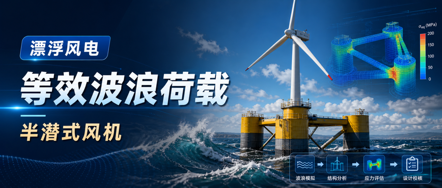

.. contents:: 本页目录
   :local:
   :depth: 2

论文信息
----------

原文题名：Evaluating equivalent static wave loads for a delta-shaped semi-submersible 10-MW wind turbine。

作者与单位对应关系： :student-first-author:`Shunyun Zheng` :sup:`a,b` ；Shangpei Liu :sup:`a` ；Chao Li :sup:`a,d,*` ；Xiaolu Wang :sup:`c` ；Jinping Ou :sup:`a,d` 。

a. 哈尔滨工业大学（深圳）土木与环境工程学院，中国深圳
b. 明阳智慧能源集团股份公司海洋与漂浮工程技术中心，中国中山
c. 东莞理工学院环境与土木工程学院，中国东莞
d. 哈尔滨工业大学（深圳）广东省土木工程智能与韧性结构重点实验室，中国深圳

原文通讯作者脚注 \*：哈尔滨工业大学（深圳）土木与环境工程学院，中国深圳；电子邮箱：lichaosz@hit.edu.cn （C. Li）。上述信息按论文发表时的署名保留。

论文类型：研究论文。期刊：Ocean Engineering，332（2025），121336。DOI：`10.1016/j.oceaneng.2025.121336 <https://doi.org/10.1016/j.oceaneng.2025.121336>`_ 。收稿：2024 年 9 月 18 日；修回：2025 年 3 月 28 日；录用：2025 年 4 月 21 日；在线发表：2025 年 5 月 8 日。

摘要
------

传统设计波方法广泛应用于油气平台，用于确定等效静力波浪荷载；然而，由于平台独特的几何构型以及兆瓦级风机产生的显著耦合效应，将该方法直接应用于漂浮式风机时存在局限。为有效解决这一问题，本文对设计波方法进行改进和扩展，分别以 50 年重现期的长期特征荷载响应和应力分量响应为等效目标，确定同时考虑水压力、系泊导缆孔力和塔底荷载的等效静力波浪荷载。本文对设计波方法与改进方法进行全面比较。对这些方法预测波浪荷载作用下三角形半潜式平台应力的有效性进行严格验证。结果表明，设计波方法由于考虑过于简化，缺乏实际适用性。由长期特征荷载确定的等效静力波浪荷载精度更高、计算需求也更大，而由长期应力分量确定的荷载精度最高，但最为耗时。总体而言，建议根据设计过程的具体阶段选择适当方法。

关键词
--------

半潜式平台；风机；设计波方法；等效静力波浪荷载；长期响应。

1 引言
--------

面对环境与能源危机，开发可再生、可持续能源是一条有效途径。近年来，风能得到了充分开发（ :ref:`Sahu, 2018 <zheng2025-ref-27>` ； :ref:`WWEA, 2021 <zheng2025-ref-39>` ； :ref:`International Renewable Energy Agency, 2020 <zheng2025-ref-15>` ），全球众多风电场已经投入商业发电（ :ref:`Díaz and Guedes Soares, 2020 <zheng2025-ref-8>` ）。为了获取更丰富的风能，风电从陆地走向海洋、从浅海走向深海的发展趋势不可逆转；相应地，风机支撑结构将从固定式转向漂浮式（ :ref:`Natarajan et al., 2019 <zheng2025-ref-23>` ； :ref:`Roddier et al., 2010 <zheng2025-ref-26>` ； :ref:`Yeter et al., 2019 <zheng2025-ref-43>` ； :ref:`Zhao et al., 2022 <zheng2025-ref-45>` ）。一些漂浮式风机原型已用于示范工程，另一些仍处于设计阶段（ :ref:`Uzunoglu and Guedes Soares, 2020 <zheng2025-ref-31>` ）。漂浮式风机目前仍处于发展阶段，尚未成熟地大规模推广应用。目前，大多数研究主要关注风机的动力响应，例如运动、塔底荷载、叶片荷载和系泊力等（ :ref:`Li et al., 2021 <zheng2025-ref-20>` ； :ref:`Wang et al., 2020 <zheng2025-ref-35>` ； :ref:`Wang et al., 2022 <zheng2025-ref-36>` ； :ref:`Wang et al., 2022a <zheng2025-ref-37>` ），以及发电效率和伺服控制（ :ref:`Li et al., 2022 <zheng2025-ref-21>` ； :ref:`Shi et al., 2022 <zheng2025-ref-28>` ）。有关漂浮式风机系统强度评估与结构设计的报道较少，尤其缺乏等效静力荷载研究。

目前，漂浮式风机结构强度分析方面的相关研究并不丰富。Souza 等采用时域模拟比较三种 Spar 型 20 MW 漂浮式风机的动力响应，并使用梁单元计算和比较 Spar 平台的疲劳特征及轴向应力（ :ref:`Souza and Bachynski-Polić, 2022 <zheng2025-ref-30>` ）。然而，半潜式平台的结构几何更复杂，需要更精细的有限元建模分析。Aubault 等对三立柱 WindFloat 概念在随机波浪作用下的结构应力进行了分析（ :ref:`Roddier et al., 2010 <zheng2025-ref-26>` ； :ref:`Aubault et al., 2009 <zheng2025-ref-2>` ）。Wang 等研究了 10 MW 半潜式风机的运动与荷载响应，并提取平台截面的内力，基于 Euler–Bernoulli 梁理论进一步分析应力分布（ :ref:`Wang and Moan, 2024a <zheng2025-ref-32>` ； :ref:`Wang and Moan, 2024b <zheng2025-ref-33>` ； :ref:`Wang et al., 2023 <zheng2025-ref-38>` ）。与有限元分析相比，该方法难以准确预测平台任意位置的复杂应力响应。Hu 等提出一种基于准静态过程的漂浮式风机一体化结构强度分析方法，以 Spar 型漂浮式风机为研究对象，解决风机结构建模和应力组合方面的技术问题（ :ref:`Hu et al., 2016 <zheng2025-ref-12>` ）。类似地，也有研究采用准静态方法，考察用于支撑 2.6 MW 垂直轴风机的三浮体平台的结构强度（ :ref:`Liu et al., 2018 <zheng2025-ref-22>` ）。Lee 等提出一种用于屈曲与极限强度评估的时域结构分析方法，并将其应用于韩国海上风电场项目中 15 MW 漂浮式海上风机平台的评估（ :ref:`Lee et al., 2023 <zheng2025-ref-17>` ）。

虽然上述有关漂浮平台强度分析的研究方法与结论有益于漂浮式风机系统设计，但动力或准静态强度分析需要考虑随时间变化的荷载历程，消耗大量计算时间。然而，在结构设计阶段，特别是在初步设计早期，平台结构的细节和尺寸可能需要反复调整，因此合适而高效的静力强度评估方法可能尤其受到设计人员青睐。已有一些学者开展海上风机漂浮平台的静力强度分析。Lefebvre 的研究使用静力有限元程序计算 NREL 5 MW 风机半潜式支撑结构的最大应力和局部位移，完成了漂浮支撑结构的初步设计（ :ref:`Lefebvre and Collu, 2012 <zheng2025-ref-18>` ）。Raed 等采用基于有限元模型的静力强度评估，对 WindFloat 漂浮平台进行详细设计，并研究不同荷载同时作用对结构应力的影响（ :ref:`Raed et al., 2013 <zheng2025-ref-25>` ）。但是，由于静力荷载确定方式的合理性问题，上述静力强度分析可能都不够完善。静力荷载通常只取若干选定工况中动力荷载历程的最大值，没有考虑漂浮式风机结构的长期极值响应及荷载的变异性。有必要考虑结构长期性能和环境条件，充分、深入地研究合理的等效静力荷载。

鉴于当前海上风机漂浮支撑结构等效静力荷载研究不足，本文主要且特别着眼于等效静力波浪荷载（equivalent static wave loads，ESWLs）的确定方法。目前，海上风机的漂浮支撑结构主要由油气（Oil & Gas，O&G）行业成熟的海上平台设计发展而来，应当吸收和借鉴漂浮平台的相关设计经验与理论。在海上油气行业中，半潜式平台结构设计荷载通常由波浪控制（ :ref:`Xu et al., 2018 <zheng2025-ref-40>` ），并使用相关标准所推荐的设计波方法确定，因为该方法简单、高效（ :ref:`Wang et al., 2017 <zheng2025-ref-34>` ； :ref:`Huo et al., 2018 <zheng2025-ref-13>` ）。设计波方法的基本思想，是将随机不规则波等效为静态作用于漂浮结构的最不利规则波，从而显著提高强度分析效率。等效设计波方法包括确定性设计波方法、短期响应设计波方法和长期响应设计波方法。其中，长期响应设计波方法最受重视且最为重要；它充分考虑长期观测的海况环境条件，并通过概率统计确定设计波参数，所考虑的因素最为全面、合理。目前，长期响应设计波方法的研究主要针对海上油气漂浮平台和船舶（ :ref:`Hauteclocque et al., 2012 <zheng2025-ref-11>` ； :ref:`Derbanne et al., 2013 <zheng2025-ref-6>` ； :ref:`ABS, 2016 <zheng2025-ref-1>` ； :ref:`DNV, 2015 <zheng2025-ref-9>` ）。Derbanne 等研究了各类漂浮结构的设计波选择，包括散货船、浮式储存再气化装置（FSRU）、半潜式平台和非常规浮式生产储卸油装置（FPSO）（ :ref:`Hauteclocque et al., 2012 <zheng2025-ref-11>` ； :ref:`Derbanne et al., 2013 <zheng2025-ref-6>` ）。一项有趣且特殊的研究将等效设计波方法用于漂浮摆式波能转换装置（ :ref:`Sohn et al., 2016 <zheng2025-ref-29>` ）。然而，长期响应设计波方法在漂浮式风机中的应用研究鲜有报道。Park 的研究利用加速度与机舱推力的长期极值响应确定主导荷载参数，并通过直接强度分析评估风机漂浮平台（ :ref:`Park and Choung, 2023 <zheng2025-ref-24>` ）。Cao 等研究了通用 1.5 MW 风机箱形平台的静力分析，并根据设计波方法选择对应不同响应特征的设计波（ :ref:`Cao et al., 2018 <zheng2025-ref-5>` ）。Li 等确定了四立柱风机平台结构设计的等效静力波浪荷载（ :ref:`Li et al., 2019 <zheng2025-ref-19>` ）。Yang 等基于等效设计波和结构准静态分析方法，考虑腐蚀损伤的影响，评估半潜式漂浮风机的屈服强度（ :ref:`Yang et al., 2023 <zheng2025-ref-42>` ）。Dong 等使用短期响应设计波方法确定设计波条件，完成 NREL 5 MW 半潜式风机漂浮平台的强度校核（ :ref:`Dong et al., 2024 <zheng2025-ref-10>` ）。传统设计波方法可能不适合直接用于漂浮式风机的结构设计。风机结构通常较为细长且重心较高。波浪引起的漂浮平台运动还可能放大塔底荷载对平台的影响，系泊导缆孔力也不应被忽视。因此，应谨慎修改传统设计波方法，并对其精度和实用性进行详细分析、评估与验证。

本文研究用于海上风机半潜式平台强度评估与结构设计的 ESWL，比较并讨论基于油气漂浮平台标准、长期特征荷载响应（long term characteristic load responses，LTCLRs）和长期应力分量响应（long term stress component responses，LTSCRs）的三种等效静力方法的合理性与有效性。研究对象为支撑 DTU 10 MW 风机的三角形半潜式平台。首先建立水动力模型、耦合动力模型和有限元模型，求取波浪诱导荷载、结构单元应力以及平台关键截面特征荷载的响应幅值算子（response amplitude operators，RAOs）。随后，结合谱分析与统计外推，计算特征荷载和结构应力分量的长期响应极值，分别确定标准中的传统设计波工况，以及基于 LTSCR 和 LTCLR 的 ESWL 工况。最后，在设计波工况和 ESWL 工况下，对半潜式平台进行有限元分析，通过与 LTSCR 比较评估精度，并评估半潜式平台的结构强度。本研究结论可为漂浮式风机结构设计提供参考和经验。

2 系统描述
------------

本文研究三角形半潜式 10 MW 风机系统，如图 1 所示。该系统由一台 10 MW 参考风机、半潜式平台和系泊系统组成。下面三节将详细介绍各组成部分，并介绍安装场址。

.. _zheng2025-fig-01:

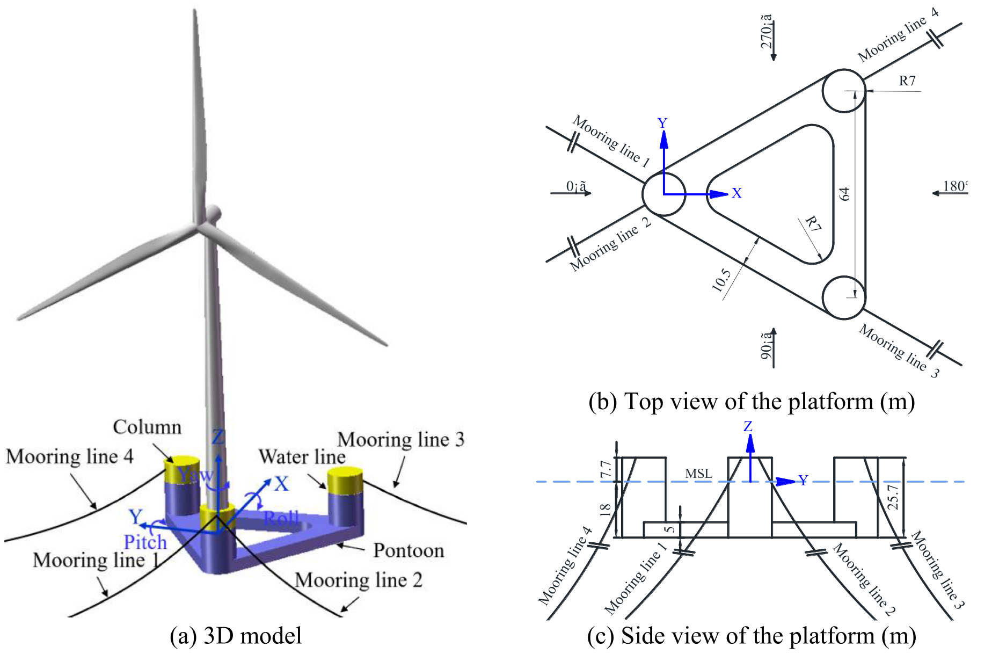

   **图 1** 三角形半潜式 10 MW 风机系统。

   （a）三维模型；（b）平台俯视图，尺寸单位 m；（c）平台侧视图，尺寸单位 m。Column 为立柱，Pontoon 为浮筒，Mooring line 1–4 为系泊线 1–4，Water line 为水线，MSL 为平均海平面；Roll、Pitch、Yaw 分别为横摇、纵摇和艏摇。平面图给出 64 m、10.5 m 和 R7 的尺寸标记，侧视图给出 7.7 m、18 m、5 m 和 25.7 m。原图部分角度符号存在字体显示异常，正文中的 0°、90°、180°、270° 波向定义保持不变。

2.1 10 MW 风机
~~~~~~~~~~~~~~~~

DTU 10 MW 参考风机受到 NREL 5 MW 参考风机的启发，已在学术文献中得到广泛研究（ :ref:`Jonkman et al., 2009 <zheng2025-ref-16>` ）。其主要参数见表 1（ :ref:`Bak et al., 2013 <zheng2025-ref-3>` ）。该风机专为国际电工委员会（IEC）1A 类风况下的海上场址设计（ :ref:`IEC 61400-1, 2019 <zheng2025-ref-14>` ）。此外，它采用水平轴、传统三叶片、顺时针旋转的上风向设计，配备变速和集体变桨控制系统。

.. list-table:: 表 1 DTU 10 MW 参考风机主要参数（ :ref:`Bak et al., 2013 <zheng2025-ref-3>` ）
   :header-rows: 1
   :class: longtable

   * - 参数
     - 数值
   * - 风况等级
     - IEC 1A 类
   * - 转子朝向与旋转方向
     - 顺时针旋转、上风向
   * - 控制方式
     - 变速、集体变桨
   * - 切入、额定、切出风速
     - 5 m/s、11.4 m/s、25 m/s
   * - 额定功率
     - 10 MW
   * - 叶片数量
     - 3
   * - 转子直径、轮毂直径
     - 178.3 m、5.6 m
   * - 轮毂高度
     - 119.0 m
   * - 传动系统
     - 中速、多级齿轮箱
   * - 最小、最大转子转速
     - 6.0 rpm、9.6 rpm
   * - 最大叶尖速度
     - 90.0 m/s
   * - 轮毂悬伸量
     - 7.1 m
   * - 主轴倾角
     - 5.0°
   * - 转子预锥角
     - −2.5°
   * - 叶片预弯
     - 3.332 m
   * - 转子、机舱、塔架质量
     - 227,962 kg、446,036 kg、628,442 kg

2.2 三角形半潜式平台与系泊系统
~~~~~~~~~~~~~~~~~~~~~~~~~~~~~~~~

图 1 所示的三角形半潜式平台支撑 10 MW 风机，并利用悬链线系泊系统限制漂浮式风机系统的位移。平台呈等边三角形，针对 130 m 目标水深重新设计。三个立柱分别位于等边三角形的三个顶点，风机安装在其中一根立柱上。各立柱底部由浮筒连接，浮筒构成等边三角形的三条边。浮筒的竖向投影面积足以提供充分的垂向阻尼，因此该平台无需设置垂荡板。悬链线系泊系统由四根悬链线组成，其方向与相应浮筒的轴线平行。安装风机的立柱导缆孔连接两根系泊线，另外两根立柱的各个导缆孔只连接一根系泊线。平台采用板厚 40.0 mm 的高强度结构钢 S355。S355 钢的材料参数为：弹性模量 :math:`E=210\,\mathrm{GPa}` ，泊松比 :math:`\nu=0.3` ，密度 :math:`\rho=7850\,\mathrm{kg/m^3}` 。

为确定三角形半潜式风机系统的最低建造成本和最小累积疲劳损伤，采用 Palmgren–Miner 线性损伤假设计算累积疲劳损伤。使用文献（ :ref:`Zhou et al., 2023 <zheng2025-ref-47>` ）提出的优化设计方法求解优化问题，确定半潜式平台与系泊系统的主要尺寸参数。根据敏感性分析，优化设计变量包括立柱半径、浮筒长度、吃水深度、系泊线长度和锚固距离。主要优化参数详见图 1、表 2 和表 3。优化设计过程必须设置约束，以保证优良、可靠的动力性能。这些约束涉及结构固有频率、平台运动响应、机舱加速度、系泊张力，以及塔底和导缆孔累积疲劳损伤。为避免不利的结构共振，结构固有频率必须避开转子旋转频率和波浪频率。为保护电缆，平台平移位移不得超过水深的 20%（ :ref:`Benassai et al., 2018 <zheng2025-ref-4>` ）。此外，为保证正常发电和结构安全，平台倾斜角不应超过 10°。机舱加速度反映传动系统承受的荷载。通常要求机舱加速度不超过 :math:`0.3g` （ :ref:`Yu et al., 2022 <zheng2025-ref-44>` ），其中 :math:`g` 为重力加速度。塔底和系泊导缆孔的累积疲劳损伤不得超过 1，系泊张力不得超过其抗拉强度。除固有频率外，其他所有约束均考虑整个服役期（25 年）海洋环境中最不利的条件。10 MW 漂浮式半潜风机系统的主要动力性能见表 4。

.. list-table:: 表 2 三角形半潜式平台主要参数
   :header-rows: 1
   :class: longtable

   * - 参数
     - 数值
   * - 水深（m）
     - 130
   * - 吃水（m）
     - 18
   * - 塔底接口高于平均海平面的高度（m）
     - 7.7
   * - 重心（m）
     - (0, 0, −12.91)
   * - 排水体积（m³）
     - 1.77 × 10⁴
   * - 平台质量（kg）
     - 1.59 × 10⁷
   * - 绕重心横摇转动惯量  :math:`I_{xx}` （kg·m²）
     - 1.19 × 10¹⁰
   * - 绕重心纵摇转动惯量  :math:`I_{yy}` （kg·m²）
     - 7.17 × 10⁹
   * - 绕重心横摇–艏摇惯量积  :math:`I_{xz}` （kg·m²）
     - 4.45 × 10⁸
   * - 绕重心艏摇转动惯量（kg·m²）
     - 1.80 × 10¹⁰

.. list-table:: 表 3 系泊系统主要参数
   :header-rows: 1
   :class: longtable

   * - 参数
     - 数值
   * - 系泊线数量
     - 4
   * - 各系泊线之间夹角
     - 60° 或 120°
   * - 导缆孔高于平均水位（MWL）的高度（m）
     - 7.7
   * - 锚点低于平均水位的深度（m）
     - 130
   * - 平台中心至导缆孔的半径（m）
     - 44
   * - 导缆孔至锚点的距离（m）
     - 670
   * - 系泊线长度（m）
     - 700
   * - 外径（cm）
     - 25
   * - 单位长度质量（kg/m）
     - 383.76

原表第一、二行参数名称分别附有“(m)”单位，但数量和角度并非长度；这里保留原数值，将单位冲突单独说明。

.. list-table:: 表 4 三角形半潜式风机系统主要性能
   :header-rows: 1
   :class: longtable

   * - 参数
     - 数值
     - 阈值
   * - 塔架固有频率（Hz）
     - 0.52
     - >0.48 且 <0.60
   * - 纵荡周期（s）
     - 71.42
     - ≥50.00
   * - 垂荡周期（s）
     - 20.05
     - ≥15.00
   * - 纵摇周期（s）
     - 26.28
     - ≥20.00
   * - 平移位移（m）
     - 20.02
     - ≤26.00
   * - 倾斜角（°）
     - 8.13
     - ≤10.00
   * - 机舱加速度（m/s²）
     - 2.92
     - ≤2.94
   * - 系泊张力（kN）
     - 3885
     - ≤23040
   * - 塔底累积疲劳损伤
     - 0.5953
     - ≤1
   * - 系泊导缆孔累积疲劳损伤
     - 0.0022
     - ≤1

图 1 为平台建立了右手坐标系，原点位于平台平均水线面的中心。该坐标系中的波向定义如下：波浪沿 :math:`x` 轴正方向传播时，波向为 0°；类似地，波浪沿 :math:`y` 轴正方向传播时，波向为 90°。因此，当波向从 :math:`x` 轴正方向逆时针转向 :math:`y` 轴正方向时，波向角从 0° 开始增大。

2.3 数值模型
~~~~~~~~~~~~~~

在 ANSYS AQWA 中建立三角形半潜式平台的水动力模型，基于三维辐射绕射势流理论计算入射波、绕射波和辐射波荷载。该软件能够提供耦合动力分析所需的频域水动力系数，并将结构湿表面的水动力压力分布传递给有限元模型。

在 OpenF2A 中建立三角形半潜式风机的耦合动力模型。Yang 等基于 FAST 7 和 ANSYS AQWA，提出了漂浮式风机系统耦合动力模拟框架 F2A（ :ref:`Yang et al., 2020 <zheng2025-ref-41>` ）。然而，OpenFAST 是 FAST 7 的重大更新版本，增加了许多风机系统分析的新理论和新方法，特别是在气动模拟方面。本研究通过软件二次开发和算法重新编译，将 F2A 中的 FAST 7 更新为 OpenFAST，实现 OpenFAST 与 ANSYS AQWA 之间的时域数据交互和耦合模拟，形成 OpenF2A，以获得更高精度的数值结果（见图 2）。OpenF2A 集成了 OpenFAST 的气动–伺服–弹性效应分析能力，以及 ANSYS AQWA 的水动力和系泊动力学数值计算能力，弥补 OpenFAST 无法模拟和分析特殊漂浮式风机系统的不足。本研究使用 OpenF2A 进行结构模拟，研究规则波作用下风机系统的动力响应。具体而言，利用该工具提取漂浮平台运动、系泊导缆孔力和塔底荷载的 RAO；这些量对于确定 ESWL 工况和开展基于有限元模型的结构强度评估至关重要。

.. _zheng2025-fig-02:

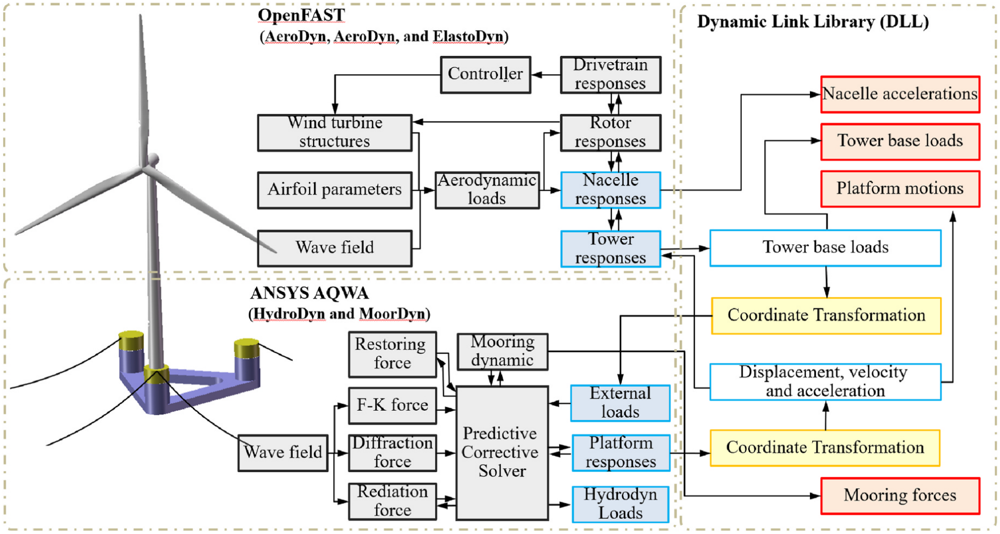

   **图 2** 基于 OpenFAST 和 ANSYS AQWA 的 OpenF2A 耦合框架。

   图中各模块依次包含控制器、风机结构、翼型参数、波场、气动荷载、传动系统响应、转子响应、机舱响应和塔架响应；水动力侧包含恢复力、F-K 力、绕射力、辐射力、系泊动力学、预测–校正求解器、外荷载、平台响应和水动力荷载。动态链接库（DLL）通过坐标变换交互塔底荷载及位移、速度、加速度，并输出机舱加速度、塔底荷载、平台运动和系泊力。原图 OpenFAST 下的 AeroDyn 重复出现，ANSYS AQWA 下还印有 HydroDyn and MoorDyn；这些为原图标签，未据此改写正文的软件分工。

在 ANSYS APDL 中建立半潜式平台的有限元模型。平台外壁、内部腹板框架和舱壁采用壳单元 Shell 181 建模；该单元非常适合模拟薄壁至中等厚度壁结构，能够给出准确的变形结果。此外，平台内部压载采用集中质量单元 Mass 71 模拟，不考虑其对结构力学性能的贡献。细化单元划分有利于提高有限元模拟精度。图 3 给出了规则波静态作用下的单元收敛分析，波浪参数为有效波高 8 m、谱峰周期 13 s、波向 90° 和相位 300°。当单元数量达到 10000 时，结构应力分量最大值趋于稳定，收敛精度达到 98%。综合考虑计算效率与精度，最终模型包含 87,729 个节点和 109,284 个单元（见图 4）。模型对自由状态的漂浮结构采用惯性释放边界条件，通过计算加速度自动维持平衡。如图 5 所示，有限元模型在结构模拟中承受多类荷载，包括波浪诱导的湿表面水压力、系泊导缆孔力、塔底荷载和惯性荷载。湿表面水压力包括入射波、绕射波、辐射波及静水压力分量。

.. note::

   原文第 2.3 节文字写“10000”，而图 3 横轴为单元数量乘 :math:`10^4` ，绘出的范围约为 :math:`8\times10^4` 至 :math:`13\times10^4` 。此处保留原文数值和原图，不擅自统一。

.. _zheng2025-fig-03:

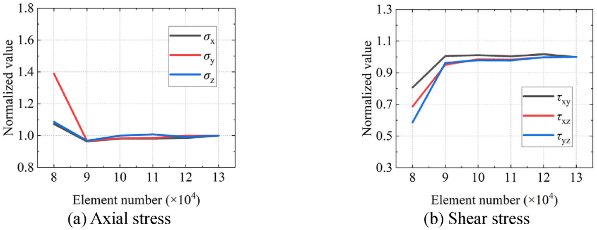

   **图 3** 单元数量收敛性检验。

   （a）轴向应力；（b）剪应力。横轴为单元数量（乘 10⁴），纵轴为归一化值；图例分别对应三个正应力和三个剪应力分量。

.. _zheng2025-fig-04:

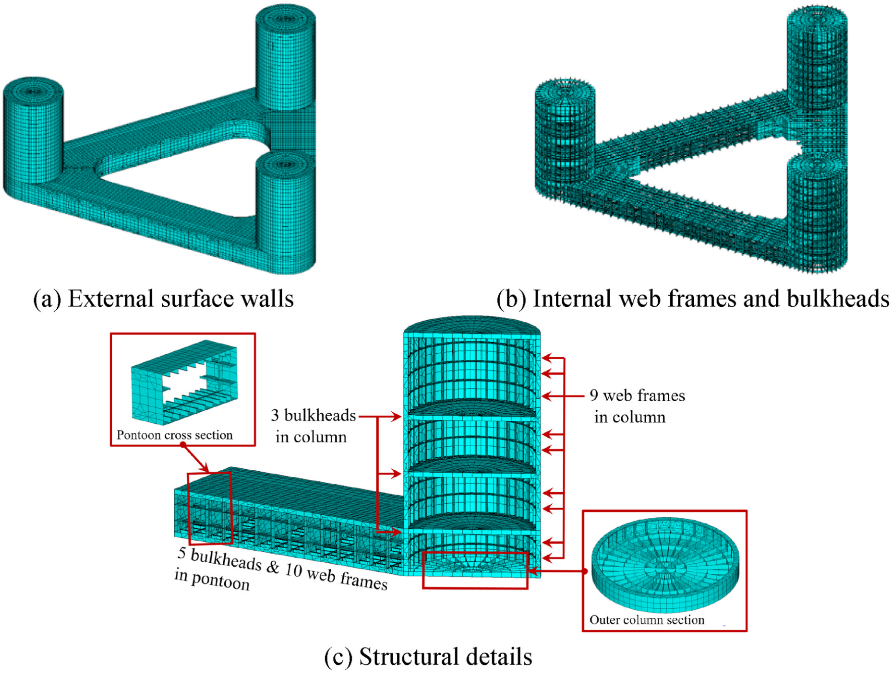

   **图 4** 10 MW 风机三角形半潜式平台的结构有限元模型。

   （a）外表面壁板；（b）内部腹板框架与舱壁；（c）结构细节。图内标注包括浮筒截面、外立柱截面、立柱内 3 道舱壁和 9 道腹板框架，以及浮筒内 5 道舱壁与 10 道腹板框架。

.. _zheng2025-fig-05:

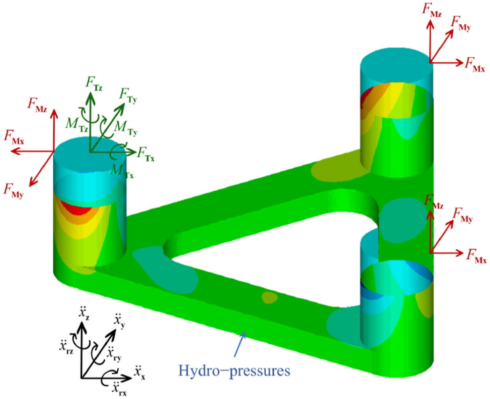

   **图 5** 作用于 10 MW 风机三角形半潜式平台的荷载。

   Hydro-pressures 表示水压力；红色箭头为三向系泊导缆孔力，绿色箭头为塔底三向力与三向力矩，黑色坐标示意为三个平动和三个转动加速度。

数值模型的精度对于研究结果的正确性至关重要。本文开展模型试验，以验证数值模拟的精度。三角形半潜式风机系统模型试验在哈尔滨工业大学风洞–水槽实验室（WTWF-HIT）进行。WTWF-HIT 是配备水槽的闭式回流矩形截面风洞。风洞尺寸为 6.0 m（宽）× 3.6 m（高）× 50 m（长），水槽尺寸为 5.0 m（宽）× 4.5 m（深）× 50 m（长）。如图 6 所示，三角形半潜式风机系统模型按 1:70 比例制作。风机塔底荷载由安装在塔底的防水测力天平测量，可同步测试三个正交方向的力和力矩；另布置加速度计测量机舱加速度。六自由度运动采用主要由跟踪球和高精度红外相机构成的立体视觉测量系统捕捉。试验模型周围共安装 6 台红外相机，各立柱顶部布置覆有反光材料的球形跟踪球。通过精细标定，立体视觉测量系统的误差可以控制在 1 mm 以内。限于篇幅，详细试验配置见文献（ :ref:`Zheng et al., 2023 <zheng2025-ref-46>` ）。

.. _zheng2025-fig-06:

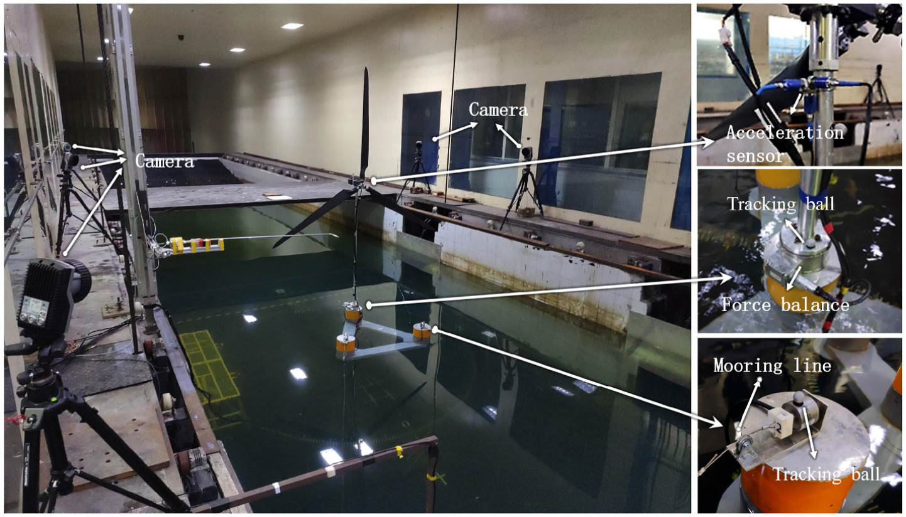

   **图 6** WTWF-HIT 中半潜式风机系统的试验布置。

   Camera 为相机，Acceleration sensor 为加速度传感器，Tracking ball 为跟踪球，Force balance 为测力天平，Mooring line 为系泊线。

本文设计了规则波试验，以研究三角形半潜式风机系统的耐波性能，并验证数值模型的精度。规则波周期为 5–27 s，间隔 2 s，波向为 0° 和 180°。图 7 比较了平台运动、塔底荷载和机舱加速度的 RAO 结果。总体而言，数值模拟与试验结果吻合良好，各动力响应随波浪周期的变化趋势一致。本文数值模型具有较好的精度与可靠性。纵荡 RAO 通常随波浪周期增大而增大，而垂荡与纵摇 RAO 随波浪周期呈现先增大、再减小、再增大的趋势。由于共振效应，垂荡 RAO 在周期 21 s 时急剧增大；随着波浪周期继续增大，垂荡 RAO 缓慢下降。纵摇 RAO 在短周期波浪下增长较慢，但随着波浪周期增大，其增长率显著提高。在具有较长波浪周期的极端海况下，应注意纵摇共振响应所引起的倾覆风险。仅在规则波作用下，机舱加速度主要由平台纵荡与纵摇加速度控制。塔底剪力和弯矩包括两部分：风机惯性力，以及纵摇角引起的风机重力分量。塔底剪力、弯矩和机舱加速度 RAO 的变化趋势具有明显相关性。塔底剪力、弯矩和机舱加速度的 RAO 在波浪周期 7 s 处达到局部极值，此时 RAO 主要由纵荡响应控制。在 21–27 s 波浪周期范围内，塔底荷载 RAO 的增长率显著高于机舱加速度；这种差异主要源于长周期波浪下较大纵摇角引起的重力分量增大。

.. _zheng2025-fig-07:

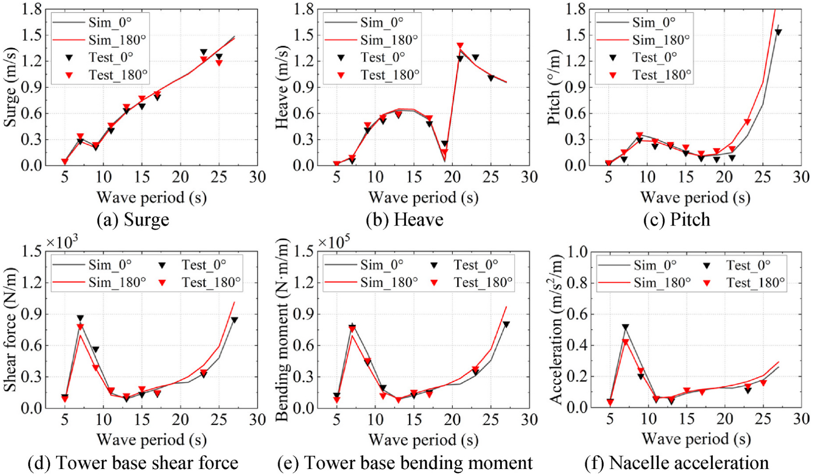

   **图 7** 三角形半潜式风机系统的响应幅值算子。

   （a）纵荡；（b）垂荡；（c）纵摇；（d）塔底剪力；（e）塔底弯矩；（f）机舱加速度。横轴均为波浪周期（s）；Sim 表示数值模拟，Test 表示试验，分别给出 0° 和 180° 波向。纵轴保留原图单位：纵荡和垂荡标为 m/s，纵摇为 °/m，剪力为 N/m，弯矩为 N·m/m，加速度为 m/s²/m；原图前两项 m/s 与位移 RAO 的通常量纲不同，未擅自修改。

2.4 场址与环境条件
~~~~~~~~~~~~~~~~~~~~

如图 8 所示，假定三角形半潜式 10 MW 风机系统位于南海东经 114°50′、北纬 22°00′ 的场址。该场址的基础数据来自 BMT ARGOSS 提供的 `waveclimate.com <http://waveclimate.com>`_ 。数据库由雷达高度计、雷达散射计和成像雷达测得，涵盖以东经 114°50′、北纬 22°00′ 为中心、50 km 范围内的平均波浪参数，并使用浮标测试数据进行了验证和标定。数据集包含 1992–2016 年间以 3 h 间隔采集的 73,056 个样本。对波浪参数进行列表和分析，表 5、表 6 给出了跨越 25 年的波浪散布数据，表内数值表示事件次数。需要注意，波浪散布数据是一个复杂的三维数据集，每组有效波高、谱峰周期和波向组合对应一个事件次数。为便于展示，本文用表 5 和表 6 简化呈现。

.. _zheng2025-fig-08:

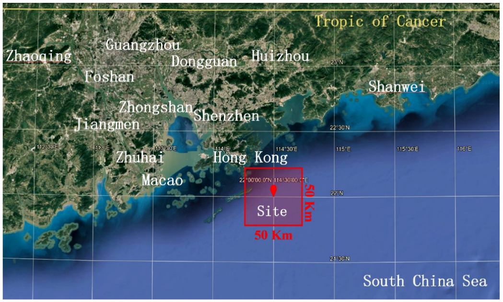

   **图 8** 假定的安装场址。

   图中标示肇庆、广州、佛山、东莞、惠州、汕尾、中山、深圳、江门、珠海、香港、澳门、北回归线、南海，以及场址周围的 50 km 范围。原图场址坐标文字标为 22°00′00.0″N、114°30′00.0″E，而第 2.4 节正文写东经 114°50′、北纬 22°00′；两处经度差异按原文保留。

3 ESWL 的确定方法
-------------------

本节介绍基于结构长期响应确定 ESWL 工况的方法。这些方法对于解决海上漂浮式风机系统结构设计中的工程问题至关重要。首先详细说明油气行业标准定义的等效设计波方法。此外，考虑风机平台与油气平台之间的结构几何差异，以及平台、风机和系泊系统之间的强耦合效应，本文改进传统设计波方法，形成更适用的基于 LTSCR 和 LTCLR 的 ESWL 方法。

3.1 标准中的等效设计波方法
~~~~~~~~~~~~~~~~~~~~~~~~~~~~

对于海洋结构，波浪荷载效应具有随机性和复杂的动力特征。在传统油气行业与船舶工程领域，推荐按照 DNV-RP-C103（ :ref:`DNV, 2015 <zheng2025-ref-9>` ）所述的设计波方法评估结构强度。该方法将不规则波的动力问题转化为规则波的准静态问题，确定能够有效评估结构强度的 ESWL。这一规则波的参数，包括波浪周期、方向、波高和相位，被视为设计波参数。设计波方法的流程见图 9。下面详细介绍该方法，包括等效目标 RAO 的计算、短期和长期统计计算，以预测等效目标的极值并确定 ESWL 工况。

首先建立水动力模型，使用三维辐射绕射势流理论确定作用于结构湿表面单元的波浪水压力 RAO。需要注意，波浪水压力 RAO 包括 Froude–Krylov（F-K）力、绕射力、辐射力和静水力分量。单元上的静水压力与浸没深度有关，由平台运动姿态确定。计算 RAO 时应减去初始平衡状态的常量。同时，最终结构设计必须考虑这些常量。在不同波浪周期和波向的水压力作用下，通过结构分析获得等效目标 RAO。

随后，根据随机波谱和频率响应函数（RAO），可以得到等效目标的响应谱，见式（1）。

.. math::

   S_R(\omega)=|RAO(\omega)|^2S_w(\omega)\qquad (1)

其中， :math:`S_R(\omega)` 为结构波浪诱导目标响应谱， :math:`S_w(\omega)` 为随机波谱， :math:`RAO(\omega)` 为频域分析的频率响应函数， :math:`\omega` 为波浪频率。结构目标响应的方差可按下式计算：

.. math::

   \sigma_R^2=\int_0^\infty S_R(\omega)\,\mathrm{d}\omega\qquad (2)

接下来，在海洋工程中，通常认为 Rayleigh 分布近似对单峰谱情形有效（ :ref:`ABS, 2016 <zheng2025-ref-1>` ； :ref:`DET NORSKE VERITAS, 2011 <zheng2025-ref-7>` ）。因此，特定波浪条件下目标响应极值的短期累积分布函数（CDF）用 Rayleigh 分布表示为：

.. math::

   F_{R\mid H_s,T_p,\theta}^{\mathrm{ST}}(x_R\mid H_s,T_p,\theta)
   =1-\exp\left(-\frac{x_R^2}{2\sigma_R^2}\right)\qquad (3)

其中， :math:`F_{R\mid H_s,T_p,\theta}^{\mathrm{ST}}(x_R\mid H_s,T_p,\theta)` 为波浪条件 :math:`(H_s,T_p,\theta)` 下目标响应极值 :math:`x_R` 的短期 CDF； :math:`H_s` 、 :math:`T_p` 和 :math:`\theta` 分别为有效波高、谱峰周期和波向。

长期结果可以通过对可能经历的海况范围直接积分短期结果得到。目标响应极值 :math:`x_R` 的长期 CDF 由下式建立：

.. math::

   \begin{aligned}
   F_R^{\mathrm{LT}}(x_R)
   &=\iiint F_{R\mid H_s,T_p,\theta}^{\mathrm{ST}}(x_R\mid H_s,T_p,\theta)
   f(H_s,T_p,\theta)\,\mathrm{d}H_s\,\mathrm{d}T_p\,\mathrm{d}\theta\\
   &=\sum F_{R\mid H_s,T_p,\theta}^{\mathrm{ST}}(x_R\mid H_s,T_p,\theta)
   f(H_s,T_p,\theta)\,\Delta H_s\,\Delta T_p\,\Delta\theta\\
   &=\sum F_{R\mid H_s,T_p,\theta}^{\mathrm{ST}}(x_R\mid H_s,T_p,\theta)
   P(H_s,T_p,\theta)
   \end{aligned}\qquad (4)

其中， :math:`F_R^{\mathrm{LT}}(x_R)` 为目标响应极值的长期 CDF， :math:`f(H_s,T_p,\theta)` 为环境条件 :math:`(H_s,T_p,\theta)` 的概率密度函数（PDF）， :math:`P(H_s,T_p,\theta)=f(H_s,T_p,\theta)\Delta H_s\Delta T_p\Delta\theta` 为波浪散布数据（表 5、表 6）中该环境条件的发生概率，可直接由特定环境条件 :math:`(H_s,T_p,\theta)` 的事件次数与所有环境条件的总事件次数之比确定。

最后，可以根据指定概率 :math:`Q` 确定长期极值响应 :math:`R_Q` ，见式（5）。根据重现期和观测波浪平均周期，本文分别取 50 年和 7.00 s，利用式（6）可估计重现期内的平均波峰数 :math:`N` ，并取 :math:`Q=1-1/N` 。这一概率对应的结构目标响应 :math:`R_Q` 表示预期重现期内的长期极值。

.. math::

   F_R^{\mathrm{LT}}(R_Q)=Q\qquad (5)

.. math::

   N=\frac{D}{T_x}\qquad (6)

其中， :math:`D` 为重现期内长期海况的持续时间， :math:`T_x` 为观测波浪的平均周期。

.. note::

   原文在式（5）前后三次将 :math:`Q` 称为“超越概率”（exceedance probability），但由 CDF 定义 :math:`F_R^{\mathrm{LT}}(R_Q)=Q` 及 :math:`Q=1-1/N` 可知， :math:`Q` 实为不超越概率，超越概率为 :math:`1-Q` 。此处按原公式区分二者，并保留这一原文术语冲突；50 年是重现期，25 年才是所用海况样本覆盖期。

.. list-table:: 表 5 目标场址 25 年波浪散布数据
   :header-rows: 1
   :class: longtable

   * - 有效波高（m）
     - 谱峰周期 3 s
     - 谱峰周期 4 s
     - 谱峰周期 5 s
     - 谱峰周期 6 s
     - 谱峰周期 7 s
     - 谱峰周期 8 s
     - 谱峰周期 9 s
     - 谱峰周期 10 s
     - 谱峰周期 11 s
     - 谱峰周期 12 s
     - 谱峰周期 13 s
   * - 0.5
     - 866
     - 2818
     - 5236
     - 6560
     - 1563
     - 2893
     - 1101
     - 404
     - 168
     - 102
     - 59
   * - 1.5
     - 25
     - 1925
     - 4136
     - 10100
     - 5829
     - 10502
     - 3151
     - 939
     - 239
     - 185
     - 162
   * - 2.5
     - 0
     - 2
     - 295
     - 1596
     - 2068
     - 5337
     - 1534
     - 997
     - 157
     - 46
     - 16
   * - 3.5
     - 0
     - 0
     - 0
     - 23
     - 113
     - 846
     - 249
     - 153
     - 53
     - 16
     - 5
   * - 4.5
     - 0
     - 0
     - 0
     - 1
     - 2
     - 95
     - 111
     - 64
     - 29
     - 19
     - 4
   * - 5.5
     - 0
     - 0
     - 0
     - 0
     - 0
     - 10
     - 59
     - 51
     - 19
     - 9
     - 3
   * - 6.5
     - 0
     - 0
     - 0
     - 0
     - 0
     - 0
     - 5
     - 26
     - 20
     - 7
     - 3
   * - 7.5
     - 0
     - 0
     - 0
     - 0
     - 0
     - 0
     - 1
     - 11
     - 14
     - 5
     - 3
   * - 8.5
     - 0
     - 0
     - 0
     - 0
     - 0
     - 0
     - 0
     - 0
     - 7
     - 3
     - 2
   * - 9.5
     - 0
     - 0
     - 0
     - 0
     - 0
     - 0
     - 0
     - 0
     - 0
     - 1
     - 1
   * - 10.5
     - 0
     - 0
     - 0
     - 0
     - 0
     - 0
     - 0
     - 0
     - 0
     - 1
     - 1

表内数值为相应有效波高与谱峰周期组合的事件次数。

.. list-table:: 表 6 目标场址 25 年波向分布
   :header-rows: 1
   :class: longtable

   * - 波向
     - 事件次数
     - 波向
     - 事件次数
     - 波向
     - 事件次数
     - 波向
     - 事件次数
   * - 0°
     - 121
     - 90°
     - 13116
     - 180°
     - 4366
     - 270°
     - 13
   * - 10°
     - 248
     - 100°
     - 7815
     - 190°
     - 5788
     - 280°
     - 10
   * - 20°
     - 385
     - 110°
     - 4225
     - 200°
     - 3325
     - 290°
     - 12
   * - 30°
     - 542
     - 120°
     - 1861
     - 210°
     - 1033
     - 300°
     - 16
   * - 40°
     - 762
     - 130°
     - 1305
     - 220°
     - 301
     - 310°
     - 9
   * - 50°
     - 1058
     - 140°
     - 1377
     - 230°
     - 78
     - 320°
     - 15
   * - 60°
     - 1741
     - 150°
     - 1623
     - 240°
     - 49
     - 330°
     - 14
   * - 70°
     - 3523
     - 160°
     - 1801
     - 250°
     - 27
     - 340°
     - 28
   * - 80°
     - 13913
     - 170°
     - 2490
     - 260°
     - 20
     - 350°
     - 46

DNV 标准推荐六种特征荷载作为油气平台设计波方法的等效目标（ :ref:`DNV, 2015 <zheng2025-ref-9>` ）。如图 10 所示，这些目标为整体纵向加速度 :math:`a_x` 、横向加速度 :math:`a_y` 、垂向加速度 :math:`a_z` ，以及关键截面上的分离力 :math:`F_x` 、绕纵向水平轴的扭矩 :math:`M_x` 和横向剪力 :math:`F_y` 。针对本文三角形半潜式 10 MW 风机平台的结构特点，选择图 11 中绘出的 9 个横向截面（TS）和 9 个纵向截面（LS）作为关键截面。特征荷载的方向根据关键截面的局部坐标系定义，作用点为截面形心。局部坐标系的 :math:`x` 轴垂直于截面， :math:`y` 轴和 :math:`z` 轴分别在水平与竖直方向上平行于截面（图 10）。

根据服役场址海洋环境的波浪周期分布，波浪周期取 3–32 s，步长为 1 s，共选择 30 个周期。考虑结构对称性，波向从 0° 至 180° 以 10° 间隔计算，190°–350° 波向的响应通过对称映射获得。采用 JONSWAP 谱表征散布数据中的随机波浪条件，本文研究的重现期为 50 年。

.. _zheng2025-fig-09:

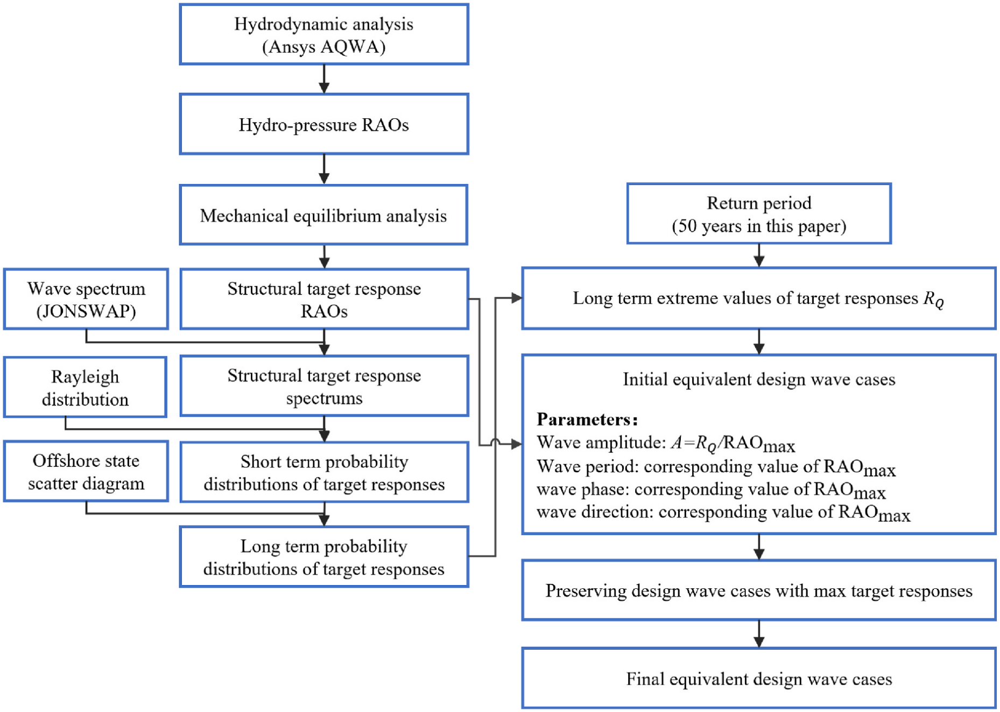

   **图 9** 标准中设计波方法的流程。

   水动力分析（ANSYS AQWA）得到水压力 RAO，经力学平衡分析得到结构目标响应 RAO；结合 JONSWAP 波谱计算结构目标响应谱，以 Rayleigh 分布计算目标响应短期概率分布，再结合海况散布数据计算长期概率分布。重现期取 50 年，得到目标响应长期极值 :math:`R_Q` 。初始等效设计波的波幅为 :math:`A=R_Q/RAO_{\max}` ，波浪周期、相位与方向均取最大 RAO 对应值；保留产生最大目标响应的设计波工况，得到最终等效设计波工况。该波幅关系为图内未编号公式。

.. _zheng2025-fig-10:

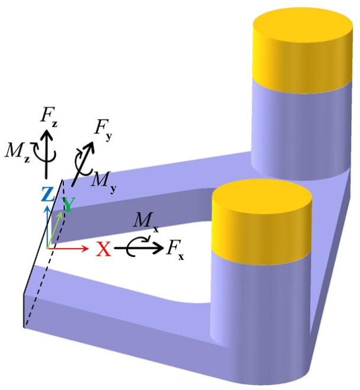

   **图 10** 关键截面特征荷载示例。

   局部坐标系中给出三向力 :math:`F_x,F_y,F_z` 和三向力矩 :math:`M_x,M_y,M_z` ；各轴及力的正方向按原图箭头保留。

3.2 基于 LTSCR 和 LTCLR 的等效方法
~~~~~~~~~~~~~~~~~~~~~~~~~~~~~~~~~~~~

一些研究直接采用传统设计波方法，以关键截面上有限的特征荷载和加速度为等效目标，确定漂浮式风机系统的等效设计波工况，并开展静力强度分析（ :ref:`Cao et al., 2018 <zheng2025-ref-5>` ； :ref:`Li et al., 2019 <zheng2025-ref-19>` ； :ref:`Yang et al., 2023 <zheng2025-ref-42>` ； :ref:`Dong et al., 2024 <zheng2025-ref-10>` ）。但是，与传统油气平台相比，海上风机漂浮平台独特的结构几何特征，可能使这些推荐等效目标不够充分。此外，除了设计波参数，还应在 ESWL 工况中同等考虑波浪诱导的系泊导缆孔力和塔底荷载，因为它们会显著影响结构目标响应。因此，本文修改标准规定的传统设计波方法，发展更全面、有效且实用的 ESWL 方法。

在 DNV 标准设计波方法基础上，本文提出仍以特征荷载作为等效目标的 ESWL 方法。同时，由于结构强度是结构设计的关键考虑因素，为实现高精度等效，有必要使用结构应力响应作为等效目标。这需要一组能够等效代表结构应力响应、特别是结构高应力区域响应的 ESWL 工况。需要注意，结构应力评估可能要求大量耦合有限元模拟，在工程设计中可能相当耗时。综上，本文建立分别以特征荷载和结构应力分量为等效目标的 ESWL 方法。与标准中关于特征荷载的规定不同，本研究将整体三个加速度 :math:`a_x` 、 :math:`a_y` 、 :math:`a_z` ，以及半潜式平台 9 个横向截面和 9 个纵向截面上的六向荷载，作为 ESWL 工况的等效目标（见图 10、图 11）。六向荷载包括三个力，即分离力 :math:`F_x` 、水平剪力 :math:`F_y` 和竖向剪力 :math:`F_z` ，以及绕 :math:`x` 、 :math:`y` 、 :math:`z` 轴的三个力矩，即扭矩 :math:`M_x` 、水平弯矩 :math:`M_y` 和竖向弯矩 :math:`M_z` 。总计以 111 个特征荷载作为等效目标。

为充分考虑半潜式风机系统的长期极限状态，ESWL 方法需要预测长期目标响应极值。分别以结构应力分量和特征荷载作为等效目标，自然形成基于 LTSCR 和 LTCLR 的两种方法。随后，可以针对每个目标响应建立一个具体 ESWL 工况。通过比较分析，利用筛选策略减少 ESWL 工况数量，以确保足够的保守性并简化结构设计。该方法在下面解释，并绘于图 12；相对于传统设计波方法的不同之处用红色突出。

.. _zheng2025-fig-11:

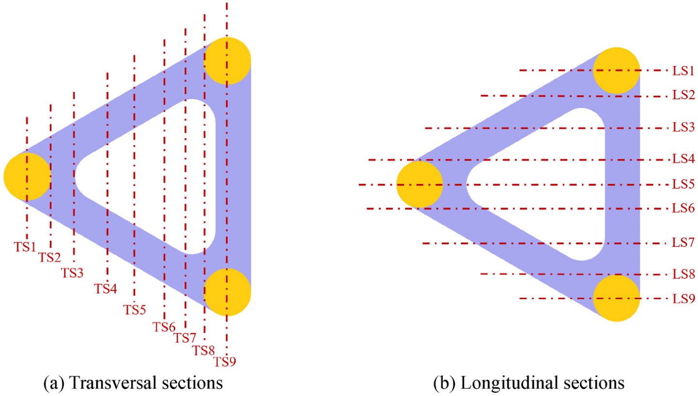

   **图 11** 半潜式平台的关键截面。

   （a）横向截面 TS1–TS9；（b）纵向截面 LS1–LS9。

与传统设计方法一致，针对每种波浪周期和波向组合确定水压力与水动力 RAO。此外，通过耦合动力分析确定系泊导缆孔力和塔底荷载 RAO。一旦确定波浪诱导荷载 RAO，即可通过结构有限元分析或力学平衡计算等效目标响应 RAO。需要强调，评估结构应力分量需要复杂的结构有限元分析，而特征荷载可由简单的力学平衡求得。按照第 3.1 节所述的响应谱分析和统计外推，计算 50 年重现期的长期目标响应极值。ESWL 波幅由长期目标响应极值与最大 RAO 的比值确定。波浪周期、方向和相位取最大 RAO 对应的值。利用前面步骤中已知的 RAO，可以根据每个 ESWL 工况的等效波浪参数，计算水压力、系泊导缆孔力和塔底荷载等波浪诱导荷载。

.. _zheng2025-fig-12:

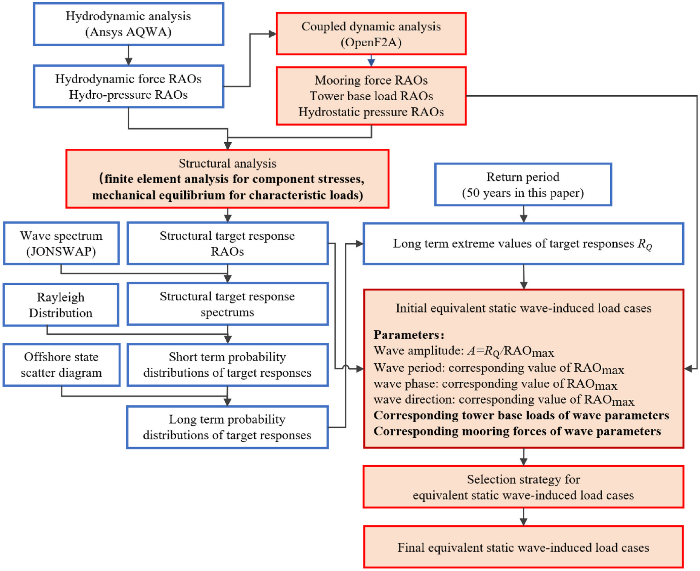

   **图 12** 基于 LTSCR 和 LTCLR 的 ESWL 方法流程。

   水动力分析（ANSYS AQWA）得到水动力和水压力 RAO；耦合动力分析（OpenF2A）得到系泊力、塔底荷载和静水压力 RAO。结构分析对分量应力采用有限元分析，对特征荷载采用力学平衡；由结构目标响应 RAO 和 JONSWAP 谱计算响应谱，再结合 Rayleigh 分布和海况散布数据获得目标响应短期及长期概率分布。取 50 年重现期得到长期目标响应极值 :math:`R_Q` 。初始等效静力波浪诱导荷载工况使用波幅 :math:`A=R_Q/RAO_{\max}` ，波浪周期、相位、方向取最大 RAO 对应值，同时纳入相应波浪参数的塔底荷载和系泊力。最后经筛选策略得到最终 ESWL 工况。红色框为相对于传统设计波方法的新增或修改环节。

通过上述过程可以获得初始 ESWL 工况。但是，无论基于 LTCLR 还是 LTSCR，其 ESWL 工况数量均取决于等效目标数量。原文在此写道，分别生成“基于 LTCLR 的 :math:`87705\times6` 个 ESWL 工况”和“基于 LTSCR 的 111 个 ESWL 工况”。显然，在结构设计中考虑全部 ESWL 工况既不实际也不合理。因此，必须选择并减少特定 ESWL 工况，以简化结构设计与强度评估。下面分别给出基于 LTCLR 和 LTSCR 的筛选策略。

.. note::

   上一段忠实保留了原文第 11 页的两处方法标签，但其顺序与同页下一段及第 4.3、4.4 节相反：111 个特征荷载目标属于 LTCLR；按全部节点六个应力分量构造的大量工况属于 LTSCR。原文此处的 87705 也不同于第 2.3 节的 87729 个节点，本文不猜测差异原因，不据此改写源数据。

对于基于 LTCLR 的 ESWL 方法，共使用 111 个特征荷载生成 111 个 ESWL 工况。由于各特征荷载之间存在相关性，不同特征荷载的 ESWL 工况可能重叠，某些次要工况可能只产生较小响应。因此，需要合并并剔除重叠与次要 ESWL 工况。合并和剔除工况的三项原则如下。

1. 对于波浪周期、方向相同且相位相近的 ESWL 工况，优先保留波高较大的工况，舍弃波高较小的工况。
2. 对于构型相同的关键截面，例如 TS4、TS5 和 TS6，同一种特征荷载对应的 ESWL 工况中，剔除 LTCLR 较小的工况。
3. 如果某一 LTCLR 可由其他 LTCLR 定义的 ESWL 工况表示，则应舍弃由该 LTCLR 确定的 ESWL 工况。例如，如果 TS2 分离力所定义的 ESWL 工况预测得到的 TS5 分离力超过 TS5 长期分离力响应，则应剔除 TS5 分离力定义的 ESWL 工况。

基于 LTSCR 的 ESWL 方法通常采用含数万个单元的结构有限元模型。这要求研究所有单元的应力分量，并生成数万个 ESWL 工况。然而，由于不同结构位置的应力存在相关性，许多 ESWL 工况相似或重复。此外，已经足够安全区域中代表较小应力等效的 ESWL 工况，对结构设计并不重要。因此，关键任务是从所有工况中选取最少数量的有意义 ESWL 工况，在获得满意精度的同时提高结构设计效率。本文提出如下 ESWL 工况筛选策略。

1. 为保证结构安全，选定的 ESWL 工况必须充分覆盖危险区域的 LTSCR。以最大 LTSCR 的 25% 和 50% 为界，将单元分为高应力、中应力和低应力三组。选定 ESWL 工况对高应力单元的应力等效精度必须满足以下条件之一：（a）相对误差不小于 −2.0%；或（b）绝对误差小于 5.5 MPa。需要注意，应力很小时，较小的绝对偏差也可能产生较大的相对误差。
2. 首先选择最大 LTSCR 对应的 ESWL 工况，并估计该工况下的单元应力。然后，在应力等效尚不满足精度要求的单元中，加入最大 LTSCR 所对应的 ESWL 工况。对新选取的 ESWL 工况再次估计单元应力。持续增加剩余不满足精度要求单元中最大 LTSCR 所对应的 ESWL 工况，直到所有高应力单元的应力预测满足精度要求。
3. 后续选取的 ESWL 工况所预测应力可能高于先前工况。检查选定工况产生的单元最大应力，剔除对最大应力没有贡献的 ESWL 工况，最终确定保留的 ESWL 工况。

由于每个单元的应力 RAO 已知，上述筛选策略可以快速执行。这些应力直接根据应力 RAO 推导和分析，无需额外开展复杂的结构有限元计算。

4 等效静力波浪荷载评估
------------------------

本节分析 DTU 10 MW 风机三角形半潜式平台在波浪作用下的 LTSCR。此外，对传统设计波方法和 ESWL 方法的性能进行评估与讨论。

4.1 长期应力分量响应
~~~~~~~~~~~~~~~~~~~~~~

本文研究 DTU 10 MW 风机半潜式平台的结构应力分量。通过不同规则波作用下的结构有限元模拟，获得所有单元节点六个应力分量的 RAO。随后，考虑随机波浪条件的发生概率，将这些波浪诱导结构应力分量统计外推至 50 年长期极值。

图 13 给出了平台 50 年 LTSCR 的分布。结构总体上具有良好的波浪诱导荷载抵抗能力，但少数局部危险区域出现明显较高的应力，主要集中在浮筒和安装风机的立柱上部。此外，浮筒与立柱的连接处，以及安装风机立柱的系泊导缆孔处，也承受极端应力。立柱底板和下部内部腹板框架也存在局部较高应力响应。因此，识别和验证结构 ESWL 工况时，应重点关注这些出现极端应力响应的危险区域。

在研究半潜式平台应力分量的分布特征后，可以确定水压力是影响整体结构应力的主要因素；波浪诱导塔底荷载和系泊导缆孔力的影响同样不可忽视，因为它们会显著影响安装风机立柱的局部区域。塔底荷载和系泊导缆孔力由波浪作用下平台运动的位移与加速度产生，而安装风机的立柱同时承受这两类荷载。具体而言，两根系泊线连接到该立柱，导致较大的应力响应。安装风机立柱上段的轴向应力 :math:`\sigma_z` 和剪应力 :math:`\tau_{xz}` 、 :math:`\tau_{yz}` 显著超过另外两根立柱。未安装风机的立柱导缆孔各只连接一根系泊线。此外，系泊线质量比风机质量低数个数量级，使得波浪诱导系泊导缆孔力对未安装风机立柱的结构应力响应影响很小；特别是，这两根立柱水线以上的应力几乎为零。总之，代表半潜式平台实际受力的波浪诱导水压力、系泊导缆孔力和塔底荷载，对结构强度评估都很重要。因此，ESWL 工况应全面整合这些因素，以准确模拟海上漂浮式风机的静力等效。

.. _zheng2025-fig-13a:

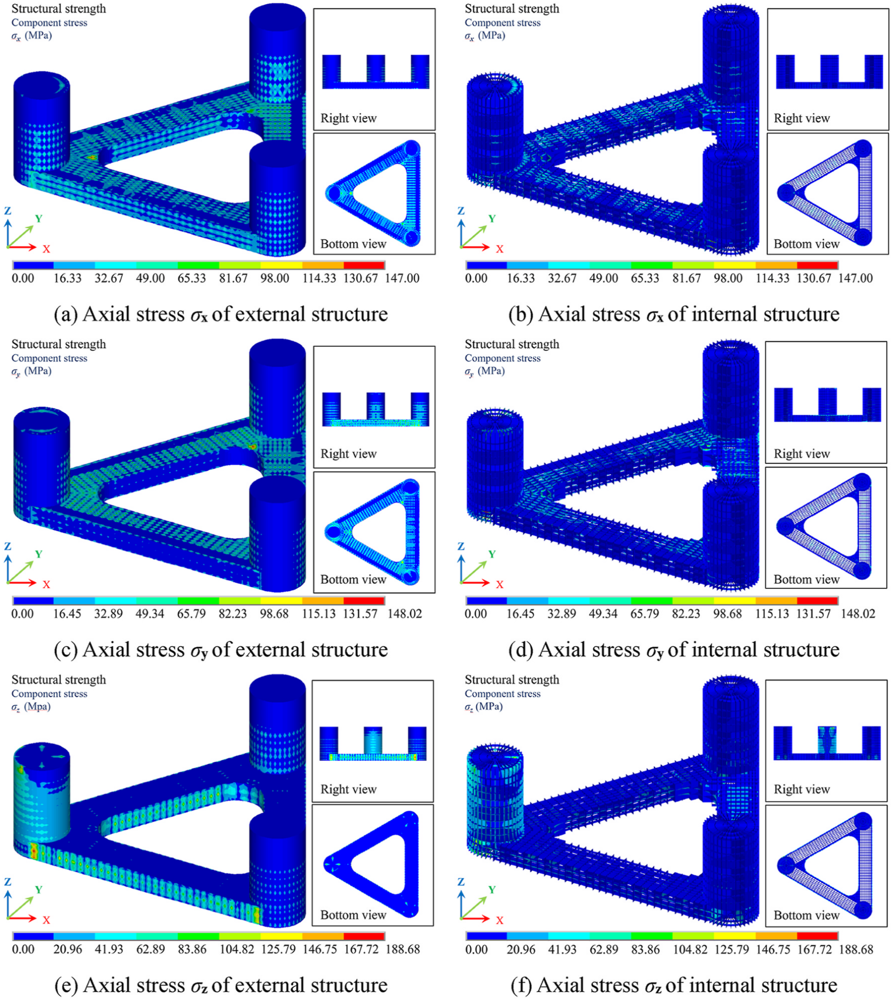

   **图 13a** 10 MW 风机半潜式平台波浪诱导长期应力分量响应，正应力部分。

   （a）、（b）为外部与内部结构的 :math:`\sigma_x` ；（c）、（d）为外部与内部结构的 :math:`\sigma_y` ；（e）、（f）为外部与内部结构的 :math:`\sigma_z` 。右侧小图分别为右视图与仰视图。色标表示应力分量，单位 MPa，三组上限分别为 147.00、148.02 和 188.68 MPa。

.. _zheng2025-fig-13b:

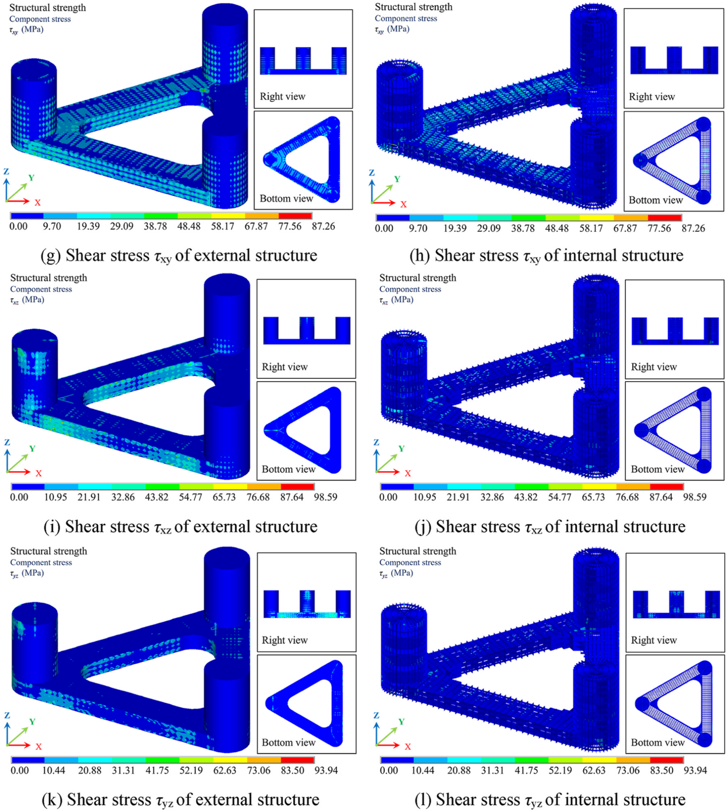

   **图 13b** 图 13 续，剪应力部分。

   （g）、（h）为外部与内部结构的 :math:`\tau_{xy}` ；（i）、（j）为外部与内部结构的 :math:`\tau_{xz}` ；（k）、（l）为外部与内部结构的 :math:`\tau_{yz}` 。右侧小图分别为右视图与仰视图。色标单位 MPa，三组上限分别为 87.26、98.59 和 93.94 MPa。

4.2 标准中的等效设计波工况
~~~~~~~~~~~~~~~~~~~~~~~~~~~~

第 3.1 节已介绍标准推荐的等效设计波方法，对应工况列于表 7。进一步使用这些工况预测应力分量，并与 LTSCR 比较，以评估等效设计波方法的可行性与适用性。

.. list-table:: 表 7 标准中的设计波工况参数
   :header-rows: 1
   :class: longtable

   * - 工况编号
     - 特征荷载
     - 波向（°）
     - 周期（s）
     - 相位（°）
     - 波高（m）
   * - L-1
     - TS 的  :math:`F_{x}`
     - 0
     - 13
     - 342.19
     - 12.61
   * - L-2
     - TS 的  :math:`M_{x}`
     - 90
     - 13
     - 301.95
     - 8.54
   * - L-3
     - TS 的  :math:`F_{y}`
     - 50
     - 9
     - 195.11
     - 9.71
   * - L-5
     - LS 的  :math:`F_{x}`
     - 90
     - 13
     - 178.56
     - 11.11
   * - L-4
     - LS 的  :math:`M_{x}`
     - 110
     - 13
     - 346.45
     - 9.46
   * - L-6
     - LS 的  :math:`F_{y}`
     - 50
     - 9
     - 188.76
     - 9.36
   * - L-7
     -  :math:`a_{x}`
     - 0
     - 7
     - 20.57
     - 9.55
   * - L-8
     -  :math:`a_{y}`
     - 90
     - 7
     - 92.38
     - 10.81
   * - L-9
     -  :math:`a_{z}`
     - −90
     - 21
     - 32.76
     - 11.62

工况编号和排列顺序按原表保留，L-5 位于 L-4 之前。

图 14 给出了设计波工况对 LTSCR（目标值）的预测精度，虚线标出 ±10% 的预测误差边界。如图 14 所示，等效设计波方法无法准确预测 LTSCR；在高应力区域，应力预测误差为 −99.93% 至 28.58%。具体而言，六个应力分量的最大值大多低于相应目标值，偏差范围为 −71.05% 至 6.75%。应力等效不足，可能是由于设计波方法对等效目标的考虑不够全面；此外，该方法只考虑水动力荷载，忽视波浪诱导塔底荷载与系泊导缆孔力。等效设计波方法不能直接用于漂浮式风机系统的结构设计与强度评估。然而，部分既有研究未加评估和改进便直接采用设计波方法分析漂浮式风机等效静力强度，可能存在一定缺陷（ :ref:`Cao et al., 2018 <zheng2025-ref-5>` ； :ref:`Li et al., 2019 <zheng2025-ref-19>` ； :ref:`Yang et al., 2023 <zheng2025-ref-42>` ； :ref:`Dong et al., 2024 <zheng2025-ref-10>` ）。

.. _zheng2025-fig-14:

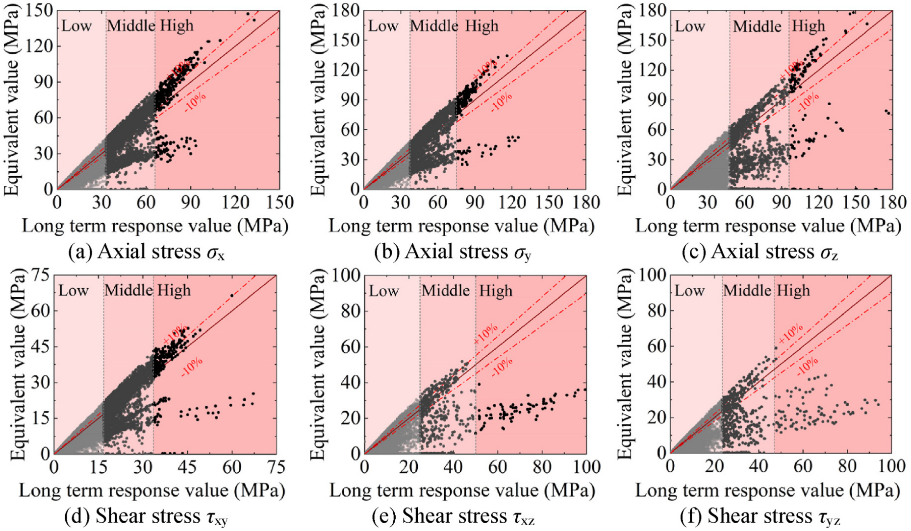

   **图 14** 标准中设计波工况的等效精度。

   横轴为长期响应值，纵轴为等效值，单位均为 MPa。（a）至（f）依次为 :math:`\sigma_x` 、 :math:`\sigma_y` 、 :math:`\sigma_z` 三个正应力，以及 :math:`\tau_{xy}` 、 :math:`\tau_{xz}` 、 :math:`\tau_{yz}` 三个剪应力。Low、Middle、High 分别表示低、中、高应力区，红色虚线标出 ±10% 偏差。

4.3 基于 LTCLR 的 ESWL 工况
~~~~~~~~~~~~~~~~~~~~~~~~~~~~~

以总共 111 个特征荷载为目标生成 ESWL 工况。经过比较与筛选，最终确定表 8–10 中的 12 个 ESWL 工况。每个工况均包括波浪诱导水压力、系泊导缆孔力和塔底荷载。需要注意，波浪诱导系泊导缆孔力和塔底荷载不包括结构初始平衡状态的常量；对于线性响应，最终结构设计应将这些常量叠加考虑。

.. list-table:: 表 8 基于 LTCLR 的 ESWL 工况波浪参数
   :header-rows: 1
   :class: longtable

   * - 工况编号
     - 特征荷载
     - 波向（°）
     - 周期（s）
     - 相位（°）
     - 波高（m）
   * - L-1
     - TS 的  :math:`F_{z}`
     - 0
     - 7
     - 230.46
     - 9.88
   * - L-2
     - LS 的  :math:`F_{z}`
     - 130
     - 7
     - 240.53
     - 10.20
   * - L-3
     - LS 的  :math:`F_{z}`
     - −130
     - 8
     - 79.52
     - 10.58
   * - L-5
     - LS 的  :math:`M_{x}`
     - −30
     - 9
     - 338.39
     - 9.60
   * - L-4
     - TS 的  :math:`F_{y}` 、LS 的  :math:`F_{y}`
     - 50
     - 9
     - 197.80
     - 10.30
   * - L-6
     - TS 的  :math:`F_{x}` 、TS 的  :math:`M_{y}` 、LS 的  :math:`M_{z}`
     - 0
     - 13
     - 347.38
     - 11.28
   * - L-7
     - LS 的  :math:`F_{x}` 、LS 的  :math:`M_{y}`
     - 90
     - 13
     - 6.26
     - 10.18
   * - L-8
     - TS 的  :math:`M_{x}`
     - 90
     - 13
     - 299.68
     - 10.36
   * - L-9
     - TS 的  :math:`M_{z}` 、LS 的  :math:`M_{x}`
     - 110
     - 13
     - 337.73
     - 9.88
   * - L-10
     -  :math:`a_{x}`
     - 0
     - 7
     - 20.57
     - 9.55
   * - L-11
     -  :math:`a_{y}`
     - 90
     - 7
     - 92.38
     - 10.81
   * - L-12
     -  :math:`a_{z}`
     - −90
     - 21
     - 32.76
     - 11.62

工况编号和排列顺序按原表保留，L-5 位于 L-4 之前；表 9、表 10 仍按工况编号对应读取。

.. list-table:: 表 9 基于 LTCLR 的 ESWL 工况波浪诱导系泊导缆孔力
   :header-rows: 1
   :class: longtable

   * - 工况编号
     - 系泊线 1、2导缆孔  :math:`F_{x}` （kN）
     - 系泊线 1、2导缆孔  :math:`F_{y}` （kN）
     - 系泊线 1、2导缆孔  :math:`F_{z}` （kN）
     - 系泊线 3导缆孔  :math:`F_{x}` （kN）
     - 系泊线 3导缆孔  :math:`F_{y}` （kN）
     - 系泊线 3导缆孔  :math:`F_{z}` （kN）
     - 系泊线 4导缆孔  :math:`F_{x}` （kN）
     - 系泊线 4导缆孔  :math:`F_{y}` （kN）
     - 系泊线 4导缆孔  :math:`F_{z}` （kN）
   * - L-1
     - −347.2
     - 0.0
     - 423.0
     - −178.2
     - 106.5
     - −224.0
     - −178.2
     - −106.5
     - −224.0
   * - L-2
     - 235.3
     - −90.9
     - −283.1
     - 194.6
     - −100.9
     - 238.1
     - −37.3
     - 1.1
     - −18.2
   * - L-3
     - −108.2
     - 26.5
     - 158.8
     - 36.2
     - −7.4
     - 39.7
     - −108.9
     - −65.1
     - −159.4
   * - L-4
     - −161.4
     - −17.93
     - 200.8
     - 64.7
     - −15.2
     - 80.9
     - 33.8
     - 50.7
     - 77.4
   * - L-5
     - 137.3
     - −4.3
     - −158.3
     - −35.5
     - 40.7
     - −63.0
     - −76.4
     - −30.1
     - −94.9
   * - L-6
     - −185.7
     - 0.0
     - 226.8
     - −40.8
     - −14.0
     - 68.8
     - −40.8
     - 13.9
     - 68.8
   * - L-7
     - −56.0
     - −89.5
     - 117.5
     - 36.9
     - −41.9
     - 74.5
     - 32.8
     - −17.1
     - 62.7
   * - L-8
     - −91.4
     - −96.9
     - 127.1
     - 77.5
     - −68.4
     - 66.6
     - 22.4
     - 0.2
     - 63.6
   * - L-9
     - −15.2
     - −94.0
     - 127.7
     - 81.9
     - −64.6
     - 97.8
     - 43.2
     - −6.2
     - 61.7
   * - L-10
     - 368.1
     - 0.0
     - −427.1
     - 209.5
     - −118.8
     - 237.6
     - 209.5
     - 118.8
     - 237.6
   * - L-11
     - 4.3
     - −67.6
     - 6.0
     - −52.3
     - 20.5
     - −72.5
     - 13.4
     - 2.0
     - 26.9
   * - L-12
     - 467.2
     - −35.4
     - −460.7
     - −315.7
     - 203.9
     - −348.0
     - −192.9
     - −97.6
     - −151.4

.. list-table:: 表 10 基于 LTCLR 的 ESWL 工况波浪诱导塔底荷载
   :header-rows: 1
   :class: longtable

   * - 工况编号
     -  :math:`F_{x}` （kN）
     -  :math:`F_{y}` （kN）
     -  :math:`F_{z}` （kN）
     -  :math:`M_{x}` （kN·m）
     -  :math:`M_{y}` （kN·m）
     -  :math:`M_{z}` （kN·m）
   * - L-1
     - −4069.98
     - 0.00
     - 166.39
     - 0.04
     - −400206.31
     - 0.00
   * - L-2
     - 2350.58
     - −3687.71
     - −535.39
     - 357843.26
     - 232056.04
     - −2881.38
   * - L-3
     - −2390.71
     - −3376.94
     - 801.56
     - 343504.53
     - −247278.27
     - −2131.47
   * - L-4
     - −931.65
     - −8.68
     - 1480.33
     - 865.82
     - −100672.61
     - 1253.24
   * - L-5
     - −392.35
     - −732.10
     - −987.36
     - 87602.19
     - −42368.78
     - −267.66
   * - L-6
     - −344.15
     - 0.00
     - 1427.23
     - −0.24
     - −35106.98
     - 0.00
   * - L-7
     - 443.23
     - 22.30
     - 983.86
     - −1335.35
     - 45746.83
     - −77.52
   * - L-8
     - 220.78
     - 350.00
     - 270.82
     - −20960.90
     - 22787.66
     - 803.14
   * - L-9
     - 216.90
     - −26.07
     - 845.97
     - 12028.09
     - 25327.41
     - 304.39
   * - L-10
     - 3377.60
     - 0.00
     - 122.21
     - −0.02
     - 332124.06
     - 0.00
   * - L-11
     - −334.61
     - 2138.61
     - 126.56
     - −250120.50
     - −33731.17
     - −9620.00
   * - L-12
     - 234.02
     - 448.58
     - 956.95
     - −38266.22
     - 23040.61
     - 47.34

DNV 标准推荐分离力 :math:`F_x` 、绕纵轴扭矩 :math:`M_x` 、横向剪力 :math:`F_y` 和三个加速度 :math:`a_x` 、 :math:`a_y` 、 :math:`a_z` 作为等效设计波方法的等效目标（ :ref:`DNV, 2015 <zheng2025-ref-9>` ）。前述分析表明，标准推荐的等效特征荷载可能不够全面。本文充分考虑关键截面的六向内力作为等效目标。由表 8 可见，分离力 :math:`F_x` 和水平弯矩 :math:`M_y` 通常出现在同一 ESWL 工况中，此时波峰或波谷的位置相近，波向垂直于相应截面。这两种特征荷载之间存在较强相关性，因此如 DNV 标准所建议，同时考虑两者可能并非关键（ :ref:`DNV, 2015 <zheng2025-ref-9>` ）。但是，分离力、扭矩、剪力和竖向弯矩之间不存在特定相关性。DNV 标准推荐的关键截面特征荷载并不十分合理和适当（ :ref:`DNV, 2015 <zheng2025-ref-9>` ）。在 ESWL 方法中可以不考虑水平弯矩 :math:`M_y` ，但不能忽视 :math:`F_z` 和 :math:`M_z` ，因为它们对应的 ESWL 工况也出现在基于 LTSCR 的 ESWL 工况中（见第 4.4 节）。

对基于 LTCLR 的 12 个 ESWL 工况下结构应力分量最大值进行统计分析，结果见图 15。由于截面特征荷载与应力分量之间具有较强相关性，并且筛选过程中剔除了特征荷载响应较小的 ESWL 工况，因此基于 LTCLR 的 ESWL 工况不仅全面表征 LTSCR，而且能够保证更保守的等效精度，特别是在高应力区域。高应力危险区域的应力等效精度优于较低应力区域。具体而言，高应力危险区域各应力分量的最大等效误差为 27.80%–36.91%，平均等效误差为 17.88%–22.71%。在中应力区域，大多数单元的应力等效误差落在 −22.27% 至 53.08% 范围内。随着应力减小，更多单元的等效结果变得不够充分；但应注意，结构设计并不重点考虑应力较小的安全区域。

.. _zheng2025-fig-15:

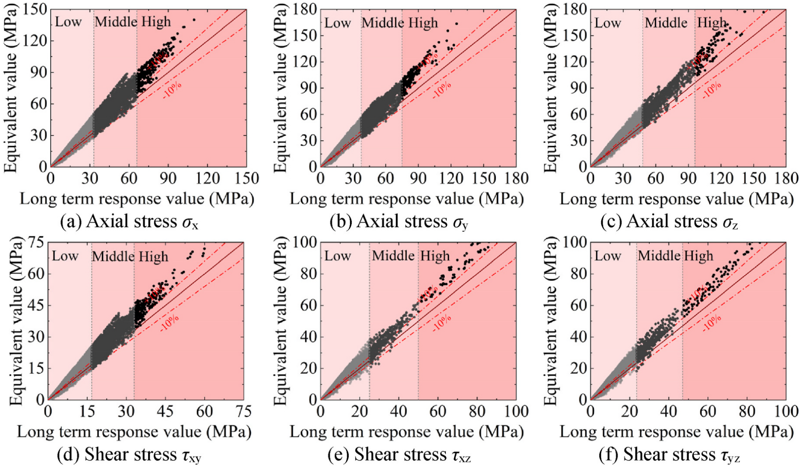

   **图 15** 基于 LTCLR 的 ESWL 工况的等效精度。

   横轴为长期响应值，纵轴为等效值，单位均为 MPa。（a）至（f）依次为 :math:`\sigma_x` 、 :math:`\sigma_y` 、 :math:`\sigma_z` 三个正应力，以及 :math:`\tau_{xy}` 、 :math:`\tau_{xz}` 、 :math:`\tau_{yz}` 三个剪应力。Low、Middle、High 分别表示低、中、高应力区，红色虚线标出 ±10% 偏差。

4.4 基于 LTSCR 的 ESWL 工况
~~~~~~~~~~~~~~~~~~~~~~~~~~~~~

根据第 3.2 节描述的等效方法与筛选策略，确定基于 LTSCR 的最终 ESWL 工况，如表 11–13 所示。选出的 ESWL 工况强调充分性，仅保留 6 个工况。

.. note::

   原文此段交叉引用写为“Section 3.2.1”，但原文没有第 3.2.1 节；相应方法和筛选策略位于第 3.2 节。

.. list-table:: 表 11 基于 LTSCR 的 ESWL 工况波浪参数
   :header-rows: 1
   :class: longtable

   * - 工况编号
     - 波向（°）
     - 周期（s）
     - 相位（°）
     - 波高（m）
   * - S-1
     - 0
     - 7
     - 229.63
     - 8.92
   * - S-2
     - 130
     - 7
     - 232.42
     - 7.84
   * - S-3
     - −130
     - 8
     - 81.89
     - 9.40
   * - S-4
     - 0
     - 13
     - 339.41
     - 10.38
   * - S-5
     - 90
     - 13
     - 3.97
     - 8.68
   * - S-6
     - 110
     - 13
     - 341.82
     - 8.56

.. list-table:: 表 12 基于 LTSCR 的 ESWL 工况波浪诱导系泊导缆孔力
   :header-rows: 1
   :class: longtable

   * - 工况编号
     - 系泊线 1、2导缆孔  :math:`F_{x}` （kN）
     - 系泊线 1、2导缆孔  :math:`F_{y}` （kN）
     - 系泊线 1、2导缆孔  :math:`F_{z}` （kN）
     - 系泊线 3导缆孔  :math:`F_{x}` （kN）
     - 系泊线 3导缆孔  :math:`F_{y}` （kN）
     - 系泊线 3导缆孔  :math:`F_{z}` （kN）
     - 系泊线 4导缆孔  :math:`F_{x}` （kN）
     - 系泊线 4导缆孔  :math:`F_{y}` （kN）
     - 系泊线 4导缆孔  :math:`F_{z}` （kN）
   * - S-1
     - −315.5
     - 0.0
     - 383.8
     - −162.5
     - 97.0
     - −203.6
     - −162.5
     - −97.0
     - −203.6
   * - S-2
     - 193.5
     - −79.0
     - −232.9
     - 160.1
     - −83.0
     - 190.2
     - −24.7
     - −0.2
     - −12.4
   * - S-3
     - −91.6
     - 25.0
     - 135.4
     - 30.9
     - −6.4
     - 33.8
     - −97.1
     - −58.0
     - −141.6
   * - S-4
     - −195.8
     - 0.0
     - 210.1
     - −34.0
     - −13.3
     - 67.6
     - −34.0
     - 13.5
     - 67.6
   * - S-5
     - −50.3
     - −78.5
     - 103.0
     - 33.8
     - −37.6
     - 64.8
     - 28.2
     - −14.3
     - 54.8
   * - S-6
     - −10.2
     - −83.6
     - 107.2
     - 67.5
     - −53.2
     - 84.5
     - 38.4
     - −6.4
     - 54.5

.. list-table:: 表 13 基于 LTSCR 的 ESWL 工况波浪诱导塔底荷载
   :header-rows: 1
   :class: longtable

   * - 工况编号
     -  :math:`F_{x}` （kN）
     -  :math:`F_{y}` （kN）
     -  :math:`F_{z}` （kN）
     -  :math:`M_{x}` （kN·m）
     -  :math:`M_{y}` （kN·m）
     -  :math:`M_{z}` （kN·m）
   * - S-1
     - −3673.23
     - 0.00
     - 143.11
     - 0.04
     - −361193.47
     - 0.00
   * - S-2
     - 1806.29
     - −2870.19
     - −406.20
     - 278513.50
     - 178322.09
     - −1955.54
   * - S-3
     - −2110.66
     - −2991.19
     - 694.54
     - 304266.17
     - −218311.80
     - −1913.08
   * - S-4
     - −272.57
     - 0.00
     - 1278.05
     - −0.21
     - −28883.64
     - 0.00
   * - S-5
     - 379.27
     - 31.66
     - 833.76
     - −1896.22
     - 39145.95
     - −35.08
   * - S-6
     - 200.58
     - −45.35
     - 765.48
     - 11905.64
     - 22917.61
     - 232.91

使用这六个 ESWL 工况研究结构应力分量，并将每个单元的最大应力与 LTSCR 比较，以评估 ESWL 方法的性能（见图 16）。总体而言，六个 ESWL 工况能够有效表征半潜式平台在波浪作用下的 LTSCR。然而，随着结构单元应力减小，应力等效精度降低。ESWL 工况筛选策略优先保证危险区域高应力单元的应力等效，使其精度显著高于中应力和低应力单元。高应力区域的应力等效具有保守性，保守率始终低于 23.86%。各应力分量的平均等效误差为 5.06%–8.06%。对于极少数单元，应力等效精度并不完美，但其低估控制在 −2.0% 相对误差或 −5.5 MPa 绝对偏差以内。中应力单元的相对等效误差通常在 ±25% 内，仅少数单元应力超出该范围。在低应力响应的安全区域，ESWL 工况下的结构应力预测存在较大等效误差。但是，这些低应力预测的绝对误差足够小，不会损害平台结构整体安全。低应力区域被认为是安全的，不是结构强度校核和设计的主要关注对象，因此这些区域的应力等效精度并非关键。增加对应的 ESWL 工况能够改善安全的中应力和低应力区域的应力等效精度。然而，工况数量增加可能导致高应力区域应力估计过度保守，造成建筑材料浪费。总之，基于 LTSCR 的 ESWL 工况具有足够精度与一定保守性，可以满足海上漂浮式风机的设计要求。

.. _zheng2025-fig-16:

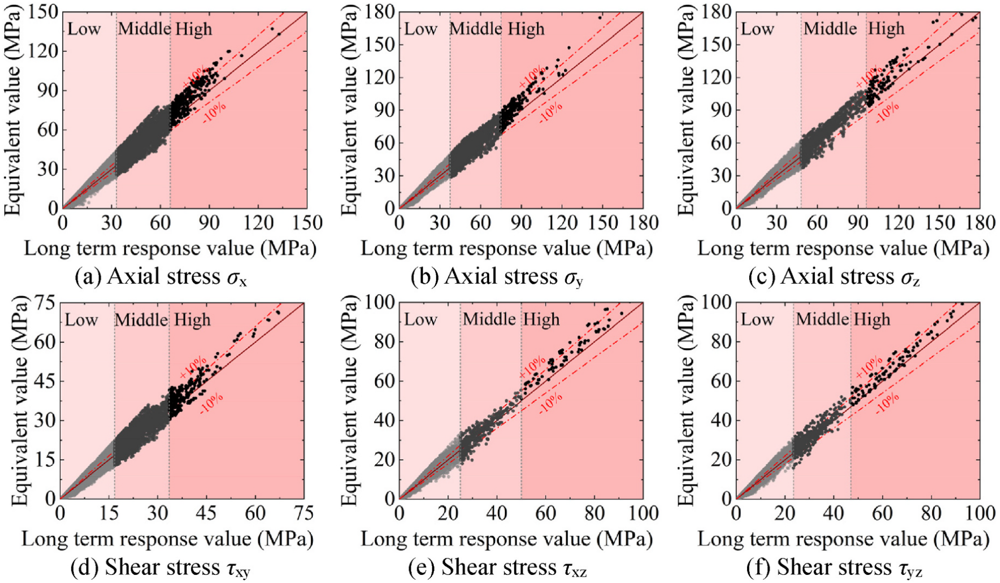

   **图 16** 基于 LTSCR 的 ESWL 工况的等效精度。

   横轴为长期响应值，纵轴为等效值，单位均为 MPa。（a）至（f）依次为 :math:`\sigma_x` 、 :math:`\sigma_y` 、 :math:`\sigma_z` 三个正应力，以及 :math:`\tau_{xy}` 、 :math:`\tau_{xz}` 、 :math:`\tau_{yz}` 三个剪应力。Low、Middle、High 分别表示低、中、高应力区，红色虚线标出 ±10% 偏差。

4.5 基于 LTSCR 与 LTCLR 的 ESWL 工况比较
~~~~~~~~~~~~~~~~~~~~~~~~~~~~~~~~~~~~~~~~~~

由表 11 和表 8 可知，三角形半潜式风机最终选定的 ESWL 工况波浪周期主要集中于 7 s、8 s 和 13 s。可以看到，基于 LTCLR 的 ESWL 工况包含基于 LTSCR 的工况，具有相同的波浪周期与方向，以及相近的相位，这归因于特征荷载和应力分量之间的相关性。基于 LTCLR 的 ESWL 工况采用较大波高，因此应力等效更保守。为进一步评估两种等效方法的性能，图 17 比较了 ESWL 工况作用下的最大应力分量。与基于 LTSCR 的工况相比，基于 LTCLR 的工况明显更加保守，LTCLR 方法预测的所有单元应力均超过 LTSCR 方法的预测值。在结构强度设计重点关注的高应力关键区域，各应力分量的最大偏差为 20.04%–30.34%，平均偏差为 11.17%–13.77%。

.. _zheng2025-fig-17:

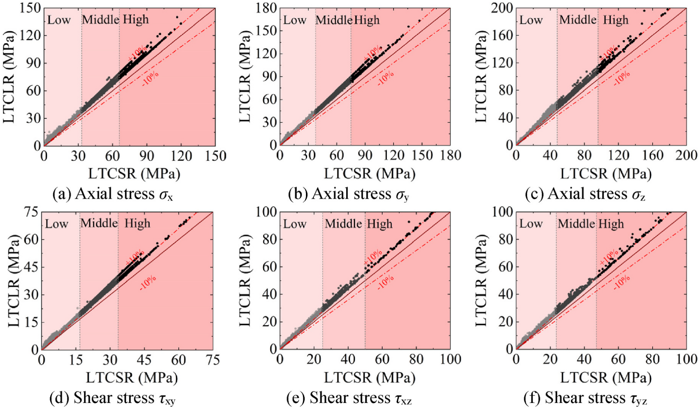

   **图 17** 基于 LTSCR 与 LTCLR 的 ESWL 工况下结构应力分量比较。

   横轴为基于 LTSCR 工况的应力，纵轴为基于 LTCLR 工况的应力，单位均为 MPa。原图横轴缩写印为 LTCSR，按正文应为 LTSCR；图像原标签保持不变。（a）至（f）依次为 :math:`\sigma_x` 、 :math:`\sigma_y` 、 :math:`\sigma_z` 三个正应力，以及 :math:`\tau_{xy}` 、 :math:`\tau_{xz}` 、 :math:`\tau_{yz}` 三个剪应力。Low、Middle、High 分别表示低、中、高应力区，红色虚线标出 ±10% 偏差。

基于 LTSCR 的 ESWL 工况针对应力响应专门优化，能够用数量更少、荷载更小的工况实现高应力单元应力响应的准确等效。然而，若仅依靠关键截面的最大特征荷载响应，而没有 LTSCR 作为参考来确定 ESWL 工况，可能产生模糊性，通常会提取到较大波高。此外，无法有针对性地剔除一些与中低应力相关的次要 ESWL 工况，使高应力单元的等效更为保守。虽然基于 LTCLR 的 ESWL 工况确定方法可能不如 LTSCR 方法理想，但它为初步结构设计提供了一条更高效、保守的途径，无需多次开展高级复杂有限元模拟。因此，它更适用于需要在有限时间内大量调整和模拟的情形。相反，基于 LTSCR 的 ESWL 工况确定方法可能更适合最终详细设计，以获得更具成本效益的设计。

4.6 结构强度评估
~~~~~~~~~~~~~~~~~~

本文研究的海上风机三角形半潜式平台采用 S355 钢建造，该材料具有典型的延性特征，在高应力下倾向于发生塑性变形而非断裂。因此，采用 Von Mises 屈服准则评估 ESWL 工况下半潜式平台的强度。Von Mises 应力可由应力分量按式（7）计算。根据风机基础结构强度分析的 IEC 标准，Von Mises 应力不得超过材料允许强度。考虑相应安全系数的材料允许强度 :math:`[\sigma]` 可由式（8）计算。

.. math::

   \sigma_e=\sqrt{\frac{(\sigma_x-\sigma_y)^2+(\sigma_x-\sigma_z)^2+
   (\sigma_y-\sigma_z)^2+6(\tau_{xy}^2+\tau_{xz}^2+\tau_{yz}^2)}{2}}\qquad (7)

.. math::

   \sigma_e\leq[\sigma]=\frac{f_y}{\gamma_m\gamma_n}\qquad (8)

其中， :math:`f_y=355.00\,\mathrm{MPa}` 为钢材屈服应力； :math:`\gamma_m=1.3` 为因超过抗拉或抗压强度而发生破坏时的材料分项安全系数（ :ref:`IEC 61400-1, 2019 <zheng2025-ref-14>` ）； :math:`\gamma_n=1.0` 为“非失效安全”结构部件的失效后果分项安全系数，这些部件失效可能引起风机主要部分失效（ :ref:`IEC 61400-1, 2019 <zheng2025-ref-14>` ）； :math:`[\sigma]=273.08\,\mathrm{MPa}` 为材料允许强度。

图 18 给出了全部 ESWL 工况下半潜式平台所有单元的最大 Von Mises 应力。提取各荷载工况下所有单元节点的 Von Mises 应力，将最大值绘制到结构上。基于标准、LTCLR 和 LTSCR 的工况中，最大 Von Mises 应力分别为 187.20 MPa、252.14 MPa 和 228.97 MPa，满足材料强度要求并保证结构安全。基于 LTSCR 与 LTCLR 的 ESWL 工况作用下，结构 Von Mises 应力分布与长期应力分量分布（图 13）具有一定相似性，较高 Von Mises 应力集中在少数局部危险区域。然而，DNV 标准所推荐设计波工况的 Von Mises 应力分布明显不同。由于传统设计波方法未对波浪诱导系泊导缆孔力和塔底荷载进行静力等效，设计波工况不能准确预测塔底和系泊导缆孔处的局部结构应力。本文提出的基于 LTSCR 和 LTCLR 的 ESWL 方法充分考虑这两类波浪诱导荷载的静力等效，能够反映安装风机立柱的正确应力响应。

.. _zheng2025-fig-18:

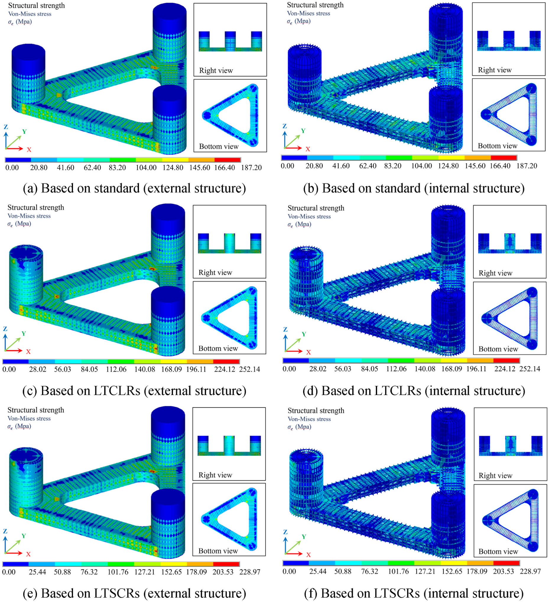

   **图 18** 所有荷载工况下最大 Von Mises 应力分布。

   （a）、（b）为标准方法对应的外部和内部结构；（c）、（d）为 LTCLR 方法对应的外部和内部结构；（e）、（f）为 LTSCR 方法对应的外部和内部结构。色标为 Von Mises 应力 :math:`\sigma_e` ，单位 MPa，各组上限分别为 187.20、252.14 和 228.97 MPa。各子图均保留右视图与仰视图。

图 19 比较了基于标准、LTSCR 和 LTCLR 的荷载工况下最大 Von Mises 应力。基于 LTCLR 的 ESWL 工况考虑更大波高，并增加用于低应力等效的工况，因此比基于 LTSCR 的方法给出更保守的应力预测。然而，由于缺少波浪诱导系泊导缆孔力和塔底荷载的静力等效，加之所选等效特征荷载可能不够全面，设计波方法不足以预测多个单元的 Von Mises 应力，难以满足结构设计与强度评估要求。传统设计波方法不能直接用于漂浮式风机设计。

.. _zheng2025-fig-19:

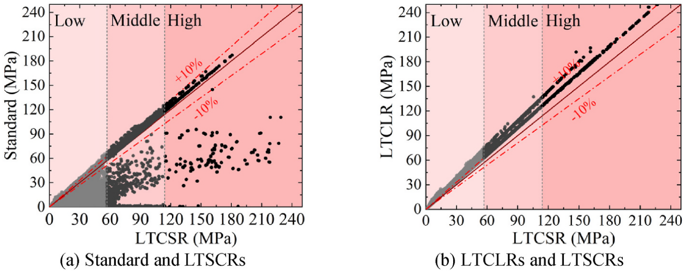

   **图 19** 基于标准、LTSCR 和 LTCLR 的荷载工况下最大 Von Mises 应力比较。

   （a）标准方法与 LTSCR 方法；（b）LTCLR 方法与 LTSCR 方法。横轴均为 LTSCR 方法结果，纵轴分别为标准方法和 LTCLR 方法结果，单位 MPa。Low、Middle、High 分别表示低、中、高应力区，红色虚线标出 ±10% 偏差；原图横轴缩写 LTCSR 与正文 LTSCR 的字母顺序不同。

5 结论与未来研究
------------------

本文研究海上风机半潜式平台 ESWL 的确定方法。全面比较了基于油气漂浮平台标准、长期特征荷载响应和长期应力分量响应三种等效静力方法的性能。主要结论如下。

1. 半潜式风机平台的长期应力分量响应分布表明，高应力区域主要位于立柱与浮筒连接处，以及安装风机立柱的塔底和系泊导缆孔处。应力响应不仅受到波浪诱导水动力压力影响，还受到系泊和风机施加的耦合力影响。确定等效静力波浪荷载时，必须充分考虑这些力，以保证结构完整性。
2. 源于油气漂浮平台标准的传统设计波方法过度简化设计情形，忽视波浪诱导塔底荷载和系泊力等关键因素。这使其无法准确预测风机半潜式平台的 LTSCR。因此，该方法不适合直接用于半潜式风机结构设计。
3. 改进的 ESWL 确定方法纳入结构水动力压力、系泊导缆孔力和塔底荷载，在结构完整性和成本效率方面表现出明显成效。基于 LTCLR 的方法更加直接，得到的设计波数量更多、波高更大，从而使结构设计更加保守。这种方法尤其适用于需要频繁修改结构的初步设计阶段。相反，基于 LTSCR 的方法采用较少数量的设计波，有利于提高结构设计的经济性，但需要额外的有限元分析。

由于耦合多体系统的复杂性，极端风荷载与波浪荷载之间的相关性尚未得到充分考虑。未来研究应更深入地研究等效静力风荷载的确定方法，以便基于等效静力荷载，对漂浮式风机支撑结构开展更全面的强度评估与结构设计。

参考文献
----------

.. _zheng2025-ref-1:

`ABS, 2016. Selecting design wave by long term stochastic method. <http://refhub.elsevier.com/S0029-8018(25)01049-2/sref1>`_

.. _zheng2025-ref-2:

Aubault, A., Cermelli, C., Roddier, D., 2009. Windfloat: a floating foundation for offshore wind turbines part III: structural analysis. The ASME 2009 28th International Conference on Ocean, Offshore and Arctic Engineering. https://doi.org/10.1115/OMAE2009-79232.

.. _zheng2025-ref-3:

`Bak, C., Zahle, F., Bitsche, R., Kim, T., Yde, A., Henriksen, L., Hansen, M.H., Blasques, J. P.A.A., Gaunaa, M.A., Natarajan, M.H., 2013. The DTU 10-MW Reference Wind Turbine. Danish wind power, Research. <http://refhub.elsevier.com/S0029-8018(25)01049-2/sref3>`_

.. _zheng2025-ref-4:

Benassai, G., Campanile, A., Piscopo, V., Scamardella, A., 2018. Optimization of mooring systems for floating offshore wind turbines. Coast. Eng. J. 57 (4), 1550021. https://doi.org/10.1142/S0578563415500217.

.. _zheng2025-ref-5:

Cao, A., Shi, X., Sang, S., Wang, Q., 2018. Research on static analysis of box foundation for wind turbine on SESAM software. Wirel. Pers. Commun. 103, 535–546. https://doi.org/10.1007/s11277-018-5459-1.

.. _zheng2025-ref-6:

`Derbanne, Q., Hauteclocque, G.D., El-Gharbaoui, A., Gharbaoui Belizal, P.D., 2013. Design wave selection for strength assessment of floating structures. Practical Design of Ships. Changwon, Korea. <http://refhub.elsevier.com/S0029-8018(25)01049-2/sref6>`_

.. _zheng2025-ref-7:

`DET NORSKE VERITAS, 2011. SESAM User Manual. <http://refhub.elsevier.com/S0029-8018(25)01049-2/sref7>`_

.. _zheng2025-ref-8:

Díaz, H., Guedes Soares, C., 2020. Review of the current status, technology and future trends of offshore wind farms. Ocean. Eng. 209, 107381. https://doi.org/10.1016/j.oceaneng.2020.107381.

.. _zheng2025-ref-9:

`DNV, 2015. DNVGL-RP-C103 column-stabilised Units. <http://refhub.elsevier.com/S0029-8018(25)01049-2/sref9>`_

.. _zheng2025-ref-10:

Dong, Y., Zhang, J., Zhong, S., Garbatov, Y., 2024. Simplified strength assessment for preliminary structural design of floating offshore wind turbine semi-submersible platform. J. Mar. Sci. Eng. 12 (259), 1–17. https://doi.org/10.3390/jmse12020259.

.. _zheng2025-ref-11:

`Hauteclocque, G.D., Derbanne, Q., El-Gharbaoui, A., 2012. Comparison of different equivalent design waves with spectral analysis. 31st International Conference on Ocean, Offshore and Arctic Engineering, pp. 353–361. Rio de Janeiro, Brazil. <http://refhub.elsevier.com/S0029-8018(25)01049-2/sref11>`_

.. _zheng2025-ref-12:

Hu, Z., Liu, Y., Wang, J., 2016. An integrated atructural atrength analysis method for spar type floating wind turbine. China Ocean Eng. 30, 217–230. https://doi.org/10.1007/s13344-016-0013-y.

.. _zheng2025-ref-13:

Huo, F., Yao, Z., Zhang, J., Wang, J., Bin, D., 2018. Strength analysis on brace structure for semi-submersible in consideration of wave slamming. China Ocean Eng. 32 (5), 536–545. https://doi.org/10.1007/s13344-018-0056-3.

.. _zheng2025-ref-14:

`IEC 61400-1, 2019. Wind Energy Generation Systems – Part 1: Design Requirements. <http://refhub.elsevier.com/S0029-8018(25)01049-2/sref14>`_

.. _zheng2025-ref-15:

`International Renewable Energy Agency, 2020. Renewable Capacity Highlights. Masdar: International Renewable Energy Agency. <http://refhub.elsevier.com/S0029-8018(25)01049-2/sref15>`_

.. _zheng2025-ref-16:

Jonkman, J., Butterfield, S., Musial, W., Scott, G., 2009. Definition of a 5-MW Reference Wind Turbine for Offshore System Development. National Renewable Energy Lab. (NREL), Golden, CO (United States). https://doi.org/10.2172/947422.

.. _zheng2025-ref-17:

Lee, H., Moon, W., Lee, M., Song, K., Shen, Z., Kyoung, J., Baquet, A., Kim, J., Han, I., Park, S., Kim, K., Kim, B., 2023. Time-domain response-basedstructural analysis on a floating offshore wind turbine. J. Mar. Sci. Appl. 22, 75–83. https://doi.org/10.1007/s11804-023-00322-0.

.. _zheng2025-ref-18:

Lefebvre, S., Collu, M., 2012. Preliminary design of a floating support structure for a 5 MW offshore wind turbine. Ocean. Eng. 40, 15–26. https://doi.org/10.1016/j.oceaneng.2011.12.009.

.. _zheng2025-ref-19:

`Li, C., Zheng, S., Peng, A., Zhou, S., Xiao, Y., Hu, G., Wang, H., 2019. Equivalent static wave/wind loads for the structural design of semi-submersible platform of floating offshore wind turbine. The 29th International Ocean and Polar Engineering Conference. Honolulu, Hawaii, USA. <http://refhub.elsevier.com/S0029-8018(25)01049-2/sref19>`_

.. _zheng2025-ref-20:

Li, J., Wang, Y., Zhao, X., Qi, P., 2021. Model free adaptive control of large and flexible wind turbine rotors with controllable flaps. Renew. Energy 180, 68–82. https://doi.org/10.1016/j.renene.2021.08.050.

.. _zheng2025-ref-21:

Li, Y., Ong, M.C., Wang, K., Li, L., Cheng, Z., 2022. Power performance and dynamic responses of an integrated system with a semi-submersible wind turbine and four torus-shaped wave energy converters. Ocean. Eng. 259, 111810. https://doi.org/10.1016/j.oceaneng.2022.111810.

.. _zheng2025-ref-22:

Liu, L., Zhao, H., Xu, W., Yuan, R., Guo, Y., 2018. Structural strength analysis of a tri-floater floating foundation for offshore VAWT. J. Ocean Univ. China 17, 753–762. https://doi.org/10.1007/s11802-018-3434-9.

.. _zheng2025-ref-23:

Natarajan, A., Stolpe, M., Wandji, W.N., 2019. Structural optimization based design of jacket type sub-structures for 10 MW offshore wind turbines. Ocean. Eng. 172, 629–640. https://doi.org/10.1016/j.oceaneng.2018.12.023.

.. _zheng2025-ref-24:

Park, S., Choung, J., 2023. Structural design of the substructure of a 10 MW floating offshore wind turbine system using dominant load parameters. J. Mar. Sci. Eng. 11, 1048. https://doi.org/10.3390/jmse11051048.

.. _zheng2025-ref-25:

Raed, K., Hussein, A.W., Hegazy, E.H., Amin, A.A., 2013. Structural design of a floating foundation for offshore wind turbines in Red Sea. Analysis and Design of Marine Structures 575–583. https://doi.org/10.1201/b15120-78.

.. _zheng2025-ref-26:

Roddier, D., Cermelli, C., Aubault, A., Weinstein, A., 2010. WindFloat: a floating foundation for offshore wind turbines. J. Renew. Sustain. Energy 2, 033104. https://doi.org/10.1063/1.3435339.

.. _zheng2025-ref-27:

Sahu, B.K., 2018. Wind energy developments and policies in China: a short review. Renew. Sustain. Energy Rev. 81, 1393–1405. https://doi.org/10.1016/j.rser.2017.05.183.

.. _zheng2025-ref-28:

Shi, W., Li, J., Michailides, C., Chen, M., Wang, S., Li, X., 2022. Dynamic load effects and power performance of an integrated wind–wave energy system utilizing an optimum torus wave energy converter. J. Mar. Sci. Eng. 10 (12), 1985. https://doi.org/10.3390/jmse10121985.

.. _zheng2025-ref-29:

Sohn, J.M., Cheon, J., Hong, K., Shin, S., 2016. Equivalent design wave approach for structural analysis of floating pendulum wave energy converter. Ships Offshore Struct. 11 (6), 645–654. https://doi.org/10.1080/17445302.2015.1045268.

.. _zheng2025-ref-30:

Souza, C.E.S., Bachynski-Polić, E.E., 2022. Design, structural modeling, control, and performance of 20 MW spar floating wind turbines. Mar. Struct. 84, 103182. https://doi.org/10.1016/j.marstruc.2022.103182.

.. _zheng2025-ref-31:

Uzunoglu, E., Guedes Soares, C., 2020. Hydrodynamic design of a free-float capable tension leg platform for a 10 MW wind turbine. Ocean. Eng. 197, 106888. https://doi.org/10.1016/j.oceaneng.2019.106888.

.. _zheng2025-ref-32:

Wang, S., Moan, T., 2024a. Serviceability limit state assessment of semi-submersible floating wind turbines. J. Offshore Mech. Arctic Eng. 146, 022003. https://doi.org/10.1115/OMAE2023-108172.

.. _zheng2025-ref-33:

Wang, S., Moan, T., 2024b. Analysis of extreme internal load effects in columns in a semi-submersible support structure for large floating wind turbines. Ocean. Eng. 291, 116372. https://doi.org/10.1016/j.oceaneng.2023.116372.

.. _zheng2025-ref-34:

Wang, F., Dai, L., Zheng, L., 2017. Effects of wave loads on the horizontal bracing strength of a semi-submersible platform. In: Proceedings of the Institution of Civil engineers-maritime Engineering, vol. 170, pp. 21–31. https://doi.org/10.1680/jmaen.2016.27, 1.

.. _zheng2025-ref-35:

Wang, S., Nejad, A.R., Moan, T., 2020. On design, modelling, and analysis of a 10-MW medium-speed drivetrain for offshore wind turbines. Wind Energy 23 (4), 1099–1117. https://doi.org/10.1002/we.24761.

.. _zheng2025-ref-36:

Wang, Z., Qiao, D., Tang, G., Wang, B., Yan, J., Ou, J., 2022. An identification method of floating wind turbine tower responses using deep learning technology in the monitoring system. Ocean. Eng. 261, 112105. https://doi.org/10.1016/j.oceaneng.2022.112105.

.. _zheng2025-ref-37:

Wang, S., Moan, T., Jiang, Z., 2022a. Influence of variability and uncertainty of wind and waves on fatigue damage of a floating wind turbine drivetrain. Renew. Energy 181, 870–897. https://doi.org/10.1016/j.renene.2021.09.090.

.. _zheng2025-ref-38:

Wang, S., Moan, T., Gao, Z., 2023. Methodology for global structural load effect analysis of the semi-submersible hull of floating wind turbines under still water, wind, and wave loads. Mar. Struct. 93, 103463. https://doi.org/10.1016/j.marstruc.2023.103463.

.. _zheng2025-ref-39:

`WWEA, 2021. Worldwide Wind Capacity Reaches 744 Gigawatts – an Unprecedented 93 Gigawatts Added in 2020. <http://refhub.elsevier.com/S0029-8018(25)01049-2/sref39>`_

.. _zheng2025-ref-40:

Xu, S., Ji, C., Soares, C.G., 2018. Experimental and numerical investigation a semi-submersible moored by hybrid mooring systems. Ocean. Eng. 163, 641–678. https://doi.org/10.1016/j.oceaneng.2018.05.006.

.. _zheng2025-ref-41:

Yang, Y., Bashir, M., Michailides, C., Li, C., Wang, J., 2020. Development and application of an aero-hydro-servo-elastic coupling framework for analysis of floating offshore wind turbines. Renew. Energy 161, 606–625. https://doi.org/10.1016/j.renene.2020.07.134.

.. _zheng2025-ref-42:

Yang, Y., Chen, C., Zhao, W., Fan, T., 2023. An innovative method of assessing yield strength of floater hull for semi-submersible floating wind turbine in whole life period. Ocean. Eng. 270, 113679. https://doi.org/10.1016/j.oceaneng.2023.113679.

.. _zheng2025-ref-43:

Yeter, B., Garbatov, Y., Guedes Soares, C., 2019. Ultimate strength assessment of jacket offshore wind turbine support structures subjected to progressive bending loading. Ships Offshore Struct. 14, 165–175. https://doi.org/10.1080/17445302.2018.1484030.

.. _zheng2025-ref-44:

Yu, Z., Amdahl, J., Rypestøl, M., Cheng, Z., 2022. Numerical modelling and dynamic response analysis of a 10 MW semi-submersible floating offshore wind turbine subjected to ship collision loads. Renew. Energy 184, 677–699. https://doi.org/10.1016/j.renene.2021.12.002.

.. _zheng2025-ref-45:

Zhao, Z., Wang, W., Shi, W., Qi, S., Li, X., 2022. Effect of floating substructure flexibility of large-volume 10 MW offshore wind turbine semi-submersible platforms on dynamic response. Ocean. Eng. 259, 111934. https://doi.org/10.1016/j.oceaneng.2022.111934.

.. _zheng2025-ref-46:

Zheng, S., Li, C., Wang, P., Zhou, S., Xiao, Y., 2023. Wind tunnel and wave flume testing on directionality dynamic responses of a 10 MW Y-shaped semi-submersible wind turbine. J. Renew. Sustain. Energy 15 (1), 013305. https://doi.org/10.1063/5.0131279.

.. _zheng2025-ref-47:

Zhou, S., Li, C., Xiao, Y., Wang, Xi, Xiang, W., Sun, Q., 2023. Evaluation of floating wind turbine substructure designs by using long term dynamic optimization. Appl. Energy 352, 121941. https://doi.org/10.1016/j.apenergy.2023.121941.

完整引用
----------

:student-first-author:`Zheng Shunyun` ；Liu Shangpei；**Li Chao**\*；Wang Xiaolu；Ou Jinping. Evaluating equivalent static wave loads for a delta-shaped semi-submersible 10-MW wind turbine. Ocean Engineering, 2025, 332: 121336. https://doi.org/10.1016/j.oceaneng.2025.121336.

收录信息见 :ref:`WOEAI 学术成果页对应条目 <ref-zheng2025-OE>` 。
