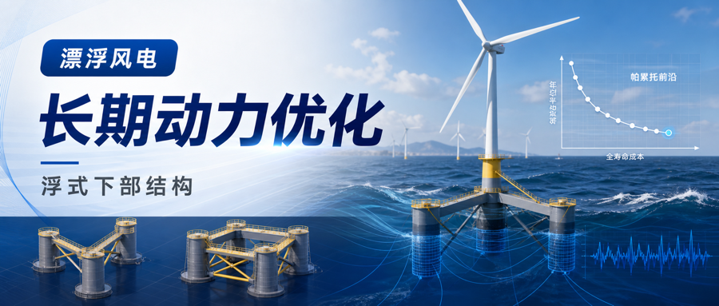
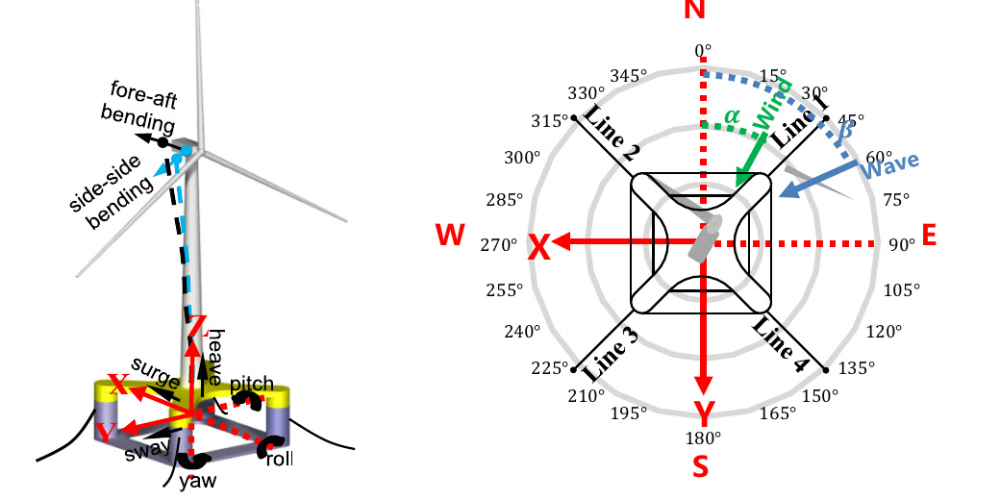
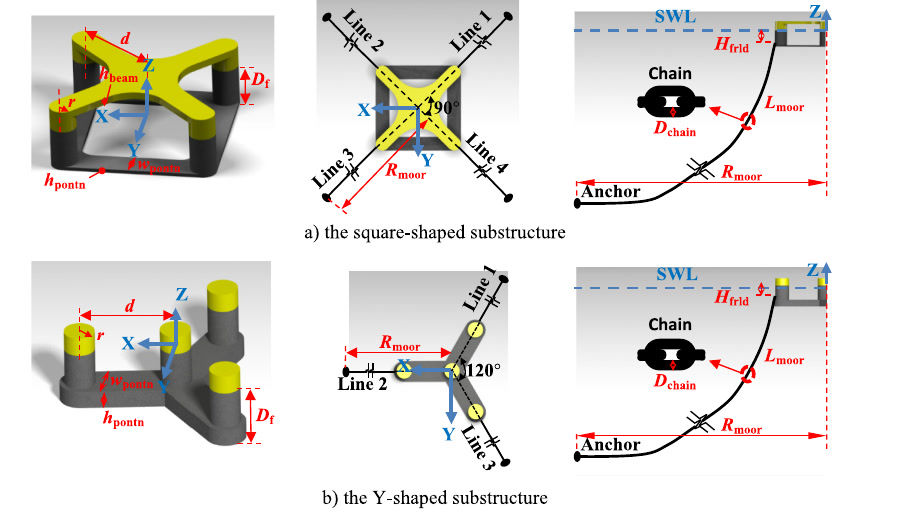
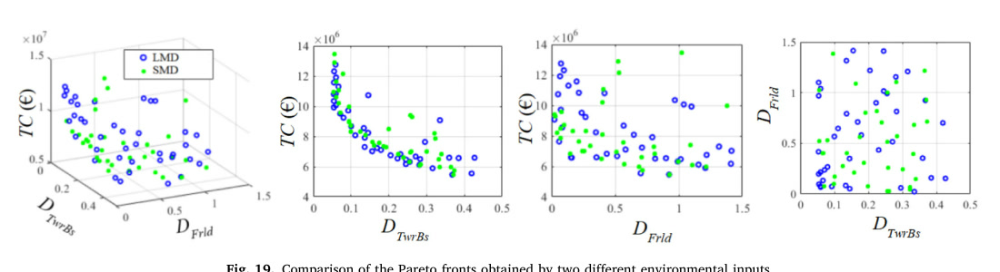
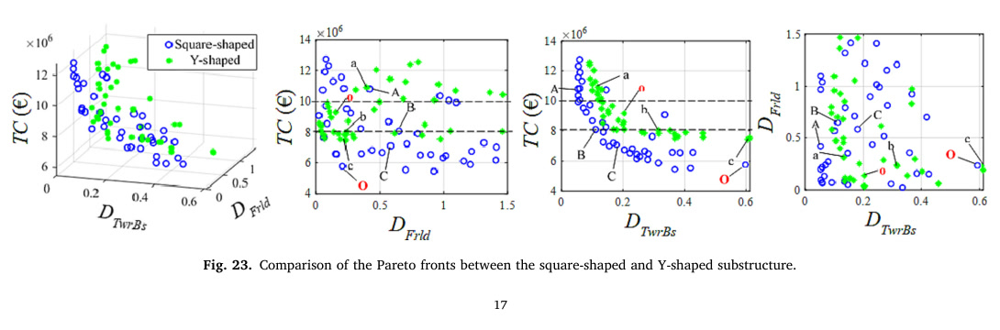
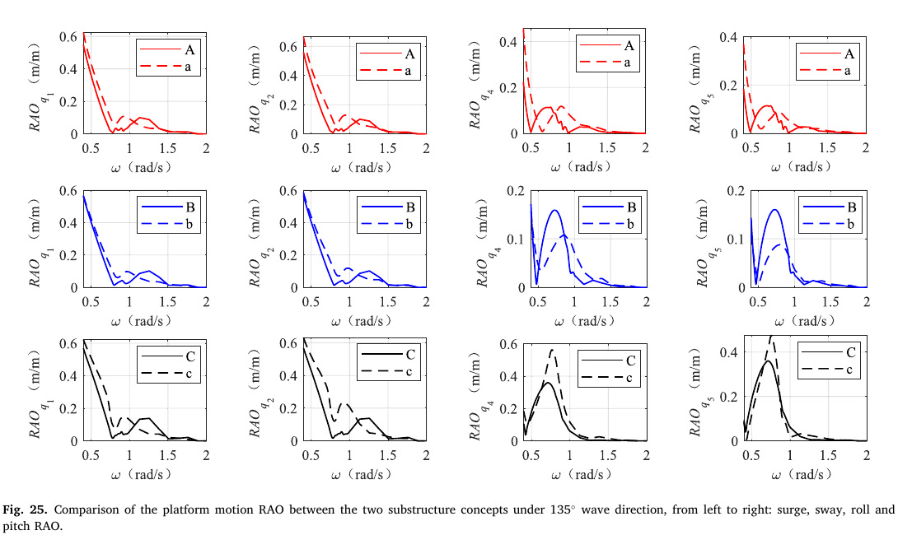

.. _paper-note-ref-zhou2023-AE:

.. role:: student-first-author

用长期动力优化选择浮式风机下部结构
==================================

浮式风机下部结构的设计，既影响平台运动、塔底疲劳和系泊疲劳，也直接进入制造成本。对早期设计来说，问题不只是“哪种平台外形更稳”，而是如何在大量候选主尺度和系泊参数中，找到长期动力性能与成本之间更合理的折中。

在这篇发表于 Applied Energy 的论文中，我们提出了一套基于长期动力优化的浮式风机下部结构评估方法。论文把降阶动力模型、Kriging 代理模型、长期海况统计和 NSGA-II 多目标优化结合起来，并用这一框架比较了方形半潜式和 Y 形半潜式两类典型下部结构。它属于 WOEAI 的海上漂浮风电 / 浮式风机系统一体化分析与优化方向。

   论文图 1 自由度和全局坐标系定义

   这张图展示了论文用于快速动力分析的运动自由度、全局坐标、来流方向和系泊线布置，是后续比较平台响应、塔底疲劳和导缆孔疲劳的统一坐标基础。

论文信息
--------

- 论文题名: Evaluation of floating wind turbine substructure designs by using long-term dynamic optimization
- 作者: :student-first-author:`Zhou Shengtao`; **Li Chao**\*; Xiao Yiqing; Wang Xiaolu; Xiang Wenyuan; Sun Qing
- 期刊: Applied Energy
- 年份: 2023
- DOI: https://doi.org/10.1016/j.apenergy.2023.121941
- WOEAI 相关方向: 海上漂浮风电 / 浮式风机系统一体化分析与优化

三句话导读
----------

这篇论文研究用长期动力优化来筛选浮式风机下部结构，把 ROM、Kriging、长期海况和 NSGA-II 组合成设计评估流程。 它重要，因为浮式风机早期设计不能只看少数短期工况；长期疲劳、平台运动、机舱加速度和制造成本会共同改变方案排序。 读者可以带走的结论是：长期动力指标应前移到概念筛选阶段，代理模型的价值在于让 Pareto 前沿成为可计算、可比较的设计证据。

关键数字 / 关键结论卡
---------------------

- 论文从 :math:`25` 年长期海洋环境数据中选取代表性风浪样本，用 Kriging 代理模型把短期响应推广到长期性能指标。
- 在相同制造成本水平下，方形半潜式概念的塔底疲劳通常比 Y 形概念低 :math:`30\%` 至 :math:`50\%`。
- ROM 与 OpenFAST 对比存在边界：低于额定风速时相对误差约 :math:`10\%`，更严苛海况下可能增至 :math:`10\%` 至 :math:`25\%`。

摘要
----

浮式风机下部结构设计在资本支出和动力性能中都发挥重要作用。为从多种设计概念中确定更具成本效益的船体形状和系泊构型，本文提出一种基于长期动力优化的评估方法。为了使迭代优化过程中的长期动力性能评估在计算上可承受，研究使用 Kriging 代理模型近似浮式风机响应；该模型通过代表性海洋环境参数与相应短期响应之间的回归分析建立。

随机风浪中的短期响应由一个包含八个自由度的高效降阶模型 ROM 模拟。Kriging 模型用于推导长期性能指标，例如塔底和导缆孔处的全寿命累积疲劳损伤、平台峰值运动和机舱加速度。模型有效性通过与 OpenFAST 的验证对比得到确认。随后，研究将该模型嵌入多目标优化框架，以寻找在长期动力性能和制造成本之间具有最佳折中的 Pareto 最优设计。

NSGA-II 算法被用于探索下部结构设计空间，并考虑与结构固有属性和动力性能相关的约束。该方法应用于两类典型半潜式浮式风机：Y 形概念和方形概念。通过比较二者 Pareto 前沿，论文发现，在本文案例中，方形半潜式有望成为更有利的下部结构。在相同制造成本水平下，方形概念的塔底疲劳大多比 Y 形低 :math:`30\%` 至 :math:`50\%`。两类概念疲劳差异的主要原因是水动力性能差异。这项工作为把哪一种浮式风机下部结构设计作为详细设计阶段输入提供了决策依据。

研究问题
--------

长期动力优化要回答的是“怎样筛选下部结构”，而不是只比较某一次响应。本文围绕三个问题展开：

1. 如何用足够快的 ROM 和 Kriging 代理模型估计随机风浪下的短期响应与长期性能指标？
2. 如何把制造成本、平台主尺度、系泊参数和动力性能约束放入同一个 Pareto 优化框架？
3. 方形半潜式和 Y 形半潜式在本文案例中为什么会出现疲劳差异，这种差异能否指导详细设计输入选择？

方法贡献
--------

论文的第一步是建立适合早期设计空间探索的动力分析模型。研究使用八自由度降阶模型 ROM 来计算随机风浪中的短期响应，并通过与 OpenFAST 的对比验证模型有效性。ROM 不依赖难以获得的翼型和控制器细节，因此更适合在下部结构概念设计阶段快速筛选大量候选方案。

第二步是建立长期动力性能代理模型。论文从 :math:`25` 年长期海洋环境数据中选取代表性风浪样本，使用 Kriging 代理模型把环境输入与短期响应联系起来，再推导长期指标。这个步骤的关键意义在于：长期性能不再需要对每一个设计方案做大量完整时域仿真，而可以通过代理模型进入优化循环。

第三步是把代理模型嵌入多目标优化。研究采用 NSGA-II 算法探索设计空间，目标是在制造成本 :math:`TC`、塔底累积疲劳损伤 :math:`D_{\mathrm{TwrBs}}` 和导缆孔累积疲劳损伤 :math:`D_{\mathrm{Frld}}` 等指标之间寻找折中，同时施加平台固有属性和动力性能约束。

   论文图 7 所研究浮式风机的平台构型与系泊布置

   论文比较了方形半潜式和 Y 形半潜式两类构型，并把平台主尺度、系泊线长度、锚点半径和链径等参数纳入同一个优化设计空间。

关键发现
--------

1. 长期海况信息会改变优化判断
~~~~~~~~~~~~~~~~~~~~~~~~~~~~~

**针对问题 1，论文比较了基于简化海洋环境数据 SMD 和长期海洋环境数据 LMD 得到的优化结果。** 结果显示，使用长期海况数据后，风浪失配等环境条件影响能够被捕捉，部分设计会被重新排序，长期动力响应更低的设计方案也会被识别出来。

   论文图 19 不同环境输入得到的 Pareto 前沿对比

   这张图说明，长期海况数据不是只改变输入文件，而会影响设计点在制造成本、塔底疲劳和导缆孔疲劳之间的折中关系。

对工程设计而言，这一点很重要：如果只用简化海况做早期优化，可能得到看似经济但长期疲劳表现并不理想的方案。长期动力优化的价值，就在于把环境统计影响前移到概念筛选阶段。

2. 方形半潜式在本文案例中更适合作为详细设计输入
~~~~~~~~~~~~~~~~~~~~~~~~~~~~~~~~~~~~~~~~~~~~~~~

**针对问题 3，在相同制造成本水平下，方形半潜式概念的塔底疲劳通常比 Y 形概念低 :math:`30\%` 至 :math:`50\%`。** 论文将这一差异主要归因于两类构型的水动力差异：Y 形平台的柱距与波浪波长之间更容易产生衍射影响，使其在部分波频范围内出现更高的平台运动响应。

   论文图 23 方形与 Y 形下部结构的 Pareto 前沿对比

   Pareto 前沿把两类概念放到同一成本和疲劳指标坐标系中比较。论文据此判断，在本文案例下，方形半潜式更有望成为进入详细设计阶段的下部结构方案。

3. 水动力差异是疲劳差异的重要原因
~~~~~~~~~~~~~~~~~~~~~~~~~~~~~~~~~

**针对问题 3，为了解释两类下部结构的疲劳差异，论文进一步选择相近制造成本和主尺度的设计个体进行比较。** RAO 分析显示，Y 形模型在 surge/sway 方向以及部分波频范围内具有更大的运动响应；在 roll/pitch 上，两类平台也表现出不同的峰值和频率特征。

   论文图 25 两类下部结构在 135 度波向下的平台运动 RAO 对比

   RAO 对比帮助解释为什么两个成本接近、主尺度接近的设计概念，在长期疲劳指标上仍可能出现明显差异。也就是说，优化结果不能只从几何尺寸或材料用量解释，还需要回到水动力响应机制。

4. 优化同样改善了原始参考设计
~~~~~~~~~~~~~~~~~~~~~~~~~~~~~

**针对问题 2，论文还把 NAUTILUS 和 OO-Star 的原始设计作为参考点。** 结果显示，在相近成本水平下，优化器可以找到更低塔底疲劳和导缆孔疲劳的方案。以 OO-Star 相关成本水平为例，优化后的方形设计中，:math:`D_{\mathrm{Frld}}` 和 :math:`D_{\mathrm{TwrBs}}` 均明显低于原始参考点。

这说明，长期动力优化不仅能用于“方形还是 Y 形”的概念比较，也能用于同一概念内部的主尺度和系泊参数改进。

工程意义
--------

这项工作对浮式风机系统一体化分析与优化有三点启发。

第一，下部结构筛选应尽早引入长期动力指标。浮式风机平台的关键风险往往体现在全寿命疲劳、峰值运动和系泊响应中，早期设计如果只看静水稳定性或少数短期工况，容易低估长期环境的影响。

第二，代理模型和降阶模型可以把“高保真但昂贵”的动力响应分析推进到优化循环中。ROM 与 Kriging 代理模型的组合，使大量候选主尺度和系泊参数能够被快速评估，从而让 Pareto 前沿成为设计讨论对象，而不是只凭少量方案经验判断。

第三，设计选择要同时看平台构型、系泊系统和水动力机制。本文案例中，方形半潜式在塔底疲劳上表现更有利，但 Y 形平台在部分系泊疲劳表现中也有改善空间；这提醒工程设计不能把某一类构型简单地绝对化。

适用边界
--------

本文结论来自特定风机、海况、设计变量范围、成本模型和比较构型。方形半潜式在本文案例中更有利，并不意味着所有海域、所有风机容量和所有系泊系统下都应选择同一构型。

论文也指出，ROM 与 OpenFAST 的对比存在误差来源。低于额定风速时相对误差约为 :math:`10\%`，更严苛海况下可能增至 :math:`10\%` 至 :math:`25\%`；主要原因包括气动阻尼、控制器动态效应和线性黏性阻力模型在平台运动较大时的近似误差。

此外，Kriging 代理模型的可靠性依赖代表性样本选择和训练数据覆盖范围。对于不同水深、不同风浪联合分布、不同控制策略或更大容量风机，仍需要重新构建或验证代理模型与优化约束。

延伸阅读
--------

- `WOEAI | 海上漂浮风电方向介绍 <https://woeai.readthedocs.io/zh-cn/latest/FloatingOffshoreWindTurbine.html>`_
- `WOEAI | 主页 <https://woeai.readthedocs.io/zh-cn/latest/>`_

完整引用
--------

[48] :student-first-author:`Zhou Shengtao`; **Li Chao**\*; Xiao Yiqing; Wang Xiaolu; Xiang Wenyuan; Sun Qing, Evaluation of floating wind turbine substructure designs by using long-term dynamic optimization[J]. **Applied Energy**, 2023, 352: 121941. https://doi.org/10.1016/j.apenergy.2023.121941.

收录信息见 :ref:`WOEAI 学术成果页对应条目 <ref-zhou2023-AE>`。

相关论文精解
------------

- :doc:`用钢筋混凝土优化半潜式风机平台 <ref-he2026-OE-structural>`
- :doc:`为半潜式风机找到可信的等效静力波浪荷载 <ref-zheng2025-OE>`
- :doc:`同一座 Y 型半潜平台换材料后，动力响应会怎样改变 <ref-li2022-SOS>`
