.. _paper-note-ref-zhou2023-AE:

.. role:: student-first-author
   :class: student-first-author

基于长期动力优化评价浮式风机下部结构设计：论文精解
====================================================

精简版微信公众号文章：待发布

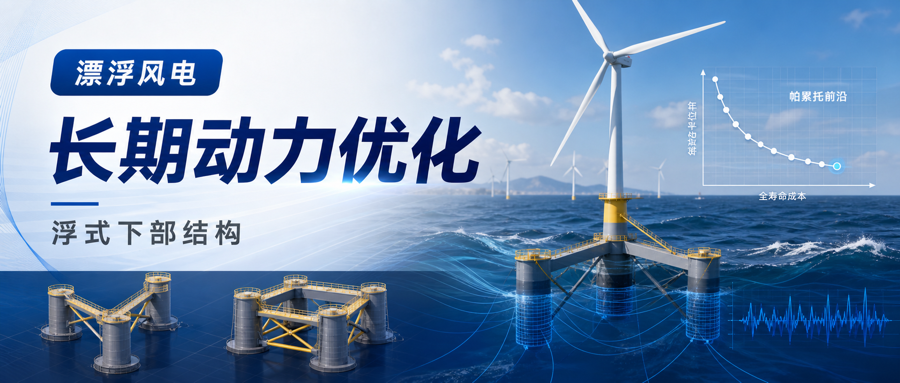

.. contents:: 本页目录
   :local:
   :depth: 2

论文信息
--------

- 中文题名：基于长期动力优化评价浮式风机下部结构设计
- 英文题名：Evaluation of floating wind turbine substructure designs by using long-term dynamic optimization
- 作者：:student-first-author:`Shengtao Zhou`\ :sup:`a`，Chao Li\ :sup:`b,*`，Yiqing Xiao\ :sup:`b`，Xiaolu Wang\ :sup:`c`，Wenyuan Xiang\ :sup:`a`，Qing Sun\ :sup:`d`
- 单位 a：China Nuclear Power Technology Research Institute Co., Ltd.，系统研究部，中国广东深圳 518121
- 单位 b：哈尔滨工业大学（深圳）土木与环境工程学院，中国广东深圳 518055
- 单位 c：东莞理工学院环境与土木工程学院，中国广东东莞 523808
- 单位 d：西安交通大学人居环境与建筑工程学院，中国陕西西安 712046（原文地址写作 Xi’an, Shanxi 712046）
- 通讯作者：Chao Li；原论文通讯邮箱：lichaosz@hit.edu.cn
- 期刊：Applied Energy，2023，352，121941
- 收稿：2023 年 2 月 28 日；修回：2023 年 8 月 20 日；录用：2023 年 9 月 10 日；在线发表：2023 年 9 月 21 日
- DOI：https://doi.org/10.1016/j.apenergy.2023.121941

研究亮点
--------

- 建立了浮式风机的降阶动力模型
- 提出高效的长期动力分析方法，并将其纳入多目标优化框架
- 优化得到在动力性能与制造成本之间具有最佳权衡的 Pareto 设计
- 将该评价方法用于两种典型半潜式浮式风机的比较

摘要
----

下部结构设计对浮式风机（floating wind turbines，FWTs）的资本支出及动力性能均具有重要影响。为了从不同设计概念中确定性价比最高的船体形状与系泊配置，本文提出一种基于长期动力优化的评价方法。为使长期动力性能评估在迭代优化过程中的计算成本可承受，采用 Kriging 代理模型近似浮式风机响应；该模型通过代表性风浪环境参数与相应短期响应之间的回归分析建立。采用一个具有八个自由度（degrees of freedom，DoFs）的高效降阶模型（reduced-order model，ROM）模拟随机风浪下的短期响应。利用 Kriging 模型得到长期性能指标，例如塔底和导缆孔处的全寿命累积疲劳损伤、平台运动及机舱加速度的峰值。通过与 OpenFAST 对比验证，确认了该模型的有效性。随后，将模型纳入多目标优化框架，以寻找长期动力性能与制造成本之间具有最佳权衡的 Pareto 最优设计。采用 NSGA-II 算法探索下部结构设计空间，同时考虑与结构固有性质及动力性能有关的约束。将该方法应用于 Y 形和方形这两种典型半潜式浮式风机。比较其 Pareto 前沿发现，在本文算例中，方形半潜式平台有望成为更有利的下部结构。在相同制造成本水平下，方形概念的塔底疲劳大多比 Y 形概念低 30%–50%。水动力是两种概念之间疲劳差异的主要原因。本研究为确定哪一种浮式风机下部结构设计进入详细设计阶段提供了决策依据。

关键词
------

浮式风机；下部结构；长期动力性能；代理模型；多目标优化

1 引言
------

降低平准化度电成本（levelized cost of energy，LCOE）是浮式风电场发展面临的最大挑战之一。Laura [1]_ 分解了浮式风电项目的全寿命支出，发现下部结构（包括浮体和系泊）占建设成本的 40% 以上，意味着该部件具有很大的降本潜力。浮式风机的动力性能也与下部结构设计相关。平台的稳性和水动力对塔顶运动有很大影响，而塔顶运动又与发电量及塔底疲劳密切相关。因此，决定采用何种下部结构十分关键，尤其是在初步设计或概念设计阶段。

如何评价具有不同船体形状和系泊配置的下部结构，是这一问题的关键。动力分析是解决该问题的必要手段。典型的时域模拟程序 OpenFAST [2]_ 采用气动－水动－伺服－弹性（aero-hydro-servo-elastic，AHSE）耦合模型，能够模拟非线性力和瞬态效应，广泛用于浮式风机设计。借助该程序，Robertson [3]_ 比较了六种具体浮式风机设计的动力荷载，包括立柱式、张力腿平台（TLP）、驳船式和半潜式。研究模拟了 IEC 61400–3 设计标准中的部分设计荷载工况。结果发现，除立柱式和半潜式系统的塔架荷载较大之外，TLP、半潜式和立柱式浮体之间的荷载差异并不显著。采用同一模拟工具，Bagbanci [4]_ 比较了立柱式和半潜式浮式风机的长期动力性能，发现半潜式概念倾向于承受更大的平台运动和塔底弯矩。在这两项研究中，每种概念仅采用了一组船体尺寸和系泊布置。这种方法带来一个疑问：如果选择不同的船体尺寸和系泊布置，比较结果是否会改变？

回答这一问题需要进行大量模拟，比较船体尺寸与系泊布置的不同组合，即探索设计空间。然而，高保真 AHSE 程序的计算成本过高，难以承担这一任务。为此，研究者开发了计算效率更高的降阶模型。Karimi [5]_ 利用 OpenFAST 的线性化功能 [6]_，将浮式风机非线性动力学近似为具有六个刚体自由度的线性状态空间模型。与 FAST 时域模拟对比的模型验证表明，平台运动及内力的最大值与标准差误差基本在 15% 以内。Lemmer 等 [7]_ 建立了一个五自由度时域降阶模型，包括浮体纵荡、纵摇、垂荡、塔架一阶前后弯曲模态和转子方位角。该模型包括线性水动力，采用 Newman 近似考虑慢漂力，并以准静态方式表示系泊荷载和气动荷载。随后，又通过状态空间方程将该时域降阶模型线性化为频域版本。开源频域模型 RAFT [8]_ 采用了类似建模技术。在 Pegalajar-Jurado 等 [9]_ 的 QuLAF 模型和 Hegseth 等 [10]_ 的半解析频域模型中，浮式风机转子受力简化为固定转子荷载谱与气动阻尼的组合，不规则波浪荷载则由线性水动力系数得到。将频率响应函数与外力结合，求解四个平面自由度，即浮体纵荡、垂荡、纵摇和塔架一阶前后弯曲模态。这些研究表明，通过合理简化，可以在不显著降低计算精度的情况下，将单个荷载工况的模拟时间降至秒级。

有了这些降阶模型，以寻找最佳船体尺寸和系泊布置组合为目标的设计空间探索便成为可能。Karimi 和 Hall [11]_ 提出一种多目标设计优化方法，其设计空间覆盖下部结构的三种稳性类别。他们对张力腿平台、立柱式浮体和半潜式平台及其系泊系统的几何形状进行了参数化。通过遗传算法（GA）充分探索设计空间，找到了动力性能与建设成本之间具有最佳权衡的 Pareto 设计。根据各自的 Pareto 前沿，评价并比较了这三种概念的适用性。该方法确保为每种概念选取的船体尺寸和系泊布置参数均处于最佳状态，从而实现公平比较。Leimeister 等 [12]_ 强调了利用多目标优化器加快迭代设计过程的方法。他们对立柱式下部结构的算例研究表明，与原设计 [13]_ 相比，该方法有助于将结构材料体积减少 31% 以上。Dou 等 [14]_ 和 Pollini 等 [15]_ 分别将 QuLAF 模型与序列二次规划（SQP）优化器相结合的单目标优化方法，应用于 10 MW 和 15 MW 风机的立柱式浮体设计。其目标是在满足多项静力及短期动力响应约束的情况下，使材料成本最小。Hegseth 等 [16]_ 建立了集成设计优化框架，采用基于梯度的优化器，同时优化平台、塔架、系泊系统和桨距控制器，并考虑疲劳及极端响应约束。他们将系统成本与电能质量的加权组合作为目标函数，获得了一种非传统的沙漏形立柱式浮体。

既有优化研究的主要局限在于对环境条件过度简化。约束与目标函数中的动力性能指标，仅根据几十个风浪同向的短期工况估计。浮式风机通常按海上运行 25 年进行设计。如此有限的荷载工况无法充分反映浮式风机在真实海洋环境中的性能，可能给优化结果带来显著不确定性。此外，大多数降阶模型仅计算二维平面内响应，因此无法模拟多方向风浪条件。

为解决这些问题，本文提出一种将多目标优化与长期动力分析技术相结合的综合评价方法。全文安排如下：首先，建立具有三维自由度的高效动力模型，以模拟任意给定浮式风机候选设计的整体响应，相关理论和数学表达将在第 2 节详细介绍。第 3 节说明基于全寿命风浪环境数据和代理建模方法的长期动力分析。随后，第 4 节建立集成设计变量、目标函数、设计约束及优化算法的优化框架。将所提出的方法用于两种典型半潜式概念的评价。第 5 节展示并讨论模型验证、收敛检查和设计比较等结果。最后，在论文末尾给出结论。

2 浮式风机高效动力模型的建立
----------------------------

浮式风机概念的设计空间探索需要进行数千次动力模拟。非线性时域 AHSE 模拟工具计算成本过高，难以完成这一任务。因此，建立一个能够揭示不同设计样本之间动力性能差异的降阶模型。该模型基于 QuLAF [11]_ 的框架建立，但作了若干扩展，使其更适用于长期动力优化场景，包括：

- 考虑三维自由度，以实现多方向风浪模拟
- 建立适用于广泛下部结构设计的通用气动阻尼数据库
- 考虑二阶水动力和黏性波浪阻力荷载
- 将降阶模型与参数化 CAD 模型连接，使任意给定候选设计的结构属性能够自动更新

本节从结构动力学、空气动力学和水动力学三个方面介绍建模方法。

2.1 结构动力学
~~~~~~~~~~~~~~

浮式风机的整体动力学，即平台／塔顶运动及塔底、导缆孔处的内力，是早期设计阶段主要关注的内容。如图 1 所示，采用八个自由度表示整体响应。刚性浮体具有六个自由度，柔性塔架具有两个模态自由度，即塔顶前后和侧向挠度。塔架离散为集中质量模型，各段质量、刚度等结构特性根据塔架截面尺寸计算。为尽量减少集中质量模型的自由度，通过模态分析得到一阶弯曲模态的振型。假设叶片挠度对整体响应的影响很小，因此将转子－机舱总成（RNA）建模为附着在塔顶的集中质量。为最大限度提高计算速度，动力模型在频域建立，其运动方程写为：

.. math::

   \left\{-\omega^2[M_{\mathrm{struc}}+A(\omega)]+i\omega B(\omega)+C\right\}q(\omega)=F(\omega)\qquad (1)

其中， :math:`\omega` 为角频率； :math:`M_{\mathrm{struc}}` 为结构的 :math:`8\times8` 质量矩阵； :math:`A` 为随频率变化的附加质量； :math:`B` 为线性阻尼矩阵； :math:`C` 为整体恢复刚度矩阵； :math:`q` 为 :math:`8\times1` 浮式风机运动向量，其前六个分量对应平台自由度，最后两个分量对应塔顶模态挠度； :math:`F` 为 :math:`8\times1` 外荷载向量。如图 1 所示，这些矩阵与向量均在位于静水面（SWL）的全局坐标系中定义。

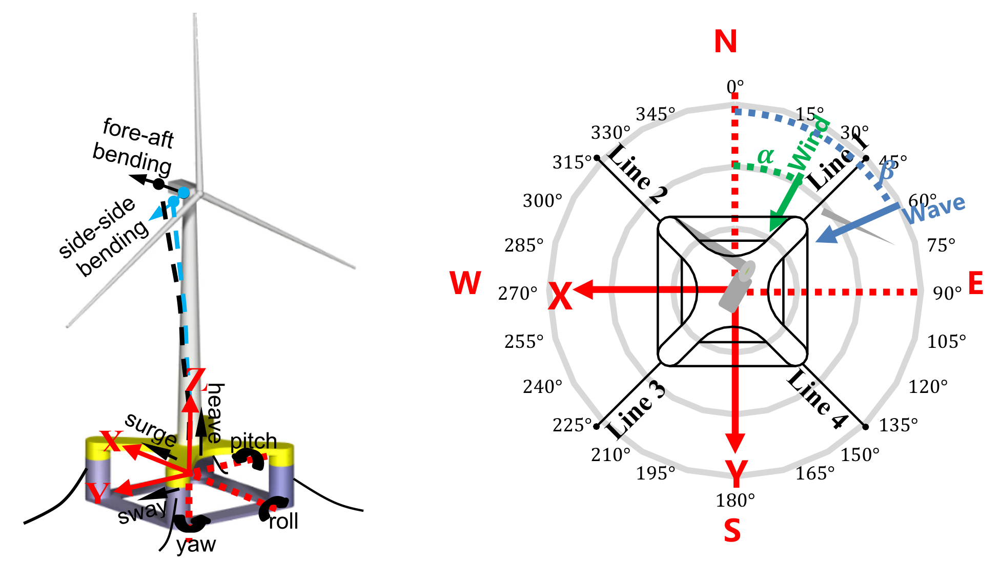

   **图 1** 自由度与全局坐标系定义。

   图中 surge、sway、heave、roll、pitch、yaw 分别为纵荡、横荡、垂荡、横摇、纵摇和艏摇；fore-aft bending、side-side bending 分别为塔架前后与侧向弯曲。Line 1–4 为四根系泊缆；Wind、Wave 为来风和来波，α、β 分别为风向和波向；N、E、S、W 分别为北、东、南、西。

:math:`C` 矩阵包含浮体静水刚度 :math:`C_{\mathrm{hs}}` 、柔性塔架结构刚度 :math:`C_{\mathrm{struc}}` 和系泊刚度 :math:`C_{\mathrm{moor}}` 的贡献：

.. math::

   C=C_{\mathrm{hs}}+C_{\mathrm{struc}}+C_{\mathrm{moor}}\qquad (2)

由于悬链线方程具有非线性，系泊恢复刚度随平台位置变化；但平台在平均位置附近发生小位移时，可以假设 :math:`C_{\mathrm{moor}}` 为常量，因为恢复力－位移曲线斜率的变化通常并不显著。平均位置取决于平均风速、海流及其方向。该位置通过系泊合力、静水恢复力、重力、浮力、平均气动荷载和海流荷载之间的静力平衡关系求解。随后，在平均位置对平台施加扰动，测量系泊恢复力／力矩。通过对力－位移曲线进行线性最小二乘拟合，估计 :math:`C_{\mathrm{moor}}` 。

:math:`B` 矩阵由四部分组成：柔性塔架的结构阻尼 :math:`B_{\mathrm{struc}}` 、转子产生的气动阻尼 :math:`B_{\mathrm{aero}}` 、浮体产生的辐射阻尼 :math:`B_{\mathrm{rad}}` 和黏性阻尼 :math:`B_{\mathrm{vis}}` ：

.. math::

   B(\omega)=B_{\mathrm{struc}}+B_{\mathrm{aero}}(\omega)+B_{\mathrm{rad}}(\omega)+B_{\mathrm{vis}}(\omega)\qquad (3)

在 :math:`B_{\mathrm{struc}}` 矩阵中，假设平台与塔架之间不存在耦合效应，因此除 :math:`(7,7)` 和 :math:`(8,8)` 位置的元素外，所有矩阵元素均为零。采用的阻尼比为 1.9%。

:math:`F` 向量包含转子的气动荷载 :math:`F_{\mathrm{aero}}^b` 、浮体的一阶和二阶水动力荷载 :math:`F_{\mathrm{hydro}}^{1\mathrm{st}}` 与 :math:`F_{\mathrm{hydro}}^{2\mathrm{nd}}` ，以及黏性阻力 :math:`F_{\mathrm{vis}}` ：

.. math::

   F(\omega)=F_{\mathrm{aero}}^b(\omega)+F_{\mathrm{hydro}}^{1\mathrm{st}}(\omega)+F_{\mathrm{hydro}}^{2\mathrm{nd}}(\omega)+F_{\mathrm{vis}}(\omega)\qquad (4)

机舱加速度以及塔底、导缆孔荷载通常值得关注，因为它们与风机运行及结构疲劳损伤密切相关。水平机舱加速度 :math:`a_{\mathrm{nac}}` 由平台运动和塔架挠度产生，因此求得 :math:`q` 后即可计算：

.. math::

   a_{\mathrm{nac},i}(\omega)=-\omega^2\left[q_i(\omega)+(-1)^{i-1}q_j(\omega)z_{\mathrm{hub}}+q_k(\omega)\right]\qquad (5)

沿 :math:`X` 轴的 :math:`a_{\mathrm{nac}}` 取 :math:`i=1,j=5,k=7` ，沿 :math:`Y` 轴取 :math:`i=2,j=4,k=8` ； :math:`z_{\mathrm{hub}}` 为轮毂高出静水面的高度。

塔底弯矩由平台平动与转动加速度、转动运动引起的重力作用，以及气动荷载共同产生：

.. math::

   \begin{aligned}
   M_{\mathrm{TwrB},i}(\omega)={}&\sum_{n=1}^{N_{\mathrm{Twr}}}(-1)^{i+1}\rho_n^{\mathrm{Twr}}\Delta z_n^{\mathrm{Twr}}\omega^2[q_i(\omega)+\phi_nq_k(\omega)]z_{\mathrm{Bs},n}\\
   &+\sum_{n=1}^{N_{\mathrm{Twr}}}\left(I_n+\rho_n^{\mathrm{Twr}}\Delta z_n^{\mathrm{Twr}}z_{\mathrm{Bs},n}^2\right)\omega^2q_j(\omega)\\
   &+\sum_{n=1}^{N_{\mathrm{Twr}}}\rho_n^{\mathrm{Twr}}\Delta z_n^{\mathrm{Twr}}g\left[q_j(\omega)z_{\mathrm{Bs},n}+(-1)^{i-1}\phi_nq_k(\omega)\right]\\
   &+(-1)^{i-1}F_{\mathrm{aero},i}^b(\omega)z_{\mathrm{Bs},\mathrm{hub}}+F_{\mathrm{aero},j}^b(\omega)
   \end{aligned}\qquad (6)

对于绕 :math:`Y` 轴的 :math:`M_{\mathrm{TwrB}}` ，取 :math:`i=1,j=5,k=7` ；对于绕 :math:`X` 轴的弯矩，取 :math:`i=2,j=4,k=8` 。 :math:`\rho_n^{\mathrm{Twr}}` 、 :math:`\Delta z_n^{\mathrm{Twr}}` 、 :math:`\phi_n` 和 :math:`I_n` 分别为第 :math:`n` 个塔架段的单位长度质量、长度、振型值和转动惯量； :math:`N_{\mathrm{Twr}}` 为塔架离散段数； :math:`z_{\mathrm{Bs},n}` 和 :math:`z_{\mathrm{Bs},\mathrm{hub}}` 分别表示第 :math:`n` 个塔架段及轮毂高出塔底的高度。

2.2 空气动力学
~~~~~~~~~~~~~~

浮式风机的空气动力学与塔顶运动强烈耦合。当塔顶运动与气流方向一致时，转子气动推力 :math:`F_{\mathrm{aero},1}^f` 为：

.. math::

   F_{\mathrm{aero},1}^f=0.5\rho_a\pi R^2C_T(v_0-v_{\mathrm{hub}})^2
   =0.5\rho_a\pi R^2C_T\left(v_0^2-2v_0v_{\mathrm{hub}}+v_{\mathrm{hub}}^2\right)\qquad (7)

其中， :math:`\rho_a` 为空气密度； :math:`R` 为转子半径； :math:`C_T` 为转子推力系数； :math:`v_0` 为转子有效风速； :math:`v_{\mathrm{hub}}` 为轮毂高度处的平动速度。由于 :math:`v_{\mathrm{hub}}` 通常远小于 :math:`v_0` ，不计最后一项是合理的，此时式（7）变为：

.. math::

   F_{\mathrm{aero},1}^f\approx0.5\rho_a\pi R^2C_Tv_0^2-\rho_a\pi R^2C_Tv_0v_{\mathrm{hub}}
   \approx F_{\mathrm{aero},1}^b-B_{\mathrm{aero}}v_{\mathrm{hub}}\qquad (8)

第一项 :math:`F_{\mathrm{aero},1}^b` 是固定基础模式下的转子气动推力，第二项与轮毂平动速度成正比，可解释为塔顶运动引起的气动阻尼。给定转子设计后，可以独立预先计算其所有正常运行条件下的六自由度固定基础气动荷载向量 :math:`F_{\mathrm{aero}}^b` 和气动阻尼系数 :math:`B_{\mathrm{aero}}` ，形成气动查找表。随后通过“组装” :math:`F_{\mathrm{aero}}^b` 与 :math:`B_{\mathrm{aero}}` ，便能快速估计 :math:`F_{\mathrm{aero}}^f` 。

本研究在 OpenFAST 中固定平台及塔顶，预先计算 :math:`F_{\mathrm{aero}}^b` ，以捕捉湍流风和转矩／桨距控制器引起的非线性荷载。随后通过快速傅里叶变换（FFT）将荷载时程转换至频域。通过对足以覆盖给定海域全部风况的广泛风速范围进行网格分箱，建立 :math:`F_{\mathrm{aero}}^b` 数据库。

气动阻尼比 :math:`\xi_{\mathrm{aero}}` 根据所研究自由度的自由衰减信号对数衰减率得到 [17]_。例如，为估计纵荡气动阻尼比 :math:`\xi_{\mathrm{aero},1}` ，在 OpenFAST 中进行静水下的时域自由衰减模拟，施加稳态风，关闭除纵荡外的所有平台自由度，同时保持控制器运行。机舱与方向为 :math:`\alpha` 的来风对齐。为保证气动阻尼是运动衰减的唯一来源，关闭辐射阻尼、黏性阻尼、结构阻尼等全部其他阻尼来源。

需要注意， :math:`\xi_{\mathrm{aero}}` 是运动频率的函数 [18]_。然而，上述自由衰减模拟只能给出结构固有频率处的阻尼比。为获得更宽频率范围内的 :math:`\xi_{\mathrm{aero}}` ，通过向结构增加额外线性刚度，调整平台运动／塔架挠度的固有频率。这些设置在 OpenFAST 的 HydroDyn 和 ElastoDyn 子程序中很容易实现。图 2 展示了 :math:`\alpha=90^\circ` 时 DTU-10 MW 参考风机 [19]_ 的 :math:`\xi_{\mathrm{aero}}` 随运动频率的变化。在低于额定风速时，平台纵荡、纵摇及塔顶挠度的阻尼比随频率增大而显著下降。在高于额定风速时，塔顶挠度阻尼仍保持这一趋势，而平台运动阻尼则呈相反趋势，且频率的影响变得较不显著。

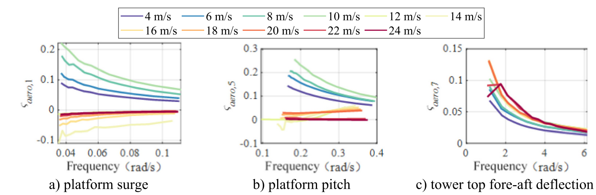

   **图 2** α = 90° 时，气动阻尼比随不同运动频率的变化。

   从左到右为 a）平台纵荡、b）平台纵摇、c）塔顶前后挠度；横轴为频率（rad/s），曲线表示 4–24 m/s 的不同风速。

建立 :math:`\xi_{\mathrm{aero}}` 查找表时，还需考虑控制器设计。桨距控制器应与下部结构设计相容，否则会产生负气动阻尼问题：调谐过于激进的桨距控制器会导致平台不稳定。Larsen 等 [20]_ 提出的一个简单降增益调谐方法，是使转子闭环特征频率低于平台纵摇固有频率。遵循该方法，预先设置九个不同闭环特征频率的桨距控制器，频率从 0.130 rad/s 到 0.250 rad/s，间隔 0.015 rad/s；这些特征频率通过 ServoDyn 输入文件中的比例及积分增益系数调节，并针对每个控制器设计估计 :math:`\xi_{\mathrm{aero}}` 。这样， :math:`\xi_{\mathrm{aero}}` 查找表便适用于广泛的浮式风机下部结构设计。对于平台纵摇固有频率为 :math:`\omega_{\mathrm{eig},5}` 的浮式风机，选取转子闭环特征频率小于且最接近 :math:`0.9\omega_{\mathrm{eig},5}` 的 :math:`\xi_{\mathrm{aero}}` 。图 3 给出了配置不同控制器时 :math:`\xi_{\mathrm{aero}}` 随风速的变化。可以看出，控制器的影响十分显著，尤其是对平台纵摇自由度。

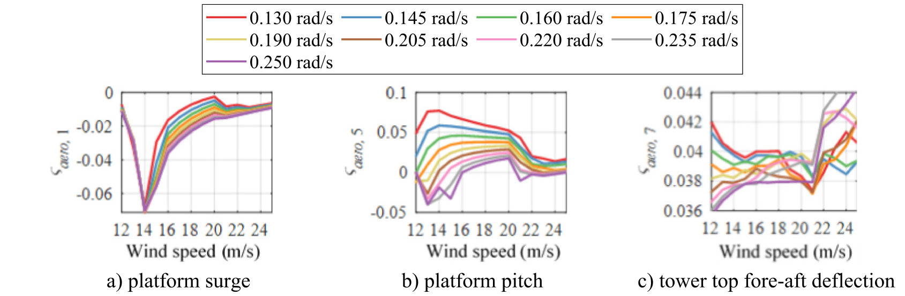

   **图 3** 配置九个桨距控制器时气动阻尼比随风速的变化。

   α = 90°；平台纵荡、纵摇及塔架弯曲固有频率分别为 0.0503 rad/s、0.207 rad/s 和 3.400 rad/s。a）平台纵荡；b）平台纵摇；c）塔顶前后挠度。横轴为风速（m/s）；图例为各控制器的闭环特征频率（rad/s）。

2.3 水动力学
~~~~~~~~~~~~

在势流求解器中计算随频率变化的水动力附加质量 :math:`A(\omega)` 、辐射阻尼 :math:`B_{\mathrm{rad}}(\omega)` 、波浪激励系数 :math:`H(\omega)` （单位波幅对应的 Froude–Krylov 力与绕射力）及平均漂移系数 :math:`\widetilde D(\omega)` 。给定随机波浪谱后，一阶和二阶水动力荷载为：

.. math::

   F_{\mathrm{hydro}}^{1\mathrm{st}}(\omega)=H(\omega)\sqrt{2S(\omega)\,d\omega}\,e^{i(\varphi_X+\varphi_S)}\qquad (9)

.. math::

   F_{\mathrm{hydro}}^{2\mathrm{nd}}(\omega_d)=\sum_{\omega_d=|\omega_m-\omega_n|}D(\omega_m,\omega_n)
   \sqrt{2S(\omega_m)\,d\omega}\sqrt{2S(\omega_n)\,d\omega}\,e^{i(\varphi_D+\varphi_m+\varphi_n)}\qquad (10)

.. math::

   D(\omega_m,\omega_n)=\frac12\left\{\operatorname{sgn}[\widetilde D(\omega_m)]+\operatorname{sgn}[\widetilde D(\omega_n)]\right\}
   \left\{|\widetilde D(\omega_m)\widetilde D(\omega_n)|\right\}^{1/2}\qquad (11)

其中， :math:`S(\omega)` 为单边波浪谱，其相位为 :math:`\varphi_S` ； :math:`\varphi_H` 和 :math:`\varphi_D` 分别为 :math:`H(\omega)` 和 :math:`D(\omega_m,\omega_n)` 的相位，而 :math:`\varphi_m` 、 :math:`\varphi_n` 分别为第 :math:`m` 和第 :math:`n` 个波浪分量的相位。这里采用 Standing 公式 [21]_，即式（11），近似差频力。式（9）中的 :math:`\varphi_X` 与本段中的 :math:`\varphi_H` 记法按原文保留。

采用 Morison 方程的二次阻力项捕捉黏性效应。为使其与频域表达相容，使用 Borgman 方法 [22]_ 进行线性化：

.. math::

   F_{D,j}^{n*}=0.5\rho_w A_j^n C_{D,j}^{n*}(v_{w,j}^n-\dot q_j^n)
   =F_{\mathrm{vis},j}^{n*}-B_{\mathrm{vis},j}^{n*}\dot q_j^n\qquad (12)

.. math::

   C_{D,j}^{n*}=C_{D,j}^n\sqrt{\frac8\pi}\,\sigma(v_{w,j}^n-\dot q_j^n)\qquad (13)

其中， :math:`F_{D,j}^{n*}` 为第 :math:`n` 个 Morison 单元沿第 :math:`j` 个方向的线性阻力激励，由阻力 :math:`F_{\mathrm{vis},j}^{n*}` 和黏性阻尼 :math:`B_{\mathrm{vis},j}^{n*}\dot q_j^n` 组成； :math:`B_{\mathrm{vis},j}^{n*}` 为线性黏性阻尼系数； :math:`\dot q_j^n` 为第 :math:`n` 个 Morison 单元沿第 :math:`j` 个方向的平动速度。等效线性阻力系数 :math:`C_{D,j}^{n*}` 是流体质点与 Morison 单元相对速度的标准差 :math:`\sigma(v_{w,j}^n-\dot q_j^n)` 以及原始阻力系数 :math:`C_{D,j}^n` 的函数。

需要注意，只有确定 :math:`F_{D,j}^{n*}` 后才能准确计算 :math:`\dot q_j^n` ，而黏性荷载又取决于 :math:`\dot q_j^n` 。为解决该问题，采用迭代方法 [23]_。具体而言，初始假定 :math:`\dot q_j^n` 为零，利用式（12）和（13）计算黏性荷载。通过式（1）求解平台运动，并据此更新 :math:`\dot q_j^n` 。重复这一过程，直至 :math:`F_{D,j}^{n*}` 收敛。将所有 Morison 单元的黏性荷载求和，得到 :math:`F_{\mathrm{vis}}` 和 :math:`B_{\mathrm{vis}}` 。

3 基于代理模型的长期动力分析
----------------------------

浮式风机按海上运行 25 年设计。在评价其动力性能时，必须充分反映环境条件的影响，因此应开展长期动力分析。传统基于分箱网格的模拟方法 [24]_ 计算成本过高，尤其是在涉及大量环境参数时。一种可行的解决办法是通过回归分析建立响应近似函数，即所谓基于代理模型的方法。这样，可以用简单的代数计算替代数值模拟，使长期动力分析在优化场景中的计算成本可承受。本节通过缅因湾算例说明该方法。

3.1 海洋气候
~~~~~~~~~~~~

本算例采用缅因大学海洋观测系统（UMOOS） [25]_ 提供的公开风浪环境数据。缅因湾有若干测量浮标，可作为场址特征描述的参考。与 LIFES50+ 项目 [26]_ 一致，选择 E01 浮标作为主要测量数据源，数据包括 2007–2018 年的半小时有效波高与波峰周期，以及 10 min 平均风速和风向。由于缺少相应数据，波向采用 E01 附近另一参考浮标 44,007 的测量数据确定。为保持一致，将风浪数据的时间间隔统一转换为 3 h。同时，使用 IEC 61400–1 标准 [27]_ 推荐的指数为 0.14 的幂律剖面，将 4 m 高度处测得的平均风速外推至轮毂高度。需要注意，由于测量数据长度不能覆盖 25 年寿命期，采用基于 Nataf 变换的环境抽样技术 [28]_ 扩展风浪环境数据。图 4 中的风玫瑰图和波浪玫瑰图概括了所研究场址的海洋气候条件。可以观察到显著的风浪不同向现象：风主要来自西南和西北，波浪则主要来自东南。

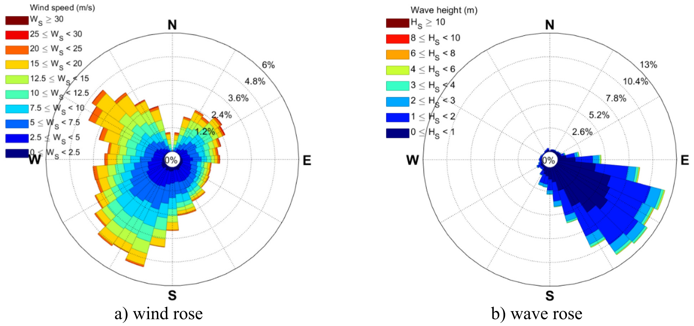

   **图 4** 缅因湾的海洋气候。

   a）风玫瑰图，颜色表示风速（m/s）；b）波浪玫瑰图，颜色表示波高（m）。环向刻度表示方位，径向刻度表示发生频率；N、E、S、W 为北、东、南、西。

3.2 代表性风浪环境数据的选择
~~~~~~~~~~~~~~~~~~~~~~~~~~~~

期望在动力性能评价中充分利用长期风浪环境数据。然而，即使采用高效降阶模型，也无法在可承受的计算成本内模拟 25 年中的全部荷载工况。因此，必须缩减风浪环境数据。

3.2.1 简化方法
^^^^^^^^^^^^^^

在多数浮式风机优化研究 [11]_ [14]_ [15]_ [16]_ 中，风浪环境数据被简化为几十个风浪同向的短期工况。参考这些做法，选取 14 个荷载工况。采用轮毂高度处从 3 m/s 到 29 m/s、步长为 2 m/s 的平均风速 :math:`v_{\mathrm{hub}}` 评价动力性能。对于每个风速，采用有效波高 :math:`H_s` 和谱峰周期 :math:`T_p` 的最可能值。这些数值及每个工况对应的概率 :math:`p` 均从联合概率分布获得。然而，该方法未考虑风向和波向的变化。风向 :math:`\alpha` 与波向 :math:`\beta` 保持一致，均从 :math:`90^\circ` 方向入射。图 5 给出了简化风浪环境数据。

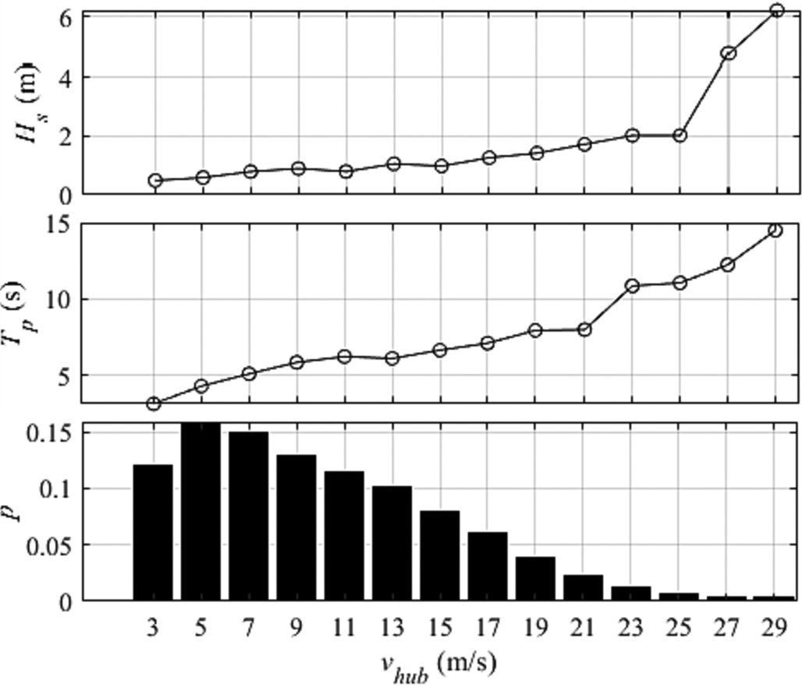

   **图 5** 简化风浪环境数据。

   横轴为轮毂高度平均风速；从上到下分别为有效波高、谱峰周期及工况概率。

3.2.2 聚类方法
^^^^^^^^^^^^^^

相比之下，聚类方法能够更好地描述环境的多样性。本文采用最大差异算法（maximum dissimilarity algorithm，MDA），因为已有研究表明，它在发现不常见海况和确定数据空间边界方面表现良好 [29]_。这一特征对数据驱动的代理建模十分重要，例如，如果训练子集未包含极端荷载工况，所建立的代理模型就不太可能准确预测类似工况。

在 MDA 中，风浪环境样本的代表性由其到已选子集的归一化距离衡量。每个风浪环境样本表示为五维向量 :math:`[v\ \alpha\ H_s\ T_p\ \beta]` 。MDA 的选择过程从数据库中一个到其余数据的归一化距离之和最大的样本开始，构成初始目标子集。随后，计算其余未选样本到目标子集的归一化距离，将距离最大的样本加入子集。迭代执行该过程，直至达到所需的代表性样本数 :math:`M` 。文献 [29]_ 详细介绍了该算法。

图 6 展示了从 25 年风浪环境数据中选出的代表性样本。可以看出，不仅环境条件最常出现的核心区域，而且稀疏区域和数据空间边界也得到了较好捕捉。选取 1000 个样本，是因为此前研究 [30]_ 发现，当样本数增加到 1000 时，代理模型误差趋于收敛。

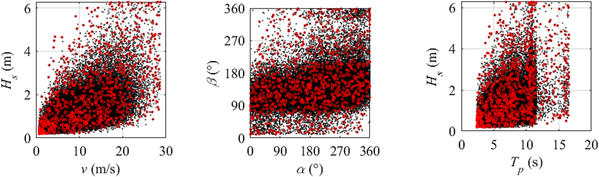

   **图 6** 代表性风浪环境数据的选择。

   黑色为全部 25 年风浪环境数据，红色为选出的代表性数据（M = 1000）。关于图例颜色，原文提示读者参阅论文网络版本。横纵轴分别展示风速与有效波高、风向与波向、谱峰周期与有效波高的组合。

3.3 代理建模
~~~~~~~~~~~~

采用频域模型模拟所选环境条件下浮式风机的动力响应。随后，通过代表性环境参数 :math:`[v\ \alpha\ H_s\ T_p\ \beta]` 与相应响应之间的回归分析，建立 Kriging 代理模型，以近似浮式风机的动力行为。

Kriging 模型是一种广泛用于模拟复杂动力系统行为的广义函数。它将描述响应函数整体趋势的回归函数，与由相关基函数组成的局部偏差模型相结合。假设给定 :math:`m` 维空间中的 :math:`M` 个输入样本 :math:`X=\{x^1,x^2,\ldots,x^M\}` 及其对应响应 :math:`Y=\{y^1,y^2,\ldots,y^M\}` ，则未知点 :math:`x^j` 处的 Kriging 预测可写为：

.. math::

   \widehat f(x^j)=\widehat\mu+\psi^T(x^j)\Psi^{-1}(Y^T-\mathbf1\widehat\mu)\qquad (14)

.. math::

   \widehat\mu=\frac{\mathbf1^T\Psi^{-1}Y^T}{\mathbf1^T\Psi^{-1}\mathbf1}\qquad (15)

其中， :math:`\mathbf1` 为长度为 :math:`M` 、元素均为 1 的列向量； :math:`\psi(x^j)` 为 :math:`x^j` 与样本数据 :math:`X` 之间的 :math:`1\times M` 相关向量； :math:`\Psi` 为样本数据之间的 :math:`M\times M` 相关矩阵。任意两点 :math:`x` 和 :math:`x'` 之间的相关函数为：

.. math::

   \operatorname{cor}[Y(x),Y(x')]=\psi(x,x')=\exp\left(-\sum_{i=1}^{m}\theta_i|x_i-x_i'|^{p_i}\right)\qquad (16)

该相关函数取决于两点之间的距离，由两组参数定义。参数 :math:`p_i` 与第 :math:`i` 维中距离增大时相关性的初始下降有关；在假定响应函数光滑连续时，通常设为 2。参数 :math:`\theta_i` 则描述一个点在各维度对邻近点的影响范围。这些参数通过最大化训练输入位置 :math:`X` 上响应值 :math:`Y` 的似然来确定，即最大似然估计（MLE）方法。

3.4 长期性能指标
~~~~~~~~~~~~~~~~

浮式风机在整个寿命期内承受脉动风浪荷载。塔底和导缆孔是两个最关键的荷载传递部位，承受较强的疲劳荷载。全寿命累积疲劳损伤的估计基于 Miner 法则。通过逆快速傅里叶变换（iFFT），将塔底弯矩谱和导缆孔张力谱转换为时程，并采用雨流计数技术得到特征应力幅历程。根据 DNV-RP-C203 [31]_ 和 DNVGL-OS-E301 [32]_ 分别给出的塔底及无档锚链 S–N 曲线，计算疲劳损伤。获得代表性荷载工况的短期疲劳损伤后，建立疲劳代理模型，用于重现整个 25 年期间的全部疲劳损伤值。最后，将所有预测数据求和，即得到塔底和导缆孔的全寿命累积疲劳损伤 :math:`D_{\mathrm{TwrBs}}` 、 :math:`D_{\mathrm{Frld}}` ，并用其表征结构长期动力性能。采用塔底各校核点和各导缆孔中最大的疲劳损伤值。

此外，还应关注结构的运动响应，因为它与风机运行密切相关。平台倾斜运动会对齿轮箱内的润滑分布或轴承受力产生不利影响。机舱加速度也会对发电产生负面作用。如果加速度超过给定阈值，风机将停机，以避免传动系统过载。本研究采用超越概率为 10% 的平台倾斜角峰值和机舱加速度峰值 :math:`q_{\mathrm{heel},10p}` 、 :math:`a_{\mathrm{nac},10p}` 表征运动性能。具体而言，训练代理模型预测 25 年中每个短期海况下的响应最大值。提取仅有 10% 海况超过的数值，作为结构的运动性能指标。

为减小统计不确定性，对每个荷载工况分别模拟六个具有不同随机实现的 1 h 随机风场与波浪场，并对各次实现的动力响应取平均。

4 长期动力优化
--------------

第 2、3 节为具有特定船体尺寸和系泊配置的浮式风机结构提供了高效评价工具。然而，如第 1 节所述，只有充分探索设计空间，才能确定一个设计概念的实际性能。为此，建立一个与基于代理模型的长期动力分析相结合的优化流程，并将其用于两种典型半潜式浮式风机。

4.1 设计变量
~~~~~~~~~~~~

本算例考虑两种钢制半潜式平台，在 130 m 水深下支承 DTU-10 MW 参考风机 [19]_。如图 7 所示，方形平台的四根立柱布置在风机中心线周围，通过顶部的 X 形甲板和底部的方形浮筒相连。平台配置四根悬链线式系泊缆，相邻缆线之间夹角为 :math:`90^\circ` 。Y 形平台同样具有四根立柱。中心立柱位于风机塔架下方，三根外部立柱布置在中心线周围，并通过底部的 Y 形浮筒相连。其系泊系统由三根悬链线组成，相邻缆线夹角为 :math:`120^\circ` 。这两种平台分别源自 NAUTILUS 和 OO-Star 概念 [33]_。

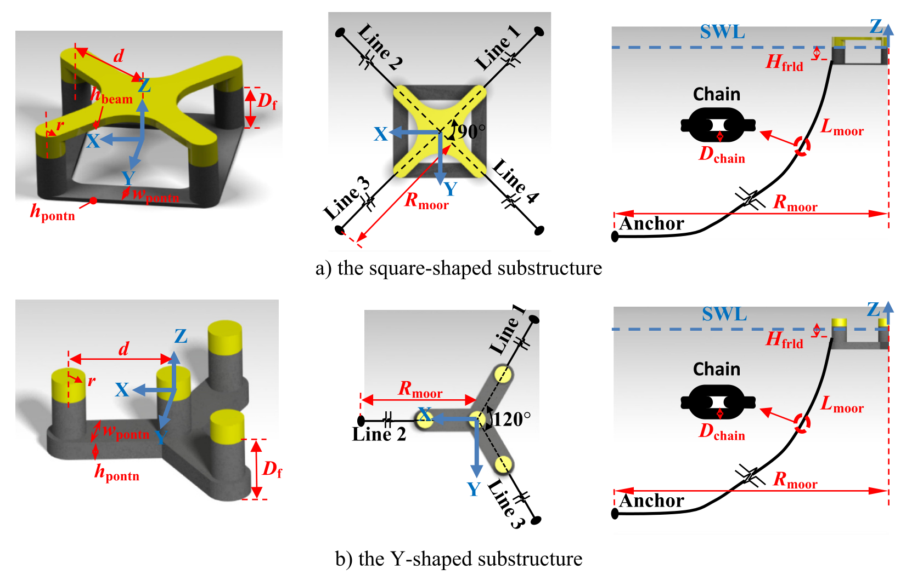

   **图 7** 所研究浮式风机的平台配置与系泊布置。

   a）方形下部结构；b）Y 形下部结构。SWL 为静水面，Chain 为链条，Anchor 为锚；Line 为系泊缆编号。各几何符号对应表 1 的设计变量。

如图 7 所示，确定浮式风机下部结构设计涉及大量几何参数。对结构进行完全参数化会形成高维设计空间，要获得收敛的优化结果，需要大量计算资源。更高效的方法是将对目标函数重要的参数选为自由变量，同时在整个优化过程中保持较不重要的参数不变。此前的敏感性研究 [34]_ 表明，平台吃水、立柱半径和立柱间距，是影响平台制造成本与水动力性能最显著的三个尺寸参数；系泊长度和链径则与导缆孔荷载最相关。因此，将这五个参数选为独立变量。包括塔架在内的其他参数保持不变，或由独立变量推导。表 1 列出了构成优化设计空间的设计变量及其取值范围。

.. list-table:: 表 1 设计变量
   :header-rows: 1
   :widths: 23 10 8 16 10 16 10

   * - 尺寸参数
     - 变量类型
     - 单位
     - 方形：范围
     - 方形：步长
     - Y 形：范围
     - Y 形：步长
   * - 吃水 :math:`D_f`
     - 独立
     - m
     - [14, 34]
     - 2
     - [14, 34]
     - 2
   * - 立柱半径 :math:`r`
     - 独立
     - m
     - [3, 8]
     - 1
     - [3, 8]
     - 1
   * - 立柱间距 :math:`d`
     - 独立
     - m
     - [18, 46]
     - 2
     - [18, 46]
     - 2
   * - 甲板高度 :math:`h_{\mathrm{beam}}`
     - 常量
     - m
     - 3
     - —
     - —
     - —
   * - 浮筒宽度 :math:`w_{\mathrm{pontn}}`
     - 从属
     - m
     - :math:`2r`
     - 2
     - :math:`2.4r`
     - 2.4
   * - 浮筒高度 :math:`h_{\mathrm{pontn}}`
     - 常量
     - m
     - 1.5
     - —
     - 7
     - —
   * - 壁厚 :math:`t_{\mathrm{wall}}`
     - 常量
     - mm
     - 35.6
     - —
     - 35.6
     - —
   * - 系泊长度 :math:`L_{\mathrm{moor}}`
     - 独立
     - m
     - [770, 970]
     - 20
     - [770, 970]
     - 20
   * - 链径 :math:`D_{\mathrm{chain}}`
     - 独立
     - mm
     - [100, 180]
     - 10
     - [100, 180]
     - 10
   * - 锚点半径 :math:`R_{\mathrm{moor}}`
     - 从属
     - m
     - :math:`L_{\mathrm{moor}}`
     - 20
     - :math:`L_{\mathrm{moor}}`
     - 20
   * - 导缆孔高度 :math:`H_{\mathrm{frld}}`
     - 常量
     - m
     - −6.3
     - —
     - −6.3
     - —

需要注意，船体壁面刚度保持不变，因为结构强度不在本研究范围内，而且壁面刚度的变化不会显著影响动力响应。另一个原因是，结构分析通常依赖复杂的有限元（FEM）模型 [35]_，其计算成本对迭代优化而言过高。简化浮式平台的耦合结构模型，仍是浮式风电行业的一项重大挑战。压载根据船体排水量与系统总重量之间的平衡自动确定。

4.2 代价函数
~~~~~~~~~~~~

代价函数用于量化某一浮式风机具体设计的适用性。为了寻找性价比最高的下部结构设计，建立同时考虑长期动力性能与制造成本的代价函数。

如第 3.4 节所述，采用塔底和导缆孔的全寿命累积疲劳损伤 :math:`D_{\mathrm{TwrBs}}` 与 :math:`D_{\mathrm{Frld}}` 表征浮式风机动力性能，并将疲劳最小化选作优化目标。原因有二：首先，疲劳是长期指标，比平台运动或机舱加速度更能反映综合荷载水平；其次，它也反映了下部结构延长服役寿命的潜力，这可能为浮式风电项目带来显著收益。

浮式下部结构的总建设支出涉及许多方面。本文仅关注与结构尺寸有关的制造成本。根据文献 [36]_，总制造成本包括材料成本、人工成本和间接成本。对于钢制下部结构，人工成本主要与焊缝长度及涂装面积有关 [37]_。图 8 给出了立柱和梁／浮筒构件的焊缝布置示例。采用长 10 m、宽 4 m 的原始钢板。焊接成本由焊接时间 [37]_ 乘以人工单价计算。涂装成本根据 Tizani 等 [38]_ 提出的单位面积涂装价格估计。需要注意，这些成本主要来自两部分：一部分是随船体配置变化的外部钢材用量，另一部分是满足强度要求所需的内部钢材用量。由于本文未校核船体强度，仅考虑第一部分的贡献。系泊缆成本采用类似方法估计。间接成本不直接与制造过程有关，却是开展经营活动所必需的，例如人事管理、办公材料、折旧等。根据工程经验，间接成本约占总制造成本的 27% [36]_。最终，总制造成本 :math:`TC` 按下式估计：

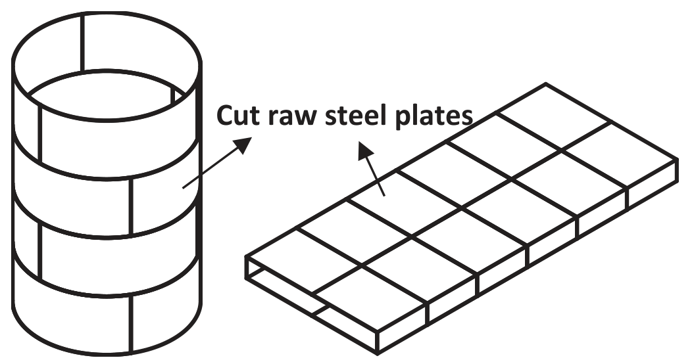

   **图 8** 圆形立柱与矩形梁／浮筒的焊缝布置。

   箭头标注 Cut raw steel plates，意为切割后的原始钢板。

.. math::

   TC=\left(m_{\mathrm{ptfm}}P_{\mathrm{steel}}+m_{\mathrm{blst}}P_{\mathrm{blst}}+T_wP_{\mathrm{labor}}+A_{\mathrm{ptfm}}P_{\mathrm{paint}}+m_{\mathrm{moor}}P_{\mathrm{moor}}\right)/0.73\qquad (17)

其中， :math:`m_{\mathrm{ptfm}}` 、 :math:`m_{\mathrm{blst}}` 和 :math:`m_{\mathrm{moor}}` 分别为平台、压载和系泊缆质量； :math:`T_w` 为焊接制造时间； :math:`A_{\mathrm{ptfm}}` 为平台表面积； :math:`P_{\mathrm{steel}}` 、 :math:`P_{\mathrm{blst}}` 、 :math:`P_{\mathrm{labor}}` 、 :math:`P_{\mathrm{paint}}` 和 :math:`P_{\mathrm{moor}}` 分别为钢材、压载、人工、涂装及系泊单价，见表 2。需要注意，这些价格存在一定不确定性，会随时间变化，并可能通过权衡效应影响优化结果。不过，敏感性分析 [34]_ 表明，该评价体系对价格变化相当不敏感。

.. list-table:: 表 2 制造成本估计所用价格
   :header-rows: 1
   :widths: 40 20 20 20

   * - 价格
     - 单位
     - 数值
     - 参考文献
   * - 钢材 :math:`P_{\mathrm{steel}}`
     - €/kg
     - 0.491
     - [39]_
   * - 压载 :math:`P_{\mathrm{blst}}`
     - €/kg
     - 0.070
     - —
   * - 人工 :math:`P_{\mathrm{labor}}`
     - €/h
     - 17.052
     - [40]_
   * - 涂装 :math:`P_{\mathrm{paint}}`
     - $/m²
     - 14.400
     - [37]_
   * - 系泊 :math:`P_{\mathrm{moor}}`
     - €/kg
     - 2
     - [41]_

表 2 的涂装币种按原文保留为美元，其余价格为欧元。

综上，评价指标包括总制造成本 :math:`TC` 、塔底疲劳 :math:`D_{\mathrm{TwrBs}}` 和导缆孔疲劳 :math:`D_{\mathrm{Frld}}` 。不采用权重系数将这些指标合并为单一总代价函数，而是在多目标优化过程中同时使它们最小：

.. math::

   \min\left(f_1=TC,\ f_2=D_{\mathrm{TwrBs}},\ f_3=D_{\mathrm{Frld}}\right)\qquad (18)

4.3 约束条件
~~~~~~~~~~~~

采用与结构固有性质和动力性能有关的约束，筛除不可行设计。在代价函数评价的预处理阶段检查固有性质，以免不满足浮式结构基本设计准则的方案进入计算成本高昂的动力分析。施加以下五项约束：

- 额定风况下的平均平台纵摇角 :math:`\bar q_5` 必须小于 :math:`10^\circ` ，以确保平台具有足够稳性，抵抗风浪引起的倾覆力矩
- 平台垂荡、横摇、纵摇固有频率 :math:`\omega_{\mathrm{eign},3}` 、 :math:`\omega_{\mathrm{eign},4}` 、 :math:`\omega_{\mathrm{eign},5}` 必须分别小于 0.370 rad/s、0.314 rad/s 和 0.314 rad/s，以避免显著的波致共振
- 塔架一阶弯曲特征频率 :math:`\omega_{\mathrm{eign},7}` 必须位于叶片通过频率（3P）及其倍频（6P）之间，以避免转子推力波动引起塔顶共振
- 额定风况下，至少十分之一的系泊长度应躺在海床上，以避免缆链拉直产生过大张力，并避免拖曳埋入式锚发生拖移失效
- 额定风况下，平台平均平动位移必须小于水深的 15%，以避免动力电缆损坏

随后进行动力分析，检查给定环境条件下的长期响应：

- 超越概率为 10% 的平台倾斜角峰值 :math:`q_{\mathrm{tilt},10p}` 必须小于 :math:`10^\circ` ，以保证所选平台具有良好的运动性能
- 超越概率为 10% 的机舱加速度峰值 :math:`a_{\mathrm{nac},10p}` 必须小于 :math:`0.3g` ，以避免传动系统过载
- 塔底全寿命疲劳损伤 :math:`D_{\mathrm{TwrBs}}` 必须小于 1.5
- 导缆孔全寿命疲劳损伤 :math:`D_{\mathrm{Frld}}` 必须小于 1.5
- 塔底截面最大正应力 :math:`\sigma_{\mathrm{TwrBs},\max}` 必须小于钢材屈服强度 :math:`\sigma_y`
- 最大导缆孔张力 :math:`T_{\mathrm{Frld},\max}` 必须小于链条破断载荷 :math:`S_b`

选用相对宽松的疲劳限值有两个原因：第一，数值模型的不确定性可能影响疲劳预测，例如线性黏性阻尼可能无法完全捕捉平台真实的阻尼特征；第二，期望在早期设计阶段让更多设计参与竞争。

4.4 优化算法
~~~~~~~~~~~~

对于大多数工程问题，最优设计并非唯一，因为代价函数通常存在多个局部最小值。只找到一个最优设计也有风险：如果所选方案在某些难以于早期设计阶段考虑的方面，不能满足详细设计阶段的要求，就意味着没有备选方案。此时只能返回并重新搜索设计空间，对设计过程产生不利影响。

以寻找 Pareto 最优解为目标的多目标优化能够解决这些问题。Pareto 最优解在各代价函数之间具有最佳权衡，被定义为一组非支配解。给定两个设计样本 :math:`X_a` 和 :math:`X_b` ，其目标（代价函数）为 :math:`f_i(X_a)` 和 :math:`f_i(X_b)` ，其中 :math:`i` 表示第 :math:`i` 个目标， :math:`i=1,2,\ldots,n` ；当且仅当 a）对于所有 :math:`i\in\{1,2,\ldots,n\}` ，均有 :math:`f_i(X_a)\leq f_i(X_b)` ，且 b）存在 :math:`i\in\{1,2,\ldots,n\}` ，使 :math:`f_i(X_a)<f_i(X_b)` 时， :math:`X_a` 支配 :math:`X_b` 。对于非支配解，不牺牲至少一个其他目标，就无法改善其任一目标。

采用广泛使用的多目标优化器 NSGA-II（第二代非支配排序遗传算法），权衡动力性能和制造成本。NSGA-II 是一种遗传算法，通过模拟生物繁殖、竞争和选择过程，寻找进化过程中能够存活的种群。Deb 等 [42]_ 对该算法作了全面说明。关于 NSGA-II 的常规设置，初始种群规模依据一般经验法则 [43]_ 确定，即种群大小约为自由变量数量的十倍。当满足以下两个停止准则之一时，优化循环结束：达到允许的最大代数 :math:`t_{\max}` ，或用于量化每次迭代改进程度的相互支配率（mutual domination rate，MDR） [44]_ :math:`I_t` 小于阈值 :math:`I_s` 。本研究取阈值 :math:`I_s=0.03` 。

5 结果与讨论
------------

5.1 模型验证
~~~~~~~~~~~~

在开始下部结构优化前，采用时域 AHSE 程序 OpenFAST 对第 2 节建立的降阶模型进行验证。本次验证使用的方形和 Y 形下部结构，其船体尺寸和系泊配置与原始 NAUTILUS 和 OO-Star 概念相同；但需要说明，对原始 OO-Star 设计作了部分修改：平台改为钢制、增加系泊长度并去除集中配重，而恢复刚度与原设计保持一致。

5.1.1 固有周期
^^^^^^^^^^^^^^

首先检查浮式风机的固有周期。降阶模型通过求解无阻尼特征值问题获得固有周期，OpenFAST 则通过时域自由衰减模拟得到。表 3 比较了纵荡、垂荡、纵摇、艏摇以及塔架一阶前后弯曲模态的固有周期。结果具有良好一致性。相对误差小于 5%，说明降阶模型中的结构质量和刚度矩阵得到了正确实现。

.. list-table:: 表 3 降阶模型与 OpenFAST 的浮式风机固有周期比较
   :header-rows: 1
   :widths: 13 15 14 14 14 14 20

   * - 构型
     - 模型
     - 纵荡
     - 垂荡
     - 纵摇
     - 艏摇
     - 塔架前后弯曲模态
   * - 方形
     - ROM
     - 114.19 s
     - 19.22 s
     - 29.78 s
     - 91.36 s
     - 1.81 s
   * - 方形
     - OpenFAST
     - 114.35 s
     - 19.24 s
     - 30.23 s
     - 91.34 s
     - 1.89 s
   * - 方形
     - 误差
     - −0.14%
     - −0.10%
     - −1.77%
     - 0.03%
     - −4.66%
   * - Y 形
     - ROM
     - 172.59 s
     - 18.99 s
     - 24.55 s
     - 103.24 s
     - 1.71 s
   * - Y 形
     - OpenFAST
     - 172.46 s
     - 18.83 s
     - 25.21 s
     - 102.40 s
     - 1.70 s
   * - Y 形
     - 误差
     - 0.08%
     - 0.85%
     - 2.62%
     - 0.82%
     - 0.59%

5.1.2 响应标准差
^^^^^^^^^^^^^^^^

代理模型对长期动力响应的预测取决于代表性荷载工况的模拟精度。图 9 比较了 MDA 所选风浪条件下（见图 6），降阶模型与 OpenFAST 的六自由度运动响应标准差，包括平台纵荡、横荡、横摇、纵摇，以及塔顶前后和侧向挠度。红色、绿色和蓝色点分别对应低于额定风速、高于额定风速及停机风况。令人鼓舞的是，尽管代表性荷载工况包含大量风浪不同向情况，使浮式风机动力行为更复杂，降阶模型与 OpenFAST 仍吻合良好，多数工况的相对误差约为 10%。发现相对误差较大、达到 10%–25% 的工况处于高于额定风速的条件下，意味着桨距控制器造成的非定常动力效应未被完全捕捉。在降阶模型的简化气动模型中，桨距控制器的影响部分体现在气动阻尼 :math:`B_{\mathrm{aero}}` 内。 :math:`B_{\mathrm{aero}}` 由稳态风条件下的自由衰减模拟得到，未必适用于湍流风模拟，因为后者存在桨距控制器与湍流风之间的强耦合。气动阻尼估计不准确，可能是误差的主要原因。为验证这一判断，对方形平台在高于额定风速的工况下进行 OpenFAST 模拟： :math:`v_{\mathrm{hub}}=13.01\ \mathrm{m/s}` ， :math:`\alpha=39.90^\circ` ， :math:`H_s=3.32\ \mathrm m` ， :math:`T_p=7.80\ \mathrm m` ， :math:`\beta=182.61^\circ` 。关闭动态入流、动态失速等非定常效应，并施加与降阶模型一致的线性黏性阻尼，使气动阻尼成为两模型差异的主要来源。图 10 比较了运动响应谱。结果表明，降阶模型的共振响应幅值小于 OpenFAST，说明其倾向于高估额定以上风况下的气动阻尼。此处 :math:`T_p` 的单位按原文保留为 m；它在本文其他位置定义为波峰周期。

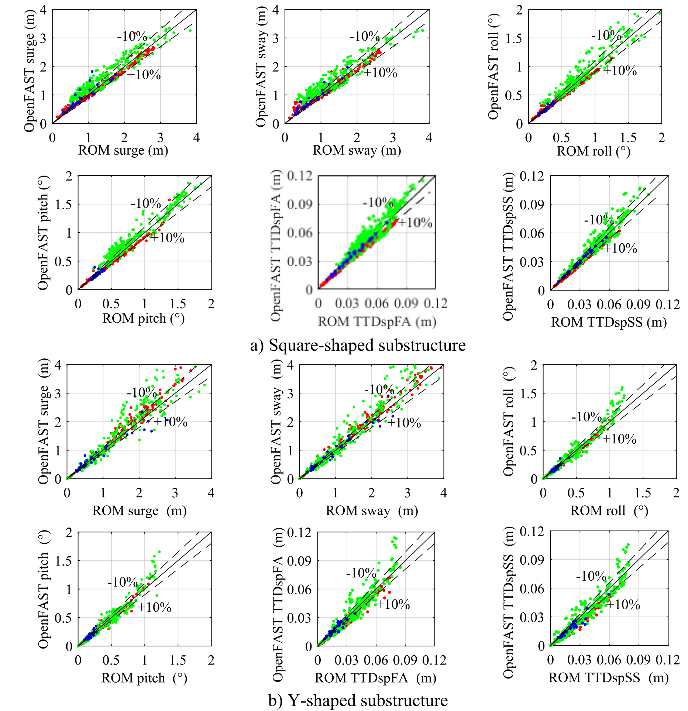

   **图 9** 1000 个代表性风浪工况下，降阶模型与 OpenFAST 六自由度运动响应标准差的比较。

   a）方形下部结构；b）Y 形下部结构。横轴为 ROM，纵轴为 OpenFAST；六项依次为纵荡、横荡、横摇、纵摇、塔顶前后挠度（TTDspFA）和侧向挠度（TTDspSS）。红、绿、蓝点分别对应低于额定风速、高于额定风速及停机工况；虚线为 ±10% 偏差线。

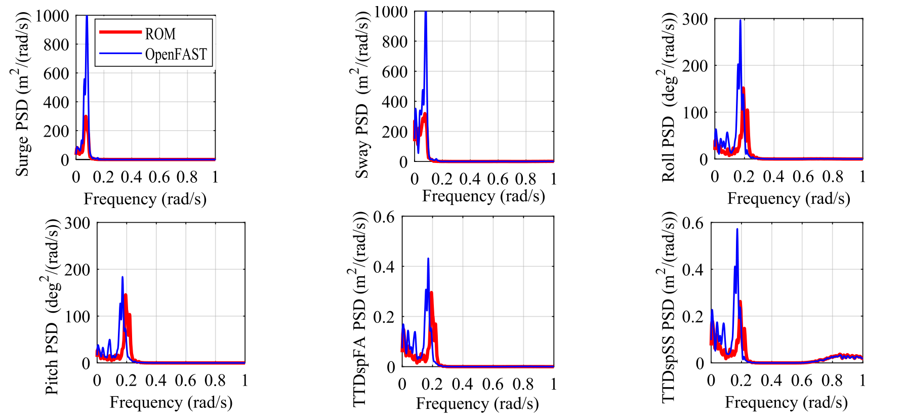

   **图 10** 高于额定风速工况下，降阶模型与 OpenFAST 六自由度运动响应功率谱密度（PSD）的比较。

   红线为 ROM，蓝线为 OpenFAST；横轴为频率，纵轴为相应响应的功率谱密度。六个子图依次为纵荡、横荡、横摇、纵摇、塔顶前后挠度和侧向挠度。

不过，从工程角度看，这种简化气动模型仍然有意义。出于知识产权保护原因，风机制造商与结构设计单位之间对翼型和控制器相关信息的传递存在严格限制，使完全耦合模拟难以实现。在简化模型中，浮式风机气动荷载 :math:`F_{\mathrm{aero}}^f` 由固定基础模式下的气动荷载 :math:`F_{\mathrm{aero}}^b` 与气动阻尼 :math:`B_{\mathrm{aero}}` 组成，这两者都更容易从风机制造商获得。这将为下部结构设计带来很大的自主性与便利，尤其是在早期设计阶段。另一个优势是提高计算效率。预先独立计算覆盖广泛运行条件的 :math:`F_{\mathrm{aero}}^b` 和 :math:`B_{\mathrm{aero}}` 查找表后，对于给定环境条件，可通过组装插值得到的 :math:`F_{\mathrm{aero}}^b` 与 :math:`B_{\mathrm{aero}}` ，快速估计 :math:`F_{\mathrm{aero}}^f` ，无需再投入额外计算。

式（5）和（6）表明，塔底弯矩和机舱加速度是平台运动与塔架挠度的函数，因此其误差水平与运动响应大体相同，如图 11 所示。对于导缆孔处系泊张力，图 12 表明，当张力标准差小于 :math:`1\times10^5\ \mathrm N` 时，两模型吻合良好；超过该范围，误差逐渐增大。这可能归因于二次与线性黏性阻力激励之间的固有差异，如图 13 所示。当单元速度小于 0.15 m/s 时，线性阻力激励（见式（12））与 Morison 方程二次阻力项吻合良好，使降阶模型在温和海况下对纵荡／横荡固有频率处导缆孔张力幅值的预测能够与 OpenFAST 同样准确。然而，随着海况变得更剧烈，线性化阻力激励小于非线性模型，因此降阶模型中的系泊响应更低。尽管存在这些误差，图 9–12 仍表明，降阶模型与非线性 OpenFAST 模型高度相关。

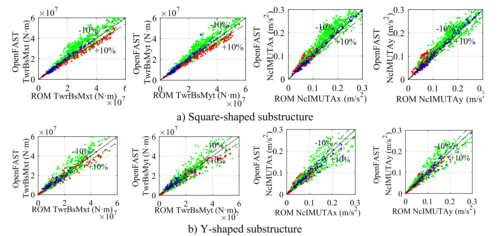

   **图 11** 1000 个代表性风浪工况下，降阶模型与 OpenFAST 塔底弯矩及机舱加速度标准差的比较。

   a）方形下部结构；b）Y 形下部结构。横轴为 ROM，纵轴为 OpenFAST；从左到右为两个方向的塔底弯矩 TwrBsMxt、TwrBsMyt，以及两个方向的机舱加速度 NclMUTAx、NclMUTAy。点颜色和 ±10% 偏差线含义同图 9。出版版原图顶排部分最右刻度和机舱横向加速度单位存在内部截断；该加速度单位为 m/s²，图像按出版版保留。

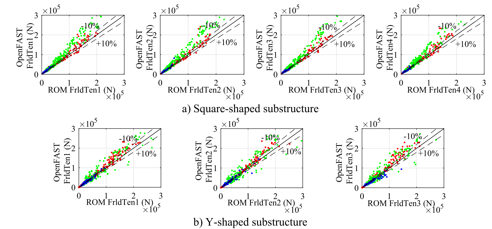

   **图 12** 1000 个代表性风浪工况下，降阶模型与 OpenFAST 导缆孔系泊张力标准差的比较。

   a）方形下部结构的四根缆线；b）Y 形下部结构的三根缆线。FrldTen 为对应编号导缆孔的张力；横轴为 ROM，纵轴为 OpenFAST。点颜色和偏差线含义同图 9。

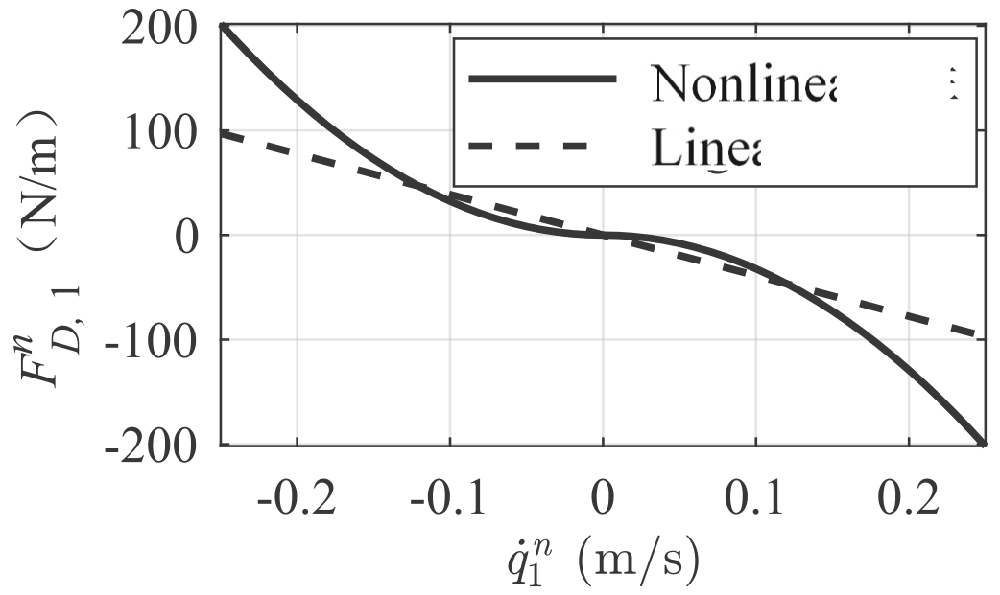

   **图 13** 作用于第 n 个 Morison 单元的非线性及线性水平黏性阻力激励随单元速度的变化。

   横轴为单元速度（m/s），纵轴为水平阻力激励（N/m）；实线表示非线性模型，虚线表示线性模型。出版版原图图例局部被遮盖，本图保持原图，线型含义以此中文说明补足。

采用第 3 节的代理建模技术，预测 25 年间的动力响应。图 14–16 给出了响应标准差的概率密度函数（PDF）。方形和 Y 形下部结构的结果分别以红色和蓝色表示。降阶模型与 OpenFAST 的响应分布吻合较好，说明两模型的长期动力行为相似。两种下部结构之间的差异也得到了捕捉。由于降阶模型倾向于低估剧烈海况中的响应，其概率密度曲线右尾较低。这可能影响与 :math:`q_{\mathrm{tilt},10p}` 和 :math:`a_{\mathrm{nac},10p}` 有关的约束评估，但不太可能显著损害代价函数，因为温和与中等海况对结构疲劳的贡献最大 [45]_。

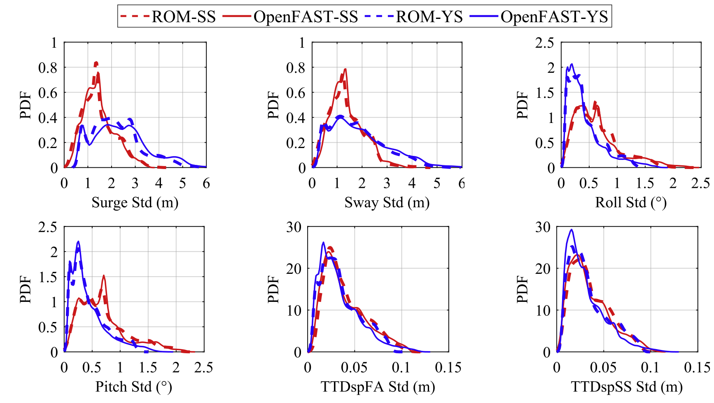

   **图 14** 25 年间，降阶模型与 OpenFAST 六自由度运动标准差概率密度函数的比较。

   红色表示方形下部结构（SS），蓝色表示 Y 形下部结构（YS）；虚线为 ROM，实线为 OpenFAST。PDF 为概率密度，Std 为标准差；六个子图依次为纵荡、横荡、横摇、纵摇、塔顶前后及侧向挠度。

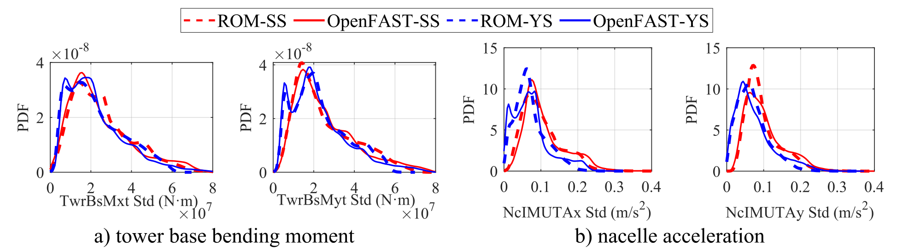

   **图 15** 25 年间，降阶模型与 OpenFAST 塔底弯矩及机舱加速度标准差概率密度函数的比较。

   a）塔底弯矩，含两个方向；b）机舱加速度，含两个方向。红色为方形、蓝色为 Y 形；虚线为 ROM，实线为 OpenFAST。

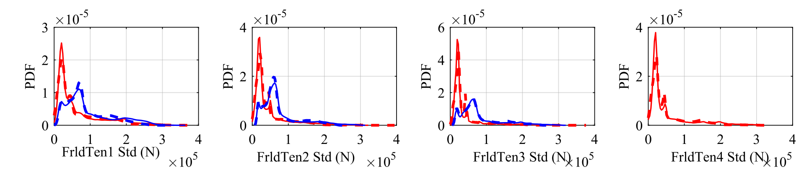

   **图 16** 25 年间，降阶模型与 OpenFAST 导缆孔张力标准差概率密度函数的比较。

   四个子图依次对应 1–4 号导缆孔；Y 形仅有三根系泊缆。红色为方形、蓝色为 Y 形；虚线为 ROM，实线为 OpenFAST。

5.2 计算效率
~~~~~~~~~~~~

降阶模型显著提高了动力性能评价效率。表 4 比较了降阶模型与 OpenFAST 的计算速度。所列模拟时间对应一台配备 3 GHz 处理器的标准个人计算机，进行 4000 s 风浪联合作用模拟，线性频域计算采用 680 个频率。降阶模型在预处理阶段花费更多时间，包括建立固定基础气动荷载查找表（69 个湍流风工况，每个计算时间 680 s）和气动阻尼查找表（22 个风速、5 个风向、6 个自由度、13 个转子闭环特征频率，每次自由衰减模拟计算时间 300 s）。每种风机转子只需进行一次这样的预处理。系泊动力学和水动力学同样如此：只有采用新的系泊系统或新平台时，才需重新计算风－刚度关系和水动力系数。尽管 OpenFAST 的预处理更快，但每个时间步都要解决 AHSE 耦合问题，单个海况模拟共需 1930 s。得益于全面预处理，频域计算可在 1.5 s 内完成。所需性能评价次数越多，降阶模型的优势越明显。例如，优化过程中需检查 1000 个浮式风机设计，每个设计模拟 1000 个荷载工况，降阶模型仅需 1403 h，比 OpenFAST 的 541,790 h 快近 386 倍。如果采用多核处理器并行运行代码，实际计算时间可缩短至一天以内。本节和表 4 的 13 个闭环特征频率，与第 2.2 节的九个控制器均按原文保留。

.. list-table:: 表 4 降阶模型与 OpenFAST 计算速度比较
   :header-rows: 1
   :widths: 15 45 20 20

   * - 模型
     - 预处理
     - 一个浮式风机设计、一个海况的模拟
     - 1000 个设计、每个设计 1000 个海况的模拟
   * - ROM
     - 固定基础气动荷载查找表：69 × 680 s；气动阻尼查找表：22 × 5 × 6 × 13 × 300 s；系泊刚度查找表：180 s；水动力：450 s；其他：300 s
     - 1.5 s
     - 1403 h
   * - OpenFAST
     - 水动力：450 s；其他：20 s
     - 1930 s
     - 541,790 h

5.3 收敛分析
~~~~~~~~~~~~

为获得高质量优化结果，对设计空间探索的收敛过程进行检查。如图 17 所示，优化初期 MDR 快速下降，表明种群内部发生了显著改进。当代数达到 40 时，下降速率明显减缓，因为更难找到制造成本和动力响应更低的个体。方形和 Y 形下部结构优化的代数分别达到 130 和 112 时，MDR 达到停止阈值 0.03。这表明优化过程已经达到良好收敛水平。

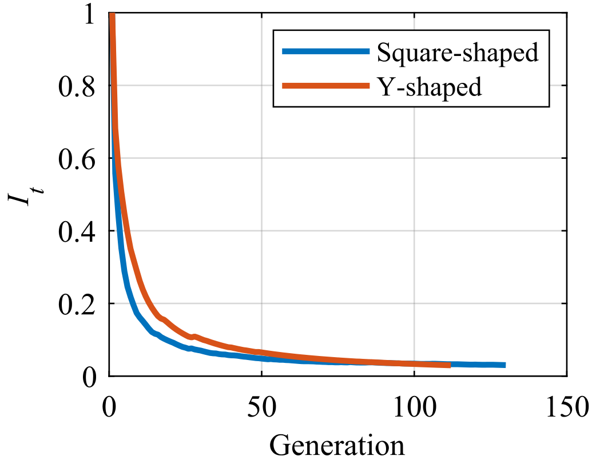

   **图 17** 多目标优化的收敛过程。

   横轴 Generation 为迭代代数，纵轴为相互支配率 Iₜ；蓝线为方形，橙线为 Y 形。

5.4 最优设计
~~~~~~~~~~~~

5.4.1 环境输入的影响
^^^^^^^^^^^^^^^^^^^^

以方形下部结构为例，图 18 比较了两种不同环境输入获得的最优设计。第一种采用图 5 所示的简化风浪环境数据（simplified met-ocean data，SMD），另一种采用长期风浪环境数据（long-term met-ocean data，LMD）。可见船体形状与系泊存在显著差异，92.5% 的设计样本不一致。SMD 倾向于选择立柱半径 6 m、吃水 20–30 m 的设计，而 LMD 中超过 70% 的 Pareto 设计采用 7 m 立柱半径，但吃水较小，多数小于 26 m。对于系泊，SMD 给出的设计更保守。在链径相同时，SMD 更倾向于选择较长的系泊缆。尽管存在这些差异，两种方法的 :math:`d-D_{\mathrm{chain}}` 图仍表现出相似趋势：立柱间距较大的平台更适合配置大尺寸系泊链。

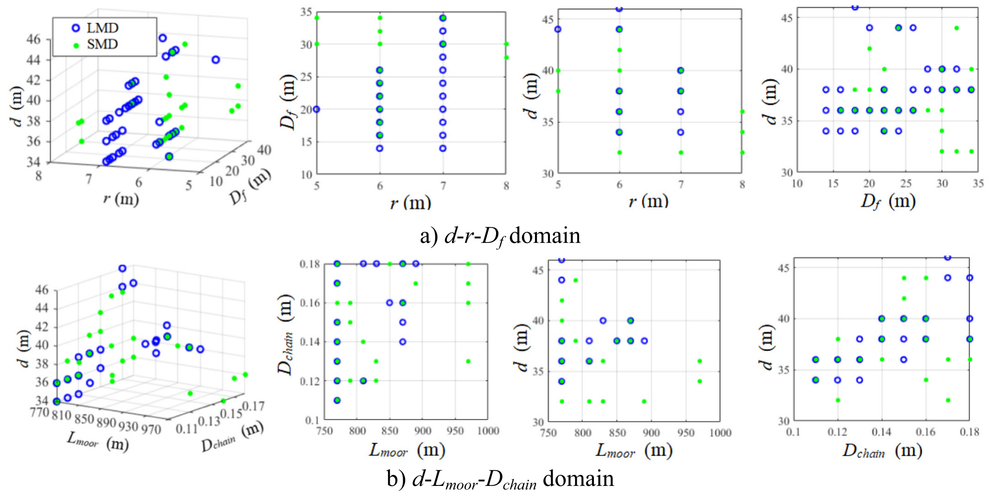

   **图 18** 两种不同环境输入获得的 Pareto 设计比较。

   a）立柱间距 d、立柱半径 r、吃水 Df 的设计域；b）立柱间距 d、系泊长度 Lmoor、链径 Dchain 的设计域。蓝色空心点为 LMD，绿色实心点为 SMD。

上述最优设计的代价函数值绘于图 19，即所谓 Pareto 前沿。需要注意，即使是同一设计，LMD 和 SMD 得到不同的 :math:`D_{\mathrm{TwrBs}}` 或 :math:`D_{\mathrm{Frld}}` 也并不奇怪，因为二者采用了不同荷载工况。为提高两条前沿线的可比性，采用基于代理模型的长期分析方法，重新计算 SMD Pareto 样本的疲劳。结果以绿色点表示。

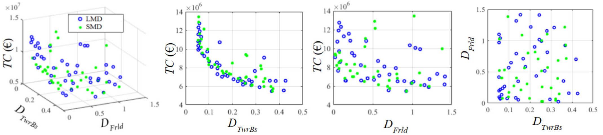

   **图 19** 两种不同环境输入获得的 Pareto 前沿比较。

   蓝色空心点为 LMD，绿色实心点为 SMD；坐标为制造成本 TC、塔底疲劳 DTwrBs 和导缆孔疲劳 DFrld。SMD 设计的疲劳已经按长期模型重新计算。

从 :math:`TC-D_{\mathrm{TwrBs}}` 视图看，两种方法的前沿线十分接近。在高成本区域，即超过 :math:`9.0\times10^6` 欧元时，两条前沿线几乎重合；但随着成本降低，LMD 设计的塔架疲劳性能优于 SMD，当 :math:`TC=7.0\times10^6` 欧元时，疲劳约降低 10%。

从 :math:`TC-D_{\mathrm{Frld}}` 视图看，在高成本区域，LMD 找到了导缆孔疲劳低得多的系泊设计；但当成本小于 :math:`9.0\times10^6` 欧元时，SMD 的疲劳逐渐接近 LMD。 :math:`TC` 主要由平台而非系泊部分决定。成本超过 :math:`9.0\times10^6` 欧元，意味着采用了较大的船体配置。敏感性研究 [34]_ 发现，立柱直径较大的半潜式平台更容易发生较大的一阶和二阶波致平动，进而造成更严重的导缆孔疲劳。

优化过程中，通过比较设计空间中各样本的代价函数确定最优设计。为更好地理解 LMD 与 SMD 如何对设计样本排序，比较了基于两种环境数据完整程度得到的 542 个设计样本的动力性能指标。图 20 给出了平台倾斜角最大值 :math:`q_{\mathrm{tilt},\max}^{\mathrm{nor}}` 、机舱加速度最大值 :math:`a_{\mathrm{nac},\max}^{\mathrm{nor}}` 、导缆孔张力最大值 :math:`T_{\mathrm{Frld},\max}^{\mathrm{nor}}` ，以及塔底和导缆孔累积疲劳损伤 :math:`D_{\mathrm{TwrBs}}^{\mathrm{nor}}` 、 :math:`D_{\mathrm{Frld}}^{\mathrm{nor}}` 的比较结果。前三项作为约束，后两项则构成优化目标函数的一部分。需要注意，这些结果以两种方法中的最大值进行了归一化。

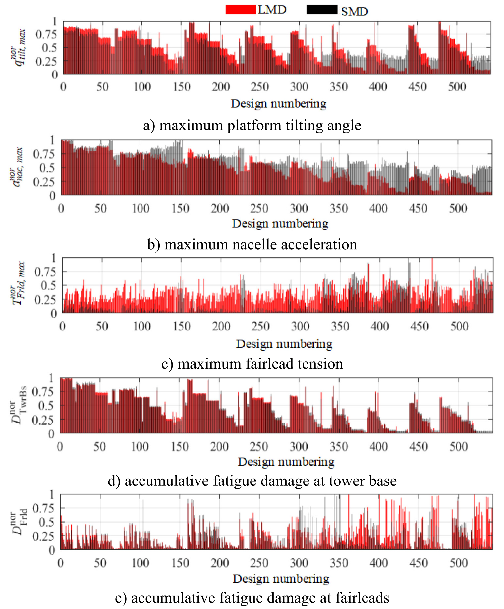

   **图 20** SMD 与 LMD 归一化动力性能指标的比较。

   红色为 LMD，黑色为 SMD；横轴为设计编号。a）平台倾斜角最大值；b）机舱加速度最大值；c）导缆孔张力最大值；d）塔底累积疲劳损伤；e）导缆孔累积疲劳损伤。

对于 :math:`q_{\mathrm{tilt},\max}^{\mathrm{nor}}` ，SMD 中 542 个设计样本的相对大小与 LMD 基本一致，但仍有相当多的工况被 SMD 高估。对于 :math:`a_{\mathrm{nac},\max}^{\mathrm{nor}}` ，不一致更加明显，SMD 中超过一半设计样本的值更大。对于 :math:`T_{\mathrm{Frld},\max}^{\mathrm{nor}}` ，两种方法对设计样本的排序完全不同。SMD 中风向和波向在 :math:`90^\circ` 方向对齐，这是对系泊系统最有利的情形，大部分外荷载由 1 号和 4 号缆线承担，见图 1，因此多数设计样本的极端张力更低。然而，LMD 中的情况更加多样。风浪可能来自最不利方向，例如 :math:`135^\circ` ，此时多数外荷载仅由 4 号缆线承担，导致较大的极端张力。在这种情况下，样本之间的 :math:`T_{\mathrm{Frld},\max}^{\mathrm{nor}}` 差异比 SMD 小得多。

有趣的是，疲劳指标对荷载方向较不敏感。两种方法在 :math:`D_{\mathrm{TwrBs}}^{\mathrm{nor}}` 上吻合极好。这解释了为什么 SMD 能获得与 LMD 相似的 :math:`TC-D_{\mathrm{TwrBs}}` 前沿线。 :math:`D_{\mathrm{Frld}}^{\mathrm{nor}}` 的一致性不如 :math:`D_{\mathrm{TwrBs}}^{\mathrm{nor}}` 。差异主要集中于编号 360–440 和 520–542 的设计。发现这些都是 :math:`TC` 大于 :math:`9.0\times10^6` 欧元的高成本设计。SMD 倾向于低估该区域的系泊疲劳。

5.4.2 两种下部结构的比较
^^^^^^^^^^^^^^^^^^^^^^^^

将基于长期动力评价的集成多目标优化用于研究方形与 Y 形概念之间的差异。图 21 比较了两种概念的最优设计样本。对于方形平台，多数个体的立柱半径为 7 m，立柱间距为 34–40 m，但吃水更分散，分布在 14–34 m。对于 Y 形平台，立柱半径较小、吃水较深的设计更有利，平台吃水大多超过 25 m。对于系泊，在相同条件下，三缆设计的恢复能力本来就低于四缆系统。为了达到与四缆设计相当的性能，必须增加单位长度重量。因此可以看到，Y 形平台选择了大链径，超过 0.16 m。方形平台的链径更加多样，但系泊长度主要集中在下限 770 m。这是因为四缆系泊更容易满足恢复刚度约束，选择较短缆线有助于降低材料成本。链径与立柱间距有一定关系。立柱间距大的平台倾向于配置更粗的系泊缆。对该趋势的一种解释是，增大立柱间距会增加系泊缆的卧底长度，从而削弱其恢复能力。以 NAUTILUS 和 OO-Star 概念的系泊参数为例，图 22 表明，立柱间距增加 1 m，会导致系泊刚度降低 4%–4.5%。这一不足通过增大链径得到补偿。

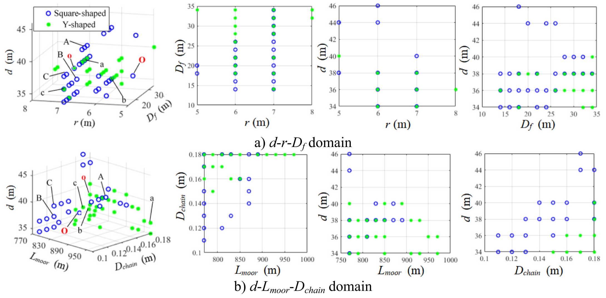

   **图 21** 方形与 Y 形下部结构最优设计的比较。

   a）d–r–Df 设计域；b）d–Lmoor–Dchain 设计域。蓝色空心点为方形，绿色实心点为 Y 形；A、B、C 和 a、b、c 为所选比较个体；O、o 为参考设计。

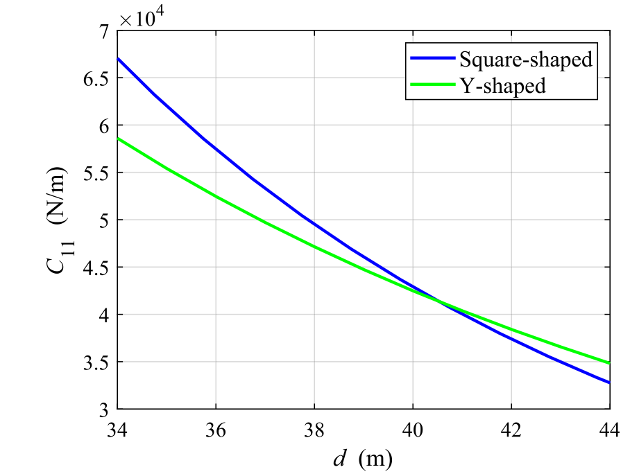

   **图 22** 系泊刚度随立柱间距的变化。

   横轴为立柱间距 d（m），纵轴为系泊刚度 C₁₁（N/m）；蓝线为方形，绿线为 Y 形。

图 23 展示了两种下部结构的 Pareto 前沿。在 :math:`TC-D_{\mathrm{TwrBs}}` 子图中，方形结构的前沿线位于 Y 形结构的左下方，表明方形概念在 :math:`D_{\mathrm{TwrBs}}` 方面性能更好：在相同 :math:`TC` 水平下，方形概念的 :math:`D_{\mathrm{TwrBs}}` 大多比 Y 形低 30%–50%。当 :math:`TC` 低于 :math:`8\times10^6` 欧元时，差异更大。

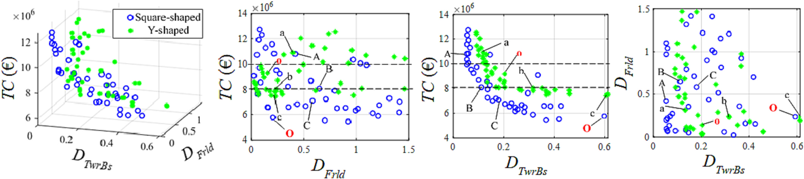

   **图 23** 方形与 Y 形下部结构 Pareto 前沿的比较。

   蓝色空心点为方形，绿色点为 Y 形；各坐标为制造成本、塔底疲劳与导缆孔疲劳。A/a、B/b、C/c 对应表 5 的比较组，O/o 为参考设计。

在 :math:`TC-D_{\mathrm{Frld}}` 子图中，方形概念在高成本区域，即 :math:`TC\geq10\times10^6` 欧元时，继续保持对 Y 形概念的优势，其 :math:`D_{\mathrm{Frld}}` 低得多。有趣的是，当 :math:`TC` 降至 :math:`10\times10^6` 欧元以下时，Y 形概念的系泊性能显著改善。这一变化可能与平台设计有关。针对五个设计变量开展 :math:`D_{\mathrm{Frld}}` 敏感性研究。为更好地展示 :math:`D_{\mathrm{Frld}}` 的统计特征，将结果绘成箱线图，如图 24 所示。红点和水平线分别表示均值和中位数，箱体上下边界分别表示第 75 和第 25 百分位，须线约覆盖 :math:`\pm2.7\sigma` ，其中 :math:`\sigma` 为数据标准差，十字标记表示覆盖范围外的样本。结果表明，立柱半径是影响系泊疲劳的第二重要因素，仅次于链径。立柱半径较小的平台倾向于承受较小的一阶和二阶水动力波致运动，从而减小系泊张力波动。高成本区域选择 7–8 m 的立柱半径，中低成本区域则选择 5–7 m。这解释了为何 :math:`TC` 小于 :math:`10\times10^6` 欧元时， :math:`D_{\mathrm{Frld}}` 显著改善。在低成本区域，即 :math:`TC\leq8\times10^6` 欧元时，找到的 Y 形个体少于方形概念。原因在于，为满足恢复刚度和疲劳性能约束，三缆系泊采用了较大链径，这不可避免地增加了总支出。这意味着六缆甚至九缆系泊系统可能是 Y 形平台更具竞争力的解决方案。

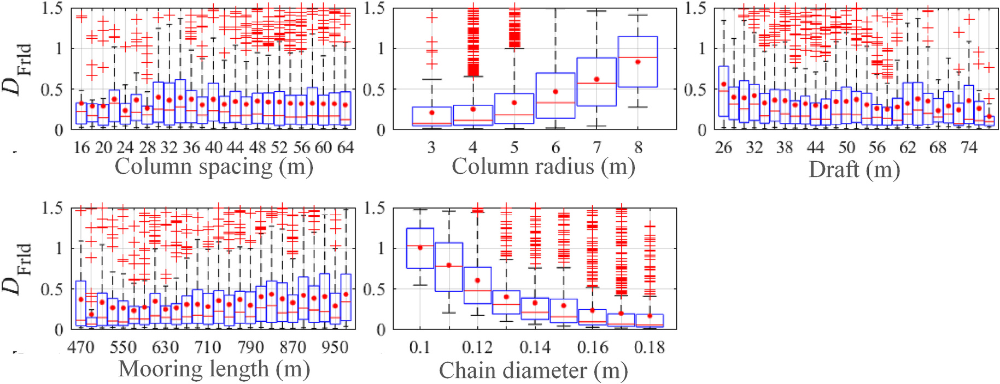

   **图 24** Y 形下部结构导缆孔疲劳损伤的敏感性分析。

   横轴依次为立柱间距、立柱半径、吃水、系泊长度和链径，单位均为 m；纵轴为导缆孔累积疲劳损伤。红点为均值，箱内横线为中位数，箱体边界为第 25 和第 75 百分位，须线约覆盖 ±2.7σ，十字为范围外样本。

为了说明所提出的优化方法给浮式风机设计过程带来多大收益，将 NAUTILUS 与 OO-Star 平台的原始设计 [33]_ 作为参考，分别以 O 和 o 标在图 20 和图 22 中。NAUTILUS 设计具有良好的系泊动力性能， :math:`D_{\mathrm{Frld}}=0.230` ，但与 Pareto 前沿上的个体相比，其塔底疲劳较大， :math:`D_{\mathrm{TwrBs}}=0.596` 。在相近成本水平，即约 :math:`6\times10^6` 欧元时，优化器给出了 :math:`D_{\mathrm{Frld}}` 和 :math:`D_{\mathrm{TwrBs}}` 分别改善至 0.159 和 0.384 的下部结构设计。Y 形下部结构设计也从优化中获益很大。在 OO-Star 的成本水平，即 :math:`9\times10^6` 欧元时， :math:`D_{\mathrm{Frld}}` 和 :math:`D_{\mathrm{TwrBs}}` 可分别降至 0.119 和 0.136，比原设计低 4.8% 和 32%。本段的“图 20 和图 22”沿用原文交叉引用；实际带有参考设计标记的设计空间及 Pareto 图为图 21 和图 23。

5.5 个体比较
~~~~~~~~~~~~

为进一步理解机理，从每种概念的 Pareto 前沿中选取三个典型个体，详细研究其差异。为确保公平比较，选择制造成本和配置尺寸相近的个体。所选个体的设计参数列于表 5，其中方形和 Y 形设计分别以大写及小写字母标记。所选个体形成三个不同成本水平的比较组。各比较组之间的差异主要在于平台吃水。所选个体在设计空间及 Pareto 前沿中的位置也标在图 20 和图 22 中。这里保留原文图号；对应标有 A/a、B/b、C/c 的图为图 21 和图 23。

.. list-table:: 表 5 所选下部结构设计的参数
   :header-rows: 1
   :widths: 8 8 9 10 10 11 10 13 13 13

   * - 比较组
     - 个体
     - 吃水（m）
     - 立柱半径（m）
     - 立柱间距（m）
     - 系泊长度（m）
     - 链径（m）
     - 排水体积（m³）
     - 钢材质量（kg）
     - :math:`TC` （€）
   * - 1
     - A
     - 30
     - 7
     - 40
     - 870
     - 0.160
     - 22,300.7
     - 5.199E6
     - 1.080E7
   * - 1
     - a
     - 30
     - 7
     - 38
     - 930
     - 0.180
     - 29,040.7
     - 4.405E6
     - 1.089E7
   * - 2
     - B
     - 24
     - 7
     - 36
     - 770
     - 0.130
     - 18,131.0
     - 4.554E6
     - 8.074E6
   * - 2
     - b
     - 26
     - 6
     - 36
     - 790
     - 0.170
     - 20,563.3
     - 3.706E6
     - 8.012E6
   * - 3
     - C
     - 16
     - 7
     - 38
     - 770
     - 0.130
     - 13,443.0
     - 4.336E6
     - 7.103E6
   * - 3
     - c
     - 14
     - 7
     - 36
     - 770
     - 0.170
     - 18,483.1
     - 3.540E6
     - 7.459E6

水动力是两种概念性能差异的主要原因。图 25 比较了纵荡、横荡、横摇和纵摇运动的响应幅值算子（RAO）。需要注意，RAO 在目标海域最盛行的波向 :math:`135^\circ` 下定义。可以看出，两种概念的 RAO 随频率变化具有相似规律：响应幅值在运动固有频率处达到峰值，随着频率进一步增大，又出现一个较小峰值；纵荡／横荡对应 :math:`\omega\geq0.8\ \mathrm{rad/s}` ，横摇／纵摇对应 :math:`\omega\geq0.5\ \mathrm{rad/s}` 。所有比较组均表明，Y 形模型的低频响应大于方形模型。在高频区域，Y 形模型的纵荡／横荡 RAO 波峰位于方形模型左侧，因此在 :math:`0.8\leq\omega\leq1.1\ \mathrm{rad/s}` 时，Y 形模型响应更高；当 :math:`\omega>1.1\ \mathrm{rad/s}` 时则相反。有趣的是，横摇／纵摇呈现相反趋势。这些特征源于两种概念不同的立柱布置。对于 Y 形平台，立柱间距离较小，因此波浪中各立柱之间的相互作用，即绕射效应，自然更强，导致其运动响应高于方形平台。

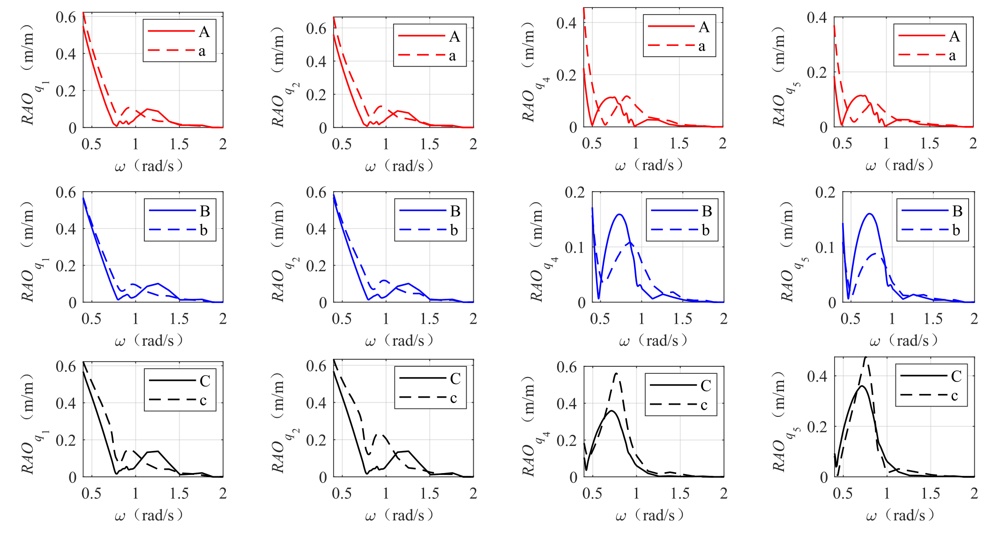

   **图 25** 135° 波向下，两种下部结构概念的平台运动 RAO 比较。

   从左到右为纵荡、横荡、横摇和纵摇 RAO；从上到下为 A/a、B/b、C/c 比较组。大写、实线对应方形，小写、虚线对应 Y 形；横轴为角频率。纵轴单位按原图保留。

需要注意，各频率对运动响应的贡献不同。图 26 给出了波峰频率 :math:`\omega_p` 的分布。概率密度函数表明，25 年间最常出现的是 :math:`\omega_p` 位于 0.5–1.5 rad/s 的入射波。更需关注 0.5–1.1 rad/s 范围的波浪，因为它们对应中等海况，见箱线图，而这类海况通常对结构疲劳贡献最大 [45]_。在这一范围内，Y 形模型的纵荡／横荡 RAO 更大，横摇／纵摇则与方形模型相当，导致更高的波频塔底荷载。这解释了方形概念在 :math:`D_{\mathrm{TwrBs}}` 方面具有更好的表现。

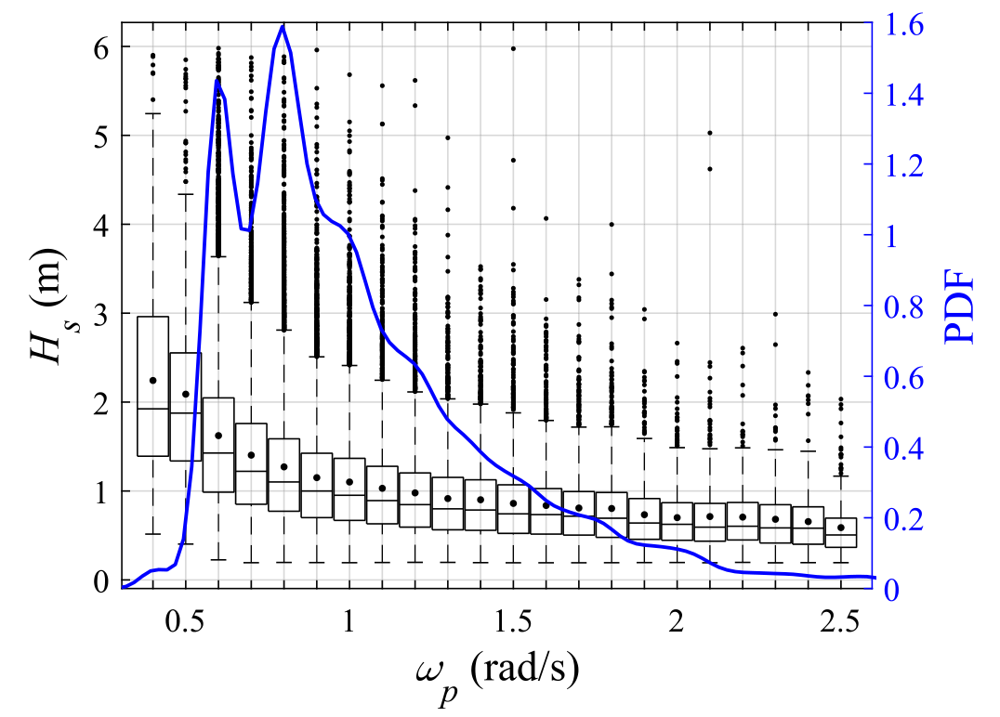

   **图 26** 25 年间波峰频率的分布。

   横轴为波峰角频率 ωp，左纵轴为有效波高 Hs，右纵轴为概率密度 PDF；蓝线为频率概率密度，箱线图展示各频段对应的波高分布。

然而，Y 形模型的 :math:`D_{\mathrm{Frld}}` 更低，这与图 25 相矛盾。一个原因是，对系泊疲劳而言，二阶慢漂力比一阶水动力更重要。图 27 比较了两种概念的纵荡／横荡二次传递函数（QTF）。由于 QTF 幅值受波相位影响，采用单位波的 20 个不同实现进行计算。不同实现指每次实现使用不同的随机波相位。结果表明，QTF 在纵荡／横荡固有频率处达到峰值，Y 形模型的峰值低于方形模型。Y 形模型在波浪中的平动较小，因此系泊张力波动也较小。Y 形模型 :math:`D_{\mathrm{Frld}}` 更低的另一个原因，是为满足恢复刚度约束采用了较大链径。这会显著减小应力幅，进而降低疲劳损伤。

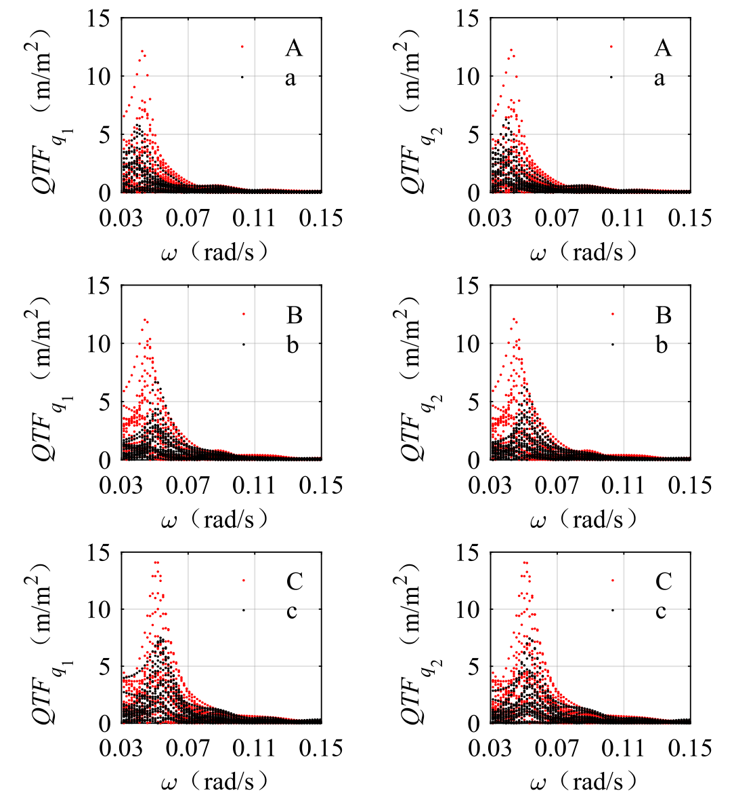

   **图 27** 135° 波向下，两种下部结构概念的平台运动 QTF 比较。

   从左到右为纵荡和横荡 QTF；从上到下对应 A/a、B/b、C/c 比较组。横轴为角频率；每组采用 20 个不同随机相位实现。

6 结论
------

本文为浮式风机下部结构的选择和设计提供了一种综合评价方法。为使设计空间探索的计算成本可承受，建立了具有必要物理细节的高效降阶动力模型。结合代理建模技术，计算能够充分反映环境条件影响的长期动力指标，并用其评价浮式风机结构性能。建立多目标优化框架探索设计空间，目标是寻找动力性能指标与制造成本之间具有最佳权衡的 Pareto 设计。将该方法应用于两种半潜式浮式风机概念，并比较所得最优设计。主要结论如下：

- 降阶模型的计算效率能够满足浮式风机初步设计阶段的动力模拟要求。模型验证表明，降阶模型与 OpenFAST 吻合良好。低于额定风速条件下，相对误差约为 10%；海况更剧烈时，误差增至 10%–25%。误差主要来自两个方面：首先，稳态风下自由衰减模拟得到的气动阻尼，无法代表桨距控制器的动力效应；其次，当平台运动显著时，线性黏性阻力激励低于 Morison 方程的二次阻力项。尽管存在这些误差，降阶模型的计算速度仍比 OpenFAST 快近 386 倍。此外，降阶模型不依赖难以从风机制造商获取的翼型和控制器相关信息。这将为早期下部结构设计带来很大的自主性和便利。
- 长期动力优化为浮式风机下部结构概念选择提供了基准。通过结合降阶模型与代理建模技术，将高效的长期动力分析成功纳入多目标优化过程。与基于简化风浪环境数据的优化相比，该方法捕捉了风浪不同向等环境条件的影响，从而找到了塔底和导缆孔疲劳更低的下部结构设计。此外，充分探索每种设计概念的设计空间，获得其 Pareto 前沿，并据此评价和比较不同概念的适用性。该方法最大的优势，是确保为每种概念选取的船体尺寸和系泊布置都处于其最佳状态，即最优设计。这样可以避免因不合理的平台和系泊配置而放弃某种概念，从而实现不同概念之间的公平比较。
- 在本算例中，方形半潜式下部结构有望比 Y 形更有利。在相同制造成本水平下，方形概念的塔底疲劳大多比 Y 形低 30%–50%。水动力是两种概念性能差异的主要原因。Y 形平台的立柱间距较小，因此各立柱在波浪中的相互作用，即一阶绕射效应，自然更强，导致其运动响应高于方形平台。相反，部分 Y 形设计表现出更低的系泊疲劳。原因有二：一方面，系泊张力由二阶慢漂力主导，而 Y 形设计的慢漂力更低；另一方面，三缆系泊系统为满足恢复刚度约束选择了较大链径。这会显著减小应力幅并降低疲劳损伤，但也会明显增加系泊投资。

本研究关注动力优化，未考虑船体强度，这可能低估钢材用量。结构分析通常依赖复杂有限元模型，其计算成本对于迭代优化过高。为在概念设计阶段纳入强度校核，亟需开发船体结构降阶模型。一种可能的方案是将船体简化为梁单元，在频域求解结构的模态挠度和内力。

参考文献
--------

.. [1] Laura C, Vicente D. Life-cycle cost analysis of floating offshore wind farms. Renew Energy 2014;66:41–8.

.. [2] National Renewable Energy Laboratory. OpenFAST Documentation. Available online, https://openfast.readthedocs.io/en/main/.

.. [3] Robertson AN, Jonkman JM. Loads analysis of several offshore floating wind turbine concepts. The twenty-first international offshore and polar engineering conference. Maui, Hawaii, USA: International Society of Offshore and Polar Engineers; 2011.

.. [4] Bagbanci H, Karmakar D, Soares CG. Comparison of spar and semisubmersible floater concepts of offshore wind turbines using long-term analysis. J Offshore Mech Arctic Eng 2015;137:61601.

.. [5] Karimi M, Buckham B, Crawford C. A fully coupled frequency domain model for floating offshore wind turbines. J Ocean Eng Mar Energy 2019;5:135–58.

.. [6] Jonkman JM, Wright AD, Hayman GJ, Robertson AN. Full-System Linearization for Floating Offshore Wind Turbines in OpenFAST. The first International Offshore Wind Technical Conference. San Francisco, California, USA: American Society of Mechanical Engineers; 2018. p. 51975. V001T01A028.

.. [7] Lemmer F, Yu W, Luhmann B, Schlipf D, Cheng PW. Multibody modeling for concept-level floating offshore wind turbine design. Multibody Syst Dyn 2020;49:203–36.

.. [8] Hall M, Housner S, Zalkind D, Bortolotti P, Ogden D, Barter G, et al. An open-source frequency-domain model for floating wind turbine design optimization. J Phys Conf Ser 2022;2265:42020.

.. [9] Pegalajar-Jurado A, Borg M, Bredmose H. An efficient frequency-domain model for quick load analysis of floating offshore wind turbines. Wind Energy Sci 2018;3(2):693–712.

.. [10] Hegseth JM, Bachynski EE. A semi-analytical frequency domain model for efficient design evaluation of spar floating wind turbines. Mar Struct 2019;64:186–210.

.. [11] Karimi M, Hall M, Buckham B, Crawford C. A multi-objective design optimization approach for floating offshore wind turbine support structures. J Ocean Eng Mar Energy 2017;3:69–87.

.. [12] Leimeister M, Kolios A, Collu M. Development of a framework for wind turbine design and optimization. Modelling 2021;2:105–28.

.. [13] Leimeister M, Collu M, Kolios A. A fully integrated optimization framework for designing a complex geometry offshore wind turbine spar-type floating support structure. Wind Energy Sci 2022;7(1):259–81.

.. [14] Dou S, Pegalajar-Jurado A, Wang S, Bredmose H, Stolpe M. Optimization of floating wind turbine support structures using frequency-domain analysis and analytical gradients. J Phys Conf Ser 1618;2020:42028.

.. [15] Pollini N, Pegalajar-Jurado A, Dou S, Bredmose H, Stolpe M. Gradient-based optimization of a 15 MW wind turbine spar floater. J Phys Conf Ser 2018;2021:12032.

.. [16] Hegseth JM, Bachynski EE, Martins JRRA. Integrated design optimization of spar floating wind turbines. Mar Struct 2020;72:102771.

.. [17] Salzmann D, Van der Tempel J. Aerodynamic damping in the design of support structures for offshore wind turbines. In: The Copenhagen Offshore Conference. Copenhagen, Denmark; 2005.

.. [18] Souza CE, Hegseth JM, Bachynski EE. Frequency-dependent aerodynamic damping and inertia in linearized dynamic analysis of floating wind turbines. J Phys Conf Ser 2020;1452:12040.

.. [19] Bak C, Zahle F, Bitsche R, Kim T, Yde A, Henriksen L, et al. Description of the DTU 10MW reference wind turbine. Roskilde Denmark: Technical University of Denmark; 2013. https://rwt.windenergy.dtu.dk/dtu10mw/dtu-10mw-rwt.

.. [20] Larsen TJ, Hanson TD. A method to avoid negative damped low frequent tower vibrations for a floating, pitch controlled wind turbine. J Phys Conf Ser 2007;75:12073.

.. [21] Standing RG, Brendling WJ, Wilson D. Recent developments in the analysis of wave drift forces, low-frequency damping and response. In: Offshore technology conference. Houston, Texas, USA: OnePetro; 1987.

.. [22] Borgman LE. The spectral density for ocean wave forces. American Society of Civil Engineers: Proceedings Santa Barbara Specialty Conference; 1965.

.. [23] Lemmer F, Yu W, Cheng P. Iterative frequency-domain response of floating offshore wind turbines with parametric drag. J Mar Sci Eng 2018;6:118.

.. [24] Ren N, Gao Z, Moan T, Wan L. Long-term performance estimation of the spar–torus-combination (STC) system with different survival modes. Ocean Eng 2015;108:716–28.

.. [25] Pettigrew NR, Fikes CP, Beard MK. Advances in the ocean observing system in the Gulf of Maine: technical capabilities and scientific results. Mar Technol Soc J 2011;45:85–97.

.. [26] Gómez P, Sánchez G, Llana A, Gonzalez G. Oceanographic and meteorological conditions for the design. In: LIFES50+ Deliv 1.1; 2015.

.. [27] IEC 61400–-1. Wind turbines part 1: Design requirements. International Electrotechnical Commission; 2005.

.. [28] Xiao Q. Evaluating correlation coefficient for Nataf transformation. Probabilist Eng Mech 2014;37:1–6.

.. [29] Camus P, Mendez FJ, Medina R, Cofiño AS. Analysis of clustering and selection algorithms for the study of multivariate wave climate. Coast Eng 2011;58:453–62.

.. [30] Zhou S, Li C, Xiao Y, Cheng PW. Importance of platform mounting orientation of Y-shaped semi-submersible floating wind turbines: a case study by using surrogate models. Renew Energy 2020;156:260–78.

.. [31] Det Norske Veritas. DNV-RP-C203: Fatigue Design of Offshore Steel Structures. Det Norske Veritas; 2016.

.. [32] Det Norske Veritas. Germanischer Lloyd. DNVGL-OS-E301: Position Mooring. DNVGL; 2018.

.. [33] Yu W, Müller K, Lemmer F, Bredmose H, Borg M, Sanchez G, et al. Public definition of the two LIFES50+ 10MW Floater Concepts. LIFES50+ Deliv 4.2. 2017.

.. [34] Zhou S, Müller K, Li C, Xiao Y, Cheng PW. Global sensitivity study on the semisubmersible substructure of a floating wind turbine: manufacturing cost, structural properties and hydrodynamics. Ocean Eng 2021;221:108585.

.. [35] Wang S, Moan T, Gao Z. Methodology for global structural load effect analysis of the semi-submersible hull of floating wind turbines under still water, wind, and wave loads. Mar Struct 2023;91:103463.

.. [36] Benveniste G, Lerch M, Prada M, Kretschmer M, Berqué J, López A, et al. LCOE tool description, technical and environmental impact evaluation procedure. LIFES50+ Deliv 2.2. 2016.

.. [37] Farkas J, Jármai K. Optimum design of steel structures. Springer; 2013.

.. [38] Tizani W, Yusuf KO, Davies G, et al. A knowledge based system to support joint fabrication decision making at the design stage Case studies for CHS trusses. In: Tubular Structures International Symposium; 1996.

.. [39] Castro-Santos L, Filgueira-Vizoso A, Carral-Couce L, Formoso JÁF. Economic feasibility of floating offshore wind farms. Energy 2016;112:868–82.

.. [40] Castro-Santos L, Diaz-Casas V. Sensitivity analysis of floating offshore wind farms. Energ Convers Manage 2015;101:271–7.

.. [41] Myhr A, Bjerkseter C, Ågotnes A, Nygaard TA. Levelised cost of energy for offshore floating wind turbines in a life cycle perspective. Renew Energy 2014;66:714–28.

.. [42] Deb K, Pratap A, Agarwal S, Meyarivan T. A fast and elitist multiobjective genetic algorithm: NSGA-II. Ieee T Evolut Comput 2002;6:182–97.

.. [43] Storn R. On the usage of differential evolution for function optimization. In: Proceedings of North American Fuzzy Information Processing; 1996. p. 519–23.

.. [44] Martí L, García J, Berlanga A, Molina JM. A stopping criterion for multi-objective optimization evolutionary algorithms. Inf Sci 2016;367–368:700–18.

.. [45] Det Norske Veritas. DNV-OS-J101: Design of Offshore Wind Turbine Structures. Det Norske Veritas; 2014.

完整引用
--------

[48] :student-first-author:`Zhou Shengtao`; **Li Chao**\*; Xiao Yiqing; Wang Xiaolu; Xiang Wenyuan; Sun Qing, Evaluation of floating wind turbine substructure designs by using long-term dynamic optimization[J]. **Applied Energy**, 2023, 352: 121941. https://doi.org/10.1016/j.apenergy.2023.121941.

收录信息见 :ref:`WOEAI 学术成果页对应条目 <ref-zhou2023-AE>` 。
