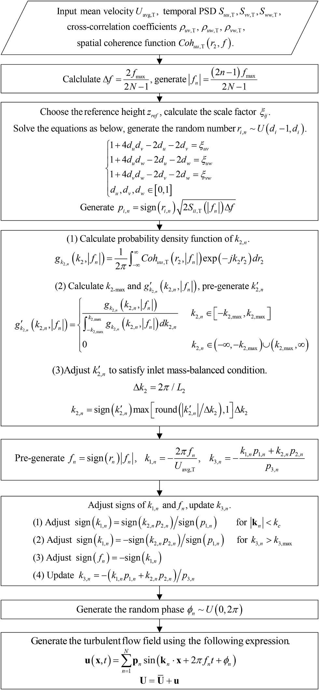
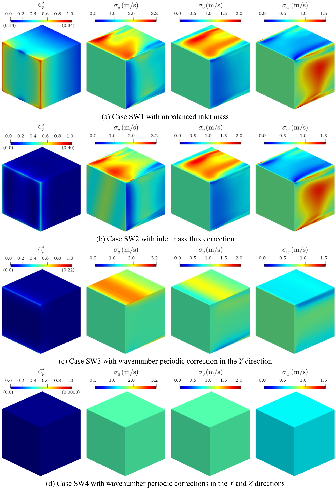
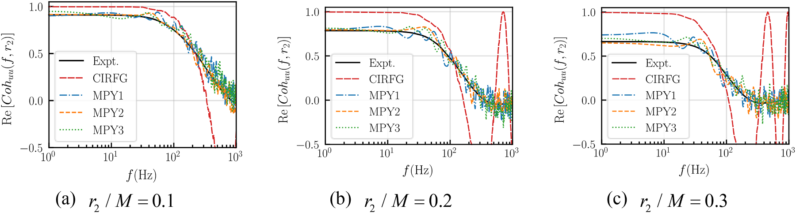
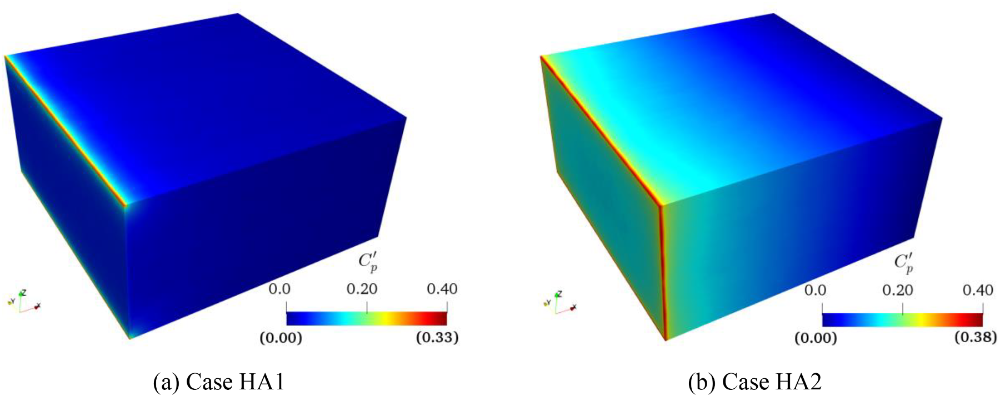
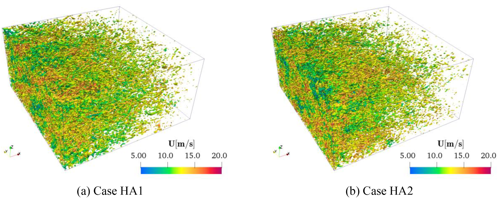

# 数值风洞 | 让 LES 入流湍流更连贯也更守恒

入口湍流的强度和能谱对了，风压就可信吗？在我们的单波算例中，质量通量不平衡使入口边缘压力波动最高达到动压的约 $0.84$ 倍。我们在既有随机流生成方法中加入空间相干与质量平衡约束，让入流更适合压力敏感的 LES；验证范围是均匀湍流。

## 三句话导读

- 我们关心的是：用 LES 判断脉动风压前，如何排除入口生成方法带来的压力污染？
- 我们在 CIRFG 基础上推导相干性改进且质量平衡的随机流生成方法（CMRFG），把目标相干信息与入口通量约束放进生成过程。
- 选择入流方法时，除了强度和谱，还应检查相干性、质量平衡与边界相容性；均匀湍流中的结果不能直接当作复杂建筑群验证。

## 关键数字 / 关键结论卡

- 入口质量通量不平衡时，入口边缘附近最大压力波动可达到动压的约 $0.84$ 倍，$X=2\,\mathrm{m}$ 处仍可出现约 $15\%$ 动压量级的人工压力波动。
- 各向异性算例中，不带质量平衡修正的 HA2 在 $x/M=30$ 位置可出现约 $12\%$ 动压量级的非期望压力波动；带修正的 HA1 在中心感兴趣区域维持在约 $1.5\%$，入口与侧边交线仍有局部残余压力。
- 单波 SW4 的双向周期修正消除了非物理压力波动，但初始湍流动能降低约 $6.7\%$；压力改善与原始湍流特征保持需要同时检查。

论文图 7 CMRFG 方法流程图

沿箭头阅读：目标湍流统计量 → 频率、随机幅值与波数 → 波数修正 → 速度场；先看输入，再看修正所处的位置。

## 论文信息

- 论文题名: A coherence-improved and mass-balanced inflow turbulence generation method for large eddy simulation
- 作者: <u>Chen Lingwei</u>; **Li Chao**\*; Wang Jinghan; Hu Gang; Xiao Yiqing
- 期刊: Journal of Computational Physics
- 年份: 2024
- DOI: https://doi.org/10.1016/j.jcp.2023.112706
- WOEAI 相关方向: 建筑结构抗风 / 数值风洞与湍动入流

## 摘要

真实的入口湍流对于大涡模拟获得准确结果至关重要。本文提出一种改进的入口湍流生成方法，称为相干性改进且质量平衡的随机流生成方法（coherence-improved and mass-balanced random flow generation, CMRFG）。首先，论文研究入口质量平衡条件的影响。

随后，所提出方法被显式推导为能够满足任意空间相干函数和质量平衡条件，因此生成的湍流场能够有效保持原始湍流特征，并且不需要额外的入口质量通量修正。同时，新方法保留了既有方法的优点，能够满足任意湍流强度、时间谱、时间相关和空间相关系数。此外，所提出方法还保证满足无散度条件和 Taylor 冻结假设，这对于流场的准确发展至关重要。

最后，对均匀各向同性和各向异性湍流场的大涡模拟表明，CMRFG 生成的湍流场与实验结果高度一致，并且计算域内没有人工压力波动。

上述为原摘要表述。正文同时报告入口与侧边界交线处仍有局部人工压力；下文保留这一适用边界，不能将摘要理解为所有边界位置都已消除压力污染。

## 研究问题

LES 入口湍流不能只是一段随机速度时程。对建筑风工程中的数值风洞来说，入口风场至少要回答三个问题：

1. 如何在随机流生成阶段同时满足目标湍流强度、时间谱、空间相关和空间相干函数？
2. 如何让入口脉动速度满足质量平衡，避免不可压缩流场中出现非物理压力污染？
3. 生成的湍流进入计算域后，能否在各向同性和各向异性 LES 中保持合理的空间发展？

论文图 4 SW1 至 SW4 工况流场统计脉动

依次比较 SW1–SW4 的速度与压力统计图；压力云图重点看入口边缘和下游。各图色标范围不同，不能只凭颜色深浅比较数值。

## 方法贡献

CMRFG 建立在 CIRFG 方法基础上，但进一步把两个约束显式纳入生成过程。

第一是空间相干函数。我们把横向波数 $k_{2,n}$ 作为随机变量处理，并由 $u$ 分量在 $Y$ 方向的目标空间相干函数推导其概率密度函数。三个速度分量共用这组波数，不能据此声称它们各自的任意相干函数都能被独立指定。这样，生成的湍流场不只是满足某个空间相关系数，而是能在频率维度上逼近给定的空间相干结构。

第二是入口质量平衡。我们通过修正 $k_{2,n}$，使入口宽度成为对应波长的整数倍，从而让每个单波分量在入口处满足质量平衡。对均匀网格而言，生成的湍流场入口质量通量可以保持严格恒定；对非均匀网格，仍可能需要很小的质量通量修正，但对原始湍流特征的扰动会明显减小。

从工程实现角度看，CMRFG 不是只增加一个后处理步骤，而是把约束放回入口湍流的生成机制中。它仍保留对任意湍流强度、时间谱、时间相关和空间相关系数的适配能力，同时满足均匀湍流场中无散度条件和 Taylor 冻结假设。

这个思路可以用一个入口质量平衡条件来概括：

$$
\iint_S u_1(\mathbf{x},t)\,\mathrm{d}S = 0
$$

这里 $S$ 是入口截面，$u_1(\mathbf{x},t)$ 是随空间和时间变化的纵向脉动速度。这个公式表达的不是一个附加的数值技巧，而是入口湍流本身应满足的整体通量约束：脉动流量在入口截面上的积分应为零。

## 关键发现

### 1. 入口质量平衡会直接影响压力场可信度

**针对问题 2，我们在单波传输算例中发现，入口通量不平衡造成的压力污染会延续到下游。**入口边缘最大压力波动约为动压的 $0.84$ 倍，在 $X=2\,\mathrm{m}$ 处仍约为 $15\%$，因此不能只用入口速度统计量判断压力结果可信度。

单波工况 SW3 仅在 $Y$ 向作周期修正，中心区域的湍流动能自维持性较好；SW4 同时修正 $Y$、$Z$ 向后消除了整个流场中的非物理压力波动，但初始湍流动能由约 $1.64$ 降至 $1.53\,\mathrm{m^2/s^2}$，降低约 $6.7\%$。这为后续 CMRFG 的波数修正提供了直接动机。

### 2. CMRFG 能更好匹配目标空间相干函数

**针对问题 1，我们用 CBC 均匀各向同性湍流数据检验发现，CMRFG 更接近给定的空间相干目标。**在多个监测点的对比中，原 CIRFG 方法在低频范围内难以满足目标空间相干函数，而 CMRFG 生成的空间相干函数在不同空间间距下都更接近目标值。这里采用相干函数的实部，保留其可能出现的负值；若只取绝对值，会丢失横向负相关的信息。

这项验证还依赖随机实现的筛选：CBC 两点统计每个工况独立生成 50 次，比较集合平均、包络与最佳拟合结果；KCM 入流则独立生成 20 次并保留最佳拟合随机参数，不能把选出的吻合曲线理解为任意单次随机生成都能达到的表现。

论文图 17 不同空间间距下的 Y 方向空间相干函数对比

按不同空间间距逐组对照目标与两种方法的曲线；注意低频处的偏差，以及相干实部落到零以下的区间。

### 3. 各向异性湍流算例中，质量平衡能抑制计算域内压力污染

**针对问题 2，我们在 KCM 空间衰减均匀各向异性湍流算例中发现，质量平衡修正可抑制计算域内部的压力污染，但不能消除所有边界残余。**我们在 $5.12\,\mathrm{m} \times 5.12\,\mathrm{m} \times 2.56\,\mathrm{m}$ 的计算域中，对比带修正的 HA1 与不带修正的 HA2。

论文图 28 脉动压力系数分布云图

对照 HA1、HA2 的云图与各自色标；中心区域和入口、侧边界交线分开看，避免用局部颜色代表整个计算域。

论文报告，不带质量平衡修正的 HA2 算例在 $x/M=30$ 位置的非期望压力波动可达到约 $12\%$ 动压量级；带修正的 HA1 中心感兴趣区域脉动压力系数约为 $1.5\%$，入口与侧边界交线仍有局部非物理压力波动。两个数字对应的位置不同，不能据此换算为普遍的降幅。

### 4. 生成湍流能保持合理的空间发展

**针对问题 3，我们在各向异性 LES 中观察到合理的涡结构衰减及与实验目标总体一致的统计发展。**生成的涡结构具有随机性，并随湍流向下游发展而逐渐衰减；速度标准差、湍流动能和空间谱总体上与实验目标保持一致。

论文图 30 8 s 时刻 Q=1000 的等值面，按瞬时速度大小着色（流向从左到右）

从左向右沿流向查看；等值面以 $Q=1000$ 提取，颜色表示瞬时速度大小。

## 工程意义

如果要用 LES 判断脉动风压，我们建议在入口验收时同时检查强度与谱、空间相干、质量通量和边界相容性，而不只看一条吻合的速度谱。CMRFG 提供的是生成机制上的改进：相干信息进入波数分布，质量约束进入波数修正。

建筑风压、城市微尺度风环境等是潜在下游用途，并非本文已完成验证的工程对象。使用时仍需提供与目标场景相符的入流统计量，并以实验或现场数据检验流场与压力。

## 适用边界

本文聚焦的是均匀湍流的入口生成与 LES 验证，包括均匀各向同性和空间衰减均匀各向异性湍流。论文指出，CMRFG 可按已有过程扩展到非均匀湍流，但更真实的非均匀湍流空间相干函数如何确定，仍需要进一步研究。

此外，带质量平衡修正的各向异性算例仍在入口与侧边界交界处出现局部非物理压力波动，原因与边界相容性有关。这说明 CMRFG 能显著改善入口湍流质量，但不能替代对边界条件、计算域尺寸、网格分辨率和目标相干函数来源的整体审查。

最后，本文验证场景主要面向方法学和均匀湍流算例。将其用于具体建筑群、复杂地形或工程结构风荷载评估时，仍需结合目标大气边界层参数、地貌粗糙度、入口剖面、网格分辨率和实验或现场数据进行再验证。

如果你对建筑结构抗风 / 海上漂浮风电方向的研究生学习或工程合作感兴趣，点击阅读原文查看本文网页版，并从 WOEAI 主页了解更多。

## 延伸阅读

- [WOEAI | 建筑结构抗风方向介绍](https://woeai.readthedocs.io/zh-cn/latest/StructuralWindEngineering.html)
- [WOEAI | 主页](https://woeai.readthedocs.io/zh-cn/latest/)
