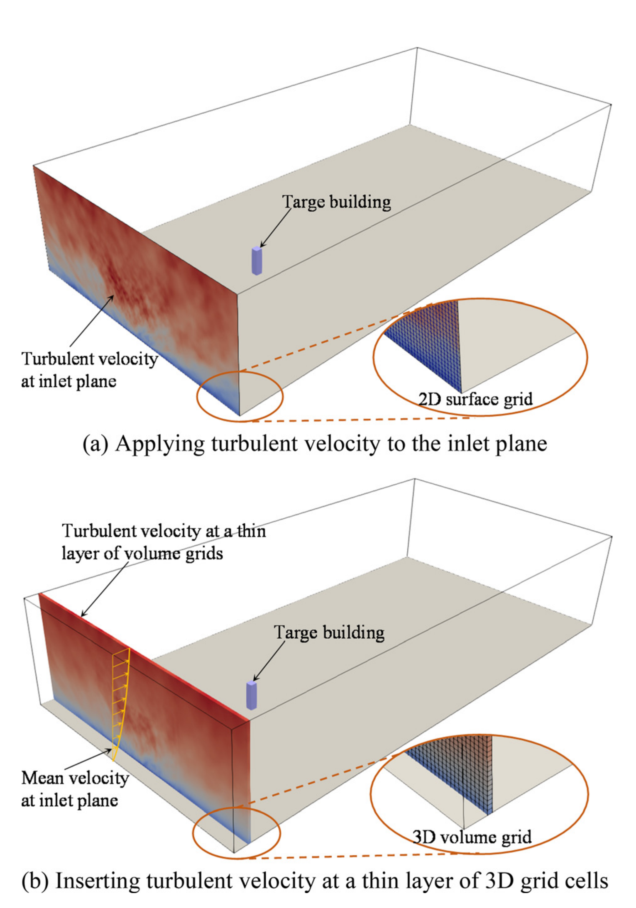
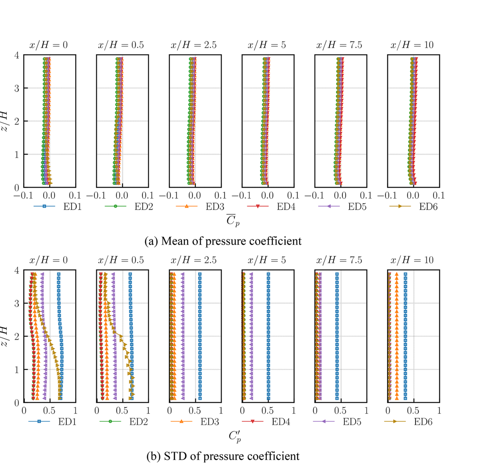
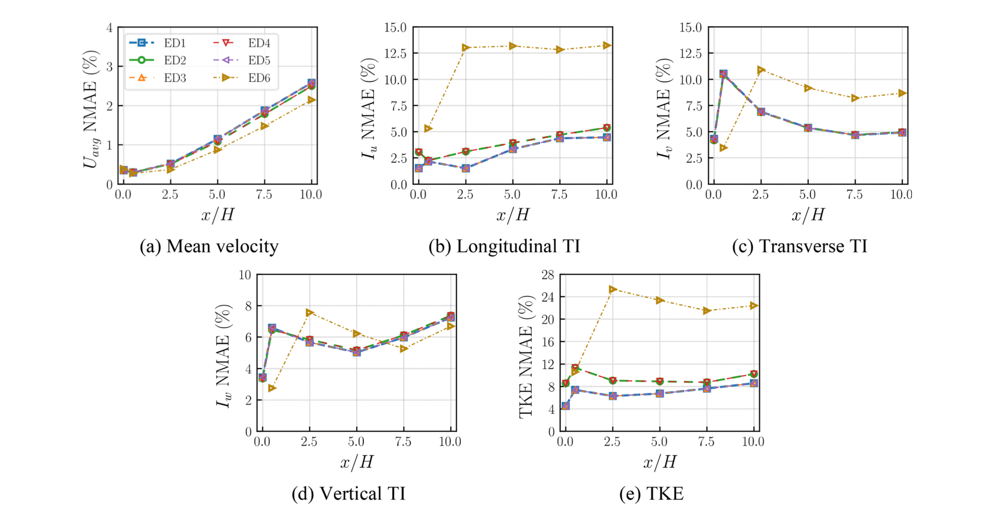
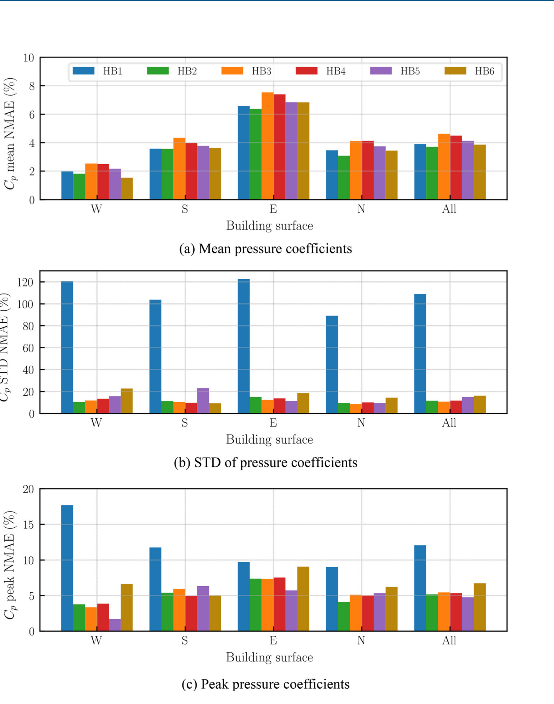
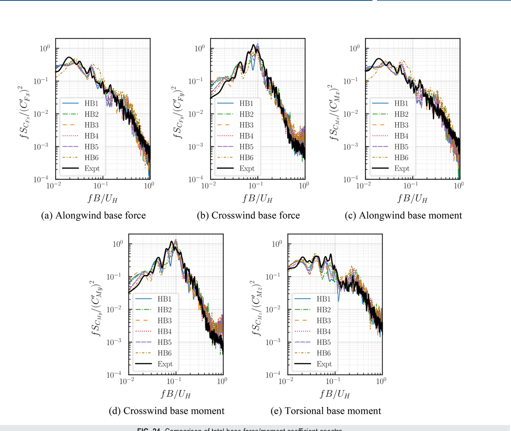

# 数值风洞 | LES 高层建筑风荷载评估中人工压力脉动抑制方法对比

在高层建筑风荷载 LES 中，入口湍流给得不对，问题不一定先出现在平均风压上，而可能藏在脉动压力里。本文的一个基准算例显示，如果直接施加质量不平衡的合成湍流入口，建筑位置附近的人工压力脉动可达到动压的约 $50\%$，这足以污染后续风压测量。

这篇发表于 *Physics of Fluids* 的论文比较了三类减小人工压力脉动（reducing artificial pressure fluctuations, RAPF）的方法：入口质量修正（IMC）、无散修正（DFC）和局部压力修正（LPC）。我们关心的不是“哪一种方法永远最好”，而是在 LES 数值风洞中，怎样在压力可信度、入口湍流保持和工程计算成本之间做出可解释的取舍。

## 论文信息

- 论文题名: Comparing methods for reducing artificial pressure fluctuations using large eddy simulation in high-rise building wind load assessment
- 作者: <u>Chen Lingwei</u>; **Li Chao**\*; Wang Jinghan; He Xin; Wang Xiangjie; Hu Gang; Wang Xiaolu
- 期刊: Physics of Fluids
- 年份: 2024
- DOI: https://doi.org/10.1063/5.0240163
- WOEAI 相关方向: 建筑结构抗风 / 数值风洞与湍动入流

## 三句话导读

本文研究的是高层建筑风荷载 LES 中的人工压力脉动问题，并比较 IMC、DFC 和 LPC 三种 RAPF 方法。
它重要，因为入口质量失衡或压力参考处理不当，会让数值风洞中的脉动风压看起来很“有能量”，但其中一部分可能并非真实风效应。
读者可以带走的结论是：IMC 和 DFC 更适合从全流场压低人工压力脉动，LPC 更适合保持原始入口湍流，但它的有效范围更依赖压力参考点位置。

## 关键数字 / 关键结论卡

- 未采用 RAPF 方法时，空域算例在建筑位置 $x/H=5$ 附近的人工压力脉动可达到动压的约 $50\%$。
- 未采用 RAPF 方法的建筑算例中，$2/3H$ 高度处的脉动风压系数幅值约为动压的 $50\%-70\%$；采用 RAPF 方法后，脉动风压系数更接近试验数据，约为动压的 $10\%-40\%$。
- 建筑表面压力系数标准差的平均误差中，未修正算例达到 $108\%$，而 RAPF 算例约为 $10.8\%-16.3\%$。

## 摘要

减小人工压力脉动是模拟大气边界层湍流中的关键挑战之一。本研究以合成湍流方法为基础，比较三种 RAPF 方法的性能：入口质量修正、无散修正和局部压力修正。首先，空域大涡模拟表明，IMC 和 DFC 方法能够在整个流场内有效抑制不真实的压力脉动。随着湍流向下游发展，压力脉动迅速衰减，并变得几乎可以忽略。相比之下，LPC 方法只通过调整压力参考位置减小局部非物理压力脉动；随着距离参考点增大，压力脉动会逐渐增大。

此外，IMC 和 DFC 方法会调整初始湍流场，使其满足入口质量平衡或无散条件，从而改变初始湍流特性。LPC 方法不修改初始湍流，因此能够更好地保持原始湍流特性。最后，高层建筑风荷载模拟表明，采用 IMC、DFC 和 LPC 方法均可得到合理的建筑表面压力均值、标准差和峰值，以及合理的整体基底力和基底力矩。

## 研究问题

LES 数值风洞中的压力脉动并不都来自真实流动。当入口湍流、压力边界和求解器修正共同作用时，我们至少需要回答三个问题：

1. 如果入口合成湍流存在质量失衡，空域压力场会受到多大污染？
2. IMC、DFC 和 LPC 三类 RAPF 方法分别怎样降低人工压力脉动，又各自牺牲什么？
3. 这些方法进入高层建筑风荷载评估后，能否给出合理的表面风压、峰值压力和整体基底力？

## 方法贡献

本文没有提出一个全新的入流湍流生成器，而是围绕同一套 CDRFG 合成湍流入口，对三类常用 RAPF 思路进行了并排比较。

论文图 1 不同入流湍流施加方法示意图

图中对比了两种施加入流湍流的方式：一种是把湍流速度直接施加到入口平面，另一种是在入口附近薄层三维网格中插入湍流速度。读图时重点看入口平面、薄层体网格和目标建筑之间的位置关系。

第一类是 IMC。它在每个时间步调整入口速度，使入口瞬时体积流量与目标平均体积流量一致。这个方法简单、计算成本低，但会改变入口处原始湍流场。

第二类是 DFC。它不直接把湍流场作为入口边界，而是在入口后方薄层体网格中插入湍流场，再通过压力修正步骤得到满足离散连续性方程的速度场。这个方法更贴近不可压缩求解器的约束，但插入后的湍流还需要下游发展。

第三类是 LPC。它通过设置压力参考点，在局部区域抵消由入口质量失衡带来的附加压力脉动。它不修改入口湍流，因此更能保留原始湍流特性，但抑制效果会随着离参考点距离增加而减弱。

为了量化 LES 与试验或目标值的偏差，论文使用归一化平均绝对误差（NMAE）：

$$
\mathrm{NMAE}
=\frac{\mathrm{MAE}}{Q_{\mathrm{Expt}}^{\max}-Q_{\mathrm{Expt}}^{\min}}\times100
$$

这里 $Q_{\mathrm{Expt}}$ 表示试验或目标统计量，$\mathrm{MAE}$ 是平均绝对误差。这个指标避免了用接近零的局部数值做分母，更适合比较风压、湍流强度和整体力矩这类不同量纲或不同幅值的结果。

## 关键发现

### 1. 不修正入口质量失衡，压力场会被全域污染

针对问题 1，空域算例首先把目标建筑拿掉，只观察入流湍流在计算域中的发展。这样可以把“入口方法本身引入的压力污染”和“建筑绕流产生的真实压力变化”分开。

**未采用 RAPF 方法时，入口质量失衡会在整个空域中产生明显非物理压力脉动，并在建筑位置附近达到动压约 $50\%$ 的量级。**这说明，人工压力脉动不是入口附近可以忽略的小扰动，而可能直接进入后续建筑压力测量区域。

论文图 7 压力系数均值和标准差剖面沿 X 方向的对比

读图时重点看右侧压力系数标准差：ED1 在多个下游位置都保持较高脉动，而 IMC、DFC 相关算例在入口后方快速降低；LPC 算例的低脉动区域则围绕压力参考点展开。

### 2. 三类方法的核心取舍不同

针对问题 2，三类 RAPF 方法都能降低人工压力脉动，但它们处理的是不同环节。IMC 通过入口质量平衡直接处理流量问题，DFC 通过速度压力耦合处理无散约束，LPC 则通过压力参考点处理局部压力漂移。

**IMC 和 DFC 的优势在于全流场抑制更稳，LPC 的优势在于不改动原始入口湍流，但它必须把压力参考点放在真正关心的局部区域附近。**因此，LPC 并不是“全域清洁剂”，更像是一个局部压力标定策略。

论文图 11 湍流特性 NMAE 沿 X 方向的变化

这组曲线把平均速度、三个方向湍流强度和湍动能误差放在一起比较。读图时可重点看建筑位置 $x/H=5$：LPC 保留初始湍流的能力较强，IMC 误差适中，DFC 在湍动能上出现更明显偏差。

### 3. 建筑表面风压统计需要优先看脉动量

针对问题 3，高层建筑算例把目标建筑放在距入口 $5H$ 的位置，使用 TPU 数据库中的测压点布置对比 LES 与风洞结果。平均风压在各算例中都相对稳定，但脉动风压和峰值压力对人工压力污染更敏感。

**采用 RAPF 方法后，建筑表面压力系数标准差的平均误差从未修正算例的 $108\%$ 降至约 $10.8\%-16.3\%$。**这一区别提示我们，评价 LES 风荷载不能只看平均压力；脉动压力和峰值压力才更容易暴露入口方法带来的非物理误差。

论文图 23 建筑表面压力系数 NMAE 对比

图中分别比较平均、标准差和峰值压力系数的 NMAE。重点看中间子图：未修正的 HB1 在压力标准差上误差最高，而 HB2–HB6 明显降低；右侧峰值压力对人工脉动同样敏感。

### 4. 整体力看起来合理，不代表局部压力一定可信

针对问题 3，论文还比较了基底力和基底力矩。一个容易误判的现象是：即使局部表面压力里含有人工脉动，对称建筑在整体积分后仍可能把部分虚假脉动相互抵消。

**对称建筑的整体基底力和力矩可能掩盖局部压力污染，因此局部测点风压仍应作为 LES 风荷载评估的关键检查面。**这对工程复核很重要：如果只看整体力谱，可能会低估入口压力污染对局部围护结构或局部风压峰值的影响。

论文图 24 总基底力和基底力矩系数频谱对比

这张图比较顺风向、横风向、弯矩和扭矩频谱。读图时应把它与建筑表面压力误差一起看：整体频谱吻合较好，并不自动说明每个表面测点的脉动风压都同样可靠。

## 工程意义

对建筑结构抗风来说，LES 的价值在于提供更丰富的非定常风场和表面压力信息。但这也意味着入口湍流、压力边界和求解器约束中的小缺陷，可能被带入大量测点、峰值估计和后续结构响应分析中。

本文的工程启发有三点。第一，在正式计算高层建筑风压之前，应先做空域发展检查，确认入口湍流不会在建筑位置附近留下明显人工压力脉动。第二，RAPF 方法不能只按“是否压低压力”排序，还要检查它是否改变初始湍流统计特性。第三，整体基底力和力矩只能作为一个层面的验证，局部压力系数标准差和峰值压力仍然不可省略。

在 WOEAI 的数值风洞流程中，这类比较有助于把 LES 从“能算出云图”推进到“知道误差来自哪里”。对后续城市风环境、高层建筑风荷载和复杂结构风效应分析而言，这比单次算例是否看起来漂亮更重要。

## 适用边界

本文的比较建立在 CDRFG 合成湍流入口、TPU 方形截面高层建筑数据库、OpenFOAM v2206 和特定网格/边界条件设置上。结论可以指导类似 LES 数值风洞中的 RAPF 方法选择，但不应被直接推广为所有入口生成方法、所有建筑外形和所有求解器的通用排序。

此外，LPC 的效果依赖压力参考点位置；IMC 和 DFC 虽然能更稳地降低人工压力脉动，但会在不同程度上改变初始湍流场。进入工程流程时，我们仍需要结合目标风场剖面、湍流谱、相干性、网格分辨率、计算域长度和风洞或现场数据进行综合验证。

最后，本文也提醒我们：局部表面风压、峰值压力和整体基底力并不总是给出相同判断。对于围护结构风压、局部极值和抗风优化问题，局部测点层面的复核仍然是必要环节。

如果你对建筑结构抗风 / 海上漂浮风电方向的研究生学习或工程合作感兴趣，点击阅读原文查看本文网页版，并从 WOEAI 主页了解更多。

## 延伸阅读

- [WOEAI | 建筑结构抗风方向介绍](https://woeai.readthedocs.io/zh-cn/latest/Research.html#research-direction-structural-wind)
- [WOEAI | 主页](https://woeai.readthedocs.io/zh-cn/latest/)
