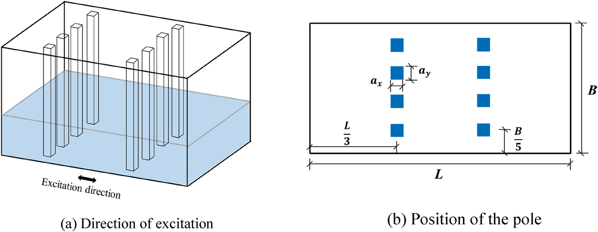
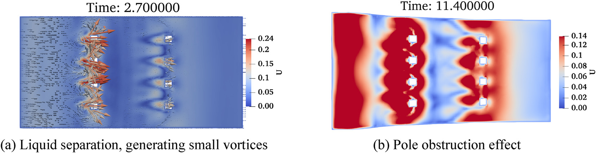
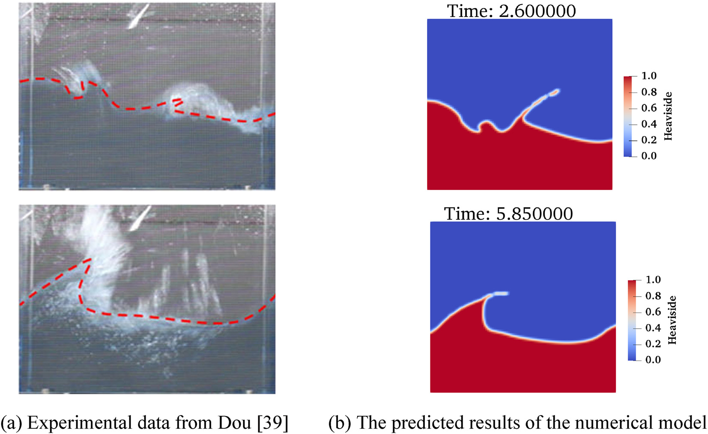
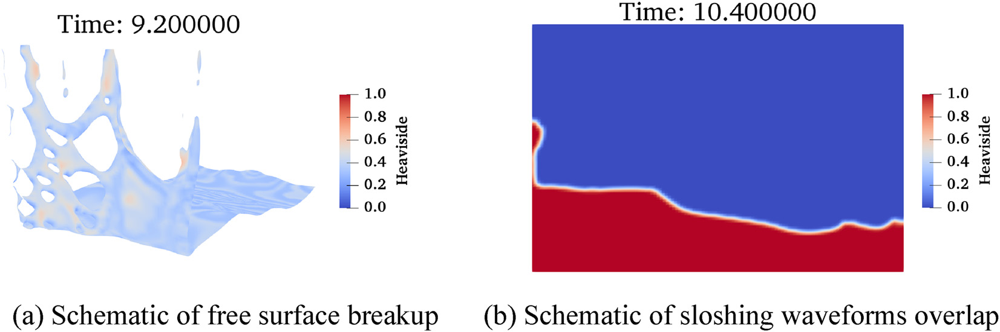
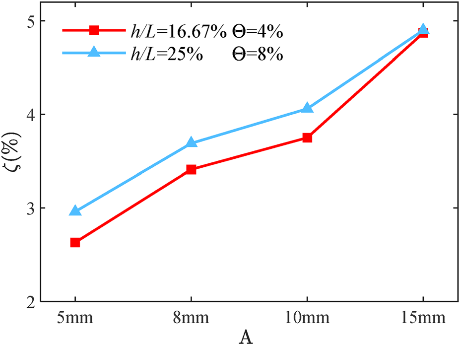
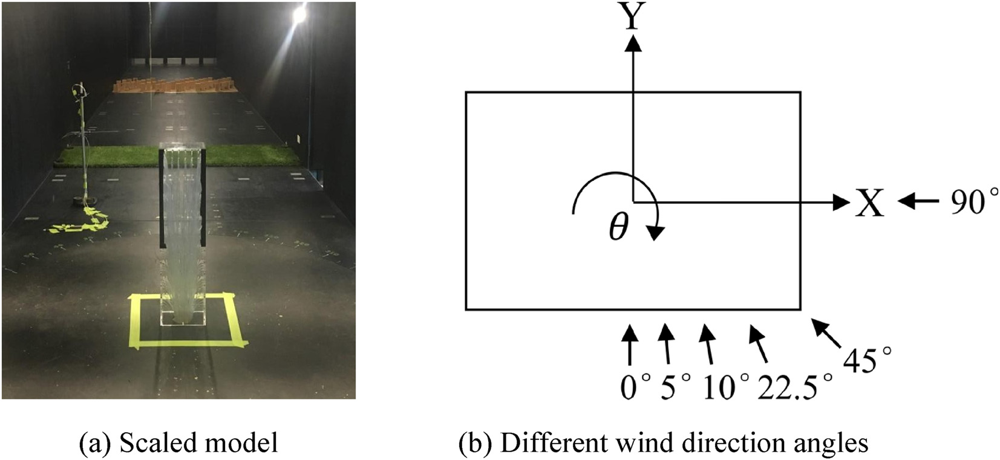
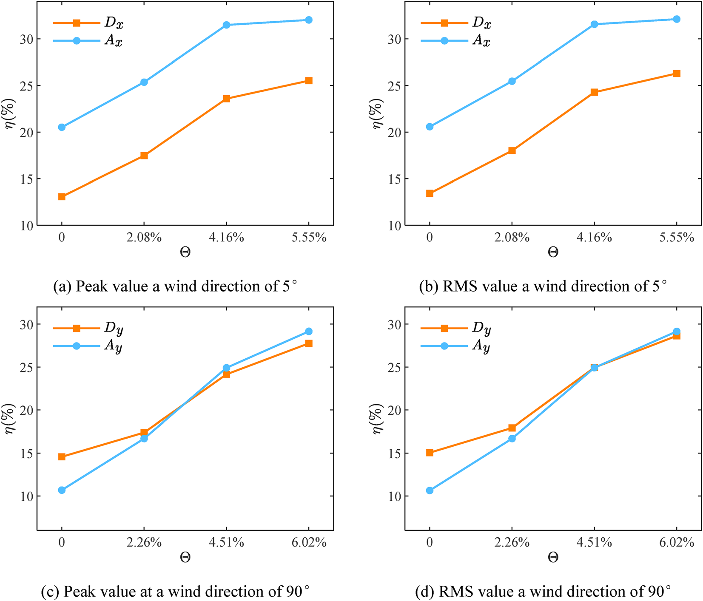
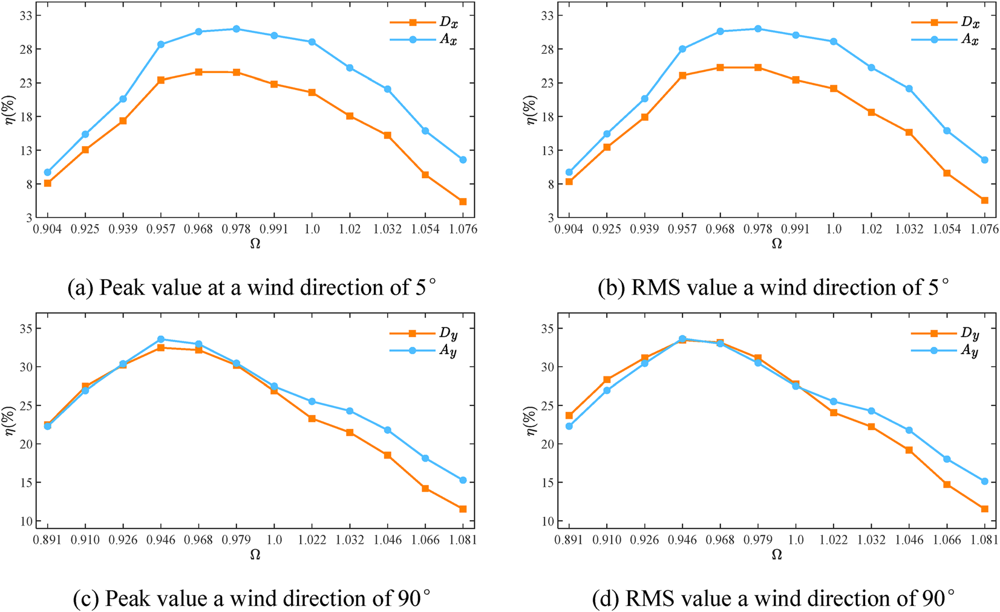

# 结构抗风 | 让高层建筑 TLD 在非线性晃荡中更会耗能

高层建筑在强风作用下的舒适度问题，常常不是结构是否安全这么简单。楼顶加速度过大时，居住者会感到不适甚至焦虑，内部设备运行也可能受到影响。调谐液体阻尼器（tuned liquid damper, TLD）是一类经济、易维护的被动控制装置：它通过水箱内液体晃荡耗散结构振动能量。

但普通 TLD 的液体固有阻尼有限，大型水箱还会承受显著晃荡力。我们在这篇发表于 Physics of Fluids 的论文中提出 implanted pole TLD，在水箱内布置植入式立柱。立柱既扰动多方向液体运动、增强耗能，也能为大型水箱提供支撑，并帮助抵抗液体晃荡力。

论文图 9 植入式立柱 TLD 模型示意

图中展示了水箱内两列植入式立柱的布置方式，以及用于定义立柱阻塞率的截面尺寸和水箱宽度。

## 论文信息

- 论文题名: Numerical investigation of nonlinear sloshing features and vibration mitigation efficiency of the implanted pole tuned liquid damper
- 作者: <u>He Xin</u>; **Li Chao**\*; Chen Lingwei; Hu Gang; Ou Jinping
- 期刊: Physics of Fluids
- 年份: 2025
- DOI: https://doi.org/10.1063/5.0293483
- WOEAI 相关方向: 建筑结构抗风 / 高层建筑抗风与优化

## 三句话导读

这篇论文研究一种在 TLD 水箱内布置植入式立柱的减振方案，关注自由液面非线性、能量耗散和高层建筑风致响应控制。
它重要，因为高层建筑舒适度控制不仅取决于水箱质量和调谐频率，也取决于内部液体如何破碎、卷起、绕流并耗散能量。
读者可以带走的结论是：植入式立柱既是结构支撑构件，也是可设计的耗能构件，需要与流固耦合模型和调谐参数一起评估。

## 关键数字 / 关键结论卡

- 双向耦合模型对结构位移和液体晃荡响应的平均相对误差分别为 $5.26\%$ 和 $13.91\%$，计算时间由 $5218\,\mathrm{s}$ 降至 $4632\,\mathrm{s}$。
- 在单自由度框架试验条件下，引入内部立柱后，结构顶部最大位移响应降低 $85.2\%$。
- CAARC 建筑算例显示，立柱阻塞率和调谐比共同决定减振效率；在约 $65\%$ 的调谐范围内，植入式立柱 TLD 仍表现出一定鲁棒性。

## 摘要

调谐液体阻尼器（TLD）是一种经济高效的动力吸振装置，能够有效减小高层建筑过大的风致振动，从而改善居住者舒适度。本文提出一种植入式立柱 TLD。植入式立柱不仅能在多个方向上扰动晃荡液体，从而提高能量耗散效率，而且具有较高刚度，可为大型水箱提供支撑并抵抗显著液体晃荡力，最终保障 TLD 的安全稳定运行。

为进一步研究植入式立柱对 TLD 内部液体振荡响应和减振效率的影响，本文采用计算流体动力学方法，通过耦合 level set 方法和 volume of fluid（VOF）方法（CLS-VOF）改进 OpenFOAM 两相流求解器，提高自由液面追踪精度。研究考察了液深、立柱尺寸和激励幅值对内部液体非线性振荡特征的影响。

此外，本文通过 OpenFOAM 二次开发建立了结构-TLD 系统的双向耦合数值模型，该模型能够准确捕捉液体振荡与结构动力响应之间的相互作用。数值模拟结果与实验数据吻合良好。进一步通过改变立柱阻塞率和调谐比，分析了植入式立柱 TLD 减小高层建筑风致振动响应的有效性。该双向耦合数值模型准确高效，可辅助工程师开展 TLD 精细设计与优化。

## 研究问题

高层建筑 TLD 设计需要把液体非线性、内部构造和结构响应放在一起看。这篇论文主要回答三个问题：

1. 植入式立柱如何改变 TLD 内部的液体晃荡路径、自由液面破碎和能量耗散？
2. 液深、立柱阻塞率、激励幅值和调谐比这些参数，如何影响高层建筑风致振动控制效果？
3. 能否建立一个既能捕捉自由液面非线性、又可用于结构-TLD 耦合分析的数值模型？

## 方法贡献

论文首先在 OpenFOAM 中改进两相流求解器，将 level set 方法和 VOF 方法耦合为 CLS-VOF 路线。VOF 有利于质量守恒，level set 有利于界面法向和曲率计算；二者结合后，可以更清晰地捕捉自由液面，并减弱伪流问题。

对 TLD 本体，论文设置不同液深比 $h/L$、立柱阻塞率 $H$ 和激励幅值 $A$，分析液体波高峰值、晃荡力峰值和等效阻尼变化。立柱阻塞率用论文中的定义表示为：

$$
H=\frac{a}{B}
$$

其中 $a$ 为立柱截面尺寸，$B$ 为水箱宽度。这个指标把“立柱有多挡水”转化为可调参数，便于比较不同立柱尺寸对晃荡和耗能的影响。

论文图 14 自由液面速度云图说明植入式立柱对液体振荡的影响

图中可以看到，立柱尖角附近出现液体分离和小涡，立柱阻塞也会切断部分晃荡能量传递路径，这是阻尼提高的重要机制。

在结构-TLD 耦合方面，论文通过 OpenFOAM 二次开发建立双向耦合数值模型。流体域用 CLS-VOF 捕捉液体晃荡并计算晃荡力，结构域用 Newmark-beta 数值积分求解结构响应，两者通过通信接口实时交换数据。

论文图 22 自由液面捕捉结果对比

图中比较了试验自由液面与双向耦合数值模型的预测结果，说明模型能够捕捉自由液面卷起、破碎等强非线性现象。

## 关键发现

### 1. 植入式立柱能改变液体晃荡路径并提高 TLD 阻尼

**针对问题 1，没有立柱时，随着液深比 $h/L$ 增大，液体振荡会从 hard spring 特征转向 soft spring 特征，非线性特征也会发生变化。**布置立柱后，液体晃荡行为明显改变：随着阻塞率 $H$ 增大，液体晃荡能量降低，自由液面上升受到限制，振荡响应减小。

论文指出，立柱增强耗能主要来自两方面。一方面，立柱阻塞作用把晃荡液体分割为多个小区域，打断能量传递路径，抑制自由液面上升；另一方面，立柱尖角处会发生液体分离并产生小涡，立柱表面与液体之间的黏性相互作用也会增加能量耗散。

### 2. 大幅激励会强化非线性晃荡，也会提高能量耗散

**针对问题 1，激励幅值 $A$ 反映外部输入能量大小。**论文结果显示，随着 $A$ 增大，波高和晃荡力峰值显著上升，振荡能量逐步积累，波形开始叠加，自由液面可能发生破碎；同时，晃荡周期减小、共振响应滞后，表现出 hard spring 效应。

论文图 17 大幅激励下的非线性振荡特征

图中展示了自由液面破碎和晃荡波形叠加现象，说明大幅输入下 TLD 的内部液体响应不能被简单线性模型充分描述。

论文进一步给出不同激励幅值下的能量耗散效率变化：内液等效阻尼比 $\zeta$ 随 $A$ 增大而提高。尤其在 $h/L$ 和 $H$ 较小时，液体振荡更剧烈，波浪破碎和非线性特征更明显，能量耗散机制随之增强。

论文图 18 不同激励幅值下植入式立柱 TLD 的能量耗散效率

图中显示，随着激励幅值增大，植入式立柱 TLD 的等效阻尼比整体上升，说明非线性晃荡并不只是计算难点，也可能成为耗能来源。

### 3. 双向耦合模型能用于结构-TLD 系统振动控制分析

**针对问题 3，论文用单自由度框架结构和 TLD 控制试验对双向耦合数值模型进行验证。**结构位移响应和液体晃荡响应与试验数据吻合，平均相对误差分别为 $5.26\%$ 和 $13.91\%$。与标准流固耦合方法相比，该模型计算时间从 $5218\,\mathrm{s}$ 降至 $4632\,\mathrm{s}$。

在相同单自由度框架条件下，引入内部立柱后，TLD 能量耗散效率提高，结构顶部最大位移响应降低 $85.2\%$。这说明植入式立柱并不是只改变水箱内部流动图像，而是能转化为结构响应控制效果。

### 4. 对 CAARC 高层建筑，阻塞率和调谐比共同决定减振效率

**针对问题 2，论文进一步以 CAARC 高层建筑模型为对象，研究 $10$ 年重现期风荷载下的风致振动控制。**建筑高度为 $182.88\,\mathrm{m}$，平面长度 $45.72\,\mathrm{m}$、宽度 $30.48\,\mathrm{m}$，并采用风洞测压试验数据作为风荷载输入。

论文图 24 CAARC 模型测压试验示意

图中给出了 CAARC 缩尺模型和不同风向角设置，为后续比较 $5^\circ$ 和 $90^\circ$ 风向下的减振效果提供风荷载基础。

在基准参数下，植入式立柱 TLD 可以减小建筑平动响应。论文报告，$A_x$ 从 $0.3163$ 降至 $0.2398\,\mathrm{m/s^2}$，$A_y$ 从 $0.4683$ 降至 $0.3902\,\mathrm{m/s^2}$；位移响应 $D_x$ 从 $0.2443$ 降至 $0.203\,\mathrm{m}$，$D_y$ 从 $0.4184$ 降至 $0.3457\,\mathrm{m}$。其对平动响应控制明显，对绕 $Z$ 轴扭转响应影响较小。

论文图 26 不同立柱阻塞率下减振率对比

图中比较了 $5^\circ$ 和 $90^\circ$ 风向下峰值响应与 RMS 响应的减振率。为便于本文说明，这里用 $\eta$ 表示减振率；论文原文用 $g=1-R/R_o$ 表示同一指标。立柱阻塞率增大时，减振率 $\eta$ 提高，但增长速度逐渐放缓。

调谐比同样关键。为便于本文说明，下式用 $\Omega$ 表示 TLD 振荡频率与结构频率的比值；论文原文使用其自己的符号表示同一调谐比：

$$
\Omega=\frac{\omega_{\mathrm{TLD}}}{\omega_s}
$$

在约 $65\%$ 的调谐范围内，植入式立柱 TLD 表现出较好的鲁棒性。$5^\circ$ 风向下，$\Omega=0.978$ 时减振率达到最大；$90^\circ$ 风向下，$\Omega=0.946$ 时结构风致响应显著降低。

论文图 29 不同调谐比下减振率对比

图中显示，调谐比偏离最优范围后，减振率会下降；但植入式立柱带来的附加阻尼使 TLD 在一定频率偏差内仍保持有效。

## 工程意义

这项工作对高层建筑风振控制的意义在于，把 TLD 设计从“选择水箱尺寸和调谐频率”推进到“同时设计内部流动构造、自由液面非线性和结构响应控制”的层面。

对大型楼顶水箱，植入式立柱有双重价值：结构上可作为水箱内部支撑，流体上可打断晃荡能量传递并增加涡耗散。论文给出的阻塞率、液深比、激励幅值和调谐比参数分析，可以帮助工程师在减振效率、液体晃荡力、水箱稳定运行和构造可行性之间进行权衡。

对数值工具开发而言，本文的双向耦合模型提供了一种相对高效的结构-TLD 联合分析方式。它避免了复杂结构域网格生成和边界处理，同时保留对自由液面卷起、破碎、液体冲击和结构反馈的描述能力，适合用于 TLD 精细设计和优化阶段的方案比较。

## 适用边界

本文结论基于矩形水箱、矩形植入式立柱、OpenFOAM 中的 CLS-VOF 两相流模型、论文设置的液深比和阻塞率范围，以及 CAARC 高层建筑模型的风洞测压荷载。换成其他水箱形状、立柱截面、结构体系、屋顶布置或风环境后，最优参数需要重新计算。

论文最后也指出，本文主要研究矩形立柱 TLD。后续可进一步比较圆形、流线型、菱形等不同立柱形状的阻尼性能差异，并研究不同风向下更优的立柱布置方式。

此外，TLD 是以调谐和液体晃荡为基础的被动控制装置。即便植入式立柱提高了鲁棒性，设计仍需关注结构频率变化、施工与维护条件、液体晃荡力、水箱局部强度和长期运行可靠性，不能只用单一减振率指标替代完整工程校核。

如果你对建筑结构抗风 / 海上漂浮风电方向的研究生学习或工程合作感兴趣，点击阅读原文查看本文网页版，并从 WOEAI 主页了解更多。

## 延伸阅读

- [WOEAI | 建筑结构抗风方向介绍](https://woeai.readthedocs.io/zh-cn/latest/BuildingStructuralWindResistance.html)
- [WOEAI | 主页](https://woeai.readthedocs.io/zh-cn/latest/)
