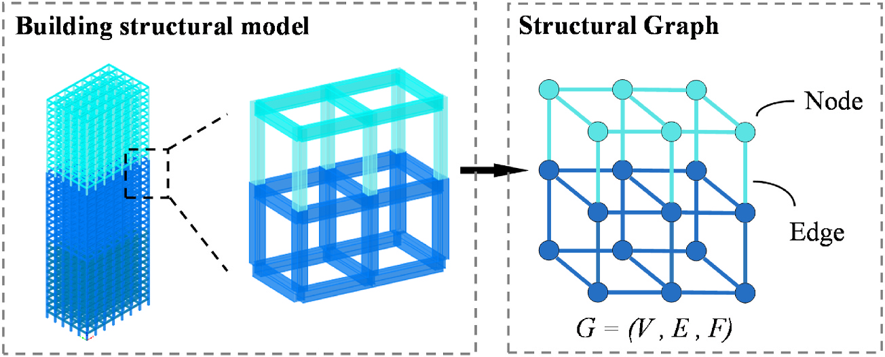
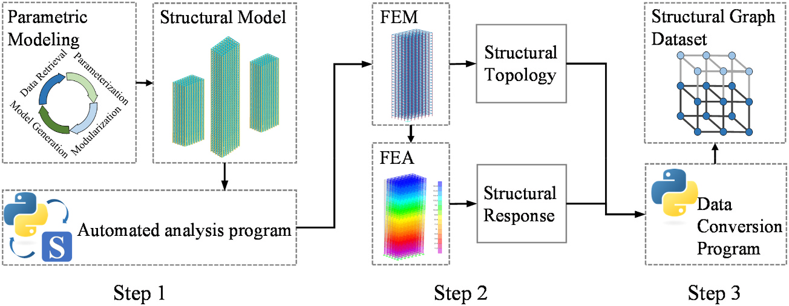
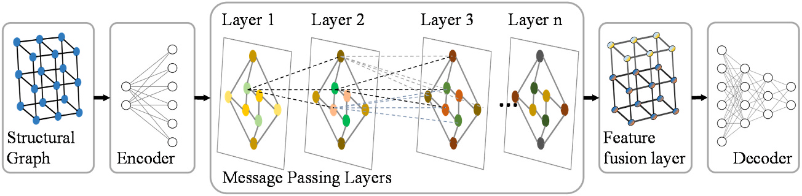
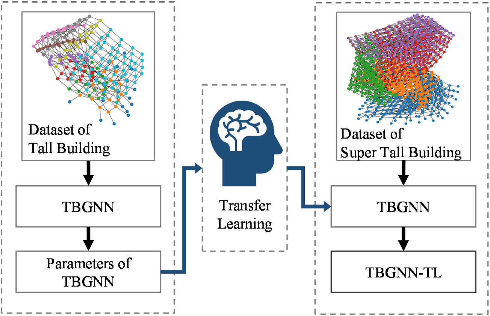
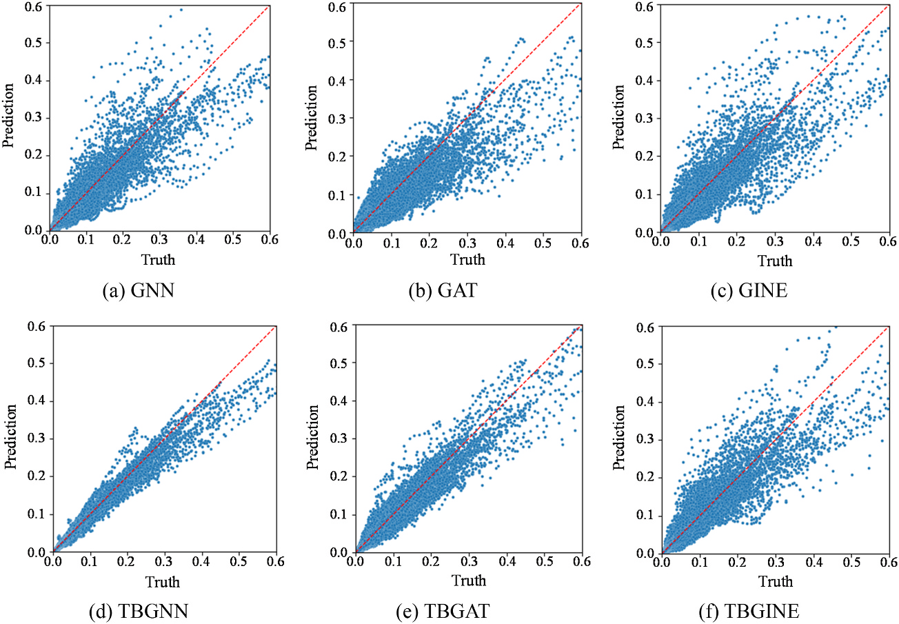
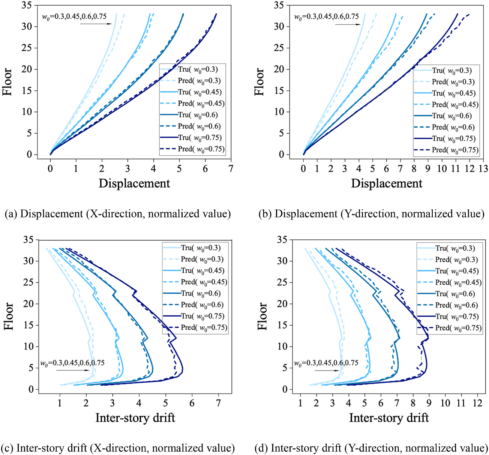
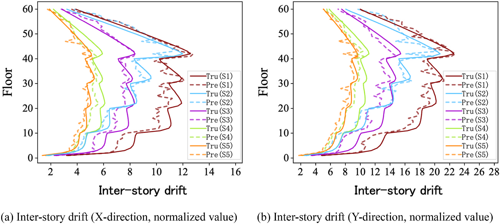

# 结构抗风 | 用图神经网络预测高层建筑结构响应

高层建筑抗风优化中，每改一轮梁柱尺寸，就要再建模、再算响应：能否把这个重复环节加快，同时保留结构拓扑和楼层信息？这篇论文以钢筋混凝土框架静力分析为对象，把参数化建模与 TBGNN 结合，在 CAARC 算例中报告相对“人工修改模型加 FEA”约 $90\%$ 的单次流程节时。下文同时说明计时范围和原表内的不一致。

在这篇发表于 **Journal of Building Engineering** 的论文中，我们把高层建筑结构表示为图数据，提出面向高层建筑结构响应预测的 Tall Building Graph Neural Network（TBGNN）框架，探索在特定静力响应分析任务中用图神经网络代理模型提高重复分析效率。这项工作关注的是风荷载作用下的位移、层间位移和一阶自振周期预测，不把模型包装成已经工程部署的商业软件。

论文图 1 建筑结构模型的结构图表示（不同颜色表示不同标准层）

这张图展示了本文的基本建模思想：把建筑结构中的节点、梁柱构件和楼层关系组织为图，让结构拓扑、构件信息和传力关系进入同一个数据表示。

## 论文信息

- 论文题名: Training and application of graph neural networks for predicting structural responses targeted at tall building structures
- 作者: <u>Tang Ao</u>; **Li Chao**\*; Yang Junhui; Zhang Heqiang; Zheng Qingxing; Zhang Jianjun
- 期刊: Journal of Building Engineering
- 年份: 2025
- DOI: https://doi.org/10.1016/j.jobe.2025.112131
- WOEAI 相关方向: 建筑结构抗风 / 高层建筑抗风与优化

## 三句话导读

这篇论文研究如何把高层建筑结构表示为图，并用 TBGNN 预测风荷载作用下的位移、层间位移和一阶自振周期。
它重要，因为抗风优化中的有限元分析可信但耗时，重复建模和计算会限制早期方案搜索效率。
读者可以带走的结论是：GNN 代理模型可以作为快速筛选工具，但必须保留楼层特征、工程知识损失函数和清晰的数据适用边界。

## 关键数字 / 关键结论卡

- 原第 2.2.3 节把 $998$ 个高层结构按风压变化扩充为 $2994$ 组图样本，再加入 $1200$ 组超高层样本，合计 $4194$ 组；不等于同样数量的独立拓扑。第 3 节另写 $2944$ 组，两处原文不一致。
- 按原式（14）的相对误差型 Accuracy 指标，表 6 的四项位移/层间位移得分从 GNN 的 $80.73\%$–$83.70\%$ 提高至 TBGNN 的 $91.57\%$–$92.13\%$；这不是分类正确率。
- 约 $90\%$ 的节时以人工修改模型加 FEA 为基线，只对应论文的单次修改与分析，不含前期数据生成和训练。

## 摘要

有限元分析（FEA）方法通常计算量大且耗时，尤其是在涉及多次迭代的结构优化任务中。为提高效率，研究者已经开始使用神经网络预测结构响应。然而，工程数据集稀缺、高层建筑数据复杂，以及现有图神经网络（GNN）处理这类复杂数据时面临的挑战，限制了 GNN 代理模型的潜力。

为解决这些问题，本文提出一种专门面向高层建筑结构的 GNN 训练与应用框架，目标是用 GNN 代理模型替代 FEA 完成结构分析。首先，本文用图表示高层建筑结构的完整信息；其次，通过参数化建模快速生成高层建筑结构数据集；最后，提出楼层特征增强策略，并修改损失函数以优化位移曲线模式。

由此形成的高层建筑图神经网络 TBGNN，在较少数据、轻量化架构和较少计算资源条件下，在特定任务中表现良好。数值实验结果表明，改进模型在预测钢筋混凝土结构的结构位移、层间位移和一阶自振周期方面，相比其他 GNN 的准确率平均提高超过 $5\%$。此外，TBGNN 对风荷载和结构尺寸变化都非常敏感。与传统有限元分析方法相比，所提出的 GNN 代理模型节约约 $90\%$ 的时间。这些发现说明，用 GNN 代理模型服务高层建筑抗风结构设计优化具有可行性，并为这一重要挑战提供了有价值的思路。

## 研究问题

高层建筑结构响应预测要让模型真正理解工程对象，而不是只学习一组表格数字。本文回答三个问题：

1. 如何把高层建筑的节点、梁柱构件、楼层关系、质量和风荷载组织成适合 GNN 学习的图数据？
2. 如何通过参数化建模和工程知识损失函数，让代理模型在较少工程数据下学习有用的响应曲线？
3. 当楼层数、风压和构件尺寸变化时，TBGNN 的预测能力和外推边界在哪里？

## 方法贡献

这项工作把“数据怎么来”“结构怎么表示”“模型怎么学”和“怎么用于更高楼层结构”串成一条完整流程。

第一步是图表示。节点表示构件连接处，边表示梁柱；在刚性楼板假设下，把质量与风荷载纳入节点特征。原式（2）先计算按面积计的风荷载标准值：

$$
w_k=\beta_z \mu_s \mu_z w_0
$$

其中 $\beta_z$ 为风振系数，$\mu_s$ 为体型系数，$\mu_z$ 为风压高度变化系数，$w_0$ 为基本风压。按该风压计算楼层荷载后，再均匀分配为节点力；不能把风压直接当作节点力。

第二步是参数化建模与数据生成。论文使用 YJK-GAMA、SAP2000 自动分析与 PyTorch Geometric 转换结构图和响应标签。第 2.2.3 节中，$998$ 个、$21$–$33$ 层的高层结构经三种基本风压扩充为 $2994$ 组；$300$ 个、$45$–$63$ 层的超高层基础组合经尺寸增强形成 $1200$ 组，合计 $4194$ 组。第 3 节却写 $2944$ 组高层数据，未解释差额，本导读保留冲突。

论文图 4 数据生成

这张图说明了本文的数据闭环：参数化建模生成结构模型，有限元分析得到结构响应，再把结构拓扑与响应结果转换为结构图数据集。

第三步是 TBGNN。模型由编码器、消息传递层、楼层特征融合层和解码器组成。相比直接堆叠大量 GNN 层，本文把同一楼层节点的特征汇聚为楼层节点，再与原节点特征融合，试图在模型复杂度和楼层局部特征保留之间取得平衡。

论文图 6 TBGNN 架构

TBGNN 从结构图进入编码器和消息传递层，再经过楼层特征融合层和解码器输出结构响应，核心是让高层建筑的“楼层性”进入图神经网络。

第四步是迁移学习。论文发现楼层数对模型性能有明显影响，当测试结构楼层数超出训练数据范围时，误差会增大。因此，研究进一步把低楼层结构中学到的模型参数迁移到超高层结构数据训练中，形成 TBGNN-TL。

论文图 8 面向超高层建筑的迁移学习

迁移学习部分把高层建筑数据集中学到的 TBGNN 参数作为超高层建筑模型训练的初始知识，用较小补充数据扩展模型对更多楼层结构的适应性。

## 关键发现

### 1. 楼层特征融合提高了结构响应预测表现

**针对问题 1，在相同训练设置下，楼层特征融合改善了本文验证集上的位移与层间位移预测。**原文按 $80\%$/$20\%$ 分训练/验证集；$66084$ 个预测结果专指位移及层间位移结果，不是独立建筑数量。第五个输出 $n_1$ 在正文称一阶自振周期，表 5 却列单位 $\mathrm{rad/s}$，存在量纲冲突，不擅自改称频率或换算。

Accuracy 在式（14）中定义为 $1$ 减平均绝对相对误差。表 6 的四个位移类输出从 $0.8370$、$0.8228$、$0.8212$、$0.8073$ 提高到 $0.9196$、$0.9213$、$0.9172$、$0.9157$；第五项从 $0.9283$ 提高到 $0.9810$。原文“约 $84\%$ 到 $92\%$”的概括与五项算术均值不完全一致，这里采用分项值。

论文图 9 验证集回归性能

图中上排是不加入楼层特征融合的 GNN、GAT 和 GINE，下排是加入楼层特征融合后的 TBGNN、TBGAT 和 TBGINE；TBGNN 的散点更接近理想预测线。

### 2. 工程知识损失函数让位移曲线更接近设计关心的形态

**针对问题 2，如果只使用平均绝对误差，模型可能在总体误差不大时仍然给出局部波动明显的位移曲线。**对工程设计来说，这类不规则波动会影响构件评估和优化判断。

因此，论文把最大楼层响应和位移趋势纳入损失函数，让模型不仅追求点值接近，也学习楼层响应曲线应有的趋势。换句话说，模型训练目标从“整体误差更小”进一步靠近“曲线形态更符合工程判断”。

### 3. 楼层数比单纯结构高度更能影响模型外推

**针对问题 3，在楼层数敏感性分析中，论文比较了 $30$、$33$、$36$ 和 $39$ 层结构，并进一步比较相同高度但楼层数不同的结构。**结果显示，当楼层数落在训练数据范围内时，各项指标准确率超过 $90\%$；当楼层数超过训练数据范围时，预测误差随超出程度增加而增大。

这提示我们，面向高层建筑的 GNN 代理模型不能只按结构高度理解训练范围。楼层数本身会改变结构图的信息传递深度和楼层特征组织方式，是后续训练和应用时需要优先审查的变量。

### 4. 模型能够响应风压变化和构件尺寸变化

**针对问题 3，论文在同一个 $33$ 层结构上改变基本风压，检查模型能否跟踪荷载变化。**图 16 的风压为 $0.30$、$0.45$、$0.60$、$0.75\,\mathrm{kN/m^2}$。作者也观察到部分预测偏低并引入 $\gamma=1.05$ 的经验修正；该取值不是对所有结构的安全保证。

论文图 16 不同基本风压下的位移和层间位移

图 16 横轴为归一化响应，上排位移、下排层间位移，分别使用 $73.62\,\mathrm{mm}$ 和 $3.48\,\mathrm{mm}$ 的尺度。实线为有限元结果、虚线为预测结果，颜色表示基本风压。

在 CAARC 标准高层建筑验证中，论文使用 $60$ 层钢筋混凝土框架结构，尺寸为 $182.88\,\mathrm{m} \times 45.72\,\mathrm{m} \times 30.48\,\mathrm{m}$，并设置 $S1$ 到 $S5$ 五种构件尺寸情景。TBGNN-TL 在这些情景下预测层间位移，并能跟踪构件尺寸变化带来的响应差异。

论文图 19 CAARC 建筑不同截面工况下预测值与真实值对比

图 19 横轴是以 $2.61\,\mathrm{mm}$ 归一化的层间位移，实线为有限元值、虚线为预测值。图 18 的尺寸、图 19 的情景标签与第 4.2 节的安全情景描述存在需澄清之处，不能仅据此图排序方案或判定满足设计要求。

### 5. 在论文测试条件下，参数化建模结合 TBGNN 显著节约分析时间

**针对问题 2，论文比较了三类流程：人工修改模型加 FEA、参数化修改模型加 FEA、参数化修改模型加 TBGNN 代理模型。**在测试环境下，单次修改与分析总时间分别约为 $3\,\mathrm{min}\,13\,\mathrm{s}$、$1\,\mathrm{min}\,40\,\mathrm{s}$ 和 $17.33\,\mathrm{s}$。论文据此报告，相比传统分析流程，参数化建模结合 TBGNN 代理模型可节约约 $90\%$ 的时间。

原文第 4.3 节和表 8 总时间为 $17.33\,\mathrm{s}$，但同表 $15\,\mathrm{s}$ 建模加 $2.63\,\mathrm{s}$ 分析为 $17.63\,\mathrm{s}$，差额未解释，本导读不代改原表。计时设备是 GTX1050Ti 与 i5-11500，流程含软件间数据转换，不是纯推理耗时，也不含数据生成和训练。第 4.1 节另报迁移训练 $500$ 轮耗时 $7.9\,\mathrm{h}$。约 $90\%$ 仅是该算例相对人工修改加 FEA 的节时量级。

## 工程意义

对高层建筑抗风设计来说，这项工作提供了一个清晰的 AI 代理模型范式：先用结构图表达建筑拓扑和构件信息，再用参数化建模生成可审计数据，最后用专门的 GNN 架构学习位移、层间位移和自振周期等响应。

它对工程应用的启发主要有三点。

第一，结构响应预测模型不应只追求黑箱速度。本文把节点、边、楼层、风荷载、构件尺寸和工程知识损失函数纳入同一框架，说明代理模型仍然需要尊重结构工程中的变量组织方式。

第二，面向优化迭代的 AI 模型需要明确适用范围。楼层数、结构拓扑、构件类型、荷载形式和训练数据边界，都会影响模型是否可靠。本文对楼层数外推和迁移学习的分析，正是这种边界意识的一部分。

第三，同一拓扑下反复修改梁柱尺寸的方案比选，是代理模型可考虑的快速评估场景。这是基于论文算例的应用建议；本文没有验证完整优化闭环的最终最优解、全套规范验算或真实项目部署，最终设计仍须有限元和规范复核。

## 适用边界

这篇论文的框架是有边界的。

首先，当前研究聚焦钢筋混凝土框架结构的静力响应分析，主要预测风荷载作用下的位移、层间位移和一阶自振周期。真实高层建筑中的剪力墙、框架-核心筒、墙单元处理和更复杂构件体系，会带来更复杂的图表示问题。

其次，本文把静态荷载等效为节点荷载，使 TBGNN 能够学习静力荷载与结构响应之间的关系。如果要考虑动态荷载或时程响应，论文也指出需要与能够处理时序数据的神经网络结合，例如 LSTM。

第三，模型预测不能被理解为替代所有工程审查。论文展示的是在特定数据集、结构类型和验证算例下，TBGNN 及 TBGNN-TL 作为代理模型的可行性。进入真实设计流程时，仍需要检查训练数据覆盖范围、结构体系差异、荷载组合、规范约束和安全裕度。

因此，更准确的理解是：这项研究为高层建筑抗风优化中的重复结构响应分析提供了一条可验证的代理模型路线，而不是把有限元分析或工程师判断从流程中移除。

如果你对建筑结构抗风 / 海上漂浮风电方向的研究生学习或工程合作感兴趣，点击阅读原文查看本文网页版，并从 WOEAI 主页了解更多。

## 延伸阅读

- [WOEAI | 建筑结构抗风方向介绍](https://woeai.readthedocs.io/zh-cn/latest/StructuralWindEngineering.html)
- [WOEAI | 主页](https://woeai.readthedocs.io/zh-cn/latest/)
