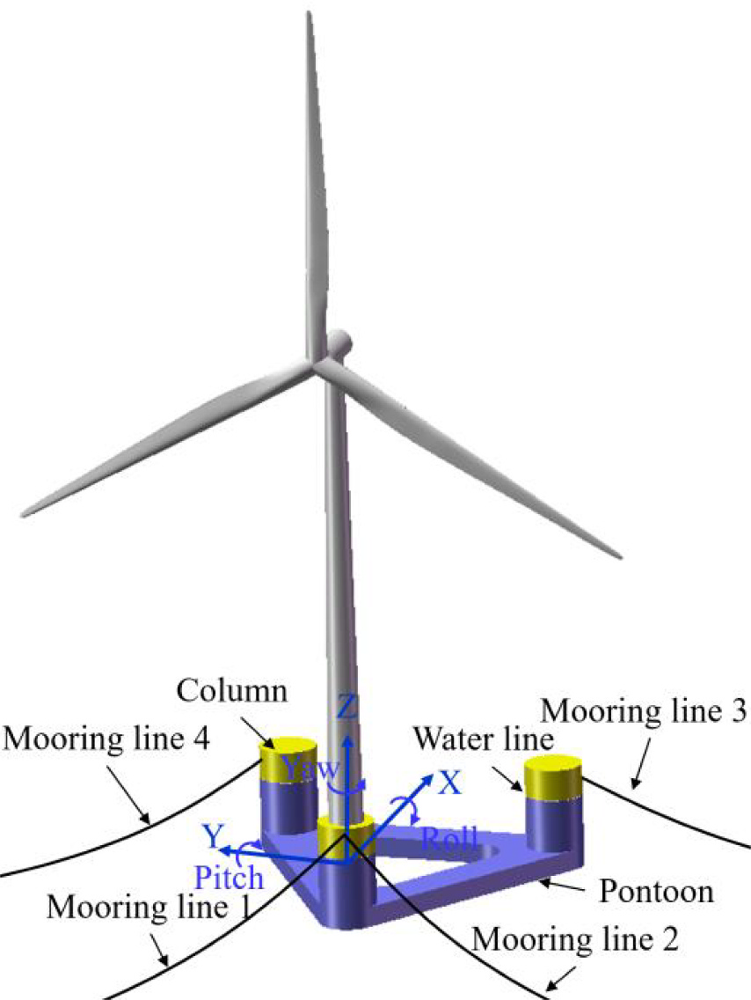
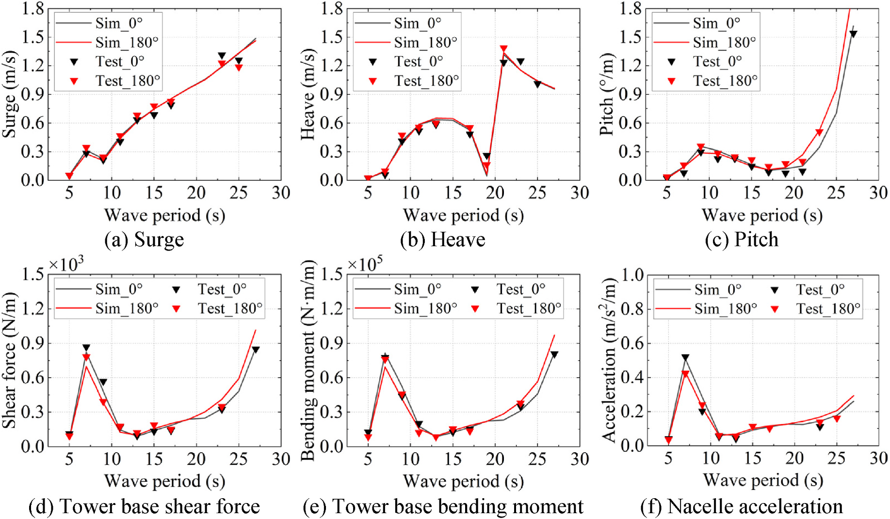
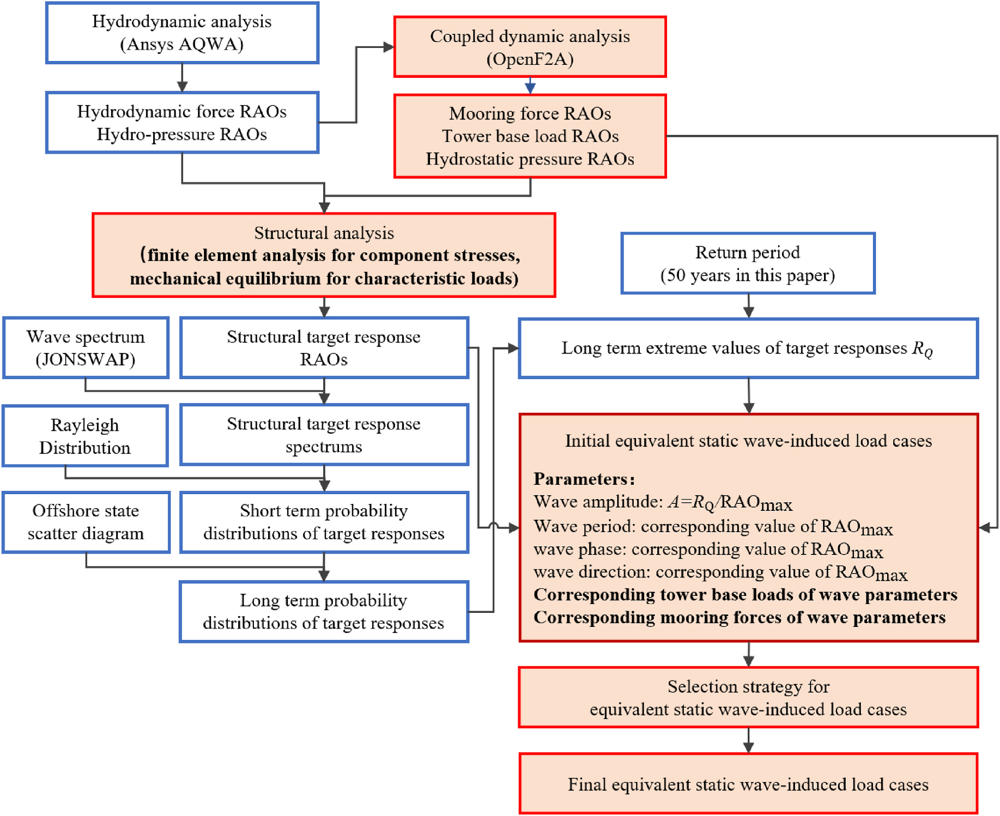
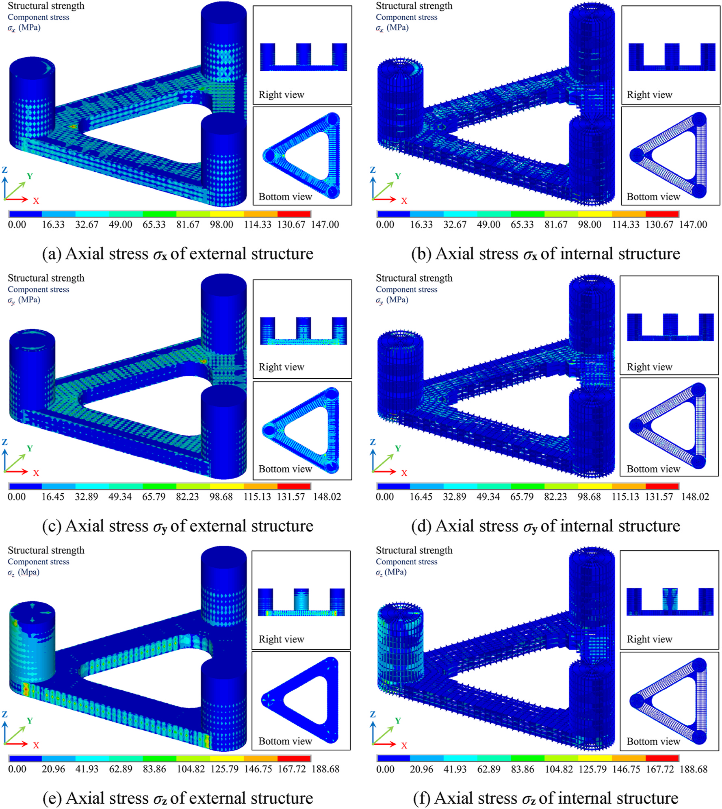
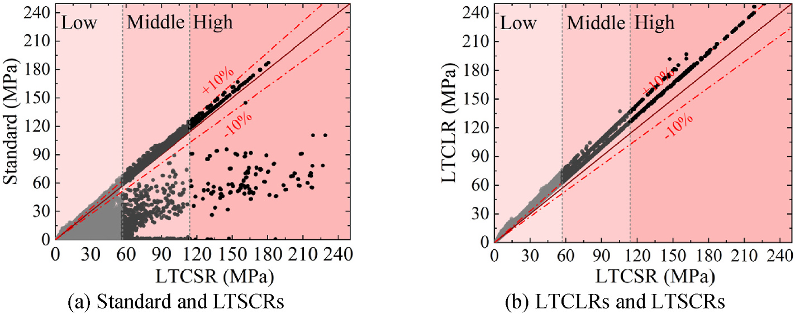

# 漂浮风电 | 为半潜式风机找到可信的等效静力波浪荷载

浮式风机平台的结构设计不能只看“最大波浪来了没有”。对半潜式风机来说，波浪水压力、系泊导缆孔力、塔底载荷和平台运动会共同进入结构应力。如果把油气平台中常用的设计波方法直接搬到浮式风机上，计算虽然简单，却可能漏掉风机和系泊系统带来的关键耦合效应。

在这篇发表于 Ocean Engineering 的论文中，我们以一种三角形半潜式 $10\,\mathrm{MW}$ 风机平台为对象，比较传统设计波方法、基于长期特征载荷响应的等效静力波浪荷载方法，以及基于长期应力分量响应的等效静力波浪荷载方法。研究关注的是：怎样用有限数量的静力等效工况，尽量可靠地代表 $50$ 年长期波浪作用下的平台结构应力。

论文图 1 三角形半潜式 10 MW 风机系统

图中展示了本文研究对象的基本构型：三根立柱和底部浮筒形成三角形半潜式平台，风机布置在其中一根立柱上，四根悬链线系泊线限制平台运动。

## 论文信息

- 论文题名: Evaluating equivalent static wave loads for a delta-shaped semi-submersible 10-MW wind turbine
- 作者: <u>Zheng Shunyun</u>; Liu Shangpei; **Li Chao**\*; Wang Xiaolu; Ou Jinping
- 期刊: Ocean Engineering
- 年份: 2025
- DOI: https://doi.org/10.1016/j.oceaneng.2025.121336
- WOEAI 相关方向: 海上漂浮风电 / 浮式混凝土平台结构设计

## 三句话导读

这篇论文研究半潜式 $10\,\mathrm{MW}$ 风机平台的等效静力波浪荷载，比较传统设计波、LTCLR 和 LTSCR 三类路线。
它重要，因为浮式风机的危险应力不只来自水压力，还会叠加塔底载荷、系泊导缆孔力和平台运动耦合效应。
读者可以带走的结论是：等效静力工况要服务设计阶段，初步设计可偏保守，详细设计则应更贴近长期应力危险区域。

## 关键数字 / 关键结论卡

- 传统设计波方法预测 LTSCR 时，高应力区应力预测误差可达到 $-99.93\%$ 至 $28.58\%$。
- LTCLR 方法从 $111$ 个特征载荷目标筛选得到 $12$ 个最终 ESWL 工况；LTSCR 方法最终保留 $6$ 个更有针对性的 ESWL 工况。
- LTSCR 方法下高应力区域平均等效误差为 $5.06\%$ 至 $8.06\%$，更适合详细设计阶段的精细强度评估。

## 摘要

传统设计波方法常用于油气平台，以确定等效静力波浪荷载；但当它直接用于浮式风机时，会受到平台几何构型差异和兆瓦级风机强耦合作用的限制。为解决这一问题，本文对设计波方法进行增强和扩展，以确定能够同时考虑水压力、系泊导缆孔力和塔底载荷的等效静力波浪荷载，并分别以 $50$ 年长期特征载荷响应和应力分量响应作为等效目标。

论文对设计波方法和增强方法进行了系统比较，并严格验证了这些方法预测三角形半潜式平台在波浪荷载作用下应力的有效性。结果表明，传统设计波方法由于考虑过于简化，实际适用性不足。由长期特征载荷确定的等效静力波浪荷载精度更好，但计算需求更高；由长期应力分量确定的荷载精度最高，同时也最耗时。总体而言，论文建议根据设计流程所处阶段选择合适的方法。

## 研究问题

浮式风机的等效静力波浪荷载不能只沿用油气平台经验。本文回答三个问题：

1. 传统设计波方法在哪些地方漏掉半潜式浮式风机的塔底载荷、系泊导缆孔力和局部高应力响应？
2. 以长期特征载荷响应为目标的 LTCLR 方法，能否形成适合初步设计的保守工况？
3. 以长期应力分量响应为目标的 LTSCR 方法，能否用更少工况获得更高精度，并支撑详细强度评估？

## 方法贡献

论文首先建立三类模型：ANSYS AQWA 水动力模型、OpenFAST 与 ANSYS AQWA 耦合的 OpenF2A 动力模型，以及 ANSYS APDL 有限元结构模型。水动力模型提供波浪水压力和水动力系数，耦合动力模型给出平台运动、系泊导缆孔力和塔底载荷，有限元模型用于计算结构应力响应。

论文图 7 三角形半潜式风机系统 RAO

这组图比较了数值模拟和模型试验得到的平台运动、塔底载荷和机舱加速度响应幅值算子，说明后续等效静力荷载分析不是孤立的公式推导，而是建立在经过试验对照的动力响应模型之上。

在等效目标上，论文引入两条增强路线。第一条路线以长期特征载荷响应 LTCLR 为目标，考虑关键截面的多方向内力、整体加速度、系泊导缆孔力和塔底载荷。第二条路线以长期应力分量响应 LTSCR 为目标，直接让选出的等效静力工况逼近关键高应力区域的长期应力极值。

论文图 12 基于 LTSCR 和 LTCLR 的 ESWL 方法流程

这张流程图展示了增强方法与传统设计波方法的差异：除了水动力分析，还引入耦合动力分析得到系泊力、塔底载荷和静水压力响应，并用长期极值响应确定初始等效静力波浪荷载工况，再通过选择策略压缩工况数量。

论文的核心等效思想可以概括为：先通过响应谱和统计外推得到 $50$ 年长期极值目标响应，再用目标响应与响应幅值算子的比值确定等效规则波幅值。用论文中的记号表示，等效波幅值可写作：

$$
A=\frac{R_Q}{RAO_{\mathrm{max}}}
$$

这里 $R_Q$ 是指定超越概率下的长期极值响应，$RAO_{\mathrm{max}}$ 是对应等效目标的最大响应幅值算子。这个式子背后的工程含义是：等效静力工况不只追求某个大波高，而是追求能够代表长期结构响应目标的波浪参数组合。

## 关键发现

### 1. 传统设计波方法会漏掉浮式风机的关键耦合载荷

**针对问题 1，论文先分析 $50$ 年长期应力分量响应在平台上的分布。**结果显示，高应力主要集中在立柱与浮筒连接处、风机所在立柱的塔底和系泊导缆孔附近，以及部分底板和内部腹板区域。这些位置受到波浪水压力、塔底载荷和系泊导缆孔力共同影响。

论文图 13a 半潜式 10 MW 风机平台的波浪诱导 LTSCR

图中给出了不同应力分量在平台外部和内部结构上的长期应力响应分布。高应力区集中在局部危险区域，提示等效静力工况必须覆盖塔底、系泊导缆孔和立柱-浮筒连接等关键位置。

当使用标准中的传统设计波工况预测 LTSCR 时，高应力区的应力预测误差可达到 $-99.93\%$ 至 $28.58\%$；多数应力分量最大值低于目标值，范围为 $-71.05\%$ 至 $6.75\%$。论文据此指出，传统设计波方法没有对波浪诱导的塔底载荷和系泊导缆孔力进行静力等效，不能直接用于半潜式浮式风机的结构设计与强度评估。

### 2. LTCLR 方法适合初步设计，LTSCR 方法适合详细设计

**针对问题 2，基于 LTCLR 的方法从 $111$ 个特征载荷目标出发，经合并和筛选后得到 $12$ 个最终 ESWL 工况。**它考虑的工况更多、波高更大，因此在高应力区给出更保守的等效结果。论文报告，高应力危险区域中，应力分量最大等效误差为 $27.80\%$ 至 $36.91\%$，平均等效误差为 $17.88\%$ 至 $22.71\%$。

基于 LTSCR 的方法直接围绕结构应力响应选择工况，最终只保留 $6$ 个 ESWL 工况。论文结果显示，这 $6$ 个工况能够有效表征波浪作用下平台的 LTSCR；高应力区域的等效结果保持一定保守性，保守率低于 $23.86\%$，各应力分量平均等效误差为 $5.06\%$ 至 $8.06\%$。

这给工程设计带来一个实用分工：初步设计阶段需要频繁调整结构，LTCLR 方法不必多次进行复杂有限元应力分析，更直接、更保守；详细设计阶段更关注材料使用和结构经济性，LTSCR 方法虽然需要更多有限元基础工作，却能用更少、更有针对性的工况提高等效精度。

### 3. 强度评估中，增强 ESWL 方法更能反映真实危险区域

**针对问题 3，论文进一步采用 Von Mises 屈服准则进行结构强度评估。**对 S355 钢材，按 IEC 标准考虑材料分项系数和失效后果系数后，允许材料强度为 $273.08\,\mathrm{MPa}$。三类工况下平台最大 Von Mises 应力分别为：传统标准方法 $187.20\,\mathrm{MPa}$，LTCLR 方法 $252.14\,\mathrm{MPa}$，LTSCR 方法 $228.97\,\mathrm{MPa}$，均低于允许强度。

论文图 19 基于标准、LTSCR 和 LTCLR 工况的最大 Von Mises 应力对比

这张图对比了传统标准方法与增强方法对最大 Von Mises 应力的预测。传统方法在不少元素上低估或错判应力响应，而 LTCLR 与 LTSCR 方法更贴近长期应力目标；其中 LTCLR 更保守，LTSCR 更精细。

需要强调的是，“传统标准方法得到的最大应力也低于允许强度”并不意味着它可靠。论文指出，传统方法的应力分布与长期应力分量响应分布差异很大，尤其不能准确预测塔底和系泊导缆孔附近的局部结构应力。因此，强度评估不仅要看最大数值是否低于限值，也要看等效工况是否覆盖了真实危险区域。

## 工程意义

这项研究对漂浮式风机结构设计的价值在于，把“等效静力波浪荷载”从油气平台经验推进到更符合浮式风机耦合特征的流程。

对工程初设而言，LTCLR 方法提供了一条保守、相对直接的路线。设计者可以在结构尺寸频繁变化时，先用较少的信息建立覆盖水压力、系泊力和塔底载荷的等效工况，避免过早陷入大量复杂应力仿真。

对详细设计而言，LTSCR 方法可以服务更精细的强度评估。它把结构应力本身作为等效目标，有助于减少不必要的过度保守，并把计算资源集中在塔底、导缆孔、立柱-浮筒连接等真正需要关注的位置。

对浮式混凝土平台结构设计方向而言，这篇论文把长期动力响应、模型验证和有限元强度评估压缩成结构设计可直接使用的等效静力工况。它服务的不是数值水池本身，而是半潜式平台在初步设计和详细设计中的强度评估：前者需要保守、可快速迭代的荷载输入，后者需要围绕塔底、导缆孔和立柱-浮筒连接等局部危险区做更精细的工况选择。

## 适用边界

本文结论基于特定的三角形半潜式 $10\,\mathrm{MW}$ 风机系统、南海目标海域波浪统计、论文建立的水动力-耦合动力-有限元模型，以及 S355 钢结构平台。换成其他平台构型、风机容量、水深、系泊方案或海况分布后，ESWL 工况和应力危险区域都需要重新计算。

论文也明确指出，由于耦合多体系统复杂，极端风荷载与极端波浪荷载之间的相关性尚未被充分考虑。后续研究需要进一步发展等效静力风荷载确定方法，才能形成更完整的浮式风机支撑结构强度评估体系。

此外，LTCLR 和 LTSCR 两条路线各有代价。前者更适合初步设计，但可能更保守；后者更适合详细设计，但需要补充有限元分析作为基础。实际工程中应根据设计阶段、计算资源和安全裕度要求选择方法，而不是把某一种方法视为所有阶段的唯一答案。

如果你对建筑结构抗风 / 海上漂浮风电方向的研究生学习或工程合作感兴趣，点击阅读原文查看本文网页版，并从 WOEAI 主页了解更多。

## 延伸阅读

- [WOEAI | 海上漂浮风电方向介绍](https://woeai.readthedocs.io/zh-cn/latest/FloatingOffshoreWindEnergy.html)
- [WOEAI | 主页](https://woeai.readthedocs.io/zh-cn/latest/)
